# 1.青铜挑战—小白也能学会的链表

> 链表是一种经典的数据结构，在很多🐂软件里大量使用，例如操作系统、JVM等。
> 在面试中链表题目数量少，类型也相对固定，考察频率却非常高，因此我们只要将常见题目都学完就万事大吉了，所以链表特别值得刷。
>
> 我们将采用两关来征服链表的问题，第一关是链表的基本问题。第二关则是链表反转以及拓展问题。每一关都包含大量的超高频考题，只要过了这两关，我敢保证，以后面试遇到链表，一定不会害怕。
>


## 1.1 单链表的概念 

算法的基础是数据结构，任何数据结构的基础都是创建+增删改查，所有的链表算法题分解到最后，都是这几个操作，所以我们也从这五项开始学习链表。

### 1.1.1 链表的概念 

首先看一下什么是链表？单向链表就像一个铁链一样，元素之间相互连接，包含多个结点，每个结点有且只有一个一个指向后继元素的next指针。表中最后一个元素的next指向null。如下图：

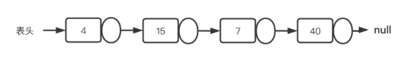

## 1.2 链表的相关概念

**节点和头节点**

在链表中 ，每个点都由值和指向下一个结点的地址组成的独立的单元，称为一个结点，有时也称为节点，含义都是一样的。

对于单链表，如果知道了第一个元素，就可以通过遍历访问整个链表，因此第一个结点最重要，一般称为头结点。

**虚拟结点**

在做题以及在工程里经常会看到虚拟结点的概念，其实就是一个结点dummyNode，其next指针指向head，也就是dummyNode.next=head。

因此，如果我们在算法里使用了虚拟结点，则要注意如果要获得head结点，或者从方法(函数)里返回的时候，则应使用dummyNode.next。

另外注意，dummyNode的val不会被使用，初始化为0或者-1等都是可以的。既然值不会使用，那虚拟结点有啥用呢？简单来说，就是为了方便我们处理首部结点，否则我们需要在代码里单独处理首部结点的问题。在链表反转里，我们会看到该方式可以大大降低解题难度。


## 1.3 **创建链表**

我们继续看如何构造链表。

首先要先理解JVM是怎么构建出链表的，我们知道JVM里有栈区和堆区，栈区主要存引用，也就是一个指向实际对象的地址，而堆区存的才是创建的对象，例如我们定义这样一个类：

````java
public class Course{
    Teacher teacher;
    Student student;
}
````

这里的teacher和student就是指向堆的引用，假如我们这样定义：

````java
public class Course{
    int val;
    Course next;
}
````

这时候next就指向了下一个同为Course类型的对象了，例如：

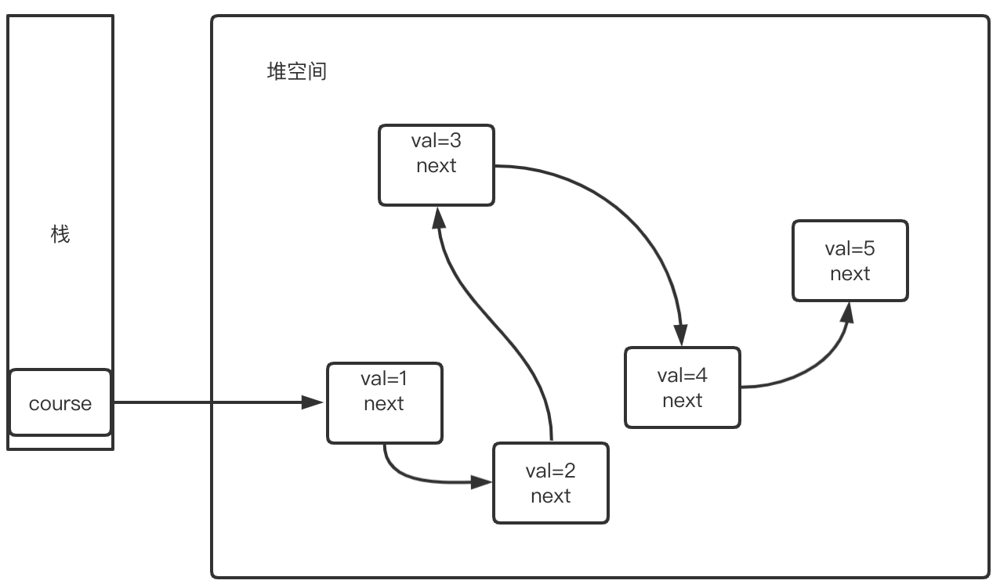

这里通过栈中的引用（也就是地址）就可以找到val(1)，然后val(1)结点又存了指向val(2)的地址，而val(3)又存了指向val(4)的地址，所以就构造出了一个链条访问结构。
在Java配套代码中BasicLink类，我们debug一下看一下从head开始next会发现是这样的：

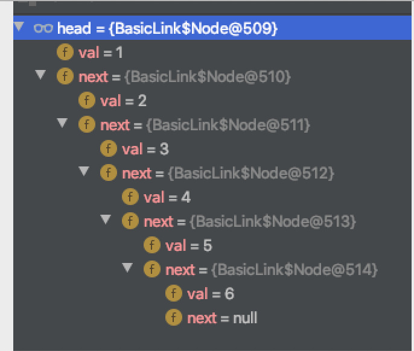

这就是一个简单的线性访问了，所以链表就是从head开始，逐个开始向后访问，而每次所访问对象的类型都是一样的。
根据面向对象的理论，在Java里规范的链表应该这么定义：

````java
public class ListNode {
    private int data;
    private ListNode next;
    public ListNode(int data) {
        this.data = data;
    }
    public int getData() {
        return data;
    }
    public void setData(int data) {
        this.data = data;
    }
    public ListNode getNext() {
        return next;
    }
    public void setNext(ListNode next) {
        this.next = next;
    }
}
````

但是在LeetCode中算法题中经常使用这样的方式来创建链表：

````java
public class ListNode {
    public int val;
    public ListNode next;

    ListNode(int x) {
        val = x;
        //这个一般作用不大，写了会更加规范
        next = null;
    }
}
ListNode listnode=new ListNode(1);
````

这里的val就是当前结点的值，next指向下一个结点。因为两个变量都是public 的，创建对象后能直接使用`listnode.val` 和 `listnode.next` 来操作，虽然违背了面向对象的设计要求，没有设计 setter 和 getter，但是上面的代码更为精简，因此在算法题目中应用广泛。


## 1.4 链表的增删改查

### 1.4.1 遍历链表

对于单链表，不管进行什么操作，一定是从头开始逐个向后访问，所以操作之后是否还能找到表头非常重要。一定要注意"狗熊掰棒子"问题，也就是只顾当前位置而将标记表头的指针丢掉了。

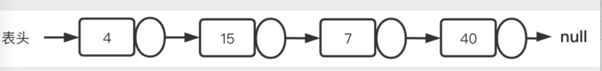

代码如下：

````java
public static int getListLength(Node head) {
int length = 0;
Node node = head;
while (node != null) {
    length++;
    node = node.next;
}
return length;
}
````


### 1.4.2 链表插入

单链表的插入，和数组的插入一样，过程不复杂，但是在编码时会发现处处是坑。==单链表的插入操作需要要考虑三种情况：首部、中部和尾部。==

**(1) 在链表的表头插入**

链表表头插入新结点非常简单，容易出错的是经常会忘了head需要重新指向表头。 我们创建一个新结点newNode，怎么连接到原来的链表上呢？执行newNode.next=head即可。之后我们要遍历新链表就要从newNode开始一路next向下了是吧，但是我们还是习惯让head来表示，所以让head=newNode就行了，如下图：

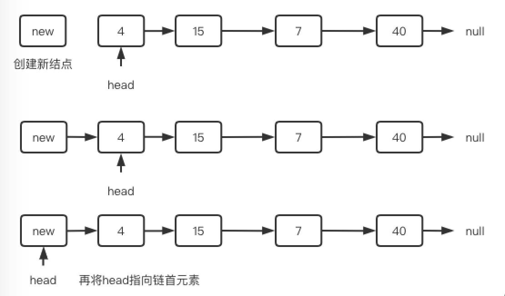


**(2) 在链表中间插入**

在中间位置插入，我们必须先遍历找到要插入的位置，然后将当前位置接入到前驱结点和后继结点之间，但是到了该位置之后我们却不能获得前驱结点了，也就无法将结点接入进来了。这就好比一边过河一边拆桥，结果自己也回不去了。
为此，我们要在目标结点的前一个位置停下来，也就是使用cur.next的值而不是cur的值来判断，这是链表最常用的策略。
例如下图中，如果要在7的前面插入，当cur.next=node(7)了就应该停下来，此时cur.val=15。然后需要给newNode前后接两根线，此时只能先让new.next=node(15).next(图中虚线)，然后node(15).next=new，而且顺序还不能错。

**想一下为什么不能颠倒顺序？**

由于每个节点都只有一个next，因此执行了node(15).next=new之后，结点15和7之间的连线就自动断开了，如下图所示：

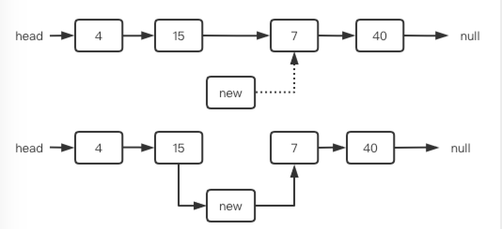


**(3)在单链表的结尾插入结点**

表尾插入就比较容易了，我们只要将尾结点指向新结点就行了。

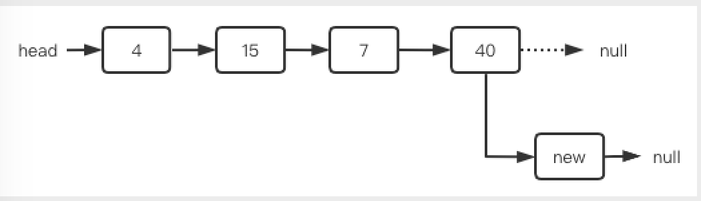


综上 ，我们写出链表插入的方法如下所示：

````java
/**
     * 链表插入
     * @param head       链表头节点
     * @param nodeInsert 待插入节点
     * @param position   待插入位置，从1开始
     * @return 插入后得到的链表头节点
     */
public static Node insertNode(Node head, Node nodeInsert, int position) {
    if (head == null) {
        //这里可以认为待插入的结点就是链表的头结点，也可以抛出不能插入的异常
        return nodeInsert;
    }
    //已经存放的元素个数
    int size = getLength(head);
    if (position > size+1  || position < 1) {
        System.out.println("位置参数越界");
        return head;
    }

    //表头插入
    if (position == 1) {
        nodeInsert.next = head;
        // 这里可以直接 return nodeInsert;还可以这么写：
        head = nodeInsert;
        return head;
    }

    Node pNode = head;
    int count = 1;
    //这里position被上面的size被限制住了，不用考虑pNode=null
    while (count < position - 1) {
        pNode = pNode.next;
        count++;
    } 
    nodeInsert.next = pNode.next;
    pNode.next = nodeInsert;

    return head;
}
````

这里需要再补充一点head = null的时候该执行什么操作呢？如果是null的话，你要插入的结点就是链表的头结点，也可以直接抛出不能插入的异常，两种处理都可以，一般来说我们更倾向前者。
如果链表是单调递增的，一般会让你将元素插入到合适的位置，序列仍然保持单调，你可以尝试写一下该如何实现。


### 1.4.3 链表删除

==删除同样分为在删除头部元素，删除中间元素和删除尾部元素。==

**(1)删除表头结点**

删除表头元素还是比较简单的，一般只要执行head=head.next就行了。如下图，将head向前移动一次之后，原来的结点不可达，会被JVM回收掉。

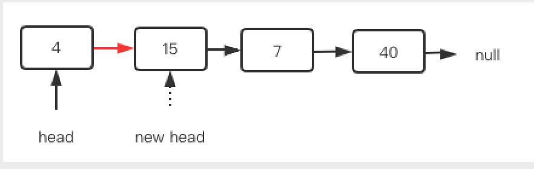


**(2)删除最后一个结点**

删除的过程不算复杂，也是找到要删除的结点的前驱结点，这里同样要在提前一个位置判断，例如下图中删除40，其前驱结点为7。遍历的时候需要判断cur.next是否为40，如果是，则只要执行cur.next=null即可，此时结点40变得不可达，最终会被JVM回收掉。

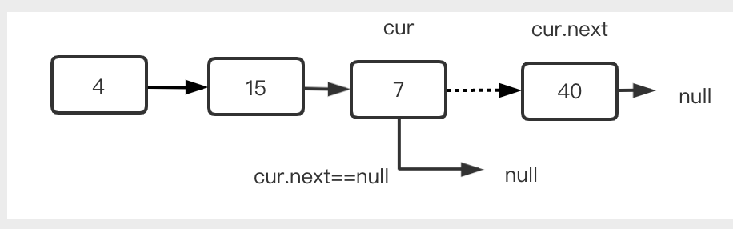


**(3)删除中间结点**

删除中间结点时，也会要用cur.next来比较，找到位置后，将cur.next指针的值更新为cur.next.next就可以解决，如下图所示：

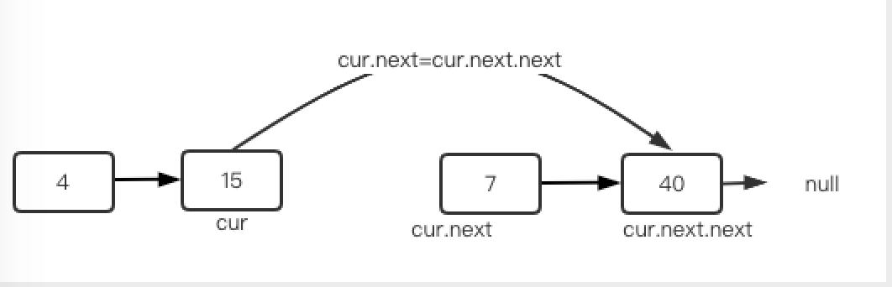


完整实现：

````java
/**
     * 删除节点
     * @param head     链表头节点
     * @param position 删除节点位置，取值从1开始
     * @return 删除后的链表头节点
     */
public static Node deleteNode(Node head, int position) {
    if (head == null) {
        return null;
    }
    int size = getListLength(head);
    //思考一下，这里为什么是size，而不是size+1
  	// 因为size从1开始，position也从1开始
    if (position > size || position <1) {
        System.out.println("输入的参数有误");
        return head;
    }
    if (position == 1) {
        //curNode就是链表的新head
        return head.next;
    } else {
        Node cur = head;
        int count = 1;

        while (count < position - 1) { //在要删除节点前一个停下
            cur = cur.next;
            count++;
        }
        Node curNode = cur.next;
        cur.next = curNode.next;
        //上面两行可以直接简化成：cur.next=cur.next.next
        //原本的cur.next就被丢弃了
    }
    return head;
}
````

同样，在很多算法中链表元素是有序的，此时如果要删除某个元素，则要先遍历链表，找到目标元素，然后再删除。


### 1.5 课后问题

1.理解Java/Python是如何构造出链表的
2.链表增加元素，首部、中间和尾部分别会有什么问题，该如何处理？
3.链表删除元素，首部、中间和尾部分别会有什么问题，该如何处理？


# 2. 白银挑战——链表高频面试算法题

> 链表的算法题比数组少很多，而在回溯贪心动规等高级算法中很少见到链表的影子。我们这里就集中研究一些出现频率特别高的算法题。

本文用到的链表的定义与LeetCode保持一致，具体内容为:

````java
class ListNode {
    public int val;
    public ListNode next;

    ListNode(int x) {
        val = x;
        next = null;
    }
}
````


## 2.1 两个链表第一个公共子节点

这是一道经典的链表问题，剑指offer52 先看一下题目：输入两个链表，找出它们的第一个公共节点。例如下面的两个链表：

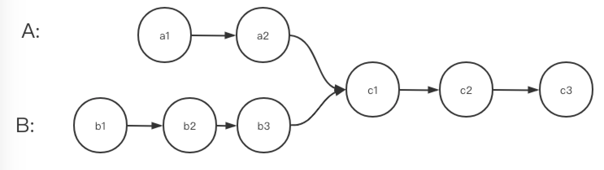

两个链表的头结点都是已知的，相交之后成为一个单链表，但是相交的位置未知，并且相交之前的结点数也是未知的，请设计算法找到两个链表的合并点。

==**分析：**==

首先我们来理解一下这个题是什么意思。思考一下下面两个图，是否都满足单链表的要求，为什么？

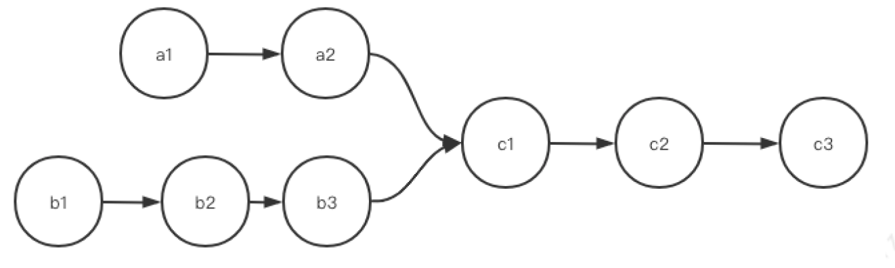

第二个图：

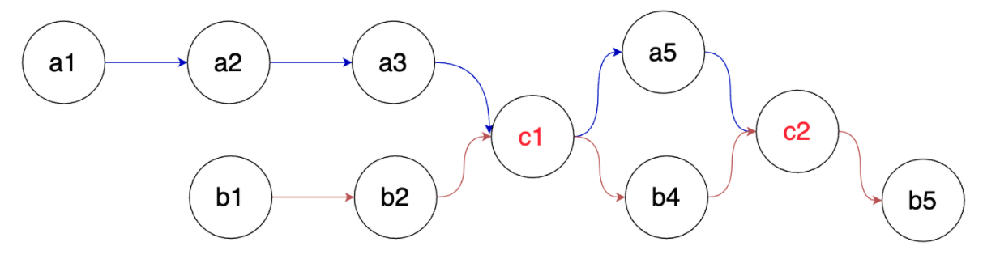

**==解析：==**

上面第一个图是满足单链表要求的，因为我们说链表要求环环相扣，核心是一个结点只能有一个后继，但不代表一个结点只能有一个被指向。第一个图中，c1被a2和b3同时指向，这是没关系的。这就好比法律倡导一夫一妻，你只能爱一个人，但是可以都多个人爱你。

==第二图就不满足要求了，因为c1有两个后继a5和b4。==

理解了题目含义之后，我们继续来看如何解决。

**没有思路时该怎么解题？**

单链表中每个节点只能指向唯一的下一个next，但是可以有多个指针指向一个节点。例如上面c1就可以被a2，b3同时指向。该怎么入手呢？如果一时想不到该怎么办呢？
告诉你一个屡试不爽的方法：**==将常用数据结构和常用算法思想都想一遍，看看哪些能解决问题。==**

==**常用的数据结构有数组、链表、队、栈、Hash、集合、树、堆。常用的算法思想有查找、排序、双指针、递归、迭代、分治、贪心、回溯和动态规划等等。**==

首先想到的是蛮力法，类似于冒泡排序的方式，将第一个链表中的每一个结点依次与第二个链表的进行比较，当出现相等的结点指针时，即为相交结点。虽然简单，但是时间复杂度高，排除！

再看Hash，先将第一个链表元素全部存到Map里，然后一边遍历第二个链表，一边检测当前元素是否在Hash中，如果两个链表有交点，那就找到了。OK，第二种方法出来了。既然Hash可以，那集合呢？和Hash一样用，也能解决，OK，第三种方法出来了。

队列和栈呢？这里用队列没啥用，但用栈呢？现将两个链表分别压到两个栈里，之后一边同时出栈，一边比较出栈元素是否一致，如果一致则说明存在相交，然后继续找，**最晚出栈**的那组一致的节点就是要找的位置，于是就有了第四种方法。

这时候可以直接和面试官说，应该可以用HashMap做，另外集合和栈应该也能解决问题。面试官很明显就会问你，怎么解决？

然后你可以继续说HashMap、集合和栈具体应该怎么解决。

假如你想错了，比如你开始说队列能，但后面发现根本解决不了，这时候直接对面试官说“队列不行，我想想其他方法”就可以了，一般对方就不会再细究了。算法面试本身也是一个相互交流的过程，如果有些地方你不清楚，他甚至会提醒你一下，所以不用紧张。

除此上面的方法，还有两种比较巧妙的方法，比较巧妙的方法我们放在第六小节看，这里我们先看两种基本的方式。

### 2.1.1 **哈希和集合**

先将一个链表元素全部存到Map里，然后一边遍历第二个链表，一边检测Hash中是否存在当前结点，如果有交点，那么一定能检测出来。 对于本题，使用集合更适合，而且代码也更简洁。思路和上面的一样，直接看代码：

````java
public ListNode findFirstCommonNodeBySet(ListNode headA, ListNode headB) {
    Set<ListNode> set = new HashSet<>();
    while (headA != null) {
        set.add(headA);
        headA = headA.next;
    }

    while (headB != null) {
        if (set.contains(headB))
            return headB;
        headB = headB.next;
    }
    return null;
}
````

由于在C语言基础包里没有定义集合类型，这里如果用集合需要先自己构建一个，或者引入外部包，更麻烦，因此这里我们不提供代码。

时间复杂度：O(m+n) ，其中 m 和 n 是分别是链表 headA 和 headB 的长度。需要遍历两个链表各一次。

空间复杂度：O(m)，其中 m 是链表 headA 的长度。需要使用哈希集合存储链表 headA 中的全部节点。

### 2.1.2 使用栈 (先进后出)

这里需要使用两个栈，分别将两个链表的结点入两个栈，然后分别出栈，如果相等就继续出栈，一直找到最晚出栈的那一组。这种方式需要两个O(n)的空间，所以在面试时不占优势，但是能够很好锻炼我们的基础能力，所以花十分钟写一个吧：

````java
import java.util.Stack;
public ListNode findFirstCommonNodeByStack(ListNode headA, ListNode headB) {
    Stack<ListNode> stackA=new Stack();
    Stack<ListNode> stackB=new Stack();
    while(headA!=null){
        stackA.push(headA);
        headA=headA.next;
    }
    while(headB!=null){
        stackB.push(headB);
        headB=headB.next;
    }

    ListNode preNode=null;
    while(stackB.size()>0 && stackA.size()>0){
        if(stackA.peek()==stackB.peek()){
            preNode=stackA.pop();
            stackB.pop();
        }else{
            break;
        }
    }
    return preNode;
}
````

由于在C语言基础包里没有提供栈类型，这里如果用集合需要先自己构建一个，或者引入外部包，更麻烦，因此这里我们不提供代码。

看到了吗，从一开始没啥思路到最后搞出三种方法，熟练掌握数据结构是多么重要！！
如果你想到了这三种方法中的两个，并且顺利手写并运行出一个来，面试基本就过了，至少面试官对你的基本功是满意的。

但是对方可能会再来一句：还有其他方式吗？或者说，有没有申请空间大小是O(1)的方法。方法是有的，解决方式需要使用到双指针的问题，我们放到本文最后一小节再看。


## 2.2 **判断链表是否为回文序列**

LeetCode234，这也是一道简单，但是很经典的链表题，判断一个链表是否为回文链表。

````java
示例1：
输入: 1->2->2->1
输出: true
进阶：你能否用 O(n) 时间复杂度和 O(1) 空间复杂度解决此题？
````

看到这个题你有几种思路解决，我们仍然是先将常见的数据结构和算法思想想一遍，看看谁能解决问题。

**方法1：**将链表元素都赋值到数组中，然后可以从数组两端向中间对比。这种方法会被视为逃避链表，面试不能这么干。

**方法2：**将链表元素全部压栈，然后一边出栈，一边重新遍历链表，一边比较两者元素值，只要有一个不相等，那就不是。

==**方法3：**优化方法2，先遍历第一遍，得到总长度。之后一边遍历链表，一边压栈。到达链表长度一半后就不再压栈，而是一边出栈，一边遍历，一边比较，只要有一个不相等，就不是回文链表。这样可以节省一半的空间。==

**方法4：**优化方法3：既然要得到长度，那还是要遍历一次链表才可以，那是不是可以一边遍历一边全部压栈，然后第二遍比较的时候，只比较一半的元素呢？也就是只有一半的元素出栈， 链表也只遍历一半，当然可以。

**方法5：**反转链表法， 先创建一个链表newList，将原始链表oldList的元素值逆序保存到newList中，然后重新一边遍历两个链表，一遍比较元素的值，只要有一个位置的元素值不一样，就不是回文链表。

**方法6：**优化方法5，我们只反转一半的元素就行了。先遍历一遍，得到总长度。然后重新遍历，到达一半的位置后不再反转，就开始比较两个链表。

**方法7：**优化方法6，我们使用双指针思想里的快慢指针 ，fast一次走两步，slow一次走一步。当fast到达表尾的时候，slow正好到达一半的位置，那么接下来可以从头开始逆序一半的元素，或者从slow开始逆序一半的元素，都可以。

**方法8：**在遍历的时候使用递归来反转一半链表可以吗？当然可以，再组合一下我们还能想出更多的方法，解决问题的思路不止这些了，此时单纯增加解法数量没啥意义了。

上面这些解法中，各有缺点，实现难度也不一样，有的甚至算不上一个独立的方法，这么想只是为了开拓思路、举一反三。我们选择最佳的两种实现，其他方法请同学自行写一下试试。

这里看一下比较基本的全部压栈的解法。
将链表元素全部压栈，然后一边出栈，一边重新遍历链表，一边比较，只要有一个不相等，那就不是回文链表了，代码：

````java
public boolean isPalindrome(ListNode head) {
ListNode temp = head;
Stack<Integer> stack = new Stack();
//把链表节点的值存放到栈中
while (temp != null) {
    stack.push(temp.val);
    temp = temp.next;
}
//之后一边出栈，一遍比较
while (head != null) {
    if (head.val != stack.pop()) {
        return false;
    }
    head = head.next;
}
return true;
}
````


## 2.3 **合并有序链表**

数组中我们研究过合并的问题，链表同样可以造出两个或者多个链表合并的问题。两者有相似的地方，也有不同的地方，你能找到分别是什么吗？

### 2.3.1 **合并两个有序链表**

LeetCode21 将两个升序链表合并为一个新的升序链表并返回，新链表是通过拼接给定的两个链表的所有节点组成的。

本题虽然不复杂，但是很多题目的基础，解决思路与数组一样，一般有两种。==一种是新建一个链表，然后分别遍历两个链表，每次都选最小的结点接到新链表上，最后排完。====另外一个就是将一个链表结点拆下来，逐个合并到另外一个对应位置上去。==这个过程本身就是链表插入和删除操作的拓展，难度不算大，这时候代码是否优美就比较重要了。先看下面这种：

````java
public ListNode mergeTwoLists (ListNode list1, ListNode list2) {
    ListNode newHead=new ListNode(-1);
    ListNode res=newHead;
    while(list1!=null||list2!=null){ 
        //情况1：都不为空的情况
        if(list1!=null&&list2!=null){
            if(list1.val<list2.val){
                newHead.next=list1;
                list1=list1.next;
            }else if(list1.val>list2.val){
                newHead.next=list2;
                list2=list2.next;
            }else{ //相等的情况，分别接两个链
                newHead.next=list2;
                list2=list2.next;
                newHead=newHead.next;
                newHead.next=list1;
                list1=list1.next;
            }
            newHead=newHead.next;
            //情况2：假如还有链表一个不为空
        }else if(list1!=null&&list2==null){
            newHead.next=list1;
            list1=list1.next;
            newHead=newHead.next;
        }else if(list1==null&&list2!=null){
            newHead.next=list2;
            list2=list2.next;
            newHead=newHead.next;
        }
    }
    return res.next; //把那个-1的节点忽略
}
````

上面这种方式能完成基本的功能，但是所有的处理都在一个大while循环里，代码过于臃肿，我们可以将其变得苗条一些：==第一个while只处理两个list 都不为空的情况，之后单独写while分别处理list1或者list2不为null的情况，==也就是这样：

````java
public  ListNode mergeTwoLists(ListNode list1, ListNode list2) {
    ListNode newHead = new ListNode(-1);
    ListNode res = newHead;
    while (list1 != null && list2 != null) { 

        if (list1.val < list2.val) {
            newHead.next = list1;
            list1 = list1.next;
        } else if (list1.val > list2.val) {
            newHead.next = list2;
            list2 = list2.next;
        } else { //相等的情况，分别接两个链
            newHead.next = list2;
            list2 = list2.next;
            newHead = newHead.next;
            newHead.next = list1;
            list1 = list1.next;
        }
        newHead = newHead.next;

    }
    //下面的两个while最多只有一个会执行
    while (list1 != null) {
        newHead.next = list1;
        list1 = list1.next;
        newHead = newHead.next;
    }
    while (list2 != null) {
        newHead.next = list2;
        list2 = list2.next;
        newHead = newHead.next;
    }

    return res.next;
}
````

==进一步分析，我们发现两个继续优化的点==，一个是上面第一个大while里有三种情况，我们可以将其合并成两个，如果两个链表存在相同元素，第一次出现时使用if (l1.val <= l2.val)来处理，后面一次则会被else处理掉，什么意思呢？我们看一个序列。

假如list1为{1, 5, 8, 12}，list2为{2, 5, 9, 13}，此时都有一个node(5)。当两个链表都到5的位置时，出现了list1.val == list2.val，此时list1中的node(5)会被合并进来。然后list1继续向前走到了node(8)，此时list2还是node(5)，因此就会执行else中的代码块。这样就可以将第一个while的代码从三种变成两种，精简了很多。

第二个优化是后面两个小的while循环，这两个while最多只有一个会执行，而且由于链表只要将链表头接好，后面的自然就接上了，因此循环都不用写，也就是这样：

````java
public ListNode mergeTwoLists(ListNode list1, ListNode list2) {
    ListNode prehead = new ListNode(-1);
    ListNode prev = prehead;
    while (list1 != null && list2 != null) {
        if (list1.val <= list2.val) {
            prev.next = list1;
            list1 = list1.next;
        } else {
            prev.next = list2;
            list2 = list2.next;
        }
        prev = prev.next;
    }
    // 最多只有一个还未被合并完，直接接上去就行了,这是链表合并比数组合并方便的地方
    prev.next = list1 == null ? list2 : list1;
    return prehead.next;
}
````


==此外还可以通过递归解决该问题：==

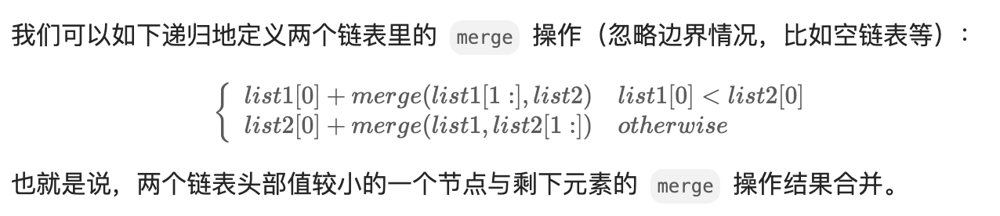

````java
class Solution {
    public ListNode mergeTwoLists(ListNode l1, ListNode l2) {
        if (l1 == null) {
            return l2;
        } else if (l2 == null) {
            return l1;
        } else if (l1.val < l2.val) {
            l1.next = mergeTwoLists(l1.next, l2);
            return l1;
        } else {
            l2.next = mergeTwoLists(l1, l2.next);
            return l2;
        }
    }
}
````


### 2.3.2 **合并K个链表**

合并k个链表，有多种方式，例如堆、归并等等。如果面试遇到，==我倾向先将前两个合并，之后再将后面的逐步合并进来==，这样的的好处是只要将两个合并的写清楚，合并K个就容易很多，现场写最稳妥：

````java
public ListNode mergeTwoLists(ListNode l1, ListNode l2) {
        if (l1 == null) {
            return l2;
        } else if (l2 == null) {
            return l1;
        } else if (l1.val < l2.val) {
            l1.next = mergeTwoLists(l1.next, l2);
            return l1;
        } else {
            l2.next = mergeTwoLists(l1, l2.next);
            return l2;
        }
    }

public ListNode mergeKLists(ListNode[] lists) {
    ListNode res = null;
    for (ListNode list: lists) {
        res = mergeTwoLists(res, list);
    }
    return res;
}
````

==优化成递归归并：==

````java
public ListNode mergeTwoLists(ListNode l1, ListNode l2) {
    if (l1 == null) {
        return l2;
    } else if (l2 == null) {
        return l1;
    } else if (l1.val < l2.val) {
        l1.next = mergeTwoLists(l1.next, l2);
        return l1;
    } else {
        l2.next = mergeTwoLists(l1, l2.next);
        return l2;
    }
}

public ListNode mergeKLists(ListNode[] lists) {
    if (lists.length == 0) {
        return null;
    }
    return merge(lists, 0, lists.length - 1);
}

public ListNode merge(ListNode[] lists, int left, int right) {
    if (left == right) {
        return lists[left];
    }

    int mid = (left + right) / 2;
    ListNode l1 = merge(lists, left, mid);
    ListNode l2 = merge(lists, mid + 1, right);
    return mergeTwoLists(l1 ,l2);
}
````

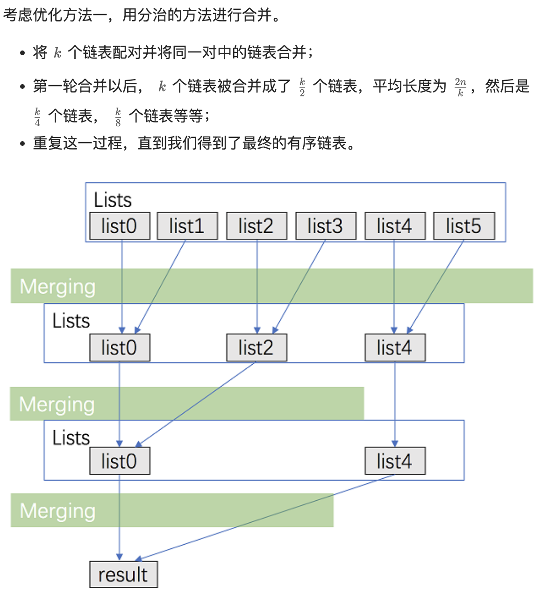

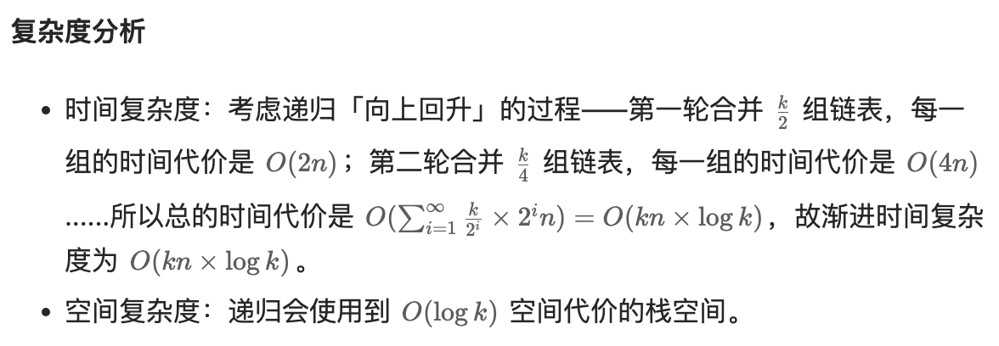

==方法三：使用优先队列合并==
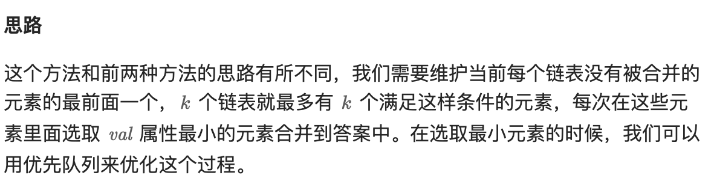  

````java
public ListNode mergeKLists(ListNode[] lists) {
        Queue<ListNode> pq = new PriorityQueue<>((v1, v2) -> v1.val - v2.val);
        for (ListNode node: lists) {
            if (node != null) {
                pq.offer(node);
            }
        }

        ListNode dummyHead = new ListNode(0);
        ListNode tail = dummyHead;
        while (!pq.isEmpty()) {
            ListNode minNode = pq.poll();
            tail.next = minNode;
            tail = tail.next;
            if (minNode.next != null) {
                pq.offer(minNode.next);
            }
        }

        return dummyHead.next;
    }
````

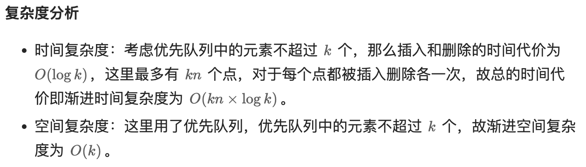


### 2.3.3 合并两个链表

LeetCode1669：给你两个链表 list1 和 list2 ，它们包含的元素分别为 n 个和 m 个。请你将 list1 中下标从a到b的节点删除，并将list2 接在被删除节点的位置。

1669题的意思就是将list1中的[a,b]区间的删掉，然后将list2接进去，如下图所示：

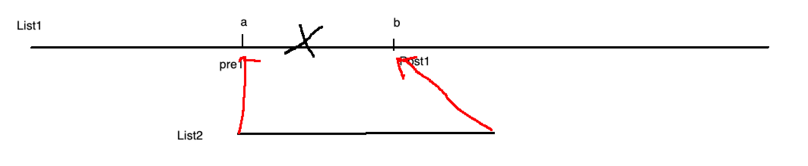

````java
public ListNode mergeInBetween(ListNode list1, int a, int b, ListNode list2) {
      ListNode dummyA = list1;
      for(int i = 0; i < a - 1; i++){
          dummyA = dummyA.next;
      }

      ListNode dummyB = dummyA;
      for(int i = 0; i < b - a + 1 + 1; i++){
          dummyB = dummyB.next;
      }

      dummyA.next = list2;
      while(list2.next != null){
          list2 = list2.next;
      }

      list2.next = dummyB;

      return list1;
  }
````


## 2.4 双指针专题

在数组里我们介绍过双指针的思想， 可以简单有效的解决很多问题，而所谓的双指针只不过是两个变量而已。在链表中同样可以使用双指针来轻松解决一部分算法问题。这类题目的整体难度不大，但是在面试中出现的频率很高，我们集中看一下。

### 2.4.1 寻找中间节点

LeetCode876 给定一个头结点为 head 的非空单链表，返回链表的中间结点。如果有两个中间结点，则返回第二个中间结点。

````text
示例1
输入：[1,2,3,4,5]
输出：此列表中的结点 3

示例2：
输入：[1,2,3,4,5,6]
输出：此列表中的结点 4
````

==这个问题用经典的快慢指针可以轻松搞定==，用两个指针 slow 与 fast 一起遍历链表。slow 一次走一步，fast 一次走两步。那么当 fast 到达链表的末尾时，slow 必然位于中间。

这里还有个问题，就是偶数的时候该返回哪个，例如上面示例2返回的是4， 而3貌似也可以，那该使用哪个呢？如果我们使用标准的快慢指针就是后面的4，而在很多数组问题中会是前面的3，那只需要让 fast 先走一步就可以了。

````java
public ListNode middleNode(ListNode head) {
    ListNode slow = head, fast = head;
    while (fast != null && fast.next != null) {
        slow = slow.next;
        fast = fast.next.next;
    }
    return slow;
}
````


### 2.4.2 **寻找倒数第K个元素**

这也是经典的快慢双指针问题，先看要求：

````text
输入一个链表，输出该链表中倒数第k个节点。本题从1开始计数，即链表的尾节点是倒数第1个节点。
示例
给定一个链表: 1->2->3->4->5, 和 k = 2.
返回链表 4->5.
````

==这里也可以使用快慢双指针==，我们先将fast 向后遍历到第 k+1 个节点， slow仍然指向链表的第一个节点，此时指针fast 与slow 二者之间刚好相距 k 个节点。之后两个指针同步向后走，当 fast 走到链表的尾部空节点时，slow 指针刚好指向链表的倒数第k个节点。

这里需要特别注意的是**链表的长度可能小于k**，寻找k位置的时候必须判断fast是否为null，这是本题的关键问题之一，最终代码如下：

````java
public ListNode getKthFromEnd(ListNode head, int k) {
    ListNode fast = head;
    ListNode slow = head;
    while (fast != null && k > 0) {
        fast = fast.next;
        k--;
    }
    while (fast != null) {
        fast = fast.next;
        slow = slow.next;
    }
    return slow;
}
````


### 2.4.3 **旋转链表**

Leetcode61.先看题目要求：给你一个链表的头节点 head ，旋转链表，将链表每个节点向右移动 k 个位置。

````texg
示例1:
输入：head = [1,2,3, 4,5], k = 2

输出：[4,5,1,2,3]
````

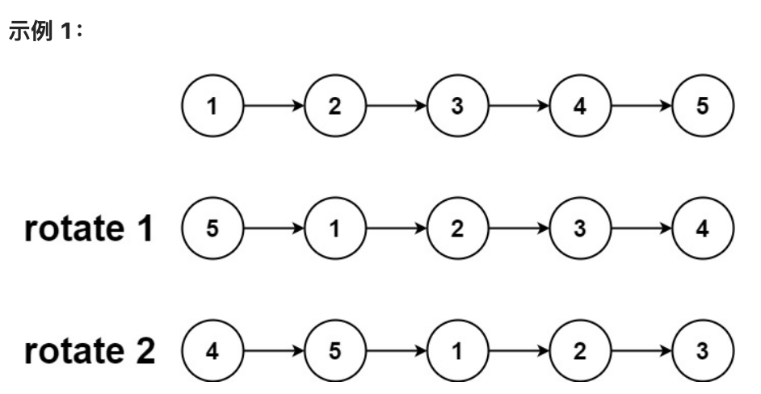

这个题有多种解决思路，首先想到的是根据题目要求硬写，但是这样比较麻烦，也容易错。这个题是否在数组里见过类似情况？

观察链表调整前后的结构，我们可以发现从旋转位置开始，链表被分成了两条，例如上面的{1,2,3}和{4,5}，这里我们可以参考上一题的倒数K的思路，找到这个位置，然后将两个链表调整一下重新接起来就行了。具体怎么调整呢？脑子里瞬间想到两种思路：

==第一种是将整个链表反转变成{5,4,3,2,1}，==然后再将前K和N-K两个部分分别反转，也就是分别变成了{4,5}和{1,2,3},这样就轻松解决了。这个在后面学习了链表反转之后，请读者自行解决。

==第二种思路就是先用双指针策略找到倒数K的位置，==也就是{1,2,3}和{4,5}两个序列，之后再将两个链表拼接成{4,5,1,2,3}就行了。具体思路是：

因为k有可能大于链表长度，所以首先获取一下链表长度len，如果然后k=k % len，如果k == 0，则不用旋转，直接返回头结点。否则：

1.快指针先走k步。
2.慢指针和快指针一起走。
3.快指针走到链表尾部时，慢指针所在位置刚好是要断开的地方。把快指针指向的节点连到原链表头部，慢指针指向的节点断开和下一节点的联系。
4.返回结束时慢指针指向节点的下一节点。

==第三种思路：闭合为环==

我们可以先将给定的链表连接成环，然后将指定位置断开。

具体代码中，我们首先计算出链表的长度 n，并找到该链表的末尾节点，将其与头节点相连。这样就得到了闭合为环的链表。然后我们找到新链表的最后一个节点（即原链表的第 (n−1) − (k  % n)个节点），将当前闭合为环的链表断开，即可得到我们所需要的结果。

特别地，当链表长度不大于 1，或者 k 为 n 的倍数时，新链表将与原链表相同，我们无需进行任何处理。

````java
public ListNode rotateRight(ListNode head, int k) {
    if(head == null || k == 0){
        return head;
    }
    //这里三个变量都指向链表头结点
    ListNode temp = head;
    ListNode fast = head;
    ListNode slow = head;
    int len = 0;
    //这里head先走一遍，统计出链表的元素个数，完成之后head就变成null了
    while(head != null){
        head = head.next;
        len++;
    }
    if(k % len == 0){
        return temp;
    }
    // 从这里开始fast从头结点开始向后走
    //这里使用取模，是为了防止k大于len的情况
    //例如，如果len=5，那么k=2和7，效果是一样的 
    while((k % len) > 0){
        k--;
        fast = fast.next;
    }
    // 快指针走了k步了，然后快慢指针一起向后执行
    // 当fast到尾结点的时候，slow刚好在倒数第K个位置上
    while(fast.next != null){
        fast = fast.next;
        slow = slow.next;
    }
    ListNode res = slow.next;
    slow.next = null;
    fast.next = temp;
    return res;
}
````


## 2.5 删除链表元素专题

如果按照LeetCode顺序一道道刷题，会感觉毫无章法而且很慢，但是将相似类型放在一起，瞬间就发现不过就是在改改条件不断造题。我们前面已经多次见证这个情况，现在集中看一下与链表删除相关的问题。如果在链表中删除元素搞清楚了，一下子就搞定8道题，是不是很爽？

●LeetCode 237：删除某个链表中给定的（非末尾）节点。传入函数的唯一参数为要被删除的节点 。

●LeetCode 203：给你一个链表的头节点 head 和一个整数 val ，请你删除链表中所有满足 Node.val == val 的节点，并返回新的头节点 。

●LeetCode 19. 删除链表的倒数第 N 个节点。

●LeetCode 1474. 删除链表 M 个节点之后的 N 个节点。

●LeetCode 83 存在一个按升序排列的链表，请你删除所有重复的元素，使每个元素只出现一次。

●LeetCode 82 存在一个按升序排列的链表，请你删除链表中所有存在数字重复情况的节点，只保留原始链表中没有重复出现的数字。

我们在链表基本操作部分介绍了删除的方法，至少需要考虑删除头部，删除尾部和中间位置三种情况的处理。而上面这些题目就是这个删除操作的进一步拓展。


### 2.5.1 **删除特定结点**

先看一个简单的问题，LeetCode 203：给你一个链表的头节点 head 和一个整数 val ，请你删除链表中所有满足 Node.val == val 的节点，并返回新的头节点 。

````java
示例1：
输入：head = [1,2,6,3,4,5,6], val = 6
输出：[1,2,3,4,5]
````

我们前面说过，我们删除节点cur时，必须知道其前驱pre节点和后继next节点，然后让pre.next=next。这时候cur就脱离链表了，cur节点会在某个时刻被gc回收掉。

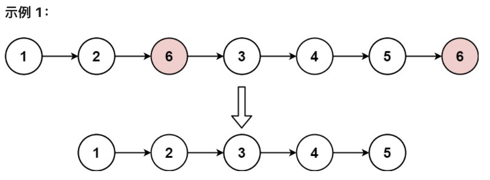

对于删除，我们注意到首元素的处理方式与后面的不一样。==为此，我们可以先创建一个虚拟节点 dummyHead，使其指向head，也就是dummyHead.next=head，这样就不用单独处理首节点了。==
完整的步骤是：

● 1. 我们创建一个虚拟链表头dummyHead，使其next指向head。

● 2. 开始循环链表寻找目标元素，注意这里是通过cur.next.val来判断的。

● 3. 如果找到目标元素，就使用cur.next = cur.next.next;来删除。

● 4. 注意最后返回的时候要用dummyHead.next，而不是dummyHead。

代码实现过程：

````java
public ListNode removeElements(ListNode head, int val) {
    ListNode dummyHead = new ListNode(0);
    dummyHead.next = head;
    ListNode cur = dummyHead;
    while (cur.next != null) {
        if (cur.next.val == val) {
            cur.next = cur.next.next;
        } else {
            cur = cur.next;
        }
    }
    return dummyHead.next;
}
````

我们继续看下面这两个题，其实就是一个题：

LeetCode 19. 删除链表的倒数第 N 个节点

LeetCode 1474. 删除链表 M 个节点之后的 N 个节点。

既然要删除倒数第N个节点，那一定要先找到倒数第N个节点，前面已经介绍过，而这里不过是找到之后再将其删除。


### 2.5.2 **删除倒数第n个结点**

LeetCode19题要求：给你一个链表，删除链表的倒数第n个结点，并且返回链表的头结点。进阶：你能尝试使用一趟扫描实现吗？

````java
示例1：
输入：head = [1,2,3,4,5], n = 2
输出：[1,2,3,5]
````

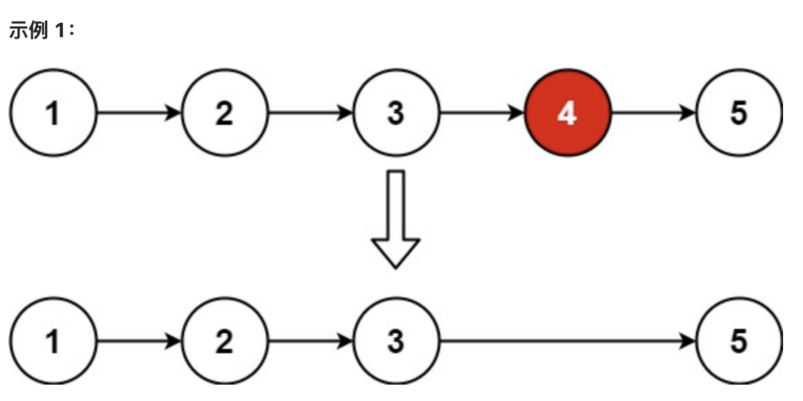

我们前面说过，遇到一个题目可以先在脑子里快速过一下常用的数据结构和算法思想，看看哪些看上去能解决问题。为了开拓思维，我们看看能怎么做：

第一种方法：先遍历一遍链表，找到链表总长度L，然后重新遍历，位置L-N+1的元素就是我们要删的。 

第二种方法：貌似栈可以，先将元素全部压栈，然后弹出第N个的时候就是我们要的是不？OK，又搞定一种方法。

第三种方法：我们前面提到可以使用双指针 来寻找倒数第K，那这里同样可以用来寻找要删除的问题。
上面三种方法，第一种比较常规，第二种方法需要开辟一个O(n)的空间，还要考虑栈与链表的操作等，不中看也不中用。第三种方法一次遍历就行，用双指针也有逼格。接下来我们详细看一下第一和三两种。

==方法1：计算链表长度==

首先从头节点开始对链表进行一次遍历，得到链表的长度 L。随后我们再从头节点开始对链表进行一次遍历，当遍历到第L−n+1 个节点时，它就是我们需要删除的节点。代码如下：

````java
public ListNode removeNthFromEnd(ListNode head, int n) {
    ListNode dummy = new ListNode(0);
    dummy.next=head;
    int length = getLength(head);
    ListNode cur = dummy;
    for (int i = 1; i < length - n + 1; ++i) {
        cur = cur.next;
    }
    cur.next = cur.next.next;
    ListNode ans = dummy.next;
    return ans;
}

public int getLength(ListNode head) {
    int length = 0;
    while (head != null) {
        ++length;
        head = head.next;
    }
    return length;
}
````


==方法2： 双指针==
我们定义first和second两个指针，first先走N步，然后second再开始走，当first走到队尾的时候，second就是我们要的节点。代码如下：

````java
public ListNode removeNthFromEnd(ListNode head, int n) {
    ListNode dummy = new ListNode(0);
    dummy.next=head;
    ListNode first = head;
    ListNode second = dummy;
    for (int i = 0; i < n; ++i) {
        first = first.next;
    }
    while (first != null) {
        first = first.next;
        second = second.next;
    }
    second.next = second.next.next;
    ListNode ans = dummy.next;
    return ans;
}
````


### 2.5.3 **删除重复元素**

我们继续看关于结点删除的题：

LeetCode 83 存在一个按升序排列的链表，请你删除所有重复的元素，使每个元素只出现一次。

LeetCode 82 存在一个按升序排列的链表，请你删除链表中所有存在数字重复情况的节点，只保留原始链表中没有重复出现的数字。

两个题其实是一个，区别就是一个要将出现重复的保留一个，一个是只要重复都不要了，处理起来略有差别。LeetCode 1836是在82的基础上将链表改成无序的了，难度要增加不少，感兴趣的同学请自己研究一下。

 **83 重复元素保留一个**

LeetCode83 存在一个按升序排列的链表，给你这个链表的头节点 head ，请你删除所有重复的元素，使每个元素只出现一次 。返回同样按升序排列的结果链表。

````java
示例1：
输入：head = [1,1,2,3,3]
输出：[1,2,3]
````

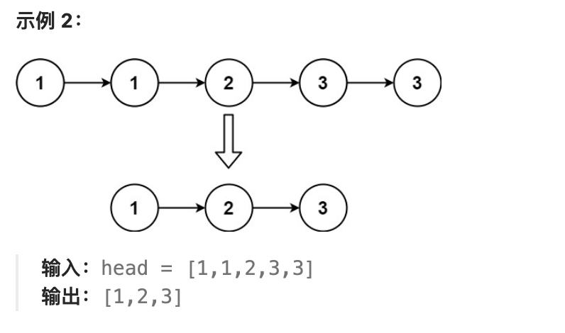

由于给定的链表是排好序的，因此==重复的元素在链表中出现的位置是连续的，因此我们只需要对链表进行一次遍历，就可以删除重复的元素。==具体地，我们从指针 cur 指向链表的头节点，随后开始对链表进行遍历。如果当前 cur 与cur.next 对应的元素相同，那么我们就将cur.next 从链表中移除；否则说明链表中已经不存在其它与cur 对应的元素相同的节点，因此可以将 cur 指向 cur.next。当遍历完整个链表之后，我们返回链表的头节点即可。
另外要注意的是 当我们遍历到链表的最后一个节点时，cur.next 为空节点，此时要加以判断，上代码：

````java
public ListNode deleteDuplicates(ListNode head) {
  if (head == null) {
    return head;
  }
  ListNode cur = head;
  while (cur.next != null) {
    if (cur.val == cur.next.val) {
      cur.next = cur.next.next;
    } else {
      cur = cur.next;
    }
  }
  return head;
}
````

**82 重复元素都不要**

LeetCode82：这个题目的要求与83的区别仅仅是重复的元素都不要了。例如：

````java
示例1：
输入：head = [1,2,3,3,4,4,5]
输出：[1,2,5]
````

当一个都不要时，链表只要直接对cur.next 以及 cur.next.next 两个node进行比较就行了，这里要注意两个node可能为空，稍加判断就行了。==而且要先判断next再判断next.next。==

````java
public ListNode deleteDuplicates(ListNode head) {
    if (head == null) {
        return head;
    }
    
    ListNode dummy = new ListNode(0, head);
    
    ListNode cur = dummy;
    while (cur.next != null && cur.next.next != null) {
        if (cur.next.val == cur.next.next.val) {
            int x = cur.next.val;
            while (cur.next != null && cur.next.val == x) {
                cur.next = cur.next.next;
            }
        } else {
            cur = cur.next;
        }
    }
    return dummy.next;
}
````


## 2.6 再论第一个公共子节点问题

在我们第一题寻找公共子节点部分，我们看到使用Hash或者栈是可以解决问题的， 但是这样可能只能得80分，因为这不一定是面试官想要的答案，为什么呢？因为不管你使用栈还是集合都需要开辟一个O(n)的空间，那如果只使用一两个变量能否解决问题呢？

可以的，这里我们就看一下另外两种解决方式。


### 2.6.1 **拼接两个字符串**

先看下面的链表A和B：

A: 0-1-2-3-4-5 

B: a-b-4-5 

如果分别拼接成AB和BA会怎么样呢？

AB：0-1-2-3-4-5-a-b-4-5

BA：a-b-4-5-0-1-2-3-4-5

==我们发现拼接后从最后的4开始，两个链表是一样的了，自然4就是要找的节点，所以可以通过拼接的方式来寻找交点。==这么做的道理是什么呢？我们可以从几何的角度来分析。我们假定A和B有相交的位置，以交点为中心，可以将两个链表分别分为left_a和right_a，left_b和right_b这样四个部分，并且right_a和right_b是一样的，这时候我们拼接AB和BA就是这样的结构：

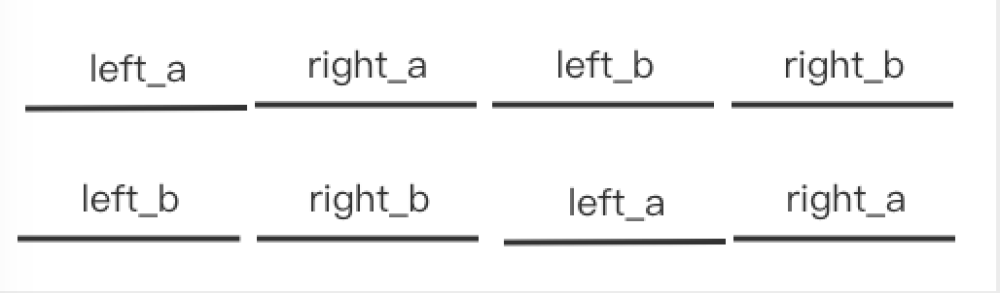

我们说right_a和right_b是一样的，那这时候分别遍历AB和BA是不是从某个位置开始恰好就找到了相交的点了？

这里还可以进一步优化，如果建立新的链表太浪费空间了，==我们只要在每个链表访问完了之后，调整到一下链表的表头继续遍历就行了，于是代码就出来了：==

==这里很多人会对为什么循环体里if(p1!=p2)这个 判断有什么作用，简单来说，如果序列不存在交集的时候陷入死循环，例如 list1是1 2 3，list2是4 5 ，很明显，如果不加判断，list1和list2会不断循环，出不来。==

````java
if(pHead1==null || pHead2==null){
        return null;
    }
    ListNode p1=pHead1;
    ListNode p2=pHead2;
    while(p1!=p2){
        p1=p1.next;
        p2=p2.next;
        if(p1!=p2){ // 在null == null 时，也就是拼接的链表也走完时退出
            //一个链表访问完了就跳到另外一个链表继续访问
            if(p1==null){
                p1=pHead2;
            }
            if(p2==null){
                p2=pHead1;
            }
        }
    }
    return p1;
}
````


### 2.6.2 **差和双指针**

==我们再看另一个使用差和双指针来解决问题的方法。假如公共子节点一定存在第一轮遍历，假设La长度为L1，Lb长度为L2.则｜L2-L1｜就是两个的差值。第二轮遍历，长的先走｜L2-L1｜,然后两个链表同时向前走，结点一样的时候就是公共结点了。==

````java
public ListNode findFirstCommonNode(ListNode pHead1, ListNode pHead2) {
    if(pHead1==null || pHead2==null){
        return null;
    }
    ListNode current1=pHead1;
    ListNode current2=pHead2;
    int l1=0,l2=0;
    //分别统计两个链表的长度
    while(current1!=null){
        current1=current1.next;
        l1++;
    }

    while(current2!=null){
        current2=current2.next;
        l2++;
    }
    current1=pHead1;
    current2=pHead2;
    int sub=l1>l2?l1-l2:l2-l1;
    //长的先走sub步
    if(l1>l2){
        int a=0;
        while(a<sub){
            current1=current1.next;
            a++;
        }   
    }

    if(l1<l2){
        int a=0;
        while(a<sub){
            current2=current2.next;
            a++;
        }   
    }
    //同时遍历两个链表
    while(current2!=current1){
        current2=current2.next;
        current1=current1.next;
    } 

    return current1;
}
````


