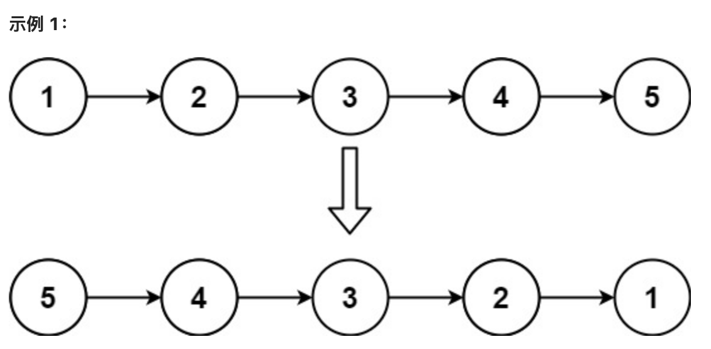
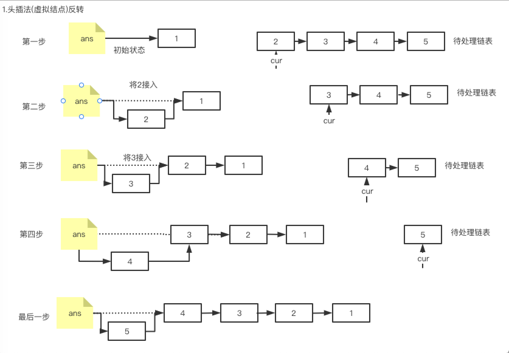
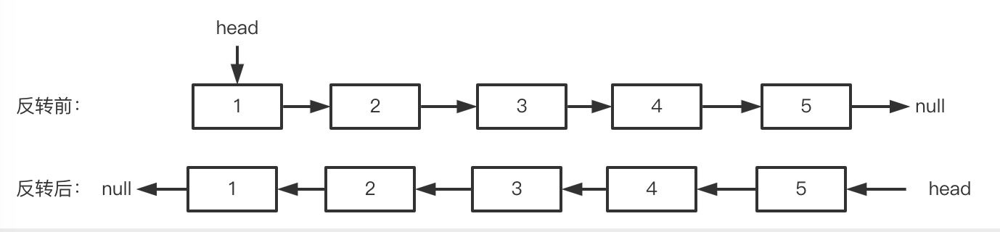
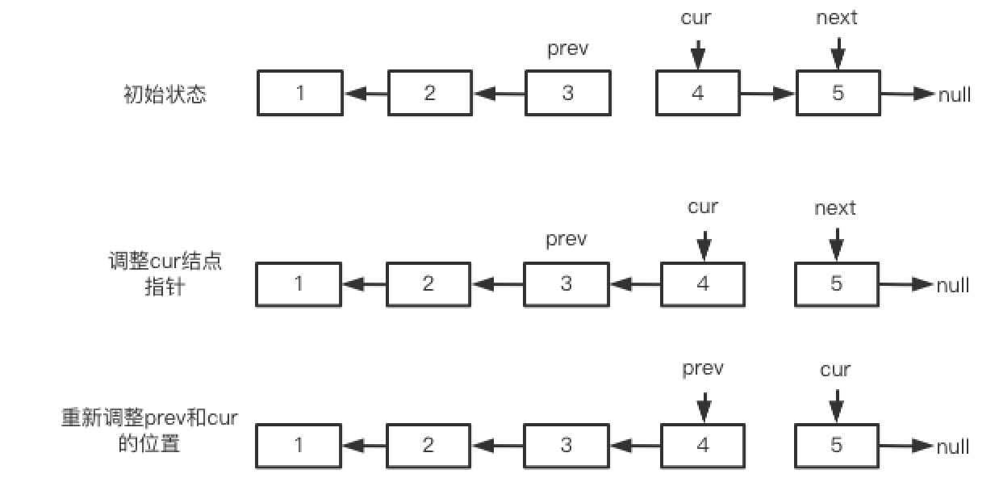
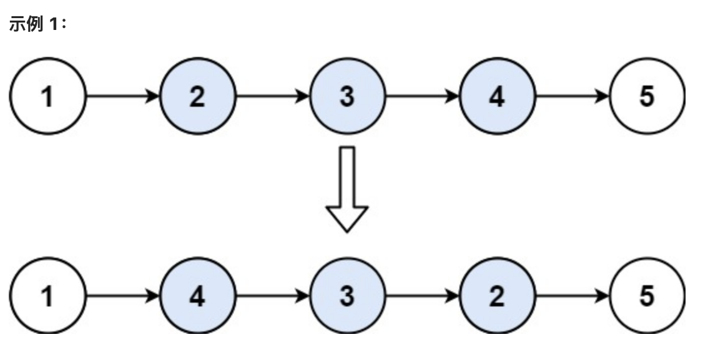
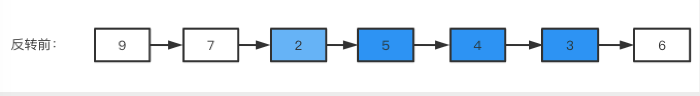
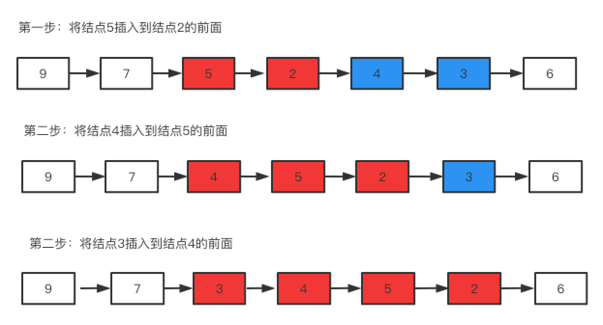
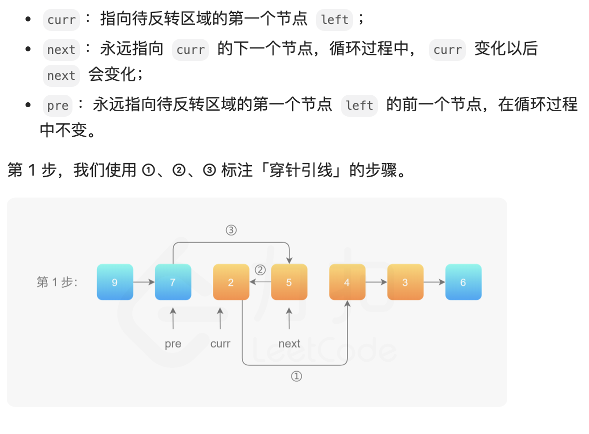
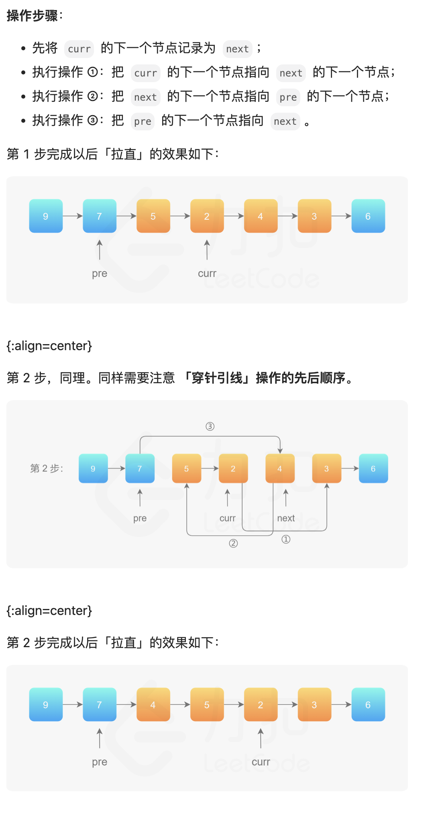
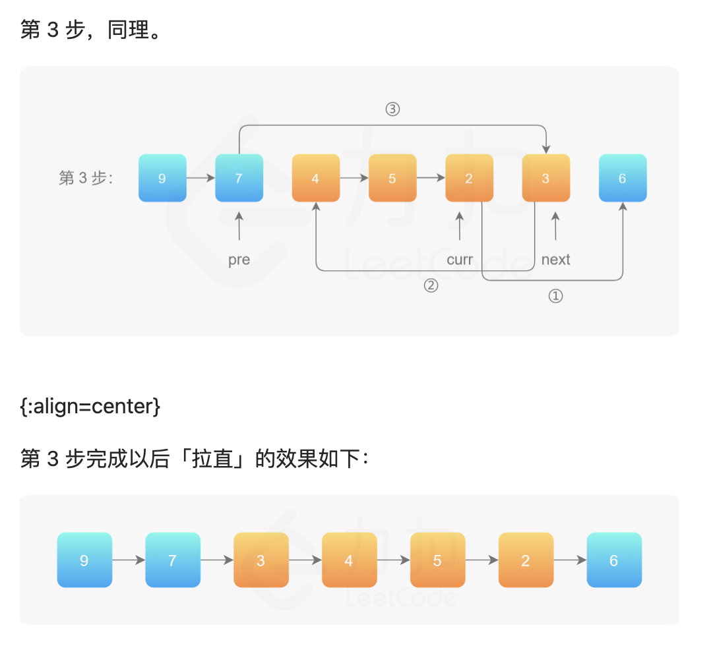

# 1.青铜挑战—**手写链表反转**

> 链表反转是一个出现频率特别高的算法题，老师过去这些年面试，至少遇到过七八次。其中更夸张的是曾经两天写了三次，上午YY，下午金山云，第二天快手。链表反转在各大高频题排名网站也长期占领前三。比如牛客网上这个No1 好像已经很久了。所以链表反转是我们学习链表最重要的问题，没有之一。

为什么反转这么重要呢？==因为反转链表涉及结点的增加、删除等多种操作，能非常有效考察思维能力和代码驾驭能力。==另外很多题目也都要用它来做基础， 例如指定区间反转、链表K个一组翻转。还有一些在内部的某个过程用到了反转，例如两个链表生成相加链表。还有一种是链表排序的，也是需要移动元素之间的指针，难度与此差不多。因为太重要，所以我们用一章专门研究这个题目。


LeetCode206 给你单链表的头节点 head，请你反转链表，并返回反转后的链表。

````java
示例1：
输入：head = [1,2,3,4,5]
输出：[5,4,3,2,1]
````



本题有两种方法，带头结点和不带头结点，我们都应该会，因为这两种方式都很重要，如果搞清楚，很多链表的算法题就不用做了。


## 1.1 **建立虚拟头结点辅助反转**

前面分析链表插入元素的时候，会发现如何处理头结点是个比较麻烦的问题，为此可以先建立一个虚拟的结点ans，并且令ans.next=head，这样可以很好的简化我们的操作。如下图所示，如果我们将链表{1->2->3->4->5}进行反转，我们首先建立虚拟结点ans，并令ans.next=node(1)，接下来我们每次从旧的链表拆下来一个结点接到ans后面，然后将其他线调整好就可以了。



如上图所示，我们完成最后一步之后，只要返回ans.next就得到反转的链表了，代码如下：

````java
public static ListNode reverseList(ListNode head) {
    ListNode ans = new ListNode(-1);
    ListNode cur = head;
    while (cur != null) {
        ListNode next = cur.next;
        cur.next = ans.next;
        ans.next = cur;
        cur = next;
    }
    return ans.next;
}
````


## 1.2 **直接操作链表实现反转**

上面的方式虽然好理解应用也广，但是可能会被面试官禁止，为啥？原因是不借助虚拟结点的方式更难，更能考察面试者的能力。

我们观察一下反转前后的结构和指针位置：



我们再看一下执行期间的过程示意图，在图中，cur本来指向旧链表的首结点，pre表示已经调整好的新链表的表头，next是下一个要调整的。注意图中箭头方向，cur和pre是两个表的表头，移动过程中cur经过一次中间状态之后，又重新变成了两个链表的表头。



理解这个图就够了，直接看代码：

````java
public ListNode reverseList(ListNode head ) {
    ListNode prev = null;
    ListNode curr = head;
    while (curr != null) {
        ListNode next = curr.next;
        curr.next = prev;
        prev = curr;
        curr = next;
    }
    return prev;
}
````

==将上面这段代码在理解的基础上背下来，是的，因为这个算法太重要==


## 1.3 **递归实现反转**

上面我们讲解了链表反转的两种方法，带虚拟头结点方法是很多底层源码使用的，而不使用带头结点的方法是面试经常要考的，所以两种方式我们都要好好掌握。

另外这种带与不带头结点的方式，在接下来的指定区间、K个一组反转也采用了，只不过为了便于理解 ，我们将其改成了==“头插法”和“穿针引线法”。==

拓展 通过递归来实现反转，链表反转还有第三种常见的方式，使用递归来实现，这里不做重点，感兴趣的同学可以研究一下：

````java
public ListNode reverseList(ListNode head) {
         // 寻找递归终止条件
        // 1、head 指向的结点为 null 
        // 2、head 指向的结点的下一个结点为 null 
        // 在这两种情况下，反转之后的结果还是它自己本身
        if( head == null || head.next == null)  return head;

        // 不断的通过递归调用，直到无法递归下去，递归的最小粒度是在最后一个节点
        // 因为到最后一个节点的时候，由于当前节点 head 的 next 节点是空，所以会直接返回 head
        ListNode cur = reverseList(head.next);

        // 比如原链表为 1 --> 2 --> 3 --> 4 --> 5
        // 第一次执行下面代码的时候，head 为 4，那么 head.next = 5
        // 那么 head.next.next 就是 5.next ，意思就是去设置 5 的下一个节点
        // 等号右侧为 head，意思就是设置 5 的下一个节点是 4

        // 这里出现了两个 next
        // 第一个 next 是「获取」 head 的下一节点
        // 第二个 next 是「设置」 当前节点的下一节点为等号右侧的值
        head.next.next = head;


        // head 原来的下一节点指向自己，所以 head 自己本身就不能再指向原来的下一节点了
        // 否则会发生无限循环
        head.next = null;

        // 我们把每次反转后的结果传递给上一层
        return cur;

    }
````


# **2.白银挑战——链表反转的拓展问题**

## 2.1 **指定区间反转**

LeetCode92 ：给你单链表的头指针 head 和两个整数 left 和 right ，其中 left <= right。请你反转从位置 left 到位置 right 的链表节点，返回反转后的链表。

````java
示例 1：
输入：head = [1,2,3,4,5], left = 2, right = 4
输出：[1,4,3,2,5]
````



这里的处理方式也有多种，甚至给个名字都有点困难，干脆就分别叫穿针引线法和头插法吧。穿针引线本质上就是不带有节点的方式来实现反转，而头插法本质上就是带头结点的反转。

### 2.1.1 **头插法**

方法一的缺点是：如果 left 和 right 的区域很大，恰好是链表的头节点和尾节点时，找到 left 和 right 需要遍历一次，反转它们之间的链表还需要遍历一次，虽然总的时间复杂度为 O(N)，但遍历了链表 2次，可不可以只遍历一次呢？答案是可以的。我们依然画图进行说明，我们仍然以方法一的序列为例进行说明。



==反转的整体思想是，在需要反转的区间里，每遍历到一个节点，让这个新节点来到反转部分的起始位置。==下面的图展示了整个流程。







这个过程就是前面的带虚拟结点的插入操作，每走一步都要考虑各种指针怎么指，既要将结点摘下来接到对应的位置上，还要保证后续结点能够找到，请读者务必画图看一看，想一想到底该怎么调整。代码如下：

````java
public ListNode reverseBetween(ListNode head, int left, int right) {
    // 设置 dummyNode 是这一类问题的一般做法
    ListNode dummyNode = new ListNode(-1);
    dummyNode.next = head;
    ListNode pre = dummyNode;
    for (int i = 0; i < left - 1; i++) {
        pre = pre.next;
    }
    ListNode cur = pre.next;
    ListNode next;
    for (int i = 0; i < right - left; i++) {
        next = cur.next;
        cur.next = next.next;
        next.next = pre.next;
        pre.next = next;
    }
    return dummyNode.next;
}
````


