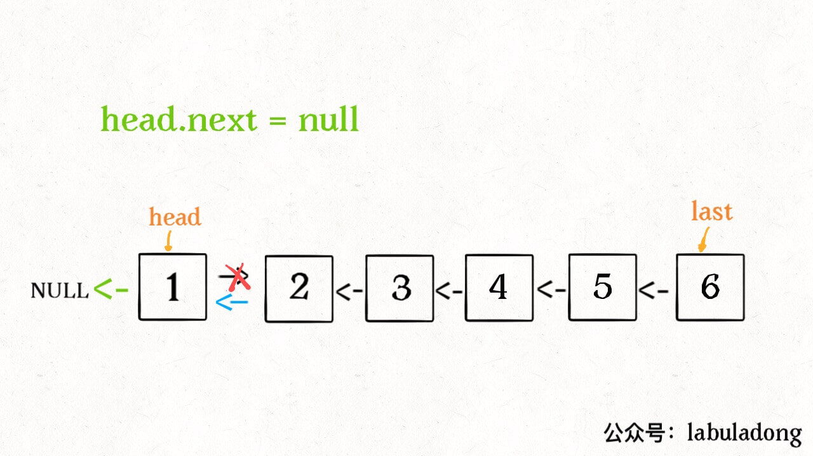
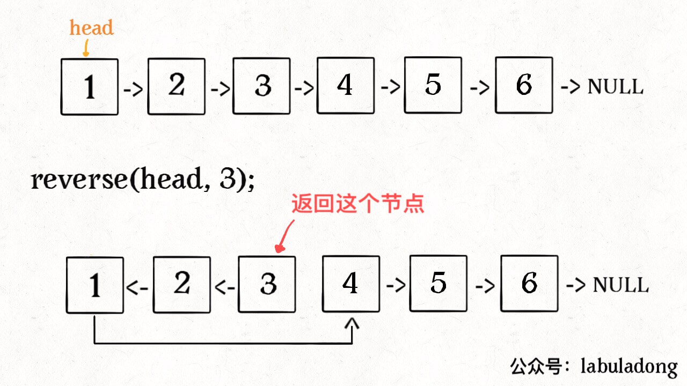

# 1.青铜挑战—**手写链表反转**

> 链表反转是一个出现频率特别高的算法题，老师过去这些年面试，至少遇到过七八次。其中更夸张的是曾经两天写了三次，上午YY，下午金山云，第二天快手。链表反转在各大高频题排名网站也长期占领前三。比如牛客网上这个No1 好像已经很久了。所以链表反转是我们学习链表最重要的问题，没有之一。

为什么反转这么重要呢？==因为反转链表涉及结点的增加、删除等多种操作，能非常有效考察思维能力和代码驾驭能力。==另外很多题目也都要用它来做基础， 例如指定区间反转、链表K个一组翻转。还有一些在内部的某个过程用到了反转，例如两个链表生成相加链表。还有一种是链表排序的，也是需要移动元素之间的指针，难度与此差不多。因为太重要，所以我们用一章专门研究这个题目。


LeetCode206 给你单链表的头节点 head，请你反转链表，并返回反转后的链表。

````java
示例1：
输入：head = [1,2,3,4,5]
输出：[5,4,3,2,1]
````


本题有两种方法，带头结点和不带头结点，我们都应该会，因为这两种方式都很重要，如果搞清楚，很多链表的算法题就不用做了。


## 1.1 **建立虚拟头结点辅助反转**

前面分析链表插入元素的时候，会发现如何处理头结点是个比较麻烦的问题，为此可以先建立一个虚拟的结点ans，并且令ans.next=head，这样可以很好的简化我们的操作。如下图所示，如果我们将链表{1->2->3->4->5}进行反转，我们首先建立虚拟结点ans，并令ans.next=node(1)，接下来我们每次从旧的链表拆下来一个结点接到ans后面，然后将其他线调整好就可以了。


如上图所示，我们完成最后一步之后，只要返回ans.next就得到反转的链表了，代码如下：

````java
public static ListNode reverseList(ListNode head) {
    ListNode ans = new ListNode(-1);
    ListNode cur = head;
    while (cur != null) {
        ListNode next = cur.next;
        cur.next = ans.next;
        ans.next = cur;
        cur = next;
    }
    return ans.next;
}
````


## 1.2 **直接操作链表实现反转**

上面的方式虽然好理解应用也广，但是可能会被面试官禁止，为啥？原因是不借助虚拟结点的方式更难，更能考察面试者的能力。

我们观察一下反转前后的结构和指针位置：


我们再看一下执行期间的过程示意图，在图中，cur本来指向旧链表的首结点，pre表示已经调整好的新链表的表头，next是下一个要调整的。注意图中箭头方向，cur和pre是两个表的表头，移动过程中cur经过一次中间状态之后，又重新变成了两个链表的表头。


理解这个图就够了，直接看代码：

````java
public ListNode reverseList(ListNode head ) {
    ListNode prev = null;
    ListNode curr = head;
    while (curr != null) {
        ListNode next = curr.next;
        curr.next = prev;
        prev = curr;
        curr = next;
    }
    return prev;
}
````

==将上面这段代码在理解的基础上背下来，是的，因为这个算法太重要==


## 1.3 **递归实现反转**

上面我们讲解了链表反转的两种方法，带虚拟头结点方法是很多底层源码使用的，而不使用带头结点的方法是面试经常要考的，所以两种方式我们都要好好掌握。

另外这种带与不带头结点的方式，在接下来的指定区间、K个一组反转也采用了，只不过为了便于理解 ，我们将其改成了==“头插法”和“穿针引线法”。==

拓展 通过递归来实现反转，链表反转还有第三种常见的方式，使用递归来实现，这里不做重点，感兴趣的同学可以研究一下：

````java
public ListNode reverseList(ListNode head) {
         // 寻找递归终止条件
        // 1、head 指向的结点为 null 
        // 2、head 指向的结点的下一个结点为 null 
        // 在这两种情况下，反转之后的结果还是它自己本身
        if( head == null || head.next == null)  return head;

        // 不断的通过递归调用，直到无法递归下去，递归的最小粒度是在最后一个节点
        // 因为到最后一个节点的时候，由于当前节点 head 的 next 节点是空，所以会直接返回 head
        ListNode cur = reverseList(head.next);

        // 比如原链表为 1 --> 2 --> 3 --> 4 --> 5
        // 第一次执行下面代码的时候，head 为 4，那么 head.next = 5
        // 那么 head.next.next 就是 5.next ，意思就是去设置 5 的下一个节点
        // 等号右侧为 head，意思就是设置 5 的下一个节点是 4

        // 这里出现了两个 next
        // 第一个 next 是「获取」 head 的下一节点
        // 第二个 next 是「设置」 当前节点的下一节点为等号右侧的值
        head.next.next = head;


        // head 原来的下一节点指向自己，所以 head 自己本身就不能再指向原来的下一节点了
        // 否则会发生无限循环
        head.next = null;

        // 我们把每次反转后的结果传递给上一层
        return cur;

    }
````


# **2.白银挑战——链表反转的拓展问题**

## 2.1 **指定区间反转**

LeetCode92 ：给你单链表的头指针 head 和两个整数 left 和 right ，其中 left <= right。请你反转从位置 left 到位置 right 的链表节点，返回反转后的链表。

````java
示例 1：
输入：head = [1,2,3,4,5], left = 2, right = 4
输出：[1,4,3,2,5]
````


这里的处理方式也有多种，甚至给个名字都有点困难，干脆就分别叫穿针引线法和头插法吧。穿针引线本质上就是不带有节点的方式来实现反转，而头插法本质上就是带头结点的反转。

### 2.1.1 **头插法**

方法一的缺点是：如果 left 和 right 的区域很大，恰好是链表的头节点和尾节点时，找到 left 和 right 需要遍历一次，反转它们之间的链表还需要遍历一次，虽然总的时间复杂度为 O(N)，但遍历了链表 2次，可不可以只遍历一次呢？答案是可以的。我们依然画图进行说明，我们仍然以方法一的序列为例进行说明。


==反转的整体思想是，在需要反转的区间里，每遍历到一个节点，让这个新节点来到反转部分的起始位置。==下面的图展示了整个流程。


这个过程就是前面的带虚拟结点的插入操作，每走一步都要考虑各种指针怎么指，既要将结点摘下来接到对应的位置上，还要保证后续结点能够找到，请读者务必画图看一看，想一想到底该怎么调整。代码如下：

````java
public ListNode reverseBetween(ListNode head, int left, int right) {
    // 设置 dummyNode 是这一类问题的一般做法
    ListNode dummyNode = new ListNode(-1);
    dummyNode.next = head;
    ListNode pre = dummyNode;
    for (int i = 0; i < left - 1; i++) {
        pre = pre.next;
    }
    ListNode cur = pre.next;
    ListNode next;
    for (int i = 0; i < right - left; i++) {
        next = cur.next;
        cur.next = next.next;
        next.next = pre.next; // 不能等于cur，因为cur是固定的会不断后移
        pre.next = next;
    }
    return dummyNode.next;
}
````


### 2.1.2 穿针引线法

使用「206. 反转链表」的解法，反转 left 到 right 部分以后，再拼接起来。我们还需要记录 left 的前一个节点，和 right 的后一个节点。如图所示：


算法步骤：

==第 1 步：先将待反转的区域反转；==
第 2 步：把 pre 的 next 指针指向反转以后的链表头节点，把反转以后的链表的尾节点的 next 指针指向 succ。


````java
public ListNode reverseBetween(ListNode head, int left, int right) {
    // 因为头节点有可能发生变化，使用虚拟头节点可以避免复杂的分类讨论
    ListNode dummyNode = new ListNode(-1);
    dummyNode.next = head;
    ListNode pre = dummyNode;
    // 第 1 步：从虚拟头节点走 left - 1 步，来到 left 节点的前一个节点
    // 建议写在 for 循环里，语义清晰
    for (int i = 0; i < left - 1; i++) {
        pre = pre.next;
    }
    // 第 2 步：从 pre 再走 right - left + 1 步，来到 right 节点
    ListNode rightNode = pre;
    for (int i = 0; i < right - left + 1; i++) {
        rightNode = rightNode.next;
    }
    // 第 3 步：切出一个子链表
    ListNode leftNode = pre.next;
    ListNode succ = rightNode.next;
    // 思考一下，如果这里不设置next为null会怎么样
    rightNode.next = null;

    // 第 4 步：同第 206 题，反转链表的子区间
    reverseLinkedList(leftNode);
    // 第 5 步：接回到原来的链表中
    //想一下，这里为什么可以用rightNode
    pre.next = rightNode;
    leftNode.next = succ;
    return dummyNode.next;
}
private void reverseLinkedList(ListNode head) {
    // 也可以使用递归反转一个链表
    ListNode pre = null;
    ListNode cur = head;
    while (cur != null) {
        ListNode next = cur.next;
        cur.next = pre;
        pre = cur;
        cur = next;
    }
}
````


### 2.1.3 递归法

#### 2.1.3.1 递归反转整个链表

这个算法可能很多读者都听说过，这里详细介绍一下，先直接看实现代码：

````java
ListNode reverse(ListNode head) {
    if (head.next == null) return head;
    ListNode last = reverse(head.next);
    head.next.next = head;
    head.next = null;
    return last;
}
````

看起来是不是感觉不知所云，完全不能理解这样为什么能够反转链表？这就对了，这个算法常常拿来显示递归的巧妙和优美，我们下面来详细解释一下这段代码。

==对于递归算法，最重要的就是明确递归函数的定义。==具体来说，我们的 reverse 函数定义是这样的：

**输入一个节点 head，将「以 head 为起点」的链表反转，并返回反转之后的头结点。**

明白了函数的定义，在来看这个问题。比如说我们想反转这个链表：


那么输入 `reverse(head)` 后，会在这里进行递归：

````java
ListNode last = reverse(head.next);
````

**==不要跳进递归（你的脑袋能压几个栈呀？），而是要根据刚才的函数定义，来弄清楚这段代码会产生什么结果：==**


这个 `reverse(head.next)` 执行完成后，整个链表就成了这样：


并且根据函数定义，`reverse` 函数会返回反转之后的头结点，我们用变量 `last` 接收了。

现在再来看下面的代码：

````java
head.next.next = head;
````


````java
head.next = null;
return last;
````



神不神奇，这样整个链表就反转过来了！递归代码就是这么简洁优雅，不过其中有两个地方需要注意：

**1、递归函数要有 base case，也就是这句：**

```java
if (head.next == null) return head;
```

意思是如果链表只有一个节点的时候反转也是它自己，直接返回即可。

**2、当链表递归反转之后，新的头结点是 last，而之前的 head 变成了最后一个节点，别忘了链表的末尾要指向 null：**

````java
head.next = null;
````


理解了这两点后，我们就可以进一步深入了，接下来的问题其实都是在这个算法上的扩展。


#### 2.1.3.2 反转链表前 N 个节点

这次我们实现一个这样的函数：

```java
// 将链表的前 n 个节点反转（n <= 链表长度）
ListNode reverseN(ListNode head, int n)
```

比如说对于下图链表，执行 `reverseN(head, 3)`：



解决思路和反转整个链表差不多，只要稍加修改即可：

````java
ListNode successor = null; // 后驱节点

// 反转以 head 为起点的 n 个节点，返回新的头结点
ListNode reverseN(ListNode head, int n) {
    if (n == 1) { 
        // 记录第 n + 1 个节点
        successor = head.next;
        return head;
    }
    // 以 head.next 为起点，需要反转前 n - 1 个节点
    ListNode last = reverseN(head.next, n - 1);

    head.next.next = head;
    // 让反转之后的 head 节点和后面的节点连起来
    head.next = successor;
    return last;
}    
````

具体的区别：

1、base case 变为 n == 1，反转一个元素，就是它本身，同时要记录后驱节点。

2、刚才我们直接把 head.next 设置为 null，因为整个链表反转后原来的 head 变成了整个链表的最后一个节点。但现在 head 节点在递归反转之后不一定是最后一个节点了，所以要记录后驱 successor（第 n + 1 个节点），反转之后将 head 连接上。


OK，如果这个函数你也能看懂，就离实现「反转一部分链表」不远了。


#### 2.1.3.2 反转链表的一部分

现在解决我们最开始提出的问题，给一个索引区间 `[m,n]`（索引从 1 开始），仅仅反转区间中的链表元素。

````java
ListNode reverseBetween(ListNode head, int m, int n)
````

首先，如果 `m == 1`，就相当于反转链表开头的 `n` 个元素嘛，也就是我们刚才实现的功能：

````java
ListNode reverseBetween(ListNode head, int m, int n) {
    // base case
    if (m == 1) {
        // 相当于反转前 n 个元素
        return reverseN(head, n);
    }
    // ...
}
````

如果 m != 1 怎么办？如果我们把 head 的索引视为 1，那么我们是想从第 m 个元素开始反转对吧；如果把 head.next 的索引视为 1 呢？那么相对于 head.next，反转的区间应该是从第 m - 1 个元素开始的；那么对于 head.next.next 呢……

区别于迭代思想，这就是递归思想，所以我们可以完成代码：

````java
ListNode reverseBetween(ListNode head, int m, int n) {
    // base case
    if (m == 1) {
        return reverseN(head, n);
    }
    // 前进到反转的起点触发 base case
    head.next = reverseBetween(head.next, m - 1, n - 1);
    return head;
}
````

至此，我们的最终大 BOSS 就被解决了。

==**递归的思想相对迭代思想，稍微有点难以理解，处理的技巧是：不要跳进递归，而是利用明确的定义来实现算法逻辑。**== 


## 2.2 **两两交换链表中的节点**

这是一道非常重要的问题，读者务必理解清楚。

LeetCode24.给你一个链表，两两交换其中相邻的节点，并返回交换后链表的头节点。你必须在不修改节点内部的值的情况下完成本题（即，只能进行节点交换）。


如果要解决该问题，将上面小节的K换成2不就是这个题吗？道理确实如此，但是如果K为2的时候，可以不需要像K个一样需要先遍历找到区间的两端，而是直接取前后两个就行了，因此基于相邻结点的特性重新设计和实现就行，不需要上面这么复杂的操作。

如果原始顺序是 dummy -> node1 -> node2，交换后面两个节点关系要变成 dummy -> node2 -> node1，事实上我们只要多执行一次next就可以拿到后面的元素，也就是类似node2 = temp.next.next这样的操作。
两两交换链表中的节点之后，新的链表的头节点是 dummyHead.next，返回新的链表的头节点即可。指针的调整可以参考如下图示：


````java
public ListNode swapPairs(ListNode head) {
    ListNode dummyHead = new ListNode(0);
    dummyHead.next = head;
    ListNode temp = dummyHead;
    while (temp.next != null && temp.next.next != null) {
        ListNode node1 = temp.next;
        ListNode node2 = temp.next.next;
        temp.next = node2;
        node1.next = node2.next;
        node2.next = node1;
        temp = node1;
    }
    return dummyHead.next;
}
````


## 2.3 **单链表加1**

LeetCode369.用一个非空单链表来表示一个非负整数，然后将这个整数加一。你可以假设这个整数除了 0 本身，没有任何前导的 0。这个整数的各个数位按照 高位在链表头部、低位在链表尾部 的顺序排列。


我们先看一下加法的计算过程：

计算是从低位开始的，而链表是从高位开始的，所以要处理就必须反转过来，此时可以使用栈，也可以使用链表反转来实现。

基于栈实现的思路不算复杂，先把题目给出的链表遍历放到栈中，然后从栈中弹出栈顶数字 digit，加的时候再考虑一下进位的情况就ok了，加完之后根据是否大于0决定视为下一次要进位 。

````java
public ListNode plusOne(ListNode head) {
      Stack<ListNode> stack = new Stack<>();
      ListNode one = new ListNode(-1);
      ListNode dummyNode = one;
      dummyNode.next = head;
      while (dummyNode.next != null) {
          stack.push(dummyNode.next);
          dummyNode = dummyNode.next;
      }
      while (stack.peek().val == 9) {
          stack.pop().val = 0;
          if(stack.isEmpty()){ // 判断是否需要进位
              one.val = 1;
              return one;
          }
      }
      stack.pop().val += 1;
      return head;
  }
````

基于链表反转实现 如果这里不使用栈，使用链表反转来实现该怎么做呢？很显然，我们先将原始链表反转，这方面完成加1和进位等处理，完成之后再次反转。

````java
public ListNode plusOne(ListNode head) {
      ListNode last = reverse(head);
      ListNode ans = last;
      ListNode extraNode = new ListNode(1);

      while (last != null && last.val == 9) {
          last.val = 0;
          if (last.next == null) {
              last.next = extraNode; 
              return reverse(ans);
          }
          last = last.next;
      }
      last.val += 1;
      return reverse(ans);
}
public ListNode reverse(ListNode head) {
      ListNode dummyNode = new ListNode(-1);
      ListNode cur = head;
      while (cur != null) {
          ListNode next = cur.next;
          cur.next = dummyNode.next;
          dummyNode.next = cur;
          cur = next;
      }
      return dummyNode.next;
}
````


## 2.4 **链表加法**

相加相链表是基于链表构造的一种特殊题，反转只是其中的一部分。这个题还存在进位等的问题，因此看似简单，但是手写成功并不容易。

LeetCode445题，给你两个非空链表来代表两个非负整数。数字最高位位于链表开始位置。它们的每个节点只存储一位数字。将这两数相加会返回一个新的链表。你可以假设除了数字 0 之外，这两个数字都不会以零开头。


这个题目的难点在于存放是从最高位向最低位开始的，但是因为低位会产生进位的问题，计算的时候必须从最低位开始。所以我们必须想办法将链表节点的元素反转过来。

怎么反转呢？栈和链表反转都可以，两种方式我们都看一下。

**(1) 使用栈实现**

思路是先将两个链表的元素分别压栈，然后再一起出栈，将两个结果分别计算。之后对计算结果取模，模数保存到新的链表中，进位保存到下一轮。完成之后再进行一次反转就行了。

我们知道在链表插入有头插法和尾插法两种。头插法就是每次都将新的结点插入到head之前。而尾插法就是将新结点都插入到链表的表尾。两者的区别是尾插法的顺序与原始链表是一致的，而头插法与原始链表是逆序的，所以上面最后一步如果不想进行反转，可以将新结点以头插法。

````java
public static ListNode addInListByStack(ListNode head1, ListNode head2) {    
		Stack<ListNode> st1 = new Stack<ListNode>();
    Stack<ListNode> st2 = new Stack<ListNode>();
    while (head1 != null) {
        st1.push(head1);
        head1 = head1.next;
    }
    while (head2 != null) {
        st2.push(head2);
        head2 = head2.next;
    }
    ListNode newHead = new ListNode(-1);
    int carry = 0;
    //这里设置carry!=0,是因为当st1,st2都遍历完时，如果carry=0,就不需要进入循环了
    while (!st1.empty() || !st2.empty() || carry != 0) {
        ListNode a = new ListNode(0);
        ListNode b = new ListNode(0);
        if (!st1.empty()) {
            a = st1.pop();
        }
        if (!st2.empty()) {
            b = st2.pop();
        }
        //每次的和应该是对应位相加再加上进位
        int get_sum = a.val + b.val + carry;
        //对累加的结果取余
        int ans = get_sum % 10;
        //如果大于0，就进位
        carry = get_sum / 10;
        ListNode cur = new ListNode(ans);
        cur.next = newHead.next;
        //每次把最新得到的节点更新到neHead.next中
        newHead.next = cur;
    }
    return newHead.next;
}
````


**(2)使用链表反转实现** 

如果使用链表反转，先将两个链表分别反转，最后计算完之后再将结果反转，一共有三次反转操作，所以必然将反转抽取出一个方法比较好，代码如下：

````java
public class Solution {
    public ListNode addInList (ListNode head1, ListNode head2) {
        head1 = reverse(head1);
        head2 = reverse(head2);
        ListNode head = new ListNode(-1);
        ListNode cur = head;
        int carry = 0;
        while(head1 != null || head2 != null) {
            int val = carry;
            if (head1 != null) {
                val += head1.val;
                head1 = head1.next;
            }
            if (head2 != null) {
                val += head2.val;
                head2 = head2.next;
            }
            cur.next = new ListNode(val % 10);
            carry = val / 10;
            cur = cur.next;
        }
        if (carry > 0) {
            cur.next = new ListNode(carry);
        }
        return reverse(head.next);
    }

    private ListNode reverse(ListNode head) {
        ListNode cur = head;
        ListNode pre = null;
        while(cur != null) {
            ListNode temp = cur.next;
            cur.next = pre;
            pre = cur;
            cur = temp;
        }
        return pre;
    }
}
````


## 2.5 **再论链表的回文序列问题**

在上一关介绍链表回文串的时候，我们介绍的是基于栈的，相对来说比较好理解，但是除此之外还有可以使用链表反转来进行，而且还可以只反转一半链表，这种方式节省空间。

我们姑且称之为“快慢指针+一半反转”法。这个实现略有难度，主要是在while循环中pre.next = prepre和prepre = pre两行实现了一边遍历一边将访问过的链表给反转了，所以理解起来有些难度，如果不理解可以在学完链表反转之后再看这个问题。

````java
public boolean isPalindrome(ListNode head) {
        if(head == null || head.next == null) {
        return true;
    }
    ListNode slow = head, fast = head;
    ListNode pre = head, prepre = null;
    while(fast != null && fast.next != null) {
        pre = slow;
        slow = slow.next;
        fast = fast.next.next;
        //将前半部分链表反转
        pre.next = prepre;
        prepre = pre;
    }
    if(fast != null) {
        slow = slow.next; // 如果不为空，slow在中间节点，要再往后移一个
    }
    // slow查后半段，pre查前半段
    while(pre != null && slow != null) {
        if(pre.val != slow.val) {
            return false;
        }
        pre = pre.next;
        slow = slow.next;
    }
    return true;

}
````

