# **1.青铜挑战——爱不起的数组**

## 1.1 **线性表基础**

### 1.1.1 **线性表**

我们先搞清楚几个基本概念，在很多地方会看到线性结构、线性表这样的表述，那什么是线性结构？与数组、链表等有什么关系？常见的线性结构又有哪些呢？

==所谓线性表就是具有相同特征数据元素的一个有限序列，==其中所含元素的个数称为线性表的长度，从不同的角度看，线性表可以有不同的分类，例如：

**==从语言实现的角度==**

顺序表有两种基本实现方式，**一体式和分离式**，如下：

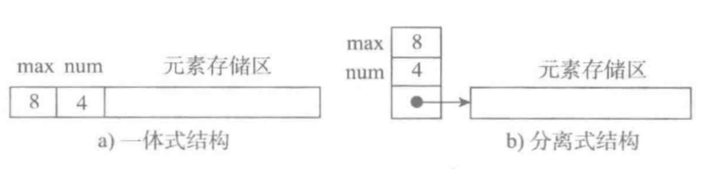

图a 为一体式结构，**存储表信息的单元与元素存储区以连续的方式安排在一块存储区里**，两部分数据的整体形成一个完整的顺序表对象。这种结构整体性强，易于管理。但是由于数据元素存储区域是表对象的一部分，顺序表创建后，元素存储区就固定了。C和C++都是一体式的结构。

图b 为分离式结构，**表对象里只保存与整个表有关的信息（即容量和元素个数）**，实际数据元素存放在另一个独立的元素存储区里，通过链接与基本表对象关联。Java和python是分离式结构。

==**从存储的角度**==

从存储的角度看，可以分为顺序型和链表型。顺序性就是将数据存放在一段固定的区间内，此时访问元素的效率非常高，但是删除和增加元素代价比较大，如果要扩容只能整体搬迁。

而在链表型里，元素之间是通过地址依次连接的，因此访问时必须从头开始逐步向后找，因此查找效率低，而删除和增加元素非常方便，并且也不需要考虑扩容的问题。链表的常见实现方式又有单链表、循环链表、双向链表等等等。

**==从访问限制的角度==**

栈和队列又称为访问受限的线性表，插入和删除受到了限制，只能在固定的位置进行。而Hash比较特殊，其内部真正存储数据一般是数组，但是访问是通过映射来实现的，因此大部分材料里并不将Hash归结到线性表中，这里为了学习更紧凑，我们将其与队栈一起学习。线性表的知识框架如下：

线性表的常见操作有初始化、求表长、增删改查等，事实上每种数据结构都至少要有这几种操作，大部分的基础算法题都是基于此扩展的。

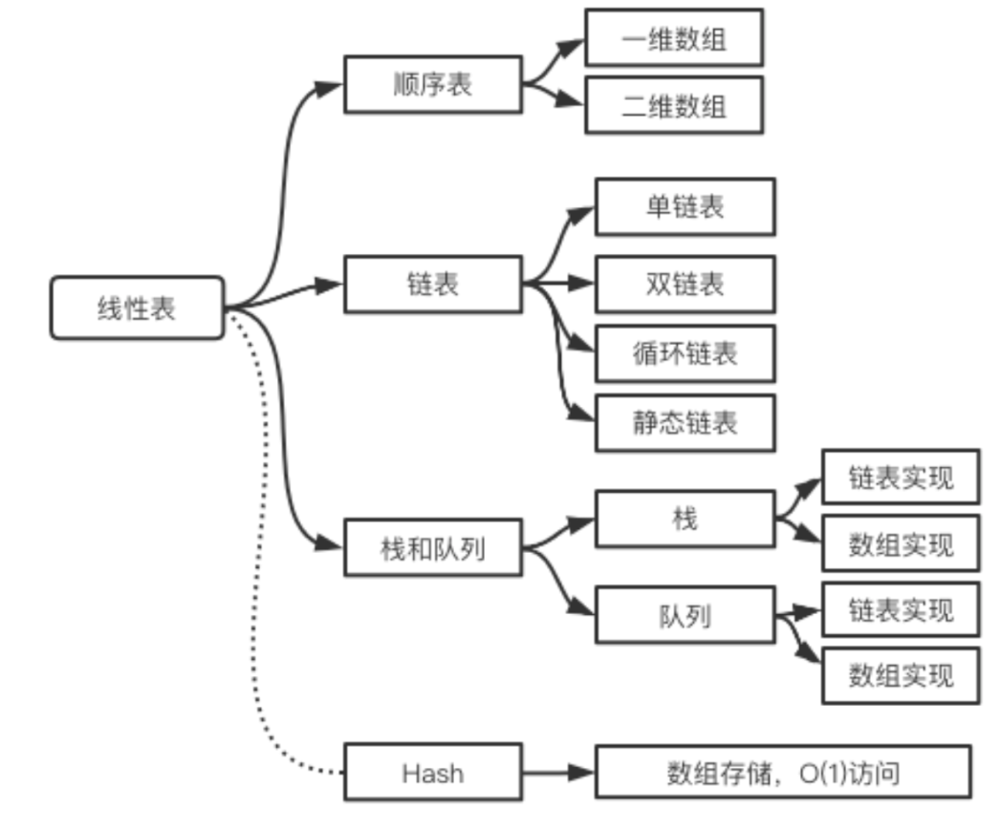

**==从扩容的角度==**

采用分离式结构的顺序表，若将数据区更换为存储空间更大的区域，则可以在不改变表对象的前提下对其数据存储区进行了扩充，所有使用这个表的地方都不必修改。只要程序的运行环境（计算机系统）还有空闲存储，这种表结构就不会因为满了而导致操作无法进行。人们把采用这种技术实现的顺序表称为动态顺序表，**因为其容量可以在使用中动态变化。**

扩充的两种策略：

● 第一种：每次扩充增加固定数目的存储位置，如每次扩充增加10个元素位置，这种策略可称为线性增长。特点：节省空间，但是扩充操作频繁，操作次数多。

● 第二种：每次扩充容量加倍，如每次扩充增加一倍存储空间。特点：减少了扩充操作的执行次数，但可能会浪费空间资源。以空间换时间，推荐的方式。

具体到每种结构语言中的结构，实现方式千差万别。其中Java基本是扩容时加倍的方式。而在Python的官方实现中，list实现采用了如下的策略：在建立空表（或者很小的表）时，系统分配一块能容纳8个元素的存储区；在执行插入操作（insert或append）时，如果元素存储区满就换一块4倍大的存储区。但如果此时的表已经很大（目前的阀值为50000），则改变策略，采用加一倍的方法。引入这种改变策略的方式，是为了避免出现过多空闲的存储位置。


### **1.1.2 数组的概念**

数组是线性表最基本的结构，特点是元素是一个紧密在一起的序列，相互之间不需要记录彼此的关系就能访问，例如月份、星座等。

数组用索引的数字来标识每项数据在数组中的位置，且在大多数编程语言中，索引是从 0 算起的。我们可以根据数组中的索引快速访问数组中的元素。

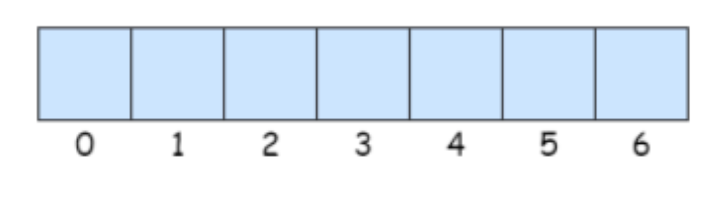

数组有两个需要注意的点，一个是从0开始记录，也就是第一个存元素的位置是a[0]，最后一个是a[length-1]。其次，数组中的元素在内存中是连续存储的，且每个元素占用相同大小的内存。

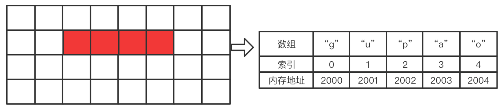

另外需要注意的是数组空间不一定是满的，100的空间可能只用了10个位置，所以要注意数据个数的变量size和数组长度length可能不一样，解题时必须注意。


### **1.1.3 数组存储元素的特征**

在往期训练营中，发现很多学员对数组如何存储元素的并不太清楚，这里采用连环炮方式来说明。

第一炮，我创建了一个大小为10的数组，请问此时数组里面是什么？

答：不同的语言处理会不一样，**在c语言里每个位置都是一个随机数。而在java里，默认会初始化为0。**而 python 更为灵活可以直接指定是什么，例如a = [1,2,3,4]，就是数组里有四个元素，而 a = [0 for i in range(10)] 这样定义的数组就是[0, 0, 0, 0, 0, 0, 0, 0, 0, 0]

第二炮：是否可以只初始化一部分位置？初始化的本质是什么？

答：当然可以，你可以将前面5个位置依次，后面的空着，此时数组内容为{1,2,3,4,5,0,0,0,0,0}。

初始化的本质就是覆盖已有的值，用你需要的值覆盖原来的0，因为数组本来是{0,0,0,0,0,0,0,0,0,0}，这里只不过被你替换成了{1,2,3,4,5,0,0,0,0,0}。如果此时你想知道有效元素的个数，就必须再使用一个额外的变量，例如size来标记。

第三炮：上面已经初始化的元素之间是否可以空着，例如初始化为{1,0,0,4,5,0,2,0,3,0}。其中0位置仍然是未初始化的？

答：不可以！绝对不可以！要初始化，就必须从前向后的连续空间初始化，不可以出现空缺的情况，这是违背数组的原则的。你正在进行某种运算期间可以先给部分位置赋值，而一旦稳定了，就不可以再出现空位置的情况。

第四炮：如果我需要的数据就是在中间某一段该怎么办呢？例如{0,0,3,4,5,6,7,0,0,0}，此时该怎么拿到从3到7的元素呢？

答：你需要使用两个变量，例如left=2，right=6 来表示区间[left,right] 是有效的。

**第五炮：我删除的时候，已经被删除的位置该是什么呢？例如原始数组为{1,2,3,4,5,6,7,8,0,0}，我删除4之后，根据数组的移动原则，从5开始向前移动，变成{1,2,3,5,6,7,8,?,0,0}，那原来8所在的位置应该是什么呢？**

答：仍然是8，也就是删除4之后的结构为{1,2,3,5,6,7,8,8,0,0}，此时表示元素数量的size会减1变成7，原来8的位置仍然是8。因为我们是通过size来标记元素数量的，所以最后一个8不会被访问到。

第六炮：这个里8看起来很不爽啊，是否可以再优化一下？

答：不爽就不爽，习惯就好！不用优化，优化了也没啥用。


## 1.2 **数组基本操作**

在面试中，数组大部分情况下都是int类型的，所以我们就用int类型来实现这些基本功能。

### 1.2.1 **数组创建和初始化**

创建一维数组的方法不同的语言不一样的，如下：

**Java:**

````java
int[] arr = new int[10];
````

**C:**

````c
a[]={1,2,2,1,0,2,4,2,3,1};
````

**Python:**

````python
list = []
````

初始化数组最基本的方式是循环赋值：

````java
for(int i = 0 ; i < arr.length ; i ++)
arr[i] = i;
````

但是这种方式在面试题中一般不行，因为很多题目会给定若干测试数组让你都能测试通过，例如给你两个数组 [0,1,2,3,5,6,8] 和 [1,4,5,6,7,9,10] 。那这时候该如何初始化呢？显然不能用循环了，可以采用下面的方式：

````java
int[] arr = new int[]{0,1,2,3,5,6,8};
//这么写也行:
int[] nums = {2, 5, 0, 4, 6, -10};
````

如果要测试第二组数据，直接将其替换就行了。这种方式很简单，在面试时特别实用，但是务必记住写法，否则面试时可能慌了或者忘了，老写不对，这会让你无比着急，想死的心都有! 我们练习算法的一个目标就是熟悉这些基本问题，避免阴沟里翻船。

另外要注意上面在创建数组时大小就是元素的数量，是无法再插入元素的，如果需要增加新元素就不能这么用了。


### 1.2.2 **查找一个元素**

为什么数组的题目特别多呢，因为很多题目本质就是查找问题，而数组是查找的最佳载体。很多复杂的算法都是为了提高查找效率的，例如二分查找、二叉树、红黑树、B+树、Hash和堆等等。另一方面很多算法问题本质上都是查找问题，例如滑动窗口问题、回溯问题、动态规划问题等等都是在寻找那个目标结果。

这里只写最简单的方式，根据值是否相等进行线性查找，基本实现如下：

````java
/**
* @param size 已经存放的元素个数
* @param key  待查找的元素
  */
public static int findByElement(int[] arr, int size, int key) {
    for (int i = 0; i < size; i++) {
        if (arr[i] == key)
            return i;
    }
    return -1;
}
````


### 1.2.3 **增加一个元素**

增加和删除元素是数组最基本的操作，看别人的代码非常容易，但是自己写的时候经常bug满天飞。能准确处理游标和边界等情况是数组算法题最基础重要的问题之一。所以务必自己亲手能写一个才可以，**不要感觉挺简单就不写，其中涉及的问题在所有与数组有关的算法题中都会遇到。**

将给定的元素插入到有序数组的对应位置中，我们可以先找位置，再将其后元素整体右移，最后插入到空位置上。这里需要注意，算法必须能保证在数组的首部、尾部和中间位置插入都可以成功。该问题貌似一个for循环就搞定了，但是如果面试直接让你写并能正确运行，我相信很多人还是会折腾很久，甚至直接会挂。因为自己写的时候会发现游标写size还是size-1，判断时要不要加等于等等，这里推荐一种实现方式。

````java
/**
  * @param arr
  * @param size    数组已经存储的元素数量，从1开始编号
  * @param element 待插入的元素
  * @return
  */
public static int addByElementSequence(int[] arr, int size, int element) {
    //问题①: 是否应该是size>arr.length？
    if (size >= arr.length)
        retrun -1;

    //问题②: 想想这里是否是index=0或者size-1？
    int index = size;
    //找到新元素的插入位置，问题③: 这里是否应该是size-1？
    for (int i = 0; i < size; i++) {
        if (element < arr[i]) {
            index = i;
            break;
        }
    }
    //元素后移，问题④: 想想这里为什么不是size-1
    for (int j = size; j > index; j--) {
        arr[j] = arr[j - 1]; //index下标开始的元素后移一个位置
    }
    arr[index] = element;//插入数据
    return index;
}
````

上面的代码在往期课程里被提出疑问特别多，主要是标记编号的几个位置，这几个全都是边界问题。这里回答几个：

问题①处，注意这里的size是从1开始编号的，表示的就是实际元素的个数。而arr.length也是从1开始的，当空间满的时候就是 size=arr.length，此时就不能再插入元素了。

问题② 处只能令 index=size， 0 或者 size-1 都不对。例如已有序列为 {3,4,7,8}，如果插入的元素比8大，例如9，假如index=0，则最后结果是 {9,3,4,7,8}。假如index=size-1，最后结果就是 {3,4,7,9,8}。

问题③和④处，这个就不用解释了吧，请读者自己思考。


### 1.2.4 **删除一个元素**

对于删除，不能一边从后向前移动一边查找了，因为元素可能不存在。
所以要分为两个步骤，先从最左侧开始查是否存在元素，如果元素存在，则从该位置开始执行删除操作。

例如序列是 1 2 3 4 5 6 7 8 9 ，要删除5，则应先遍历，找到5，然后从5开始执行删除操作，也就是从6开始逐步覆盖上一个元素，最终将序列变成 1 2 3 4 6 7 8 9 [9]。

这个方法和增加元素一样，必须自己亲自写才有作用，该方法同样要求删除序列最前、中间、最后和不存在的元素都能有效，下面给一个参考实现：

````java
/**
 * 从数组中删除元素key
 * @param arr 数组
 * @param size 数组中的元素个数，从1开始 
 * @param key   删除的目标值
 */
public  int removeByElement(int[] arr, int size, int key) {
    int index = -1;
    for (int i = 0; i < size; i++) {
        if (arr[i] == key) {
            index = i;
            break;
        }
    }
    if (index != -1) {
        for (int i = index + 1; i < size; i++){
            arr[i - 1] = arr[i];
        }
        size--;
    }
    return size;
}
````


## 1.3 **算法热身——单调数组问题**

先看个热身问题，我们在写算法的时候，数组是否有序是一个非常重要的前提，有或者没有可能会采用完全不同的策略。 LeetCode 896.判断一个给定的数组是否为单调数组。

分析：如果对于所有 i <= j，A[i] <= A[j]，那么数组 A 是单调递增的。 如果对于所有 i <= j，A[i]> = A[j]，那么数组 A 是单调递减的。所以遍历数组执行这个判定条件就行了，由于有递增和递减两种情况。于是我们执行两次循环就可以了，代码如下：

````java
public  boolean isMonotonic(int[] nums) {
    return isSorted(nums, true) || isSorted(nums, false);
}

public  boolean isSorted(int[] nums, boolean increasing) {
    int n = nums.length;
    for (int i = 0; i < n - 1; ++i) {
        if(increasing){
            if (nums[i] > nums[i + 1]) {
                return false;
            }
        }else{
            if (nums[i] < nums[i + 1]) {
                return false;
            } 
        }          
    }
    return true;
}
````

这样虽然实现功能了，貌似有点繁琐，而且还要遍历两次，能否优化一下呢？假如我们在i和i+1位置出现了nums[i]>nums[i+1],而在另外一个地方j和j+1出现了nums[j]<nums[j+1]，那是不是说明就不是单调了呢？这样我们就可以使用两个变量标记一下就行了，代码如下：

````java
public boolean isMonotonic(int[] nums) {
    boolean inc = true, dec = true;
    int n = nums.length;
    for (int i = 0; i < n - 1; ++i) {
        if (nums[i] > nums[i + 1]) {
            inc = false;
        }
        if (nums[i] < nums[i + 1]) {
            dec = false;
        }
    }
    return inc || dec;
}
````

我们判断整体单调性不是白干的，很多时候需要将特定元素插入到有序序列中，并保证插入后的序列仍然有序，例如 leetcode35：给定一个排序数组和一个目标值，在数组中找到目标值，并返回其索引。如果目标值不存在于数组中，返回它将会被按顺序插入的位置。

````java
示例1：
输入: nums = [1,3,5,6], target = 5
存在5，并且在索引为2的位置，所以输出: 2

示例2：
输入: nums = [1,3,5,6], target = 2
不存在2，2插入之后在索引为1的位置，所以输出: 1
````

这个问题没有让你将新元素插入到原始序列中，还是比较简单的，只要遍历一下就找到了。如果面试官再问你，该如何更快的找到目标元素呢？那他其实是想考你==**二分查找**==。以后凡是提到在单调序列中查找的情况，我们应该马上想到是否能用二分来提高查找效率。二分的问题我们后面专门讨论，这里只看一下实现代码：

````java
public int searchInsert(int[] nums, int target) {
    int n = nums.length;
    int left = 0, right = n - 1;
    while (left <= right) {
        int mid = ((right - left) >> 1) + left; // 防止大数越界
        if (target <= nums[mid]) {
            right = mid - 1;
        } else {
            left = mid + 1;
        }
    }
    return left;
}
````

为什么left就是答案？

根据if的判断条件，left左边的值一直保持小于target，right右边的值一直保持大于等于target，而且left最终一定等于right+1，这么一来，循环结束后，在left和right之间画一条竖线，恰好可以把数组分为两部分：left左边的部分和right右边的部分，而且left左边的部分全部小于target，并以right结尾；right右边的部分全部大于等于target，并以left为首。所以最终答案一定在left的位置。

**==单纯的二分查找==**

````java
int binarySearch(int[] nums, int target) {
    // 初始化双闭区间 [0, n-1] ，即 i, j 分别指向数组首元素、尾元素
    int i = 0, j = nums.length - 1;
    // 循环，当搜索区间为空时跳出（当 i > j 时为空）
    while (i <= j) {
        int m = i + (j - i) / 2; // 计算中点索引 m 防止大数越界
        if (nums[m] < target) // 此情况说明 target 在区间 [m+1, j] 中
            i = m + 1;
        else if (nums[m] > target) // 此情况说明 target 在区间 [i, m-1] 中
            j = m - 1;
        else // 找到目标元素，返回其索引
            return m;
    }
    // 未找到目标元素，返回 -1
    return -1;
}
````


## 1.4 **算法热身—数组合并专题**

数组合并就是将两个或者多个有序数组合并成一个新的。这个问题的本身不算难，但是要写的够出彩才可以。还有后面要学的归并排序本身就是多个小数组的合并，所以研究该问题也是为了后面打下基础。

先来看如何合并两个有序数组，LeetCode88：给你两个按非递减顺序 排列的整数数组 nums1 和 nums2，另有两个整数 m 和 n ，分别表示 nums1 和 nums2 中的元素数目。请你合并 nums2 到 nums1 中，使合并后的数组同样按 非递减顺序 排列。

注意：最终合并后数组不应由函数返回，而是存储在数组 nums1 中。为了应对这种情况，nums1 的初始长度为 m + n，其中前 m 个元素表示应合并的元素，后 n 个元素为 0 应忽略。nums2 的长度为 n 。

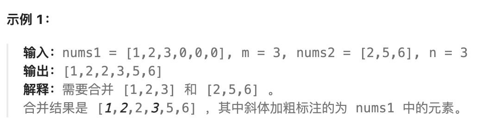

对于有序数组的合并，一种简单的方法是先将B直接合并到A的后面，然后再对A排序，也就是这样:

````java
public  void merge1(int[] nums1, int nums1_len, int[] nums2, int nums2_len) {
        for (int i = 0; i < nums2_len; ++i) {
            nums1[nums1_len + i] = nums2[i];
        }
        Arrays.sort(nums1);
    }
````

但是这么写只是为了开拓思路，面试官会不喜欢，太没技术含量了。这个问题的关键是将B合并到A的仍然要保证有序。因为A是数组不能强行插入，如果从前向后插入，数组A后面的元素会多次移动，代价比较高。此时可以借助一个新数组C来做，先将选择好的放入到C中，最后再返回。这样虽然解决问题了，但是面试官可能会问你能否再优化一下，或者不申请新数组就能做呢？更专业的问法是：上面算法的空间复杂度为O(n)，能否有O(1)的方法？

==比较好的方式是从后向前插入==，A和B的元素数量是固定的，所以排序后最远位置一定是A和B元素都最大的那个，依次类推，每次都找最大的那个从后向前填就可以了，代码如下：

````java
public void merge(int[] nums1, int nums1_len, int[] nums2, int nums2_len) {
    int i = nums1_len + nums2_len - 1;
    int len1 = nums1_len - 1, len2 = nums2_len - 1;
    while (len1 >= 0 && len2 >= 0) {
        if (nums1[len1] <= nums2[len2])
            nums1[i--] = nums2[len2--];
        else if (nums1[len1] > nums2[len2])
            nums1[i--] = nums1[len1--];
    }
    //假如A或者B数组还有剩余
    while (len2 != -1) nums1[i--] = nums2[len2--];
    while (len1 != -1) nums1[i--] = nums1[len1--];
}
````


# **2. 白银挑战——双指针思想以及应用**

我们前面说过数组里的元素是紧紧靠在一起的，假如有空隙后面的元素就要整体向前移动。同样如果在中间位置插入元素，那么其后的元素都要整体向后移动。在后面可以看到很多算法题都需要多轮、大量移动元素，这就导致执行效率低下。如何解决该问题是数组算法的一个重要问题，其中一种非常好用的方式就是双指针思想。


## 2.1 **双指针思想**

这里介绍一种简单但非常有效的方式——双指针。所谓的双指针其实就是两个变量，不一定真的是指针。双指针思想简单好用，在处理数组、字符串等场景下很常见。

看个例子，从下面序列中删除重复元素[1,2,2,2,3,3,3,5,5,7,8]，重复元素只保留一个。删除之后的结果应该为[1,2,3,5,7,8]。我们可以在删除第一个2时将将其后面的元素整体向前移动一次，删除第二个2时再将其后的元素整体向前移动一次，处理后面的3和5都一样的情况，这就导致我们需要执行5次大量移动才能完成，效率太低。如果使用双指针可以方便的解决这个问题，如图：

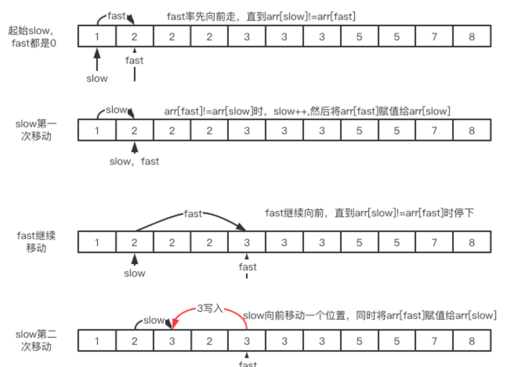

首先我们定义两个指针slow、fast。slow表示当前位置之前的元素都是不重复的，而fast则一直向后找，直到找到与slow位置不一样的 ，找到之后就将slow向后移动一个位置，并将arr[fast]复制给arr[slow]，之后fast继续向后找，循环执行。找完之后slow以及之前的元素就都是单一的了。这样就可以只用一轮移动解决问题。

上面这种一个在前一个在后的方式也称为快慢指针，有些场景需要从两端向中间走，这种就称为对撞型指针或者相向指针，很多题目也会用到，我们接下来会看到很多相关的算法题。

还有一种比较少见的背向型，就是从中间向两边走。这三种类型其实非常简单，看的只是两个指针是一起向前走（相亲相爱一起走），还是从两头向中间走（冲破千难万险来爱你），还是从中间向两头走（缘分已尽，就此拜拜）。


## 2.2 **删除元素专题**

所谓算法，其实就是将一个问题改改条件多折腾，上面专题就是添加的变形，再来看几个删除的变形问题。


### 2.2.1 **原地移除所有数值等于 val 的元素**

LeetCode27.给你一个数组 nums 和一个值 val，你需要原地移除所有数值等于 val 的元素，并返回移除后数组的新长度。要求：不要使用额外的数组空间，你必须仅使用 O(1) 额外空间并原地修改输入数组。元素的顺序可以改变。你不需要考虑数组中超出新长度后面的元素。

````
例子1:
输入：nums = [3,2,2,3], val = 3
输出：2, nums = [2,2]
例子2：
输入：nums = [0,1,2,2,3,0,4,2], val = 2
输出：5, nums = [0,1,4,0,3]
````

在删除的时候，从删除位置开始的所有元素都要向前移动，所以这题的关键是如果有很多值为val的元素的时候，如何避免反复向前移动呢？ 
本题可以使用双指针方式，而且还有三种，我们都看一下：

**==第一种：快慢双指针==**

整体思想就是2.1.1中介绍的双指针的图示的方式，定义两个指针slow和fast，初始值都是0。
Slow之前的位置都是有效部分，fast表示当前要访问的元素。
这样遍历的时候，fast不断向后移动：

●如果nums[fast]的值不为val，则将其移动到nums[slow++]处。
●如果nums[fast]的值为val，则fast继续向前移动，slow先等待。

图示如下：

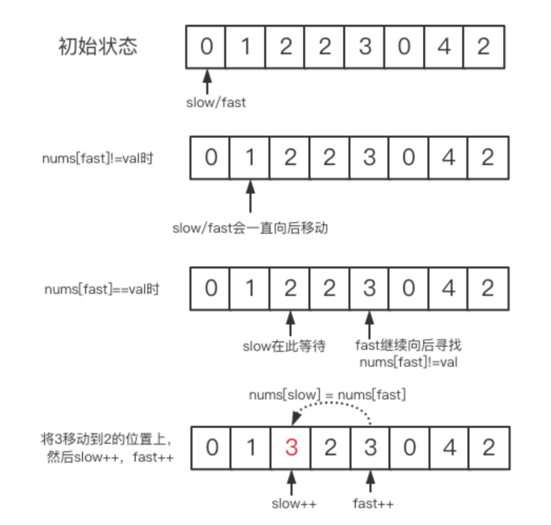

这样，前半部分是有效部分，后半部分是无效部分。

````java
public static int removeElement(int[] nums, int val) {
    int slow = 0;
    //fast充当了快指针的角色
    for (int fast = 0; fast < nums.length; fast++) {
        if (nums[fast] != val) {
            nums[slow] = nums[fast];
            slow++;
        }
    }
    //最后剩余元素的数量
    return slow;
}
````


**==第二种：对撞双指针==**

对撞指针，有的地方叫做交换移除，核心思想是从右侧找到不是val的值来顶替左侧是val的值。什么意思呢？我们看图，我们以nums = [0,1,2,2,3,0,4,2], val = 2为例：

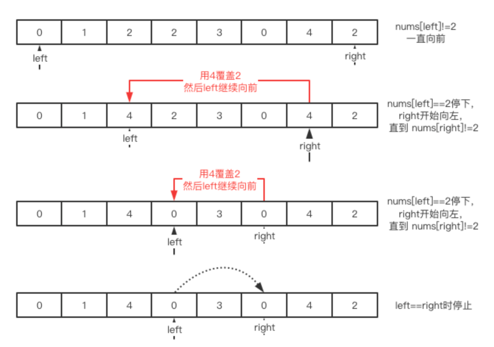

上图完整描述了执行的思路，**当 left\==right 的时候，left以及左侧的就是删除掉2的所有元素了，而right右边则是所有废弃不用的值。==展开说说，什么时候left=\=right？即最后两个if只能执行其中一个的时候，如果 nums[left] != val 并且 nums[right] != val 那么left+1后left以及左侧的就是删除掉2的所有元素了，反之亦然。==**实现代码：

````java
public int removeElement(int[] nums, int val) {
    int right = nums.length - 1;
    int left = 0;
  
  	while(left <= right){
        if ((nums[left] == val) && (nums[right] != val)) {
            int tmp = nums[left];
            nums[left] = nums[right];
            nums[right] = tmp;
        }
        if (nums[left] != val) left++;
        if (nums[right] == val) right--;
    }
    return left ;
}
````

这样就是一个中规中矩的的双指针解决方法。

拓展本题还可以进一步融合上面两种方式创造出：==**“对撞双指针+覆盖”法。**==当nums[left]等于val的时候，我们就将nums[right]位置的元素覆盖nums[left]，继续循环，如果nums[left]等于val就继续覆盖，否则才让left++，这也是双指针方法的方法，实现代码：

````java
public int removeElement(int[] nums, int val) {
      int right = nums.length - 1;
      int left = 0;
      while (left <= right) {
          if (nums[left] == val) {
              nums[left] = nums[right];
              right--;
          } else {
              left++;
          }
      }
      return left;
  }
````

对撞型双指针的过程与后面要学习的快速排序是一个思路，快速排序要比较很多轮，而这里只执行了一轮，理解本题将非常有利于后面理解快速排序算法。

另外，我们可以发现快慢型双指针留下的元素顺序与原始序列中的是一致的，而在对撞型中元素的顺序和原来的可能不一样了。


### 2.2.2 **删除有序数组中的重复项**

LeetCode26 给你一个有序数组 nums ，请你原地删除重复出现的元素，使每个元素只出现一次 ，返回删除后数组的新长度。不要使用额外的数组空间，你必须在原地修改输入数组 并在使用 O(1) 额外空间的条件下完成。

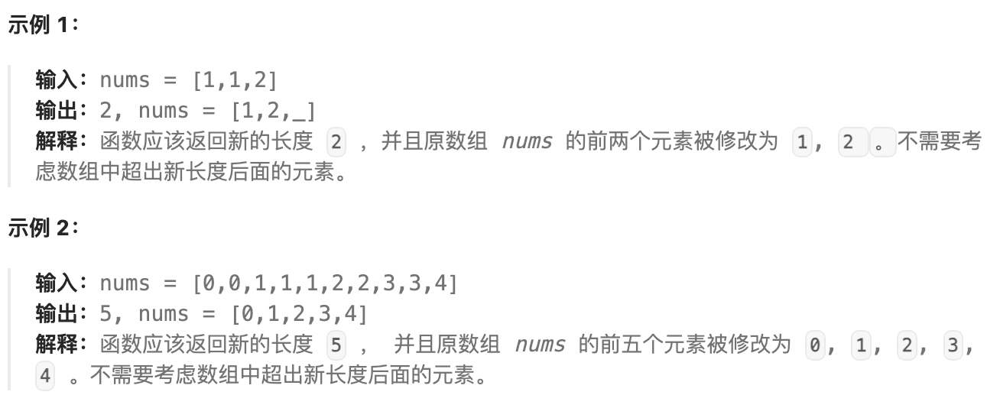

本题使用双指针最方便，思想与2.1.1的一样，一个指针负责数组遍历，一个指向有效数组的最后一个位置。为了减少不必要的操作，我们做适当的调整，例如令slow=1，并且比较的对象换做nums[slow - 1]，代码如下：

````java
public static int removeDuplicates(int[] nums) {
    //slow表示可以放入新元素的位置，索引为0的元素不用管
    int slow = 1;
    //循环起到了快指针的作用
    for (int fast = 0; fast < nums.length; fast++) {
        if (nums[fast] != nums[slow - 1]) {
            nums[slow] = nums[fast];
            slow++;
        }
    }
    return slow;
}
````

上面这题既然重复元素可以保留一个，那我是否可以最多保留2个，3个或者K个呢？甚至一个都不要呢？感兴趣的同学可以继续研究一下LeetCode80一题。

````java
public int removeDuplicates(int[] nums) {
      int n = nums.length;
      if (n <= 2) {
          return n;
      }
      int slow = 2, fast = 2;
      while (fast < n) {
          if (nums[slow - 2] != nums[fast]) {
              nums[slow] = nums[fast];
              ++slow;
          }
          ++fast;
      }
      return slow;
  }
````


## 2.3 **元素奇偶移动专题**

根据某些条件移动元素也是一类常见的题目，例如排序本身就是在移动元素，这里看一个奇偶移动的问题。

LeetCode905，按奇偶排序数组。给定一个非负整数数组 A，返回一个数组，在该数组中， A 的所有偶数元素之后跟着所有奇数元素。你可以返回满足此条件的任何数组作为答案。

````java
例如：
输入：[3,1,2,4]
输出：[2,4,3,1]
输出 [4,2,3,1]，[2,4,1,3] 和 [4,2,1,3] 也会被接受。
````

最直接的方式是使用一个临时数组，第一遍查找并将所有的偶数复制到新数组的前部分，第二遍查找并复制所有的奇数到数组后部分。这种方式实现比较简单，但是会面临面试官的灵魂之问：=="是否有空间复杂度为O(1)的"方法==。

我们可以采用对撞型双指针的方法，图示与2.5.2中的对撞型基本一致，只不过比较的对象是奇数还是偶数。如下图所示：

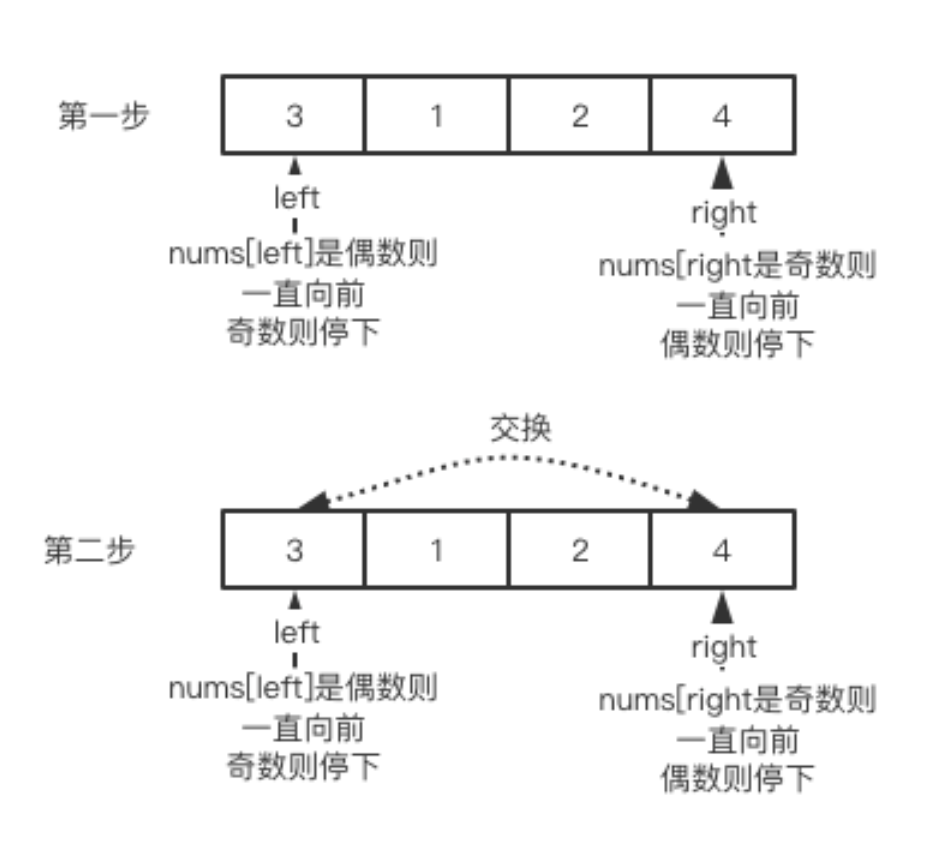

维护两个指针 left=0 和 right=arr.length-1，left从0开始逐个检查每个位置是否为偶数，如果是则跳过，如果是奇数则停下来。然后right从右向左检查，如果是奇数则跳过偶数则停下来。然后交换array[left]和array[right]。之后再继续巡循环，直到left>=right，==**因为left = right时就没有交换的必要了。**==

````java
public static int[] sortArrayByParity(int[] A) {
    int left = 0, right = A.length - 1;
    while (left < right) {
        if (A[left] % 2 > A[right] % 2) {
            int tmp = A[left];
            A[left] = A[right];
            A[right] = tmp;
        }

        if (A[left] % 2 == 0) left++;
        if (A[right] % 2 == 1) right--;
    }

    return A;
}
````

这就是对撞型双指针的解题模板！


## 2.4 **数组轮转问题**

先看题目要求，LeetCode189.给你一个数组，将数组中的元素向右轮转 k 个位置，其中 k 是非负数。

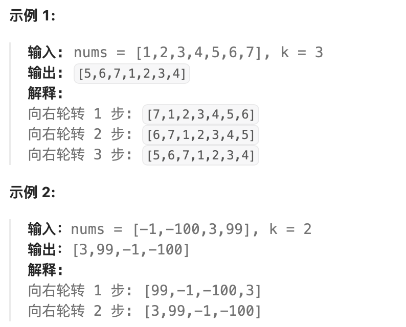

这个题怎么做呢?你是否想到可以逐次移动来实现？理论上可以，但是实现的时候会发现要处理的情况非常多，比较难搞。这里介绍一种简单的方法：==**两轮翻转。**==

方法如下：

1 首先对整个数组实行翻转，例如 [1,2,3,4,5,6,7] 我们先将其整体翻转成[7,6,5,4,3,2,1]。
2 从 k 处分隔成左右两个部分，这里就是根据k将其分成两组 [7,6,5] 和[4,3,2,1]。
3 最后将两个再次翻转就得到[5,6,7] 和[1,2,3,4]，最终结果就是[5,6,7,1,2,3,4]

代码如下：

````java
public void rotate(int[] nums, int k) {
    k %= nums.length; // 确保当 k>nums.length时，去掉不必要的轮转
    reverse(nums, 0, nums.length - 1);
    reverse(nums, 0, k - 1);
    reverse(nums, k, nums.length - 1);
}

public void reverse(int[] nums, int start, int end) {
    while (start < end) {
        int temp = nums[start];
        nums[start] = nums[end];
        nums[end] = temp;
        start += 1;
        end -= 1;
    }
}
````


## 2.5 **数组的区间专题**

数组中表示的数据可能是连续的，也可能是不连续的，如果将连续的空间标记成一个区间，那么我们可以再造几道题，先看一个例子：

LeetCode228.给定一个无重复元素的有序整数数组nums。返回恰好覆盖数组中所有数字的最小有序区间范围列表。也就是说，nums 的每个元素都恰好被某个区间范围所覆盖，并且不存在属于某个范围但不属于 nums 的数字 x 。列表中的每个区间范围 [a,b] 应该按如下格式输出："a->b" ，如果 a != b"a" ，如果 a == b

本题容易让人眼高手低，一眼就看出来结果，但是编程实现则很麻烦。这个题使用双指针也可以非常方便的处理，慢指针指向每个区间的起始位置，快指针从慢指针位置开始向后遍历直到不满足连续递增（或快指针达到数组边界），则当前区间结束；然后将 slow指向更新为 fast + 1，作为下一个区间的开始位置，fast继续向后遍历找下一个区间的结束位置，如此循环，直到输入数组遍历完毕。

````java
public static List<String> summaryRanges(int[] nums) {
    List<String> res = new ArrayList<>();
    // slow 初始指向第 1 个区间的起始位置
    int slow = 0;
    for (int fast = 0; fast < nums.length; fast++) {
        // fast 向后遍历，直到不满足连续递增(即 nums[fast] + 1 != nums[fast + 1])
        // 或者 fast 达到数组边界，则当前连续递增区间 [slow, fast] 遍历完毕，将其写入结果列表。
        if (fast + 1 == nums.length || nums[fast] + 1 != nums[fast + 1]) {
            // 将当前区间 [slow, fast] 写入结果列表
            StringBuilder sb = new StringBuilder();
            sb.append(nums[slow]);
            if (slow != fast) {
                sb.append("->").append(nums[fast]);
            }
            res.add(sb.toString());
            // 将 slow 指向更新为 fast + 1，作为下一个区间的起始位置
            slow = fast + 1;
        }
    }
    return res;
}
````

这个实现的精华是"fast + 1 == nums.length || nums[fast] + 1 != nums[fast + 1]"，我们是用fast+1来进行比较的，如果使用fast比较也可以，但是实现起来会有些case一直过不了，不信你可以试一下。
拓展我们本着不嫌事大的原则，假如这里是要你在上面的情况反过来，找缺失的区间该怎么做呢？

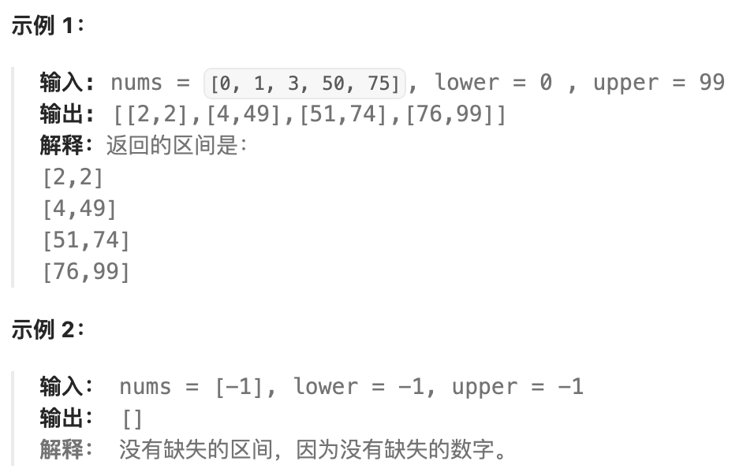

这是LeetCode163题，你可以试着做一下。

````java
public List<List<Integer>> findMissingRanges(int[] nums, int lower, int upper) {
      List<List<Integer>> ranges = new ArrayList<>();

      // 遍历nums中的数字
      for (int num : nums) {
          if (lower < num) {
              // 将区间[lower, num-1]添加进结果集
              ranges.add(Arrays.asList(lower, num - 1));
          }
          lower = num + 1;
      }

      // 遍历完nums之后 如果发现lower依然小于upper
      // 说明这段是缺失的，添加进结果集
      if (lower <= upper) {
          ranges.add(Arrays.asList(lower, upper));
      }

      return ranges;

  }
````


## 2.6 **字符串替换空格问题**

这是剑指offer中的题目，出现频率也很高：请实现一个函数，将一个字符串中的每个空格替换成“%20”。例如，当字符串为We Are Happy.则经过替换之后的字符串为We%20Are%20Happy。

首先要考虑用什么来存储字符串，如果是长度不可变的char数组，那么必须新申请一个更大的空间。如果使用长度可变的空间来管理原始数组，或者原始数组申请得足够大，这时候就可能要求你不能申请O(n)大小的空间，我们一个个看。

首先是如果长度不可变，我们必须新申请一个更大的空间，然后将原始数组中出现空格的位置直接替换成%20即可，代码如下：

````java
public String replaceSpace(StringBuffer str) {
    String res="";
    for(int i=0;i<str.length();i++){
        char c=str.charAt(i);
        if(c==' ')
            res += "%20";
        else
            res += c;
    }
    return res;
}
````

对于第二种情况，我们首先想到的是从头到尾遍历整个字符串，遇到空格的时候就将其后面的元素向后移动2个位置，但是这样的问题在前面说过会导致后面的元素大量移动，时间复杂度为O(n^2)，执行的时候非常容易超时。
比较好的方式是可以先遍历一次字符串，这样可以统计出字符串中空格的总数，由此计算出替换之后字符串的长度，每替换一个空格，长度增加2，即替换之后的字符串长度为:

新串的长度=原来的长度+2*空格数目

接下来从字符串的尾部开始复制和替换，用两个指针fast和slow分别指向原始字符串和新字符串的末尾，然后：slow不动，向前移动fast：

●若指向的不是空格，则将其复制到slow位置，然后fast和slow同时向前一步；
●若fast指向的是空格，则在slow位置插入一个%20，fast则只移动一步。

循环执行上面两步，便可以完成替换。详细过程如下：

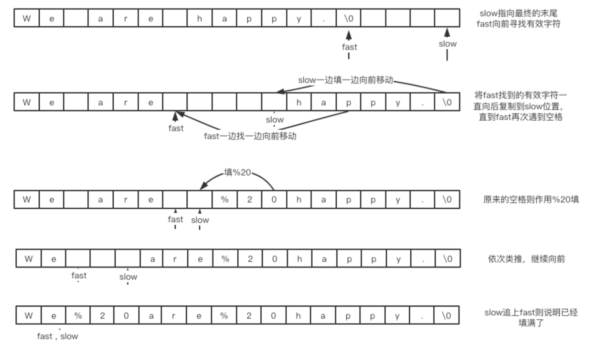

````java
public  String replaceSpace(StringBuffer str) {
    if (str == null)
        return null;
    int numOfblank = 0;//空格数量
    int len = str.length();
    for (int i = 0; i < len; i++) {  //计算空格数量
        if (str.charAt(i) == ' ')
            numOfblank++;
    }
    str.setLength(len + 2 * numOfblank); //设置长度
    int fast = len - 1;  //两个指针
    int slow = (len + 2 * numOfblank) - 1;
    
    while (fast >= 0 && slow > fast) {
        char c = str.charAt(fast);
        if (c == ' ') {
            fast--;
            str.setCharAt(slow--, '0');
            str.setCharAt(slow--, '2');
            str.setCharAt(slow--, '%');
        } else {
            str.setCharAt(slow, c);
            fast--;
            slow--;
        }
    }
    return str.toString();
}
````


