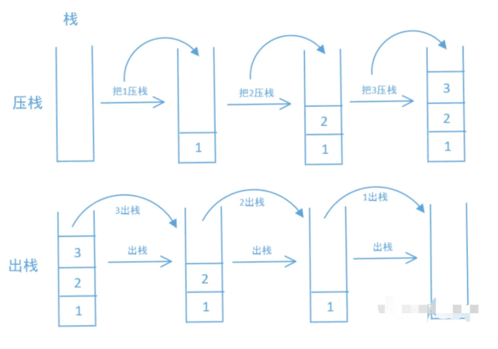
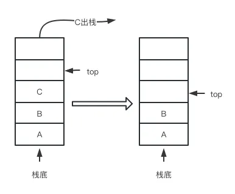
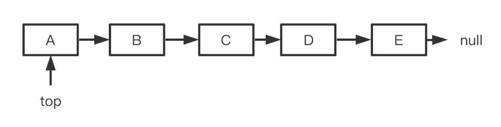
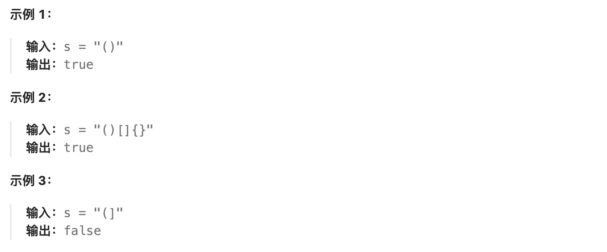
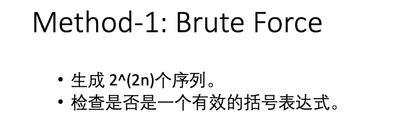

# **1.青铜挑战——理解栈手写栈**

## 1.1 栈基础知识 

### 1.1.1 栈的特征 

栈和队列是比较特殊的线性表，又称之为访问受限的线性表。栈是很多表达式、符号等运算的基础，也是递归的底层实现。理论上递归能做的题目栈都可以，只是有些问题用栈会非常复杂。 

栈底层实现仍然是链表或者顺序表，==栈与线性表的最大区别是数据的存取的操作被限制了，其插入和删除操作只允许在线性表的一端进行。==一般而言，把允许操作的一端称为栈顶(Top)，不可操作的一端称为栈底(Bottom)，同时把插入元素的操作称为入栈(Push),删除元素的操作称为出栈(Pop)。若栈中没有任何元素，则称为空栈，栈的结构如下图：



### 1.1.2栈的操作

栈的常用操作主要有：

==●push(E):增加一个元素E==

==●pop():弹出元素E==

==●peek():显示栈顶元素，但是不出栈==

==●empty():判断栈是否为空==


### 1.1.3 Java和Python中的栈

java的util中就提供了栈Stack类，使用不复杂，看一个例子就够了：

````java
public class MainTest {
    public static void main(String[] args) {
        Stack<Integer> stack = new Stack();
        stack.push(1);
        stack.push(2);
        stack.push(3);
        System.out.println("栈顶元素为：" + stack.peek());
        while (!stack.empty()) {
            //只显示没出栈
            System.out.println(stack.peek());
            //出栈并且显示
            System.out.println(stack.pop());
        }
    }
}
````


## 1.2 基于数组实现栈

==再看具体内容之前，先补充一点，top有的地方指向栈顶元素，有的地方指向栈顶再往上的一个空单位，这个根据题目要求设计就好，如果是面试的时候就直接问面试官，top指向到哪里，本文采用指向栈顶空位置。==

如果要自己实现栈，可以有==数组==、==链表==和==java提供的LinkedList==三种基本方式，我们都看一下。

采用顺序表实现的的栈，内部以数组为基础，实现对元素的存取操作。在应用中还要注意每次入栈之前先判断栈的容量是否够用，如果不够用，可以进行扩容。

入栈过程如下所示：


出栈的过程如图所示：



top先将栈顶元素取出，然后再执行top--。完整的实现代码是：

````java
import java.util.Arrays;

class Mystack<T> {
    //实现栈的数组
    private Object[] stack;
    //栈顶元素
    private int top;

    Mystack() {
        //初始容量为10
        stack = new Object[10];
    }

    //判断是否为空
    public boolean isEmpty() {
        return top == 0;
    }

    //返回栈顶元素
    public T peek() {
        T t = null;
        if (top > 0)
            t = (T) stack[top - 1];
        return t;
    }

    public void push(T t) {
        expandCapacity(top + 1);
        stack[top] = t;
        top++;
    }

    //出栈
    public T pop() {
        T t = peek();
        if (top > 0) {
            stack[top - 1] = null;
            top--;
        }
        return t;
    }

    //扩大容量
    public void expandCapacity(int size) {
        int len = stack.length;
        if (size > len) {
            size = size * 3 / 2 + 1;//每次扩大50%
            stack = Arrays.copyOf(stack, size);
        }
    }
}
````

然后写一个测试类看看上面的方法好不好用：

````java
public static void main(String[] args) {
    Mystack<String> stack = new Mystack<>();
    System.out.println(stack.peek());
    System.out.println(stack.isEmpty());
    stack.push("java");
    stack.push("is");
    stack.push("beautiful");
    stack.push("language");
    System.out.println(stack.pop());
    System.out.println(stack.isEmpty());
    System.out.println(stack.peek());
}
````


## **1.3 基于链表实现栈**

链表也可以实现栈，插入和删除都在头结点进行就可以了。



在链表一章 ，我们介绍过没有虚拟结点时对链表头元素进行插入和删除的操作方法，而与这里基于链表实现栈是完全一致的。

代码实现也不复杂，完整实现如下：

````java
class ListStack<T> {
    //定义链表
    class Node<T> {
        public T t;
        public Node next;
    }
    public Node<T> head;
  
    //构造函数初始化头指针
    ListStack() {
        head = null;
    }
  
    //入栈
    public void push(T t) {
        if (t == null) {
            throw new NullPointerException("参数不能为空");
        }
        if (head == null) {
            head = new Node<T>();
            head.t = t;
            head.next = null;
        } else {
            Node<T> temp = head;
            head = new Node<>();
            head.t = t;
            head.next = temp;
        }
    }
  
    //出栈
    public T pop() {
        if (head == null) {
            return null;
        }
        T t = head.t;
        head = head.next;
        return t;
    }

    //取栈顶元素
    public T peek() {
        if (head == null) {
            return null;
        }
        T t = head.t;
        return t;
    }

    //栈空
    public boolean isEmpty() {
        if (head == null)
            return true;
        else
            return false;
    }
}
````

同样写一个测试类：

````java
public static void main(String[] args) {
    ListStack stack = new ListStack();
    System.out.println(stack.isEmpty());
    stack.push("Java");
    stack.push("is");
    stack.push("beautiful");
    System.out.println(stack.peek());
    System.out.println(stack.pop());
    System.out.println(stack.isEmpty());
}
````


# **2.白银挑战——栈的经典算法问题**

## 2.1 括号匹配问题

栈的典型题目还是非常明显的，**括号匹配**、**表达式计算** 等等几乎都少不了栈，本小节我们就看两个最经典的问题。

首先看题目要求，

LeetCode20. 给定一个只包括 '('，')'，'{'，'}'，'['，']' 的字符串 s ，判断字符串是否有效。有效字符串需满足：

1. 左括号必须用相同类型的右括号闭合。

2. 左括号必须以正确的顺序闭合。



本题还是比较简单的，其中比较麻烦的是如何判断两个符号是不是一组的，==**我们可以用哈希表将所有符号先存储，左半边做key,右半边做value。遍历字符串的时候，遇到左半边符号就入栈，遇到右半边符号就与栈顶的符号比较，不匹配就返回false**==

````java
boolean isValid(String s) {
    if(s.length()<=1){
        return false;
    }
    Map<Character,Character> smap = new HashMap<>();
    smap.put('(',')');
    smap.put('{','}');
    smap.put('[',']');
    
    Stack<Character> stack = new Stack<>();
    
    for(int i=0;i<s.length();i++){
        char item = s.charAt(i);
        if(smap.containsKey(item)){
            stack.push(item);
        }else{
            if(!stack.isEmpty()){
                Character left = stack.pop();
                char rightchar = smap.get(left);
                if(rightchar != item){
                    return false;
                }
            }else {
                return false;
            }
        }
    }
    return stack.isEmpty();
}
````

LeetCode给我们造了十几个括号匹配的问题，都是条件变来变去，但是解决起来有难有易，如果你感兴趣，可以继续研究一下：

Leetcode 20 有效的括号
LeetCode 22 括号生成
LeetCode 32 最长有效括号
LeetCode 301 删除无效的括号
LeetCode 856 括号的分数

### Leetcode20 有效的括号



暴力解法，枚举出所有可能的排列组合然后查看是否valid

````java
````


