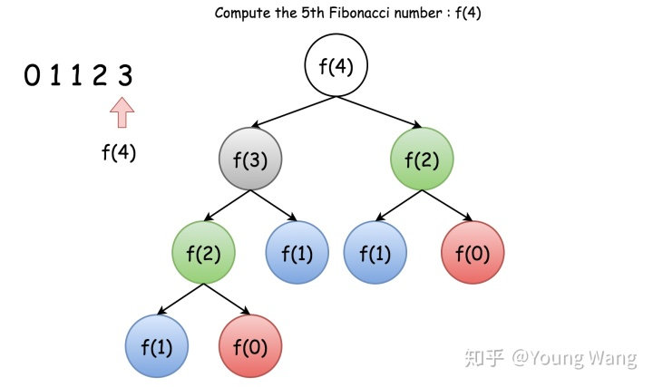
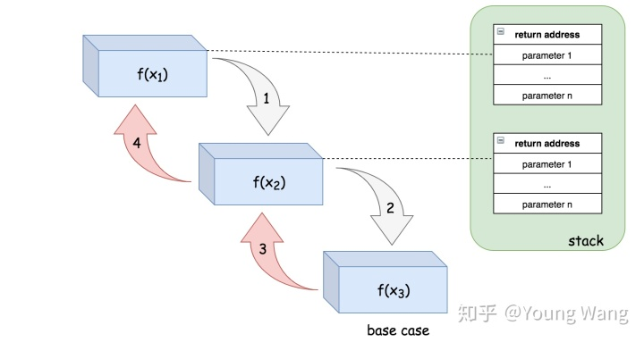

# 全面理解递归

## 1 什么是递归

### 1.1 递归的定义

==递归是一种解决问题的有效方法，在递归过程中，函数将自身作为子例程调用。==

简单说程序调用自身的编程技巧叫递归。递归的思想是==**把一个大型复杂问题层层转化为一个与原问题规模更小的问题，问题被拆解成子问题后，递归调用继续进行，直到子问题无需进一步递归就可以解决的地步为止**。==

使用递归需要避免出现死循环，为了确保递归正确工作，递归程序应该包含2个属性：

1. ==基本情况（bottom cases）==，基本情况用于保证程序调用及时返回，不在继续递归，保证了程序可终止。
2. ==递推关系（recurrentce relation）==，可将所有其他情况拆分到基本案例。


### 1.2 总要停下来 - 基本情况

程序中任何操作都不能无穷无尽的执行下去，递归也不例外，所以递归一定要有一个适当的 **“终止条件”**——也就是说，到此为止不会再产生新的调用。

看个例子——假设我们想求一个n的阶乘，也就是`5!=5*4*3*2*1`这种小学都做过的东西

````java
function N(num){
  //5! = 5 * 4!
  return num*N(num-1);
}

N(5);
````

但这个程序不会正确终止，只会报错。为什么？因为这个函数永远会继续往下调用，但我们知道`1!`其实就“到头了”，因为`1!=1`，所以我们完全可以用1作为终止条件

````java
function N(num){
  if(num<=1)return 1;
  else return num*N(num-1);
}

N(5);
````


### 1.3 万物皆可分 - 递推关系

首先，==**绝大多数问题都可以划分成更小的问题**==，通过求解这些小问题，将结果合并在一起得到原本问题的答案，举几个例子：

- 库存清点：大型仓库如果一个人清点可能要好几个月才能完成
  - 解决方案：找20个人各自负责一块，然后把清点**结果汇总**
- 数组求和：假设有有20G的数据需要求和，需要运行很久才能出结果
  - 解决方案：找100台机器一起跑，每个负责200M，然后把各自的**结果相加**
- 搜索引擎：搜索引擎存储了数万亿页面，依靠单台服务器去找需要很久，但根据我们的经验，搜索结果0.x秒就能出来
  - 解决方案：每台服务器负责一部分数据，然后**将各部分搜索结果合并为最终的搜索结果**

从上面几个简单的例子里可以看出，解决大问题时，==**划分为更小的问题分别解决，然后将结果合并起来**==是一种有用的思路。

递归就是对上面思想的应用——把大问题分解为更小的问题，从而便于求解。譬如，`f(n)` 这个范围比较大，我们可以让 `f(n)=n * f(n-1)`。这样，范围就由 `n` 变成了 `n-1` 了，范围变小了，并且为了原函数 f(n) 不变，我们需要让 f(n-1) 乘以 `n`。==说白了，就是要找到原函数的一个等价关系式子，f(n)的等价关系式为 `n * f(n-1)`，即`f(n) = n * f(n-1)`。==


## 2 两种递归模型

### 2.1 模型一：在递去的过程中解决问题

```java
 function recursion(大规模){
   if (end_condition){   // 明确的递归条件
       end;
   }else{
       solve;            // 递去
       recursion(小规模); // 遇到最深处，不断地归来
   }
 }
```

### 2.2 模型二：在归来的过程中解决问题

```java
 function recursion(大规模){
     if (end_condition){  // 明确的递归条件
         end;  
     }else{  // 先把问题全部展开描述，再由尽头“返回”每次解决中剩余的问题
         recursion(小规模);  // 递去
         solve;             // 归来    
     }
 }
 
```


## 3 什么时候使用递归

有以下特征的问题考虑递归求解：

- ==当问题和子问题具有`递推关系`，譬如杨辉三角，计算阶乘。==
- ==具有`递归性质`的数据结构，譬如链表，树，图。==
- ==反向性问题，比如取反。== 

==总结下来，最根本的还是要**抓住问题本身是否可以通过层层拆解到最小粒度来得解。**==


## 4 和循环的关系

是两种不同解决问的思路，递归是很直白地描述一个问题的解题过程，也是我们最容易想到的。循环和递归都有共同的特性，就是重复做任务，有时候使用循环可能不会清晰地描述问题的解决步骤。单从算法设计上看，递归和循环并无优劣之别。然而，在实际开发中，因为函数调用的开销，递归常常会带来性能问题，**特别是在求解规模不确定的情况下；而循环因为没有函数调用开销，所以效率会比递归高。** 递归求解方式和循环求解方式往往可以互换，也就是说，如果用到递归的地方可以很方便使用循环替换，而不影响程序的阅读，那么替换成循环往往是好的。问题的递归实现转换成非递归实现一般需要两步工作：

- 1）自己开辟堆栈（一些局部变量）来保存这些内容便于来替代系统栈，譬如树的三种非遍历方式（后面会讲到）；
- 2） 把对递归的调用转变为对循环处理。特别地，在下文中我们将给出递归算法的一些经典应用案例，对于这些案例的实现，我们一般会给出递归和非递归的解法，方便你体会。


## 5 简单例子

帕斯卡三角形是排列成三角形的一系列数字。也就是有所耳闻的杨辉三角。 在帕斯卡三角形中，**每一行的最左边和最右边的数字总是 1。 对于其余的每个数字都是前一行中直接位于它上面的两个数字之和**。

下面的插图给出了一个 5 行的帕斯卡三角：


这就是个具有具体行数的帕斯卡三角形。

**递推关系**

让我们从帕斯卡三角形内的递推关系开始。

首先，我们定义一个函数 `f(m,q)`，它将会返回帕斯卡三角形第 `m` 行、第 `q` 列的数字。

我们可以使用下面的公式来表示这一递推关系：

```
f(m,q)=f(m−1,q−1)+f(m−1,q)
```

**基本情况**

可以看到，每行的最左边和最右边的数字是基本情况，在这个问题中，它总是等于 1；

因此，我们可以将基本情况定义如下:

```
f(m,q)=1 where q=1 or m=q(行数等于列数即“最右边”)
```

**演示**

正如我们所看到的，一旦知道了递推关系 和 基本情况，递归函数的实现变得更加直观，特别是在我们用数学表达式表示出这两个元素之后。

下面给出一个例子，展示我们如何用这个公式递归地计算 f(5,3), 也就是 帕斯卡三角形第 `5` 行中的第 `3` 个数。


可以将 f(5,3) 分解为 f(5,3)=f(4,2)+f(4,3)，然后递归地调用f(4,2) 和 f(4,3)：

对于调用的 f(4,2)，我们可以进一步展开它，直到到达基本情况，正如下面描述的： f(4,2)=f(3,1)+f(3,2)=f(3,1)+(f(2,1)+f(2,2))=1+(1+1)=3

对于调用的 f(4,3)，类似地，我们可以将其分解为： f(4,3)=f(3,2)+f(3,3)=(f(2,1)+f(2,2))+f(3,3)=(1+1)+1=3

最后，我们结合上述子问题的结果： `f(5,3)=f(4,2)+f(4,3)=3+3=6`

> 您可能已经注意到递归解决方案可能会导致一些重复的计算，譬如，我们重复计算相同的中间数以获得最后一行中的数字。 假如为了得到 f(5,3) 的结果，我们在 f(4,2) 和 f(4,3)的调用中计算了 f(3,2) 两次，这样重复计算效率肯定不高，下一节我们会给出优化方案来避免重复计算（即记忆术）。


## 6 复杂性分析

上文我们简单提到了递归，递归是算法中一个重要的解法，因此，有必要单拎出来讲讲。

通过本文，你将了解到：

1. 什么是递归，它是怎么工作的？
2. 如何递归地解决问题？
3. 如何分析递归算法的时间复杂度和空间复杂度？
4. 如何更好地应用递归？

本文试图讲透递归，相信你会对递归思想解决问题和自己分析递归算法的时间复杂度更有信心，Let us go。

#### 1.递归原理

#### **1.1.什么是递归，它是如何工作的？**

我们先来看一下递归（recursion）的定义：

> 递归是一种解决问题的有效方法，在递归过程中，函数将自身作为子例程调用。

简单说程序调用自身的编程技巧叫递归。递归的思想是**把一个大型复杂问题层层转化为一个与原问题规模更小的问题，问题被拆解成子问题后，递归调用继续进行，直到子问题无需进一步递归就可以解决的地步为止**。

使用递归需要避免出现死循环，为了确保递归正确工作，递归程序应该包含2个属性：

1. 基本情况（bottom cases），基本情况用于保证程序调用及时返回，不在继续递归，保证了程序可终止。
2. 递推关系（recurrentce relation），可将所有其他情况拆分到基本案例。

**示例**

让我们从一个简单的编程问题开始：

> 以相反的顺序打印字符串。

你可以使用迭代的办法轻而易举地解决这个问题，即从字符串的最后一个字符开始遍历字符串。但是如何递归地解决它呢？

首先，我们可以将所需的函数定义为 printReverse(str[0...n-1])，其中 str[0] 表示字符串中的第一个字符。然后我们可以分两步完成给定的任务：

1. printReverse(str[1...n-1])：以相反的顺序打印子字符串 str[1...n-1] 。
2. print(str[0])：打印字符串中的第一个字符。

请注意，我们在第一步中调用函数本身，根据定义，它使函数递归。

下面给出了代码片段：

```csharp
private static void printReverse(char [] str) {


  helper(0, str);


}


 


 


private static void helper(int index, char [] str) {


 if (str == null || index >= str.length) {


 return;


  }


  helper(index + 1, str);


  System.out.print(str[index]);


}
```

#### 1.2.递归的程序特征

**优雅性**

相比其他解法（比如迭代法），使用递归法，你会发现只需少量程序就可描述出解题过程，大大减少了程序的代码量，而且很好理解。递归的能力在于用有限的语句来定义对象的无限集合。

**反向性**

由于递归调用程序需要维护调用栈，而栈（我们在上文提过）具有后进先出的特征，因此递归程序适合满足取反类需求。我们在第五部分有一些编程实践，比如字符串取反，链表取反等相关有趣的算法问题。

**递推关系**

递归程序可以较明显的发现递推关系，反过来也可以这么说，具有递推关系的问题基本都可以通过递归求解（当然也许有性能更佳的解法，但递归绝对是一种选择）。递推关系常见问题有杨辉三角、阶乘计算（见本文第五小节）。下一节重点讨论一下递推关系。

#### 1.3.什么时候考虑递归

具有以下特征的问题可考虑递归求解：

- 当问题和子问题具有递推关系，比如杨辉三角、计算阶乘（后文讨论）。
- 具有递归性质的数据结构，比如链表、树、图。
- 反向性问题，比如取反。

总结下来，最根本的还是要**抓住问题本身是否可以通过层层拆解到最小粒度来得解。**

#### 2.递归的递推性质

上一节我们说了，在实现递归函数之前，我们需要弄明白2件事：

- 递推关系： 一个问题的结果与其子问题的结果之间的关系。
- 基本情况: 不需要进一步的递归调用就可以直接计算答案的情况。 它们往往是问题被减少到最小规模的情况，*也就是*如果我们认为将问题划分为子问题是一种自上而下的方式的最下层。

一旦我们计算出以上两个元素，再想要实现一个递归函数，就只需要根据递推关系调用函数本身，直到其抵达基本情况。

为了解释以上几点，我们来看一个经典问题：杨辉三角（也叫帕斯卡三角）。

#### 2.1.帕斯卡三角

帕斯卡三角形是排列成三角形的一系列数字。 在帕斯卡三角形中，每一行的最左边和最右边的数字总是 1。 对于其余的每个数字都是前一行中直接位于它上面的两个数字之和。

下面的插图给出了一个 5 行的帕斯卡三角：


根据上面的定义，我们生成一个具有确定行数的帕斯卡三角形。

**递推关系**

让我们从帕斯卡三角形内的递推关系开始。

首先，我们定义一个函数 *f*(*i*,*j*)，它将会返回帕斯卡三角形第 i 行、第 j 列的数字。

我们可以用下面的公式来表示这一递推关系：

*f*(*i*,*j*)=*f*(*i*−1,*j*−1)+*f*(*i*−1,*j*)

**基本情况**

可以看到，每行的最左边和最右边的数字是基本情况，在这个问题中，它总是等于 1。

因此，我们可以将基本情况定义如下:

*f*(*i*,*j*)=1*wherej*=1*orj*=*i*

**演示**

正如我们所看到的，一旦我们定义了 递推关系 和 基本情况，递归函数的实现变得更加直观，特别是在我们用数学公式表示出这两个元素之后。

下面给出一个例子，展示我们如何用这个公式递归地计算 *f*(5,3), *也就是* 帕斯卡三角形第 5 行中的第 3 个数。


我们可以将 *f*(5,3) 分解为 *f*(5,3)=*f*(4,2)+*f*(4,3)，然后递归地调用 *f*(4,2) 和 *f*(4,3)：

- 对于调用的 *f*(4,2)，我们可以进一步展开它，直到到达基本情况，正如下面所描述的：

*f*(4,2)=*f*(3,1)+*f*(3,2)=*f*(3,1)+(*f*(2,1)+*f*(2,2))=1+(1+1)=3

- 对于调用的 *f*(4,3)，类似地，我们可以将其分解为：

*f*(4,3)=*f*(3,2)+*f*(3,3)=(*f*(2,1)+*f*(2,2))+*f*(3,3)=(1+1)+1=3

- 最后，我们结合上述子问题的结果：

*f*(5,3)=*f*(4,2)+*f*(4,3)=3+3=6

您可能已经注意到递归解决方案可能会导致一些重复的计算，例如，我们重复计算相同的中间数以获得最后一行中的数字。 举例说明，为了得到 *f*(5,3) 的结果，我们在 *f*(4,2) 和 *f*(4,3) 的调用中计算了 *f*(3,2) 两次，这样重复计算效率肯定不高，下一节我们会给出优化方案来避免重复计算（即记忆术）。

#### 3.递归复杂性分析

#### 3.1.递归时间复杂度计算

给出一个递归算法，其时间复杂度 O(*T*) 通常是**递归调用的数量**（记作 *R*） 和计算的时间复杂度的乘积（表示为 O(*s*)）的乘积：

O(*T*)=*R*∗O(*s*)

**示例**

在反转字符串问题中，我们需要以相反的顺序打印字符串，解决问题的递归关系可以表示如下：

printReverse(str) = printReverse(str[1...n]) + print(str[0])

其中 str[1...n] 是输入字符串 str 的子串，仅不含前导字符 str[0]。

如您所见，该函数将被递归调用 n 次，其中 n 是输入字符串的大小。在每次递归结束时，我们只是打印前导字符，因此该特定操作的时间复杂度是恒定的，即 O(1)。

总而言之，我们的递归函数 printReverse(str) 的总体时间复杂度为 O(*printReverse*)=*n*∗O(1)=O(*n*)。

**执行树分析递归调用数量**

在分析递归的时间复杂度时，递归调用的数量不一定和N成线性关系，比如斐波那契数的计算（见第五部分），其递推关系被定义为f(n) = f(n-1) + f(n-2)。乍一看，在执行斐波那契函数期间计算递归调用的数量似乎并不简单。

执行树定义

> **执行树**是一个用于表示递归函数的执行流程的树。树中的每个节点都表示递归函数的调用。因此，树中的节点总数对应于执行期间的递归调用的数量。

递归函数的执行树将形成 n 叉树，其中 n 作为递推关系中出现递归的次数。例如，斐波那契函数的执行将形成二叉树，下面的图示展现了用于计算斐波纳契数 f(4) 的执行树。





在 n 层的完全二叉树中，节点的总数为 2*n*−1。因此 ​f(n)​ 中递归数目的上限（尽管不严格）也是 2*n*−1。那么我们可以估计 ​f(n)​ 的时间复杂度为 O(2*n*)。

#### 3.2.递归空间复杂性分析

在计算递归算法的空间复杂度时，应该考虑造成空间消耗的两个部分：递归相关空间（recursion related space）和非递归相关空间（non-recursion related space）。

**递归相关空间**

递归相关空间是指由递归直接引起的内存开销，即用于跟踪递归函数调用的堆栈。为了完成典型的函数调用，系统应该在栈中分配一些空间来保存三个重要信息：

1. 函数调用的返回地址。一旦函数调用完成，程序应该知道返回的位置，即函数调用之前的点。
2. 传递给函数调用的参数。
3. 函数调用中的局部变量。

栈中的这个空间是函数调用期间产生的最小成本。然而，一旦完成函数调用，就会释放该空间。

对于递归算法，函数调用将连续链接直到它们到达基本情况（*也称为* 底层情况）。这意味着用于每个函数调用的空间也会累积。

对于递归算法，如果没有产生其他内存消耗，则此递归引起的空间将是算法的空间上限。

例如，在本文一开始我们提到了反转字符串示例中，我们没有使用额外的内存，因为我们仅仅是打印一个字符。对于每个递归调用，我们假设它可能需要一个最大为某一常量值的空间。并且递归调用最多可以链接 n 次，其中 n 是输入字符串的大小。因此，该递归算法的空间复杂度就是 O(*n*)。

为了更好地说明这一点，接下来我们将会展示递归调用 f(x1) -> f(x2) -> f(x3) 的执行顺序以及栈空间的分配情况。




栈中的空间将会分配给 f(x1) 来调用 f(x2)。类似的情况也同样发生在 f(x2) 中，系统会为 f(x3) 的调用分配另一个空间，最后在 f(x3) 中，我们到达基本情况，因此在 f(x3) 中没有进行进一步的递归调用。

正是由于这些与递归相关的空间消耗，有时可能会遇到称为堆栈溢出的情况，其中为程序分配的堆栈达到其最大空间限制并导致程序最终失败。在设计递归算法时，应该仔细评估在输入规模扩大时是否存在堆栈溢出的可能性，栈溢出是非常容易出错的点，我们在下一节将讨论优化策略。

**非递归相关空间**

正如名称所示，非递归相关空间指的是与递归过程没有直接关系的内存空间，通常包括为全局变量分配的空间（通常在堆中）。

不管是否递归，你都可能需要在任何函数调用之前将问题的输入存储为全局变量。你可能还需要保存递归调用的中间结果（也就是我们即将讨论的**记忆化技术**）。例如，在使用带有记忆化技术的递归算法解决斐波那契数问题时,我们使用映射（map）来跟踪在递归调用期间产生的所有中间斐波那契数。因此，在分析空间复杂度时，我们应该考虑到因采用记忆化技术所导致的空间成本。

#### 4.递归的优化策略

#### 4.1.时间优化策略：记忆化

递归是一种直观而有效的实现算法的方法。 但是，如果我们不明智地使用它，可能会给性能带来一些不希望的损失，*例如*重复计算。 在前面我们提到了帕斯卡三角的重复计算问题，其中一些中间结果被多次计算。

在本文中，我们将进一步研究递归可能出现的重复计算问题。 然后我们将提出一种常用的技术，称为记忆化（memoization），可以用来避免这个问题。

为了演示重复计算的另一个问题，让我们看一个大多数人可能都很熟悉的例子，斐波那契数。 如果我们定义函数 F(n) 表示在索引 n 处的斐波那契数，那么你可以推导出如下的递推关系：

F(n) = F(n - 1) + F(n - 2)

基本情况：

F(0) = 0, F(1) = 1

根据斐波那契数列的定义，可以实现下面的函数：

```csharp
public static int fibonacci(int n) {


 if (n < 2) {


 return n;


  } else {


 return fibonacci(n-1) + fibonacci(n-2);


  }


}
```

现在，如果你想知道 F(4) 是多少，你可以应用上面的公式并进行展开：

F(4) = F(3) + F(2) = (F(2) + F(1)) + F(2)

正如你所看到的，为了得到 f (4)的结果，我们需要在上述推导之后计算两次数 F(2) : 第一次在 F(4) 的第一次展开中，第二次在中间结果 F(3) 中。

下面的树显示了在计算 F(4) 时发生的所有重复计算（按颜色分组）。


为了消除上述情况中的重复计算，正如许多人已经指出的那样，其中一个想法是将中间结果**存储**在缓存中，以便我们以后可以重用它们，而不需要重新计算。

这个想法也被称为*记忆化*，这是一种经常与递归一起使用的技术。

**记忆化定义**

> 记忆化 是一种优化技术，主要用于 **加快**计算机程序的速度，方法是 **存储**昂贵的函数调用的结果，并在相同的输入再次出现时返回缓存的结果。 (来源: 维基百科)

回到斐波那契函数 F(n)。 我们可以使用哈希表来跟踪每个以 n 为键的 F(n) 的结果。 散列表作为一个缓存，可以避免重复计算。 记忆化技术是一个很好的例子，它演示了如何通过增加额外的空间以减少计算时间。

为了便于比较，我们在下面提供了带有记忆化功能的斐波那契数列解决方案的实现。

作为一种练习，您可以尝试使记忆化更加通用和非侵入性，即应用记忆化技术而不改变原来的功能。

```cobol
import java.util.HashMap;


 


public class Main {


 


  HashMap<Integer, Integer> cache = new HashMap<Integer, Integer>();


 


 private int fib(int N) {


 if (cache.containsKey(N)) {


 return cache.get(N);


    }


 int result;


 if (N < 2) {


      result = N;


    } else {


      result = fib(N-1) + fib(N-2);


    }


 // keep the result in cache.


    cache.put(N, result);


 return result;


  }


}
```

斐波那契数应用的一个经典问题是爬楼梯，我们在第五节再分析。

通过记忆化技术，我们保存每个索引 n 对应的的斐波那契数的结果。我们确信每个斐波那契数的计算只会发生一次。而从递推关系来看，斐波纳契数 f(n) 将取决于其所有 n-1 个先验斐波纳契数。结果，计算 f(n) 的递归将被调用 n-1 次以计算它所依赖的所有先验数字。

现在，我们可以计算一下采用了记忆化技术优化后的时间复杂度，即 O(1)∗*n*=O(*n*)。可以得出记忆化技术不仅可以优化算法的时间复杂度，还可以简化时间复杂度的计算。

#### 4.2.空间优化策略：尾递归

上一节我们讨论了递归空间复杂性分析话题，从中我们了解到递归调用在系统调用栈上会产生额外空间，如果递归调用层级很深，程序执行过程中很可能导致栈溢出。针对这种情况，有一种称为尾递归的特殊递归，它可以控制递归导致空间开销的影响。

**尾递归定义**

> 尾递归函数是递归函数的一种，其中递归调用是递归函数中的最后一条指令。并且在函数中应该只有一次递归调用。

尾递归的好处是，它可以避免递归调用期间栈空间开销的累积，因为系统可以为每个递归调用重用栈中的固定空间。可以理解为，在程序执行到递归函数最后一条递归调用指令时回收了当前的栈空间（其实是复用了当前的栈空间），爽歪歪。

我们在第五部分将看到尾递归优化阶乘运算的例子。

#### 5.采用递归解法的几个经典问题

递归在递推关系的数学问题上应用广泛，使用递归法可以解决很多趣味问题，下面我们来看看都有哪些经典问题。

#### 5.1.反转字符串

编写一个函数，其作用是将输入的字符串反转过来。输入字符串以字符数组 char[] 的形式给出。

不要给另外的数组分配额外的空间，你必须**原地修改输入数组**、使用 O(1) 的额外空间解决这一问题。

你可以假设数组中的所有字符都是 ASCII 码表中的可打印字符。

**示例 1：**

**输入：**["h","e","l","l","o"]

**输出：**["o","l","l","e","h"]

**示例 2：**

**输入：**["H","a","n","n","a","h"]

**输出：**["h","a","n","n","a","H"]

分析：此问题是根据递归调用栈的特性做后进先出反转。

代码：

```cobol
 public void reverseString(char[] s) {


        help(s, 0, s.length - 1);


    }


 


 


 private void help(char[] s, int left, int right) {


 if (left >= right) return;


        exch(s, left, right);


        help(s, ++left, --right);


    }


 


 


 private void exch(char[] a, int i, int j) {


 char swap = a[i];


        a[i] = a[j];


        a[j] = swap;


    }
```

#### 5.2.两两交换链表中的节点

给定一个链表，两两交换其中相邻的节点，并返回交换后的链表。

**你不能只是单纯的改变节点内部的值**，而是需要实际的进行节点交换。

**示例:**

给定

```
1->2->3->4
```

, 你应该返回

```
2->1->4->3
```

代码：

```cobol
 public ListNode swapPairs(ListNode head) {


    if (head == null || head.next == null) return head;


        int temp = head.val;


        head.val = head.next.val;


        head.next.val = temp;


 


        ListNode nextHead = swapPairs(head.next.next);


        head.next.next = nextHead;


 


 return head;


    }
```

#### 5.3.杨辉三角

给定一个非负整数 *numRows，*生成杨辉三角的前 *numRows* 行。


在杨辉三角中，每个数是它左上方和右上方的数的和。

**示例:**

**输入:** 5

**输出:**

[

[1],

[1,1],

[1,2,1],

[1,3,3,1],

[1,4,6,4,1]

]

分析：典型的具有递推关系的数据问题，注意通过记忆化优化。

代码：

```cobol
 public List<List<Integer>> generate(int numRows) {


 if (numRows == 0) return Collections.emptyList();


 


 int[][] mem = new int[numRows][numRows];


        List<List<Integer>> res = new ArrayList<>(numRows);


 for (int i = 0; i < numRows; i++) {


            List<Integer> subList = new ArrayList<>(i + 1); 


 for (int j = 0; j <=i; j++)


                subList.add(f(i, j, mem));


            res.add(subList);


        }


 return res;


    }


 


 private int f(int i, int j, int[][] mem) {


 if (mem[i][j] != 0) return mem[i][j];


 if (j == 0 || j == i) {


            mem[i][j] = 1;


 return mem[i][j];


        }


        mem[i][j] = f(i - 1, j - 1, mem) + f(i - 1, j, mem);


 return mem[i][j];


    }
```

#### 5.4.反转链表

反转一个单链表。

**示例:**

**输入:** 1->2->3->4->5->NULL

**输出:** 5->4->3->2->1->NULL

**进阶:**

你可以迭代或递归地反转链表。你能否用两种方法解决这道题？

分析：链表和树是具有递归结构的数据结构。

代码：

```cobol
    public ListNode reverseList(ListNode head) {


 if (head == null || head.next == null) return head;


        ListNode p = reverseList(head.next);


        head.next.next = head;


        head.next = null;


 return p;


    }
```

#### 5.5.合并两个有序链表

将两个升序链表合并为一个新的 **升序** 链表并返回。新链表是通过拼接给定的两个链表的所有节点组成的。

**示例：**

**输入：**1->2->4, 1->3->4

**输出：**1->1->2->3->4->4

分析：链表是典型的具有递归属性的数据结构，链表操作问题一般都可以将问题本身拆分成子问题，直到不能拆解为止，通过递归得解。

代码：

```cobol
 public ListNode mergeTwoLists(ListNode l1, ListNode l2) {


 if (l1 == null) return l2;


 if (l2 == null) return l1;


 


 if (l1.val < l2.val) {


            ListNode subList = mergeTwoLists(l1.next, l2);


            l1.next = subList;


 return l1;


        }


 else { 


            ListNode subList = mergeTwoLists(l1, l2.next);


            l2.next = subList;


 return l2;


        }


    }
```

#### 5.6.**斐波那契数**

**斐波那契数**，通常用 F(n) 表示，形成的序列称为**斐波那契数列**。该数列由 0 和 1 开始，后面的每一项数字都是前面两项数字的和。也就是：

F(0) = 0, F(1) = 1

F(N) = F(N - 1) + F(N - 2), 其中 N > 1.

给定 N，计算 F(N)。

**示例 1：**

**输入：**2

**输出：**1

**解释：**F(2) = F(1) + F(0) = 1 + 0 = 1.

**示例 2：**

**输入：**3

**输出：**2

**解释：**F(3) = F(2) + F(1) = 1 + 1 = 2.

**示例 3：**

**输入：**4

**输出：**3

**解释：**F(4) = F(3) + F(2) = 2 + 1 = 3.

**提示：**

- 0 ≤ N ≤ 30

分析：递归考虑记忆化优化

代码：

```cobol
 public int fib(int N) {


 if (N <= 0) return 0;


 int[] memory = new int[N + 1];


 return help(N, memory);


    }


 


 private int help(int n, int[] memory) {


 if (n == 1 || n == 2) return 1;


 if (memory[n] != 0) return memory[n];


 else memory[n] = help(n - 1, memory) + help(n - 2, memory);


 return memory[n];


    }  
```

#### 5.7.爬楼梯

假设你正在爬楼梯。需要 *n* 阶你才能到达楼顶。

每次你可以爬 1 或 2 个台阶。你有多少种不同的方法可以爬到楼顶呢？

**注意：**给定 *n* 是一个正整数。

**示例 1：**

**输入：** 2

**输出：** 2

**解释：** 有两种方法可以爬到楼顶。

1. 1 阶 + 1 阶
2. 2 阶

**示例 2：**

**输入：** 3

**输出：** 3

**解释：** 有三种方法可以爬到楼顶。

1. 1 阶 + 1 阶 + 1 阶
2. 1 阶 + 2 阶
3. 2 阶 + 1 阶

分析：该问题通过规律发现递推关系就是斐波那契数。

代码：

```cobol
 public int climbStairs(int n) {


 int[] mem = new int[n + 1];


 return help(n, mem);


    }


 


 private int help(int n, int[] mem) {


 if (n <= 0) return 0;


 if (mem[n] > 0) return mem[n];


 


 if (n < 4) {


            mem[n] = n;


        }


 else {


            mem[n] = help(n - 1, mem) + help(n - 2, mem);


        }


 return mem[n];


    }
```

#### 5.8.二叉树的最大深度

给定一个二叉树，找出其最大深度。

二叉树的深度为根节点到最远叶子节点的最长路径上的节点数。

**说明:** 叶子节点是指没有子节点的节点。

**示例：**

给定二叉树 [3,9,20,null,null,15,7]，

3

/

9 20

/

15 7

返回它的最大深度 3 。

分析：二叉树是典型的具有递归属性的数据结构。

代码：

```cobol
 public int maxDepth(TreeNode root) {


 if (root == null) return 0;


 if (root.left == null && root.right == null) return 1;


 return Math.max(maxDepth(root.left), maxDepth(root.right)) + 1;


    }
```

#### 5.9. 计算 x 的 n 次幂函数。

实现 pow(*x*, *n*) ，即计算 x 的 n 次幂函数。

**示例 1:**

**输入:** 2.00000, 10

**输出:** 1024.00000

**示例 2:**

**输入:** 2.10000, 3

**输出:** 9.26100

**示例 3:**

**输入:** 2.00000, -2

**输出:** 0.25000

**解释:** 2-2 = 1/22 = 1/4 = 0.25

**说明:**

- -100.0 < *x* < 100.0
- *n* 是 32 位有符号整数，其数值范围是 [−231, 231 − 1] 。

分析：n可能很大，需要防止栈溢出，可思考尾递归实现。

代码：

```cobol
 public double myPow(double x, int n) {


 return n > 0 ? help(x, n) : 1.0 / help(x, -n);


    }


 


 private double help(double x, int n) {


 if (n == 0) return 1;


 return n % 2 == 0 ? help(x * x, n / 2) : x * help(x * x, n / 2);


    }
```

#### 5.10.第K个语法符号

在第一行我们写上一个 0。接下来的每一行，将前一行中的0替换为01，1替换为10。

给定行数 N 和序数 K，返回第 N 行中第 K个字符。（K从1开始）

**例子:**

**输入:** N = 1, K = 1

**输出:** 0

**输入:** N = 2, K = 1

**输出:** 0

**输入:** N = 2, K = 2

**输出:** 1

**输入:** N = 4, K = 5

**输出:** 1

**解释:**

第一行: 0

第二行: 01

第三行: 0110

第四行: 01101001

**注意：**

1. N 的范围 [1, 30].
2. K 的范围 [1, 2^(N-1)].

分析：识别具有递归关系问题

代码：

```cobol
 public int kthGrammar(int N, int K) {


 if (N == 1 && K == 1) return 0;


 


 int rmd = K % 2;  


 int p = kthGrammar(N - 1, rmd == 0 ? K / 2 : (K + 1) / 2);


 if (p == 0) return rmd == 0 ? 1 : 0;


 else return rmd == 0 ? 0 : 1;


    }
```

#### 总结

现在，我们更加相信递归是一种强大的技术，它使我们能够以一种优雅而有效的方式解决许多问题。同时，它也不是解决任务问题的灵丹妙药。由于时间或空间的限制，并不是所有的问题都可以用递归来解决。递归本身可能会带来一些不希望看到的副作用，如栈溢出。

有时，在解决实际问题时乍一看，我们并不清楚是否可以应用递归算法来解决问题。然而，由于递归的递推性质与我们所熟悉的数学非常接近，用数学公式来推导某些关系总是有帮助的，也就是说**写出递推关系和基本情况**是使用递归算法的前置条件。

只要有可能，就应用**记忆化**。在起草递归算法时，可以从最简单的策略开始。有时，在递归过程中，可能会出现重复计算的情况，例如斐波纳契数（Fibonacci）。在这种情况下，你可以尝试应用 Memoization 技术，它将中间结果存储在缓存中供以后重用，它可以在空间复杂性上稍加折中，从而极大地提高时间复杂性，因为它可以避免代价较高的重复计算。

当堆栈溢出时，**尾递归**可能会有所帮助。

使用递归实现算法通常有几种方法。尾递归是我们可以实现的递归的一种特殊形式。与记忆化技术不同的是，尾递归通过消除递归带来的堆栈开销，优化了算法的空间复杂度。更重要的是，有了尾递归，就可以避免经常伴随一般递归而来的堆栈溢出问题，而尾递归的另一个优点是，与非尾递归相比，尾部递归更容易阅读和理解。这是由于尾递归不存在调用后依赖（即递归调用是函数中的最后一个动作），这一点不同于非尾递归，因此，只要有可能，就应该尽量运用尾递归。

The end.