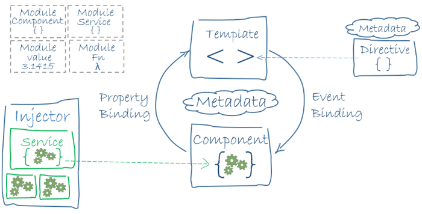
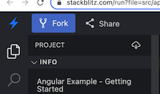

# 介绍

## Angular 文档简介

Angular 是一个应用设计框架与开发平台，旨在创建高效而精致的单页面应用。

这份 Angular 文档会帮助你学习和使用 Angular 框架与开发平台，从你的第一个应用开始，一直到优化复杂的企业级单页面应用。 这些教程和指南中都包含可下载的范例，以加速你的学习。


## 基本假设

本文档假设你已经熟悉了 [HTML](https://developer.mozilla.org/docs/Learn/HTML/Introduction_to_HTML)，[CSS](https://developer.mozilla.org/docs/Learn/CSS/First_steps)，[JavaScript](https://developer.mozilla.org/docs/Web/JavaScript/A_re-introduction_to_JavaScript) 和来自 [最新标准](https://developer.mozilla.org/docs/Web/JavaScript/Language_Resources) 的一些知识，比如 [类](https://developer.mozilla.org/docs/Web/JavaScript/Reference/Classes) 和 [模块](https://developer.mozilla.org/docs/Web/JavaScript/Reference/Statements/import)。 下列代码范例都是用最新版本的 [TypeScript](https://www.typescriptlang.org/) 写的。 大多数 Angular 代码都只能用最新的 JavaScript 编写，它会用 [类型](https://www.typescriptlang.org/docs/handbook/classes.html) 实现依赖注入，还会用[装饰器](https://www.typescriptlang.org/docs/handbook/decorators.html)来提供元数据。


## 私有化部署本文档（译者）

有些企业内部的防火墙比较严格，如果无法打开 [https://angular.cn](https://angular.cn/)，你可以在企业内部进行私有化部署。步骤如下：

本文档的预编译版本位于 [Github](https://github.com/ng-docs/latest.angular.live) 上，如果你想进行私有化部署，请把它 Clone 下来，在 nginx 等服务器上按照静态网站的形式做部署即可，除此之外不需要任何服务端环境。

以 Nginx 为例，你需要在 nginx 上做如下改动：

````
server {
    root /path/to/ng-docs.github.io/;
    location / {
        try_files $uri $uri.html $uri/ /index.html;
    }
}
````

注意其中的 `$uri.html`，这是本文档相对于常规 Angular 应用的主要差别，因为本文档进行了预先渲染（Prerender），这项工作可以让你在不需要 Node 服务器的情况下获得等同于服务端渲染的体验改善。


# 快速上手

## 什么是 Angular ？

本主题会帮你了解 Angular：什么是 Angular？它有哪些优势？当构建应用时它能为你提供什么帮助？

Angular 是一个基于 [TypeScript](https://www.typescriptlang.org/) 构建的开发平台。它包括：

- ==一个基于组件的框架，用于构建可伸缩的 Web 应用==
- ==一组完美集成的库，涵盖各种功能，包括路由、表单管理、客户端-服务器通信等==
- ==一套开发工具，可帮助你开发、构建、测试和更新代码==

借助 Angular，无论单人项目还是企业级应用，你都能获得平台带来的优势。Angular 的设计目标之一就是让更新更容易，因此你可以用最小的成本升级到最新的 Angular 版本。


# 架构概况

Angular是一个框架！它包含很多东西，诸如：数据绑定、路由、动画、表单等，所有这些东西很多不是必选的，你可以**按需索取**。

==一个Angular应用是由一个复杂的组件树组成，组件管理HTML模板渲染、HTML事件与组件类互动，而Service服务处理业务逻辑，最后组件与服务都由DI（依赖注入）负责管理，最后由模块来引导应用启动。==

以下是一个概况图。




### 模块

==一个应用会有成百上千组件，这么多组件，不可能是一下子全部用得到的呀，那要怎么维护呢。==

==比如一个登录功能，可能只需要登录组件、注册组件、忘记密码组件、登录API接口服务、登录状态存储而已呀，我们把这些组件汇聚在一起，然后叫它为模块（Module）。==

Angular框架使用 `NgModule` 来表述，大概长这样：

```typescript
import { NgModule }      from '@angular/core';
import { BrowserModule } from '@angular/platform-browser';
@NgModule({
  imports:      [ BrowserModule ],
  providers:    [ UserService ],
  declarations: [ Login, Register, Froget ],
  exports:      [ UserService ]
})
export class UserModule { }
```

这里有几个属性：

- `imports` 导入别人的组件，比如可能需要一个发送短信获取验证码的功能。
- `providers` 注册API接口服务。通常，在 `NgModule` 的 `providers` 数组或组件（Component）的 `providers` 数组中注册服务。这样，服务就可以在整个模块或者特定组件中被注入和使用
- `declarations` 注册登录、注册、忘记密码组件
- `exports` 如果觉得某个组件或服务要给另一个模块用的，那就导出它

你是不是和我一样觉得，==模块可以让一个业务的功能块更**内聚**==；没错，这就是模块的作用。


### 组件

组件是构成应用的砖块。组件包括三个部分：带有 `@Component()` 装饰器的 TypeScript 类、HTML 模板和样式文件。`@Component()` 装饰器会指定如下 Angular 专属信息：

- ==一个 CSS 选择器，用于定义如何在模板中使用组件。模板中与此选择器匹配的 HTML 元素将成为该组件的实例。==
- ==一个 HTML 模板，用于指示 Angular 如何渲染此组件==
- ==一组可选的 CSS 样式，用于定义模板中 HTML 元素的外观==

下面是一个最小化的 Angular 组件。

````typescript
import { Component } from '@angular/core';

@Component({
  selector: 'hello-world',
  template: `
    <h2>Hello World</h2>
    <p>This is my first component!</p>
  `
})
export class HelloWorldComponent {
  // The code in this class drives the component's behavior.
}
````

要使用此组件，请在模板中编写以下内容：

```html
<hello-world></hello-world>
```

当 Angular 渲染此组件时，生成的 DOM 如下所示：

```html
<hello-world>
    <h2>Hello World</h2>
    <p>This is my first component!</p>
</hello-world>
```

Angular 的组件模型提供了强大的封装能力和直观的应用结构。组件还能让你的应用更容易进行单元测试，并可以提高代码的整体可读性。

有关可以用组件做什么的更多信息，请参见[“组件”](https://angular.cn/guide/component-overview)部分。


### 模板

每个组件都有一个 HTML 模板，用于声明该组件的渲染方式。你可以内联它或用文件路径定义此模板。

Angular 添加了一些语法元素以扩展 HTML，让你可以从组件中插入动态值。当组件的状态更改时，Angular 会自动更新已渲染的 DOM。此功能的应用之一是插入动态文本，如下例子所示。

```html
<p>{{ message }}</p>
```

这里 message 的值来自组件类：

```typescript
import { Component } from '@angular/core';

@Component ({
  selector: 'hello-world-interpolation',
  templateUrl: './hello-world-interpolation.component.html'
})
export class HelloWorldInterpolationComponent {
    message = 'Hello, World!';
}
```

当应用加载组件及其模板时，用户将看到以下内容：

```html
<p>Hello, World!</p>
```

==注意这里所用的双花括号 —— 它们指示 Angular 对其中的内容进行插值。==


Angular 还支持属性绑定，以帮助你设置 HTML 元素的 Property 和 Attribute 的值，并将这些值传给应用的展示逻辑。

```html
<p
  [id]="sayHelloId"
  [style.color]="fontColor">
  You can set my color in the component!
</p>
```

==注意这里所用的方括号 —— 该语法表明你正在将 Property 或 Attribute 绑定到组件类中的值。==

可以声明事件监听器来监听并响应用户的操作，比如按键、鼠标移动、单击和触摸等。你可以通过在圆括号中指定事件名称来声明一个事件监听器：

```html
<button
  type="button"
  [disabled]="canClick"
  (click)="sayMessage()">
  Trigger alert message
</button>
```

前面的例子中调用了一个方法，该方法是在组件类中定义的：

```typescript
sayMessage() {
  alert(this.message);
}
```


以下是在 Angular 模板中插值和绑定的例子：

Under **hello-world-bindings.component.ts**

````typescript
import { Component } from '@angular/core';

@Component ({
  selector: 'hello-world-bindings',
  templateUrl: './hello-world-bindings.component.html'
})
export class HelloWorldBindingsComponent {
  fontColor = 'blue';
  sayHelloId = 1;
  canClick = false;
  message = 'Hello, World';

  sayMessage() {
    alert(this.message);
  }
}
````

Under **hello-world-bindings.component.html**

````html
<button
  type="button"
  [disabled]="canClick"
  (click)="sayMessage()">
  Trigger alert message
</button>

<p
  [id]="sayHelloId"
  [style.color]="fontColor">
  You can set my color in the component!
</p>

<p>My color is {{ fontColor }}</p>
````


可以用[指令](https://angular.cn/guide/built-in-directives)来为模板添加额外功能。Angular 中最常用的指令是 `*ngIf` 和 `*ngFor`。你可以使用指令执行各种任务，比如动态修改 DOM 结构。你还可以用自定义指令来创建出色的用户体验。

以下代码是 `*ngIf` 指令的例子：

Under **hello-world-ngif.component.ts**

````typescript
import { Component } from '@angular/core';

@Component({
  selector: 'hello-world-ngif',
  templateUrl: './hello-world-ngif.component.html'
})
export class HelloWorldNgIfComponent {
  message = "I'm read only!";
  canEdit = false;

  onEditClick() {
    this.canEdit = !this.canEdit;
    if (this.canEdit) {
      this.message = 'You can edit me!';
    } else {
      this.message = "I'm read only!";
    }
  }
}
````

Under **hello-world-ngif.component.html**

````html
<h2>Hello World: ngIf!</h2>

<button type="button" (click)="onEditClick()">Make text editable!</button>

<div *ngIf="canEdit; else noEdit">
    <p>You can edit the following paragraph.</p>
</div>

<ng-template #noEdit>
    <p>The following paragraph is read only. Try clicking the button!</p>
</ng-template>

<p [contentEditable]="canEdit">{{ message }}</p>
````

Angular 的声明式模板使让可以将应用的逻辑和外观完全分开。模板基于标准 HTML，因此易于构建、维护和更新。

关于模板用法和用途的更多信息，请参见[“模板”](https://angular.cn/guide/template-syntax)部分。


### 元数据

Angular冲刺大量元数据，不管是组件、指令、模块等等都离不开它。

元数据的目的是**为目标添加特定约束**——目标可能是组件、指令、模块等。

比如限定组件只能使用 `<login></login>` 调用。

```typescript
@Component({
    selector: 'login'
})
```


### 指令

指令就是一个**无模板**组件，使用 `@Directive` 装饰器。

Angular提供丰富的内置指令，但分成结构型和属性型两类。

**结构型**

会改变 DOM 结构的指令，例如：`*ngFor`、`*ngIf`、`*ngSwitch`。

**属性型**

会改变 DOM 元素的外观或行为，例如：`[ngClass]`、`[ngStyle]` 及 HTML5 标签属性（`[src]`、`[href]`、`(click)`）。


### 服务类

服务类就是一个简单的 Class 类；==主要作用是用于业务逻辑、HTTP通信、数据存储等，从而可以隔离组件的业务逻辑。==

那为什么要这么做，因为好像很麻烦呀。

1. 从测试角度出发呢？测试一个 Class 比测试一个组件简单得多了，那为何不这么做？
2. 组件会在需要的时候才被实例，销毁后数据会丢失。
3. 服务是单例对象，仅会实例一次，在整个应用有效。


### 依赖注入

依赖注入，这是整个Angular框架的核心，同软件工程的DI一样，DI最大的目的是==**减少依赖关系**、**易测试**。==

依赖注入让你可以声明 TypeScript 类的依赖项，而无需操心如何实例化它们，Angular 会为你处理这些琐事。这种设计模式能让你写出更加可测试、也更灵活的代码。尽管了解依赖注入对于开始用 Angular 并不是至关重要的事，但我们还是强烈建议你将其作为最佳实践，并且 Angular 自身的方方面面都在一定程度上利用了它。

为了说明依赖注入的工作原理，请考虑以下例子。第一个文件 `logger.service.ts` 中定义了一个 `Logger` 类。它包含一个 `writeCount` 函数，该函数将一个数字记录到控制台。

```typescript
import { Injectable } from '@angular/core';

@Injectable({providedIn: 'root'})
export class Logger {
  writeCount(count: number) {
    console.warn(count);
  }
}
```

接下来，`hello-world-di.component.ts` 文件中定义了一个 Angular 组件。该组件包含一个按钮，它会使用此 Logger 类的 `writeCount` 函数。要访问此功能，可通过向构造函数中添加 `private logger: Logger` 来把 `Logger` 服务注入到 `HelloWorldDI` 类中。

```typescript
import { Component } from '@angular/core';
import { Logger } from '../logger.service';

@Component({
  selector: 'hello-world-di',
  templateUrl: './hello-world-di.component.html'
})

export class HelloWorldDependencyInjectionComponent  {
  count = 0;

  constructor(private logger: Logger) { }

  onLogMe() {
    this.logger.writeCount(this.count);
    this.count++;
  }
}
```

有关依赖注入和 Angular 的更多信息，请参见 Angular 中的[依赖注入](https://angular.cn/guide/dependency-injection)部分。


### Angular CLI

Angular CLI 是开发 Angular 应用程序的最快、直接和推荐的方式。Angular CLI 能简化许多任务。例如：

| 命令                                           | 详情                                                        |
| :--------------------------------------------- | :---------------------------------------------------------- |
| [ng build](https://angular.cn/cli/build)       | 把 Angular 应用编译到一个输出目录中。                       |
| [ng serve](https://angular.cn/cli/serve)       | 构建你的应用并启动开发服务器，当有文件变化时就重新构建。    |
| [ng generate](https://angular.cn/cli/generate) | 基于原理图（schematic）生成或修改某些文件。                 |
| [ng test](https://angular.cn/cli/test)         | 在指定的项目上运行单元测试。                                |
| [ng e2e](https://angular.cn/cli/e2e)           | 构建一个 Angular 应用并启动开发服务器，然后运行端到端测试。 |

Angular CLI 是一种用于构建应用程序的有价值的工具。

有关 Angular CLI 的更多信息，请参阅 [“Angular CLI 参考手册”](https://angular.cn/cli)部分。


### 自带库

[“Angular 应用：基本知识”](https://angular.cn/guide/what-is-angular#essentials)部分提供了构建 Angular 应用时要用到的几个关键架构元素的简要描述。但是，当你的应用不断成长并且想要添加其他功能（比如站点导航或用户输入）时，Angular 的许多优势才会真正显现出来。届时，你可以通过 Angular 平台，来引入 Angular 所提供的众多自带库之一。

你可以使用的一些库包括：

| 库                                                           | 详情                                                         |
| :----------------------------------------------------------- | :----------------------------------------------------------- |
| [Angular 路由器](https://angular.cn/guide/router)            | 高级的客户侧导航功能与基于 Angular 组件的路由机制。支持惰性加载、嵌套路由、自定义路径匹配规则等。 |
| [Angular 表单](https://angular.cn/guide/forms-overview)      | 统一的表单填报与验证体系。                                   |
| [Angular HttpClient](https://angular.cn/guide/http)          | 健壮的 HTTP 客户端库，它可以支持更高级的客户端-服务器通讯。  |
| [Angular 动画](https://angular.cn/guide/animations)          | 丰富的动画体系，用于驱动基于应用状态的动画。                 |
| [Angular PWA](https://angular.cn/guide/service-worker-intro) | 一些用于构建渐进式 Web 应用（PWA）的工具，包括 Service Worker 和 Web 应用清单（Manifest）。 |
| [Angular 原理图](https://angular.cn/guide/schematics)        | 一些搭建脚手架、重构和升级的自动化工具。用于简化大规模应用的开发。 |

这些库在扩展应用能力的同时，还能让你将更多精力放在那些令你的应用与众不同的功能上。你可以添加这些库，并相信它们能与 Angular 框架无缝集成并同步更新。

只有当它们可以帮你向应用中添加功能或解决特定的问题时，你才需要这些库。


### 结语

本主题旨在帮你了解 Angular：什么是 Angular？它有哪些优势？当构建应用时它能为你提供什么帮助？

要实际使用 Angular，请参阅我们的[入门](https://angular.cn/start)教程。本教程使用 [stackblitz.com](https://stackblitz.com/)，因此你可以浏览 Angular 的可工作范例，而不必先做任何安装工作。

建议阅读以下部分来进一步探索 Angular 的特性：

- [了解 Angular](https://angular.cn/guide/understanding-angular-overview)
- [Angular 开发人员指南](https://angular.cn/guide/developer-guide-overview)


## Angular 入门

### 快速上手

本教程将通过构建一个电子商务网站，向你介绍 Angular 的基本知识。该网站具有商品名录、购物车和结账表单。

为了帮助你更好地起步，本教程提供了一个已完成的应用，你可以在 [Stackblitz](https://stackblitz.com/) 上试验及互动，而不用[建立本地开发环境](https://angular.cn/guide/setup-local)。StackBlitz 是一个基于浏览器的开发环境，你可以在其中使用各种技术来创建、保存和共享项目。


### 浏览范例应用

你可以用组件构建 Angular 应用。组件定义了 UI 中的职责范围，让你可以复用某些 UI 功能集。

一个组件由三部分组成：

| 部分         | 详情             |
| :----------- | :--------------- |
| 组件类       | 处理数据和功能。 |
| HTML 模板    | 决定 UI。        |
| 组件专属样式 | 定义外观和感觉。 |

本指南演示了如何使用下列组件构建应用：

| 组件                   | 详情                                     |
| :--------------------- | :--------------------------------------- |
| `<app-root>`           | 第一个加载的组件，并且是其他组件的容器。 |
| `<app-top-bar>`        | 商店名称和结帐按钮。                     |
| `<app-product-list>`   | 产品列表。                               |
| `<app-product-alerts>` | 包含应用中各种通知的组件。               |


有关组件的更多信息，请参见[组件简介](https://angular.cn/guide/architecture-components)。


### 创建范例项目

要创建范例项目，请[在 StackBlitz 中生成一个预置的范例项目](https://angular.cn/generated/live-examples/getting-started-v0/stackblitz.html)。要保存你的工作，请执行以下操作：

1. 登录到 StackBlitz。
2. 对你生成的项目进行分支。
3. 定时保存。



在 StackBlitz 中，右侧的预览窗格会显示范例应用的启动状态。此预览有两个区域：

- 带有商店名称（`My Store`）和结账按钮的顶部栏
- 产品列表（`Products`）及其标题


左侧的项目区显示了构成本应用的源文件，包括基础结构和配置文件。

当你生成本教程随附的 StackBlitz 范例应用时，StackBlitz 会为你创建启动程序文件和模拟数据。本教程中用到的文件位于 `src` 文件夹中。

有关如何使用 StackBlitz 的更多信息，请参见 [StackBlitz 的文档](https://developer.stackblitz.com/docs/platform)。


### 创建产品列表

在本节中，你将修改应用以显示产品列表。你会用到来自 `products.ts` 文件的预定义产品数据，和一些来自 `product-list.component.ts` 文件的方法。本节将指导你完成编辑 HTML（也称为模板）的过程。

1. 在 `product-list` 文件夹中，打开模板文件 `product-list.component.html`。

2. 在 `<div>` 上添加一个结构型指令 `*ngFor`，如下所示。

   src/app/product-list/product-list.component.html

   ```html
   <h2>Products</h2>
   
   <div *ngFor="let product of products">
   </div>
   ```

   ==使用 `*ngFor`，会把这个 `<div>` 针对列表中的每个产品进行复写。==

   结构型指令会通过添加、删除和操作元素来调整或重塑 DOM 结构。有关结构型指令的更多信息，请参见[结构型指令](https://angular.cn/guide/structural-directives)。

3. 在此 `<div>` 中，添加 `<h3>` 和 `{{ product.name }}`。`{{ product.name }}` 语句是 Angular 插值语法的范例。插值 `{{ }}` 可以让你把属性值渲染为文本。

   src/app/product-list/product-list.component.html

   ```html
   <h2>Products</h2>
   
   <div *ngFor="let product of products">
   
     <h3>
         {{ product.name }}
     </h3>
   
   </div>
   ```

   预览窗格将会更新，以显示列表中每个商品的名称。

   

4. 为了让每个商品名称都能链接到商品详情，请围绕 `{{ product.name }}` 添加一个 `<a>` 元素。

5. 使用 `[ ]` 语法将标题设置为此产品的名称，如下所示：

   src/app/product-list/product-list.component.html

   ```html
   <h2>Products</h2>
   
   <div *ngFor="let product of products">
   
     <h3>
       <a [title]="product.name + ' details'">
         {{ product.name }}
       </a>
     </h3>
   
   </div>
   ```

   在预览窗格中，将鼠标悬停在产品名称上，可以查看所绑定的 name 属性值，该值是产品名加上单词 “details”。通过属性绑定 `[ ]` 可以在模板表达式中使用属性值。

   

6. 添加产品说明。在 `<p>` 元素上使用 `*ngIf` 指令，以便 Angular 只让当前产品有描述 `<p>`。

   src/app/product-list/product-list.component.html

   ```html
   <h2>Products</h2>
   
   <div *ngFor="let product of products">
   
     <h3>
       <a [title]="product.name + ' details'">
         {{ product.name }}
       </a>
     </h3>
   
     <p *ngIf="product.description">
       Description: {{ product.description }}
     </p>
   
   </div>
   ```

   现在，该应用将在列表中显示每个产品的名称和描述。请注意，最后一项产品没有描述段落。Angular 不会创建 `<p>` 元素，因为此产品的 description 属性为空。

   

7. 添加一个按钮，以便用户可以共享产品。将按钮的 `click` 事件绑定到 `product-list.component.ts` 中的 `share()` 方法。事件绑定要在此事件用一组圆括号 `( )` 括起来，就比如 `<button>` 元素上的 `(click)`。

   src/app/product-list/product-list.component.html

   ```
   content_copy<h2>Products</h2>
   
   <div *ngFor="let product of products">
   
     <h3>
       <a [title]="product.name + ' details'">
         {{ product.name }}
       </a>
     </h3>
   
     <p *ngIf="product.description">
       Description: {{ product.description }}
     </p>
   
     <button type="button" (click)="share()">
       Share
     </button>
   
   </div>
   ```

   每个产品现在都有一个 “**Share**” 按钮。

   

   单击 “**Share**” 按钮将触发一条通知，指出 “The product has been shared!”。

   

在编辑模板时，你已经了解了 Angular 模板的一些最常用的功能。更多信息，请参阅[组件和模板简介](https://angular.cn/guide/architecture-components#template-syntax)。


### 将数据传递给子组件

目前，产品列表中显示了每个产品的名称和描述。`ProductListComponent` 还定义了一个 `products` 属性，包含从 `products.ts` 的 `products` 数组导入的各个产品的数据。

下一步是创建一个新的通知功能，该功能会使用来自 `ProductListComponent` 的产品数据。通知会检查产品的价格，如果价格大于 700 美元，则会显示 **Notify Me** 按钮，当产品上市销售时，用户可以通过该按钮注册通知。

本节将引导你创建一个子组件 `ProductAlertsComponent`，该子组件可以从其父组件 `ProductListComponent` 接收数据。

1. 点击当前终端上方的加号，新建一个终端，运行命令生成组件。

   

2. 在新终端中，通过运行以下命令生成一个名为 `product-alerts` 的新组件：

   ```shell
   ng generate component product-alerts
   ```

   该生成器会为组件的三个部分创建初始文件：

   - `product-alerts.component.ts`
   - `product-alerts.component.html`
   - `product-alerts.component.css`

3. 打开 `product-alerts.component.ts`。`@Component()` 装饰器会指出它后面的类是组件。`@Component()` 还会提供有关组件的元数据，包括其选择器、模板和样式。

   src/app/product-alerts/product-alerts.component.ts

   ```typescript
   @Component({
     selector: 'app-product-alerts',
     templateUrl: './product-alerts.component.html',
     styleUrls: ['./product-alerts.component.css']
   })
   export class ProductAlertsComponent {
   
   }
   ```

   `@Component()` 中的主要功能如下：

   - ==`selector`（`app-product-alerts`）用于标识组件。按照惯例，Angular 组件选择器以前缀 `app-` 开头，后跟组件名称。==
   - ==模板和样式文件名引用了组件的 HTML 和 CSS。==
   - ==这个 `@Component()` 定义还导出了类 `ProductAlertsComponent`，该类会处理组件的功能。==

4. 要将 `ProductAlertsComponent` 设置为接收产品数据，请首先从 `@angular/core` 中导入符号 `Input`。

   src/app/product-alerts/product-alerts.component.ts

   ```ts
   import { Component, Input } from '@angular/core';
   import { Product } from '../products';
   ```

5. 在 `ProductAlertsComponent` 类定义中，使用 `@Input()` 装饰器定义一个名为 `product` 的属性。`@Input()` 装饰器指出此属性值要从本组件的父组件 `ProductListComponent` 中传入。

   src/app/product-alerts/product-alerts.component.ts

   ```ts
   export class ProductAlertsComponent {
   
     @Input() product: Product | undefined;
   
   }
   ```

6. 打开 `product-alerts.component.html` 并将占位符段落替换为 **Notify Me** 按钮，如果产品价格超过 700 美元，就会出现此按钮。

   src/app/product-alerts/product-alerts.component.html

   ```typescript
   <p *ngIf="product && product.price > 700">
     <button type="button">Notify Me</button>
   </p>
   ```

7. 生成器会自动把 `ProductAlertsComponent` 添加到 `AppModule` 中，以便它能用于本应用的其它组件中。

   src/app/app.module.ts

   ```ts
   import { ProductAlertsComponent } from './product-alerts/product-alerts.component';
   
   @NgModule({
     declarations: [
       AppComponent,
       TopBarComponent,
       ProductListComponent,
       ProductAlertsComponent,
     ],
   ```

8. 最后，要将 `ProductAlertsComponent` 显示为 `ProductListComponent` 的子级，请将 `<app-product-alerts>` 元素添加到 `product-list.component.html` 中。使用属性绑定将当前产品作为输入传给此组件。

   src/app/product-list/product-list.component.html

   ```html
   <button type="button" (click)="share()">
     Share
   </button>
   
   <app-product-alerts
     [product]="product">
   </app-product-alerts>
   ```

这个新的产品通知组件将产品作为产品列表中的输入。使用该输入，它将根据产品的价格显示或隐藏 **Notify Me** 按钮。Phone XL 的价格超过了 700 美元，因此该产品上会显示 **Notify Me** 按钮。


### 将数据传递到父组件

为了使 **Notify Me** 按钮起作用，子组件需要通知并将数据传递给父组件。当用户单击 **Notify Me** 时 `ProductAlertsComponent` 需要引发一个事件，并且 `ProductListComponent` 需要响应此事件。

在新建组件时，Angular 生成器会包含一个空的 `constructor()`、`OnInit` 接口和 `ngOnInit()` 方法。由于这些步骤不会使用它们，下列范例代码中都省略了它们，以求简洁。

1. 在 `product-alerts.component.ts` 中，从 `@angular/core` 导入符号 `Output` 和 `EventEmitter`。

   src/app/product-alerts/product-alerts.component.ts

   ```
   content_copyimport { Component, Input, Output, EventEmitter } from '@angular/core';
   import { Product } from '../products';
   ```

2. 在组件类中，使用 `@Output()` 装饰器和 `EventEmitter()` 的实例定义一个名为 `notify` 的属性。==使用 `@Output()` 配置 `ProductAlertsComponent`，这会让 `ProductAlertsComponent` 在 `notify` 属性的值发生变化时引发一个事件。==

   src/app/product-alerts/product-alerts.component.ts

   ```
   content_copyexport class ProductAlertsComponent {
     @Input() product: Product | undefined;
     @Output() notify = new EventEmitter();
   }
   ```

3. 在 `product-alerts.component.html` 中，修改 **Notify Me** 按钮，增加事件绑定，并调用 `notify.emit()` 方法。

   src/app/product-alerts/product-alerts.component.html

   ```
   content_copy<p *ngIf="product && product.price > 700">
     <button type="button" (click)="notify.emit()">Notify Me</button>
   </p>
   ```

4. 定义用户单击按钮时发生的行为。当子组件引发事件时，父组件 `ProductListComponent`（而不是 `ProductAlertsComponent`）会采取行动。在 `product-list.component.ts` 中，定义一个 `onNotify()` 方法，类似于 `share()` 方法。

   src/app/product-list/product-list.component.ts

   ```
   content_copyexport class ProductListComponent {
   
     products = [...products];
   
     share() {
       window.alert('The product has been shared!');
     }
   
     onNotify() {
       window.alert('You will be notified when the product goes on sale');
     }
   }
   ```

5. 更新 `ProductListComponent`，以从 `ProductAlertsComponent` 中接收数据。

   在 `product-list.component.html` 中，将 `<app-product-alerts>` 绑定到产品列表组件的 `onNotify()` 方法。`<app-product-alerts>` 会显示 **Notify Me** 按钮的内容。

   src/app/product-list/product-list.component.html

   ```
   content_copy<button type="button" (click)="share()">
     Share
   </button>
   
   <app-product-alerts
     [product]="product" 
     (notify)="onNotify()">
   </app-product-alerts>
   ```

6. 单击 **Notify Me** 按钮以触发一条通知，内容为："You will be notified when the product goes on sale"。

   

有关组件之间的通信的更多信息，请参见[组件交互](https://angular.cn/guide/component-interaction)。


### 添加导航

在此阶段，本在线商店应用会拥有基本的产品目录。

在以下各节中，你将向应用添加以下功能：

- 在地址栏中键入 URL 以导航到相应的产品页面
- 单击页面上的链接以在单页应用中导航
- 单击浏览器的后退和前进按钮以直观地在浏览器的历史记录中浏览


### 关联 URL 路径与组件

本应用已经用 Angular `Router` 导航到了 `ProductListComponent`。本节将介绍如何定义显示单个产品详情的路由。

1. 生成用于展示产品详情的新组件。在终端窗口运行如下命令来生成一个新的 `product-details` 组件：

   ```shell
   ng generate component product-details
   ```

2. 在 `app.module.ts` 中，添加产品详情的路由，其 `path` 为 `products/:productId`，其 `component` 为 `ProductDetailsComponent`。

   src/app/app.module.ts

   ```typescript
   @NgModule({
     imports: [
       BrowserModule,
       ReactiveFormsModule,
       RouterModule.forRoot([
         { path: '', component: ProductListComponent },
         { path: 'products/:productId', component: ProductDetailsComponent },
       ])
     ],
     declarations: [
       AppComponent,
       TopBarComponent,
       ProductListComponent,
       ProductAlertsComponent,
       ProductDetailsComponent,
     ],
   ```

3. 打开 `product-list.component.html`。

4. 修改产品名称上的链接，使其包括以 `product.id` 为参数的 `routerLink`。

   src/app/product-list/product-list.component.html

   ```
   content_copy<div *ngFor="let product of products">
   
     <h3>
       <a
         [title]="product.name + ' details'"
         [routerLink]="['/products', product.id]">
         {{ product.name }}
       </a>
     </h3>
   
     <!-- . . . -->
   
   </div>
   ```

   `RouterLink` 指令可帮助你自定义 a 元素。在这里，路由或 URL 中包含一个固定的区段 `/products`。最后一段则是变量，插入当前产品的 `id`。比如，`id` 为 1 的产品的 URL 是 `https://getting-started-myfork.stackblitz.io/products/1`。

5. 通过单击产品名称，验证路由器是否如预期般工作。应用中应该显示 `ProductDetailsComponent` 组件，其显示的内容为 “product-details works!”。

   请注意，预览窗口中的 URL 发生了变化。最后一个部分是 `products/#`，其中 `#` 表示你单击的路由的编号。

   

### 查看产品详情

`ProductDetailsComponent` 会处理每个产品的显示工作。Angular 路由器会根据浏览器的 URL 和[你定义的路径](https://angular.cn/start/start-routing#define-routes)来显示组件。

在本节中，你将使用 Angular 路由器来组合 `products` 数据和路由信息以显示每个产品的特定详情。

1. 在 `product-details.component.ts` 中，从 `@angular/router` 导入 `ActivatedRoute`，并从 `../products` 导入 `products` 数组。

   src/app/product-details/product-details.component.ts

   ```ts
   import { Component, OnInit } from '@angular/core';
   import { ActivatedRoute } from '@angular/router';
   
   import { Product, products } from '../products';
   ```

2. 定义 `product` 属性。

   src/app/product-details/product-details.component.ts

   ```ts
   export class ProductDetailsComponent implements OnInit {
   
     product: Product | undefined;
     /* ... */
   }
   ```

3. 通过把 `private route: ActivatedRoute` 添加为构造函数括号内的参数，来把 `ActivatedRoute` 注入到 `constructor()` 中。

   src/app/product-details/product-details.component.ts

   ```
   content_copyexport class ProductDetailsComponent implements OnInit {
   
     product: Product | undefined;
   
     constructor(private route: ActivatedRoute) { }
   
   }
   ```

   Angular 路由器加载的每个组件都有自己专属的 `ActivatedRoute`。`ActivatedRoute` 中包含有关路由和路由参数的信息。

   通过注入 `ActivatedRoute`，你可以配置此组件以使用服务。[管理数据](https://angular.cn/start/start-data)那一步将更详细地介绍服务。

4. 在 `ngOnInit()` 方法中，从路由参数中提取 `productId`，并在 `products` 数组中找到相应的产品。

   src/app/product-details/product-details.component.ts

   ```
   content_copyngOnInit() {
     // First get the product id from the current route.
     const routeParams = this.route.snapshot.paramMap;
     const productIdFromRoute = Number(routeParams.get('productId'));
   
     // Find the product that correspond with the id provided in route.
     this.product = products.find(product => product.id === productIdFromRoute);
   }
   ```

   路由参数与你在此路由中定义的路径变量相对应。要访问路由参数，我们使用 `route.snapshot`，它是一个 `ActivatedRouteSnapshot`，其中包含有关该特定时刻的活动路由信息。与此路由匹配的 URL 提供了 `productId`。Angular 会使用 `productId` 来显示每个唯一产品的详情。

5. 更新 `ProductDetailsComponent` 的模板以显示带有 `*ngIf` 的产品详情。如果产品存在，则此 `<div>` 会显示名称、价格和说明。

   src/app/product-details/product-details.component.html

   ```
   content_copy<h2>Product Details</h2>
   
   <div *ngIf="product">
     <h3>{{ product.name }}</h3>
     <h4>{{ product.price | currency }}</h4>
     <p>{{ product.description }}</p>
   </div>
   ```

   `<h4>{{ product.price | currency }}</h4>` 这一行，使用 `currency` 管道将 `product.price` 从数字转换为货币字符串。管道是一种可以在 HTML 模板中转换数据的方式。有关 Angular 管道的更多信息，请参见[管道](https://angular.cn/guide/pipes)。

当用户单击产品列表中的名称时，路由器会将其导航到产品的不同 URL，显示此 `ProductDetailsComponent`，并展示产品详情。


有关 Angular 路由器的更多信息，请参见[路由与导航](https://angular.cn/guide/router)。
