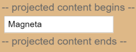

# Angular 组件概述

Angular应用比喻大楼的话，那组件就是每一个房间。一个房间是有着独立的完整的居住功能。

==组件类控制模板的渲染，换句话说**Angular的渲染是靠数据**，理解这一点非常重要。==

组件是 Angular 应用的主要构造块。每个组件包括如下部分：

- ==一个 HTML 模板，用于声明页面要渲染的内容==
- ==一个用于定义行为的 TypeScript 类==
- ==一个 CSS 选择器，用于定义组件在模板中的使用方式==
- ==（可选）要应用在模板上的 CSS 样式==

通过 `@Component` 装饰器，可以快速告诉Angular这个组件是什么样的。

```typescript
@Component({
  selector: 'app-root',
  templateUrl: './app.component.html',
  styleUrls: ['./app.component.scss']
})
export class AppComponent { }
```

这里传递了三个信息：

- ==`selector` 给组件设个门牌号，当这个组件被使用时，用它来告诉组件所处的位置。==
- ==`templateUrl` 告诉组件布局是什么样子的。==
- ==`styleUrls` 告诉组件应该粉刷成什么样子的。==


### selector

一个带有语义的名称对于定位非常重要，因为组件最终在DOM树中会以 `<app-root></app-root>` 这样的标签存在。

有很多文章或人会告诉你这个名词就像 CSS Selector（CSS选择器）一样，所以也可以设置为 `[app-root]` 而调用是 `<div app-root></div>`，二者虽说都没问题，但我不建议这么理解，因为组件就是组件，它是**有意义的一个完整性功能完整的DOM**。


### templateUrl / template

指定组件模板，同她后缀意思一样传递的是一个 URL 地址 `./app.component.html`。当 Webpack 打包以后，会将上面的内容打包进js文件中。

> `./` 表示当前所在目录。

当然她也提供另一种写法，可以直接将模板内容写在装饰器里面。

```typescript
template: `<h1></h1>`
```


### styleUrls

同组件模板类似，只不过她是以**数组**形式出现。（别问我为什么是数组）

这里的URL接收不光可以是一个 `css` 文件，她允许接收时下所有浏览CSS预处理（例：scss、less等），当然这并不是Angular的功能，而是Webpack的特性。

更多细节见[样式](https://cipchk.gitbooks.io/angular-practice/content/component/styles.html)章节。


## 前提条件

要创建一个组件，请先验证你是否满足以下前提条件：

1. [安装 Angular CLI](https://angular.cn/guide/setup-local#install-the-angular-cli)。
2. [创建一个带有初始项目的 Angular 工作区](https://angular.cn/guide/setup-local#create-a-workspace-and-initial-application)。如果还没有项目，你可以用 `ng new <project-name>` 创建一个，其中 `<project-name>` 是你的 Angular 应用的名字。


## 创建一个组件

Angular CLI 是用来创建组件的最简途径。你也可以手动创建一个组件。


### 使用 Angular CLI 创建组件

使用 Angular CLI 创建一个组件：

1. 在终端窗口中，导航到要放置你应用的目录。
2. 运行 `ng generate component <component-name>` 命令，其中 `<component-name>` 是新组件的名字。

默认情况下，该命令会创建以下内容：

- 一个以该组件命名的文件夹
- 一个组件文件 `<component-name>.component.ts`
- 一个模板文件 `<component-name>.component.html`
- 一个 CSS 文件，`<component-name>.component.css`
- 测试文件 `<component-name>.component.spec.ts`

其中 `<component-name>` 是组件的名称。

你可以更改 `ng generate component` 创建新组件的方式。欲知详情，参阅 Angular CLI 文档中的 [ng generate component](https://angular.cn/cli/generate#component-command)。


### 手动创建组件

虽然 Angular CLI 是创建 Angular 组件的最佳途径，但你也可以手动创建一个组件。本节将介绍如何在现有的 Angular 项目中创建核心组件文件。

要手动创建一个新组件：

1. 导航到你的 Angular 项目目录。

2. 创建一个新文件 `<component-name>.component.ts`。

3. 在文件的顶部，添加下面的 import 语句。

   ```ts
   import { Component } from '@angular/core';
   ```

4. 在 `import` 语句之后，添加一个 `@Component` 装饰器。

   ```ts
   @Component({
   })
   ```

5. 为组件选择一个 CSS 选择器。

   ```ts
   @Component({
     selector: 'app-component-overview',
   })
   ```

   关于选择选择器的更多信息，参阅[指定组件的选择器](https://angular.cn/guide/component-overview#specifying-a-components-css-selector)。

6. 定义组件用以显示信息的 HTML 模板。在大多数情况下，这个模板是一个单独的 HTML 文件。

   ```ts
   @Component({
     selector: 'app-component-overview',
     templateUrl: './component-overview.component.html',
   })
   ```

   关于定义组件模板的更多信息，参阅[定义组件的模板](https://angular.cn/guide/component-overview#defining-a-components-template)。

7. 为组件的模板选择样式。在大多数情况下，你可以在单独的文件中定义组件模板的样式。

   ```ts
   @Component({
     selector: 'app-component-overview',
     templateUrl: './component-overview.component.html',
     styleUrls: ['./component-overview.component.css']
   })
   ```

8. 添加一个包含该组件代码 `class` 语句。

   ```ts
   export class ComponentOverviewComponent {
   
   }
   ```


### 指定组件的 CSS 选择器

每个组件都需要一个 CSS *选择器*。选择器会告诉 Angular：当在模板 HTML 中找到相应的标签时，就把该组件实例化在那里。比如，考虑一个组件 `hello-world.component.ts`，它的选择器定义为 `app-hello-world`。当 `<app-hello-world>` 出现在模板中时，这个选择器就会让 Angular 实例化该组件。

在 `@Component` 装饰器中添加一个 `selector` 语句来指定组件的选择器。

```ts
@Component({
  selector: 'app-component-overview',
})
```


### 定义一个组件的模板

模板是一段 HTML，它告诉 Angular 如何在应用中渲染组件。可以通过以下两种方式之一为组件定义模板：引用外部文件，或直接写在组件内部。

要把模板定义为外部文件，就要把 `templateUrl` 添加到 `@Component` 装饰器中。

```ts
@Component({
  selector: 'app-component-overview',
  templateUrl: './component-overview.component.html',
})
```

要在组件中定义模板，就要把一个 `template` 属性添加到 `@Component` 中，该属性的内容是要使用的 HTML。

```ts
@Component({
  selector: 'app-component-overview',
  template: '<h1>Hello World!</h1>',
})
```

如果你==想让模板跨越多行，可以使用反引号（ ` ）==。比如：

```ts
@Component({
  selector: 'app-component-overview',
  template: `
    <h1>Hello World!</h1>
    <p>This template definition spans multiple lines.</p>
  `
})
```

==Angular 组件需要一个用 `template` 或 `templateUrl` 定义的模板。但你不能在组件中同时拥有这两个语句。==


### 声明组件的样式

有两种方式可以为组件的模板声明样式：引用一个外部文件，或直接写在组件内部。

要在单独的文件中声明组件的样式，就要把 `styleUrls` 属性添加到 `@Component` 装饰器中。

```ts
@Component({
  selector: 'app-component-overview',
  templateUrl: './component-overview.component.html',
  styleUrls: ['./component-overview.component.css']
})
```

要想在组件内部声明样式，就要把 `styles` 属性添加到 `@Component`，该属性的内容是你要用的样式。

```ts
@Component({
  selector: 'app-component-overview',
  template: '<h1>Hello World!</h1>',
  styles: ['h1 { font-weight: normal; }']
})
```

==`styles` 属性接受一个包含 CSS 规则的字符串数组。==


## 组件的生命周期

当 Angular 实例化组件类并渲染组件视图及其子视图时，组件实例的生命周期就开始了。生命周期一直伴随着变更检测，Angular 会检查数据绑定属性何时发生变化，并按需更新视图和组件实例。当 Angular 销毁组件实例并从 DOM 中移除它渲染的模板时，生命周期就结束了。当 Angular 在执行过程中创建、更新和销毁实例时，指令就有了类似的生命周期。

你的应用可以使用[生命周期钩子方法](https://angular.cn/guide/glossary#lifecycle-hook)来触发组件或指令生命周期中的关键事件，以初始化新实例，需要时启动变更检测，在变更检测过程中响应更新，并在删除实例之前进行清理。


### 响应生命周期事件

可以通过实现一个或多个 Angular `core` 库中定义的*==生命周期钩子 (ifecycle hook)==*接口来响应组件或指令生命周期中的事件。这些钩子让你有机会在适当的时候对组件或指令实例进行操作，比如 Angular 创建、更新或销毁这个实例时。

每个接口都有唯一的一个钩子方法，它们的名字是由接口名再加上 `ng` 前缀构成的。比如，`OnInit` 接口的钩子方法叫做 `ngOnInit()`。如果你在组件或指令类中实现了这个方法，Angular 就会在首次检查完组件或指令的输入属性后，紧接着调用它。

peek-a-boo.directive.ts (excerpt)

```ts
@Directive({selector: '[appPeekABoo]'})
export class PeekABooDirective implements OnInit {
  constructor(private logger: LoggerService) { }

  // implement OnInit's `ngOnInit` method
  ngOnInit() {
    this.logIt('OnInit');
  }

  logIt(msg: string) {
    this.logger.log(`#${nextId++} ${msg}`);
  }
}
```

你不必实现所有生命周期钩子，只要实现你需要的那些就可以了。


#### 生命周期的顺序

当你的应用通过调用构造函数来实例化一个组件或指令时，Angular 就会调用那个在该实例生命周期的适当位置实现了的那些钩子方法。

Angular 会按以下顺序执行钩子方法。可以用它来执行以下类型的操作。

| 钩子方法                  | 用途                                                         | 时机                                                         |
| :------------------------ | :----------------------------------------------------------- | :----------------------------------------------------------- |
| `ngOnChanges()`           | 当 Angular 设置或重新设置数据绑定的输入属性时响应。该方法接受当前和上一属性值的 `SimpleChanges` 对象 **注意**： 这发生得比较频繁，所以你在这里执行的任何操作都会显著影响性能。欲知详情，参阅本文档的[使用变更检测钩子](https://angular.cn/guide/lifecycle-hooks#onchanges)。 | 如果组件绑定过输入属性，那么在 `ngOnInit()` 之前以及所绑定的一个或多个输入属性的值发生变化时都会调用。 **注意**： 如果你的组件没有输入属性，或者你使用它时没有提供任何输入属性，那么框架就不会调用 `ngOnChanges()`。 |
| `ngOnInit()`              | 在 Angular 第一次显示数据绑定和设置指令/组件的输入属性之后，初始化指令/组件。欲知详情，参阅本文档中的[初始化组件或指令](https://angular.cn/guide/lifecycle-hooks#oninit)。 | 在第一轮 `ngOnChanges()` 完成之后调用，只调用**一次**。而且即使没有调用过 `ngOnChanges()`，也仍然会调用 `ngOnInit()`（比如当模板中没有绑定任何输入属性时）。 |
| `ngDoCheck()`             | 检测，并在发生 Angular 无法或不愿意自己检测的变化时作出反应。欲知详情和范例，参阅本文档中的[自定义变更检测](https://angular.cn/guide/lifecycle-hooks#docheck)。 | 紧跟在每次执行变更检测时的 `ngOnChanges()` 和 首次执行变更检测时的 `ngOnInit()` 后调用。 |
| `ngAfterContentInit()`    | 当 Angular 把外部内容投影进组件视图或指令所在的视图之后调用。 欲知详情和范例，参阅本文档中的[响应内容中的变更](https://angular.cn/guide/lifecycle-hooks#aftercontent)。 | 第一次 `ngDoCheck()` 之后调用，只调用一次。                  |
| `ngAfterContentChecked()` | 每当 Angular 检查完被投影到组件或指令中的内容之后调用。 欲知详情和范例，参阅本文档中的[响应被投影内容的变更](https://angular.cn/guide/lifecycle-hooks#aftercontent)。 | `ngAfterContentInit()` 和每次 `ngDoCheck()` 之后调用。       |
| `ngAfterViewInit()`       | 当 Angular 初始化完组件视图及其子视图或包含该指令的视图之后调用。 欲知详情和范例，参阅本文档中的[响应视图变更](https://angular.cn/guide/lifecycle-hooks#afterview)。 | 第一次 `ngAfterContentChecked()` 之后调用，只调用一次。      |
| `ngAfterViewChecked()`    | 每当 Angular 做完组件视图和子视图或包含该指令的视图的变更检测之后调用。 | `ngAfterViewInit()` 和每次 `ngAfterContentChecked()` 之后调用。 |
| `ngOnDestroy()`           | 每当 Angular 每次销毁指令/组件之前调用并清扫。在这儿反订阅可观察对象和分离事件处理器，以防内存泄漏。欲知详情，参阅本文档中的[在实例销毁时进行清理](https://angular.cn/guide/lifecycle-hooks#ondestroy)。 | 在 Angular 销毁指令或组件之前立即调用。                      |


#### 生命周期范例

[现场演练](https://angular.cn/generated/live-examples/lifecycle-hooks/stackblitz.html) / [下载范例](https://angular.cn/generated/zips/lifecycle-hooks/lifecycle-hooks.zip)通过在受控于根组件 `AppComponent` 的一些组件上进行的一系列练习，演示了生命周期钩子的运作方式。 每一个例子中，*父*组件都扮演了*子*组件测试台的角色，以展示出一个或多个生命周期钩子方法。

下表列出了这些练习及其简介。范例代码也用来阐明后续各节的一些特定任务。

| 组件                                                         | 详情                                                         |
| :----------------------------------------------------------- | :----------------------------------------------------------- |
| [Peek-a-boo](https://angular.cn/guide/lifecycle-hooks#peek-a-boo) | 展示每个生命周期钩子，每个钩子方法都会在屏幕上显示一条日志。 |
| [Spy](https://angular.cn/guide/lifecycle-hooks#spy)          | 展示了如何在自定义指令中使用生命周期钩子。`SpyDirective` 实现了 `ngOnInit()` 和 `ngOnDestroy()` 钩子，并且使用它们来观察和汇报一个元素何时进入或离开当前视图。 |
| [OnChanges](https://angular.cn/guide/lifecycle-hooks#onchanges) | 演示了每当组件的输入属性之一发生变化时，Angular 如何调用 `ngOnChanges()` 钩子。并且演示了如何解释传给钩子方法的 `changes` 对象。 |
| [DoCheck](https://angular.cn/guide/lifecycle-hooks#docheck)  | 实现了一个 `ngDoCheck()` 方法，通过它可以自定义变更检测逻辑。监视该钩子把哪些变更记录到了日志中，观察 Angular 以什么频度调用这个钩子。 |
| [AfterView](https://angular.cn/guide/lifecycle-hooks#afterview) | 显示 Angular 中的[视图](https://angular.cn/guide/glossary#view)所指的是什么。演示了 `ngAfterViewInit()` 和 `ngAfterViewChecked()` 钩子。 |
| [AfterContent](https://angular.cn/guide/lifecycle-hooks#aftercontent) | 展示如何把外部内容投影进组件中，以及如何区分“投影进来的内容”和“组件的子视图”。演示了 `ngAfterContentInit()` 和 `ngAfterContentChecked()` 钩子。 |
| [Counter](https://angular.cn/guide/lifecycle-hooks#counter)  | 演示了一个组件和一个指令的组合，它们各自有自己的钩子。       |


### 初始化组件或指令

使用 `ngOnInit()` 方法执行以下初始化任务。

| 初始化任务                            | 详情                                                         |
| :------------------------------------ | :----------------------------------------------------------- |
| 在构造函数外部执行复杂的初始化        | 组件的构造应该既便宜又安全。比如，你不应该在组件构造函数中获取数据。当在测试中创建组件时或者决定显示它之前，你不应该担心新组件会尝试联系远程服务器。 `ngOnInit()` 是组件获取初始数据的好地方。比如，[英雄之旅教程](https://angular.cn/tutorial/tour-of-heroes/toh-pt4#oninit)。 |
| 在 Angular 设置好输入属性之后设置组件 | 构造函数应该只把初始局部变量设置为简单的值。 请记住，只有*在构造完成之后*才会设置指令的数据绑定输入属性。如果要根据这些属性对指令进行初始化，请在运行 `ngOnInit()` 时设置它们。`ngOnChanges()` 方法是你能访问这些属性的第一次机会。Angular 会在调用 `ngOnInit()` 之前调用 `ngOnChanges()`，而且之后还会调用多次。但它只调用一次 `ngOnInit()`。 |


### 在实例销毁时进行清理

Angular 提供了几种方法以便在实例被销毁时进行清理。

### ngOnDestroy

你可以把清理逻辑放进 `ngOnDestroy()` 中，这个逻辑就必然会在 Angular 销毁该指令之前运行。

这里是释放资源的地方，这些资源不会自动被垃圾回收。如果你不这样做，就存在内存泄漏的风险。

- 取消订阅可观察对象和 DOM 事件。
- 停止 interval 计时器。
- 反注册该指令在全局或应用服务中注册过的所有回调。

`ngOnDestroy()` 方法也可以用来通知应用程序的其它部分，该组件即将消失。

### DestroyRef

除了 `ngOnDestroy()` 之外，你还可以注入 Angular 的 `DestroyRef`，并向它注册将在闭包上下文被销毁时调用的回调函数。这在构建需要清理的可复用实用工具时很有用。

使用 `DestroyRef` 注册回调：

```ts
content_copy@Component(...)
class Counter {
  count = 0;
  constructor() {
		// Start a timer to increment the counter every second.
		const id = setInterval(() => this.count++, 1000);

		// Stop the timer when the component is destroyed.
		const destroyRef = inject(DestroyRef);
		destroyRef.onDestroy(() => clearInterval(id));
	}
}
```

与 `ngOnDestroy` 一样，`DestroyRef` 可以在任何 Angular 服务、指令、组件或管道中使用。

### takeUntilDestroyed

`takeUntilDestroyed` 函数已经提供了[开发者预览版](https://angular.cn/guide/releases#developer-preview)。你已经可以尝试使用了，但在稳定之前可能会发生变化。

在组件或指令中使用 RxJS Observables 时，你可能希望在组件或指令被销毁时完成（complete）任何可观察对象。Angular 的 `@angular/core/rxjs-interop` 包提供了一个操作符 `takeUntilDestroyed` 来简化这个常见任务：

```ts
content_copydata$ = http.get('...').pipe(takeUntilDestroyed());
```

默认情况下，必须在注入上下文中调用 `takeUntilDestroyed` 以便它能访问 `DestroyRef`。如果注入上下文不可用，你可以显式提供 `DestroyRef`。

### 一般性例子

下面的例子展示了各个生命周期事件的调用顺序和相对频率，以及如何在组件和指令中单独使用或同时使用这些钩子。


#### 所有生命周期事件的顺序和频率

为了展示 Angular 如何以预期的顺序调用钩子，`PeekABooComponent` 演示了一个组件中的所有钩子。

实际上，你很少会（几乎永远不会）像这个演示中一样实现所有这些接口。

下列快照反映了用户单击 *Create...* 按钮，然后单击 *Destroy...* 按钮后的日志状态。


日志信息的日志和所规定的钩子调用顺序是一致的：

| 钩子顺序 | 日志信息              |
| :------- | :-------------------- |
| 1        | `OnChanges`           |
| 2        | `OnInit`              |
| 3        | `DoCheck`             |
| 4        | `AfterContentInit`    |
| 5        | `AfterContentChecked` |
| 6        | `AfterViewInit`       |
| 7        | `AfterViewChecked`    |
| 8        | `DoCheck`             |
| 9        | `AfterContentChecked` |
| 10       | `AfterViewChecked`    |
| 11       | `OnDestroy`           |

注意，该日志确认了在创建期间那些输入属性(这里是 `name` 属性)没有被赋值。这些输入属性要等到 `onInit()` 中才可用，以便做进一步的初始化。

如果用户点击*Update Hero*按钮，就会看到另一个 `OnChanges` 和至少两组 `DoCheck`、`AfterContentChecked` 和 `AfterViewChecked` 钩子。注意，这三种钩子被触发了*很多次*，所以让它们的逻辑尽可能保持精简是非常重要的！。


#### 使用指令来监视 DOM

这个 `Spy` 例子演示了如何在指令和组件中使用钩子方法。`SpyDirective` 实现了两个钩子 `ngOnInit()` 和 `ngOnDestroy()`，以便发现被监视的元素什么时候位于当前视图中。

这个模板将 `SpyDirective` 应用到由父组件 `SpyComponent` 管理的 `ngFor` 内的 `<div>` 中。

该例子不执行任何初始化或清理工作。它只是通过记录指令本身的实例化时间和销毁时间来跟踪元素在视图中的出现和消失。

像这样的间谍指令可以深入了解你无法直接修改的 DOM 对象。你无法触及内置 `<div>` 的实现，也无法修改第三方组件。但你有了一个选项来用指令监视这些元素。

这个指令定义了 `ngOnInit()` 和 `ngOnDestroy()` 钩子，它通过一个注入进来的 `LoggerService` 把消息记录到父组件中去。

src/app/spy.directive.ts

```
content_copylet nextId = 1;

// Spy on any element to which it is applied.
// Usage: <div appSpy>...</div>
@Directive({selector: '[appSpy]'})
export class SpyDirective implements OnInit, OnDestroy {
  private id = nextId++;

  constructor(private logger: LoggerService) { }

  ngOnInit() {
    this.logger.log(`Spy #${this.id} onInit`);
  }

  ngOnDestroy() {
    this.logger.log(`Spy #${this.id} onDestroy`);
  }
}
```

你可以把这个侦探指令写到任何内置元素或组件元素上，以观察它何时被初始化和销毁。 下面是把它附加到用来重复显示英雄数据的这个 `<p>` 上。

src/app/spy.component.html

```
content_copy<p *ngFor="let hero of heroes" appSpy>
  {{hero}}
</p>
```

每个“侦探”的创建和销毁都可以标出英雄所在的那个 `<p>` 元素的出现和消失。 添加一个英雄就会产生一个新的英雄 `<p>` 元素。侦探的 `ngOnInit()` 记录下了这个事件。

*Reset* 按钮清除了这个 `heroes` 列表。 Angular 从 DOM 中移除了所有英雄的 `<p>` 元素，并且同时销毁了附加在这些 `<p>` 元素上的侦探指令。 侦探的 `ngOnDestroy()` 方法汇报了它自己的临终时刻。


#### 同时使用组件和指令的钩子

在这个例子中，`CounterComponent` 使用了 `ngOnChanges()` 方法，以便在每次父组件递增其输入属性 `counter` 时记录一次变更。

这个例子将前例中的 `SpyDirective` 用于 `CounterComponent` 的日志，以便监视这些日志条目的创建和销毁。


### 使用变更检测钩子

一旦检测到该组件或指令的***输入属性\***发生了变化，Angular 就会调用它的 `ngOnChanges()` 方法。这个 *onChanges* 范例通过监控 `OnChanges()` 钩子演示了这一点。

on-changes.component.ts (excerpt)

```
content_copyngOnChanges(changes: SimpleChanges) {
  for (const propName in changes) {
    const chng = changes[propName];
    const cur  = JSON.stringify(chng.currentValue);
    const prev = JSON.stringify(chng.previousValue);
    this.changeLog.push(`${propName}: currentValue = ${cur}, previousValue = ${prev}`);
  }
}
```

`ngOnChanges()` 方法获取了一个对象，它把每个发生变化的属性名都映射到了一个[SimpleChange](https://angular.cn/api/core/SimpleChange)对象，该对象中有属性的当前值和前一个值。这个钩子会在这些发生了变化的属性上进行迭代，并记录它们。

这个例子中的 `OnChangesComponent` 组件有两个输入属性：`hero` 和 `power`。

src/app/on-changes.component.ts

```
content_copy@Input() hero!: Hero;
@Input() power = '';
```

宿主 `OnChangesParentComponent` 绑定了它们，就像这样。

src/app/on-changes-parent.component.html

```
content_copy<on-changes [hero]="hero" [power]="power"></on-changes>
```

下面是此例子中的当用户做出更改时的操作演示。


日志条目把 *power* 属性的变化显示为字符串。但请注意，`ngOnChanges()` 方法不会捕获对 `hero.name` 更改。这是因为只有当输入属性的值发生变化时，Angular 才会调用该钩子。在这种情况下，`hero` 是输入属性，`hero` 属性的值是*对 hero 对象*的*引用*。当它自己的 `name` 属性的值发生变化时，对象引用并没有改变。


#### 响应视图的变更

当 Angular 在变更检测期间遍历[视图树](https://angular.cn/guide/glossary#view-hierarchy)时，需要确保子组件中的某个变更不会尝试更改其父组件中的属性。因为[单向数据流](https://angular.cn/guide/glossary#unidirectional-data-flow)的工作原理就是这样的，这样的更改将无法正常渲染。

如果你需要做一个与预期数据流反方向的修改，就必须触发一个新的变更检测周期，以允许渲染这种变更。这些例子说明了如何安全地做出这些改变。

*AfterView* 例子展示了 `AfterViewInit()` 和 `AfterViewChecked()` 钩子，Angular 会在每次创建了组件的子视图后调用它们。

下面是一个子视图，它用来把英雄的名字显示在一个 `<input>` 中：

ChildViewComponent

```
content_copy@Component({
  selector: 'app-child-view',
  template: `
    <label for="hero-name">Hero name: </label>
    <input type="text" id="hero-name" [(ngModel)]="hero">
  `
})
export class ChildViewComponent {
  hero = 'Magneta';
}
```

`AfterViewComponent` 把这个子视图显示*在它的模板中*：

AfterViewComponent (template)

```
content_copytemplate: `
  <div>child view begins</div>
    <app-child-view></app-child-view>
  <div>child view ends</div>
`
```

下列钩子基于*子视图中*的每一次数据变更采取行动，它只能通过带[`@ViewChild`](https://angular.cn/api/core/ViewChild)装饰器的属性来访问子视图。

AfterViewComponent (class excerpts)

```
content_copyexport class AfterViewComponent implements  AfterViewChecked, AfterViewInit {
  private prevHero = '';

  // Query for a VIEW child of type `ChildViewComponent`
  @ViewChild(ChildViewComponent) viewChild!: ChildViewComponent;

  ngAfterViewInit() {
    // viewChild is set after the view has been initialized
    this.logIt('AfterViewInit');
    this.doSomething();
  }

  ngAfterViewChecked() {
    // viewChild is updated after the view has been checked
    if (this.prevHero === this.viewChild.hero) {
      this.logIt('AfterViewChecked (no change)');
    } else {
      this.prevHero = this.viewChild.hero;
      this.logIt('AfterViewChecked');
      this.doSomething();
    }
  }
  // ...
}
```


##### 在更新视图之前等待

在这个例子中，当英雄名字超过 10 个字符时，`doSomething()` 方法会更新屏幕，但在更新 `comment` 之前会等一个节拍（tick）。

AfterViewComponent (doSomething)

```
content_copy// This surrogate for real business logic sets the `comment`
private doSomething() {
  const c = this.viewChild.hero.length > 10 ? "That's a long name" : '';
  if (c !== this.comment) {
    // Wait a tick because the component's view has already been checked
    this.logger.tick_then(() => this.comment = c);
  }
}
```

在组件的视图合成完之后，就会触发 `AfterViewInit()` 和 `AfterViewChecked()` 钩子。如果你修改了这段代码，让这个钩子立即修改该组件的数据绑定属性 `comment`，你就会发现 Angular 抛出一个错误。

`LoggerService.tick_then()` 语句把日志的更新工作推迟了一个浏览器 JavaScript 周期，也就触发了一个新的变更检测周期。

##### 编写精简的钩子方法来避免性能问题

当你运行 *AfterView* 范例时，请注意当没有发生任何需要注意的变化时，Angular 仍然会频繁的调用 `AfterViewChecked()`。要非常小心你放到这些方法中的逻辑或计算量。


#### 响应被投影内容的变更

*内容投影*是从组件外部导入 HTML 内容，并把它插入在组件模板中指定位置上的一种途径。可以在目标中通过查找下列结构来认出内容投影。

- 元素标签中间的 HTML
- 组件模板中的 `<ng-content>` 标签

AngularJS 的开发者把这种技术叫做 *transclusion*。

这个 *AfterContent* 例子探索了 `AfterContentInit()` 和 `AfterContentChecked()` 钩子。Angular 会在把外部内容投影进该组件时调用它们。

对比[前面的 AfterView](https://angular.cn/guide/lifecycle-hooks#afterview) 例子考虑这个变化。 这次不再通过模板来把子视图包含进来，而是改为从 `AfterContentComponent` 的父组件中导入它。下面是父组件的模板：

AfterContentParentComponent (template excerpt)

```
content_copy`<after-content>
  <app-child></app-child>
</after-content>`
```

注意，`<app-child>` 标签被包含在 `<after-content>` 标签中。永远不要在组件标签的内部放任何内容 —— *除非你想把这些内容投影进这个组件中*。

现在来看该组件的模板。

AfterContentComponent (template)

```
content_copytemplate: `
  <div>projected content begins</div>
    <ng-content></ng-content>
  <div>projected content ends</div>
`
```

`<ng-content>` 标签是外来内容的*占位符*。它告诉 Angular 在哪里插入这些外来内容。在这里，被投影进去的内容就是来自父组件的 `<app-child>` 标签。



##### 使用 AfterContent 钩子

*AfterContent* 钩子和 *AfterView* 相似。关键的不同点是子组件的类型不同。

- *AfterView* 钩子所关心的是 `ViewChildren`，这些子组件的元素标签会出现在该组件的模板*里面*
- *AfterContent* 钩子所关心的是 `ContentChildren`，这些子组件被 Angular 投影进该组件中

下列 *AfterContent* 钩子基于*子级内容*中值的变化而采取相应的行动，它只能通过带有[`@ContentChild`](https://angular.cn/api/core/ContentChild)装饰器的属性来查询到“子级内容”。

AfterContentComponent (class excerpts)

```
content_copyexport class AfterContentComponent implements AfterContentChecked, AfterContentInit {
  private prevHero = '';
  comment = '';

  // Query for a CONTENT child of type `ChildComponent`
  @ContentChild(ChildComponent) contentChild!: ChildComponent;

  ngAfterContentInit() {
    // contentChild is set after the content has been initialized
    this.logIt('AfterContentInit');
    this.doSomething();
  }

  ngAfterContentChecked() {
    // contentChild is updated after the content has been checked
    if (this.prevHero === this.contentChild.hero) {
      this.logIt('AfterContentChecked (no change)');
    } else {
      this.prevHero = this.contentChild.hero;
      this.logIt('AfterContentChecked');
      this.doSomething();
    }
  }
  // ...
}
```


不需要等待内容更新

该组件的 `doSomething()` 方法会立即更新该组件的数据绑定属性 `comment`。而无需[延迟更新以确保正确渲染](https://angular.cn/guide/lifecycle-hooks#wait-a-tick)。

Angular 在调用 *AfterView* 钩子之前，就已调用完所有的 *AfterContent* 钩子。在完成该组件视图的合成*之前*，Angular 就已经完成了所投影内容的合成工作。`AfterContent...` 和 `AfterView...` 钩子之间有一个小的时间窗，允许你修改宿主视图。


### 自定义变更检测逻辑

要监控 `ngOnChanges()` 无法捕获的变更，你可以实现自己的变更检查逻辑，比如 *DoCheck* 的例子。这个例子展示了你如何使用 `ngDoCheck()` 钩子来检测和处理 Angular 自己没有捕捉到的变化。

*DoCheck* 范例使用下面的 `ngDoCheck()` 钩子扩展了 *OnChanges* 范例：

DoCheckComponent (ngDoCheck)

```
content_copyngDoCheck() {

  if (this.hero.name !== this.oldHeroName) {
    this.changeDetected = true;
    this.changeLog.push(`DoCheck: Hero name changed to "${this.hero.name}" from "${this.oldHeroName}"`);
    this.oldHeroName = this.hero.name;
  }

  if (this.power !== this.oldPower) {
    this.changeDetected = true;
    this.changeLog.push(`DoCheck: Power changed to "${this.power}" from "${this.oldPower}"`);
    this.oldPower = this.power;
  }

  if (this.changeDetected) {
      this.noChangeCount = 0;
  } else {
      // log that hook was called when there was no relevant change.
      const count = this.noChangeCount += 1;
      const noChangeMsg = `DoCheck called ${count}x when no change to hero or power`;
      if (count === 1) {
        // add new "no change" message
        this.changeLog.push(noChangeMsg);
      } else {
        // update last "no change" message
        this.changeLog[this.changeLog.length - 1] = noChangeMsg;
      }
  }

  this.changeDetected = false;
}
```

这段代码会检查某些*感兴趣的值*，捕获并把它们当前的状态和之前的进行比较。当 `hero` 或 `power` 没有实质性变化时，它就会在日志中写一条特殊的信息，这样你就能看到 `DoCheck()` 被调用的频率。其结果很有启发性。


虽然 `ngDoCheck()` 钩子可以检测出英雄的 `name` 何时发生了变化，但却非常昂贵。无论变化发生在何处，*每个*变化检测周期*都会*以很大的频率调用这个钩子。在用户可以执行任何操作之前，本例中已经调用了二十多次。

这些初始化检查大部分都是由 Angular 首次*在页面的其它地方*渲染*不相关的数据*触发的。只要把光标移动到另一个 `<input>` 就会触发一次调用。其中的少数调用揭示了相关数据的实际变化情况。如果使用这个钩子，那么你的实现必须非常轻量级，否则会损害用户体验。