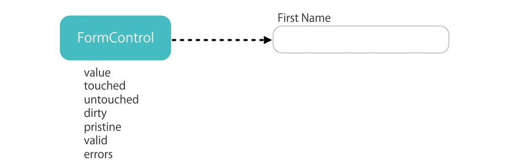
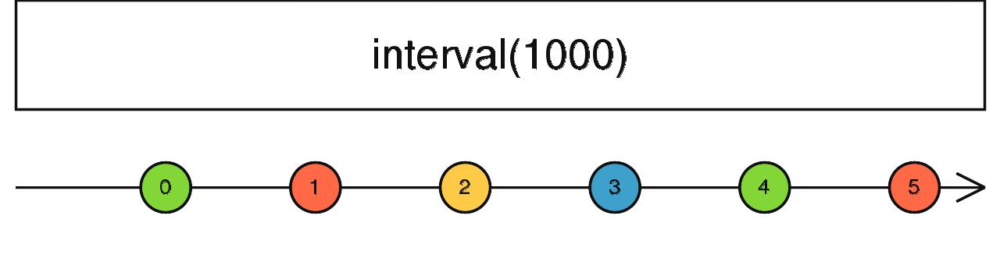
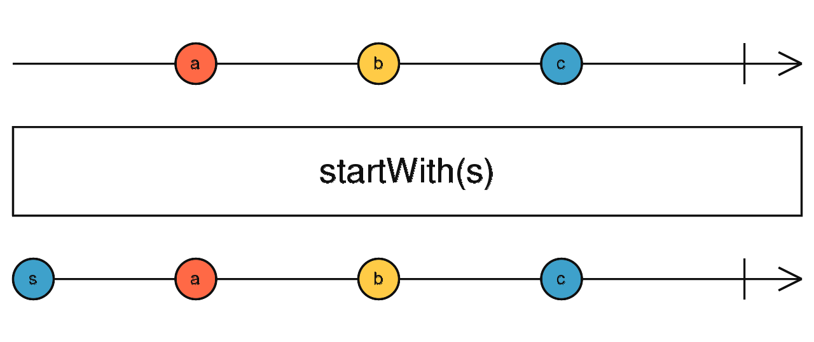

## Angular 企业实战开发

### 1.  概述

Angular 是一个使用 HTML、CSS、TypeScript 构建客户端应用的框架，用来构建单页应用程序。

Angular 是一个重量级的框架，内部集成了大量开箱即用的功能模块。

Angular 为大型应用开发而设计，提供了干净且松耦合的代码组织方式，使应用程序整洁更易于维护。

[Angular](https://angular.io/)  [Angular 中文](https://angular.cn/)  [Angular CLI](https://cli.angular.io/)


### 2. 架构预览


#### 2.1 模块

Angular 应用是由一个个模块组成的，此模块指的不是ESModule，而是 NgModule 即 Angular 模块。

NgModule 是一组相关功能的集合，专注于某个应用领域，可以将组件和一组相关代码关联起来，是应用组织代码结构的一种方式。

==在 Angular 应用中至少要有一个根模块，用于启动应用程序。==

NgModule 可以从其它 NgModule 中导入功能，前提是目标 NgModule 导出了该功能。

NgModule 是由 NgModule 装饰器函数装饰的类。

```javascript
import { BrowserModule } from '@angular/platform-browser';
import { NgModule } from '@angular/core';

@NgModule({
  imports: [
    BrowserModule
  ]
})
export class AppModule { }
```


#### 2.2 组件

组件用来描述用户界面，它由三部分组成，==组件类、组件模板、组件样式==，它们可以被集成在组件类文件中，也可以是三个不同的文件。

组件类用来编写和组件直接相关的界面逻辑，在组件类中要关联该组件的组件模板和组件样式。

组件模板用来编写组件的 HTML 结构，通过数据绑定标记将应用中数据和 DOM 进行关联。

组件样式用来编写组件的组件的外观，组件样式可以采用 CSS、LESS、SCSS、Stylus

在 Angular 应用中至少要有一个根组件，用于应用程序的启动。

组件类是由 Component 装饰器函数装饰的类。

```javascript
import { Component } from "@angular/core"

@Component({
  selector: "app-root",
  templateUrl: "./app.component.html",
  styleUrls: ["./app.component.css"]
})
export class AppComponent {
  title = "angular-test"
}
```

==NgModule 为组件提供了编译的上下文环境。即没有NgModule 组件内容无法编译==

==同一组件不能同时属于不同模块==

```javascript
import { NgModule } from '@angular/core';
import { AppComponent } from './app.component';

@NgModule({
  declarations: [
    AppComponent
  ],
  bootstrap: [AppComponent]
})
export class AppModule { }
```


#### 2.3 服务

==服务用于放置和特定组件无关并希望跨组件共享的数据或逻辑。==

服务出现的目的在于解耦组件类中的代码，是组件类中的代码干净整洁。解耦（Decoupling）是软件工程中的一个重要概念，意味着降低系统各部分之间的依赖关系。在解耦的系统中，一个组件（component）或一个模块（module）的内部变化尽可能少地影响到其他组件或模块

服务是由 Injectable 装饰器装饰的类。

```javascript
import { Injectable } from '@angular/core';

@Injectable({})
export class AppService { }
```

在使用服务时不需要在组件类中通过 new 的方式创建服务实例对象获取服务中提供的方法，==以下写法错误==，切记切记！！！

```javascript
import { AppService } from "./AppService"

export class AppComponent {
  let appService = new AppService()
}
```

==服务的实例对象由 Angular 框架中内置的依赖注入系统创建和维护。==服务是依赖需要被注入到组件中。

==在组件中需要通过 constructor 构造函数的参数来获取服务的实例对象。==

在组件中获取服务实例对象要结合 TypeScript 类型，写法如下。

```javascript
import { AppService } from "./AppService"

export class AppComponent {
  constructor (
  	private appService: AppService
  ) {}
}
```

Angular 会根据你指定的服务的类型来传递你想要使用的服务实例对象，这样就解决了参数的顺序问题。

在 Angular 中服务被设计为单例模式，这也正是为什么服务可以被用来在组件之间共享数据和逻辑的原因。服务数据被更改，别的被使用的该服务的数据也会被更改。 


### 3. 快速开始

#### 3.1 创建应用

1. 安装 angular-cli：`npm install @angular/cli -g`

2. 创建应用：`ng new angular-test --minimal --inlineTemplate false`

   1. --skipGit=true
   2. --minimal=true
   3. --skip-install
   4. --style=css
   5. --routing=false
   6. --inlineTemplate
   7. --inlineStyle
   8. --prefix

   

   

   

3. 运行应用：`ng serve`

   1. --open=true 应用构建完成后在浏览器中运行
   2. --hmr=true 开启热更新
   3. hmrWarning=false 禁用热更新警告
   4. --port 更改应用运行端口

4. 访问应用：`localhost:4200`

   


#### 3.2 默认代码解析

##### 3.2.1 main.ts  (Angular 启动时执行)

```javascript
// enableProdMode 方法调用后将会开启生产模式
import { enableProdMode } from "@angular/core"
// Angular 应用程序的启动在不同的平台上是不一样的
// 在浏览器中启动时需要用到 platformBrowserDynamic 方法, 该方法返回平台实例对象
import { platformBrowserDynamic } from "@angular/platform-browser-dynamic"
// 引入根模块 用于启动应用程序
import { AppModule } from "./app/app.module"
// 引入环境变量对象 { production: false }
import { environment } from "./environments/environment"

// 如果当前为生产环境
if (environment.production) {
  // 开启生产模式
  enableProdMode()
}
// 启动应用程序
/*
platformBrowserDynamic().bootstrapModule(AppModule)
使用 platformBrowserDynamic() 创建一个动态编译器，然后调用 bootstrapModule 方法来编译并启动根模块 AppModule。
.catch(err => console.error(err));
如果在启动过程中有任何错误，这行代码会捕获这些错误并打印到控制台。
*/

platformBrowserDynamic()
  .bootstrapModule(AppModule)
  .catch(err => console.error(err))
```


##### 3.2.2 environment.ts

```javascript
// 在执行 `ng build --prod` 时, environment.prod.ts 文件会替换 environment.ts 文件
// 该项配置可以在 angular.json 文件中找到, projects -> angular-test -> architect -> configurations -> production -> fileReplacements

export const environment = {
  production: false
}
```

##### 3.2.3  environment.prod.ts

```javascript
export const environment = {
  production: true
}
```

##### 3.2.4 app.module.ts (作为根模块被最先启动)

```javascript
// BrowserModule 提供了启动和运行浏览器应用所必需的服务
// CommonModule 提供各种服务和指令, 例如 ngIf 和 ngFor, 与平台无关
// BrowserModule 导入了 CommonModule, 又重新导出了 CommonModule, 使其所有指令都可用于导入 BrowserModule 的任何模块 
import { BrowserModule } from "@angular/platform-browser"
// NgModule: Angular 模块装饰器
import { NgModule } from "@angular/core"
// 根组件
import { AppComponent } from "./app.component"
// 调用 NgModule 装饰器, 告诉 Angular 当前类表示的是 Angular 模块
@NgModule({ //传递了一个对象，即元数据
  // 声明当前模块拥有哪些组件
  declarations: [AppComponent],
  // 声明当前模块依赖了哪些其他模块
  imports: [BrowserModule],
  // 声明服务的作用域, 数组中接收服务类, 表示该服务只能在当前模块的组件中使用
  providers: [],
  // 可引导组件, Angular 会在引导过程中把它加载到 DOM 中
  bootstrap: [AppComponent]
})
export class AppModule {}
```

##### 3.2.5 app.component.ts (作为启动组件)

```javascript
import { Component } from "@angular/core"

@Component({
  // 指定组件的使用方式, 当前为标记形式
  // app-home   =>  <app-home></app-home>
	// [app-home] =>  <div app-home></div>
  // .app-home  =>  <div class="app-home"></div>
  selector: "app-root",
  // 关联组件模板文件
  // templateUrl:'组件模板文件路径'
	// template:`组件模板字符串`
  templateUrl: "./app.component.html",
  // 关联组件样式文件
  // styleUrls : ['组件样式文件路径']
	// styles : [`组件样式`]
  styleUrls: ["./app.component.css"]
})
export class AppComponent {}
```

##### 3.2.6 index.html (web应用程序入口)

```html
<!doctype html>
<html lang="en">
<head>
  <meta charset="utf-8">
  <title>AngularTest</title>
  <base href="/">
  <meta name="viewport" content="width=device-width, initial-scale=1">
  <link rel="icon" type="image/x-icon" href="favicon.ico">
</head>
<body>
  <app-root></app-root>
</body>
</html>
```

`index.html` 是主HTML文件，它作为应用程序的入口点。这个文件通常包括一个根元素，Angular会在这个元素内部引导（bootstrap）你的应用程序。当用户访问你的Angular应用时，`index.html` 是首先被加载和渲染的文件。


#### 3.3 Angular文件启动顺序

在Angular应用程序中，文件和模块（module）的启动顺序通常如下：


1. **index.html:** 当你导航到Angular应用程序的URL时，浏览器首先会请求`index.html`文件。

   1. `index.html`被加载，浏览器解析它。这个文件通常包含一个特殊的标签，Angular将在其中插入根组件（通常是 `<app-root>`）。
   2. 需要包括的任何全局JavaScript库或CSS通常也会在这个`index.html`文件中链接。
   3. 在`index.html`加载后，`main.ts` 文件（在你的构建配置中指定）会引导Angular应用，初始化Angular的运行时环境。
   4. 从这一点开始，Angular接管并将根Angular组件（通常是`AppComponent`）插入到`index.html`中的`<app-root>`标签中。
   5. 此后，Angular管理`<app-root>`标签内的DOM，根据你的应用逻辑渲染组件并处理用户交互。

2. **main.ts**：应用程序的入口点。它负责初始化Angular环境和平台，并引导（bootstrap）根模块（AppModule）。

   ```ts
   platformBrowserDynamic().bootstrapModule(AppModule)
     .catch(err => console.error(err));
   ```

3. **AppModule（app.module.ts）**：根模块，负责声明应用中使用的组件、指令（directives）和服务（services），并定义如何组合它们。

   ```ts
   @NgModule({
     declarations: [AppComponent],
     imports: [BrowserModule],
     bootstrap: [AppComponent]
   })
   export class AppModule { }
   ```

4. **AppComponent（app.component.ts）**：根组件，通常在AppModule中被定义为引导（bootstrap）组件。这是应用程序的主组件，与 `index.html` 中的根元素（通常是 `<app-root>`）关联。

   ```ts
   @Component({
     selector: 'app-root',
     template: `<h1>Hello, World!</h1>`,
   })
   export class AppComponent{ }
   ```

5. **其他组件/模块/服务**：根据应用程序的需求和结构，其他组件、模块和服务将按需加载和初始化。

6. **路由（如果有）**：如果你的应用使用了Angular路由，`RouterModule` 将负责处理路由配置和导航。

7. **依赖注入（Dependency Injection）**：在这整个过程中，Angular的依赖注入系统会负责实例化和提供所需的服务和组件。

8. **执行生命周期钩子（Lifecycle Hooks）**：如 `ngOnInit`, `ngAfterViewInit` 等，这些都是在特定时间点会被Angular运行的方法。

9. **动态组件、懒加载等**：对于更复杂的应用，还可能涉及到动态组件加载、模块的懒加载等高级特性。

10. **运行和交互**：一旦所有这些都设置好，应用就可以接受用户输入和与后端交互了。


#### 3.4 共享模块

共享模块当中放置的是 Angular 应用中==模块级别的需要共享的组件或逻辑==。

1. 创建共享模块： `ng g m shared` 

2. 创建共享组件：`ng g c shared/components/Layout`

3. 在共享模块中导出共享组件 

   ```javascript
   @NgModule({
     declarations: [LayoutComponent],
     exports: [LayoutComponent]
   })
   export class SharedModule {}
   ```

4. 在根模块中导入共享模块

   ```javascript
   @NgModule({
     declarations: [AppComponent],
     imports: [SharedModule],
     bootstrap: [AppComponent]
   })
   export class AppModule {}
   ```

5. 在根组件中使用 Layout 组件

   ```javascript
   @Component({
     selector: "app-root",
     template: `
       <div>App works</div>
       <app-layout></app-layout>
     `,
     styles: []
   })
   export class AppComponent { }
   ```


### 4. 组件模板

#### 4.1 数据绑定

==数据绑定就是将组件类中的数据显示在组件模板中，当组件类中的数据发生变化时会自动被同步到组件模板中（数据驱动 DOM ）。==

在 Angular 中使用差值表达式进行数据绑定，即 {{ }} 大胡子语法。

```html
<h2>{{message}}</h2>
<h2>{{getInfo()}}</h2>
<h2>{{a == b ? '相等': '不等'}}</h2>
<h2>{{'Hello Angular'}}</h2>
<p [innerHTML]="htmlSnippet"></p> <!-- 对数据中的代码进行转义 -->
```


#### 4.2 属性绑定

属性绑定是Angular中的一个核心特性，允许你将模板中的一个元素属性绑定到组件类中的一个属性。通过属性绑定，你可以实时地更新视图中的数据。

**语法：** 属性绑定使用方括号 `[]` 语法。例如：

```html

```

在上面的例子中，`[src]` 是属性绑定的目标，而 `imageUrl` 是组件类中的一个属性。

**常见用途：**

1. ==**绑定到HTML属性**：==如上面的例子所示，你可以将图片的 `src` 属性绑定到组件类中的一个属性。
2. ==**绑定到指令**：==你也可以使用属性绑定来传递值给指令。例如，你可以传递一个值给一个自定义指令，该值决定了某种行为。
3. ==**绑定到组件属性**：==你还可以使用属性绑定将值从一个组件传递到另一个组件。

**与插值的区别：**

插值 `{{ value }}` 用于将组件类中的值插入模板中。而属性绑定是将组件类中的值绑定到模板中的元素属性上。

例如，以下两种写法都可以设置一个图片的 `src` 属性：

```html
<!-- 插值 -->


<!-- 属性绑定 -->

```

但在某些情况下，插值可能不适用，例如当你需要绑定一个元素的属性，而不仅仅是设置其内容时。这时，属性绑定是更合适的选择。


##### 4.2.1 普通属性

属性绑定分为两种情况，绑定 DOM 对象属性和绑定HTML标记属性。==允许将模板中的一个元素属性绑定到组件类中的一个属性。通过属性绑定，可以实时地更新视图中的数据。==

1.  使用 [属性名称] 为元素绑定 DOM 对象属性。

```html

```

2. 使用 [attr.属性名称] 为元素绑定 HTML 标记属性

colspan 是一个HTML属性（HTML Attribute），用于定义一个表格单元格（<td> 或 <th>）应该横跨多少列。

```html
<td [attr.colspan]="colSpan"></td> 
```

在大多数情况下，DOM 对象属性和 HTML 标记属性是对应的关系，所以使用第一种情况。但是某些属性只有 HTML 标记存在，DOM 对象中不存在，此时需要使用第二种情况，比如 colspan 属性，在 DOM 对象中就没有，或者自定义 HTML 属性也需要使用第二种情况。

##### 4.2.2 class 属性

```html
<button class="btn btn-primary" [class.active]="isActive">按钮</button>
<div [ngClass]="{'active': true, 'error': true}"></div>
```

在HTML模板中，`[class.active]="isActive"` 是一个条件类（conditional class）。这里的 `[class.active]` 是一个属性绑定，它将按钮元素的 `active` 类设置为由 `isActive` 变量的值决定的。它会根据表达式的值来决定是否添加或移除一个或多个类。

##### 4.2.3 style 属性

```html
<button [style.backgroundColor]="isActive ? 'blue': 'red'">按钮</button>
<button [ngStyle]="{'backgroundColor': 'red'}">按钮</button>
```

在 Angular 中，你可以使用属性绑定来动态地设置 HTML 元素的样式。这通常在需要根据组件类中的条件或变量来改变元素样式时非常有用。

**基本语法**

基本的语法是将元素的 `style` 属性绑定到一个表达式或变量，通常这个表达式或变量会返回一个字符串、对象或数组。

**单个样式属性**

你可以使用方括号 `[]` 语法，来绑定一个具体的样式属性。例如：

```html
<p [style.color]="isRed ? 'red' : 'green'">This is a colored text.</p>
```

在这个例子里，文字的颜色会根据 `isRed` 变量的值来改变。

**多个样式属性**

如果你想一次性设置多个样式属性，你可以绑定到一个对象：

```html
<p [ngStyle]="styleObject">This is a styled text.</p>
```

在组件类里，你可以定义 `styleObject`：

```ts
styleObject = {
  'color': 'red',
  'font-size': '16px',
  'background-color': 'lightgray'
};
```

使用 `ngStyle` 指令可以更方便地一次性设置多个样式。


#### 4.3 事件绑定

事件绑定允许你监听 DOM 事件，并在事件触发时执行组件中的方法。

**1. DOM 事件**

使用圆括号 `()` 进行事件绑定：

```html
<button (click)="handleClick()">Click me</button>
```

**2. 自定义事件**

你也可以监听自定义事件，这些事件通常由子组件通过 `EventEmitter` 发出：

```html
<child-component (customEvent)="handleCustomEvent($event)"></child-component>
```

这些不同类型的绑定方式提供了在 Angular 应用中灵活地处理数据和事件的能力，使得开发更为高效和可控。

此外，在 Angular 的模板语法中，\$ 符号用于表示一个局部模板变量。特别地，在事件绑定中，$event 是一个固定名称的局部变量，它将会自动地包含与事件相关的数据。这通常是一个 DOM Event 对象或一个更具体的事件对象

```html
<button (click)="onSave($event)">按钮</button>
<!-- 当按下回车键抬起的时候执行函数 -->
<input type="text" (keyup.enter)="onKeyUp()"/>
```

```javascript
export class AppComponent {
  title = "test"
  onSave(event: Event) {
    // this 指向组件类的实例对象
    this.title // "test"
  }
  
  onKeyUp() {
    console.log('Enter was pressed');
  }
}
```


#### 4.4 获取原生 DOM 对象

##### 4.4.1 在组件模板中获取

```html
<input type="text" (keyup.enter)="onKeyUp(username.value)" #username/>
```

##### 4.4.2 在组件类中获取

==使用 ViewChild 装饰器获取一个元素。== `ViewChild` 是 Angular 中的一个装饰器（Decorator），用于在组件类中获取对视图（View）中的一个子组件、指令或 DOM 元素的引用。`ViewChild` 使你可以在组件类中直接访问模板内的元素和与之交互。

```html
<p #paragraph>home works!</p>
```

在这个例子中，我们有一个 Angular 组件，名为 `HomeComponent`，它实现了 `AfterViewInit` 接口。`AfterViewInit` 接口中的 ==`ngAfterViewInit()` 是一个生命周期钩子（lifecycle hook），它会在视图（View）初始化之后立即执行。==

这行代码使用 `@ViewChild` 装饰器（decorator）来查询 DOM 元素。这里，它查询的是一个局部模板变量名为 `paragraph` 的元素。该元素被强制转型为 `HTMLParagraphElement` 类型的 `ElementRef`。

==`ElementRef` 是一个 Angular 类，**用于包装对 DOM 元素的引用**。它不仅仅包含了原生 DOM 元素（在 `nativeElement` 属性中），还提供了其他 Angular 相关的信息和方法。通过使用 `ElementRef`，能够更方便地与 Angular 的其他部分（如依赖注入）进行交互。不用ElementRef的话就无法获得 Angular 封装==`HTMLParagraphElement` 是指该 DOM 元素应该是一个段落（`<p>`）元素。我们也给它一个 `undefined` 类型作为备选，以表示该元素可能不存在。

在 `ngAfterViewInit()` 方法中，我们输出了这个 DOM 元素的引用。由于 `paragraph` 可能是 `undefined`（特别是在模板中如果没有找到这个局部变量的话），==所以这里使用了可选链（Optional Chaining）`?.` 来安全地访问 `nativeElement` 属性。==

```javascript
import { AfterViewInit, ElementRef, ViewChild } from "@angular/core"

export class HomeComponent implements AfterViewInit {
  @ViewChild("paragraph") paragraph: ElementRef<HTMLParagraphElement> | undefined
  ngAfterViewInit() {
    console.log(this.paragraph?.nativeElement)
  }
}
```

使用 ViewChildren 获取一组元素

```html
<ul>
  <li #items>a</li>
  <li #items>b</li>
  <li #items>c</li>
</ul>
```

```javascript
import { AfterViewInit, QueryList, ViewChildren } from "@angular/core"

@Component({
  selector: "app-home",
  templateUrl: "./home.component.html",
  styles: []
})
export class HomeComponent implements AfterViewInit {
  @ViewChildren("items") items: QueryList<HTMLLIElement> | undefined
  ngAfterViewInit() {
    console.log(this.items?.toArray())
  }
}
```


#### 4.5 双向数据绑定

数据在组件类和组件模板中双向同步。

Angular 将双向数据绑定功能放在了 @angular/forms 模块中，所以要实现双向数据绑定需要依赖该模块。

```javascript
import { FormsModule } from "@angular/forms"

@NgModule({
  imports: [FormsModule],
})
export class AppModule {}
```

```html
<input type="text" [(ngModel)]="username" />
<button (click)="change()">在组件类中更改 username</button>
<div>username: {{ username }}</div>
```

```javascript
export class AppComponent {
  username: string = ""
  change() {
    this.username = "hello Angular"
  }
}
```


#### 4.6 内容投影

内容投影（Content Projection）是 Angular 中一种用于组合组件的技术。==这允许你在父组件中定义内容，并将其传递到子组件的模板中。==内容投影主要使用 `<ng-content>` 标签来实现。


##### 4.6.1 ng-content

`ng-content` 元素是一个用来插入外部或者动态内容的占位符。父组件将外部内容传递给子组件，当 Angular 解析模板时，就会在子组件模板中 `ng-content` 出现的地方插入外部内容。

我们可以使用内容投影来创建可重用的组件。这些组件有相似的逻辑和布局，并且可以在许多地方使用。一般我们在封装一些公共组件的时候经常会用到。


##### 4.6.2 不使用内容投影

为了理解为什么要使用 `ng-content` 进行内容投影，首先让我们来创建一个很常见的 button 组件。

btn.component.ts

```typescript
import { Component } from '@angular/core';

@Component({
  selector: 'app-btn',
  templateUrl: './btn.component.html',
  styleUrls: ['./btn.component.scss'],
})
export class BtnComponent {
  constructor() {}

  onClick($event: any) {
    console.log($event);
  }
}
```

btn.component.html

```html
<button (click)=onClick($event)>
  Click Me
</button>
```

在这个组件中，button 的文本始终是 `Click Me`，如果我们想传递不同的文本进来呢？可能你会想到最常使用的 `@Input` 装饰器，但是如果我们不只是想传文本进来，而是传一段 html 进来呢？这个时候就需要用到这篇文章的主角：`ng-content`。


##### 4.6.3 单插槽内容投影

内容投影的最基本形式是**单插槽内容投影**。单插槽内容投影是指创建一个组件，我们可以在其中投影一个组件。

要创建使用单插槽内容投影的组件，我们只需要对上面的组件进行一些简单的修改：把 `Click Me` 替换为 `<ng-content></ng-content>`。

btn.component.html

```html
<button (click)=onClick($event)>
  <ng-content></ng-content>
</button>
```

在使用 btn 组件的地方：

```xml
<app-btn>Cancel</app-btn>
<app-btn><b>Submit</b></app-btn>
```

在 `<app-btn></app-btn>` 中的内容会传递给 btn 组件，并且显示在 `ng-contnet` 中。

如果只有一个ng-content，即需要投射的内容只有一个元素且没有class指定，不需要select属性。直接`<ng-content></ng-content>`就可以


##### 4.6.4 多插槽内容投影

上面的 btn 组件非常简单，但实际上`ng-content` 要比这个更强大。一个组件可以具有多个插槽，每个插槽可以指定一个 CSS 选择器，该选择器会决定将哪些内容放入该插槽。该模式称为**多插槽内容投影**。使用此模式，我们必须指定希望投影内容出现在的位置。可以通过使用 `ng-content` 的 `select` 属性来完成此任务。

要创建使用多插槽内容投影的组件，需要执行以下操作：

1. 创建一个组件。
2. 在组件模板中，添加 `ng-content` 元素，让你希望投影的内容出现在其中。
3. 将 `select` 属性添加到 `ng-content` 元素。 Angular 使用的选择器支持标签名、属性、CSS 类和 `:not` 伪类的任意组合。

下面我们来创建一个复杂一些的 card 组件。

card.component.html

```html
<div class="card">
  <div class="header">
    <ng-content select="header"></ng-content>
  </div>
  <div class="content">
    <ng-content select="content"></ng-content>
  </div>
  <div class="footer">
    <ng-content select="footer"></ng-content>
  </div>
</div>
```

在使用 card 组件的地方：

app.component.html

```html
<app-card>
  <header>
    <h1>Angular</h1>
  </header>
  <content>One framework. Mobile & desktop.</content>
  <footer><b>Super-powered by Google </b></footer>
</app-card>

<app-card>
  <header>
    <h1 style="color:red;">React</h1>
  </header>
  <content>A JavaScript library for building user interfaces</content>
  <footer><b>Facebook Open Source </b></footer>
</app-card>
```

如果在 `app-card` 中有不属于 header, content, footer 之外的内容呢？比如按照下面的写法使用 `app-card` 组件：

app.component.html

```html
<app-card>
  <header>
    <h1>Angular</h1>
  </header>
  <div>Not match any selector</div>
  <content>One framework. Mobile & desktop.</content>
  <footer><b>Super-powered by Google </b></footer>
  <div>This text will not not be shown</div>
</app-card>
```

会发现两个 `div` 都没有渲染在页面中，==为了解决这个问题，我们可以在组件中添加一个没有任何 `selector` 的 `ng-content` 标签。所有没办法匹配到任何其他插槽的内容都会被渲染在这个里面。==如果只有一个ng-content，即需要投射的内容只有一个元素且没有class指定，不需要select属性。直接`<ng-content></ng-content>`就可以

card.component.html

```html
<div class="card">
  <div class="header">
    <ng-content select="header"></ng-content>
  </div>
  <div class="content">
    <ng-content select="content"></ng-content>
  </div>
  <div class="footer">
    <ng-content select="footer"></ng-content>
  </div>
  <ng-content></ng-content>
</div>
```


##### 4.6.5 ngProjectAs

在某些情况下，我们需要使用 `ng-container` 把一些内容包裹起来传递到组件中。大多数情况是因为我们需要使用结构型指令像 `ngIf` 或者 `ngSwitch` ，或者我们不需要 `div`标签，想用ng-container替代这个div。比如只有在某些情况下才向 card 组件传递 header。

在下面的例子中，我们将 header 包裹在了 `ng-container` 中。

```html
<app-card>
  <ng-container>
    <header>
      <h1>Angular</h1>
    </header>
  </ng-container>
  <content>One framework. Mobile & desktop.</content>
  <footer><b>Super-powered by Google </b></footer>
</app-card>
```

由于 `ng-container` 的存在，header 部分并没有被渲染到我们想要渲染的插槽中，而是渲染到了没有提供任何 selector 的 `ng-content` 中。

在这种情况下，我们可以使用 `ngProjectAs` 属性。

在上面的 `ng-container` 加上这个属性，就可以按照我们的期望来渲染了。

```html
<app-card>
  <ng-container ngProjectAs='header'>
    ...
</app-card>
```


#### 4.7  数据绑定容错处理

在Angular中，数据绑定通常是非常健壮的，但如果你绑定的数据可能是 `undefined` 或 `null`，这可能会导致运行时错误。为了避免这种情况，你可以使用一些容错处理技术。

```javascript
// app.component.ts
export class AppComponent {
    task = {
        person: {
            name: '张三'
        }
    }
}
```

```html
<!-- 方式一：指定方式 -->
<span *ngIf="task.person">{{ task.person.name }}</span>
<!-- 方式二：安全操作符 -->
<span>{{ task.person?.name }}</span>
```


==`*ngIf` 是 Angular 的一个结构性指令（Structural Directive），用于根据一个表达式的真假值来添加或移除一个 DOM 元素。它是用来进行条件渲染的。==

基本用法：

```html
<!-- 如果 showElement 为 true，该元素会显示 -->
<div *ngIf="showElement">我是一个可见的元素</div>
```

在 TypeScript 类中：

```ts
export class AppComponent {
  showElement = true;
}
```

也可以使用 `else` 子句来定义当条件不满足时要显示的模板：

```html
<!-- 如果 showElement 为 true，显示这个元素 -->
<div *ngIf="showElement; else elseTemplate">我是一个可见的元素</div>

<!-- 如果 showElement 为 false，显示这个模板 -->
<ng-template #elseTemplate>我是一个不可见的元素</ng-template>
```

另外，`*ngIf` 还可以与 `then` 一起使用，以便在条件为 `true` 时插入一个模板，而在条件为 `false` 时插入另一个模板。

```html
<div *ngIf="showElement; then thenTemplate else elseTemplate"></div>
<ng-template #thenTemplate>我会在 showElement 为真时显示</ng-template>
<ng-template #elseTemplate>我会在 showElement 为假时显示</ng-template>
```

注意：`*ngIf` 会真正地添加或移除 DOM 元素，而不仅仅是改变它们的可见性。这意味着与这些元素相关联的所有组件都会被销毁和重新创建。


#### 4.8 全局样式

```css
/* 第一种方式 在 styles.css 文件中 */
@import "~bootstrap/dist/css/bootstrap.css";
/* ~ 相对node_modules文件夹 */
```

```html
<!-- 第二种方式 在 index.html 文件中  -->
<link href="https://cdn.jsdelivr.net/npm/bootstrap@3.3.7/dist/css/bootstrap.min.css" rel="stylesheet" />
```

```javascript
// 第三种方式 在 angular.json 文件中
"styles": [
  "./node_modules/bootstrap/dist/css/bootstrap.min.css",
  "src/styles.css"
]
```


### 5. 指令 Directive

指令（Directive）是Angular的一个核心特性，用于扩展HTML的功能。==它们允许你创建新的HTML属性或行为，或修改现有的DOM元素和其行为。==在Angular中，指令主要分为三种类型：

1. **组件指令（Components）**：
   - 它们是Angular中的最常见的指令类型。
   - 组件在其本质上也是指令，但它们与模板结合，定义了一个独立的视图区域。
   - 组件用于构建UI的块，并支持数据绑定、生命周期事件等。
2. **结构指令（Structural Directives）**：
   - ==它们改变DOM结构，例如增加、移除或替换元素。==
   - 常见的结构指令包括`*ngIf`（用于条件性渲染）、`*ngFor`（用于列表渲染）。
   - 注意，结构指令通常前面带有`*`前缀。
3. **属性指令（Attribute Directives）**：
   - ==它们会改变元素、组件或其他指令的外观或行为。==
   - 例如，你可以创建一个属性指令来改变元素的背景颜色、设置元素的尺寸或执行其他DOM操作。
   - 例子：`ngStyle`、`ngClass`等。

创建自定义指令：

- 使用`@Directive`装饰器定义一个指令。
- 使用`selector`属性指定该指令的名称或选择器。
- 在Angular模块的`declarations`数组中注册该指令。


#### 5.1 内置指令

##### 5.1.1 *ngIf 

根据条件渲染 DOM 节点或移除 DOM 节点。True渲染，False移除。

```html
<div *ngIf="data.length == 0">没有更多数据</div>
```

```html
<div *ngIf="data.length > 0; then dataList else noData"></div>
<ng-template #dataList>课程列表</ng-template>
<ng-template #noData>没有更多数据</ng-template>
```

`<ng-template>` 是一个Angular指令（Directive），用于动态地渲染HTML结构。==这个标签在DOM中不会直接呈现，只有当它被Angular的某个结构指令（如 `*ngIf`、`*ngFor` 等）激活时，它里面的内容才会被渲染到DOM中。==

##### 5.1.2 [hidden]

根据条件显示 DOM 节点或隐藏 DOM 节点 (display)。 True渲染，False隐藏（但也会渲染）。

```html
<div [hidden]="data.length == 0">课程列表</div>
<div [hidden]="data.length > 0">没有更多数据</div>
```

##### 5.1.3 *ngFor

`ngFor` 是 Angular 中用于列表渲染的一个内置指令（built-in directive）。==可以使用 `ngFor` 来遍历数组、对象或其他集合，并为集合中的每个元素生成 DOM 元素。==

基本用法如下：

```html
<ul>
  <li *ngFor="let item of items">{{ item }}</li>
</ul>
```

在这个例子中，`items` 是一个数组，而 `*ngFor` 将遍历这个数组，为数组中的每个元素创建一个 `<li>` 元素。

在 TypeScript 文件中：

```ts
items = ['Item 1', 'Item 2', 'Item 3'];
```

更高级的用法可能包括获取当前索引，或者获取数组的第一个或最后一个元素等：

```html
<ul>
  <li *ngFor="let item of items; let i = index; let first = first; let last = last">
    {{ i }}: {{ item }} {{ first ? '(first)' : '' }} {{ last ? '(last)' : '' }}
  </li>
</ul>
```

这里，`index` 是当前元素的索引，`first` 是一个布尔值，表示当前元素是否是数组中的第一个元素，`last` 也是一个布尔值，表示当前元素是否是数组中的最后一个元素。


遍历数据生成HTML结构

```javascript
interface List {
  id: number
  name: string
  age: number
}

list: List[] = [
  { id: 1, name: "张三", age: 20 },
  { id: 2, name: "李四", age: 30 }
]
```

```html
<li
    *ngFor="
      let item of list;
      let i = index;
      let isEven = even;
      let isOdd = odd;
      let isFirst = first;
      let isLast = last;
    "
  >
  </li>
```

```html
<li *ngFor="let item of list; trackBy: identify"></li>
```

```javascript
identify(index, item){
  return item.id; 
}
```

 `trackBy` 是一个用于优化 Angular 列表渲染性能的选项。当你使用 `*ngFor` 指令去遍历并创建列表项时，如果列表中的某一项发生了变化（比如添加、移除、重新排序等），Angular 默认会重新渲染整个列表。这在列表项很多的时候可能会导致性能问题。

使用 `trackBy` 可以让 Angular 知道如何唯一地标识每一个列表项。这样，==当数据发生变化时，Angular 只会重新渲染那些真正发生变化的列表项，而不是整个列表。==


#### 5.2 自定义指令

自定义指令（Custom Directives）是 Angular 中一个强大的特性，==它允许你创建可重用的、自定义的 DOM 操作代码。==自定义指令通常用于封装和抽象 DOM 操作和行为，使得模板（Template）更加简洁和易于维护。

**创建自定义指令**

1. 使用 Angular CLI 创建一个新的指令：

   ```bash
   ng generate directive my-custom-directive
   ```

   这将生成一个新的指令文件，通常位于 `src/app` 目录下。

2. 打开生成的指令文件（通常是 `.ts` 文件），你会看到类似下面的代码：

   ```ts
   import { Directive, ElementRef, Renderer2 } from '@angular/core';
   
   @Directive({
     selector: '[appMyCustomDirective]'
   })
   export class MyCustomDirective {
     constructor(private el: ElementRef, private renderer: Renderer2) {
       // 初始化代码
     }
   }
   ```

**使用自定义指令**

1. 确保自定义指令已经添加到了某个模块（Module）的 `declarations` 数组中。

   ```ts
   @NgModule({
     declarations: [
       MyCustomDirective,
       // 其他组件、指令和管道
     ],
     // ...
   })
   export class AppModule { }
   ```

2. 在模板中使用这个自定义指令：不绑定动态数据不需要加中括号`[]`

   ```html
   <div appMyCustomDirective>
     <!-- 其他内容 -->
   </div>
   ```

**自定义指令示例**

以下是一个简单的自定义指令示例，用于改变元素的背景颜色：

```ts
import { Directive, ElementRef, Input } from '@angular/core';

@Directive({
  selector: '[appBackgroundColor]'
})
export class BackgroundColorDirective {

  @Input('appBackgroundColor') color: string;

  constructor(private el: ElementRef) { }

  ngOnInit() {
    this.el.nativeElement.style.backgroundColor = this.color;
  }
}
```

使用方法：

```html
<div [appBackgroundColor]="'red'">
  This has a red background.
</div>
```

这样，你就成功创建了一个自定义指令，它能够通过 `appBackgroundColor` 属性来设置元素的背景颜色。


**练习：**为元素设置默认背景颜色，鼠标移入时的背景颜色以及移出时的背景颜色。

 ```html
<div [appHover]="{ bgColor: 'skyblue' }">Hello Angular</div>
 ```

```javascript
import { AfterViewInit, Directive, ElementRef, HostListener, Input } from "@angular/core"

// 接收参的数类型
interface Options {
  bgColor?: string
}

@Directive({
  selector: "[appHover]"
})
export class HoverDirective implements AfterViewInit {
  // 接收参数
  @Input("appHover") appHover: Options = {}
  // 要操作的 DOM 节点
  element: HTMLElement
	// 获取要操作的 DOM 节点
  constructor(private elementRef: ElementRef) {
    this.element = this.elementRef.nativeElement
  }
	// 组件模板初始完成后设置元素的背景颜色
  ngAfterViewInit() {
    this.element.style.backgroundColor = this.appHover.bgColor || "skyblue"
  }
	// 为元素添加鼠标移入事件
  @HostListener("mouseenter") enter() {
    this.element.style.backgroundColor = "pink"
  }
	// 为元素添加鼠标移出事件
  @HostListener("mouseleave") leave() {
    this.element.style.backgroundColor = "skyblue"
  }
}

```

`@HostListener`是Angular中的一个装饰器，用于为宿主元素添加事件监听器。当你在指令或组件中使用这个装饰器，你可以为该指令或组件所关联的DOM元素（也就是“宿主”）添加一个或多个事件监听器。

以下是它的基本用法：

```ts
@HostListener('事件名称', ['可选的事件对象参数'])
函数名() {
  // 事件触发时的操作
}
```


### 6. 管道 Pipe

在Angular中，管道（Pipe）是一种特殊的函数，可以接受一个输入值（及一些可选参数）并返回一个转换后的值。管道用于在模板中转换、格式化或处理数据。

#### 6.1 内置管道

1. **DatePipe**: 格式化日期。

   ```html
   {{ today | date:'short' }}
   {{ date | data: "yyyy-MM-dd"}}
   ```

2. **UpperCasePipe** 和 **LowerCasePipe**: 转换文本为大写或小写。

   ```html
   {{ 'hello' | uppercase }}  <!-- 输出：HELLO -->
   ```

3. **CurrencyPipe**: 格式化数字为货币格式。

   ```html
   {{ 12345.6789 | currency:'USD' }}  <!-- 输出：$12,345.68 -->
   ```

4. **DecimalPipe**: 格式化数字为字符串。

   ```html
   {{ 12345.6789 | number:'3.1-5' }}  <!-- 输出：012,345.67890 -->
   ```

5. **PercentPipe**: 转换数字为百分比。

   ```html
   {{ 0.1234 | percent }}  <!-- 输出：12.34% -->
   ```

6. **Object**: 转化对象参数

   ````html
   <div>
       <pre>{{task | json}}</pre>
   </div>
   ````


#### 6.2 自定义管道

除了内置管道，你还可以创建自定义管道。自定义管道是一个带有`@Pipe`装饰器的类，该装饰器提供一个名称，这样你就可以在模板中引用它。这个类需要实现`PipeTransform`接口的`transform`方法。

1. 使用Angular CLI创建一个新的管道：

```
ng generate pipe my-custom-pipe
```

2. 修改新生成的`my-custom-pipe.pipe.ts`文件：

```ts
import { Pipe, PipeTransform } from '@angular/core';

@Pipe({
  name: 'myCustomPipe'
})
export class MyCustomPipePipe implements PipeTransform {

  transform(value: any, ...args: any[]): any {
    // 这里处理你的逻辑
    return newValue;
  }

}
```

3. 现在，你可以在组件模板中使用这个自定义管道：

```html
<p>{{ someValue | myCustomPipe }}</p>
```


**需求：**指定字符串不能超过规定的长度

```javascript
// summary.pipe.ts
import { Pipe, PipeTransform } from '@angular/core';

@Pipe({
   name: 'summary' 
});
export class SummaryPipe implements PipeTransform {
    transform (value: string, limit?: number) {
        if (!value) return null;
        let actualLimit = (limit) ? limit : 50;
        return value.substr(0, actualLimit) + '...';
    }
}
```

```typescript
// app.module.ts
import { SummaryPipe } from './summary.pipe'
@NgModule({
    declarations: [
      SummaryPipe
    ] 
});
```


### 7. 组件通讯

在Angular中，组件是构建应用的基础块。它们的嵌套和组合形成了应用的UI结构。当一个组件被另一个组件内部使用时，它们之间形成了父子关系。具体来说：

1. **父组件 (Parent Component)**:
   - 是包含子组件的组件。
   - 可以通过属性绑定将数据传递给子组件。
   - 可以监听子组件通过`@Output()`发射的事件。
   - 通常控制和协调子组件的行为，或者在多个子组件之间进行数据的协调和传递。
2. **子组件 (Child Component)**:
   - 是被其他组件内部使用的组件。
   - 通过`@Input()`装饰器接收来自父组件的数据。
   - 可以使用`@Output()`装饰器和`EventEmitter`来发射事件给父组件。
   - 通常更专注于特定的功能或UI片段，对于它如何被使用或它在哪里被使用一无所知。

这种关系的关键点：

- **封装性**：子组件封装了特定的功能或UI逻辑，并暴露了一个清晰的API（通过`@Input()`和`@Output()`）供父组件使用。
- **可重用性**：由于子组件的封装性，它可以在多个地方重复使用，不仅限于某一个父组件。
- **单向数据流**：Angular推荐的数据流是从父组件流向子组件。这使得数据流更容易跟踪和理解，也减少了意外的数据变化和副作用的可能性。


#### 7.1 向组件内部传递数据

传输数据的格式：直接在标签后面加入想要传递的变量

```html
<app-favorite [isFavorite]="true"></app-favorite>
```

```javascript
// favorite.component.ts
import { Input } from '@angular/core';
export class FavoriteComponent {
    @Input() isFavorite: boolean = false;
}
```

==注意：在属性的外面加 [] 表示绑定动态值，在组件内接收后是布尔类型，不加 [] 表示绑定普通值，在组件内接收后是字符串类型。==

```html
<app-favorite [is-Favorite]="true"></app-favorite>
```

```javascript
import { Input } from '@angular/core';

export class FavoriteComponent {
  @Input("is-Favorite") isFavorite: boolean = false
}
```

 

#### 7.2 组件向外部传递数据

在Angular中，组件向外部（通常是父组件）传递数据的常见方法是使用事件发射器（`@Output()`）。下面是如何使用`@Output()`和`EventEmitter`进行组件之间的通信的步骤：


##### 7.2.1 在子组件中定义事件发射器：

首先，需要在子组件的类中使用`@Output()`装饰器来定义一个事件发射器。

```ts
import { Component, Output, EventEmitter } from '@angular/core';

@Component({
  selector: 'app-child',
  template: `
    <button (click)="sendData()">Send Data</button>
  `
})
export class ChildComponent {
  @Output() dataEmitter = new EventEmitter<string>();  // 定义一个事件发射器

  sendData() {
    this.dataEmitter.emit('Data from child component');  // 发送数据
  }
}
```


##### 7.2.2 在父组件的模板中绑定事件监听器：

现在，你可以在父组件的模板中使用子组件，并绑定一个事件监听器来捕获从子组件发送的数据。

```ts
@Component({
  selector: 'app-parent',
  template: `
    <app-child (dataEmitter)="receiveData($event)"></app-child>
  `
})
export class ParentComponent {
  receiveData(data: string) {
    console.log(data);  // 打印从子组件接收到的数据
  }
}
```

在上面的代码中，我们使用了事件绑定`(dataEmitter)`来监听子组件的`dataEmitter`事件。当子组件通过其事件发射器发送数据时，`receiveData`方法会被调用，并收到从子组件传递的数据。==在Angular中，`$event` 是一个特殊的关键字，它代表从事件绑定传递过来的数据。当你监听某个事件（如点击事件、自定义事件等）并绑定一个处理函数时，Angular允许你直接访问与该事件关联的数据。==


##### 7.2.3 使用发送的数据：

现在，父组件可以在其类中使用从子组件发送的数据。在上面的例子中，父组件简单地在控制台中打印了从子组件接收到的数据。


### 8. 组件生命周期


#### 8.1 挂载阶段

挂载阶段的生命周期函数只在挂载阶段执行一次，==数据更新时不再执行。==

1. **构造函数 (Constructor)**:

   - 这是组件或指令的实例首次创建时调用的地方。
   - 此时，依赖注入已经完成，但组件的输入属性尚未初始化，所以还不能在构造函数中访问输入属性值。
   - 通常用于简单的初始化，如成员变量的默认值设置，但应避免执行复杂的逻辑或引发副作用。

   ==Angular 在实例化组件类时执行,  可以用来接收 Angular 注入的服务实例对象。==

   ```javascript
   export class ChildComponent {
     constructor (private test: TestService) {
       console.log(this.test) // "test"
     }
   }
   ```

2. **ngOnInit**

   ==在首次接收到输入属性值后执行，在此处可以执行请求操作。==

   - 组件的初始化方法。
   - 在组件生命周期中仅执行一次。
   - 此时，组件的输入属性已经被初始化。
   - 通常用于组件的启动逻辑，如数据获取、初始化等。

   ```html
   <app-child name="张三"></app-child>
   ```

   ```javascript
   export class ChildComponent implements OnInit {
     @Input("name") name: string = ""
     ngOnInit() {
       console.log(this.name) // "张三"
     }
   }
   ```

3. **ngAfterContentInit**

   ==当内容投影初始渲染完成后调用。==

   ```html
   <app-child>
   	<div #box>Hello Angular</div>
   </app-child>
   ```

   ```javascript
   export class ChildComponent implements AfterContentInit {
     @ContentChild("box") box: ElementRef<HTMLDivElement> | undefined
   
     ngAfterContentInit() {
       console.log(this.box) // <div>Hello Angular</div>
     }
   }
   ```

4. **ngAfterViewInit**

   - 当组件的视图（及其子视图）初始化完成后调用。
   - 在这个阶段，组件的视图及其子视图/子组件都已经被初始化。
   - 在组件生命周期中仅执行一次。

   ==当组件视图渲染完成后调用。==

   ```html
   <!-- app-child 组件模板 -->
   <p #p>app-child works</p>
   ```

   ```javascript
   export class ChildComponent implements AfterViewInit {
     @ViewChild("p") p: ElementRef<HTMLParagraphElement> | undefined
     ngAfterViewInit () {
       console.log(this.p) // <p>app-child works</p>
     }
   }
   ```


#### 8.2 更新阶段

1. ngOnChanges

   1. ==当输入属性值发生变化时执行，初始设置时也会执行一次，顺序优于 ngOnInit==
   2. ==不论多少输入属性同时变化，钩子函数只会执行一次，变化的值会同时存储在参数中 (SimpleChanges里)==
   3. 参数类型为 SimpleChanges，子属性类型为 SimpleChange
   4. 对于基本数据类型来说, 只要值发生变化就可以被检测到
   5. ==对于引用数据类型（数组，对象）来说, 可以检测从一个对象变成另一个对象, 但是检测不到同一个对象中属性值的变化，但是不影响组件模板更新数据。==

   **基本数据类型值变化**

   ```html
   <app-child [name]="name" [age]="age"></app-child>
   <button (click)="change()">change</button>
   ```

   ```javascript
   export class AppComponent {
     name: string = "张三";
   	age: number = 20
     change() {
       this.name = "李四"
       this.age = 30
     }
   }
   ```

   ```javascript
   export class ChildComponent implements OnChanges {
     @Input("name") name: string = ""
   	@Input("age") age: number = 0
   
     ngOnChanges(changes: SimpleChanges) {
       console.log("基本数据类型值变化可以被检测到")
     }
   }
   ```

   **引用数据类型变化**

   只能检测到引用地址发生变化，即重新创建对象可以检测到，更改对象属性值检测不到。

   ```html
   <app-child [person]="person"></app-child>
   <button (click)="change()">change</button>
   ```

   ```javascript
   export class AppComponent {
     person = { name: "张三", age: 20 }
     change() {
       this.person = { name: "李四", age: 30 }
     }
   }
   ```

   ```javascript
   export class ChildComponent implements OnChanges {
     @Input("person") person = { name: "", age: 0 }
   
     ngOnChanges(changes: SimpleChanges) {
       console.log("对于引用数据类型, 只能检测到引用地址发生变化, 对象属性变化不能被检测到")
     }
   }
   ```

2. ==ngDoCheck：主要用于调试，只要输入属性发生变化，不论是基本数据类型还是引用数据类型还是引用数据类型中的属性变化，都会执行。==

3. ==ngAfterContentChecked：内容投影更新完成后执行。==

4. ==ngAfterViewChecked：组件视图更新完成后执行。==


#### 8.3 卸载阶段

1. ngOnDestroy

   `ngOnDestroy` 是 Angular 组件和指令的生命周期钩子。它在 Angular 销毁组件或指令之前被调用。当组件或指令不再需要时，这个钩子方法就会执行，为开发者提供一个执行清理工作的机会。

   ```javascript
   export class HomeComponent implements OnDestroy {
     ngOnDestroy() {
       console.log("组件被卸载")
     }
   }
   ```


### 9. 依赖注入

#### 9.1 概述

依赖注入 ( Dependency Injection ) 简称DI，是面向对象编程中的一种设计原则，用来减少代码之间的**耦合度**。

在传统的编程中，当一个类需要某些其他服务或对象时，它通常会自行创建这些服务或对象，或通过全局变量获取。但这种做法使得类与其所依赖的服务或对象紧密耦合，这使得测试和维护变得困难。

依赖注入通过将依赖关系（服务或对象）传递（注入）给类，而不是由类自己创建，从而解决了这个问题。这样做的好处是：

- **解耦**：组件和服务之间的耦合度降低。
- **可维护性**：更容易替换、升级和配置应用程序的各个部分。
- **可测试性**：可以轻松地为组件提供模拟服务，使得单元测试变得更加简单。

```javascript
class MailService {
  constructor(APIKEY) {}
}

class EmailSender {
  mailService: MailService
  constructor() {
    this.mailService = new MailService("APIKEY1234567890")
  }

  sendMail(mail) {
    this.mailService.sendMail(mail)
  }
}

const emailSender = new EmailSender()
emailSender.sendMail(mail)
```

EmailSender 类运行时要使用 MailService 类，EmailSender 类依赖 MailService 类，MailService 类是 EmailSender 类的依赖项。

以上写法的耦合度太高，代码并不健壮。如果 MailService 类改变了参数的传递方式，在 EmailSender 类中的写法也要跟着改变。

```javascript
class EmailSender {
  mailService: MailService
  constructor(mailService: MailService) {
    this.mailService = mailService;
  }
}
const mailService = new MailService("APIKEY1234567890")
const emailSender = new EmailSender(mailService)
```

==在实例化 EmailSender 类时将它的依赖项通过 constructor 构造函数参数的形式注入到类的内部，这种写法就是依赖注入。==

通过依赖注入降了代码之间的耦合度，增加了代码的可维护性。MailService 类中代码的更改再也不会影响 EmailSender 类。


#### 9.2 DI 框架

Angular 有自己的 DI 框架，它将实现依赖注入的过程隐藏了，对于开发者来说只需使用很简单的代码就可以使用复杂的依赖注入功能。类的实例化不需要手动操作。

在 Angular 的 DI 框架中有四个核心概念：

1. ==Dependency：组件要依赖的实例对象，服务实例对象==
2. ==Token：获取服务实例对象的标识（大部分情况都是类的名字）==
3. ==Injector：注入器，负责创建维护服务类的实例对象并向组件中注入服务实例对象。==
4. ==Provider：配置注入器的对象，指定创建服务实例对象的服务类和获取实例对象的标识。==

##### 9.2.1  注入器 Injectors

注入器负责创建服务类实例对象，并将服务类实例对象注入到需要的组件中。

1. 创建注入器

   ```javascript
   import { ReflectiveInjector } from "@angular/core"
   // 服务类
   class MailService {}
   // 创建注入器并传入服务类
   const injector = ReflectiveInjector.resolveAndCreate([MailService])
   ```

2. 获取注入器中的服务类实例对象

   ```javascript
   const mailService = injector.get(MailService)
   ```

3. 服务实例对象为单例模式，注入器在创建服务实例后会对其进行缓存

   ```javascript
   const mailService1 = injector.get(MailService)
   const mailService2 = injector.get(MailService)
   
   console.log(mailService1 === mailService2) // true
   ```

4. 不同的注入器返回不同的服务实例对象

   ```javascript
   const injector = ReflectiveInjector.resolveAndCreate([MailService])
   const childInjector = injector.resolveAndCreateChild([MailService])
   
   const mailService1 = injector.get(MailService)
   const mailService2 = childInjector.get(MailService)
   
   console.log(mailService1 === mailService2) //false
   ```

5. 服务实例的查找类似函数作用域链，==当前级别可以找到就使用当前级别，当前级别找不到去父级中查找==

   ```javascript
   const injector = ReflectiveInjector.resolveAndCreate([MailService])
   const childInjector = injector.resolveAndCreateChild([])
   
   const mailService1 = injector.get(MailService)
   const mailService2 = childInjector.get(MailService)
   
   console.log(mailService1 === mailService2) //true
   ```


##### 9.2.2 提供者 Provider

1. 配置注入器的对象，指定了创建实例对象的服务类和访问服务实例对象的标识。

   ```javascript
   const injector = ReflectiveInjector.resolveAndCreate([
     { provide: MailService, useClass: MailService }
   ])
   ```

2. 访问依赖对象的标识也可以是字符串类型，即通过mail字符串获取MailServic实例对象

   ```javascript
   const injector = ReflectiveInjector.resolveAndCreate([
     { provide: "mail", useClass: MailService }
   ])
   const mailService = injector.get("mail")
   ```

3. useValue

   ```javascript
   const injector = ReflectiveInjector.resolveAndCreate([
     {
       provide: "Config",
       useValue: Object.freeze({
         APIKEY: "API1234567890",
         APISCRET: "500-400-300"
       })
     }
   ])
   const Config = injector.get("Config")
   ```

将实例对象和外部的引用建立了松耦合关系，外部通过标识获取实例对象，只要标识保持不变，内部代码怎么变都不会影响到外部。


### 10. 服务 Service

在Angular中，服务是一个广泛用于任何值、函数或特性的类，该类的主要目标是让代码在应用的不同部分之间共享。服务是一个独立的、可重用的代码块，可以被注入到任何组件或其他服务中，这样就不需要重复编写相同的代码。通常，服务用于数据共享、逻辑实现或与后端的数据交互。

#### 10.1 创建服务

使用Angular CLI，可以轻松生成一个新的服务：

```
ng generate service logger
```

```javascript
import { Injectable } from '@angular/core';

@Injectable({
  providedIn: 'root'
})
export class TestService { }
```

```javascript
export class AppComponent {
 	constructor (private testService: TestService) {}
}
```

在上面的`@Injectable`装饰器中，我们使用`providedIn: 'root'`来告诉Angular，这个服务应该作为一个单例在应用的根级别提供。这意味着Angular将为整个应用创建一个服务的实例，并且所有需要这个服务的组件或服务都会使用同一个实例。


#### 10.2 服务的作用域

使用服务可以轻松实现跨模块跨组件共享数据，这取决于服务的作用域。

1. ==在根注入器中注册服务，所有模块使用同一个服务实例对象。==

   ```javascript
   import { Injectable } from '@angular/core';
   
   @Injectable({
     providedIn: 'root'
   })
   
   export class CarListService {
   }
   ```

2. ==在模块级别注册服务，该模块中的所有组件使用同一个服务实例对象。==下面两个都可以，一个是新语法一个是老语法。

   ```javascript
   import { Injectable } from '@angular/core';
   import { CarModule } from './car.module';
   
   @Injectable({
     providedIn: CarModule,
   })
   
   export class CarListService {
   }
   ```

   ```javascript
   import { CarListService } from './car-list.service';
   
   @NgModule({
     providers: [CarListService],
   })
   export class CarModule {
   }
   ```

3. ==在组件级别注册服务，该组件及其子组件使用同一个服务实例对象。==

   ```javascript
   import { Component } from '@angular/core';
   import { CarListService } from '../car-list.service.ts'
   
   @Component({
     selector:    'app-car-list',
     templateUrl: './car-list.component.html',
     providers:  [ CarListService ]
   })
   ```
   


### 11. 表单

在 Angular 中，表单有两种类型，分别为==模板驱动和模型驱动（写在组件类里的驱动）==。

**使用Angular表单对象（Reactive Forms或Template-Driven Forms）和不使用Angular表单对象对比，具有以下的主要区别：**

1. **可维护性与可扩展性**：
   - 使用Angular表单对象提供了更好的可维护性和可扩展性。你可以更方便地将验证、数据绑定、状态跟踪等与表单控件相关的逻辑整合到一起。
2. **验证**：
   - 使用Angular表单对象，可以利用Angular内置的验证功能，还可以自定义验证器。而不使用Angular表单对象可能需要手动实现验证逻辑或依赖第三方库。
3. **响应式编程**：
   - Reactive Forms允许你利用RxJS库进行响应式编程，这使得对复杂表单的处理变得更简单、更直观。
4. **数据绑定**：
   - 使用Angular表单对象，你可以轻松实现双向数据绑定。而不使用Angular表单对象可能需要手动同步DOM与数据模型之间的状态。
5. **状态跟踪**：
   - Angular表单提供了关于表单控件状态（如：是否被触摸、是否有效、是否被修改）的详细信息，这对于UI反馈和逻辑处理非常有用。
6. **模块化和重用**：
   - 使用Angular表单对象，你可以创建可重用的表单组、控件或整个表单，而不使用Angular表单可能需要每次都重新创建。


#### 11.1 模板驱动

##### 11.1.1 概述

表单的控制逻辑写在组件模板中，适合简单的表单类型。

##### 11.1.2 快速上手

1. **引入依赖模块 FormsModule** 

   ```javascript
   import { FormsModule } from "@angular/forms"
   
   @NgModule({
     imports: [FormsModule],
   })
   export class AppModule {}
   ```

2. **将 DOM 表单转换为 ngForm**

   ```html
   <form #f="ngForm" (submit)="onSubmit(f)"></form>
   ```

   `NgForm` 是 Angular 中的一个指令，它自动附加到 `<form>` 标签上，创建并管理一个 `FormGroup` 实例，将它和表单的 HTML 元素关联起来。它是 Angular 的模板驱动表单 (Template-driven forms) 的核心部分。

3. 声明表单字段为 ngModel

   ```html
   <form #f="ngForm" (submit)="onSubmit(f)">
     <input type="text" name="username" ngModel />
     <button>提交</button>
   </form>
   ```

   name的作用是声明表单项内部属性值。使用 `ngModel`，Angular 会自动将输入元素注册为表单控件。这使得Angular能跟踪这些控件的值、验证状态等。

4. **获取表单字段值**

   ```javascript
   import { NgForm } from "@angular/forms"
   
   export class AppComponent {
     onSubmit(form: NgForm) {
       console.log(form.value)
     }
   }
   ```

5. **表单分组**

   ```html
   <form #f="ngForm" (submit)="onSubmit(f)">
     <div ngModelGroup="user">
       <input type="text" name="username" ngModel />
     </div>
     <div ngModelGroup="contact">
       <input type="text" name="phone" ngModel />
     </div>
     <button>提交</button>
   </form>
   ```

`submit` 事件是原生的 HTML 事件，它在以下情况下被触发：

1. 当用户点击表单内的 `<button>` 或 `<input type="submit">` 元素时。
2. 当表单内的一个 `<input>` 元素有焦点，并且用户按下 Enter 键时。
   

##### 11.1.3 表单验证

- required 必填字段
- minlength 字段最小长度
- maxlength 字段最大长度
- pattern 验证正则 例如：pattern="\d" 匹配一个数值

```html
<form #f="ngForm" (submit)="onSubmit(f)">
  <input type="text" name="username" ngModel required pattern="\d" />
  <button>提交</button>
</form>
```

```javascript
export class AppComponent {
  onSubmit(form: NgForm) {
    // 查看表单整体是否验证通过
    console.log(form.valid)
  }
}
```

```html
<!-- 表单整体未通过验证时禁用提交表单 -->
<button type="submit" [disabled]="f.invalid">提交</button>
```

**在组件模板中显示表单项未通过时的错误信息。**

```html
<form #f="ngForm" (submit)="onSubmit(f)">
  <input #username="ngModel" />
  <div *ngIf="username.touched && !username.valid && username.errors">
    <div *ngIf="username.errors.required">请填写用户名</div>
    <div *ngIf="username.errors.pattern">不符合正则规则</div>
  </div>
</form>
```

这里的 `ngModel` 指令为输入框启用了双向数据绑定。这意味着输入元素的值和组件类中的某个属性将会同步。当你在输入框中输入或更改内容时，该属性也会更新，反之亦然。

`#username="ngModel"` 是Angular中的模板引用变量（Template Reference Variable）的一个示例。

让我们详细地解释这部分内容：

1. **模板引用变量**：
   - 在Angular模板中，可以使用井号 (`#`) 创建模板引用变量。这些变量为你提供了一种方法，可以从模板中引用页面上的元素。例如：`#myVar` 创建了一个名为 `myVar` 的模板引用变量。
2. **赋值操作**：
   - `#username="ngModel"` 不仅创建了一个模板引用变量，还执行了一个赋值操作。它将该输入元素上的 `ngModel` 指令实例赋值给了 `username` 变量。这意味着，你现在可以在模板内部使用 `username` 访问该输入元素的 `ngModel` 属性和方法。

- `usernameModel.errors`: 这表示 `usernameModel` 控制项的 `errors` 属性。`errors` 属性是一个包含了所有验证错误的对象。如果没有验证错误，那么它的值是 `null`；如果存在任何验证错误，那么它是一个对象，其中的每个键都表示一个特定的验证错误。
- `['minlength']`: 这是数组的索引访问语法，用于访问对象的属性。在这里，它试图访问 `errors` 对象中的 `minlength` 属性，该属性存在时表示该控制项未通过最小长度验证。


**指定表单项未通过验证时的样式。**

```css
input.ng-touched.ng-invalid {
  border: 2px solid red;
}
```

1. `input`: 这是一个基本的元素选择器，用于选择所有`<input>`元素。
2. `.ng-touched`: 这是一个类选择器，它选择了具有`ng-touched`类的元素。在Angular中，当表单控件被用户触摸过（即获得焦点并失去焦点）但尚未修改时，Angular会自动为该控件添加`ng-touched`类。
3. `.ng-invalid`: 这也是一个类选择器，它选择了具有`ng-invalid`类的元素。当Angular表单控件的值不满足验证要求时，Angular会自动为该控件添加`ng-invalid`类。


#### 11.2 模型驱动

##### 11.2.1 概述

在 Angular 中，"模型驱动表单" 通常指的是**响应式表单**，与**模板驱动表单**相对。响应式表单提供了一种更具声明性、更有弹性的方式来创建和处理表单。==响应式表单的核心思想是在组件类中定义表单的模型，而不是在模板中。==

表单的控制逻辑写在组件类中，对验证逻辑拥有更多的控制权，适合复杂的表单的类型。

==在模型驱动表单中，表单字段需要是 FormControl 类的实例，实例对象可以验证表单字段中的值，值是否被修改过等等==



==一组表单字段构成整个表单，整个表单需要是 FormGroup 类的实例，它可以对表单进行整体验证。==


1. FormControl：表单组中的一个表单项
2. FormGroup：表单组，表单至少是一个 FormGroup
3. FormArray：用于复杂表单，可以动态添加表单项或表单组，在表单验证时，FormArray 中有一项没通过，整体没通过。


##### 11.2.2 快速上手

1. 引入 ReactiveFormsModule

   ```javascript
   import { ReactiveFormsModule } from "@angular/forms"
   
   @NgModule({
     imports: [ReactiveFormsModule]
   })
   export class AppModule {}
   ```

2. 在组件类中创建 FormGroup 表单控制对象

   ```javascript
   import { FormControl, FormGroup } from "@angular/forms"
   
   export class AppComponent {
     contactForm: FormGroup = new FormGroup({
       name: new FormControl(),
       phone: new FormControl()
     })
   }
   ```

3. 关联组件模板中的表单

   ```html
   <form [formGroup]="contactForm" (submit)="onSubmit()">
     <input type="text" formControlName="name" />
     <input type="text" formControlName="phone" />
     <button>提交</button>
   </form>
   ```

   **formControlName="name"为什么不加中括号**

   在Angular中，`formControlName`是一个指令，用于将`<input>`元素绑定到`FormGroup`中的`FormControl`实例。它不需要使用中括号(`[]`)，因为你不是绑定一个值到这个指令，而是告诉Angular将该`<input>`元素与指定名称的`FormControl`实例关联。

   当你使用中括号(`[]`)，你告诉Angular进行属性绑定。这意味着你要绑定一个组件类中的属性到模板中的一个元素或指令的属性。例如，`[attr.value]="someProperty"`或`[ngClass]="{'active': isActive}"`。

   而当你使用不带中括号的形式，例如`formControlName="name"`，你实际上是提供了一个静态的字符串值"name"给`formControlName`指令。

4. 获取表单值

   ```javascript
   export class AppComponent {
     onSubmit() {
       console.log(this.contactForm.value)
     }
   }
   ```

5. 设置表单默认值

   ```javascript
   contactForm: FormGroup = new FormGroup({
     name: new FormControl("默认值"),
     phone: new FormControl(15888888888)
   })
   ```

6. 表单分组

   ```javascript
   contactForm: FormGroup = new FormGroup({
     fullName: new FormGroup({
       firstName: new FormControl(),
       lastName: new FormControl()
     }),
     phone: new FormControl()
   })
   ```

   ```html
   <form [formGroup]="contactForm" (submit)="onSubmit()">
     <div formGroupName="fullName">
       <input type="text" formControlName="firstName" />
       <input type="text" formControlName="lastName" />
     </div>
     <input type="text" formControlName="phone" />
     <button>提交</button>
   </form>
   ```

   ```javascript
     onSubmit() {
       console.log(this.contactForm.value);
       console.log(this.contactForm.value.fullName?.firstName);
       console.log(this.contactForm.value.fullName?.lastName);
       console.log(this.contactForm.get(["fullName", "firstName"])?.value);
     }
   ```

**.get()**: 这是`FormGroup`类的一个方法，用于通过路径来检索表单中的某个formcontrol对象。路径可以是一个字符串数组，表示嵌套的控件路径，或者是一个单独的字符串，表示表单中的一个控件名称。

**["fullName", "firstName"]**: 这是一个路径，表示你想要从`fullName` `FormGroup`中获取名为`firstName`的`FormControl`。


##### 11.2.3 FormArray

`FormArray` 是 Angular 响应式表单的一部分，它用于管理一个动态的表单控件数组。与 `FormControl` 用于管理单个值和 `FormGroup` 用于管理固定键的对象不同，==也就是说这个数组可以装 `FormControl` 或者 `FormGroup`。`FormArray` 是为了管理长度可变的数组设计的。==

**使用场景：**

当你的表单需要一个可以动态添加或删除的字段集合时，`FormArray` 是一个很好的选择。例如，当用户需要动态添加多个电话号码字段或多个地址字段时。 

**如何使用 `FormArray`：**

1. **定义 FormArray**:

   使用 `FormBuilder` 或直接使用 `FormArray` 构造函数创建。

   ```ts
   import { FormBuilder, FormGroup, FormArray } from '@angular/forms';
   
   constructor(private fb: FormBuilder) {
     this.myForm = this.fb.group({
       phoneNumbers: this.fb.array([])
     });
   }
   ```

2. **添加控件到 FormArray**:

   你可以使用 `push` 方法添加新的控件。

   ```ts
   get phoneNumbers() {
     return this.myForm.get('phoneNumbers') as FormArray;
   }
   
   addPhoneNumber() {
     this.phoneNumbers.push(this.fb.control(''));
   }
   ```

3. **在模板中遍历 FormArray**:

   使用 `*ngFor` 指令在模板中遍历 `FormArray` 的控件。

   ```html
   <div formArrayName="phoneNumbers">
     <div *ngFor="let phone of phoneNumbers.controls; let i = index">
       <input [formControlName]="i">
     </div>
   </div>
   ```

4. **从 FormArray 中删除控件**:

   使用 `removeAt` 方法。

   ```ts
   removePhoneNumber(index: number) {
     this.phoneNumbers.removeAt(index);
   }
   ```


需求：在页面中默认显示一组联系方式，通过点击按钮可以添加更多联系方式组。

```javascript
import { Component, OnInit } from "@angular/core"
import { FormArray, FormControl, FormGroup } from "@angular/forms"
@Component({
  selector: "app-root",
  templateUrl: "./app.component.html",
  styles: []
})
export class AppComponent implements OnInit {
  // 表单
  contactForm: FormGroup = new FormGroup({
    contacts: new FormArray([])
  })

  get contacts() {
    return this.contactForm.get("contacts") as FormArray
  }
  //get contacts(): 这是TypeScript中的一个 getter。它定义了一个名为 contacts 的属性，当你在组件的其他部分或模板中访问这个属性时，它将执行并返回该 getter 的内容。
  //this.contactForm.get("contacts"): 这使用了 FormGroup 的 get 方法来检索名为 "contacts" 的控件。contactForm 是一个 FormGroup 实例。 
  //as FormArray: 这是TypeScript的类型断言，用于将获取到的控件强制转换为 FormArray 类型。这是必要的，因为 .get() 方法返回的是 AbstractControl 类型，这是所有控件（如 FormControl、FormGroup 和 FormArray）的基类。但在这种情况下，我们知道 "contacts" 是一个 FormArray，所以我们可以安全地进行类型断言。

  // 添加联系方式
  addContact() {
    // 联系方式
    const myContact: FormGroup = new FormGroup({
      name: new FormControl(),
      address: new FormControl(),
      phone: new FormControl()
    })
    // 向联系方式数组中添加联系方式
    this.contacts.push(myContact)
  }

  // 删除联系方式
  removeContact(i: number) {
    this.contacts.removeAt(i)
  }

  ngOnInit() {
    // 添加默认的联系方式
    this.addContact()
  }

  onSubmit() {
    console.log(this.contactForm.value)
  }
}
```

```html
<form [formGroup]="contactForm" (submit)="onSubmit()">
  <div formArrayName="contacts">
    <div
      *ngFor="let contact of contacts.controls; let i = index"
      [formGroupName]="i"
    >
      <input type="text" formControlName="name" />
      <input type="text" formControlName="address" />
      <input type="text" formControlName="phone" />
      <button (click)="removeContact(i)">删除联系方式</button>
    </div>
  </div>
  <button (click)="addContact()">添加联系方式</button>
  <button>提交</button>
</form>
```


##### 11.2.4 内置表单验证器

1. 使用内置验证器提供的验证规则验证表单字段

   ```javascript
   import { FormControl, FormGroup, Validators } from "@angular/forms"
   
   contactForm: FormGroup = new FormGroup({
     name: new FormControl("默认值", [
       Validators.required,
       Validators.minLength(2)
     ])
   })
   ```

2. 获取整体表单是否验证通过

   ```javascript
   onSubmit() {
     console.log(this.contactForm.valid)
   }
   ```

   ```html
   <!-- 表单整体未验证通过时禁用表单按钮 -->
   <button [disabled]="contactForm.invalid">提交</button>
   ```

3. 在组件模板中显示为验证通过时的错误信息

   ```javascript
   get name() {
     return this.contactForm.get("name")!
   }
   ```

   ```html
   <form [formGroup]="contactForm" (submit)="onSubmit()">
     <input type="text" formControlName="name" />
     <div *ngIf="name.touched && name.invalid && name.errors">
       <div *ngIf="name.errors.required">请填写姓名</div>
       <div *ngIf="name.errors.maxlength">
         姓名长度不能大于
         {{ name.errors.maxlength.requiredLength }} 实际填写长度为
         {{ name.errors.maxlength.actualLength }}
       </div>
     </div>
   </form>
   ```


##### 11.2.5 自定义同步表单验证器

1. 自定义验证器的类型是 TypeScript 类
2. ==类中包含具体的验证方法，验证方法必须为静态方法==
3. ==验证方法有一个参数 control，类型为 AbstractControl。其实就是 FormControl 类的实例对象的类型==
4. ==如果验证成功，返回 null==
5. ==如果验证失败，返回对象，对象中的属性即为验证标识，值为 true，标识该项验证失败==
6. ==验证方法的返回值为 ValidationErrors | null==

```javascript
import { AbstractControl, ValidationErrors } from "@angular/forms"

export class NameValidators {
  // 字段值中不能包含空格
  static cannotContainSpace(control: AbstractControl): ValidationErrors | null {
    // 验证未通过
    if (/\s/.test(control.value)) return { cannotContainSpace: true }
    // 验证通过
    return null
  }
}
```

```javascript
import { NameValidators } from "./Name.validators"

contactForm: FormGroup = new FormGroup({
  name: new FormControl("", [
    Validators.required,
    NameValidators.cannotContainSpace
  ])
})
```

```html
<div *ngIf="name.touched && name.invalid && name.errors">
	<div *ngIf="name.errors.cannotContainSpace">姓名中不能包含空格</div>
</div>
```


##### 11.2.6 自定义异步表单验证器

```javascript
import { AbstractControl, ValidationErrors } from "@angular/forms"
import { Observable } from "rxjs"

export class NameValidators {
  static shouldBeUnique(control: AbstractControl): Promise<ValidationErrors | null> {
    return new Promise(resolve => {
      if (control.value == "admin") {
         resolve({ shouldBeUnique: true })
       } else {
         resolve(null)
       }
    })
  }
}
```

```javascript
contactForm: FormGroup = new FormGroup({
    name: new FormControl(
      "",
      [
        Validators.required
      ],
      NameValidators.shouldBeUnique
    )
  })
```

```html
<div *ngIf="name.touched && name.invalid && name.errors">
  <div *ngIf="name.errors.shouldBeUnique">用户名重复</div>
</div>
<div *ngIf="name.pending">正在检测姓名是否重复</div>
```


##### 11.2.7 FormBuilder

`FormBuilder` 是Angular响应式表单模块的一个部分，它提供了一个更简洁、更直观的方式来创建表单控件。使用 `FormBuilder`，你可以更容易地构建复杂的表单模型，而不需要手动实例化 `FormControl`、`FormGroup` 和 `FormArray`。

1. `this.fb.control`：表单项
2. `this.fb.group`：表单组，表单至少是一个 FormGroup
3. `this.fb.array`：用于复杂表单，可以动态添加表单项或表单组，在表单验证时，FormArray 中有一项没通过，整体没通过。

```javascript
import { FormBuilder, FormGroup, Validators } from "@angular/forms"

export class AppComponent {
  contactForm: FormGroup
  constructor(private fb: FormBuilder) {
    this.contactForm = this.fb.group({
      fullName: this.fb.group({
        firstName: ["😝", [Validators.required]],
        lastName: [""]
      }),
      phone: []
    })
  }
}
```


##### 11.2.8 练习

1. 获取一组复选框中选中的值

   ```html
   <form [formGroup]="form" (submit)="onSubmit()">
     <label *ngFor="let item of Data">
       <input type="checkbox" [value]="item.value" (change)="onChange($event)" />
       {{ item.name }}
     </label>
     <button>提交</button>
   </form>
   ```

   ```javascript
   import { Component } from "@angular/core"
   import { FormArray, FormBuilder, FormGroup } from "@angular/forms"
   interface Data {
     name: string
     value: string
   }
   @Component({
     selector: "app-checkbox",
     templateUrl: "./checkbox.component.html",
     styles: []
   })
   export class CheckboxComponent {
     Data: Array<Data> = [
       { name: "Pear", value: "pear" },
       { name: "Plum", value: "plum" },
       { name: "Kiwi", value: "kiwi" },
       { name: "Apple", value: "apple" },
       { name: "Lime", value: "lime" }
     ]
     form: FormGroup
   
     constructor(private fb: FormBuilder) {
       this.form = this.fb.group({
         checkArray: this.fb.array([])
       })
     }
   
     onChange(event: Event) {
       const target = event.target as HTMLInputElement
       const checked = target.checked
       const value = target.value
       const checkArray = this.form.get("checkArray") as FormArray
   
       if (checked) {
         checkArray.push(this.fb.control(value))
       } else {
         const index = checkArray.controls.findIndex(
           control => control.value === value
         )
         checkArray.removeAt(index)
       }
     }
   
     onSubmit() {
       console.log(this.form.value)
     }
   }
   
   ```

   **onChange:**

   1. **参数**:
      - `event: Event`: 这是从DOM传入的事件对象，它包含了有关触发事件的详细信息。
   2. **获取事件目标**:
      - `const target = event.target as HTMLInputElement`: 这里，我们获取了触发事件的元素（在这种情况下是`<input type="checkbox">`元素）并将其强制转换为`HTMLInputElement`类型，以便我们可以访问复选框特有的属性，如`checked`和`value`。
   3. **获取复选框的状态和值**:
      - `const checked = target.checked`: 确定复选框是否被选中。
      - `const value = target.value`: 获取复选框的值。
   4. **获取表单数组**:
      - `const checkArray = this.form.get("checkArray") as FormArray`: 这里，我们从表单中获取名为"checkArray"的`FormArray`。`FormArray`是响应式表单中用于管理动态数量的表单控件的工具。
   5. **根据复选框的状态更新表单数组**:
      - 如果复选框被选中（`checked`为`true`），我们将其值添加到`checkArray`中。
      - 如果复选框被取消选中，我们找到对应值在`checkArray`中的索引，并将其从数组中移除。

   **if:**

   1. **当复选框被选中 (`checked` 为 `true`) **:

      ```ts
      if (checked) {
         checkArray.push(this.fb.control(value));
      }
      ```

      ==如果复选框被选中，代码会创建一个新的`FormControl`==，其值为复选框的`value`，并将这个新创建的`FormControl`添加到`checkArray`中。

   2. **当复选框被取消选中**:

      ```ts
      else {
         const index = checkArray.controls.findIndex(control => control.value === value);
         checkArray.removeAt(index);
      }
      ```

      如果复选框被取消选中，代码会在`checkArray`中查找一个已存在的`FormControl`，其值与复选框的`value`相同。`(control => control.value === value)`这是传给`findIndex`的函数。对于`checkArray.controls`中的每一个`control`，它检查`control`的`value`是否等于给定的`value`。

      如果找到了一个`control`其`value`等于`value`，那么`findIndex`会返回那个`control`的索引。

      找到这样的控件后，它会从`checkArray`中被移除。

   3. **输出 `checkArray` 的内容**:

      ```ts
      console.log(checkArray.controls);
      ```

      最后，代码输出`checkArray`的所有控件，以供调试。这对于验证`checkArray`的内容是否如预期更新是非常有用的。

   

2. 获取单选框中选中的值

   ```javascript
   export class AppComponent {
     form: FormGroup
   
     constructor(public fb: FormBuilder) {
       this.form = this.fb.group({ gender: "" })
     }
   
     onSubmit() {
       console.log(this.form.value)
     }
   }
   ```

   ```html
   <form [formGroup]="form" (submit)="onSubmit()">
     <input type="radio" value="male" formControlName="gender" /> Male
     <input type="radio" value="female" formControlName="gender" /> Female
     <button type="submit">Submit</button>
   </form>
   ```

==一组单选框要有一样的 `formControlName`==


##### 11.2.9 其他

1. patchValue：设置表单控件的值（可以设置全部，也可以设置其中某一个，其他不受影响）
2. setValue：设置表单控件的值 (设置全部，不能排除任何一个)
3. valueChanges：当表单控件的值发生变化时被触发的事件
4. reset：表单内容置空

````html
<form [formGroup]="form" (submit)="onSubmit()">
    <input type="text" formControlName="firstName" id="firstName">
    <input type="text" formControlName="lastName" id="lastName">
    <button (click)="onPatchValue()">patchValue</button>
    <button (click)="onSetValue()">setValue</button>
    <button (click)="onReset()">reset</button>
    <button>提交</button> 
</form>
````

````ts
export class FormMethodComponent implements OnInit{
  form: FormGroup = new FormGroup({
    firstName: new FormControl(),
    lastName: new FormControl(),
  });

  ngOnInit(): void {
    this.form.get('lastName')?.valueChanges.subscribe((value) => {console.log(value)})
  }

  onSubmit() {
  }

  onPatchValue() {
    this.form.patchValue({
      firstName: "😝"
    })
  }

  onSetValue() {
    this.form.setValue({
      firstName: "😝",
      lastName: "😝"
    })
  }

  onReset(){
    this.form.reset();
  }
}
````


### 12. 路由

#### 12.1 概述

在 Angular 中，==路由是以模块为单位的，每个模块都可以有自己的路由。==路由是一个非常强大的功能，==允许你在不重新加载整个应用的情况下导航到不同的视图或组件。==它使得创建单页面应用程序（SPA）变得简单而直观。


#### 12.2 快速上手

1. 创建页面组件、Layout 组件以及 Navigation 组件，供路由使用

   1. 创建**首页**页面组件`ng g c pages/home`
   2.  创建**关于我们**页面组件`ng g c pages/about`
   3. 创建**布局**组件`ng g c pages/layout`
   4. 创建**导航**组件`ng g c pages/navigation`

2. 创建路由规则

   ```javascript
   // app.module.ts
   import { Routes } from "@angular/router"
   
   const routes: Routes = [
     {
       path: "home",
       component: HomeComponent
     },
     {
       path: "about",
       component: AboutComponent
     }
   ]
   ```

3. 引入路由模块并启动

   ```javascript
   // app.module.ts
   import { RouterModule, Routes } from "@angular/router"
   
   @NgModule({
     imports: [RouterModule.forRoot(routes, { useHash: true })],
   })
   export class AppModule {}
   ```

4. 添加路由插座

   ```html
   <!-- 路由插座即占位组件 匹配到的路由组件将会显示在这个地方 -->
   <router-outlet></router-outlet>
   ```

   1. **使用 `<router-outlet>`**：在你的主应用模板（例如 `app.component.html`）中，你会包含 `<router-outlet></router-outlet>` 指令。这告诉 Angular，当路由发生变化时，应该在这里加载匹配的组件。

      ```html
      <nav>...导航链接...</nav>
      <router-outlet></router-outlet>
      ```

   2. **导航和内容加载**：当用户点击一个路由链接或当你通过代码进行导航时，Angular 会查找与当前URL匹配的路由。找到匹配的路由后，Angular 会加载与该路由关联的组件，并将其内容插入到 `<router-outlet></router-outlet>` 指令的位置。

5. 在导航组件中定义链接

   ```html
   <a routerLink="/home">首页</a>
   <a routerLink="/about">关于我们</a>
   ```


#### 12.3 匹配规则

##### 12.3.1 重定向

```javascript
const routes: Routes = [
  {
    path: "home",
    component: HomeComponent
  },
  {
    path: "about",
    component: AboutComponent
  },
  {
    path: "",
    // 重定向
    redirectTo: "home",
    // 完全匹配
    pathMatch: "full"
  }
]
```

##### 12.3.2 404 页面

```javascript
const routes: Routes = [
  {
    path: "home",
    component: HomeComponent
  },
  {
    path: "about",
    component: AboutComponent
  },
  {
    path: "**",
    component: NotFoundComponent
  }
]
```


#### 12.4 路由传参

##### 12.4.1 查询参数

```html
<a routerLink="/about" [queryParams]="{ name: 'kitty' }">关于我们</a>
```

```javascript
import { ActivatedRoute } from "@angular/router"

export class AboutComponent implements OnInit {
  constructor(private route: ActivatedRoute) {}

  ngOnInit(): void {
    this.route.queryParamMap.subscribe(query => {
      query.get("name")
    })
  }
}
```

##### 12.4.2 动态参数

```javascript
const routes: Routes = [
  {
    path: "home",
    component: HomeComponent
  },
  {
    path: "about/:name",
    component: AboutComponent
  }
]
```

```html
<a [routerLink]="['/about', 'zhangsan']">关于我们</a>
```

```javascript
import { ActivatedRoute } from "@angular/router"

export class AboutComponent implements OnInit {
  constructor(private route: ActivatedRoute) {}

  ngOnInit(): void {
    this.route.paramMap.subscribe(params => {
      params.get("name")
    })
  }
}

```

#### 12.5 路由嵌套

路由嵌套指的是如何定义子级路由。

```javascript
const routes: Routes = [
  {
    path: "about",
    component: AboutComponent,
    children: [
      {
        path: "introduce",
        component: IntroduceComponent
      },
      {
        path: "history",
        component: HistoryComponent
      }
    ]
  }
]
```

```html
<!-- about.component.html -->
<app-layout>
  <p>about works!</p>
  <a routerLink="/about/introduce">公司简介</a>
  <a routerLink="/about/history">发展历史</a>
  <div>
    <router-outlet></router-outlet>
  </div>
</app-layout>
```

#### 12.6 命名插座

将子级路由组件显示到不同的路由插座中。

```javascript
{
  path: "about",
  component: AboutComponent,
  children: [
    {
      path: "introduce",
      component: IntroduceComponent,
      outlet: "left"
    },
    {
      path: "history",
      component: HistoryComponent,
      outlet: "right"
    }
  ]
}
```

```html
<!-- about.component.html -->
<app-layout>
  <p>about works!</p>
  <router-outlet name="left"></router-outlet>
  <router-outlet name="right"></router-outlet>
</app-layout>
```

```html
<a
    [routerLink]="[
      '/about',
      {
        outlets: {
          left: ['introduce'],
          right: ['history']
        }
      }
    ]"
    >关于我们
</a>
```

#### 12.7 导航路由

```html
<!-- app.component.html -->
 <button (click)="jump()">跳转到发展历史</button>
```

```javascript
// app.component.ts
import { Router } from "@angular/router"

export class HomeComponent {
  constructor(private router: Router) {}
  jump() {
    this.router.navigate(["/about/history"], {
      queryParams: {
        name: "Kitty"
      }
    })
  }
}
```

#### 12.8 路由模块

将根模块中的路由配置抽象成一个单独的路由模块，称之为根路由模块，然后在根模块中引入根路由模块。

```javascript
import { NgModule } from "@angular/core"

import { HomeComponent } from "./pages/home/home.component"
import { NotFoundComponent } from "./pages/not-found/not-found.component"

const routes: Routes = [
  {
    path: "",
    component: HomeComponent
  },
  {
    path: "**",
    component: NotFoundComponent
  }
]

@NgModule({
  declarations: [],
  imports: [RouterModule.forRoot(routes, { useHash: true })],
  // 导出 Angular 路由功能模块，因为在根模块的根组件中使用了 RouterModule 模块中提供的路由插座组件
  exports: [RouterModule]
})
export class AppRoutingModule {}
```

```javascript
import { BrowserModule } from "@angular/platform-browser"
import { NgModule } from "@angular/core"
import { AppComponent } from "./app.component"
import { AppRoutingModule } from "./app-routing.module"
import { HomeComponent } from "./pages/home/home.component"
import { NotFoundComponent } from "./pages/not-found/not-found.component"

@NgModule({
  declarations: [AppComponent，HomeComponent, NotFoundComponent],
  imports: [BrowserModule, AppRoutingModule],
  providers: [],
  bootstrap: [AppComponent]
})
export class AppModule {}
```

#### 12.9 路由懒加载

路由懒加载是以模块为单位的。

1. 创建用户模块 `ng g m user --routing=true` 一并创建该模块的路由模块

2. 创建登录页面组件 `ng g c user/pages/login`

3. 创建注册页面组件 `ng g c user/pages/register`

4. 配置用户模块的路由规则

   ```javascript
   import { NgModule } from "@angular/core"
   import { Routes, RouterModule } from "@angular/router"
   import { LoginComponent } from "./pages/login/login.component"
   import { RegisterComponent } from "./pages/register/register.component"
   
   const routes: Routes = [
     {
       path: "login",
       component: LoginComponent
     },
     {
       path: "register",
       component: RegisterComponent
     }
   ]
   
   @NgModule({
     imports: [RouterModule.forChild(routes)],
     exports: [RouterModule]
   })
   export class UserRoutingModule {}
   ```

5. 将用户路由模块关联到主路由模块

   ```javascript
   // app-routing.module.ts
   const routes: Routes = [
     {
       path: "user",
       loadChildren: () => import("./user/user.module").then(m => m.UserModule)
     }
   ]
   ```

6. 在导航组件中添加访问链接

   ```html
   <a routerLink="/user/login">登录</a>
   <a routerLink="/user/register">注册</a>
   ```

#### 12.10 路由守卫

路由守卫会告诉路由是否允许导航到请求的路由。

路由守方法可以返回 boolean 或 Observable \<boolean\> 或 Promise \<boolean\>，它们在将来的某个时间点解析为布尔值。

##### 12.10.1 CanActivate

检查用户是否可以访问某一个路由。

CanActivate 为接口，路由守卫类要实现该接口，该接口规定类中需要有 canActivate 方法，方法决定是否允许访问目标路由。

路由可以应用多个守卫，所有守卫方法都允许，路由才被允许访问，有一个守卫方法不允许，则路由不允许被访问。

创建路由守卫：`ng g guard guards/auth`

```javascript
import { Injectable } from "@angular/core"
import { CanActivate, ActivatedRouteSnapshot, RouterStateSnapshot, UrlTree, Router } from "@angular/router"
import { Observable } from "rxjs"

@Injectable({
  providedIn: "root"
})
export class AuthGuard implements CanActivate {
  constructor(private router: Router) {}
  canActivate(): boolean | UrlTree {
    // 用于实现跳转
    return this.router.createUrlTree(["/user/login"])
    // 禁止访问目标路由
    return false
    // 允许访问目标路由
    return true
  }
}

```

```javascript
{
  path: "about",
  component: AboutComponent,
  canActivate: [AuthGuard]
}
```

##### 12.10.2 CanActivateChild

检查用户是否方可访问某个子路由。

创建路由守卫：`ng g guard guards/admin` 注意：选择 CanActivateChild，需要将箭头移动到这个选项并且敲击空格确认选择。

```javascript
import { Injectable } from "@angular/core"
import { CanActivateChild, ActivatedRouteSnapshot, RouterStateSnapshot, UrlTree } from "@angular/router"
import { Observable } from "rxjs"

@Injectable({
  providedIn: "root"
})
export class AdminGuard implements CanActivateChild {
  canActivateChild(): boolean | UrlTree {
    return true
  }
}
```

```javascript
{
  path: "about",
  component: AboutComponent,
  canActivateChild: [AdminGuard],
  children: [
    {
      path: "introduce",
      component: IntroduceComponent
    }
  ]
}
```

##### 12.10.3 CanDeactivate

检查用户是否可以退出路由。比如用户在表单中输入的内容没有保存，用户又要离开路由，此时可以调用该守卫提示用户。

```javascript
import { Injectable } from "@angular/core"
import {
  CanDeactivate,
  ActivatedRouteSnapshot,
  RouterStateSnapshot,
  UrlTree
} from "@angular/router"
import { Observable } from "rxjs"

export interface CanComponentLeave {
  canLeave: () => boolean
}

@Injectable({
  providedIn: "root"
})
export class UnsaveGuard implements CanDeactivate<CanComponentLeave> {
  canDeactivate(component: CanComponentLeave): boolean {
    if (component.canLeave()) {
      return true
    }
    return false
  }
}
```

```javascript
{
  path: "",
  component: HomeComponent,
  canDeactivate: [UnsaveGuard]
}
```

```javascript
import { CanComponentLeave } from "src/app/guards/unsave.guard"

export class HomeComponent implements CanComponentLeave {
  myForm: FormGroup = new FormGroup({
    username: new FormControl()
  })
  canLeave(): boolean {
    if (this.myForm.dirty) {
      if (window.confirm("有数据未保存, 确定要离开吗")) {
        return true
      } else {
        return false
      }
    }
    return true
  }

```

##### 12.10.4 Resolve

允许在进入路由之前先获取数据，待数据获取完成之后再进入路由。

`ng g resolver <name>`

```javascript
import { Injectable } from "@angular/core"
import { Resolve } from "@angular/router"

type returnType = Promise<{ name: string }>

@Injectable({
  providedIn: "root"
})
export class ResolveGuard implements Resolve<returnType> {
  resolve(): returnType {
    return new Promise(function (resolve) {
      setTimeout(() => {
        resolve({ name: "张三" })
      }, 2000)
    })
  }
}
```

```javascript
{
   path: "",
   component: HomeComponent,
   resolve: {
     user: ResolveGuard
   }
}
```

```javascript
export class HomeComponent {
  constructor(private route: ActivatedRoute) {}
  ngOnInit(): void {
    console.log(this.route.snapshot.data.user)
  }
}
```


### 13. [RxJS](https://rxjs.dev/)

#### 13.1 概述


##### 13.1.1 什么是 RxJS ?

RxJS 是一个用于处理异步编程的  JavaScript 库，目标是使编写异步和基于回调的代码更容易。

##### 13.1.2 为什么要学习 RxJS ?

就像 Angular 深度集成 TypeScript 一样，Angular 也深度集成了 RxJS。

服务、表单、事件、全局状态管理、异步请求 ...

##### 13.1.3 快速入门

1. 可观察对象  ( Observable ) ：类比 Promise 对象，内部可以用于执行异步代码，通过调用内部提供的方法将异步代码执行的结果传递到可观察对象外部。

2. 观察者 ( Observer )：类比 then 方法中的回调函数，用于接收可观察对象中传递出来数据。

3. 订阅 ( subscribe )：类比 then 方法，通过订阅将可观察对象和观察者连接起来，当可观察对象发出数据时，订阅者可以接收到数据。

   

   ```typescript
   import { Observable } from "rxjs"
   
   const observable = new Observable(function (observer) {
     setTimeout(function () {
       observer.next({
         name: "张三"
       })
     }, 2000)
   })
   
   const observer = {
     next: function (value) {
       console.log(value)
     }
   }
   
   observable.subscribe(observer)
   ```

#### 13.2 可观察对象

##### 13.2.1 Observable

1. 在 Observable 对象内部可以多次调用 next 方法向外发送数据。

   ```javascript
   const observable = new Observable(function (observer) {
     let index = 0
     setInterval(function () {
       observer.next(index++)
     }, 1000)
   })
   
   const observer = {
     next: function (value) {
       console.log(value)
     }
   }
   
   observable.subscribe(observer)
   ```

2. 当所有数据发送完成以后，可以调用 complete 方法终止数据发送。

   ```javascript
   const observable = new Observable(function (observer) {
     let index = 0
     let timer = setInterval(function () {
       observer.next(index++)
       if (index === 3) {
         observer.complete()
         clearInterval(timer)
       }
     }, 1000)
   })
   
   const observer = {
     next: function (value) {
       console.log(value)
     },
     complete: function () {
       console.log("数据发送完成")
     }
   }
   
   observable.subscribe(observer)
   ```

3. 当 Observable 内部逻辑发生错误时，可以调用 error 方法将失败信息发送给订阅者，Observable 终止。

   ```javascript
   import { Observable } from "rxjs"
   
   const observable = new Observable(function (observer) {
     let index = 0
     let timer = setInterval(function () {
       observer.next(index++)
       if (index === 3) {
         observer.error("发生错误")
         clearInterval(timer)
       }
     }, 1000)
   })
   
   const observer = {
     next: function (value) {
       console.log(value)
     },
     error: function (error) {
       console.log(error)
     }
   }
   
   observable.subscribe(observer)
   ```

4. 可观察对象是惰性的，只有被订阅后才会执行

   ```javascript
   const observable = new Observable(function () {
     console.log("Hello RxJS")
   })
   // observable.subscribe()
   ```

5. 可观察对象可以有 n 多订阅者，每次被订阅时都会得到执行

   

   ```javascript
   const observable = new Observable(function () {
     console.log("Hello RxJS")
   })
   
   observable.subscribe()
   observable.subscribe()
   observable.subscribe()
   observable.subscribe()
   observable.subscribe()
   ```
   
6. 取消订阅

   ```javascript
   import { interval } from "rxjs"
   
   const obs = interval(1000)
   const subscription = obs.subscribe(console.log)
   
   setTimeout(function () {
     subscription.unsubscribe()
   }, 2000)
   ```

##### 13.2.2 Subject

1. 用于创建空的可观察对象，在订阅后不会立即执行，next 方法可以在可观察对象外部调用

   ```javascript
   import { Subject } from "rxjs"
   
   const demoSubject = new Subject()
   
   demoSubject.subscribe({next: function (value) {console.log(value)}})
   demoSubject.subscribe({next: function (value) {console.log(value)}})
   
   setTimeout(function () {
     demoSubject.next("hahaha")
   }, 3000)
   ```


##### 13.2.3 BehaviorSubject

拥有 Subject 全部功能，但是在创建 Obervable 对象时可以传入默认值，观察者订阅后可以直接拿到默认值。

```javascript
import { BehaviorSubject } from "rxjs"

const demoBehavior = new BehaviorSubject("默认值")
demoBehavior.subscribe({next: function (value) {console.log(value)}})
demoBehavior.next("Hello")
```

##### 13.2.3 ReplaySubject

功能类似 Subject，但有新订阅者时两者处理方式不同，Subject 不会广播历史结果，而 ReplaySubject 会广播所有历史结果。

```javascript
import { ReplaySubject } from "rxjs"

const rSubject = new ReplaySubject()

rSubject.subscribe(value => {
  console.log(value)
})

rSubject.next("Hello 1")
rSubject.next("Hello 2")

setTimeout(function () {
  rSubject.subscribe({next: function (value) {console.log(value)}})
}, 3000)
```

#### 13.3 辅助方法

##### 13.3.1 range

range(start, length)，调用方法后返回 observable 对象，被订阅后会发出指定范围的数值。


```javascript
import { range } from "rxjs"

range(0, 5).subscribe(n => console.log(n))

// 0
// 1
// 2
// 3
// 4
```

方法内部并不是一次发出 length 个数值，而是发送了 length 次，每次发送一个数值，就是说内部调用了 length 次 next 方法。

##### 13.3.2 of

将参数列表作为数据流返回。


```javascript
of("a", "b", [], {}, true, 20).subscribe(v => console.log(v))
```

##### 13.3.3 from

将 Array，Promise, Iterator 转换为 observable 对象。


```javascript
from(["a", "b", "c"]).subscribe(v => console.log(v))
// a
// b
// c
```

```javascript
import { from } from "rxjs"

function p() {
  return new Promise(function (resolve) {
    resolve([100, 200])
  })
}

from(p()).subscribe(v => console.log(v))
// [100, 200]
```

##### 13.3.4 interval、timer

**Interval：**每隔一段时间发出一个数值，数值递增



```javascript
import { interval } from "rxjs"

interval(1000).subscribe(n => console.log(n))
```

**timer：**间隔时间过去以后发出数值，行为终止，或间隔时间发出数值后，继续按第二个参数的时间间隔继续发出值


```javascript
import { timer } from "rxjs"

timer(2000).subscribe(n => console.log(n))
timer(0, 1000).subscribe(n => console.log(n))
```

##### 13.3.5 concat

合并数据流，先让第一个数据流发出值，结束后再让第二个数据流发出值，进行整体合并。


```javascript
import { concat, range } from "rxjs"

concat(range(1, 5), range(6, 5)).subscribe(console.log)
```

##### 13.3.6 merge

合并数据流，多个参数一起发出数据流，按照时间线进行交叉合并。


```javascript
import { merge, fromEvent, interval } from "rxjs"

const clicks = fromEvent(document, "click")
const timer = interval(1000)

merge(clicks, timer).subscribe(console.log)
```

##### 13.3.7 combineLatest

将两个 Obserable 中最新发出的数据流进行组合成新的数据流，以数组的形式发出。和当前最新的进行组合。


```javascript
import { combineLatest, timer } from "rxjs"

const firstTimer = timer(0, 1000) // emit 0, 1, 2... after every second, starting from now
const secondTimer = timer(500, 1000) // emit 0, 1, 2... after every second, starting 0,5s from now
combineLatest(firstTimer, secondTimer).subscribe(console.log)

// [0, 0] after 0.5s
// [1, 0] after 1s
// [1, 1] after 1.5s
// [2, 1] after 2s
```

##### 13.3.8 zip

将多个 Observable 中的数据流进行组合。和将来最新的进行组合。


```javascript
import { zip, of } from "rxjs"
import { map } from "rxjs/operators"

let age = of(27, 25, 29)
let name = of("Foo", "Bar", "Beer")
let isDev = of(true, true, false)

zip(name, age, isDev)
  .pipe(map(([name, age, isDev]) => ({ name, age, isDev })))
  .subscribe(console.log)

// { name: 'Foo', age: 27, isDev: true }
// { name: 'Bar', age: 25, isDev: true }
// { name: 'Beer', age: 29, isDev: false }
```

##### 13.3.9 forkJoin

forkJoin 是 Rx 版本的 Promise.all()，即表示等到所有的 Observable 都完成后，才一次性返回值。


```javascript
import axios from "axios"
import { forkJoin, from } from "rxjs"

axios.interceptors.response.use(response => response.data)

forkJoin({
  goods: from(axios.get("http://localhost:3005/goods")),
  category: from(axios.get("http://localhost:3005/category"))
}).subscribe(console.log)
```

##### 13.3.10 throwError

返回可观察对象并向订阅者抛出错误。


```javascript
import { throwError } from "rxjs"

throwError("发生了未知错误").subscribe({ error: console.log })
```

##### 13.3.11 retry

如果 Observable 对象抛出错误，则该辅助方法会重新订阅 Observable 以获取数据流，参数为重新订阅次数。


```javascript
import { interval, of, throwError } from "rxjs"
import { mergeMap, retry } from "rxjs/operators"

interval(1000)
  .pipe(
    mergeMap(val => {
      if (val > 2) {
        return throwError("Error!")
      }
      return of(val)
    }),
    retry(2)
  )
  .subscribe({
    next: console.log,
    error: console.log
  })
```

##### 13.3.12 race

接收并同时执行多个可观察对象，只将最快发出的数据流传递给订阅者。

```javascript
import { race, timer } from "rxjs"
import { mapTo } from "rxjs/operators"

const obs1 = timer(1000).pipe(mapTo("fast one"))
const obs2 = timer(3000).pipe(mapTo("medium one"))
const obs3 = timer(5000).pipe(mapTo("slow one"))

race(obs3, obs1, obs2).subscribe(console.log)
```

##### 13.3.13 fromEvent

将事件转换为 Observable。

```javascript
import { fromEvent } from "rxjs"

const btn = document.getElementById("btn")
// 可以将 Observer 简写成一个函数，表示 next
fromEvent(btn, "click").subscribe(e => console.log(e))
```

#### 13.4 操作符

1. 数据流：从可观察对象内部输出的数据就是数据流，可观察对象内部可以向外部源源不断的输出数据。
2. 操作符：用于操作数据流，可以对象数据流进行转换，过滤等等操作。

##### 13.4.1 map、mapTo

**map：**对数据流进行转换，基于原有值进行转换。


```javascript
import { interval } from "rxjs"
import { map } from "rxjs/operators"

interval(1000)
  .pipe(map(n => n * 2))
  .subscribe(n => console.log(n))
```

**mapTo：**对数据流进行转换，不关心原有值，可以直接传入要转换后的值。


```javascript
import { interval } from "rxjs"
import { mapTo } from "rxjs/operators"

interval(1000)
  .pipe(mapTo({ msg: "接收到了数据流" }))
  .subscribe(msg => console.log(msg))
```

##### 13.4.2 filter

对数据流进行过滤。


```javascript
import { range } from "rxjs"
import { filter } from "rxjs/operators"

range(1, 10)
  .pipe(filter(n => n % 2 === 0))
  .subscribe(even => console.log(even))
```

##### 13.4.3 pluck

获取数据流对象中的属性值。


```javascript
import { interval } from "rxjs"
import { pluck, mapTo } from "rxjs/operators"

interval(1000)
  .pipe(
  	mapTo({ name: "张三", a: { b: "c" } }), 
  	pluck("a", "b")
	)
  .subscribe(n => console.log(n))
```

##### 13.4.4 first

获取数据流中的第一个值或者查找数据流中第一个符合条件的值，类似数组中的 find 方法。获取到值以后终止行为。


```javascript
import { interval } from "rxjs"
import { first } from "rxjs/operators"

interval(1000)
  .pipe(first())
  .subscribe(n => console.log(n))

interval(1000)
  .pipe(first(n => n === 3))
  .subscribe(n => console.log(n))
```

##### 13.4.5 startWith

创建一个新的 observable 对象并将参数值发送出去，然后再发送源 observable 对象发出的值。

在异步编程中提供默认值的时候非常有用。



```javascript
import { interval } from "rxjs"
import { map, startWith } from "rxjs/operators"

interval(1000)
  .pipe(
    map(n => n + 100),
    startWith(505)
  )
  .subscribe(n => console.log(n))
// 505
// 100
// 101
// 102
// ...
```

##### 13.4.6 every

查看数据流中的每个值是否都符合条件，返回布尔值。类似数组中的 every 方法。


```javascript
import { range } from "rxjs"
import { every, map } from "rxjs/operators"

range(1, 9)
  .pipe(
    map(n => n * 2),
    every(n => n % 2 === 0)
  )
  .subscribe(b => console.log(b))
```

##### 13.4.7 delay、delayWhen

**delay：**对上一环节的操作整体进行延迟，只执行一次。


```javascript
import { from } from "rxjs"
import { delay, map, tap } from "rxjs/operators"

from([1, 2, 3])
  .pipe(
    delay(1000),
    tap(n => console.log("已经延迟 1s", n)),
    map(n => n * 2),
    delay(1000),
    tap(() => console.log("又延迟了 1s"))
  )
  .subscribe(console.log)

// tap 操作符不会对数据流造成影响, 它被用来执行简单的副作用, 比如输出, 但是复杂的副作用不要在这执行, 比如 Ajax
```

**delayWhen：**对上一环节的操作进行延迟，上一环节发出多少数据流，传入的回调函数就会执行多次。


```javascript
import { range, timer } from "rxjs"
import { delayWhen } from "rxjs/operators"

range(1, 10)
  .pipe(
    delayWhen(n => {
      console.log(n)
      return timer(n * 1000)
    })
  )
  .subscribe(console.log)
```

##### 13.4.8 take、takeWhile、takeUtil

**take**：获取数据流中的前几个


```javascript
import { range } from "rxjs"
import { take } from "rxjs/operators"

range(1, 10).pipe(take(5)).subscribe(console.log)
```

**takeWhile：**根据条件从数据源前面开始获取。


```javascript
import { range } from "rxjs"
import { takeWhile } from "rxjs/operators"

range(1, 10)
  .pipe(takeWhile(n => n < 8))
  .subscribe(console.log)
```

**takeUntil：**接收可观察对象，当可观察对象发出值时，终止主数据源。


```javascript
import { interval, timer } from "rxjs"
import { takeUntil } from "rxjs/operators"

interval(100)
  .pipe(takeUntil(timer(2000)))
  .subscribe(console.log)
// 结果少两个数据流的原因：第一次和最后一次，都需要延迟 100 毫秒。
```

##### 13.4.9 skip、skipWhile、skipUntil

**skip：**跳过前几个数据流。


```javascript
import { range } from "rxjs"
import { skip } from "rxjs/operators"

range(1, 10).pipe(skip(5)).subscribe(console.log)
```

**skipWhile：**根据条件进行数据流的跳过。


```javascript
import { range } from "rxjs"
import { skipWhile } from "rxjs/operators"

range(1, 10)
  .pipe(skipWhile(n => n < 5))
  .subscribe(console.log)
```

**skipUntil：**跳过数据源中前多少时间发出的数据流，发送从这个时间以后数据源中发送的数据流。


```javascript
import { timer, interval } from "rxjs"
import { skipUntil } from "rxjs/operators"

interval(100)
  .pipe(skipUntil(timer(2000)))
  .subscribe(console.log)
```

##### 13.4.10 last

获取数据流中的最后一个。


```javascript
import { range } from "rxjs"
import { last } from "rxjs/operators"

range(1, 10).pipe(last()).subscribe(console.log)
```

如果数据源不变成完成状态，则没有最后一个。

```javascript
import { interval } from "rxjs"
import { last, take } from "rxjs/operators"

interval(1000).pipe(take(5), last()).subscribe(console.log)
```

##### 13.4.11 concatAll、concatMap

**concatAll：**有时 Observable 发出的又是一个 Obervable，concatAll 的作用就是将新的可观察对象和数据源进行合并。

Observable => [1, 2, 3]

Observable => [Observable, Observable]


```javascript
import { fromEvent, interval } from "rxjs"
import { map, take, concatAll } from "rxjs/operators"

fromEvent(document, "click")
  .pipe(
    map(event => interval(1000).pipe(take(2))),
    concatAll()
  )
  .subscribe(console.log)
```

```javascript
import { map, concatAll } from "rxjs/operators"
import { of, interval } from "rxjs"

interval(1000)
  .pipe(
    map(val => of(val + 10)),
    concatAll()
  )
  .subscribe(console.log)
```

**concatMap：**合并可观察对象并处理其发出的数据流。


##### 13.4.13 reduce、scan

**reduce**: 类似 JavaScript 数组中的 reduce，对数数据进行累计操作。reduce 会等待数据源中的数据流发送完成后再执行，执行时 reduce 内部遍历每一个数据流进行累计操作，操作完成得到结果将结果作为数据流发出。


```javascript
import { interval } from "rxjs"
import { take, reduce } from "rxjs/operators"

interval(500)
  .pipe(
    take(5),
    reduce((acc, value) => acc += value, 0)
  )
  .subscribe(v => console.log())
```

**scan**：类似 reduce，进行累计操作，但执行时机不同，数据源每次发出数据流 scan 都会执行。reduce 是发送出最终计算的结果，而 scan 是发出每次计算的结果。


```javascript
import { interval } from "rxjs"
import { take, scan } from "rxjs/operators"

interval(500)
  .pipe(
    take(5),
    scan((acc, value) => acc += value, 0)
  )
  .subscribe(v => console.log())
```

##### 13.4.14 mergeAll、mergeMap

**mergeAll：**交叉合并可观察对象。


```javascript
import { fromEvent, interval } from "rxjs"
import { map, mergeAll } from "rxjs/operators"

fromEvent(document, "click")
  .pipe(
    map(() => interval(1000)),
    mergeAll()
  )
  .subscribe(console.log)
```

**mergeMap**：交叉合并可观察对象以后对可观察对象发出的数据流进行转换。


```javascript
import { of, interval } from "rxjs"
import { mergeMap, map } from "rxjs/operators"

of("a", "b", "c")
  .pipe(mergeMap(x => interval(1000).pipe(map(i => x + i))))
  .subscribe(x => console.log(x))
```

##### 13.4.15 throttleTime

节流，可观察对象高频次向外部发出数据流，通过 throttleTime 限制在规定时间内每次只向订阅者传递一次数据流。


```javascript
import { fromEvent } from "rxjs"
import { throttleTime } from "rxjs/operators"

fromEvent(document, "click")
  .pipe(throttleTime(2000))
  .subscribe(x => console.log(x))
```

##### 13.4.16 debounceTime

防抖，触发高频事件，只响应最后一次。


```javascript
import { fromEvent } from "rxjs"
import { debounceTime } from "rxjs/operators"

fromEvent(document, "click")
  .pipe(debounceTime(1000))
  .subscribe(x => console.log(x))
```

##### 13.4.17 distinctUntilChanged

检测数据源当前发出的数据流是否和上次发出的相同，如相同，跳过，不相同，发出。


```javascript
import { of } from "rxjs"
import { distinctUntilChanged } from "rxjs/operators"

of(1, 1, 2, 2, 2, 1, 1, 2, 3, 3, 4)
  .pipe(distinctUntilChanged())
  .subscribe(x => console.log(x)) // 1, 2, 1, 2, 3, 4
```

##### 13.4.18 groupBy

对数据流进行分组。


```javascript
import { of } from "rxjs"
import { mergeMap, groupBy, toArray } from "rxjs/operators"

of(
  { name: "Sue", age: 25 },
  { name: "Joe", age: 30 },
  { name: "Frank", age: 25 },
  { name: "Sarah", age: 35 }
)
  .pipe(
    groupBy(person => person.age),
    mergeMap(group => group.pipe(toArray()))
  )
  .subscribe(console.log)

// [{name: "Sue", age: 25}, { name: "Frank", age: 25 }]
// [{ name: "Joe", age: 30 }]
// [{ name: "Sarah", age: 35 }]
```

##### 13.4.19 withLatestFrom

主数据源发出的数据流总是和支数据源中的最新数据流进行结合，返回数组。


```javascript
import { fromEvent, interval } from "rxjs"
import { withLatestFrom } from "rxjs/operators"

const clicks = fromEvent(document, "click")
const timer = interval(1000)
clicks.pipe(withLatestFrom(timer)).subscribe(console.log)
```

##### 13.4.20 switchMap

切换可观察对象。


```javascript
import { fromEvent, interval } from "rxjs"
import { switchMap } from "rxjs/operators"

fromEvent(document, "click")
  .pipe(switchMap(ev => interval(1000)))
  .subscribe(x => console.log(x))
```

#### 13.5 练习

##### 13.5.1 元素拖拽

```html
<style>
  #box {
    width: 200px;
    height: 200px;
    background: skyblue;
    position: absolute;
    left: 0;
    top: 0;
  }
</style>
<div id="box"></div>
```

```javascript
// 原生 JavaScript
box.onmousedown = function (event) {
  let distanceX = event.clientX - event.target.offsetLeft
  let distanceY = event.clientY - event.target.offsetTop
  document.onmousemove = function (event) {
    let positionX = event.clientX - distanceX
    let positionY = event.clientY - distanceY
    box.style.left = positionX + "px"
    box.style.top = positionY + "px"
  }
  box.onmouseup = function () {
    document.onmousemove = null
  }
}
```

```javascript
// RxJS
import { fromEvent } from "rxjs"
import { map, switchMap, takeUntil } from "rxjs/operators"

const box = document.getElementById("box")

fromEvent(box, "mousedown")
  .pipe(
    map(event => ({
      distanceX: event.clientX - event.target.offsetLeft,
      distanceY: event.clientY - event.target.offsetTop
    })),
    switchMap(({ distanceX, distanceY }) =>
      fromEvent(document, "mousemove").pipe(
        map(event => ({
          positionX: event.clientX - distanceX,
          positionY: event.clientY - distanceY
        })),
        takeUntil(fromEvent(document, "mouseup"))
      )
    )
  )
  .subscribe(({ positionX, positionY }) => {
    box.style.left = positionX + "px"
    box.style.top = positionY + "px"
  })
```

##### 13.5.2 搜索

```html
<input id="search" type="text" placeholder="请输入搜索内容..." />
```

```javascript
import { fromEvent, from, throwError } from "rxjs"
import { debounceTime, distinctUntilChanged, map, switchMap, catchError } from "rxjs/operators"
import axios from "axios"

const search = document.getElementById("search")

fromEvent(search, "keyup")
  .pipe(
    debounceTime(700),
    map(event => event.target.value),
    distinctUntilChanged(),
    switchMap(keyword =>
      from(
        axios.get(`https://j1sonplaceholder.typicode.com/posts?q=${keyword}`)
      ).pipe(
        map(response => response.data),
        catchError(error => throwError(`发生了错误: ${error.message}`))
      )
    )
  )
  .subscribe({
    next: value => {
      console.log(value)
    },
    error: error => {
      console.log(error)
    }
  })
```

##### 13.5.3 串联请求

先获取token，再根据token获取用户信息

```html
<button id="btn">获取用户信息</button>
```

```javascript
import axios from "axios"
import { from, fromEvent } from "rxjs"
import { pluck, concatMap } from "rxjs/operators"

const button = document.getElementById("btn")

fromEvent(button, "click")
  .pipe(
    concatMap(event =>
      from(axios.get("http://localhost:3005/token")).pipe(
        pluck("data", "token")
      )
    ),
    concatMap(token =>
      from(axios.get("http://localhost:3005/userInfo")).pipe(pluck("data"))
    )
  )
  .subscribe(console.log)
```

### 14. HttpClientModule

该模块用于发送 Http 请求，用于发送请求的方法都返回 Observable 对象。

#### 14.1 快速开始

1. 引入 HttpClientModule 模块

   ```javascript
   // app.module.ts
   import { httpClientModule } from '@angular/common/http';
   imports: [
     httpClientModule
   ]
   ```

2. 注入 HttpClient 服务实例对象，用于发送请求

   ```javascript
   // app.component.ts
   import { HttpClient } from '@angular/common/http';
   
   export class AppComponent {
   	constructor(private http: HttpClient) {}
   }
   ```

3. 发送请求

   ```javascript
   import { HttpClient } from "@angular/common/http"
   
   export class AppComponent implements OnInit {
     constructor(private http: HttpClient) {}
     ngOnInit() {
       this.getUsers().subscribe(console.log)
     }
     getUsers() {
       return this.http.get("https://jsonplaceholder.typicode.com/users")
     }
   }
   ```

#### 14.2  请求方法

```javascript
this.http.get(url [, options]);
this.http.post(url, data [, options]);
this.http.delete(url [, options]);
this.http.put(url, data [, options]);
```

```javascript
this.http.get<Post[]>('/getAllPosts')
  .subscribe(response => console.log(response))
```

#### 14.3 请求参数

1. HttpParams 类

   ```javascript
   export declare class HttpParams {
       constructor(options?: HttpParamsOptions);
       has(param: string): boolean;
       get(param: string): string | null;
       getAll(param: string): string[] | null;
       keys(): string[];
       append(param: string, value: string): HttpParams;
       set(param: string, value: string): HttpParams;
       delete(param: string, value?: string): HttpParams;
       toString(): string;
   }
   ```

2. HttpParamsOptions 接口

   ```javascript
   declare interface HttpParamsOptions {
       fromString?: string;
       fromObject?: {
           [param: string]: string | ReadonlyArray<string>;
       };
       encoder?: HttpParameterCodec;
   }
   ```

3. 使用示例

   ```javascript
   import { HttpParams } from '@angular/common/http';
   
   let params = new HttpParams({ fromObject: {name: "zhangsan", age: "20"}})
   params = params.append("sex", "male")
   let params = new HttpParams({ fromString: "name=zhangsan&age=20"})
   ```


#### 14.4 请求头

请求头字段的创建需要使用 HttpHeaders 类，在类实例对象下面有各种操作请求头的方法。

```javascript
export declare class HttpHeaders {
    constructor(headers?: string | {
        [name: string]: string | string[];
    });
    has(name: string): boolean;
    get(name: string): string | null;
    keys(): string[];
    getAll(name: string): string[] | null;
    append(name: string, value: string | string[]): HttpHeaders;
    set(name: string, value: string | string[]): HttpHeaders;
    delete(name: string, value?: string | string[]): HttpHeaders;
}
```

```javascript
let headers = new HttpHeaders({ test: "Hello" })
```

#### 14.5 响应内容

```javascript
declare type HttpObserve = 'body' | 'response';
// response 读取完整响应体
// body 读取服务器端返回的数据
```

```javascript
this.http.get(
  "https://jsonplaceholder.typicode.com/users", 
  { observe: "body" }
).subscribe(console.log)
```

#### 14.6 拦截器

拦截器是 Angular 应用中全局捕获和修改 HTTP 请求和响应的方式。（Token、Error）

拦截器将只拦截使用 HttpClientModule 模块发出的请求。

`ng g interceptor <name>`


##### 14.6.1 请求拦截

```javascript
@Injectable()
export class AuthInterceptor implements HttpInterceptor {
  constructor() {}
	// 拦截方法
  intercept(
  	// unknown 指定请求体 (body) 的类型
    request: HttpRequest<unknown>,
    next: HttpHandler
     // unknown 指定响应内容 (body) 的类型
  ): Observable<HttpEvent<unknown>> {
    // 克隆并修改请求头
    const req = request.clone({
      setHeaders: {
        Authorization: "Bearer xxxxxxx"
      }
    })
    // 通过回调函数将修改后的请求头回传给应用
    return next.handle(req)
  }
}
```

##### 14.6.2 响应拦截

```javascript
@Injectable()
export class AuthInterceptor implements HttpInterceptor {
  constructor() {}
	// 拦截方法
  intercept(
    request: HttpRequest<unknown>,
    next: HttpHandler
  ): Observable<any> {
    return next.handle(request).pipe(
      retry(2),
      catchError((error: HttpErrorResponse) => throwError(error))
    )
  }
}
```

##### 14.5.3 拦截器注入

```javascript
import { AuthInterceptor } from "./auth.interceptor"
import { HTTP_INTERCEPTORS } from "@angular/common/http"

@NgModule({
  providers: [
    {
      provide: HTTP_INTERCEPTORS,
      useClass: AuthInterceptor,
      multi: true
    }
  ]
})
```

#### 14.7 Angular Proxy

1. 在项目的根目录下创建  proxy.conf.json 文件并加入如下代码

   ```json
   {
    	"/api/*": {
       "target": "http://localhost:3070",
       "secure": false,
       "changeOrigin": true
     }
   }
   ```

   1. /api/*：在应用中发出的以 /api 开头的请求走此代理
   2. target：服务器端 URL
   3. secure：如果服务器端 URL 的协议是 https，此项需要为 true
   4. changeOrigin：如果服务器端不是 localhost， 此项需要为 true

2. 指定 proxy 配置文件 (方式一) 

   ```javascript
   "scripts": {
     "start": "ng serve --proxy-config proxy.conf.json",
   }
   ```

3. 指定 proxy 配置文件 (方式二)

   ```json
   "serve": {
     "options": {
       "proxyConfig": "proxy.conf.json"
     },
   ```

### 15. NgRx

#### 15.1 概述

NgRx 是 Angular 应用中实现全局状态管理的 Redux 架构解决方案。


1. @ngrx/store：全局状态管理模块
2. @ngrx/effects：处理副作用
3. @ngrx/store-devtools：浏览器调试工具，需要依赖 [Redux Devtools Extension](https://github.com/zalmoxisus/redux-devtools-extension/)
4. @ngrx/schematics：命令行工具，快速生成 NgRx 文件
5. @ngrx/entity：提高开发者在 Reducer 中操作数据的效率
6. @ngrx/router-store：将路由状态同步到全局 Store

#### 15.2 快速开始

1. 下载 NgRx

   `npm install @ngrx/store @ngrx/effects @ngrx/entity @ngrx/router-store @ngrx/store-devtools @ngrx/schematics`

2. 配置 NgRx CLI

   `ng config cli.defaultCollection @ngrx/schematics`

   ```javascript
   // angular.json
   "cli": {
     "defaultCollection": "@ngrx/schematics"
   }
   ```

3. 创建 Store

   `ng g store State --root --module app.module.ts --statePath store --stateInterface AppState`

4. 创建 Action

   `ng g action store/actions/counter --skipTests`

   ```javascript
   import { createAction } from "@ngrx/store"
   
   export const increment = createAction("increment")
   export const decrement = createAction("decrement")
   ```

5. 创建 Reducer

   `ng g reducer store/reducers/counter --skipTests --reducers=../index.ts`

   ```javascript
   import { createReducer, on } from "@ngrx/store"
   import { decrement, increment } from "../actions/counter.actions"
   
   export const counterFeatureKey = "counter"
   
   export interface State {
     count: number
   }
   
   export const initialState: State = {
     count: 0
   }
   
   export const reducer = createReducer(
     initialState,
     on(increment, state => ({ count: state.count + 1 })),
     on(decrement, state => ({ count: state.count - 1 }))
   )
   ```

6. 创建 Selector

   `ng g selector store/selectors/counter --skipTests`

   ```javascript
   import { createFeatureSelector, createSelector } from "@ngrx/store"
   import { counterFeatureKey, State } from "../reducers/counter.reducer"
   import { AppState } from ".."
   
   export const selectCounter = createFeatureSelector<AppState, State>(counterFeatureKey)
   export const selectCount = createSelector(selectCounter, state => state.count)
   ```

7. 组件类触发 Action、获取状态

   ```javascript
   import { select, Store } from "@ngrx/store"
   import { Observable } from "rxjs"
   import { AppState } from "./store"
   import { decrement, increment } from "./store/actions/counter.actions"
   import { selectCount } from "./store/selectors/counter.selectors"
   
   export class AppComponent {
     count: Observable<number>
     constructor(private store: Store<AppState>) {
       this.count = this.store.pipe(select(selectCount))
     }
     increment() {
       this.store.dispatch(increment())
     }
     decrement() {
       this.store.dispatch(decrement())
     }
   }
   ```

8. 组件模板显示状态

   ```html
   <button (click)="increment()">+</button>
   <span>{{ count | async }}</span>
   <button (click)="decrement()">-</button>
   ```

#### 15.3 Action Payload

1. 在组件中使用 dispatch 触发 Action 时传递参数，参数最终会被放置在 Action 对象中。

   ```javascript
   this.store.dispatch(increment({ count: 5 }))
   ```

2. 在创建 Action Creator 函数时，获取参数并指定参数类型。

   ```javascript
   import { createAction, props } from "@ngrx/store"
   export const increment = createAction("increment", props<{ count: number }>())
   ```

   ```javascript
   export declare function props<P extends object>(): Props<P>;
   ```

3. 在 Reducer 中通过 Action 对象获取参数。

   ```javascript
   export const reducer = createReducer(
     initialState,
     on(increment, (state, action) => ({ count: state.count + action.count }))
   )
   ```

#### 15.4 MetaReducer

metaReducer 是 Action -> Reducer 之间的钩子，允许开发者对 Action 进行预处理 (在普通 Reducer 函数调用之前调用)。

```javascript
function debug(reducer: ActionReducer<any>): ActionReducer<any> {
  return function (state, action) {
    return reducer(state, action)
  }
}

export const metaReducers: MetaReducer<AppState>[] = !environment.production
  ? [debug]
  : []
```

#### 15.5 Effect

需求：在页面中新增一个按钮，点击按钮后延迟一秒让数值增加。

1. 在组件模板中新增一个用于异步数值增加的按钮，按钮被点击后执行 `increment_async` 方法

   ```html
   <button (click)="increment_async()">async</button>
   ```

2. 在组件类中新增 `increment_async` 方法，并在方法中触发执行异步操作的 Action

   ```javascript
   increment_async() {
     this.store.dispatch(increment_async())
   }
   ```

3. 在 Action 文件中新增执行异步操作的 Action

   ```javascript
   export const increment_async = createAction("increment_async")
   ```

4. 创建 Effect，接收 Action 并执行副作用，继续触发 Action

   `ng g effect store/effects/counter --root --module app.module.ts --skipTests`

   Effect 功能由 @ngrx/effects 模块提供，所以在根模块中需要导入相关的模块依赖

   ```javascript
   import { Injectable } from "@angular/core"
   import { Actions, createEffect, ofType } from "@ngrx/effects"
   import { increment, increment_async } from "../actions/counter.actions"
   import { mergeMap, map } from "rxjs/operators"
   import { timer } from "rxjs"
   
   // createEffect
   // 用于创建 Effect, Effect 用于执行副作用.
   // 调用方法时传递回调函数, 回调函数中返回 Observable 对象, 对象中要发出副作用执行完成后要触发的 Action 对象
   // 回调函数的返回值在 createEffect 方法内部被继续返回, 最终返回值被存储在了 Effect 类的属性中
   // NgRx 在实例化 Effect 类后, 会订阅 Effect 类属性, 当副作用执行完成后它会获取到要触发的 Action 对象并触发这个 Action
   
   // Actions
   // 当组件触发 Action 时, Effect 需要通过 Actions 服务接收 Action, 所以在 Effect 类中通过 constructor 构造函数参数的方式将 Actions 服务类的实例对象注入到 Effect 类中
   // Actions 服务类的实例对象为 Observable 对象, 当有 Action 被触发时, Action 对象本身会作为数据流被发出
   
   // ofType
   // 对目标 Action 对象进行过滤.
   // 参数为目标 Action 的 Action Creator 函数
   // 如果未过滤出目标 Action 对象, 本次不会继续发送数据流
   // 如果过滤出目标 Action 对象, 会将 Action 对象作为数据流继续发出
   
   @Injectable()
   export class CounterEffects {
     constructor(private actions: Actions) {
       // this.loadCount.subscribe(console.log)
     }
     loadCount = createEffect(() => {
       return this.actions.pipe(
         ofType(increment_async),
         mergeMap(() => timer(1000).pipe(map(() => increment({ count: 10 }))))
       )
     })
   }
   ```

#### 15.6 Entity

##### 15.6.1 概述

Entity 译为实体，实体就是集合中的一条数据。

NgRx 中提供了实体适配器对象，在实体适配器对象下面提供了各种操作集合中实体的方法，目的就是提高开发者操作实体的效率。

##### 15.6.2 核心

1. EntityState：实体类型接口

   ```javascript
   /*
   	{
   		ids: [1, 2],
   		entities: {
   			1: { id: 1, title: "Hello Angular" },
   			2: { id: 2, title: "Hello NgRx" }
   		}
   	}
   */
   export interface State extends EntityState<Todo> {}
   ```

2. createEntityAdapter： 创建实体适配器对象

3. EntityAdapter：实体适配器对象类型接口

   ```javascript
   export const adapter: EntityAdapter<Todo> = createEntityAdapter<Todo>()
   // 获取初始状态 可以传递对象参数 也可以不传
   // {ids: [], entities: {}}
   export const initialState: State = adapter.getInitialState()
   ```

##### 15.6.3 实例方法

https://ngrx.io/guide/entity/adapter#adapter-collection-methods

##### 15.6.4 选择器

```javascript
// selectTotal 获取数据条数
// selectAll 获取所有数据 以数组形式呈现
// selectEntities 获取实体集合 以字典形式呈现
// selectIds 获取id集合, 以数组形式呈现
const { selectIds, selectEntities, selectAll, selectTotal } = adapter.getSelectors();
```

```javascript
export const selectTodo = createFeatureSelector<AppState, State>(todoFeatureKey)
export const selectTodos = createSelector(selectTodo, selectAll)
```

#### 15.7 Router Store

##### 15.7.1 同步路由状态

1. 引入模块

   ```javascript
   import { StoreRouterConnectingModule } from "@ngrx/router-store"
   
   @NgModule({
     imports: [
       StoreRouterConnectingModule.forRoot()
     ]
   })
   export class AppModule {}
   ```

2. 将路由状态集成到 Store

   ```javascript
   import * as fromRouter from "@ngrx/router-store"
   
   export interface AppState {
     router: fromRouter.RouterReducerState
   }
   export const reducers: ActionReducerMap<AppState> = {
     router: fromRouter.routerReducer
   }
   ```

##### 15.7.2 创建获取路由状态的 Selector

```javascript
// router.selectors.ts
import { createFeatureSelector } from "@ngrx/store"
import { AppState } from ".."
import { RouterReducerState, getSelectors } from "@ngrx/router-store"

const selectRouter = createFeatureSelector<AppState, RouterReducerState>(
  "router"
)

export const {
  // 获取和当前路由相关的信息 (路由参数、路由配置等)
  selectCurrentRoute,
  // 获取地址栏中 # 号后面的内容
  selectFragment,
  // 获取路由查询参数
  selectQueryParams,
  // 获取具体的某一个查询参数 selectQueryParam('name')
  selectQueryParam,
  // 获取动态路由参数
  selectRouteParams,
 	// 获取某一个具体的动态路由参数 selectRouteParam('name')
  selectRouteParam,
  // 获取路由自定义数据
  selectRouteData,
  // 获取路由的实际访问地址
  selectUrl
} = getSelectors(selectRouter)
```

```javascript
// home.component.ts
import { select, Store } from "@ngrx/store"
import { AppState } from "src/app/store"
import { selectQueryParams } from "src/app/store/selectors/router.selectors"

export class AboutComponent {
  constructor(private store: Store<AppState>) {
    this.store.pipe(select(selectQueryParams)).subscribe(console.log)
  }
}
```

### 16. 动画


#### 16.1 状态

##### 16.6.1 什么是状态

状态表示的是要进行运动的元素在运动的不同时期所呈现的样式。


##### 16.6.2 状态的种类

在 Angular 中，有三种类型的状态，分别为：`void`、`*`、`custom`


void：当元素在内存中创建好但尚未被添加到 DOM 中或将元素从 DOM 中删除时会发生此状态

\*：元素被插入到 DOM 树之后的状态，或者是已经在DOM树中的元素的状态，也叫默认状态

custom：自定义状态，元素默认就在页面之中，从一个状态运动到另一个状态，比如面板的折叠和展开。

##### 16.6.3 进出场动画

进场动画是指元素被创建后以动画的形式出现在用户面前，进场动画的状态用 `void => *` 表示，别名为 `:enter`


出场动画是指元素在被删除前执行的一段告别动画，出场动画的状态用 `* => void`，别名为 `:leave`


#### 16.2 快速上手

1. 在使用动画功能之前，需要引入动画模块，即 `BrowserAnimationsModule`

   ```javascript
   import { BrowserAnimationsModule } from "@angular/platform-browser/animations"
   
   @NgModule({
     imports: [BrowserAnimationsModule],
   })
   export class AppModule {}
   ```

2. 默认代码解析，todo 之删除任务和添加任务

   ```html
   <!-- 在 index.html 文件中引入 bootstrap.min.css -->
   <link rel="stylesheet" href="https://cdn.jsdelivr.net/npm/bootstrap@3.3.7/dist/css/bootstrap.min.css" />
   ```

   ```html
   <div class="container">
     <h2>Todos</h2>
     <div class="form-group">
       <input (keyup.enter)="addItem(input)" #input type="text" class="form-control" placeholder="add todos" />
     </div>
     <ul class="list-group">
       <li (click)="removeItem(i)" *ngFor="let item of todos; let i = index" class="list-group-item">
         {{ item }}
       </li>
     </ul>
   </div>
   ```

   ```javascript
   import { Component } from "@angular/core"
   
   @Component({
     selector: "app-root",
     templateUrl: "./app.component.html",
     styles: []
   })
   export class AppComponent {
     // todo 列表
     todos: string[] = ["Learn Angular", "Learn RxJS", "Learn NgRx"]
   	// 添加 todo
     addItem(input: HTMLInputElement) {
       this.todos.push(input.value)
       input.value = ""
     }
   	// 删除 todo
     removeItem(index: number) {
       this.todos.splice(index, 1)
     }
   }
   ```

3. 创建动画

   1. trigger 方法用于创建动画，指定动画名称
   2. transition 方法用于指定动画的运动状态，出场动画或者入场动画，或者自定义状态动画。
   3. style 方法用于设置元素在不同的状态下所对应的样式
   4. animate 方法用于设置运动参数，比如动画运动时间，延迟事件，运动形式

   ```javascript
   @Component({
     animations: [
       // 创建动画, 动画名称为 slide
       trigger("slide", [
         // 指定入场动画 注意: 字符串两边不能有空格, 箭头两边可以有也可以没有空格
         // void => * 可以替换为 :enter
         transition("void => *", [
           // 指定元素未入场前的样式
           style({ opacity: 0, transform: "translateY(40px)" }),
           // 指定元素入场后的样式及运动参数
           animate(250, style({ opacity: 1, transform: "translateY(0)" }))
         ]),
         // 指定出场动画
         // * => void 可以替换为 :leave
         transition("* => void", [
           // 指定元素出场后的样式和运动参数
           animate(600, style({ opacity: 0, transform: "translateX(100%)" }))
         ])
       ])
     ]
   })
   ```

   ```html
   <li @slide></li>
   ```
   
   注意：入场动画中可以不指定元素的默认状态，Angular 会将 void 状态清空作为默认状态
   
   ```javascript
   trigger("slide", [
     transition(":enter", [
       style({ opacity: 0, transform: "translateY(40px)" }),
       animate(250)
     ]),
     transition(":leave", [
    		animate(600, style({ opacity: 0, transform: "translateX(100%)" }))
     ])
   ])
   ```
   
   注意：要设置动画的运动参数，需要将 animate 方法的一个参数更改为字符串类型
   
   ```javascript
   // 动画执行总时间 延迟时间 (可选) 运动形式 (可选)
   animate("600ms 1s ease-out", style({ opacity: 0, transform: "translateX(100%)" }))
   ```

#### 16.3  关键帧动画

关键帧动画使用 `keyframes` 方法定义

```javascript
transition(":leave", [
  animate(
    600,
    keyframes([
      style({ offset: 0.3, transform: "translateX(-80px)" }),
      style({ offset: 1, transform: "translateX(100%)" })
    ])
  )
])
```

#### 16.4 动画回调

Angular 提供了和动画相关的两个回调函数，分别为动画开始执行时和动画执行完成后

```html
<li @slide (@slide.start)="start($event)" (@slide.done)="done($event)"></li>
```

```javascript
import { AnimationEvent } from "@angular/animations"

start(event: AnimationEvent) {
  console.log(event)
}
done(event: AnimationEvent) {
  console.log(event)
}
```

#### 16.5 创建可重用动画

1. 将动画的定义放置在单独的文件中，方便多组件调用。

   ```javascript
   import { animate, keyframes, style, transition, trigger } from "@angular/animations"
   
   export const slide = trigger("slide", [
     transition(":enter", [
       style({ opacity: 0, transform: "translateY(40px)" }),
       animate(250)
     ]),
     transition(":leave", [
       animate(
         600,
         keyframes([
           style({ offset: 0.3, transform: "translateX(-80px)" }),
           style({ offset: 1, transform: "translateX(100%)" })
         ])
       )
     ])
   ])
   ```

   ```javascript
   import { slide } from "./animations"
   
   @Component({
     animations: [slide]
   })
   ```

2. 抽取具体的动画定义，方便多动画调用。

   ```javascript
   import {animate, animation, keyframes, style, transition, trigger, useAnimation} from "@angular/animations"
   
   export const slideInUp = animation([
     style({ opacity: 0, transform: "translateY(40px)" }),
     animate(250)
   ])
   
   export const slideOutLeft = animation([
     animate(
       600,
       keyframes([
         style({ offset: 0.3, transform: "translateX(-80px)" }),
         style({ offset: 1, transform: "translateX(100%)" })
       ])
     )
   ])
   
   export const slide = trigger("slide", [
     transition(":enter", useAnimation(slideInUp)),
     transition(":leave", useAnimation(slideOutLeft))
   ])
   ```

3. 调用动画时传递运动总时间，延迟时间，运动形式

   ```javascript
   export const slideInUp = animation(
     [
       style({ opacity: 0, transform: "translateY(40px)" }),
       animate("{{ duration }} {{ delay }} {{ easing }}")
     ],
     {
       params: {
         duration: "400ms",
         delay: "0s",
         easing: "ease-out"
       }
     }
   )
   ```

   ```javascript
   transition(":enter", useAnimation(slideInUp, {params: {delay: "1s"}}))
   ```


#### 16.6 查询元素执行动画

Angular 中提供了 `query` 方法查找元素并为元素创建动画

```javascript
import { slide } from "./animations"

animations: [
  slide,
  trigger("todoAnimations", [
    transition(":enter", [
      query("h2", [
        style({ transform: "translateY(-30px)" }),
        animate(300)
      ]),
      // 查询子级动画 使其执行
      query("@slide", animateChild())
    ])
  ])
]
```

```html
<div class="container" @todoAnimations>
  <h2>Todos</h2>
  <ul class="list-group">
    <li
      @slide
      (click)="removeItem(i)"
      *ngFor="let item of todos; let i = index"
      class="list-group-item"
    >
      {{ item }}
    </li>
  </ul>
</div>
```

默认情况下，父级动画和子级动画按照顺序执行，先执行父级动画，再执行子级动画，可以使用  `group` 方法让其并行

```javascript
trigger("todoAnimations", [
  transition(":enter", [
    group([
      query("h2", [
        style({ transform: "translateY(-30px)" }),
        animate(300)
      ]),
      query("@slide", animateChild())
    ])
  ])
])
```

#### 16.7 交错动画

Angular 提供了 stagger 方法，在多个元素同时执行同一个动画时，让每个元素动画的执行依次延迟。

```javascript
transition(":enter", [
  group([
    query("h2", [
      style({ transform: "translateY(-30px)" }),
      animate(300)
    ]),
    query("@slide", stagger(200, animateChild()))
  ])
])
```

注意：stagger 方法只能在 query 方法内部使用

#### 16.8 自定义状态动画

Angular 提供了 `state` 方法用于定义状态。


1. 默认代码解析

   ```html
   <div class="container">
     <div class="panel panel-default">
       <div class="panel-heading" (click)="toggle()">
         一套框架, 多种平台, 移动端 & 桌面端
       </div>
       <div class="panel-body">
         <p>
           使用简单的声明式模板，快速实现各种特性。使用自定义组件和大量现有组件，扩展模板语言。在几乎所有的
           IDE 中获得针对 Angular
           的即时帮助和反馈。所有这一切，都是为了帮助你编写漂亮的应用，而不是绞尽脑汁的让代码“能用”。
         </p>
         <p>
           从原型到全球部署，Angular 都能带给你支撑 Google
           大型应用的那些高延展性基础设施与技术。
         </p>
         <p>
           通过 Web Worker 和服务端渲染，达到在如今(以及未来）的 Web
           平台上所能达到的最高速度。 Angular 让你有效掌控可伸缩性。基于
           RxJS、Immutable.js 和其它推送模型，能适应海量数据需求。
         </p>
         <p>
           学会用 Angular
           构建应用，然后把这些代码和能力复用在多种多种不同平台的应用上 ——
           Web、移动 Web、移动应用、原生应用和桌面原生应用。
         </p>
       </div>
     </div>
   </div>
   <style>
     .container {
       margin-top: 100px;
     }
     .panel-heading {
       cursor: pointer;
     }
   </style>
   ```

   ```javascript
   import { Component } from "@angular/core"
   
   @Component({
     selector: "app-root",
     templateUrl: "./app.component.html",
     styles: []
   })
   export class AppComponent {
     isExpended: boolean = false
     toggle() {
       this.isExpended = !this.isExpended
     }
   }
   ```

2. 创建动画

   ```javascript
   trigger("expandCollapse", [
     // 使用 state 方法定义折叠状态元素对应的样式
     state(
       "collapsed",
       style({
         height: 0,
         overflow: "hidden",
         paddingTop: 0,
         paddingBottom: 0
       })
     ),
     // 使用 state 方法定义展开状态元素对应的样式
     state("expanded", style({ height: "*", overflow: "auto" })),
     // 定义展开动画
     transition("collapsed => expanded", animate("400ms ease-out")),
     // 定义折叠动画
     transition("expanded => collapsed", animate("400ms ease-in"))
   ])
   ```

   ```html
   <div class="panel-body" [@expandCollapse]="isExpended ? 'expanded' : 'collapsed'"></div>
   ```

#### 16.9 路由动画


1. 为路由添加状态标识，此标识即为路由执行动画时的自定义状态

   ```javascript
   const routes: Routes = [
     {
       path: "",
       component: HomeComponent,
       pathMatch: "full",
       data: {
         animation: "one" 
       }
     },
     {
       path: "about",
       component: AboutComponent,
       data: {
         animation: "two"
       }
     },
     {
       path: "news",
       component: NewsComponent,
       data: {
         animation: "three"
       }
     }
   ]
   ```

2. 通过路由插座对象获取路由状态标识，并将标识传递给动画的调用者，让动画执行当前要执行的状态是什么

   ``` html
   <div class="routerContainer" [@routerAnimations]="prepareRoute(outlet)">
     <router-outlet #outlet="outlet"></router-outlet>
   </div>
   ```

   ```javascript
   import { RouterOutlet } from "@angular/router"
   
   export class AppComponent {
     prepareRoute(outlet: RouterOutlet) {
       return (
         outlet &&
         outlet.activatedRouteData &&
         outlet.activatedRouteData.animation
       )
     }
   }
   ```

3. 将 routerContainer 设置为相对定位，将它的直接一级子元素设置成绝对定位

   ```css
   /* styles.css */
   .routerContainer {
     position: relative;
   }
   
   .routerContainer > * {
     position: absolute;
     left: 0;
     top: 0;
     width: 100%;
   }
   ```

4. 创建动画

   ```javascript
   trigger("routerAnimations", [
     transition("one => two, one => three, two => three", [
       query(":enter", style({ transform: "translateX(100%)", opacity: 0 })),
       group([
         query(
           ":enter",
           animate(
             "0.4s ease-in",
             style({ transform: "translateX(0)", opacity: 1 })
           )
         ),
         query(
           ":leave",
           animate(
             "0.4s ease-out",
             style({
               transform: "translateX(-100%)",
               opacity: 0
             })
           )
         )
       ])
     ]),
     transition("three => two, three => one, two => one", [
       query(
         ":enter",
         style({ transform: "translateX(-100%)", opacity: 0 })
       ),
       group([
         query(
           ":enter",
           animate(
             "0.4s ease-in",
             style({ transform: "translateX(0)", opacity: 1 })
           )
         ),
         query(
           ":leave",
           animate(
             "0.4s ease-out",
             style({
               transform: "translateX(100%)",
               opacity: 0
             })
           )
         )
       ])
     ])
   ])
   ```

