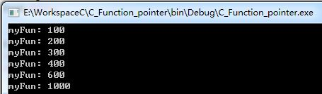
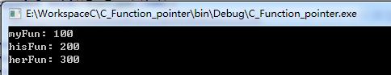

# 深入理解C语言函数指针

**示例1：**

```c
void myFun(int x);    //声明也可写成：void myFun( int ); 在函数声明（也称为函数原型）中，参数可以没有名称，只需要指明参数类型。这足以告诉编译器函数将接受哪种类型的参数。
int main()
{
    myFun(100);//一般的函数调用
    return 0;
}
void myFun(int x)
{
    printf("myFun: %d\n",x);
}
```

我们一开始只是从功能上或者说从数学意义上理解myFun这个函数，知道myFun函数名代表的是一个功能（或是说一段代码）。函数名到底又是什么东西呢？

  

**函数指针变量**

一个数据变量的内存地址可以存储在相应的指针变量中，函数的首地址也以存储在某个函数指针变量中。这样，我就可以通过这个函数指针变量来调用所指向的函数了。

在C系列语言中，任何一个变量，总是要先声明，之后才能使用的。函数指针变量也应该要先声明。

==函数指针变量的声明：==

`void (*funP)(int) ;`  //声明一个指向同样参数、返回值的函数指针变量。

（整个函数指针变量的声明格式如同函数myFun的声明处一样，只不过——我们把myFun改成（*funP）而已，这样就有了一个能指向myFun函数的指针了。当然，这个funP指针变量也可以指向所有其它具有相同参数及返回值的函数。）

 

**示例2：**

```c
#include <stdio.h>
#include <stdlib.h>

void (*funP)(int);   //声明也可写成void(*funP)(int x)，但习惯上一般不这样。
void (*funA)(int);
void myFun(int x);    //声明也可写成：void myFun( int );
int main()
{
    //一般的函数调用
    myFun(100);

    //myFun与funP的类型关系类似于int 与int *的关系。
    funP=&myFun;  //将myFun函数的地址赋给funP变量
    (*funP)(200);  //通过函数指针变量来调用函数

    //myFun与funA的类型关系类似于int 与int 的关系。
    funA=myFun;
    funA(300);

    //三个貌似错乱的调用
    funP(400);
    (*funA)(600);
    (*myFun)(1000);

    return 0;
}

void myFun(int x)
{
    printf("myFun: %d\n",x);
}
```

输出：



 

**总结：**

1、 其实，myFun的函数名与funP、funA函数指针都是一样的，即都是函数指针。==myFun函数名是一个函数指针常量，而funP、funA是函数数指针变量，这是它们的关系。==

2、但函数名调用如果都得如`(*myFun)(10)`这样，那书写与读起来都是不方便和不习惯的。所以C语言的设计者们才会设计成又可允许`myFun(10)`这种形式地调用（这样方便多了，并与数学中的函数形式一样）。

3、 为了统一调用方式，funP函数指针变量也可以funP(10)的形式来调用。

4、赋值时，可以写成`funP=&myFun`形式，也可以写成`funP=myFun`。

5、但是在声明时，`void myFun(int )`不能写成`void (*myFun)(int )`。`void (*funP)(int )`不能写成`void funP(int )`。函数声明和函数指针声明不能混淆。

6、函数指针变量也可以存入一个数组内。数组的声明方法：`int (*fArray[10]) ( int );`

 

**示例3**

```c
#include <stdio.h>
#include <stdlib.h>

void (*funP)(int);
void (*funA)(int);
void myFun(int x);
int main()
{
    funP=&myFun;
    //深入理解
    printf("sizeof(myFun)=%d\n",sizeof(myFun));
    printf("sizeof(funP)=%d\n",sizeof(funP));
    printf("myFun\t 0x%p=0x%p\n",&myFun,myFun);
    printf("funP\t 0x%p=0x%p\n",&funP,funP);
    printf("funA\t 0x%p=0x%p\n",&funA,funA);
    return 0;
}

void myFun(int x)
{
    printf("myFun: %d\n",x);
}
```

输出：


 

**总结：**

==1、函数指针变量跟普通的指针一样在32位系统下大小都为4。但是函数指针常量（即正常声明的函数名）的大小为1.==

2、函数指针变量和函数指针常量存储在内存的不同位置。

3、未赋值的函数指针变量（全局）的值为0。

 

**函数指针作为某个函数的参数**

既然函数指针变量是一个变量，当然也可以作为某个函数的参数来使用的。

示例：

```c
#include <stdio.h>
#include <stdlib.h>

typedef void(*FunType)(int);
//前加一个typedef关键字，这样就定义一个名为FunType函数指针类型，而不是一个FunType变量。
//形式同 typedef int* PINT;
void myFun(int x);
void hisFun(int x);
void herFun(int x);
void callFun(FunType fp,int x);
int main()
{
    callFun(myFun,100);//传入函数指针常量，作为回调函数
    callFun(hisFun,200);
    callFun(herFun,300);

    return 0;
}

void callFun(FunType fp,int x)
{
    fp(x);//通过fp的指针执行传递进来的函数，注意fp所指的函数有一个参数
}

void myFun(int x)
{
    printf("myFun: %d\n",x);
}
void hisFun(int x)
{
    printf("hisFun: %d\n",x);
}
void herFun(int x)
{
    printf("herFun: %d\n",x);
}
```

输出：



