# Bootstrap 前端开发框架

## 1. 什么是 Bootstrap

==Bootstrap 是一个非常受欢迎的前端开发框架，主要用于快速、响应式地构建网页和应用程序。它包括 HTML、CSS 和 JavaScript 组件，使开发人员可以轻松地创建具有一致性和专业外观的页面。==

以下是关于 Bootstrap 的一些关键特点：

1. **响应式设计**: Bootstrap 提供了一个灵活的 12 列格子系统，它可以自动调整并适应各种屏幕尺寸，从手机到大型桌面显示屏。
2. **预先定义的组件**: Bootstrap 提供了许多预先定义的组件，如导航条、下拉菜单、警告框、模态框等，使你能快速地添加这些功能。
3. **可定制**: 你可以根据你的需要定制 Bootstrap。例如，你可以通过其官方网站下载一个定制版本，只包含你需要的组件。
4. **jQuery 插件**: Bootstrap 包括多个 jQuery 插件，如模态对话框、工具提示和旋转木马。这些插件提供额外的交互性和功能。
5. **主题和模板**: 有许多第三方 Bootstrap 主题和模板，你可以使用它们为你的项目提供独特和专业的外观。
6. **良好的文档**: Bootstrap 的官方文档非常详细，包括了组件的代码片段、示例和说明。
7. **跨浏览器兼容性**: Bootstrap 经过优化，可以在多数现代浏览器中正常工作。


## 2. Bootstrap 基本功能

Bootstrap 是全球最受欢迎的前端组件库，用于开发响应式布局、移动设备优先的 WEB 项目。

Bootstrap 会根据你的屏幕大小来调节 HTML 元素的大小。

因此称为 ==`Responsive Design`（响应式设计）。==


通过响应式设计，我们将无需额外设计一个手机版的网页，因为它在任何尺寸的屏幕上看起来都还不错。
无论开发什么应用，你都可以通过将以下代码添加到你的 HTML 顶部来引入 Bootstrap 。

```html
<link href="https://cdn.bootcdn.net/ajax/libs/twitter-bootstrap/4.5.3/css/bootstrap.min.css" rel="stylesheet">
```


### 2.1 使图片自适应移动端

如果图片的大小恰恰和我们手机屏幕尺寸大小一样自然是最好的。 

==在Bootstrap4中，给图片添加`.img-fluid`样式，或定义`max-width: 100%、height:auto;`样式，即可赋得响应式特性，图片大小会随着父元素大小同步缩放。==  


### 2.2 用 Bootstrap 居中文本

通过文本对齐类，可以简单方便的将文字重新对齐。

例如:

```html
<p class="text-left">Left aligned text.</p>
<p class="text-center">Center aligned text.</p>
<p class="text-right">Right aligned text.</p>
<p class="text-justify">Justified text.</p>
<p class="text-nowrap">No wrap text.</p>
```

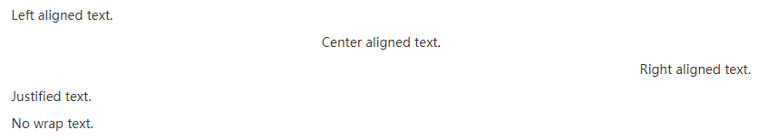


### 2.3 创建一个 Bootstrap 按钮

为 `<a>`、`<button>` 或 `<input>` 元素添加按钮类即可使用 Bootstrap 提供的样式。

`Bootstrap4` 提供了以下几种自定义按钮样式：

```html
<button type="button" class="btn btn-primary">Primary</button>
<button type="button" class="btn btn-secondary">Secondary</button>
<button type="button" class="btn btn-success">Success</button>
<button type="button" class="btn btn-danger">Danger</button>
<button type="button" class="btn btn-warning">Warning</button>
<button type="button" class="btn btn-info">Info</button>
<button type="button" class="btn btn-light">Light</button>
<button type="button" class="btn btn-dark">Dark</button>
<button type="button" class="btn btn-link">Link</button>
```

![img](data:image/png;base64,iVBORw0KGgoAAAANSUhEUgAAAssAAAA/CAYAAAAWlIX9AAAa20lEQVR4Ae2dCZAc1XnHyVGFKVeKEKoSKYWhILZjHJtKVQIkWIQrAkFx6bAU7KTsGFdhCGcIJNiAQAh0rIxJ7LhMEDZmgyUkkMSlGDsgcWlBBgw6QBFSJIKOPSSha1e7q9V+qX+Pvtlvvnkz09M7Pdf+u2rofq+/9/r1v1uzv/nz9esjhAsVoAJUgApQASpABagAFaACQQWOCNaykgpQASpABagAFaACVIAKUAEhLPMmoAJUgApQASpABagAFaACBRQgLBcQhtVUgApQASpABagAFaACVICwzHuAClABKkAFqAAVoAJUgAoUUICwXEAYVlMBKkAFqAAVoAJUgApQAcIy7wEqQAWoABWgAlSAClABKlBAAcJyAWFYTQWoABWgAlSAClABKkAFCMu8B6gAFaACVIAKUAEqQAWoQAEFCMsFhGE1FaACVIAKUAEqQAWoABUgLPMeoAJUgApQASpABagAFaACBRQgLBcQhtVUgApQASpABagAFaACVCAxLG/bK/Ktp0RGzxQ54jv8FNMAGl21RASaFVp279kr8598Wr49bbZce8sd/FRRA2g+78mnBNeg0NLZs1OmrnxAzlwyRT43byw/JTSATneufECgW6FloGundM54QDaPmyIbTh3LT0ADaNN53wMy0LmjkIwifdtE1l8r0naCyEtH8pNEA2i3/mqRvq2FdRaR9p5eubVtjZyycJn8waM/b7jPFxcuk5vb1sr2nt6i54mdBw8OSF//Qent62+6D87r4MBAUQ26unbIjJb75cJLJ8qfn3F203zGXTJBps+cIx0dnUXPnztzFUgEy4C+T80mIBcD5NC+42aFgRmQdsf0FgJyFQE59IPk9uktQWAG8J391BUE5BKAHPoRcdaSK6SjJx/0AMqbL/4KATkAyKEfDpsvuiIMzADl1z9NQE4CyKE2r58k0rcl96/k4RJA+c+eXN5wgByC+j99Ypls6z4QPE9UNiskh8A/JAJA+ZIJU5oGkEOwf9Flk6S9vSN0+qwLKJAIluGShmCQdaV1+foT+VcBrmYI3lhXfYe9df6TeRcIDmkIBFkXz2H/l9dn52kKtzQEhawr7LB33D1bZHAwV8v1/yDy0icIyyHwTVq37koRcTqLyC1ta2VUA7rJIVhG3XWvrs67nXBzwXENQWWz1sFB98uMlu/JqV86p6lhGQA99Z775NChQ/70WQ4okAiWR80oDYUE57BG0M4vt02bRViusausP0xwLfwyZvFkwnICV1l/TEC/QQcfmy5k6kW5Pww2jZucD8tMvaj8D4W240UkHyBOeaI5XGWF5y8sXCaH/I+vEeYq4wcAXHS/wHUNubHNVnfBxRNkoEQ6itdmpJYTwTJBOAzCcXXxN5uCGtfVd5JDmvvro9DHdTwnOaSTh+UNp51PZzlmCoaF6jwrkK5y5WEZjvRgPiyPbn2+KVIwFJaxDsFyszrIxc7Lf+effuZ5IwKWAf8hZ93rwbIIYbkGDyf6Gy8EbKyrHTj76xOCP9aVB86E5cLpFRaGS20Tlqv0ACNheUSlYvjvfMKyV4RlwjJhmSkgLgXEfy0QjMsD45BehGXCckPN1EFYJiw30QwYxdJH6Cz7v/jhMmGZsExYJiynnpNNWCYsE5brb6o5pmFkpsXzeERn2SvCMmGZsExYJiwTlhPkD5dKmUhjP9MwmIZhc46Hu01YJizTWY73Q4CwTFgmLBOWCcuE5XQelEs6fVut2zENg2kYTMOIR5EjJIqwTFgmLBOWCcuEZcKyBXTCMmGZsDxCMDjeaRKWCcuEZcIyYZmwTFgmLEfUUGyKtWbd53GJOcteEZYJy4RlwjJhmbBMWCYsE5YJy4eZkLBMOPYKNAQsn/uwyJY9Ims7hvcykLgvDUk7zl+EkTqn8n/9cpkc6O0VrOtJA399QlOhsa686eQ4GwZnwyg1G0bPL46UG//2OJl53SgZXF6lB/ksINvtOkjDaF3/UfTey75Dg3L/uxtSedV2tR7we+W1Nvmrc8bK6rVrY6d3rH3/fRk/aUpZbZI63/47v55hedGSZ2Tf/v1y1z0zKvJK7mo94PeVBSJjHhTZ2ePVLlxGmynzRQby3xFUuFFKe6oKy9NeFOlzr2FHGfXFAJWwXPgFHQDNg+51les+2FhX8FkIhEcCLP/7mlbpP9Sf8893RfvbqTu59QbzlYLlnjfeytFSC30bN8tIeCtgJWbDmHX9KLnhq8dJ9/O5QPrB/E/KmX/5aWl78Ogcl7laEFut45SC9mh/BWB5zrsbpPfQoN6i8tgHH8mo1njTx6Ht3v6B1CBZZ9GoFCxva++Q8V/+G3npldfkQG9fHhCPFFh+cO4j0tfXl73murG/u7ticFuvsLx1j8hJc0QeXy1ibnuVQAjLZaQxAIr39ubC8X9vyAB0KWAuBtONti979xzeKASTpepXvPFmBMrWmcX2qrXrCMsutaKUlna/vz5JwXPhxqURKAOYtQ9sv7ilLVvW+mZfVxKWBzq6ZOs1t2Rfl7316lsEddLfL7vmtmbr05i6rdZ9VgKWX/+Po2X8uBNlxzNH5UDxgnuPlZM+e7LMcM7uzmePiuI9RMeCTuvWNtJ2BWAZQHrNq6ukq7e/bOiFqwxYvva1Vak4ytWG5SSObxxn+ePde+SGm/5J/vNn84OQHve4/js/qbMMWIbrO/cnj8ppY87JvjK77Y1fyeDgoKx88205bcy52fpiLwsptK9RYdlrHKc8op1lD8vqGgOaGw16k47X3yQW1MrZ3t7eIY3iIofOq9md5Q/2bJaR6CKHwD9NWFaA7duwKYJmC9K6r1nWlYDlEPyqq/u18cfL5RfkgnQhuCYsl3aJCcuZeYzjQquNayZYBvgCcuE6Z0A6OTATlj1BVadc9TQMD8sATuQiaz7y3Dcz7vPT72cEQK7yPy7N5CwrUCtgv/Zhpl6lQtu/W5hpb+ss1KIPu2ifiAn1u64r0x/69f1gbGhj6+Ns2+NjOwSSceoAy/hl/W8/+nHRPhCnC1I2rBON4/x03hNR7nAoBn3jGHaBo23Hh/4V3DUOucjo18YB7HXBOOCA+5xlG4NY+2NA4Rrt0B5t12/cFK1Dx4qjjR2fbusYdR2Cvzh1gOX2ni752gu3BJ3kW9tmyq7e3WKdZ/SLdvjYYwC67WL3o5/9B7uzu5H2oX36fX48iLNpInY/nHG74JgnzysvV1nPoRqwDFd5cH93jrsMgLbLniVLZcNpmfzhPYuXRvGogyuti40BZO96qDVn/4F310RQ3rPy7ZzUj5xjqcudPdZz0bG6X26LDpNxx28t2wWvBCwrGNvcYAD0NyaeIM/OOUbGn3+irJ/3yazrjLQNHwtn+sTPnBx9CsE1+oJTff1Xj5MdT2fykR+/99ioL9SjPfZpOoiOCzGDLx0ptozjh9oosGOMuh/jebblmKB7rvEl1yk5yxN+sVK27u+Vl7fvkHW79+ktJ9u6e2XSL1dGLvJ7H+/N1mPD7lu+rSvKY9YA9DG69XlRp7jcdTXTMC6fNEW2bNueTdH42fwF8kd//CfRfTDmrPNk8VNPy+UTJ2dzlBWWkdqBtid99vNRbOtj8yIXGfuRB633Ida6z0J3nG3VU9eVdpYBy1dde2P0d3Llr97KusvqOOtxrfOs8e+sWi0dnV1RyFPPLJUlTz+Xk7P84NyfSG9vbxRzzQ03l53HXKmc5ThpGDb/WF3ju14U+a3bMxz1qdkimz+W7D2uMZqzPH1ZJvbOF0QGhjKcVL5U1zWHZQVUhVYALxaFZwuxGqNtbL6zQrCvA5wr6GL96uYhuNUcahzTHsf2ofCtMTZOxxMHkG2Mv6IKaeWuFXJDYKp9Kchq2aduAEABnhZKAaOo1/7Rh7YPxWM/Fu1DAdu2wz47Tu3bwjvqNm76MO9YCud6bAvB2o/GYJx6fB2Pjj3u2l8fBb5y1wqqAFls+/aoiwPLgFTbB9q91bUm6k9h1zrYSPNAvR4f0KvHRl8KxH4/oP7trjUR3KM9jok12tpjal/lrKsByx13zszCbwS5c1sFcKq5zIBjm6oRlUUOu9EZcEVONIC7Y+rMCGQB4GiTAejzozqFYgvLqLN503sWPzd0rNPOl6gskhOTxO2uBCwDFJFyYfOW4R7fCKh95qjoIbsQsAJg0XbpnGME+c0KnD4HGn0BXG06h4LvSZ85OZsTrQ73/AAcW1gu1gZj8MfX3GsP8TreWOuUYRnfMZrDDPd5b99ABNCjD+c0h9IwANH7TGqGgreF6UaBZYCyhWfNeQY060OACsOXTZychWyf+4y/BY2QhqEpFes/2Cgb/3eTnH7muXLHXdPl1++sktMPp2VE0NvXJwBipGooLPf398vDjyCtI+NGW2f5zrvvlb379kXpHdqPHivuupaw/Ju3iyj47ukVOeshkcnmgT4Ly4vWivze9AzDDVYZlPHvteawDCi2QAsotbAaglOFZQurCrWhOgu6Flp9P1q2oI549GnrANld3UMQbvuMs+1hLC7EFYpTWLUwiljA5b793TkOrwdJtLVQa48B2LRgqvt8Pdr7OMCrjicEtDo+xGCc2rdd+7EqLFswRjzGY88hdN6231Lb/vqUA4WhWAAqFgu8iAOAloJlD62+f/SNj69HGQDt99n+7LZvD8D24/Ux5ZSrAcuauxyBbWAquAim93UfBt+x4uEZ8OpjPAQjJjpOe6coLMN5PvTxbumYOivrFPuYLDw/3JqF91rCMoBy/AVDDrJ1jy1I+7gQaPo0DZTxoKB1pxWWrUONvuyxNMaDerE2hcbnxxQad9G6lGHZO8LLt+3IcZA9LBd64K9QfVxoroWzrGDsHwZUJ9nD8vKXX83mI3s49uU4LnIoxn/np+EsA17hJCsse5hVOFbnWcuZ+POyec4Kyw/9+Keyd9/+w/0N7ff9lirXEpb97BgA4hNbhtxlheUFq0V++w6R+avCDw/665dGueqwDBC2i09lANhaeAZ8KsQqCPsyYhSWLRgXq7NjKNYv+vZw7OE5DiDbGHtsbJeCt7j7AYxYFCaxLrQAMBVGNd4fB/0hztd7GEWchVXEo0+FZR+v/aHew7KCtR23jiEUj758/x6e9Xhx1/bY2C4HCovFKjSr0xsHlhGrTrDvG04w9ml/fr8ez5+PTdPQGA/V2jfaWtfaHyNuuRqw7J1lwKg6w1YDTbPQNAx1kT0sK/BaVzkEy+oa22PotgI1YjKO9RBQ1xKWLZiqw6sP8AFAkZIBlxngah1oBUx9GFD/F7h1cUOgao+nDnVcWFZ4tsfWMeFYcMQ1lUNjQmPQfbHWKcMy0jDURQbYloJlwPNWk6qhMKzusrrUWh93XQtYBhR//cqrsm6xwmsIlv3UcR6OfVn7Knet/151nRYsW2cZEAt3Gc6wXTQVQ2F55ZtDaRtoo7nPmGHDg3QpMA7tryUs27QMaBCC5eNbRI6eJvJ4DUEZY6s6LIdyli1IpgnLgFwsCtQeun1Zx6X1aIftjTtzZ/TQuLjrzCiG/hsX4uLEARTxBQIQBrDqdqhtvcEyxo5F4V3HVwqWNQ7tsN21Y1dBtzqkg68bujKZrbhAGCcO4KnwWw1YjgO6Fow9NGOMcJij6zKMKe+qAcsA48jhvTOTQhGlS2jucMA1riQsl8pBrjdYBjCqq/vOI78j35iQgWPUW3iGq2udXd2nsIp4D6a+jBjCcmaeZIVbwvLIg2WFX02z0HxlLet+7ywXg2XkMifJU7bQ3CiwPLUGecqWBUYMLCvwqosMsPV1vmzhF6CMVAy4zIBlxNr95WzbC4BtD2vDKXtH1zu3vu+QK6wxFry1DmtfH+rDjwO5yQrB2hfKmrOswKtgjBhfV8hZRiz6wjgQA1hGWz1OuWt/feJAcNwYm96gIGqdYQVXhdZiqRI4JuI01o/BgrnfFyrbsfn95fbl26cNy5qCoU5ujst8+CE7n2IRF5ZtLvKQ+7w/Jw0j+2Dh4WN517geYVmh9ge3/n4OEANuNQ8YjrE6ziEwDtVpv3ZqujRh2ad8YEz4IYA0EzsG1Mf+1JmzXCjdolB9vTvLeDDPplfACfb5yN5pRox3kn25XEdZ4/13fhrOMuBY4fZb190U/b1SMAa8lgPLmJ7uge//ULa3d2b7PPVLQ1PVWRgutV3vsAz3ecWHIsdOF6klMI8YWAbMAnZt7rE6zQrQxWAZKR1IGXlrayaHuRw49rH+H2a5MKfxeBgOaQtaVrjUlAgte3fZtgNcJnnAz4JvKVjG+BCjaRkoa7qFwrLG6NhRBjhjUYAuBsvoD+f5f1u2ZuPRR5KPvz4e/OKW8RAegFjjPQijHqCrTjPKgFIsFoCxbfOH0WecB/wA2ki5sO6yb4uHAXV8FpaxbSG+nmFZUy0s1Hp4Brzqg3lx0zAwa0aU1yxS9AE/Tdfw7vKBX6+OcqBx7HqEZbjESLe4/PwTRR+yU5gE8OIhPZtegX0+R1idZhtXTVhWCLdON8YIgLZj0vOKva4zWAb8FnrAz+c/xwVlxNUiDQOAet/MllgP+JVKw0BfM2a1yL0zZkvPgfyXoSgMl1r77/xKwrJCsH8xyVBKRibfWJ3mOGkY+gY/hW6F8CTA3AiwjNkw3viotsA8omBZc5j1H4ZOPRcHlhW2fT61B+E4ZT2+rpMAHdoALP2iYKl9KjDbOB+jwKwxFq4VanWfhVs9RhxY9uMFOAO4rfPtjwWox1h0vMVgWfu3QK7jK3et56prhcly14Bcv1hwRX/qLmsc9qOdhWXE+b4syCoUax8Wvv0+m6/s91kgR/92sX2WqwPiK+ks23FF2ybVwjq6CtEaj5kx4ACXA8sKutoH1vuefzFv6jgFZhunLrf2UU85ywqNcJDH/EXuw3gKxQBOm4KhbWy+MoA0mm7OuLjVhGWMSYEZs2bodHQvfP93az51HFxf/wa/SWbquHJylhWA/bRyr0S5z/UzdZxO76a57Ndef5Ps3LU7co3t7BcKzBp/6YQvR2//C00dpw/8oQ3+HvjZL+BA6xRy9TB1XOgNfgrA1uX1+crvrl4TucTqNitkh9IwFJYBx9pPZtaM1uysGfZYxbYrDcu/4V5Ud8aPMq+41of1dBo4X8Z3Zyhn2eY1Yz8e9NM+7fdt2ttVheU4IFnPMd6ZTjpWf1HLhTnGhx3jELQn0cpfnyRwyDa58zFXCpYtDNdqW8HYwnC1xlKpqeMUfJt1HQL2ss61Qs6yQm69rivlLJdybuPsD6VdxGlXiRj/nZ/UWS4GpfW6r1Kw7DVstjJh2f0KKgTA6krrw4GF4uLU+5soCdCxTS4wqytt00OSauSvD8E3F3yT6NFMsIyp4krlKKcFz4TleHnHdiq8siBZ85oJy9mXh1QCRuP0gbmXr7/xZtm56+OqH9t/5xOWvSIsE5ZjwjJSNfw0d3HAOBTjb7ukUMd2Q8CMVA2bPjIcbfz1SQKHbJML2I0Ky8hZtg5y5iHB/cN+uUhSmCYs58IyUjAAxvZBPqSJhB76KwuaCcupAuu//uCHsua997LHwMN9eJuff+gvDmRXIsZ/5xOWvSIsE5ZLwLK+5a8SucoKzv62Gw7YjfS2mm9diVxl1dJfH4JvLvgm0aNRYdnnPePesA8SJoXepO0Iy7mwDAAGLOurrpErG8rBLguU4S4TlrMgWwkY9X3YV11rfnOtQBlj8wth2SvCMmG5BCwr4FZy7W87hTSuh5ziWmrhr08SOGSbXMBuVFhOCrVptSMs58Ny2SCsqRbF1oTlVGHZw3Oty/47n7DsFWGZsExYTjS9Wi1hNu1j+68Fgm8u+CbRg7A8Nvsq7OGANGGZsFzJhwXr6QG/WgKz/84nLHtFWCYsE5YJy24+Zv+1kAQO2SYXsAnLhOVUHOBi7vBw9tFZprN8xtlSrzNYVHJcnA3D/8UPlwnLhGXCMmE5+2KStCCfsExYJiz/XCrpCleiLzrL/dGPAo9HdJa9IiwTlgnLhGXCMmH51MrA7HBSLOK0ZRoG0zAqAcnaB2GZsExnOd4PgUSwPGqGSCUfeBtJfUE7v9w2bRaB1QFr2nnJhfrHtfDLmMWTU4fJtBzdeugX+nlnedOFUyqSwxsHMJslZtO4yZIHy20nSEM5tsNJjahW27bjReSQ/xqQU55YXnfOsEJvkvUXFi4Lvu66r//giErBwPn65aLLJo2IFIwLLp4gAwMD/vRZDiiQCJavXERYTgr4f/9k/lV4bMFiwnKdwHLr44vyLtB33vguYXlebg5yORB+2+steZp23vNdwnKZbnbH3S35sPw/V4m89AkCcyVBet03RWQw7569qW21jHq0/lIpkoAy2lz/2uq831446YMDAyMKlkPO6vSZcwSvkq5kbnA99nXXPTPk0KH8H4Z5Nz8rJBEsb9srcux0AnO5wAzNoJ1fdu/ZK/889T4Cc42BGdcA18IvnT075fRFEwjMCYAZunX07PCSykDXTtn01xMJzDGBedN5E2SgM19H6dsmsuIPCcuVguUVo0X6tuTdr6ho7+mVzy94sSnc5c89/oJs6z4QPE9UjhR3OeQq4/y7unbI2Isub2pYPm/cpdLe3lHwHuCOXAUSwTK6APR9c5HI6JmE5lLQDI3gKIdAWS8HIO2xhUvk29NmE5qrDM3QHI5yCJT1+gCYb195v5y5ZAqhOQY0Qyc4ytCt0AJg7px+v2wex5SMQqki0AaOchCUVVgA8/qrRZiSkfxHA7SDo9y3VVUNrgHMN69YI6csXNaQ0PzFhcsiR3l7d2/w/GwlHOZmhWacV8hRtucPYL535hy58NKJTQXN4y6ZIHCUOzo67elyu4QCiWG5RL/cTQWoABWgAlSAClABKkAFGl4BwnLDX0KeABWgAlSAClABKkAFqEBaChCW01KW/VIBKkAFqAAVoAJUgAo0vAKE5Ya/hDwBKkAFqAAVoAJUgApQgbQUICynpSz7pQJUgApQASpABagAFWh4BQjLDX8JeQJUgApQASpABagAFaACaSlAWE5LWfZLBagAFaACVIAKUAEq0PAKEJYb/hLyBKgAFaACVIAKUAEqQAXSUoCwnJay7JcKUAEqQAWoABWgAlSg4RUgLDf8JeQJUAEqQAWoABWgAlSACqSlAGE5LWXZLxWgAlSAClABKkAFqEDDK0BYbvhLyBOgAlSAClABKkAFqAAVSEsBwnJayrJfKkAFqAAVoAJUgApQgYZX4P8BL23CyL1e4oIAAAAASUVORK5CYII=)

**注意:**

虽然按钮类可以应用到 `<a>` 和 `<button>` 元素上，但是，导航和导航条组件只支持 `<button>` 元素。

我们总结的最佳实践是：**强烈建议==尽可能使用 `<button>` 元素==**来获得在各个浏览器上获得相匹配的绘制效果。


#### 2.3.1 使用 btn-primary 主题色按钮

`btn-primary` class 的颜色是你在应用中的主题色。

示例：

```html
<button type="button" class="btn btn-primary">Primary</button>
```

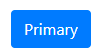
这样 “突出显示” 是引导用户按步就班进行操作的有效办法。


#### 2.3.2 使用 btn-light 浅灰色按钮

Bootstrap4 的 `btn-light` 按钮颜色和 Bootstrap3 的 `btn-default` 有点类似。

示例：

```html
<button type="button" class="btn btn-light">Light</button>
```

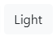


#### 2.3.3 使用 btn-danger 提示危险操作

红色 `btn-danger` class 用来提醒用户此行为具有破坏性，比如删除一张图片。
示例：

```html
<button type="button" class="btn btn-danger">Danger</button>
```


### 2.4 创建一个 Bootstrap 块级元素

一般情况下，具有 `btn` 和 `btn-info` 两个 class 的 `button` 元素宽度与它包含的文本相同，

示例：

```html
<button class="btn btn-info">Submit</button> 
```

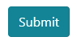

这个按钮的宽度应该和文本 "Submit" 相同。

通过给按钮添加 `.btn-block` 类可以将其拉伸至父元素100%的宽度，而且按钮也变为了块级（block）元素。

后续的元素会流到这个块级元素的下方，即 "新开一行"。

```html
<button class="btn btn-info btn-block">Submit</button>
```

 

这个按钮会 100% 占满所有的可用宽度。 

**记住:**

这些按钮仍然需要 `btn` 这个 class。


### 2.5 使用 Bootstrap 网格系统

#### 2.5.1 什么是网格系统？

网格系统有的地方也称为栅格系统。英文都一样，都是 Grid System 。通俗的理解，就是一种设计布局的方法，画漫画会有网格纸，拍照会有网格线一样。我们设计一个平面页面，你不能像自己随便画画一样，没有设计的布局，就随便开始动笔了，一个优秀的前端设计师一定要先思考好大局。在网页设计领域，网格系统就会帮助我们运筹帷幄。相信做设计的同学应该深有感触，我们做编程的也许不懂设计，但是在修改前台页面的时候，有时候一个小小的效果卡到半天都不会的感觉真的让人抓狂啊！


#### 2.5.2 Bootstrap 响应

**Bootstrap 把一个网页在自己的容器内分割成了 12 个列。**简单说就是一个网页给你分割成了 12 个长条条！就是下图这种感觉。

注意，每一列之间有间隙，每一个左右各15px，两个之间就是 30px

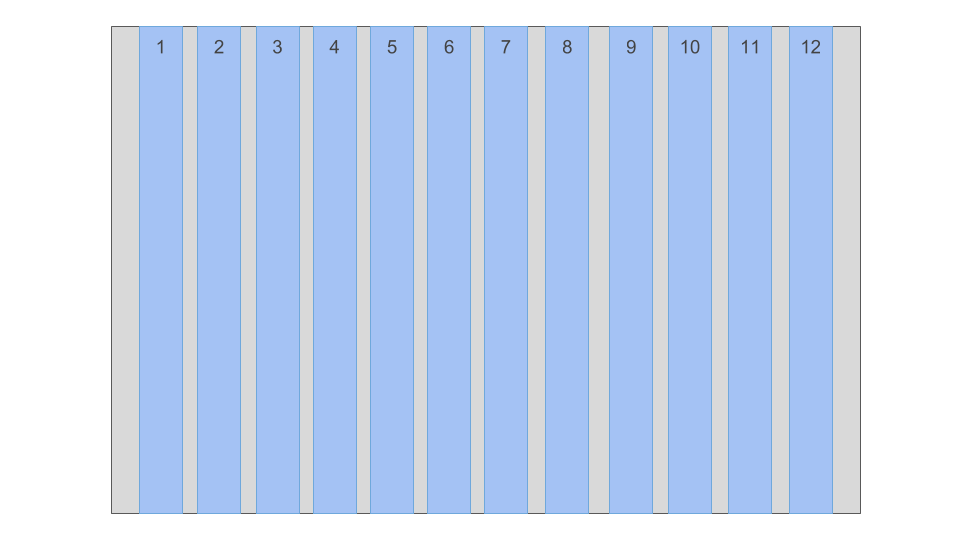

而 Bootstrap 有个很好玩的特性，就是响应式。响应式就是像一个推拉门一样，==为了符合我们网页的尺寸，比如你用手机和用电脑，屏幕都是不一样大的，响应式通过对 12 列进行挤压推拉，就能展现出对应的效果。==类似于下图这种感觉。

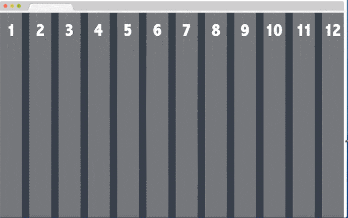


#### 2.5.3 Bootstrap 网格系统三大巨头

这里有 3 个类，请务必记住，网格就是围绕这三个类颠来倒去。
如下图，就是。

==.container==
==.row==
==.col==

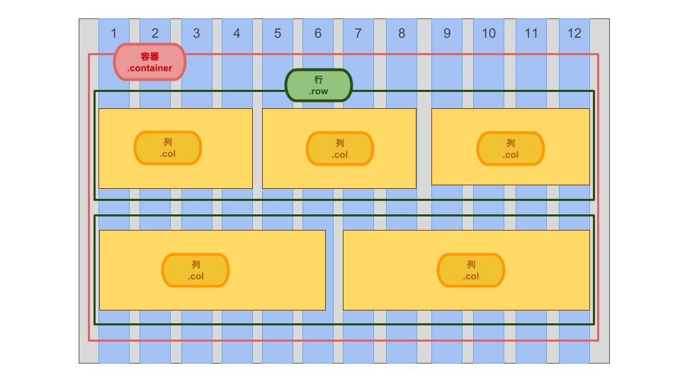

**1 .container 容器**

我们首先来看容器。没有了容器就无从谈起下面的两个，所有都是要在这个.container 里发生。

使用容器的目的是为了：

- ==为页面内容提供统一的内边距，使其不会紧贴屏幕边缘。==
- ==使内容在更宽的屏幕上居中显示。==
- ==与 Bootstrap 的响应式网格系统一同工作，使列（columns）在容器内正确对齐。==

如下图。

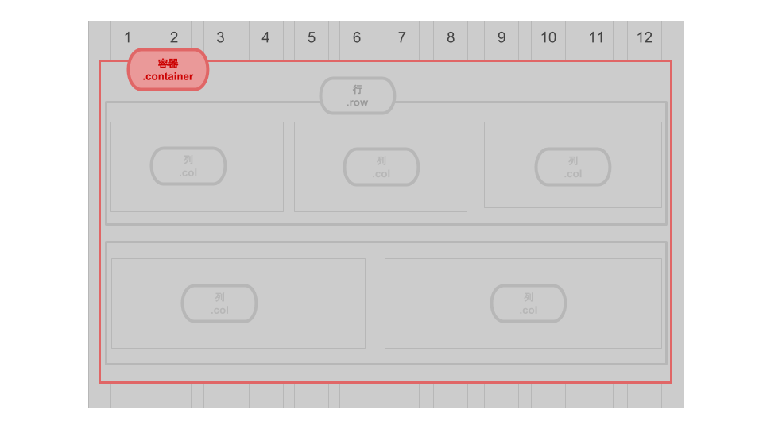

容器要理解起来其实一点都不是特别难。主要是区分一个概念。

==容器的尺寸和浏览器页面尺寸不一样。容器的尺寸小于浏览器页面。【所以一个网页旁边经常有留白，这就是容器小于浏览器】==

理解这个概念接下来就好说了。==Bootstrap 把网页基本上划分了 5 种。并设定了与此相对应的容器大小。==
整理成表格和图解如下

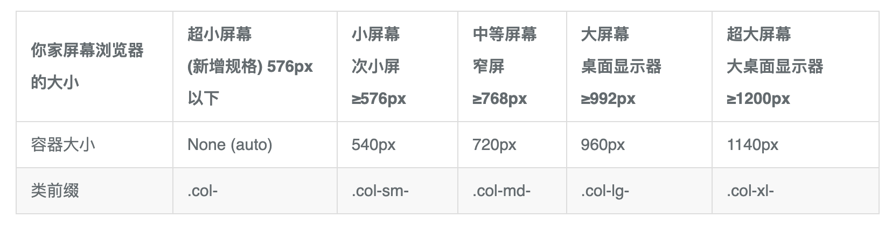

*图解*
这是一张总图

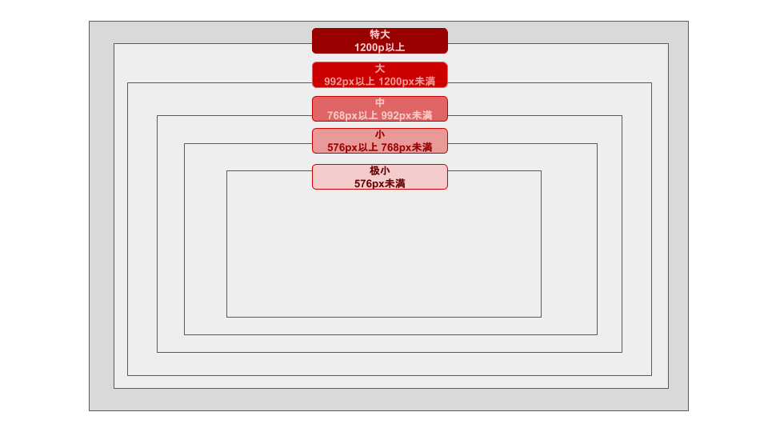

其实容器还有一种响应的，就是上面像推拉门的那张图片。
这个时候的类名是.container-fluid，无论你窗口大还是小，这个都会根据窗口来进行响应流动。
类似感觉就像是。

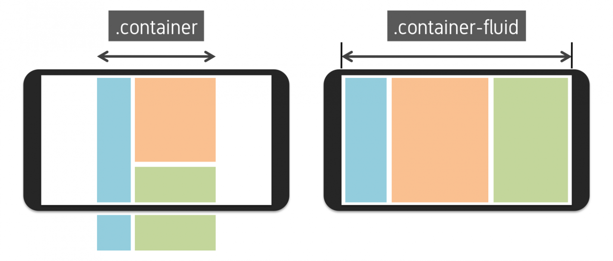

左边是固定，右边是响应。


**2 .row**

接下来我们来看，这个.row 是最简单的，上下排列。要点就是必须要在容器.container 内，.row 包含着.col
看图一下子就明白了，这个感觉没什么特别好说的。

上下排列，外面有.container，里面有.col


**3 .col**

接下来我们说.col这个比较繁琐，理解起来可能也没有那么轻松。但是入门阶段，只要看懂是什么就可以了。

下图就是.col

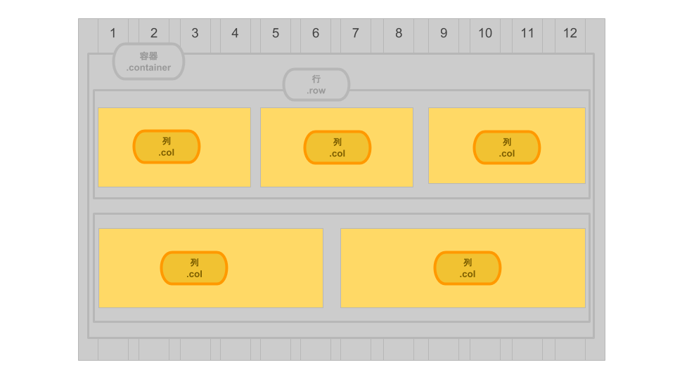

然后写 col 类的时候，写法是。

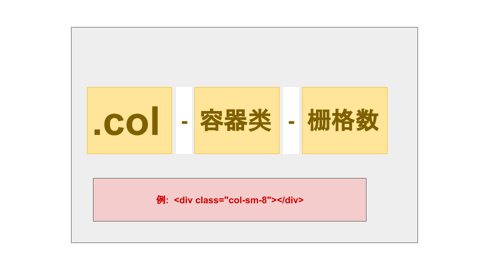


假定我们写的是以下布局。

````html
<div class="container-fluid">
  <div class="row">
    <div class="col-md-4">.col-md-4</div>
  </div>
</div>
````

那么图片显示效果就应该是这种感觉。

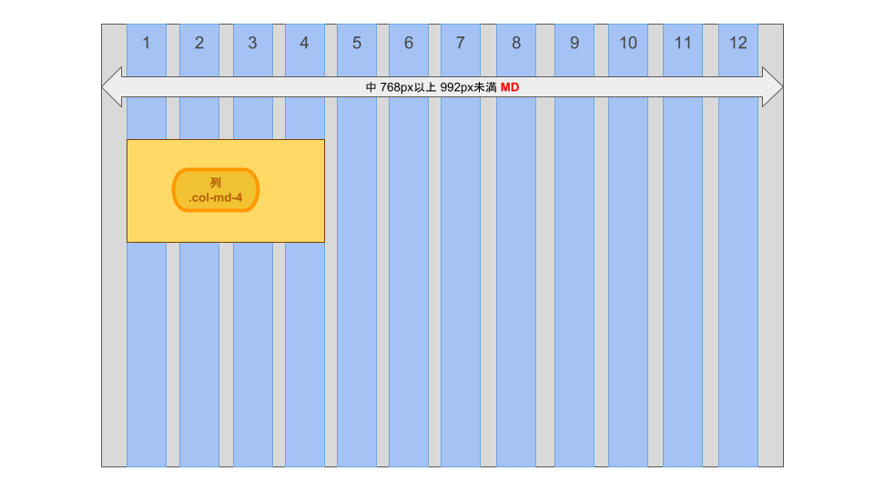


假定我们写的是这样的。

````html
<div class="container-fluid">
  <div class="row">
    <div class="col-sm-4">.col-sm-4</div>
    <div class="col-sm-4">.col-sm-4</div>
  </div>
  <div class="row">
    <div class="col-sm-12">.col-sm-12</div>
  </div>
</div>
````

那么图片显示效果就应该是这种感觉。

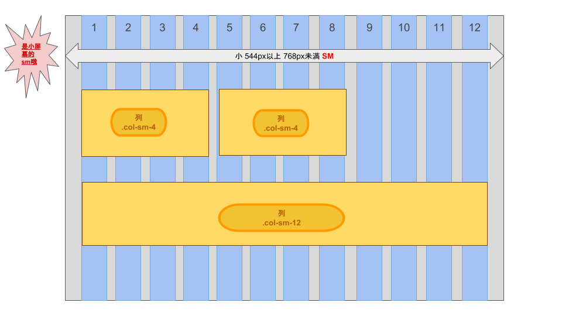

那如果我们需要自己布局在大屏幕和手机屏幕分别显示不同的布局呢？

比如这样的效果。

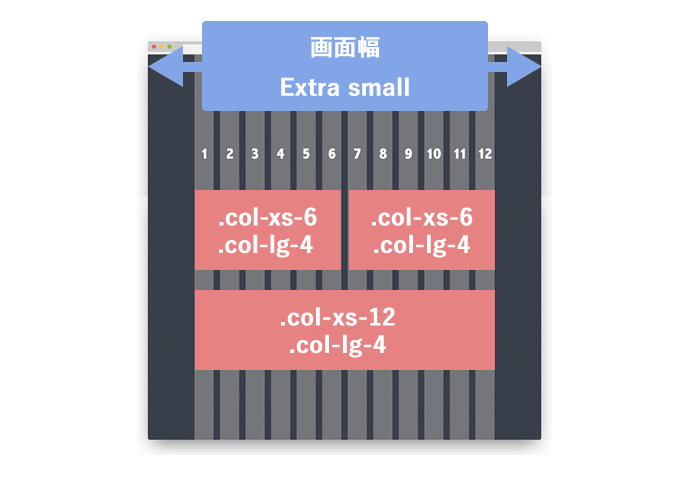

那么代码就应该是

````html
<div class="container">
    <div class="row">
        <div class="col-xs-6 col-lg-4"></div>
        <div class="col-xs-6 col-lg-4"></div>
        <div class="col-xs-12 col-lg-4"></div>
    </div>
</div>
````

==在 xs 小屏幕的时候 6 6 12 (两行)== 
==在 lg 大屏幕的时候 4 4 4 (一行)==


==以下是一些基本的 Bootstrap 网格布局示例：==

1. **基本布局**: 两个并排的元素，每个元素宽度为 6 列。

   ```html
   <div class="container">
     <div class="row">
       <div class="col-6">内容 1</div>
       <div class="col-6">内容 2</div>
     </div>
   </div>
   ```

2. **不同设备的布局**: ==在大屏幕上，每个元素宽度为 4 列；在中等大小的屏幕上，每个元素宽度为 6 列。==

   ```html
   <div class="container">
     <div class="row">
       <div class="col-lg-4 col-md-6">内容 1</div>
       <div class="col-lg-4 col-md-6">内容 2</div>
       <div class="col-lg-4 d-none d-lg-block">内容 3</div>
     </div>
   </div>
   ```

3. **偏移列**: 元素宽度为 6 列，并在左侧留出 3 列的空间。

   ```html
   <div class="container">
     <div class="row">
       <div class="col-6 offset-3">内容</div>
     </div>
   </div>
   ```

4. **自动宽度列**: 根据内容的大小自动调整列的宽度。

   ```html
   <div class="container">
     <div class="row">
       <div class="col">内容 1</div>
       <div class="col">内容 2</div>
     </div>
   </div>
   ```


#### 2.5.4 响应式风格的单选按钮

==还可以将 Bootstrap 的 `col-*` class 用在 `form` 元素上！==

这样我们就可以在不关心屏幕大小的情况下，将我们的单选按钮均匀的平铺在页面上。

````html
<div class="row">
		<div class="col-6">
				<label><input name="fruit" type="radio" value="苹果" checked />苹果 </label> 
		</div>
		<div class="col-6">
				<label><input name="fruit" type="radio" value="梨" />梨 </label>
		</div>
</div>
````

复选框同理


#### 2.5.5 给表单控件的输入框添加样式

在Bootstrap框架中，`.form-control` 是一个CSS类，主要用于样式化表单元素并使其具有一致的外观和感觉。当你为表单元素（如 `<input>`, `<textarea>`, 和 `<select>`）添加 `.form-control` 类时，它们会获得以下特性：

1. **全宽度**：如你所说，元素的宽度将设置为100%。这意味着元素将尽可能地填充其父容器的宽度。
2. **样式化外观**：边框、圆角、填充（padding）和字体样式都会被修改以符合Bootstrap的设计风格。
3. **焦点样式**：当表单元素获得焦点（例如，当用户点击输入框时）时，Bootstrap还为其提供了特定的样式，以指示它是活跃的。
4. **自适应大小**：对于 `<select>` 元素，你还可以使用 `.form-control-sm` 和 `.form-control-lg` 类来改变元素的大小。


### 2.6 使用 Bootstrap 颜色类

Bootstrap 4 提供了一些有代表意义的颜色类：

```html
<p class="text-muted">柔和的文本。</p>
<p class="text-primary">重要的文本。</p>
<p class="text-success">执行成功的文本。</p>
<p class="text-info">代表一些提示信息的文本。</p>
<p class="text-warning">警告文本。</p>
<p class="text-danger">危险操作文本。</p>
<p class="text-secondary">副标题。</p>
<p class="text-dark">深灰色文字。</p>
<p class="text-light">浅灰色文本（白色背景上看不清楚）。</p>
<p class="text-white">白色文本（白色背景上看不清楚）。</p>
```

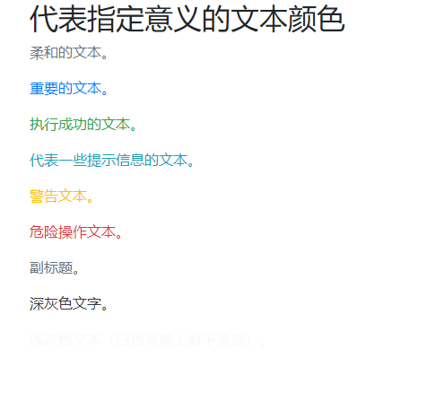

### 2.7 使用 span 创建行内元素

你可以使用 span 标签来创建行内元素。
还记得我们怎么使用 `btn-block` class 来创建填满整行的按钮吗？

通过使用行内元素 `span`，你可以把不同的元素放在同一行，甚至能为一个元素的不同部分指定样式。因为span标签内的元素不会换行。
把 "兔子的眼睛为什么是红色的?" 中的 "红色" 放入 `span` 标签。
然后为其添加 `text-danger` class 来使其文字变成红色。

示例:

```html
<p>兔子的眼睛为什么是<span class="text-danger">红色</span>的?</p>
```

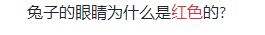


### 2.8 将字体图标添加到我们的按钮中

Bootstrap默认不包括图标库，但是我们有几个建议可供您选择。

- [Font Awesome](https://fontawesome.com/)
- [Iconic](https://github.com/iconic/open-iconic)
- [Octicons](https://octicons.github.com/)

虽然大多数图标集包含多种文件格式，但我们更喜欢使用SVG实现来改进可访问性，并且支持矢量呈现。

Font Awesome 是一个非常便利的图标库。这些图标都是被保存在 `.svg` 的文件格式中的矢量图。这些图标就和字体一样，不仅能通过像素单位指定他们的大小，它们也同样会==继承父级 HTML 元素的字体大小。== ==你可以将 Font Awesome 图标库添加至任何一个 app 中，方法很简单，只需要在你的 HTML 头部增加下列代码即可：==  

```html
<link href="https://cdn.bootcdn.net/ajax/libs/font-awesome/5.15.1/css/all.min.css" rel="stylesheet">
```

==`i` 元素起初用于让其它元素具有斜体（italic）的效果，不过现在一般用于指代图标。==
==你可以把 Font Awesome 中的 class 属性添加到 i 元素中，让它变成一个图标，==

比如：

```html
<i class="fas fa-info-circle"></i> 
```

记住 `span` 元素也一样可以用于指代图标。


