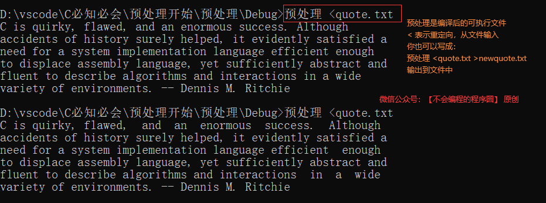

### 二  把程序划分成多个文件

#### 程序：文本格式化

输入未格式化的引语：来自 Dennis M. Ritchie 写的"The Development of the C programming language" 一文：

```c
  C 	is quirky,  flawed,		and an
enormous success.		Although accidents of	  history
   surely helped,	it evidently	satisfied  a    need
       
       for a system implementation	language		efficient
 enough		to  displace		assembly  language,
yet sufficiently	abstract	and fluent	 to describe
  algorithms  and		interactions   in  a   wide variety 
of	  environments.
    				--		Dennis		M.		Ritchie
```

程序完成对这段文字的调整：

```c
C is quirky, flawed,  and  an  enormous  success.  Although
accidents of history surely helped, it evidently satisfied a
need for a system implementation language efficient  enough
to displace assembly language, yet sufficiently abstract and
fluent to describe algorithms and interactions  in  a  wide
variety of environments. -- Dennis M. Ritchie
```

程序分析：

完成这个程序需要两步：读入和输出。

读入我们选择按单词读入到当前行中，然后按当前行输出。注意输出的每一行最后“对”的很齐，我们 write_line 函数对这种格式做了特殊处理。

按单词读入我们创建 word.h 和 word.c

按行输出我们创建 line.h 和 line.c

最后用 justify.c 包含 main 函数

