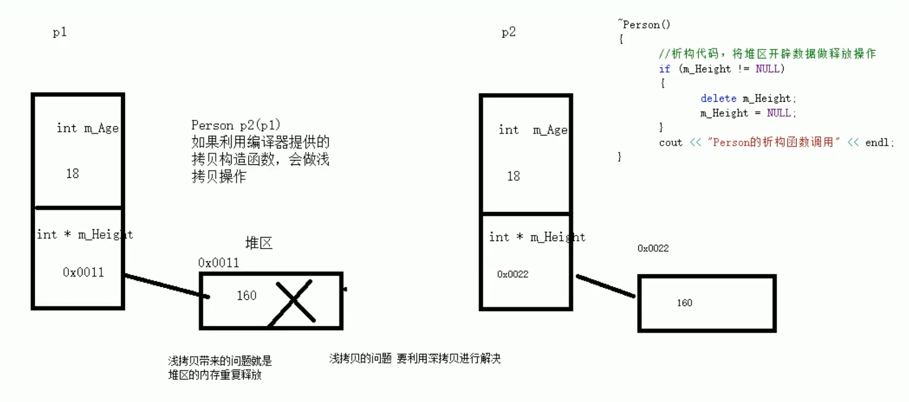
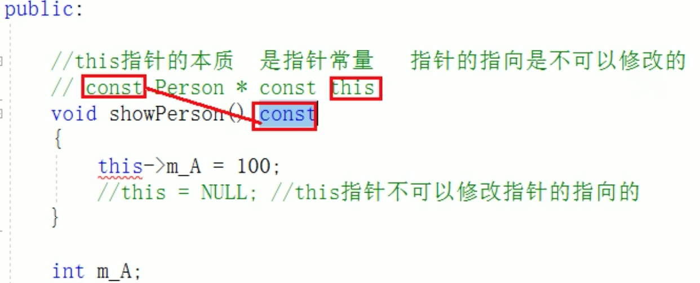
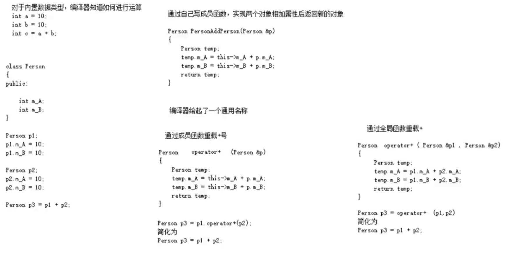
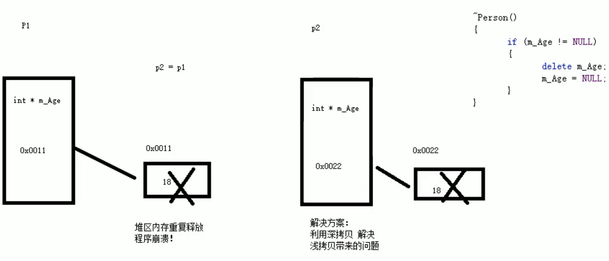
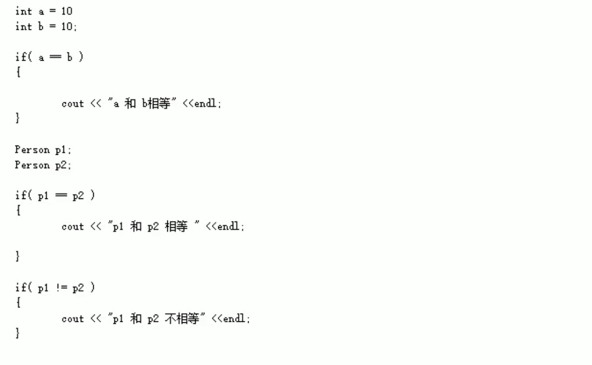
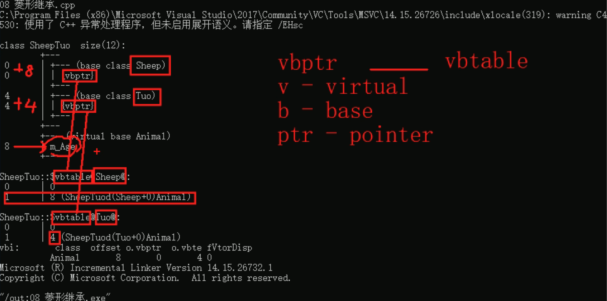
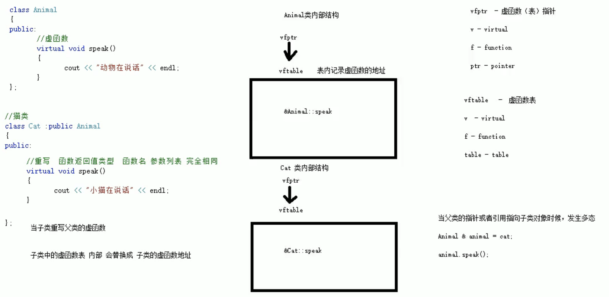
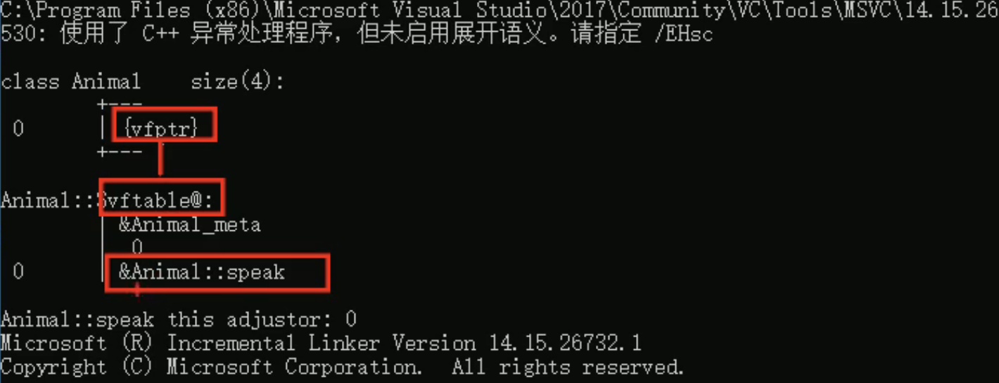
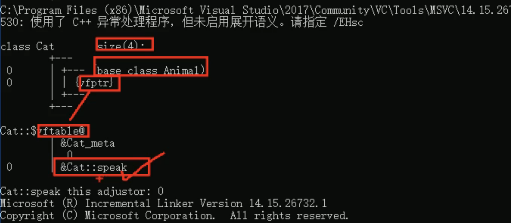

#     C++核心编程

本阶段主要针对C++**面向对象**编程技术做详细讲解，探讨C++中的核心和精髓。


## 1 内存分区模型

C++程序在执行时，将内存大方向划分为**4个区域**

- **代码区：**存放函数体的**二进制代码**，由操作系统进行管理的
- **全局区：**存放**全局变量**和**静态变量**以及**常量**
- **栈区：**由编译器自动分配释放, 存放**函数的参数值**，**局部变量**等
- **堆区：**由程序员分配和释放,若程序员不释放,程序结束时由操作系统回收

***内存四区意义：不同区域存放的数据，<u>赋予不同的生命周期,</u> 给我们更大的灵活编程***


### 1.1 程序运行前

在程序**编译**后，生成了exe可执行程序，**未执行该程序前**分为两个区域

**代码区：**

- 存放 CPU 执行的机器指令


- 代码区是**<u>共享</u>**的 (即另外的执行程序可以调用它)，共享的目的是对于频繁被执行的程序，只需要在内存中有一份代码即可


- 代码区是**<u>只读</u>**的，使其只读的原因是防止程序意外地修改了它的指令

**全局区：**

- **全局变量**和**静态变量**存放在此

- *全局区还包含了**常量区***：**字符串常量 (双括号包含的字符串等)**和**其他常量**也存放在此

- **该区域的数据在程序结束后由操作系统释放.**
- 这部分还可以细分为 **data 区**和 **bss 区**：
  - data 区里主要存放的是已经初始化的全局变量、静态变量和常量
  - bss 区主要存放的是未初始化的全局变量、静态变量，这些未初始化的数据在程序执行前会自动被系统初始化为 0 或者 NULL


**示例：**

```c++
//全局变量
int g_a = 10;
int g_b = 10;

//全局常量
const int c_g_a = 10;
const int c_g_b = 10;

int main() {

	//局部变量
	int a = 10;
	int b = 10;

	//打印地址
	cout << "局部变量a地址为： " << (int)&a << endl;
	cout << "局部变量b地址为： " << (int)&b << endl;

	cout << "全局变量g_a地址为： " <<  (int)&g_a << endl;
	cout << "全局变量g_b地址为： " <<  (int)&g_b << endl;

	//静态变量
	static int s_a = 10;
	static int s_b = 10;

	cout << "静态变量s_a地址为： " << (int)&s_a << endl;
	cout << "静态变量s_b地址为： " << (int)&s_b << endl;

	cout << "字符串常量地址为： " << (int)&"hello world" << endl;
	cout << "字符串常量地址为： " << (int)&"hello world1" << endl;

	cout << "全局常量c_g_a地址为： " << (int)&c_g_a << endl;
	cout << "全局常量c_g_b地址为： " << (int)&c_g_b << endl;

	const int c_l_a = 10;
	const int c_l_b = 10;
	cout << "局部常量c_l_a地址为： " << (int)&c_l_a << endl;
	cout << "局部常量c_l_b地址为： " << (int)&c_l_b << endl;

	return 0;
}
```

打印结果：


**总结：**

* C++中在程序运行前分为全局区和代码区
* 代码区特点是共享和只读
* 全局区中存放 **全局变量**、**静态变量**、**全局静态变量**、**常量 (在常量区中)**
* 全局区中细分的**常量区**中存放 **const **修饰的 **全局常量**  和 **字符串常量**


### 1.2 程序运行后

**栈区：**

- 由<u>编译器自动分配</u>释放, **存放函数的参数值**, **局部变量**等


- **注意⚠️：不要返回局部变量的地址，栈区开辟的数据由编译器自动释放**

**示例：**

```c++
int * func()
{
	int a = 10;
	return &a;
}

int main() {

	int *p = func();

	cout << *p << endl;
	cout << *p << endl;

	return 0;
}
```


**堆区：**

- 由<u>程序员分配释放</u>, 若程序员不释放, 程序结束时由操作系统回收


- **在C++中主要利用 new 在堆区开辟内存**

**示例：**

```c++
int* func()
{
  //利用new关键字，可以将数据开辟到堆区
  //指针 本质也是局部变量，放在栈上，指针保存的数据是放在堆区
	int* a = new int(10);
	return a;
}

int main() {

	int *p = func();

	cout << *p << endl; 
	cout << *p << endl;

	return 0;
}
```


### 1.3 new操作符

​	C++中利用 **new** 操作符在堆区开辟数据

​	堆区开辟的数据，由程序员手动开辟，手动释放，**释放利用操作符 delete**

​	语法：` new 数据类型`

​	利用new创建的数据，会返回该数据对应的类型的指针

**示例1： 基本语法**

```c++
int* func()
{
  //在堆区创建整型数据
  //new返回的是该数据类型的指针
	int* a = new int(10);
  
	return a;
}

int main() {

	int *p = func();

	cout << *p << endl;
	cout << *p << endl;

	//利用delete释放堆区数据
	delete p;

	//cout << *p << endl; //报错，释放的空间不可访问，如果不报错存粹是运气好！
   
	return 0;
}

```


**示例2：开辟数组**

```c++
//堆区开辟数组
int main() {

	int* arr = new int[10];

	for (int i = 0; i < 10; i++)
	{
		arr[i] = i + 100;
	}

	for (int i = 0; i < 10; i++)
	{
		cout << arr[i] << endl;
	}
	//释放数组 delete 后加 []，如果没有释放，操作系统认为你不想释放，它会继续给你保留着让你用。
	delete[] arr;

	return 0;
}

```


### 1.4 变量作用域及储存类总结 (auto,register,extern)

作用域是程序的一个区域，一般来说有三个地方可以定义变量：

- 在函数或一个<u>代码块内部</u>声明的变量，称为**局部变量**。
- 在<u>函数参数</u>的定义中声明的变量，称为**形式参数**。
- 在所有<u>函数外部</u>声明的变量，称为**全局变量**。


<u>**全局变量**：</u>

在所有函数外部定义的变量（通常是在程序的头部），称为全局变量。**全局变量的值在程序的整个生命周期内都是有效的。**

全局变量可以被任何函数访问。也就是说，全局变量一旦声明，在整个程序中都是可用的。**在程序中，局部变量和全局变量的名称可以相同，但是在函数内，局部变量的值会覆盖全局变量的值。**


<u>**局部变量：**</u>

在函数或一个代码块内部声明的变量，称为局部变量。它们只能被函数内部或者代码块内部的语句使用。


**<u>储存类：</u>**

1. **auto 存储类（少用）**

   自 C++ 11 以来，**auto** 关键字用于两种情况：声明变量时根据初始化表达式自动推断该变量的类型、声明函数时函数返回值的占位符。

   C++98标准中auto关键字用于自动变量的声明，但由于使用极少且多余，在 C++17 中已删除这一用法。

   根据初始化表达式自动推断被声明的变量的类型，如：

   ```c++
   auto f=3.14;      //double
   auto s("hello");  //const char*
   auto z = new auto(9); // int*
   auto x1 = 5, x2 = 5.0, x3='r';//错误，必须是初始化为同一类型
   ```


2. **register 存储类**

   **register** 存储类用于定义存储在寄存器中而不是 RAM 中的局部变量。这意味着变量的最大尺寸等于寄存器的大小（通常是一个词），且不能对它应用一元的 '&' 运算符（因为它没有内存位置）。

   ```c++
   {   
     register int  miles; 
   }
   ```

   寄存器只用于需要快速访问的变量，比如计数器。还应注意的是，定义 'register' 并不意味着变量将被存储在寄存器中，它意味着变量可能存储在寄存器中，这取决于硬件和实现的限制。


3. **extern 存储类**

   **extern** 存储类用于提供一个全局变量的引用，全局变量对所有的程序文件都是可见的。当您使用 `extern` 时，对于无法初始化的变量，会把变量名指向一个之前定义过的存储位置。

   当您有多个文件且定义了一个可以在其他文件中使用的全局变量或函数时，可以在其他文件中使用 *extern* 来得到已定义的变量或函数的引用。可以这么理解，***extern* 是用来在另一个文件中声明一个全局变量或函数。**

   extern 修饰符通常用于当有两个或多个文件共享相同的全局变量或函数的时候，如下所示：

   第一个文件：main.cpp

   ```c++
   #include <iostream>
    
   int count ;
   extern void write_extern();
    
   int main()
   {
      count = 5;
      write_extern();
   }
   ```

   第二个文件：support.cpp

   ```c++
   #include <iostream>
    
   extern int count;
    
   void write_extern(void)
   {
      std::cout << "Count is " << count << std::endl;
   }
   ```

   在这里，第二个文件中的 *extern* 关键字用于声明已经在第一个文件 main.cpp 中定义的 count。现在 ，编译这两个文件，如下所示：

   ```
   $ g++ main.cpp support.cpp -o write
   ```

   这会产生 **write** 可执行程序，尝试执行 **write**，它会产生下列结果：

   ```
   $ ./write
   Count is 5
   ```


#### 1.4.1 详述 static

1. **static 的引入：**

   我们知道在函数内部定义的变量，当程序执行到它的定义处时，编译器为它在栈上分配空间，函数在栈上分配的空间在此函数执行结束时会释放掉，这样就产生了一个问题: 如果想将函数中此变量的值保存至下一次调用时，如何实现？ 最容易想到的方法是定义为全局的变量，但定义一个全局变量有许多缺点，最明显的缺点是破坏了此变量的访问范围（使得在此函数中定义的变量，不仅仅只受此函数控制）。static 关键字则可以很好的解决这个问题。

   另外，在 C++ 中，需要一个数据对象为整个类而非某个对象服务,同时又力求不破坏类的封装性,即要求此成员隐藏在类的内部，对外不可见时，可将其定义为静态数据。

   

2. **静态数据的存储：**

   **全局（静态）存储区**：分为 DATA 段和 BSS 段。DATA 段（全局初始化区）存放初始化的全局变量和静态变量；BSS 段（全局未初始化区）存放未初始化的全局变量和静态变量。程序运行结束时自动释放。其中BBS段在程序执行之前会被系统自动清0，所以未初始化的全局变量和静态变量在程序执行之前已经为0。存储在静态数据区的变量会在程序刚开始运行时就完成初始化，也是唯一的一次初始化。

   **（data区里主要存放的是已经初始化的全局变量、静态变量和常量，bss区主要存放的是未初始化的全局变量、静态变量，这些未初始化的数据在程序执行前会自动被系统初始化为0或者NULL）**

   在 C++ 中 static 的内部实现机制：静态数据成员要在程序一开始运行时就必须存在。因为函数在程序运行中被调用，所以静态数据成员不能在任何函数内分配空间和初始化。

   这样，它的空间分配有三个可能的地方，一是作为类的外部接口的头文件，那里有类声明；二是类定义的内部实现，那里有类的成员函数定义；三是应用程序的 main() 函数前的全局数据声明和定义处。

   静态数据成员要实际地分配空间，故不能在类的声明中定义（只能声明数据成员）。类声明只声明一个类的"尺寸和规格"，并不进行实际的内存分配，所以在类声明中写成定义是错误的。它也不能在头文件中类声明的外部定义，因为那会造成在多个使用该类的源文件中，对其重复定义。

   static 被引入以告知编译器，将变量存储在程序的静态存储区而非栈上空间，静态数据成员按定义出现的先后顺序依次初始化，注意静态成员嵌套时，要保证所嵌套的成员已经初始化了。消除时的顺序是初始化的反顺序。

   **优势：可以节省内存，因为它是所有对象所公有的，因此，对多个对象来说，静态数据成员只存储一处，供所有对象共用。静态数据成员的值对每个对象都是一样，但它的值是可以更新的。只要对静态数据成员的值更新一次，保证所有对象存取更新后的相同的值，这样可以提高时间效率。**

   

3. **在 C/C++ 中static的作用：**

   **总的来说：**

   **1）在修饰变量的时候，static 修饰的静态局部变量只执行初始化一次，而且延长了局部变量的生命周期，直到程序运行结束以后才释放。**

   **2）static 修饰全局变量的时候，这个全局变量只能在本文件中访问，不能在其它文件中访问，即便是 extern 外部声明也不可以。静态全局变量在声明它的整个文件都是可见的，而在文件之外是不可见的。**

   **3）static 修饰一个函数，则这个函数的只能在本文件中调用，不能被其他文件调用。static 修饰的变量存放在全局数据区的静态变量区，包括全局静态变量和局部静态变量，都在全局数据区分配内存。初始化的时候自动初始化为 0。**

   **4）不想被释放的时候，可以使用static修饰。比如修饰函数中存放在栈空间的数组。如果不想让这个数组在函数调用结束释放可以使用 static 修饰。**

   **5）考虑到数据安全性（当程序想要使用全局变量的时候应该先考虑使用 static）。**

   

   **全局变量和全局静态变量的区别：**

   - 1）全局变量是不显式用 static 修饰的全局变量，全局变量默认是有外部链接性的，作用域是整个工程，**在一个文件内定义的全局变量，在另一个文件中，通过 extern 全局变量名的声明，就可以使用全局变量。**

   - 2）全局静态变量是显式用 static 修饰的全局变量，作用域是声明此变量所在的文件，**其他的文件即使用 extern 声明也不能使用。**

   - 并不是说全局变量在定义时加了static关键字才是静态存储，不加static就是动态存储，不是的。不管加不加static，全局变量都是存储在静态存储区的，都是在编译时分配存储空间的，两者只是作用域不同，全局变量默认具有外部链接性，作用域是整个工程，全局静态变量的作用域仅限本文件，不能在其他文件中引用。

     
     

4. **static 用法：**

   static 关键字最基本的用法是：

   - 1、被 static 修饰的变量属于类变量，可以通过**类名.变量名**直接引用，而不需要 new 出一个类来
   - 2、被 static 修饰的方法属于类方法，可以通过**类名.方法名**直接引用，而不需要 new 出一个类来

   被 static 修饰的变量、被 static 修饰的方法统一属于类的静态资源，是类实例之间共享的，换言之，一处变、处处变。

   在 C++ 中，静态成员是属于整个类的而不是某个对象，静态成员变量只存储一份供所有对象共用。所以在所有对象中都可以共享它。使用静态成员变量实现多个对象之间的数据共享不会破坏隐藏的原则，保证了安全性还可以节省内存。

   静态成员的定义或声明要加个关键 static。静态成员可以通过双冒号来使用即 **<类名>::<静态成员名>**。

   **总结：**

   - **结论 1：**不能通过类名来调用类的非静态成员函数。

   - **结论 2**：类的对象可以使用静态成员函数和非静态成员函数。

   - **结论3：**静态成员函数中不能引用非静态成员。

   - **结论 4**：类的非静态成员函数可以调用用静态成员函数，但反之不能。

   - **结论 5**：类的静态成员变量必须先初始化再使用。

   - **思考：**静态资源属于类，但是是独立于类存在的。从 J 类的加载机制的角度讲，静态资源是类初始化的时候加载的，而非静态资源是类实例化对象的时候加载的。 类的初始化早于类实例化对象，比如 **Class.forName("xxx")** 方法，就是初始化了一个类，但是并没有实例化对象，只是加载这个类的静态资源罢 了。所以对于静态资源来说，它是不可能知道一个类中有哪些非静态资源的；但是对于非静态资源来说就不一样了，由于它是实例化对象出来之后产生的，因此属于类的这些东西它都能认识。所以上面的几个问题答案就很明确了：

     - 1）静态方法能不能引用非静态资源？不能，实例化对象的时候才会产生的东西，对于初始化后就存在的静态资源来说，根本不认识它。
     - 2）静态方法里面能不能引用静态资源？可以，因为都是类初始化的时候加载的，大家相互都认识。
     - 3）非静态方法里面能不能引用静态资源？可以，非静态方法就是实例方法，那是实例化对象之后才产生的，那么属于类的内容它都认识。

     （**static 修饰类：**这个用得相对比前面的用法少多了，static 一般情况下来说是不可以修饰类的， 如果 static 要修饰一个类，说明这个类是一个静态内部类（注意 static 只能修饰一个内部类），也就是匿名内部类。像线程池 ThreadPoolExecutor 中的四种拒绝机制 CallerRunsPolicy、AbortPolicy、DiscardPolicy、 DiscardOldestPolicy 就是静态内部类。静态内部类相关内容会在写内部类的时候专门讲到。）

   

5. **总结：**

   - 静态成员函数中不能调用非静态成员。
   - 非静态成员函数中可以调用静态成员。因为静态成员属于类本身，在类的对象产生之前就已经存在了，所以在非静态成员函数中是可以调用静态成员的。
   - 静态成员变量使用前必须先初始化(如 **int MyClass::m_nNumber = 0;**)，否则会在 linker 时出错。

   **一般总结**：在类中，static 可以用来修饰静态数据成员和静态成员方法。

   **静态数据成员**

   - 静态数据成员可以实现多个对象之间的数据共享，它是类的所有对象的共享成员，它在内存中只占一份空间，如果改变它的值，则各对象中这个数据成员的值都被改变。
   - 静态数据成员是在程序开始运行时被分配空间，到程序结束之后才释放，只要类中指定了静态数据成员，即使不定义对象，也会为静态数据成员分配空间。
   - 静态数据成员可以被初始化，但是只能在类体外进行初始化，若未对静态数据成员赋初值，则编译器会自动为其初始化为 0。
   - 静态数据成员既可以通过对象名引用，也可以通过类名引用。

   **静态成员函数**

   - 静态成员函数和静态数据成员一样，他们都属于类的静态成员，而不是对象成员。
   - 非静态成员函数有 this 指针，而静态成员函数没有 this 指针。
   - 静态成员函数主要用来方位静态数据成员而不能访问非静态成员。


更多信息详见：https://www.runoob.com/w3cnote/cpp-static-usage.html

​	


## 2 引用

### 2.1 引用的基本使用

**作用： **给变量起别名

**语法：** `数据类型 &别名 = 原名`

**示例：**

```C++
int main() {

	int a = 10;
	int &b = a;

	cout << "a = " << a << endl;
	cout << "b = " << b << endl;

	b = 100;

	cout << "a = " << a << endl;
	cout << "b = " << b << endl;

	return 0;
}
```


#### 2.1.1  引用 vs 指针

引用很容易与指针混淆，它们之间有三个主要的不同：

- 不存在空引用。引用必须连接到一块合法的内存。
- 一旦引用被初始化为一个对象，就不能被指向到另一个对象。指针可以在任何时候指向到另一个对象。
- 引用必须在创建时被初始化。指针可以在任何时间被初始化。
- 引用变量在功能上等于一个指针常量，即一旦指向某一个单元就不能在指向别处。在底层，**引用变量由指针按照指针常量的方式实现。**


### 2.2 引用注意事项

* 引用必须初始化
* 引用在初始化后，不可以改变

示例：

```C++
int main() {

	int a = 10;
	int b = 20;
	//int &c; //错误，引用必须初始化
	int &c = a; //一旦初始化后，就不可以更改
	c = b; //这是赋值操作，不是更改引用

	cout << "a = " << a << endl;
	cout << "b = " << b << endl;
	cout << "c = " << c << endl;

	return 0;
}
```


### 2.3 引用做函数参数

**作用：**函数传参时，可以利用引用的技术让形参修饰实参

**优点：**可以简化指针修改实参

**示例：**

```C++
//1. 值传递
void mySwap01(int a, int b) {
	int temp = a;
	a = b;
	b = temp;
}

//2. 地址传递
void mySwap02(int* a, int* b) {
	int temp = *a;
	*a = *b;
	*b = temp;
}

//3. 引用传递
void mySwap03(int& a, int& b) {
	int temp = a;
	a = b;
	b = temp;
}

int main() {

	int a = 10;
	int b = 20;

	mySwap01(a, b);
	cout << "a:" << a << " b:" << b << endl;

	mySwap02(&a, &b);
	cout << "a:" << a << " b:" << b << endl;

	mySwap03(a, b);
	cout << "a:" << a << " b:" << b << endl;

	return 0;
}

```

> **总结：通过引用参数产生的效果同按地址传递是一样的。引用的语法更清楚简单**


### 2.4 引用做函数返回值

作用：引用是可以作为函数的返回值存在的

注意：**不要返回局部变量引用**

用法：函数调用作为左值

**示例：**

```C++
//返回局部变量引用
int& test01() {
	int a = 10; //局部变量
	return a;
}

//返回静态变量引用
int& test02() {
	static int a = 20;
	return a;
}

int main() {

	//不能返回局部变量的引用
	int& ref = test01();
	cout << "ref = " << ref << endl;//第一次结果正确是因为编译器做了保留 
	cout << "ref = " << ref << endl;

	//如果函数做左值，那么必须返回引用
	int& ref2 = test02();
	cout << "ref2 = " << ref2 << endl;
	cout << "ref2 = " << ref2 << endl;

	test02() = 1000;//如果函数的返回值是引用，这个函数可以作为左值

	cout << "ref2 = " << ref2 << endl;
	cout << "ref2 = " << ref2 << endl;
  
  //可以理解为test02()返回的是a的原名，ref2是a的别名

	return 0;
}
```


### 2.5 引用的本质

**本质：引用的本质在c++内部实现是一个指针常量.**

讲解示例：

```C++
//发现是引用，转换为 int* const ref = &a;
void func(int& ref){
	ref = 100; // ref是引用，转换为*ref = 100
}

int main(){
	int a = 10;
    
  //自动转换为 int* const ref = &a; 指针常量是指针指向不可改，也说明为什么引用不可更改
	int& ref = a; 
	ref = 20; //内部发现ref是引用，自动帮我们转换为: *ref = 20;
    
	cout << "a:" << a << endl;
	cout << "ref:" << ref << endl;
    
	func(a);
  
  cout << "a:" << a << endl;
  cout << "ref:" << ref << endl;
  
	return 0;
}
```

**结论：C++推荐用引用技术，因为语法方便，引用本质是指针常量，但是所有的指针操作编译器都帮我们做了**


### 2.6 常量引用

**作用：常量引用主要用来修饰形参，防止误操作**

在函数形参列表中，可以加 **const修饰形参**，防止形参改变实参

**示例：**

```C++
//引用使用的场景，通常用来修饰形参，防止变化的形参改变实参
void showValue(const int& v) {
	//v += 10;
	cout << v << endl;
}

int main() {

	//int& ref = 10;  引用本身需要一个合法的内存空间，因此这行错误
	//加入const就可以了，编译器优化代码，int temp = 10; const int& ref = temp;
	const int& ref = 10;

	//ref = 100;  //加入const后不可以修改变量
	cout << ref << endl;

	//函数中利用常量引用防止误操作修改实参
	int a = 10;
	showValue(a);

	return 0;
}
```

**小思考：为什么在这不用值传递？常数引用好鸡肋。但如果有一百万个数要传递呢？值传递复制这些值要多久？此时应用常数指针。**


## 3 函数提高

### 3.1 函数默认参数

在C++中，函数的形参列表中的**形参是可以有默认值的**。（如果使用函数时手动传入数据，就用自己的数据，如果没有使用默认参数）

语法：` 返回值类型  函数名 （参数= 默认值）{}`

**示例：**

```C++
//1. 如果某个位置参数有默认值，那么从这个位置往后，从左向右，必须都要有默认值（不然为了让后面没有默认参数的变量都有值传递，还是要传递每一个变量，默认参数就没有意义了）
//2. 如果函数声明有默认值，函数实现的时候就不能有默认参数（声明和实现只能有一个默认参数）

int func(int a, int b = 10, int c = 10) {
	return a + b + c;
}

int func2(int a = 10, int b = 10);
int func2(int a, int b) {//声明和实现只能有一个默认参数
	return a + b;
}

int main() {

	cout << "ret = " << func(20, 20) << endl;
	cout << "ret = " << func(100) << endl;

	return 0;
}
```

> **总结：**
>
> 1. **如果某个位置参数有默认值，那么从这个位置往后，从左向右，必须都要有默认值（不然为了让后面没有默认参数的变量都有值传递，还是要传递每一个变量，默认参数就没有意义了）**
> 2. **声明和实现只能有一个默认参数**
> 3. **如果使用函数时手动传入数据，就用自己的数据，如果没有使用默认参数**


### 3.2 函数占位参数

C++中函数的形参列表里可以有占位参数，用来做占位，**调用函数时必须填补该位置**

**语法：** `返回值类型 函数名 (数据类型){}`

**作用：在两个函数重载时，可用来区分函数**

**示例：**

```C++
//函数占位参数 ，占位参数也可以有默认参数
void func(int a, int) {
	cout << "this is func" << endl;
}

int main() {

	func(10,10); //占位参数必须填补

	return 0;
}
```

**⚠️注意：函数占位参数 ，占位参数也可以有默认参数**


### 3.3 函数重载

#### 3.3.1 函数重载概述

<u>**作用：**函数名可以相同，提高**复用性**</u>

**函数重载满足条件：**

* 同一个作用域下
* 函数名称相同
* 函数参数**类型不同**  或者 **个数不同** 或者 **顺序不同**
  

**⚠️注意:  函数的返回值（类型）不可以作为函数重载的条件**


**示例：**

```C++
// 1.函数重载需要函数都在同一个作用域下
// 2.函数名称相同
// 3.函数参数类型不同 或者 个数不同 或者 顺序不同

void func()
{
    cout << "func 的调用！" << endl;
}
void func(int a) //函数参数类型不同
{
    cout << "func (int a) 的调用！" << endl;
}
void func(double a) //函数参数类型不同
{
    cout << "func (double a)的调用！" << endl;
}
void func(int a, double b) //个数不同
{
    cout << "func (int a ,double b) 的调用！" << endl;
}
void func(double a, int b) //顺序不同
{
    cout << "func (double a ,int b)的调用！" << endl;
}

//函数返回值不可以作为函数重载条件
// int func(double a, int b)
//{
//	cout << "func (double a ,int b)的调用！" << endl;
//}

int main()
{

    func();
    func(10);
    func(3.14);
    func(10, 3.14);
    func(3.14, 10);

    return 0;
}
```


#### 3.3.2 函数重载注意事项

* **引用**作为重载条件
* 函数重载碰到函数**默认参数**


**示例：**

```C++
//函数重载注意事项
//1、引用作为重载条件

void func(int &a)
{
	cout << "func (int &a) 调用 " << endl;
}

void func(const int &a) //const int &a = 10; 合法
{
	cout << "func (const int &a) 调用 " << endl;
}


//2、函数重载碰到函数默认参数

void func2(int a, int b = 10)
{
	cout << "func2(int a, int b = 10) 调用" << endl;
}

void func2(int a)
{
	cout << "func2(int a) 调用" << endl;
}

int main() {
	
	int a = 10;
	func(a); //调用无const，因为是变量
	func(10);//调用有const，因为是常量，如果放到 void func(int &a) 中，就是int &a = 10，是非法的，引用必须指向变量

	//func2(10); //碰到默认参数产生歧义，需要避免。编译器不知道你在这里是要用第一个函数还是第二个。

	return 0;
}
```

⚠️注意：main函数中的 func (10) 里的常数 10 不是局部常量，是**字面值常量，在全局区中储存（而且没有为它开辟内存，它只是机器指令的一部分）。**

> **总结：**
>
> 1. **引用作为重载条件时，有无 const 是有区别的。传一个变量会用无 const 的，传常数则会用有 const 的。**
> 2. **当函数重载碰到默认参数，出现二义性，需要避免。**


## **4** 类和对象

C++面向对象的三大特性为：**封装、继承、多态**

C++认为**万事万物都皆为对象**，对象上有其属性和行为


**例如：**

​	人可以作为对象，属性有姓名、年龄、身高、体重...，行为有走、跑、跳、吃饭、唱歌...

​	车也可以作为对象，属性有轮胎、方向盘、车灯...,行为有载人、放音乐、放空调...

​	具有相同性质的**对象**，我们可以抽象称为**类**，不同的人属于人**类**，不同的车属于车**类**


### 4.1 封装

#### 4.1.1  封装的意义

封装是C++面向对象三大特性之一

封装的意义：

* 将属性和行为作为一个整体，表现生活中的事物
* 将属性和行为加以权限控制


**封装意义一：**

**在设计类的时候，属性和行为写在一起，表现事物（类中的属性和行为统一称为成员）**

**语法：** `class 类名{   访问权限： 属性  / 行为  };`

**示例1：**设计一个圆类，求圆的周长

**示例1 代码：**

```C++
//圆周率
const double PI = 3.14;

// 1、封装的意义
//将属性和行为作为一个整体，用来表现生活中的事物

//封装一个圆类，求圆的周长
// class代表设计一个类，后面跟着的是类名
class Circle
{
public: //访问权限  公共的权限
    //属性
    double radius;      //半径
    double &r = radius; //简写

    //行为
    //获取到圆的周长
    double calcDiameter()
    {
        // 2 * pi  * r
        //获取圆的周长
        return 2 * PI * radius;
    }
};

int main()
{
    //通过圆类，创建圆的对象
    // c1就是一个具体的圆（实例化）
    Circle c1;
    c1.radius = 10; //给圆对象的半径 进行赋值操作
    c1.r = 20;

    // 2 * pi * 10 = 62.8
  	// 2 * pi * 20 = 125.6
    cout << "圆的周长为： " << c1.calcDiameter() << endl;

    return 0;
}                                                                
```


**示例2：**设计一个学生类，属性有姓名和学号，可以给姓名和学号赋值，可以显示学生的姓名和学号

**示例2 代码：**

```C++
//学生类
class Student
{
    //类中的属性和行为统一称为成员
    //属性 成员属性 成员变量
    //行为 成员函数 成员方法

public: //属性
    string m_name;
    int m_id;

public: //行为
    void setName(string name)
    {
        m_name = name;
    }
    void setID(int id)
    {
        m_id = id;
    }

    void showStudent()
    {
        cout << "name:" << m_name << " ID:" << m_id << endl;
    }
};

int main()
{
    Student stu;
    stu.setName("德玛西亚");
    stu.setID(250);
    stu.showStudent();

    return 0;
}

```


**封装意义二：**

类在设计时，可以把属性和行为放在不同的**权限**下，加以控制

访问权限有三种：

1. **public        公共权限：成员类内可以访问，类外也可以访问**

2. **protected 保护权限：成员类内可以访问，类外不可以访问 子类可以访问保护内容**

3. **private      私有权限：成员类内可以访问，类外不可以访问 子类不可以访问私有内容**

   

**示例：**

```C++
//三种权限
//公共权限  public     类内可以访问  类外可以访问
//保护权限  protected  类内可以访问  类外不可以访问
//私有权限  private    类内可以访问  类外不可以访问

class Person
{
	//姓名  公共权限
public:
	string m_Name;

	//汽车  保护权限
protected:
	string m_Car;

	//银行卡密码  私有权限
private:
	int m_Password;

public:
	void func()
	{
		m_Name = "张三";	//类内可以访问
		m_Car = "拖拉机";	//类内可以访问
		m_Password = 123456;	//类内可以访问
	}
};

int main() {

	Person p;
	p.m_Name = "李四";
	//p.m_Car = "奔驰";  //保护权限类外访问不到
	//p.m_Password = 123; //私有权限类外访问不到

  p.func();
  
	return 0;
}
```

**⚠️注意：**设置私有成员的机制叫作 “隐藏”。**“隐藏”的一个目的就是强制对成员变量的访问一定要通过成员函数进行。**这样做的好处是，如果以后修改了成员变量的类型等属性，只需要更改成员函数即可；否则，所有直接访问成员变量的语句都需要修改。

“隐藏”机制还可以避免对对象的不正确操作。有的成员函数只是设计用来让同类的成员函数调用的，并不希望对外开放，因此就可以将它们声明为私有的，隐藏起来。

**⚠️注意：类内函数可以类内声明，类外定义。**


#### 4.1.2 struct和class区别

在C++中 struct和class唯一的**区别**就在于 **默认的访问权限不同**

区别：

* struct 默认权限为**公共**
* class   默认权限为**私有**

```C++
class C1
{
	int  m_A; //默认是私有权限
};

struct C2
{
	int m_A;  //默认是公共权限
};

int main() {

	C1 c1;
	c1.m_A = 10; //错误，访问权限是私有

	C2 c2;
	c2.m_A = 10; //正确，访问权限是公共

	return 0;
}
```


#### 4.1.3 成员属性设置为私有

**优点1：**将所有成员属性设置为私有，可以自己控制读写权限

**优点2：**对于写权限，我们可以检测数据的有效性**（设置写入数据范围或限制）**

**示例：**

```C++
//成员属性设置为私有
//1.可以自己控制读写权限
//2.对于写权限可以检测数据的有效性
class Person {
public:

	//姓名设置可读可写
	void setName(string name) {
		m_Name = name;
	}
	string getName()
	{
		return m_Name;
	}

	//获取年龄 
	int getAge() {
		return m_Age;
	}
  
	//设置年龄
	void setAge(int age) {
		if (age < 0 || age > 150) {//设定输入年龄标准
			cout << "你个老妖精!" << endl;
			return;
		}
		m_Age = age;
	}

	//情人设置为只写
	void setLover(string lover) {
		m_Lover = lover;
	}

private:
	string m_Name; //可读可写  姓名
	int m_Age; //可读可写  年龄
	string m_Lover; //只写  情人
};


int main() {

	Person p;
	//姓名设置
	p.setName("张三");
	cout << "姓名： " << p.getName() << endl;

	//年龄设置
	p.setAge(50);
	cout << "年龄： " << p.getAge() << endl;

	//情人设置
	p.setLover("苍井");
	//cout << "情人： " << p.m_Lover << endl;  //只写属性，不可以读取

	return 0;
}
```


**练习案例1：设计立方体类**

设计立方体类(Cube)

求出立方体的面积和体积

分别用全局函数和成员函数判断两个立方体是否相等。


答案见：16-Class_MemberFunction_Ex


**练习案例2：点和圆的关系**

设计一个圆形类（Circle），和一个点类（Point），计算点和圆的关系。


答案见：17-Class_MultiClasses_Ex


### 4.2 对象的初始化和清理

*  生活中我们买的电子产品都基本会有出厂设置，在某一天我们不用时候也会删除一些自己信息数据保证安全
*  C++中的面向对象来源于生活，**每个对象也都会有 初始设置 以及 对象销毁前的清理数据 的设置。**

#### 4.2.1 构造函数和析构函数（⚠️重点）

对象的**初始化和清理**也是两个非常重要的安全问题

- 一个对象或者变量没有初始状态，对其使用后果是未知
- 同样的使用完一个对象或变量，没有及时清理，也会造成一定的安全问题
  

c++利用了**构造函数**和**析构函数**解决上述问题，这两个函数将会被编译器**自动调用**，完成对象初始化和清理工作。

对象的初始化和清理工作是编译器强制要我们做的事情，因此如果<u>**我们不提供构造和析构，编译器会提供编译器提供的构造函数和析构函数是⚠️*空实现*。**</u>

* 构造函数：类的**构造函数**是类的一种特殊的**成员函数**，它会在每次创建类的新对象时执行。主要作用在于**创建对象时**为对象的成员属性赋值，构造函数由编译器自动调用，无须手动调用。
* 析构函数：类的**析构函数**是类的一种特殊的成员函数，它会在每次删除所创建的对象时执行。主要作用在于对象**销毁前**系统自动调用，执行一些清理工作。


**构造函数语法：**`类名(){}`

1. 构造函数，**没有返回值也不写void**
2. **函数名称与类名相同**
3. 构造函数可以有参数，因此**可以发生重载**
4. 程序在**调用**对象时候会自动调用构造，**无须手动调用，而且只会调用一次**


**析构函数语法：** `~类名(){}`

1. 析构函数，**没有返回值也不写void**
2. **函数名称与类名相同,在名称前加上符号  ~**
3. 析构函数**不可以有参数**，因此不可以发生重载
4. 程序在对象销毁前会自动调用析构，**无须手动调用,而且只会调用一次**

⚠️**注意：何时调用析构函数？对象销毁前。何为对象销毁前？即对象所在空间被释放。比如 main 函数结束之后，函数所用空间被释放时。**


```C++
//对象的初始化和清理
// 1.构造函数 进行初始化操作
// 2.析构函数 进行对象清理

class Person
{
public:
    //构造函数
    // 1.没有返回值也不写void
    // 2.函数名称与类名相同
    // 3.构造函数可以有参数，因此可以发生重载
    // 4.在调用对象时候会自动调用构造，无须手动调用，而且只会调用一次
    Person()
    {
        cout << "Person的构造函数调用" << endl;
    }
    //如果不手动输入构造函数，编译器会自动编写一个空实现
    //格式为
    /*
    Person()
    {
    }
    */

    //析构函数
    // 1. 析构函数，没有返回值也不写void
    // 2. 函数名称与类名相同,在名称前加上符号 ~
    // 3. 析构函数不可以有参数，因此不可以发生重载
    // 4. 程序在对象销毁前会自动调用析构，无须手动调用,而且只会调用一次
    ~Person()
    {
        cout << "Person的析构函数调用" << endl;
    }
    //如果不手动输入析构函数，编译器会自动编写一个空实现
    //格式为
    /*
    ~Person()
    {
    }
    */
};

void test01()
{
    Person p; //在栈上的数据，函数执行完空间将会释放这个对象，因此调用析构函数
}

int main()
{
    test01();

    return 0;
}
```

**⚠️注意：类内函数可以类内声明，类外定义。**


#### 4.2.2 构造函数的分类及调用

**两种分类方式：**

- 按参数分为： **有参构造**和**无参构造（默认构造函数）**
- 按类型分为： **普通构造**和**拷贝构造**

**三种调用方式：**

- **括号法**
- **显示法**
- **隐式转换法**

**⚠️注意1：在括号法中，调用无参构造函数不能加括号，如果加了编译器认为这是一个函数声明**

⚠️**注意2：在隐式转换法中，不能利用 拷贝构造函数 初始化匿名对象 编译器会认为是对象声明**


**示例：**

```C++
// 1、构造函数分类
//  按照参数分类分为 有参和无参构造（无参又称为默认构造函数）
//  按照类型分类分为 普通构造和拷贝构造（除拷贝构造外的都是普通构造）

class Person{
    
public:
    //无参（默认）构造函数
    Person(){
        cout << "无参构造函数!" << endl;
    }

    //有参构造函数
    Person(int a){
        age = a;
        cout << "有参构造函数!" << endl;
    }

    //拷贝构造函数（把一个对象的值拷贝过来）
    //const 限制不能把被拷贝者的值更改
    //必须是&引用传递 因为如果是值传递，形参是实参的拷贝，而要拷贝实参就要用拷贝构造函数
    //用拷贝构造函数 如果是值传递，形参是实参的拷贝，而要拷贝实参就要用拷贝构造函数。。。
    //陷入infinite recurrence
    Person(const Person &p){
        age = p.age;
        cout << "拷贝构造函数!" << endl;
    }

    //析构函数
    ~Person(){
        cout << "析构函数!" << endl;
    }

public:
    int age;
};

// 2、构造函数的调用
//调用无参构造函数
void test01(){
    Person p; //调用无参构造函数
}

//调用有参的构造函数
void test02(){

    // 2.1  括号法，常用
    Person p1(10);
    //注意1：调用无参构造函数不能加括号，如果加了编译器认为这是一个函数声明
    // Person p2();

    // 2.2 显式法
    Person p2 = Person(10); //等号右面是匿名对象 将这个对象命名为 等号左边的名字
    Person p3 = Person(p2);
    Person(10); //单独写就是匿名对象  当前行结束之后，马上析构

    //注意2：不能利用拷贝构造函数 初始化匿名对象 编译器认为是对象声明
    // Person (p3); == Person p3;

    // 2.3 隐式转换法
    Person p4 = 10; // 相当于 Person p4 = Person(10);
    Person p5 = p4; // 相当于 Person p5 = Person(p4);
} 

int main()
{
    test01();
    test02();

    return 0;
}
```

> **总结：**
>
> - **拷贝构造函数格式：class (const class & name){} **
>   - **const 和 & 一个也不能少**
> - **调用无参构造函数不能加括号，如果加了编译器认为这是一个函数声明**
> - **Person p2 = Person(10); //等号右面是匿名对象 将这个对象命名为 等号左边的名字**
>   - **Person(10); //单独写就是匿名对象  当前行结束之后，马上析构**
> - **不能利用拷贝构造函数 初始化匿名对象 编译器认为是对象声明** 
>   - **Person (p3); == Person p3;**
> - **隐式转换法：Person p4 = 10; // 相当于 Person p4 = Person(10);**


#### 4.2.3 拷贝构造函数调用时机

C++中拷贝构造函数调用时机通常有三种情况

* **使用一个已经创建完毕的对象来初始化一个新对象**
* **值传递的方式给函数参数传值**
* **以值方式返回局部对象**

**示例：**

```C++
class Person {
public:
	Person() {
		cout << "无参构造函数!" << endl;
		mAge = 0;
	}

	Person(int age) {
		cout << "有参构造函数!" << endl;
		mAge = age;
	}

	Person(const Person& p) {
		cout << "拷贝构造函数!" << endl;
		mAge = p.mAge;
	}

	//析构函数在释放内存之前调用
	~Person() {
		cout << "析构函数!" << endl;
	}
    
public:
	int mAge;
};

//1. 使用一个已经创建完毕的对象来初始化一个新对象
void test01() {

	Person man(100); //p对象已经创建完毕
	Person newman(man); //调用拷贝构造函数 括号法
	Person newman2 = man; //调用拷贝构造函数 隐式转换法

	Person newman3;
	newman3 = man; //不是调用拷贝构造函数，赋值操作
}

//2. 值传递的方式给函数形参
//相当于Person p1 = p; 创建一个副本出来

void doWork(Person p1) {}//调用拷贝构造函数 Person p1 = p
void test02() {
	Person p; //无参构造函数
	doWork(p);
}

//3. 以值方式返回局部对象（C++11后拷贝优化，返回时不使用拷贝构造函数，返回同一地址的对象，即使不使用引用返回）
/*需要说明的是，有些编译器出于程序执行效率的考虑，编译的时候进行了优化，函数返回值对象就不用复制构造函数初始化了，
  这并不符合 C++ 的标准。上面的程序，用 Visual Studio 2010 编译后的输出结果如上所述，
  但是在 Dev C++ 4.9 中不会调用复制构造函数。57行 p1 变成全局变量，才会调用拷贝构造函数。对这一点，读者不必深究。*/
Person doWork2()
{
  //static Person p1; //如果想返回引用对象 test03() 中的doWork2() 就会返回 对象p1 Person P = doWork2();就会调用拷贝构造函数了
  Person p1; //无参构造函数
	cout << (int *)&p1 << endl;
	return p1;
}

void test03()
{
	Person p = doWork2(); //这里Person p = doWork2()不会调用拷贝构造是因为处理器优化，p的空间直接存储了dowork2()的返回值 （p1 就是 p）这种行为是复制省略 而不是拷贝构造
	cout << (int *) &p << endl;
}


int main() {

	test01();
	test02();
	test03();

	return 0;
}
```


#### 4.2.4 构造函数调用规则

默认情况下 (自动)，c++编译器至少给一个类添加3个函数

**1．默认构造函数 (无参，函数体为空)**

**2．默认析构函数 (无参，函数体为空)**

**3．默认拷贝构造函数，对属性进行值拷贝**


构造函数调用规则如下：

* **如果用户定义有参构造函数，c++ 不在提供默认无参构造，但是会提供默认拷贝构造**
  * 可以这样理解，有 有参构造函数 意味着对象有某些特性，这时不提供无参构造，防止出现没有期望特性的对象。


* <u>**如果用户定义拷贝构造函数，c++ 不会再提供其他构造函数**</u>

  * 可以这样理解，有拷贝构造函数，但是不知道要拷贝什么对象的特性，必须手动提供无参构造和有参构造，不然出错。


示例：

```C++
//构造函数调用规则
//1.创建一个类，C++编译器会自动添加3个函数
// 默认构造函数（空实现）
// 默认析构函数（空实现）
// 默认拷贝构造函数（值拷贝-浅拷贝）
class Person {
public:
	//无参（默认）构造函数
	Person() {
		cout << "无参构造函数!" << endl;
	}
	//有参构造函数
	Person(int a) {
		age = a;
		cout << "有参构造函数!" << endl;
	}
	//拷贝构造函数
	Person(const Person& p) {
		age = p.age;
		cout << "拷贝构造函数!" << endl;
	}
	//析构函数
	~Person() {
		cout << "析构函数!" << endl;
	}
public:
	int age;
};

void test01()
{
	Person p1(18);
	//如果不写拷贝构造，编译器会自动添加拷贝构造，并且做浅拷贝操作
	Person p2(p1);

	cout << "p2的年龄为： " << p2.age << endl;
}

void test02()
{
	//如果用户提供有参构造，编译器不会提供默认构造，会提供拷贝构造
	Person p1; //此时如果用户自己没有提供默认构造，会出错
	Person p2(10); //用户提供的有参
	Person p3(p2); //此时如果用户没有提供拷贝构造，编译器会提供

	//如果用户提供拷贝构造，编译器不会提供其他构造函数
	Person p4; //此时如果用户自己没有提供默认构造，会出错
	Person p5(10); //此时如果用户自己没有提供有参，会出错
	Person p6(p5); //用户自己提供拷贝构造
}

int main() {

	test01();
  // test02();

	return 0;
}
```


#### 4.2.5 深拷贝与浅拷贝

深浅拷贝是**面试经典问题**，也是常见的一个坑

**浅拷贝：简单的赋值拷贝操作**

**深拷贝：在堆区重新申请空间，进行拷贝操作**


图中如果进行浅拷贝，栈先进后出，p2 正常释放内存，然而当 p1 想释放时，该内存已经被释放，非法操作。要通过深拷贝解决，即对于 p2 重新开辟内存存储 m_Height。


**示例：**

```C++
class Person {
public:
	//无参（默认）构造函数
	Person() {
		cout << "无参构造函数!" << endl;
	}
	//有参构造函数
	Person(int age ,int height) {
		
		cout << "有参构造函数!" << endl;

		m_age = age;
		m_height = new int(height);
		
	}
	//拷贝构造函数  
	Person(const Person& p) {
		cout << "拷贝构造函数!" << endl;
		//如果不利用深拷贝在堆区创建新内存，会导致浅拷贝带来的重复释放堆区问题
		m_age = p.m_age;
        //编译器默认写法
        //m_height = p.m_height；

        //深拷贝操作
		m_height = new int(*p.m_height);
		
	}

	//析构函数
	~Person() {
		cout << "析构函数!" << endl;
		if (m_height != NULL)
		{
			delete m_height;
      m_height = NULL;
		}
	}
  
public:
	int m_age;
	int* m_height;
};

void test01()
{
	Person p1(18, 180);

	Person p2(p1);

	cout << "p1的年龄： " << p1.m_age << " 身高： " << *p1.m_height << endl;

	cout << "p2的年龄： " << p2.m_age << " 身高： " << *p2.m_height << endl;
}

int main() {

	test01();

	return 0;
}
```

> **总结：如果属性有在堆区开辟的，一定要自己提供拷贝构造函数，防止浅拷贝带来的问题**
>
> **而且要编写析构函数，释放堆内存**


#### 4.2.6 初始化列表

**作用：**

C++提供了初始化列表语法，用来初始化属性

**语法：**`构造函数()：属性1(值1),属性2（值2）... {}`

**示例：**

```C++
class Person {
public:

	////传统方式初始化
	//Person(int a, int b, int c) {
	//	m_A = a;
	//	m_B = b;
	//	m_C = c;
	//}

	//初始化列表方式初始化
	Person(int a, int b, int c) :m_A(a), m_B(b), m_C(c) {}
	void PrintPerson() {
		cout << "mA:" << m_A << endl;
		cout << "mB:" << m_B << endl;
		cout << "mC:" << m_C << endl;
	}
private:
	int m_A;
	int m_B;
	int m_C;
};

int main() {

	Person p(1, 2, 3);
	p.PrintPerson();

	return 0;
}
```


#### 4.2.7 类对象作为类成员

C++类中的成员可以是另一个类的对象，我们称该成员为 对象成员

**例如：**

```C++
class A {}
class B
{
    A a；
}
```

B类中有对象A作为成员，A为对象成员

**⚠️注意：那么当创建B对象时，A与B的构造和析构的顺序是谁先谁后？构造的顺序是 ：先调用对象成员的构造，再调用本类构造，析构顺序与构造相反。**

**示例：**

```C++
//手机类
class Phone
{
private:
    string m_PhoneName;

public:
    Phone(string name) //有参构造函数
    {
        m_PhoneName = name;
        cout << "Phone构造" << endl;
    }

    ~Phone()
    {
        cout << "Phone析构" << endl;
    }

    string getPhoneName()
    {

        return m_PhoneName;
    }
};

//人类
class Person
{
//成员变量
private:
    string m_Name;
    Phone m_Phone;

//成员函数
public:
    //初始化列表可以告诉编译器调用哪一个构造函数
    Person(string name, string pName) : m_Name(name), m_Phone(pName)
    {
        cout << "Person构造" << endl;
    }

    ~Person()
    {
        cout << "Person析构" << endl;
    }

    void playGame()
    {
        cout << m_Name << " 使用" << m_Phone.getPhoneName() << " 牌手机! " << endl;
    }
};
void test01()
{
    //当类中成员是其他类对象时，我们称该成员为 对象成员
    //构造的顺序是 ：先调用对象成员的构造，再调用本类构造
    //析构顺序与构造相反
    Person p("张三", "苹果X");
    p.playGame();
}

int main()
{

    test01();

    return 0;
}
```

> **总结：**
>
> **构造的顺序是 ：先调用对象成员的构造，再调用本类构造。**
>
> **析构顺序是：先调用本类析构函数，再调用对象成员的析构。**
>
> **可以这样理解，先进后出。先生成部分，后定义整体。先消除整体，在整体这个意义不存在时，后析构部分。**


#### 4.2.8 Static 静态成员

静态成员就是在成员变量和成员函数前加上关键字 static，称为**静态成员（对象有共同特性）**

**静态成员**分为：

*  **静态成员变量**
   *  **所有对象共享同一份数据（静态成员变量，不属于某个对象，所有对象都共享同一数据）**
   *  **在编译阶段分配内存**
   *  **类内声明，类外初始化**
   *  **静态成员变量有两种访问方式**
      *  **通过对象**
      *  **通过类名**

*  **静态成员函数**
   *  **所有对象共享同一个函数**
   *  **静态成员函数只能访问静态成员变量（因为静态成员函数面向多个成员对象只有一个，对于非静态成员变量，静态成员函数不知道更改哪一个对象的非静态成员变量）**
   *  **静态成员函数有两种访问方式**
      *  **通过对象**
      *  **通过类名**


**示例1 ：静态成员变量**

```C++
class Person
{
private:
    static int m_B; //静态成员变量也是有访问权限的

public:
    static int m_A; //静态成员变量

    //静态成员变量特点：
    // 1 在编译阶段分配内存
    // 2 类内声明，类外初始化
    // 3 所有对象共享同一份数据
};

int Person::m_A = 10;
int Person::m_B = 10;

void test01()
{
    //静态成员变量，不属于某个对象，所有对象都共享同一数据
    //因此静态成员变量有两种访问方式
    // 1.通过对象进行访问
    // 2.通过类名进行访问

    // 1、通过对象
    Person p1;
    p1.m_A = 100;
    cout << "p1.m_A = " << p1.m_A << endl;

    Person p2;
    p2.m_A = 200;
    cout << "p1.m_A = " << p1.m_A << endl; //共享同一份数据
    cout << "p2.m_A = " << p2.m_A << endl;

    // 2、通过类名
    cout << "m_A = " << Person::m_A << endl;
    // cout << "m_B = " << Person::m_B << endl; //私有权限访问不到
}

int main()
{
    test01();
    return 0;
}
```


**示例2：静态成员函数**

```C++
class Person
{
private:
    //非静态成员变量占对象空间 属于类的对象上
    //这里不再是空对象，占用内存不再是 1 + 4 = 5 而是直接为 int 占用的大小 4 bytes
    int mA;

    //静态成员变量不占对象空间 不属于属于类的对象上
    static int mB;

public:
    Person() {}

    Person(int m_Age)
    {
        mA = m_Age;
    }

    ~Person() {}

    //函数也不占对象空间，所有函数共享一个函数实例 不属于属于类的对象上
    void func()
    {
        cout << "mA:" << this->mA << endl;
    }

    //静态成员函数也不占对象空间 不属于属于类的对象上
    static void sfunc()
    {
    }
};

void test01()
{
    //空对象占用内存空间为 1
    // C++编译器会给每个对象也分配一个字节空间，是为了区分空对象占内存空间的位置（占坑）
    //这意味着每一个空对象都有一个独一无二的内存地址
    Person p;
    cout << "size of p is " << sizeof(p) << endl;
}

int main()
{
    test01();
    return 0;
}
```


### 4.3 C++对象模型和this指针

#### 4.3.1 成员变量和成员函数分开存储

- **在C++中，类内的成员变量和成员函数分开存储**

- **只有非静态成员变量占对象空间（虚函数指针和虚基类指针也包括）**

**示例：**

```C++
class Person {
public:
	Person() {
		mA = 0;
	}
  
	//非静态成员变量占对象空间
	int mA;
  
	//静态成员变量不占对象空间
	static int mB; 
  
	//函数也不占对象空间，所有函数共享一个函数实例
	void func() {
		cout << "mA:" << this->mA << endl;
	}
  
	//静态成员函数也不占对象空间
	static void sfunc() {
	}
};

int main() {

	cout << sizeof(Person) << endl;

	return 0;
}
```


#### 4.3.2 this指针概念

通过 4.3.1 我们知道在 **C++中成员变量和成员函数是分开存储的**

**每一个非静态成员函数只会诞生一份函数实例，也就是说多个同类型的对象会共用一块代码**

⚠️**那么问题是：这一块非静态成员函数代码是如何区分那个对象调用自己的呢？**


c++通过提供特殊的对象指针，this指针，解决上述问题。**this指针指向被调用的成员函数  “所属” 的对象**

- this指针是隐含每一个非静态成员函数内的一种指针

- this指针不需要定义，直接使用即可
  

**this指针的用途：**

*  **当形参和成员变量同名时，可用this指针来区分**
*  **在类的非静态成员函数中返回对象本身，可使用 return *this (对象本身)**


**示例：**

```C++
class Person
{
public:
    int age;

    Person() {}

    Person(int age)
    {
        // this 指针指向的是调用的成员函数所属的对象
        this->age = age;
    }

    ~Person() {}

    //如果这里不使用Person&而是Person
    //返回时会调用拷贝构造函数  此时的返回值就是一个拷贝体  跟原来的p2不一样 表现在地址不一样，这样后面的.PersonAddAge就不作用在p2上了
    //这样等于只运行了一次年龄加的操作 20
    Person &PersonAddPerson(const Person &p1)
    {
        this->age += p1.age;

        // this是指向p2的指针，而*this指向p2的本体
        return *this;
    }
};

// 1. 解决名称冲突
void test01()
{
    Person p1(10);
    cout << "p1.age = " << p1.age << endl;
}

//2. 返回对象本身用 *this
void test02()
{
    Person p1(10);
    Person p2(10);
    //链式编程思想（无限追加）
    p2.PersonAddPerson(p1).PersonAddPerson(p1).PersonAddPerson(p1);
    cout << "p2.age = " << p2.age << endl;
}

int main()
{
    test01();
    test02();
    return 0;
}
```


#### 4.3.3 空指针访问成员函数

C++ 中空指针也是可以调用成员函数的，但是也要注意有没有用到 this 指针

如果用到 this 指针，需要加以判断保证代码的**健壮性**


**示例：**

```C++
//空指针访问成员函数
class Person {
public:

	void ShowClassName() {
		cout << "我是Person类!" << endl;
	}

	void ShowPerson() {
        //判断保证代码的健壮性,防止是空指针调用成员函数
		if (NULL == this) {//这样写如果不小心少打一个等于号 编译器会示警，this = NULL 则不会
			return;
		}
		cout << this-> mAge << endl;
	}

public:
	int mAge;
};

void test01()
{
	Person * p = NULL;
	p->ShowClassName(); //空指针，可以调用成员函数
	p->ShowPerson();  //但是如果成员函数中用到了this指针，就不可以了
}

int main() {

	test01();

	return 0;
}
```

**⚠️注意：空类的大小为 1** 


#### 4.3.4 const 修饰成员函数

**常函数：**

* 成员函数后加 const 后我们称为这个函数为**常函数**
* 常函数内**不可以修改成员属性**
* 成员属性声明时加关键字 **mutable** 后，在常函数中依然可以修改
* 


**常对象：**

* 声明对象前加 const 称该对象为**常对象**
* **常对象只能调用常函数（结果就是常对象的成员变量不可变，mtuable 除外）**

**示例：**

```C++
class Person {
public:
	Person() {
		m_A = 0;
		m_B = 0;
	}

	//this指针的本质是一个指针常量，指针的指向不可修改，相当于 Type* const pointer;
	//如果想让指针指向的值也不可以修改
  //在成员函数后面加const，修饰的是this指向，让指针指向的值不可以被修改，相当于 const Type* const pointer;
	void ShowPerson() const {
		//this = NULL; //不能修改this指针的指向 Person* const this;
		//this->mA = 100; //但是this指针指向的对象的数据是可以修改的 当不是const函数时

		//const修饰成员函数，表示指针指向的内存空间的数据不能修改，除了mutable修饰的变量
		this->m_B = 100;
	}

	void MyFunc() {
		m_A = 10000;
	}

public:
	int m_A;
	mutable int m_B; //即使在常函数中，也可以修改这个值
};


//const修饰对象  常对象
void test01() {

	const Person person; //常量对象  
	cout << person.m_A << person.m_B << endl;
	//person.mA = 100; //常对象不能修改成员变量的值,但是可以访问
	person.m_B = 100; //但是常对象可以修改mutable修饰成员变量

	cout << person.m_A << person.m_B << endl;

	//常对象访问成员函数
	//person.MyFunc(); //常对象不能调用普通的成员函数

}

int main() {

	test01();

	return 0;
}
```


### 4.4 友元

生活中你的家有客厅 (Public)，有你的卧室 (Private)

客厅所有来的客人都可以进去，但是你的卧室是私有的，也就是说只有你能进去

但是呢，你也可以允许你的好闺蜜好基友进去。在程序里，有些**私有属性** 也想让类外特殊的一些函数或者类进行访问，就需要用到**友元**的技术

- **友元的目的就是让一个函数或者类 访问另一个类中私有成员**

友元的关键字为 ` friend`

友元的三种实现：

* **全局函数做友元**
* **类做友元**
* **成员函数做友元**


#### 4.4.1 全局函数做友元

**格式：`friend return类型 全局函数名();`**

```C++
class Building
{
    //告诉编译器 goodGay全局函数 是 Building类的好朋友，可以访问类中的私有内容
    friend void goodGay(Building *building);

public:
    string m_SittingRoom; //客厅

private:
    string m_BedRoom; //卧室

public:
    Building()
    {
        m_SittingRoom = "客厅";
        m_BedRoom = "卧室";
    }
};

//全局函数
void goodGay(Building *building)
{
    cout << "好基友正在访问： " << building->m_SittingRoom << endl;
    cout << "好基友正在访问： " << building->m_BedRoom << endl;
}

void test01()
{
    Building building;
    goodGay(&building);
}

int main()
{
    test01();
    return 0;
}
```


#### 4.4.2 类做友元

**格式：`friend class 类名;`**

```C++
class Building
{
    //告诉编译器 Goodgay类是Building类的好朋友，可以访问到Building类中私有内容
    friend class Goodgay;

public:
    Building();

    ~Building()
    {
        cout << "Building析构函数!" << endl;
    }

public:
    string m_SittingRoom; //客厅
private:
    string m_BedRoom; //卧室
};

//类作友元
class Goodgay
{
public:
    //好基友要访问的建筑
    Building *building;

    Goodgay();
    void visit(); //参观函数 要访问Building中的属性

    ~Goodgay()
    {
        //在这里，什么时候指针什么时候消亡（被delete），指针对象成员building什么时候析构
        delete building;
        cout << "Goodgay析构函数!" << endl;
    }
};

//类内函数 类外实现
Building::Building()
{
    cout << "Building无参构造函数!" << endl;
    m_SittingRoom = "客厅";
    m_BedRoom = "卧室";
}

Goodgay::Goodgay()
{
    cout << "Goodgay无参构造函数!" << endl;
    //创建建筑物的对象
    building = new Building;
}

void Goodgay::visit()
{
    cout << "好基友正在访问" << building->m_SittingRoom << endl;
    cout << "好基友正在访问" << building->m_BedRoom << endl;
}

void test01()
{
    Goodgay goodgay;
    goodgay.visit();
}

int main()
{
    test01();
    return 0;
}
```


#### 4.4.3 成员函数做友元

**格式：`friend return类型 作用域::函数名();`**

```C++
class Building;

class Goodgay
{

public:
    Goodgay();
    ~Goodgay();
    void visit();  //只让visit函数作为Building的好朋友，可以发访问Building中私有内容
    void visit2(); //不让visit2函数作为Building的好朋友，不可以可以发访问Building中私有内容

private:
    Building *building;
};

class Building
{
    //告诉编译器  goodGay类中的visit成员函数 是Building好朋友，可以访问私有内容
    friend void Goodgay::visit();

public:
    Building();

public:
    string m_SittingRoom; //客厅
private:
    string m_BedRoom; //卧室
};

//类外实现成员函数
Building::Building()
{
    m_SittingRoom = "客厅";
    m_BedRoom = "卧室";
}

Goodgay::Goodgay()
{
    building = new Building;
}

Goodgay::~Goodgay()
{
    delete building;
}

void Goodgay::visit()
{
    cout << "好基友正在访问 " << building->m_SittingRoom << endl;
    cout << "好基友正在访问 " << building->m_BedRoom << endl;
}

void Goodgay::visit2()
{
    cout << "好基友正在访问 " << building->m_SittingRoom << endl;
    // cout << "好基友正在访问 " building->m_BedRoom << endl;
}

void test01()
{
    Goodgay g1;
    g1.visit();
    g1.visit2();
}

int main()
{
    test01();
    return 0;
}
```


**⚠️注意： 可以声明一个类而不定义它。这个声明，有时候被称为前向声明(forward declaration)。在声明之后，定义之前，类Screen是一个不完全类型(incompete type)，即已知Screen是一个类型，但不知道包含哪些成员。不完全类型只能以有限方式使用，不能定义该类型的对象，不完全类型只能用于定义指向该类型的指针及引用，或者用于声明(而不是定义)使用该类型作为形参类型或返回类型的函数。**


### 4.5 运算符重载

**运算符重载概念：对已有的运算符重新进行定义，赋予其另一种功能，以适应不同的数据类型**


#### 4.5.1 加号运算符重载

**作用：实现两个<u>自定义数据类型</u>相加的运算**

两种方式重载加号：

1. **成员函数**实现 + 号运算符重载
2. **全局函数**实现 + 号运算符重载




**示例：**

```C++
//加号运算符重载
class Person
{
public:
	int m_A;
	int m_B;

	//无参构造函数
	Person()
	{
		cout << "无参构造函数!" << endl;
	}

	//有参构造函数
	Person(int a, int b)
	{
		this->m_A = a;
		this->m_B = b;
		cout << "有参构造函数!" << endl;
	}

	//拷贝构造函数
	Person(const Person &p)
	{
		cout << "拷贝构造函数!" << endl;
		this->m_A = p.m_A;
		this->m_B = p.m_B;
	}

	// // 1. 成员函数实现 + 号运算符重载
	// Person operator+(Person &p1)
	// {
	// 	Person temp;
	// 	temp.m_A = this->m_A + p1.m_A;
	// 	temp.m_B = this->m_B + p1.m_B;
	// 	return temp;
	// }

	//析构函数在释放内存之前调用
	~Person()
	{
		cout << "析构函数!" << endl;
	}
};

// 2. 全局函数实现 + 号运算符重载
Person operator+(Person &p1, Person &p2)
{
	Person temp;
	temp.m_A = p2.m_A + p1.m_A;
	temp.m_B = p2.m_B + p1.m_B;
	return temp;
}

// 3. 全局函数实现 + 号运算符重载 的重载
Person operator+(Person &p1, int num)
{
	Person temp;
	temp.m_A = num + p1.m_A;
	temp.m_B = num + p1.m_B;
	return temp;
}

void test01()
{
	Person p1(10, 10);
	Person p2(10, 10);

	//成员函数重载本质调用：Person p3 = p1.operator+(p2);
	//全局函数重载本质调用：Person p3 = operator+(p1,p2);
	Person p3 = p1 + p2;

	//运算符重载 也可以发生函数重载
	Person p4 = p1 + 20; // Person + int

	cout << "p3.m_A = " << p3.m_A << endl;
	cout << "p3.m_B = " << p3.m_B << endl;

	cout << "p4.m_A = " << p4.m_A << endl;
	cout << "p4.m_B = " << p4.m_B << endl;
}

int main()
{
	test01();
	return 0;
}
```

> **总结1：对于<u>内置的数据类型</u>的表达式的的运算符是不可能改变的**
>
> **总结2：不要滥用运算符重载（要让重载有正确的意义）**
>
> **总结3：运算符重载 也可以发生函数重载**


#### 4.5.2 左移运算符重载

**作用：可以输出自定义数据类型**

实际上有两种方式重载左移运算符：

1. **成员函数**实现 << 左移运算符重载
2. **全局函数**实现 << 左移运算符重载

⚠️注意：但是其中**成员函数**实现不能得到我们平时使用的 cout<< ... 的形式，所以**我们只使用全局函数实现 << 左移运算符重载** 

**⚠️注意：//ostream 在全局的对象只能有一个**

**示例：**

```C++
//左移运算符重载
class Person
{
    friend ostream &operator<<(ostream &cout, Person p);

private:
    int m_A;
    int m_B;

public:
    Person(int a, int b) : m_A(a), m_B(b) {}

public:
    //利用成员函数重载 左移运算符 p.operator << (cout) 简化版本 p << cout
    //成员函数 实现不了 cout << p 不是我们想要的效果，即使能实现  p << cout
    //（cout是一个ostream（标准输出流）类型的对象）所以能作为形参传递
    // ostream& operator<<(ostream &cout)
    // {
    //     cout << m_A << endl;
    //     cout << m_B << endl;
    //     return cout;
    // }
};

//为达到预期效果，即 cout << p
//只能利用全局函数重载左移运算符
// ostream对象只能有一个
//正常的 cout 输出一个数据后返回的还是 cout 就可以继续输出下一个数据 所以在这里要返回cout的引用去继续通过 << 输出接下来的字符（链式编程）
ostream &operator<<(ostream &cout, Person p) // ostream对象只能有一个 必须引用传递
{
    cout << p.m_A << endl;
    cout << p.m_B << endl;
    return cout;
}

void test01()
{
    Person p1(10, 10);

    // p1 << cout << endl; //能用，但不符合预期
    cout << p1 << endl; //正常的cout输出一个数据后返回的还是 cout 就可以继续输出下一个数据
}

int main()
{
    test01();
    return 0;
}

```

> **总结：重载左移运算符配合友元可以实现输出自定义数据类型**
>
> 1. **为什么要重载左移运算符：我们想通过写 cout<<对象 直接打印关于对象的全部或者部分信息，即输出自定义数据类型（想输出什么输出什么）**
> 2. **不要用成员函数去写，要用全局函数写。**
> 3. **ostream对象只能有一个，即一个 cout 对象。**
> 4. **如果有的信息是private，重载函数访问不到，那么可以把重载函数做友元函数。**


#### 4.5.3 递增运算符重载

作用： 通过重载递增运算符，**实现自己的整型数据**

**示例：**

```C++
//重载递增运算符
class MyInteger
{
    //全局函数友元
    friend ostream &operator<<(ostream &cout, MyInteger myint);

private:
    int m_Num;

public:
    MyInteger()
    {
        m_Num = 0;
    }

    //重载 前置递增 ++increment 运算符
    MyInteger &operator++() //这里返回引用是因为要确保始终对同一个对象进行操作，返回 值 会重新构造一个全新的对象，丢失之前的操作
    {
        //先++运算
        ++m_Num;
        //再将自身返回
        return *this;
    }

    // 重载 后置递增 increment++ 运算符
    // int 代表占位参数，可以用于区分前置和后置递增
    // 这个是设计问题，即标准规定，得问当时的设计师怎么想的了，加形参就是为了进行区别
    MyInteger operator++(int) //这里必须返回 值，不能返回引用，如果返回引用，temp对象在函数结束后消亡，会出错
    {
        //先记录递增前的数值
        MyInteger temp = *this;
        //再递增
        ++m_Num;
        //最后将记录结果作返回
        return temp;
    }
};

//重载左移运算符
ostream &operator<<(ostream &cout, MyInteger myint) //在这里不能用 &myint，后置递增返回的是临时对象，不可以进行引用传递
{
    cout << myint.m_Num;
    return cout;
}

void test01()
{
    MyInteger myint;

    cout << ++(++myint) << endl; // myint.operator++()
    cout << myint << endl;       //如果在重载函数中只返回 值 这里的myint就会是 1 而不是期待的 2
}

void test02()
{
    MyInteger myint;
    //不需要考虑（myint++）++的情况，因为 (a++)++ 本身就是非法的
    //另外特别注意 ++i在C中不是左值，在C++中才是。
    //在C语言中像 int i=0,a=2,b=3;++i=a+b;这个表达式是非法的。i++在C和C++中都不能作左值
    //具体可看 https://www.zhihu.com/question/529978814/answer/2459079068
    cout << myint++ << endl; // myint.operator++(int)
    cout << myint << endl;
}

int main()
{
    test01();
    test02();
    return 0;
}
```

**⚠️⚠️注意： 前置递增返回引用，后置递增返回 值。++(++a) 没问题，(a++)++ 本身就是非法的, a++这种形式在C和C++中都不能作左值**

**⚠️注意：重载左移运算符在这里不能用 引用返回，后置递增返回的是临时对象，不可以进行引用传递**

**⚠️注意：operator++(int) int 代表占位参数，可以用于区分前置和后置递增**


#### 4.5.4 赋值运算符重载

c++编译器至少给一个类添加4个函数

1. **默认构造函数(无参，函数体为空)**
2. **默认析构函数(无参，函数体为空)**
3. **默认拷贝构造函数，对属性进行值拷贝**
4. **<u>赋值运算符 operator=, 对属性进行值拷贝</u>**

如果类中有属性指向堆区，做赋值操作时也会出现**深浅拷贝问题**

**赋值运算符重载：相等于什么等于什么（互相赋值）**




**示例：**

```C++
//重载赋值运算符 只能通过成员函数实现，不可以通过全局函数
class Person
{
    friend ostream &operator<<(ostream &cout, Person p);

private:
    //年龄的指针
    int *m_Age;

public:
    Person(int age)
    {
        //将年龄数据开辟到堆区
        m_Age = new int(age);
    }

    Person(const Person &p)
    {
        this->m_Age = new int(*p.m_Age);
    }

    Person& operator=(Person p)
    {
        if (m_Age != NULL)
        {
            delete m_Age;
            m_Age = NULL;
        }
        this->m_Age = new int(*p.m_Age);

        //返回自身
        return *this;
    }

    ~Person()
    {
        if (m_Age != NULL)
        {
            delete m_Age;
            m_Age = NULL;
        }
    }
};

ostream &operator<<(ostream &cout, Person p)
{
    cout << *p.m_Age;
    return cout;
}

void test01()
{
    Person p1(18);
    Person p2(20);
    Person p3(100);
    cout << "p1的年龄为：" << p1 << endl;
    cout << "p2的年龄为：" << p2 << endl;
    cout << "p3的年龄为：" << p3 << endl;

    p3 = p2 = p1; //赋值操作
    cout << "p1的年龄为：" << p1 << endl;
    cout << "p2的年龄为：" << p2 << endl;
    cout << "p3的年龄为：" << p3 << endl;
}

int main()
{
    test01();
    return 0;
}
```

⚠️⚠️注意：为什么有的操作符重载函数只能是成员函数？

赋值（`=`）、下标（`[]`）、调用（`()`）和成员访问箭头（`->`）运算符必须是**成员函数**。

为什么？对于赋值运算符来说，我们知道一个c++类，程序员如果没有为其定义了赋值操作符重载函数，编译器也会隐式的定义，这样倘若再定义全局赋值运算符重载函数，将会发生**二义性**。即使编译器允许这样的定义手法，在调用的时候也编译不过。

详见：https://blog.csdn.net/qq_29344757/article/details/78820189


#### 4.5.5 关系运算符重载

**作用：**重载关系运算符，可以让两个自定义类型对象进行对比操作 **（想比什么比什么）**




**示例：**

```C++
//重载关系运算符
class Person
{
    friend ostream &operator<<(ostream &cout, Person p);

private:
    string m_Name;
    int m_Age;

public:
    Person(string name, int age)
    {
        m_Name = name;
        m_Age = age;
    }

    bool operator== (Person p){
        if (this->m_Age == p.m_Age && this->m_Name == p.m_Name)
        {
            return true;
        } else
        {
            return false;
        }
    }

    bool operator!= (Person p){
        if (this->m_Age == p.m_Age && this->m_Name == p.m_Name)
        {
            return false;
        } else
        {
            return true;
        }
    }
};

ostream &operator<<(ostream &cout, Person p)
{
    cout << "姓名：" << p.m_Name << "\t年龄：" << p.m_Age;
    return cout;
}

void test01()
{
    Person a("孙悟空", 18);
    Person b("悟空", 18);

    cout << a << endl;
    cout << b << endl;

    if (a == b)
    {
        cout << "a和b相等" << endl;
    }
    else
    {
        cout << "a和b不相等" << endl;
    }

    if (a != b)
    {
        cout << "a和b不相等" << endl;
    }
    else
    {
        cout << "a和b相等" << endl;
    }
}

int main()
{
    test01();
    return 0;
}
```


#### 4.5.6 函数调用运算符重载

* 函数调用运算符 `() ` 也可以重载
* **由于重载后使用的方式非常像函数的调用，因此称为仿函数**
* 仿函数没有固定写法，非常灵活
  

**示例：**

```C++
//重载的调用操作符
class MyPrint
{

private:
public:
    void operator()(string text)
    {
        cout << text << endl;
    }
};

//仿函数没有固定写法，非常灵活
//加法类
class MyAdd
{
public:
	int operator()(int v1, int v2)
	{
		return v1 + v2;
	}
};


void MyPrint02(string text)
{
    cout << text << endl;
}

//特别像对象直接调用了函数, 只不过正常调用函数是函数名()，现在是对象名()
void test01()
{
    MyPrint mp;
    MyAdd ma;
    //由于重载后使用的方式非常像函数的调用，因此称为仿函数
    mp("Hello World!"); // mp.operator()("Hello World!")
    MyPrint02("Hello World!");
    mp(to_string(ma(1,2)));

    //匿名函数对象
    //MyAdd（）是一个匿名对象，在这一行执行完毕后就会消失
    cout << "MyAdd()(100,100) = " << MyAdd()(100, 100) << endl;
}

int main()
{
    test01();
    return 0;
}
```

> **总结：**
>
> 1. **由于重载`()`后使用的方式非常像函数的调用，只不过正常调用函数是函数名()，现在是对象名()，因此称为仿函数**
> 2. **仿函数没有固定写法，非常灵活**
> 3. **匿名函数对象在这一行执行完毕后就会消失，也可以调用起仿函数**


### 4.6  继承

**继承（Inheritance）是面向对象三大特性之一**

有些类与类之间存在特殊的关系，例如下图中：


我们发现，定义这些类时，下级别的成员除了拥有**<u>上一级的共性</u>**，还有**<u>自己的特性。</u>**

这个时候我们就可以考虑利用继承的技术，**<u>减少重复代码（目的）</u>**


#### 4.6.1 继承的基本语法

例如我们看到很多网站中，都有公共的头部，公共的底部，甚至公共的左侧列表，只有中心内容不同

接下来我们分别利用普通写法和继承的写法来实现网页中的内容，看一下继承存在的意义以及好处


**普通实现：**

```C++
//Java页面
class Java 
{
public:
	void header()
	{
		cout << "首页、公开课、登录、注册...（公共头部）" << endl;
	}
	void footer()
	{
		cout << "帮助中心、交流合作、站内地图...(公共底部)" << endl;
	}
	void left()
	{
		cout << "Java,Python,C++...(公共分类列表)" << endl;
	}
	void content()
	{
		cout << "JAVA学科视频" << endl;
	}
};
//Python页面
class Python
{
public:
	void header()
	{
		cout << "首页、公开课、登录、注册...（公共头部）" << endl;
	}
	void footer()
	{
		cout << "帮助中心、交流合作、站内地图...(公共底部)" << endl;
	}
	void left()
	{
		cout << "Java,Python,C++...(公共分类列表)" << endl;
	}
	void content()
	{
		cout << "Python学科视频" << endl;
	}
};
//C++页面
class CPP 
{
public:
	void header()
	{
		cout << "首页、公开课、登录、注册...（公共头部）" << endl;
	}
	void footer()
	{
		cout << "帮助中心、交流合作、站内地图...(公共底部)" << endl;
	}
	void left()
	{
		cout << "Java,Python,C++...(公共分类列表)" << endl;
	}
	void content()
	{
		cout << "C++学科视频" << endl;
	}
};

void test01()
{
	//Java页面
	cout << "Java下载视频页面如下： " << endl;
	Java ja;
	ja.header();
	ja.footer();
	ja.left();
	ja.content();
	cout << "--------------------" << endl;

	//Python页面
	cout << "Python下载视频页面如下： " << endl;
	Python py;
	py.header();
	py.footer();
	py.left();
	py.content();
	cout << "--------------------" << endl;

	//C++页面
	cout << "C++下载视频页面如下： " << endl;
	CPP cp;
	cp.header();
	cp.footer();
	cp.left();
	cp.content();

}

int main() {

	test01();

	return 0;
}
```


**继承实现：**

```C++
//公共页面
class BasePage
{
public:
	void header()
	{
		cout << "首页、公开课、登录、注册...（公共头部）" << endl;
	}

	void footer()
	{
		cout << "帮助中心、交流合作、站内地图...(公共底部)" << endl;
	}
	void left()
	{
		cout << "Java,Python,C++...(公共分类列表)" << endl;
	}

};

//Java页面
class Java : public BasePage
{
public:
	void content()
	{
		cout << "JAVA学科视频" << endl;
	}
};
//Python页面
class Python : public BasePage
{
public:
	void content()
	{
		cout << "Python学科视频" << endl;
	}
};
//C++页面
class CPP : public BasePage
{
public:
	void content()
	{
		cout << "C++学科视频" << endl;
	}
};

void test01()
{
	//Java页面
	cout << "Java下载视频页面如下： " << endl;
	Java ja;
	ja.header();
	ja.footer();
	ja.left();
	ja.content();
	cout << "--------------------" << endl;

	//Python页面
	cout << "Python下载视频页面如下： " << endl;
	Python py;
	py.header();
	py.footer();
	py.left();
	py.content();
	cout << "--------------------" << endl;

	//C++页面
	cout << "C++下载视频页面如下： " << endl;
	CPP cp;
	cp.header();
	cp.footer();
	cp.left();
	cp.content();
}

int main() {
	test01();
	return 0;
}
```

**⚠️总结：**

- 继承的好处：**<u>可以减少重复的代码</u>**


- **语法格式：`class A : public B; `**
  - A 类称为**子类** 或 **派生类**
  - B 类称为**父类** 或 **基类**
  - public 为**公共继承方式**
- **派生类中的成员，包含两大部分**：
  - 一类是从基类继承过来的，
  - 一类是自己增加的成员。

**从基类继承过过来的表现其共性，而新增的成员体现了其个性。**


#### 4.6.2 继承方式

**继承的语法：`class 子类 : 继承方式  父类`**

**继承方式一共有三种：**

* **公共继承**
* **保护继承**
* **私有继承**


 

**示例：**

```C++
//继承方式
class Father
{

public:
    int m_A;

protected:
    int m_B;

private:
    int m_C;
};

//公共继承
class Son1 : public Father
{

public:
    void func()
    {
        m_A = 10; //父类中的公共权限成员 到子类中依然是公共权限
        m_B = 10; //父类中的保护权限成员 到子类中依然是保护权限
     // m_C = 10; //父类中的私有权限成员 到子类中不可访问
    }
};

//保护继承
class Son2 : protected Father
{
public:
    void func()
    {
        m_A = 20; //父类中的公共权限成员 到子类中变为保护权限
        m_B = 20; //父类中的保护权限成员 到子类中依然是保护权限
     // m_C = 20; //父类中的私有权限成员 到子类中不可访问
    }
};

//私有继承
class Son3 : private Father
{
public:
    void func()
    {
        m_A = 30; //父类中的公共权限成员 到子类中变为私有权限
        m_B = 30; //父类中的保护权限成员 到子类中变为私有权限
     // m_C = 30; //父类中的私有权限成员 到子类中不可访问
    }
};

class Grandson3 : public Son3{
public:
    void func()
    {
    // m_A = 100; //父类中的私有权限成员 到子类中不可访问
    // m_B = 100; //父类中的私有权限成员 到子类中不可访问
    // m_C = 100; //父类中的私有权限成员 到子类中不可访问
    }

};

void test01()
{
    Son1 s1;
    s1.m_A; //公共权限，类外可以访问
    //s1.m_B; 保护权限，类外不能访问
    //s1.m_C; 私有权限，类外不能访问

    Son2 s2;
    //s2.m_A; 保护权限，类外不能访问
    //s1.m_B; 保护权限，类外不能访问
    //s1.m_C; 私有权限，类外不能访问

    Son3 s3;
    //s3.m_A; 私有权限，类外不能访问
    //s1.m_B; 私有权限，类外不能访问
    //s1.m_C; 私有权限，类外不能访问
}

int main()
{
    test01();
    return 0;
}
```

> 总结：
>
> 三种继承方式主要是来限定使用特定继承方式的该类 **子类** 的访问权限，而不直接作用于 使用特定继承方式的当前类。


#### 4.6.3 继承中的对象模型

**问题：**从父类继承过来的成员，哪些属于子类对象中？    

- **父类中所有非静态成员属性都会被子类继承下去**

- **父类中私有成员属性，是被编译器给隐藏了，因此访问不到， 但确实被继承下去了**


**示例：**

```C++
//继承中的对象模型
//从父类继承过来的成员，哪些属于子类对象中？
class Father{

public:
	int m_A;
protected:
	int m_B;
private:
	int m_C; //私有成员只是被隐藏了，但是还是会继承下去
};

//公共继承
class Son :public Father
{
public:
	int m_D;
};

void test01()
{
    //16
    //父类中所有非静态成员属性都会被子类继承下去
    //父类中私有成员属性，是被编译器给隐藏了，因此访问不到， 但确实被继承下去了
	cout << "sizeof Son = " << sizeof(Son) << endl;
}

int main() {

	test01();

	return 0;
}
```

利用工具查看：


打开工具窗口后，定位到当前CPP文件的盘符

然后输入： cl /d1 reportSingleClassLayout查看的类名   所属文件名


效果如下图：


> ⚠️**结论： 父类中私有成员也是被子类继承下去了，只是由编译器给隐藏后访问不到**


#### 4.6.4 继承中构造和析构顺序

子类继承父类后，当创建子类对象，也会调用父类的构造函数

问题：父类和子类的构造和析构顺序是谁先谁后？

- **继承中 先调用父类构造函数，再调用子类构造函数，析构顺序与构造相反**


**示例：**

```C++
//继承中构造和析构顺序
class Base 
{
public:
	Base()
	{
		cout << "Base构造函数!" << endl;
	}
	~Base()
	{
		cout << "Base析构函数!" << endl;
	}
};

class Son : public Base
{
public:
	Son()
	{
		cout << "Son构造函数!" << endl;
	}
	~Son()
	{
		cout << "Son析构函数!" << endl;
	}

};


void test01()
{
	//继承中 先调用父类构造函数，再调用子类构造函数，析构顺序与构造相反
	Son s;
}

int main() {

	test01();

	return 0;
}
```

> 总结：继承中 先调用父类构造函数，再调用子类构造函数，析构顺序与构造相反


#### 4.6.5 继承同名成员处理方式

问题：当子类与父类出现同名的成员，如何通过子类对象，访问到子类或父类中同名的数据呢？

* **访问子类同名成员   直接访问即可**
* **访问父类同名成员   需要加作用域**
* **当子类与父类拥有同名的成员函数，子类会隐藏父类中同名成员函数，加作用域可以访问到父类中同名函数**


**示例：**

```C++
//继承同名成员处理方式
class Base
{

public:
    int m_A;

public:
    Base()
    {
        m_A = 100;
    }

    void func()
	{
		cout << "Base - func()调用" << endl;
	}

	void func(int a)
	{
		cout << "Base - func(int a)调用" << endl;
	}
};

class Son : public Base
{

public:
    int m_A;

public:
    Son()
    {
        m_A = 200;
    }

    //当子类与父类拥有同名的成员函数，子类会“隐藏”父类中“所有版本”的同名成员函数
	//如果想访问父类中被隐藏的同名成员函数，需要加父类的作用域
    void func()
	{
		cout << "Son - func()调用" << endl;
	}

};

void test01()
{
    Son s;
    //子类访问父类同名成员需要加作用域
    cout << "Son下的m_A = " << s.m_A << endl;
    cout << "Base下的m_A = " << s.Base::m_A << endl;
}

void test02(){

    Son s;
    s.func();
    //当子类与父类拥有同名的成员函数，子类会“隐藏”父类中“所有版本”的同名成员函数
	//如果想访问父类中被隐藏的同名成员函数，需要加父类的作用域
    s.Base::func();
    //即使同名重载也需要加父类的作用域
    s.Base::func(10);
}


int main()
{
    test01();
    test02();
    return 0;
}
```

> 总结：
>
> 1. 子类对象可以直接访问到子类中同名成员
> 2. 子类对象加作用域可以访问到父类同名成员
> 3. **当子类与父类拥有同名的成员函数，子类会隐藏父类中同名成员函数，加作用域可以访问到父类中同名函数**
>


#### 4.6.6 继承同名静态成员处理方式

问题：继承中同名的**静态成员**在子类对象上如何进行访问？

**静态成员和非静态成员出现同名，处理方式一致**

- 访问子类同名成员   直接访问即可
- 访问父类同名成员   需要加作用域


**示例：**

```C++
//继承同名成员处理方式 and 同名静态成员处理方式
class Base
{

public:
    int m_A;
    static int m_B;

public:
    Base()
    {
        m_A = 100;
    }

    void func()
    {
        cout << "Base - func()调用" << endl;
    }

    void func(int a)
    {
        cout << "Base - func(int a)调用" << endl;
    }

    static void funcS()
    {
        cout << "Base - static funcS()调用" << endl;
    }

    static void funcS(int a)
    {
        cout << "Base - static funcS(int a)调用" << endl;
    }
};

//静态成员(对象共用，都能更改)
int Base::m_B = 1;

class Son : public Base
{

public:
    int m_A;
    int static m_B;

public:
    Son()
    {
        m_A = 200;
    }

    //当子类与父类拥有同名的成员函数，子类会“隐藏”父类中“所有版本”的同名成员函数
    //如果想访问父类中被隐藏的同名成员函数，需要加父类的作用域
    void func()
    {
        cout << "Son - func()调用" << endl;
    }

    static void funcS()
    {
        cout << "Son - static funcS()调用" << endl;
    }
};

//同名静态成员(对象共用，都能更改)
int Son::m_B = 2;

void test01()
{
    Son s;
    //子类访问父类同名成员需要加作用域
    cout << "Son下的m_A = " << s.m_A << endl;
    cout << "Base下的m_A = " << s.Base::m_A << endl;
}

void test02()
{

    Son s;
    s.func();
    //当子类与父类拥有同名的成员函数，子类会“隐藏”父类中“所有版本”的同名成员函数
    //如果想访问父类中被隐藏的同名成员函数，需要加父类的作用域
    s.Base::func();
    //即使子类中没有的同名重载也需要加父类的作用域
    s.Base::func(10);
}

void test03()
{
    //通过对象访问
    cout << "通过对象访问： " << endl;
    Son s;
    //第一个冒号代表着 要访问子类作用域
    //第二个冒号代表着 访问父类作用域下
    cout << "Son  下 m_B = " << s.Son::Base::m_B << endl;
    cout << "Base 下 m_B = " << s.Base::m_B << endl;

    //通过类名访问
    cout << "通过类名访问： " << endl;
    cout << "Son  下 m_B = " << Son::m_B << endl;
    //第一个冒号代表着 要通过类名的方式来访问
    //第二个冒号代表着 访问父类作用域下
    //然而 不可以通过父类访问子类 Base::Son::m_B
    cout << "Base 下 m_B = " << Son::Base::m_B << endl;
}

void test04()
{
    // 1、通过对象
    Son s;
    s.funcS();
    s.Base::funcS();
    s.Base::funcS(3);

    // 2、通过类名
    Son::funcS();
    Base::funcS();
    Son::Base::funcS(4);
}

int main()
{
    // test01();
    // test02();
    test03();
    test04();
    return 0;
}
```

> 总结：同名静态成员处理方式和非静态处理方式一样，只不过有两种访问的方式**（通过对象 和 通过类名）**

**⚠️注意：不可以通过父类访问子类 Base::Son::m_B：**

**Son总是拥有父类的一切，因为它继承了，反之不成立。**

**base没有son，son有base，所以son到base的路径成立，base到son不行。**


#### 4.6.7 多继承语法

C++允许**一个类继承多个类 (多个爹)**

语法：` class 子类 ：继承方式 父类1 ， 继承方式 父类2...`

**⚠️注意：多继承可能会引发父类中有同名成员出现，需要加作用域区分**

**C++实际开发中不建议用多继承 (尤其是多人合作编程时)**


**示例：**

```C++
class Base1 {
public:
	Base1()
	{
		m_A = 100;
	}
public:
	int m_A;
};

class Base2 {
public:
	Base2()
	{
		m_A = 200;  //开始是m_B 不会出问题，但是改为mA就会出现不明确
	}
public:
	int m_A;
};

//语法：class 子类：继承方式 父类1 ，继承方式 父类2 
class Son : public Base2, public Base1 
{
public:
	Son()
	{
		m_C = 300;
		m_D = 400;
	}
public:
	int m_C;
	int m_D;
};


//多继承容易产生成员同名的情况
//通过使用类名作用域可以区分调用哪一个基类的成员
void test01()
{
	Son s;
	cout << "sizeof Son = " << sizeof(s) << endl;
	cout << s.Base1::m_A << endl;
	cout << s.Base2::m_A << endl;
}

int main() {

	test01();
	return 0;
}
```

> **总结： 多继承中如果父类中出现了同名情况，子类使用时候要加作用域**


#### 4.6.8 菱形继承

**菱形继承概念：**

​	**两个派生类继承同一个基类，又有某个类同时继承者两个派生类**

​	这种继承被称为**菱形继承**，或者**钻石继承**


**典型的菱形继承案例：**


**⚠️注意：菱形继承问题：**

1.     **羊继承了动物的数据，驼同样继承了动物的数据，当草泥马使用数据时，就会产生二义性。**

2. **草泥马继承自动物的数据继承了两份，其实我们应该清楚，这份数据我们只需要一份就可以。**

这种情况我们可以用**虚继承**解决：




**示例：**

```C++
//动物类
class Animal //此时公共的父类Animal称为虚基类
{
public:
    int m_Age;
};

//利用虚继承可以解决菱形继承问题
//继承前加virtual关键字后，变为虚继承
//羊类
class Sheep : virtual public Animal //继承前加virtual关键字后，变为虚继承
{
};

//驼类
class Camelus : virtual public Animal //继承前加virtual关键字后，变为虚继承
{
};

//羊驼类
class Alpaca : public Camelus, public Sheep //继承前加virtual关键字后，变为虚继承
{
};

void test01()
{
    Alpaca a;
    // a.m_Age; 报错 二义性 不确定继承哪一个
    a.Sheep::m_Age = 100;
    a.Camelus::m_Age = 200;
    //当菱形继承 两个父类具有相同的数据 可以加作用域加以区分
    cout << "a.Sheep::m_Age = " << a.Sheep::m_Age << endl;
    cout << "a.Camelus::m_Age = " << a.Camelus::m_Age << endl;
    cout << "a.Sheep::Animal::m_Age = " << a.Sheep::Animal::m_Age << endl;
    cout << "a.Camelus::Animal::m_Age = " << a.Camelus::Animal::m_Age << endl;
    cout << "a.Animal::m_Age = " << a.Animal::m_Age << endl;
    cout << "a.m_Age = " << a.m_Age << endl;//来自派生类 Sheep 的数据优先级比 虚基类要高 优先继承来自sheep的成员函数


    //然而这份数据我们只需要一份就可以 现在两份资源浪费 到底多少岁？
    //使用虚拟继承 合并参数
    //实现原理：
}

int main()
{
    test01();
    return 0;
}
```

> 总结：
>
> * 菱形继承带来的主要问题是子类继承两份相同的数据，导致资源浪费以及毫无意义
> * 利用虚继承可以解决菱形继承问题
>


##### 4.6.8.1 菱形继承详解

**多继承（Multiple Inheritance）**是指从多个直接基类中产生派生类的能力，多继承的派生类继承了所有父类的成员。尽管概念上非常简单，但是多个基类的相互交织可能会带来错综复杂的设计问题，命名冲突就是不可回避的一个。

多继承时很容易产生命名冲突，即使我们很小心地将所有类中的成员变量和成员函数都命名为不同的名字，命名冲突依然有可能发生，比如典型的是菱形继承，如下图所示：


图1：菱形继承


类 A 派生出类 B 和类 C，类 D 继承自类 B 和类 C，这个时候类 A 中的成员变量和成员函数继承到类 D 中变成了两份，一份来自 A-->B-->D 这条路径，另一份来自 A-->C-->D 这条路径。

**在一个派生类中保留间接基类的多份同名成员，虽然可以在不同的成员变量中分别存放不同的数据，但大多数情况下这是多余的：因为保留多份成员变量不仅占用较多的存储空间，还容易产生命名冲突。**假如类 A 有一个成员变量 a，那么在类 D 中直接访问 a 就会产生歧义，编译器不知道它究竟来自 A -->B-->D 这条路径，还是来自 A-->C-->D 这条路径。**为了消除歧义，我们不得不在成员变量前面添加作用域指明它具体来自哪个类。**


- **虚继承（Virtual Inheritance）：**

为了解决多继承时的命名冲突和冗余数据问题，C++ 提出了虚继承，使得在派生类中只保留一份间接基类的成员。

这段代码使用虚继承重新实现了上图所示的菱形继承，这样在派生类 D 中就只保留了一份成员变量 m_a，直接访问就不会再有歧义了。

虚继承的目的是让某个类做出声明，承诺愿意共享它的基类。**其中，这个被共享的基类就称为虚基类（Virtual Base Class），本例中的 A 就是一个虚基类。在这种机制下，不论虚基类在继承体系中出现了多少次，在派生类中都只包含一份虚基类的成员。**

现在让我们重新梳理一下本例的继承关系，如下图所示：


图2：使用虚继承解决菱形继承中的命名冲突问题


观察这个新的继承体系，我们会发现虚继承的一个不太直观的特征：必须在虚派生的真实需求出现前就已经完成虚派生的操作。在上图中，当定义 D 类时才出现了对虚派生的需求，但是如果 B 类和 C 类不是从 A 类虚派生得到的，那么 D 类还是会保留 A 类的两份成员。

**换个角度讲，虚派生只影响从指定了虚基类的派生类中进一步派生出来的类，它不会影响派生类本身。**

在实际开发中，位于中间层次的基类将其继承声明为虚继承一般不会带来什么问题。通常情况下，使用虚继承的类层次是由一个人或者一个项目组一次性设计完成的。对于一个独立开发的类来说，很少需要基类中的某一个类是虚基类，况且新类的开发者也无法改变已经存在的类体系。

**<u>C++标准库中的 iostream 类就是一个虚继承的实际应用案例。</u>**iostream 从 istream 和 ostream 直接继承而来，而 istream 和 ostream 又都继承自一个共同的名为 base_ios 的类，是典型的菱形继承。此时 istream 和 ostream 必须采用虚继承，否则将导致 iostream 类中保留两份 base_ios 类的成员。


图3：虚继承在C++标准库中的实际应用


- **虚基类成员的可见性**

**因为在虚继承的最终派生类中只保留了一份虚基类的成员，所以该成员可以被直接访问，不会产生二义性。**此外，如果虚基类的成员只被一条派生路径覆盖，那么仍然可以直接访问这个被覆盖的成员。但是如果该成员被两条或多条路径覆盖了，那就不能直接访问了，此时必须指明该成员属于哪个类。


**以图2中的菱形继承为例，假设 A 定义了一个名为 x 的成员变量，当我们在 D 中直接访问 x 时，会有三种可能性：**

- **如果 B 和 C 中都没有 x 的定义，那么 x 将被解析为 A 的成员，此时不存在二义性。**
- **如果 B 或 C 其中的一个类定义了 x，也不会有二义性，<u>派生类的 x 比虚基类的 x 优先级更高。</u>**
- **如果 B 和 C 中都定义了 x，那么直接访问 x 将产生二义性问题。**


可以看到，使用多继承经常会出现二义性问题，必须十分小心。上面的例子是简单的，如果继承的层次再多一些，关系更复杂一些，程序员就很容易陷人迷魂阵，程序的编写、调试和维护工作都会变得更加困难，因此我不提倡在程序中使用多继承，只有在比较简单和不易出现二义性的情况或实在必要时才使用多继承，能用单一继承解决的问题就不要使用多继承。也正是由于这个原因，C++ 之后的很多面向对象的编程语言，例如 [Java](http://c.biancheng.net/java/)、[C#](http://c.biancheng.net/csharp/)、[PHP](http://c.biancheng.net/php/) 等，都不支持多继承。


### 4.7  多态

#### 4.7.1 多态的基本概念

**多态是C++面向对象三大特性之一**

**多态的目的：封装可以使得代码模块化，继承可以扩展已存在的代码，他们的目的都是为了代码重用。而多态的目的则是为了“接口重用”。<u>也即，不论传递过来的究竟是类的哪个对象，函数都能够通过同一个接口调用到适应各自对象的实现方法。</u>**

多态分为**两类**

* **静态多态: 函数重载 和 运算符重载 属于 静态多态，复用函数名**
* **动态多态: 派生类（子类）和 虚函数 实现运行时多态**


静态多态和动态多态**区别**：

* **静态多态的函数地址早绑定  -  编译阶段确定函数地址**
* **动态多态的函数地址晚绑定  -  运行阶段确定函数地址**


**⚠️⚠️注意：**

1. 只有类的成员函数才能声明为虚函数，虚函数仅适用于有继承关系的类对象。普通函数不能声明为虚函数。
2. 静态成员函数不能是虚函数，因为静态成员函数不受限于某个对象。
3. 内联函数（inline）不能是虚函数，因为内联函数不能在运行中动态确定位置。
4. 构造函数不能是虚函数。
5. 析构函数可以是虚函数，而且建议声明为虚函数。


下面通过案例进行讲解多态

```C++
//动物类
class Animal
{
public:
    //虚函数
    //Speak函数就是虚函数
	//函数前面加上virtual关键字，变成虚函数，那么编译器在编译的时候就不能确定函数调用了。
    virtual void speak()
    {
        cout << "动物在说话" << endl;
    }
};

//小猫类
class Cat : public Animal
{
public:
    //重写 函数返回值类型 名称 参数
    void speak()
    {
        cout << "小猫在说话" << endl;
    }
};

//小狗类
class Dog :public Animal
{
public:

	void speak()
	{
		cout << "小狗在说话" << endl;
	}

};

//执行说话的函数
//父类的指针或引用可以直接指向子类对象
//地址早绑定 在编译阶段确定函数地址
//然而我们希望让猫说话，那么这个函数的地址就不能提前绑定，需要在运行阶段才能确定，就是晚绑定
//使用虚函数
void DoSpeak(Animal &animal) //Animal &animal = cat;
{
	animal.speak();
}

//多态满足条件： 
//1、有继承关系
//2、子类重写父类中的虚函数

//动态多态使用
//父类的指针或引用 指向子类对象

int main()
{
    Cat cat;
    DoSpeak(cat);

    Dog dog;
    DoSpeak(dog);
    return 0;
}
```

> **总结：**
>
> 多态满足条件
>
> * 有继承关系
> * 子类重写父类中的虚函数
>
> 多态使用条件
>
> * 父类指针或引用指向子类对象
>
> 重写：函数返回值类型  函数名 参数列表 完全一致称为重写
>


##### 4.7.1.1 多态详解

每一个有「虚函数」的类（或有虚函数的类的派生类）都有一个 **vftable「虚函数表」**，**该类的任何对象中都放着 vfpter 虚函数表的指针。**「虚函数表」中记录了该类的「虚函数」地址。

```c++
// 基类
class Base 
{
public:
    int i;
    virtual void Print() { } // 虚函数
};

// 派生类
class Derived : public Base
{
public:
    int n;
    virtual void Print() { } // 虚函数
};
```

上面 Derived 类继承了 Base类，两个类都有「虚函数」，那么它「虚函数表」的形式可以理解成下图：


子类继承父类时会把 **<u>虚函数表指针</u>** 和 **<u>虚函数表</u>** 一起继承，然而当子类**重写**了父类的**虚函数**，**子类中的虚函数表内部 会替换成 子类的虚函数地址。**

多态的函数调用语句被编译成一系列根据**基类指针所指向**（或**基类引用所引用**）的对象中存放的虚函数表的地址，<u>在虚函数表中查找虚函数地址，并调用虚函数的指令。</u> **因此当父类的指针或者引用指向子类对象的时候，发生多态。**

 






##### 4.7.1.2 C++多态为何只能通过指针或引用实现

在c++的多态中，如果一个基类的虚函数被派生类重写，那么把基类的指针指向派生类， 或引用派生类，就能够通过基类调用被派生类重写的这个虚函数。那么如果不用指针或引用会如何？

```c++
class Animal
{
public:
    // Animal()
    // {
    //     cout << "Animal 构造函数" << endl;
    // }

    virtual void eat()
    {
        cout << "能吃什么就吃什么" << endl;
    }
    virtual void run() {}

    // Animal(const Animal &a){
    //     cout << "Animal 拷贝构造函数" << endl;
    // }

    // ~Animal()
    // {
    //     cout << "Animal 析构函数" << endl;
    // }

private:
    int name;
};
class Dog : public Animal
{
public:
    // Dog()
    // {
    //     cout << "Dog 构造函数" << endl;
    // }
    virtual void eat()
    {
        cout << "吃狗粮" << endl;
    }
    virtual void shout() {}

    // Dog(const Dog &a){
    //     cout << "Dog 拷贝构造函数" << endl;
    // }
    // ~Dog()
    // {
    //     cout << "Dog 析构函数" << endl;
    // }

private:
    int age;
};
int main()
{
    Dog dog;
    Animal &animal1 = dog;
    Animal *animal2 = new Dog;
    Animal animal3 = dog; //相当于 Animal animal3 = Dog(dog); 显示法 去调用构造函数 会调用 Animal 的拷贝函数

    animal1.eat();
    animal2->eat();
    animal3.eat();
}
```

输出结果为：

```c++
吃狗粮
吃狗粮
能吃什么就吃什么
```

不用指针或引用，我们直接取值时，就不能调用多态。那么为什么呢？


**内存切割**

之所以能够多态是因为虚函数的内存布局，以之前代码为例，Dog 类的内存布局在 gcc 下如图：


当我们执行以下代码时

	Animal &animal1 = dog;
	Animal *animal2 = new Dog();
将会产生内存切割，图中 Dog 类的 Animal 部分被 animal1 和 animal2 得到，从而实现多态机制。

	Ainmal animal3 = dog;
那么为什么 这样调用就不能通过内存切割实现多态呢？

在《深度探索C++对象模型》中找到了答案：

**“一个 pointer 或一个 reference 之所以支持多态，是因为它们并不引发内存任何“与类型有关的内存委托操作； 会受到改变的只有它们所指向内存的大小和解释方式 而已”**

对这句话解释就是：

1. **指针和引用类型只是要求了基地址和这种指针所指对象的内存大小，与对象的类型无关，相当于把指向的内存解释成指针或引用的类型。**
2. **而把一个派生类对象直接赋值给基类对象，就牵扯到对象的类型问题，编译器就会回避之前的的虚机制。从而无法实现多态。（ Animal animal3 = dog ; 相当于直接调用 Animal 类的拷贝构造函数，因为产生的对象是 Animal 类，所以多态无效了）**


#### 4.7.2 多态案例一-计算器类

**案例描述：**

分别利用普通写法和多态技术，设计实现两个操作数进行运算的计算器类

答案见：50-Polymorphism_Ex1_Calculator.cpp


**多态的优点：**

* **代码组织结构清晰**
* **可读性强**
* **利于前期和后期的扩展以及维护**


**示例：**

```C++
//多态的好处：
// 1. 组织结构清晰 便于问题定位
// 2. 可读性强
// 3. 对于前期后期拓展以及维护性高（对扩展进行开放，对修改进行关闭）

//分别利用普通写法和多态技术，设计实现两个操作数进行运算的计算器类

//普通写法
//如果要拓展新的功能，需要修改源码
//在真实的开发过程中，提倡开闭原则：对扩展进行开放，对修改进行关闭。
class Calculator
{

public:
    int m_Num1; //操作数1
    int m_Num2; //操作数2

public:
    int getResult(string oper)
    {
        if (oper == "+")
        {
            return m_Num1 + m_Num2;
        }
        else if (oper == "-")
        {
            return m_Num1 - m_Num2;
        }
        else if (oper == "*")
        {
            return m_Num1 * m_Num2;
        }
    }
};

void test01()
{
    //普通实现测试
    Calculator c;
    c.m_Num1 = 10;
    c.m_Num2 = 10;
    cout << c.m_Num1 << " + " << c.m_Num2 << " = " << c.getResult("+") << endl;

    cout << c.m_Num1 << " - " << c.m_Num2 << " = " << c.getResult("-") << endl;

    cout << c.m_Num1 << " * " << c.m_Num2 << " = " << c.getResult("*") << endl;
}

//多态实现
//首先实现计算器抽象类
class AbstractCalculator
{
public:
    virtual int getResult()
    {
        return 0;
    }

    int m_Num1;
    int m_Num2;
};

//加法计算器类
class AddCalculator : public AbstractCalculator
{
public:
    int getResult()
    {
        return m_Num1 + m_Num2;
    }
};

//减法计算器
class SubCalculator : public AbstractCalculator
{
public:
    int getResult()
    {
        return m_Num1 - m_Num2;
    }
};

//乘法计算器
class MulCalculator : public AbstractCalculator
{
public:
    int getResult()
    {
        return m_Num1 * m_Num2;
    }
};

void test02()
{
    //多态使用条件: 父类指针或引用指向子类对象

    //加法运算
    AbstractCalculator *abc = new AddCalculator;

    abc->m_Num1 = 10;
    abc->m_Num2 = 10;
    cout << abc->m_Num1 << " + " << abc->m_Num2 << " = " << abc->getResult() << endl;
    delete abc; //用完了记得销毁

    //创建减法计算器
    abc = new SubCalculator;
    abc->m_Num1 = 10;
    abc->m_Num2 = 10;
    cout << abc->m_Num1 << " - " << abc->m_Num2 << " = " << abc->getResult() << endl;
    delete abc;

    //创建乘法计算器
    abc = new MulCalculator;
    abc->m_Num1 = 10;
    abc->m_Num2 = 10;
    cout << abc->m_Num1 << " * " << abc->m_Num2 << " = " << abc->getResult() << endl;
    delete abc;
}

int main()
{
    test01();
    test02();
    return 0;
}
```

> 总结：C++开发提倡利用多态设计程序架构，因为多态优点很多


#### 4.7.3 纯虚函数和抽象类

在多态中，通常父类中虚函数的实现是毫无意义的，主要都是调用子类重写的内容，因此可以将虚函数改为**纯虚函数**


**纯虚函数语法：`virtual 返回值类型 函数名 （参数列表）= 0 ;`**

当类中有了纯虚函数，这个类也称为**抽象类**

- **抽象类特点**：

   * 无法实例化对象

   * **子类必须重写抽象类中的纯虚函数，否则也属于抽象类**


**示例：**

```C++
class Base
{

public:
    //纯虚函数
    //类中只要有一个纯虚函数就称为抽象类
    //抽象类无法实例化对象
    //子类必须重写父类中的纯虚函数，否则也属于抽象类
    virtual void func() = 0;
};

class Son : public Base
{
    virtual void func()
    {
        cout << "Son - func调用" << endl;
    };
};

class Grandson : public Son
{
    virtual void func()
    {
        cout << "Grandson - func调用" << endl;
    };
};

void test01()
{

    // 抽象类不允许实例化对象
    // Base b;
    // new Base;

    Son s; //子类必须重写父类的纯虚函数，否则视为抽象类，也无法实例化对象
    Base *b = new Son;
    b->func();
    delete b;

    Grandson g; //子类必须重写父类的纯虚函数，否则视为抽象类，也无法实例化对象
    b = new Grandson;
    b->func();
    delete b;
}

int main()
{
    test01();
    return 0;
}
```


#### 4.7.4 多态案例二-制作饮品

**案例描述：**

制作饮品的大致流程为：<u>煮水 -  冲泡 - 倒入杯中 - 加入辅料</u>

利用多态技术实现本案例，提供抽象制作饮品基类，提供子类制作咖啡和茶叶

答案见：52-Polymorphism_Ex2_MakingBeverage.cpp


**示例：**

```C++
//抽象制作饮品
class AbstractDrinking {
public:
	//烧水
	virtual void Boil() = 0;
	//冲泡
	virtual void Brew() = 0;
	//倒入杯中
	virtual void PourInCup() = 0;
	//加入辅料
	virtual void PutSomething() = 0;
	//规定流程
	void MakeDrink() {
		Boil();
		Brew();
		PourInCup();
		PutSomething();
	}
};

//制作咖啡
class Coffee : public AbstractDrinking {
public:
	//烧水
	virtual void Boil() {
		cout << "煮农夫山泉!" << endl;
	}
	//冲泡
	virtual void Brew() {
		cout << "冲泡咖啡!" << endl;
	}
	//倒入杯中
	virtual void PourInCup() {
		cout << "将咖啡倒入杯中!" << endl;
	}
	//加入辅料
	virtual void PutSomething() {
		cout << "加入牛奶!" << endl;
	}
};

//制作茶水
class Tea : public AbstractDrinking {
public:
	//烧水
	virtual void Boil() {
		cout << "煮自来水!" << endl;
	}
	//冲泡
	virtual void Brew() {
		cout << "冲泡茶叶!" << endl;
	}
	//倒入杯中
	virtual void PourInCup() {
		cout << "将茶水倒入杯中!" << endl;
	}
	//加入辅料
	virtual void PutSomething() {
		cout << "加入枸杞!" << endl;
	}
};

//业务函数
void DoWork(AbstractDrinking* drink) {
	drink->MakeDrink();
	delete drink;
}

void test01() {
	DoWork(new Coffee);
	cout << "--------------" << endl;
	DoWork(new Tea);
}


int main() {

	test01();

	

	return 0;
}
```


#### 4.7.5 虚析构和纯虚析构


多态使用时，如果子类中有属性开辟到堆区，那么父类指针在释放时无法调用到子类的析构代码


解决方式：将父类中的析构函数改为**虚析构**或者**纯虚析构**


虚析构和纯虚析构共性：

* 可以解决父类指针释放子类对象
* 都需要有具体的函数实现

虚析构和纯虚析构区别：

* 如果是纯虚析构，该类属于抽象类，无法实例化对象


虚析构语法：

`virtual ~类名(){}`

纯虚析构语法：

` virtual ~类名() = 0;`

`类名::~类名(){}`


**示例：**

```C++
class Animal {
public:

	Animal()
	{
		cout << "Animal 构造函数调用！" << endl;
	}
	virtual void Speak() = 0;

	//析构函数加上virtual关键字，变成虚析构函数
	//virtual ~Animal()
	//{
	//	cout << "Animal虚析构函数调用！" << endl;
	//}


	virtual ~Animal() = 0;
};

Animal::~Animal()
{
	cout << "Animal 纯虚析构函数调用！" << endl;
}

//和包含普通纯虚函数的类一样，包含了纯虚析构函数的类也是一个抽象类。不能够被实例化。

class Cat : public Animal {
public:
	Cat(string name)
	{
		cout << "Cat构造函数调用！" << endl;
		m_Name = new string(name);
	}
	virtual void Speak()
	{
		cout << *m_Name <<  "小猫在说话!" << endl;
	}
	~Cat()
	{
		cout << "Cat析构函数调用!" << endl;
		if (this->m_Name != NULL) {
			delete m_Name;
			m_Name = NULL;
		}
	}

public:
	string *m_Name;
};

void test01()
{
	Animal *animal = new Cat("Tom");
	animal->Speak();

	//通过父类指针去释放，会导致子类对象可能清理不干净，造成内存泄漏
	//怎么解决？给基类增加一个虚析构函数
	//虚析构函数就是用来解决通过父类指针释放子类对象
	delete animal;
}

int main() {

	test01();

	

	return 0;
}
```


总结：

​	1. 虚析构或纯虚析构就是用来解决通过父类指针释放子类对象

​	2. 如果子类中没有堆区数据，可以不写为虚析构或纯虚析构

​	3. 拥有纯虚析构函数的类也属于抽象类


#### 4.7.6 多态案例三-电脑组装


**案例描述：**


电脑主要组成部件为 CPU（用于计算），显卡（用于显示），内存条（用于存储）

将每个零件封装出抽象基类，并且提供不同的厂商生产不同的零件，例如Intel厂商和Lenovo厂商

创建电脑类提供让电脑工作的函数，并且调用每个零件工作的接口

测试时组装三台不同的电脑进行工作


**示例：**

```C++
#include<iostream>
using namespace std;

//抽象CPU类
class CPU
{
public:
	//抽象的计算函数
	virtual void calculate() = 0;
};

//抽象显卡类
class VideoCard
{
public:
	//抽象的显示函数
	virtual void display() = 0;
};

//抽象内存条类
class Memory
{
public:
	//抽象的存储函数
	virtual void storage() = 0;
};

//电脑类
class Computer
{
public:
	Computer(CPU * cpu, VideoCard * vc, Memory * mem)
	{
		m_cpu = cpu;
		m_vc = vc;
		m_mem = mem;
	}

	//提供工作的函数
	void work()
	{
		//让零件工作起来，调用接口
		m_cpu->calculate();

		m_vc->display();

		m_mem->storage();
	}

	//提供析构函数 释放3个电脑零件
	~Computer()
	{

		//释放CPU零件
		if (m_cpu != NULL)
		{
			delete m_cpu;
			m_cpu = NULL;
		}

		//释放显卡零件
		if (m_vc != NULL)
		{
			delete m_vc;
			m_vc = NULL;
		}

		//释放内存条零件
		if (m_mem != NULL)
		{
			delete m_mem;
			m_mem = NULL;
		}
	}

private:

	CPU * m_cpu; //CPU的零件指针
	VideoCard * m_vc; //显卡零件指针
	Memory * m_mem; //内存条零件指针
};

//具体厂商
//Intel厂商
class IntelCPU :public CPU
{
public:
	virtual void calculate()
	{
		cout << "Intel的CPU开始计算了！" << endl;
	}
};

class IntelVideoCard :public VideoCard
{
public:
	virtual void display()
	{
		cout << "Intel的显卡开始显示了！" << endl;
	}
};

class IntelMemory :public Memory
{
public:
	virtual void storage()
	{
		cout << "Intel的内存条开始存储了！" << endl;
	}
};

//Lenovo厂商
class LenovoCPU :public CPU
{
public:
	virtual void calculate()
	{
		cout << "Lenovo的CPU开始计算了！" << endl;
	}
};

class LenovoVideoCard :public VideoCard
{
public:
	virtual void display()
	{
		cout << "Lenovo的显卡开始显示了！" << endl;
	}
};

class LenovoMemory :public Memory
{
public:
	virtual void storage()
	{
		cout << "Lenovo的内存条开始存储了！" << endl;
	}
};


void test01()
{
	//第一台电脑零件
	CPU * intelCpu = new IntelCPU;
	VideoCard * intelCard = new IntelVideoCard;
	Memory * intelMem = new IntelMemory;

	cout << "第一台电脑开始工作：" << endl;
	//创建第一台电脑
	Computer * computer1 = new Computer(intelCpu, intelCard, intelMem);
	computer1->work();
	delete computer1;

	cout << "-----------------------" << endl;
	cout << "第二台电脑开始工作：" << endl;
	//第二台电脑组装
	Computer * computer2 = new Computer(new LenovoCPU, new LenovoVideoCard, new LenovoMemory);;
	computer2->work();
	delete computer2;

	cout << "-----------------------" << endl;
	cout << "第三台电脑开始工作：" << endl;
	//第三台电脑组装
	Computer * computer3 = new Computer(new LenovoCPU, new IntelVideoCard, new LenovoMemory);;
	computer3->work();
	delete computer3;

}
```


## 5 文件操作


程序运行时产生的数据都属于临时数据，程序一旦运行结束都会被释放

通过**文件可以将数据持久化**

C++中对文件操作需要包含头文件 ==&lt; fstream &gt;==


文件类型分为两种：

1. **文本文件**     -  文件以文本的**ASCII码**形式存储在计算机中
2. **二进制文件** -  文件以文本的**二进制**形式存储在计算机中，用户一般不能直接读懂它们


操作文件的三大类:

1. ofstream：写操作
2. ifstream： 读操作
3. fstream ： 读写操作


### 5.1文本文件

#### 5.1.1写文件

   写文件步骤如下：

1. 包含头文件   

     \#include <fstream\>

2. 创建流对象  

   ofstream ofs;

3. 打开文件

   ofs.open("文件路径",打开方式);

4. 写数据

   ofs << "写入的数据";

5. 关闭文件

   ofs.close();

   

文件打开方式：

| 打开方式    | 解释                       |
| ----------- | -------------------------- |
| ios::in     | 为读文件而打开文件         |
| ios::out    | 为写文件而打开文件         |
| ios::ate    | 初始位置：文件尾           |
| ios::app    | 追加方式写文件             |
| ios::trunc  | 如果文件存在先删除，再创建 |
| ios::binary | 二进制方式                 |

**注意：** 文件打开方式可以配合使用，利用|操作符

**例如：**用二进制方式写文件 `ios::binary |  ios:: out`


**示例：**

```C++
#include <fstream>

void test01()
{
	ofstream ofs;
	ofs.open("test.txt", ios::out);

	ofs << "姓名：张三" << endl;
	ofs << "性别：男" << endl;
	ofs << "年龄：18" << endl;

	ofs.close();
}

int main() {

	test01();

	

	return 0;
}
```

总结：

* 文件操作必须包含头文件 fstream
* 读文件可以利用 ofstream  ，或者fstream类
* 打开文件时候需要指定操作文件的路径，以及打开方式
* 利用<<可以向文件中写数据
* 操作完毕，要关闭文件


#### 5.1.2读文件


读文件与写文件步骤相似，但是读取方式相对于比较多


读文件步骤如下：

1. 包含头文件   

     \#include <fstream\>

2. 创建流对象  

   ifstream ifs;

3. 打开文件并判断文件是否打开成功

   ifs.open("文件路径",打开方式);

4. 读数据

   四种方式读取

5. 关闭文件

   ifs.close();


**示例：**

```C++
#include <fstream>
#include <string>
void test01()
{
	ifstream ifs;
	ifs.open("test.txt", ios::in);

	if (!ifs.is_open())
	{
		cout << "文件打开失败" << endl;
		return;
	}

	//第一种方式
	//char buf[1024] = { 0 };
	//while (ifs >> buf)
	//{
	//	cout << buf << endl;
	//}

	//第二种
	//char buf[1024] = { 0 };
	//while (ifs.getline(buf,sizeof(buf)))
	//{
	//	cout << buf << endl;
	//}

	//第三种
	//string buf;
	//while (getline(ifs, buf))
	//{
	//	cout << buf << endl;
	//}

	char c;
	while ((c = ifs.get()) != EOF)
	{
		cout << c;
	}

	ifs.close();


}

int main() {

	test01();

	

	return 0;
}
```

总结：

- 读文件可以利用 ifstream  ，或者fstream类
- 利用is_open函数可以判断文件是否打开成功
- close 关闭文件 


### 5.2 二进制文件

以二进制的方式对文件进行读写操作

打开方式要指定为 ==ios::binary==


#### 5.2.1 写文件

二进制方式写文件主要利用流对象调用成员函数write

函数原型 ：`ostream& write(const char * buffer,int len);`

参数解释：字符指针buffer指向内存中一段存储空间。len是读写的字节数


**示例：**

```C++
#include <fstream>
#include <string>

class Person
{
public:
	char m_Name[64];
	int m_Age;
};

//二进制文件  写文件
void test01()
{
	//1、包含头文件

	//2、创建输出流对象
	ofstream ofs("person.txt", ios::out | ios::binary);
	
	//3、打开文件
	//ofs.open("person.txt", ios::out | ios::binary);

	Person p = {"张三"  , 18};

	//4、写文件
	ofs.write((const char *)&p, sizeof(p));

	//5、关闭文件
	ofs.close();
}

int main() {

	test01();

	

	return 0;
}
```

总结：

* 文件输出流对象 可以通过write函数，以二进制方式写数据


#### 5.2.2 读文件

二进制方式读文件主要利用流对象调用成员函数read

函数原型：`istream& read(char *buffer,int len);`

参数解释：字符指针buffer指向内存中一段存储空间。len是读写的字节数

示例：

```C++
#include <fstream>
#include <string>

class Person
{
public:
	char m_Name[64];
	int m_Age;
};

void test01()
{
	ifstream ifs("person.txt", ios::in | ios::binary);
	if (!ifs.is_open())
	{
		cout << "文件打开失败" << endl;
	}

	Person p;
	ifs.read((char *)&p, sizeof(p));

	cout << "姓名： " << p.m_Name << " 年龄： " << p.m_Age << endl;
}

int main() {

	test01();

	

	return 0;
}
```


- 文件输入流对象 可以通过read函数，以二进制方式读数据

