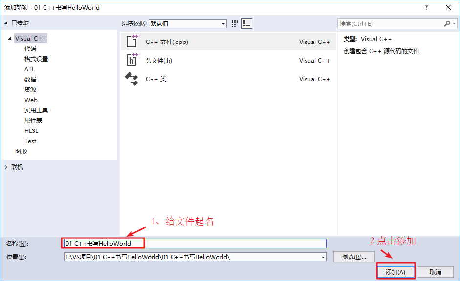
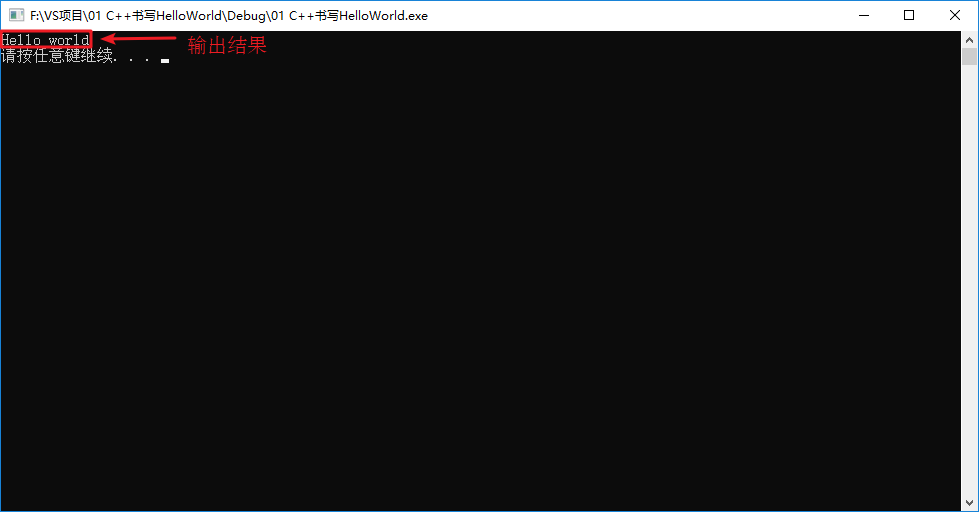
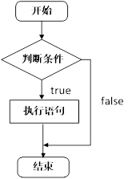

# C++基础入门

## 1 C++初识

### 1.1  第一个C++程序

编写一个C++程序总共分为4个步骤

* 创建项目
* 创建文件
* 编写代码
* 运行程序


#### 1.1.1 创建项目

​	Visual Studio是我们用来编写C++程序的主要工具，我们先将它打开


#### 1.1.2 创建文件

右键源文件，选择添加->新建项


给C++文件起个名称，然后点击添加即可。




#### 1.1.3 编写代码

```c++
#include<iostream>
using namespace std;

int main() {

	cout << "Hello world" << endl;

	//
  /*system("pause")意思就是让程序暂停一下，然后按任意键继续，初学的时候最多见于程序的末尾处，用于看运行结	果，避免程序一闪而过。*/

	return 0;
}
```


#### 1.1.4 运行程序




### 1.2 注释

**作用**：在代码中加一些说明和解释，方便自己或其他程序员程序员阅读代码

**两种格式**

1. **单行注释**：`// 描述信息` 
   - 通常放在一行代码的上方，或者一条语句的末尾，**对该行代码说明**
2. **多行注释**： `/* 描述信息 */`
   - 通常放在一段代码的上方，**对该段代码做整体说明**

> 提示：编译器在编译代码时，会忽略注释的内容


### 1.3 变量

**作用：给一段指定的内存空间起名，方便操作这段内存（方便我们管理内存空间）**

**语法**：`数据类型 变量名 = 初始值;`

**示例：**

```C++
#include<iostream>
using namespace std;

int main() {

	//变量的定义
	//语法：数据类型  变量名 = 初始值

	int a = 10;

	cout << "a = " << a << endl;

	return 0;
}
```

  

> 注意：C++在创建变量时，必须给变量一个初始值，否则会报错


 

### 1.4  常量

**作用：用于记录程序中*不可更改*的数据**

C++定义常量两种方式

1. **\#define** 宏常量： `#define 常量名 常量值`
   * **通常在文件上方定义**，表示一个常量


2. **const**修饰的变量 `const 数据类型 常量名 = 常量值`
   * **通常在变量定义前加关键字const**，*修饰*该变量为常量，不可修改

**示例：**

```C++
//1、宏常量
#define day 7

int main() {

	cout << "一周里总共有 " << day << " 天" << endl;
	//day = 8;  //报错，宏常量不可以修改

	//2、const修饰变量
	const int month = 12;
	cout << "一年里总共有 " << month << " 个月份" << endl;
	//month = 24; //报错，常量是不可以修改的

	return 0;
   
}
```


### 1.5 关键字

**作用：**关键字是C++中预先保留的单词（标识符）

* **在定义变量或者常量时候，不要用关键字**

C++关键字如下：

| asm        | do           | if               | return      | typedef  |
| ---------- | ------------ | ---------------- | ----------- | -------- |
| auto       | double       | inline           | short       | typeid   |
| bool       | dynamic_cast | int              | signed      | typename |
| break      | else         | long             | sizeof      | union    |
| case       | enum         | mutable          | static      | unsigned |
| catch      | explicit     | namespace        | static_cast | using    |
| char       | export       | new              | struct      | virtual  |
| class      | extern       | operator         | switch      | void     |
| const      | false        | private          | template    | volatile |
| const_cast | float        | protected        | this        | wchar_t  |
| continue   | for          | public           | throw       | while    |
| default    | friend       | register         | true        |          |
| delete     | goto         | reinterpret_cast | try         |          |

***提示：在给变量或者常量起名称时候，不要用C++得关键字，否则会产生歧义。***


### 1.6 标识符命名规则

**作用**：C++规定给标识符（变量、常量）命名时，有一套自己的规则

* 标识符不能是关键字
* 标识符只能由字母、数字、下划线组成
* 第一个字符必须为字母或下划线（不可以是数字）
* 标识符中字母区分大小写

> 建议：给标识符命名时，争取做到见名知意的效果，方便自己和他人的阅读


## 2 数据类型

数据类型存在的意义就是**给变量分配*合适*的内存空间**

**C++规定在创建一个变量或者常量时，必须要指定出相应的数据类型，否则无法给变量分配内存**


### 2.1 sizeof关键字

**作用：**利用sizeof关键字可以**统计数据类型所占内存大小**

**语法：** `sizeof( 数据类型 / 变量)`

**示例：**

```C++
int main() {

	cout << "short 类型所占内存空间为： " << sizeof(short) << endl;

	cout << "int 类型所占内存空间为： " << sizeof(int) << endl;

	cout << "long 类型所占内存空间为： " << sizeof(long) << endl;

	cout << "long long 类型所占内存空间为： " << sizeof(long long) << endl;

	return 0;
}
```


### 2.2 整型 (整数类型)

**作用**：整型变量表示的是**整数类型**的数据

C++中能够表示整型的类型有以下几种方式，**区别在于所占内存空间不同**：

| 类型               | 位            | 范围                                                    |
| :----------------- | :------------ | :------------------------------------------------------ |
| int                | 4 个字节      | -2147483648 到 2147483647                               |
| unsigned int       | 4 个字节      | 0 到 4294967295                                         |
| signed int         | 4 个字节      | -2147483648 到 2147483647                               |
| short int          | 2 个字节      | -32768 到 32767                                         |
| unsigned short int | 2 个字节      | 0 到 65,535                                             |
| signed short int   | 2 个字节      | -32768 到 32767                                         |
| long int           | 4 个字节 [^1] | -9,223,372,036,854,775,808 到 9,223,372,036,854,775,807 |
| signed long int    | 4 个字节      | -9,223,372,036,854,775,808 到 9,223,372,036,854,775,807 |
| unsigned long int  | 4 个字节      | 0 到 18,446,744,073,709,551,615                         |
| long long          | 8 个字节      | -2^63 到 2^63-1                                         |

[^1]: Windows为4字节，Linux为4字节（32位），或为8字节（64位）

- **超出range会发生什么？**

```c++
short num1 = 32768; //超出short最大值
cout << num1 << endl;//会print -32768 即又回到最小量 继续累加

short num1 = 65536; //超出short最大值
cout << num1 << endl;//会print 0
```


#### 2.2.1 如何选择整型：

- **当明确知晓数值不可能为负时，选用unsigned类型**
- **整型运算通常使用int，如果数值超过int数值范围，直接选用long long（long的数值范围与int相同）**


### 2.3 实型（浮点型）

**作用**：用于**表示小数**

浮点型变量分为两种：

1. **单精度float（默认double，通常在数字后面加f，强制转换为float）**
2. **双精度double （执行浮点数运算优先选用double）**

两者的区别在于表示的**有效数字范围不同**。

| **数据类型** | **占用空间** | **有效数字范围**                                             |
| ------------ | ------------ | ------------------------------------------------------------ |
| float        | 4 个字节     | 单精度型占4个字节（32位）内存空间 ( 6个有效数字[^2])         |
| double       | 8 个字节     | 双精度型占8 个字节（64位）内存空间  ( 15 个有效数字)         |
| long double  | 16 个字节    | 长双精度型 16 个字节（128位）内存空间(可提供18-19位有效数字) |

[^2]:有效数字指的是 “有几个数字”，例如，3.14有三个有效数字。***float和double都默认显示6个有效数字。***

**示例：**

```C++
int main() {

	float f1 = 3.14f;
	double d1 = 3.14;

	cout << f1 << endl;
	cout << d1<< endl;

	cout << "sizeof float  = " << sizeof(f1) << endl;
	cout << "sizeof double = " << sizeof(d1) << endl;
 
	//科学计数法
	float f2 = 3e2; // 3 * 10 ^ 2 
	cout << "f2 = " << f2 << endl;

	float f3 = 3e-2;  // 3 * 0.1 ^ 2
	cout << "f3 = " << f3 << endl;

	return 0;
}
```


***科学记数法：***

3e2 = 3 * 10^2

3e-2 = 3 * 10^-2


#### 2.3.1 C语言浮点型数据存储结构

- **Float类型：**

  float类型占四个字节，***每个字节占8位，总共32位***，其内存结构如下图：

  

  - **31位为符号位**：**0表示正数，1表示负数**

  - 31\~23位：**共8位表示指数位**，内存存储数据从 0\~2^8-1=255，由于指数可以是正也可以是负，所以指数位采用移位存储表示数据，8位有符号可表示数据从 -128~127，所以**指数位表示的实际指数应该是无符号位数减去 127**，例如 0000 0000 表示为 0-127=-127，1111 1111 表示为 255-127=128，1000 0001 表示为 129-127=2

    ***另外，标准中，还规定了，<u>当指数位8位全0或全1的时候</u>，浮点数为非正规形式（这个时候尾数不一样了），所以指数位真正范围为：-126~127。***

  - 22\~0位：**共23位表示尾数位**，内存存储数据从0~2^23-1=8388607

  


  由于计算机中只能存储二进制数据，所以十进制数据必须转成二进制数

  例如：-8.25=1000.01=-1.00001*2^3

  所以 -8.25

  符号位为：1

  指数位为：3+127=130=10000010

  尾数位为：00001，因为尾数位第一个数都为1所以1就省略了

  则内存表示为：

  


- **Double类型：(执行浮点数运算选用double，double精度更高，且与float运算代价相近)**

  double类内存中存储的原理与float类型是一样的，只不过double类型是用***64位***来表示的，其存储结构如下：

  

  同样用 -8.25=1000.01=-1.00001*2^3 来验证

  符号位为：1

  指数位：由于11位无符号表示数据范围为0-2047，有符号范围为-1023-1024，**所示实际值应该要用内存无**

  **符号数-1023**，例如000 0000 0000为0-1023=-1023 ，111 1111 1111 为 2047-1023=1024， 100 0000 0010 为 *<u>1026</u>*-1023=3，所示 -8.25 指数位为 100 0000 0010

  尾数位为：0000 1000 0000 0000 ...后面全是0，总共52位

  则-8.25 double类型为：1100 0000 0010 0000 1000 0000 .......后面全是0，总共64位

  十六进制为:C0 20 80 00 00 00 00 00


#### 2.3.2 浮点数精度

**精度是由尾数决定的**，为什么？由浮点数的值计算公式可知：当指数的最终值为负，虽然这个时候浮点数的值能
示更小 (是更小不是更精)，但这个时候仅仅能表示0\~1（或-1\~0）这个数段的小数，没有实际意义。所以精度主要是看尾数的值。

- **Float:**

  float的尾数：23位，二进制 0101……0101，尾数表示小数位，最小为0000……0001*（22个0，最后一个1）*， 

  即 2^−23 = 1.1920929E-7 ，这是float的最小单元 (大概是0.0000001192大小，你想表示比这更小的，比如

  0.00000001，不可能啊) ，这是一个7位小数位小数，最小就是这么小，比这个更小的，计算机就无能为力

  了，比这个更大的，每次通过加这么一个最小单元，直到相等或接近（两个相差一个最小单元的数，它们之间

  的数也是不能表示的，所以有的7位也是不能精确的，因为最小不是 0.0000001，而是比这个稍大）。所以

  float的精度为6\~7位，**能保证6位为绝对精确**，7位一般也是正确的，8位就不一定了（但不是说8位就绝对不对

  了），**注意这里的6\~7位是有效小数位**（大的数你先需要转换成小数的指数形式，例如：8317637.5，其有效

  小数位：8.3176375E6，七位），**而有效位（从第一个不为0的开始数）是 7~8 位，**是包括整数位的，像

  8317637.5，你不转换，则要从有效位的角度来看，有8位有效位。

- **Double**

  计算方式同float，double的尾数：52位，2^−52 = 2.220446049250313E-16，最小是16位，但最小不是

  1.0E-16，所以精度是15~16，能保证15，一般16位。


#### 2.3.3 小数和整数相互赋值

在C语言中，整数和小数之间可以相互赋值：

- **将一个整数赋值给小数类型，在小数点后面加 0 就可以，加几个都无所谓。**
- **将一个小数赋值给整数类型，就得把小数部分丢掉，只能取整数部分，这会改变数字本来的值。注意是直接丢掉小数部分，而不是按照四舍五入取近似值。**


请看下面的代码：

```c++
#include <stdio.h>
int main(){  
		float f = 251;    
  	int w = 19.427;    
  	int x = 92.78;    
  	int y = 0.52;    
  	int z = -87.27;       
  	printf("f = %f, w = %d, x = %d, y = %d, z = %d\n", f, w, x, y, z);    
  	return 0;
}
```

运行结果：
f = 251.000000, w = 19, x = 92, y = 0, z = -87

由于将小数赋值给整数类型时会“失真”，所以编译器一般会给出警告，让大家引起注意。

**此外，浮点变量可以容纳比整型变量更大的值范围。如果浮点值存储在整型变量中，并且整型变量的整数部分（即小数点前的部分）太大，则整型变量中将存储无效值。**


### 2.4 字符型

**作用：**字符型变量用于显示单个字符

**语法：**`char ch = 'a';`

> 注意1：在显示字符型变量时，用***单引号***将字符括起来，不要用双引号

> 注意2：单引号内只能有一个字符， **不可以是字符串**


- C和C++中字符型变量只占用**1个字节**
- 字符型变量并不是把字符本身放到内存中存储，**而是将对应的ASCII编码放入到存储单元**
- 字符型变量可强转为int类型：(int) char
- 可以直接用 ASCII 给字符型变量赋值：char ch = 97;

> 字符型变量常见错误：
>
> 1. 创建时用双引号
> 2. 单引号内有多个字符


示例：

```C++
int main() {
	
	char ch = 'a';
	cout << ch << endl;
	cout << sizeof(char) << endl;

	//ch = "abcde"; //错误，不可以用双引号
	//ch = 'abcde'; //错误，单引号内只能引用一个字符

	cout << (int)ch << endl;  //查看字符a对应的ASCII码
	ch = 97; //可以直接用ASCII给字符型变量赋值
	cout << ch << endl;
  
	return 0;
}
```

ASCII码表格：

| **ASCII**值 | **控制字符** | **ASCII**值 | **字符** | **ASCII**值 | **字符** | **ASCII**值 | **字符** |
| ----------- | ------------ | ----------- | -------- | ----------- | -------- | ----------- | -------- |
| 0           | NUT          | 32          | (space)  | 64          | @        | 96          | 、       |
| 1           | SOH          | 33          | !        | **65**      | A        | **97**      | a        |
| 2           | STX          | 34          | "        | 66          | B        | 98          | b        |
| 3           | ETX          | 35          | #        | 67          | C        | 99          | c        |
| 4           | EOT          | 36          | $        | 68          | D        | 100         | d        |
| 5           | ENQ          | 37          | %        | 69          | E        | 101         | e        |
| 6           | ACK          | 38          | &        | 70          | F        | 102         | f        |
| 7           | BEL          | 39          | ,        | 71          | G        | 103         | g        |
| 8           | BS           | 40          | (        | 72          | H        | 104         | h        |
| 9           | HT           | 41          | )        | 73          | I        | 105         | i        |
| 10          | LF           | 42          | *        | 74          | J        | 106         | j        |
| 11          | VT           | 43          | +        | 75          | K        | 107         | k        |
| 12          | FF           | 44          | ,        | 76          | L        | 108         | l        |
| 13          | CR           | 45          | -        | 77          | M        | 109         | m        |
| 14          | SO           | 46          | .        | 78          | N        | 110         | n        |
| 15          | SI           | 47          | /        | 79          | O        | 111         | o        |
| 16          | DLE          | 48          | 0        | 80          | P        | 112         | p        |
| 17          | DCI          | 49          | 1        | 81          | Q        | 113         | q        |
| 18          | DC2          | 50          | 2        | 82          | R        | 114         | r        |
| 19          | DC3          | 51          | 3        | 83          | S        | 115         | s        |
| 20          | DC4          | 52          | 4        | 84          | T        | 116         | t        |
| 21          | NAK          | 53          | 5        | 85          | U        | 117         | u        |
| 22          | SYN          | 54          | 6        | 86          | V        | 118         | v        |
| 23          | TB           | 55          | 7        | 87          | W        | 119         | w        |
| 24          | CAN          | 56          | 8        | 88          | X        | 120         | x        |
| 25          | EM           | 57          | 9        | 89          | Y        | 121         | y        |
| 26          | SUB          | 58          | :        | 90          | Z        | 122         | z        |
| 27          | ESC          | 59          | ;        | 91          | [        | 123         | {        |
| 28          | FS           | 60          | <        | 92          | /        | 124         | \|       |
| 29          | GS           | 61          | =        | 93          | ]        | 125         | }        |
| 30          | RS           | 62          | >        | 94          | ^        | 126         | `        |
| 31          | US           | 63          | ?        | 95          | _        | 127         | DEL      |

ASCII 码大致由以下**两部分组**成：

* ASCII 非打印控制字符： ASCII 表上的数字 **0-31** 分配给了控制字符，用于控制像打印机等一些外围设备。
* ASCII 打印字符：数字 **32-126** 分配给了能在键盘上找到的字符，当查看或打印文档时就会出现。


### 2.5 转义字符

**作用：**用于表示一些**不能显示出来的ASCII字符**

现阶段我们常用的转义字符有：` \n  \\  \t`

| **转义字符** | **含义**                                                     | **ASCII**码值（十进制） |
| ------------ | ------------------------------------------------------------ | ----------------------- |
| \a           | 警报                                                         | 007                     |
| \b           | 退格(BS) ，将当前位置移到前一列                              | 008                     |
| \f           | 换页(FF)，将当前位置移到下页开头                             | 012                     |
| **\n**       | **换行(LF) ，将当前位置移到下一行开头**                      | **010**                 |
| \r           | 回车(CR) ，将当前位置移到本行开头                            | 013                     |
| **\t**       | **水平制表(HT) 对齐文本时用，长度8以内对齐，*大于等于8以后直接跳到下一个制表符位*** | **009**                 |
| \v           | 垂直制表(VT)                                                 | 011                     |
| **\\\\**     | **代表一个反斜线字符"\"**                                    | **092**                 |
| \'           | 代表一个单引号（撇号）字符                                   | 039                     |
| \"           | 代表一个双引号字符                                           | 034                     |
| \?           | 代表一个问号                                                 | 063                     |
| \0           | 数字0                                                        | 000                     |
| \ddd         | 8进制转义字符，d范围0~7                                      | 3位8进制                |
| \xhh         | 16进制转义字符，h范围0~9，a~f，A~F                           | 3位16进制               |

示例：

```C++
int main() {
	
	cout << "\\" << endl;
	cout << "\tHello" << endl;
	cout << "\n" << endl;

	return 0;
}
```


#### 2.5.1 endl 与 "\n", 'n' 的区别

- **endl：**在标准库头文件`<ostream>`中，有endl的操作符重载函数，如下：

  ```cpp
  template<typename _CharT, typename _Traits>
      inline basic_ostream<_CharT, _Traits>&
      endl(basic_ostream<_CharT, _Traits>& __os)
      { return flush(__os.put(__os.widen('\n'))); }
  ```

  它是一个内联的函数模板，是一个全局的函数模板，endl正是它的函数名，***<u>它的作用是往缓冲区写入一个换行符并且立即从缓冲区刷新到外部设备中。</u>***

- **“\n”：** 表示搜索一个字符串，只有一个数据是回车符

- **‘\n’：** 表示一个字符，两者在输出上是一样的！

1. 在c++中，终端输出换行时，用`cout<<......<<endl` 与 “\n”都可以，这是初级的认识。但二者有小小的区别，用endl时会刷新缓冲区，使得栈中的东西刷新一次，但用 “\n” 不会刷新，它只会换行，盏内数据没有变化。但一般情况，二者的这点区别是很小的，在大的程序中可能会用到。建议用 endl 来换行.
2. **endl除了写 ’\n’ 进外，还调用 flush 函数，刷新缓冲区，把缓冲区里的数据写入文件或屏幕.考虑效率就用 ’\n’.**
3. cout << endl;除了往输出流中插入一个 ’\n’ 还有刷新输出流的作用. 
   cout << endl; 等价于: cout << ‘\n’ << flush; 
   在没有必要刷新输出流的时候应尽量使用 cout << ‘\n’, 过多的 endl 是影响程序执行效率低下的因素之一.


### 2.6 字符串型

**作用**：用于表示一串字符

**两种风格**

1. **C风格字符串**： `char 变量名[] = "字符串值"`

   示例：

   ```C++
   int main() {
   
   	char str1[] = "hello world";
   	cout << str1 << endl;
   
   	return 0;
   }
   ```

​		**注意：C风格的字符串要用*双引号*括起来**


2. **C++风格字符串**：  `string  变量名 = "字符串值"`

   示例：

   ```C++
   int main() {
   
   	string str = "hello world";
   	cout << str << endl;
   
   	return 0;
   }
   ```

   **注意：C++风格字符串，需要加入头文件 *#include \<string>***


### 2.7 布尔类型 bool

**作用：**布尔数据类型代表真或假的值 

bool 类型只有两个值：

* true  --- **真（本质是1）**
* false --- **假（本质是0）**

**bool类型占*<u>1个字节</u>*大小**

**把其他变量转换为 bool 类型时，非0值转换为 true，0值转换为 false**

示例：

```C++
int main() {

	bool flag = true;
	cout << flag << endl; // 1

	flag = false;
	cout << flag << endl; // 0

	cout << "size of bool = " << sizeof(bool) << endl; //1

	return 0;
}
```


### 2.8 数据的输入

**作用：用于从键盘获取数据**

**关键字：**cin

**语法：** `cin >> 变量 `

示例：

```C++
int main(){

	//整型输入
	int a = 0;
	cout << "请输入整型变量：" << endl;
	cin >> a;
	cout << a << endl;

	//浮点型输入
	double d = 0;
	cout << "请输入浮点型变量：" << endl;
	cin >> d;
	cout << d << endl;

	//字符型输入
	char ch = 0;
	cout << "请输入字符型变量：" << endl;
	cin >> ch;
	cout << ch << endl;

	//字符串型输入
	string str;
	cout << "请输入字符串型变量：" << endl;
	cin >> str;
	cout << str << endl;

	//布尔类型输入
	bool flag = true;
	cout << "请输入布尔型变量：" << endl;
	cin >> flag;
	cout << flag << endl;
	
	return EXIT_SUCCESS;
}
```


## 3 运算符

**作用：**用于执行代码的运算

本章我们主要讲解以下几类运算符：

| **运算符类型** | **作用**                               |
| -------------- | -------------------------------------- |
| 算术运算符     | 用于处理四则运算                       |
| 赋值运算符     | 用于将表达式的值赋给变量               |
| 比较运算符     | 用于表达式的比较，并返回一个真值或假值 |
| 逻辑运算符     | 用于根据表达式的值返回真值或假值       |
| 运算符         | 位运算符作用于位，并逐位执行操作       |


### 3.1 算术运算符

**作用**：用于处理四则运算 

算术运算符包括以下符号：

| **运算符** | **术语**    | **示例**    | **结果**  |
| ---------- | ----------- | ----------- | --------- |
| +          | 正号        | +3          | 3         |
| -          | 负号        | -3          | -3        |
| +          | 加          | 10 + 5      | 15        |
| -          | 减          | 10 - 5      | 5         |
| *          | 乘          | 10 * 5      | 50        |
| /          | 除          | 10 / 5      | 2         |
| %          | 取模 (取余) | 10 % 3      | 1         |
| ++n        | 前置递增    | a=2; b=++a; | a=3; b=3; |
| n++        | 后置递增    | a=2; b=a++; | a=3; b=2; |
| --n        | 前置递减    | a=2; b=--a; | a=1; b=1; |
| n--        | 后置递减    | a=2; b=a--; | a=1; b=2; |

> 1. 两个整数相除，结果依然是整数，将小数部分***去除***
> 2. 在除法和取余运算中，除数不能为0
> 3. 两个小数不可以做取余运算


**示例1：**

```C++
//加减乘除
int main() {

	int a1 = 10;
	int b1 = 3;

	cout << a1 + b1 << endl;
	cout << a1 - b1 << endl;
	cout << a1 * b1 << endl;
	cout << a1 / b1 << endl;  //两个整数相除结果依然是整数

	int a2 = 10;
	int b2 = 20;
	cout << a2 / b2 << endl; 

	int a3 = 10;
	int b3 = 0;
	//cout << a3 / b3 << endl; //报错，除数不可以为0


	//两个小数可以相除
	double d1 = 0.5;
	double d2 = 0.25;
	cout << d1 / d2 << endl;
	
	return 0;
}
```


**示例2：**

```C++
//取模
int main() {

	int a1 = 10;
	int b1 = 3;

	cout << 10 % 3 << endl;

	int a2 = 10;
	int b2 = 20;

	cout << a2 % b2 << endl;

	int a3 = 10;
	int b3 = 0;

	//cout << a3 % b3 << endl; //取模运算时，除数也不能为0

	//两个小数不可以取模
	double d1 = 3.14;
	double d2 = 1.1;

	//cout << d1 % d2 << endl;
	
	return 0;
}

```


**示例3：**

```C++
//递增
int main() {

	//后置递增
	int a = 10;
	a++; //等价于a = a + 1
	cout << a << endl; // 11

	//前置递增
	int b = 10;
	++b;
	cout << b << endl; // 11

	//区别
	//前置递增先对变量进行++，再计算表达式
	int a2 = 10;
	int b2 = ++a2 * 10;
	cout << b2 << endl;

	//后置递增先计算表达式，后对变量进行++
	int a3 = 10;
	int b3 = a3++ * 10;
	cout << b3 << endl;

	return 0;
}

```


#### 3.1.1 前置递增 (++n) 和后置递增 (n++) 的区别

- 前置递增先对变量进行++，再计算表达式

- 后置递增先计算表达式，后对变量进行++

**++n is more efficient than n++, because the latter msut temporarily store the original value of n**


### 3.2 赋值运算符

**作用：**用于将表达式的值赋给变量

赋值运算符包括以下几个符号：

| **运算符** | **术语** | **示例**   | **结果**  |
| ---------- | -------- | ---------- | --------- |
| =          | 赋值     | a=2; b=3;  | a=2; b=3; |
| +=         | 加等于   | a=0; a+=2; | a=2;      |
| -=         | 减等于   | a=5; a-=3; | a=2;      |
| *=         | 乘等于   | a=2; a*=2; | a=4;      |
| /=         | 除等于   | a=4; a/=2; | a=2;      |
| %=         | 模等于   | a=3; a%2;  | a=1;      |


**示例：**

```C++
int main() {

	//赋值运算符

	// =
	int a = 10;
	a = 100;
	cout << "a = " << a << endl;

	// +=
	a = 10;
	a += 2; // a = a + 2;
	cout << "a = " << a << endl;

	// -=
	a = 10;
	a -= 2; // a = a - 2
	cout << "a = " << a << endl;

	// *=
	a = 10;
	a *= 2; // a = a * 2
	cout << "a = " << a << endl;

	// /=
	a = 10;
	a /= 2;  // a = a / 2;
	cout << "a = " << a << endl;

	// %=
	a = 10;
	a %= 2;  // a = a % 2;
	cout << "a = " << a << endl;
	
	return 0;
}
```


### 3.3 比较运算符

**作用：**用于表达式的比较，**并返回一个真值或假值**

比较运算符有以下符号：

| **运算符** | **术语** | **示例** | **结果** |
| ---------- | -------- | -------- | -------- |
| ==         | 相等于   | 4 == 3   | 0        |
| !=         | 不等于   | 4 != 3   | 1        |
| <          | 小于     | 4 < 3    | 0        |
| \>         | 大于     | 4 > 3    | 1        |
| <=         | 小于等于 | 4 <= 3   | 0        |
| \>=        | 大于等于 | 4 >= 1   | 1        |

示例：

```C++
int main() {

	int a = 10;
	int b = 20;

	cout << (a == b) << endl; // 0 

	cout << (a != b) << endl; // 1

	cout << (a > b) << endl; // 0

	cout << (a < b) << endl; // 1

	cout << (a >= b) << endl; // 0

	cout << (a <= b) << endl; // 1

	return 0;
}
```

> 注意：C和C++ 语言的比较运算中， **“真”用数字“1”来表示， “假”用数字“0”来表示。** 


### 3.4 逻辑运算符

**作用：**用于根据表达式的值返回真值或假值**（在c++中非0都为假）**

逻辑运算符有以下符号：

| **运算符** | **术语** | **示例** | **结果**                                                 |
| ---------- | -------- | -------- | -------------------------------------------------------- |
| !          | 非       | !a       | 如果a为假，则!a为真；  如果a为真，则!a为假。             |
| &&         | 与       | a && b   | 如果a和b都为真，则结果为真，否则为假。                   |
| \|\|       | 或       | a \|\| b | 如果a和b有一个为真，则结果为真，二者都为假时，结果为假。 |

**示例1：**逻辑非

```C++
//逻辑运算符  --- 非
int main() {

	int a = 10;

	cout << !a << endl; // 0

	cout << !!a << endl; // 1

	return 0;
}
```


**示例2：**逻辑与

```C++
//逻辑运算符  --- 与
int main() {

	int a = 10;
	int b = 10;

	cout << (a && b) << endl;// 1

	a = 10;
	b = 0;

	cout << (a && b) << endl;// 0 

	a = 0;
	b = 0;

	cout << (a && b) << endl;// 0

	return 0;
}

```


**示例3：**逻辑或

```c++
//逻辑运算符  --- 或
int main() {

	int a = 10;
	int b = 10;

	cout << (a || b) << endl;// 1

	a = 10;
	b = 0;

	cout << (a || b) << endl;// 1 

	a = 0;
	b = 0;

	cout << (a || b) << endl;// 0

	

	return 0;
}
```


### 3.5 位运算符

从现代计算机中所有的数据二进制的形式存储在设备中。即 0、1 两种状态，计算机对二进制数据进行的运算(+、-、*、/)都是叫位运算，**即 将符号位共同参与运算的运算**。


#### 3.5.1 位运算概述

举一个简单的例子来看下 CPU 是如何进行计算的，比如这行代码：

```
int a = 35;
int b = 47;
int c = a + b;
```

计算两个数的和，因为在计算机中都是以二进制来进行运算，**所以上面我们所给的 int 变量会在机器内部先转换为二进制在进行相加：**

```
35:  0 0 1 0 0 0 1 1
47:  0 0 1 0 1 1 1 1
————————————————————
82:  0 1 0 1 0 0 1 0
```

<u>**所以，相比在代码中直接使用(+、-、*、/)运算符，合理的运用位运算更能显著提高代码在机器上的执行效率。**</u>


#### 3.5.2 位运算概览

| 符号 | 描述 | 运算规则                                                     |
| :--- | :--- | :----------------------------------------------------------- |
| &    | 与   | 两个位都为1时，结果才为1                                     |
| \|   | 或   | 两个位都为0时，结果才为0                                     |
| ^    | 异或 | 两个位相同为0，相异为1                                       |
| ~    | 取反 | 0变1，1变0                                                   |
| <<   | 左移 | 各二进位全部左移若干位，高位丢弃，低位补0                    |
| >>   | 右移 | 各二进位全部右移若干位，对无符号数，高位补0，有符号数，各编译器处理方法不一样，有的补符号位（算术右移），有的补0（逻辑右移） |

**注意⚠️：C++的负数是按照补码储存的！**


#### 3.5.3 与运算符 &

**定义**：参加运算的两个数据，按二进制位进行"与"运算。

运算规则：

```
0&0=0  0&1=0  1&0=0  1&1=1
```

总结：两位同时为1，结果才为1，否则结果为0。

例如：3&5 即 0000 0011& 0000 0101 = 0000 0001，因此 3&5 的值得1。

***注意：负数按补码形式参加按位与运算。***

**与运算的用途：**

**1）清零**

如果想将一个单元清零，即使其全部二进制位为0，只要与一个各位都为零的数值相与，结果为零。

**2）取一个数的指定位**

比如取数 X=1010 1110 的低4位，只需要另找一个数Y，令Y的低4位为1，其余位为0，即Y=0000 1111，然后将X与Y进行按位与运算（X&Y=0000 1110）即可得到X的指定位。

**3）判断奇偶**

**只要根据最未位是0还是1来决定，为0就是偶数，为1就是奇数**。<u>因此可以用 if ((a & 1) == 0) 代替if (a % 2 == 0)来判断a是不是偶数。</u>


#### 3.5.4 或运算符 |

定义：参加运算的两个对象，按二进制位进行"或"运算。

运算规则：

```
0|0=0  0|1=1  1|0=1  1|1=1
```

总结：参加运算的两个对象只要有一个为1，其值为1。

例如：3|5即 0000 0011| 0000 0101 = 0000 0111，因此，3|5的值得7。　

***注意：负数按补码形式参加按位或运算。***

**或运算的用途：**

**1）常用来对一个数据的某些位设置为1**

比如将数 X=1010 1110 的低4位设置为1，只需要另找一个数Y，令Y的低4位为1，其余位为0，即Y=0000 1111，然后将X与Y进行按位或运算（X|Y=1010 1111）即可得到。


#### 3.5.5 异或运算符 ^

定义：参加运算的两个数据，按二进制位进行"异或"运算。

运算规则：

```
0^0=0  0^1=1  1^0=1  1^1=0
```

总结：参加运算的两个对象，如果两个相应位相同为0，相异为1。

异或的几条性质:

- 1、交换律
- 2、结合律 (a\^b)^c == a\^(b^c)
- 3、对于任何数x，都有 x\^x = 0，x^0 = x
- 4、自反性: a\^b\^b = a^0 = a;

**异或运算的用途：**

**1）翻转指定位**

比如将数 X=1010 1110 的低4位进行翻转，只需要另找一个数Y，令Y的低4位为1，其余位为0，即Y=0000 1111，然后将X与Y进行异或运算（X^Y=1010 0001）即可得到。

**2）与0相异或值不变**

例如：1010 1110 ^ 0000 0000 = 1010 1110

**3）交换两个数**

**实例**

```c++
void Swap(int &a, int &b){
  if (a != b){
    a ^= b;
    b ^= a;
    a ^= b;
  }
}
```


#### 3.5.6 取反运算符 ~

定义：参加运算的一个数据，按二进制进行"取反"运算。

运算规则：　

```
~1=0
~0=1
```

总结：对一个二进制数按位取反，即将0变1，1变0。

**取反运算的用途：**

**1）使一个数的最低位为零**

使a的最低位为0，可以表示为：a & \~1。~1的值为 1111 1111 1111 1110，再按"与"运算，最低位一定为0。*因为 "~" 运算符的优先级比算术运算符、关系运算符、逻辑运算符和其他运算符都高。*


#### 3.5.7 左移运算符 <<

定义：将一个运算对象的各二进制位全部左移若干位**（左边的二进制位丢弃，右边补0）**。

设 a=1010 1110，a = a<< 2 将a的二进制位左移2位、右补0，即得a=1011 1000。

<u>**若左移时舍弃的高位不包含1，则每左移一位，相当于该数乘以2。**</u>


#### 3.5.8 右移运算符 >>

定义：将一个数的各二进制位全部右移若干位，**正数左补0，负数左补1，右边丢弃。**

例如：a=a>>2 将a的二进制位右移2位，左补0 或者 左补1 得看被移数是正还是负。

操作数每右移一位，相当于该数除以2。


#### 3.5.9 复合赋值运算符

位运算符与赋值运算符结合，组成新的复合赋值运算符，它们是：

```
&=        例：a&=b    相当于     a=a&b

|=        例：a|=b    相当于     a=a|b

>>=      例：a>>=b   相当于     a=a>>b

<<=      例：a<<=b     相当于      a=a<<b

^=        例：a^=b    相当于   a=a^b
```

运算规则：和前面讲的复合赋值运算符的运算规则相似。

**不同长度的数据进行位运算：如果两个不同长度的数据进行位运算时，系统会将二者按右端对齐，然后进行位运算。**

以"与运算"为例说明如下：我们知道在C语言中long型占4个字节，int型占2个字节，如果一个long型数据与一个int型数据进行"与运算"，右端对齐后，左边不足的位依下面三种情况补足，

- 1）如果整型数据为正数，左边补16个0。
- 2）如果整型数据为负数，左边补16个1。
- 3）如果整形数据为无符号数，左边也补16个0。
- 如：long a=123；int b=1；计算a& b。

- 如：long a=123；int b=-1；计算a& b。

- 如：long a=123；unsigned intb=1；计算a & b。

- 

- 

### 3.6 杂项运算符

下表列出了 C++ 支持的其他一些重要的运算符。

| 运算符               | 描述                                                         |
| :------------------- | :----------------------------------------------------------- |
| sizeof               | [sizeof 运算符](https://www.runoob.com/cplusplus/cpp-sizeof-operator.html)返回变量的大小。例如，sizeof(a) 将返回 4，其中 a 是整数。 |
| Condition ? X : Y    | [条件运算符](https://www.runoob.com/cplusplus/cpp-conditional-operator.html)。如果 Condition 为真 ? 则值为 X : 否则值为 Y。可替换if (condition) { var = X; } else { var = Y; } |
| ,                    | [逗号运算符](https://www.runoob.com/cplusplus/cpp-comma-operator.html)会顺序执行一系列运算。整个逗号表达式的值是以逗号分隔的列表中的最后一个表达式的值。 |
| .（点）和 ->（箭头） | [成员运算符](https://www.runoob.com/cplusplus/cpp-member-operators.html)用于引用类、结构和共用体的成员。 |
| Cast                 | [强制转换运算符](https://www.runoob.com/cplusplus/cpp-casting-operators.html)把一种数据类型转换为另一种数据类型。例如，int(2.2000) 将返回 2。 |
| &                    | [指针运算符 &](https://www.runoob.com/cplusplus/cpp-pointer-operators.html) 返回变量的地址。例如 &a; 将给出变量的实际地址。 |
| *                    | [指针运算符 *](https://www.runoob.com/cplusplus/cpp-pointer-operators.html) 指向一个变量。例如，*var; 将指向变量 var。 |


#### 3.6.1 逗号运算符

使用逗号运算符是为了把几个表达式放在一起。

整个逗号表达式的值为系列中最后一个表达式的值。

从本质上讲，逗号的作用是将一系列运算按顺序执行。

```
表达式1, 表达式2
```

求解过程是：先求解表达式 1，再求解表达式 2。整个逗号表达式的值是表达式 2 的值。

最右边的那个表达式的值将作为整个逗号表达式的值，其他表达式的值会被丢弃。

例如：

```
var = (count=19, incr=10, count+1);
```

在这里，首先把 count 赋值为 19，把 incr 赋值为 10，然后把 count 加 1，最后，把最右边表达式 count+1 的计算结果 20 赋给 var。**上面表达式中的括号是必需的，因为逗号运算符的优先级低于赋值操作符。**

尝试运行下面的实例，理解逗号运算符的用法。

**实例**

```c++
#include <iostream> 
using namespace std;  
int main() {   
  int i, j;      
  j = 10;   
  i = (j++, j+100, 999+j);    
  cout << i;      
  return 0; 
}
```

当上面的代码被编译和执行时，它会产生下列结果：

```
1010
```

上面的程序中，j 最初的值为 10，然后自增到 11，这时 j 的值就为 11，然后再计算第二个表达式 j+100，最后 j（j 为 11） 再加上 999，最后 i 为 最后一个表达式的值 999+j，及 999+ 11=1010。


### 3.7 C++ 中的运算符优先级

运算符的优先级确定表达式中项的组合。这会影响到一个表达式如何计算。某些运算符比其他运算符有更高的优先级，例如，乘除运算符具有比加减运算符更高的优先级。

例如 x = 7 + 3 * 2，在这里，x 被赋值为 13，而不是 20，因为运算符 * 具有比 + 更高的优先级，所以首先计算乘法 3*2，然后再加上 7。

下表将按运算符优先级从高到低列出各个运算符，具有较高优先级的运算符出现在表格的上面，具有较低优先级的运算符出现在表格的下面。在表达式中，较高优先级的运算符会优先被计算。

| 类别           | 运算符                            | 结合性       |
| :------------- | :-------------------------------- | :----------- |
| 后缀           | () [] -> . ++ - -                 | 从左到右     |
| 一元           | + - ! ~ ++ - - (type)* & sizeof   | 从右到左     |
| 乘除           | * / %                             | 从左到右     |
| 加减           | + -                               | 从左到右     |
| 移位           | << >>                             | 从左到右     |
| 关系           | < <= > >=                         | 从左到右     |
| 相等           | == !=                             | 从左到右     |
| **位与 AND**   | **&**                             | **从左到右** |
| **位异或 XOR** | **^**                             | **从左到右** |
| **位或 OR**    | **\|**                            | **从左到右** |
| **逻辑与 AND** | **&&**                            | **从左到右** |
| **逻辑或 OR**  | **\|\|**                          | 从左到右     |
| 条件           | ?:                                | 从右到左     |
| 赋值           | = += -= *= /= %=>>= <<= &= ^= \|= | 从右到左     |
| 逗号           | ,                                 | 从左到右     |

**实例**

```c++
#include <iostream> 
using namespace std;  
int main() {   
  int a = 20;   
  int b = 10;   
  int c = 15;   
  int d = 5;   
  int e;    
   e = (a + b) * c / d;      // ( 30 * 15 ) / 5
   cout << "(a + b) * c / d 的值是 " << e << endl ;
 
   e = ((a + b) * c) / d;    // (30 * 15 ) / 5
   cout << "((a + b) * c) / d 的值是 " << e << endl ;
 
   e = (a + b) * (c / d);   // (30) * (15/5)
   cout << "(a + b) * (c / d) 的值是 " << e << endl ;
 
   e = a + (b * c) / d;     //  20 + (150/5)
   cout << "a + (b * c) / d 的值是 " << e << endl ;
  
   return 0;
}
```

当上面的代码被编译和执行时，它会产生以下结果：

```
(a + b) * c / d 的值是 90
((a + b) * c) / d 的值是 90
(a + b) * (c / d) 的值是 90
a + (b * c) / d 的值是 50
```


## 4 程序流程结构

C/C++支持最基本的三种程序运行结构：**顺序结构、选择结构、循环结构**

* 顺序结构：程序按顺序执行，不发生跳转
* 选择结构：依据条件是否满足，有选择的执行相应功能
* 循环结构：依据条件是否满足，循环多次执行某段代码


### 4.1 选择结构

#### 4.1.1 if语句

**作用：**执行满足条件的语句

if语句的三种形式

* 单行格式if语句

* 多行格式if语句

* 多条件的if语句

  

1. 单行格式if语句：`if(条件){ 条件满足执行的语句 }`

   

   示例：

   ```C++
   int main() {
   
   	//选择结构-单行if语句
   	//输入一个分数，如果分数大于600分，视为考上一本大学，并在屏幕上打印
   
   	int score = 0;
   	cout << "请输入一个分数：" << endl;
   	cin >> score;
   
   	cout << "您输入的分数为： " << score << endl;
   
   	//if语句
   	//注意事项，在if判断语句后面，不要加分号
   	if (score > 600)
   	{
   		cout << "我考上了一本大学！！！" << endl;
   	}
   
   	
   
   	return 0;
   }
   ```

   


> 注意：if条件表达式后不要加分号


2. 多行格式if语句：`if(条件){ 条件满足执行的语句 }else{ 条件不满足执行的语句 };`


示例：

```C++
int main() {

	int score = 0;

	cout << "请输入考试分数：" << endl;

	cin >> score;

	if (score > 600)
	{
		cout << "我考上了一本大学" << endl;
	}
	else
	{
		cout << "我未考上一本大学" << endl;
	}

	

	return 0;
}
```


3. 多条件的if语句：`if(条件1){ 条件1满足执行的语句 }else if(条件2){条件2满足执行的语句}... else{ 都不满足执行的语句}`


示例：

```C++
	int main() {

	int score = 0;

	cout << "请输入考试分数：" << endl;

	cin >> score;

	if (score > 600)
	{
		cout << "我考上了一本大学" << endl;
	}
	else if (score > 500)
	{
		cout << "我考上了二本大学" << endl;
	}
	else if (score > 400)
	{
		cout << "我考上了三本大学" << endl;
	}
	else
	{
		cout << "我未考上本科" << endl;
	}

	

	return 0;
}
```


**嵌套if语句**：在if语句中，可以嵌套使用if语句，达到更精确的条件判断


案例需求：

* 提示用户输入一个高考考试分数，根据分数做如下判断
* 分数如果大于600分视为考上一本，大于500分考上二本，大于400考上三本，其余视为未考上本科；
* 在一本分数中，如果大于700分，考入北大，大于650分，考入清华，大于600考入人大。


**示例：**

```c++
int main() {

	int score = 0;

	cout << "请输入考试分数：" << endl;

	cin >> score;

	if (score > 600)
	{
		cout << "我考上了一本大学" << endl;
		if (score > 700)
		{
			cout << "我考上了北大" << endl;
		}
		else if (score > 650)
		{
			cout << "我考上了清华" << endl;
		}
		else
		{
			cout << "我考上了人大" << endl;
		}
		
	}
	else if (score > 500)
	{
		cout << "我考上了二本大学" << endl;
	}
	else if (score > 400)
	{
		cout << "我考上了三本大学" << endl;
	}
	else
	{
		cout << "我未考上本科" << endl;
	}

	

	return 0;
}
```


**练习案例：** 三只小猪称体重

有三只小猪ABC，请分别输入三只小猪的体重，并且判断哪只小猪最重？


#### 4.1.2 三目运算符

**作用：** 通过三目运算符实现简单的判断

**语法：**`表达式1 ? 表达式2 ：表达式3`

**解释：**

如果表达式1的值为真，执行表达式2，并返回表达式2的结果；

如果表达式1的值为假，执行表达式3，并返回表达式3的结果。

**示例：**

```C++
int main() {

	int a = 10;
	int b = 20;
	int c = 0;

	c = a > b ? a : b;
	cout << "c = " << c << endl;

	//C++中三目运算符返回的是变量,可以继续赋值

	(a > b ? a : b) = 100;

	cout << "a = " << a << endl;
	cout << "b = " << b << endl;
	cout << "c = " << c << endl;

	

	return 0;
}
```

> 总结：和if语句比较，三目运算符优点是短小整洁，缺点是如果用嵌套，结构不清晰


#### 4.1.3 switch语句

**作用：**执行多条件分支语句

**语法：**

```C++
switch(表达式)

{

	case 结果1：执行语句;break;

	case 结果2：执行语句;break;

	...

	default:执行语句;break;

}

```


**示例：**

```C++
int main() {

	//请给电影评分 
	//10 ~ 9   经典   
	// 8 ~ 7   非常好
	// 6 ~ 5   一般
	// 5分以下 烂片

	int score = 0;
	cout << "请给电影打分" << endl;
	cin >> score;

	switch (score)
	{
	case 10:
	case 9:
		cout << "经典" << endl;
		break;
	case 8:
		cout << "非常好" << endl;
		break;
	case 7:
	case 6:
		cout << "一般" << endl;
		break;
	default:
		cout << "烂片" << endl;
		break;
	}

	

	return 0;
}
```


> 注意1：switch语句中表达式类型只能是整型或者字符型

> 注意2：case里如果没有break，那么程序会一直向下执行

> 总结：与if语句比，对于多条件判断时，switch的结构清晰，执行效率高，缺点是switch不可以判断区间


### 4.2 循环结构

#### 4.2.1 while循环语句

**作用：**满足循环条件，执行循环语句

**语法：**` while(循环条件){ 循环语句 }`

**解释：**==只要循环条件的结果为真，就执行循环语句==


**示例：**

```C++
int main() {

	int num = 0;
	while (num < 10)
	{
		cout << "num = " << num << endl;
		num++;
	}
	
	

	return 0;
}
```


> 注意：在执行循环语句时候，程序必须提供跳出循环的出口，否则出现死循环


**while循环练习案例：**==猜数字==

**案例描述：**系统随机生成一个1到100之间的数字，玩家进行猜测，如果猜错，提示玩家数字过大或过小，如果猜对恭喜玩家胜利，并且退出游戏。


#### 4.2.2 do...while循环语句

**作用：** 满足循环条件，执行循环语句

**语法：** `do{ 循环语句 } while(循环条件);`

**注意：**与while的区别在于==do...while会先执行一次循环语句==，再判断循环条件


**示例：**

```C++
int main() {

	int num = 0;

	do
	{
		cout << num << endl;
		num++;

	} while (num < 10);
	
	
	

	return 0;
}
```


> 总结：与while循环区别在于，do...while先执行一次循环语句，再判断循环条件


**练习案例：水仙花数**

**案例描述：**水仙花数是指一个 3 位数，它的每个位上的数字的 3次幂之和等于它本身

例如：1^3 + 5^3+ 3^3 = 153

请利用do...while语句，求出所有3位数中的水仙花数


#### 4.2.3 for循环语句

**作用：** 满足循环条件，执行循环语句

**语法：**` for(起始表达式;条件表达式;末尾循环体) { 循环语句; }`


**示例：**

```C++
int main() {

	for (int i = 0; i < 10; i++)
	{
		cout << i << endl;
	}
	
	

	return 0;
}
```


**详解：**


> 注意：for循环中的表达式，要用分号进行分隔

> 总结：while , do...while, for都是开发中常用的循环语句，for循环结构比较清晰，比较常用


**练习案例：敲桌子**

案例描述：从1开始数到数字100， 如果数字个位含有7，或者数字十位含有7，或者该数字是7的倍数，我们打印敲桌子，其余数字直接打印输出。


#### 4.2.4 嵌套循环

**作用：** 在循环体中再嵌套一层循环，解决一些实际问题

例如我们想在屏幕中打印如下图片，就需要利用嵌套循环


**示例：**

```C++
int main() {

	//外层循环执行1次，内层循环执行1轮
	for (int i = 0; i < 10; i++)
	{
		for (int j = 0; j < 10; j++)
		{
			cout << "*" << " ";
		}
		cout << endl;
	}

	

	return 0;
}
```


**练习案例：**乘法口诀表

案例描述：利用嵌套循环，实现九九乘法表


### 4.3 跳转语句

#### 4.3.1 break语句

**作用:** 用于跳出==选择结构==或者==循环结构==

break使用的时机：

* 出现在switch条件语句中，作用是终止case并跳出switch
* 出现在循环语句中，作用是跳出当前的循环语句
* 出现在嵌套循环中，跳出最近的内层循环语句


**示例1：**

```C++
int main() {
	//1、在switch 语句中使用break
	cout << "请选择您挑战副本的难度：" << endl;
	cout << "1、普通" << endl;
	cout << "2、中等" << endl;
	cout << "3、困难" << endl;

	int num = 0;

	cin >> num;

	switch (num)
	{
	case 1:
		cout << "您选择的是普通难度" << endl;
		break;
	case 2:
		cout << "您选择的是中等难度" << endl;
		break;
	case 3:
		cout << "您选择的是困难难度" << endl;
		break;
	}

	

	return 0;
}
```


**示例2：**

```C++
int main() {
	//2、在循环语句中用break
	for (int i = 0; i < 10; i++)
	{
		if (i == 5)
		{
			break; //跳出循环语句
		}
		cout << i << endl;
	}

	

	return 0;
}
```


**示例3：**

```C++
int main() {
	//在嵌套循环语句中使用break，退出内层循环
	for (int i = 0; i < 10; i++)
	{
		for (int j = 0; j < 10; j++)
		{
			if (j == 5)
			{
				break;
			}
			cout << "*" << " ";
		}
		cout << endl;
	}
	
	

	return 0;
}
```


#### 4.3.2 continue语句

**作用：**在==循环语句==中，跳过本次循环中余下尚未执行的语句，继续执行下一次循环

**示例：**

```C++
int main() {

	for (int i = 0; i < 100; i++)
	{
		if (i % 2 == 0)
		{
			continue;
		}
		cout << i << endl;
	}
	
	

	return 0;
}
```


> 注意：continue并没有使整个循环终止，而break会跳出循环


#### 4.3.3 goto语句

**作用：**可以无条件跳转语句


**语法：** `goto 标记;`

**解释：**如果标记的名称存在，执行到goto语句时，会跳转到标记的位置


**示例：**

```C++
int main() {

	cout << "1" << endl;

	goto FLAG;

	cout << "2" << endl;
	cout << "3" << endl;
	cout << "4" << endl;

	FLAG:

	cout << "5" << endl;
	
	

	return 0;
}
```


> 注意：在程序中不建议使用goto语句，以免造成程序流程混乱


## 5 数组

### 5.1 概述

所谓数组，就是一个集合，里面存放了相同类型的数据元素


**特点1：**数组中的每个==数据元素都是相同的数据类型==

**特点2：**数组是由==连续的内存==位置组成的


### 5.2 一维数组

#### 5.2.1 一维数组定义方式

一维数组定义的三种方式：

1. ` 数据类型  数组名[ 数组长度 ]; `
2. `数据类型  数组名[ 数组长度 ] = { 值1，值2 ...};`
3. `数据类型  数组名[ ] = { 值1，值2 ...};`


示例

```C++
int main() {

	//定义方式1
	//数据类型 数组名[元素个数];
	int score[10];

	//利用下标赋值
	score[0] = 100;
	score[1] = 99;
	score[2] = 85;

	//利用下标输出
	cout << score[0] << endl;
	cout << score[1] << endl;
	cout << score[2] << endl;


	//第二种定义方式
	//数据类型 数组名[元素个数] =  {值1，值2 ，值3 ...};
	//如果{}内不足10个数据，剩余数据用0补全
	int score2[10] = { 100, 90,80,70,60,50,40,30,20,10 };
	
	//逐个输出
	//cout << score2[0] << endl;
	//cout << score2[1] << endl;

	//一个一个输出太麻烦，因此可以利用循环进行输出
	for (int i = 0; i < 10; i++)
	{
		cout << score2[i] << endl;
	}

	//定义方式3
	//数据类型 数组名[] =  {值1，值2 ，值3 ...};
	int score3[] = { 100,90,80,70,60,50,40,30,20,10 };

	for (int i = 0; i < 10; i++)
	{
		cout << score3[i] << endl;
	}

	

	return 0;
}
```


> 总结1：数组名的命名规范与变量名命名规范一致，不要和变量重名

> 总结2：数组中下标是从0开始索引


#### 5.2.2 一维数组数组名

一维数组名称的**用途**：

1. 可以统计整个数组在内存中的长度
2. 可以获取数组在内存中的首地址


**示例：**

```C++
int main() {

	//数组名用途
	//1、可以获取整个数组占用内存空间大小
	int arr[10] = { 1,2,3,4,5,6,7,8,9,10 };

	cout << "整个数组所占内存空间为： " << sizeof(arr) << endl;
	cout << "每个元素所占内存空间为： " << sizeof(arr[0]) << endl;
	cout << "数组的元素个数为： " << sizeof(arr) / sizeof(arr[0]) << endl;

	//2、可以通过数组名获取到数组首地址
	cout << "数组首地址为： " << (int)arr << endl;
	cout << "数组中第一个元素地址为： " << (int)&arr[0] << endl;
	cout << "数组中第二个元素地址为： " << (int)&arr[1] << endl;

	//arr = 100; 错误，数组名是常量，因此不可以赋值


	

	return 0;
}
```


> 注意：数组名是常量，不可以赋值

> 总结1：直接打印数组名，可以查看数组所占内存的首地址

>总结2：对数组名进行sizeof，可以获取整个数组占内存空间的大小


**练习案例1**：五只小猪称体重

**案例描述：**

在一个数组中记录了五只小猪的体重，如：int arr[5] = {300,350,200,400,250};

找出并打印最重的小猪体重。


**练习案例2：**数组元素逆置

**案例描述：**请声明一个5个元素的数组，并且将元素逆置.

(如原数组元素为：1,3,2,5,4;逆置后输出结果为:4,5,2,3,1);


#### 5.2.3 冒泡排序

**作用：** 最常用的排序算法，对数组内元素进行排序

1. 比较相邻的元素。如果第一个比第二个大，就交换他们两个。
2. 对每一对相邻元素做同样的工作，执行完毕后，找到第一个最大值。
3. 重复以上的步骤，每次比较次数-1，直到不需要比较


**示例：** 将数组 { 4,2,8,0,5,7,1,3,9 } 进行升序排序

```C++
int main() {

	int arr[9] = { 4,2,8,0,5,7,1,3,9 };

	for (int i = 0; i < 9 - 1; i++)
	{
		for (int j = 0; j < 9 - 1 - i; j++)
		{
			if (arr[j] > arr[j + 1])
			{
				int temp = arr[j];
				arr[j] = arr[j + 1];
				arr[j + 1] = temp;
			}
		}
	}

	for (int i = 0; i < 9; i++)
	{
		cout << arr[i] << endl;
	}
    
	

	return 0;
}
```


### 5.3 二维数组

二维数组就是在一维数组上，多加一个维度。


#### 5.3.1 二维数组定义方式

二维数组定义的四种方式：

1. ` 数据类型  数组名[ 行数 ][ 列数 ]; `
2. `数据类型  数组名[ 行数 ][ 列数 ] = { {数据1，数据2 } ，{数据3，数据4 } };`
3. `数据类型  数组名[ 行数 ][ 列数 ] = { 数据1，数据2，数据3，数据4};`
4. ` 数据类型  数组名[  ][ 列数 ] = { 数据1，数据2，数据3，数据4};`


> 建议：以上4种定义方式，利用==第二种更加直观，提高代码的可读性==

示例：

```C++
int main() {

	//方式1  
	//数组类型 数组名 [行数][列数]
	int arr[2][3];
	arr[0][0] = 1;
	arr[0][1] = 2;
	arr[0][2] = 3;
	arr[1][0] = 4;
	arr[1][1] = 5;
	arr[1][2] = 6;

	for (int i = 0; i < 2; i++)
	{
		for (int j = 0; j < 3; j++)
		{
			cout << arr[i][j] << " ";
		}
		cout << endl;
	}

	//方式2 
	//数据类型 数组名[行数][列数] = { {数据1，数据2 } ，{数据3，数据4 } };
	int arr2[2][3] =
	{
		{1,2,3},
		{4,5,6}
	};

	//方式3
	//数据类型 数组名[行数][列数] = { 数据1，数据2 ,数据3，数据4  };
	int arr3[2][3] = { 1,2,3,4,5,6 }; 

	//方式4 
	//数据类型 数组名[][列数] = { 数据1，数据2 ,数据3，数据4  };
	int arr4[][3] = { 1,2,3,4,5,6 };
	
	

	return 0;
}
```


> 总结：在定义二维数组时，如果初始化了数据，可以省略行数


#### 5.3.2 二维数组数组名


* 查看二维数组所占内存空间
* 获取二维数组首地址


**示例：**

```C++
int main() {

	//二维数组数组名
	int arr[2][3] =
	{
		{1,2,3},
		{4,5,6}
	};

	cout << "二维数组大小： " << sizeof(arr) << endl;
	cout << "二维数组一行大小： " << sizeof(arr[0]) << endl;
	cout << "二维数组元素大小： " << sizeof(arr[0][0]) << endl;

	cout << "二维数组行数： " << sizeof(arr) / sizeof(arr[0]) << endl;
	cout << "二维数组列数： " << sizeof(arr[0]) / sizeof(arr[0][0]) << endl;

	//地址
	cout << "二维数组首地址：" << arr << endl;
	cout << "二维数组第一行地址：" << arr[0] << endl;
	cout << "二维数组第二行地址：" << arr[1] << endl;

	cout << "二维数组第一个元素地址：" << &arr[0][0] << endl;
	cout << "二维数组第二个元素地址：" << &arr[0][1] << endl;

	

	return 0;
}
```


> 总结1：二维数组名就是这个数组的首地址

> 总结2：对二维数组名进行sizeof时，可以获取整个二维数组占用的内存空间大小


#### **5.3.3 二维数组应用案例**

**考试成绩统计：**

案例描述：有三名同学（张三，李四，王五），在一次考试中的成绩分别如下表，**请分别输出三名同学的总成绩**

|      | 语文 | 数学 | 英语 |
| ---- | ---- | ---- | ---- |
| 张三 | 100  | 100  | 100  |
| 李四 | 90   | 50   | 100  |
| 王五 | 60   | 70   | 80   |


**参考答案：**

```C++
int main() {

	int scores[3][3] =
	{
		{100,100,100},
		{90,50,100},
		{60,70,80},
	};

	string names[3] = { "张三","李四","王五" };

	for (int i = 0; i < 3; i++)
	{
		int sum = 0;
		for (int j = 0; j < 3; j++)
		{
			sum += scores[i][j];
		}
		cout << names[i] << "同学总成绩为： " << sum << endl;
	}

	

	return 0;
}
```


## 6 函数

### 6.1 概述

**作用：**将一段经常使用的代码封装起来，减少重复代码

一个较大的程序，一般分为若干个程序块，每个模块实现特定的功能。

### 6.2 函数的定义

函数的定义一般主要有5个步骤：

1、返回值类型 

2、函数名

3、参数表列

4、函数体语句 

5、return 表达式

**语法：** 

```C++
返回值类型 函数名 （参数列表）
{

       函数体语句

       return表达式

}
```


* 返回值类型 ：一个函数可以返回一个值。在函数定义中
* 函数名：给函数起个名称
* 参数列表：使用该函数时，传入的数据
* 函数体语句：花括号内的代码，函数内需要执行的语句
* return表达式： 和返回值类型挂钩，函数执行完后，返回相应的数据


**示例：**定义一个加法函数，实现两个数相加

```C++
//函数定义
int add(int num1, int num2)
{
	int sum = num1 + num2;
	return sum;
}
```


### 6.3 函数的调用

**功能：**使用定义好的函数

**语法：**` 函数名（参数）`

**示例：**

```C++
//函数定义
int add(int num1, int num2) //定义中的num1,num2称为形式参数，简称形参
{
	int sum = num1 + num2;
	return sum;
}

int main() {

	int a = 10;
	int b = 10;
	//调用add函数
	int sum = add(a, b);//调用时的a，b称为实际参数，简称实参
	cout << "sum = " << sum << endl;

	a = 100;
	b = 100;

	sum = add(a, b);
	cout << "sum = " << sum << endl;

	

	return 0;
}
```

> 总结：函数定义里小括号内称为形参，函数调用时传入的参数称为实参


### 6.4 值传递

* 所谓值传递，就是函数调用时实参将数值传入给形参
* 值传递时，==如果形参发生，并不会影响实参==


**示例：**

```C++
void swap(int num1, int num2)
{
	cout << "交换前：" << endl;
	cout << "num1 = " << num1 << endl;
	cout << "num2 = " << num2 << endl;

	int temp = num1;
	num1 = num2;
	num2 = temp;

	cout << "交换后：" << endl;
	cout << "num1 = " << num1 << endl;
	cout << "num2 = " << num2 << endl;

	//return ; 当函数声明时候，不需要返回值，可以不写return
}

int main() {

	int a = 10;
	int b = 20;

	swap(a, b);

	cout << "mian中的 a = " << a << endl;
	cout << "mian中的 b = " << b << endl;

	

	return 0;
}
```


> 总结： 值传递时，形参是修饰不了实参的


### **6.5 函数的常见样式**

常见的函数样式有4种

1. 无参无返
2. 有参无返
3. 无参有返
4. 有参有返

**示例：**

```C++
//函数常见样式
//1、 无参无返
void test01()
{
	//void a = 10; //无类型不可以创建变量,原因无法分配内存
	cout << "this is test01" << endl;
	//test01(); 函数调用
}

//2、 有参无返
void test02(int a)
{
	cout << "this is test02" << endl;
	cout << "a = " << a << endl;
}

//3、无参有返
int test03()
{
	cout << "this is test03 " << endl;
	return 10;
}

//4、有参有返
int test04(int a, int b)
{
	cout << "this is test04 " << endl;
	int sum = a + b;
	return sum;
}
```


### 6.6 函数的声明

**作用：** 告诉编译器函数名称及如何调用函数。函数的实际主体可以单独定义。


*  函数的**声明可以多次**，但是函数的**定义只能有一次**


**示例：**

```C++
//声明可以多次，定义只能一次
//声明
int max(int a, int b);
int max(int a, int b);
//定义
int max(int a, int b)
{
	return a > b ? a : b;
}

int main() {

	int a = 100;
	int b = 200;

	cout << max(a, b) << endl;

	

	return 0;
}
```


### 6.7 函数的分文件编写

**作用：**让代码结构更加清晰

函数分文件编写一般有4个步骤

1. 创建后缀名为.h的头文件  
2. 创建后缀名为.cpp的源文件
3. 在头文件中写函数的声明
4. 在源文件中写函数的定义

**示例：**

```C++
//swap.h文件
#include<iostream>
using namespace std;

//实现两个数字交换的函数声明
void swap(int a, int b);

```

```C++
//swap.cpp文件
#include "swap.h"

void swap(int a, int b)
{
	int temp = a;
	a = b;
	b = temp;

	cout << "a = " << a << endl;
	cout << "b = " << b << endl;
}
```

```C++
//main函数文件
#include "swap.h"
int main() {

	int a = 100;
	int b = 200;
	swap(a, b);

	

	return 0;
}

```


## 7 指针

### 7.1 指针的基本概念

**指针的作用：** 可以通过指针间接访问内存


* 内存编号是从0开始记录的，一般用十六进制数字表示
* 可以利用指针变量保存地址

  

### 7.2 指针变量的定义和使用

指针变量定义语法： `数据类型 * 变量名；`

**示例：**

```C++
int main() {

	//1、指针的定义
	int a = 10; //定义整型变量a
	
	//指针定义语法： 数据类型 * 变量名 ;
	int * p;

	//指针变量赋值
	p = &a; //指针指向变量a的地址
	cout << &a << endl; //打印数据a的地址
	cout << p << endl;  //打印指针变量p

	//2、指针的使用
	//通过*操作指针变量指向的内存
	cout << "*p = " << *p << endl;

	

	return 0;
}
```


指针变量和普通变量的区别

* 普通变量存放的是数据,指针变量存放的是地址
* 指针变量可以通过" * "操作符，操作指针变量指向的内存空间，这个过程称为解引用


> 总结1： 我们可以通过 & 符号 获取变量的地址

> 总结2：利用指针可以记录地址

> 总结3：对指针变量解引用，可以操作指针指向的内存


### 7.3 指针所占内存空间


提问：指针也是种数据类型，那么这种数据类型占用多少内存空间？


**示例：**

```C++
int main() {

	int a = 10;

	int * p;
	p = &a; //指针指向数据a的地址

	cout << *p << endl; //* 解引用
	cout << sizeof(p) << endl;
	cout << sizeof(char *) << endl;
	cout << sizeof(float *) << endl;
	cout << sizeof(double *) << endl;

	

	return 0;
}
```


> 总结：所有指针类型在32位操作系统下是4个字节


### 7.4 空指针和野指针

**空指针**：指针变量指向内存中编号为0的空间

**用途：**初始化指针变量

**注意：**空指针指向的内存是不可以访问的


**示例1：空指针**

```C++
int main() {

	//指针变量p指向内存地址编号为0的空间
	int * p = NULL;

	//访问空指针报错 
	//内存编号0 ~255为系统占用内存，不允许用户访问
	cout << *p << endl;

	

	return 0;
}
```


**野指针**：指针变量指向非法的内存空间

**示例2：野指针**

```C++
int main() {

	//指针变量p指向内存地址编号为0x1100的空间
	int * p = (int *)0x1100;

	//访问野指针报错 
	cout << *p << endl;

	

	return 0;
}
```


> 总结：空指针和野指针都不是我们申请的空间，因此不要访问。


### 7.5 const修饰指针

const修饰指针有三种情况

1. const修饰指针   --- 常量指针
2. const修饰常量   --- 指针常量
3. const即修饰指针，又修饰常量


**示例：**


```c++
int main() {

	int a = 10;
	int b = 10;

	//const修饰的是指针，指针指向可以改，指针指向的值不可以更改
	const int * p1 = &a; 
	p1 = &b; //正确
	//*p1 = 100;  报错
	

	//const修饰的是常量，指针指向不可以改，指针指向的值可以更改
	int * const p2 = &a;
	//p2 = &b; //错误
	*p2 = 100; //正确

    //const既修饰指针又修饰常量
	const int * const p3 = &a;
	//p3 = &b; //错误
	//*p3 = 100; //错误

	

	return 0;
}
```


> 技巧：看const右侧紧跟着的是指针还是常量, 是指针就是常量指针，是常量就是指针常量


### 7.6 指针和数组

**作用：**利用指针访问数组中元素

**示例：**

```C++
int main() {

	int arr[] = { 1,2,3,4,5,6,7,8,9,10 };

	int * p = arr;  //指向数组的指针

	cout << "第一个元素： " << arr[0] << endl;
	cout << "指针访问第一个元素： " << *p << endl;

	for (int i = 0; i < 10; i++)
	{
		//利用指针遍历数组
		cout << *p << endl;
		p++;
	}

	

	return 0;
}
```


### 7.7 指针和函数

**作用：**利用指针作函数参数，可以修改实参的值


**示例：**

```C++
//值传递
void swap1(int a ,int b)
{
	int temp = a;
	a = b; 
	b = temp;
}
//地址传递
void swap2(int * p1, int *p2)
{
	int temp = *p1;
	*p1 = *p2;
	*p2 = temp;
}

int main() {

	int a = 10;
	int b = 20;
	swap1(a, b); // 值传递不会改变实参

	swap2(&a, &b); //地址传递会改变实参

	cout << "a = " << a << endl;

	cout << "b = " << b << endl;

	

	return 0;
}
```


> 总结：如果不想修改实参，就用值传递，如果想修改实参，就用地址传递


### 7.8 指针、数组、函数

**案例描述：**封装一个函数，利用冒泡排序，实现对整型数组的升序排序

例如数组：int arr[10] = { 4,3,6,9,1,2,10,8,7,5 };


**示例：**

```c++
//冒泡排序函数
void bubbleSort(int * arr, int len)  //int * arr 也可以写为int arr[]
{
	for (int i = 0; i < len - 1; i++)
	{
		for (int j = 0; j < len - 1 - i; j++)
		{
			if (arr[j] > arr[j + 1])
			{
				int temp = arr[j];
				arr[j] = arr[j + 1];
				arr[j + 1] = temp;
			}
		}
	}
}

//打印数组函数
void printArray(int arr[], int len)
{
	for (int i = 0; i < len; i++)
	{
		cout << arr[i] << endl;
	}
}

int main() {

	int arr[10] = { 4,3,6,9,1,2,10,8,7,5 };
	int len = sizeof(arr) / sizeof(int);

	bubbleSort(arr, len);

	printArray(arr, len);

	

	return 0;
}
```


> 总结：当数组名传入到函数作为参数时，被退化为指向首元素的指针


## 8 结构体

### 8.1 结构体基本概念

结构体属于用户==自定义的数据类型==，允许用户存储不同的数据类型


### 8.2 结构体定义和使用

**语法：**`struct 结构体名 { 结构体成员列表 }；`

通过结构体创建变量的方式有三种：

* struct 结构体名 变量名
* struct 结构体名 变量名 = { 成员1值 ， 成员2值...}
* 定义结构体时顺便创建变量

**示例：**

```C++
//结构体定义
struct student
{
	//成员列表
	string name;  //姓名
	int age;      //年龄
	int score;    //分数
}stu3; //结构体变量创建方式3 


int main() {

	//结构体变量创建方式1
	struct student stu1; //struct 关键字可以省略

	stu1.name = "张三";
	stu1.age = 18;
	stu1.score = 100;
	
	cout << "姓名：" << stu1.name << " 年龄：" << stu1.age  << " 分数：" << stu1.score << endl;

	//结构体变量创建方式2
	struct student stu2 = { "李四",19,60 };

	cout << "姓名：" << stu2.name << " 年龄：" << stu2.age  << " 分数：" << stu2.score << endl;


	stu3.name = "王五";
	stu3.age = 18;
	stu3.score = 80;
	

	cout << "姓名：" << stu3.name << " 年龄：" << stu3.age  << " 分数：" << stu3.score << endl;

	

	return 0;
}
```


> 总结1：定义结构体时的关键字是struct，不可省略

> 总结2：创建结构体变量时，关键字struct可以省略

> 总结3：结构体变量利用操作符 ''.''  访问成员


### 8.3 结构体数组

**作用：**将自定义的结构体放入到数组中方便维护

**语法：**` struct  结构体名 数组名[元素个数] = {  {} , {} , ... {} }`

**示例：**

```C++
//结构体定义
struct student
{
	//成员列表
	string name;  //姓名
	int age;      //年龄
	int score;    //分数
}

int main() {
	
	//结构体数组
	struct student arr[3]=
	{
		{"张三",18,80 },
		{"李四",19,60 },
		{"王五",20,70 }
	};

	for (int i = 0; i < 3; i++)
	{
		cout << "姓名：" << arr[i].name << " 年龄：" << arr[i].age << " 分数：" << arr[i].score << endl;
	}

	

	return 0;
}
```


### 8.4 结构体指针

**作用：**通过指针访问结构体中的成员


* 利用操作符 `-> `可以通过结构体指针访问结构体属性


**示例：**

```C++
//结构体定义
struct student
{
	//成员列表
	string name;  //姓名
	int age;      //年龄
	int score;    //分数
};


int main() {
	
	struct student stu = { "张三",18,100, };
	
	struct student * p = &stu;
	
	p->score = 80; //指针通过 -> 操作符可以访问成员

	cout << "姓名：" << p->name << " 年龄：" << p->age << " 分数：" << p->score << endl;
	
	

	return 0;
}
```


> 总结：结构体指针可以通过 -> 操作符 来访问结构体中的成员


### 8.5 结构体嵌套结构体

**作用：** 结构体中的成员可以是另一个结构体

**例如：**每个老师辅导一个学员，一个老师的结构体中，记录一个学生的结构体

**示例：**

```C++
//学生结构体定义
struct student
{
	//成员列表
	string name;  //姓名
	int age;      //年龄
	int score;    //分数
};

//教师结构体定义
struct teacher
{
    //成员列表
	int id; //职工编号
	string name;  //教师姓名
	int age;   //教师年龄
	struct student stu; //子结构体 学生
};


int main() {

	struct teacher t1;
	t1.id = 10000;
	t1.name = "老王";
	t1.age = 40;

	t1.stu.name = "张三";
	t1.stu.age = 18;
	t1.stu.score = 100;

	cout << "教师 职工编号： " << t1.id << " 姓名： " << t1.name << " 年龄： " << t1.age << endl;
	
	cout << "辅导学员 姓名： " << t1.stu.name << " 年龄：" << t1.stu.age << " 考试分数： " << t1.stu.score << endl;

	

	return 0;
}
```


**总结：**在结构体中可以定义另一个结构体作为成员，用来解决实际问题


### 8.6 结构体做函数参数 

**作用：**将结构体作为参数向函数中传递

传递方式有两种：

* 值传递
* 地址传递

**示例：**

```C++
//学生结构体定义
struct student
{
	//成员列表
	string name;  //姓名
	int age;      //年龄
	int score;    //分数
};

//值传递
void printStudent(student stu )
{
	stu.age = 28;
	cout << "子函数中 姓名：" << stu.name << " 年龄： " << stu.age  << " 分数：" << stu.score << endl;
}

//地址传递
void printStudent2(student *stu)
{
	stu->age = 28;
	cout << "子函数中 姓名：" << stu->name << " 年龄： " << stu->age  << " 分数：" << stu->score << endl;
}

int main() {

	student stu = { "张三",18,100};
	//值传递
	printStudent(stu);
	cout << "主函数中 姓名：" << stu.name << " 年龄： " << stu.age << " 分数：" << stu.score << endl;

	cout << endl;

	//地址传递
	printStudent2(&stu);
	cout << "主函数中 姓名：" << stu.name << " 年龄： " << stu.age  << " 分数：" << stu.score << endl;

	

	return 0;
}
```

> 总结：如果不想修改主函数中的数据，用值传递，反之用地址传递


### 8.7 结构体中 const使用场景

**作用：**用const来防止误操作

**示例：**

```C++
//学生结构体定义
struct student
{
	//成员列表
	string name;  //姓名
	int age;      //年龄
	int score;    //分数
};

//const使用场景
void printStudent(const student *stu) //加const防止函数体中的误操作
{
	//stu->age = 100; //操作失败，因为加了const修饰
	cout << "姓名：" << stu->name << " 年龄：" << stu->age << " 分数：" << stu->score << endl;

}

int main() {

	student stu = { "张三",18,100 };

	printStudent(&stu);

	

	return 0;
}
```


### 8.8 结构体案例

#### 8.8.1 案例1

**案例描述：**

学校正在做毕设项目，每名老师带领5个学生，总共有3名老师，需求如下

设计学生和老师的结构体，其中在老师的结构体中，有老师姓名和一个存放5名学生的数组作为成员

学生的成员有姓名、考试分数，创建数组存放3名老师，通过函数给每个老师及所带的学生赋值

最终打印出老师数据以及老师所带的学生数据。


**示例：**

```C++
struct Student
{
	string name;
	int score;
};
struct Teacher
{
	string name;
	Student sArray[5];
};

void allocateSpace(Teacher tArray[] , int len)
{
	string tName = "教师";
	string sName = "学生";
	string nameSeed = "ABCDE";
	for (int i = 0; i < len; i++)
	{
		tArray[i].name = tName + nameSeed[i];
		
		for (int j = 0; j < 5; j++)
		{
			tArray[i].sArray[j].name = sName + nameSeed[j];
			tArray[i].sArray[j].score = rand() % 61 + 40;
		}
	}
}

void printTeachers(Teacher tArray[], int len)
{
	for (int i = 0; i < len; i++)
	{
		cout << tArray[i].name << endl;
		for (int j = 0; j < 5; j++)
		{
			cout << "\t姓名：" << tArray[i].sArray[j].name << " 分数：" << tArray[i].sArray[j].score << endl;
		}
	}
}

int main() {

	srand((unsigned int)time(NULL)); //随机数种子 头文件 #include <ctime>

	Teacher tArray[3]; //老师数组

	int len = sizeof(tArray) / sizeof(Teacher);

	allocateSpace(tArray, len); //创建数据

	printTeachers(tArray, len); //打印数据
	
	

	return 0;
}
```


#### 8.8.2 案例2

**案例描述：**

设计一个英雄的结构体，包括成员姓名，年龄，性别;创建结构体数组，数组中存放5名英雄。

通过冒泡排序的算法，将数组中的英雄按照年龄进行升序排序，最终打印排序后的结果。


五名英雄信息如下：

```C++
		{"刘备",23,"男"},
		{"关羽",22,"男"},
		{"张飞",20,"男"},
		{"赵云",21,"男"},
		{"貂蝉",19,"女"},
```


**示例：**

```C++
//英雄结构体
struct hero
{
	string name;
	int age;
	string sex;
};
//冒泡排序
void bubbleSort(hero arr[] , int len)
{
	for (int i = 0; i < len - 1; i++)
	{
		for (int j = 0; j < len - 1 - i; j++)
		{
			if (arr[j].age > arr[j + 1].age)
			{
				hero temp = arr[j];
				arr[j] = arr[j + 1];
				arr[j + 1] = temp;
			}
		}
	}
}
//打印数组
void printHeros(hero arr[], int len)
{
	for (int i = 0; i < len; i++)
	{
		cout << "姓名： " << arr[i].name << " 性别： " << arr[i].sex << " 年龄： " << arr[i].age << endl;
	}
}

int main() {

	struct hero arr[5] =
	{
		{"刘备",23,"男"},
		{"关羽",22,"男"},
		{"张飞",20,"男"},
		{"赵云",21,"男"},
		{"貂蝉",19,"女"},
	};

	int len = sizeof(arr) / sizeof(hero); //获取数组元素个数

	bubbleSort(arr, len); //排序

	printHeros(arr, len); //打印

	

	return 0;
}
```


# 