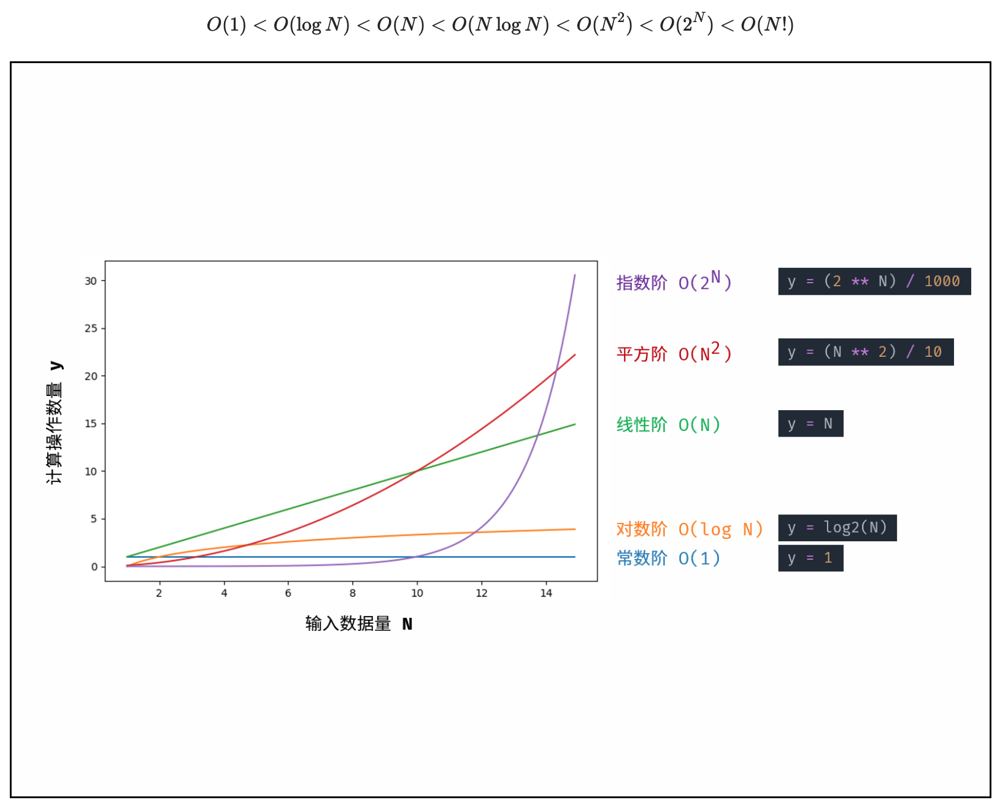
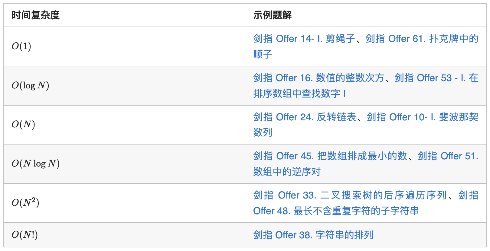

# 第一讲 基本概念

## 1.1 什么是数据结构

### 1.1.1 关于数据组织

<u>**例1：图书摆放**</u>

**图书的摆放要使得2个相关操作方便实现：** 

- 操作1：新书怎么插入？

- 操作2：怎么找到某本指定的书？
  

**方法一：随便放**

- **操作1：**新书怎么插入？

  哪里有空放哪里，一步到位！

- **操作2：**怎么找到某本指定的书？

  ……累死

  

**方法二：按照书名的拼音字母顺序排放**

- **操作1：**新书怎么插入？

  新进一本《阿Q正传》…… 所有的书向后挪 .......

- **操作2：**怎么找到某本指定的书？

  二分查找！


**方法三：把书架划分成几块区域，每块区域指定摆放 某种类别的图书；在每种类别内，按照书名的拼音 字母顺序排放**

- **操作1：**新书怎么插入？

  先定类别，二分查找确定位置，移出空位

- **操作2：**怎么找到某本指定的书？

  先定类别，再二分查找

⚠️ **总结：解决问题方法的效率， 跟<u>数据的组织方式</u>有关**


### 1.1.2 关于空间使用

<u>**例2：写程序实现一个函数PrintN**</u>

**使得传入一个正整数为N的参数后，能顺序 打印从1到N的全部正整数**

- **循环实现：**

  ```c++
  void PrintN ( int N ) { 
  
  		for (int i=1; i<=N; i++ ){ 
        
  			printf(“%d\n”, i );
        
      }
    
  		return 0; 
  }
  ```

- **递归实现：**

  ```c++
  void PrintN(int N)
  {
      if (N)
      {
          PrintN(N - 1);
          printf("% d\n", N);
      }
  
      return;
  }
  ```

  **结果：当 n 为一个很大的数时， 递归函数运行崩溃，栈内存溢出**。

⚠️**总结：解决问题方法的效率， 跟<u>空间的利用效率</u>有关**


### 1.1.3 关于算法效率

<u>**例3：写程序计算给定多项式在给定点x 处的值**</u>

- **直接求值：**

  

```c++
double f(int n, double a[], double x)
{
    int i;
    double p = a[0];

    for (i = 1; i <= n; i++)
    {
        p += (a[i] * pow(x, i));
    }

    return p;
}
```

- **结合律求值：**

  

```c++
double f(int n, double a[], double x)
{
    int i;

    double p = a[n];

    for (i = n; i > 0; i--)

        p = a[i - 1] + x * p;

    return p;
}
```


#### 在 C/C++ 程序中怎样捕获程序运行时间？

**clock()：**捕捉从程序开始运行到 clock() 被调用时所耗费的时间。这个 时间单位是 clock tick，即“时钟打点”。 **常数CLK_TCK** (或 CLOCKS_PER_SEC )：机器时钟每秒所走的时钟打点数。

```c++
#include <iostream>
using namespace std;

clock_t start, stop; /* clock_t是clock()函数返回的变量类型 */
double duration;     /* 记录被测函数运行时间，以秒为单位 */
//#define MAXK 1e7 /* 被测函数最大重复调用次数 */

void MyFunction()
{
}

int main()
{   /* 不在测试范围内的准备工作写在clock()调用之前*/
    start = clock();                               /* 开始计时 */
    MyFunction();                                  /* 把被测函数加在这里 */
    stop = clock();                                /* 停止计时 */
    duration = ((double)(stop - start)) / CLK_TCK; /* 计算运行时间 */
    //duration = duration / MAXK;                    /* 计算函数单次运行的时间 */


    /* 其他不在测试范围的处理写在后面，例如输出duration的值 */ 
    cout << "处理时间：" << duration << " 秒"<< endl;
    
    return 0;
}
```

详见 01-Clock_Duration

 ⚠️ **两种方式求值总结：解决问题方法的效率， 跟<u>算法的巧妙程</u>度有关**


### 1.1.4 抽象数据类型

**所以到底什么是数据结构？**

- **数据结构是关于数据对象在计算机中的组织方式**

  - **逻辑结构：例如线性结构，树，图等** 

  - **物理存储结构**

- **数据对象必定与一系列加在其上的操作相关联**

- **完成这些操作所用的方法就是算法**

 

**描述数据结构的方法：抽象数据类型（Abstract Data Type）：**

-  **数据类型**

  - **数据对象集** 
  - **数据集合相关联的操作集**

- **抽象：描述数据类型的方法不依赖于具体实现**

  - **与存放数据的机器无关** 
  - **与数据存储的物理结构无关** 
  - **与实现操作的算法和编程语言均无关**

  **具体来说，只描述数据对象集和相关操作集 “是什么”，并不涉及 “如何做到”  的问题**


**<u>例4：“矩阵”的抽象数据类型定义</u>**


- **在这个例子中，我们不去关心矩阵的储存方式，不去关心具体的运算方法，也不去关心矩阵的数据类型。这就是 <u>“抽象”</u> 数据类型。**


## 1.2 什么是算法

### 1.2.1 定义

**算法（Algorithm）**

- **一个有限指令集** 
- **接受一些输入（有些情况下不需要输入）** 
- **产生输出**
- **一定在有限步骤之后终止** 
- **每一条指令必须：**
  - **有充分明确的目标，不可以有歧义**
  - **计算机能处理的范围之内**
  - **描述应不依赖于任何一种计算机语言以及具体的实现手段**


<u>**例1：选择排序算法的伪码描述**</u>

```c++
void SelectionSort(int List[], int N)
{ 
    /* 将N个整数List[0]...List[N-1]进行非递减排序 */
    for (i = 0; i < N; i++)
    {
        /* 从List[i]到List[N–1]中找最小元，并将其位置赋给MinPosition */
        MinPosition = ScanForMin(List, i, N–1); 
        /* 将未排序部分的最小元换到有序部分的最后位置 */
        Swap(List[i], List[MinPosition]);       
    }
}
```

抽象 —— List到底是数组还是链表（虽然看上去很像数组）？ Swap用函数还是用宏去实现？我们描述算法的时候是不关心的。


### 1.2.2 什么是好的算法

**空间复杂度 S(n)** —— 根据算法写成的程序在执行时 占用存储单元的长度。这个长度往往与输入数据的 规模有关。空间复杂度过高的算法可能导致使用的 内存超限，造成程序非正常中断。

**时间复杂度 T(n)** —— 根据算法写成的程序在执行时 耗费时间的长度。这个长度往往也与输入数据的规 模有关。时间复杂度过高的低效算法可能导致我们 在有生之年都等不到运行结果。

<u>**例2：整数打印 - 递归**</u>

```c++
void PrintN ( int N ) { 
  if ( N ){ 
    PrintN( N – 1 ); 
    printf(“%d\n”, N ); 
  } 
  return; 
}
```


**<u>例3：多项式求值</u>**

- **法一：**

```c++
double f(int n, double a[], double x)
{
    int i;
    double p = a[0];

    for (i = 1; i <= n; i++){ 
        p += (a[i] * pow(x, i));	//(1+2+3+...+n) = (n^2+n)/2 次乘法
    }
  
    return p;
}
```

**也就意味着：$T(n) = C_1n^2 + C_2n$**

**⚠️注意：运算中加减法用的时间很小，可以忽略不计，所以只看乘除法。**


- **法二：**

```c++
double f(int n, double a[], double x)
{
    int i;
    double p = a[n];

    for (i = n; i > 0; i--)
        p = a[i - 1] + x * p;		//n 次乘法
    return p;
}
```

**意味着：$T(n) = C * n$**


**所以什么是好的算法？**

在分析一般算法的效率时，我们经常关注下面两种复杂度：

- **最坏情况复杂度**  $T_{worst}(n)$
- **平均复杂度**  $T_{avg}(n)$

**这两种复杂度，我们更关心最坏情况复杂度，因为平均复杂度求值困难。**

  $T_{avg}(n) \le T_{worst}(n)$


### 1.2.3 复杂度的渐进表示法

- **$T(n) = O(f(n))$ 表示存在常数 $C >0$, $n_0>0$ 使得当 $n \ge n_0$ 时有 $T(n) \le C·f(n)$ —— $O(f(n))$ 大概表示 $f(n)$ 是 $T(n)$ 的上界**
-  **$T(n) = Ω(g(n))$ 表示存在常数 $C >0$, $n_0 >0$ 使得当 $n \ge n_0$ 时有 $T(n) \ge C·g(n)$ —— $Ω(g(n))$ 大概表示 $g(n)$ 是 $T(n)$ 的下界**
  
-  **$T(n) = Θ(h(n))$ 表示同时有 $T(n) = O(h(n))$ 和 $T(n) = Ω(h(n))$ —— 既有上界也有下界**


注意⚠️：一个函数的上界和下界都不是唯一的，可以有很多个。但不管是上界还是下界，我们都希望尽可能的与真实情况贴近，所以我们一般去找**最小上界**与**最大下界**。


 

⚠️ **好的算法应该可以降低复杂度，尤其是将 $n^2$ 降为 $n\log n$，会对算法复杂度有很大提升。**


⚠️ **可以看到，复杂度高的算法当 n 很大时，运行时间是不可接受的**


### 1.2.4 怎样分析复杂度

#### 1.2.4.1 **时间复杂度**

**一、概念定义**

**根据定义，时间复杂度指输入数据大小为 $N$ 时，算法运行所需花费的时间。**

⚠️注意：

**统计的是算法的「计算操作数量」，而不是「运行的绝对时间」。**计算操作数量和运行绝对时间呈正相关关系，并不相等。算法运行时间受到「编程语言 、计算机处理器速度、运行环境」等多种因素影响。例如，同样的算法使用 Python 或 C++ 实现、使用 CPU 或 GPU 、使用本地 IDE 或力扣平台提交，运行时间都不同。
体现的是计算操作随数据大小 N 变化时的变化情况。假设算法运行总共需要「 1 次操作」、「100 次操作」，此两情况的时间复杂度都为常数级 $O(1)$ ；需要「 N 次操作」、「 100N 次操作」的时间复杂度都为 $O(N)$ 。

**二、符号表示**

根据输入数据的特点，时间复杂度具有「最差」、「平均」、「最佳」三种情况，分别使用 $O , Θ , Ω$ 三种符号表示。以下借助一个查找算法的示例题目帮助理解。

**题目**： 输入长度为 N 的整数数组 nums ，判断此数组中是否有数字 7 ，若有则返回 true ，否则返回 false 。

解题算法： 线性查找，即遍历整个数组，遇到 7 则返回 true 。

代码：

```c++
bool findSeven(vector<int>& nums) {
    for (int num : nums) {
        if (num == 7)
            return true;
    }
    return false;
}
```

最佳情况 $Ω(1)$ ： nums = [7, a, b, c, ...] ，即当数组首个数字为 7 时，无论 nums 有多少元素，线性查找的循环次数都为 1 次；
最差情况 $O(N)$ ： nums = [a, b, c, ...] 且 nums 中所有数字都不为 7 ，此时线性查找会遍历整个数组，循环 N 次；
平均情况 $Θ$ ： 需要考虑输入数据的分布情况，计算所有数据情况下的平均时间复杂度；例如本题目，需要考虑数组长度、数组元素的取值范围等；

> $O$ 是最常使用的时间复杂度评价渐进符号，下文示例题目解析皆使用 $O$ 。


**三、常见种类**
根据从小到大排列，常见的算法时间复杂度主要有：




**四、实例解析**

对于以下所有示例，设输入数据大小为 $N$ ，计算操作数量为 $count$ 。图中每个**「蓝色方块」**代表一个单元计算操作。

1. **常数阶 $O(1)$**

运行次数与 $N$ 大小呈常数关系，即不随输入数据大小 N 的变化而变化。

```c++
int algorithm(int N) {
    int a = 1;
    int b = 2;
    int x = a * b + N;
    return 1;
}
```

对于以下代码，无论 $a$ 取多大，都与输入数据大小 $N$ 无关，因此时间复杂度仍为 $O(1)$ 。

```c++
int algorithm(int N) {
    int count = 0;
    int a = 10000;
    for (int i = 0; i < a; i++) {
        count++;
    }
    return count;
}
```


2. **线性阶 $O(n)$**

循环运行次数与 $N$ 大小呈线性关系，时间复杂度为 $O(N)$ 。

```c++
int algorithm(int N) {
    int count = 0;
    for (int i = 0; i < N; i++)
        count++;
    return count;
}
```

对于以下代码，虽然是两层循环，**但第二层与 $N$ 大小无关**，因此整体仍与 $N$ 呈线性关系。

```c++
int algorithm(int N) {
    int count = 0;
    int a = 10000;
    for (int i = 0; i < N; i++) {
        for (int j = 0; j < a; j++) {
            count++;
        }
    }
    return count;
}
```


3. **平方阶 $O(n²)$**：

两层循环相互独立，都与 $N$ 呈线性关系，因此总体与 $N$ 呈平方关系，时间复杂度为 $O(N^2)$ 。

```c++
int algorithm(int N) {
    int count = 0;
    for (int i = 0; i < N; i++) {
        for (int j = 0; j < N; j++) {
            count++;
        }
    }
    return count;
}
```

以**「冒泡排序」**为例，其包含两层独立循环：

1. 第一层复杂度为 $O(N)$；

2. 第二层平均循环次数为 $\frac{N}{2}$ ，复杂度为 $O(N)$，推导过程如下：

   $O(\frac{N}{2})=O(\frac{1}{2})O(N)=O(1)O(N)=O(N)$

因此，冒泡排序的总体时间复杂度为 $O(N^2)$ ，代码如下所示。

```c++
vector<int> bubbleSort(vector<int>& nums) {
    int N = nums.size();
    for (int i = 0; i < N - 1; i++) {
        for (int j = 0; j < N - 1 - i; j++) {
            if (nums[j] > nums[j + 1]) {
                swap(nums[j], nums[j + 1]);
            }
        }
    }
    return nums;
}
```


4. **指数阶 $O(2^N)$：**

生物学科中的 “细胞分裂” 即是指数级增长。初始状态为 1 个细胞，分裂一轮后为 2 个，分裂两轮后为 4 个，……，分裂 $N$ 轮后有 $2^N$ 个细胞。

算法中，指数阶常出现于**递归**，算法原理图与代码如下所示。

```c++
int algorithm(int N) {
    if (N <= 0) return 1;
    int count_1 = algorithm(N - 1);
    int count_2 = algorithm(N - 1);
    return count_1 + count_2;
}
```


5. **阶乘 $O(N!)$：**

阶乘阶对应数学上常见的 “全排列” 。即给定 $N$ 个互不重复的元素，求其所有可能的排列方案，则方案数量为：

$N×(N−1)×(N−2)×⋯×2×1=N!$

如下图与代码所示，阶乘常使用递归实现，算法原理：第一层分裂出 $N$ 个，第二层分裂出 $N - 1$ 个，…… ，直至到第 $N$ 层时终止并回溯。

```c++
int algorithm(int N) {
    if (N <= 0) return 1;
    int count = 0;
    for (int i = 0; i < N; i++) {
        count += algorithm(N - 1);
    }
    return count;
}
```


6. **对数阶 $O(\log N)$ ：**

对数阶与指数阶相反，指数阶为 “每轮分裂出两倍的情况” ，而**对数阶是 “每轮排除一半的情况”** 。对数阶常出现于**「二分法」、「分治」**等算法中，**体现着 “一分为二” 或 “一分为多” 的算法思想。**

设循环次数为 $m$ ，则输入数据大小 $N$ 与 $2 ^ m$ 呈线性关系，两边同时取 $log_2$ 对数，**则得到循环次数 $m$ 与 $\log_2 N$ 呈线性关系，即时间复杂度为 $O(\log N)$。**

```c++
int algorithm(int N) {
    int count = 0;
    float i = N;
    while (i > 1) {
        i = i / 2;
        count++;
    }
    return count;
}
```

如以下代码所示，对于不同 $a$ 的取值，循环次数 $m$ 与 $\log_a N$ 呈线性关系 ，时间复杂度为 $O(\log_a N)$。而无论底数 $a$ 取值，时间复杂度都可记作 $O(\log N)$ ，根据对数换底公式的推导如下：

$O(\log_aN)=\frac{O(\log_2N)}{O(\log_2a)}=O(\log N)$

```c++
int algorithm(int N) {
    int count = 0;
    float i = N;
    int a = 3;
    while (i > 1) {
        i = i / a;
        count++;
    }
    return count;
}
```

> 如下图所示，为二分查找的时间复杂度示意图，每次二分将搜索区间缩小一半。


7. **线性对数阶 $O(N \log N)$ ：**

两层循环相互独立，第一层和第二层时间复杂度分别为 $O(\log N)$ 和 $O(N)$ ，则总体时间复杂度为 $O(N \log N)$；

```c++
int algorithm(int N) {
    int count = 0;
    float i = N;
    while (i > 1) {
        i = i / 2;
        for (int j = 0; j < N; j++)
            count++;
    }
    return count;
}
```

线性对数阶常出现于排序算法，例如**「快速排序」、「归并排序」、「堆排序」**等，其时间复杂度原理如下图所示。


**五、示例题目**
以下列举本 LeetBook 中各时间复杂度的对应示例题解，以帮助加深理解。




#### 1.2.4.2 空间复杂度

**一、概念定义**

空间复杂度涉及的空间类型有：

- **输入空间：** **存储输入数据**所需的空间大小；

- **暂存空间：** 算法运行过程中，**存储所有中间变量和对象等数据**所需的空间大小；

- **输出空间：** 算法运行返回时，**存储输出数据**所需的空间大小；

  **通常情况下，空间复杂度指在输入数据大小为 $N$ 时，算法运行所使用的「暂存空间」+「输出空间」的总体大小。**


而根据不同来源，算法使用的内存空间分为三类：

**指令空间：**
编译后，程序指令所使用的内存空间。

**数据空间：**
算法中的各项变量使用的空间，包括：声明的常量、变量、动态数组、动态对象等使用的内存空间。

```c++
struct Node {
    int val;
    Node *next;
    Node(int x) : val(x), next(NULL) {}
};

void algorithm(int N) {
    int num = N;              // 变量
    int nums[N];              // 动态数组
    Node* node = new Node(N); // 动态对象
}
```

**栈帧空间：**
程序调用函数是基于栈实现的，函数在调用期间，占用常量大小的栈帧空间，直至返回后释放。如以下代码所示，在循环中调用函数，每轮调用 `test()` 返回后，栈帧空间已被释放，因此空间复杂度仍为 $O(1)$ 。

```c++
int test() {
    return 0;
}

void algorithm(int N) {
    for (int i = 0; i < N; i++) {
        test();
    }
}
```

算法中，**栈帧空间的累计常出现于递归调用。**如以下代码所示，通过递归调用，会同时存在 N 个未返回的函数 `algorithm() `，此时累计使用 $O(N)$ 大小的栈帧空间。

```c++
int algorithm(int N) {
    if (N <= 1) return 1;
    return algorithm(N - 1) + 1;
}
```


**二、符号表示**

通常情况下，**空间复杂度统计算法在 “最差情况” 下使用的空间大小，**以体现算法运行所需预留的空间量，使用符号 $O$ 表示。

最差情况有两层含义，分别为**「最差输入数据」**、算法运行中的**「最差运行点」**。例如以下代码：

> 输入整数 $N$ ，取值范围 $N \geq 1$ ；

- **最差输入数据：** 当 $N \leq 10$ 时，数组 $nums$ 的长度恒定为 10 ，空间复杂度为 $O(10) = O(1)$ ；当 $N > 10$ 时，数组 $nums$ 长度为 $N$ ，空间复杂度为 $O(N)$  ；因此，空间复杂度应为最差输入数据情况下的 $O(N)$ 。
- **最差运行点：** 在执行`nums = [0] * 10` 时，算法仅使用 $O(1)$ 大小的空间；而当执行 `nums = [0] * N` 时，算法使用 $O(N)$ 的空间；因此，空间复杂度应为最差运行点的 $O(N)$ 。

```c++
void algorithm(int N) {
    int num = 5;           // O(1)
    vector<int> nums(10);  // O(1)
    if (N > 10) {
        nums.resize(N);    // O(N)
    }
}
```


