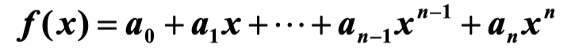
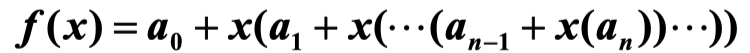
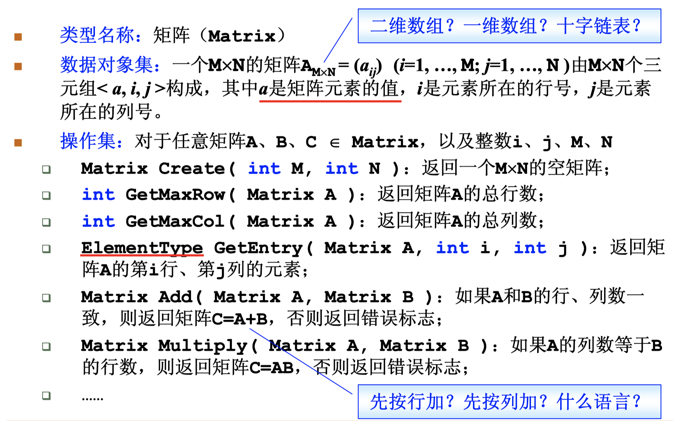
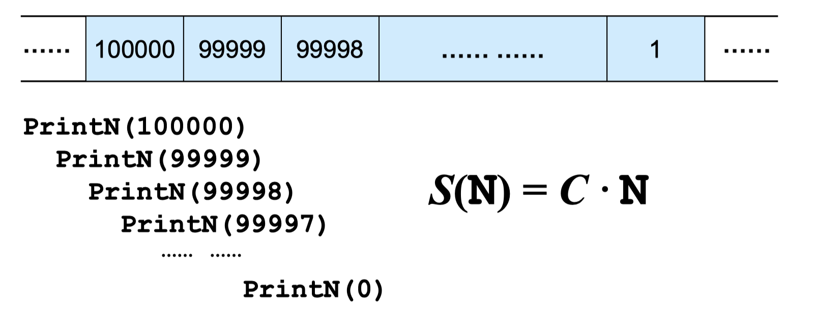
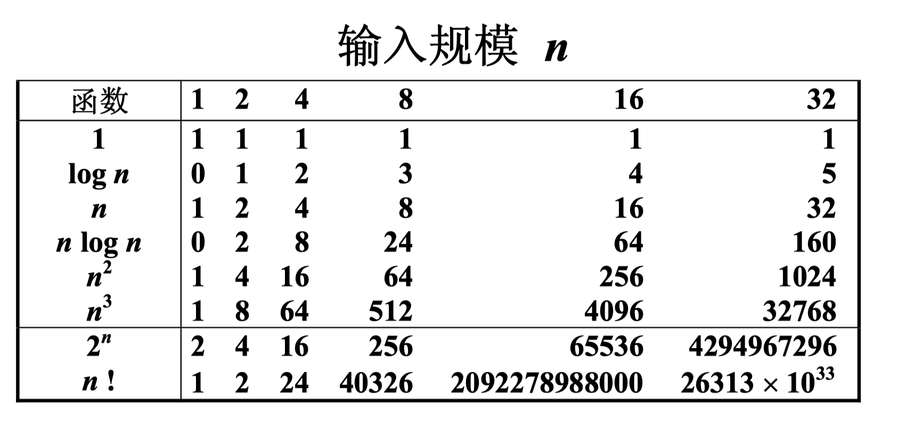
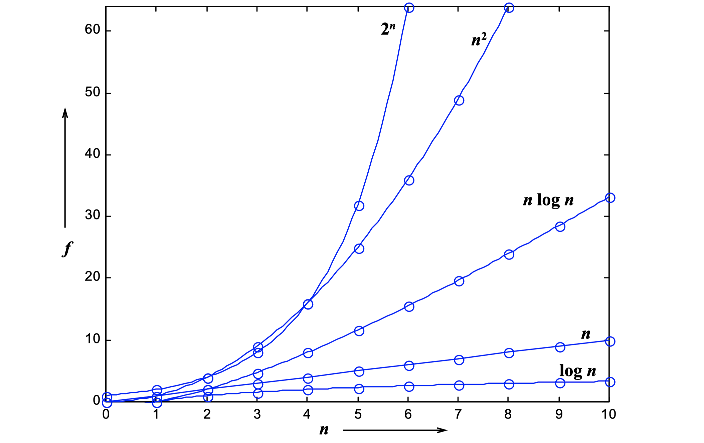
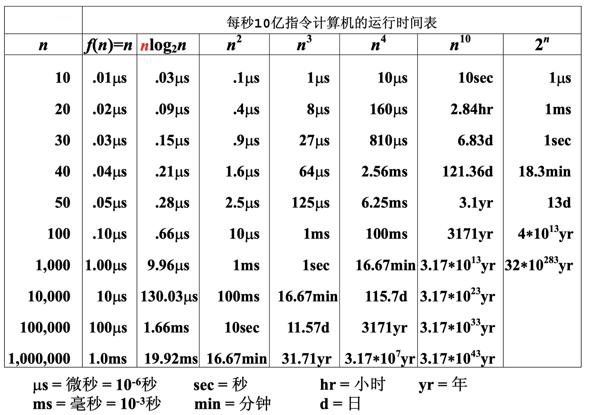

# 第一讲 基本概念

## 1.1 什么是数据结构

### 1.1.1 关于数据组织

<u>**例1：图书摆放**</u>

**图书的摆放要使得2个相关操作方便实现：** 

- 操作1：新书怎么插入？

- 操作2：怎么找到某本指定的书？
  

**方法一：随便放**

- **操作1：**新书怎么插入？

  哪里有空放哪里，一步到位！

- **操作2：**怎么找到某本指定的书？

  ……累死

  

**方法二：按照书名的拼音字母顺序排放**

- **操作1：**新书怎么插入？

  新进一本《阿Q正传》…… 所有的书向后挪 .......

- **操作2：**怎么找到某本指定的书？

  二分查找！


**方法三：把书架划分成几块区域，每块区域指定摆放 某种类别的图书；在每种类别内，按照书名的拼音 字母顺序排放**

- **操作1：**新书怎么插入？

  先定类别，二分查找确定位置，移出空位

- **操作2：**怎么找到某本指定的书？

  先定类别，再二分查找

⚠️ **总结：解决问题方法的效率， 跟<u>数据的组织方式</u>有关**


### 1.1.2 关于空间使用

<u>**例2：写程序实现一个函数PrintN**</u>

**使得传入一个正整数为N的参数后，能顺序 打印从1到N的全部正整数**

- **循环实现：**

  ```c++
  void PrintN ( int N ) { 
  
  		for (int i=1; i<=N; i++ ){ 
        
  			printf(“%d\n”, i );
        
      }
    
  		return 0; 
  }
  ```

- **递归实现：**

  ```c++
  void PrintN(int N)
  {
      if (N)
      {
          PrintN(N - 1);
          printf("% d\n", N);
      }
  
      return;
  }
  ```

  **结果：当 n 为一个很大的数时， 递归函数运行崩溃，栈内存溢出**。

⚠️**总结：解决问题方法的效率， 跟<u>空间的利用效率</u>有关**


### 1.1.3 关于算法效率

<u>**例3：写程序计算给定多项式在给定点x 处的值**</u>

- **直接求值：**

  

```c++
double f(int n, double a[], double x)
{
    int i;
    double p = a[0];

    for (i = 1; i <= n; i++)
    {
        p += (a[i] * pow(x, i));
    }

    return p;
}
```

- **结合律求值：**

  

```c++
double f(int n, double a[], double x)
{
    int i;

    double p = a[n];

    for (i = n; i > 0; i--)

        p = a[i - 1] + x * p;

    return p;
}
```


#### 在 C/C++ 程序中怎样捕获程序运行时间？

**clock()：**捕捉从程序开始运行到 clock() 被调用时所耗费的时间。这个 时间单位是 clock tick，即“时钟打点”。 **常数CLK_TCK** (或 CLOCKS_PER_SEC )：机器时钟每秒所走的时钟打点数。

```c++
#include <iostream>
using namespace std;

clock_t start, stop; /* clock_t是clock()函数返回的变量类型 */
double duration;     /* 记录被测函数运行时间，以秒为单位 */
//#define MAXK 1e7 /* 被测函数最大重复调用次数 */

void MyFunction()
{
}

int main()
{   /* 不在测试范围内的准备工作写在clock()调用之前*/
    start = clock();                               /* 开始计时 */
    MyFunction();                                  /* 把被测函数加在这里 */
    stop = clock();                                /* 停止计时 */
    duration = ((double)(stop - start)) / CLK_TCK; /* 计算运行时间 */
    //duration = duration / MAXK;                    /* 计算函数单次运行的时间 */


    /* 其他不在测试范围的处理写在后面，例如输出duration的值 */ 
    cout << "处理时间：" << duration << " 秒"<< endl;
    
    return 0;
}
```

详见 01-Clock_Duration

 ⚠️ **两种方式求值总结：解决问题方法的效率， 跟<u>算法的巧妙程</u>度有关**


### 1.1.4 抽象数据类型

**所以到底什么是数据结构？**

- **数据结构是关于数据对象在计算机中的组织方式**

  - **逻辑结构：例如线性结构，树，图等** 

  - **物理存储结构**

- **数据对象必定与一系列加在其上的操作相关联**

- **完成这些操作所用的方法就是算法**

 

**描述数据结构的方法：抽象数据类型（Abstract Data Type）：**

-  **数据类型**

  - **数据对象集** 
  - **数据集合相关联的操作集**

- **抽象：描述数据类型的方法不依赖于具体实现**

  - **与存放数据的机器无关** 
  - **与数据存储的物理结构无关** 
  - **与实现操作的算法和编程语言均无关**

  **具体来说，只描述数据对象集和相关操作集 “是什么”，并不涉及 “如何做到”  的问题**


**<u>例4：“矩阵”的抽象数据类型定义</u>**




- **在这个例子中，我们不去关心矩阵的储存方式，不去关心具体的运算方法，也不去关心矩阵的数据类型。这就是 <u>“抽象”</u> 数据类型。**


## 1.2 什么是算法

### 1.2.1 定义

**算法（Algorithm）**

- **一个有限指令集** 
- **接受一些输入（有些情况下不需要输入）** 
- **产生输出**
- **一定在有限步骤之后终止** 
- **每一条指令必须：**
  - **有充分明确的目标，不可以有歧义**
  - **计算机能处理的范围之内**
  - **描述应不依赖于任何一种计算机语言以及具体的实现手段**


<u>**例1：选择排序算法的伪码描述**</u>

```c++
void SelectionSort(int List[], int N)
{ 
    /* 将N个整数List[0]...List[N-1]进行非递减排序 */
    for (i = 0; i < N; i++)
    {
        /* 从List[i]到List[N–1]中找最小元，并将其位置赋给MinPosition */
        MinPosition = ScanForMin(List, i, N–1); 
        /* 将未排序部分的最小元换到有序部分的最后位置 */
        Swap(List[i], List[MinPosition]);       
    }
}
```

抽象 —— List到底是数组还是链表（虽然看上去很像数组）？ Swap用函数还是用宏去实现？我们描述算法的时候是不关心的。


### 1.2.2 什么是好的算法

**空间复杂度 S(n)** —— 根据算法写成的程序在执行时 占用存储单元的长度。这个长度往往与输入数据的 规模有关。空间复杂度过高的算法可能导致使用的 内存超限，造成程序非正常中断。

**时间复杂度 T(n)** —— 根据算法写成的程序在执行时 耗费时间的长度。这个长度往往也与输入数据的规 模有关。时间复杂度过高的低效算法可能导致我们 在有生之年都等不到运行结果。

<u>**例2：整数打印 - 递归**</u>

```c++
void PrintN ( int N ) { 
  if ( N ){ 
    PrintN( N – 1 ); 
    printf(“%d\n”, N ); 
  } 
  return; 
}
```




**<u>例3：多项式求值</u>**

- **法一：**

```c++
double f(int n, double a[], double x)
{
    int i;
    double p = a[0];

    for (i = 1; i <= n; i++){ 
        p += (a[i] * pow(x, i));	//(1+2+3+...+n) = (n^2+n)/2 次乘法
    }
  
    return p;
}
```

**也就意味着：$T(n) = C_1n^2 + C_2n$**

**⚠️注意：运算中加减法用的时间很小，可以忽略不计，所以只看乘除法。**


- **法二：**

```c++
double f(int n, double a[], double x)
{
    int i;
    double p = a[n];

    for (i = n; i > 0; i--)
        p = a[i - 1] + x * p;		//n 次乘法
    return p;
}
```

**意味着：$T(n) = C * n$**


**所以什么是好的算法？**

在分析一般算法的效率时，我们经常关注下面两种复杂度：

- **最坏情况复杂度**  $T_{worst}(n)$
- **平均复杂度**  $T_{avg}(n)$

**这两种复杂度，我们更关心最坏情况复杂度，因为平均复杂度求值困难。**

  $T_{avg}(n) \le T_{worst}(n)$


### 1.2.3 复杂度的渐进表示法

- **$T(n) = O(f(n))$ 表示存在常数 $C >0$, $n_0>0$ 使得当 $n \ge n_0$ 时有 $T(n) \le C·f(n)$ —— $O(f(n))$ 大概表示 $f(n)$ 是 $T(n)$ 的上界**
-  **$T(n) = Ω(g(n))$ 表示存在常数 $C >0$, $n_0 >0$ 使得当 $n \ge n_0$ 时有 $T(n) \ge C·g(n)$ —— $Ω(g(n))$ 大概表示 $g(n)$ 是 $T(n)$ 的下界**
  
-  **$T(n) = Θ(h(n))$ 表示同时有 $T(n) = O(h(n))$ 和 $T(n) = Ω(h(n))$ —— 既有上界也有下界**


注意⚠️：一个函数的上界和下界都不是唯一的，可以有很多个。但不管是上界还是下界，我们都希望尽可能的与真实情况贴近，所以我们一般去找**最小上界**与**最大下界**。



 

⚠️ **好的算法应该可以降低复杂度，尤其是将 $n^2$ 降为 $n\log n$，会对算法复杂度有很大提升。**





⚠️ **可以看到，复杂度高的算法当 n 很大时，运行时间是不可接受的**


### 1.2.4 怎样分析复杂度

#### 1.2.4.1 **时间复杂度**

根据定义，时间复杂度指输入数据大小为 NN 时，算法运行所需花费的时间。需要注意：

统计的是算法的「计算操作数量」，而不是「运行的绝对时间」。计算操作数量和运行绝对时间呈正相关关系，并不相等。算法运行时间受到「编程语言 、计算机处理器速度、运行环境」等多种因素影响。例如，同样的算法使用 Python 或 C++ 实现、使用 CPU 或 GPU 、使用本地 IDE 或力扣平台提交，运行时间都不同。
体现的是计算操作随数据大小 NN 变化时的变化情况。假设算法运行总共需要「 11 次操作」、「 100100 次操作」，此两情况的时间复杂度都为常数级 O(1)O(1) ；需要「 NN 次操作」、「 100N100N 次操作」的时间复杂度都为 O(N)O(N) 。

我们想要知道一个算法的「时间复杂度」，很多人首先想到的的方法就是把这个算法程序运行一遍，那么它所消耗的时间就自然而然知道了。

这种方式可以吗？当然可以，不过它也有很多弊端。
这种方式非常容易受运行环境的影响，在性能高的机器上跑出来的结果与在性能低的机器上跑的结果相差会很大。而且对测试时使用的数据规模也有很大关系。再者，并我们在写算法的时候，还没有办法完整的去运行呢。

因此，另一种更为通用的方法就出来了：「 **大O符号表示法** 」，即 T(n) = O(f(n))

我们先来看个例子：

```text
for(i=1; i<=n; ++i)
{
   j = i;
   j++;
}
```

通过「 大O符号表示法 」，这段代码的时间复杂度为：O(n) ，为什么呢?

**在 大O符号表示法中，时间复杂度的公式是： T(n) = O( f(n) )，其中 f(n) 表示每行代码执行次数之和，而 O 表示正比例关系，这个公式的全称是：算法的渐进时间复杂度。**

我们继续看上面的例子，假设每行代码的执行时间都是一样的，我们用 n 颗粒时间 来表示，那么这个例子的第一行耗时是1个颗粒时间，第三行的执行时间是 n个颗粒时间，第四行的执行时间也是 n个颗粒时间（第二行和第五行是符号，暂时忽略），那么总时间就是 1颗粒时间 + n颗粒时间 + n颗粒时间 ，即 (1+2n)个颗粒时间，即： T(n) = (1+2n)*颗粒时间，从这个结果可以看出，这个算法的耗时是随着n的变化而变化，因此，我们可以简化的将这个算法的时间复杂度表示为：T(n) = O(n)

为什么可以这么去简化呢，因为大O符号表示法并不是用于来真实代表算法的执行时间的，它是用来表示代码执行时间的增长变化趋势的。所以上面的例子中，如果n无限大的时候，T(n) = time(1+2n)中的常量1就没有意义了，倍数2也意义不大。因此直接简化为T(n) = O(n) 就可以了。


1. **常数阶 $O(1)$**

无论代码执行了多少行，只要是没有循环等复杂结构，那这个代码的时间复杂度就都是O(1)，如：

```c++
int i = 1;
int j = 2;
++i;
j++;
int m = i + j;
```

上述代码在执行的时候，**它消耗的时间并不随着某个变量的增长而增长**，那么无论这类代码有多长，即使有几万几十万行，都可以用O(1)来表示它的时间复杂度。


2. **线性阶 $O(n)$**

这个在最开始的代码示例中就讲解过了，如：

```c++
for(i=1; i<=n; ++i)
{
   j = i;
   j++;
}
```

这段代码，**for循环里面的代码会执行n遍，因此它消耗的时间是随着n的变化而变化的**，因此这类代码都可以用O(n)来表示它的时间复杂度。


3. **对数阶 $O(logN)$**

还是先来看代码：

```c++
int i = 1;
while(i<n)
{
    i = i * 2;
}
```

从上面代码可以看到，在while循环里面，每次都将 i 乘以 2，乘完之后，i 距离 n 就越来越近了。我们试着求解一下，假设循环x次之后，i 就大于 2 了，此时这个循环就退出了，也就是说 2 的 x 次方等于 n，**那么 x = log2^n**
**也就是说当循环 log2^n 次以后，这个代码就结束了。因此这个代码的时间复杂度为：$O (\log n)$**

4. **线性对数阶 $O(nlogN)$**

线性对数阶 $O(nlogN)$ 其实非常容易理解，将时间复杂度为 $O(logn)$ 的代码**循环 N 遍**的话，那么它的时间复杂度就是 $n * O (logN)$，也就是了$O (nlogN)$。

就拿上面的代码加一点修改来举例：

```text
for(m=1; m<n; m++)
{
    i = 1;
    while(i<n)
    {
        i = i * 2;
    }
}
```


5. **平方阶 $O(n²)$**

平方阶 $O(n²)$ 就更容易理解了，如果把 $O(n)$ 的代码再嵌套循环一遍，它的时间复杂度就是 $O(n²)$ 了。
举例：

```text
for(x=1; i<=n; x++)
{
   for(i=1; i<=n; i++)
    {
       j = i;
       j++;
    }
}
```

这段代码其实就是嵌套了2层n循环，它的时间复杂度就是 $O(n*n)$，即 $O(n²)$
如果将其中一层循环的 n 改成 m，即：

```text
for(x=1; x<=m; x++)
{
   for(i=1; i<=n; i++)
    {
       j = i;
       j++;
    }
}
```

那它的时间复杂度就变成了 $O(m*n)$


6. **立方阶 $O(n³)$**、**K次方阶 $O(n^k)$**

参考上面的 $O(n²)$ 去理解就好了，$O(n³)$ 相当于三层 n 循环，其它的类似。


**空间复杂度**

既然时间复杂度不是用来计算程序具体耗时的，那么我也应该明白，空间复杂度也不是用来计算程序实际占用的空间的。

空间复杂度是对一个算法在运行过程中临时占用存储空间大小的一个量度，同样反映的是一个趋势，我们用 S(n) 来定义。

空间复杂度比较常用的有：$O(1)、O(n)、O(n²)$，我们下面来看看：

1. **空间复杂度 $O(1)$**

如果算法执行所需要的临时空间不随着某个变量 n 的大小而变化，即此算法空间复杂度为一个常量，可表示为 $O(1)$
举例：

```text
int i = 1;
int j = 2;
++i;
j++;
int m = i + j;
```

代码中的 i、j、m 所分配的空间都不随着处理数据量变化，因此它的空间复杂度  S(n) = O(1)


2. **空间复杂度 $O(n)$**

我们先看一个代码：

```text
int[] m = new int[n]
for(i=1; i<=n; ++i)
{
   j = i;
   j++;
}
```

这段代码中，**第一行 new 了一个数组出来，这个数据占用的大小为 n**，这段代码的 2-6 行，虽然有循环，但没有再分配新的空间，因此，这段代码的空间复杂度主要看第一行即可，即 $S(n) = O(n)$


3. 空间复杂度 $O(n^2)$

**一个二维数组的时间复杂度即为 $O(n^2)$**


