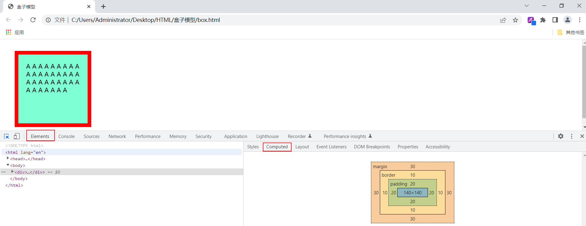
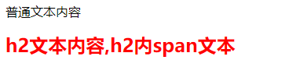

# 1. 前端开发介绍

我们介绍Web网站工作流程的时候提到，前端开发，主要的职责就是将数据以好看的样式呈现出来。说白了，就是开发网页程序，如下图所示：

  


那在讲解web前端开发之前，我们先需要对web前端开发有一个整体的认知。主要明确一下三个问题：

1). 网页有哪些部分组成 ?

文字、图片、音频、视频、超链接、表格等等。


2). 我们看到的网页，背后的本质是什么 ?

程序员写的前端代码 (备注：在前后端分离的开发模式中，)


3). 前端的代码是如何转换成用户眼中的网页的 ?

通过浏览器转化（解析和渲染）成用户看到的网页

浏览器中对代码进行解析和渲染的部分，称为 **浏览器内核**


而市面上的浏览器非常多，比如：IE、火狐Firefox、苹果safari、欧朋、谷歌Chrome、QQ浏览器、360浏览器等等。 而且我们电脑上安装的浏览器可能都不止一个，有很多。 

但是呢，需要大家注意的是，不同的浏览器，内核不同，对于相同的前端代码解析的效果也会存在差异。 那这就会造成一个问题，同一段前端程序，不同浏览器展示出来的效果是不一样的，这个用户体验就很差了。而我们想达到的效果则是，即使用户使用的是不同的浏览器，解析同一段前端代码，最终展示出来的效果都是相同的。

要想达成这样一个目标，我们就需要定义一个统一的标准，然后让各大浏览器厂商都参照这个标准来实现即可。 而这套标准呢，其实早都已经定义好了，那就是我们接下来，要介绍的web标准。


**Web标准**也称为**网页标准**，由一系列的标准组成，大部分由W3C（ World Wide Web Consortium，万维网联盟）负责制定。由三个组成部分：

- ==HTML：负责网页的结构（页面元素和内容）。==

- ==CSS：负责网页的表现（页面元素的外观、位置等页面样式，如：颜色、大小等）。==

- ==JavaScript：负责网页的行为（交互效果）。==

 


当然了，随着技术的发展，我们为了更加快速的开发，现在也出现了很多前端开发的高级技术。例如：vue、elementui、Axios等等。

那这些内容呢，也是我们前端三天课程中要讲解的内容。 前端的3天课程安排如下：

- HTML & CSS
- JavaScript & Vue
- Ajax & Axios & ElementUI & Nginx


# 2. HTML

## 2.1 什么是HTML ?

==**HTML: **HyperText Markup Language，超文本标记语言。==

- 超文本：超越了文本的限制，比普通文本更强大。除了文字信息，还可以定义图片、音频、视频等内容。

- 标记语言：由标签构成的语言
  - HTML标签都是预定义好的。例如：使用 <h1> 标签展示标题，使用<a>展示超链接，使用展示图片，<video>展示视频。
  - HTML代码直接在浏览器中运行，HTML标签由浏览器解析。

下面展示的是一段html代码经过浏览器解析，呈现的效果如右图所示：

   

### 2.1.1 HTML 基本元素属性

1. ==**id 属性 (属性名：id)**==
   - **定义**: `id`是一个全局属性，为HTML元素提供了一个唯一的标识符。
   - 特点：
     - 页面内的每个`id`值必须是唯一的。
     - 通常用于标记单个元素。
     - 可以与JavaScript一起使用来访问和操作元素。
     - CSS中可以使用`#`选择器来选取id元素，例如：`#myId { color: red; }`。
   - **示例**: `<div id="header">这是标题</div>`
2. ==**class 属性 (属性名：class)**==
   - **定义**: `class`是一个全局属性，用于指定一个或多个类名的空格分隔列表。
   - 特点：
     - 一个元素可以有多个类名，类名之间使用空格分隔。
     - 同一个类可以应用于页面中的多个元素。
     - CSS中可以使用`.`选择器来选取class元素，例如：`.myClass { font-size: 16px; }`。
   - **示例**: `<div class="box highlighted">这是一个高亮的盒子</div>`
3. ==**属性 (Property)**==
   - **定义**: 属性为HTML元素提供附加信息。它们始终定义在开始标签中，通常以`name="value"`的形式出现。
   - 特点：
     - 属性名称是不区分大小写的，但建议小写。
     - 属性值应该始终被引号包围，尽管有些属性（例如类名或id）在没有空格的情况下可以省略引号。
   - **示例**: 在`<a href="https://www.example.com">链接</a>`中，`href`是属性名称，`https://www.example.com`是属性值。


### 2.1.2 HTML 元素盒子模型

- 盒子：页面中所有的元素（标签），都可以看做是一个 盒子，由盒子将页面中的元素包含在一个矩形区域内，通过盒子的视角更方便的进行页面布局
- ==盒子模型组成：内容区域（content）、内边距区域（padding）、边框区域（border）、外边距区域（margin）==

[](https://github.com/zyf265600/Programmer/blob/main/HTML-CSS/HTML-CSS.assets/image-20230310092820616.png)

可以通过浏览器打开该页面, 通过开发者工具,我们就可以看到盒子的大小, 以及盒子各个组成部分(内容、内边距、边框、外边距)：

[](https://github.com/zyf265600/Programmer/blob/main/HTML-CSS/HTML-CSS.assets/image-20230310094312355.png)

我们也可以，通过浏览器的开发者工具，清晰的看到这个盒子，以及每一个部分的大小：

[](https://github.com/zyf265600/Programmer/blob/main/HTML-CSS/HTML-CSS.assets/image-20230310094412539.png)


注意，红色盒子的`margin`值要比蓝色盒子的大，让它看起来比蓝色盒子要小。当你增加蓝色的`margin`值，它会增加元素边框到其他周围元素的距离：


==盒子的大小，其实就包括三个部分： border、padding、content，而margin外边距是不包括在盒子之内的。==

**为什么要分为 content padding border margin？**

**Content（内容）**

- 这是元素实际包含的内容，如文本、图片或其他媒体内容。
- ==`width`和`height`属性默认设置内容区域的大小。==

**Padding（内边距）**

- 这是内容区域与边框之间的空间。
- 内边距不是透明的。
- 使用`padding`属性来设置这个区域。

**Border（边框）**

- 这围绕在内边距和内容周围的线。
- 使用`border`属性来定义其大小和样式。

**Margin（外边距）**

- 这是边框外面的区域，用于元素与其周围元素之间的间距。
- 外边距是透明的。
- 使用`margin`属性来设置这个区域。

**为什么要这么分？**

1. **灵活性和复用性：** 这样的结构提供了高度的灵活性，允许你单独地控制每个组件，从而复用和修改成更多的样式。
2. **布局控制：** 精细的控制每个元素的`margin`和`padding`可以让你实现各种复杂的布局。
3. **可读性和可维护性：** 明确的分区使得代码更容易理解，更方便团队合作和后期维护。
4. **响应式设计：** 分明确的盒模型组件（如`padding`、`border`和`margin`）方便实现响应式设计，因为你可以针对不同的屏幕大小进行调整。
5. **视觉效果：** 通过独立控制这四个部分，你可以容易地添加各种视觉效果，如阴影、圆角边框等。

==元素的背景是元素的总大小，包括填充padding和边框border（但不包括边距margin）。==


#### 2.1.2.1 盒子模型基本代码实现

````ts
#center {
	width: 65%;
	padding: 20px 20px 20px 20px; /* 内边距, 上 右 下 左 , 边距都一行, 可以简写: padding: 20px;*/ 
	border: 10px solid red; /* 边框, 宽度 线条类型 颜色 */
	margin: 30px 30px 30px 30px; /* 外边距, 上 右 下 左 , 边距都一行, 可以简写: margin: 30px; */
	margin: 0 auto; /* 上下，左右 */
  /* auto 为左右方向的margin设置一个自动值。这意味着浏览器会计算左右两边的margin，使其相等，从而使元素在水平方向上居中。 */
}
````


#### 2.1.2.2 设置元素外边距 margin

CSS 允许你使用`margin-top`，`margin-right`，`margin-bottom`和`margin-left`属性来设置四个不同方向的`margin`值。

如图:


#### 2.1.2.3 设置元素负外边距 margin

**margin**

`margin `清除周围的（外边框）元素区域。`margin `没有背景颜色，是完全透明的。

`margin `可以单独改变元素的上，下，左，右边距，也可以一次改变所有的属性。


如果你设置元素margin为负值，元素会变得更大。


#### 2.1.2.4 设置元素内边距 padding

CSS 允许你使用`padding-top`，`padding-right`， `padding-bottom`和`padding-left`属性来设置四个不同方向的`padding`值。

如图:


不需要每次都要分别声明 `padding-top`，`padding-right`，`padding-bottom`和`padding-left`属性，

也可以把它们汇总在`padding`属性里面声明，如下：


==这四个值按顺时针排序：上，右，下，左，并且设置的效果等同于特定声明每一个方向的`padding`。==


## 2.2 HTML 基础标签

### 2.2.1 标题标签

HTML 标题是通过 `<h1> - <h6>` 等标签进行定义的。

`h1` 元素通常用于主标题，而 `h2` 元素通常用于副标题。

还有 `h3`，`h4`，`h5` 和 `h6` 元素分别表示不同级别的标题。


### 2.2.2 换行标签

HTML 中使用`<br>` 标签换行。\<br> 没有结束标签。

**提示：**在写地址信息或者写诗词时 \<br> 标签非常有用。

**注释：** 请使用 \<br> 标签来输入空行，`而不是分割段落`。

例如:

```html
<p>
回车换行方式 第一行
第二行
第三行
第四行
</p>
<p>
br 换行方式 第一行<br>第二行<br>第三行
<br>
第四行
</p>
```

**运行结果:**


### 2.2.3 段落标签

p是“paragraph”的缩写。

\<p> 标签定义段落。

p 元素会自动在其前后创建一些空白。浏览器会自动添加这些空间。

例如:

```html
<p>这是段落。</p>
<p>这是段落。</p>
<p>这是段落。</p>
```

我们可以看到浏览器给段落自动加上了空间:


### 2.2.4 强调标签

`<em>` 标签是一个短语标签，用来呈现为被强调的文本。

所有短语标签：

| 标签       | 描述                                                         |
| ---------- | ------------------------------------------------------------ |
| `<em>`     | 呈现为被强调的文本。                                         |
| `<strong>` | 定义重要的文本。                                             |
| `<dfn>`    | 定义一个定义项目。                                           |
| `<code>`   | 定义计算机代码文本。                                         |
| `<samp>`   | 定义样本文本。                                               |
| `<kbd>`    | 定义键盘文本。它表示文本是从键盘上键入的。它经常用在与计算机相关的文档或手册中。 |
| `<var>`    | 定义变量。您可以将此标签与 `<pre>` 及 `<code>` 标签配合使用。 |

实例:

```html
默认文本 <br>
<em>强调文本</em><br>
<strong>加粗文本</strong><br>
<dfn>定义项目</dfn><br>
<code>一段电脑代码 print("Hello World")</code><br>
<samp>计算机样本</samp><br>
<kbd>键盘输入</kbd><br>
<var>变量</var>
```

运行结果:


**提示：**

我们并不反对使用`<em>`标签，但是如果您只是为了达到某种视觉效果而使用这个标签的话，我们建议您使用 CSS ，这样可能会取得更丰富的效果。


### 2.2.5 上下标标签

` <sub>` 标签定义下标文本。

下标文本将会显示在当前文本流中字符高度的一半为基准线的下方，但是与当前文本流中文字的字体和字号都是一样的。

下标文本能用来表示化学公式，比如 H2O。

`<sup>` 标签定义上标文本。

上标文本将会显示在当前文本流中字符高度的一半为基准线的上方，但是与当前文本流中文字的字体和字号都是一样的。

上标文本能用来添加脚注，比如 WWW[1]。

**实例:**

```html
<p>这个文本包含 <sub>下标</sub>文本。</p>
<p>这个文本包含 <sup>上标</sup> 文本。</p>
```

运行结果:


### 2.2.6 粗体标签

` <b>` 标签定义粗体的文本。

例如:

```html
<p>这是一个普通的文本- <b>这是一个加粗文本</b>。</p>
```

**运行结果:**


**注意：**

根据 HTML 5 的规范，`<b>` 标签应该做为最后的选择，只有在没有其他标记比较合适时才使用它。

HTML 5 规范声明：标题应该用 `<h1>-<h6>` 标签表示，被强调的文本应该 `<em>` 标签表示，重要的文本应该用 `<strong>` 标签表示，被标记的或者高亮显示的文本应该用 `<mark>`标签表示。

**提示：**您也可以使用 CSS 的 "font-weight" 属性设置粗体文本。


## 2.3 HTML 编码格式

### 2.3.1 块级元素与行内元素

**HTML标签有两类：**

**块级元素**

div、h1~h6、blockquote、dl、dt、dd、form、hr、ol、p、pre、table、ul ...

==**特点：**总是在新行上开始，高度、行高以及顶和底边距都可控制，宽度缺省（默认）是它的容器的100%，除非设定一个宽度。==

**功能：**主要用来搭建网站架构、页面布局、承载内容。

**行内元素**

span、a、b、br、code、em、i、img、input、label、select、textarea ...

==**特点：**和其他元素都在一行上，高、行高及顶和底边距不可改变，宽度就是它的文字或图片的宽度，不可改变。==

**功能：**用于加强内容显示,控制细节，例如：加粗、斜体等等。


### 2.3.2 元素嵌套

在HTML中元素是可以嵌套的。

HTML元素嵌套一般遵循以下规定：

- 块级元素可以包含行内元素或某些块级元素，
- 行内元素不能包含块级元素，行内元素只能包含其它的行内元素
- `h1 - h6`、`p`、`dt` 这些块级元素，只能包含行内元素

以上规定并非强制，不遵循以上规定进行嵌套，代码也是可以被执行的。

> **提示：** 
> 行内元素也经常被称为“内联元素”

通常被嵌套的块级子元素，需进行换行和缩进，以让代码更加易于阅读。

例如：

```html
<div>
    <p>第一段</p>
    <p>第二段</p>
</div>
```


### 2.3.3 注释

请记住，开始注释，使用 `<!--`，结束注释，使用 `-->`。


### 2.3.4 HTML5 元素介绍

HTML5 引入了很多更具描述性的 HTML 元素

例如：`header`、`footer`、`nav`、`video`、`article`、`section`等。 

这些元素让 HTML 更易读，同时有助于搜索引擎优化和无障碍访问。

 `main`元素让搜索引擎和开发者瞬间就能找到网页的主要内容。 

举个例子, 下面的 `main` 元素嵌套了两个子元素：

```html
<main> 
  <h1>Hello World</h1>
  <p>Hello Paragraph</p>
</main>
```

**提示：**

在后面的课程中我们会接触到更多新的 HTML5 元素，并且知道它们怎么使用。

 


## 2.4 HTML 功能标签

### 2.4.1 图片标签

HTML 用`img`元素来为你的网站添加图片，其中`src`属性指向一个图片的地址。 

**示例：**

```html

```

**注意：**`img`是单标签元素, 没有结束标签(闭合标签)。 


#### 2.4.1.1 给图片添加alt属性

`img`元素`alt`属性中的文本是当图片无法加载时显示的替代文本。 `alt `属性对于盲人或视觉障碍的用户理解图片中的内容非常重要，

搜索引擎也会搜索`alt` 属性来了解图片的内容。

总而言之，`alt` 属性是一个`必需的`属性，为页面上的图片都加上 `alt `属性是好习惯。

为img元素添加一个 alt 属性 (以下图片路径的图片不存在)：

```html

```

**运行结果:**


**有些情况下`alt`属性似乎有些多余。**

比如用来充当背景的图片。 如果省略 `alt` 属性，则表明该图像是内容的关键部分，但没有等效的文本可用。
如果把这个属性设置为空字符串（`alt=""`），则表明该图像*不是*内容的关键部分（这是一种装饰或者一个追踪像素点），非可视化浏览器在渲染的时候可能会忽略它。而且，如果图片加载失败，可视化浏览器会隐藏表示图片损坏的图标。

例如： 

```html
<p>alt 文本留空</p>
 
<hr>
 
```

**运行结果:**


#### 2.4.1.2 给图片添加链接

你可以通过将某元素嵌套在`a`元素中使其变为一个链接。

我们可以把图片嵌入到`a`元素中。

例如：

```html
<a href="#"></a>
```

**注意:** 

使用 # 作为元素的 `href` 属性, 表示将其转换为固定链接。

> **提示: 
> **当鼠标悬停在图片上时，鼠标的光标如果从箭头指针变成手形指针, 那么此时图片就是一个链接了。 

例如:


### 2.4.2 链接标签

HTML 通过使用 `<a>` 标签在 HTML 中创建链接。

下面是一张`a`元素的图示。


#### 2.4.2.1 使用a元素实现页面内跳转

`a`元素也可以用在网页内不同区域的跳转。

设置`a`元素的 `href `属性值为井号`#`加上想跳转区域对应的`id`属性值，这样就可以创建一个内部跳转。

`id`是用来描述网页元素的一个属性，它的值在整个页面中唯一。

当用户点击了`Contacts Us`链接，页面就会跳转到网页的**Contacts Us**区域。

例如:


#### 2.4.2.2 使用#符号设置固定链接

有时你想要在你的网站上添加一个 `a` 元素，但你还不知道将它链接到哪里，这时你可以使用固定连接。

把 `a` 元素的 `href` 属性的值替换为一个 `#` （# 也称为哈希符号），可将其转换为一个固定链接。


### 2.4.3 有序/无须列表标签

**`<ul>` 标签定义无序列表。**

将 `<ul>` 标签与 `<li> `标签一起使用，创建无序列表。

例如：

```html
<h4>一个无序列表：</h4>
<ul>
  <li>咖啡</li>
  <li>茶</li>
  <li>牛奶</li>
</ul>
```

**运行结果:**


我们可以看到无序列表默认在子项前面加了实心小黑点，这个小黑点可以通过 CSS 调整成其他样子比如菱形。


**`<ol>` 标签定义了一个有序列表. 列表排序以数字来显示。**

使用`<li>` 标签来定义列表选项。

例如：

```html
<ol>
  <li>咖啡</li>
  <li>牛奶</li>
  <li>茶</li>
</ol>

<ol start="50">
  <li>咖啡</li>
  <li>牛奶</li>
  <li>茶</li>
</ol>
```

**运行结果：**


### 2.4.4 输入标签

文本输入框是获取用户输入的一种方便的方法。

`<input>` 标签规定用户可输入数据的输入字段。

根据不同的` type` 属性，输入字段有多种形态。

输入字段可以是文本字段、复选框、密码字段、单选按钮、按钮等等。

创建文本输入框` type` 属性的值为 `text`：

```
<input type="text" />
```

**注意:**`input`元素是单标签元素 。

例如:

```html
<form action="/statics/demosource/demo-form.php">
  First name:<br>
  <input type="text" name="FirstName">
  <br>
  Last name:<br>
  <input type="text" name="LastName">
  <br><br>
  <input type="submit">
</form>
```

**运行结果：**


#### 2.4.4.1 给输入框添加占位符文本

input 元素的`placeholder` 属性提供可描述输入字段预期值的提示信息（hint）。

该提示会在输入字段为空时显示，并会在字段获得焦点时消失。

例如:


**注意：**

placeholder 属性适用于以下的 <input> 类型：text, search, url, telephone, email 以及 password。

>  `placeholder` 属性是 HTML5 中的新属性。


### 2.4.5 表单

`<form> `标签用于创建供用户输入的 HTML 表单。

`<form>`标签的`action`属性的值指定了表单提交到服务器的地址。


`<form>` 元素包含一个或多个如下的表单元素：

```html
<input>
<textarea>
<button>
<select>
<option>
<optgroup>
<fieldset>
<label>
```


#### 2.4.5.1 为表单添加提交按钮

我们创建了`form`表单, 那用户如何将数据提交到服务器呢?

我们可以在 `form` 中添加一个` submit `(提交)按钮。

点击此按钮，表单中的数据将会被发送到你使用表单 `action` 属性指定的地址上。

例如:


#### 2.4.5.2 把表单设置为必填

你可以在表单中指定某些选项为`required`（必填项），

只有当用户填写了该选项后，用户才能够提交表单。

例如： 

```html
<input type="text" required>
```


#### 2.4.5.3 添加单选框

如果你希望用户在表单只给出一个答案,

例如选择性别, 那么你可以用`单选框`。

单选框是 `input` 输入框的一种类型, `type` 属性的值为 `radio`。

每个单选按钮都应该嵌套在自己的 `label(标签)` 元素中。

所有关联的单选按钮应具有相同的 `name` 属性。

例如:

```html
<form action="/demo/demo_form.php">
<label><input type="radio" name="sex" value="male" checked>Male</label>
<label><input type="radio" name="sex" value="female">Female</label>
<br><br>
<input type="submit">
</form> 
```

运行结果:


#### 2.4.5.4 添加复选框

`checkboxes`（复选框）通常用于可能有多个答案的问题形式。

复选框是 `input` 的输入框的一种类型。

每一个复选框都应嵌套在其自己的 `label`元素中。

所有关联的复选框输入应该具有相同的 `name`属性。

例如:

```html
<form action="/demo/demo_form.php">
  <label><input type="checkbox" name="vehicle" value="Bike">I have a bike</label>
  <label><input type="checkbox" name="vehicle" value="Car">I have a car </label>
  <label><input type="checkbox" name="vehicle" value="skateboard">I have a skateboard </label>
  <br><br>
  <input type="submit">
</form>
```

**运行结果:**


#### 2.4.5.5 设置复选框和单选框默认选中

你可以使用 `checked` 属性设置单选框和复选框默认被选中。

例如：

```html
<input type="radio" name="test-name" checked>
```


### 2.4.6 Name 属性

在HTML中，`name` 属性被用于多种元素，但它的核心目的是为元素提供一个标识。以下是`name` 属性在不同元素中的一些常见用法：

1. **`<a>` 元素**: 在较早的HTML版本中，`<a>` 元素的 `name` 属性用于创建页面内的书签。用户可以通过哈希（#）链接直接跳转到带有特定`name`属性的`<a>`标签位置。虽然现代HTML推荐使用`id`属性来替代这种用法，但`name`属性仍然被广泛支持。

   ```html
   <a name="section1"></a>
   ```

2. **表单元素 (`<input>`, `<select>`, `<textarea>`, etc.)**: 对于表单元素，`name` 属性定义了在提交表单时使用的键。它是将元素的值与该元素的名称相关联的方式。当表单被提交时，浏览器会使用这些`name`值作为键，将它们与用户输入的数据一起发送到服务器。

   ```html
   <input type="text" name="username">
   ```

   在上面的例子中，如果用户在此输入框中输入“Alice”，并提交表单，服务器将接收到一个类似`username=Alice`的数据对。

3. **`<meta>` 元素**: 在`<meta>`元素中，`name`属性指定了元数据名称，如描述、关键字等。

4. **`<map>` 元素**: 用于图片地图。`name`属性在此处定义了地图的名称，使``元素的`usemap`属性可以引用它。


### 2.4.7 div 元素嵌套

`div` 元素，也被称作division(层)元素，是一个盛装其他元素的通用容器。

`div` 元素是最常用的HTML元素。

`<div>`是双标签,<div></div>需成对出现。

例如：


### 2.4.8 为标签添加ID属性

每一个 HTML 元素都可以具有 `id` 属性。

==`id` 属性规定 HTML 元素的唯一的 id。所以同一个页面不要给一个以上的元素相同的 `id` 属性。==

`id` 属性是唯一的。虽然浏览器不会强制唯一，但这是被广泛认可的。

**注意:** 

==id 属性可用作链接锚（link anchor），通过 JavaScript（HTML DOM）或通过 CSS 为带有指定 id 的元素改变或添加样式。==

例如:

```html
<h2 id="rabbit-photo-app">...</h2>
```


### 2.4.9 \<template> 标签

使用 <template> 标签在页面加载时该标签中的内容不会显示，==加载后可以使用 JavaScript 来显示它：==

````html
<button onclick="showContent()">显示隐藏内容</button>

<template>
  <h2>logo</h2>
  
</template>

<script>
function showContent() {

  var temp = document.getElementsByTagName("template")[0];

  var clon = temp.content.cloneNode(true);

  document.body.appendChild(clon);
}
</script>
````


**标签定义及使用说明**

\<template> 标签定义在页面加载时隐藏的一些内容，该标签中的内容可以稍后使用 JavaScript 呈现。

如果您有一些需要重复使用的 HTML 代码，则可以使用 \<template> 设置为公用的模板。

**查看浏览器是否支持 template 标签：**

````js
if (document.createElement("template").content) {

 document.write("您的浏览器支持 template 标签！");

} else {

 document.write("您的浏览器不支持 template 标签！");

}
````


### 2.4.10 \<body>元素

`body`是一个简单的HTML文档最基本的必需元素。

==`<body>` 标签定义文档的主体。==

`<body>` 元素包含文档的所有内容（比如文本、超链接、图像、表格和列表等等）。


**HTML 网页结构**

下面是一个可视化的HTML页面结构：


**注意：**

只有 `<body> `区域 (白色部分) 才会在浏览器中显示。


### 2.4.11 使用标题显示内容的层次关系

标题标签（包括`h1`到`h6`）有很高的使用率，它们用于描述内容的主题。

页面中的标题标签应该是有序的，并且能表明内容的层次关系。 

例如：一个`h2`标签后紧跟若干`h4`标签的页面，会让使用屏幕阅读器的用户感到困惑。

尽管在页面中，使用这 6 个标题标签可以控制内容的的视觉样式，但我们应该使用 CSS 来调整。 

最后一点，每个页面应该只有一个`h1`标签，用来说明页面主要内容。

==`h1`标签和其他的标题标签可以让搜索引擎获取页面的大纲。==


# 3. CSS

## 3.1 什么是CSS ?

==**CSS:** Cascading Style Sheet，层叠样式表，用于控制页面的样式（表现）。==

下面展示的是一段 html代码 及 CSS样式 经过浏览器解析，呈现的效果如右图所示：

[](https://github.com/zyf265600/Programmer/blob/main/HTML-CSS/HTML-CSS.assets/image-20230309172634388.png)

## 3.2 CSS 基本使用

### 3.2.1 CSS 引入方式

具体有3种引入方式，语法如下表格所示：

| 名称     | 语法描述                                     | 示例                                         |
| -------- | -------------------------------------------- | -------------------------------------------- |
| 行内样式 | 在标签内使用style属性，属性值是css属性键值对 | \<h1 style="xxx:xxx;">中国新闻网\</h1>       |
| 内嵌样式 | 定义\<style>标签，在标签内部定义css样式      | \<style> h1 {...}\</style>                   |
| 外联样式 | 定义\<link>标签，通过href属性引入外部css文件 | \<link rel="stylesheet" href="css/news.css"> |

对于上述3种引入方式，企业开发的使用情况如下：

1. 内联样式会出现大量的代码冗余，不方便后期的维护，所以不常用。
2. 内部样式，通过定义css选择器，让样式作用于当前页面的指定的标签上。
3. 外部样式，html和css实现了完全的分离，企业开发常用方式。


#### 3.2.1.1 使用行内样式更改文本的颜色

我们通过修改元素的`style`属性的`color`值来改变文本颜色。

以下是改变元素为红色的方法：

```html
<h2 style="color: red;">兔子</h2>
```

注意: 行内`style`最好以`;`来结束。


#### 3.2.1.2 使用内嵌样式为元素定义CSS样式

在 CSS 中，页面样式的属性有几百个，但常用的不过几十个。

当你输入`<h2 style="color: red">兔子</h2>`时，你就给`h2`元素添加了`inline style(内联样式)`。

这是添加元素的样式的一种方法，但更好的方法是使用`CSS`，它代表`(Cascading Style Sheets)层叠样式表`。````

在代码的顶端，创建一个如下所示的style元素：

```html
<style>
</style>
```

在这个style元素的内部, 你可以为所有`h2`元素创建一个`CSS`选择器。

例如，如果你希望所有的`h2`元素都设置为红色, 则你的样式元素将如下所示：

```html
<style type="text/css">
  h2 {
    color: red;
  }
</style>
普通文本内容<h2>h2文本内容,<span>h2内span文本</span></h2>
```

**运行结果:**



我们可以发现, h2元素内的span文本也继承了红色字体。`type="text/css"` 是一个常见的 HTML 属性，通常用在 `<style>` 或 `<link>` 标签中。这个属性定义了资源的 MIME 类型，以便浏览器知道如何处理它。根据现代 HTML5 规范，`type="text/css"` 在 `<style>` 和 `<link>` 标签中是不再必需的，因为 `text/css` 已经是默认值了。因此，在现代 web 开发中，你可能会看到省略 `type` 属性的情况，但早期的网页和一些旧的教程可能仍然使用它。


#### 3.2.1.3 使用外联样式为元素定义CSS样式

除了大多数系统提供的默认字体以外，我们也可以使用自定义字体。

我们可以通过在 CSS 里面设置字体的 URL 来引用。

例如,我们需要引入`Lobster`字体。

将以下代码段放到`style`标签的前面。 （`<link rel="stylesheet" href="css/news.css">` 是一个HTML元素，用于链接到外部的CSS文件。这样，HTML文档可以引入并应用CSS文件中的样式。）

```css
<link href="https://fonts.loli.net/css?family=Lobster" rel="stylesheet" type="text/css">
```

你就可以设置`font-family`属性为`Lobster`，来使用`Lobster`字体。

- `<link>`：HTML元素，用于定义文档与外部资源的关系。
- `rel="stylesheet"`：定义当前链接的类型。这里的“stylesheet”表示链接到的资源是一个样式表。
- `href="css/news.css"`：指定了外部资源的路径。在这个例子中，它链接到了相对路径`css/`目录下的`news.css`文件。

语法：

```css
font-family: FAMILY_NAME, GENERIC_NAME;
```

`GENERIC_NAME`是可选的，如果浏览器不支持第一个字体，则会尝试下一个。

**注意:**

字体名区分大小写，并且如果字体名含有空格，需要用引号括起来。

==**例如:** 使用`"Open Sans"`字体需要添加引号，而`Lobster`字体则不需要。==


### 3.2.2 使用 CSS 选择器设置样式

**1.元素（标签）选择器：**

- ==选择器的名字必须是标签的名字==
- 作用：选择器中的样式会作用于所有同名的标签上

```html
元素名称 {
    css样式名:css样式值；
}
```

例子如下：

```html
 div{
     color: red;
 }
```


**2.id选择器:**

- ==选择器的名字前面需要加上`#`==
- 作用：选择器中的样式会作用于指定id的标签上，而且有且只有一个标签（由于id是唯一的）

```html
#id属性值 {
    css样式名:css样式值；
}
```

例子如下：

```
#id {
    color: blue;
}
```


**3.类选择器：**

- ==选择器的名字前面需要加上 `.`==
- 作用：选择器中的样式会作用于所有class的属性值和该名字一样的标签上，可以是多个

```
.class属性值 {
    css样式名:css样式值；
}
```

例子如下：

```
.cls{
     color: green;
 }
```


**4.属性选择器**

属性选择器也可以让我们给特定的元素设置样式。

语法:

```css
[属性名 过滤符号 属性值] {}
```

例如，下面的代码会改变所有元素中包含type属性且值为radio的元素的外边距。

```css
[type='radio'] {
  margin: 20px 0px 20px 0px;
}
```


**什么时候用 class 什么时候用 id ？**

在HTML和CSS中，`class`和`id`都用于标识元素，但它们有几个关键的不同点：

==**class（类）**==

1. **复用性：** `class` 可以应用于多个元素。
2. **组合性：** 一个元素可以有多个 `class`。
3. **一般性：** 通常用于标识页面上多次出现的或具有相似样式的元素。

**使用场景：**

- 当你需要对多个元素应用相同的样式时。
- 当你需要通过JavaScript来操作多个具有相同属性的元素时。

==**id（标识符）**==

1. **唯一性：** `id` 必须在页面上是唯一的。
2. **特异性：** 在CSS中，通过 `id` 选择元素具有高优先级。
3. **针对性：** 通常用于标识页面上唯一的元素。

**使用场景：**

- 当你需要定位到页面上某个特定的元素时。
- 当你需要通过JavaScript进行某种唯一操作时（如获取或修改这个元素）。
- 当你需要高优先级来覆盖其他样式时。


### 3.2.3 设置字体大小

在CSS中，通过 `font-size` 属性来设置元素中所包含文本的字体大小。

==如果一个元素没有显式定义`font-size`属性，则会自动继承父元素的 `font-size`属性的计算结果。==

定义 `font-size` 时，可以使用预定义关键字、绝对尺寸、相对尺寸：

**预定义关键字**

预定义关键字是CSS中定义的一组关键字，用于为文本设置特定的大小。它们是按照一种相对尺度预定义的，不依赖于外部因素。例如，`medium`通常是默认的文本大小。有 xx-small、x-small、small、medium、large、x-large、xx-large，尺寸按顺序依次增大，类似于衣服的尺寸。 

**绝对尺寸**

绝对尺寸是固定的尺寸，不会因为外部条件或其它元素的大小变化而变化。

- `px (像素)`：屏幕上的一个点。它是Web开发中最常用的单位。
- `pt (点)`：1/72英寸，通常用于打印。
- `in (英寸)`：物理尺寸单位，1英寸等于2.54厘米。
- `cm (厘米)`：物理尺寸单位。
- `mm (毫米)`：物理尺寸单位。

**相对尺寸**

相对尺寸是相对于其它元素或属性的大小。

- `em`：相对于其父元素的字体大小。如果父元素的字体大小是16px，则1em等于16px，2em等于32px，依此类推。
- `%`：相对于父元素的字体大小的百分比。
- `rem`：相对于根元素（通常是`<html>`）的字体大小。如果根元素的字体大小是16px，则1rem等于16px，2rem等于32px，依此类推。

在实际开发中，`px`、`%`和`rem`是最常用的单位。`px`是固定的，不会随父元素的变化而变化。`%`和`rem`是动态的，可以更灵活地适应不同的屏幕和设备。特别是在响应式设计中，相对单位可以帮助我们更好地调整页面的布局和大小。

例如：

```css
h1 {
  font-size: 32px;
}
```


### 3.2.4 设置元素字体

通过`font-family`属性，可以设置元素里面的字体样式。

`font-family` 可以把设置多个字体名称。==如果浏览器不支持第一个字体，则会尝试下一个。==

例如你想设置`h2`元素的字体为`sans-serif`，你可以用以下的 CSS 规则：

```css
h2 {
  font-family: sans-serif;
}
```


### 3.2.5 降级使用字体

几乎所有浏览器都有支持几种通用字体。比如: `monospace`，`serif`和`sans-serif`。 

当字体不可用，浏览器可以 “降级” 去使用其他字体。

==如果字体`Helvetica`不可用时，降级使用`sans-serif`字体，那么可以这样写：==

```css
p {
  font-family: Helvetica, sans-serif;
}
```

> **提示:**
>
> 通用字体名字不区分大小写。也不需要使用引号，因为它们是 CSS 关键字。


### 3.2.6 调整图片大小

CSS 的`width`属性和 `height`属性 可以控制元素的宽度和高度。

图片的`width`宽度单位类似于字体的`px`（像素)值。 

例如：

```html
<style>
  .larger-image {
    width: 400px;
    height: 400px;
  }
</style>
```

以上代码设置`class`属性包含 `larger-image` 的元素的宽高为400px。


### 3.2.7 给元素添加边框

CSS边框属性允许你指定一个元素边框的样式和颜色, 和边框宽度。

可以使用 **border** 属性将边框样式,颜色,和宽度 一起设置。

如果不设置其中的某个值，也不会出问题，比如` border: solid #ff0000;` 也是允许的。

例如:

```html
<html>
<head>
<style type="text/css">
  p {
    border:5px solid red;
  }
</style>
</head>

<body>
<p>Some text</p>
</body>

</html>
```

**运行结果:**


#### 3.2.7.1 使用border-style属性设置边框样式

**边框样式**

边框样式属性指定要显示什么样的边界。

除了在 `border` 属性里面设置边框样式， 

还可以使用`border-style`属性来定义边框的样式

==`p.none`: 这是一个CSS选择器，表示选择HTML文档中所有`<p>`标签元素，且这些`<p>`标签元素有一个类名为`none`。==

==`{border-style:none;}`: 这是上述选择器选中的元素应用的样式规则。具体来说，这条规则设置了边框样式为`none`，意味着选中的`<p>`标签将不显示边框。==

**border-style 值:**

```html
<style>
p.none {border-style:none;}
p.dotted {border-style:dotted;}
p.dashed {border-style:dashed;}
p.solid {border-style:solid;}
p.double {border-style:double;}
p.groove {border-style:groove;}
p.ridge {border-style:ridge;}
p.inset {border-style:inset;}
p.outset {border-style:outset;}
p.hidden {border-style:hidden;}
</style>

<p class="none">无边框。</p>
<p class="dotted">虚线边框。</p>
<p class="dashed">虚线边框。</p>
<p class="solid">实线边框。</p>
<p class="double">双边框。</p>
<p class="groove"> 凹槽边框。</p>
<p class="ridge">垄状边框。</p>
<p class="inset">嵌入边框。</p>
<p class="outset">外凸边框。</p>
<p class="hidden">隐藏边框。</p>
```

**运行结果:**


#### 3.2.7.2 使用border-color属性设置边框颜色

**边框颜色**

`border-color`属性用于设置边框的颜色。可以设置的颜色：

- name - 指定颜色的名称，如 "red"
- RGB - 指定 RGB 值, 如 "rgb(255,0,0)"
- Hex - 指定16进制值, 如 "#ff0000"

您还可以设置边框的颜色为 `"transparent"(继承父亲)`。

**注意：** 

==`border-color`单独使用是不起作用的，必须得先使用`border-style`来设置边框样式。==


#### 3.2.7.3 使用border-width属性设置边框宽度

**边框宽度**

你可以通过` border-width `属性为边框指定宽度。

为边框指定宽度有两种方法：

可以指定长度值，比如 2px，

或者使用 关键字 `thick 、medium（默认值） 和 thin`。

**注意：**

CSS 没有定义 3 个关键字的具体宽度，这意味着，不同的浏览器或渲染引擎可能会为这三个关键字设置不同的默认值。这也是为什么在不同的环境或设备中，这三个关键字可能对应的边框宽度会有所差异。


#### 3.2.7.4 使用 border-radius 添加圆角边框

`border-radius `属性允许你为元素添加圆角边框。

除像素 px 外，`border-radius` 属性也支持使用百分比的值。

图片的宽度和高度设置成一致, 当 `border-radius:50%;` 时得到圆形图片, 如果图片本身是长方形的,那么得到的是椭圆形图片。

为了便于你理解我们做了个[在线圆角生成工具](https://www.w3cschool.cn/tools/index?name=circularbead)。


### 3.2.8 给元素添加背景色

`background-color`属性可以设置元素的背景颜色。

元素的背景是元素的总大小，==包括填充和边界（但不包括边距）==。

例如:

```html
<style> 
.green-background {
  background-color: green;
}
</style>

<div class="green-background">设置背景色为绿色</di
```

**运行结果:**


### 3.2.9 CSS样式表继承

要想了解css样式表的继承，我们先从文档树（HTML DOM）开始。文档树由HTML元素组成。


文档树和家族树类似，也有祖先、后代、父亲、孩子和兄弟^_^。

**那么CSS样式表继承指的是，特定的CSS属性向下传递到子孙元素。**

例如:(有如下结构)


```html
<style>
p { color:red; }
</style>

<p>
CSS样式表<em>继承特性</em>的演示代码
</p>
```

**运行结果:**


在浏览器中`p `和 `em` 字体同时变红。

==我们并没有指定`em`的样式，但`em`继承了它的父亲元素`p`的样式特性。==

**注意:**

==**当然也不是所有的css属性都会被子类继承**，例如`border`属性。==


### 3.2.10 样式中的优先级

==**CSS 优先规则1：** 最近的祖先样式比其他祖先样式优先级高。==

==**CSS 优先规则2：**"直接样式"比"祖先样式"优先级高。Class选择器的优先级高于继承样式==

==**CSS 优先规则3：**优先级关系：内联样式 > ID 选择器 > 类class选择器 = 属性选择器 = 伪类选择器 > 标签选择器 = 伪元素选择器==

==**CSS 优先规则4：**属性后插有 !important 的属性拥有最高优先级。==

````html	
.pink-text {
        color: pink !important;
    }
````

==**CSS 优先规则5：**第二个声明始终优于第一个声明。==


### 3.2.11 颜色设置

#### 3.2.11.1 使用十六进制设置颜色

在 CSS 里面还可以使用十六进制编码 (`hex`) 方式来代表颜色。

 ==在 CSS 里面，我们可以用使用 6 个十六进制的数字来代表颜色，每两个数字控制一种颜色，分别是`红（R），绿（G），蓝（B）`。==`#000000`代表着黑色，同时也是最小的值。通过三原色，我们可以创建 `1600 万种`不同颜色！

例如：

橘色是纯红色混合一些绿色而成的，没有蓝色的参与。

在十六进制编码里面，它被转译为`#FFA500`。 

==`0`是十六进制里面最小的数字，表示着没有颜色。==

==`F`是十六进制里面最大的数字，表示着最高的亮度。==


#### 3.2.11.2 使用缩写的十六进制编码

CSS 十六进制编码颜色也支持缩写的方法。 例如，红色的`#FF0000`十六进制编码可以缩写成`#F00`。在这种缩写形式里，三个数字分别代表着红（R），绿（G），蓝（B）颜色。 

这样，颜色的可能性减少到了大约 4000 种。

**提示:**

在浏览器里`#FF0000`和`#F00`完全是同一种颜色。


#### 3.2.11.3 使用 RGB 值设置颜色

另一种可以在 CSS 中表示颜色的方法是使用 RGB 值。 

`RGB` 即红色、绿色、蓝色（英语：Red, Green, Blue）。

- `红色（R）`0 到 255 间的整数，代表颜色中的红色成分。。
- `绿色（G）`0 到 255 间的整数，代表颜色中的绿色成分。
- `蓝色（B）`0 到 255 间的整数，代表颜色中的蓝色成分。

黑色的 RGB 值声明如下：

```
rgb(0, 0, 0)
```

白色的 RGB 值声明如下： 

```
rgb(255, 255, 255)
```

下面是通过使用 RGB 值设置背景颜色为橘色的例子：

```css
body {
  background-color: rgb(255, 165, 0);
}
```


### 3.2.12 使用 CSS 变量更改多个元素样式

CSS变量（也称为自定义属性）允许您存储单个值或系列值，并在文档中重复使用它们。这为更改主题或调整样式提供了极大的便利。以下是如何使用CSS变量来更改多个元素的样式：

**1. 定义变量**

通常在`:root`伪类中定义全局CSS变量，但它们也可以在任何其他选择器中定义，从而为该选择器及其后代创建一个“作用域”。==创建一个 CSS 变量，只需要在变量名前添加两个`破折号`，并为其赋值==

```css
:root {
  --primary-color: #3498db;
  --secondary-color: #f39c12;
  --font-size: 16px;
}
```

**2. 使用变量**

要使用CSS变量，只需使用`var()`函数并指定所需的变量名称。

```css
.container {
  background-color: var(--primary-color);
  font-size: var(--font-size);
}

.button {
  background-color: var(--secondary-color);
  font-size: var(--font-size);
}
```

**3. 更改变量的值**

CSS变量的另一个强大之处在于，您可以在文档的任何位置轻松更改它们的值。例如，您可以为一个特定的元素及其子元素更改颜色变量的值：

```css
.special-theme {
  --primary-color: #e74c3c;
}
```

现在，任何在`.special-theme`类中使用`--primary-color`变量的元素将使用新的颜色。

**4. 变量不生效时设定默认值**

当变量因为某些原因导致变量不生效, 可以设置一个备用值。 

**比如:** 

有些人正在使用着不支持 CSS 变量的旧浏览器，或者，设备不支持你设置的变量值。

```css
background: var(--penguin-skin, black);
```

这样，当变量有问题的时候，它会设置背景颜色为黑色。


**示例**

以下是一个完整示例，展示了如何使用CSS变量更改多个元素的样式：

```css
:root {
  --primary-color: #3498db;
  --secondary-color: #f39c12;
  --font-size: 16px;
}

.container {
  background-color: var(--primary-color);
  font-size: var(--font-size);
}

.button {
  background-color: var(--secondary-color);
  font-size: var(--font-size);
}

.special-theme {
  --primary-color: #e74c3c;
}
```

在上述示例中，我们为`:root`（全局作用域）定义了三个变量。然后，在两个不同的类（`.container`和`.button`）中使用了这些变量。我们还为`.special-theme`类定义了一个新的`--primary-color`值，这将影响这个类及其所有子元素中使用的`--primary-color`变量的值。


### 3.2.13 通过浏览器降级提高兼容性

使用 `CSS` 时可能会遇到`浏览器兼容性问题`。

所以提供浏览器降级方案来避免潜在的问题就显得很重要。 

当浏览器解析页面的 `CSS` 时，**会自动忽视不能识别或者不支持的属性**。

**例如:**

如果使用 **CSS** 变量来指定站点的背景色， **IE 浏览器由于不支持 CSS 变量会忽视背景色**。

因此，浏览器会使用其它值。如果没有找到其它值，会使用默认值，也就是没有背景色。 

==这意味着如果想提供浏览器降级方案，在声明之前提供另一个更宽泛的值即可。==

这样老旧的浏览器会降级使用这个方案，新的浏览器会在后面的声明里覆盖降级方案。

例如:

```css
.white-box {
    background: #FFF;
    background: var(--white-color);
}
```


### 3.2.14 CSS 变量继承

当创建一个变量时，变量会在创建的选择器里可用。

==同时，在这个选择器的后代里面也是可用的。==

这是因为 CSS 变量是可继承的，和普通的属性一样。

 CSS 变量经常会定义在 :root 元素内，这样就可被所有选择器继承。

`:root` 是一个 pseudo-class 选择器匹配文档的根选择器，通常指 `html` 元素。

==通过在 `:root` 里创建变量，变量在全局可用==，以及在 `style `样式的选择器里也生效。如果在元素里创建相同的变量，会重写`:root`变量设置的值。

**示例：**

`.rabbit .rabbit__leg--three` 是一个选择器，表示选择具有类名为 `rabbit__leg--three` 的元素，该元素是具有类名为 `rabbit` 的元素的后代（即子元素、孙元素等）。

这个选择器中有两部分：

1. `.rabbit`：选择所有具有类名为 `rabbit` 的元素。
2. ==`.rabbit__leg--three`：在前一个选择的元素的后代中，选择具有类名为 `rabbit__leg--three` 的元素。==

使用这种选择器，你可以为特定的元素定义样式，而不影响其他元素。例如：

```css
.rabbit .rabbit__leg--three {
    color: red;
}
```

==上面的代码将为具有类名为 `rabbit__leg--three` 的元素设置红色文字，但只有当它是 `.rabbit` 类的后代时。==

即如下代码：

````html
<div class="rabbit">
    <div class="rabbit__leg--three">
        我是第三只腿。
    </div>
</div>
````


### 3.2.15 使用媒体查询更改变量

媒体类型允许你指定文件将如何在不同媒体呈现。

该文件可以以不同的方式显示在屏幕上，在纸张上，或听觉浏览器等等。 

`CSS `变量可以简化媒体查询的方式。 

例如，当屏幕小于或大于媒体查询所设置的值，通过改变变量的值，那么应用了变量的元素样式都会得到响应修改。尤其是当你想要根据设备的尺寸或其他特性来调整样式时。下面是如何使用媒体查询来更改CSS变量的示例：

假设你有以下CSS变量，它定义了页面的主要颜色和间距：

```css
:root {
  --main-color: blue;
  --main-padding: 10px;
}
```

现在，你想要在窄屏设备（例如手机）上使用不同的颜色和间距。你可以使用媒体查询来实现这一点：

```css
@media (max-width: 600px) {
  :root {
    --main-color: green;
    --main-padding: 5px;
  }
}
```

这意味着当设备的宽度小于或等于600px时，主要颜色将变为绿色，主要间距将变为5px。

你可以在页面的其他部分使用这些变量，如：

```css
.box {
  background-color: var(--main-color);
  padding: var(--main-padding);
}
```

==根据设备的宽度，`.box` 的背景颜色和填充会自动调整。==

这种方法的优点是，你只需要更改CSS变量的值，就可以轻松地在整个网站上更改样式，而无需修改多个选择器或属性。

