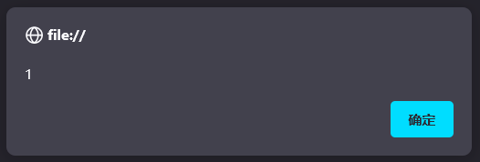
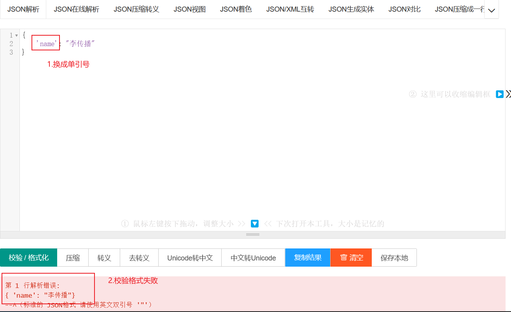
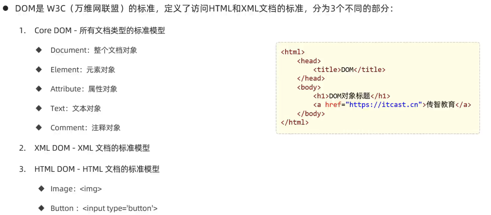
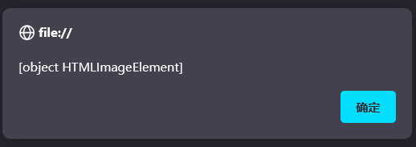
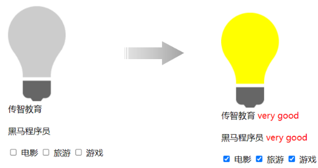
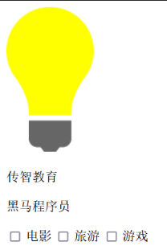
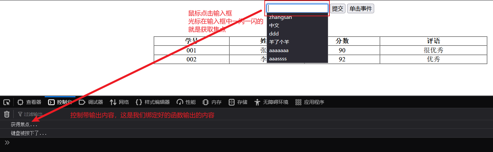
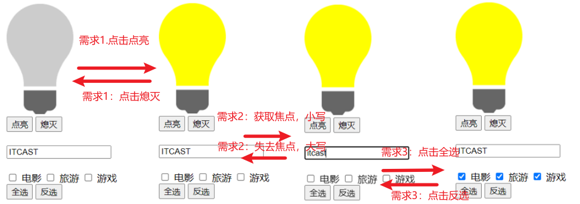
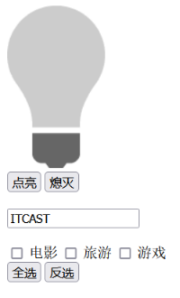

# 1 JavaScript

html完成了架子，css做了美化，但是网页是死的，我们需要给他注入灵魂，所以接下来我们需要学习JavaScript，这门语言会让我们的页面能够和用户进行交互。

## 1.1 介绍

通过**代码/js效果演示**提供资料进行效果演示，通过浏览器打开，我们点击主题5按钮，页面的主题发生了变化，所以js可以让我们的页面更加的智能，让页面和用户进行交互。

 

## 1.2 引入方式

同样，js代码也是书写在html中的，那么html中如何引入js代码呢？主要通过下面的2种引入方式：

==**第一种方式：**内部脚本，将JS代码定义在HTML页面中==

- JavaScript代码必须位于&lt;script&gt;&lt;/script&gt;标签之间
- 在HTML文档中，可以在任意地方，放置任意数量的&lt;script&gt;
- ==一般会把脚本置于&lt;body&gt;元素的底部，可改善显示速度==

例子：

~~~html

~~~

==**第二种方式：**外部脚本将， JS代码定义在外部 JS文件中，然后引入到 HTML页面中==

- ==外部JS文件中，只包含JS代码，不包含 &lt;script&gt;标签==
- ==引入外部js的&lt;script&gt;标签，必须是双标签==

例子：

~~~html

~~~

注意：demo.js中只有js代码，没有&lt;script&gt;标签

接下来，我们通过VS Code来编写代码，演示html中2种引入js的方式

第一步：在VS Code中创建名为 10.JS-引入方式.html 的文件

第二步：按照上述第一种内部脚本的方式引入js，编写如下代码：

~~~html
<!DOCTYPE html>
<html lang="en">
<head>
    <meta charset="UTF-8">
    <meta http-equiv="X-UA-Compatible" content="IE=edge">
    <meta name="viewport" content="width=device-width, initial-scale=1.0">
    <title>JS-引入方式</title>
    <!-- 内部脚本 -->
    
</head>
<body>
</body>
</html>
~~~

第三步：浏览器打开效果如图所示：

 

第四步：接下来演示外部脚本，注释掉内部脚本，然后在css目录同级创建js目录，然后创建一个名为demo.js的文件：

 

第五步：在demo.js中编写如下js内容：

~~~
alert('Hello JS2');
~~~

第六步：注释掉之前的内部脚本代码，添加&lt;script&gt;标签来引入外部demo.js文件,具体代码如下：

~~~html
<!DOCTYPE html>
<html lang="en">
<head>
    <meta charset="UTF-8">
    <meta http-equiv="X-UA-Compatible" content="IE=edge">
    <meta name="viewport" content="width=device-width, initial-scale=1.0">
    <title>JS-引入方式</title>
    <!-- 内部脚本 -->
    <!--  -->

    <!-- 外部脚本 -->
    
</head>
<body>

</body>
</html>
~~~

第七步：浏览器刷新效果如图：

 

## 1.3 基础语法

### 1.3.1 书写语法

掌握了js的引入方式，那么接下来我们需要学习js的书写了，首先需要掌握的是js的书写语法，语法规则如下：

- 区分大小写：与 Java 一样，变量名、函数名以及其他一切东西都是区分大小写的

- 每行结尾的分号可有可无

- 大括号表示代码块

- 注释：

  - 单行注释：// 注释内容

  - 多行注释：/* 注释内容 */

    

我们需要借助js中3钟输出语句，来演示书写语法

| api              | 描述             |
| ---------------- | ---------------- |
| window.alert()   | 警告框           |
| document.write() | 在HTML 输出内容  |
| console.log()    | 写入浏览器控制台 |

接下来我们选用通过VS Code，接触3种输入语句，来演示js的书写语法

第一步：在VS Code中创建名为 11.JS-基础语法-输出语句.html的文件

第二步：按照基本语法规则，编写3种输出语句的代码，并且添加注释，具体代码如下；

~~~html
<!DOCTYPE html>
<html lang="en">
<head>
    <meta charset="UTF-8">
    <meta http-equiv="X-UA-Compatible" content="IE=edge">
    <meta name="viewport" content="width=device-width, initial-scale=1.0">
    <title>JS-基本语法</title>
</head>
<body>
    
</body>

</html>
~~~

浏览器打开如图所示效果：

 

我们注释掉上述代码，添加代码 document.write("hello js"); 来输出内容：

~~~html
<!DOCTYPE html>
<html lang="en">
<head>
    <meta charset="UTF-8">
    <meta http-equiv="X-UA-Compatible" content="IE=edge">
    <meta name="viewport" content="width=device-width, initial-scale=1.0">
    <title>JS-基本语法</title>
</head>
<body>
    
</body>

</html>
~~~

刷新浏览器，效果如图所示：

 

最后我们使用console.log("hello js"); 写入到控制台，并且注释掉之前的代码：

~~~html
<!DOCTYPE html>
<html lang="en">
<head>
    <meta charset="UTF-8">
    <meta http-equiv="X-UA-Compatible" content="IE=edge">
    <meta name="viewport" content="width=device-width, initial-scale=1.0">
    <title>JS-基本语法</title>
</head>
<body>
    
</body>

</html>
~~~

浏览器f12抓包，去控制台页面，如图所示：

### 1.3.2 变量

书写语法会了，变量是一门编程语言比不可少的，所以接下来我们需要学习js中变量的声明，在js中，变量的声明和java中还是不同的。首先js中主要通过如下3个关键字来声明变量的：

| 关键字 | 解释                                                         |
| ------ | ------------------------------------------------------------ |
| var    | 早期ECMAScript5中用于变量声明的关键字                        |
| let    | ECMAScript6中新增的用于变量声明的关键字，相比较var，let只在代码块内生效 |
| const  | 声明常量的，常量一旦声明，不能修改                           |

在js中声明变量还需要注意如下几点：

- JavaScript 是一门弱类型语言，变量可以存放不同类型的值 。
- 变量名需要遵循如下规则：
  - 组成字符可以是任何字母、数字、下划线（_）或美元符号（$）
  - ==数字不能开头==
  - 建议使用驼峰命名

接下来我们需要通过VS Code编写代码来演示js中变量的定义

第一步：在VS Code中创建名为 12.JS-基础语法-变量.html的文件：

第二步：编写代码：

~~~html
<!DOCTYPE html>
<html lang="en">
<head>
    <meta charset="UTF-8">
    <meta http-equiv="X-UA-Compatible" content="IE=edge">
    <meta name="viewport" content="width=device-width, initial-scale=1.0">
    <title>JS-基础语法</title>
</head>
<body>
    
</body>

</html>
~~~

可以看到浏览器弹出张三

 

在js中，我们var声明的变量可以接受任何数据类型的值。==并且var声明的变量的作用于是全局的==，注释掉之前的代码，添加如下代码：

~~~html

~~~

浏览器照样成功弹出：

 

==而且var关键字声明的变量可以重复定义==，修改代码如下：

~~~js
{
     var x = 1;
     var x = "A";
}
alert(x);
    
~~~

浏览器弹出内容是A

 

所以在ECMAScript 6 新增了 **let**关键字来定义变量，它的用法类似于 var，但是所声明的变量，只在 let关键字所在的代码块内有效，且不允许重复声明。注释掉之前的代码，添加代码如下：

~~~html

~~~

浏览器打开，f12抓包，来到控制台页面，发现报错，变量没有定义，说明let声明的变量在代码块外不生效

接着我们使用let重复定义变量，代码修改如下：发现idea直接帮我们报错了，说明let声明的变量不能重复定义

 

在ECMAScript6中，还新增了const关键字用来声明常量，但是一旦声明，常量的值是无法更改的。注释之前的内容，添加如下代码：

~~~js
    const pi = 3.14;
    pi = 3.15;
    alert(pi);
~~~

浏览器f12抓包，来到控制台页面发现直接报错了，

 

关于变量的讲解我们就此结束，完整代码如下：

~~~html
<!DOCTYPE html>
<html lang="en">
<head>
    <meta charset="UTF-8">
    <meta http-equiv="X-UA-Compatible" content="IE=edge">
    <meta name="viewport" content="width=device-width, initial-scale=1.0">
    <title>JS-基础语法</title>
</head>
<body>
    
</body>

</html>
~~~

### 1.3.3 数据类型和运算符

虽然js是弱数据类型的语言，但是js中也存在数据类型，js中的数据类型分为 ：原始类型 和 引用类型，具体有如下类型

| 数据类型  | 描述                                               |
| --------- | -------------------------------------------------- |
| number    | 数字（整数、小数、NaN(Not a Number)）              |
| string    | 字符串，单双引皆可                                 |
| boolean   | 布尔。true，false                                  |
| null      | 对象为空                                           |
| undefined | 当声明的变量未初始化时，该变量的默认值是 undefined |

使用typeof函数可以返回变量的数据类型，接下来我们需要通过书写代码来演示js中的数据类型

第一步：在VS Code中创建名为13. JS-基础语法-数据类型.html的文件

第二步：编写如下代码，然后直接挨个观察数据类型：

~~~html
<!DOCTYPE html>
<html lang="en">
<head>
    <meta charset="UTF-8">
    <meta http-equiv="X-UA-Compatible" content="IE=edge">
    <meta name="viewport" content="width=device-width, initial-scale=1.0">
    <title>JS-数据类型</title>
</head>
<body>

</body>

</html>
~~~

熟悉了js的数据类型了，那么我们需要学习js中的运算法，js中的运算规则绝大多数还是和java中一致的，具体运算符如下：

| 运算规则   | 运算符                                                       |
| ---------- | ------------------------------------------------------------ |
| 算术运算符 | + , - , * , / , % , ++ , --                                  |
| 赋值运算符 | = , += , -= , *= , /= , %=                                   |
| 比较运算符 | &gt; , < , >= , <= , != , == , \===   注意  ==== 会进行类型转换，\=\== 不会进行类型转换== |
| 逻辑运算符 | && , \|\| , !                                                |
| 三元运算符 | 条件表达式 ? true_value: false_value                         |

接下来我们通过代码来演示js中的运算法，主要记忆js中和java中不一致的地方

第一步：在VS Code中创建名为14. JS-基础语法-运算符.html的文件

第二步：编写代码

在js中，绝大多数的运算规则和java中是保持一致的，但是js中的\==和===是有区别的。

- \==：只比较值是否相等，不区分数据类型，哪怕类型不一致，==也会自动转换类型进行值得比较
- ===：不光比较值，还要比较类型，如果类型不一致，直接返回false

~~~html
<!DOCTYPE html>
<html lang="en">
<head>
    <meta charset="UTF-8">
    <meta http-equiv="X-UA-Compatible" content="IE=edge">
    <meta name="viewport" content="width=device-width, initial-scale=1.0">
    <title>JS-运算符</title>
</head>
<body>
    
</body>

</html>
~~~

在js中，虽然不区分数据类型，但是有时候涉及到数值计算，还是需要进行类型转换的，==js中可以通过parseInt()函数来进行将其他类型转换成数值类型==。注释之前的代码，添加代码如下：

~~~js
// 类型转换 - 其他类型转为数字
alert(parseInt("12")); //12
alert(parseInt("12A45")); //12 A45被忽略
alert(parseInt("A45"));//NaN (not a number)
~~~

除此之外，在js中，还有非常重要的一点是：==0,null,undefined,"",NaN 理解成false,反之理解成true==。注释掉之前的代码，添加如下代码：

~~~js
 if(0){ //false
    alert("0 转换为false");
 }
~~~

浏览器刷新页面，发现没有任何弹框，因为0理解成false，所以条件不成立。注释掉上述代码，添加如下代码：

~~~js
if(1){ //true
    alert("除0和NaN其他数字都转为 true");
}
~~~

浏览器刷新，因为1理解成true，条件成立，所以浏览器效果如下；

 

其他情况可以一一演示，完整演示代码如下：

~~~js
    // if(0){ //false
    //     alert("0 转换为false");
    // }
    // if(NaN){//false
    //     alert("NaN 转换为false");
    // }
    if(1){ //true
        alert("除0和NaN其他数字都转为 true");
    }

    // if(""){ //false
    //     alert("空字符串为 false, 其他都是true");
    // }
        
    // if(null){ //false
    //     alert("null 转化为false");
    // }
    // if(undefined){ //false
    //     alert("undefined 转化为false");
    // }
~~~

流程控制语句if，switch，for等和java保持一致，此处不再演示

==**需要注意的是：**在js中，0, null, undefined, `""`, NaN 理解成false, 反之理解成true==

## 1.4 函数

在java中我们为了提高代码的复用性，可以使用方法。同样，在JavaScript中可以使用函数来完成相同的事情。JavaScript中的函数被设计为执行特定任务的代码块，通过关键字function来定义。接下来我们学习一下JavaScript中定义函数的2种语法

### 1.4.1 第一种定义格式

第一种定义格式如下：

~~~js
function 函数名(参数1,参数2..){
    要执行的代码
}
~~~

因为JavaScript是弱数据类型的语言，所以有如下几点需要注意：

- 形式参数不需要声明类型，并且JavaScript中不管什么类型都是let或者var去声明，加上也没有意义。
- 返回值也不需要声明类型，直接return即可

如下示例：

~~~js
function add(a, b){
    return a + b;
}
~~~

接下来我们需要在VS Code中编写代码来演示

第一步：新建名为js的文件夹，创建名为01. JS-函数的html文件，然后在&lt;script&gt;中定义上述示例的函数：

~~~html

~~~

但是上述只是定义函数，**函数需要被调用才能执行！**所以接下来我们需要调用函数

第二步：因为定义的add函数有返回值，所以我们可以接受返回值，并且输出到浏览器上，添加如下代码：

~~~js
let result = add(10,20);
alert(result);
~~~

查看浏览器运行结果：浏览器弹框内容如下图所示：

 

### 1.4.2 第二种定义格式

第二种可以通过var去定义函数的名字，具体格式如下：

~~~js
var functionName = function (参数1,参数2..){   
	//要执行的代码
}
~~~

接下来我们按照上述的格式，修改代码如下：只需要将第一种定义方式注释掉，替换成第二种定义方式即可，函数的调用不变

~~~html

~~~

浏览器弹框效果和上述一致

 

我们在调用add函数时，再添加2个参数，修改代码如下：

~~~js
var result = add(10,20,30,40);
~~~

浏览器打开，发现没有错误，并且依然弹出30，这是为什么呢？

==因为在JavaScript中，函数的调用只需要名称正确即可，参数列表不管的。如上述案例，10传递给了变量a，20传递给了变量b,而30和40没有变量接受，但是不影响函数的正常调用。==

## 1.5 JavaScript对象

JavaScript中的对象有很多，主要可以分为如下3大类，我们可以打开[W3school在线学习文档](https://www.w3school.com.cn/)，来到首页，在左侧栏找到浏览器脚本下的JavaScript，如下图所示：

然后进入到如下界面，点击右侧的参考书

 

然后进入到如下页面，此页面列举出了JavaScript中的所有对象

可以大体分页3大类：

第一类：基本对象,我们主要学习Array和JSON和String

 

第二类：BOM对象,主要是和浏览器相关的几个对象

 

第三类：DOM对象，JavaScript中将html的每一个标签都封装成一个对象

 

我们先来学习基本对象种的Array对象

### 1.5.1 基本对象

#### 1.5.1.1 Array对象

##### 语法格式

Array对象时用来定义数组的。常用语法格式有如下2种：

==方式1：==

~~~js
var 变量名 = new Array(元素列表); 
~~~

例如：

~~~js
var arr = new Array(1,2,3,4); //1,2,3,4 是存储在数组中的数据（元素）
~~~

==方式2：==

~~~js
var 变量名 = [ 元素列表 ]; 
~~~

例如：

~~~js
var arr = [1,2,3,4]; //1,2,3,4 是存储在数组中的数据（元素）
~~~

数组定义好了，那么我们该如何获取数组中的值呢？和java中一样，需要通过索引来获取数组中的值。语法如下：

~~~js
arr[索引] = 值;
~~~

接下来，我们在VS Code中创建名为02. JS-对象-Array.html的文件，按照上述的语法定义数组，并且通过索引来获取数组中的值。

~~~html

~~~

浏览器控制台观察的效果如下：输出1和2

 

##### 特点

==与java中不一样的是，JavaScript中数组相当于java中的集合，数组的长度是可以变化的。而且JavaScript是弱数据类型的语言，所以数组中可以存储任意数据类型的值。==接下来我们通过代码来演示上述特点。

注释掉之前的代码，添加如下代码：

~~~js
//特点: 长度可变 类型可变
var arr = [1,2,3,4];
arr[10] = 50;

console.log(arr[10]);
console.log(arr[9]);
console.log(arr[8]);
~~~

上述代码定义的arr变量中，数组的长度是4，但是我们直接再索引10的位置直接添加了数据10，并且输出索引为10的位置的元素，浏览器控制台数据结果如下：

 

因为索引8和9的位置没有值，所以输出内容undefined,当然，我们也可以给数组添加其他类型的值，添加代码如下：注释掉之前控制台输出的代码

~~~js
//特点: 长度可变 类型可变
var arr = [1,2,3,4];
arr[10] = 50;

// console.log(arr[10]);
// console.log(arr[9]);
// console.log(arr[8]);

arr[9] = "A";
arr[8] = true;

console.log(arr);
~~~

浏览器控制台输出结果如下：

 

##### 属性和方法

Array作为一个对象，那么对象是有属性和方法的，所以接下来我们介绍一下Array对象的属性和方法

官方文档中提供了Array的很多属性和方法，但是我们只学习常用的属性和方法，如下图所示：

属性：

| 属性   | 描述                         |
| :----- | :--------------------------- |
| length | 设置或返回数组中元素的数量。 |

方法：

| 方法方法  | 描述                                             |
| :-------- | :----------------------------------------------- |
| forEach() | 遍历数组中的每个有值得元素，并调用一次传入的函数 |
| push()    | 将新元素添加到数组的末尾，并返回新的长度         |
| splice()  | 从数组中删除元素                                 |

- length属性：

  ==length属性可以用来获取数组的长度==，所以我们可以借助这个属性，来遍历数组中的元素，添加如下代码：

  ~~~js
  var arr = [1,2,3,4];
  arr[10] = 50;
  	for (let i = 0; i < arr.length; i++) {
  	console.log(arr[i]);
  }
  ~~~

  浏览器控制台输出结果如图所示：

   

- forEach()函数

  首先我们学习forEach()方法，顾名思义，这是用来遍历的，那么遍历做什么事呢？所以这个方法的参数，需要传递一个函数，而且这个函数接受一个参数，就是遍历时数组的值。修改之前的遍历代码如下：

  ~~~js
  //e是形参，接受的是数组遍历时的值
  arr.forEach(function(e){
       console.log(e);
  })
  ~~~

  当然了，在ES6中，引入箭头函数的写法，语法类似java中lambda表达式，修改上述代码如下：

  ~~~js
  arr.forEach((e) => {
       console.log(e);
  }) 
  ~~~

  浏览器输出结果如下：==注意的是，没有元素的内容是不会输出的，因为forEach只会遍历有值的元素== 

    

- push()函数

  ==push()函数是用于向数组的末尾添加元素的==，其中函数的参数就是需要添加的元素，编写如下代码：向数组的末尾添加3个元素

  ~~~js
  //push: 添加元素到数组末尾
  arr.push(7,8,9);
  console.log(arr);
  ~~~

  浏览器输出结果如下：

   

  

- splice()函数

  splice()函数用来删除数组中的元素，函数中填入2个参数。

  参数1：表示从哪个索引位置删除

  参数2：表示删除元素的个数

  如下代码表示：从索引2的位置开始删，删除2个元素

  ~~~js
  //splice: 删除元素
  arr.splice(2,2);
  console.log(arr);
  ~~~

  浏览器执行效果如下：元素3和4被删除了，元素3是索引2

   

Array数组的完整代码如下：

~~~html
<!DOCTYPE html>
<html lang="en">
<head>
    <meta charset="UTF-8">
    <meta http-equiv="X-UA-Compatible" content="IE=edge">
    <meta name="viewport" content="width=device-width, initial-scale=1.0">
    <title>JS-对象-Array</title>
</head>
<body>
    
</body>

</html>
~~~

#### 1.5.1.2 String对象

##### 语法格式

String对象的创建方式有2种：

==方式1：==

~~~js
var 变量名 = new String("…") ; //方式一
~~~

例如：

~~~js
var str = new String("Hello String");
~~~

==方式2：==

~~~js
var 变量名 = "…" ; //方式二
~~~

例如：

~~~js
var str = 'Hello String';
~~~

按照上述的格式，在VS Code中创建为名03. JS-对象-String.html的文件，编写代码如下：

~~~html

~~~

浏览器控制台输出结果如下：

 

##### 属性和方法

String对象也提供了一些常用的属性和方法，如下表格所示：

属性：

| 属性   | 描述           |
| ------ | -------------- |
| length | 字符串的长度。 |

方法：

| 方法        | 描述                                     |
| ----------- | ---------------------------------------- |
| charAt()    | 返回在指定位置的字符。                   |
| indexOf()   | 检索字符串。                             |
| trim()      | 去除字符串两边的空格                     |
| substring() | 提取字符串中两个指定的索引号之间的字符。 |

- length属性：

  ==length属性可以用于返回字符串的长度==，添加如下代码：

  ~~~js
  //length
  console.log(str.length);
  ~~~

- charAt()函数：

  ==charAt()函数用于返回在指定索引位置的字符==，函数的参数就是索引。添加如下代码：

  ~~~js
  console.log(str.charAt(4));
  ~~~

- indexOf()函数

  ==indexOf()函数用于检索指定内容在字符串中的索引位置的，返回值是索引，参数是指定的内容==。添加如下代码：

  ~~~js
  console.log(str.indexOf("lo"));
  ~~~

- trim()函数

  ==trim()函数用于去除字符串两边的空格的==。添加如下代码：

  ~~~js
  var s = str.trim();
  console.log(s.length);
  ~~~

- substring()函数

  ==substring()函数用于截取字符串的==，函数有2个参数。

  参数1：表示从那个索引位置开始截取。包含

  参数2：表示到那个索引位置结束。不包含

  ~~~js
  console.log(s.substring(0,5));
  ~~~

整体代码如下：

~~~html
<!DOCTYPE html>
<html lang="en">
<head>
    <meta charset="UTF-8">
    <meta http-equiv="X-UA-Compatible" content="IE=edge">
    <meta name="viewport" content="width=device-width, initial-scale=1.0">
    <title>JS-对象-String</title>
</head>
<body>
    
</body>

</html>
~~~

浏览器执行效果如图所示：

 

#### 1.5.1.3 JSON对象

##### 自定义对象

在 JavaScript 中自定义对象特别简单，其语法格式如下：

~~~js
var 对象名 = {
    属性名1: 属性值1, 
    属性名2: 属性值2,
    属性名3: 属性值3,
    函数名称: function(形参列表){}
};

~~~

我们可以通过如下语法调用属性：

~~~js
对象名.属性名
~~~

通过如下语法调用函数：

~~~js
对象名.函数名()
~~~

接下来，我们再VS Code中创建名为04. JS-对象-JSON.html的文件演示自定义对象

~~~html

</html>
~~~

### 1.5.2 BOM对象

接下来我们学习BOM对象，BOM的全称是Browser Object Model,翻译过来是浏览器对象模型。也就是JavaScript将浏览器的各个组成部分封装成了对象。我们要操作浏览器的部分功能，可以通过操作BOM对象的相关属性或者函数来完成。例如：我们想要将浏览器的地址改为`http://www.baidu.com`,我们就可以通过BOM中提供的location对象的href属性来完成，代码如下：`location.href='http://www.baidu.com'`

BOM中提供了如下5个对象：

| 对象名称  | 描述           |
| :-------- | :------------- |
| Window    | 浏览器窗口对象 |
| Navigator | 浏览器对象     |
| Screen    | 屏幕对象       |
| History   | 历史记录对象   |
| Location  | d地址栏对象    |

上述5个对象与浏览器各组成对应的关系如下图所示：

 

对于上述5个对象，我们重点学习的是Window对象、Location对象这2个。

#### 1.5.2.1 Window对象

window对象指的是浏览器窗口对象，是JavaScript的全部对象，所以对于window对象，我们可以直接使用，并且对于window对象的方法和属性，我们可以省略window.例如：我们之前学习的alert()函数其实是属于window对象的,其完整的代码如下：

~~~
window.alert('hello');
~~~

其可以省略window.  所以可以简写成

~~~
alert('hello')
~~~

所以对于window对象的属性和方法，我们都是采用简写的方式。window提供了很多属性和方法，下表列出了常用属性和方法

window对象提供了获取其他BOM对象的属性：

| 属性      | 描述                  |
| --------- | --------------------- |
| history   | 用于获取history对象   |
| location  | 用于获取location对象  |
| Navigator | 用于获取Navigator对象 |
| Screen    | 用于获取Screen对象    |

也就是说我们要使用location对象，只需要通过代码`window.location`或者简写`location`即可使用

window也提供了一些常用的函数，如下表格所示：

| 函数          | 描述                                               |
| ------------- | -------------------------------------------------- |
| alert()       | 显示带有一段消息和一个确认按钮的警告框。           |
| comfirm()     | 显示带有一段消息以及确认按钮和取消按钮的对话框。   |
| setInterval() | 按照指定的周期（以毫秒计）来调用函数或计算表达式。 |
| setTimeout()  | 在指定的毫秒数后调用函数或计算表达式。             |

接下来，我们通过VS Code中创建名为05. JS-对象-BOM.html文件来编写代码来演示上述函数：

- ==alert()函数：弹出警告框，函数的内容就是警告框的内容==

  ~~~html
  
  ~~~

  浏览器打开，依次弹框，此处只截图一张

   

  

- ==confirm()函数：弹出确认框，并且提供用户2个按钮，分别是确认和取消。==

  添加如下代码：

  ~~~js
  confirm("您确认删除该记录吗?");
  ~~~

  浏览器打开效果如图所示：

   

  但是我们怎么知道用户点击了确认还是取消呢？==所以这个函数有一个返回值，当用户点击确认时，返回true，点击取消时，返回false。==我们根据返回值来决定是否执行后续操作。修改代码如下：再次运行，可以查看返回值true或者false

  ~~~js
  var flag = confirm("您确认删除该记录吗?");
  alert(flag);
  ~~~

- ==setInterval (fn, 毫秒值)：定时器，用于周期性的执行某个功能，并且是**循环执行**。==该函数需要传递2个参数：

  fn:函数，需要周期性执行的功能代码

  毫秒值：间隔时间

  注释掉之前的代码，添加代码如下：

  ~~~js
  //定时器 - setInterval -- 周期性的执行某一个函数
  var i = 0;
  setInterval(function(){
       i++;
       console.log("定时器执行了"+i+"次");
  },2000);
  ~~~

  刷新页面，浏览器每个一段时间都会在控制台输出，结果如下：

   

- ==setTimeout (fn, 毫秒值) ：定时器，只会在一段时间后**执行一次功能**。==参数和上述setInterval一致

  注释掉之前的代码，添加代码如下：

  ~~~js
  //定时器 - setTimeout -- 延迟指定时间执行一次 
  setTimeout(function(){
  	alert("JS");
  },3000);
  ~~~

  浏览器打开，3s后弹框，关闭弹框，发现再也不会弹框了。

#### 1.5.2.2 Location对象

location是指代浏览器的地址栏对象，对于这个对象，我们常用的是href属性，用于获取或者设置浏览器的地址信息，添加如下代码：

~~~js
//获取浏览器地址栏信息
alert(location.href);
//设置浏览器地址栏信息
location.href = "https://www.itcast.cn";
~~~

浏览器效果如下：首先弹框展示浏览器地址栏信息，

 

然后点击确定后，运行到 `location.href = "https://www.itcast.cn"; ` 因为我们设置了地址栏信息，所以浏览器跳转到传智首页

完整代码如下：

~~~html
<!DOCTYPE html>
<html lang="en">
<head>
    <meta charset="UTF-8">
    <meta http-equiv="X-UA-Compatible" content="IE=edge">
    <meta name="viewport" content="width=device-width, initial-scale=1.0">
    <title>JS-对象-BOM</title>
</head>
<body>
    
</body>

</html>
~~~

### 1.5.3 DOM对象

#### 1.5.3.1 DOM介绍

DOM：Document Object Model 文档对象模型。也就是 JavaScript 将 HTML 文档的各个组成部分封装为对象。

DOM 其实我们并不陌生，之前在学习 XML 就接触过，只不过 XML 文档中的标签需要我们写代码解析，而 HTML 文档是浏览器解析。封装的对象分为

- Document：整个文档对象
- Element：元素对象
- Attribute：属性对象
- Text：文本对象
- Comment：注释对象

如下图，左边是 HTML 文档内容，右边是 DOM 树

 

那么我们学习DOM技术有什么用呢？主要作用如下：

- 改变 HTML 元素的内容
- 改变 HTML 元素的样式（CSS）
- 对 HTML DOM 事件作出反应
- 添加和删除 HTML 元素

总而达到动态改变页面效果目的，具体我们可以查看代码中提供的06. JS-对象-DOM-演示.html来体会DOM的效果。

#### 1.5.3.2 获取DOM对象

我们知道DOM的作用是通过修改HTML元素的内容和样式等来实现页面的各种动态效果，但是我们要操作DOM对象的前提是先获取元素对象，然后才能操作。所以学习DOM,主要的核心就是学习如下2点：

- 如何**获取**DOM中的元素对象（Element对象 ，也就是标签）
- 如何**操作**Element对象的属性,也就是标签的属性。

接下来我们先来学习如何获取DOM中的元素对象。

HTML中的Element对象可以通过Document对象获取，而Document对象是通过window对象获取的。document对象提供的用于获取Element元素对象的api如下表所示：

| 函数                              | 描述                                     |
| --------------------------------- | ---------------------------------------- |
| document.getElementById()         | 根据id属性值获取，返回单个Element对象    |
| document.getElementsByTagName()   | 根据标签名称获取，返回Element对象数组    |
| document.getElementsByName()      | 根据name属性值获取，返回Element对象数组  |
| document.getElementsByClassName() | 根据class属性值获取，返回Element对象数组 |

接下来我们通过VS Code中创建名为07. JS-对象-DOM-获取元素.html的文件来演示上述api，首先在准备如下页面代码：

~~~html
<!DOCTYPE html>
<html lang="en">
<head>
    <meta charset="UTF-8">
    <meta http-equiv="X-UA-Compatible" content="IE=edge">
    <meta name="viewport" content="width=device-width, initial-scale=1.0">
    <title>JS-对象-DOM</title>
</head>

<body>
        

    
传智教育
    
    
黑马程序员
   

    <input type="checkbox" name="hobby"> 电影
    <input type="checkbox" name="hobby"> 旅游
    <input type="checkbox" name="hobby"> 游戏
</body>

</html>
~~~

- ==document.getElementById()： 根据标签的id属性获取标签对象，id是唯一的，所以获取到是单个标签对象。==

  添加如下代码：

  ~~~html
  
  ~~~

  浏览器打开，效果如图所示：从弹出的结果能够看出，这是一个图片标签对象

   

  

- ==document.getElementsByTagName() :  根据标签的名字获取标签对象，同名的标签有很多，所以返回值是数组。==

  添加如下代码:

  ~~~js
  //1.2 获取元素-根据标签获取 - div
  var divs = document.getElementsByTagName('div');
  for (let i = 0; i < divs.length; i++) {
       alert(divs[i]);
  }
  ~~~

  浏览器输出2次如下所示的弹框

   

  

- ==document.getElementsByName() ：根据标签的name的属性值获取标签对象，name属性值可以重复，所以返回值是一个数组。==

  添加如下代码：

  ~~~js
  //1.3 获取元素-根据name属性获取
  var ins = document.getElementsByName('hobby');
  for (let i = 0; i < ins.length; i++) {
      alert(ins[i]);
  }
  ~~~

  浏览器会有3次如下图所示的弹框：

    

  

- ==document.getElementsByClassName() : 根据标签的class属性值获取标签对象，class属性值也可以重复，返回值是数组。==

  添加如下图所示的代码：

  ~~~js
  //1.4 获取元素-根据class属性获取
  var divs = document.getElementsByClassName('cls');
  for (let i = 0; i < divs.length; i++) {
       alert(divs[i]);
  }
  ~~~

  浏览器会弹框2次，都是div标签对象

   

  

- 操作属性

  那么获取到标签了，我们如何操作标签的属性呢？通过查询文档资料，如下图所示：

   

  得出我们可以通过div标签对象的innerHTML属性来修改标签的内容。此时我们想把页面中的**传智教育替换成传智教育666**，所以要获取2个div中的第一个，所以可以通过下标0获取数组中的第一个div，注释之前的代码，编写如下代码：

  ~~~js
  var divs = document.getElementsByClassName('cls');
  var div1 = divs[0];
  
  div1.innerHTML = "传智教育666";
  ~~~

  浏览器刷新页面，展示效果如下图所示：

   

  发现页面内容变成了传智教育666

完整代码如下：

~~~html
<!DOCTYPE html>
<html lang="en">
<head>
    <meta charset="UTF-8">
    <meta http-equiv="X-UA-Compatible" content="IE=edge">
    <meta name="viewport" content="width=device-width, initial-scale=1.0">
    <title>JS-对象-DOM</title>
</head>

<body>
        

    
传智教育
    
    
黑马程序员
   

    <input type="checkbox" name="hobby"> 电影
    <input type="checkbox" name="hobby"> 旅游
    <input type="checkbox" name="hobby"> 游戏
</body>

</html>
~~~

### 1.5.4 案例

#### 1.5.4.1 需求说明

鲁迅说的好，光说不练假把式,光练不说傻把式。所以接下来我们需要通过案例来加强对于上述DOM知识的掌握。需求如下3个：

- 点亮灯泡
- 将所有的div标签的标签体内容后面加上：very good
- 使所有的复选框呈现被选中的状态

效果如下所示：

 

#### 1.5.4.2 资料准备

在JS目录下，也就是用于存放html文件的同级创建img文件下，然后将`资料/图片素材`中提供的2张图片拷贝到img文件夹中，最终整体结果如下图所示：

 

在VS Code中创建名为08. JS-对象-DOM-案例.html的文件，然后准备如下代码：

~~~html
<!DOCTYPE html>
<html lang="en">
<head>
    <meta charset="UTF-8">
    <meta http-equiv="X-UA-Compatible" content="IE=edge">
    <meta name="viewport" content="width=device-width, initial-scale=1.0">
    <title>JS-对象-DOM-案例</title>
</head>

<body>
        

    
传智教育
    
    
黑马程序员
   

    <input type="checkbox" name="hobby"> 电影
    <input type="checkbox" name="hobby"> 旅游
    <input type="checkbox" name="hobby"> 游戏
</body>

</html>
~~~

浏览器打开此时效果如图所示：

 

#### 1.5.4.3 需求1

- 需求

  点亮灯泡

- 分析

  此时我们需要把灯泡点亮，其实就是换一张图片。那么我们需要切换图片，就需要操作图片的src属性。要操作图片的src属性，就需要先来获取img标签对象。

- 步骤

  - 首先获取img标签对象
  - 然后修改img标签对象的src属性值，进行图片的切换

- 代码实现

  ~~~js
  //1. 点亮灯泡 : src 属性值
  //首先获取img标签对象
  var img = document.getElementById('h1');
  //然后修改img标签对象的src属性值，进行图片的切换
  img.src = "img/on.gif";
  ~~~

浏览器打开，效果如图所示：

 

#### 1.5.4.4 需求2

- 需求

  将所有的div标签的标签体内容后面加上：very good  

  并且very good是红色字体

- 分析

  我们需要在原有内容后面追加红色的very good.所以我们首先需要获取原有内容，然后再进行内容的追加。但是如何保证very good是红色的呢？所以我们可以通过之前html中学过的&lt;font&gt;标签和属性来完整。如何进行内容的替换呢？之前我们学习过innerHTML属性。需要替换2个div的内容，所以我们需要获取2个div，并且遍历进行替换。

- 步骤

  - 通过标签的名字div获取所有的div标签
  - 遍历所有的div标签
  - 获取div标签的原有内容，然后追加&lt;font color='red'&gt;very good&lt;/font&gt;,并且替原内容 

- 代码实现

  ~~~js
  //2. 将所有div标签的内容后面加上: very good (红色字体) -- 
  var divs = document.getElementsByTagName('div');
  for (let i = 0; i < divs.length; i++) {
      const div = divs[i];
      div.innerHTML += "very good"; 
  }
  ~~~

浏览器打开效果如图所示：

 

#### 1.5.4.5 需求3

- 需求

  使所有的复选框呈现被选中的状态

- 分析

  要让复选框处于选中状态，那么什么属性或者方法可以使复选框选中？可以查询资料得出checkbox标签对象的checked属性设置为true，可以改变checkbox为选中状态。那么需要设置所有的checkbox，那么我们需要获取所有的checkbox并且遍历

- 步骤

  - 可以通过name属性值获取所有的checkbox标签
  - 遍历所有的checkbox标签，
  - 设置每个checkbox标签的

- 代码实现

  ~~~js
  // //3. 使所有的复选框呈现选中状态
  var ins = document.getElementsByName('hobby');
  for (let i = 0; i < ins.length; i++) {
  const check = ins[i];
  check.checked = true;//选中
  }
  ~~~

浏览器刷新，效果如图所示:

 

#### 1.5.4.6 完整代码

~~~html
<!DOCTYPE html>
<html lang="en">
<head>
    <meta charset="UTF-8">
    <meta http-equiv="X-UA-Compatible" content="IE=edge">
    <meta name="viewport" content="width=device-width, initial-scale=1.0">
    <title>JS-对象-DOM-案例</title>
</head>

<body>
        

    
传智教育
    
    
黑马程序员
   

    <input type="checkbox" name="hobby"> 电影
    <input type="checkbox" name="hobby"> 旅游
    <input type="checkbox" name="hobby"> 游戏
</body>

</html>
~~~

## 1.6 JavaScript事件

### 1.6.1 事件介绍

如下图所示的百度注册页面，当我们用户输入完内容，百度可以自动的提示我们用户名已经存在还是可以使用。那么百度是怎么知道我们用户名输入完了呢？这就需要用到JavaScript中的事件了。

 

什么是事件呢？HTML事件是发生在HTML元素上的 “事情”，例如：

- 按钮被点击
- 鼠标移到元素上
- 输入框失去焦点
- ........

而我们可以给这些事件绑定函数，当事件触发时，可以自动的完成对应的功能。这就是事件监听。例如：对于我们所说的百度注册页面，我们给用户名输入框的失去焦点事件绑定函数，当我们用户输入完内容，在标签外点击了鼠标，对于用户名输入框来说，失去焦点，然后执行绑定的函数，函数进行用户名内容的校验等操作。JavaScript事件是js非常重要的一部分，接下来我们进行事件的学习。那么我们对于JavaScript事件需要学习哪些内容呢？我们得知道有哪些常用事件，然后我们得学会如何给事件绑定函数。所以主要围绕2点来学习：

- 事件绑定
- 常用事件

### 1.6.2 事件绑定 

JavaScript对于事件的绑定提供了2种方式：

- ==方式1：通过html标签中的事件属性进行绑定==

  例如一个按钮，我们对于按钮可以绑定单机事件，可以借助标签的onclick属性，属性值指向一个函数。

  在VS Code中创建名为09. JS-事件-事件绑定.html，添加如下代码：

  ~~~html
  <input type="button" id="btn1" value="事件绑定1" onclick="on()">
  ~~~

  很明显没有on函数，所以我们需要创建该函数，代码如下：

  ~~~html
  
  ~~~

  浏览器打开，然后点击按钮，弹框如下：

   

  

- ==方式2：通过DOM中Element元素的事件属性进行绑定==

  依据我们学习过得DOM的知识点，我们知道html中的标签被加载成element对象，所以我们也可以通过element对象的属性来操作标签的属性。此时我们再次添加一个按钮，代码如下：

  ~~~html
  <input type="button" id="btn2" value="事件绑定2">
  ~~~

  我们可以先通过id属性获取按钮对象，然后操作对象的onclick属性来绑定事件，代码如下：

  ~~~js
  document.getElementById('btn2').onclick = function(){
      alert("按钮2被点击了...");
  }
  ~~~

  浏览器刷新页面，点击第二个按钮，弹框如下：

   

  

  ==**需要注意的是：事件绑定的函数，只有在事件被触发时，函数才会被调用。**==

  

  整体代码如下：

  ~~~html
  <!DOCTYPE html>
  <html lang="en">
  <head>
      <meta charset="UTF-8">
      <meta http-equiv="X-UA-Compatible" content="IE=edge">
      <meta name="viewport" content="width=device-width, initial-scale=1.0">
      <title>JS-事件-事件绑定</title>
  </head>
  
  <body>
      <input type="button" id="btn1" value="事件绑定1" onclick="on()">
      <input type="button" id="btn2" value="事件绑定2">
  </body>
  
  
  </html>
  ~~~

  

  

### 1.6.3 常见事件

上面案例中使用到了 `onclick` 事件属性，那都有哪些事件属性供我们使用呢？下面就给大家列举一些比较常用的事件属性

| 事件属性名  | 说明                     |
| ----------- | ------------------------ |
| onclick     | 鼠标单击事件             |
| onblur      | 元素失去焦点             |
| onfocus     | 元素获得焦点             |
| onload      | 某个页面或图像被完成加载 |
| onsubmit    | 当表单提交时触发该事件   |
| onmouseover | 鼠标被移到某元素之上     |
| onmouseout  | 鼠标从某元素移开         |

在代码中提供了10. JS-事件-常见事件.html的文件，我们可以通过浏览器打开来观察几个常用事件的具体效果：

- ==onfocus:获取焦点事件，鼠标点击输入框，输入框中光标一闪一闪的，就是输入框获取焦点了==

   

  

- ==onblur:失去焦点事件，前提是输入框获取焦点的状态下，在输入框之外的地方点击，光标从输入框中消失了，这就是失去焦点。==

   

其他事件的效果，同学们可以通过提供好的代码去演示，亲身体会事件在什么时候触发。

### 1.6.4 案例

#### 1.6.4.1 需求说明

接下来我们通过案例来加强所学js知识点的掌握。

需求如下3个：

1. 点击 “点亮”按钮 点亮灯泡，点击“熄灭”按钮 熄灭灯泡
2. 输入框鼠标聚焦后，展示小写；鼠标离焦后，展示大写。
3. 点击 “全选”按钮使所有的复选框呈现被选中的状态，点击 “反选”按钮使所有的复选框呈现取消勾选的状态。

效果如图所示：

 

 

#### 1.6.4.2 资料准备

在VS  Code中创建名为11. JS-事件-案例.html的文件，提前准备如下代码：

~~~html
<!DOCTYPE html>
<html lang="en">
<head>
    <meta charset="UTF-8">
    <meta http-equiv="X-UA-Compatible" content="IE=edge">
    <meta name="viewport" content="width=device-width, initial-scale=1.0">
    <title>JS-事件-案例</title>
</head>
<body>

      

    <input type="button" value="点亮" > 
    <input type="button"  value="熄灭" >

       

    <input type="text" id="name" value="ITCAST" >
       

    <input type="checkbox" name="hobby"> 电影
    <input type="checkbox" name="hobby"> 旅游
    <input type="checkbox" name="hobby"> 游戏
     

    <input type="button" value="全选" > 
    <input type="button" value="反选" >

</body>

</html>
~~~

浏览器打开如图所示：

 

#### 1.6.4.3 需求1

- 需求：

  点击 “点亮”按钮 点亮灯泡，点击“熄灭”按钮 熄灭灯泡

- 分析：

  点击按钮的时候触发，所以我们需要绑定单击事件。不管是点亮还是熄灭，都是图片的变化，所以我们需要修改图片。但是修改图片我们还需要先获取标签图片标签对象。

- 步骤：

  - 首先给点亮按钮和熄灭按钮都绑定单击事件。分别绑定函数on()和off（）
  - 然后在js中定义on()和off()函数
  - on()函数中，通过id获取img标签对象，然后通过img标签对象的src属性切换点亮的图片
  - off()函数中，通过id获取img标签对象，然后通过img标签对象的src属性切换熄灭的图片

- 代码实现：

  事件绑定

  ~~~html
  <input type="button" value="点亮" onclick="on()"> 
  <input type="button"  value="熄灭" onclick="off()">
  ~~~

  on()和off()函数

  ~~~js
  //1. 点击 "点亮" 按钮, 点亮灯泡; 点击 "熄灭" 按钮, 熄灭灯泡; -- onclick
  function on(){
      //a. 获取img元素对象
      var img = document.getElementById("light");
      //b. 设置src属性
      img.src = "img/on.gif";
  }
  
  function off(){
      //a. 获取img元素对象
      var img = document.getElementById("light");
      //b. 设置src属性
      img.src = "img/off.gif";
  }
  ~~~

  

#### 1.6.4.4 需求2

- 需求：

  输入框鼠标聚焦后，展示小写；鼠标离焦后，展示大写。

- 分析：

  聚焦和失焦的时候完成功能，所以我们需要给input标签绑定onfocus和onblur事件；我们要切换大小写，那么我们可定要获取原本输入框的内容，通过查询资料，需要使用input标签对象的value属性，然后进行大小写切换；切换完成我们需要重新填入，所以还是通过value属性来设置input标签输入框的内容

- 步骤:

  - 给input标签的onfocus和onblur事件分别绑定lower()和upper()函数
  - 然后在js中定义lower()和upper()函数
  - 对于lower()函数，先通过id获取输入框对象，然后通过输入框的value属性来设置内容，内容的话可以通过字符串的toLowerCase()函数来进行小写转换
  - 对于upper()函数，先通过id获取输入框对象，然后通过输入框的value属性来设置内容，内容的话可以通过字符串的toupperCase()函数来进行大写转换

- 代码实现：、

  事件绑定：

  ~~~html
  <input type="text" id="name" value="ITCAST" onfocus="lower()" onblur="upper()">
  ~~~

  lower()和upper()函数

  ~~~js
  //2. 输入框聚焦后, 展示小写; 输入框离焦后, 展示大写; -- onfocus , onblur
  function lower(){//小写
      //a. 获取输入框元素对象
      var input = document.getElementById("name");
  
      //b. 将值转为小写
      input.value = input.value.toLowerCase();
  }
  
  function upper(){//大写
      //a. 获取输入框元素对象
      var input = document.getElementById("name");
  
      //b. 将值转为大写
      input.value = input.value.toUpperCase();
  }
  ~~~

  

#### 1.6.4.5 需求3

- 需求：

  点击 “全选”按钮使所有的复选框呈现被选中的状态，点击 “反选”按钮使所有的复选框呈现取消勾选的状态。

- 分析：

  点击按钮完成功能，所以我们需要给2个按钮绑定单击事件；我们需要设置所有复选框的状态，通过我们之前的案例，我们知道，我们需要获取所有的复选框，然后遍历，可以通过设置checked属性为true，来设置复选框为选中；那么反之，设置checked属性为false，来设置复选框为未选中。

- 步骤：

  - 给全选和反选按钮绑定单击事件，分别绑定函数checkAll()和reverse()
  - 在js中定义checkAll()和reverse()函数
  - 对于checkAll()函数，首先通过name属性值为hobby来获取所有的复选框，然后遍历复选框，设置每个复选框的checked属性为true即可
  - 对于reverse()函数，首先通过name属性值为hobby来获取所有的复选框，然后遍历复选框，设置每个复选框的checked属性为false即可

- 代码实现：

  事件绑定：

  ~~~html
  <input type="button" value="全选" onclick="checkAll()"> 
  <input type="button" value="反选" onclick="reverse()">
  ~~~

  checkAll()和reverse()函数

  ~~~js
   //3. 点击 "全选" 按钮使所有的复选框呈现选中状态 ; 点击 "反选" 按钮使所有的复选框呈现取消勾选的状态 ; 
  function checkAll(){
      //a. 获取所有复选框元素对象
      var hobbys = document.getElementsByName("hobby");
  
      //b. 设置选中状态
      for (let i = 0; i < hobbys.length; i++) {
          const element = hobbys[i];
          element.checked = true;
      }
  
  }
      
  function reverse(){
      //a. 获取所有复选框元素对象
      var hobbys = document.getElementsByName("hobby");
  
      //b. 设置未选中状态
      for (let i = 0; i < hobbys.length; i++) {
          const element = hobbys[i];
          element.checked = false;
      }
  }
  ~~~

  

#### 1.6.4.6 完整代码

~~~~html
<!DOCTYPE html>
<html lang="en">
<head>
    <meta charset="UTF-8">
    <meta http-equiv="X-UA-Compatible" content="IE=edge">
    <meta name="viewport" content="width=device-width, initial-scale=1.0">
    <title>JS-事件-案例</title>
</head>
<body>

      

    <input type="button" value="点亮" onclick="on()"> 
    <input type="button"  value="熄灭" onclick="off()">
    
       
    <input type="text" id="name" value="ITCAST" onfocus="lower()" onblur="upper()">
       

    <input type="checkbox" name="hobby"> 电影
    <input type="checkbox" name="hobby"> 旅游
    <input type="checkbox" name="hobby"> 游戏
     
    <input type="button" value="全选" onclick="checkAll()"> 
    <input type="button" value="反选" onclick="reverse()">
</body>

</html>
~~~~

