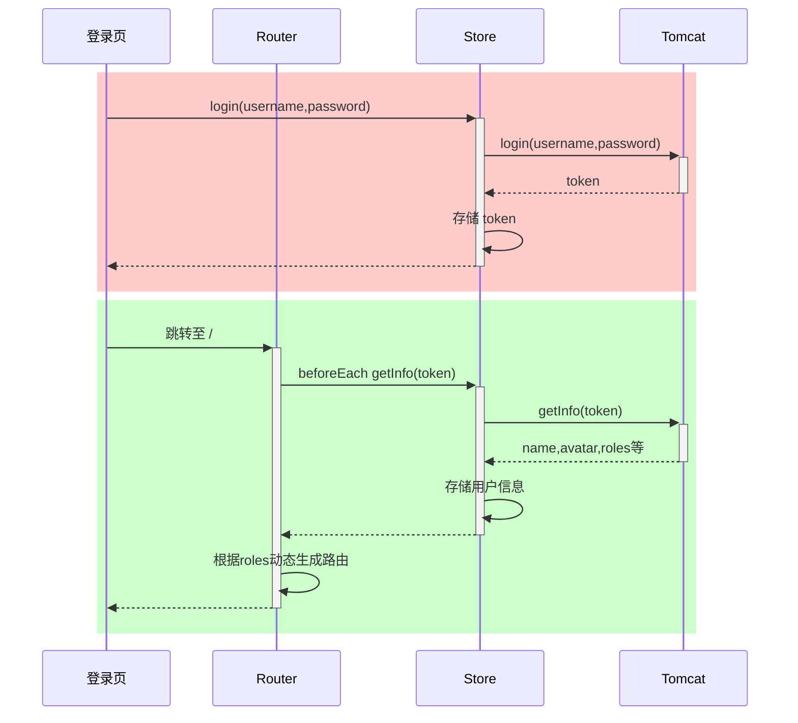
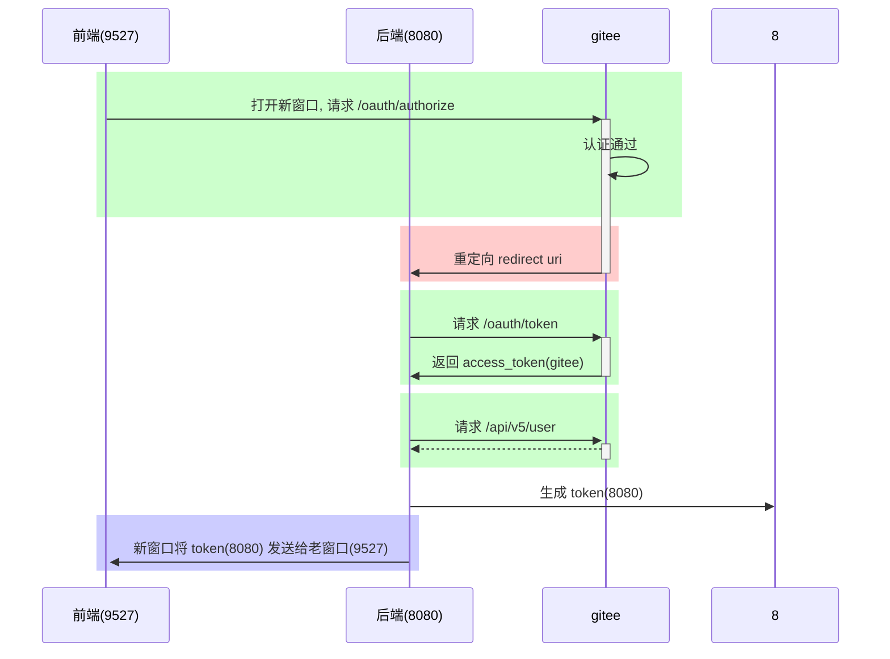

# 三. Vue 2

## 1. Vue 基础

### 1) 环境准备

#### 安装脚手架

```
npm install -g @vue/cli
```

* -g 参数表示全局安装，这样在任意目录都可以使用 vue 脚本创建项目

#### 创建项目

```cmd
vue ui
```

使用图形向导来创建 vue 项目，如下图，输入项目名


选择手动配置项目


添加 vue router 和 vuex


选择版本，创建项目


#### 安装 devtools

* devtools 插件网址：https://devtools.vuejs.org/guide/installation.html


#### 运行项目

进入项目目录，执行

```cmd
npm run serve
```

#### 修改端口

前端服务器默认占用了 8080 端口，需要修改一下

* 文档地址：[DevServer | webpack](https://webpack.js.org/configuration/dev-server/#devserverport)

* 打开 vue.config.js 添加

  ```js
  const { defineConfig } = require('@vue/cli-service')
  module.exports = defineConfig({
    
    // ...
      
    devServer: {
      port: 7070
    }
    
  })
  ```

#### 添加代理

为了避免前后端服务器联调时， fetch、xhr 请求产生跨域问题，需要配置代理

* 文档地址同上

* 打开 vue.config.js 添加

  ```js
  const { defineConfig } = require('@vue/cli-service')
  module.exports = defineConfig({
      
    // ...
      
    devServer: {
      port: 7070,
      proxy: {
        '/api': {
          target: 'http://localhost:8080',
          changeOrigin: true
        }
      }
    }
      
  })
  ```

  

#### Vue 项目结构

```
PS D:\2022.js\代码\第3章\client> tree src
D:\2022.JS\代码\第3章\CLIENT\SRC
├─assets
├─components
├─router
├─store
└─views
```

* assets - 静态资源
* components - 可重用组件
* router - 路由
* store - 数据共享
* views - 视图组件

以后还会添加

* api - 跟后台交互，发送 fetch、xhr 请求，接收响应
* plugins - 插件


### 2) Vue 组件

Vue 的组件文件以 .vue 结尾，每个组件由三部分组成

```vue
<template></template>

<script></script>

<style></style>
```

* template 模板部分，由它生成 html 代码
* script 代码部分，控制模板的数据来源和行为
* style 样式部分，一般不咋关心


入口组件是 App.vue

先删除原有代码，来个 Hello, World 例子

```vue
<template>
  <h1>{{msg}}</h1>
</template>

<script>
export default {
  data() {
    return {
      msg: "Hello, Vue!"
    }
  }
}
</script>
```

解释

* export default 导出组件对象，供 main.js 导入使用
* 这个对象有一个 data 方法，返回一个**对象**，给 template 提供数据
* `{{}}` 在 Vue 里称之为插值表达式，用来**绑定** data 方法返回的**对象**属性，**绑定**的含义是数据发生变化时，页面显示会同步变化


#### 文本插值

```vue
<template>
    <div>
        <h1>{{ name }}</h1>
        <h1>{{ age > 60 ? '老年' : '青年' }}</h1>
    </div>
</template>
<script>
const options = {
    data: function () {
        return { name: '张三', age: 70 };
    }
};
export default options;
</script>
```

* `{{}}` 里只能绑定一个属性，绑定多个属性需要用多个 `{{}}` 分别绑定
* template 内只能有一个根元素
* 插值内可以进行简单的表达式计算


#### 属性绑定

```vue
<template>
    <div>
        <div><input type="text" v-bind:value="name"></div>
        <div><input type="date" v-bind:value="birthday"></div>
        <div><input type="text" :value="age"></div>
    </div>
</template>
<script>
const options = {
    data: function () {
        return { name: '王五', birthday: '1995-05-01', age: 20 };
    }
};
export default options;
</script>
```

* 简写方式：可以省略 v-bind 只保留冒号


#### 事件绑定

```vue
<!-- 事件绑定 -->
<template>
    <div>
        <div><input type="button" value="点我执行m1" v-on:click="m1"></div>
        <div><input type="button" value="点我执行m2" @click="m2"></div>
        <div>{{count}}</div>
    </div>
</template>
<script>
const options = {
    data: function () {
        return { count: 0 };
    },
    methods: {
        m1() {
            this.count ++;
            console.log("m1")
        },
        m2() {
            this.count --;
            console.log("m2")
        }
    }
};
export default options;
</script>
```

* 简写方式：可以把 v-on: 替换为 @
* 在 methods 方法中的 this 代表的是 data 函数返回的数据对象


#### 双向绑定

```vue
<template>
    <div>
        <div>
            <label for="">请输入姓名</label>
            <input type="text" v-model="name">
        </div>
        <div>
            <label for="">请输入年龄</label>
            <input type="text" v-model="age">
        </div>
        <div>
            <label for="">请选择性别</label>
            男 <input type="radio" value="男" v-model="sex">
            女 <input type="radio" value="女" v-model="sex">
        </div>
        <div>
            <label for="">请选择爱好</label>
            游泳 <input type="checkbox" value="游泳" v-model="fav">
            打球 <input type="checkbox" value="打球" v-model="fav">
            健身 <input type="checkbox" value="健身" v-model="fav">
        </div>
    </div>
</template>
<script>
const options = {
    data: function () {
        return { name: '', age: null, sex:'男' , fav:['打球']};
    },
    methods: {
    }
};
export default options;
</script>
```

* 用 v-model 实现双向绑定，即 
  * javascript 数据可以同步到表单标签
  * 反过来用户在表单标签输入的新值也会同步到 javascript 这边
* 双向绑定只适用于表单这种带【输入】功能的标签，其它标签的数据绑定，单向就足够了
* 复选框这种标签，双向绑定的 javascript 数据类型一般用数组


#### 计算属性

```vue
<!-- 计算属性 -->
<template>
    <div>
        <h2>{{fullName}}</h2>
        <h2>{{fullName}}</h2>
        <h2>{{fullName}}</h2>
    </div>
</template>
<script>
const options = {
    data: function () {
        return { firstName: '三', lastName: '张' };
    },
    /* methods: {
        fullName() {
            console.log('进入了 fullName')
            return this.lastName + this.firstName;
        }
    },*/
    computed: {
        fullName() {
            console.log('进入了 fullName')
            return this.lastName + this.firstName;
        }
    }
};
export default options;
```

* 普通方法调用必须加 ()，没有缓存功能
* 计算属性使用时就把它当属性来用，不加 ()，有缓存功能：
  * 一次计算后，会将结果缓存，下次再计算时，只要数据没有变化，不会重新计算，直接返回缓存结果


#### axios

axios 它的底层是用了 XMLHttpRequest（xhr）方式发送请求和接收响应，xhr 相对于之前讲过的 fetch api 来说，功能更强大，但由于是比较老的 api，不支持 Promise，axios 对 xhr 进行了封装，使之支持 Promise，并提供了对请求、响应的统一拦截功能

安装

```cmd
npm install axios -S
```

导入

```js
import axios from 'axios'
```

* axios 默认导出一个对象，这里的 import 导入的就是它默认导出的对象

方法

| 请求                               | 备注   |
| ---------------------------------- | ------ |
| axios.get(url[, config])           | :star: |
| axios.delete(url[, config])        |        |
| axios.head(url[, config])          |        |
| axios.options(url[, config])       |        |
| axios.post(url[, data[, config]])  | :star: |
| axios.put(url[, data[, config]])   |        |
| axios.patch(url[, data[, config]]) |        |

* config - 选项对象、例如查询参数、请求头...
* data - 请求体数据、最常见的是 json 格式数据
* get、head 请求无法携带请求体，这应当是浏览器的限制所致（xhr、fetch api 均有限制）
* options、delete 请求可以通过 config 中的 data 携带请求体


例子

```vue
<template>
    <div>
        <input type="button" value="获取远程数据" @click="sendReq()">
    </div>
</template>
<script>
import axios from 'axios'
const options = {
    methods: {
        async sendReq() {
            // 1. 演示 get, post
            // const resp = await axios.post('/api/a2');

            // 2. 发送请求头
            // const resp = await axios.post('/api/a3',{},{
            //     headers:{
            //         Authorization:'abc'
            //     }
            // });

            // 3. 发送请求时携带查询参数 ?name=xxx&age=xxx
            // const name = encodeURIComponent('&&&');
            // const age = 18;
            // const resp = await axios.post(`/api/a4?name=${name}&age=${age}`);

            // 不想自己拼串、处理特殊字符、就用下面的办法
            // const resp = await axios.post('/api/a4', {}, {
            //     params: {
            //         name:'&&&&',
            //         age: 20
            //     }
            // });

            // 4. 用请求体发数据，格式为 urlencoded
            // const params = new URLSearchParams();
            // params.append("name", "张三");
            // params.append("age", 24)

            // const resp = await axios.post('/api/a4', params);

            // 5. 用请求体发数据，格式为 multipart
            // const params = new FormData();
            // params.append("name", "李四");
            // params.append("age", 30);
            // const resp = await axios.post('/api/a5', params);

            // 6. 用请求体发数据，格式为 json
            const resp = await axios.post('/api/a5json', {
                name: '王五',
                age: 50
            });

            console.log(resp);
        }
    }
};
export default options;
</script>
```


创建实例

```js
const _axios = axios.create(config);
```

* axios 对象可以直接使用，但使用的是默认的设置
* 用 axios.create 创建的对象，可以覆盖默认设置，config 见下面说明


常见的 config 项有

| 名称            | 含义                                                       |
| --------------- | ---------------------------------------------------------- |
| baseURL         | 将自动加在 url 前面                                        |
| headers         | 请求头，类型为简单对象                                     |
| params          | 跟在 URL 后的请求参数，类型为简单对象或 URLSearchParams    |
| data            | 请求体，类型有简单对象、FormData、URLSearchParams、File 等 |
| withCredentials | 跨域时是否携带 Cookie 等凭证，默认为 false                 |
| responseType    | 响应类型，默认为 json                                      |

例

```js
const _axios = axios.create({
    baseURL: 'http://localhost:8080',
    withCredentials: true
});
await _axios.post('/api/a6set')
await _axios.post('/api/a6get')
```

* 生产环境希望 xhr 请求不走代理，可以用 baseURL 统一修改
* 希望跨域请求携带 cookie，需要配置 withCredentials: true，服务器也要配置 allowCredentials = true，否则浏览器获取跨域返回的 cookie 时会报错


响应格式

| 名称    | 含义              |
| ------- | ----------------- |
| data    | 响应体数据 :star: |
| status  | 状态码 :star:     |
| headers | 响应头            |

* 200 表示响应成功
* 400 请求数据不正确 age=abc
* 401 身份验证没通过
* 403 没有权限
* 404 资源不存在
* 405 不支持请求方式 post
* 500 服务器内部错误


请求拦截器

```js
_axios.interceptors.request.use(
  function(config) {
    // 比如在这里添加统一的 headers
    return config;
  },
  function(error) {
    return Promise.reject(error);
  }
);
```

响应拦截器

```js
_axios.interceptors.response.use(
  function(response) {
    // 2xx 范围内走这里
    return response;
  },
  function(error) {
    // 超出 2xx, 比如 4xx, 5xx 走这里
    return Promise.reject(error);
  }
);
```


#### 条件渲染

```vue
<template>
    <div>
        <input type="button" value="获取远程数据" @click="sendReq()">
        <div class="title">学生列表</div>
        <div class="thead">
            <div class="row bold">
                <div class="col">编号</div>
                <div class="col">姓名</div>
                <div class="col">性别</div>
                <div class="col">年龄</div>
            </div>
        </div>
        <div class="tbody">
            <div class="row" v-if="students.length > 0">显示学生数据</div>
            <div class="row" v-else>暂无学生数据</div>
        </div>
    </div>
</template>
<script>
import axios from '../util/myaxios'
const options = {
    data: function() {
        return {
            students: []
        };
    },
    methods : {
        async sendReq() {
            const resp = await axios.get("/api/students");
            console.log(resp.data.data)
            this.students = resp.data.data;
        }
    }
};
export default options;
</script>
<style scoped>
    div {
        font-family: 华文行楷;
        font-size: 20px;
    }

    .title {
        margin-bottom: 10px;
        font-size: 30px;
        color: #333;
        text-align: center;
    }

    .row {
        background-color: #fff;
        display: flex;
        justify-content: center;
    }

    .col {
        border: 1px solid #f0f0f0;
        width: 15%;
        height: 35px;
        text-align: center;
        line-height: 35px;
    }

    .bold .col {
        background-color: #f1f1f1;
    }
</style>
```


#### 列表渲染

```vue
<template>
    <div>
        <!-- <input type="button" value="获取远程数据" @click="sendReq()"> -->
        <div class="title">学生列表</div>
        <div class="thead">
            <div class="row bold">
                <div class="col">编号</div>
                <div class="col">姓名</div>
                <div class="col">性别</div>
                <div class="col">年龄</div>
            </div>
        </div>
        <div class="tbody">
            <div v-if="students.length > 0">
                <div class="row" v-for="s of students" :key="s.id">
                    <div class="col">{{s.id}}</div>
                    <div class="col">{{s.name}}</div>
                    <div class="col">{{s.sex}}</div>
                    <div class="col">{{s.age}}</div>
                </div>
            </div>
            <div class="row" v-else>暂无学生数据</div>
        </div>
    </div>
</template>
<script>
import axios from '../util/myaxios'
const options = {
    mounted: function(){
        this.sendReq()
    },
    data: function() {
        return {
            students: []
        };
    },
    methods : {
        async sendReq() {
            const resp = await axios.get("/api/students");
            console.log(resp.data.data)
            this.students = resp.data.data;
        }
    }
};
export default options;
</script>
<style scoped>
    div {
        font-family: 华文行楷;
        font-size: 20px;
    }

    .title {
        margin-bottom: 10px;
        font-size: 30px;
        color: #333;
        text-align: center;
    }

    .row {
        background-color: #fff;
        display: flex;
        justify-content: center;
    }

    .col {
        border: 1px solid #f0f0f0;
        width: 15%;
        height: 35px;
        text-align: center;
        line-height: 35px;
    }

    .bold .col {
        background-color: #f1f1f1;
    }
</style>
```

* v-if 和 v-for 不能用于同一个标签
* v-for 需要配合特殊的标签属性 key 一起使用，并且 key 属性要绑定到一个能起到唯一标识作用的数据上，本例绑定到了学生编号上
* options 的 mounted 属性对应一个函数，此函数会在组件挂载后（准备就绪）被调用，可以在它内部发起请求，去获取学生数据


#### 重用组件

按钮组件

```vue
<template>
    <div class="button" :class="[type,size]">
        a<slot></slot>b
    </div>
</template>
<script>
const options = {
    props: ["type", "size"]
};
export default options;
</script>
```

* 注意，省略了样式部分

使用组件

```vue
<template>
    <div>
        <h1>父组件</h1>
        <my-button type="primary" size="small">1</my-button>
        <my-button type="danger" size="middle">2</my-button>
        <my-button type="success" size="large">3</my-button>
    </div>
</template>
<script>
import MyButton from '../components/MyButton.vue'
const options = {
    components: {
        MyButton
    }
};
export default options;
</script>
```


## 2. Vue 进阶

### 1) ElementUI

安装

```cmd
npm install element-ui -S
```


引入组件

```js
import Element from 'element-ui'
import 'element-ui/lib/theme-chalk/index.css'

Vue.use(Element)
```


测试，在自己的组件中使用 ElementUI 的组件

```vue
<el-button>按钮</el-button>
```


#### 表格组件

```vue
<template>
    <div>
        <el-table :data="students">
            <el-table-column label="编号" prop="id"></el-table-column>
            <el-table-column label="姓名" prop="name"></el-table-column>
            <el-table-column label="性别" prop="sex"></el-table-column>
            <el-table-column label="年龄" prop="age"></el-table-column>
        </el-table>
    </div>
</template>
<script>
import axios from '../util/myaxios'
const options = {
    async mounted() {
        const resp = await axios.get('/api/students');
        this.students = resp.data.data
    },
    data() {
        return {
            students: []
        }
    }
}
export default options;
</script>
```


#### 分页组件

```vue
<template>
    <div>
        <el-table v-bind:data="students">
            <el-table-column label="编号" prop="id"></el-table-column>
            <el-table-column label="姓名" prop="name"></el-table-column>
            <el-table-column label="性别" prop="sex"></el-table-column>
            <el-table-column label="年龄" prop="age"></el-table-column>
        </el-table>
        <el-pagination 
            :total="total"
            :page-size="queryDto.size"
            :current-page="queryDto.page"
            layout="prev,pager,next,sizes,->,total"
            :page-sizes="[5,10,15,20]"
            @current-change="currentChange"
            @size-change="sizeChange"
        ></el-pagination>
    </div>
</template>
<script>
import axios from '../util/myaxios'
const options = {
    mounted() {
        this.query();
    },
    methods: {
        currentChange(page) {
            this.queryDto.page = page;
            this.query();
        },
        sizeChange(size){
            this.queryDto.size = size;
            this.query();
        },
        async query() {
            const resp = await axios.get('/api/students/q', {
                params: this.queryDto
            });
            this.students = resp.data.data.list;
            this.total = resp.data.data.total;
        }
    },
    data() {
        return {
            students: [],
            total: 0,
            queryDto: {
                page: 1,
                size: 5
            }
        }
    }
}
export default options;
</script>
```

* 三种情况都应该触发查询
  * mounted 组件挂载完成后
  * 页号变化时
  * 页大小变化时
* 查询传参应该根据后台需求，灵活采用不同方式
  * 本例中因为是 get 请求，无法采用请求体，只能用 params 方式传参
* 返回响应的格式也许会很复杂，需要掌握【根据返回的响应结构，获取数据】的能力


#### 分页搜索

```vue
<template>
    <div>
        <el-input placeholder="请输入姓名" size="mini" v-model="queryDto.name"></el-input>
        <el-select placeholder="请选择性别" size="mini" v-model="queryDto.sex" clearable>
            <el-option value="男"></el-option>
            <el-option value="女"></el-option>
        </el-select>
        <el-select placeholder="请选择年龄" size="mini" v-model="queryDto.age" clearable>
            <el-option value="0,20" label="0到20岁"></el-option>
            <el-option value="21,30" label="21到30岁"></el-option>
            <el-option value="31,40" label="31到40岁"></el-option>
            <el-option value="41,120" label="41到120岁"></el-option>
        </el-select>
        <el-button type="primary" size="mini" @click="search()">搜索</el-button>
        <el-divider></el-divider>
        <el-table v-bind:data="students">
            <el-table-column label="编号" prop="id"></el-table-column>
            <el-table-column label="姓名" prop="name"></el-table-column>
            <el-table-column label="性别" prop="sex"></el-table-column>
            <el-table-column label="年龄" prop="age"></el-table-column>
        </el-table>
        <el-pagination :total="total" :page-size="queryDto.size" :current-page="queryDto.page"
            layout="prev,pager,next,sizes,->,total" :page-sizes="[5, 10, 15, 20]" @current-change="currentChange"
            @size-change="sizeChange"></el-pagination>
    </div>
</template>
<script>
import axios from '../util/myaxios'
const options = {
    mounted() {
        this.query();
    },
    methods: {
        currentChange(page) {
            this.queryDto.page = page;
            this.query();
        },
        sizeChange(size) {
            this.queryDto.size = size;
            this.query();
        },
        async query() {
            const resp = await axios.get('/api/students/q', {
                params: this.queryDto
            });
            this.students = resp.data.data.list;
            this.total = resp.data.data.total;
        },
        search() {
            this.query();
        }
    },
    data() {
        return {
            students: [],
            total: 0,
            queryDto: {
                name: '',
                sex: '',
                age: '',  
                page: 1,
                size: 5
            }
        }
    }
}
export default options;
</script>
```

* sex 与  age 均用 `''` 表示用户没有选择的情况
* age 取值 `0,20` 会被 spring 转换为 `new int[]{0, 20}`
* age 取值 `''` 会被 spring 转换为 `new int[0]`


#### 级联选择

级联选择器中选项的数据结构为

```js
[
    {value:100, label:'主页',children:[
        {value:101, label:'菜单1', children:[
            {value:105, label:'子项1'},
            {value:106, label:'子项2'}
        ]},
        {value:102, label:'菜单2', children:[
            {value:107, label:'子项3'},
            {value:108, label:'子项4'},
            {value:109, label:'子项5'}
        ]},
        {value:103, label:'菜单3', children:[
            {value:110, label:'子项6'},
            {value:111, label:'子项7'}
        ]},
        {value:104, label:'菜单4'}
    ]}
]
```

下面的例子是将后端返回的一维数组【树化】

```vue
<template>
    <el-cascader :options="ops"></el-cascader>
</template>
<script>
import axios from '../util/myaxios'
const options = {
    async mounted() {
        const resp = await axios.get('/api/menu')
        console.log(resp.data.data)
        const array = resp.data.data;

        const map = new Map(); 

        // 1. 将所有数据存入 map 集合(为了接下来查找效率)
        for(const {id,name,pid} of array) {
            map.set(id, {value:id, label:name, pid:pid})
        }
        // 2. 建立父子关系
        // 3. 找到顶层对象
        const top = [];
        for(const obj of map.values()) {
            const parent = map.get(obj.pid);
            if(parent !== undefined) {
                parent.children ??= [];
                parent.children.push(obj);
            } else {
                top.push(obj)
            }
        }
        this.ops = top;
    },
    data(){
        return {
            ops: []
        }
    }
};
export default options;
</script>
```


### 2) Vue-Router

vue 属于单页面应用，所谓的路由，就是根据浏览器路径不同，用不同的**视图组件**替换这个页面内容展示


#### 配置路由

新建一个路由 js 文件，例如 src/router/example14.js，内容如下

```js
import Vue from 'vue'
import VueRouter from 'vue-router'
import ContainerView from '@/views/example14/ContainerView.vue'
import LoginView from '@/views/example14/LoginView.vue'
import NotFoundView from '@/views/example14/NotFoundView.vue'

Vue.use(VueRouter)

const routes = [
  {
    path:'/',
    component: ContainerView
  },
  {
    path:'/login',
    component: LoginView
  },
  {
    path:'/404',
    component: NotFoundView
  }
]

const router = new VueRouter({
  routes
})

export default router
```

* 最重要的就是建立了【路径】与【视图组件】之间的映射关系
* 本例中映射了 3 个路径与对应的视图组件

在 main.js 中采用我们的路由 js

```js
import Vue from 'vue'
import e14 from './views/Example14View.vue'
import router from './router/example14'  // 修改这里
import store from './store'
import Element from 'element-ui'
import 'element-ui/lib/theme-chalk/index.css'

Vue.config.productionTip = false

Vue.use(Element)
new Vue({
  router,
  store,
  render: h => h(e14)
}).$mount('#app')
```

根组件是 Example14View.vue，内容为：

```vue
<template>
    <div class="all">
        <router-view></router-view>
    </div>
</template>
```

* 样式略
* 其中 `<router-view>` 起到占位作用，改变路径后，这个路径对应的视图组件就会占据 `<router-view>` 的位置，替换掉它之前的内容


#### 动态导入

```js
import Vue from 'vue'
import VueRouter from 'vue-router'

Vue.use(VueRouter)

const routes = [
  {
    path:'/',
    component: () => import('@/views/example14/ContainerView.vue')
  },
  {
    path:'/login',
    component: () => import('@/views/example14/LoginView.vue')
  },
  {
    path:'/404',
    component: () => import('@/views/example14/NotFoundView.vue')
  }
]

const router = new VueRouter({
  routes
})

export default router
```

* 静态导入是将所有组件的 js 代码打包到一起，如果组件非常多，打包后的 js 文件会很大，影响页面加载速度
* 动态导入是将组件的 js 代码放入独立的文件，用到时才加载


#### 嵌套路由

组件内再要切换内容，就需要用到嵌套路由（子路由），下面的例子是在【ContainerView 组件】内定义了 3 个子路由

```js
const routes = [
  {
    path:'/',
    component: () => import('@/views/example14/ContainerView.vue'),
    redirect: '/c/p1',
    children: [
      { 
        path:'c/p1',
        component: () => import('@/views/example14/container/P1View.vue')
      },
      { 
        path:'c/p2',
        component: () => import('@/views/example14/container/P2View.vue')
      },
      { 
        path:'c/p3',
        component: () => import('@/views/example14/container/P3View.vue')
      }
    ]
  },
  {
    path:'/login',
    component: () => import('@/views/example14/LoginView.vue')
  },
  {
    path:'/404',
    component: () => import('@/views/example14/NotFoundView.vue')
  },
  {
    path:'*',
    redirect: '/404'
  }
]
```

子路由变化，切换的是【ContainerView 组件】中 `<router-view></router-view>` 部分的内容

```java
<template>
    <div class="container">
        <router-view></router-view>
    </div>
</template>
```

* redirect 可以用来重定向（跳转）到一个新的地址
* path 的取值为 * 表示匹配不到其它 path 时，就会匹配它


#### ElementUI 布局

通常主页要做布局，下面的代码是 ElementUI 提供的【上-【左-右】】布局

```vue
<template>
    <div class="container">
        <el-container>
            <el-header></el-header>
            <el-container>
                <el-aside width="200px"></el-aside>
                <el-main>
                    <router-view></router-view>
                </el-main>
            </el-container>
        </el-container>
    </div>
</template>
```


#### 路由跳转

##### 标签式

```vue
<el-aside width="200px">
    <router-link to="/c1/p1">P1</router-link>
    <router-link to="/c1/p2">P2</router-link>
    <router-link to="/c1/p3">P3</router-link>
</el-aside>
```


##### 编程式

```vue
<el-header>
    <el-button type="primary" icon="el-icon-edit" 
               circle size="mini" @click="jump('/c1/p1')"></el-button>
    <el-button type="success" icon="el-icon-check" 
               circle size="mini" @click="jump('/c1/p2')"></el-button>
    <el-button type="warning" icon="el-icon-star-off" 
               circle size="mini" @click="jump('/c1/p3')"></el-button>
</el-header>
```

jump 方法

```vue
<script>
const options = {
    methods : {
        jump(url) {
            this.$router.push(url);
        }
    }
}
export default options;
</script>
```

* 其中 this.$router 是拿到路由对象
* push 方法根据 url 进行跳转


##### 导航菜单

```vue
<el-menu router background-color="#545c64" text-color="#fff" active-text-color="#ffd04b">
    <el-submenu index="/c1">
        <span slot="title">
            <i class="el-icon-platform-eleme"></i>
            菜单1
        </span>
        <el-menu-item index="/c1/p1">子项1</el-menu-item>
        <el-menu-item index="/c1/p2">子项2</el-menu-item>
        <el-menu-item index="/c1/p3">子项3</el-menu-item>
    </el-submenu>
    <el-menu-item index="/c2">
        <span slot="title">
            <i class="el-icon-phone"></i>
            菜单2
        </span>
    </el-menu-item>
    <el-menu-item index="/c3">
        <span slot="title">
            <i class="el-icon-star-on"></i>
            菜单3
        </span>
    </el-menu-item>
</el-menu>
```

* 图标和菜单项文字建议用 `<span slot='title'></span>` 包裹起来
* `el-menu` 标签上加上 `router` 属性，表示结合导航菜单与路由对象，此时，就可以利用菜单项的 `index` 属性来路由跳转


#### 动态路由与菜单

将菜单、路由信息（仅主页的）存入数据库中

```sql
insert into menu(id, name, pid, path, component, icon) values
    (101, '菜单1', 0,   '/m1',    null,         'el-icon-platform-eleme'),
    (102, '菜单2', 0,   '/m2',    null,         'el-icon-delete-solid'),
    (103, '菜单3', 0,   '/m3',    null,         'el-icon-s-tools'),
    (104, '菜单4', 0,   '/m4',    'M4View.vue', 'el-icon-user-solid'),
    (105, '子项1', 101, '/m1/c1', 'C1View.vue', 'el-icon-s-goods'),
    (106, '子项2', 101, '/m1/c2', 'C2View.vue', 'el-icon-menu'),
    (107, '子项3', 102, '/m2/c3', 'C3View.vue', 'el-icon-s-marketing'),
    (108, '子项4', 102, '/m2/c4', 'C4View.vue', 'el-icon-s-platform'),
    (109, '子项5', 102, '/m2/c5', 'C5View.vue', 'el-icon-picture'),
    (110, '子项6', 103, '/m3/c6', 'C6View.vue', 'el-icon-upload'),
    (111, '子项7', 103, '/m3/c7', 'C7View.vue', 'el-icon-s-promotion');
```

不同的用户查询的的菜单、路由信息是不一样的

例如：访问 `/api/menu/admin` 返回所有的数据

```json
[
    {
        "id": 102,
        "name": "菜单2",
        "icon": "el-icon-delete-solid",
        "path": "/m2",
        "pid": 0,
        "component": null
    },
    {
        "id": 107,
        "name": "子项3",
        "icon": "el-icon-s-marketing",
        "path": "/m2/c3",
        "pid": 102,
        "component": "C3View.vue"
    },
    {
        "id": 108,
        "name": "子项4",
        "icon": "el-icon-s-platform",
        "path": "/m2/c4",
        "pid": 102,
        "component": "C4View.vue"
    },
    {
        "id": 109,
        "name": "子项5",
        "icon": "el-icon-picture",
        "path": "/m2/c5",
        "pid": 102,
        "component": "C5View.vue"
    }
]
```

访问 `/api/menu/wang` 返回

```json
[
    {
        "id": 103,
        "name": "菜单3",
        "icon": "el-icon-s-tools",
        "path": "/m3",
        "pid": 0,
        "component": null
    },
    {
        "id": 110,
        "name": "子项6",
        "icon": "el-icon-upload",
        "path": "/m3/c6",
        "pid": 103,
        "component": "C6View.vue"
    },
    {
        "id": 111,
        "name": "子项7",
        "icon": "el-icon-s-promotion",
        "path": "/m3/c7",
        "pid": 103,
        "component": "C7View.vue"
    }
]
```

前端根据他们身份不同，动态添加路由和显示菜单

##### 动态路由

```js
export function addServerRoutes(array) {
  for (const { id, path, component } of array) {
    if (component !== null) {
      // 动态添加路由
      // 参数1：父路由名称
      // 参数2：路由信息对象
      router.addRoute('c', {
        path: path,
        name: id,
        component: () => import(`@/views/example15/container/${component}`)
      });
    }
  }
}
```

* js 这边只保留几个固定路由，如主页、404 和 login
* 以上方法执行时，将服务器返回的路由信息加入到名为 c 的父路由中去
* 这里要注意组件路径，前面 @/views 是必须在 js 这边完成拼接的，否则 import 函数会失效

##### 重置路由

在用户注销时应当重置路由

```js
export function resetRouter() {
  router.matcher = new VueRouter({ routes }).matcher
}
```

##### 页面刷新

页面刷新后，会导致动态添加的路由失效，解决方法是将路由数据存入 sessionStorage

```vue
<script>
import axios from '@/util/myaxios'
import {resetRouter, addServerRoutes} from '@/router/example15'
const options = {
    data() {
        return {
            username: 'admin'
        }
    },
    methods: {
        async login() {       
            resetRouter(); // 重置路由     
            const resp = await axios.get(`/api/menu/${this.username}`)
            const array = resp.data.data;
            // localStorage     即使浏览器关闭，存储的数据仍在
            // sessionStorage   以标签页为单位，关闭标签页时，数据被清除
            sessionStorage.setItem('serverRoutes', JSON.stringify(array))
            addServerRoutes(array); // 动态添加路由
            this.$router.push('/');
        }
    }
}
export default options;
</script>
```

页面刷新，重新创建路由对象时，从 sessionStorage 里恢复路由数据

```js
const router = new VueRouter({
  routes
})

// 从 sessionStorage 中恢复路由数据
const serverRoutes = sessionStorage.getItem('serverRoutes');
if(serverRoutes) {
  const array = JSON.parse(serverRoutes);
  addServerRoutes(array) // 动态添加路由
}
```

##### 动态菜单

代码部分

```vue
<script>
const options = {
    mounted() {
        const serverRoutes = sessionStorage.getItem('serverRoutes');
        const array = JSON.parse(serverRoutes);
        const map = new Map();
        for(const obj of array) {
            map.set(obj.id, obj);
        }
        const top = [];
        for(const obj of array) {
            const parent = map.get(obj.pid);
            if(parent) {
                parent.children ??= [];
                parent.children.push(obj);
            } else {
                top.push(obj);
            }
        }
        this.top = top;
    },
    data() {
        return {
            top: []
        }
    }
}
export default options;
</script>
```

菜单部分

```vue
<el-menu router background-color="#545c64" text-color="#fff" active-text-color="#ffd04b" :unique-opened="true">
    <template v-for="m1 of top">
<el-submenu v-if="m1.children" :key="m1.id" :index="m1.path">
    <span slot="title">
        <i :class="m1.icon"></i> {{m1.name}}
        </span>
    <el-menu-item v-for="m2 of m1.children" :key="m2.id" :index="m2.path">
        <span slot="title">
            <i :class="m2.icon"></i> {{m2.name}}
        </span>
        </el-menu-item>
        </el-submenu>
<el-menu-item v-else :key="m1.id" :index="m1.path">
    <span slot="title">
        <i :class="m1.icon"></i> {{m1.name}}
        </span>
        </el-menu-item>
    </template>
</el-menu>
```

* 没有考虑递归菜单问题，认为菜单只有两级


### 3) Vuex

#### 入门

vuex 可以在多个组件之间共享数据，并且共享的数据是【响应式】的，即数据的变更能及时渲染到模板

* 与之对比 localStorage 与 sessionStorage 也能共享数据，但缺点是数据并非【响应式】

首先需要定义 state 与 mutations 他们一个用来读取共享数据，一个用来修改共享数据

src/store/index.js

```js
import Vue from 'vue'
import Vuex from 'vuex'

Vue.use(Vuex)

/*
  读取数据，走 state, getters
  修改数据，走 mutations, actions
*/
export default new Vuex.Store({
  state: {
    name: '',
    age: 18
  },
  getters: {
  },
  mutations: {
    updateName(state, name) {
      state.name = name;
    }
  },
  actions: {
  },
  modules: {
  }
})
```

修改共享数据

```vue
<template>
    <div class="p">
        <el-input placeholder="请修改用户姓名" 
            size="mini" v-model="name"></el-input>
        <el-button type="primary" size="mini" @click="update()">修改</el-button>
    </div>
</template>
<script>
const options = {
    methods: {
        update(){
            this.$store.commit('updateName', this.name);
        }
    },
    data () {
        return {
            name:''
        }
    }
}
export default options;
</script>
```

* mutations 方法不能直接调用，只能通过 `store.commit(mutation方法名, 参数)` 来间接调用

读取共享数据

```vue
<template>
    <div class="container">
        <el-container>
            <el-header>
                <div class="t">
                    欢迎您：{{ $store.state.name }}, {{ $store.state.age }}
    			</div>
            </el-header>
            <el-container>
                <el-aside width="200px">
                </el-aside>
                <el-main>
                    <router-view></router-view>
                </el-main>
            </el-container>
        </el-container>
    </div>
</template>
```


#### mapState

每次去写 `$store.state.name` 这样的代码显得非常繁琐，可以用 vuex 帮我们生成计算属性

```vue
<template>
    <div class="container">
        <el-container>
            <el-header>
                <div class="t">欢迎您：{{ name }}, {{ age }}</div>
            </el-header>
            <el-container>
                <el-aside width="200px">
                </el-aside>
                <el-main>
                    <router-view></router-view>
                </el-main>
            </el-container>
        </el-container>
    </div>
</template>
<script>
import { mapState } from 'vuex'
const options = {
    computed: {
        ...mapState(['name', 'age'])
    }
}
export default options;
</script>
```

* mapState 返回的是一个对象，对象内包含了 name() 和 age() 的这两个方法作为计算属性
* 此对象配合 `...` 展开运算符，填充入 computed 即可使用


#### mapMutations

```vue
<template>
    <div class="p">
        <el-input placeholder="请修改用户姓名" 
            size="mini" v-model="name"></el-input>
        <el-button type="primary" size="mini" @click="updateName(name)">修改</el-button>
    </div>
</template>
<script>
import {mapMutations} from 'vuex'
const options = {
    methods: {
        ...mapMutations(['updateName'])
    },
    data () {
        return {
            name:''
        }
    }
}
export default options;
</script>
```

* 类似的，调用 mutation 修改共享数据也可以简化
* mapMutations 返回的对象中包含的方法，就会调用 store.commit() 来执行 mutation 方法
* 注意参数传递略有不同


#### actions

mutations 方法内不能包括修改不能立刻生效的代码，否则会造成 Vuex 调试工具工作不准确，必须把这些代码写在 actions 方法中

```js
import Vue from 'vue'
import Vuex from 'vuex'

Vue.use(Vuex)

/*
  读取数据，走 state, getters
  修改数据，走 mutations, actions
*/
import axios from '@/util/myaxios'
export default new Vuex.Store({
  state: {
    name: '',
    age: 18
  },
  getters: {
  },
  mutations: {
    updateName(state, name) {
      state.name = name;
    },
    // 错误的用法，如果在mutations方法中包含了异步操作，会造成开发工具不准确
    /* async updateServerName(state) {
      const resp = await axios.get('/api/user');
      const {name, age} = resp.data.data;
      state.name = name;
      state.age = age;
    } */
    updateServerName(state, user) {
      const { name, age } = user;
      state.name = name;
      state.age = age;
    }
  },
  actions: {
    async updateServerName(context) {
      const resp = await axios.get('/api/user');
      context.commit('updateServerName', resp.data.data)
    }
  },
  modules: {
  }
})
```

* 首先应当调用 actions 的 updateServerName 获取数据
* 然后再由它间接调用 mutations 的 updateServerName 更新共享数据

页面使用 actions 的方法可以这么写

```vue
<template>
    <div class="p">
        <el-button type="primary" size="mini"
            @click="updateServerName()">从服务器获取数据,存入store</el-button>
    </div>
</template>
<script>
import { mapActions } from 'vuex'
const options = {
    methods: {
        ...mapActions(['updateServerName'])
    }
}
export default options;
</script>
```

* mapActions 会生成调用 actions 中方法的代码

* 调用 actions 的代码内部等价于，它返回的是 Promise 对象，可以用同步或异步方式接收结果

  ```js
  this.$store.dispatch('action名称', 参数)
  ```

  


## 3. Vue 实战

课程不准备从头开发一个 Vue 项目，这里我准备采用这样的教学方法：带着大家看一个较为典型的基于 Vue 的项目实现，分析其中几个重点流程

这里选择了 vue-element-admin 这个项目骨架，它采用的技术与我们之前学过的较为契合

* vue 2
* element-ui 2
* vue-router 3
* vuex 3
* axios


### 安装

```cmd
git clone https://gitee.com/panjiachen/vue-element-admin.git client-action

cd client-action

git branch -a

git checkout -b i18n remotes/origin/i18n

git config --global url."https://".insteadOf git://

npm install

npm run dev
```

* 需要切换分支到 i18n，否则不支持国际化（中文）功能
* npm install 要多试几次，因为中间会连接 gitbub 下载一些依赖，网络不稳定会导致失败
* npm run dev 运行后回自动打开浏览器，使用的端口是 9527


### 后端路径

开发环境下执行下面命令

```
npm run dev
```

* 会同时启动 mock-server

在开发环境下，后端访问路径起始路径配置在文件 `.env.development` 中

```properties
VUE_APP_BASE_API = '/dev-api'
```

* 默认向后台的请求都发给 `http://localhost:9527/dev-api` 的 mock-server 获得的都是模拟数据
* 需要跟真实后台联调时，可以改动以上地址为 `VUE_APP_BASE_API = 'http://localhost:8080/api'`

发送请求的 axios 工具被封装在 src/utils/request.js 中

```js
import axios from 'axios'
import { MessageBox, Message } from 'element-ui'
import store from '@/store'
import { getToken } from '@/utils/auth'

// create an axios instance
const service = axios.create({
  baseURL: process.env.VUE_APP_BASE_API, // url = base url + request url
  // withCredentials: true, // send cookies when cross-domain requests
  timeout: 5000 // request timeout
})

// ...
```

原有代码的 URI 路径都是这样的：

```
/vue-element-admin/user/login
/vue-element-admin/user/info
/vue-element-admin/user/logout
...
```

如果觉得不爽，可以来一个全局替换

```
/user/login
/user/info
/user/logout
...
```

token 的请求头修改一下，在 src/utils/request.js 中

```js
...
service.interceptors.request.use(
  config => {
    // do something before request is sent

    if (store.getters.token) {
      // let each request carry token
      // ['X-Token'] is a custom headers key
      // please modify it according to the actual situation
      config.headers['Authorization'] = getToken()
    }
    return config
  },
  error => {
    // do something with request error
    console.log(error) // for debug
    return Promise.reject(error)
  }
)
...
```


### 登录流程

#### 1. `src/views/login/index.vue`

```vue
<script>
import { validUsername } from '@/utils/validate'
import LangSelect from '@/components/LangSelect'
import SocialSign from './components/SocialSignin'

export default {
  // ...
  methods: {    
    handleLogin() {
      this.$refs.loginForm.validate(valid => {
        if (valid) {
          this.loading = true
          this.$store.dispatch('user/login', this.loginForm)
            .then(() => {
              this.$router.push({ path: this.redirect || '/', query: this.otherQuery })
              this.loading = false
            })
            .catch(() => {
              this.loading = false
            })
        } else {
          console.log('error submit!!')
          return false
        }
      })
    }
    // ...
  }
}
</script>
```

这里调用了 store 的 actions，`user/login`

* 因为是异步调用，因此只能用 actions
* 登录成功会优先跳转至 this.redirect 路径、否则跳转至 /
* / 查看 `src/router/index.js` 的路由表可知，会重定向至 /dashboard


#### 2. `src/store/modules/user.js`

```js
import { login, logout, getInfo } from '@/api/user'
// ...
const actions = {
  // user login
  login({ commit }, userInfo) {
    const { username, password } = userInfo
    return new Promise((resolve, reject) => {
      login({ username: username.trim(), password: password }).then(response => {
        const { data } = response
        commit('SET_TOKEN', data.token)
        setToken(data.token)
        resolve()
      }).catch(error => {
        reject(error)
      })
    })
  }
  // ...
}
```

* 发请求用了 `src/api/user.js`，请求成功使用 commit 将 token 存入 mutations，同时往 cookie 存储了一份
* 这里的 response 其实是真正的 response.data，见后面的说明
* 评价
  * 向 cookie 或 sessionStorage 存储 token 即可，token 无需做成响应式，不必放入 store
  * 作者使用了 Promise API，其实可以改变为 await 方式，提高可读性


#### 3. `src/api/user.js`

```js
import request from '@/utils/request'

export function login(data) {
  return request({
    url: '/user/login',
    method: 'post',
    data
  })
}

// ...
```

* 其中 request 相当于我们之前封装的 myaxios


#### 4. `src/utils/request.js`

```js
import axios from 'axios'
import { MessageBox, Message } from 'element-ui'
import store from '@/store'
import { getToken } from '@/utils/auth'

// create an axios instance
const service = axios.create({
  baseURL: process.env.VUE_APP_BASE_API, // url = base url + request url
  // withCredentials: true, // send cookies when cross-domain requests
  timeout: 5000 // request timeout
})

// ... 

service.interceptors.response.use(
  // ...
  response => {
    const res = response.data
    if (res.code !== 20000) {
      // ...
    } else {
      return res
    }
  },
  error => {
    // ...
  }
)

export default service
```

* 其中响应拦截器发现响应正确，返回 resp.data 这样，其它处代码解构时少了一层 data


#### 5. `src/permission.js`

登录成功后，只是获得了 token，还未获取用户信息，获取用户信息是在路由跳转的 beforeEach 里做的



关键代码

```js
import router from './router'

// ...

router.beforeEach(async(to, from, next) => {
  // ...
  const hasToken = getToken()

  if (hasToken) {
    if (to.path === '/login') {
      // ...
    } else {
      // ...
      const { roles } = await store.dispatch('user/getInfo')
      // ...
    }
  } else {
    // ...
  }
})
```

* 登录后跳转至 / 之前进入这里的 beforeEach 方法，方法内主要做两件事
  * 一是调用 actions 方法获取用户角色，见 6
  * 二是根据用户角色，动态生成路由，见 7


#### 6. `src/store/modules/user.js`

这里用其中 getInfo 方法获取用户信息，其中角色返回给 beforeEach 

```js
import { login, logout, getInfo } from '@/api/user'
// ...
const actions = {
  getInfo({ commit, state }) {
    return new Promise((resolve, reject) => {
      getInfo(state.token).then(response => {
        const { data } = response

        if (!data) {
          reject('Verification failed, please Login again.')
        }

        const { roles, name, avatar, introduction } = data

        if (!roles || roles.length <= 0) {
          reject('getInfo: roles must be a non-null array!')
        }

        commit('SET_ROLES', roles)
        commit('SET_NAME', name)
        commit('SET_AVATAR', avatar)
        commit('SET_INTRODUCTION', introduction)
        resolve(data)
      }).catch(error => {
        reject(error)
      })
    })
  }
}
```


#### 7. `src/router/index.js`

路由表中路由分成两部分，静态路由与动态路由

```js
export const constantRoutes = [
  // ...
  {
    path: '/login',
    component: () => import('@/views/login/index'),
    hidden: true
  },
  {
    path: '/',
    component: Layout,
    redirect: '/dashboard',
    children: [
      {
        path: 'dashboard',
        component: () => import('@/views/dashboard/index'),
        name: 'Dashboard',
        meta: { title: 'dashboard', icon: 'dashboard', affix: true }
      }
    ]
  }
  // ...
]
```

* 其中 hidden: true 的路由只做路由跳转，不会在左侧导航菜单展示

动态路由

```js
export const asyncRoutes = [
  {
    path: '/permission',
    component: Layout,
    redirect: '/permission/page',
    alwaysShow: true, // will always show the root menu
    name: 'Permission',
    meta: {
      title: 'permission',
      icon: 'lock',
      roles: ['admin', 'editor'] // you can set roles in root nav
    },
    children: [
      {
        path: 'page',
        component: () => import('@/views/permission/page'),
        name: 'PagePermission',
        meta: {
          title: 'pagePermission',
          roles: ['admin'] // or you can only set roles in sub nav
        }
      },
      {
        path: 'directive',
        component: () => import('@/views/permission/directive'),
        name: 'DirectivePermission',
        meta: {
          title: 'directivePermission'
          // if do not set roles, means: this page does not require permission
        }
      },
      {
        path: 'role',
        component: () => import('@/views/permission/role'),
        name: 'RolePermission',
        meta: {
          title: 'rolePermission',
          roles: ['admin']
        }
      }
    ]
  },

  {
    path: '/icon',
    component: Layout,
    children: [
      {
        path: 'index',
        component: () => import('@/views/icons/index'),
        name: 'Icons',
        meta: { title: 'icons', icon: 'icon', noCache: true, roles: ['admin'] }
      }
    ]
  }
  // ...
}
```

* 动态路由中关联了角色信息，根据用户的角色决定那些路由可用，但这样做的缺点是把角色和路由绑定死了


#### 8. `src/layout/index.vue`

它对应的是我们之前介绍的 Container.vue 完成主页布局的，路由路径是 /


其中又由多部分组成，其中固定不变的是

* 侧边栏
* 导航栏
* 标签栏
* 设置

变化的是中间的 dashboard 部分（AppMain），它由 router-view 配合子路由切换显示

* 进入 / 后，就会 redirect 重定向到 /dashboard 子路由
* 进入首页后，会有一个 `/api/transaction/list` 的后台请求报 404，作为练习，把它补充完整


### 第三方登录



1. 9527 打开新窗口，请求 `https://gitee.com/oauth/authorize?client_id=${client_id}&redirect_uri=${redirect_uri}&response_type=code`

2. gitee 认证通过，重定向至 8080，并携带 code

3. 8080 发送请求 `https://gitee.com/oauth/token` 携带 client_id、client_secret、code，gitee 返回 access_token 给 8080

   * 这时走的是 https 协议，并且不经过浏览器，能够保证数据传输的安全性

   * 重定向到 8080 时，如果被有心人拿到了 code，也没事，因为接下来会把 client_secret 发给 gitee 验证（client_secret 应当只存在 8080），只要 client_secret 不泄露，就可以保证安全

   * 如果改成前端拿 code 换 access_token，那就意味着 access_token 得保存在前端，所有保存在前端的都有风险

4. 8080 可以访问 gitee 的 api 了，拿到用户信息，存入数据库，返回 8080 的 token

5. 8080 可以通过 window.opener.postMessage 把 token 给 9527 的老窗口

   * 这里又会涉及到跨域，不过 9527 与 8080 直接存在信任关系，设置一下就好

6. 9527 再走之前的逻辑就可以了，在 router 的 beforeEach 方法里，用 8080 token 换用户信息


### 增删改查

首先，在 api 里添加与后端交互的代码：`src/api/student.js`

```js
import axios from '@/utils/request'

export function all() {
  return axios({
    url: '/students',
    method: 'get'
  })
}

export function deleteById(id) {
  return axios({
    url: `/students/${id}`,
    method: 'delete'
  })
}

export function update(id, dto) {
  return axios({
    url: `/students/${id}`,
    method: 'put',
    data: dto
  })
}

export function insert(dto) {
  return axios({
    url: `/students`,
    method: 'post',
    data: dto
  })
}
```

然后，添加新的路由：`src/router/index.js`

```js
export const asyncRoutes = [
  // ...
  {
    path: '/student',
    component: Layout,
    children: [
      {
        path: 'index',
        component: () => import('@/views/student/index'),
        meta: { title: '学生管理', icon: 'el-icon-s-help', roles: ['admin'] }
      }
    ]
  },
  // ...
]
```

* 注意 title 这里没有考虑国际化

最后，添加新的视图界面：`src/views/student/index.vue`

```vue
<template>
  <div>
    <el-table :data="students">
      <el-table-column label="编号" prop="id"></el-table-column>
      <el-table-column label="姓名" prop="name"></el-table-column>
      <el-table-column label="性别" prop="sex"></el-table-column>
      <el-table-column label="年龄" prop="age"></el-table-column>
      <el-table-column fixed="right" label="操作" width="100">
        <template slot-scope="scope">
          <el-button @click="handleUpdate(scope.row)" type="text" size="small">修改</el-button>
          <el-button @click="handleDelete(scope.row)" type="text" size="small">删除</el-button>
        </template>
      </el-table-column>
    </el-table>

    <el-dialog width="22%" :visible.sync="updateDialogVisible">
      <el-form :model="updateForm">
        <el-form-item label="编号">
          <el-input size="mini" :readonly="true" v-model="updateForm.id"></el-input>
        </el-form-item>
        <el-form-item label="姓名">
          <el-input size="mini" v-model="updateForm.name"></el-input>
        </el-form-item>
        <el-form-item label="性别">
          <el-select size="mini" v-model="updateForm.sex">
            <el-option value="男"></el-option>
            <el-option value="女"></el-option>
          </el-select>
        </el-form-item>
        <el-form-item label="年龄">
          <el-input size="mini" v-model="updateForm.age"></el-input>
        </el-form-item>
        <el-form-item>
          <el-button type="primary" size="mini" @click="confirmUpdate()">确定</el-button>
        </el-form-item>
      </el-form>
    </el-dialog>
  </div>
</template>
<script>
import { all, deleteById, update, insert } from '@/api/student'
const options = {
  mounted() {
    this.all()
  },
  data() {
    return {
      students: [],
      updateDialogVisible: false,
      updateForm: {
        id: 0,
        name: '',
        sex: '男',
        age: 0
      }
    }
  },
  methods: {
    async confirmUpdate() {
      await update(this.updateForm.id, this.updateForm)
      this.updateDialogVisible = false
      this.all()
    },
    handleUpdate(row) { // {id, name, sex, age}
      this.updateDialogVisible = true
      this.updateForm = { ...row }
      // this.updateForm = row // 错误写法，不能让他俩指向同一个对象
    },
    async handleDelete(row) {
      try {
        await this.$confirm('此操作将永久删除该学生, 是否继续?', '提示', {
          confirmButtonText: '确定',
          cancelButtonText: '取消',
          type: 'warning'
        })
        await deleteById(row.id)
        this.all()
      } catch (e) {
        console.log('取消删除')
      }
    },
    async all() {
      const { data } = await all()
      this.students = data
    }
  }
}
export default options
</script>
<style scoped>
.el-input,
.el-select {
  width: 180px;
}
</style>
```

* 其中 handleUpdate 和 handleDelete 接收的参数，都是代表了当前行的学生对象
