# 前言
爆肝15天，本文共4万5千字，包含Vue.js理论到实战。知识点全部都能使用ctrl+f速查，可作为知识点速查笔记使用。

本文完全基于 参考资料：[尚硅谷Vue2.0+Vue3.0全套教程丨vuejs从入门到精通](https://www.bilibili.com/video/BV1Zy4y1K7SH?p=2&spm_id_from=pageDriver)加工整理而成，包括其代码，案例，资源等。前置知识是学习尚硅谷的视频教程，本文配合其教程食用，效果更佳。

**本文全套资料、案例、源代码、插件已上传至Gitee：[https://gitee.com/da-ji/full-stack-developer](https://gitee.com/da-ji/full-stack-developer)，大家需要可自取**</font>

**本文引入的vue版本是（2.4.1）：**

```javascript
<!-- 引入Vue -->
<script src="https://cdn.jsdelivr.net/npm/vue@2.4.1/dist/vue.js"></script>
```


# 一、通用概念、前置知识

## 1.1 MVC 和 MVVM

**大家一说起MVC 都知道，但是和MVVM一对比就搞混了。**

- ==**MVC**：适用于传统的服务器端应用，或需要明确分离输入、处理和输出的场景。==
- ==**MVVM**：适用于现代的前端开发，特别是那些支持双向数据绑定的框架（如 Vue.js、Angular 和 Knockout）。==

**这里举两个例子搞清楚MVC和 MVVM：**


### 1.1.1 MVC 架构 (偏后端)

该架构就是传统JavaWeb项目开发的一般模式，比较简单。

下面两张图截取自：[MVC架构和SSM框架的个人理解](https://blog.csdn.net/weixin_44757863/article/details/109086022)

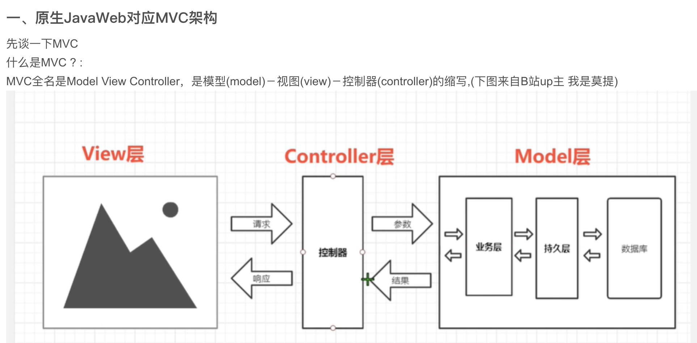


以前在JavaWeb阶段, MVC的实现主要是用以下方式实现的:

- ==**M (Model)** : pojo(实体类), 业务层(在项目中常常被命名为service包), dao(JDBC, Druid)等==
- ==**V (View)** : JSP , HTML==
- ==**C (Controller)** : Servlet: 是 Java 编程语言中用于创建动态 Web 应用程序的技术。它运行在服务器端，可以处理客户端请求（如 HTTP 请求），并生成响应（如 HTML、JSON 等）。Servlet 是 Java EE 规范的一部分，通常用于构建动态网页和 Web 服务。==

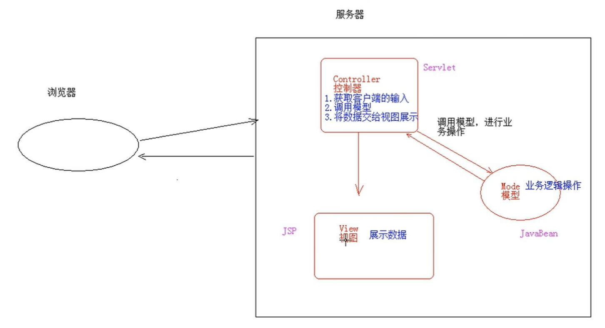

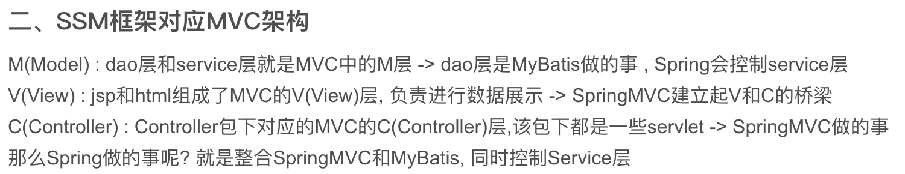

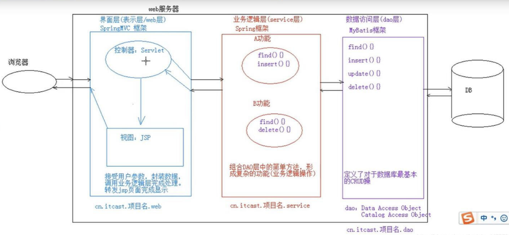


### 1.1.2 MVVM架构 (偏前端)

**前置知识是你得懂双向绑定：本文下面有讲解双向绑定，先看双向绑定。**

**一图说清MVVM（图来源自尚硅谷课件，本人进行二次加工）：**

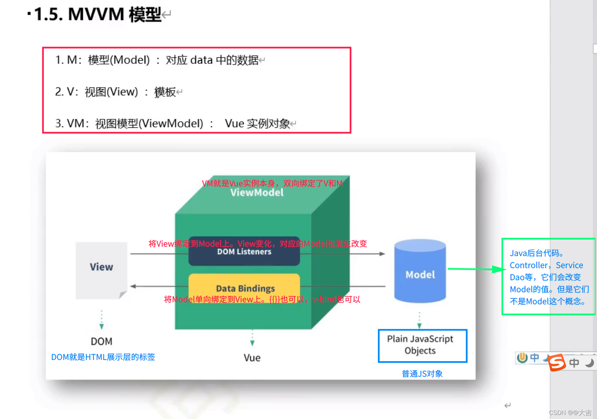


**在代码中体现上图中的Data Bindings（通过VM，将M绑定到View）：**

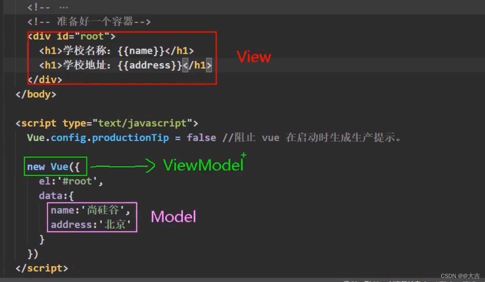


**在代码中体现上图中的DOM Listeners（通过VM，将V绑定到M）：**

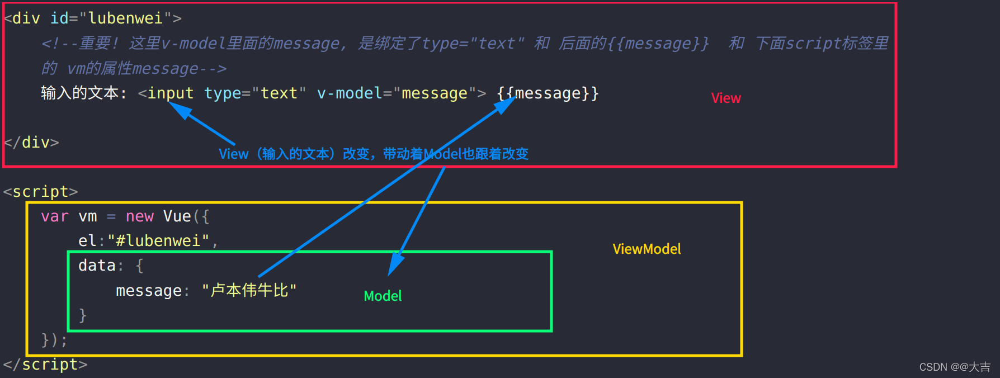
**执行效果：**

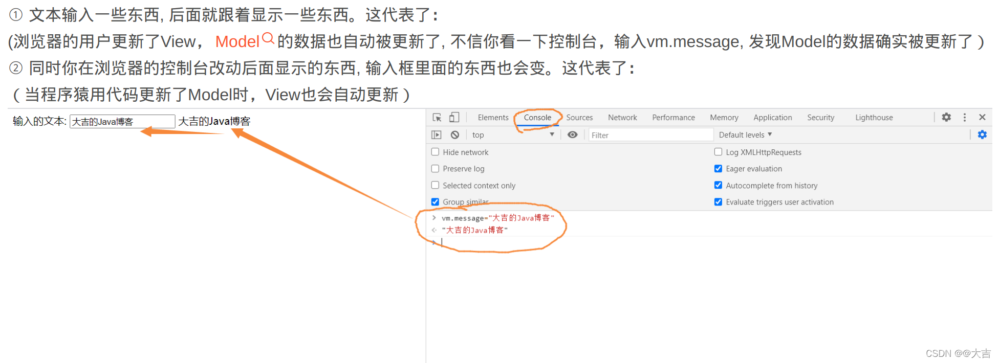


**同时做到了将M绑定到V，和V绑定到M，就是实现了双向绑定。**

**VM（就是ViewModel），其实就是Vue实例本身，它负责将View和Model绑定起来**

<font color=red >**这就是Vue的MVVM体现！要理解透彻，需要对ViewModel，双向绑定，Vue实例都有详细的理解。其它前端框架对MVVM有不同的解释，但是原理和思想上是一致的。** </font>

**最后看维基百科对其的定义：**


## 1.2 WebPack基本概念 和 Vue-CLI

不需要全部学会WebPack这门技术,只是对其有一个基本认知即可。

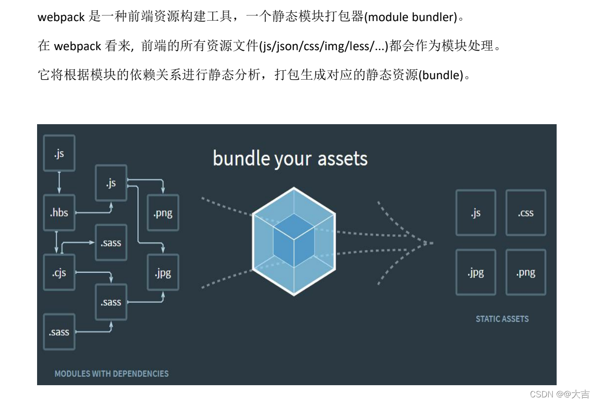
它依赖于Node，可以使用npm安装；

使用npm init 指令构建 package.json 文件；

>webpack 能够编译打包 js 和 json 文件。
>能将 es6 的模块化语法转换成浏览器能识别的语法。
>生产环境能压缩HTML，CSS，JS代码。

可以打包各种各样的资源：样式资源、图片资源、HTML资源，提取压缩css，js语法检查/兼容性处理。

<font size=5px>那Vue-CLI是什么呢？其实就是Vue官方给我们构建的适用于.vue的打包构建工具</font>


## 1.3 虚拟DOM

虚拟DOM (vitural dom) 是内存中的数据，然后将虚拟DOM变成真实DOM。

**原生js（不使用虚拟DOM）:**


Vue使用虚拟DOM方式：


虚拟DOM的好处：如上图，假如用了虚拟dom的技术，会将虚拟DOM和真实DOM比较（**就是上图的diff算法**），发现001，002，003是重复的。于是就不会再次渲染001，002，003. 而是复用它们。

只有004的虚拟DOM是不重复的，需要重新渲染。这就提高了展示效率。


### 1.3.1 虚拟DOM 和 v-for 中的key

v-for 中的 key，下文有提到。

虚拟DOM有一个比较算法，基于什么比较呢？就是基于key

这里直接看对应关系：


==**在进行渲染时，会将内存中的老虚拟DOM和新虚拟DOM根据key做比较，一旦发现虚拟DOM之间有变化，那么只重新渲染变化部分，复用未变化部分。所以 key 这个属性很重要。**==

==一旦你的结构中包含输入类DOM，会产生错误DOM更新，导致界面渲染有问题。==


### 1.3.2 总结key和虚拟DOM（react也有这概念）


## 1.4 vue官方文档和API

https://cn.vuejs.org/

官方推荐的Vue组件包：


## 1.5 常用工具和资源，网站等

### bootcdn.cn （收集无数三方库、工具类）


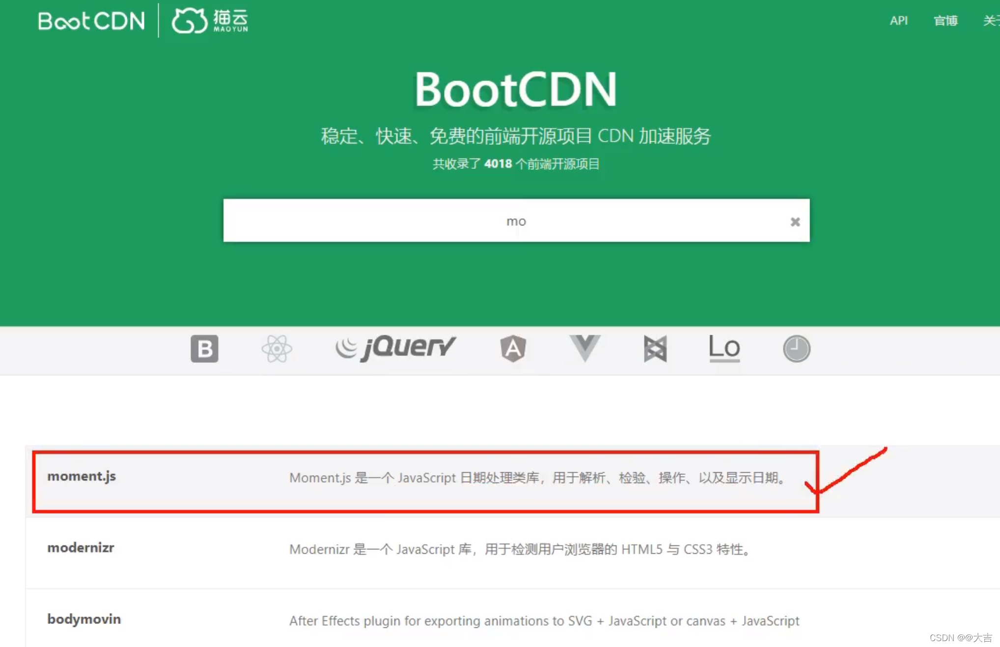


### Vs Code 插件：Live Server


**该插件真乃神器。内置小型Tomcat，以你在VS中打开的文件夹作为根资源，运行于一个小型的服务器。**

该服务器的默认端口号为：5050


如下两张图所示，你就是只写了个HTML，也会给你跑在localhost:5050这个服务器上：


### Vs Code 插件：Auto Close Tag


### Vs Code 插件：Auto Rename Tag

### 其它实用VS插件：

JS Quick Console是真神器，快速生成console.log() 它不香吗？


### Vue Devtools

在使用 Vue 时，我们推荐在你的浏览器上安装 Vue Devtools。它允许你在一个更友好的界面中审查和调试 Vue 应用。


如何安装：

<font color=red size=5px>**在我的Gitee上的代码，已经上传该插件：[https://gitee.com/da-ji/full-stack-developer](https://gitee.com/da-ji/full-stack-developer)，大家需要可自取**</font>


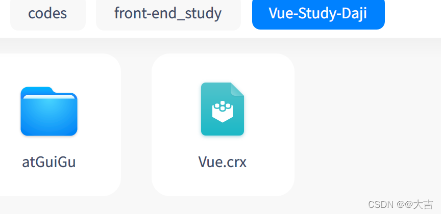

固定该程序（谷歌浏览器）：

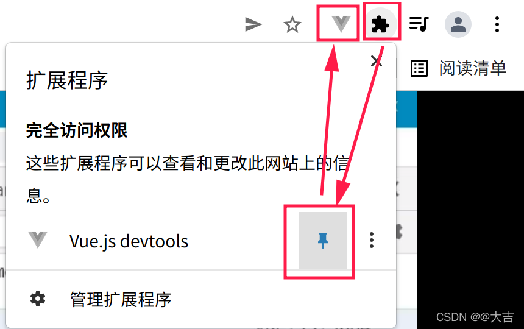


# 二、Vue  基础笔记

## Vue.js 是什么

Vue (读音 /vjuː/，类似于 **view**) 是一套用于构建用户界面的**渐进式框架**。与其它大型框架不同的是，Vue 被设计为可以自底向上逐层应用。Vue 的核心库只关注视图层，不仅易于上手，还便于与第三方库或既有项目整合。另一方面，当与[现代化的工具链](https://v2.cn.vuejs.org/v2/guide/single-file-components.html)以及各种[支持类库](https://github.com/vuejs/awesome-vue#libraries--plugins)结合使用时，Vue 也完全能够为复杂的单页应用提供驱动。


## 1、安装 Vue.js

官网链接：https://cn.vuejs.org/v2/guide/installation.html

**[引入Vue之后，Vue就作为一个运行在全局的构造函数。我们可以使用这种方式直接创建一个Vue实例（点击直接跳转到本文2、创建对象）](#jump1)**

* **1.1 原生安装方式：在HTML中使用JS标签引入**
  可以使用绝对路径和相对路径的方式。如果是绝对路径，就是https://这种直接引入互联网，如果是../static 这种方式，就可以引入自己下载好的vue.js文件。
  **举例：**
  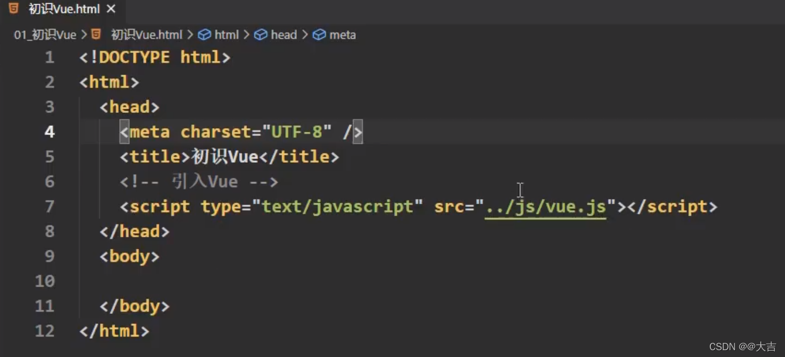
  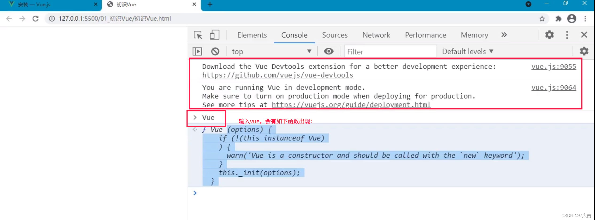


* Vue-Cli


## 2、创建Vue对象，和Vue插值语法{{ xxx }}

**下图一图便知：**

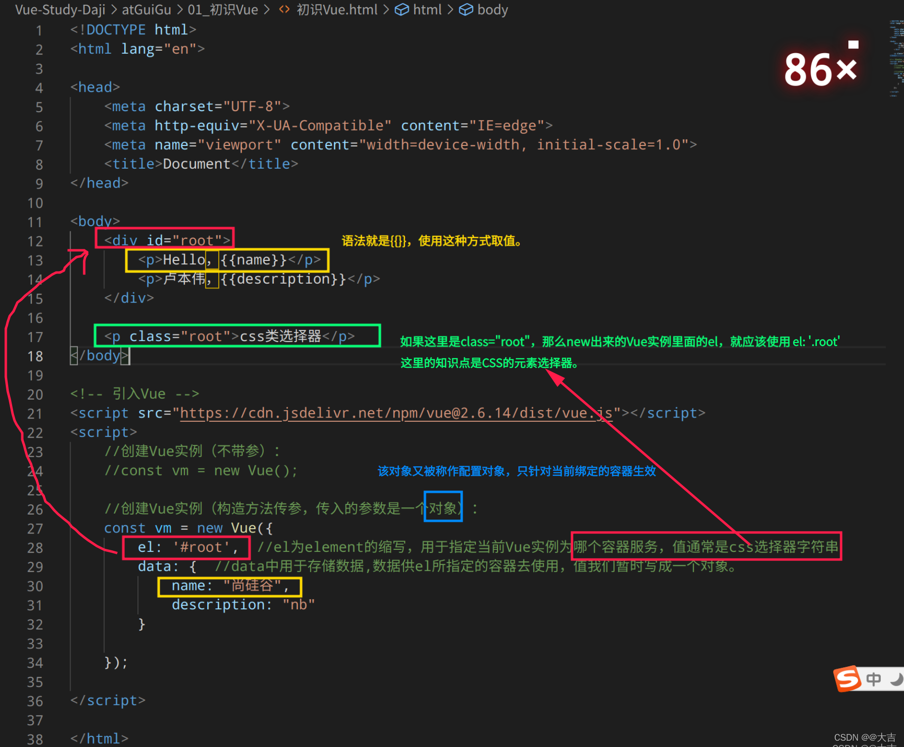
**关于上图的补充细节：**

* 1、一个vue实例，只能绑定一个对应实例。这是一对一关系。多了就解析不了。
* <font color=red>**2、{{}} 插值语法，可以写JS表达式。（这点和thymeleaf有点类似）看下图例子：**</font>
  


## 【补充】el与data的两种写法（Vue实例管理）

#### **el的另外写法如下：**


**原理是因为调用了原型链上的 ```$mount```属性：**

至于什么是原型链，下面会讲解。现在只需要记住可以使用这种方法来绑定容器即可。


#### **data的另一种写法（函数式）如下：**

**组件式开发全部都是函数式。该函数必须返回一个对象。**

<font color=orange>**注意，这个函数，只能写成普通函数。如果写成箭头函数，箭头函数的this是window，普通函数的this就是Vue实现对象：**</font>

**ES语法小课堂：**

普通函数的this指向是调用它的那个对象，而箭头函数没有this，如果强制它this，由于无人调用，最终指向的就是window。


<font color=red>**ES规范中，如果想在对象中写函数，还可以这样简写（和上图完全就是一个东西，只不过简写了而已）：**</font>


<font color=red>**就如上图那个data()一样，今后我们可以看到由很多由Vue管理的函数（Vue对象会调用它）。凡是由Vue管理的函数，都不能写成箭头函数，给老老实实的写成普通函数！**</font>

## 【补充】创建Vue对象时，其它可配置属性

刚刚只介绍了el和data，这里陆续介绍其他的。

### 【methods】可以传各式各样的函数

<font color=red>**但是这个函数仍然受到Vue管理，所以不能写成箭头函数，只能写成普通函数。**</font>

methods是个对象，里面可以传入各式各样的函数。

**传入的函数要符合：JS对象的某个属性是函数的语法规则。可以自行搜索JS对象中，如何让其某属性变成一个函数**

举例：


#### methods 中的 event

event在不使用Vue时，可以通过```windows.event```调用

**在Vue中，如果你不传任何参数，methods中的函数可以自动获取到event：**


<font color=orage>**Vue中，如果你想传一个实参event对象（event为浏览器内置的全局对象），不能直接写event，而是应该写：$event**</font>

**如果你想用event，有一个【实参】占位符 ```$event```，可以传入event给形参中：**


#### 【重要】methods 调用 data 配置属性

**使用this即可。**


红色箭头是使用this获取到data的值，<font color=blood>但是高明的地方在于蓝色箭头，因为蓝色箭头使用v-model，对data的属性进行了**双向绑定**，那么input框一旦改变，那么就会引起data改变，data改变从而引起methods里的自定义函数的返回值改变！！</font>


#### computed 计算属性

[点击直接页内跳转到计算属性这一章：](#jump2)


#### watch 监视属性

[点击直接页内跳转到监视属性这一章：](#jump3)

#### filters 过滤器

[点击直接页内跳转到过滤器这一章：](#jump6)

#### template  HTML模板

下图是最简单的用法


[不过一般不这么用，更多用法详见Vue组件开发一章。](#jump8)

## 3、Vue指令语法

前面在2里面讲了Vue插值语法 {{}},这里讲指令语法。
这一块和thymeleaf更像了，直接在标签上绑定就行。

###  【v-bind】:    绑定html的标签属性：

v-bind可以直接简写为 : (一个冒号)
v-bind: 后面的双引号，和{{}}插值语法一样，可以写JS表达式。
**和thymeleaf一样，v-bind: 可以绑定任何标签。**


### 【v-model】 双向绑定：

https://blog.csdn.net/weixin_44757863/article/details/109110132

**补充两个注意事项：**

1、如下图

2、```v-model:value```的简写就是 ```v-model```。原因很简单，因为v-model只能应用在表单类（输入类元素）上。

例：


###  指令语法和插值语法的区别：

插值语法用于标签体，例：

```html
<p>Hello，{{name}}</p>
```

而指令语法则是直接绑在标签的自定义属性上，例：

```html
<a v-bind:href="defineUrl" v-bind:xxxx="hello">超链接</a>
```


## 4、Object.defineProperty方法

**更高级的给对象添加属性方式。比原来的person.age这种方法高级的多，可以配置很多详细信息。**

用法如下图，更多详细的配置对象属性可以自行百度。


**如果设置了不可以枚举【默认就是不可枚举！】，那么就不能用for-each循环遍历对象属性了。**

* **常用属性之：enumerable，布尔类型，默认值是false。如果想让该字段可枚举，就要显式设置为true。**

* **常用属性之：configurable，布尔类型，默认值是false。控制字段是否可以被删除**
* **常用属性之：writable，布尔类型，默认值是false。控制字段是否可以被修改**
* **常用属性之：value，就是赋值，赋字段一个值。**

### 常用属性之get和set

<font color=red>**get和set这两个属性特别重要，所以单独拿出一节来讲解。**</font>

**来看下面一个场景：**

```javascript
let number = 18
    let person = {
        name: "大吉",
        sex: "男",
        age: number
    }
    console.log(person.age)     //输出18

    number = 22     //将number这个变量修改为22
    console.log(person.age)     //输出仍然是18，而不是22

```

**如果我们想让第二个console.log输出的是22呢？应该怎么操作？**

**这里就引入了我们强大的get和set功能了！！**

* **接上图例子，使用get将输出修改为22：**

```javascript
let number = 18
    let person = {
        name: "大吉",
        sex: "男",
        age: number
    }
    console.log(person.age)     //输出18

    Object.defineProperty(person, "age", {
        get() {
            console.log('有人读取了age属性')
            return number;  //return值很重要
        }
    })
    number = 22     //将number这个变量修改为22
    
    输出的是22。只要有人读取age属性，
    就会调用get方法，get方法return的值就是number这个变量
    
    console.log(person.age)         //22
```

**执行效果如图所示：**


<font color=orange>**所以我们通过get，实现了只要有人读取age属性，就可以执行get这个方法，至于get这个方法你里面想塞什么都可以。反正只要有人读取age这个属性，就执行get。**</font>

* **下面再看set方法：**

```javascript
let number = 18
    let person = {
        name: "大吉",
        sex: "男",
        age: number
    }

    console.log("number的值是：" + number)  //18
    Object.defineProperty(person, "age", {
        //只要有人修改age属性
        //就会调用set方法，且会收到修改age属性的具体值
        set(value) {
            console.log('有人修改了age属性，age：' + value)
             //神奇的操作来了，我们让number这个变量修改
            number = value; 
        }
    })
    person.age = 22     //修改age属性，从而调用set方法
    //非常神奇，我们明明修改了age，却能对number做修改
    console.log("number的值是：" + number)  //22
```

**执行效果图：**


**总结：通过get和set，使得操作对象更加灵活了**

**为什么要学这个Object.defineProperty方法呢？是为了下一节数据代理做准备！**


## 5、数据代理（数据劫持）

概念：数据代理就是通过一个对象对另一个对象中属性的操作（读/写）

**直接看下图：**


**上图中如果有人动了obj2，相当于通过obj2动了obj。 这就是最简单的数据代理实例**

### Vue如何应用数据代理呢？


通过数据代理，我们本应该操作```vm._data.属性```，现在我们直接操作```vm.属性```即可。

## 6、事件处理

### 6.1【v-on】绑定单击事件<font color=orange>（结合前面讲的methods一起学习）</font>

其简写是 @ 符号

**举例：(下面两种方式等价。)**

```javascript
<button v-on:click="func1">按钮</button>
<button @click="func1">按钮</button>

```

**如果你想传参(当然你的func1的定义处也需要定义形参才可以)：**

```javascript
<button v-on:click="func1(a,b,c,d)">按钮</button>
```

**如何将func1和func2被Vue管理呢？移步前文中的methods，一查便知。**


### 6.2事件修饰符

对事件进行操作，前置知识是你得知道JS中的event。

#### 【JS基础之event】

https://blog.csdn.net/lhjuejiang/article/details/79455801

event是一个内置的全局对象，我们看看里面有什么：

```javascript
<button onclick="func1(event)">按钮</button>

	function func1(event) {

        console.log("我是个函数")
        console.log(event.target)
    }
```

**上面的代码调用了func1，并且传入了全局的event，下面来看event的属性：**


#### event的常用姿势：

#####  *event.preventDefault()*

它可以阻止默认事件的发生。比如```<a>```标签，其默认事件是跳转。如果我们想阻止单击超链接的跳转，可以这么玩儿：

```javascript
<a href="https://www.baidu.com" onclick="func0(event)">超链接</a>

function func0(event) {
        event.preventDefault()
}
```

此时打开控制台：


event的 defaultPrevent属性默认为false的，现在是true了。现在单击超链接将不会跳转。

<font color=orange>**回到事件修饰符中来，如果我们想在Vue中实现上述操作，需要怎么做呢？事件修饰符马上登场：**</font>

```javascript
<div id="root">
        <a href="https://www.baidu.com" @click.prevent="func00(event)">被Vue管理超链接</a>
</div>
<script>
    new Vue({
        el: '#root',
        data: {

        },
        methods: {
            func00(event) {
                console.log("vue阻止页面跳转")
            }
        }
    })
</script>

```

上面一坨代码，和*event.preventDefault()* 是一样的效果。

**```@click.prevent ```就是一个事件修饰符。**

#### 常用事件修饰符（共六种）：

prevent、stop、once、capture、self、passive


stop可以阻止事件冒泡到它的上层；
once：once如果作用于按钮或者超链接，那么超链接只有第一次点击的时候 会跳转，除此之外该超链接将不会跳转。	

#### 键盘事件

**以 @keyup.xxx 当键盘弹起 事件 为例：**

**有keyup当然就有keydown，当键盘按下立刻触发某事件。**

上面的```@keyup.esc```就是当esc键弹起，就触发showInfo这个自定义函数（该函数必须受Vue管理，即放在methods中）

**其它常用的按键别名：**

上图的2 解释：假如你想绑定CapsLock，你应该这样写：```@keyup.caps-lock="xxxFunction"```，即转为小写且短横线命名。

**【DEBUG：】似乎这里的事件修饰符绑定的函数不可以写 xxxFunction() 后面的小括号。否则会报错。必须把小括号去掉才可以。**

## 7、计算属性（computed）

<p id=jump2>


### 计算属性要解决的问题

**计算属性要解决的问题是：插值语法{{}} 中，越来越长的JS表达式，不利于阅读和组件化的问题。**

来看案例：


### 计算属性使用案例

**计算属性和data联动，同样可以用this。看下例：**


**上图input框框中的 firstName、lastName 和下图 data中的 firstName、lastName 是双向绑定关系。**

input框变化，data也会变。如果此时有人调用 计算属性中的fullName，那么fullName自然会变化。

<font color=orange>**计算属性中get还有一个属性：只要get里面绑定的data有变化，也相当于调用了一次vm中的 get() ，所以只要data里面的firstName和lastName变了，那么fullName即被调用。**</font>


执行效果图：


**顺便一提，计算属性的属性也有set，和Object.defineProperty的set用法原理一样，如下图所示**


### **计算属性总结：**

**为什么叫计算属性？它是根据 ```data```中，已经有的属性计算得出来的复杂属性。**


### 计算属性简写

**当你的计算属性只有人读，没有人修改，（也就是只有get没有set），那么计算属性可以简写为：**


**上图等价于下面的代码（其实就是简写了get，computed是一个对象，对象的 fullName 字段是一个函数而已）：**

```javascript
	computed: {
            fullName: {
                get() {
                    console.log('get被调用了')
                    return this.firstName + '-' + this.lastName
                }
            }
        }
```

## 8、监视属性（watch）

<p id=jump3>


**概念作用：监视属性仍然是监视 data 的属性变化<font color=red>（也可以监视计算属性！）</font>。**

**监视属性的传值是一个配置对象。**

**当data里面的某字段发生变化，就调用handler函数，handler函数里面有两个入参，分别是newValue、oldValue，顾名思义代表修改前和修改后。如下图所示：**


**如果被监视结构是多级的：**

```javascript
data:{
	numbers:{
		a:1,
		b:1
	}
}

```

**那么应该这样配置：**

```javascript
	watch: {
            'numbers.a': {	//这样配置多级结构
                handler() {
                    console.log("a被改变了")
                }
            }
        }
```


### 监视属性的其它写法：

**调用vm的$watch方法：**


这种写法可以简写。但是**简写的前提是：watch的配置项只有handler一个参数！！！！，不能有什么deep啊，immediate之类的。**

简写办法：


### 监视属性简写

**简写的前提是：watch的配置项只有handler一个参数！！！！**

immediate :true 初始化时让handler调用一下。
什么immediate 啊，deep啊，都不能写，才能用这个缩写。


### 深度监视

**深度监视是默认关闭的。**

**场景如下：**

**如果被监视结构是多级的：**

```javascript
data:{
	numbers:{
		a:1,
		b:1
	}
}

```

如果你想监测  numbers.a 的变化，上文已经讲过如何监视了。这里不做讲解。但是如果a变化了，那么numbers应该是也变化的。<font color=red>**但是Vue却不认为numbers变化了！此时你再监视numbers，假如numbers.a被修改，那么Vue不认为numbers被修改。**</font>

如下所示：

```javascript
		watch: {
            numbers: {
                handler() {
                	//就算numbers.a变了，下一句也不会执行
                    console.log("numbers被改变了")
                }
            }
        }

```

**解决方案：打开深度监视：**

```javascript
		watch: {
            numbers: {
                handler() {
                	deep:true,	//开启深度监视
                	//numbers.a变了，下一句会执行
                    console.log("numbers被改变了")
                }
            }
        }

```

**深度监视总结；**


## 总结watch和computed

**如果是需要异步，请使用watch。因为computed依赖于get和返回值。**

**所有被Vue管理的函数，请写成普通函数。因为你需要让this的指向为vm**

**所有不被vue管理的函数，比如各种回调函数（定时器的回调函数，ajax的回调函数，promise的回调函数），最好写成箭头函数。这样this的指向才能指向它们本来应该指向的。如果你这里写成普通函数，就会造成调用失败，因为你的this指向了vm**

<font color=blood>**因此，到底写普通函数还是写箭头函数，需要判断this指谁。如果需要this指向vm，必须写普通函数，否则（如果需要this指向其它调用者）请使用箭头函数。**</font>


## 9、v-bind 绑定class、style样式

### A、绑定class

其实就是 v-bind 绑定一个class

**可以如下图一样，写成数组，写成字段；也可以写成对象。**

**三种不同的写法：**


**先演示写成字段，和 写成数组：**


<font color=red>**最后演示写成对象（通过true和false决定对象内属性生效与否）：**</font>


### B、绑定style

* **（常用）对象写法**
  

**如下图所示，对象写法里面的属性字段不能瞎写，需要下划线转驼峰的写法：**


* **除了对象写法，还有数组写法（用的不多）：**


## 10、条件渲染（v-if、v-else、v-show）

### A、v-show （控制是否显示）

v-show只能接收布尔类型（既可以直接写true，false；也可以写true和false类型的表达式）：

```<h1 v-show="1 === 3">大吉</h1>```

这样写的话，h1这个标签就会隐藏，因为里面的值是false

**也可以写data里面的类型为 true/false 的属性：**


v-show隐藏掉的元素，只是样式隐藏不可见而已，但是元素还在（invisible = true）。但是下面的v-if却是直接干掉。

### B、v-if

和v-show用法一致，填写一个布尔类型的表达式。

但是和show不同，元素被直接干掉了，而不是样式隐藏。

### C、v-else-if 、v-else

一图便知：


**如果在 条件判断之间，有元素将其打断：**


那么后面就不生效了。


### D、总结


## 11、列表渲染相关

### 11.1 v-for

最简单的实例：


<p id = jump5>


**形参还可以是两个参数：如下图所示；**

第二个参数固定就是索引：


**v-for还可以遍历对象（这里的第2个参数就不是索引了，两个参数分别是 value 和 key）：**


### 11.2 key（面试常问）

在使用for循环的时候，不管是vue还是react，都应该给每一个遍历生成的html元素取一个名字。这就是key

<font color=red>**[如果你不写key ， 那么vue会自动将index作为key。但是非常建议你手动指定一个key。一般情况下不能不写key。index是什么？点我跳转](#jump5)**</font>

举例：


**key还可以填入index：**


**如果你不写key，那么有可能会出现渲染错误的问题。为什么会出现这个问题呢？因为key和虚拟dom有关。**

<font size = 5px>**[key的原理：和虚拟DOM相关，点我页内跳转：虚拟dom和key的对应关系。](#jump4)**</font>


最后看官方定义：


### 11.3 列表过滤（模糊搜索）

**场景：**


 #### watch的实现方案：


下面代码难点如下：

* immediate :true 初始化时让handler调用一下。
* JS基础：Array filter使用
* JS基础：indexOf使用


上述代码大概原理就是：

* 1、使用v-model让输入框中元素绑定到data的 keyWord中
* 2、使用watch监控keyWord，一旦keyWord改变了，立刻执行过滤关键字
* 3、一旦keyWord改变了，过滤关键字之后会返回一个全新的数组，将该数组赋值给data的 filPerson中
* 4、filPerson负责被前端的v-for遍历，显示过滤后（模糊查询后）的结果


#### <font color=red>**使用computed 实现上面的功能**</font>


上述代码大概原理就是：

* 1、使用v-model让输入框中元素绑定到data的 keyWord中

* **2、利用filter，输入框变化引起keyword变化引起persons变化**
* 3、建立计算属性filPersons，当persons有变化，那么就重新计算一次filPersons。
* 4、filPerson负责被前端的v-for遍历，显示过滤后（模糊查询后）的结果

### <font color=red>11.5 【重要！面试题】Vue检测数据改变的原理</font>

**本章Demo引入的vue版本是（2.4.1），如果版本太新会报错：**

```javascript
<!-- 引入Vue -->
<script src="https://cdn.jsdelivr.net/npm/vue@2.4.1/dist/vue.js"></script>
```

#### 引入：

**需求：点击按钮，只修改马冬梅的信息：**


**代码编写：**


**在上图代码中：方式1生效，方式2不生效。这是为什么？？Vue不承认方式2吗？？**


#### 原因分析：

直接赋值的方式，不被vue认为是响应式的。

#### 解决方案1：

**不谋求修改数组单个元素，而是替换整个数组。类似这样：**

```javascript
this.persons = {
{id:001, name:'马老师',age:50,sex:'男'},	//替换该项

{id:002, name:'周冬雨',age:33,sex:'男'},
{id:003, name:'周杰伦',age:33,sex:'男'},
{id:004, name:'周冬雨',age:33,sex:'男'}
}

```

**替换数组 这里可以用filter、concat、slice实现：**


#### 解决方案2 (使用数组变更方法)：

```javascript
this.persons.uns
hift({ name: "jack", age: 70 })

```

<font color=orage>**对Array进行操作，而且想让Array仍旧是响应式，必须使用Vue给我们内置的七个方法：**</font>

> 原生JS这么多操作数组的方法，为什么只有这7个被Vue封装呢？因为这7个元素会改变原生数组。判断依据就是该方法会不会改变原生数组！

为什么上面的解决方案生效呢？因为Vue帮我们封装了数组的常用方法：

**push、pop、shift、unshift、splice、sort、reverse**


vm的push 和 Array的push方法不一样，vue帮我们做了两件事：

* 1、调用了原生数组的push
* **2、触发视图（viewmodel）的更新**


<font color=orage>**使用这种方式增改Array元素，可以使用 = 等于号对其中的对象赋值，其赋值仍旧是响应式的！ 不用非得使用vue内置set方法赋值！**</font>

#### 使用Vue内置set方法添加data对象没有的属性

假如你的dom想添加一个vue的data没有的属性呢？注意是添加没有的，而不是修改现有的。

添加之前没有的，根据上面的Vue检测数据改变的原理, 我们必须使用内置的set方法才能添加一个**响应式的data属性。**


<font color=orange>**直接看案例：点击按钮，给vm添加data属性并展示：**</font>


使用Vue.set 可以实现。

**绝对不能使用： this.student.sex = "男" 这种方式！！**


<font color=orage>**判断是否真的是响应式，依据就是该属性有没有 getter 和 setter（下图就是响应式的）：**</font>


#### 总结：Vue检测数据改变原理


本章全部演示代码如下所示

```html
<!DOCTYPE html>
<html lang="en">

<head>
    <meta charset="UTF-8">
    <meta http-equiv="X-UA-Compatible" content="IE=edge">
    <meta name="viewport" content="width=device-width, initial-scale=1.0">
    <title>Document</title>
</head>

<body>
    <div id="root">
        <button @click="student.age++">年龄+1岁</button> <br />
        <button @click="addSex">添加性别属性</button> <br />
        <button @click="student.sex = '未知' ">修改性别属性</button> <br />
        <button @click="addFriend">在列表首位添加一个朋友</button> <br />
        <button @click="updateFirstFriendName">修改第一个朋友的名字为：张三</button> <br />
        <button @click="addHobby">添加一个爱好</button> <br />
        <button @click="updFirstHobby">修改第一个爱好为：开车</button> <br />

        <h3>姓名：{{student.name}}</h3>
        <h3>年龄：{{student.age}}</h3>
        <!-- 只有vm._data有性别才会显示这个标签 -->
        <h3 v-show="student.sex">性别：{{student.sex}}</h3>

        <ul>
            <li v-for="(h,index) in student.hobby" :key="index">
                {{h}}
            </li>
        </ul>
        <h3>朋友们</h3>
        <ul>
            <li v-for="(f,index) in student.friends" :key="index">
                {{f.name}}--{{f.age}}
            </li>
        </ul>
    </div>

</body>

<!-- 引入Vue -->
<script src="https://cdn.jsdelivr.net/npm/vue@2.4.1/dist/vue.js"></script>
<script>
    //创建Vue实例
    const vm = new Vue({
        el: '#root',
        data: {
            student: {
                name: "大吉",
                age: 18,
                hobby: ["抽烟", "喝酒", "烫头"],
                friends: [
                    { name: "friends1", age: 35 },
                    { name: "friends2", age: 36 }
                ]
            }
        },
        methods: {
            addSex() {
                debugger;
                //Vue.set(this.student, 'sex', '男')    //方式1，必须这样做才能响应式
                this.$set(this.student, 'sex', '男')    //方式2，必须这样做才能响应式
            },
            addFriend() {
                this.student.friends.unshift({ name: "jack", age: 70 }) //必须这样做才能响应式
            },
            updateFirstFriendName() {
                this.student.friends[0].name = "张三"
            },
            addHobby() {
                this.student.hobby.push("学习")
            },
            updFirstHobby() {
                this.student.hobby.splice(0, 1, "开车")
            }
        }

    });

</script>

</html>
```

## 12、Vue收集表单数据

### 单选框（特殊）绑定技巧

**如果input type 是一个radio（复选框），这里较为特殊：**

```html
<!-- v-model 只能收集value值 -->
        男<input type="radio" v-model="sex" value="male" name="sex">
        女<input type="radio" v-model="sex" value="male" name="sex"> <br /><br />
```

**需要v-model绑定data属性的同时，指定value值（value可相等）**


### 多选框（特殊）绑定技巧

**如果input type 是一个checkbox（复选框），这里较为特殊：**


**必须保证绑定data数据是数组，同时必须指定不相同的value：**

<font color=orage>**为啥是数组呢？因为这是多选框，要多选啊！肯定是数组!**</font>


**效果如图（为什么必须用数组接收）：**


### 下拉框绑定技巧


**如果input type 是一个select 和option （下拉框）**

因为 option里面有value属性，所以只需要绑定select即可(option只需要写入value，该value会和vm互动)：

```html
		<select v-model="city">
            <option>请选择校区</option>
            <option value="beijing">北京</option>
            <option value="shanghai">上海</option>
            <option value="shenzhen">深圳</option>
            <option value="wuhan">武汉</option>
        </select>
```


### v-model 特殊用法

去掉前后空格，只需要 ```v-model.trim```即可：


### 总结


### 全部演示代码：

效果：


**代码：**

```html
<!DOCTYPE html>
<html lang="en">

<head>
    <meta charset="UTF-8">
    <meta http-equiv="X-UA-Compatible" content="IE=edge">
    <meta name="viewport" content="width=device-width, initial-scale=1.0">
    <title>Document</title>
</head>
<div id="root">
    <form>
        账号：<input type="text" v-model="name"> <br /><br />
        密码：<input type="text" v-model="password"> <br /><br />
        性别：
        <!-- v-model 只能收集value值 -->
        男<input type="radio" v-model="sex" value="male" name="sex">
        女<input type="radio" v-model="sex" value="female" name="sex"> <br /><br />
        爱好：
        学习<input type="checkbox" v-model="hobby" value="study">
        打游戏<input type="checkbox" v-model="hobby" value="game">
        吃饭<input type="checkbox" v-model="hobby" value="eat">
        <br /><br />
        校区：
        <select v-model="city">
            <option>请选择校区</option>
            <option value="beijing">北京</option>
            <option value="shanghai">上海</option>
            <option value="shenzhen">深圳</option>
            <option value="wuhan">武汉</option>
        </select>
        <br /><br />
        其他信息：
        <textarea></textarea> <br /><br />
        <input type="checkbox" v-model="agree">阅读并接受<a href="www.baidu.com">《用户协议》</a>
        <button>提交</button>
    </form>
</div>

<body>

</body>

<script src="https://cdn.jsdelivr.net/npm/vue@2.4.1/dist/vue.js"></script>
<script>
    const vm = new Vue({
        el: '#root',
        data: {
            name: "",
            password: "",
            sex: "male", //默认是男
            hobby: [],
            city: "beijing",
            other: "",
            agree: ""
        }

    });

</script>

</html>
```

<p id=jump6>


## 13、Vue过滤器（Linux的管道符 |）

这章能实现的功能，使用method，和computed完全能实现，只不过过滤器能够进一步的简化而已。


**直接看例子：**


### 过滤器传参

如果只传一个参数，那么默认肯定就是管道符前面的元素（很好理解，这和linux管道符是一样的）

但是过滤器也可以传入多个参数：

**其中第一个参数，一定是管道符前面的元素，只有第二个参数才是自定义的参数：**


<p id = jump7>


### 全局过滤器和局部过滤器

之前写的是局部过滤器，只有一个vm能用。

下图展示了全局过滤器：


## 14、Vue常用其他内置指令（简单）

之前学过的指令：


### v-text


### v-html （动态渲染HTML带来的问题）

比起v-text更高级的地方：可以解析html标签：


效果如下：


**但是这种方法是有风险的：** 


<font color=red>**在网站上动态渲染HTML非常危险，容易导致XSS攻击！，比如窃取cookie！**</font>

### 【补充知识】cookie机制和xss攻击

**cookie机制**


跨浏览器读取Cookie是不生效的：


<font color=orage>**里面包含了我们的用户信息，权限校验等等各种信息**</font>

<font color=orage>**这也就解释了使用postman调用某些网站接口调用不通，必须得有cookie才能调用通过。**</font>

**而cookie包含了一系列权限校验信息。**

**查看cookie 如下图所示：**


<font color=red>**也就是说：假如有人得知了我们的某网站的cookie全部信息，并且将这些cookie设置到该人的浏览器上，那么该人不用登录就可以登陆到你的账号上了！！**</font>


#### xss攻击：

XSS的攻击方式就是想办法“教唆”用户的浏览器去执行一些这个网页中原本不存在的前端代码。

比如使用 ```document.cookie```命令，窃取用户的cookie信息！


### v-cloak （n.斗篷 vt.遮盖;掩盖）

#### JS阻塞

**如下图所示，如果JS代码引入在body之外：**


**一旦链接阻塞，上图会让整个浏览器阻塞5秒，等JS全部加载出来，才能渲染界面！**

但是如果JS像下图一样引入：


**v-cloak作用是配合css使用。在JS阻塞(vue.js加载不出来)之前，v-cloak标签会被自动移除。也就是说，只要vue.js加载出来，那么v-cloak标签就不存在。**


上图中，如果遇到JS阻塞，h2会被css控制而不显示。一旦vue.js被加载出来，v-clock将不存在。从而使CSS代码失效，h2会显示出来。


### v-once（只动态渲染一次）


### v-pre

vue不会解析带有v-pre的节点。这个节点不能乱用，只有优化性能时候用得到


## 15、Vue自定义指令

**需求：**


### 函数式指定（完成需求1）


### debug之大写驼峰命名法：


**所以在官方风格指南中，如果遇到长单词，别用驼峰了，用短横线。**

### 对象式指定（完成需求2）

对象式指定比较高级，它能完成所有函数式指定的功能，并且还能自定义调用时机

**对象式指定，必须写Vue给我们规定的函数名，否则不予解析。常用的函数名有三个：bind、inserted、update**


**上图的三个函数（bind、inserted、update），其形参都可以接收到【函数式指定】说的element和binding这两个形参。**


<font color=orage>**bind、inserted、update 三种方法，就是vue解析的三种不同的时机。在vue解析的不同时刻，每一个时间点，vue会帮我们调用这三种不同的函数之一。**</font>


### 全局自定义指令和局部自定义指令

[和前面的全局过滤器和局部过滤器规范完全一致：](#jump7)

**函数式指定全局：**


**对象式指定全局：**


区别就是第二个参数到底是传对象还是传函数而已。

### 总结


## 16、【面试】vue生命周期函数（也称钩子）

react也有类似的钩子概念，和vue的概念类似

### **引入：**

需求：做一个这个效果：

**方式一（不推荐）：**

下面这种方法依赖于形参vm。并没有集成在Vue初始化里面。

```javascript
<body>
    <div id="root">
        <h2 :style="styleObj">欢迎学习vue</h2>
    </div>
</body>

<script src="https://cdn.jsdelivr.net/npm/vue@2.4.1/dist/vue.js"></script>
<script>
    const vm = new Vue({
        el: '#root',
        data: {
            styleObj: {
                //opacity 是style的样式，负责控制透明度
                opacity: 0.5,
                color: "orange"
            }
        },

    });
    //方式1：通过操作vm的样式（不推荐）
    setInterval(() => {
        vm.styleObj.opacity -= 0.01
        if (vm.styleObj.opacity <= 0) vm.styleObj.opacity = 1
    }, 16);
</script>

```

**方式二：破坏了原来需求（需要点一下才能触发）**


上面两种方法均无法完成需求，下面使用mounted将需求完成：

### mounted（挂载）：

**概念：vue完成模板的解析并把初始的真实DOM元素放入页面后（挂载完毕），会调用mounted。mounted只会被调用一次。**

**使用mounted完成上述需求：**

```javascript
<body>
    <div id="root">
        <h2 :style="styleObj">欢迎学习vue</h2>
    </div>
</body>

<script src="https://cdn.jsdelivr.net/npm/vue@2.4.1/dist/vue.js"></script>
<script>
    const vm = new Vue({
        el: '#root',
        data: {
            styleObj: {
                //opacity 是style的样式，负责控制透明度
                opacity: 0.5,
                color: "orange"
            }
        },
        methods: {

        },
        mounted() {
            console.log("vue模板被解析完成，会调用我一次！")
            setInterval(() => {
                this.styleObj.opacity -= 0.01
                if (this.styleObj.opacity <= 0) this.styleObj.opacity = 1
            }, 16);
        },

    });


</script>
```

**完美实现！**

<font color=orage>**通过观察上述mounted用法，可以知道，mounted其实就是一个普通的函数。这个函数的调用时机，其实就是DOM加载完毕后，且只会被调用一次。**</font>

mounted就是一个vue生命周期函数。


### 生命周期函数的this问题：

<font color=orange>**生命周期函数的this已经被维护好，就是指vm。所以里面如果需要用到的函数形参会传入箭头函数（比如上面的setInterval，第一个参数就是箭头函数），就应该写箭头函数！该箭头函数里面的this，就会找到vm本身！**</font>

### 其它的生命周期函数

**来源于官网的生命周期图示：**


**尚硅谷更进一步的解释：**


上图中红色框框的，都是生命周期函数（可以像mounted那样去调用）

```vm.$destroy()```
用于完全销毁一个vue实例。


### 钩子间变量传递小技巧（局部变量变全局变量）

<font color=orage>**利用钩子函数的this就是指vm本身的特性，可以将局部变量挂在vm上，这样钩子间局部变量就成了共享的全局变量了**</font>

**例子：**


**解决方案：将id这个变量挂在vm上，它就成了全局的了：**


### 路由相关的钩子函数

前置知识是路由，移步路由章节。


### 总结

其实能够得最多的两个钩子就是mounted和beforeDestroy两个


# 三、Vue 组件化开发

## 1、组件基础概念

**传统方式开发的痛点和引入组件的好处：**


**vm对象和组件的关系：**

**首先，只有一个vm对象。剩下的都是组件，组件又称小vm，具有部分vm功能：**


## 2、非单文件组件（是前置知识）


先学这个。

### <font color=orage>**使用```Vue.extend```创建组件**</font>

**里面传入的配置对象，和new Vue的时候传入的配置项几乎一致，但是有下面几点需要注意：**

<p id=jump8>


* 一定不要写el配置项。因为组件的定义决定了，组件作为模块化开发的一块砖，哪里需要哪里搬。所以组件不需要对任何父组件负责，只对vm本身负责。
* data必需写成函数式，否则报错。原因和上面一样，组件如果被多次引用，写成函数可以保证局部的封装性。
* 使用template对html进行渲染, **注意template内的html只能有一个根元素。**
* **组件分为局部组件和全局组件。** 注册全局组件只需要 ```Vue.component('组件名',要注册的组件位置)```即可。通常这两个参数是一样的


### **创建组件三部曲：**


代码如下：

```html
<!DOCTYPE html>
<html lang="en">

<head>
    <meta charset="UTF-8">
    <meta http-equiv="X-UA-Compatible" content="IE=edge">
    <meta name="viewport" content="width=device-width, initial-scale=1.0">
    <title>Document</title>
</head>

<body>
    <div id="root">
        <!-- 第三步：在root中编写组件标签 -->
        <xuexiao></xuexiao>
        <xuesheng></xuesheng>
    </div>
</body>
<script src="https://cdn.jsdelivr.net/npm/vue@2.4.1/dist/vue.js"></script>
<script>

    //第一步：创建组件1
    const student = Vue.extend({
        //使用template对html抽出来（组件化）。注意template内的html只能有一个根元素。
        template: `
        <div>
            <h2>姓名：{{name}}</h2>
            <h2>年龄：{{age}}</h2>
        </div>
        `,
        data() {
            return {
                name: "大吉",
                age: "18"
            }
        },
    })
    //第一步：创建组件2
    const school = Vue.extend({
        template: `
        <div>
            <h2>地址：{{address}}</h2>
        </div>
        `,
        data() {
            return {
                address: "北京"
            }
        },
    })

    const vm = new Vue({
        el: '#root',
        //第二步：vm注册组件（局部注册）
        components: {
            xuexiao: school,
            xuesheng: student
        }

    });


</script>

</html>
````


**效果图如下：**


### **非单文件组件注意事项（debug）：**

* **组件名的大小写问题会报错。要注意。**
* **组件名和HTML元素不能重名**
* 可以使用name字段指定组件在**开发者工具**中的名字（仅能骗过开发者工具而已）
  


### 组件的简写（直接写配置对象即可）

**下面两种写法等价！**


### 组件的嵌套

**如下图：组件间有嵌套关系。**


**任务目标：**

在Vue开发者工具中，实现下图嵌套结构：

<font color=orage>**【注】：标准化开发中，我们会建立一个组件，该组件只负责管理组件，不负责渲染数据。也就是说这个组件承担管理者角色，只对vm(root)负责。在上图中，app组件就承担了上述角色。**</font>


**代码实现：**

```html
<!DOCTYPE html>
<html lang="en">

<head>
    <meta charset="UTF-8">
    <meta http-equiv="X-UA-Compatible" content="IE=edge">
    <meta name="viewport" content="width=device-width, initial-scale=1.0">
    <title>Document</title>
</head>

<body>
    <div id="root">
        <!-- 什么都不用写！ -->
    </div>
</body>
<script src="https://cdn.jsdelivr.net/npm/vue@2.4.1/dist/vue.js"></script>
<script>

    //student写在上面，school在下。防止school引用不到儿子
    const student = Vue.extend({
        template: `
        <div>
            <h2>姓名：{{name}}</h2>
            <h2>年龄：{{age}}</h2>
        </div>
        `,
        data() {
            return {
                name: "大吉",
                age: "18"
            }
        },
    })
    //school和student是父子关系
    const school = Vue.extend({
        template: `
        <div>
            <h2>地址：{{address}}</h2>
            <student></student>     
        </div>
        `,
        data() {
            return {
                address: "北京"
            }
        },
        components: {    //套娃，将儿子student引入进来
            student
        }
    })
    //hello和school是平级关系
    const hello = Vue.extend({
        template: `
        <div>
            <h2>{{hello}}</h2>
        </div>
        `,
        data() {
            return {
                hello: "hello"
            }
        },
    })
    //组件的管理者app（只对vm负责的组件，一人之下万人之上）
    //该组件不负责任何渲染。
    const app = Vue.extend({
        /* 下面千万别忘了用div包裹school和hello，因为只能有一个root */
        template: `
        <div>
            <school></school>   
            <hello></hello>  
        </div>   
        `,
        components: {
            school,
            hello
        }
    })

    const vm = new Vue({
        el: '#root',
        template: `
            <app></app>
        `,
        //第二步：vm注册组件（局部注册）
        components: {
            app
        }

    });


</script>

</html>

```

### VueComponent构造函数

组件是什么？如果我们输出一个组件会怎样？


发现它其实是一个函数，准确的说他是一个构造函数。


* 特别注意：每次调用```Vue.extend```，返回的都是一个全新的ViewComponent！
* ViewComponent实例对象，以后简称vc
* <font color=orage>**vc中的this，指向vc本身；vm中的this，指向vm本身；</font>**


<p id=jump9>


## <font color=red>【极其重要、面试】Vue原型链，和内置关系</font>

### Vue 和 vm的关系

Vue是一个函数，vm是其new出来的实例对象

因此:```vm.__proto__ === Vue.prototype```

### VueComponent 和 VueComponent实例对象的关系


<font color=orage>**VueComponent 是一个函数，VueComponent实例对象是一个对象**</font>

**当渲染VueComponent时，VueComponent实例对象就被自动new出来了**


因此：```VueComponent实例对象.___proto___=== VueComponent.prototype.__proto__ ```

### **有了上面的铺垫，Vue有一个重要的内置关系：**

* ```VueComponent.prototype.__proto__ === Vue.prototype```
* 所以：```VueComponent实例对象.__proto__ === VueComponent.prototype.__proto__  === vm.__proto__ === Vue.prototype  ```
* 有这个内置关系的原因是：	让VueComponent实例对象可以访问到Vue原型的属性和方法。


**【补充】：JS原型相关知识：**

**注意：显式原型属性只有函数有，对象没有！对象只有隐式原型属性！**

**所以，函数.prototype 是一个对象。它再往上追溯原型链，就只能找```__proto___```了**

**因此```VueComponent.prototype.__proto__ === Vue.prototype```，对象===对象，这个等式成立。**


那么 Vue.prototype（也就是```vm.__proto__```）身上有什么呢？	有生命周期函数（mount, watch 等等）：


**继续走 :** 

<font color=orage>**函数实例的原型属性（```函数对象.__proto___```）,永远指向自己缔造者（函数）的原型对象(```函数.prototype```)**</font>

**原型链的尽头是Object，Object实例的原型属性指向null。这就是原型链的尽头了**

**如下图的绿色箭头，则可反映上述原型链关系：**


**最后一张图：**


**Vue这样做的目的：让VueComponent可以访问到Vue原型的属性和方法。**


## 3. 单文件组件（.vue）

前置知识是非单文件组件，必需学那一章。否则看不懂.


### 语法概述


使用默认暴露方式将组件暴露出去（ES6模块化知识）：

* 默认暴露
  

**上图代码可以直接简写成：**


<font color=orage>**【注】：如上图所示，name字段必须和文件名一致。这是约定俗成的规矩.**</font>


### 组件的管理者，入口组件

还记得上文讲单文件组件时提到的app组件吗？


在Vue模块化开发中，的确有这么个组件：

**app组件写法如下：**


<font color=orage>**app组件已经一人之下万人之上了。所以这就引出了入口组件，也就是vm：**</font>

在vue模块化开发中，使用main.js作为入口组件，它负责引入App.vue(管理者组件)：


**在html页面中，只需要准备好一个id为root的div，然后引入main.js ，即可。**

## 4、Vue-CLI (Command Line Interface)

vue脚手架是vue官方提供的标准化开发工具（开发平台）

**其实就是一个官方版本的webpack！**

官方文档：https://cli.vuejs.org/zh/

### 安装CLI、使用CLI创建启动工程

NODEJS：更换淘宝镜像源

```npm config set registry https://registry.npm.taobao.org```

执行命令安装CLI：

```npm install -g @vue/cli```

**如何用该脚手架创建工程：**

* cd到你想创建的目录

* 执行命令：```vue create 工程名```

* 手动选择创建Vue2还是Vue3版本（这里选择Vue2）

  

* cd到创建好的工程中，执行命令：```npm rum serve```

  

  如上图所示，一个内置的Tomcat就起来了，直接访问localhost:8080即可get到你的Vue项目。

  **神奇的是：下面这串地址Network，如果你同事（处在一个局域网环境下）输入了，也可以get到你的Vue项目！**


### 分析脚手架目录结构


#### 配置文件

* package.json

  node的知识点，符合NPM配置规范的会有这个文件。

  web-pack里面的短命令也在其中。

  

* babel.config.js 

  babel的配置文件，涉及到ES6转换ES5

* package-lock.json

		包版本控制文件。包括用到的插件，资源文件等等。
		
		作用是以最快速度安装到指定版本，版本锁定功能在这个文件中锁着。

#### 其他目录

* main.js

  就是上文说的入口组件。当 ```npm run serve```被执行了，就会执行main.js


#### 其它注意事项：

* index.html的路径问题

		内置了BASE_url，实际上指的就是./public 目录 


#### 引入静态资源文件（如bootstrap.css的方法）


#### 总结文件结构


#### 关于vue脚手架配置文件修改


#### 关闭vue语法检查/语法检测：


在vue.config.js中配置：

```lintOnSave:false```


## 5、组件开发其它相关属性

### 5.1 render函数（意为渲染）

render 提供，提交，渲染

**render函数的原生写法**


**通过原生写法，我们可以发现，它其实就等同于之前学非单文件组件中的创建vm样例中的template和components的功能。**


**但是我们一般不这样写render，而是使用简略写法：**


**其实就是帮我们创建模板，加载组件。**


**为什么要用render？因为vue-cli默认加载的是运行版本的Vue，它不认识 template和components这两个标签，所以只能用render。**


### 5.2  $refs属性


#### 概述

**在Vue中，如果你想拿Dom元素，用下图的方法就不优雅了：**


**Vue解决的办法也很简单：设置一个$refs属性，该属性绑定在VueComponent实例对象(vc)上**:

<font color=orage>**如果绑定在原生HTML标签上，本质就是给其加了个id属性（下图等价于上图）**</font>


#### <font color=orage>【重要】ref绑定组件标签</font>

如果ref绑定了一个组件呢？那么拿到的就是该子组件的vc。

app的vc有个$ref属性，$ref属性上有一个该子组件的vc


#### **总结：**


### 5.3 props配置项（重要，可用于父子组件间传输数据）


**如果不是父子组件，还可以用其它方式传输数据。**

需求引入：

如下图所示，Student.vue是一个组件。


我们想在下图中创建两个Student，每个Student分别有不同的数据。比如第一个student数据就如上图，但是第二个student数据 的name不叫张三了，想改成李四。

其实这个需求就是复用Student.vue 这个组件。


**解决方案如下图：**

#### 自定义组件传入属性：

**props可用于组件间传输数据（父组件传数据到子组件的data上）**

<font color=orage>**传入侧：传入的属性一般是父组件(App.vue)，也就是下图。**</font>

<font color=orage>**接收侧：而写props接收参数的一般是子组件。其实接收完props，相当于在自己的data属性中绑定了props的一些属性。**</font>


在想要被复用组件中，data部分字段可以写成props。如下图所示，共有三种写法：


#### props的三种写法(从简单到复杂)


#### 总结：

* <font color=orage>**这个props属性，其实就是data里的属性。props可用于组件间传输数据（父组件传数据到子组件的data上）**</font>data在vc身上，可以直接用this.xxx获取，那么props里面的字段自然也可以。

* 但是props的字段优先级高于data的字段，也就是说假如data和props有同名字段，vue会帮我们优先渲染props的值。

* **props字段一旦确定，不能被篡改。如果你想篡改，请利用data篡改props。**


**【注意】：props是只读的。Vue会对props的修改提出警告。如果你真要修改，请利用data篡改props。<font color=red>用v-model双向绑定props是高危操作，因为会引起props的修改！</font>**


#### 更多案例：父组件利用v-for配合props，动态建立多个子组件

**父组件传入代码：**

```javascript
<ul>
		<MyItem v-for="(todoObj,index) in todos" :key="todoObj.id" :todo="todoObj"></MyItem>
</ul>
```


todos就是一个数组，里面有一堆不同的对象。todoObj是数组的每个元素。

**todo就是要传给子组件的自定义属性，每次传输单个todoObj给子组件。注意要用 v-bind (:) 绑定。**


**子组件接收代码：**

```javascript
<script>
    export default {
        name:'MyItem',
        props:['todo']
    }
</script>
```

虽然没写data，但是props里的todo已经可以按照data属性用了。

#### <font color=orage>【重要】儿子如何给父亲传数据呢</font>

**答案是传入函数调用。父亲传给儿子一个函数，然后儿子用props接该函数，接到之后调用该函数，向该函数里传入儿子的数据。这样儿子的数据就传递给父组件了。**


**父代码：**

```javascript
<template>
  <ul>
    <Son
	  //将一个函数传给儿子，儿子会调用该函数，从而给父亲传输数据。
      :fatherFunc="myFunc"  //千万不能加小括号！否则报错
    ></Son>
  </ul>
</template>

<script>
import Son from "./Son.vue";

export default {
  name: "Father",
  components: { Son },
  methods: {
    myFunc(id){
      console.log("已经接收到儿子的数据了！"+id)	//输出123
    }
  },
};
</script>
```


**子代码：**

```javascript
<button @click="transToFather">点我把儿子的数据传给父亲</button> //调用方法
<script>
export default {
    name:'Son',
	data() {
		return {
			sonId:123	
		}
	},
    props:['fatherFunc'],
	methods: {
		transToFather(){
			this.fatherFunc(this.sonId)	//调用父亲给的函数，将儿子的id传入。这样父亲就能收到儿子的数据
		}
	},
}
</script>
```


**除了这种方式子给父传数据之外，还可以移步第八章：8、组件自定义事件（$emit）**


#### 【重要】兄弟组件之间如何传输数据

兄弟之间，它们肯定有共同的父组件。比如App，App一定是最顶级的父组件

所以可以通过A兄弟传给父亲，父亲再传给B兄弟的方法，来实现兄弟组件之间的传输

这是比较原始的传输方式。关于使用props父传子，子传父，兄弟互传，详见尚硅谷视频：

https://www.bilibili.com/video/BV1Zy4y1K7SH?p=72


### 5.4 mixin（混入）

**mixin需要解决的问题场景：**


#### 局部引入混合

先编写 混合.js 文件：


然后在一个组件中引入该混合：


#### 全局引入混合

**你要是如下图这么写，只要写在入口函数里，那你所有的vc和vm都引入了该混合！**


**总结：**


### 5.5 插件（install）


#### 插件应用场景（类似于java的导jar包）


**类似于java的导入jar包，```import java.util.Map;```，引用别人已经写好的强大工具！**

**比如之前讲到的：**

* 过滤器
* 全局指令
* 混入
* 给Vue原型上添加一个方法，使得vm和vc共享该方法：（```Vue.prototype.hello = ()=>{alert("你好啊")}```）

**如下图所示，建立插件：**


**在入口处（main.js）全局引用插件（只有入口处才能写大Vue，也就是vm）：**


**然后任意组件vc都可以使用插件中给我们提供的强大功能了：**


#### 总结


### 5.5 scoped CSS样式作用域


**scoped解决的痛点：**

两个不同的组件，class属性重名

类选择器也都一样，但是颜色不同。

如果此时在app处同时引入这两个组件，就会引发样式冲突！


**解决方案：使style只对本组件生效！**


Add "scoped" attribute to limit CSS to this component only

```javascript
<!-- Add "scoped" attribute to limit CSS to this component only -->
<style scoped>
h3 {
  margin: 40px 0 0;
}
ul {
  list-style-type: none;
  padding: 0;
}
li {
  display: inline-block;
  margin: 0 10px;
}
a {
  color: #42b983;
}
</style>
```


## 6、TODO List 案例 (原始版本)


**需求：**


**该案例所有知识点都之前学过。这里只给出代码位置：**

<font color=red size=5px>**Gitee：[https://gitee.com/da-ji/full-stack-developer](https://gitee.com/da-ji/full-stack-developer)，大家需要可自取**</font>


**总结：**


## 7、浏览器本地存储(localStorage,sessionStorage)

**概念介绍：**

**未登录的情况下，搜索：皮鞋；关闭浏览器再重启，仍然有该记录**
**说明浏览器将数据缓存到了本地硬盘上：**


**查看该网站的在浏览器中的本地存储：**


### **纯JS实现浏览器本地存储功能：**

#### localStorage

下面的api是localStorage的一组功能，还有一个兄弟叫sessionStorage，功能一样。

```html
<!DOCTYPE html>
<html>
	<head>
		<meta charset="UTF-8" />
		<title>localStorage</title>
	</head>
	<body>
		<h2>localStorage</h2>
		<button onclick="saveData()">点我保存一个数据</button>
		<button onclick="readData()">点我读取一个数据</button>
		<button onclick="deleteData()">点我删除一个数据</button>
		<button onclick="deleteAllData()">点我清空一个数据</button>

		<script type="text/javascript" >
			let p = {name:'张三',age:18}

			function saveData(){
				localStorage.setItem('msg','hello!!!')
				localStorage.setItem('msg2',666)
                	//存对象需要用JSON序列化一下
				localStorage.setItem('person',JSON.stringify(p))
			}
			function readData(){
				console.log(localStorage.getItem('msg'))
				console.log(localStorage.getItem('msg2'))

				const result = localStorage.getItem('person')
				console.log(JSON.parse(result))

				// console.log(localStorage.getItem('msg3'))
			}
			function deleteData(){
				localStorage.removeItem('msg2')
			}
			function deleteAllData(){
				localStorage.clear()
			}
		</script>
	</body>
</html>
```

**就算浏览器整个关闭再重启，localStorage仍然存在。**

#### sessionStorage

<font color=orange>**这里的session和后端的session不同。session的意思为会话。假如适用sessionStorage，那么就仅仅应用于一次会话。也就是浏览器一旦关掉，sessionStorage就消失了**</font>

```html
<!DOCTYPE html>
<html>
	<head>
		<meta charset="UTF-8" />
		<title>sessionStorage</title>
	</head>
	<body>
		<h2>sessionStorage</h2>
		<button onclick="saveData()">点我保存一个数据</button>
		<button onclick="readData()">点我读取一个数据</button>
		<button onclick="deleteData()">点我删除一个数据</button>
		<button onclick="deleteAllData()">点我清空一个数据</button>

		<script type="text/javascript" >
			let p = {name:'张三',age:18}

			function saveData(){
				sessionStorage.setItem('msg','hello!!!')
				sessionStorage.setItem('msg2',666)
				sessionStorage.setItem('person',JSON.stringify(p))
			}
			function readData(){
				console.log(sessionStorage.getItem('msg'))
				console.log(sessionStorage.getItem('msg2'))

				const result = sessionStorage.getItem('person')
				console.log(JSON.parse(result))

				// console.log(sessionStorage.getItem('msg3'))
			}
			function deleteData(){
				sessionStorage.removeItem('msg2')
			}
			function deleteAllData(){
				sessionStorage.clear()
			}
		</script>
	</body>
</html>
```


#### **总结：**


## 8、组件自定义事件（$emit）

**父组件通过给子组件绑定自定义事件的方式，来实现不用props就可以接收到子组件传递来的数据。**

这种方法仍然做不到兄弟间直接传递。只能通过父子关系间接传递


根本原理是：父组件将一个函数绑定在子组件vc实例上；子组件通过

**思考：绑在子组件vc实例上，是不是之前还学过一个：$refs属性？没错。使用$refs属性也能实现该功能。**

### 绑定（好几种写法）：

**父组件绑定：**


> 如果你使用的是ref绑定，可以用mounted 触发：
>
> 			mounted() {
> 		
> 	     this.$refs.student.$on('atguigu',this.getStudentName) *//绑定自定义事件*
> 		
> 	 },

**子组件使用this.$emit触发（因为绑在this上，所以可以使用this触发）：**

<font color=orage>如下图所示：第一个参数是父亲指定的自定义事件名，第二个参数到第n个参数是要传给父亲的形参们。可变参数列表：</font>


### 解绑（this.$off）


如果这样写：```this.$off()```即为解绑所有的自定义事件（什么参数都不传就是解绑全部）


### native修饰符（绑定原生标签，非自定义标签）

父组件不仅仅能给子组件绑定自定义的标签，还能绑定像```@click="xxx"```这种原生标签

但是像上面这种直接绑定是不生效的（会被认为你绑了自定义标签），此时必须这么绑定：

```@click.native="xxx"```


### 总结

这种方法仍然做不到兄弟间直接传递。只能通过父子关系间接传递

事件的回调函数，写在了父组件中！


### 补充（开发者工具事件视图）


## 9、全局事件总线

### 概念

**任意组件间进行通信！**

它并不是一个新知识点，用到的所有知识，上面全都有。只是一种思想罢了。如下图所示：


上图中的X组件，它什么活儿也不干，只是为了各组件传递事件时用的。

**X组件作为所有组件的协调者，X必须保证全局可见性。**

<font color=orage>**X应该放在哪里呢？答案是vm身上。这样可以保证所有组件实例对象(vc)都可见！**</font>

[为什么？理论基础是什么？点我页内跳转Vue原型相关！](#jump9)

### 原理

**去main.js上面，建立X：**

<font color=red>**为什么要去main.js上操作？因为只有main.js上才有VM！！！**</font>


**打开任意一个组件，发现可以找到该X：**


**到此为止，原理讲解完毕！但是实际开发中仍然不是这样绑定的，接下来看实操：**

### 如何注册事件总线

**在main.js上注册全局事件总线：**

这里的$bus，就是前面说的x。约定俗成地叫做$bus  (bus英文译为总线)

```javascript
//引入Vue
import Vue from 'vue'
//引入App
import App from './App.vue'
//关闭Vue的生产提示
Vue.config.productionTip = false


//创建vm
new Vue({
	el:'#app',
	render: h => h(App),
	//在生命周期函数（钩子）上注册
	beforeCreate(){
		//安装全局事件总线，这里的this即vm!
		Vue.prototype.$bus = this;	//$bus就是vm。vm可以调用$emit等。
	}
})
```


### 使用事件总线任意组件传输数据：

**首先讲解知识点：$on** 

> 使用 $on(eventName) [监听](https://so.csdn.net/so/search?q=监听&spm=1001.2101.3001.7020)事件
> 使用 $emit(eventName) 触发事件
> 如果把Vue看成一个家庭（相当于一个单独的components)，女主人一直在家里指派($emit)男人做事，而男人则一直监听($on)着女士的指派($emit)里eventName所触发的事件消息，一旦 $emit 事件一触发，$on 则监听到 $emit 所派发的事件，派发出的命令和执行派执命令所要做的事都是一一对应的。

**$on，和$emit是一对，它们的形参也是一致的（都是事件名），一个是监听一个是触发。**

**直接看例子：**

Student组件和School组件是兄弟组件。

**Student代码：**

```javascript
<script>
	export default {
		name:'Student',
		data() {
			return {
				name:'张三',
				sex:'男',
			}
		},
		methods: {
			sendStudentName(){
				this.$bus.$emit('hello',this.name)
			}
		},
	}
</script>
```

当sendStudentName触发，立刻使用事件总线($bus)上的$emit方法触发事件发送。

**School代码：**

当$emit被触发，$on立刻接收（触发回调）

由于$on和$off是一对，在被摧毁之前养成使用$off解绑的好习惯。

```javascript
<script>
	export default {
		name:'School',
		props:['getSchoolName'],
		data() {
			return {
				name:'尚硅谷',
				address:'北京',
			}
		},
		mounted() {
			this.$bus.$on('hello',data =>{
				console.log("我是school组件，我收到了来自兄弟的数据："+data) //输出”张三“
			})
		},
            //好习惯：一旦该vc被干掉了，解绑自定义事件。
            //思考：为什么不在student上面调用摧毁？因为需要考虑多个组件同时监听了school，这是一对多关系。
            //$on和$off是一对
        beforeDestroy() {
			this.$bus.$off("hello")
		},
	}
</script>
```


### 总结


## 10、消息订阅与发布

**会了之前的内容，这一章甚至都没什么好讲的，简单的出奇...**

和全局事件总线是同类技术。实现组件间通信

**其实就是借助第三方库来实现。第三方库铺天盖地，用哪个都行。**

这里我们选用pubsub-js (全称为publish subscribe，发布和订阅) 。

注意，这个pubsub.js也可以使用于react，angular 等框架。

**安装该库：**

```npm i pubsub-js```

**使用该库(常用的只有三个方法：subscribe订阅，unsubscribe 取消订阅，publish发布)：**

Student组件和School组件是兄弟组件。

**Student代码：**

```javascript
<script>
	export default {
		name:'Student',
		data() {
			return {
				name:'张三',
				sex:'男',
			}
		},
		methods: {
			sendStudentName(){
				// this.$bus.$emit('hello',this.name)
				pubsub.publish('hello',666)
			}
		},
	}
</script>
```

当sendStudentName触发，立刻触发事件发送。

**School代码：**

在被摧毁之前养成使用unsubscribe 解绑的好习惯。

```javascript
<script>
	export default {
		name:'School',
		props:['getSchoolName'],
		data() {
			return {
				name:'尚硅谷',
				address:'北京',
			}
		},
		mounted() {
			// this.$bus.$on('hello',data =>{
			// 	console.log("我是school组件，我收到了来自兄弟的数据："+data)
			// })
			this.pubId = pubsub.subscribe('hello',(msgName,msgData)=>{
				console.log("有人发布了"+msgData)
			})
		},
		beforeDestroy() {
			//取消订阅
			pubsub.unsubscribe(this.pubId)
			// this.$bus.$off("hello")
		},
	}
</script>
```


**总结：**


## 11、$nextTick


场景和绕开规则链一致：

你想在DOM渲染后对新的DOM进行某些操作；但是你这个操作又和修改dom封装在同一个函数中。你现在想绕过规则链。那么就有两种办法：

* 1、 setTimeout

  ```javascript
  setTimeout(() => {
  					//对新的DOM进行操作
  }, 1000);
  ```

  延时的方式绕过规则链

* 2、使用$nextTick

  ```javascript
  this.$nextTick(function(){
  	this.$refs.inputTitle.focus() //对新的DOM进行操作，比如聚焦
  })
  ```

这两种方法都可以，本质其实就是绕开规则链。


## 12、过渡和动画

**场景：**

点击按钮切换显示/隐藏效果：


其实就是Vue配合CSS。


**HTML关键字：**

```<transition>```n.过渡;转变;变革;变迁

```<transition-group>```

**CSS绑定关键字：**

xxx-enter-active   xxx-leave-active


**还有一些高阶用法如下图(下图是Gitee代码位置)：**

```javascript
完整代码见Test2.vue
<style scoped>
	h1{
		background-color: orange;
	}
	/* 进入的起点、离开的终点 */
	.hello-enter,.hello-leave-to{
		transform: translateX(-100%);
	}
	.hello-enter-active,.hello-leave-active{
		transition: 0.5s linear;
	}
	/* 进入的终点、离开的起点 */
	.hello-enter-to,.hello-leave{
		transform: translateX(0);
	}

</style>
```


### Animate.css

animate  adj.有生命的;有活力的;有生气的

它是一个成型的动画库，只需要引入即可。

官网：http://www.animate.net.cn

**首先需要安装，执行命令：**

```npm install animate.css```

**使用示例代码位置：上图中的Test3.vue**

这里的教程是vue的```<transition>```标签配合Animate.css这个库去使用的。

**这样我们就不用亲手写css了，只需要自己从Animate.css按需取得即可。**

### 总结


# 四、Vue ajax

## 1、前置知识和准备

你至少要懂：

* 原生ajax
* promise
* axios
* 跨域的概念：


## 2、Vue中axios的基本使用

**使用axios发一个get请求（假设你vue前端应用跑在8080上，你要发get请求的地址是5050）：**

```javascript
<script>
	import axios from 'axios'
	export default {
		name:'App',
		methods: {
			getStudents(){
                //假设你vue前端应用跑在8080上，你要发get请求的地址是5050
				axios.get('http://localhost:5000/students').then(
					response => {
						console.log('请求成功了',response.data)
					},
					error => {
						console.log('请求失败了',error.message)
					}
				)
			}
	}
</script>

```

**发现跨域了（违反同源策略）：**


**跨域规定了三个东西必须一致：协议名，主机名，端口号，否则跨域！**


### 【补充知识】ajax跨域问题

什么是跨域：

> 浏览器从一个[域名](https://so.csdn.net/so/search?q=域名&spm=1001.2101.3001.7020)的网页去请求另一个域名的资源时，域名、端口、协议任一不同，都是跨域

**遇到跨域：可以正常发出请求，但是浏览器拒绝接收响应。**

**跨域限制：**

* 1、无法读取非同源网页的 Cookie、LocalStorage 和 IndexedDB
* 2、无法接触非同源网页的 DOM
* 3、无法向非同源地址发**送 AJAX 请求**（可以发送，但浏览器会拒绝接受响应）

**解决跨域：**

* **cors解决（后台解决）**

  写服务器的人在返回响应的时候，给你几个特殊的响应头。浏览器解析到特殊响应头的时候，就会放行该响应。

* jsonp解决：

  借助script标签里面的src属性，引入外部资源的时候不受同源策略限制来实现。而且只能解决get请求的跨域问题。

* **配置一个代理服务器：**

  

### 使用vue-cli搭建代理服务器

#### 方法一（简单）

直接看官网：


**配置好之后，然后将你要请求的地址，不要直接请求原服务器，而是直接指向代理服务器：**

**（还是以上面为例）：**


#### 方法二：

**上面这种配置代理的方式只能配置一台代理服务器，下面介绍另一种更强大的方式：**

还是去官网看：


里面还可以自定义许多参数：

* 参数之代理前缀：

  

  作用很简单，如下图：


* 参数：changeOrigin:false （默认为true）

  控制代理服务器是否撒谎（更换自己代理服务器的端口，也就是请求头中的host值）

* 参数：ws（默认true）

  支不支持webSocket

总结：


### 综合案例（模拟请求）

**需求：**


该综合案例模拟请求的是一个github的接口。不过由于众所周知的原因，中国大陆是访问不到Github的。于是我使用Node + express搭建了一个简易服务器，该案例只需要请求我本人的服务器即可。

服务器源码：

```javascript
const express = require('express')
const app = express()

app.use((request,response,next)=>{
	console.log('有人请求Github服务器了');
	// console.log('请求来自于',request.get('Host'));
	// console.log('请求的地址',request.url);
	next()
})

app.get('/github',(request,response)=>{
	let id = request.query.id;
	const users = [
		{imgurl:'https://img0.baidu.com/it/u=3117693326,3861562318&fm=253&fmt=auto&app=138&f=JPEG?w=359&h=239',name:"大吉"},
		{imgurl:'https://gimg2.baidu.com/image_search/src=http:%2F%2Fpic3.zhimg.com%2F50%2Fv2-c7875263af61123a7085ac188dcfef69_hd.jpg&refer=http:%2F%2Fpic3.zhimg.com&app=2002&size=f9999,10000&q=a80&n=0&g=0n&fmt=auto?sec=1650173874&t=3e72978d1e5fc306ac9cd3bc506e5a38',name:"田所浩二1"},
		{imgurl:'https://gimg2.baidu.com/image_search/src=http:%2F%2Fpic4.zhimg.com%2F50%2Fv2-8b3b38fea6c9f9668c4118f04c059da5_hd.jpg&refer=http:%2F%2Fpic4.zhimg.com&app=2002&size=f9999,10000&q=a80&n=0&g=0n&fmt=auto?sec=1650173874&t=cabec2f0ad269cc6ca4e3d3a0c65b2ae',name:"坂田"},
		{imgurl:'https://img0.baidu.com/it/u=1908604312,998341899&fm=253&fmt=auto&app=138&f=JPEG?w=667&h=500',name:"香蕉君"},
		{imgurl:'https://gimg2.baidu.com/image_search/src=http:%2F%2Fi0.hdslb.com%2Fbfs%2Farticle%2Fc4a30e83dee6e8bc4eeb599c1bdf31e4fa937d8b.jpg&refer=http:%2F%2Fi0.hdslb.com&app=2002&size=f9999,10000&q=a80&n=0&g=0n&fmt=auto?sec=1650173992&t=251951e5eb80e1d2006de2f8b6b53564',name:"保加利亚妖王"},
	]
	console.log(`服务器已经收到客户端传来的id:${id},并返回了一堆用户信息`);
	const resp = {
		id: id,
		users: users
	}
	response.send(JSON.stringify(resp))
})

app.listen(5000,(err)=>{
	if(!err) console.log('GitHub服务器启动成功了,请求地址为：http://localhost:5000/github');
})

```


**代码位置：**


**最终效果：**


## 3、vue-resource

和axios同类技术。只不过是vue官方维护的。

**它是一个插件，使用的时候需要：Vue.use**

安装：```npm i vue-resource```


**使用插件：**


**可以发现他的API和axios是一致的，也是promise风格的。仅作了解**


## 4、slot插槽

其实就是组件标签内部套用其它标签。

### 最简单的插槽

**父组件代码：**


**子组件代码：**

slot可以打标识


### 具名插槽

有名字的插槽，适用于多个插槽

其实就是指定name属性：


```<template v-slot:xxxxx>```

加一个template标签，最后解析成html的时候，该标签会不显示。而且可以使用v-slot这个标签。

**但是你不加template标签，请正常使用```slot=xxx```，就不能使用v-slot了**


### 作用域插槽（```<template scope="xxx">```）

slot-scope也可以，写法不同罢了


场景如下图：


 **方法很简单：在子插槽上加标签。这样就可以将数据传给插槽的使用者了** 


**父组件如何接收呢？如下图：**


### 总结

插槽其实也是父子组件通信的一种方式


# 五、vuex

## 1、基本概念和应用场景

* 首先它是一个插件。使用 ```Vue.use(Vuex)```引入
* 是一种组件间通信的方式，适用于任意组件间通信。

使用场景：


<font color=red>**当多个组件依赖于同一个状态（变量），或者来自不同组件的行为需要变更同一个状态（其实就是多个不同组件的读写），最好应用vuex！**</font>

## <font color=red>2、[面试】Vuex工作原理</font>

**对下图的解释：**

* store（其实就是下图Vuex）：Actions,Mutations,State的父亲，它们三个之间的状态转换（灰色箭头的api）由store提供（store.dispatch，store.commit等等）

  * Actions：一个普普通通的Object类型对象，vc的改变会先通过store.dispatch()将值传递给action。然后经由action通过store.commit()发送给Mutations。

    > Actions还可以通过ajax和后端交互，就是下图中的Backend API，通过后端接口拿数据，也是组装到Action中

    > 如果不调用Backend API，VC可以直接将数据交给Mutations，绕开Actions。也就是说Actions是可以跳过的

  * Mutations(n. 突变，变更)：它是一个Object类型的对象。负责真正处理，加工修改数据，处理完成后将处理完成的数据传入State中

    > Vue的开发工具，Devtools，监测的就是Mutations里的数据

  * State：也是一个Object类型的对象，vuex会将里面的数据进行渲染，还给VC，更新VC


## 3、搭建vuex环境


你在vue2的项目中，只能安装vue3版本

你在vue3的项目中，只能安装vue4版本


所以这里安装vue3：```npm i vuex@3```

**引入vuex：**

```javascript
import Vuex from 'vuex'
Vue.use(Vuex)
```


**在目录结构中，创建store文件夹（或是创建vuex文件夹），这是约定俗成的规范：**


**store中的index.js内容样例：**

**根据上面的工作原理，store中应该至少包含 actions,mutations,state这三个东西，然后将这三个东西塞入new出来的store中，最后再暴露store：**

```javascript
//该文件用于创建Vuex中最为核心的store
import Vue from 'vue'
//引入Vuex
import Vuex from 'vuex'
//应用Vuex插件
Vue.use(Vuex)

//准备actions——用于响应组件中的动作
const actions = {
	/* jia(context,value){
		console.log('actions中的jia被调用了')
		context.commit('JIA',value)
	},
	jian(context,value){
		console.log('actions中的jian被调用了')
		context.commit('JIAN',value)
	}, */
	jiaOdd(context,value){
		console.log('actions中的jiaOdd被调用了')
		if(context.state.sum % 2){
			context.commit('JIA',value)
		}
	},
	jiaWait(context,value){
		console.log('actions中的jiaWait被调用了')
		setTimeout(()=>{
			context.commit('JIA',value)
		},500)
	}
}
//准备mutations——用于操作数据（state）
const mutations = {
	JIA(state,value){
		console.log('mutations中的JIA被调用了')
		state.sum += value
	},
	JIAN(state,value){
		console.log('mutations中的JIAN被调用了')
		state.sum -= value
	}
}
//准备state——用于存储数据
const state = {
	sum:0 //当前的和
}

//创建并暴露store
export default new Vuex.Store({
	actions,
	mutations,
	state,
})
```

**下面的代码段是：main.js(vm入口)**

**引入完成后，你new vm的时候，就可以创建一个store配置项：**

```javascript
//引入store
import store from './store'

//创建vm
new Vue({
	el:'#app',
	render: h => h(App),
	store,
	beforeCreate() {
		Vue.prototype.$bus = this
	}
})

```

## 4、实操（计算程序）使用vuex

**代码位置**：


<font color=red>**一图完全解析：**</font>

<font color=orage>**其实类似于Java里SpringBoot的三层架构。**</font>

* Controller层：子组件vc中的函数

* <font color=red>**Service层：Action层。这一层可以省略，但是最重要的是这一层可以与后端API进行交互！（不交互时可以省略）**</font>

* Dao层：mutations层

* DataBase：state层


**dispatch的封装：**

其实就跟我们把一大坨代码进行封装一样，如下图所示，可以在**Service层**抽出来代码封装：


## 5、Vuex开发者工具使用

它检测的其实就是Mutations的数据


## 6、getters配置项

**一图便知：**

当state中数据要微调的时候，可以使用getters再加工（也可以用其它办法实现）


## 7、mapState、mapGetters、mapActions、mapMutations

**引入：**

```import {mapState,mapGetters,mapMutations,mapActions} from 'vuex'```

**【理论基础】一个ES6简写：**


这样写，obj里面就同时有了a,b,x,y

### mapState、mapGetters

<font color=orage>**【不懂看上面的简写】mapState一图详解（其实就是简写计算属性罢了）**</font>


<font color=orage>**mapGetter（其实就是简写getter罢了，写法和语法和mapState完全一致，故不做演示）**</font>

**总结：**


### mapMutations、mapActions


* mapMutations其实就是借助mapMutations生成对应的方法，方法中会<font color=red>**自动调用commit**</font>去联系mutations！
* mapActions其实就是借助mapActions生成对应的方法，方法中会<font color=red>**自动调用dispatch**</font>去联系actions！

**下面一图便知：**


## 8、vuex模块化（namespace）、ajax请求服务器

场景：你不能一个store里面把所有actions、mutations、state、getters等全都写了，正常的项目，比如人员模块，商品模块等等，会封装成不同的js文件。

**需要的语法支持是：namespace关键字，默认为false，你需要将其设置为true，这样才能被前面说的mapState等等东西自动生成映射关系！**

<font size=5px color=orage>**二图案例解析**</font>

* **图1：store模块化配置，以及Actions层中使用axios请求外部服务器数据**

  如下图所示，Vuex的入口index.js被拆成了几个独立模块，index.js只需要引入模块即可

  <font color=red>**使用axios发送请求给外部服务器也很简单，只不过被分到了Action层去做**</font>

  

* **图2：VueComponent组件如何使用上图中的Vuex配置**

  <font color=red>**下图承接上图，两张图案例变量名和交互啥的都是一样的。**</font>

  

**案例效果：**


**案例代码位置：**


## 9、总结模块化


# 六、vue-router （路由）

## 1、概念

**以路由器为例：一组key-value对应关系就是一个路由。多个路由被一个路由器进行管理。**

路由：route；路由器：router


**单页面(SPA Single Page Application)应用概念：**

* 不管怎么点击，浏览器不发生全部刷新/跳转到其它页面（ajax），但是浏览器地址栏却发生变化。

* 为什么浏览器地址栏发生变化呢?方便用户复制网址时能够带着它的自定义页签，方便用户体验。
* <font color=red>**整个应用只有一个完整界面**</font>
* <font color=blood>**点击页面导航不会刷新页面，数据交换通过ajax请求完成！**</font>

<font color=orage size=5px>**一般的单体系统（SSM+thymeleaf）是很难做到这种局部刷新同步更新地址栏的。要么就是全部局部刷新，要么就是直接返回一个视图（全部地址栏带整个页面刷新）！**</font>

**如下图所示：**


这里我们通过Vue-router完成。

key为路径，value可能是function或者component

## 2、安装\引入\基础使用

只有vue-router3，才能应用于vue2；vue-router4可以应用于vue3中

这里我们安装vue-router3：```npm i vue-router@3```

引入vue-router：在入口js中引入：```import VueRouter from 'vue-router'```

```vue.use(VueRouter)```

### 需求引入

**下面我们来实现下图这样一个场景：**


### 2.1 router的入口JS和基础引入


### 2.2 router-link、router-view、active-class

<font color=orage>**使用路由实现上面的切换页签局部刷新并更新地址栏，需要使用```<router-link to="/xxx">```这个标签，如下图所示（其本质会在html页面给翻译成```<a>```标签）：**</font>

**下图作用于App.vue：**


**配置active-class**

如下图示，配置了active-class这个html属性，谁被选中，里面的值就会被加在哪个class身上！


上图的逻辑是：About被选中，那么它的class最终会变成 class="list-group-item active"；Home被选中同理，它的class也会追加上后面的active-class内的值。

**配置replace属性**


### 2.3 目录结构，几个注意点

* 注意到上面的App.vue，其实并没有使用之前熟悉的标签方式加载组件。而是直接使用```<router-view>```来加载组件的。因此，需要用```<router-view>```来加载的组件们，**我们称之为路由组件，需要显式使用标签来的，我们称为一般组件。**

* 路由组件一般放在pages文件夹下。虽然它们是 .vue 格式的文件，但是更像一个个的页面。

  

* 通过切换方式隐藏了的路由组件，默认是走一个销毁流程的。需要的时候重新挂载（可以用beforeDestroy()来验证），的确被销毁了

* **每个组件有自己的```$route```属性，里面存储自己的路由信息**

* **每个组件上有全局的```$router```，这是全局唯一共享的！**

  

## 3、嵌套路由（children）

**场景：其实就是路由的套娃，一个路由套一个路由**


**图解：**

**注意：写一级路由需要加 / ，二级路由不能加 /** 


**总结**


## 4、路由传参之query参数

**每个组件有自己的```$route```属性，里面存储自己的路由信息**

**接收参数：就存放在```this.$route.query```中：**

<font color=orage>**那么传入参数呢？使用```:to```**</font>


**看上图的传参，其实有两种写法：**

* **字符串写法：**

  众所周知，**使用：绑定to**，那么双引号里面内容是作为**JS表达式**解析的。然后我们又嵌套了````````这种模板字符串。模板字符串使用```${ }```来包装参数。所以最终的字符串就是活的。

* **对象写法：**

  众所周知，**使用：绑定to**，那么双引号里面内容是作为**JS表达式**解析的。所以可以直接写对象。


## 5、路由传参之params参数

<font color=orage>**前置知识是下面的 6、命名路由（name属性）**</font>

**ajax不仅能用 ？ 传参，还能在路径中直接传参。**

<font color=red>比如 /student?id=1 ，也可以这么传：/student/id/1</font> 这叫params参数。


>  特别注意！路由携带params参数时，若使用to的对象写法，必须使用 下面6、命名路由（name属性）的方式！

## 6、命名路由（name属性）

太简单了！就是为了简化写一长串路由：/home/new/message/1 这种，直接通过写name简化：


## 7、路由的props配置

还记得之前学过的props吗？它可以应用于路由中：

<font color=orage>**下图一图便知：**</font>


**总结：**


## 8、编程式路由导航($router)

之前实现路由跳转必须借助```<router-link>```标签，我们知道该标签实际上就相当于一个```<a>```标签。

那么如果我们想在一个button按钮上绑定路由跳转，那怎么办呢，就不能用```router-link```了。

编程式路由导航和```<router-link>```标签一样，也可以 **配置replace属性**

<font color=orage>**编程式路由导航，，其实就是将router-link的配置项写入自定义函数，借助所有组件全局共享的router（this.$router）来操作。**</font>


**还可以借助$router的其它API实现前进一步，后退一步，任意跳转：**

```javascript
<template>
	<div class="col-xs-offset-2 col-xs-8">
		<div class="page-header">
			<h2>Vue Router Demo</h2>
			<button @click="back">后退</button>
			<button @click="forward">前进</button>
			<button @click="test">前进3步</button>
		</div>
	</div>
</template>

<script>
	export default {
		name:'Banner',
		methods: {
			back(){
				this.$router.back()
				// console.log(this.$router)
			},
			forward(){
				this.$router.forward()
			},
			test(){
				this.$router.go(3)
			}
		},
	}
</script>
```

## 9、缓存路由组件(```<keep-alive>```标签)

**场景：**


**造成上述问题的原因其实很简单，之前讲过，一旦切换组件，之前的那个组件直接就被销毁了，再次切换回来就重新创建一个新的组件。**

<font color=red>**所以缓存路由组件就是让其切换的时候保持挂载不销毁，就行了！**</font>


**如果你想缓存多个路由组件，这么写(要用v-bind绑定)：**

```javascript
<keep-alive :include="['News','Message']"> 
```

## 10、两个新的生命周期钩子（仅在路由有）

activated()、deactivated() 当路由被激活/失活

**之前讲过，一旦切换组件，之前的那个组件直接就被销毁了，再次切换回来就重新创建一个新的组件。**

在第9节讲过，如果你不想让这个组件销毁，可以使用缓存路由组件。

**但是你仍然想让页面切换的时候产生动作和行为，那就可以使用 activated()、deactivated() 当路由被激活/失活时，控制该组件。**

**这样你就算缓存了路由组件，路由组件不会被销毁，那么仍然切换的时候会执行激活和失活。**


示例：

```js
<script>
	export default {
		name:'News',
		data() {
			return {
				opacity:1
			}
		},
		/* beforeDestroy() {
			console.log('News组件即将被销毁了')
			clearInterval(this.timer)
		}, */
		/* mounted(){
			this.timer = setInterval(() => {
				console.log('@')
				this.opacity -= 0.01
				if(this.opacity <= 0) this.opacity = 1
			},16)
		}, */
		activated() {
			console.log('News组件被激活了')
			this.timer = setInterval(() => {
				console.log('@')
				this.opacity -= 0.01
				if(this.opacity <= 0) this.opacity = 1
			},16)
		},
		deactivated() {
			console.log('News组件失活了')
			clearInterval(this.timer)
		},
	}
</script>
```


## 11、路由守卫

作用：控制路由的权限！

比如，你不登录淘宝，你就不能点击个人中心。就算你在地址栏输入了个人中心的那个路由（taobao.com/myCenter），也会给你强制跳转到登录页面。

### 11.1 全局路由守卫

为什么说是全局呢？因为需要在路由器入口处（index.js）配置，这样你所有的路由在此注册，都会调用到路由守卫函数。

#### 全局前置路由守卫：router.beforeEach()

路由初始化时被调用；

或每一个路由(route)被切换到之前，路由器(router)都会帮每个route调用这个函数。

<font color=red>**前置路由守卫作用于拦截，只要不调用next()，就不放行！**</font>

#### 全局后置路由守卫：router.afterEach()

*初始化的时候被调用、每次路由切换之后被调用。用的不多*

<font color=orage>**案例：读取浏览器本地暂存（localStorage）, 如果发现有键值对为 'school'='atguigu' 的一组键值对，那么就可以判定用户已经登录，允许用户访问路由。**</font>


代码实现：


**上图中的关键词：**

* to：路由的终点
  * **meta（路由元信息/路由自定义信息）：可以存放一些特殊的自定义数据，标识等等，但是必须放在mata里，属性名必须是meta。**
* from：路由的起点
* next：放行

### 11.2 独享路由守卫（beforeEnter）

独享路由守卫只有前置，没有后置之说

它其实就是将全局前置路由守卫的代码挪到路由注册的地方而已：


### 11.3 组件内路由守卫

之前的路由守卫是配置在路由入口（index.js）内，组件内路由守卫顾名思义，就是配置在VueComponent里面的路由守卫

**beforeRouteEnter() 、beforeRouteLeave()**


离开时的守卫有next，可以决定放行与否。


## 12、路由器的两种工作模式(history、hash)

* **hash 模式**

  路由器的 /#/及其之后的路径，都叫做路径的hash值。

  **其特点是：不会随着服务器的请求发给服务器。也就是只有#之前的会发给server，#后面的并不会**

  默认就是hash模式，如果你想修改成history模式，如下图(mode:'history')：

  

* **history模式**

  <font color=red>**会随着服务器的请求发给服务器**</font>

  没有 /#/ ，兼容性略差。

  <font color=orage>**兼容性差的理解，在下面的前端项目上线流程可以解释。这里非常重要 。**</font>

  <font color=orage>**兼容性差的理解，在下面的前端项目上线流程可以解释。这里非常重要 。**</font>

  <font color=orage>**兼容性差的理解，在下面的前端项目上线流程可以解释。这里非常重要 。**</font>

## 前端项目上线流程

本质上就是将你所写的全部项目，打包。打包后会生成.html css, js文件。只有这种纯粹的文件格式才能被浏览器解析。而.vue格式的东西，浏览器压根不认识。

**这个过程是webpack的知识点。**


执行命令 ：```npm run build```，即可。

**打包完后会生成一个 dist 文件夹，打开该文件夹就是 html,css,js文件。**


打包后的东西，必须去服务器上，进行部署动作。

<font color=orage size=5px>**这里的部署可以有两种部署方式：**</font>

* 合并部署：静态资源和服务器打在同一个包中（比如springboot的jar包、nodejs+express构成的微型服务器均可）
* 分开部署：dist和服务器代码分开打包部署

**下面用nodejs+express的简易服务器演示部署：**

* 新建一个文件夹：```mkdir vue_deploy```，然后进入该文件夹中：```cd vue_deploy```

* 执行命令：```npm init```

* 新建一个js文件，作为服务器入口：```touch server_test.js```

* server_test.js内部编写代码：

  ```javascript
  const express = require('express')
  const app = express()
  
  //专门指定静态资源，必须
  //专门指定静态资源，必须
  //专门指定静态资源，必须
  app.use(express.static(__dirname+'/static'))
  
  app.get('/person',(request,response)=>{
  	const resp = {
  		id: 123,
  		users: "users"
  	}
  	response.send(JSON.stringify(resp))
  })
  
  app.listen(5000,(err)=>{
  	if(!err) console.log('服务器启动成功了,请求地址为：http://localhost:5000/person');
  })
  
  ```

* 在根目录新建文件夹 static （因为上面指定的静态资源目录就是 /static）
* 将dist内所有的文件拷贝至static
* 【可选】```npm i express```安装express
* 执行命令：```node server_test.js```启动服务器
* 访问：```http://localhost:5000```，可以直接看到你的Vue前端项目！

<font color=red size=5px>**这样做有一个问题，如果你启用的路由器是history模式，真正上线的时候会报错，服务器会请求并不存在的资源！**</font>


<font color=green>**如上图所示：如果你是history模式，那么下图中方框圈出来的全部会被当成一次服务器请求，请求服务器资源！但是我们知道，上图中方框圈出来的只不过是我们的<font color=red>纯前端路由</font>而已，按理说和后端一毛钱关系没有。后端不应该根据这串链接请求服务器的资源。服务器也没有该资源。所以会报一个可想而知的错误（如下图所示）：**</font>


<font color=orage>**解决方案其实非常简单，将路由器的工作模式改成hash，则问题解决！hash只有#之前的会发给服务器，#后面的并不会！！！**</font>

**如果我非得想用history模式咋办？也可以。不过这个问题需要抛给后端来解决。**

后端通过匹配，匹配哪些请求是纯前端的，然后对这些发到后端来的请求不予响应。即可。

* 在NodeJS服务器中可以使用库：connect-history-api-fallback
* Java写的后端中也有对应的类库解决。
* **Nginx也是天生用来解决这一问题的，它通过配置，可以自动帮我们分辨哪些是后端需要响应的路由，哪些是纯前端路由！**


## 总结


# 七、Vue UI 组件库

## Vue适配组件库推荐

**组件库之所以叫组件库，一定是为了适应组件化开发用的组件库。所以Vue有Vue适配的组件库，React有React适配的组件库。**

**由于是组件嘛，所以全都需要用到：Vue.use(XXX)**

**下面介绍的全都是Vue适配：**

移动端：

* Vant https://youzan.github.io/vant
* Cube UI https://didi.github.io/cube-ui
* Mint UI https://mint-ui.github.io
* NutUI 京东移动端Vue组件库！

PC端：

* Element UI https://element.eleme.cn
* IView UI https://www.iviewui.com

<font color=red size=5px>**特别推荐：钉耙（tinper-bee）**</font>

在我的React笔记中还要再次推荐一次！

http://bee.tinper.org/design-new/

> `tinper-bee` 是一套基于 `React.js` 的开源组件库，它从丰富的企业级中后台应用场景中实战沉淀而来，为复杂应用的快速开发提供一致性 `UI` 解决方案。


## 组件的全部引入和按需引入

以 Element UI为例：如果你全部引入：

```javascript
//引入ElementUI组件库
import ElementUI from 'element-ui';
//引入ElementUI全部样式
import 'element-ui/lib/theme-chalk/index.css';
//应用ElementUI
Vue.use(ElementUI);
```


**会发现臃肿无比：**


**所以我们需要按需引入：**


样例babel.config.js：

```javascript
module.exports = {
  presets: [
    '@vue/cli-plugin-babel/preset',
		["@babel/preset-env", { "modules": false }],
  ],
	plugins:[
    [
      "component",
      {
        "libraryName": "element-ui",
        "styleLibraryName": "theme-chalk"
      }
    ]
  ]
}

```

main.js中按需引入：

```javascript
import Vue from 'vue';
import { Button, Select } from 'element-ui';
import App from './App.vue';

Vue.component(Button.name, Button);
Vue.component(Select.name, Select);
/* 或写为
 * Vue.use(Button)
 * Vue.use(Select)
 */

new Vue({
  el: '#app',
  render: h => h(App)
});
```


**按照官网指引做就好了**

# 八、展望 Vue 3.0 

## **课件位置：**

Vue/资料（含课件）/01_课件/vue3快速上手.md

【未完待续！】


# 后记

**本文全套资料、案例、源代码、插件已上传至Gitee：[https://gitee.com/da-ji/full-stack-developer](https://gitee.com/da-ji/full-stack-developer)，大家需要可自取。**

不得不说尚硅谷的这套课程的确是良心之作，而且官方居然还开源出来让大家都可以学习，实在是难能可贵。

**如果大家在学习本篇文章的同时有疑问，欢迎在评论区讨论和留言，也可以关注我，日后我还会陆续更新完Vue3.0、Nod
eJS、React等内容。**