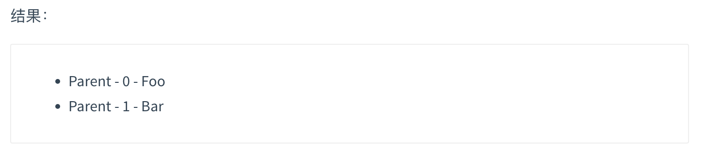
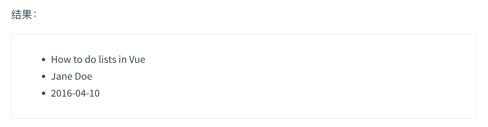
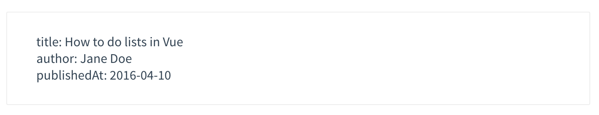
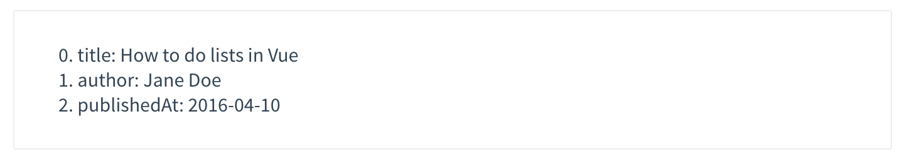

# Vue Guide

## 1. 基础

### 1.1 安装

**兼容性**

Vue **不支持** IE8 及以下版本，因为 Vue 使用了 IE8 无法模拟的 ECMAScript 5 特性。但它支持所有[兼容 ECMAScript 5 的浏览器](https://caniuse.com/#feat=es5)。

**语义化版本控制**

Vue 在其所有项目中公布的功能和行为都遵循[语义化版本控制](https://semver.org/lang/zh-CN/)。对于未公布的或内部暴露的行为，其变更会描述在[发布说明](https://github.com/vuejs/vue/releases)中。

**更新日志**

最新稳定版本：{{vue_version}}

每个版本的更新日志见 [GitHub](https://github.com/vuejs/vue/releases)。


#### Vue Devtools

在使用 Vue 时，我们推荐在你的浏览器上安装 [Vue Devtools](https://github.com/vuejs/vue-devtools#vue-devtools)。它允许你在一个更友好的界面中审查和调试 Vue 应用。


#### 直接用 `<script>` 引入

<div class="vueschool" style=""><a href="https://learning.dcloud.io/#/?vid=1" target="_blank" rel="sponsored noopener" title="Vue.js 教程 - 安装与部署">观看本节视频讲解</a></div>

直接下载并用 `<script>` 标签引入，`Vue` 会被注册为一个全局变量。

在开发环境下不要使用压缩版本，不然你就失去了所有常见错误相关的警告!</p>

<div id="downloads">
  <a class="button" href="https://v2.cn.vuejs.org/js/vue.js" download>开发版本</a><span class="light info">包含完整的警告和调试模式 本地开发的时候用</span>
  <a class="button" href="https://v2.cn.vuejs.org/js/vue.min.js" download>生产版本</a><span class="light info">删除了警告，{{gz_size}}KB min+gzip 项目上线的时候用，因为警告都已经处理了</span>
</div>

**CDN**

对于制作原型或学习，你可以这样使用最新版本：

``` html
<script src="https://cdn.jsdelivr.net/npm/vue@2.7.14/dist/vue.js"></script>
```

对于生产环境，我们推荐链接到一个明确的版本号和构建文件，以避免新版本造成的不可预期的破坏：

``` html
<script src="https://cdn.jsdelivr.net/npm/vue@2.7.14"></script>
```

如果你使用原生 ES Modules，这里也有一个兼容 ES Module 的构建文件：

``` html
<script type="module">
  import Vue from 'https://cdn.jsdelivr.net/npm/vue@2.7.14/dist/vue.esm.browser.js'
</script>
```

你可以在 [cdn.jsdelivr.net/npm/vue](https://cdn.jsdelivr.net/npm/vue/) 浏览 NPM 包的源代码。

Vue 也可以在 [unpkg](https://unpkg.com/vue@{{vue_version}}/dist/vue.js) 和 [cdnjs](https://cdnjs.cloudflare.com/ajax/libs/vue/{{vue_version}}/vue.js) 上获取 (cdnjs 的版本更新可能略滞后)。

请确认了解[不同构建版本](#对不同构建版本的解释)并在你发布的站点中使用**生产环境版本**，把 `vue.js` 换成 `vue.min.js`。这是一个更小的构建，可以带来比开发环境下更快的速度体验。


#### NPM

在用 Vue 构建大型应用时推荐使用 NPM 安装<sup>[[1]](#footnote-1)</sup>。NPM 能很好地和诸如 [webpack](https://webpack.js.org/) 或 [Browserify](http://browserify.org/) 模块打包器配合使用。同时 Vue 也提供配套工具来开发[单文件组件](single-file-components.html)。

``` bash
### 最新稳定版
$ npm install vue@^2
```


#### 命令行工具 (CLI)

Vue 提供了一个[官方的 CLI](https://github.com/vuejs/vue-cli)，为单页面应用 (SPA) 快速搭建繁杂的脚手架。它为现代前端工作流提供了开箱即用的构建设置。只需要几分钟的时间就可以运行起来并带有热重载、保存时 lint 校验，以及生产环境可用的构建版本。更多详情可查阅 [Vue CLI 的文档](https://cli.vuejs.org)。

CLI 工具假定用户对 Node.js 和相关构建工具有一定程度的了解。如果你是新手，我们强烈建议先在不用构建工具的情况下通读<a href="./">指南</a>，在熟悉 Vue 本身之后再使用 CLI。</p>

<div class="vue-mastery"><a href="https://www.vuemastery.com/courses/real-world-vue-js/vue-cli" target="_blank" rel="sponsored noopener" title="Vue CLI">在 Vue Mastery 观看视频讲解</a></div>


#### 对不同构建版本的解释

在 [NPM 包的 `dist/` 目录](https://cdn.jsdelivr.net/npm/vue@2.7.14/dist/)你将会找到很多不同的 Vue.js 构建版本。这里列出了它们之间的差别：

|                               | UMD                | CommonJS              | ES Module (基于构建工具使用) | ES Module (直接用于浏览器) |
| ----------------------------- | ------------------ | --------------------- | ---------------------------- | -------------------------- |
| **完整版**                    | vue.js             | vue.common.js         | vue.esm.js                   | vue.esm.browser.js         |
| **只包含运行时版**            | vue.runtime.js     | vue.runtime.common.js | vue.runtime.esm.js           | -                          |
| **完整版 (生产环境)**         | vue.min.js         | -                     | -                            | vue.esm.browser.min.js     |
| **只包含运行时版 (生产环境)** | vue.runtime.min.js | -                     | -                            | -                          |

##### 术语

- **完整版**：同时包含编译器和运行时的版本。

- **编译器**：用来将模板字符串编译成为 JavaScript 渲染函数的代码。

- **运行时**：用来创建 Vue 实例、渲染并处理虚拟 DOM 等的代码。基本上就是除去编译器的其它一切。

- **[UMD](https://github.com/umdjs/umd)**：UMD 版本可以通过 `<script>` 标签直接用在浏览器中。jsDelivr CDN 的 [https://cdn.jsdelivr.net/npm/vue@2.7.14](https://cdn.jsdelivr.net/npm/vue@2.7.14) 默认文件就是运行时 + 编译器的 UMD 版本 (`vue.js`)。

- **[CommonJS](http://wiki.commonjs.org/wiki/Modules/1.1)**：CommonJS 版本用来配合老的打包工具比如 [Browserify](http://browserify.org/) 或 [webpack 1](https://webpack.github.io)。这些打包工具的默认文件 (`pkg.main`) 是只包含运行时的 CommonJS 版本 (`vue.runtime.common.js`)。

- **[ES Module](http://exploringjs.com/es6/ch_modules.html)**：从 2.6 开始 Vue 会提供两个 ES Modules (ESM) 构建文件：

  - 为打包工具提供的 ESM：为诸如 [webpack 2](https://webpack.js.org) 或 [Rollup](https://rollupjs.org/) 提供的现代打包工具。ESM 格式被设计为可以被静态分析，所以打包工具可以利用这一点来进行“tree-shaking”并将用不到的代码排除出最终的包。为这些打包工具提供的默认文件 (`pkg.module`) 是只有运行时的 ES Module 构建 (`vue.runtime.esm.js`)。

  - 为浏览器提供的 ESM (2.6+)：用于在现代浏览器中通过 `<script type="module">` 直接导入。

##### 运行时 + 编译器 vs. 只包含运行时

如果你需要在客户端编译模板 (比如传入一个字符串给 `template` 选项，或挂载到一个元素上并以其 DOM 内部的 HTML 作为模板)，就将需要加上编译器，即完整版：

``` js
// 需要编译器
new Vue({
  template: '<div>{{ hi }}</div>'
})

// 不需要编译器
new Vue({
  render (h) {
    return h('div', this.hi)
  }
})
```

当使用 `vue-loader` 或 `vueify` 的时候，`*.vue` 文件内部的模板会在构建时预编译成 JavaScript。你在最终打好的包里实际上是不需要编译器的，所以只用运行时版本即可。

因为运行时版本相比完整版体积要小大约 30%，所以应该尽可能使用这个版本。如果你仍然希望使用完整版，则需要在打包工具里配置一个别名：

###### webpack

``` js
module.exports = {
  // ...
  resolve: {
    alias: {
      'vue$': 'vue/dist/vue.esm.js' // 用 webpack 1 时需用 'vue/dist/vue.common.js'
    }
  }
}
```

###### Rollup

``` js
const alias = require('rollup-plugin-alias')

rollup({
  // ...
  plugins: [
    alias({
      'vue': require.resolve('vue/dist/vue.esm.js')
    })
  ]
})
```

###### Browserify

添加到你项目的 `package.json`：

``` js
{
  // ...
  "browser": {
    "vue": "vue/dist/vue.common.js"
  }
}
```

###### Parcel

在你项目的 `package.json` 中添加：

``` js
{
  // ...
  "alias": {
    "vue" : "./node_modules/vue/dist/vue.common.js"
  }
}
```


##### 开发环境 vs. 生产环境模式

对于 UMD 版本来说，开发环境/生产环境模式是硬编码好的：开发环境下用未压缩的代码，生产环境下使用压缩后的代码。

CommonJS 和 ES Module 版本是用于打包工具的，因此我们不提供压缩后的版本。你需要自行将最终的包进行压缩。

CommonJS 和 ES Module 版本同时保留原始的 `process.env.NODE_ENV` 检测，以决定它们应该运行在什么模式下。你应该使用适当的打包工具配置来替换这些环境变量以便控制 Vue 所运行的模式。把 `process.env.NODE_ENV` 替换为字符串字面量同时可以让 UglifyJS 之类的压缩工具完全丢掉仅供开发环境的代码块，以减少最终的文件尺寸。

###### webpack

在 webpack 4+ 中，你可以使用 `mode` 选项：

``` js
module.exports = {
  mode: 'production'
}
```

但是在 webpack 3 及其更低版本中，你需要使用 [DefinePlugin](https://webpack.js.org/plugins/define-plugin/)：

``` js
var webpack = require('webpack')

module.exports = {
  // ...
  plugins: [
    // ...
    new webpack.DefinePlugin({
      'process.env': {
        NODE_ENV: JSON.stringify('production')
      }
    })
  ]
}
```

###### Rollup

使用 [rollup-plugin-replace](https://github.com/rollup/rollup-plugin-replace)：

``` js
const replace = require('rollup-plugin-replace')

rollup({
  // ...
  plugins: [
    replace({
      'process.env.NODE_ENV': JSON.stringify('production')
    })
  ]
}).then(...)
```

###### Browserify

为你的包应用一次全局的 [envify](https://github.com/hughsk/envify) 转换。

``` bash
NODE_ENV=production browserify -g envify -e main.js | uglifyjs -c -m > build.js
```

也可以移步[生产环境部署](deployment.html)。

**CSP 环境**

有些环境，如 Google Chrome Apps，会强制应用内容安全策略 (CSP)，不能使用 `new Function()` 对表达式求值。这时可以用 CSP 兼容版本。完整版本依赖于该功能来编译模板，所以无法在这些环境下使用。

另一方面，运行时版本则是完全兼容 CSP 的。当通过 [webpack + vue-loader](https://github.com/vuejs-templates/webpack-simple) 或者 [Browserify + vueify](https://github.com/vuejs-templates/browserify-simple) 构建时，模板将被预编译为 `render` 函数，可以在 CSP 环境中完美运行。


#### 开发版本

**重要**：GitHub 仓库的 `/dist` 文件夹只有在新版本发布时才会提交。如果想要使用 GitHub 上 Vue 最新的源码，你需要自己构建！

``` bash
git clone https://github.com/vuejs/vue.git node_modules/vue
cd node_modules/vue
npm install
npm run build
```


#### Bower

Bower 只提供 UMD 版本。

``` bash
### 最新稳定版本
$ bower install vue
```


#### AMD 模块加载器

所有 UMD 版本都可以直接用作 AMD 模块。

<small>
**译者注**
<a id="footnote-1"></a>[1] 对于中国大陆用户，建议将 NPM 源设置为[国内的镜像](https://npmmirror.com/)，可以大幅提升安装速度。
</small>


### 1.2 介绍

#### Vue.js 是什么

<div class="vueschool"><a href="https://learning.dcloud.io/#/?vid=0" target="_blank" rel="sponsored noopener" title="Vue.js 教程 - Vue.js 介绍">观看本节视频讲解</a></div>

Vue (读音 /vjuː/，类似于 **view**) 是一套用于构建用户界面的==**渐进式框架**==。与其它大型框架不同的是，Vue 被设计为可以自底向上逐层应用。Vue 的核心库只关注视图层，不仅易于上手，还便于与第三方库或既有项目整合。另一方面，当与[现代化的工具链](single-file-components.html)以及各种[支持类库](https://github.com/vuejs/awesome-vue#libraries--plugins)结合使用时，Vue 也完全能够为复杂的单页应用提供驱动。

如果你想在深入学习 Vue 之前对它有更多了解，我们<a id="modal-player" href="#">制作了一个视频</a>，带您了解其核心概念和一个示例工程。

如果你已经是有经验的前端开发者，想知道 Vue 与其它库/框架有哪些区别，请查看[对比其它框架](comparison.html)。


#### 起步

<div class="vueschool"><a href="https://learning.dcloud.io/#/?vid=1" target="_blank" rel="sponsored noopener" title="Vue.js 教程 - 安装与部署">观看本节视频讲解</a></div>

> 官方指南假设你已了解关于 HTML、CSS 和 JavaScript 的中级知识。如果你刚开始学习前端开发，将框架作为你的第一步可能不是最好的主意——掌握好基础知识再来吧！之前有其它框架的使用经验会有帮助，但这不是必需的。

<a class="button" href="installation.html">安装</a>

尝试 Vue.js 最简单的方法是使用 [Hello World 例子](https://codesandbox.io/s/github/vuejs/v2.vuejs.org/tree/master/src/v2/examples/vue-20-hello-world)。你可以在浏览器新标签页中打开它，跟着例子学习一些基础用法。或者你也可以<a href="https://github.com/vuejs/v2.vuejs.org/blob/master/src/v2/examples/vue-20-hello-world/index.html" target="_blank" download="index.html" rel="noopener noreferrer">创建一个 <code>.html</code> 文件</a>，然后通过如下方式引入 Vue：

``` html
<!-- 开发环境版本，包含了有帮助的命令行警告 -->
<script src="https://cdn.jsdelivr.net/npm/vue@2/dist/vue.js"></script>
```

或者：

``` html
<!-- 生产环境版本，优化了尺寸和速度 -->
<script src="https://cdn.jsdelivr.net/npm/vue@2"></script>
```

[安装教程](/guide/installation.html)给出了更多安装 Vue 的方式。请注意我们**不推荐**新手直接使用 `vue-cli`，尤其是在你还不熟悉基于 Node.js 的构建工具时。

如果你喜欢交互式的东西，你也可以查阅[这个 Scrimba 上的系列教程](https://scrimba.com/g/gvuedocs)，它揉合了录屏和代码试验田，并允许你随时暂停和播放。


#### 声明式渲染

<div class="vueschool"><a href="https://learning.dcloud.io/#/?vid=3" target="_blank" rel="sponsored noopener" title="Vue.js 教程 - 数据与方法">观看本节视频讲解</a></div>

Vue.js 的核心是一个允许采用简洁的模板语法来声明式地将数据渲染进 DOM 的系统：

``` html
<div id="app">
  {{ message }}
</div>
```

``` js
var app = new Vue({
  el: '#app',
  data: {
    message: 'Hello Vue!'
  }
})
```

我们已经成功创建了第一个 Vue 应用！看起来这跟渲染一个字符串模板非常类似，但是 Vue 在背后做了大量工作。现在数据和 DOM 已经被建立了关联，所有东西都是**响应式的**。我们要怎么确认呢？打开你的浏览器的 JavaScript 控制台，并修改 `app.message` 的值，你将看到上例相应地更新。

注意我们不再和 HTML 直接交互了。一个 Vue 应用会将其挂载到一个 DOM 元素上 (对于这个例子是 `#app`) 然后对其进行完全控制。那个 HTML 是我们的入口，但其余都会发生在新创建的 Vue 实例内部。

除了文本插值，我们还可以像这样来绑定元素 attribute：

``` html
<div id="app-2">
  <span v-bind:title="message">
    鼠标悬停几秒钟查看此处动态绑定的提示信息！
  </span>
</div>
```

``` js
var app2 = new Vue({
  el: '#app-2',
  data: {
    message: '页面加载于 ' + new Date().toLocaleString()
  }
})
```

这里我们遇到了一点新东西。你看到的 `v-bind` attribute 被称为**指令**。指令带有前缀 `v-`，以表示它们是 Vue 提供的特殊 attribute。可能你已经猜到了，它们会在渲染的 DOM 上应用特殊的响应式行为。在这里，该指令的意思是：“将这个元素节点的 `title` attribute 和 Vue 实例的 `message` property 保持一致”。

如果你再次打开浏览器的 JavaScript 控制台，输入 `app2.message = '新消息'`，就会再一次看到这个绑定了 `title` attribute 的 HTML 已经进行了更新。


#### 条件与循环

<div class="vueschool"><a href="https://learning.dcloud.io/#/?vid=8" target="_blank" rel="sponsored noopener" title="Vue.js 教程 - 条件渲染">观看本节视频讲解</a></div>

控制切换一个元素是否显示也相当简单：

``` html
<div id="app-3">
  <p v-if="seen">现在你看到我了</p>
</div>
```

``` js
var app3 = new Vue({
  el: '#app-3',
  data: {
    seen: true
  }
})
```



<div id="app-3" class="demo">
  <span v-if="seen">现在你看到我了</span>
</div>
<script>
var app3 = new Vue({
  el: '#app-3',
  data: {
    seen: true
  }
})
</script>



继续在控制台输入 `app3.seen = false`，你会发现之前显示的消息消失了。

这个例子演示了我们不仅可以把数据绑定到 DOM 文本或 attribute，还可以绑定到 DOM **结构**。此外，Vue 也提供一个强大的过渡效果系统，可以在 Vue 插入/更新/移除元素时自动应用[过渡效果](transitions.html)。

还有其它很多指令，每个都有特殊的功能。例如，`v-for` 指令可以绑定数组的数据来渲染一个项目列表：

``` html
<div id="app-4">
  <ol>
    <li v-for="todo in todos">
      {{ todo.text }}
    </li>
  </ol>
</div>
```

``` js
var app4 = new Vue({
  el: '#app-4',
  data: {
    todos: [
      { text: '学习 JavaScript' },
      { text: '学习 Vue' },
      { text: '整个牛项目' }
    ]
  }
})
```



<div id="app-4" class="demo">
  <ol>
    <li v-for="todo in todos">
      {{ todo.text }}
    </li>
  </ol>
</div>
<script>
var app4 = new Vue({
  el: '#app-4',
  data: {
    todos: [
      { text: '学习 JavaScript' },
      { text: '学习 Vue' },
      { text: '整个牛项目' }
    ]
  }
})
</script>



在控制台里，输入 `app4.todos.push({ text: '新项目' })`，你会发现列表最后添加了一个新项目。

#### 处理用户输入

<div class="vueschool"><a href="https://learning.dcloud.io/#/?vid=11" target="_blank" rel="sponsored noopener" title="Vue.js 教程 - 表单输入绑定">观看本节视频讲解</a></div>

为了让用户和你的应用进行交互，我们可以用 `v-on` 指令添加一个事件监听器，通过它调用在 Vue 实例中定义的方法：

``` html
<div id="app-5">
  <p>{{ message }}</p>
  <button v-on:click="reverseMessage">反转消息</button>
</div>
```

``` js
var app5 = new Vue({
  el: '#app-5',
  data: {
    message: 'Hello Vue.js!'
  },
  methods: {
    reverseMessage: function () {
      this.message = this.message.split('').reverse().join('')
    }
  }
})
```



<div id="app-5" class="demo">
  <p>{{ message }}</p>
  <button v-on:click="reverseMessage">反转消息</button>
</div>
<script>
var app5 = new Vue({
  el: '#app-5',
  data: {
    message: 'Hello Vue.js!'
  },
  methods: {
    reverseMessage: function () {
      this.message = this.message.split('').reverse().join('')
    }
  }
})
</script>



注意在 `reverseMessage` 方法中，我们更新了应用的状态，但没有触碰 DOM——所有的 DOM 操作都由 Vue 来处理，你编写的代码只需要关注逻辑层面即可。

Vue 还提供了 `v-model` 指令，它能轻松实现表单输入和应用状态之间的双向绑定。

``` html
<div id="app-6">
  <p>{{ message }}</p>
  <input v-model="message">
</div>
```

``` js
var app6 = new Vue({
  el: '#app-6',
  data: {
    message: 'Hello Vue!'
  }
})
```


#### 组件化应用构建

<div class="vueschool"><a href="https://learning.dcloud.io/#/?vid=12" target="_blank" rel="sponsored noopener" title="Vue.js 教程 - 组件基础">观看本节视频讲解</a></div>

组件系统是 Vue 的另一个重要概念，因为它是一种抽象，允许我们使用小型、独立和通常可复用的组件构建大型应用。仔细想想，几乎任意类型的应用界面都可以抽象为一个组件树：


在 Vue 里，一个组件本质上是一个拥有预定义选项的一个 Vue 实例。在 Vue 中注册组件很简单：

``` js
// 定义名为 todo-item 的新组件
Vue.component('todo-item', {
  template: '<li>这是个待办项</li>'
})

var app = new Vue(...)
```

现在你可以用它构建另一个组件模板：

``` html
<ol>
  <!-- 创建一个 todo-item 组件的实例 -->
  <todo-item></todo-item>
</ol>
```

但是这样会为每个待办项渲染同样的文本，这看起来并不炫酷。我们应该能从父作用域将数据传到子组件才对。让我们来修改一下组件的定义，使之能够接受一个 [prop](components.html#通过-Prop-向子组件传递数据)：

``` js
Vue.component('todo-item', {
  // todo-item 组件现在接受一个
  // "prop"，类似于一个自定义 attribute。
  // 这个 prop 名为 todo。
  props: ['todo'],
  template: '<li>{{ todo.text }}</li>'
})
```

现在，我们可以使用 `v-bind` 指令将待办项传到循环输出的每个组件中：

``` html
<div id="app-7">
  <ol>
    <!--
      现在我们为每个 todo-item 提供 todo 对象
      todo 对象是变量，即其内容可以是动态的。
      我们也需要为每个组件提供一个“key”，稍后再
      作详细解释。
    -->
    <todo-item
      v-for="item in groceryList"
      v-bind:todo="item"
      v-bind:key="item.id"
    ></todo-item>
  </ol>
</div>
```

``` js
Vue.component('todo-item', {
  props: ['todo'],
  template: '<li>{{ todo.text }}</li>'
})

var app7 = new Vue({
  el: '#app-7',
  data: {
    groceryList: [
      { id: 0, text: '蔬菜' },
      { id: 1, text: '奶酪' },
      { id: 2, text: '随便其它什么人吃的东西' }
    ]
  }
})
```



<div id="app-7" class="demo">
  <ol>
    <todo-item v-for="item in groceryList" v-bind:todo="item" :key="item.id"></todo-item>
  </ol>
</div>
<script>
Vue.component('todo-item', {
  props: ['todo'],
  template: '<li>{{ todo.text }}</li>'
})
var app7 = new Vue({
  el: '#app-7',
  data: {
    groceryList: [
      { id: 0, text: '蔬菜' },
      { id: 1, text: '奶酪' },
      { id: 2, text: '随便其它什么人吃的东西' }
    ]
  }
})
</script>



尽管这只是一个刻意设计的例子，但是我们已经设法将应用分割成了两个更小的单元。子单元通过 prop 接口与父单元进行了良好的解耦。我们现在可以进一步改进 `<todo-item>` 组件，提供更为复杂的模板和逻辑，而不会影响到父单元。

在一个大型应用中，有必要将整个应用程序划分为组件，以使开发更易管理。在[后续教程](components.html)中我们将详述组件，不过这里有一个 (假想的) 例子，以展示使用了组件的应用模板是什么样的：

``` html
<div id="app">
  <app-nav></app-nav>
  <app-view>
    <app-sidebar></app-sidebar>
    <app-content></app-content>
  </app-view>
</div>
```


**与自定义元素的关系**

你可能已经注意到 Vue 组件非常类似于**自定义元素**——它是 [Web 组件规范](https://www.w3.org/wiki/WebComponents/)的一部分，这是因为 Vue 的组件语法部分参考了该规范。例如 Vue 组件实现了 [Slot API](https://github.com/w3c/webcomponents/blob/gh-pages/proposals/Slots-Proposal.md) 与 `is` attribute。但是，还是有几个关键差别：

1. Web Components 规范已经完成并通过，但未被所有浏览器原生实现。目前 Safari 10.1+、Chrome 54+ 和 Firefox 63+ 原生支持 Web Components。相比之下，Vue 组件不需要任何 polyfill，并且在所有支持的浏览器 (IE9 及更高版本) 之下表现一致。必要时，Vue 组件也可以包装于原生自定义元素之内。

2. Vue 组件提供了纯自定义元素所不具备的一些重要功能，最突出的是跨组件数据流、自定义事件通信以及构建工具集成。

虽然 Vue 内部没有使用自定义元素，不过在应用使用自定义元素、或以自定义元素形式发布时，[依然有很好的互操作性](https://custom-elements-everywhere.com/#vue)。Vue CLI 也支持将 Vue 组件构建成为原生的自定义元素。


### 1.3 实例

#### 创建一个 Vue 实例

<div class="vueschool"><a href="https://learning.dcloud.io/#/?vid=2" target="_blank" rel="sponsored noopener" title="Vue.js 教程 - 创建第一个 Vue 应用">观看本节视频讲解</a></div>

每个 Vue 应用都是通过用 `Vue` 函数创建一个新的 **Vue 实例**开始的：

```js
var vm = new Vue({
  // 选项
})
```

虽然没有完全遵循 [MVVM 模型](https://zh.wikipedia.org/wiki/MVVM)，但是 Vue 的设计也受到了它的启发。因此在文档中经常会使用 `vm` (ViewModel 的缩写) 这个变量名表示 Vue 实例。

当创建一个 Vue 实例时，你可以传入一个**选项对象**。这篇教程主要描述的就是如何使用这些选项来创建你想要的行为。作为参考，你也可以在 [API 文档](../api/#选项-数据)中浏览完整的选项列表。

一个 Vue 应用由一个通过 `new Vue` 创建的**根 Vue 实例**，以及可选的嵌套的、可复用的组件树组成。举个例子，一个 todo 应用的组件树可以是这样的：

```
根实例
└─ TodoList
   ├─ TodoItem
   │  ├─ TodoButtonDelete
   │  └─ TodoButtonEdit
   └─ TodoListFooter
      ├─ TodosButtonClear
      └─ TodoListStatistics
```

我们会在稍后的[组件系统](components.html)章节具体展开。不过现在，你只需要明白所有的 Vue 组件都是 Vue 实例，并且接受相同的选项对象 (一些根实例特有的选项除外)。


#### 数据与方法

<div class="vueschool"><a href="https://learning.dcloud.io/#/?vid=3" target="_blank" rel="sponsored noopener" title="Vue.js 教程 - 数据与方法">观看本节视频讲解</a></div>

当一个 Vue 实例被创建时，它将 `data` 对象中的所有的 property 加入到 Vue 的**响应式系统**中。当这些 property 的值发生改变时，视图将会产生“响应”，即匹配更新为新的值。

```js
// 我们的数据对象
var data = { a: 1 }

// 该对象被加入到一个 Vue 实例中
var vm = new Vue({
  data: data
})

// 获得这个实例上的 property
// 返回源数据中对应的字段
vm.a == data.a // => true
// Vue 使用 Object.defineProperty 为每个属性定义 getter 和 setter，从而将 data 对象中的属性直接代理到 Vue 实例上。

// 设置 property 也会影响到原始数据
vm.a = 2
data.a // => 2

// ……反之亦然
data.a = 3
vm.a // => 3
```

当这些数据改变时，视图会进行重渲染。==值得注意的是只有当实例被创建时就已经存在于 `data` 中的 property 才是**响应式**的。==也就是说如果你添加一个新的 property，比如：

```js
vm.b = 'hi'
```

那么对 `b` 的改动将不会触发任何视图的更新。如果你知道你会在晚些时候需要一个 property，但是一开始它为空或不存在，那么你仅需要设置一些初始值。比如：

```js
data: {
  newTodoText: '',
  visitCount: 0,
  hideCompletedTodos: false,
  todos: [],
  error: null
}
```

==这里唯一的例外是使用 `Object.freeze()`，这会阻止修改现有的 property，也意味着响应系统无法再追踪变化。==

```js
var obj = {
  foo: 'bar'
}

Object.freeze(obj)

new Vue({
  el: '#app',
  data: obj
})
```

```html
<div id="app">
  <p>{{ foo }}</p>
  <!-- 这里的 `foo` 不会更新！ -->
  <button v-on:click="foo = 'baz'">Change it</button>
</div>
```

除了数据 property，Vue 实例还暴露了一些有用的实例 property 与方法。它们都有前缀 `$`，以便与用户定义的 property 区分开来。例如：

```js
var data = { a: 1 }
var vm = new Vue({
  el: '#example',
  data: data
})

vm.$data === data // => true
vm.$el === document.getElementById('example') // => true

// $watch 是一个实例方法
vm.$watch('a', function (newValue, oldValue) {
  // 这个回调将在 `vm.a` 改变后调用
})
```

以后你可以在 [API 参考](../api/#实例-property)中查阅到完整的实例 property 和方法的列表。


#### 实例生命周期钩子

<div class="vueschool"><a href="https://learning.dcloud.io/#/?vid=4" target="_blank" rel="sponsored noopener" title="Vue.js 教程 - 生命周期">观看本节视频讲解</a></div>

每个 Vue 实例在被创建时都要经过一系列的初始化过程——例如，需要设置数据监听、编译模板、将实例挂载到 DOM 并在数据变化时更新 DOM 等。同时在这个过程中也会运行一些叫做**生命周期钩子**的函数，这给了用户在不同阶段添加自己的代码的机会。

比如 [`created`](../api/#created) 钩子可以用来在一个实例被创建之后执行代码：

```js
new Vue({
  data: {
    a: 1
  },
  created: function () {
    // `this` 指向 vm 实例
    console.log('a is: ' + this.a)
  }
})
// => "a is: 1"
```

也有一些其它的钩子，在实例生命周期的不同阶段被调用，如 [`mounted`](../api/#mounted)、[`updated`](../api/#updated) 和 [`destroyed`](../api/#destroyed)。生命周期钩子的 `this` 上下文指向调用它的 Vue 实例。

==不要在选项 property 或回调上使用[箭头函数](https://developer.mozilla.org/zh-CN/docs/Web/JavaScript/Reference/Functions/Arrow_functions)，比如 `created: () => console.log(this.a)` 或 `vm.$watch('a', newValue => this.myMethod())`。因为箭头函数并没有 `this`，`this` 会作为变量一直向上级词法作用域查找，直至找到为止，经常导致 `Uncaught TypeError: Cannot read property of undefined` 或 `Uncaught TypeError: this.myMethod is not a function` 之类的错误。==

**生命周期图示**

下图展示了实例的生命周期。你不需要立马弄明白所有的东西，不过随着你的不断学习和使用，它的参考价值会越来越高。

 


### 1.4 模版语法

Vue.js 使用了基于 HTML 的模板语法，允许开发者声明式地将 DOM 绑定至底层 Vue 实例的数据。所有 Vue.js 的模板都是合法的 HTML，所以能被遵循规范的浏览器和 HTML 解析器解析。

在底层的实现上，Vue 将模板编译成虚拟 DOM 渲染函数。结合响应系统，Vue 能够智能地计算出最少需要重新渲染多少组件，并把 DOM 操作次数减到最少。

如果你熟悉虚拟 DOM 并且偏爱 JavaScript 的原始力量，你也可以不用模板，[直接写渲染 (render) 函数](render-function.html)，使用可选的 JSX 语法。


#### 插值

<div class="vueschool"><a href="https://learning.dcloud.io/#/?vid=5" target="_blank" rel="sponsored noopener" title="Vue.js 教程 - 模板语法 - 插值">观看本节视频讲解</a></div>

##### 文本

数据绑定最常见的形式就是使用“Mustache”语法 (双大括号) 的文本插值：

``` html
<span>Message: {{ msg }}</span>
```

Mustache 标签将会被替代为对应数据对象上 `msg` property 的值。无论何时，绑定的数据对象上 `msg` property 发生了改变，插值处的内容都会更新。

通过使用 [v-once 指令](../api/#v-once)，你也能执行一次性地插值 **(元素和组件在首次渲染后不再更新)**，当数据改变时，插值处的内容不会更新。但请留心这会影响到该节点上的其它数据绑定：

``` html
<span v-once>这个将不会改变: {{ msg }}</span>
```


##### 原始 HTML

双大括号会将数据解释为普通文本，而非 HTML 代码。为了输出真正的 HTML，你需要使用 [`v-html` 指令](../api/#v-html)：

``` html
<p>Using mustaches: {{ rawHtml }}</p>
<p>Using v-html directive: <span v-html="rawHtml"></span></p>
```

这个 `span` 的内容将会被替换成为 property 值 `rawHtml`，直接作为 HTML——会忽略解析 property 值中的数据绑定。注意，你不能使用 `v-html` 来复合局部模板，因为 Vue 不是基于字符串的模板引擎。反之，对于用户界面 (UI)，组件更适合作为可重用和可组合的基本单位。

==你的站点上动态渲染的任意 HTML 可能会非常危险，因为它很容易导致 [XSS 攻击](https://en.wikipedia.org/wiki/Cross-site_scripting)。请只对可信内容使用 HTML 插值，**绝不要**对用户提供的内容使用插值。==


##### Attribute

Mustache 语法不能作用在 HTML attribute 上，遇到这种情况应该使用 [`v-bind` 指令](../api/#v-bind)：

``` html
<div v-bind:id="dynamicId"></div>
```

对于布尔 attribute (它们只要存在就意味着值为 `true`)，`v-bind` 工作起来略有不同，在这个例子中：

``` html
<button v-bind:disabled="isButtonDisabled">Button</button>
```

==如果 `isButtonDisabled` 的值是 `null`、`undefined` 或 `false`，则 `disabled` attribute 甚至不会被包含在渲染出来的 `<button>` 元素中。==


##### 使用 JavaScript 表达式

迄今为止，在我们的模板中，我们一直都只绑定简单的 property 键值。但实际上，对于所有的数据绑定，Vue.js 都提供了完全的 JavaScript 表达式支持。

``` html
{{ number + 1 }}

{{ ok ? 'YES' : 'NO' }}

{{ message.split('').reverse().join('') }}

<div v-bind:id="'list-' + id"></div>
```

这些表达式会在所属 Vue 实例的数据作用域下作为 JavaScript 被解析。有个限制就是，==每个绑定都只能包含**单个表达式**，==所以下面的例子都**不会**生效。

``` html
<!-- 这是语句，不是表达式 -->
{{ var a = 1 }}

<!-- 流控制也不会生效，请使用三元表达式 -->
{{ if (ok) { return message } }}
```

模板表达式都被放在沙盒中，只能访问[全局变量的一个白名单](https://github.com/vuejs/vue/blob/v2.6.10/src/core/instance/proxy.js#L9)，如 `Math` 和 `Date` 。你不应该在模板表达式中试图访问用户定义的全局变量。</p>


#### 指令

<div class="vueschool"><a href="https://learning.dcloud.io/#/?vid=6" target="_blank" rel="sponsored noopener" title="Vue.js 教程 - 模板语法 - 指令">观看本节视频讲解</a></div>

指令 (Directives) 是带有 `v-` 前缀的特殊 attribute。==指令 attribute 的值预期是**单个 JavaScript 表达式**== (`v-for` 是例外情况，稍后我们再讨论)。指令的职责是，当表达式的值改变时，将其产生的连带影响，响应式地作用于 DOM。回顾我们在介绍中看到的例子：

``` html
<p v-if="seen">现在你看到我了</p>
```

这里，`v-if` 指令将根据表达式 `seen` 的值的真假来插入/移除 `<p>` 元素。


##### 参数

一些指令能够接收一个“参数”，在指令名称之后以冒号表示。例如，`v-bind` 指令可以用于响应式地更新 HTML attribute：

``` html
<a v-bind:href="url">...</a>
```

在这里 `href` 是参数，告知 `v-bind` 指令将该元素的 `href` attribute 与表达式 `url` 的值绑定。

另一个例子是 `v-on` 指令，它用于监听 DOM 事件：

``` html
<a v-on:click="doSomething">...</a>
```

在这里参数是监听的事件名。我们也会更详细地讨论事件处理。


##### 动态参数

> 2.6.0 新增

从 2.6.0 开始，可以用方括号括起来的 JavaScript 表达式作为一个指令的参数：

``` html
<!--
注意，参数表达式的写法存在一些约束，如之后的“对动态参数表达式的约束”章节所述。
-->
<a v-bind:[attributeName]="url"> ... </a>
```

这里的 `attributeName` 会被作为一个 JavaScript 表达式进行动态求值，求得的值将会作为最终的参数来使用。例如，如果你的 Vue 实例有一个 `data` property `attributeName`，其值为 `"href"`，那么这个绑定将等价于 `v-bind:href`。

同样地，你可以使用动态参数为一个动态的事件名绑定处理函数：

``` html
<a v-on:[eventName]="doSomething"> ... </a>
```

在这个示例中，当 `eventName` 的值为 `"focus"` 时，`v-on:[eventName]` 将等价于 `v-on:focus`。

**对动态参数的值的约束**

动态参数预期会求出一个字符串，异常情况下值为 `null`。这个特殊的 `null` 值可以被显性地用于移除绑定。任何其它非字符串类型的值都将会触发一个警告。

**对动态参数表达式的约束**

动态参数表达式有一些语法约束，因为某些字符，如空格和引号，放在 HTML attribute 名里是无效的。例如：

``` html
<!-- 这会触发一个编译警告 -->
<a v-bind:['foo' + bar]="value"> ... </a>
```

变通的办法是使用没有空格或引号的表达式，或用计算属性替代这种复杂表达式。

==在 DOM 中使用模板时 (直接在一个 HTML 文件里撰写模板)，还需要避免使用大写字符来命名键名，因为浏览器会把 attribute 名全部强制转为小写：==

``` html
<!--
在 DOM 中使用模板时这段代码会被转换为 `v-bind:[someattr]`。
除非在实例中有一个名为“someattr”的 property，否则代码不会工作。
-->
<a v-bind:[someAttr]="value"> ... </a>
```


##### 修饰符

修饰符 (modifier) 是以半角句号 `.` 指明的特殊后缀，用于指出一个指令应该以特殊方式绑定。例如，`.prevent` 修饰符告诉 `v-on` 指令对于触发的事件调用 `event.preventDefault()`：

``` html
<form v-on:submit.prevent="onSubmit">...</form>
```

在接下来对 [`v-on`](events.html#事件修饰符) 和 [`v-for`](forms.html#修饰符) 等功能的探索中，你会看到修饰符的其它例子。


#### 缩写

`v-` 前缀作为一种视觉提示，用来识别模板中 Vue 特定的 attribute。当你在使用 Vue.js 为现有标签添加动态行为 (dynamic behavior) 时，`v-` 前缀很有帮助，然而，对于一些频繁用到的指令来说，就会感到使用繁琐。同时，在构建由 Vue 管理所有模板的[单页面应用程序 (SPA - single page application)](https://en.wikipedia.org/wiki/Single-page_application) 时，`v-` 前缀也变得没那么重要了。因此，Vue 为 `v-bind` 和 `v-on` 这两个最常用的指令，提供了特定简写：

##### `v-bind` 缩写

``` html
<!-- 完整语法 -->
<a v-bind:href="url">...</a>

<!-- 缩写 -->
<a :href="url">...</a>

<!-- 动态参数的缩写 (2.6.0+) -->
<a :[key]="url"> ... </a>
```

##### `v-on` 缩写

``` html
<!-- 完整语法 -->
<a v-on:click="doSomething">...</a>

<!-- 缩写 -->
<a @click="doSomething">...</a>

<!-- 动态参数的缩写 (2.6.0+) -->
<a @[event]="doSomething"> ... </a>
```

它们看起来可能与普通的 HTML 略有不同，但 `:` 与 `@` 对于 attribute 名来说都是合法字符，在所有支持 Vue 的浏览器都能被正确地解析。而且，它们不会出现在最终渲染的标记中。缩写语法是完全可选的，但随着你更深入地了解它们的作用，你会庆幸拥有它们。


### 1.5 计算属性和侦听

#### 计算属性

模板内的表达式非常便利，但是设计它们的初衷是用于简单运算的。在模板中放入太多的逻辑会让模板过重且难以维护。例如：

```html
<div id="example">
  {{ message.split('').reverse().join('') }}
</div>
```

在这个地方，模板不再是简单的声明式逻辑。你必须看一段时间才能意识到，这里是想要显示变量 `message` 的翻转字符串。当你想要在模板中的多处包含此翻转字符串时，就会更加难以处理。

所以，==对于任何复杂逻辑，你都应当使用**计算属性**。==

##### 基础例子

``` html
<div id="example">
  <p>Original message: "{{ message }}"</p>
  <p>Computed reversed message: "{{ reversedMessage }}"</p>
</div>
```

``` js
var vm = new Vue({
  el: '#example',
  data: {
    message: 'Hello'
  },
  computed: {
    // 计算属性的 getter
    reversedMessage: function () {
      // `this` 指向 vm 实例
      return this.message.split('').reverse().join('')
    }
  }
})
```

这里我们声明了一个计算属性 `reversedMessage`。为什么不能写成 `reversedMessage: this.message.split('').reverse().join('')`  ==因为计算属性期望一个函数作为 getter，而不是一个立即计算的值。在定义计算属性时，你需要提供一个函数，Vue.js 会在访问这个属性时调用这个函数来返回计算值。==

我们提供的函数将用作 property `vm.reversedMessage` 的 getter 函数：

``` js
console.log(vm.reversedMessage) // => 'olleH'
vm.message = 'Goodbye'
console.log(vm.reversedMessage) // => 'eybdooG'
```

你可以打开浏览器的控制台，自行修改例子中的 vm。`vm.reversedMessage` 的值始终取决于 `vm.message` 的值。

你可以像绑定普通 property 一样在模板中绑定计算属性。Vue 知道 `vm.reversedMessage` 依赖于 `vm.message`，因此当 `vm.message` 发生改变时，所有依赖 `vm.reversedMessage` 的绑定也会更新。而且最妙的是我们已经以声明的方式创建了这种依赖关系：计算属性的 getter 函数是没有副作用 (side effect) 的，这使它更易于测试和理解。


##### 计算属性缓存 vs 方法

你可能已经注意到我们可以通过在表达式中调用方法来达到同样的效果：

``` html
<p>Reversed message: "{{ reversedMessage() }}"</p>
```

``` js
// 在组件中
methods: {
  reversedMessage: function () {
    return this.message.split('').reverse().join('')
  }
}
```

==我们可以将同一函数定义为一个方法而不是一个计算属性。两种方式的最终结果确实是完全相同的。然而，不同的是**计算属性是基于它们的响应式依赖进行缓存的**。只在相关响应式依赖发生改变时它们才会重新求值。这就意味着只要 `message` 还没有发生改变，多次访问 `reversedMessage` 计算属性会立即返回之前的计算结果，而不必再次执行函数。==

这也同样意味着下面的计算属性将不再更新，因为 `Date.now()` 不是响应式依赖：

``` js
computed: {
  now: function () {
    return Date.now()
  }
}
```

相比之下，每当触发重新渲染时，调用方法将**总会**再次执行函数。

==我们为什么需要缓存？假设我们有一个性能开销比较大的计算属性 **A**，它需要遍历一个巨大的数组并做大量的计算。然后我们可能有其他的计算属性依赖于 **A**。如果没有缓存，我们将不可避免的多次执行 **A** 的 getter！如果你不希望有缓存，请用方法来替代。==


##### 计算属性 vs 侦听属性

Vue 提供了一种更通用的方式来观察和响应 Vue 实例上的数据变动：**侦听属性**。当你有一些数据需要随着其它数据变动而变动时，你很容易滥用 `watch`——特别是如果你之前使用过 AngularJS。然而，通常更好的做法是使用计算属性而不是命令式的 `watch` 回调。细想一下这个例子：

``` html
<div id="demo">{{ fullName }}</div>
```

``` js
var vm = new Vue({
  el: '#demo',
  data: {
    firstName: 'Foo',
    lastName: 'Bar',
    fullName: 'Foo Bar'
  },
  watch: {
    firstName: function (val) {
      this.fullName = val + ' ' + this.lastName
    },
    lastName: function (val) {
      this.fullName = this.firstName + ' ' + val
    }
  }
})
```

上面代码是命令式且重复的。将它与计算属性的版本进行比较：

``` js
var vm = new Vue({
  el: '#demo',
  data: {
    firstName: 'Foo',
    lastName: 'Bar'
  },
  computed: {
    fullName: function () {
      return this.firstName + ' ' + this.lastName
    }
  }
})
```

好得多了，不是吗？


##### 计算属性的 setter

计算属性默认只有 getter，不过在需要时你也可以提供一个 setter：

``` js
// ...
computed: {
  fullName: {
    // getter
    get: function () {
      return this.firstName + ' ' + this.lastName
    },
    // setter
    set: function (newValue) {
      var names = newValue.split(' ')
      this.firstName = names[0]
      this.lastName = names[names.length - 1]
    }
  }
}
// ...
```

现在再运行 `vm.fullName = 'John Doe'` 时，setter 会被调用，`vm.firstName` 和 `vm.lastName` 也会相应地被更新。


#### 侦听器

虽然计算属性在大多数情况下更合适，但有时也需要一个**自定义的侦听器。**这就是为什么 Vue 通过 `watch` 选项提供了一个更通用的方法，来响应数据的变化。当需要在数据变化时执行异步或开销较大的操作时，这个方式是最有用的。

例如：

```html
<div id="watch-example">
  <p>
    Ask a yes/no question:
    <input v-model="question">
  </p>
  <p>{{ answer }}</p>
</div>
```

```html
<!-- 因为 AJAX 库和通用工具的生态已经相当丰富，Vue 核心代码没有重复 -->
<!-- 提供这些功能以保持精简。这也可以让你自由选择自己更熟悉的工具。 -->
<script src="https://cdn.jsdelivr.net/npm/axios@0.12.0/dist/axios.min.js"></script>
<script src="https://cdn.jsdelivr.net/npm/lodash@4.13.1/lodash.min.js"></script>
<script>
var watchExampleVM = new Vue({
  el: '#watch-example',
  data: {
    question: '',
    answer: 'I cannot give you an answer until you ask a question!'
  },
  watch: {
    // 如果 `question` 发生改变，这个函数就会运行
    question: function (newQuestion, oldQuestion) {
      this.answer = 'Waiting for you to stop typing...'
      this.debouncedGetAnswer()
    }
  },
  created: function () {
    // `_.debounce` 是一个通过 Lodash 限制操作频率的函数。
    // 在这个例子中，我们希望限制访问 yesno.wtf/api 的频率
    // AJAX 请求直到用户输入完毕才会发出。想要了解更多关于
    // `_.debounce` 函数 (及其近亲 `_.throttle`) 的知识，
    // 请参考：https://lodash.com/docs#debounce
    this.debouncedGetAnswer = _.debounce(this.getAnswer, 500)
  },
  methods: {
    getAnswer: function () {
      if (this.question.indexOf('?') === -1) {
        this.answer = 'Questions usually contain a question mark. ;-)'
        return
      }
      this.answer = 'Thinking...'
      var vm = this
      axios.get('https://yesno.wtf/api')
        .then(function (response) {
          vm.answer = _.capitalize(response.data.answer)
        })
        .catch(function (error) {
          vm.answer = 'Error! Could not reach the API. ' + error
        })
    }
  }
})
</script>
```

在这个示例中，使用 `watch` 选项允许我们执行异步操作 (访问一个 API)，限制我们执行该操作的频率，并在我们得到最终结果前，设置中间状态。这些都是计算属性无法做到的。

除了 `watch` 选项之外，您还可以使用命令式的 [vm.$watch API](../api/#vm-watch)。


### 1.6 Class 与 Style 绑定

操作元素的 class 列表和内联样式是数据绑定的一个常见需求。因为它们都是 attribute，所以我们可以用 `v-bind` 处理它们：只需要通过表达式计算出字符串结果即可。不过，字符串拼接麻烦且易错。因此，在将 `v-bind` 用于 `class` 和 `style` 时，Vue.js 做了专门的增强。表达式结果的类型除了字符串之外，还可以是对象或数组。

#### 绑定 HTML Class

<div class="vueschool"><a href="https://learning.dcloud.io/#/?vid=7" target="_blank" rel="sponsored noopener" title="Vue.js 教程 - class 与 style 绑定">观看本节视频讲解</a></div>

##### 对象语法

我们可以传给 `v-bind:class` 一个对象，以动态地切换 class：

``` html
<div v-bind:class="{ active: isActive }"></div>
```

上面的语法表示 `active` 这个 class 存在与否将取决于数据 property `isActive` 的 [truthiness](https://developer.mozilla.org/zh-CN/docs/Glossary/Truthy)。

你可以在对象中传入更多字段来动态切换多个 class。此外，`v-bind:class` 指令也可以与普通的 class attribute 共存。当有如下模板：

``` html
<div
  class="static"
  v-bind:class="{ active: isActive, 'text-danger': hasError }"
></div>
```

和如下 data：

``` js
data: {
  isActive: true,
  hasError: false
}
```

结果渲染为：

``` html
<div class="static active"></div>
```

当 `isActive` 或者 `hasError` 变化时，class 列表将相应地更新。例如，如果 `hasError` 的值为 `true`，class 列表将变为 `"static active text-danger"`。

绑定的数据对象不必内联定义在模板里：

``` html
<div v-bind:class="classObject"></div>
```

``` js
data: {
  classObject: {
    active: true,
    'text-danger': false
  }
}
```

渲染的结果和上面一样。我们也可以在这里绑定一个返回对象的[计算属性](computed.html)。这是一个常用且强大的模式：

``` html
<div v-bind:class="classObject"></div>
```

``` js
data: {
  isActive: true,
  error: null
},
computed: {
  classObject: function () {
    return {
      active: this.isActive && !this.error,
      'text-danger': this.error && this.error.type === 'fatal'
    }
  }
}
```


##### 数组语法

我们可以把一个数组传给 `v-bind:class`，以应用一个 class 列表：

``` html
<div v-bind:class="[activeClass, errorClass]"></div>
```

``` js
data: {
  activeClass: 'active',
  errorClass: 'text-danger'
}
```

渲染为：

``` html
<div class="active text-danger"></div>
```

如果你也想根据条件切换列表中的 class，可以用三元表达式：

``` html
<div v-bind:class="[isActive ? activeClass : '', errorClass]"></div>
```

这样写将始终添加 `errorClass`，但是只有在 `isActive` 是 truthy<sup>[[1]](#footnote-1)</sup> 时才添加 `activeClass`。

不过，当有多个条件 class 时这样写有些繁琐。所以在数组语法中也可以使用对象语法：

``` html
<div v-bind:class="[{ active: isActive }, errorClass]"></div>
```


##### 用在组件上

> 这个章节假设你已经对 [Vue 组件](components.html)有一定的了解。当然你也可以先跳过这里，稍后再回过头来看。

当在一个自定义组件上使用 `class` property 时，这些 class 将被添加到该组件的根元素上面。这个元素上已经存在的 class 不会被覆盖。

例如，如果你声明了这个组件：

``` js
Vue.component('my-component', {
  template: '<p class="foo bar">Hi</p>'
})
```

然后在使用它的时候添加一些 class：

``` html
<my-component class="baz boo"></my-component>
```

HTML 将被渲染为：

``` html
<p class="foo bar baz boo">Hi</p>
```

对于带数据绑定 class 也同样适用：

``` html
<my-component v-bind:class="{ active: isActive }"></my-component>
```

当 `isActive` 为 truthy<sup>[[1]](#footnote-1)</sup> 时，HTML 将被渲染成为：

``` html
<p class="foo bar active">Hi</p>
```


#### 绑定内联样式

##### 对象语法

`v-bind:style` 的对象语法十分直观——看着非常像 CSS，但其实是一个 JavaScript 对象。CSS property 名可以用驼峰式 (camelCase) 或短横线分隔 (kebab-case，记得用引号括起来) 来命名：


``` html
<div v-bind:style="{ color: activeColor, fontSize: fontSize + 'px' }"></div>
```

``` js
data: {
  activeColor: 'red',
  fontSize: 30
}
```

**直接绑定到一个样式对象通常更好，这会让模板更清晰：**

``` html
<div v-bind:style="styleObject"></div>
```

``` js
data: {
  styleObject: {
    color: 'red',
    fontSize: '13px'
  }
}
```

同样的，对象语法常常结合返回对象的计算属性使用。


##### 数组语法

`v-bind:style` 的数组语法可以将多个样式对象应用到同一个元素上：

``` html
<div v-bind:style="[baseStyles, overridingStyles]"></div>
```


##### 自动添加前缀

当 `v-bind:style` 使用需要添加[浏览器引擎前缀](https://developer.mozilla.org/zh-CN/docs/Glossary/Vendor_Prefix)的 CSS property 时，如 `transform`，Vue.js 会自动侦测并添加相应的前缀。


##### 多重值

> 2.3.0+

从 2.3.0 起你可以为 `style` 绑定中的 property 提供一个包含多个值的数组，常用于提供多个带前缀的值，例如：

``` html
<div :style="{ display: ['-webkit-box', '-ms-flexbox', 'flex'] }"></div>
```

这样写只会渲染数组中最后一个被浏览器支持的值。在本例中，如果浏览器支持不带浏览器前缀的 flexbox，那么就只会渲染 `display: flex`。

<small>
**译者注**
<a id="footnote-1"></a>[1] truthy 不是 `true`，详见 [MDN](https://developer.mozilla.org/zh-CN/docs/Glossary/Truthy) 的解释。
</small>


### 1.7 条件渲染

#### `v-if`

<div class="vueschool"><a href="https://learning.dcloud.io/#/?vid=8" target="_blank" rel="sponsored noopener" title="Vue.js 教程 - 条件渲染">观看本节视频讲解</a></div>

`v-if` 指令用于条件性地渲染一块内容。这块内容只会在指令的表达式返回 **truthy** 值的时候被渲染。

``` html
<h1 v-if="awesome">Vue is awesome!</h1>
```

也可以用 `v-else` 添加一个“else 块”：

``` html
<h1 v-if="awesome">Vue is awesome!</h1>
<h1 v-else>Oh no 😢</h1>
```


##### 在 `<template>` 元素上使用 `v-if` 条件渲染分组

因为 `v-if` 是一个指令，所以必须将它添加到一个元素上。但是如果想切换多个元素呢？此时可以把一个 `<template>` 元素当做不可见的包裹元素，并在上面使用 `v-if`。最终的渲染结果将不包含 `<template>` 元素。

``` html
<template v-if="ok">
  <h1>Title</h1>
  <p>Paragraph 1</p>
  <p>Paragraph 2</p>
</template>
```


##### `v-else`

你可以使用 `v-else` 指令来表示 `v-if` 的“else 块”：

``` html
<div v-if="Math.random() > 0.5">
  Now you see me
</div>
<div v-else>
  Now you don't
</div>
```

`v-else` 元素必须紧跟在带 `v-if` 或者 `v-else-if` 的元素的后面，否则它将不会被识别。


##### `v-else-if`

> 2.1.0 新增

`v-else-if`，顾名思义，充当 `v-if` 的“else-if 块”，可以连续使用：

```html
<div v-if="type === 'A'">
  A
</div>
<div v-else-if="type === 'B'">
  B
</div>
<div v-else-if="type === 'C'">
  C
</div>
<div v-else>
  Not A/B/C
</div>
```

类似于 `v-else`，`v-else-if` 也必须紧跟在带 `v-if` 或者 `v-else-if` 的元素之后。


##### 用 `key` 管理可复用的元素

Vue 会尽可能高效地渲染元素，通常会复用已有元素而不是从头开始渲染。这么做除了使 Vue 变得非常快之外，还有其它一些好处。例如，如果你允许用户在不同的登录方式之间切换：

``` html
<template v-if="loginType === 'username'">
  <label>Username</label>
  <input placeholder="Enter your username">
</template>
<template v-else>
  <label>Email</label>
  <input placeholder="Enter your email address">
</template>
```

==那么在上面的代码中切换 `loginType` 将不会清除用户已经输入的内容。因为两个模板使用了相同的元素，`<input>` 不会被替换掉——仅仅是替换了它的 `placeholder`。==

这样也不总是符合实际需求，所以 Vue 为你提供了一种方式来表达“这两个元素是完全独立的，不要复用它们”。==只需添加一个具有唯一值的 `key` attribute== 即可：

``` html
<template v-if="loginType === 'username'">
  <label>Username</label>
  <input placeholder="Enter your username" key="username-input">
</template>
<template v-else>
  <label>Email</label>
  <input placeholder="Enter your email address" key="email-input">
</template>
```

现在，每次切换时，输入框都将被重新渲染。

注意，`<label>` 元素仍然会被高效地复用，因为它们没有添加 `key` attribute。


#### `v-show`

另一个用于根据条件展示元素的选项是 `v-show` 指令。用法大致一样：

``` html
<h1 v-show="ok">Hello!</h1>
```

==不同的是带有 `v-show` 的元素始终会被渲染并保留在 DOM 中。`v-show` 只是简单地切换元素的 CSS property `display`。==

==注意，`v-show` 不支持 `<template>` 元素，也不支持 `v-else`。==


#### `v-if` vs `v-show`

`v-if` 是“真正”的条件渲染，因为它会确保在切换过程中条件块内的事件监听器和子组件适当地被销毁和重建。

`v-if` 也是**惰性的**：如果在初始渲染时条件为假，则什么也不做——直到条件第一次变为真时，才会开始渲染条件块。

相比之下，`v-show` 就简单得多——不管初始条件是什么，元素总是会被渲染，并且只是简单地基于 CSS 进行切换。

==一般来说，`v-if` 有更高的切换开销，而 `v-show` 有更高的初始渲染开销。因此，如果需要非常频繁地切换，则使用 `v-show` 较好；如果在运行时条件很少改变，则使用 `v-if` 较好。==


#### `v-if` 与 `v-for` 一起使用

**不推荐**同时使用 `v-if` 和 `v-for`。请查阅[风格指南](/v2/style-guide/#避免-v-if-和-v-for-用在一起-必要)以获取更多信息。

==当 `v-if` 与 `v-for` 一起使用时，`v-for` 具有比 `v-if` 更高的优先级。==请查阅[列表渲染指南](list.html#v-for-with-v-if)以获取详细信息。


### 1.8 列表渲染

#### 用 `v-for` 把一个数组对应为一组元素

<div class="vueschool"><a href="https://learning.dcloud.io/#/?vid=9" target="_blank" rel="sponsored noopener" title="Vue.js 教程 - 列表渲染">观看本节视频讲解</a></div>

我们可以用 `v-for` 指令基于一个数组来渲染一个列表。`v-for` 指令需要使用 `item in items` 形式的特殊语法，其中 `items` 是源数据数组，而 `item` 则是被迭代的数组元素的**别名**。

``` html
<ul id="example-1">
  <li v-for="item in items" :key="item.message">
    {{ item.message }}
  </li>
</ul>
```

``` js
var example1 = new Vue({
  el: '#example-1',
  data: {
    items: [
      { message: 'Foo' },
      { message: 'Bar' }
    ]
  }
})
```

==在 `v-for` 块中，我们可以访问所有父作用域的 property。`v-for` 还支持一个可选的第二个参数，即当前项的索引。==

``` html
<ul id="example-2">
  <li v-for="(item, index) in items">
    {{ parentMessage }} - {{ index }} - {{ item.message }}
  </li>
</ul>
```

``` js
var example2 = new Vue({
  el: '#example-2',
  data: {
    parentMessage: 'Parent',
    items: [
      { message: 'Foo' },
      { message: 'Bar' }
    ]
  }
})
```



你也可以用 `of` 替代 `in` 作为分隔符，因为它更接近 JavaScript 迭代器的语法：

``` html
<div v-for="item of items"></div>
```


#### 在 `v-for` 里使用对象

你也可以用 `v-for` 来遍历一个对象的 property。

``` html
<ul id="v-for-object" class="demo">
  <li v-for="value in object">
    {{ value }}
  </li>
</ul>
```

``` js
new Vue({
  el: '#v-for-object',
  data: {
    object: {
      title: 'How to do lists in Vue',
      author: 'Jane Doe',
      publishedAt: '2016-04-10'
    }
  }
})
```



你也可以提供第二个的参数为 property 名称 (也就是键名)：

``` html
<div v-for="(value, name) in object">
  {{ name }}: {{ value }}
</div>
```



还可以用第三个参数作为索引：

``` html
<div v-for="(value, name, index) in object">
  {{ index }}. {{ name }}: {{ value }}
</div>
```



==在遍历对象时，会按 `Object.keys()` 的结果遍历，但是**不能**保证它的结果在不同的 JavaScript 引擎下都一致。==


#### 维护状态

当 Vue 正在更新使用 `v-for` 渲染的元素列表时，它默认使用“就地更新”的策略。如果数据项的顺序被改变，Vue 将不会移动 DOM 元素来匹配数据项的顺序，而是就地更新每个元素，并且确保它们在每个索引位置正确渲染。这个类似 Vue 1.x 的 `track-by="$index"`。

这个默认的模式是高效的，但是**只适用于不依赖子组件状态或临时 DOM 状态 (例如：表单输入值) 的列表渲染输出**。

为了给 Vue 一个提示，以便它能跟踪每个节点的身份，从而重用和重新排序现有元素，你需要为每项提供一个唯一 `key` attribute：

``` html
<div v-for="item in items" v-bind:key="item.id">
  <!-- 内容 -->
</div>
```

==建议尽可能在使用 `v-for` 时提供 `key` attribute，除非遍历输出的 DOM 内容非常简单，或者是刻意依赖默认行为以获取性能上的提升。==

因为它是 Vue 识别节点的一个通用机制，`key` 并不仅与 `v-for` 特别关联。后面我们将在指南中看到，它还具有其它用途。

==不要使用对象或数组之类的非基本类型值作为 `v-for` 的 `key`。请用字符串或数值类型的值。==

更多 `key` attribute 的细节用法请移步至 [`key` 的 API 文档](/v2/api/#key)。


#### 数组更新检测

##### 变更方法

Vue 将被侦听的数组的变更方法进行了包裹，所以它们也将会触发视图更新。这些被包裹过的方法包括：

- `push()`
- `pop()`
- `shift()`
- `unshift()`
- `splice()`
- `sort()`
- `reverse()`

你可以打开控制台，然后对前面例子的 `items` 数组尝试调用变更方法。比如 `example1.items.push({ message: 'Baz' })`。


##### 替换数组

变更方法，顾名思义，会变更调用了这些方法的原始数组。相比之下，也有非变更方法，例如 `filter()`、`concat()` 和 `slice()`。它们不会变更原始数组，而**总是返回一个新数组**。当使用非变更方法时，可以用新数组替换旧数组：

``` js
example1.items = example1.items.filter(function (item) {
  return item.message.match(/Foo/)
})
```

你可能认为这将导致 Vue 丢弃现有 DOM 并重新渲染整个列表。幸运的是，事实并非如此。Vue 为了使得 DOM 元素得到最大范围的重用而实现了一些智能的启发式方法，所以用一个含有相同元素的数组去替换原来的数组是非常高效的操作。


##### 注意事项

由于 JavaScript 的限制，Vue **不能检测**数组和对象的变化。[深入响应式原理](reactivity.html#检测变化的注意事项)中有相关的讨论。


#### 显示过滤/排序后的结果

有时，我们想要显示一个数组经过过滤或排序后的版本，而不实际变更或重置原始数据。在这种情况下，可以创建一个计算属性，来返回过滤或排序后的数组。

例如：

``` html
<li v-for="n in evenNumbers">{{ n }}</li>
```

``` js
data: {
  numbers: [ 1, 2, 3, 4, 5 ]
},
computed: {
  evenNumbers: function () {
    return this.numbers.filter(function (number) {
      return number % 2 === 0
    })
  }
}
```

在计算属性不适用的情况下 (例如，在嵌套 `v-for` 循环中) 你可以使用一个方法：

```html
<ul v-for="set in sets">
  <li v-for="n in even(set)">{{ n }}</li>
</ul>
```

```js
data: {
  sets: [[ 1, 2, 3, 4, 5 ], [6, 7, 8, 9, 10]]
},
methods: {
  even: function (numbers) {
    return numbers.filter(function (number) {
      return number % 2 === 0
    })
  }
}
```


#### 在 `v-for` 里使用范围值

`v-for` 也可以接受整数。在这种情况下，它会把模板重复对应次数。

``` html
<div>
  <span v-for="n in 10">{{ n }} </span>
</div>
```

结果：



<div id="range" class="demo">
  <span v-for="n in 10">{{ n }} </span>
</div>
<script>
  new Vue({ el: '#range' })
</script>




#### 在 `<template>` 上使用 `v-for`

类似于 `v-if`，你也可以利用带有 `v-for` 的 `<template>` 来循环渲染一段包含多个元素的内容。比如：

``` html
<ul>
  <template v-for="item in items">
    <li>{{ item.msg }}</li>
    <li class="divider" role="presentation"></li>
  </template>
</ul>
```


#### `v-for` 与 `v-if` 一同使用

注意我们**不**推荐在同一元素上使用 `v-if` 和 `v-for`。更多细节可查阅[风格指南](/v2/style-guide/#避免-v-if-和-v-for-用在一起-必要)。</p>

当它们处于同一节点，`v-for` 的优先级比 `v-if` 更高，这意味着 `v-if` 将分别重复运行于每个 `v-for` 循环中。当你只想为*部分*项渲染节点时，这种优先级的机制会十分有用，如下：

``` html
<li v-for="todo in todos" v-if="!todo.isComplete">
  {{ todo }}
</li>
```

上面的代码将只渲染未完成的 todo。

而如果你的目的是有条件地跳过循环的执行，那么可以将 `v-if` 置于外层元素 (或 [`<template>`](conditional.html#在-lt-template-gt-中配合-v-if-条件渲染一整组)) 上。如：

``` html
<ul v-if="todos.length">
  <li v-for="todo in todos">
    {{ todo }}
  </li>
</ul>
<p v-else>No todos left!</p>
```


#### 在组件上使用 `v-for`

> 这部分内容假定你已经了解[组件](components.html)相关知识。你也完全可以先跳过它，以后再回来查看。

在自定义组件上，你可以像在任何普通元素上一样使用 `v-for`。

``` html
<my-component v-for="item in items" :key="item.id"></my-component>
```

> 2.2.0+ 的版本里，当在组件上使用 `v-for` 时，`key` 现在是必须的。

然而，任何数据都不会被自动传递到组件里，因为组件有自己独立的作用域。为了把迭代数据传递到组件里，我们要使用 prop：

``` html
<my-component
  v-for="(item, index) in items"
  v-bind:item="item"
  v-bind:index="index"
  v-bind:key="item.id"
></my-component>
```

不自动将 `item` 注入到组件里的原因是，这会使得组件与 `v-for` 的运作紧密耦合。明确组件数据的来源能够使组件在其他场合重复使用。

下面是一个简单的 todo 列表的完整例子：

``` html
<div id="todo-list-example">
  <form v-on:submit.prevent="addNewTodo">
    <label for="new-todo">Add a todo</label>
    <input
      v-model="newTodoText"
      id="new-todo"
      placeholder="E.g. Feed the cat"
    >
    <button>Add</button>
  </form>
  <ul>
    <li
      is="todo-item"
      v-for="(todo, index) in todos"
      v-bind:key="todo.id"
      v-bind:title="todo.title"
      v-on:remove="todos.splice(index, 1)"
    ></li>
  </ul>
</div>
```

注意这里的 `is="todo-item"` attribute。这种做法在使用 DOM 模板时是十分必要的，因为在 `<ul>` 元素内只有 `<li>` 元素会被看作有效内容。这样做实现的效果与 `<todo-item>` 相同，但是可以避开一些潜在的浏览器解析错误。查看 [DOM 模板解析说明](components.html#解析-DOM-模板时的注意事项) 来了解更多信息。</p>

``` js
Vue.component('todo-item', {
  template: '\
    <li>\
      {{ title }}\
      <button v-on:click="$emit(\'remove\')">Remove</button>\
    </li>\
  ',
  props: ['title']
})

new Vue({
  el: '#todo-list-example',
  data: {
    newTodoText: '',
    todos: [
      {
        id: 1,
        title: 'Do the dishes',
      },
      {
        id: 2,
        title: 'Take out the trash',
      },
      {
        id: 3,
        title: 'Mow the lawn'
      }
    ],
    nextTodoId: 4
  },
  methods: {
    addNewTodo: function () {
      this.todos.push({
        id: this.nextTodoId++,
        title: this.newTodoText
      })
      this.newTodoText = ''
    }
  }
})
```


### 1.9 事件处理

#### 监听事件

<div class="vueschool"><a href="https://learning.dcloud.io/#/?vid=10" target="_blank" rel="sponsored noopener" title="Vue.js 教程 - 事件绑定">观看本节视频讲解</a></div>

可以用 `v-on` 指令监听 DOM 事件，并在触发时运行一些 JavaScript 代码。

示例：

``` html
<div id="example-1">
  <button v-on:click="counter += 1">Add 1</button>
  <p>The button above has been clicked {{ counter }} times.</p>
</div>
```

``` js
var example1 = new Vue({
  el: '#example-1',
  data: {
    counter: 0
  }
})
```


#### 事件处理方法

然而许多事件处理逻辑会更为复杂，所以直接把 JavaScript 代码写在 `v-on` 指令中是不可行的。因此 `v-on` 还可以接收一个需要调用的方法名称。

示例：

``` html
<div id="example-2">
  <!-- `greet` 是在下面定义的方法名 -->
  <button v-on:click="greet">Greet</button>
</div>
```

``` js
var example2 = new Vue({
  el: '#example-2',
  data: {
    name: 'Vue.js'
  },
  // 在 `methods` 对象中定义方法
  methods: {
    greet: function (event) {
      // `this` 在方法里指向当前 Vue 实例
      alert('Hello ' + this.name + '!')
      // `event` 是原生 DOM 事件
      if (event) {
        alert(event.target.tagName)
      }
    }
  }
})

// 也可以用 JavaScript 直接调用方法
example2.greet() // => 'Hello Vue.js!'
```


#### 内联处理器中的方法

除了直接绑定到一个方法，也可以在内联 JavaScript 语句中调用方法：

``` html
<div id="example-3">
  <button v-on:click="say('hi')">Say hi</button>
  <button v-on:click="say('what')">Say what</button>
</div>
```

``` js
new Vue({
  el: '#example-3',
  methods: {
    say: function (message) {
      alert(message)
    }
  }
})
```

有时也需要在内联语句处理器中访问原始的 DOM 事件。可以用特殊变量 `$event` 把它传入方法：

``` html
<button v-on:click="warn('Form cannot be submitted yet.', $event)">
  Submit
</button>
```

``` js
// ...
methods: {
  warn: function (message, event) {
    // 现在我们可以访问原生事件对象
    if (event) {
      event.preventDefault()
    }
    alert(message)
  }
}
```


#### 事件修饰符

在事件处理程序中调用 `event.preventDefault()` 或 `event.stopPropagation()` 是非常常见的需求。尽管我们可以在方法中轻松实现这点，但更好的方式是：方法只有纯粹的数据逻辑，而不是去处理 DOM 事件细节。

为了解决这个问题，Vue.js 为 `v-on` 提供了**事件修饰符**。之前提过，修饰符是由点开头的指令后缀来表示的。

- `.stop`
- `.prevent`
- `.capture`
- `.self`
- `.once`
- `.passive`

``` html
<!-- 阻止单击事件继续传播 -->
<a v-on:click.stop="doThis"></a>

<!-- 提交事件不再重载页面 -->
<form v-on:submit.prevent="onSubmit"></form>

<!-- 修饰符可以串联 -->
<a v-on:click.stop.prevent="doThat"></a>

<!-- 只有修饰符 -->
<form v-on:submit.prevent></form>

<!-- 添加事件监听器时使用事件捕获模式 -->
<!-- 即内部元素触发的事件先在此处理，然后才交由内部元素进行处理 -->
<div v-on:click.capture="doThis">...</div>

<!-- 只当在 event.target 是当前元素自身时触发处理函数 -->
<!-- 即事件不是从内部元素触发的 -->
<div v-on:click.self="doThat">...</div>
```

使用修饰符时，顺序很重要；相应的代码会以同样的顺序产生。因此，用 `v-on:click.prevent.self` 会阻止**所有的点击**，而 `v-on:click.self.prevent` 只会阻止对元素自身的点击。

> 2.1.4 新增

``` html
<!-- 点击事件将只会触发一次 -->
<a v-on:click.once="doThis"></a>
```

不像其它只能对原生的 DOM 事件起作用的修饰符，`.once` 修饰符还能被用到自定义的[组件事件](components-custom-events.html)上。如果你还没有阅读关于组件的文档，现在大可不必担心。

> 2.3.0 新增

Vue 还对应 [`addEventListener` 中的 `passive` 选项](https://developer.mozilla.org/en-US/docs/Web/API/EventTarget/addEventListener#Parameters)提供了 `.passive` 修饰符。

``` html
<!-- 滚动事件的默认行为 (即滚动行为) 将会立即触发 -->
<!-- 而不会等待 `onScroll` 完成  -->
<!-- 这其中包含 `event.preventDefault()` 的情况 -->
<div v-on:scroll.passive="onScroll">...</div>
```

这个 `.passive` 修饰符尤其能够提升移动端的性能。

不要把 `.passive` 和 `.prevent` 一起使用，因为 `.prevent` 将会被忽略，同时浏览器可能会向你展示一个警告。请记住，`.passive` 会告诉浏览器你*不*想阻止事件的默认行为。


#### 按键修饰符

在监听键盘事件时，我们经常需要检查详细的按键。Vue 允许为 `v-on` 在监听键盘事件时添加按键修饰符：

``` html
<!-- 只有在 `key` 是 `Enter` 时调用 `vm.submit()` -->
<input v-on:keyup.enter="submit">
```

你可以直接将 [`KeyboardEvent.key`](https://developer.mozilla.org/en-US/docs/Web/API/KeyboardEvent/key/Key_Values) 暴露的任意有效按键名转换为 kebab-case 来作为修饰符。

``` html
<input v-on:keyup.page-down="onPageDown">
```

在上述示例中，处理函数只会在 `$event.key` 等于 `PageDown` 时被调用。

##### 按键码

`keyCode` 的事件用法[已经被废弃了](https://developer.mozilla.org/en-US/docs/Web/API/KeyboardEvent/keyCode)并可能不会被最新的浏览器支持。</p>

使用 `keyCode` attribute 也是允许的：

``` html
<input v-on:keyup.13="submit">
```

为了在必要的情况下支持旧浏览器，Vue 提供了绝大多数常用的按键码的别名：

- `.enter`
- `.tab`
- `.delete` (捕获“删除”和“退格”键)
- `.esc`
- `.space`
- `.up`
- `.down`
- `.left`
- `.right`

有一些按键 (`.esc` 以及所有的方向键) 在 IE9 中有不同的 `key` 值, 如果你想支持 IE9，这些内置的别名应该是首选。</p>

你还可以通过全局 `config.keyCodes` 对象[自定义按键修饰符别名](../api/#keyCodes)：

``` js
// 可以使用 `v-on:keyup.f1`
Vue.config.keyCodes.f1 = 112
```


#### 系统修饰键

> 2.1.0 新增

可以用如下修饰符来实现仅在按下相应按键时才触发鼠标或键盘事件的监听器。

- `.ctrl`
- `.alt`
- `.shift`
- `.meta`

> 注意：在 Mac 系统键盘上，meta 对应 command 键 (⌘)。在 Windows 系统键盘 meta 对应 Windows 徽标键 (⊞)。在 Sun 操作系统键盘上，meta 对应实心宝石键 (◆)。在其他特定键盘上，尤其在 MIT 和 Lisp 机器的键盘、以及其后继产品，比如 Knight 键盘、space-cadet 键盘，meta 被标记为“META”。在 Symbolics 键盘上，meta 被标记为“META”或者“Meta”。

例如：

```html
<!-- Alt + C -->
<input v-on:keyup.alt.67="clear">

<!-- Ctrl + Click -->
<div v-on:click.ctrl="doSomething">Do something</div>
```

请注意修饰键与常规按键不同，在和 `keyup` 事件一起用时，事件触发时修饰键必须处于按下状态。换句话说，只有在按住 `ctrl` 的情况下释放其它按键，才能触发 `keyup.ctrl`。而单单释放 `ctrl` 也不会触发事件。如果你想要这样的行为，请为 `ctrl` 换用 `keyCode`：`keyup.17`。</p>

##### `.exact` 修饰符

> 2.5.0 新增

`.exact` 修饰符允许你控制由精确的系统修饰符组合触发的事件。

``` html
<!-- 即使 Alt 或 Shift 被一同按下时也会触发 -->
<button v-on:click.ctrl="onClick">A</button>

<!-- 有且只有 Ctrl 被按下的时候才触发 -->
<button v-on:click.ctrl.exact="onCtrlClick">A</button>

<!-- 没有任何系统修饰符被按下的时候才触发 -->
<button v-on:click.exact="onClick">A</button>
```

##### 鼠标按钮修饰符

> 2.2.0 新增

- `.left`
- `.right`
- `.middle`

这些修饰符会限制处理函数仅响应特定的鼠标按钮。


#### 为什么在 HTML 中监听事件？

==你可能注意到这种事件监听的方式违背了关注点分离 (separation of concern) 这个长期以来的优良传统。但不必担心，因为所有的 Vue.js 事件处理方法和表达式都严格绑定在当前视图的 ViewModel 上，它不会导致任何维护上的困难==。实际上，使用 `v-on` 有几个好处：

1. 扫一眼 HTML 模板便能轻松定位在 JavaScript 代码里对应的方法。

2. 因为你无须在 JavaScript 里手动绑定事件，你的 ViewModel 代码可以是非常纯粹的逻辑，和 DOM 完全解耦，更易于测试。

3. 当一个 ViewModel 被销毁时，所有的事件处理器都会自动被删除。你无须担心如何清理它们。


### 1.10 表单输入绑定

#### 基础用法

<div class="vueschool"><a href="https://learning.dcloud.io/#/?vid=11" target="_blank" rel="sponsored noopener" title="Vue.js 教程 - 表单输入绑定">观看本节视频讲解</a></div>

==你可以用 `v-model` 指令在表单 `<input>`、`<textarea>` 及 `<select>` 元素上创建双向数据绑定。==它会根据控件类型自动选取正确的方法来更新元素。尽管有些神奇，但 `v-model` 本质上不过是语法糖。它负责监听用户的输入事件以更新数据，并对一些极端场景进行一些特殊处理。

==`v-model` 会忽略所有表单元素的 `value`、`checked`、`selected` attribute 的初始值而总是将 Vue 实例的数据作为数据来源。你应该通过 JavaScript 在组件的 `data` 选项中声明初始值。==

`v-model` 在内部为不同的输入元素使用不同的 property 并抛出不同的事件：

- text 和 textarea 元素使用 `value` property 和 `input` 事件；
- checkbox 和 radio 使用 `checked` property 和 `change` 事件；
- select 字段将 `value` 作为 prop 并将 `change` 作为事件。

对于需要使用[输入法](https://zh.wikipedia.org/wiki/%E8%BE%93%E5%85%A5%E6%B3%95) (如中文、日文、韩文等) 的语言，你会发现 `v-model` 不会在输入法组合文字过程中得到更新。如果你也想处理这个过程，请使用 `input` 事件。


##### 文本

``` html
<input v-model="message" placeholder="edit me">
<p>Message is: {{ message }}</p>
```


##### 多行文本

``` html
<span>Multiline message is:</span>
<p style="white-space: pre-line;">{{ message }}</p>
<br>
<textarea v-model="message" placeholder="add multiple lines"></textarea>
```

在文本区域插值 (<code>&lt;textarea&gt;{{text}}&lt;/textarea&gt;</code>) 并不会生效，应用 <code>v-model</code> 来代替。


##### 复选框

单个复选框，绑定到布尔值：

``` html
<input type="checkbox" id="checkbox" v-model="checked">
<label for="checkbox">{{ checked }}</label>
```

多个复选框，绑定到同一个数组：

``` html
<input type="checkbox" id="jack" value="Jack" v-model="checkedNames">
<label for="jack">Jack</label>
<input type="checkbox" id="john" value="John" v-model="checkedNames">
<label for="john">John</label>
<input type="checkbox" id="mike" value="Mike" v-model="checkedNames">
<label for="mike">Mike</label>
<br>
<span>Checked names: {{ checkedNames }}</span>
```

``` js
new Vue({
  el: '...',
  data: {
    checkedNames: []
  }
})
```


##### 单选按钮

``` html
<div id="example-4">
  <input type="radio" id="one" value="One" v-model="picked">
  <label for="one">One</label>
  <br>
  <input type="radio" id="two" value="Two" v-model="picked">
  <label for="two">Two</label>
  <br>
  <span>Picked: {{ picked }}</span>
</div>
```

``` js
new Vue({
  el: '#example-4',
  data: {
    picked: ''
  }
})
```


##### 选择框

单选时：

``` html
<div id="example-5">
  <select v-model="selected">
    <option disabled value="">请选择</option>
    <option>A</option>
    <option>B</option>
    <option>C</option>
  </select>
  <span>Selected: {{ selected }}</span>
</div>
```

``` js
new Vue({
  el: '...',
  data: {
    selected: ''
  }
})
```

如果 `v-model` 表达式的初始值未能匹配任何选项，`<select>` 元素将被渲染为“未选中”状态。在 iOS 中，这会使用户无法选择第一个选项。因为这样的情况下，iOS 不会触发 change 事件。因此，更推荐像上面这样提供一个值为空的禁用选项。


多选时 (绑定到一个数组)：

``` html
<div id="example-6">
  <select v-model="selected" multiple style="width: 50px;">
    <option>A</option>
    <option>B</option>
    <option>C</option>
  </select>
  <br>
  <span>Selected: {{ selected }}</span>
</div>
```

``` js
new Vue({
  el: '#example-6',
  data: {
    selected: []
  }
})
```

用 `v-for` 渲染的动态选项：

``` html
<select v-model="selected">
  <option v-for="option in options" v-bind:value="option.value">
    {{ option.text }}
  </option>
</select>
<span>Selected: {{ selected }}</span>
```

``` js
new Vue({
  el: '...',
  data: {
    selected: 'A',
    options: [
      { text: 'One', value: 'A' },
      { text: 'Two', value: 'B' },
      { text: 'Three', value: 'C' }
    ]
  }
})
```


#### 值绑定

对于单选按钮，复选框及选择框的选项，`v-model` 绑定的值通常是静态字符串 (对于复选框也可以是布尔值)：

``` html
<!-- 当选中时，`picked` 为字符串 "a" -->
<input type="radio" v-model="picked" value="a">

<!-- `toggle` 为 true 或 false -->
<input type="checkbox" v-model="toggle">

<!-- 当选中第一个选项时，`selected` 为字符串 "abc" -->
<select v-model="selected">
  <option value="abc">ABC</option>
</select>
```

但是有时我们可能想把值绑定到 Vue 实例的一个动态 property 上，这时可以用 `v-bind` 实现，并且这个 property 的值可以不是字符串。


##### 复选框

``` html
<input
  type="checkbox"
  v-model="toggle"
  true-value="yes"
  false-value="no"
>
```

``` js
// 当选中时
vm.toggle === 'yes'
// 当没有选中时
vm.toggle === 'no'
```

这里的 `true-value` 和 `false-value` attribute 并不会影响输入控件的 `value` attribute，因为浏览器在提交表单时并不会包含未被选中的复选框。如果要确保表单中这两个值中的一个能够被提交，(即“yes”或“no”)，请换用单选按钮。


##### 单选按钮

``` html
<input type="radio" v-model="pick" v-bind:value="a">
```

``` js
// 当选中时
vm.pick === vm.a
```


##### 选择框的选项

``` html
<select v-model="selected">
    <!-- 内联对象字面量 -->
  <option v-bind:value="{ number: 123 }">123</option>
</select>
```

``` js
// 当选中时
typeof vm.selected // => 'object'
vm.selected.number // => 123
```


#### 修饰符

##### `.lazy`

==在默认情况下，`v-model` 在每次 `input` 事件触发后将输入框的值与数据进行同步 (除了[上述](#vmodel-ime-tip)输入法组合文字时)。你可以添加 `lazy` 修饰符，从而转为在 `change` 事件之后进行同步：==

``` html
<!-- 在“change”时而非“input”时更新 -->
<input v-model.lazy="msg">
```

==change事件通常指的是: 事件是在用户完成对表单控件的输入并离开输入框（通常通过按下 Tab 键、点击另一个元素等）时触发的。==对于不同类型的表单控件，`change` 事件的触发时机略有不同：

- 文本输入框 (`<input type="text">`)、文本区域 (`<textarea>`)：
  - 用户修改了输入框的内容，并且焦点从输入框移开时触发。
- 复选框 (`<input type="checkbox">`)、单选按钮 (`<input type="radio">`)：
  - 用户改变了复选框或单选按钮的选中状态时触发。
- 选择框 (`<select>`)：
  - 用户选择了不同的选项时触发。


##### `.number`

**如果想自动将用户的输入值转为数值类型**，可以给 `v-model` 添加 `number` 修饰符：

``` html
<input v-model.number="age" type="number">
```

这通常很有用，因为即使在 `type="number"` 时，HTML 输入元素的值也总会返回字符串。如果这个值无法被 `parseFloat()` 解析，则会返回原始的值。


##### `.trim`

**如果要自动过滤用户输入的首尾空白字符**，可以给 `v-model` 添加 `trim` 修饰符：

```html
<input v-model.trim="msg">
```


## 2. 深入了解组件

### 2.1 组件基础

#### 基本示例

这里有一个 Vue 组件的示例：

``` js
// 定义一个名为 button-counter 的新组件
Vue.component('button-counter', {
  data: function () {
    return {
      count: 0
    }
  },
  template: '<button v-on:click="count++">You clicked me {{ count }} times.</button>'
})
```

组件是可复用的 Vue 实例，且带有一个名字：在这个例子中是 `<button-counter>`。我们可以在一个通过 `new Vue` 创建的 Vue 根实例中，把这个组件作为自定义元素来使用：

```html
<div id="components-demo">
  <button-counter></button-counter>
</div>
```


new Vue({ el: '#components-demo' })




<div id="components-demo" class="demo">
  <button-counter></button-counter>
</div>
<script>
Vue.component('button-counter', {
  data: function () {
    return {
      count: 0
    }
  },
  template: '<button v-on:click="count += 1">You clicked me {{ count }} times.</button>'
})
new Vue({ el: '#components-demo' })
</script>



因为组件是可复用的 Vue 实例，所以它们与 `new Vue` 接收相同的选项，例如 `data`、`computed`、`watch`、`methods` 以及生命周期钩子等。仅有的例外是像 `el` 这样根实例特有的选项。

#### 组件的复用

你可以将组件进行任意次数的复用：

```html
<div id="components-demo">
  <button-counter></button-counter>
  <button-counter></button-counter>
  <button-counter></button-counter>
</div>
```



<div id="components-demo2" class="demo">
  <button-counter></button-counter>
  <button-counter></button-counter>
  <button-counter></button-counter>
</div>
<script>
new Vue({ el: '#components-demo2' })
</script>



注意当点击按钮时，每个组件都会各自独立维护它的 `count`。因为你每用一次组件，就会有一个它的新**实例**被创建。

##### `data` 必须是一个函数

当我们定义这个 `<button-counter>` 组件时，你可能会发现它的 `data` 并不是像这样直接提供一个对象：

```js
data: {
  count: 0
}
```

取而代之的是，**一个组件的 `data` 选项必须是一个函数**，因此每个实例可以维护一份被返回对象的独立的拷贝：

```js
data: function () {
  return {
    count: 0
  }
}
```

如果 Vue 没有这条规则，点击一个按钮就可能会像如下代码一样影响到*其它所有实例*：



<div id="components-demo3" class="demo">
  <button-counter2></button-counter2>
  <button-counter2></button-counter2>
  <button-counter2></button-counter2>
</div>
<script>
var buttonCounter2Data = {
  count: 0
}
Vue.component('button-counter2', {
  data: function () {
    return buttonCounter2Data
  },
  template: '<button v-on:click="count++">You clicked me {{ count }} times.</button>'
})
new Vue({ el: '#components-demo3' })
</script>



#### 组件的组织

通常一个应用会以一棵嵌套的组件树的形式来组织：

例如，你可能会有页头、侧边栏、内容区等组件，每个组件又包含了其它的像导航链接、博文之类的组件。

为了能在模板中使用，这些组件必须先注册以便 Vue 能够识别。这里有两种组件的注册类型：**全局注册**和**局部注册**。至此，我们的组件都只是通过 `Vue.component` 全局注册的：

```js
Vue.component('my-component-name', {
  // ... options ...
})
```

全局注册的组件可以用在其被注册之后的任何 (通过 `new Vue`) 新创建的 Vue 根实例，也包括其组件树中的所有子组件的模板中。

到目前为止，关于组件注册你需要了解的就这些了，如果你阅读完本页内容并掌握了它的内容，我们会推荐你再回来把[组件注册](components-registration.html)读完。


#### 通过 Prop 向子组件传递数据

早些时候，我们提到了创建一个博文组件的事情。问题是如果你不能向这个组件传递某一篇博文的标题或内容之类的我们想展示的数据的话，它是没有办法使用的。这也正是 prop 的由来。

Prop 是你可以在组件上注册的一些自定义 attribute。当一个值传递给一个 prop attribute 的时候，它就变成了那个组件实例的一个 property。为了给博文组件传递一个标题，我们可以用一个 `props` 选项将其包含在该组件可接受的 prop 列表中：

```js
Vue.component('blog-post', {
  props: ['title'],
  template: '<h3>{{ title }}</h3>'
})
```

一个组件默认可以拥有任意数量的 prop，任何值都可以传递给任何 prop。在上述模板中，你会发现我们能够在组件实例中访问这个值，就像访问 `data` 中的值一样。

一个 prop 被注册之后，你就可以像这样把数据作为一个自定义 attribute 传递进来：

```html
<blog-post title="My journey with Vue"></blog-post>
<blog-post title="Blogging with Vue"></blog-post>
<blog-post title="Why Vue is so fun"></blog-post>
```



<div id="blog-post-demo" class="demo">
  <blog-post1 title="My journey with Vue"></blog-post1>
  <blog-post1 title="Blogging with Vue"></blog-post1>
  <blog-post1 title="Why Vue is so fun"></blog-post1>
</div>
<script>
Vue.component('blog-post1', {
  props: ['title'],
  template: '<h3>{{ title }}</h3>'
})
new Vue({ el: '#blog-post-demo' })
</script>



然而在一个典型的应用中，你可能在 `data` 里有一个博文的数组：

```js
new Vue({
  el: '#blog-post-demo',
  data: {
    posts: [
      { id: 1, title: 'My journey with Vue' },
      { id: 2, title: 'Blogging with Vue' },
      { id: 3, title: 'Why Vue is so fun' }
    ]
  }
})
```

并想要为每篇博文渲染一个组件：

```html
<blog-post
  v-for="post in posts"
  v-bind:key="post.id"
  v-bind:title="post.title"
></blog-post>
```

如上所示，你会发现我们可以使用 `v-bind` 来动态传递 prop。这在你一开始不清楚要渲染的具体内容，比如[从一个 API 获取博文列表](https://codesandbox.io/s/github/vuejs/v2.vuejs.org/tree/master/src/v2/examples/vue-20-component-blog-post-example)的时候，是非常有用的。

到目前为止，关于 prop 你需要了解的大概就这些了，如果你阅读完本页内容并掌握了它的内容，我们会推荐你再回来把 [prop](components-props.html) 读完。

#### 单个根元素

当构建一个 `<blog-post>` 组件时，你的模板最终会包含的东西远不止一个标题：

```html
<h3>{{ title }}</h3>
```

最最起码，你会包含这篇博文的正文：

```html
<h3>{{ title }}</h3>
<div v-html="content"></div>
```

然而如果你在模板中尝试这样写，Vue 会显示一个错误，并解释道 **every component must have a single root element (每个组件必须只有一个根元素)**。你可以将模板的内容包裹在一个父元素内，来修复这个问题，例如：

```html
<div class="blog-post">
  <h3>{{ title }}</h3>
  <div v-html="content"></div>
</div>
```

看起来当组件变得越来越复杂的时候，我们的博文不只需要标题和内容，还需要发布日期、评论等等。为每个相关的信息定义一个 prop 会变得很麻烦：

```html
<blog-post
  v-for="post in posts"
  v-bind:key="post.id"
  v-bind:title="post.title"
  v-bind:content="post.content"
  v-bind:publishedAt="post.publishedAt"
  v-bind:comments="post.comments"
></blog-post>
```

所以是时候重构一下这个 `<blog-post>` 组件了，让它变成接受一个单独的 `post` prop：

```html
<blog-post
  v-for="post in posts"
  v-bind:key="post.id"
  v-bind:post="post"
></blog-post>
```

```js
Vue.component('blog-post', {
  props: ['post'],
  template: `
    <div class="blog-post">
      <h3>{{ post.title }}</h3>
      <div v-html="post.content"></div>
    </div>
  `
})
```

上述的这个和一些接下来的示例使用了 JavaScript 的[模板字符串](https://developer.mozilla.org/zh-CN/docs/Web/JavaScript/Reference/Template_literals)来让多行的模板更易读。它们在 IE 下并没有被支持，所以如果你需要在不 (经过 Babel 或 TypeScript 之类的工具) 编译的情况下支持 IE，请使用[折行转义字符](https://css-tricks.com/snippets/javascript/multiline-string-variables-in-javascript/)取而代之。</p>

现在，不论何时为 `post` 对象添加一个新的 property，它都会自动地在 `<blog-post>` 内可用。

#### 监听子组件事件

在我们开发 `<blog-post>` 组件时，它的一些功能可能要求我们和父级组件进行沟通。例如我们可能会引入一个辅助功能来放大博文的字号，同时让页面的其它部分保持默认的字号。

在其父组件中，我们可以通过添加一个 `postFontSize` 数据 property 来支持这个功能：

```js
new Vue({
  el: '#blog-posts-events-demo',
  data: {
    posts: [/* ... */],
    postFontSize: 1
  }
})
```

它可以在模板中用来控制所有博文的字号：

```html
<div id="blog-posts-events-demo">
  <div :style="{ fontSize: postFontSize + 'em' }">
    <blog-post
      v-for="post in posts"
      v-bind:key="post.id"
      v-bind:post="post"
    ></blog-post>
  </div>
</div>
```

现在我们在每篇博文正文之前添加一个按钮来放大字号：

```js
Vue.component('blog-post', {
  props: ['post'],
  template: `
    <div class="blog-post">
      <h3>{{ post.title }}</h3>
      <button>
        Enlarge text
      </button>
      <div v-html="post.content"></div>
    </div>
  `
})
```

问题是这个按钮不会做任何事：

```html
<button>
  Enlarge text
</button>
```

当点击这个按钮时，我们需要告诉父级组件放大所有博文的文本。幸好 Vue 实例提供了一个自定义事件的系统来解决这个问题。父级组件可以像处理 native DOM 事件一样通过 `v-on` 监听子组件实例的任意事件：

```html
<blog-post
  ...
  v-on:enlarge-text="postFontSize += 0.1"
></blog-post>
```

同时子组件可以通过调用内建的 [**`$emit`** 方法](../api/#vm-emit)并传入事件名称来触发一个事件：

```html
<button v-on:click="$emit('enlarge-text')">
  Enlarge text
</button>
```

有了这个 `v-on:enlarge-text="postFontSize += 0.1"` 监听器，父级组件就会接收该事件并更新 `postFontSize` 的值。



<div id="blog-posts-events-demo" class="demo">
  <div :style="{ fontSize: postFontSize + 'em' }">
    <blog-post
      v-for="post in posts"
      v-bind:key="post.id"
      v-bind:post="post"
      v-on:enlarge-text="postFontSize += 0.1"
    ></blog-post>
  </div>
</div>
<script>
Vue.component('blog-post', {
  props: ['post'],
  template: '\
    <div class="blog-post">\
      <h3>{{ post.title }}</h3>\
      <button v-on:click="$emit(\'enlarge-text\')">\
        Enlarge text\
      </button>\
      <div v-html="post.content"></div>\
    </div>\
  '
})
new Vue({
  el: '#blog-posts-events-demo',
  data: {
    posts: [
      { id: 1, title: 'My journey with Vue', content: '...content...' },
      { id: 2, title: 'Blogging with Vue', content: '...content...' },
      { id: 3, title: 'Why Vue is so fun', content: '...content...' }
    ],
    postFontSize: 1
  }
})
</script>



##### 使用事件抛出一个值

有的时候用一个事件来抛出一个特定的值是非常有用的。例如我们可能想让 `<blog-post>` 组件决定它的文本要放大多少。这时可以使用 `$emit` 的第二个参数来提供这个值：

```html
<button v-on:click="$emit('enlarge-text', 0.1)">
  Enlarge text
</button>
```

然后当在父级组件监听这个事件的时候，我们可以通过 `$event` 访问到被抛出的这个值：

```html
<blog-post
  ...
  v-on:enlarge-text="postFontSize += $event"
></blog-post>
```

或者，如果这个事件处理函数是一个方法：

```html
<blog-post
  ...
  v-on:enlarge-text="onEnlargeText"
></blog-post>
```

那么这个值将会作为第一个参数传入这个方法：

```js
methods: {
  onEnlargeText: function (enlargeAmount) {
    this.postFontSize += enlargeAmount
  }
}
```

##### 在组件上使用 `v-model`

自定义事件也可以用于创建支持 `v-model` 的自定义输入组件。记住：

```html
<input v-model="searchText">
```

等价于：

```html
<input
  v-bind:value="searchText"
  v-on:input="searchText = $event.target.value"
>
```

当用在组件上时，`v-model` 则会这样：

``` html
<custom-input
  v-bind:value="searchText"
  v-on:input="searchText = $event"
></custom-input>
```

为了让它正常工作，这个组件内的 `<input>` 必须：

- 将其 `value` attribute 绑定到一个名叫 `value` 的 prop 上
- 在其 `input` 事件被触发时，将新的值通过自定义的 `input` 事件抛出

写成代码之后是这样的：

```js
Vue.component('custom-input', {
  props: ['value'],
  template: `
    <input
      v-bind:value="value"
      v-on:input="$emit('input', $event.target.value)"
    >
  `
})
```

现在 `v-model` 就应该可以在这个组件上完美地工作起来了：

```html
<custom-input v-model="searchText"></custom-input>
```

到目前为止，关于组件自定义事件你需要了解的大概就这些了，如果你阅读完本页内容并掌握了它的内容，我们会推荐你再回来把[自定义事件](components-custom-events.html)读完。

#### 通过插槽分发内容

和 HTML 元素一样，我们经常需要向一个组件传递内容，像这样：

``` html
<alert-box>
  Something bad happened.
</alert-box>
```

可能会渲染出这样的东西：



<div id="slots-demo" class="demo">
  <alert-box>
    Something bad happened.
  </alert-box>
</div>
<script>
Vue.component('alert-box', {
  template: '\
    <div class="demo-alert-box">\
      <strong>Error!</strong>\
      <slot></slot>\
    </div>\
  '
})
new Vue({ el: '#slots-demo' })
</script>
<style>
.demo-alert-box {
  padding: 10px 20px;
  background: #f3beb8;
  border: 1px solid #f09898;
}
</style>



幸好，Vue 自定义的 `<slot>` 元素让这变得非常简单：

```js
Vue.component('alert-box', {
  template: `
    <div class="demo-alert-box">
      <strong>Error!</strong>
      <slot></slot>
    </div>
  `
})
```

如你所见，我们只要在需要的地方加入插槽就行了——就这么简单！

到目前为止，关于插槽你需要了解的大概就这些了，如果你阅读完本页内容并掌握了它的内容，我们会推荐你再回来把[插槽](components-slots.html)读完。

#### 动态组件

有的时候，在不同组件之间进行动态切换是非常有用的，比如在一个多标签的界面里：



<div id="dynamic-component-demo" class="demo">
  <button
    v-for="tab in tabs"
    v-bind:key="tab"
    class="dynamic-component-demo-tab-button"
    v-bind:class="{ 'dynamic-component-demo-tab-button-active': tab === currentTab }"
    v-on:click="currentTab = tab"
  >
    {{ tab }}
  </button>
  <component
    v-bind:is="currentTabComponent"
    class="dynamic-component-demo-tab"
  ></component>
</div>
<script>
Vue.component('tab-home', { template: '<div>Home component</div>' })
Vue.component('tab-posts', { template: '<div>Posts component</div>' })
Vue.component('tab-archive', { template: '<div>Archive component</div>' })
new Vue({
  el: '#dynamic-component-demo',
  data: {
    currentTab: 'Home',
    tabs: ['Home', 'Posts', 'Archive']
  },
  computed: {
    currentTabComponent: function () {
      return 'tab-' + this.currentTab.toLowerCase()
    }
  }
})
</script>
<style>
.dynamic-component-demo-tab-button {
  padding: 6px 10px;
  border-top-left-radius: 3px;
  border-top-right-radius: 3px;
  border: 1px solid #ccc;
  cursor: pointer;
  background: #f0f0f0;
  margin-bottom: -1px;
  margin-right: -1px;
}
.dynamic-component-demo-tab-button:hover {
  background: #e0e0e0;
}
.dynamic-component-demo-tab-button-active {
  background: #e0e0e0;
}
.dynamic-component-demo-tab {
  border: 1px solid #ccc;
  padding: 10px;
}
</style>



上述内容可以通过 Vue 的 `<component>` 元素加一个特殊的 `is` attribute 来实现：

```html
<!-- 组件会在 `currentTabComponent` 改变时改变 -->
<component v-bind:is="currentTabComponent"></component>
```

在上述示例中，`currentTabComponent` 可以包括

- 已注册组件的名字，或
- 一个组件的选项对象

你可以在[这里](https://codesandbox.io/s/github/vuejs/v2.vuejs.org/tree/master/src/v2/examples/vue-20-dynamic-components)查阅并体验完整的代码，或在[这个版本](https://codesandbox.io/s/github/vuejs/v2.vuejs.org/tree/master/src/v2/examples/vue-20-dynamic-components-with-binding)了解绑定组件选项对象，而不是已注册组件名的示例。

请留意，这个 attribute 可以用于常规 HTML 元素，但这些元素将被视为组件，这意味着所有的 attribute **都会作为 DOM attribute 被绑定**。对于像 `value` 这样的 property，若想让其如预期般工作，你需要使用 [`.prop` 修饰器](../api/#v-bind)。

到目前为止，关于动态组件你需要了解的大概就这些了，如果你阅读完本页内容并掌握了它的内容，我们会推荐你再回来把[动态和异步组件](components-dynamic-async.html)读完。

#### 解析 DOM 模板时的注意事项

有些 HTML 元素，诸如 `<ul>`、`<ol>`、`<table>` 和 `<select>`，对于哪些元素可以出现在其内部是有严格限制的。而有些元素，诸如 `<li>`、`<tr>` 和 `<option>`，只能出现在其它某些特定的元素内部。

这会导致我们使用这些有约束条件的元素时遇到一些问题。例如：

``` html
<table>
  <blog-post-row></blog-post-row>
</table>
```

这个自定义组件 `<blog-post-row>` 会被作为无效的内容提升到外部，并导致最终渲染结果出错。幸好这个特殊的 `is` attribute 给了我们一个变通的办法：

``` html
<table>
  <tr is="blog-post-row"></tr>
</table>
```

需要注意的是**如果我们从以下来源使用模板的话，这条限制是*不存在*的**：

- 字符串 (例如：`template: '...'`)
- [单文件组件 (`.vue`)](single-file-components.html)
- [`<script type="text/x-template">`](components-edge-cases.html#X-Templates)

到这里，你需要了解的解析 DOM 模板时的注意事项——实际上也是 Vue 的全部*必要内容*，大概就是这些了。恭喜你！接下来还有很多东西要去学习，不过首先，我们推荐你先休息一下，试用一下 Vue，自己随意做些好玩的东西。

如果你感觉已经掌握了这些知识，我们推荐你再回来把完整的组件指南，包括侧边栏中组件深入章节的所有页面读完。


### 2.2 组件注册

> 

<div class="vueschool" style=""><a href="https://learning.dcloud.io/#/?vid=13" target="_blank" rel="sponsored noopener" title="Vue.js教程-组件注册">观看本节视频讲解</a></div>

#### 组件名

在注册一个组件的时候，我们始终需要给它一个名字。比如在全局注册的时候我们已经看到了：

```js
Vue.component('my-component-name', { /* ... */ })
```

该组件名就是 `Vue.component` 的第一个参数。

你给予组件的名字可能依赖于你打算拿它来做什么。当直接在 DOM 中使用一个组件 (而不是在字符串模板或[单文件组件](single-file-components.html)) 的时候，我们强烈推荐遵循 [W3C 规范](https://html.spec.whatwg.org/multipage/custom-elements.html#valid-custom-element-name)中的自定义组件名 (字母全小写且必须包含一个连字符)。这会帮助你避免和当前以及未来的 HTML 元素相冲突。

你可以在[风格指南](../style-guide/#基础组件名-强烈推荐)中查阅到关于组件名的其它建议。

##### 组件名大小写

定义组件名的方式有两种：

###### 使用 kebab-case

```js
Vue.component('my-component-name', { /* ... */ })
```

当使用 kebab-case (短横线分隔命名) 定义一个组件时，你也必须在引用这个自定义元素时使用 kebab-case，例如 `<my-component-name>`。

###### 使用 PascalCase

```js
Vue.component('MyComponentName', { /* ... */ })
```

当使用 PascalCase (首字母大写命名) 定义一个组件时，你在引用这个自定义元素时两种命名法都可以使用。也就是说 `<my-component-name>` 和 `<MyComponentName>` 都是可接受的。注意，尽管如此，直接在 DOM (即非字符串的模板) 中使用时只有 kebab-case 是有效的。

#### 全局注册

到目前为止，我们只用过 `Vue.component` 来创建组件：

```js
Vue.component('my-component-name', {
  // ... 选项 ...
})
```

这些组件是**全局注册的**。也就是说它们在注册之后可以用在任何新创建的 Vue 根实例 (`new Vue`) 的模板中。比如：

```js
Vue.component('component-a', { /* ... */ })
Vue.component('component-b', { /* ... */ })
Vue.component('component-c', { /* ... */ })

new Vue({ el: '#app' })
```

```html
<div id="app">
  <component-a></component-a>
  <component-b></component-b>
  <component-c></component-c>
</div>
```

在所有子组件中也是如此，也就是说这三个组件*在各自内部*也都可以相互使用。

#### 局部注册

全局注册往往是不够理想的。比如，如果你使用一个像 webpack 这样的构建系统，全局注册所有的组件意味着即便你已经不再使用一个组件了，它仍然会被包含在你最终的构建结果中。这造成了用户下载的 JavaScript 的无谓的增加。

在这些情况下，你可以通过一个普通的 JavaScript 对象来定义组件：

```js
var ComponentA = { /* ... */ }
var ComponentB = { /* ... */ }
var ComponentC = { /* ... */ }
```

然后在 `components` 选项中定义你想要使用的组件：

```js
new Vue({
  el: '#app',
  components: {
    'component-a': ComponentA,
    'component-b': ComponentB
  }
})
```

对于 `components` 对象中的每个 property 来说，其 property 名就是自定义元素的名字，其 property 值就是这个组件的选项对象。

注意**局部注册的组件在其子组件中*不可用***。例如，如果你希望 `ComponentA` 在 `ComponentB` 中可用，则你需要这样写：

```js
var ComponentA = { /* ... */ }

var ComponentB = {
  components: {
    'component-a': ComponentA
  },
  // ...
}
```

或者如果你通过 Babel 和 webpack 使用 ES2015 模块，那么代码看起来更像：

```js
import ComponentA from './ComponentA.vue'

export default {
  components: {
    ComponentA
  },
  // ...
}
```

注意在 ES2015+ 中，在对象中放一个类似 `ComponentA` 的变量名其实是 `ComponentA: ComponentA` 的缩写，即这个变量名同时是：

- 用在模板中的自定义元素的名称
- 包含了这个组件选项的变量名

#### 模块系统

如果你没有通过 `import`/`require` 使用一个模块系统，也许可以暂且跳过这个章节。如果你使用了，那么我们会为你提供一些特殊的使用说明和注意事项。

##### 在模块系统中局部注册

如果你还在阅读，说明你使用了诸如 Babel 和 webpack 的模块系统。在这些情况下，我们推荐创建一个 `components` 目录，并将每个组件放置在其各自的文件中。

然后你需要在局部注册之前导入每个你想使用的组件。例如，在一个假设的 `ComponentB.js` 或 `ComponentB.vue` 文件中：

```js
import ComponentA from './ComponentA'
import ComponentC from './ComponentC'

export default {
  components: {
    ComponentA,
    ComponentC
  },
  // ...
}
```

现在 `ComponentA` 和 `ComponentC` 都可以在 `ComponentB` 的模板中使用了。

##### 基础组件的自动化全局注册

可能你的许多组件只是包裹了一个输入框或按钮之类的元素，是相对通用的。我们有时候会把它们称为[基础组件](../style-guide/#基础组件名-强烈推荐)，它们会在各个组件中被频繁的用到。

所以会导致很多组件里都会有一个包含基础组件的长列表：

```js
import BaseButton from './BaseButton.vue'
import BaseIcon from './BaseIcon.vue'
import BaseInput from './BaseInput.vue'

export default {
  components: {
    BaseButton,
    BaseIcon,
    BaseInput
  }
}
```

而只是用于模板中的一小部分：

```html
<BaseInput
  v-model="searchText"
  @keydown.enter="search"
/>
<BaseButton @click="search">
  <BaseIcon name="search"/>
</BaseButton>
```

如果你恰好使用了 webpack (或在内部使用了 webpack 的 [Vue CLI 3+](https://github.com/vuejs/vue-cli))，那么就可以使用 `require.context` 只全局注册这些非常通用的基础组件。这里有一份可以让你在应用入口文件 (比如 `src/main.js`) 中全局导入基础组件的示例代码：

```js
import Vue from 'vue'
import upperFirst from 'lodash/upperFirst'
import camelCase from 'lodash/camelCase'

const requireComponent = require.context(
  // 其组件目录的相对路径
  './components',
  // 是否查询其子目录
  false,
  // 匹配基础组件文件名的正则表达式
  /Base[A-Z]\w+\.(vue|js)$/
)

requireComponent.keys().forEach(fileName => {
  // 获取组件配置
  const componentConfig = requireComponent(fileName)

  // 获取组件的 PascalCase 命名
  const componentName = upperFirst(
    camelCase(
      // 获取和目录深度无关的文件名
      fileName
        .split('/')
        .pop()
        .replace(/\.\w+$/, '')
    )
  )

  // 全局注册组件
  Vue.component(
    componentName,
    // 如果这个组件选项是通过 `export default` 导出的，
    // 那么就会优先使用 `.default`，
    // 否则回退到使用模块的根。
    componentConfig.default || componentConfig
  )
})
```

记住**全局注册的行为必须在根 Vue 实例 (通过 `new Vue`) 创建之前发生**。[这里](https://github.com/chrisvfritz/vue-enterprise-boilerplate/blob/master/src/components/_globals.js)有一个真实项目情景下的示例。


### 2.3 Prop

#### Prop 的大小写 (camelCase vs kebab-case)

HTML 中的 attribute 名是大小写不敏感的，所以浏览器会把所有大写字符解释为小写字符。这意味着当你使用 DOM 中的模板时，camelCase (驼峰命名法) 的 prop 名需要使用其等价的 kebab-case (短横线分隔命名) 命名：

``` js
Vue.component('blog-post', {
  // 在 JavaScript 中是 camelCase 的
  props: ['postTitle'],
  template: '<h3>{{ postTitle }}</h3>'
})
```

``` html
<!-- 在 HTML 中是 kebab-case 的 -->
<blog-post post-title="hello!"></blog-post>
```

重申一次，如果你使用字符串模板，那么这个限制就不存在了。

#### Prop 类型

到这里，我们只看到了以字符串数组形式列出的 prop：

```js
props: ['title', 'likes', 'isPublished', 'commentIds', 'author']
```

但是，通常你希望每个 prop 都有指定的值类型。这时，你可以以对象形式列出 prop，这些 property 的名称和值分别是 prop 各自的名称和类型：

```js
props: {
  title: String,
  likes: Number,
  isPublished: Boolean,
  commentIds: Array,
  author: Object,
  callback: Function,
  contactsPromise: Promise // or any other constructor
}
```

这不仅为你的组件提供了文档，还会在它们遇到错误的类型时从浏览器的 JavaScript 控制台提示用户。你会在这个页面接下来的部分看到[类型检查和其它 prop 验证](#Prop-验证)。

#### 传递静态或动态 Prop

像这样，你已经知道了可以像这样给 prop 传入一个静态的值：

```html
<blog-post title="My journey with Vue"></blog-post>
```

你也知道 prop 可以通过 `v-bind` 动态赋值，例如：

```html
<!-- 动态赋予一个变量的值 -->
<blog-post v-bind:title="post.title"></blog-post>

<!-- 动态赋予一个复杂表达式的值 -->
<blog-post
  v-bind:title="post.title + ' by ' + post.author.name"
></blog-post>
```

在上述两个示例中，我们传入的值都是字符串类型的，但实际上*任何*类型的值都可以传给一个 prop。

##### 传入一个数字

```html
<!-- 即便 `42` 是静态的，我们仍然需要 `v-bind` 来告诉 Vue -->
<!-- 这是一个 JavaScript 表达式而不是一个字符串。-->
<blog-post v-bind:likes="42"></blog-post>

<!-- 用一个变量进行动态赋值。-->
<blog-post v-bind:likes="post.likes"></blog-post>
```

##### 传入一个布尔值

```html
<!-- 包含该 prop 没有值的情况在内，都意味着 `true`。-->
<blog-post is-published></blog-post>

<!-- 即便 `false` 是静态的，我们仍然需要 `v-bind` 来告诉 Vue -->
<!-- 这是一个 JavaScript 表达式而不是一个字符串。-->
<blog-post v-bind:is-published="false"></blog-post>

<!-- 用一个变量进行动态赋值。-->
<blog-post v-bind:is-published="post.isPublished"></blog-post>
```

##### 传入一个数组

```html
<!-- 即便数组是静态的，我们仍然需要 `v-bind` 来告诉 Vue -->
<!-- 这是一个 JavaScript 表达式而不是一个字符串。-->
<blog-post v-bind:comment-ids="[234, 266, 273]"></blog-post>

<!-- 用一个变量进行动态赋值。-->
<blog-post v-bind:comment-ids="post.commentIds"></blog-post>
```

##### 传入一个对象

```html
<!-- 即便对象是静态的，我们仍然需要 `v-bind` 来告诉 Vue -->
<!-- 这是一个 JavaScript 表达式而不是一个字符串。-->
<blog-post
  v-bind:author="{
    name: 'Veronica',
    company: 'Veridian Dynamics'
  }"
></blog-post>

<!-- 用一个变量进行动态赋值。-->
<blog-post v-bind:author="post.author"></blog-post>
```

##### 传入一个对象的所有 property

如果你想要将一个对象的所有 property 都作为 prop 传入，你可以使用不带参数的 `v-bind` (取代 `v-bind:prop-name`)。例如，对于一个给定的对象 `post`：

``` js
post: {
  id: 1,
  title: 'My Journey with Vue'
}
```

下面的模板：

``` html
<blog-post v-bind="post"></blog-post>
```

等价于：

``` html
<blog-post
  v-bind:id="post.id"
  v-bind:title="post.title"
></blog-post>
```

#### 单向数据流

所有的 prop 都使得其父子 prop 之间形成了一个**单向下行绑定**：父级 prop 的更新会向下流动到子组件中，但是反过来则不行。这样会防止从子组件意外变更父级组件的状态，从而导致你的应用的数据流向难以理解。

额外的，每次父级组件发生变更时，子组件中所有的 prop 都将会刷新为最新的值。这意味着你**不**应该在一个子组件内部改变 prop。如果你这样做了，Vue 会在浏览器的控制台中发出警告。

这里有两种常见的试图变更一个 prop 的情形：

1. **这个 prop 用来传递一个初始值；这个子组件接下来希望将其作为一个本地的 prop 数据来使用。**在这种情况下，最好定义一个本地的 data property 并将这个 prop 用作其初始值：

  ``` js
props: ['initialCounter'],
data: function () {
  return {
    counter: this.initialCounter
  }
}
  ```

2. **这个 prop 以一种原始的值传入且需要进行转换。**在这种情况下，最好使用这个 prop 的值来定义一个计算属性：

  ``` js
props: ['size'],
computed: {
  normalizedSize: function () {
    return this.size.trim().toLowerCase()
  }
}
  ```

注意在 JavaScript 中对象和数组是通过引用传入的，所以对于一个数组或对象类型的 prop 来说，在子组件中改变变更这个对象或数组本身**将会**影响到父组件的状态。</p>

#### Prop 验证

我们可以为组件的 prop 指定验证要求，例如你知道的这些类型。如果有一个需求没有被满足，则 Vue 会在浏览器控制台中警告你。这在开发一个会被别人用到的组件时尤其有帮助。

为了定制 prop 的验证方式，你可以为 `props` 中的值提供一个带有验证需求的对象，而不是一个字符串数组。例如：

``` js
Vue.component('my-component', {
  props: {
    // 基础的类型检查 (`null` 和 `undefined` 会通过任何类型验证)
    propA: Number,
    // 多个可能的类型
    propB: [String, Number],
    // 必填的字符串
    propC: {
      type: String,
      required: true
    },
    // 带有默认值的数字
    propD: {
      type: Number,
      default: 100
    },
    // 带有默认值的对象
    propE: {
      type: Object,
      // 对象或数组默认值必须从一个工厂函数获取
      default: function () {
        return { message: 'hello' }
      }
    },
    // 自定义验证函数
    propF: {
      validator: function (value) {
        // 这个值必须匹配下列字符串中的一个
        return ['success', 'warning', 'danger'].includes(value)
      }
    }
  }
})
```

当 prop 验证失败的时候，(开发环境构建版本的) Vue 将会产生一个控制台的警告。

注意那些 prop 会在一个组件实例创建**之前**进行验证，所以实例的 property (如 `data`、`computed` 等) 在 `default` 或 `validator` 函数中是不可用的。</p>

##### 类型检查

`type` 可以是下列原生构造函数中的一个：

- `String`
- `Number`
- `Boolean`
- `Array`
- `Object`
- `Date`
- `Function`
- `Symbol`

额外的，`type` 还可以是一个自定义的构造函数，并且通过 `instanceof` 来进行检查确认。例如，给定下列现成的构造函数：

```js
function Person (firstName, lastName) {
  this.firstName = firstName
  this.lastName = lastName
}
```

你可以使用：

```js
Vue.component('blog-post', {
  props: {
    author: Person
  }
})
```

来验证 `author` prop 的值是否是通过 `new Person` 创建的。

#### 非 Prop 的 Attribute

一个非 prop 的 attribute 是指传向一个组件，但是该组件并没有相应 prop 定义的 attribute。

因为显式定义的 prop 适用于向一个子组件传入信息，然而组件库的作者并不总能预见组件会被用于怎样的场景。这也是为什么组件可以接受任意的 attribute，而这些 attribute 会被添加到这个组件的根元素上。

例如，想象一下你通过一个 Bootstrap 插件使用了一个第三方的 `<bootstrap-date-input>` 组件，这个插件需要在其 `<input>` 上用到一个 `data-date-picker` attribute。我们可以将这个 attribute 添加到你的组件实例上：

``` html
<bootstrap-date-input data-date-picker="activated"></bootstrap-date-input>
```

然后这个 `data-date-picker="activated"` attribute 就会自动添加到 `<bootstrap-date-input>` 的根元素上。

##### 替换/合并已有的 Attribute

想象一下 `<bootstrap-date-input>` 的模板是这样的：

``` html
<input type="date" class="form-control">
```

为了给我们的日期选择器插件定制一个主题，我们可能需要像这样添加一个特别的类名：

``` html
<bootstrap-date-input
  data-date-picker="activated"
  class="date-picker-theme-dark"
></bootstrap-date-input>
```

在这种情况下，我们定义了两个不同的 `class` 的值：

- `form-control`，这是在组件的模板内设置好的
- `date-picker-theme-dark`，这是从组件的父级传入的

对于绝大多数 attribute 来说，从外部提供给组件的值会替换掉组件内部设置好的值。所以如果传入 `type="text"` 就会替换掉 `type="date"` 并把它破坏！庆幸的是，`class` 和 `style` attribute 会稍微智能一些，即两边的值会被合并起来，从而得到最终的值：`form-control date-picker-theme-dark`。

##### 禁用 Attribute 继承

如果你**不**希望组件的根元素继承 attribute，你可以在组件的选项中设置 `inheritAttrs: false`。例如：

```js
Vue.component('my-component', {
  inheritAttrs: false,
  // ...
})
```

这尤其适合配合实例的 `$attrs` property 使用，该 property 包含了传递给一个组件的 attribute 名和 attribute 值，例如：

```js
{
  required: true,
  placeholder: 'Enter your username'
}
```

有了 `inheritAttrs: false` 和 `$attrs`，你就可以手动决定这些 attribute 会被赋予哪个元素。在撰写[基础组件](../style-guide/#基础组件名-强烈推荐)的时候是常会用到的：

```js
Vue.component('base-input', {
  inheritAttrs: false,
  props: ['label', 'value'],
  template: `
    <label>
      {{ label }}
      <input
        v-bind="$attrs"
        v-bind:value="value"
        v-on:input="$emit('input', $event.target.value)"
      >
    </label>
  `
})
```

注意 `inheritAttrs: false` 选项**不会**影响 `style` 和 `class` 的绑定。</p>

这个模式允许你在使用基础组件的时候更像是使用原始的 HTML 元素，而不会担心哪个元素是真正的根元素：

```html
<base-input
  label="Username:"
  v-model="username"
  required
  placeholder="Enter your username"
></base-input>
```


### 2.4 自定义事件

#### 事件名

不同于组件和 prop，事件名不存在任何自动化的大小写转换。而是触发的事件名需要完全匹配监听这个事件所用的名称。举个例子，如果触发一个 camelCase 名字的事件：

```js
this.$emit('myEvent')
```

则监听这个名字的 kebab-case 版本是不会有任何效果的：

```html
<!-- 没有效果 -->
<my-component v-on:my-event="doSomething"></my-component>
```

不同于组件和 prop，事件名不会被用作一个 JavaScript 变量名或 property 名，所以就没有理由使用 camelCase 或 PascalCase 了。并且 `v-on` 事件监听器在 DOM 模板中会被自动转换为全小写 (因为 HTML 是大小写不敏感的)，所以 `v-on:myEvent` 将会变成 `v-on:myevent`——导致 `myEvent` 不可能被监听到。

因此，我们推荐你**始终使用 kebab-case 的事件名**。

#### 自定义组件的 `v-model`

> 2.2.0+ 新增

一个组件上的 `v-model` 默认会利用名为 `value` 的 prop 和名为 `input` 的事件，但是像单选框、复选框等类型的输入控件可能会将 `value` attribute 用于[不同的目的](https://developer.mozilla.org/en-US/docs/Web/HTML/Element/input/checkbox#Value)。`model` 选项可以用来避免这样的冲突：

```js
Vue.component('base-checkbox', {
  model: {
    prop: 'checked',
    event: 'change'
  },
  props: {
    checked: Boolean
  },
  template: `
    <input
      type="checkbox"
      v-bind:checked="checked"
      v-on:change="$emit('change', $event.target.checked)"
    >
  `
})
```

现在在这个组件上使用 `v-model` 的时候：

```html
<base-checkbox v-model="lovingVue"></base-checkbox>
```

这里的 `lovingVue` 的值将会传入这个名为 `checked` 的 prop。同时当 `<base-checkbox>` 触发一个 `change` 事件并附带一个新的值的时候，这个 `lovingVue` 的 property 将会被更新。

注意你仍然需要在组件的 <code>props</code> 选项里声明 <code>checked</code> 这个 prop。</p>

#### 将原生事件绑定到组件

你可能有很多次想要在一个组件的根元素上直接监听一个原生事件。这时，你可以使用 `v-on` 的 `.native` 修饰符：

```html
<base-input v-on:focus.native="onFocus"></base-input>
```

在有的时候这是很有用的，不过在你尝试监听一个类似 `<input>` 的非常特定的元素时，这并不是个好主意。比如上述 `<base-input>` 组件可能做了如下重构，所以根元素实际上是一个 `<label>` 元素：

```html
<label>
  {{ label }}
  <input
    v-bind="$attrs"
    v-bind:value="value"
    v-on:input="$emit('input', $event.target.value)"
  >
</label>
```

这时，父级的 `.native` 监听器将静默失败。它不会产生任何报错，但是 `onFocus` 处理函数不会如你预期地被调用。

为了解决这个问题，Vue 提供了一个 `$listeners` property，它是一个对象，里面包含了作用在这个组件上的所有监听器。例如：

```js
{
  focus: function (event) { /* ... */ }
  input: function (value) { /* ... */ },
}
```

有了这个 `$listeners` property，你就可以配合 `v-on="$listeners"` 将所有的事件监听器指向这个组件的某个特定的子元素。对于类似 `<input>` 的你希望它也可以配合 `v-model` 工作的组件来说，为这些监听器创建一个类似下述 `inputListeners` 的计算属性通常是非常有用的：

```js
Vue.component('base-input', {
  inheritAttrs: false,
  props: ['label', 'value'],
  computed: {
    inputListeners: function () {
      var vm = this
      // `Object.assign` 将所有的对象合并为一个新对象
      return Object.assign({},
        // 我们从父级添加所有的监听器
        this.$listeners,
        // 然后我们添加自定义监听器，
        // 或覆写一些监听器的行为
        {
          // 这里确保组件配合 `v-model` 的工作
          input: function (event) {
            vm.$emit('input', event.target.value)
          }
        }
      )
    }
  },
  template: `
    <label>
      {{ label }}
      <input
        v-bind="$attrs"
        v-bind:value="value"
        v-on="inputListeners"
      >
    </label>
  `
})
```

现在 `<base-input>` 组件是一个**完全透明的包裹器**了，也就是说它可以完全像一个普通的 `<input>` 元素一样使用了：所有跟它相同的 attribute 和监听器都可以工作，不必再使用 `.native` 监听器。

#### `.sync` 修饰符

> 2.3.0+ 新增

在有些情况下，我们可能需要对一个 prop 进行“双向绑定”。不幸的是，真正的双向绑定会带来维护上的问题，因为子组件可以变更父组件，且在父组件和子组件两侧都没有明显的变更来源。

这也是为什么我们推荐以 `update:myPropName` 的模式触发事件取而代之。举个例子，在一个包含 `title` prop 的假设的组件中，我们可以用以下方法表达对其赋新值的意图：

```js
this.$emit('update:title', newTitle)
```

然后父组件可以监听那个事件并根据需要更新一个本地的数据 property。例如：

```html
<text-document
  v-bind:title="doc.title"
  v-on:update:title="doc.title = $event"
></text-document>
```

为了方便起见，我们为这种模式提供一个缩写，即 `.sync` 修饰符：

```html
<text-document v-bind:title.sync="doc.title"></text-document>
```

注意带有 <code>.sync</code> 修饰符的 <code>v-bind</code> <strong>不能</strong>和表达式一起使用 (例如 <code>v-bind:title.sync="doc.title + '!'"</code> 是无效的)。取而代之的是，你只能提供你想要绑定的 property 名，类似 <code>v-model</code>。</p>

当我们用一个对象同时设置多个 prop 的时候，也可以将这个 `.sync` 修饰符和 `v-bind` 配合使用：

```html
<text-document v-bind.sync="doc"></text-document>
```

这样会把 `doc` 对象中的每一个 property (如 `title`) 都作为一个独立的 prop 传进去，然后各自添加用于更新的 `v-on` 监听器。

将 v-bind.sync 用在一个字面量的对象上，例如 v-bind.sync="{ title: doc.title }"，是无法正常工作的，因为在解析一个像这样的复杂表达式的时候，有很多边缘情况需要考虑。


### 2.5 插槽

> 在 2.6.0 中，我们为具名插槽和作用域插槽引入了一个新的统一的语法 (即 `v-slot` 指令)。它取代了 `slot` 和 `slot-scope` 这两个目前已被废弃但未被移除且仍在[文档中](#废弃了的语法)的 attribute。新语法的由来可查阅这份 [RFC](https://github.com/vuejs/rfcs/blob/master/active-rfcs/0001-new-slot-syntax.md)。

#### 插槽内容

Vue 实现了一套内容分发的 API，这套 API 的设计灵感源自 [Web Components 规范草案](https://github.com/w3c/webcomponents/blob/gh-pages/proposals/Slots-Proposal.md)，将 `<slot>` 元素作为承载分发内容的出口。

它允许你像这样合成组件：

``` html
<navigation-link url="/profile">
  Your Profile
</navigation-link>
```

然后你在 `<navigation-link>` 的模板中可能会写为：

``` html
<a
  v-bind:href="url"
  class="nav-link"
>
  <slot></slot>
</a>
```

当组件渲染的时候，`<slot></slot>` 将会被替换为“Your Profile”。插槽内可以包含任何模板代码，包括 HTML：

``` html
<navigation-link url="/profile">
  <!-- 添加一个 Font Awesome 图标 -->
  <span class="fa fa-user"></span>
  Your Profile
</navigation-link>
```

甚至其它的组件：

``` html
<navigation-link url="/profile">
  <!-- 添加一个图标的组件 -->
  <font-awesome-icon name="user"></font-awesome-icon>
  Your Profile
</navigation-link>
```

如果 `<navigation-link>` 的 `template` 中**没有**包含一个 `<slot>` 元素，则该组件起始标签和结束标签之间的任何内容都会被抛弃。

#### 编译作用域

当你想在一个插槽中使用数据时，例如：

``` html
<navigation-link url="/profile">
  Logged in as {{ user.name }}
</navigation-link>
```

该插槽跟模板的其它地方一样可以访问相同的实例 property (也就是相同的“作用域”)，而**不能**访问 `<navigation-link>` 的作用域。例如 `url` 是访问不到的：

``` html
<navigation-link url="/profile">
  Clicking here will send you to: {{ url }}
  <!--
  这里的 `url` 会是 undefined，因为其 (指该插槽的) 内容是
  _传递给_ <navigation-link> 的而不是
  在 <navigation-link> 组件*内部*定义的。
  -->
</navigation-link>
```

作为一条规则，请记住：

> 父级模板里的所有内容都是在父级作用域中编译的；子模板里的所有内容都是在子作用域中编译的。

#### 后备内容

有时为一个插槽设置具体的后备 (也就是默认的) 内容是很有用的，它只会在没有提供内容的时候被渲染。例如在一个 `<submit-button>` 组件中：

```html
<button type="submit">
  <slot></slot>
</button>
```

我们可能希望这个 `<button>` 内绝大多数情况下都渲染文本“Submit”。为了将“Submit”作为后备内容，我们可以将它放在 `<slot>` 标签内：

```html
<button type="submit">
  <slot>Submit</slot>
</button>
```

现在当我在一个父级组件中使用 `<submit-button>` 并且不提供任何插槽内容时：

```html
<submit-button></submit-button>
```

后备内容“Submit”将会被渲染：

```html
<button type="submit">
  Submit
</button>
```

但是如果我们提供内容：

```html
<submit-button>
  Save
</submit-button>
```

则这个提供的内容将会被渲染从而取代后备内容：

```html
<button type="submit">
  Save
</button>
```

#### 具名插槽

> 自 2.6.0 起有所更新。已废弃的使用 `slot` attribute 的语法在[这里](#废弃了的语法)。

有时我们需要多个插槽。例如对于一个带有如下模板的 `<base-layout>` 组件：

``` html
<div class="container">
  <header>
    <!-- 我们希望把页头放这里 -->
  </header>
  <main>
    <!-- 我们希望把主要内容放这里 -->
  </main>
  <footer>
    <!-- 我们希望把页脚放这里 -->
  </footer>
</div>
```

对于这样的情况，`<slot>` 元素有一个特殊的 attribute：`name`。这个 attribute 可以用来定义额外的插槽：

``` html
<div class="container">
  <header>
    <slot name="header"></slot>
  </header>
  <main>
    <slot></slot>
  </main>
  <footer>
    <slot name="footer"></slot>
  </footer>
</div>
```

一个不带 `name` 的 `<slot>` 出口会带有隐含的名字“default”。

在向具名插槽提供内容的时候，我们可以在一个 `<template>` 元素上使用 `v-slot` 指令，并以 `v-slot` 的参数的形式提供其名称：

```html
<base-layout>
  <template v-slot:header>
    <h1>Here might be a page title</h1>
  </template>

  <p>A paragraph for the main content.</p>
  <p>And another one.</p>

  <template v-slot:footer>
    <p>Here's some contact info</p>
  </template>
</base-layout>
```

现在 `<template>` 元素中的所有内容都将会被传入相应的插槽。任何没有被包裹在带有 `v-slot` 的 `<template>` 中的内容都会被视为默认插槽的内容。

然而，如果你希望更明确一些，仍然可以在一个 `<template>` 中包裹默认插槽的内容：

```html
<base-layout>
  <template v-slot:header>
    <h1>Here might be a page title</h1>
  </template>

  <template v-slot:default>
    <p>A paragraph for the main content.</p>
    <p>And another one.</p>
  </template>

  <template v-slot:footer>
    <p>Here's some contact info</p>
  </template>
</base-layout>
```

任何一种写法都会渲染出：

``` html
<div class="container">
  <header>
    <h1>Here might be a page title</h1>
  </header>
  <main>
    <p>A paragraph for the main content.</p>
    <p>And another one.</p>
  </main>
  <footer>
    <p>Here's some contact info</p>
  </footer>
</div>
```

注意 **`v-slot` 只能添加在 `<template>` 上** (只有[一种例外情况](#独占默认插槽的缩写语法))，这一点和已经废弃的 [`slot` attribute](#废弃了的语法) 不同。

#### 作用域插槽

> 自 2.6.0 起有所更新。已废弃的使用 `slot-scope` attribute 的语法在[这里](#废弃了的语法)。

有时让插槽内容能够访问子组件中才有的数据是很有用的。例如，设想一个带有如下模板的 `<current-user>` 组件：

```html
<span>
  <slot>{{ user.lastName }}</slot>
</span>
```

我们可能想换掉备用内容，用名而非姓来显示。如下：

``` html
<current-user>
  {{ user.firstName }}
</current-user>
```

然而上述代码不会正常工作，因为只有 `<current-user>` 组件可以访问到 `user`，而我们提供的内容是在父级渲染的。

为了让 `user` 在父级的插槽内容中可用，我们可以将 `user` 作为 `<slot>` 元素的一个 attribute 绑定上去：

``` html
<span>
  <slot v-bind:user="user">
    {{ user.lastName }}
  </slot>
</span>
```

绑定在 `<slot>` 元素上的 attribute 被称为**插槽 prop**。现在在父级作用域中，我们可以使用带值的 `v-slot` 来定义我们提供的插槽 prop 的名字：

``` html
<current-user>
  <template v-slot:default="slotProps">
    {{ slotProps.user.firstName }}
  </template>
</current-user>
```

在这个例子中，我们选择将包含所有插槽 prop 的对象命名为 `slotProps`，但你也可以使用任意你喜欢的名字。

##### 独占默认插槽的缩写语法

在上述情况下，当被提供的内容*只有*默认插槽时，组件的标签才可以被当作插槽的模板来使用。这样我们就可以把 `v-slot` 直接用在组件上：

``` html
<current-user v-slot:default="slotProps">
  {{ slotProps.user.firstName }}
</current-user>
```

这种写法还可以更简单。就像假定未指明的内容对应默认插槽一样，不带参数的 `v-slot` 被假定对应默认插槽：

``` html
<current-user v-slot="slotProps">
  {{ slotProps.user.firstName }}
</current-user>
```

注意默认插槽的缩写语法**不能**和具名插槽混用，因为它会导致作用域不明确：

``` html
<!-- 无效，会导致警告 -->
<current-user v-slot="slotProps">
  {{ slotProps.user.firstName }}
  <template v-slot:other="otherSlotProps">
    slotProps is NOT available here
  </template>
</current-user>
```

只要出现多个插槽，请始终为*所有的*插槽使用完整的基于 `<template>` 的语法：

``` html
<current-user>
  <template v-slot:default="slotProps">
    {{ slotProps.user.firstName }}
  </template>

  <template v-slot:other="otherSlotProps">
    ...
  </template>
</current-user>
```

##### 解构插槽 Prop

作用域插槽的内部工作原理是将你的插槽内容包裹在一个拥有单个参数的函数里：

```js
function (slotProps) {
  // 插槽内容
}
```

这意味着 `v-slot` 的值实际上可以是任何能够作为函数定义中的参数的 JavaScript 表达式。所以在支持的环境下 ([单文件组件](single-file-components.html)或[现代浏览器](https://developer.mozilla.org/zh-CN/docs/Web/JavaScript/Reference/Operators/Destructuring_assignment#浏览器兼容))，你也可以使用 [ES2015 解构](https://developer.mozilla.org/zh-CN/docs/Web/JavaScript/Reference/Operators/Destructuring_assignment#解构对象)来传入具体的插槽 prop，如下：

``` html
<current-user v-slot="{ user }">
  {{ user.firstName }}
</current-user>
```

这样可以使模板更简洁，尤其是在该插槽提供了多个 prop 的时候。它同样开启了 prop 重命名等其它可能，例如将 `user` 重命名为 `person`：

``` html
<current-user v-slot="{ user: person }">
  {{ person.firstName }}
</current-user>
```

你甚至可以定义后备内容，用于插槽 prop 是 undefined 的情形：

``` html
<current-user v-slot="{ user = { firstName: 'Guest' } }">
  {{ user.firstName }}
</current-user>
```

#### 动态插槽名

> 2.6.0 新增

[动态指令参数](syntax.html#动态参数)也可以用在 `v-slot` 上，来定义动态的插槽名：

``` html
<base-layout>
  <template v-slot:[dynamicSlotName]>
    ...
  </template>
</base-layout>
```

#### 具名插槽的缩写

> 2.6.0 新增

跟 `v-on` 和 `v-bind` 一样，`v-slot` 也有缩写，即把参数之前的所有内容 (`v-slot:`) 替换为字符 `#`。例如 `v-slot:header` 可以被重写为 `#header`：

```html
<base-layout>
  <template #header>
    <h1>Here might be a page title</h1>
  </template>

  <p>A paragraph for the main content.</p>
  <p>And another one.</p>

  <template #footer>
    <p>Here's some contact info</p>
  </template>
</base-layout>
```

然而，和其它指令一样，该缩写只在其有参数的时候才可用。这意味着以下语法是无效的：

``` html
<!-- 这样会触发一个警告 -->
<current-user #="{ user }">
  {{ user.firstName }}
</current-user>
```

如果你希望使用缩写的话，你必须始终以明确插槽名取而代之：

``` html
<current-user #default="{ user }">
  {{ user.firstName }}
</current-user>
```

#### 其它示例

**插槽 prop 允许我们将插槽转换为可复用的模板，这些模板可以基于输入的 prop 渲染出不同的内容。**这在设计封装数据逻辑同时允许父级组件自定义部分布局的可复用组件时是最有用的。

例如，我们要实现一个 `<todo-list>` 组件，它是一个列表且包含布局和过滤逻辑：

```html
<ul>
  <li
    v-for="todo in filteredTodos"
    v-bind:key="todo.id"
  >
    {{ todo.text }}
  </li>
</ul>
```

我们可以将每个 todo 作为父级组件的插槽，以此通过父级组件对其进行控制，然后将 `todo` 作为一个插槽 prop 进行绑定：

```html
<ul>
  <li
    v-for="todo in filteredTodos"
    v-bind:key="todo.id"
  >
    <!--
    我们为每个 todo 准备了一个插槽，
    将 `todo` 对象作为一个插槽的 prop 传入。
    -->
    <slot name="todo" v-bind:todo="todo">
      <!-- 后备内容 -->
      {{ todo.text }}
    </slot>
  </li>
</ul>
```

现在当我们使用 `<todo-list>` 组件的时候，我们可以选择为 todo 定义一个不一样的 `<template>` 作为替代方案，并且可以从子组件获取数据：

```html
<todo-list v-bind:todos="todos">
  <template v-slot:todo="{ todo }">
    <span v-if="todo.isComplete">✓</span>
    {{ todo.text }}
  </template>
</todo-list>
```

这只是作用域插槽用武之地的冰山一角。想了解更多现实生活中的作用域插槽的用法，我们推荐浏览诸如 [Vue Virtual Scroller](https://github.com/Akryum/vue-virtual-scroller)、[Vue Promised](https://github.com/posva/vue-promised) 和 [Portal Vue](https://github.com/LinusBorg/portal-vue) 等库。

#### 废弃了的语法

> `v-slot` 指令自 Vue 2.6.0 起被引入，提供更好的支持 `slot` 和 `slot-scope` attribute 的 API 替代方案。`v-slot` 完整的由来参见这份 [RFC](https://github.com/vuejs/rfcs/blob/master/active-rfcs/0001-new-slot-syntax.md)。在接下来所有的 2.x 版本中 `slot` 和 `slot-scope` attribute 仍会被支持，但已经被官方废弃且不会出现在 Vue 3 中。

##### 带有 `slot` attribute 的具名插槽

> 自 2.6.0 起<abbr title="在所有 Vue 2.x 版本中仍被支持，但不再推荐使用。">被废弃</abbr>。新推荐的语法请查阅[这里](#具名插槽)。

在 `<template>` 上使用特殊的 `slot` attribute，可以将内容从父级传给具名插槽 (把[这里](#具名插槽)提到过的 `<base-layout>` 组件作为示例)：

```html
<base-layout>
  <template slot="header">
    <h1>Here might be a page title</h1>
  </template>

  <p>A paragraph for the main content.</p>
  <p>And another one.</p>

  <template slot="footer">
    <p>Here's some contact info</p>
  </template>
</base-layout>
```

或者直接把 `slot` attribute 用在一个普通元素上：

``` html
<base-layout>
  <h1 slot="header">Here might be a page title</h1>

  <p>A paragraph for the main content.</p>
  <p>And another one.</p>

  <p slot="footer">Here's some contact info</p>
</base-layout>
```

这里其实还有一个未命名插槽，也就是**默认插槽**，捕获所有未被匹配的内容。上述两个示例的 HTML 渲染结果均为：

``` html
<div class="container">
  <header>
    <h1>Here might be a page title</h1>
  </header>
  <main>
    <p>A paragraph for the main content.</p>
    <p>And another one.</p>
  </main>
  <footer>
    <p>Here's some contact info</p>
  </footer>
</div>
```

##### 带有 `slot-scope` attribute 的作用域插槽

> 自 2.6.0 起<abbr title="在所有 Vue 2.x 版本中仍被支持，但不再推荐使用。">被废弃</abbr>。新推荐的语法请查阅[这里](#作用域插槽)。

在 `<template>` 上使用特殊的 `slot-scope` attribute，可以接收传递给插槽的 prop (把[这里](#作用域插槽)提到过的 `<slot-example>` 组件作为示例)：

``` html
<slot-example>
  <template slot="default" slot-scope="slotProps">
    {{ slotProps.msg }}
  </template>
</slot-example>
```

这里的 `slot-scope` 声明了被接收的 prop 对象会作为 `slotProps` 变量存在于 `<template>` 作用域中。你可以像命名 JavaScript 函数参数一样随意命名 `slotProps`。

这里的 `slot="default"` 可以被忽略为隐性写法：

``` html
<slot-example>
  <template slot-scope="slotProps">
    {{ slotProps.msg }}
  </template>
</slot-example>
```

`slot-scope` attribute 也可以直接用于非 `<template>` 元素 (包括组件)：

``` html
<slot-example>
  <span slot-scope="slotProps">
    {{ slotProps.msg }}
  </span>
</slot-example>
```

`slot-scope` 的值可以接收任何有效的可以出现在函数定义的参数位置上的 JavaScript 表达式。这意味着在支持的环境下 ([单文件组件](single-file-components.html)或[现代浏览器](https://developer.mozilla.org/zh-CN/docs/Web/JavaScript/Reference/Operators/Destructuring_assignment#浏览器兼容))，你也可以在表达式中使用 [ES2015 解构](https://developer.mozilla.org/zh-CN/docs/Web/JavaScript/Reference/Operators/Destructuring_assignment#解构对象)，如下：

``` html
<slot-example>
  <span slot-scope="{ msg }">
    {{ msg }}
  </span>
</slot-example>
```

使用[这里](#其它示例)描述过的 `<todo-list>` 作为示例，与它等价的使用 `slot-scope` 的代码是：

``` html
<todo-list v-bind:todos="todos">
  <template slot="todo" slot-scope="{ todo }">
    <span v-if="todo.isComplete">✓</span>
    {{ todo.text }}
  </template>
</todo-list>
```


### 2.6 动态组件&异步组件

#### 在动态组件上使用 `keep-alive`

我们之前在一个多标签的界面中使用 `is` attribute 来切换不同的组件：


<component v-bind:is="currentTabComponent"></component>


当在这些组件之间切换的时候，你有时会想保持这些组件的状态，以避免反复重新渲染导致的性能问题。例如我们来展开说一说这个多标签界面：



<div id="dynamic-component-demo" class="demo">
  <button
    v-for="tab in tabs"
    v-bind:key="tab"
    v-bind:class="['dynamic-component-demo-tab-button', { 'dynamic-component-demo-active': currentTab === tab }]"
    v-on:click="currentTab = tab"
  >{{ tab }}</button>
  <component
    v-bind:is="currentTabComponent"
    class="dynamic-component-demo-tab"
  ></component>
</div>
<script>
Vue.component('tab-posts', {
  data: function () {
    return {
      posts: [
        {
          id: 1,
          title: 'Cat Ipsum',
          content: '<p>Dont wait for the storm to pass, dance in the rain kick up litter decide to want nothing to do with my owner today demand to be let outside at once, and expect owner to wait for me as i think about it cat cat moo moo lick ears lick paws so make meme, make cute face but lick the other cats. Kitty poochy chase imaginary bugs, but stand in front of the computer screen. Sweet beast cat dog hate mouse eat string barf pillow no baths hate everything stare at guinea pigs. My left donut is missing, as is my right loved it, hated it, loved it, hated it scoot butt on the rug cat not kitten around</p>'
        },
        {
          id: 2,
          title: 'Hipster Ipsum',
          content: '<p>Bushwick blue bottle scenester helvetica ugh, meh four loko. Put a bird on it lumbersexual franzen shabby chic, street art knausgaard trust fund shaman scenester live-edge mixtape taxidermy viral yuccie succulents. Keytar poke bicycle rights, crucifix street art neutra air plant PBR&B hoodie plaid venmo. Tilde swag art party fanny pack vinyl letterpress venmo jean shorts offal mumblecore. Vice blog gentrify mlkshk tattooed occupy snackwave, hoodie craft beer next level migas 8-bit chartreuse. Trust fund food truck drinking vinegar gochujang.</p>'
        },
        {
          id: 3,
          title: 'Cupcake Ipsum',
          content: '<p>Icing dessert soufflé lollipop chocolate bar sweet tart cake chupa chups. Soufflé marzipan jelly beans croissant toffee marzipan cupcake icing fruitcake. Muffin cake pudding soufflé wafer jelly bear claw sesame snaps marshmallow. Marzipan soufflé croissant lemon drops gingerbread sugar plum lemon drops apple pie gummies. Sweet roll donut oat cake toffee cake. Liquorice candy macaroon toffee cookie marzipan.</p>'
        }
      ],
      selectedPost: null
    }
  },
  template: '\
    <div class="dynamic-component-demo-posts-tab">\
      <ul class="dynamic-component-demo-posts-sidebar">\
        <li\
          v-for="post in posts"\
          v-bind:key="post.id"\
          v-bind:class="{ \'dynamic-component-demo-active\': post === selectedPost }"\
          v-on:click="selectedPost = post"\
        >\
          {{ post.title }}\
        </li>\
      </ul>\
      <div class="dynamic-component-demo-post-container">\
        <div \
          v-if="selectedPost"\
          class="dynamic-component-demo-post"\
        >\
          <h3>{{ selectedPost.title }}</h3>\
          <div v-html="selectedPost.content"></div>\
        </div>\
        <strong v-else>\
          Click on a blog title to the left to view it.\
        </strong>\
      </div>\
    </div>\
  '
})
Vue.component('tab-archive', {
  template: '<div>Archive component</div>'
})
new Vue({
  el: '#dynamic-component-demo',
  data: {
    currentTab: 'Posts',
    tabs: ['Posts', 'Archive']
  },
  computed: {
    currentTabComponent: function () {
      return 'tab-' + this.currentTab.toLowerCase()
    }
  }
})
</script>
<style>
.dynamic-component-demo-tab-button {
  padding: 6px 10px;
  border-top-left-radius: 3px;
  border-top-right-radius: 3px;
  border: 1px solid #ccc;
  cursor: pointer;
  background: #f0f0f0;
  margin-bottom: -1px;
  margin-right: -1px;
  overflow-anchor: none;
}
.dynamic-component-demo-tab-button:hover {
  background: #e0e0e0;
}
.dynamic-component-demo-tab-button.dynamic-component-demo-active {
  background: #e0e0e0;
}
.dynamic-component-demo-tab {
  border: 1px solid #ccc;
  padding: 10px;
}
.dynamic-component-demo-posts-tab {
  display: flex;
}
.dynamic-component-demo-posts-sidebar {
  max-width: 40vw;
  margin: 0 !important;
  padding: 0 10px 0 0 !important;
  list-style-type: none;
  border-right: 1px solid #ccc;
}
.dynamic-component-demo-posts-sidebar li {
  white-space: nowrap;
  text-overflow: ellipsis;
  overflow: hidden;
  cursor: pointer;
}
.dynamic-component-demo-posts-sidebar li:hover {
  background: #eee;
}
.dynamic-component-demo-posts-sidebar li.dynamic-component-demo-active {
  background: lightblue;
}
.dynamic-component-demo-post-container {
  padding-left: 10px;
}
.dynamic-component-demo-post > :first-child {
  margin-top: 0 !important;
  padding-top: 0 !important;
}
</style>



你会注意到，如果你选择了一篇文章，切换到 *Archive* 标签，然后再切换回 *Posts*，是不会继续展示你之前选择的文章的。这是因为你每次切换新标签的时候，Vue 都创建了一个新的 `currentTabComponent` 实例。

重新创建动态组件的行为通常是非常有用的，但是在这个案例中，我们更希望那些标签的组件实例能够被在它们第一次被创建的时候缓存下来。为了解决这个问题，我们可以用一个 `<keep-alive>` 元素将其动态组件包裹起来。

``` html
<!-- 失活的组件将会被缓存！-->
<keep-alive>
  <component v-bind:is="currentTabComponent"></component>
</keep-alive>
```

来看看修改后的结果：



<div id="dynamic-component-keep-alive-demo" class="demo">
  <button
    v-for="tab in tabs"
    v-bind:key="tab"
    v-bind:class="['dynamic-component-demo-tab-button', { 'dynamic-component-demo-active': currentTab === tab }]"
    v-on:click="currentTab = tab"
  >{{ tab }}</button>
  <keep-alive>
    <component
      v-bind:is="currentTabComponent"
      class="dynamic-component-demo-tab"
    ></component>
  </keep-alive>
</div>
<script>
new Vue({
  el: '#dynamic-component-keep-alive-demo',
  data: {
    currentTab: 'Posts',
    tabs: ['Posts', 'Archive']
  },
  computed: {
    currentTabComponent: function () {
      return 'tab-' + this.currentTab.toLowerCase()
    }
  }
})
</script>



现在这个 *Posts* 标签保持了它的状态 (被选中的文章) 甚至当它未被渲染时也是如此。你可以在[这个示例](https://codesandbox.io/s/github/vuejs/v2.vuejs.org/tree/master/src/v2/examples/vue-20-keep-alive-with-dynamic-components)查阅到完整的代码。

注意这个 `<keep-alive>` 要求被切换到的组件都有自己的名字，不论是通过组件的 `name` 选项还是局部/全局注册。</p>

你可以在 [API 参考文档](../api/#keep-alive)查阅更多关于 `<keep-alive>` 的细节。

#### 异步组件

<div class="vueschool"><a href="https://vueschool.io/lessons/dynamically-load-components?friend=vuejs" target="_blank" rel="sponsored noopener" title="Free Vue.js Async Components lesson">Watch a free video lesson on Vue School</a></div>

在大型应用中，我们可能需要将应用分割成小一些的代码块，并且只在需要的时候才从服务器加载一个模块。为了简化，Vue 允许你以一个工厂函数的方式定义你的组件，这个工厂函数会异步解析你的组件定义。Vue 只有在这个组件需要被渲染的时候才会触发该工厂函数，且会把结果缓存起来供未来重渲染。例如：

``` js
Vue.component('async-example', function (resolve, reject) {
  setTimeout(function () {
    // 向 `resolve` 回调传递组件定义
    resolve({
      template: '<div>I am async!</div>'
    })
  }, 1000)
})
```

如你所见，这个工厂函数会收到一个 `resolve` 回调，这个回调函数会在你从服务器得到组件定义的时候被调用。你也可以调用 `reject(reason)` 来表示加载失败。这里的 `setTimeout` 是为了演示用的，如何获取组件取决于你自己。一个推荐的做法是将异步组件和 [webpack 的 code-splitting 功能](https://webpack.js.org/guides/code-splitting/)一起配合使用：

``` js
Vue.component('async-webpack-example', function (resolve) {
  // 这个特殊的 `require` 语法将会告诉 webpack
  // 自动将你的构建代码切割成多个包，这些包
  // 会通过 Ajax 请求加载
  require(['./my-async-component'], resolve)
})
```

你也可以在工厂函数中返回一个 `Promise`，所以把 webpack 2 和 ES2015 语法加在一起，我们可以这样使用动态导入：

``` js
Vue.component(
  'async-webpack-example',
  // 这个动态导入会返回一个 `Promise` 对象。
  () => import('./my-async-component')
)
```

当使用[局部注册](components-registration.html#局部注册)的时候，你也可以直接提供一个返回 `Promise` 的函数：

``` js
new Vue({
  // ...
  components: {
    'my-component': () => import('./my-async-component')
  }
})
```

如果你是一个 <strong>Browserify</strong> 用户同时喜欢使用异步组件，很不幸这个工具的作者[明确表示](https://github.com/substack/node-browserify/issues/58#issuecomment-21978224)异步加载“并不会被 Browserify 支持”，至少官方不会。Browserify 社区已经找到了[一些变通方案](https://github.com/vuejs/v2.vuejs.org/issues/620)，这些方案可能会对已存在的复杂应用有帮助。对于其它的场景，我们推荐直接使用 webpack，以拥有内置的头等异步支持。</p> 

##### 处理加载状态

> 2.3.0+ 新增

这里的异步组件工厂函数也可以返回一个如下格式的对象：

``` js
const AsyncComponent = () => ({
  // 需要加载的组件 (应该是一个 `Promise` 对象)
  component: import('./MyComponent.vue'),
  // 异步组件加载时使用的组件
  loading: LoadingComponent,
  // 加载失败时使用的组件
  error: ErrorComponent,
  // 展示加载时组件的延时时间。默认值是 200 (毫秒)
  delay: 200,
  // 如果提供了超时时间且组件加载也超时了，
  // 则使用加载失败时使用的组件。默认值是：`Infinity`
  timeout: 3000
})
```

> 注意如果你希望在 [Vue Router](https://github.com/vuejs/vue-router) 的路由组件中使用上述语法的话，你必须使用 Vue Router 2.4.0+ 版本。


### 2.7 处理边界情况

这里记录的都是和处理边界情况有关的功能，即一些需要对 Vue 的规则做一些小调整的特殊情况。不过注意这些功能都是有劣势或危险的场景的。我们会在每个案例中注明，所以当你使用每个功能的时候请稍加留意。</p>

#### 访问元素 & 组件

在绝大多数情况下，我们最好不要触达另一个组件实例内部或手动操作 DOM 元素。不过也确实在一些情况下做这些事情是合适的。

##### 访问根实例

在每个 `new Vue` 实例的子组件中，其根实例可以通过 `$root` property 进行访问。例如，在这个根实例中：

```js
// Vue 根实例
new Vue({
  data: {
    foo: 1
  },
  computed: {
    bar: function () { /* ... */ }
  },
  methods: {
    baz: function () { /* ... */ }
  }
})
```

所有的子组件都可以将这个实例作为一个全局 store 来访问或使用。

```js
// 获取根组件的数据
this.$root.foo

// 写入根组件的数据
this.$root.foo = 2

// 访问根组件的计算属性
this.$root.bar

// 调用根组件的方法
this.$root.baz()
```

对于 demo 或非常小型的有少量组件的应用来说这是很方便的。不过这个模式扩展到中大型应用来说就不然了。因此在绝大多数情况下，我们强烈推荐使用 <a href="https://github.com/vuejs/vuex">Vuex</a> 来管理应用的状态。</p>

##### 访问父级组件实例

和 `$root` 类似，`$parent` property 可以用来从一个子组件访问父组件的实例。它提供了一种机会，可以在后期随时触达父级组件，以替代将数据以 prop 的方式传入子组件的方式。

在绝大多数情况下，触达父级组件会使得你的应用更难调试和理解，尤其是当你变更了父级组件的数据的时候。当我们稍后回看那个组件的时候，很难找出那个变更是从哪里发起的。</p>

另外在一些*可能*适当的时候，你需要特别地共享一些组件库。举个例子，在和 JavaScript API 进行交互而不渲染 HTML 的抽象组件内，诸如这些假设性的 Google 地图组件一样：

```html
<google-map>
  <google-map-markers v-bind:places="iceCreamShops"></google-map-markers>
</google-map>
```

这个 `<google-map>` 组件可以定义一个 `map` property，所有的子组件都需要访问它。在这种情况下 `<google-map-markers>` 可能想要通过类似 `this.$parent.getMap` 的方式访问那个地图，以便为其添加一组标记。你可以在[这里](https://codesandbox.io/s/github/vuejs/v2.vuejs.org/tree/master/src/v2/examples/vue-20-accessing-parent-component-instance)查阅这种模式。

请留意，尽管如此，通过这种模式构建出来的那个组件的内部仍然是容易出现问题的。比如，设想一下我们添加一个新的 `<google-map-region>` 组件，当 `<google-map-markers>` 在其内部出现的时候，只会渲染那个区域内的标记：

```html
<google-map>
  <google-map-region v-bind:shape="cityBoundaries">
    <google-map-markers v-bind:places="iceCreamShops"></google-map-markers>
  </google-map-region>
</google-map>
```

那么在 `<google-map-markers>` 内部你可能发现自己需要一些类似这样的 hack：

```js
var map = this.$parent.map || this.$parent.$parent.map
```

很快它就会失控。这也是我们针对需要向任意更深层级的组件提供上下文信息时推荐[依赖注入](#依赖注入)的原因。

##### 访问子组件实例或子元素

尽管存在 prop 和事件，有的时候你仍可能需要在 JavaScript 里直接访问一个子组件。为了达到这个目的，你可以通过 `ref` 这个 attribute 为子组件赋予一个 ID 引用。例如：

```html
<base-input ref="usernameInput"></base-input>
```

现在在你已经定义了这个 `ref` 的组件里，你可以使用：

```js
this.$refs.usernameInput
```

来访问这个 `<base-input>` 实例，以便不时之需。比如程序化地从一个父级组件聚焦这个输入框。在刚才那个例子中，该 `<base-input>` 组件也可以使用一个类似的 `ref` 提供对内部这个指定元素的访问，例如：

```html
<input ref="input">
```

甚至可以通过其父级组件定义方法：

```js
methods: {
  // 用来从父级组件聚焦输入框
  focus: function () {
    this.$refs.input.focus()
  }
}
```

这样就允许父级组件通过下面的代码聚焦 `<base-input>` 里的输入框：

```js
this.$refs.usernameInput.focus()
```

当 `ref` 和 `v-for` 一起使用的时候，你得到的 ref 将会是一个包含了对应数据源的这些子组件的数组。

<code>$refs</code> 只会在组件渲染完成之后生效，并且它们不是响应式的。这仅作为一个用于直接操作子组件的“逃生舱”——你应该避免在模板或计算属性中访问 <code>$refs</code>。</p>

##### 依赖注入

在此之前，在我们描述[访问父级组件实例](#访问父级组件实例)的时候，展示过一个类似这样的例子：

```html
<google-map>
  <google-map-region v-bind:shape="cityBoundaries">
    <google-map-markers v-bind:places="iceCreamShops"></google-map-markers>
  </google-map-region>
</google-map>
```

在这个组件里，所有 `<google-map>` 的后代都需要访问一个 `getMap` 方法，以便知道要跟哪个地图进行交互。不幸的是，使用 `$parent` property 无法很好的扩展到更深层级的嵌套组件上。这也是依赖注入的用武之地，它用到了两个新的实例选项：`provide` 和 `inject`。

`provide` 选项允许我们指定我们想要**提供**给后代组件的数据/方法。在这个例子中，就是 `<google-map>` 内部的 `getMap` 方法：

```js
provide: function () {
  return {
    getMap: this.getMap
  }
}
```

然后在任何后代组件里，我们都可以使用 `inject` 选项来接收指定的我们想要添加在这个实例上的 property：

```js
inject: ['getMap']
```

你可以在[这里](https://codesandbox.io/s/github/vuejs/v2.vuejs.org/tree/master/src/v2/examples/vue-20-dependency-injection)看到完整的示例。相比 `$parent` 来说，这个用法可以让我们在*任意*后代组件中访问 `getMap`，而不需要暴露整个 `<google-map>` 实例。这允许我们更好的持续研发该组件，而不需要担心我们可能会改变/移除一些子组件依赖的东西。同时这些组件之间的接口是始终明确定义的，就和 `props` 一样。

实际上，你可以把依赖注入看作一部分“大范围有效的 prop”，除了：

* 祖先组件不需要知道哪些后代组件使用它提供的 property
* 后代组件不需要知道被注入的 property 来自哪里

然而，依赖注入还是有负面影响的。它将你应用程序中的组件与它们当前的组织方式耦合起来，使重构变得更加困难。同时所提供的 property 是非响应式的。这是出于设计的考虑，因为使用它们来创建一个中心化规模化的数据跟<a href="#访问根实例">使用 <code>$root</code></a>做这件事都是不够好的。如果你想要共享的这个 property 是你的应用特有的，而不是通用化的，或者如果你想在祖先组件中更新所提供的数据，那么这意味着你可能需要换用一个像 <a href="https://github.com/vuejs/vuex">Vuex</a> 这样真正的状态管理方案了。</p>

你可以在 [API 参考文档](/v2/api/#provide-inject)学习更多关于依赖注入的知识。

#### 程序化的事件侦听器

现在，你已经知道了 `$emit` 的用法，它可以被 `v-on` 侦听，但是 Vue 实例同时在其事件接口中提供了其它的方法。我们可以：

- 通过 `$on(eventName, eventHandler)` 侦听一个事件
- 通过 `$once(eventName, eventHandler)` 一次性侦听一个事件
- 通过 `$off(eventName, eventHandler)` 停止侦听一个事件

你通常不会用到这些，但是当你需要在一个组件实例上手动侦听事件时，它们是派得上用场的。它们也可以用于代码组织工具。例如，你可能经常看到这种集成一个第三方库的模式：

```js
// 一次性将这个日期选择器附加到一个输入框上
// 它会被挂载到 DOM 上。
mounted: function () {
  // Pikaday 是一个第三方日期选择器的库
  this.picker = new Pikaday({
    field: this.$refs.input,
    format: 'YYYY-MM-DD'
  })
},
// 在组件被销毁之前，
// 也销毁这个日期选择器。
beforeDestroy: function () {
  this.picker.destroy()
}
```

这里有两个潜在的问题：

- 它需要在这个组件实例中保存这个 `picker`，如果可以的话最好只有生命周期钩子可以访问到它。这并不算严重的问题，但是它可以被视为杂物。
- 我们的建立代码独立于我们的清理代码，这使得我们比较难于程序化地清理我们建立的所有东西。

你应该通过一个程序化的侦听器解决这两个问题：

```js
mounted: function () {
  var picker = new Pikaday({
    field: this.$refs.input,
    format: 'YYYY-MM-DD'
  })

  this.$once('hook:beforeDestroy', function () {
    picker.destroy()
  })
}
```

使用了这个策略，我甚至可以让多个输入框元素同时使用不同的 Pikaday，每个新的实例都程序化地在后期清理它自己：

```js
mounted: function () {
  this.attachDatepicker('startDateInput')
  this.attachDatepicker('endDateInput')
},
methods: {
  attachDatepicker: function (refName) {
    var picker = new Pikaday({
      field: this.$refs[refName],
      format: 'YYYY-MM-DD'
    })

    this.$once('hook:beforeDestroy', function () {
      picker.destroy()
    })
  }
}
```

查阅[这个示例](https://codesandbox.io/s/github/vuejs/v2.vuejs.org/tree/master/src/v2/examples/vue-20-programmatic-event-listeners)可以了解到完整的代码。注意，即便如此，如果你发现自己不得不在单个组件里做很多建立和清理的工作，最好的方式通常还是创建更多的模块化组件。在这个例子中，我们推荐创建一个可复用的 `<input-datepicker>` 组件。

想了解更多程序化侦听器的内容，请查阅[实例方法 / 事件](/v2/api/#实例方法-事件)相关的 API。

注意 Vue 的事件系统不同于浏览器的 <a href="https://developer.mozilla.org/zh-CN/docs/Web/API/EventTarget">EventTarget API</a>。尽管它们工作起来是相似的，但是 <code>$emit</code>、<code>$on</code>, 和 <code>$off</code> 并不是 <code>dispatchEvent</code>、<code>addEventListener</code> 和 <code>removeEventListener</code> 的别名。</p>

#### 循环引用

##### 递归组件

组件是可以在它们自己的模板中调用自身的。不过它们只能通过 `name` 选项来做这件事：

``` js
name: 'unique-name-of-my-component'
```

当你使用 `Vue.component` 全局注册一个组件时，这个全局的 ID 会自动设置为该组件的 `name` 选项。

``` js
Vue.component('unique-name-of-my-component', {
  // ...
})
```

稍有不慎，递归组件就可能导致无限循环：

``` js
name: 'stack-overflow',
template: '<div><stack-overflow></stack-overflow></div>'
```

类似上述的组件将会导致“max stack size exceeded”错误，所以请确保递归调用是条件性的 (例如使用一个最终会得到 `false` 的 `v-if`)。

##### 组件之间的循环引用

假设你需要构建一个文件目录树，像访达或资源管理器那样的。你可能有一个 `<tree-folder>` 组件，模板是这样的：

``` html
<p>
  <span>{{ folder.name }}</span>
  <tree-folder-contents :children="folder.children"/>
</p>
```

还有一个 `<tree-folder-contents>` 组件，模板是这样的：

``` html
<ul>
  <li v-for="child in children">
    <tree-folder v-if="child.children" :folder="child"/>
    <span v-else>{{ child.name }}</span>
  </li>
</ul>
```

当你仔细观察的时候，你会发现这些组件在渲染树中互为对方的后代*和*祖先——一个悖论！当通过 `Vue.component` 全局注册组件的时候，这个悖论会被自动解开。如果你是这样做的，那么你可以跳过这里。

然而，如果你使用一个*模块系统*依赖/导入组件，例如通过 webpack 或 Browserify，你会遇到一个错误：

```
Failed to mount component: template or render function not defined.
```

为了解释这里发生了什么，我们先把两个组件称为 A 和 B。模块系统发现它需要 A，但是首先 A 依赖 B，但是 B 又依赖 A，但是 A 又依赖 B，如此往复。这变成了一个循环，不知道如何不经过其中一个组件而完全解析出另一个组件。为了解决这个问题，我们需要给模块系统一个点，在那里“A *反正*是需要 B 的，但是我们不需要先解析 B。”

在我们的例子中，把 `<tree-folder>` 组件设为了那个点。我们知道那个产生悖论的子组件是 `<tree-folder-contents>` 组件，所以我们会等到生命周期钩子 `beforeCreate` 时去注册它：

``` js
beforeCreate: function () {
  this.$options.components.TreeFolderContents = require('./tree-folder-contents.vue').default
}
```

或者，在本地注册组件的时候，你可以使用 webpack 的异步 `import`：

``` js
components: {
  TreeFolderContents: () => import('./tree-folder-contents.vue')
}
```

这样问题就解决了！

#### 模板定义的替代品

##### 内联模板

当 `inline-template` 这个特殊的 attribute 出现在一个子组件上时，这个组件将会使用其里面的内容作为模板，而不是将其作为被分发的内容。这使得模板的撰写工作更加灵活。

``` html
<my-component inline-template>
  <div>
    <p>These are compiled as the component's own template.</p>
    <p>Not parent's transclusion content.</p>
  </div>
</my-component>
```

内联模板需要定义在 Vue 所属的 DOM 元素内。

不过，<code>inline-template</code> 会让模板的作用域变得更加难以理解。所以作为最佳实践，请在组件内优先选择 <code>template</code> 选项或 <code>.vue</code> 文件里的一个 <code>&lt;template&gt;</code> 元素来定义模板。</p>

##### X-Template

另一个定义模板的方式是在一个 `<script>` 元素中，并为其带上 `text/x-template` 的类型，然后通过一个 id 将模板引用过去。例如：

``` html
<script type="text/x-template" id="hello-world-template">
  <p>Hello hello hello</p>
</script>
```

``` js
Vue.component('hello-world', {
  template: '#hello-world-template'
})
```

x-template 需要定义在 Vue 所属的 DOM 元素外。

这些可以用于模板特别大的 demo 或极小型的应用，但是其它情况下请避免使用，因为这会将模板和该组件的其它定义分离开。</p>

#### 控制更新

感谢 Vue 的响应式系统，它始终知道何时进行更新 (如果你用对了的话)。不过还是有一些边界情况，你想要强制更新，尽管表面上看响应式的数据没有发生改变。也有一些情况是你想阻止不必要的更新。

##### 强制更新

如果你发现你自己需要在 Vue 中做一次强制更新，99.9% 的情况，是你在某个地方做错了事。</p>

你可能还没有留意到[数组](/v2/guide/list.html#注意事项)或[对象](/v2/guide/list.html#对象变更检测注意事项)的变更检测注意事项，或者你可能依赖了一个未被 Vue 的响应式系统追踪的状态。

然而，如果你已经做到了上述的事项仍然发现在极少数的情况下需要手动强制更新，那么你可以通过 [`$forceUpdate`](../api/#vm-forceUpdate) 来做这件事。

##### 通过 `v-once` 创建低开销的静态组件

渲染普通的 HTML 元素在 Vue 中是非常快速的，但有的时候你可能有一个组件，这个组件包含了**大量**静态内容。在这种情况下，你可以在根元素上添加 `v-once` attribute 以确保这些内容只计算一次然后缓存起来，就像这样：

``` js
Vue.component('terms-of-service', {
  template: `
    <div v-once>
      <h1>Terms of Service</h1>
      ... a lot of static content ...
    </div>
  `
})
```

再说一次，试着不要过度使用这个模式。当你需要渲染大量静态内容时，极少数的情况下它会给你带来便利，除非你非常留意渲染变慢了，不然它完全是没有必要的——再加上它在后期会带来很多困惑。例如，设想另一个开发者并不熟悉 v-once 或漏看了它在模板中，他们可能会花很多个小时去找出模板为什么无法正确更新。


