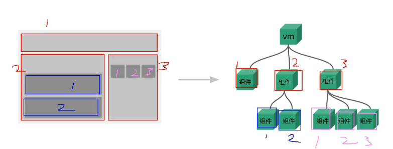

## 2. 深入了解组件

### 2.1 组件基础

组件允许我们将 UI 划分为独立的、可重用的部分，并且可以对每个部分进行单独的思考。在实际应用中，组件常常被组织成层层嵌套的树状结构：




这和我们嵌套 HTML 元素的方式类似，Vue 实现了自己的组件模型，使我们可以在每个组件内封装自定义内容与逻辑。Vue 同样也能很好地配合原生 Web Component。如果你想知道 Vue 组件与原生 Web Components 之间的关系，可以[阅读此章节](/guide/extras/web-components)。


#### 定义一个组件

**非单文件组件**

==一个文件中包含有多个组件。== 


**单文件组件**

当使用构建步骤时，我们一般会将 ==Vue 组件定义在一个单独的 `.vue` 文件中，这被叫做[单文件组件](/guide/scaling-up/sfc) (简称 SFC)：==

```vue
<script>
export default {
  data() {
    return {
      count: 0
    }
  }
}
</script>

<template>
  <button @click="count++">You clicked me {{ count }} times.</button>
</template>
```

当不使用构建步骤时，一个 Vue 组件以一个包含 Vue 特定选项的 JavaScript 对象来定义：

```js
export default {
  data() {
    return {
      count: 0
    }
  },
  template: `
    <button @click="count++">
      You clicked me {{ count }} times.
    </button>`
}
```

这里的模板是一个内联的 JavaScript 字符串，Vue 将会在运行时编译它。你也可以使用 ID 选择器来指向一个元素 (通常是原生的 `<template>` 元素)，Vue 将会使用其内容作为模板来源。

要在 html 中显示这个组件：
````html
<!DOCTYPE html>
<html>
<head>
  <title>Vue Component Example</title>
</head>
<body>
  <div id="app"></div>

  <!-- 引入 Vue 库 -->
  <script src="https://cdn.jsdelivr.net/npm/vue@2/dist/vue.js"></script>

  <!-- 引入组件文件 -->
  <script type="module">
    import MyComponent from './MyComponent.js';

    // 注册组件并创建 Vue 实例
    new Vue({
      el: '#app',
      components: {
        'my-component': MyComponent
      },
      template: '<my-component></my-component>'
    });
  </script>
</body>
</html>

````

上面的例子中定义了一个组件，并在一个 `.js` 文件里默认导出了它自己，但你也可以通过具名导出在一个文件中导出多个组件。


#### 使用组件

> 我们会在接下来的指引中使用 SFC 语法，无论你是否使用构建步骤，组件相关的概念都是相同的。[示例](/examples/)一节中展示了两种场景中的组件使用情况。
>

要使用一个子组件，我们需要在父组件中导入它。假设我们把计数器组件放在了一个叫做 `ButtonCounter.vue` 的文件中，这个组件将会以默认导出的形式被暴露给外部。


```vue
<script>
import ButtonCounter from './ButtonCounter.vue'

export default {
  components: {
    ButtonCounter
  }
}
</script>

<template>
  <h1>Here is a child component!</h1>
  <ButtonCounter />
</template>
```

若要将导入的组件暴露给模板，我们需要在 `components` 选项上[注册](/guide/components/registration)它。这个组件将会以其注册时的名字作为模板中的标签名。

```vue
<script setup>
import ButtonCounter from './ButtonCounter.vue'
</script>

<template>
  <h1>Here is a child component!</h1>
  <ButtonCounter />
</template>
```

通过 `<script setup>`，导入的组件都在模板中直接可用。


当然，你也可以全局地注册一个组件，使得它在当前应用中的任何组件上都可以使用，而不需要额外再导入。关于组件的全局注册和局部注册两种方式的利弊，我们放在了[组件注册](/guide/components/registration)这一章节中专门讨论。

组件可以被重用任意多次：

```vue-html
<h1>Here is a child component!</h1>
<ButtonCounter />
<ButtonCounter />
<ButtonCounter />
```


你会注意到，==每当点击这些按钮时，每一个组件都维护着自己的状态，是不同的 `count`。这是因为每当你使用一个组件，就创建了一个新的**实例**。==

在单文件组件中，推荐为子组件使用 `PascalCase` 的标签名，以此来和原生的 HTML 元素作区分。虽然原生 HTML 标签名是不区分大小写的，但 Vue 单文件组件是可以在编译中区分大小写的。我们也可以使用 `/>` 来关闭一个标签。

==如果你是直接在 DOM 中书写模板 (例如原生 `<template>` 元素的内容)，模板的编译需要遵从浏览器中 HTML 的解析行为。在这种情况下，你应该需要使用 `kebab-case` 形式并显式地关闭这些组件的标签。==

```vue-html
<!-- 如果是在 DOM 中书写该模板 -->
<button-counter></button-counter>
<button-counter></button-counter>
<button-counter></button-counter>
```

请看 [DOM 内模板解析注意事项](#in-dom-template-parsing-caveats)了解更多细节。


#### 传递 props 属性

如果我们正在构建一个博客，我们可能需要一个表示博客文章的组件。我们希望所有的博客文章分享相同的视觉布局，但有不同的内容。要实现这样的效果自然必须向组件中传递数据，例如每篇文章标题和内容，这就会使用到 props。

Props 是一种特别的 attributes，你可以在组件上声明注册。要传递给博客文章组件一个标题，我们必须在组件的 props 列表上声明它。这里要用到 [`props`](/api/options-state#props) 选项：


```vue
<!-- BlogPost.vue -->
<script>
export default {
  props: ['title']
}
</script>

<template>
  <h4>{{ title }}</h4>
</template>
```

当一个值被传递给 prop 时，它将成为该组件实例上的一个属性。该属性的值可以像其他组件属性一样，在模板和组件的 `this` 上下文中访问。


```vue
<!-- BlogPost.vue -->
<script setup>
defineProps(['title'])
</script>

<template>
  <h4>{{ title }}</h4>
</template>
```

`defineProps` 是一个仅 `<script setup>` 中可用的编译宏命令，并不需要显式地导入。声明的 props 会自动暴露给模板。`defineProps` 会返回一个对象，其中包含了可以传递给组件的所有 props：

```js
const props = defineProps(['title'])
console.log(props.title)
```

TypeScript 用户请参考：[为组件 props 标注类型](/guide/typescript/composition-api#typing-component-props)<sup class="vt-badge ts" />

如果你没有使用 `<script setup>`，props 必须以 `props` 选项的方式声明，props 对象会作为 `setup()` 函数的第一个参数被传入：

```js
export default {
  props: ['title'],
  setup(props) {
    console.log(props.title)
  }
}
```

一个组件可以有任意多的 props，默认情况下，所有 prop 都接受任意类型的值。

当一个 prop 被注册后，可以像这样以自定义 attribute 的形式传递数据给它：

```vue-html
<BlogPost title="My journey with Vue" />
<BlogPost title="Blogging with Vue" />
<BlogPost title="Why Vue is so fun" />
```

在实际应用中，我们可能在父组件中会有如下的一个博客文章数组：


```js
export default {
  // ...
  data() {
    return {
      posts: [
        { id: 1, title: 'My journey with Vue' },
        { id: 2, title: 'Blogging with Vue' },
        { id: 3, title: 'Why Vue is so fun' }
      ]
    }
  }
}
```

这种情况下，我们可以使用 `v-for` 来渲染它们：

```vue-html
<BlogPost
  v-for="post in posts"
  :key="post.id"
  :title="post.title"
 />
```

留意我们是如何使用 [`v-bind` 语法](/api/built-in-directives#v-bind) (`:title="post.title"`) 来传递动态 prop 值的。当事先不知道要渲染的确切内容时，这一点特别有用。

以上就是目前你需要了解的关于 props 的全部了。如果你看完本章节后还想知道更多细节，我们推荐你深入阅读关于 props 的[完整指引](/guide/components/props)。


#### 监听事件 

让我们继续关注我们的 `<BlogPost>` 组件。我们会发现有时候它需要与父组件进行交互。例如，要在此处实现无障碍访问的需求，将博客文章的文字能够放大，而页面的其余部分仍使用默认字号。

在父组件中，我们可以添加一个 `postFontSize` <span class="options-api">数据属性</span><span class="composition-api">ref </span>来实现这个效果：


```js{6}
data() {
  return {
    posts: [
      /* ... */
    ],
    postFontSize: 1
  }
}
```


```js{5}
const posts = ref([
  /* ... */
])

const postFontSize = ref(1)
```


在模板中用它来控制所有博客文章的字体大小：

```vue-html{1,7}
<div :style="{ fontSize: postFontSize + 'em' }">
  <BlogPost
    v-for="post in posts"
    :key="post.id"
    :title="post.title"
   />

```

然后，给 `<BlogPost>` 组件添加一个按钮：

```vue{5}
<!-- BlogPost.vue, 省略了 <script> -->
<template>
  <div class="blog-post">
    <h4>{{ title }}</h4>
    <button>Enlarge text</button>
  
</template>
```

这个按钮目前还没有做任何事情，我们想要点击这个按钮来告诉父组件它应该放大所有博客文章的文字。要解决这个问题，组件实例提供了一个自定义事件系统。父组件可以通过 `v-on` 或 `@` 来选择性地监听子组件上抛的事件，就像监听原生 DOM 事件那样：

```vue-html{3}
<BlogPost
  ...
  @enlarge-text="postFontSize += 0.1"
 />
```

子组件可以通过调用内置的 [**`$emit`** 方法](/api/component-instance#emit)，通过传入事件名称来抛出一个事件：

```vue{5}
<!-- BlogPost.vue, 省略了 <script> -->
<template>
  <div class="blog-post">
    <h4>{{ title }}</h4>
    <button @click="$emit('enlarge-text')">Enlarge text</button>
  
</template>
```

因为有了 `@enlarge-text="postFontSize += 0.1"` 的监听，父组件会接收这一事件，从而更新 `postFontSize` 的值。


[在演练场中尝试一下](https://play.vuejs.org/#eNqNUsFOg0AQ/ZUJMaGNbbHqidCmmujNxMRED9IDhYWuhV0CQy0S/t1ZYIEmaiRkw8y8N/vmMZVxl6aLY8EM23ByP+Mprl3Bk1RmCPexjJ5ljhBmMgFzYemEIpiuAHAFOzXQgIVeESNUKutL4gsmMLfbBPStVFTP1Bl46E2mup4xLDKhI4CUsMR+1zFABTywYTkD5BgzG8ynEj4kkVgJnxz38Eqaut5jxvXAUCIiLqI/8TcD/m1fKhTwHHIJYSEIr+HbnqikPkqBL/yLSMs23eDooNexel8pQJaksYeMIgAn4EewcyxjtnKNCsK+zbgpXILJEnW30bCIN7ZTPcd5KDNqoWjARWufa+iyfWBlV13wYJRvJtWVJhiKGyZiL4vYHNkJO8wgaQVXi6UGr51+Ndq5LBqMvhyrH9eYGePtOVu3n3YozWSqFsBsVJmt3SzhzVaYY2nm9l82+7GX5zTGjlTM1SyNmy5SeX+7rqr2r0NdOxbFXWVXIEoBGz/m/oHIF0rB5Pz6KTV6aBOgEo7Vsn51ov4GgAAf2A==)


[在演练场中尝试一下](https://play.vuejs.org/#eNp1Uk1PwkAQ/SuTxqQYgYp6ahaiJngzITHRA/UAZQor7W7TnaK16X93th8UEuHEvPdm5s3bls5Tmo4POTq+I0yYyZTAIOXpLFAySXVGUEKGEVQQZToBl6XukXqO9XahDbXc2OsAO5FlAIEKtWJByqCBqR01WFqiBLnxYTIEkhSjD+5rAV86zxQW8C1pB+88Aaphr73rtXbNVqrtBeV9r/zYFZYHacBoiHLFykB9Xgfq1NmLVvQmf7E1OGFaeE0anAMXhEkarwhtRWIjD+AbKmKcBk4JUdvtn8+6ARcTu87hLuCf6NJpSoDDKNIZj7BtIFUTUuB0tL/HomXHcnOC18d1TF305COqeJVtcUT4Q62mtzSF2/GkE8/E8b1qh8Ljw/if8I7nOkPn9En/+Ug2GEmFi0ynZrB0azOujbfB54kki5+aqumL8bING28Yr4xh+2vePrI39CnuHmZl2TwwVJXwuG6ZdU6kFTyGsQz33HyFvH5wvvyaB80bACwgvKbrYgLVH979DQc=)


我们可以通过 <span class="options-api">[`emits`](/api/options-state#emits) 选项</span><span class="composition-api">[`defineEmits`](/api/sfc-script-setup#defineprops-defineemits) 宏</span>来声明需要抛出的事件：


```vue{5}
<!-- BlogPost.vue -->
<script>
export default {
  props: ['title'],
  emits: ['enlarge-text']
}
</script>
```


```vue{4}
<!-- BlogPost.vue -->
<script setup>
defineProps(['title'])
defineEmits(['enlarge-text'])
</script>
```


这声明了一个组件可能触发的所有事件，还可以对事件的参数进行[验证](/guide/components/events#validate-emitted-events)。同时，这还可以让 Vue 避免将它们作为原生事件监听器隐式地应用于子组件的根元素。


和 `defineProps` 类似，`defineEmits` 仅可用于 `<script setup>` 之中，并且不需要导入，它返回一个等同于 `$emit` 方法的 `emit` 函数。它可以被用于在组件的 `<script setup>` 中抛出事件，因为此处无法直接访问 `$emit`：

```vue
<script setup>
const emit = defineEmits(['enlarge-text'])

emit('enlarge-text')
</script>
```

TypeScript 用户请参考：[为组件 emits 标注类型](/guide/typescript/composition-api#typing-component-emits)<sup class="vt-badge ts" />

如果你没有在使用 `<script setup>`，你可以通过 `emits` 选项定义组件会抛出的事件。你可以从 `setup()` 函数的第二个参数，即 setup 上下文对象上访问到 `emit` 函数：

```js
export default {
  emits: ['enlarge-text'],
  setup(props, ctx) {
    ctx.emit('enlarge-text')
  }
}
```

以上就是目前你需要了解的关于组件自定义事件的所有知识了。如果你看完本章节后还想知道更多细节，请深入阅读[组件事件](/guide/components/events)章节。


#### 通过插槽来分配内容 

一些情况下我们会希望能和 HTML 元素一样向组件中传递内容：

```vue-html
<AlertBox>
  Something bad happened.
</AlertBox>
```

我们期望能渲染成这样：

:::danger This is an Error for Demo Purposes
Something bad happened.
:::

这可以通过 Vue 的自定义 `<slot>` 元素来实现：

```vue{4}
<!-- AlertBox.vue -->
<template>
  <div class="alert-box">
    <strong>This is an Error for Demo Purposes</strong>
    <slot />
  
</template>

<style scoped>
.alert-box {
  /* ... */
}
</style>
```

如上所示，我们使用 `<slot>` 作为一个占位符，父组件传递进来的内容就会渲染在这里。

以上就是目前你需要了解的关于插槽的所有知识了。如果你看完本章节后还想知道更多细节，请深入阅读[组件插槽](/guide/components/slots)章节。


#### 动态组件

有些场景会需要在两个组件间来回切换，比如 Tab 界面：

上面的例子是通过 Vue 的 `<component>` 元素和特殊的 `is` attribute 实现的：


```vue-html
<!-- currentTab 改变时组件也改变 -->
<component :is="currentTab"></component>
```


```vue-html
<!-- currentTab 改变时组件也改变 -->
<component :is="tabs[currentTab]"></component>
```

在上面的例子中，被传给 `:is` 的值可以是以下几种：

- 被注册的组件名
- 导入的组件对象

你也可以使用 `is` attribute 来创建一般的 HTML 元素。

当使用 `<component :is="...">` 来在多个组件间作切换时，被切换掉的组件会被卸载。我们可以通过 [`<KeepAlive>` 组件](/guide/built-ins/keep-alive)强制被切换掉的组件仍然保持“存活”的状态。


#### DOM 内模板解析注意事项

如果你想在 DOM 中直接书写 Vue 模板，Vue 则必须从 DOM 中获取模板字符串。由于浏览器的原生 HTML 解析行为限制，有一些需要注意的事项。

:::tip
请注意下面讨论只适用于直接在 DOM 中编写模板的情况。如果你使用来自以下来源的字符串模板，就不需要顾虑这些限制了：

- 单文件组件
- 内联模板字符串 (例如 `template: '...'`)
- `<script type="text/x-template">`
  :::

##### 大小写区分

HTML 标签和属性名称是不分大小写的，所以浏览器会把任何大写的字符解释为小写。这意味着当你使用 DOM 内的模板时，无论是 PascalCase 形式的组件名称、camelCase 形式的 prop 名称还是 v-on 的事件名称，都需要转换为相应等价的 kebab-case (短横线连字符) 形式：

```js
// JavaScript 中的 camelCase
const BlogPost = {
  props: ['postTitle'],
  emits: ['updatePost'],
  template: `
    <h3>{{ postTitle }}</h3>
  `
}
```

```vue-html
<!-- HTML 中的 kebab-case -->
<blog-post post-title="hello!" @update-post="onUpdatePost"></blog-post>
```

##### 闭合标签 

我们在上面的例子中已经使用过了闭合标签 (self-closing tag)：

```vue-html
<MyComponent />
```

这是因为 Vue 的模板解析器支持任意标签使用 `/>` 作为标签关闭的标志。

然而在 DOM 内模板中，我们必须显式地写出关闭标签：

```vue-html
<my-component></my-component>
```

这是由于 HTML 只允许[一小部分特殊的元素](https://html.spec.whatwg.org/multipage/syntax.html#void-elements)省略其关闭标签，最常见的就是 `<input>` 和 ``。对于其他的元素来说，如果你省略了关闭标签，原生的 HTML 解析器会认为开启的标签永远没有结束，用下面这个代码片段举例来说：

```vue-html
<my-component /> <!-- 我们想要在这里关闭标签... -->
<span>hello</span>
```

将被解析为：

```vue-html
<my-component>
  <span>hello</span>
</my-component> <!-- 但浏览器会在这里关闭标签 -->
```

##### 元素位置限制 

某些 HTML 元素对于放在其中的元素类型有限制，例如 `<ul>`，`<ol>`，`<table>` 和 `<select>`，相应的，某些元素仅在放置于特定元素中时才会显示，例如 `<li>`，`<tr>` 和 `<option>`。

这将导致在使用带有此类限制元素的组件时出现问题。例如：

```vue-html
<table>
  <blog-post-row></blog-post-row>
</table>
```

自定义的组件 `<blog-post-row>` 将作为无效的内容被忽略，因而在最终呈现的输出中造成错误。我们可以使用特殊的 [`is` attribute](/api/built-in-special-attributes#is) 作为一种解决方案：

```vue-html
<table>
  <tr is="vue:blog-post-row"></tr>
</table>
```

:::tip
当使用在原生 HTML 元素上时，`is` 的值必须加上前缀 `vue:` 才可以被解析为一个 Vue 组件。这一点是必要的，为了避免和原生的[自定义内置元素](https://html.spec.whatwg.org/multipage/custom-elements.html#custom-elements-customized-builtin-example)相混淆。
:::

以上就是你需要了解的关于 DOM 内模板解析的所有注意事项，同时也是 Vue *基础*部分的所有内容。祝贺你！虽然还有很多需要学习的，但你可以先暂停一下，去用 Vue 做一些有趣的东西，或者研究一些[示例](/examples/)。

完成了本页的阅读后，回顾一下你刚才所学到的知识，如果还想知道更多细节，我们推荐你继续阅读关于组件的完整指引。


### 异步组件

#### 基本用法 {#basic-usage}

在大型项目中，我们可能需要拆分应用为更小的块，并仅在需要时再从服务器加载相关组件。Vue 提供了 [`defineAsyncComponent`](/api/general#defineasynccomponent) 方法来实现此功能：

```js
import { defineAsyncComponent } from 'vue'

const AsyncComp = defineAsyncComponent(() => {
  return new Promise((resolve, reject) => {
    // ...从服务器获取组件
    resolve(/* 获取到的组件 */)
  })
})
// ... 像使用其他一般组件一样使用 `AsyncComp`
```

如你所见，`defineAsyncComponent` 方法接收一个返回 Promise 的加载函数。这个 Promise 的 `resolve` 回调方法应该在从服务器获得组件定义时调用。你也可以调用 `reject(reason)` 表明加载失败。

[ES 模块动态导入](https://developer.mozilla.org/en-US/docs/Web/JavaScript/Reference/Operators/import)也会返回一个 Promise，所以多数情况下我们会将它和 `defineAsyncComponent` 搭配使用。类似 Vite 和 Webpack 这样的构建工具也支持此语法 (并且会将它们作为打包时的代码分割点)，因此我们也可以用它来导入 Vue 单文件组件：

```js
import { defineAsyncComponent } from 'vue'

const AsyncComp = defineAsyncComponent(() =>
  import('./components/MyComponent.vue')
)
```

最后得到的 `AsyncComp` 是一个外层包装过的组件，仅在页面需要它渲染时才会调用加载内部实际组件的函数。它会将接收到的 props 和插槽传给内部组件，所以你可以使用这个异步的包装组件无缝地替换原始组件，同时实现延迟加载。

与普通组件一样，异步组件可以使用 `app.component()` [全局注册](/guide/components/registration#global-registration)：

```js
app.component('MyComponent', defineAsyncComponent(() =>
  import('./components/MyComponent.vue')
))
```


你也可以在[局部注册组件](/guide/components/registration#local-registration)时使用 `defineAsyncComponent`：

```vue
<script>
import { defineAsyncComponent } from 'vue'

export default {
  components: {
    AdminPage: defineAsyncComponent(() =>
      import('./components/AdminPageComponent.vue')
    )
  }
}
</script>

<template>
  <AdminPage />
</template>
```


也可以直接在父组件中直接定义它们：

```vue
<script setup>
import { defineAsyncComponent } from 'vue'

const AdminPage = defineAsyncComponent(() =>
  import('./components/AdminPageComponent.vue')
)
</script>

<template>
  <AdminPage />
</template>
```


#### 加载与错误状态 {#loading-and-error-states}

异步操作不可避免地会涉及到加载和错误状态，因此 `defineAsyncComponent()` 也支持在高级选项中处理这些状态：

```js
const AsyncComp = defineAsyncComponent({
  // 加载函数
  loader: () => import('./Foo.vue'),

  // 加载异步组件时使用的组件
  loadingComponent: LoadingComponent,
  // 展示加载组件前的延迟时间，默认为 200ms
  delay: 200,

  // 加载失败后展示的组件
  errorComponent: ErrorComponent,
  // 如果提供了一个 timeout 时间限制，并超时了
  // 也会显示这里配置的报错组件，默认值是：Infinity
  timeout: 3000
})
```

如果提供了一个加载组件，它将在内部组件加载时先行显示。在加载组件显示之前有一个默认的 200ms 延迟——这是因为在网络状况较好时，加载完成得很快，加载组件和最终组件之间的替换太快可能产生闪烁，反而影响用户感受。

如果提供了一个报错组件，则它会在加载器函数返回的 Promise 抛错时被渲染。你还可以指定一个超时时间，在请求耗时超过指定时间时也会渲染报错组件。

#### 搭配 Suspense 使用 {#using-with-suspense}

异步组件可以搭配内置的 `<Suspense>` 组件一起使用，若想了解 `<Suspense>` 和异步组件之间交互，请参阅 [`<Suspense>`](/guide/built-ins/suspense) 章节。


### Props

> 此章节假设你已经看过了[组件基础](/guide/essentials/component-basics)。若你还不了解组件是什么，请先阅读该章节。

<!--
  <VueSchoolLink href="https://vueschool.io/lessons/vue-3-reusable-components-with-props" title="Free Vue.js Props Lesson"/>
-->

#### Props 声明 {#props-declaration}

一个组件需要显式声明它所接受的 props，这样 Vue 才能知道外部传入的哪些是 props，哪些是透传 attribute (关于透传 attribute，我们会在[专门的章节](/guide/components/attrs)中讨论)。


在使用 `<script setup>` 的单文件组件中，props 可以使用 `defineProps()` 宏来声明：

```vue
<script setup>
const props = defineProps(['foo'])

console.log(props.foo)
</script>
```

在没有使用 `<script setup>` 的组件中，prop 可以使用 [`props`](/api/options-state#props) 选项来声明：

```js
export default {
  props: ['foo'],
  setup(props) {
    // setup() 接收 props 作为第一个参数
    console.log(props.foo)
  }
}
```

注意传递给 `defineProps()` 的参数和提供给 `props` 选项的值是相同的，两种声明方式背后其实使用的都是 prop 选项。


props 需要使用 [`props`](/api/options-state#props) 选项来定义：

```js
export default {
  props: ['foo'],
  created() {
    // props 会暴露到 `this` 上
    console.log(this.foo)
  }
}
```


除了使用字符串数组来声明 prop 外，还可以使用对象的形式：


```js
export default {
  props: {
    title: String,
    likes: Number
  }
}
```


```js
// 使用 <script setup>
defineProps({
  title: String,
  likes: Number
})
```

```js
// 非 <script setup>
export default {
  props: {
    title: String,
    likes: Number
  }
}
```


对于以对象形式声明的每个属性，key 是 prop 的名称，而值则是该 prop 预期类型的构造函数。比如，如果要求一个 prop 的值是 `number` 类型，则可使用 `Number` 构造函数作为其声明的值。

对象形式的 props 声明不仅可以一定程度上作为组件的文档，而且如果其他开发者在使用你的组件时传递了错误的类型，也会在浏览器控制台中抛出警告。我们将在本章节稍后进一步讨论有关 [prop 校验](#prop-validation)的更多细节。


TypeScript 用户请参考：[为组件 Props 标注类型](/guide/typescript/options-api#typing-component-props) <sup class="vt-badge ts" />


如果你正在搭配 TypeScript 使用 `<script setup>`，也可以使用类型标注来声明 props：

```vue
<script setup lang="ts">
defineProps<{
  title?: string
  likes?: number
}>()
</script>
```

更多关于基于类型的声明的细节请参考[组件 props 类型标注](/guide/typescript/composition-api#typing-component-props)。<sup class="vt-badge ts" />


#### 传递 prop 的细节 {#prop-passing-details}

##### Prop 名字格式 {#prop-name-casing}

如果一个 prop 的名字很长，应使用 camelCase 形式，因为它们是合法的 JavaScript 标识符，可以直接在模板的表达式中使用，也可以避免在作为属性 key 名时必须加上引号。


```js
defineProps({
  greetingMessage: String
})
```


```js
export default {
  props: {
    greetingMessage: String
  }
}
```


```vue-html
<span>{{ greetingMessage }}</span>
```

虽然理论上你也可以在向子组件传递 props 时使用 camelCase 形式 (使用 [DOM 内模板](/guide/essentials/component-basics#in-dom-template-parsing-caveats)时例外)，但实际上为了和 HTML attribute 对齐，我们通常会将其写为 kebab-case 形式：

```vue-html
<MyComponent greeting-message="hello" />
```

对于组件名我们推荐使用 [PascalCase](/guide/components/registration#component-name-casing)，因为这提高了模板的可读性，能帮助我们区分 Vue 组件和原生 HTML 元素。然而对于传递 props 来说，使用 camelCase 并没有太多优势，因此我们推荐更贴近 HTML 的书写风格。

##### 静态 vs. 动态 Prop {#static-vs-dynamic-props}

至此，你已经见过了很多像这样的静态值形式的 props：

```vue-html
<BlogPost title="My journey with Vue" />
```

相应地，还有使用 `v-bind` 或缩写 `:` 来进行动态绑定的 props：

```vue-html
<!-- 根据一个变量的值动态传入 -->
<BlogPost :title="post.title" />

<!-- 根据一个更复杂表达式的值动态传入 -->
<BlogPost :title="post.title + ' by ' + post.author.name" />
```

##### 传递不同的值类型 {#passing-different-value-types}

在上述的两个例子中，我们只传入了字符串值，但实际上**任何**类型的值都可以作为 props 的值被传递。

###### Number {#number}

```vue-html
<!-- 虽然 `42` 是个常量，我们还是需要使用 v-bind -->
<!-- 因为这是一个 JavaScript 表达式而不是一个字符串 -->
<BlogPost :likes="42" />

<!-- 根据一个变量的值动态传入 -->
<BlogPost :likes="post.likes" />
```

###### Boolean {#boolean}

```vue-html
<!-- 仅写上 prop 但不传值，会隐式转换为 `true` -->
<BlogPost is-published />

<!-- 虽然 `false` 是静态的值，我们还是需要使用 v-bind -->
<!-- 因为这是一个 JavaScript 表达式而不是一个字符串 -->
<BlogPost :is-published="false" />

<!-- 根据一个变量的值动态传入 -->
<BlogPost :is-published="post.isPublished" />
```

###### Array {#array}

```vue-html
<!-- 虽然这个数组是个常量，我们还是需要使用 v-bind -->
<!-- 因为这是一个 JavaScript 表达式而不是一个字符串 -->
<BlogPost :comment-ids="[234, 266, 273]" />

<!-- 根据一个变量的值动态传入 -->
<BlogPost :comment-ids="post.commentIds" />
```

###### Object {#object}

```vue-html
<!-- 虽然这个对象字面量是个常量，我们还是需要使用 v-bind -->
<!-- 因为这是一个 JavaScript 表达式而不是一个字符串 -->
<BlogPost
  :author="{
    name: 'Veronica',
    company: 'Veridian Dynamics'
  }"
 />

<!-- 根据一个变量的值动态传入 -->
<BlogPost :author="post.author" />
```

##### 使用一个对象绑定多个 prop {#binding-multiple-properties-using-an-object}

如果你想要将一个对象的所有属性都当作 props 传入，你可以使用[没有参数的 `v-bind`](/guide/essentials/template-syntax#dynamically-binding-multiple-attributes)，即只使用 `v-bind` 而非 `:prop-name`。例如，这里有一个 `post` 对象：


```js
export default {
  data() {
    return {
      post: {
        id: 1,
        title: 'My Journey with Vue'
      }
    }
  }
}
```


```js
const post = {
  id: 1,
  title: 'My Journey with Vue'
}
```


以及下面的模板：

```vue-html
<BlogPost v-bind="post" />
```

而这实际上等价于：

```vue-html
<BlogPost :id="post.id" :title="post.title" />
```

#### 单向数据流 {#one-way-data-flow}

所有的 props 都遵循着**单向绑定**原则，props 因父组件的更新而变化，自然地将新的状态向下流往子组件，而不会逆向传递。这避免了子组件意外修改父组件的状态的情况，不然应用的数据流将很容易变得混乱而难以理解。

另外，每次父组件更新后，所有的子组件中的 props 都会被更新到最新值，这意味着你**不应该**在子组件中去更改一个 prop。若你这么做了，Vue 会在控制台上向你抛出警告：


```js
const props = defineProps(['foo'])

// ❌ 警告！prop 是只读的！
props.foo = 'bar'
```


```js
export default {
  props: ['foo'],
  created() {
    // ❌ 警告！prop 是只读的！
    this.foo = 'bar'
  }
}
```


导致你想要更改一个 prop 的需求通常来源于以下两种场景：

1. **prop 被用于传入初始值；而子组件想在之后将其作为一个局部数据属性**。在这种情况下，最好是新定义一个局部数据属性，从 props 上获取初始值即可：

   

   ```js
   const props = defineProps(['initialCounter'])

   // 计数器只是将 props.initialCounter 作为初始值
   // 像下面这样做就使 prop 和后续更新无关了
   const counter = ref(props.initialCounter)
   ```

   
   

   ```js
   export default {
     props: ['initialCounter'],
     data() {
       return {
         // 计数器只是将 this.initialCounter 作为初始值
         // 像下面这样做就使 prop 和后续更新无关了
         counter: this.initialCounter
       }
     }
   }
   ```

   

2. **需要对传入的 prop 值做进一步的转换**。在这种情况中，最好是基于该 prop 值定义一个计算属性：

   

   ```js
   const props = defineProps(['size'])
   
   // 该 prop 变更时计算属性也会自动更新
   const normalizedSize = computed(() => props.size.trim().toLowerCase())
   ```

   
   

   ```js
   export default {
     props: ['size'],
     computed: {
       // 该 prop 变更时计算属性也会自动更新
       normalizedSize() {
         return this.size.trim().toLowerCase()
       }
     }
   }
   ```

   

##### 更改对象 / 数组类型的 props {#mutating-object-array-props}

当对象或数组作为 props 被传入时，虽然子组件无法更改 props 绑定，但仍然**可以**更改对象或数组内部的值。这是因为 JavaScript 的对象和数组是按引用传递，而对 Vue 来说，禁止这样的改动，虽然可能生效，但有很大的性能损耗，比较得不偿失。

这种更改的主要缺陷是它允许了子组件以某种不明显的方式影响父组件的状态，可能会使数据流在将来变得更难以理解。在最佳实践中，你应该尽可能避免这样的更改，除非父子组件在设计上本来就需要紧密耦合。在大多数场景下，子组件应该[抛出一个事件](/guide/components/events)来通知父组件做出改变。

#### Prop 校验 {#prop-validation}

Vue 组件可以更细致地声明对传入的 props 的校验要求。比如我们上面已经看到过的类型声明，如果传入的值不满足类型要求，Vue 会在浏览器控制台中抛出警告来提醒使用者。这在开发给其他开发者使用的组件时非常有用。

要声明对 props 的校验，你可以向 <span class="composition-api">`defineProps()` 宏</span><span class="options-api">`props` 选项</span>提供一个带有 props 校验选项的对象，例如：


```js
defineProps({
  // 基础类型检查
  // （给出 `null` 和 `undefined` 值则会跳过任何类型检查）
  propA: Number,
  // 多种可能的类型
  propB: [String, Number],
  // 必传，且为 String 类型
  propC: {
    type: String,
    required: true
  },
  // 必传但可为空的字符串
  propD: {
    type: [String, null],
    required: true
  },
  // Number 类型的默认值
  propE: {
    type: Number,
    default: 100
  },
  // 对象类型的默认值
  propF: {
    type: Object,
    // 对象或数组的默认值
    // 必须从一个工厂函数返回。
    // 该函数接收组件所接收到的原始 prop 作为参数。
    default(rawProps) {
      return { message: 'hello' }
    }
  },
  // 自定义类型校验函数
  // 在 3.4+ 中完整的 props 作为第二个参数传入
  propG: {
    validator(value, props) {
      // The value must match one of these strings
      return ['success', 'warning', 'danger'].includes(value)
    }
  },
  // 函数类型的默认值
  propH: {
    type: Function,
    // 不像对象或数组的默认，这不是一个
    // 工厂函数。这会是一个用来作为默认值的函数
    default() {
      return 'Default function'
    }
  }
})
```

:::tip
`defineProps()` 宏中的参数**不可以访问 `<script setup>` 中定义的其他变量**，因为在编译时整个表达式都会被移到外部的函数中。
:::


```js
export default {
  props: {
    // 基础类型检查
    //（给出 `null` 和 `undefined` 值则会跳过任何类型检查）
    propA: Number,
    // 多种可能的类型
    propB: [String, Number],
    // 必传，且为 String 类型
    propC: {
      type: String,
      required: true
    },
    // 必传但可为空的字符串
    propD: {
      type: [String, null],
      required: true
    },
    // Number 类型的默认值
    propE: {
      type: Number,
      default: 100
    },
    // 对象类型的默认值
    propF: {
      type: Object,
      // 对象或者数组应当用工厂函数返回。
      // 工厂函数会收到组件所接收的原始 props
      // 作为参数
      default(rawProps) {
        return { message: 'hello' }
      }
    },
    // 自定义类型校验函数
    // 在 3.4+ 中完整的 props 作为第二个参数传入
    propG: {
      validator(value, props) {
        // The value must match one of these strings
        return ['success', 'warning', 'danger'].includes(value)
      }
    },
    // 函数类型的默认值
    propH: {
      type: Function,
      // 不像对象或数组的默认，这不是一个
      // 工厂函数。这会是一个用来作为默认值的函数
      default() {
        return 'Default function'
      }
    }
  }
}
```


一些补充细节：

- 所有 prop 默认都是可选的，除非声明了 `required: true`。

- 除 `Boolean` 外的未传递的可选 prop 将会有一个默认值 `undefined`。

- `Boolean` 类型的未传递 prop 将被转换为 `false`。这可以通过为它设置 `default` 来更改——例如：设置为 `default: undefined` 将与非布尔类型的 prop 的行为保持一致。

- 如果声明了 `default` 值，那么在 prop 的值被解析为 `undefined` 时，无论 prop 是未被传递还是显式指明的 `undefined`，都会改为 `default` 值。

当 prop 的校验失败后，Vue 会抛出一个控制台警告 (在开发模式下)。


如果使用了[基于类型的 prop 声明](/api/sfc-script-setup#type-only-props-emit-declarations) <sup class="vt-badge ts" />，Vue 会尽最大努力在运行时按照 prop 的类型标注进行编译。举例来说，`defineProps<{ msg: string }>` 会被编译为 `{ msg: { type: String, required: true }}`。


::: tip 注意
注意 prop 的校验是在组件实例被创建**之前**，所以实例的属性 (比如 `data`、`computed` 等) 将在 `default` 或 `validator` 函数中不可用。
:::


##### 运行时类型检查 {#runtime-type-checks}

校验选项中的 `type` 可以是下列这些原生构造函数：

- `String`
- `Number`
- `Boolean`
- `Array`
- `Object`
- `Date`
- `Function`
- `Symbol`
- `Error`

另外，`type` 也可以是自定义的类或构造函数，Vue 将会通过 `instanceof` 来检查类型是否匹配。例如下面这个类：

```js
class Person {
  constructor(firstName, lastName) {
    this.firstName = firstName
    this.lastName = lastName
  }
}
```

你可以将其作为一个 prop 的类型：


```js
defineProps({
  author: Person
})
```


```js
export default {
  props: {
    author: Person
  }
}
```


Vue 会通过 `instanceof Person` 来校验 `author` prop 的值是否是 `Person` 类的一个实例。

##### 可为空的类型 {#nullable-type}

如果该类型是必传的但可为空，你可以用一个包含 `null` 的数组语法：


```js
defineProps({
  id: {
    type: [String, null],
    required: true
  }
})
```


```js
export default {
  props: {
    id: {
      type: [String, null],
      required: true
    }
  }
}
```


注意如果 `type` 仅为 `null` 而非使用数组语法，它将允许任何类型。

#### Boolean 类型转换 {#boolean-casting}

为了更贴近原生 boolean attributes 的行为，声明为 `Boolean` 类型的 props 有特别的类型转换规则。以带有如下声明的 `<MyComponent>` 组件为例：


```js
defineProps({
  disabled: Boolean
})
```


```js
export default {
  props: {
    disabled: Boolean
  }
}
```


该组件可以被这样使用：

```vue-html
<!-- 等同于传入 :disabled="true" -->
<MyComponent disabled />

<!-- 等同于传入 :disabled="false" -->
<MyComponent />
```

当一个 prop 被声明为允许多种类型时，`Boolean` 的转换规则也将被应用。然而，当同时允许 `String` 和 `Boolean` 时，有一种边缘情况——只有当 `Boolean` 出现在 `String` 之前时，`Boolean` 转换规则才适用：


```js
// disabled 将被转换为 true
defineProps({
  disabled: [Boolean, Number]
})

// disabled 将被转换为 true
defineProps({
  disabled: [Boolean, String]
})

// disabled 将被转换为 true
defineProps({
  disabled: [Number, Boolean]
})

// disabled 将被解析为空字符串 (disabled="")
defineProps({
  disabled: [String, Boolean]
})
```


```js
// disabled 将被转换为 true
export default {
  props: {
    disabled: [Boolean, Number]
  }
}

// disabled 将被转换为 true
export default {
  props: {
    disabled: [Boolean, String]
  }
}

// disabled 将被转换为 true
export default {
  props: {
    disabled: [Number, Boolean]
  }
}

// disabled 将被解析为空字符串 (disabled="")
export default {
  props: {
    disabled: [String, Boolean]
  }
}
```


---

### provide-inject.md

### 依赖注入 {#provide-inject}

> 此章节假设你已经看过了[组件基础](/guide/essentials/component-basics)。若你还不了解组件是什么，请先阅读该章节。

#### Prop 逐级透传问题 {#prop-drilling}

通常情况下，当我们需要从父组件向子组件传递数据时，会使用 [props](/guide/components/props)。想象一下这样的结构：有一些多层级嵌套的组件，形成了一颗巨大的组件树，而某个深层的子组件需要一个较远的祖先组件中的部分数据。在这种情况下，如果仅使用 props 则必须将其沿着组件链逐级传递下去，这会非常麻烦：


<!-- https://www.figma.com/file/yNDTtReM2xVgjcGVRzChss/prop-drilling -->

注意，虽然这里的 `<Footer>` 组件可能根本不关心这些 props，但为了使 `<DeepChild>` 能访问到它们，仍然需要定义并向下传递。如果组件链路非常长，可能会影响到更多这条路上的组件。这一问题被称为“prop 逐级透传”，显然是我们希望尽量避免的情况。

`provide` 和 `inject` 可以帮助我们解决这一问题 <sup>[[1]](#footnote-1)</sup>。一个父组件相对于其所有的后代组件，会作为**依赖提供者**。任何后代的组件树，无论层级有多深，都可以**注入**由父组件提供给整条链路的依赖。


<!-- https://www.figma.com/file/PbTJ9oXis5KUawEOWdy2cE/provide-inject -->

#### Provide (提供) {#provide}


要为组件后代提供数据，需要使用到 [`provide()`](/api/composition-api-dependency-injection#provide) 函数：

```vue
<script setup>
import { provide } from 'vue'

provide(/* 注入名 */ 'message', /* 值 */ 'hello!')
</script>
```

如果不使用 `<script setup>`，请确保 `provide()` 是在 `setup()` 同步调用的：

```js
import { provide } from 'vue'

export default {
  setup() {
    provide(/* 注入名 */ 'message', /* 值 */ 'hello!')
  }
}
```

`provide()` 函数接收两个参数。第一个参数被称为**注入名**，可以是一个字符串或是一个 `Symbol`。后代组件会用注入名来查找期望注入的值。一个组件可以多次调用 `provide()`，使用不同的注入名，注入不同的依赖值。

第二个参数是提供的值，值可以是任意类型，包括响应式的状态，比如一个 ref：

```js
import { ref, provide } from 'vue'

const count = ref(0)
provide('key', count)
```

提供的响应式状态使后代组件可以由此和提供者建立响应式的联系。


要为组件后代提供数据，需要使用到 [`provide`](/api/options-composition#provide) 选项：

```js
export default {
  provide: {
    message: 'hello!'
  }
}
```

对于 `provide` 对象上的每一个属性，后代组件会用其 key 为注入名查找期望注入的值，属性的值就是要提供的数据。

如果我们需要提供依赖当前组件实例的状态 (比如那些由 `data()` 定义的数据属性)，那么可以以函数形式使用 `provide`：

```js{7-12}
export default {
  data() {
    return {
      message: 'hello!'
    }
  },
  provide() {
    // 使用函数的形式，可以访问到 `this`
    return {
      message: this.message
    }
  }
}
```

然而，请注意这**不会**使注入保持响应性。我们会在后续小节中讨论如何[让注入转变为响应式](#working-with-reactivity)。


#### 应用层 Provide {#app-level-provide}

除了在一个组件中提供依赖，我们还可以在整个应用层面提供依赖：

```js
import { createApp } from 'vue'

const app = createApp({})

app.provide(/* 注入名 */ 'message', /* 值 */ 'hello!')
```

在应用级别提供的数据在该应用内的所有组件中都可以注入。这在你编写[插件](/guide/reusability/plugins)时会特别有用，因为插件一般都不会使用组件形式来提供值。

#### Inject (注入) {#inject}


要注入上层组件提供的数据，需使用 [`inject()`](/api/composition-api-dependency-injection#inject) 函数：

```vue
<script setup>
import { inject } from 'vue'

const message = inject('message')
</script>
```

如果提供的值是一个 ref，注入进来的会是该 ref 对象，而**不会**自动解包为其内部的值。这使得注入方组件能够通过 ref 对象保持了和供给方的响应性链接。

[带有响应性的 provide + inject 完整示例](https://play.vuejs.org/#eNqFUUFugzAQ/MrKF1IpxfeIVKp66Kk/8MWFDXYFtmUbpArx967BhURRU9/WOzO7MzuxV+fKcUB2YlWovXYRAsbBvQije2d9hAk8Xo7gvB11gzDDxdseCuIUG+ZN6a7JjZIvVRIlgDCcw+d3pmvTglz1okJ499I0C3qB1dJQT9YRooVaSdNiACWdQ5OICj2WwtTWhAg9hiBbhHNSOxQKu84WT8LkNQ9FBhTHXyg1K75aJHNUROxdJyNSBVBp44YI43NvG+zOgmWWYGt7dcipqPhGZEe2ef07wN3lltD+lWN6tNkV/37+rdKjK2rzhRTt7f3u41xhe37/xJZGAL2PLECXa9NKdD/a6QTTtGnP88LgiXJtYv4BaLHhvg==)

同样的，如果没有使用 `<script setup>`，`inject()` 需要在 `setup()` 内同步调用：

```js
import { inject } from 'vue'

export default {
  setup() {
    const message = inject('message')
    return { message }
  }
}
```


要注入上层组件提供的数据，需使用 [`inject`](/api/options-composition#inject) 选项来声明：

```js
export default {
  inject: ['message'],
  created() {
    console.log(this.message) // injected value
  }
}
```

注入会在组件自身的状态**之前**被解析，因此你可以在 `data()` 中访问到注入的属性：

```js
export default {
  inject: ['message'],
  data() {
    return {
      // 基于注入值的初始数据
      fullMessage: this.message
    }
  }
}
```

[完整的 provide + inject 示例](https://play.vuejs.org/#eNqNkcFqwzAQRH9l0EUthOhuRKH00FO/oO7B2JtERZaEvA4F43+vZCdOTAIJCImRdpi32kG8h7A99iQKobs6msBvpTNt8JHxcTC2wS76FnKrJpVLZelKR39TSUO7qreMoXRA7ZPPkeOuwHByj5v8EqI/moZeXudCIBL30Z0V0FLXVXsqIA9krU8R+XbMR9rS0mqhS4KpDbZiSgrQc5JKQqvlRWzEQnyvuc9YuWbd4eXq+TZn0IvzOeKr8FvsNcaK/R6Ocb9Uc4FvefpE+fMwP0wH8DU7wB77nIo6x6a2hvNEME5D0CpbrjnHf+8excI=)

##### 注入别名 \* {#injection-aliasing}

当以数组形式使用 `inject`，注入的属性会以同名的 key 暴露到组件实例上。在上面的例子中，提供的属性名为 `"message"`，注入后以 `this.message` 的形式暴露。访问的本地属性名和注入名是相同的。

如果我们想要用一个不同的本地属性名注入该属性，我们需要在 `inject` 选项的属性上使用对象的形式：

```js
export default {
  inject: {
    /* 本地属性名 */ localMessage: {
      from: /* 注入来源名 */ 'message'
    }
  }
}
```

这里，组件本地化了原注入名 `"message"` 所提供的属性，并将其暴露为 `this.localMessage`。


##### 注入默认值 {#injection-default-values}

默认情况下，`inject` 假设传入的注入名会被某个祖先链上的组件提供。如果该注入名的确没有任何组件提供，则会抛出一个运行时警告。

如果在注入一个值时不要求必须有提供者，那么我们应该声明一个默认值，和 props 类似：


```js
// 如果没有祖先组件提供 "message"
// `value` 会是 "这是默认值"
const value = inject('message', '这是默认值')
```

在一些场景中，默认值可能需要通过调用一个函数或初始化一个类来取得。为了避免在用不到默认值的情况下进行不必要的计算或产生副作用，我们可以使用工厂函数来创建默认值：

```js
const value = inject('key', () => new ExpensiveClass(), true)
```

第三个参数表示默认值应该被当作一个工厂函数。


```js
export default {
  // 当声明注入的默认值时
  // 必须使用对象形式
  inject: {
    message: {
      from: 'message', // 当与原注入名同名时，这个属性是可选的
      default: 'default value'
    },
    user: {
      // 对于非基础类型数据，如果创建开销比较大，或是需要确保每个组件实例
      // 需要独立数据的，请使用工厂函数
      default: () => ({ name: 'John' })
    }
  }
}
```


#### 和响应式数据配合使用 {#working-with-reactivity}


当提供 / 注入响应式的数据时，**建议尽可能将任何对响应式状态的变更都保持在供给方组件中**。这样可以确保所提供状态的声明和变更操作都内聚在同一个组件内，使其更容易维护。

有的时候，我们可能需要在注入方组件中更改数据。在这种情况下，我们推荐在供给方组件内声明并提供一个更改数据的方法函数：

```vue{7-9,13}
<!-- 在供给方组件内 -->
<script setup>
import { provide, ref } from 'vue'

const location = ref('North Pole')

function updateLocation() {
  location.value = 'South Pole'
}

provide('location', {
  location,
  updateLocation
})
</script>
```

```vue{5}
<!-- 在注入方组件 -->
<script setup>
import { inject } from 'vue'

const { location, updateLocation } = inject('location')
</script>

<template>
  <button @click="updateLocation">{{ location }}</button>
</template>
```

最后，如果你想确保提供的数据不能被注入方的组件更改，你可以使用 [`readonly()`](/api/reactivity-core#readonly) 来包装提供的值。

```vue
<script setup>
import { ref, provide, readonly } from 'vue'

const count = ref(0)
provide('read-only-count', readonly(count))
</script>
```


为保证注入方和供给方之间的响应性链接，我们需要使用 [computed()](/api/reactivity-core#computed) 函数提供一个计算属性：

```js{10}
import { computed } from 'vue'

export default {
  data() {
    return {
      message: 'hello!'
    }
  },
  provide() {
    return {
      // 显式提供一个计算属性
      message: computed(() => this.message)
    }
  }
}
```

[带有响应性的 provide + inject 完整示例](https://play.vuejs.org/#eNqNUctqwzAQ/JVFFyeQxnfjBEoPPfULqh6EtYlV9EKWTcH43ytZtmPTQA0CsdqZ2dlRT16tPXctkoKUTeWE9VeqhbLGeXirheRwc0ZBds7HKkKzBdBDZZRtPXIYJlzqU40/I4LjjbUyIKmGEWw0at8UgZrUh1PscObZ4ZhQAA596/RcAShsGnbHArIapTRBP74O8Up060wnOO5QmP0eAvZyBV+L5jw1j2tZqsMp8yWRUHhUVjKPoQIohQ460L0ow1FeKJlEKEnttFweijJfiORElhCf5f3umObb0B9PU/I7kk17PJj7FloN/2t7a2Pj/Zkdob+x8gV8ZlMs2de/8+14AXwkBngD9zgVqjg2rNXPvwjD+EdlHilrn8MvtvD1+Q==)

`computed()` 函数常用于组合式 API 风格的组件中，但它同样还可以用于补充选项式 API 风格的某些用例。你可以通过阅读[响应式系统基础](/guide/essentials/reactivity-fundamentals)和[计算属性](/guide/essentials/computed)两个章节了解更多组合式的 API 风格。


#### 使用 Symbol 作注入名 {#working-with-symbol-keys}

至此，我们已经了解了如何使用字符串作为注入名。但如果你正在构建大型的应用，包含非常多的依赖提供，或者你正在编写提供给其他开发者使用的组件库，建议最好使用 Symbol 来作为注入名以避免潜在的冲突。

我们通常推荐在一个单独的文件中导出这些注入名 Symbol：

```js
// keys.js
export const myInjectionKey = Symbol()
```


```js
// 在供给方组件中
import { provide } from 'vue'
import { myInjectionKey } from './keys.js'

provide(myInjectionKey, { /*
  要提供的数据
*/ });
```

```js
// 注入方组件
import { inject } from 'vue'
import { myInjectionKey } from './keys.js'

const injected = inject(myInjectionKey)
```

TypeScript 用户请参考：[为 Provide / Inject 标注类型](/guide/typescript/composition-api#typing-provide-inject) <sup class="vt-badge ts" />


```js
// 在供给方组件中
import { myInjectionKey } from './keys.js'

export default {
  provide() {
    return {
      [myInjectionKey]: {
        /* 要提供的数据 */
      }
    }
  }
}
```

```js
// 注入方组件
import { myInjectionKey } from './keys.js'

export default {
  inject: {
    injected: { from: myInjectionKey }
  }
}
```


<small>

__译者注__

<a id="footnote-1"></a>[1] 在本章及后续章节中，“**提供**”将成为对应 Provide 的一个专有概念

</small>


---

### attrs.md

### 透传 Attributes {#fallthrough-attributes}

> 此章节假设你已经看过了[组件基础](/guide/essentials/component-basics)。若你还不了解组件是什么，请先阅读该章节。

#### Attributes 继承 {#attribute-inheritance}

“透传 attribute”指的是传递给一个组件，却没有被该组件声明为 [props](./props) 或 [emits](./events#defining-custom-events) 的 attribute 或者 `v-on` 事件监听器。最常见的例子就是 `class`、`style` 和 `id`。

当一个组件以单个元素为根作渲染时，透传的 attribute 会自动被添加到根元素上。举例来说，假如我们有一个 `<MyButton>` 组件，它的模板长这样：

```vue-html
<!-- <MyButton> 的模板 -->
<button>Click Me</button>
```

一个父组件使用了这个组件，并且传入了 `class`：

```vue-html
<MyButton class="large" />
```

最后渲染出的 DOM 结果是：

```html
<button class="large">Click Me</button>
```

这里，`<MyButton>` 并没有将 `class` 声明为一个它所接受的 prop，所以 `class` 被视作透传 attribute，自动透传到了 `<MyButton>` 的根元素上。

##### 对 `class` 和 `style` 的合并 {#class-and-style-merging}

如果一个子组件的根元素已经有了 `class` 或 `style` attribute，它会和从父组件上继承的值合并。如果我们将之前的 `<MyButton>` 组件的模板改成这样：

```vue-html
<!-- <MyButton> 的模板 -->
<button class="btn">Click Me</button>
```

则最后渲染出的 DOM 结果会变成：

```html
<button class="btn large">Click Me</button>
```

##### `v-on` 监听器继承 {#v-on-listener-inheritance}

同样的规则也适用于 `v-on` 事件监听器：

```vue-html
<MyButton @click="onClick" />
```

`click` 监听器会被添加到 `<MyButton>` 的根元素，即那个原生的 `<button>` 元素之上。当原生的 `<button>` 被点击，会触发父组件的 `onClick` 方法。同样的，如果原生 `button` 元素自身也通过 `v-on` 绑定了一个事件监听器，则这个监听器和从父组件继承的监听器都会被触发。

##### 深层组件继承 {#nested-component-inheritance}

有些情况下一个组件会在根节点上渲染另一个组件。例如，我们重构一下 `<MyButton>`，让它在根节点上渲染 `<BaseButton>`：

```vue-html
<!-- <MyButton/> 的模板，只是渲染另一个组件 -->
<BaseButton />
```

此时 `<MyButton>` 接收的透传 attribute 会直接继续传给 `<BaseButton>`。

请注意：

1. 透传的 attribute 不会包含 `<MyButton>` 上声明过的 props 或是针对 `emits` 声明事件的 `v-on` 侦听函数，换句话说，声明过的 props 和侦听函数被 `<MyButton>`“消费”了。

2. 透传的 attribute 若符合声明，也可以作为 props 传入 `<BaseButton>`。

#### 禁用 Attributes 继承 {#disabling-attribute-inheritance}

如果你**不想要**一个组件自动地继承 attribute，你可以在组件选项中设置 `inheritAttrs: false`。


 从 3.3 开始你也可以直接在 `<script setup>` 中使用 [`defineOptions`](/api/sfc-script-setup#defineoptions)：

```vue
<script setup>
defineOptions({
  inheritAttrs: false
})
// ...setup 逻辑
</script>
```


最常见的需要禁用 attribute 继承的场景就是 attribute 需要应用在根节点以外的其他元素上。通过设置 `inheritAttrs` 选项为 `false`，你可以完全控制透传进来的 attribute 被如何使用。

这些透传进来的 attribute 可以在模板的表达式中直接用 `$attrs` 访问到。

```vue-html
<span>Fallthrough attribute: {{ $attrs }}</span>
```

这个 `$attrs` 对象包含了除组件所声明的 `props` 和 `emits` 之外的所有其他 attribute，例如 `class`，`style`，`v-on` 监听器等等。

有几点需要注意：

- 和 props 有所不同，透传 attributes 在 JavaScript 中保留了它们原始的大小写，所以像 `foo-bar` 这样的一个 attribute 需要通过 `$attrs['foo-bar']` 来访问。

- 像 `@click` 这样的一个 `v-on` 事件监听器将在此对象下被暴露为一个函数 `$attrs.onClick`。

现在我们要再次使用一下[之前小节](#attribute-inheritance)中的 `<MyButton>` 组件例子。有时候我们可能为了样式，需要在 `<button>` 元素外包装一层 `<div>`：

```vue-html
<div class="btn-wrapper">
  <button class="btn">Click Me</button>

```

我们想要所有像 `class` 和 `v-on` 监听器这样的透传 attribute 都应用在内部的 `<button>` 上而不是外层的 `<div>` 上。我们可以通过设定 `inheritAttrs: false` 和使用 `v-bind="$attrs"` 来实现：

```vue-html{2}
<div class="btn-wrapper">
  <button class="btn" v-bind="$attrs">Click Me</button>

```

小提示：[没有参数的 `v-bind`](/guide/essentials/template-syntax#dynamically-binding-multiple-attributes) 会将一个对象的所有属性都作为 attribute 应用到目标元素上。

#### 多根节点的 Attributes 继承 {#attribute-inheritance-on-multiple-root-nodes}

和单根节点组件有所不同，有着多个根节点的组件没有自动 attribute 透传行为。如果 `$attrs` 没有被显式绑定，将会抛出一个运行时警告。

```vue-html
<CustomLayout id="custom-layout" @click="changeValue" />
```

如果 `<CustomLayout>` 有下面这样的多根节点模板，由于 Vue 不知道要将 attribute 透传到哪里，所以会抛出一个警告。

```vue-html
<header>...</header>
<main>...</main>
<footer>...</footer>
```

如果 `$attrs` 被显式绑定，则不会有警告：

```vue-html{2}
<header>...</header>
<main v-bind="$attrs">...</main>
<footer>...</footer>
```

#### 在 JavaScript 中访问透传 Attributes {#accessing-fallthrough-attributes-in-javascript}


如果需要，你可以在 `<script setup>` 中使用 `useAttrs()` API 来访问一个组件的所有透传 attribute：

```vue
<script setup>
import { useAttrs } from 'vue'

const attrs = useAttrs()
</script>
```

如果没有使用 `<script setup>`，`attrs` 会作为 `setup()` 上下文对象的一个属性暴露：

```js
export default {
  setup(props, ctx) {
    // 透传 attribute 被暴露为 ctx.attrs
    console.log(ctx.attrs)
  }
}
```

需要注意的是，虽然这里的 `attrs` 对象总是反映为最新的透传 attribute，但它并不是响应式的 (考虑到性能因素)。你不能通过侦听器去监听它的变化。如果你需要响应性，可以使用 prop。或者你也可以使用 `onUpdated()` 使得在每次更新时结合最新的 `attrs` 执行副作用。


如果需要，你可以通过 `$attrs` 这个实例属性来访问组件的所有透传 attribute：

```js
export default {
  created() {
    console.log(this.$attrs)
  }
}
```


---

### slots.md

### 插槽 Slots {#slots}

> 此章节假设你已经看过了[组件基础](/guide/essentials/component-basics)。若你还不了解组件是什么，请先阅读该章节。

<!--<VueSchoolLink href="https://vueschool.io/lessons/vue-3-component-slots" title="Free Vue.js Slots Lesson"/>-->

#### 插槽内容与出口 {#slot-content-and-outlet}

在之前的章节中，我们已经了解到组件能够接收任意类型的 JavaScript 值作为 props，但组件要如何接收模板内容呢？在某些场景中，我们可能想要为子组件传递一些模板片段，让子组件在它们的组件中渲染这些片段。

举例来说，这里有一个 `<FancyButton>` 组件，可以像这样使用：

```vue-html{2}
<FancyButton>
  Click me! <!-- 插槽内容 -->
</FancyButton>
```

而 `<FancyButton>` 的模板是这样的：

```vue-html{2}
<button class="fancy-btn">
  <slot></slot> <!-- 插槽出口 -->
</button>
```

`<slot>` 元素是一个**插槽出口** (slot outlet)，标示了父元素提供的**插槽内容** (slot content) 将在哪里被渲染。


<!-- https://www.figma.com/file/LjKTYVL97Ck6TEmBbstavX/slot -->

最终渲染出的 DOM 是这样：

```html
<button class="fancy-btn">Click me!</button>
```


[在演练场中尝试一下](https://play.vuejs.org/#eNpdUdlqAyEU/ZVbQ0kLMdNsXabTQFvoV8yLcRkkjopLSQj596oTwqRvnuM9y9UT+rR2/hs5qlHjqZM2gOch2m2rZW+NC/BDND1+xRCMBuFMD9N5NeKyeNrqphrUSZdA4L1VJPCEAJrRdCEAvpWke+g5NHcYg1cmADU6cB0A4zzThmYckqimupqiGfpXILe/zdwNhaki3n+0SOR5vAu6ReU++efUajtqYGJQ/FIg5w8Wt9FlOx+OKh/nV1c4ZVNqlHE1TIQQ7xnvCN13zkTNalBSc+Jw5wiTac2H1WLDeDeDyXrJVm9LWG7uE3hev3AhHge1cYwnO200L4QljEnd1bCxB1g82UNhe+I6qQs5kuGcE30NrxeaRudzOWtkemeXuHP5tLIKOv8BN+mw3w==)


[在演练场中尝试一下](https://play.vuejs.org/#eNpdUdtOwzAM/RUThAbSurIbl1ImARJf0ZesSapoqROlKdo07d9x0jF1SHmIT+xzcY7sw7nZTy9Zwcqu9tqFTYW6ddYH+OZYHz77ECyC8raFySwfYXFsUiFAhXKfBoRUvDcBjhGtLbGgxNAVcLziOlVIp8wvelQE2TrDg6QKoBx1JwDgy+h6B62E8ibLoDM2kAAGoocsiz1VKMfmCCrzCymbsn/GY95rze1grja8694rpmJ/tg1YsfRO/FE134wc2D4YeTYQ9QeKa+mUrgsHE6+zC+vfjoz1Bdwqpd5iveX1rvG2R1GA0Si5zxrPhaaY98v5WshmCrerhVi+LmCxvqPiafUslXoYpq0XkuiQ1p4Ax4XQ2BSwdnuYP7p9QlvuG40JHI1lUaenv3o5w3Xvu2jOWU179oQNn5aisNMvLBvDOg==)


通过使用插槽，`<FancyButton>` 仅负责渲染外层的 `<button>` (以及相应的样式)，而其内部的内容由父组件提供。

理解插槽的另一种方式是和下面的 JavaScript 函数作类比，其概念是类似的：

```js
// 父元素传入插槽内容
FancyButton('Click me!')

// FancyButton 在自己的模板中渲染插槽内容
function FancyButton(slotContent) {
  return `<button class="fancy-btn">
      ${slotContent}
    </button>`
}
```

插槽内容可以是任意合法的模板内容，不局限于文本。例如我们可以传入多个元素，甚至是组件：

```vue-html
<FancyButton>
  <span style="color:red">Click me!</span>
  <AwesomeIcon name="plus" />
</FancyButton>
```


[在演练场中尝试一下](https://play.vuejs.org/#eNp1UmtOwkAQvspQYtCEgrx81EqCJibeoX+W7bRZaHc3+1AI4QyewH8ewvN4Aa/gbgtNIfFf5+vMfI/ZXbCQcvBmMYiCWFPFpAGNxsp5wlkphTLwQjjdPlljBIdMiRJ6g2EL88O9pnnxjlqU+EpbzS3s0BwPaypH4gqDpSyIQVcBxK3VFQDwXDC6hhJdlZi4zf3fRKwl4aDNtsDHJKCiECqiW8KTYH5c1gEnwnUdJ9rCh/XeM6Z42AgN+sFZAj6+Ux/LOjFaEK2diMz3h0vjNfj/zokuhPFU3lTdfcpShVOZcJ+DZgHs/HxtCrpZlj34eknoOlfC8jSCgnEkKswVSRlyczkZzVLM+9CdjtPJ/RjGswtX3ExvMcuu6mmhUnTruOBYAZKkKeN5BDO5gdG13FRoSVTOeAW2xkLPY3UEdweYWqW9OCkYN6gctq9uXllx2Z09CJ9dJwzBascI7nBYihWDldUGMqEgdTVIq6TQqCEMfUpNSD+fX7/fH+3b7P8AdGP6wA==)


[在演练场中尝试一下](https://play.vuejs.org/#eNptUltu2zAQvMpGQZEWsOzGiftQ1QBpgQK9g35oaikwkUiCj9aGkTPkBPnLIXKeXCBXyJKKBdoIoA/tYGd3doa74tqY+b+ARVXUjltp/FWj5GC09fCHKb79FbzXCoTVA5zNFxkWaWdT8/V/dHrAvzxrzrC3ZoBG4SYRWhQs9B52EeWapihU3lWwyxfPDgbfNYq+ejEppcLjYHrmkSqAOqMmAOB3L/ktDEhV4+v8gMR/l1M7wxQ4v+3xZ1Nw3Wtb8S1TTXG1H3cCJIO69oxc5mLUcrSrXkxSi1lxZGT0//CS9Wg875lzJELE/nLto4bko69dr31cFc8auw+3JHvSEfQ7nwbsHY9HwakQ4kes14zfdlYH1VbQS4XMlp1lraRMPl6cr1rsZnB6uWwvvi9hufpAxZfLryjEp5GtbYs0TlGICTCsbaXqKliZDZx/NpuEDsx2UiUwo5VxT6Dkv73BPFgXxRktlUdL2Jh6OoW8O3pX0buTsoTgaCNQcDjoGwk3wXkQ2tJLGzSYYI126KAso0uTSc8Pjy9P93k2d6+NyRKa)


通过使用插槽，`<FancyButton>` 组件更加灵活和具有可复用性。现在组件可以用在不同的地方渲染各异的内容，但同时还保证都具有相同的样式。

Vue 组件的插槽机制是受[原生 Web Component `<slot>` 元素](https://developer.mozilla.org/en-US/docs/Web/HTML/Element/slot)的启发而诞生，同时还做了一些功能拓展，这些拓展的功能我们后面会学习到。

#### 渲染作用域 {#render-scope}

插槽内容可以访问到父组件的数据作用域，因为插槽内容本身是在父组件模板中定义的。举例来说：

```vue-html
<span>{{ message }}</span>
<FancyButton>{{ message }}</FancyButton>
```

这里的两个 <span v-pre>`{{ message }}`</span> 插值表达式渲染的内容都是一样的。

插槽内容**无法访问**子组件的数据。Vue 模板中的表达式只能访问其定义时所处的作用域，这和 JavaScript 的词法作用域规则是一致的。换言之：

> 父组件模板中的表达式只能访问父组件的作用域；子组件模板中的表达式只能访问子组件的作用域。

#### 默认内容 {#fallback-content}

在外部没有提供任何内容的情况下，可以为插槽指定默认内容。比如有这样一个 `<SubmitButton>` 组件：

```vue-html
<button type="submit">
  <slot></slot>
</button>
```

如果我们想在父组件没有提供任何插槽内容时在 `<button>` 内渲染“Submit”，只需要将“Submit”写在 `<slot>` 标签之间来作为默认内容：

```vue-html{3}
<button type="submit">
  <slot>
    Submit <!-- 默认内容 -->
  </slot>
</button>
```

现在，当我们在父组件中使用 `<SubmitButton>` 且没有提供任何插槽内容时：

```vue-html
<SubmitButton />
```

“Submit”将会被作为默认内容渲染：

```html
<button type="submit">Submit</button>
```

但如果我们提供了插槽内容：

```vue-html
<SubmitButton>Save</SubmitButton>
```

那么被显式提供的内容会取代默认内容：

```html
<button type="submit">Save</button>
```


[在演练场中尝试一下](https://play.vuejs.org/#eNp1kMsKwjAQRX9lzMaNbfcSC/oL3WbT1ikU8yKZFEX8d5MGgi2YVeZxZ86dN7taWy8B2ZlxP7rZEnikYFuhZ2WNI+jCoGa6BSKjYXJGwbFufpNJfhSaN1kflTEgVFb2hDEC4IeqguARpl7KoR8fQPgkqKpc3Wxo1lxRWWeW+Y4wBk9x9V9d2/UL8g1XbOJN4WAntodOnrecQ2agl8WLYH7tFyw5olj10iR3EJ+gPCxDFluj0YS6EAqKR8mi9M3Td1ifLxWShcU=)


[在演练场中尝试一下](https://play.vuejs.org/#eNp1UEEOwiAQ/MrKxYu1d4Mm+gWvXChuk0YKpCyNxvh3lxIb28SEA8zuDDPzEucQ9mNCcRAymqELdFKu64MfCK6p6Tu6JCLvoB18D9t9/Qtm4lY5AOXwMVFu2OpkCV4ZNZ51HDqKhwLAQjIjb+X4yHr+mh+EfbCakF8AclNVkCJCq61ttLkD4YOgqsp0YbGesJkVBj92NwSTIrH3v7zTVY8oF8F4SdazD7ET69S5rqXPpnigZ8CjEnHaVyInIp5G63O6XIGiIlZMzrGMd8RVfR0q4lIKKV+L+srW+wNTTZq3)


#### 具名插槽 {#named-slots}

有时在一个组件中包含多个插槽出口是很有用的。举例来说，在一个 `<BaseLayout>` 组件中，有如下模板：

```vue-html
<div class="container">
  <header>
    <!-- 标题内容放这里 -->
  </header>
  <main>
    <!-- 主要内容放这里 -->
  </main>
  <footer>
    <!-- 底部内容放这里 -->
  </footer>

```

对于这种场景，`<slot>` 元素可以有一个特殊的 attribute `name`，用来给各个插槽分配唯一的 ID，以确定每一处要渲染的内容：

```vue-html
<div class="container">
  <header>
    <slot name="header"></slot>
  </header>
  <main>
    <slot></slot>
  </main>
  <footer>
    <slot name="footer"></slot>
  </footer>

```

这类带 `name` 的插槽被称为具名插槽 (named slots)。没有提供 `name` 的 `<slot>` 出口会隐式地命名为“default”。

在父组件中使用 `<BaseLayout>` 时，我们需要一种方式将多个插槽内容传入到各自目标插槽的出口。此时就需要用到**具名插槽**了：

要为具名插槽传入内容，我们需要使用一个含 `v-slot` 指令的 `<template>` 元素，并将目标插槽的名字传给该指令：

```vue-html
<BaseLayout>
  <template v-slot:header>
    <!-- header 插槽的内容放这里 -->
  </template>
</BaseLayout>
```

`v-slot` 有对应的简写 `#`，因此 `<template v-slot:header>` 可以简写为 `<template #header>`。其意思就是“将这部分模板片段传入子组件的 header 插槽中”。


<!-- https://www.figma.com/file/2BhP8gVZevttBu9oUmUUyz/named-slot -->

下面我们给出完整的、向 `<BaseLayout>` 传递插槽内容的代码，指令均使用的是缩写形式：

```vue-html
<BaseLayout>
  <template #header>
    <h1>Here might be a page title</h1>
  </template>

  <template #default>
    <p>A paragraph for the main content.</p>
    <p>And another one.</p>
  </template>

  <template #footer>
    <p>Here's some contact info</p>
  </template>
</BaseLayout>
```

当一个组件同时接收默认插槽和具名插槽时，所有位于顶级的非 `<template>` 节点都被隐式地视为默认插槽的内容。所以上面也可以写成：

```vue-html
<BaseLayout>
  <template #header>
    <h1>Here might be a page title</h1>
  </template>

  <!-- 隐式的默认插槽 -->
  <p>A paragraph for the main content.</p>
  <p>And another one.</p>

  <template #footer>
    <p>Here's some contact info</p>
  </template>
</BaseLayout>
```

现在 `<template>` 元素中的所有内容都将被传递到相应的插槽。最终渲染出的 HTML 如下：

```html
<div class="container">
  <header>
    <h1>Here might be a page title</h1>
  </header>
  <main>
    <p>A paragraph for the main content.</p>
    <p>And another one.</p>
  </main>
  <footer>
    <p>Here's some contact info</p>
  </footer>

```


[在演练场中尝试一下](https://play.vuejs.org/#eNp9UsFuwjAM/RWrHLgMOi5o6jIkdtphn9BLSF0aKU2ixEVjiH+fm8JoQdvRfu/5xS8+ZVvvl4cOsyITUQXtCSJS5zel1a13geBdRvyUR9cR1MG1MF/mt1YvnZdW5IOWVVwQtt5IQq4AxI2cau5ccZg1KCsMlz4jzWrzgQGh1fuGYIcgwcs9AmkyKHKGLyPykcfD1Apr2ZmrHUN+s+U5Qe6D9A3ULgA1bCK1BeUsoaWlyPuVb3xbgbSOaQGcxRH8v3XtHI0X8mmfeYToWkxmUhFoW7s/JvblJLERmj1l0+T7T5tqK30AZWSMb2WW3LTFUGZXp/u8o3EEVrbI9AFjLn8mt38fN9GIPrSp/p4/Yoj7OMZ+A/boN9KInPeZZpAOLNLRDAsPZDgN4p0L/NQFOV/Ayn9x6EZXMFNKvQ4E5YwLBczW6/WlU3NIi6i/sYDn5Qu2qX1OF51MsvMPkrIEHg==)


[在演练场中尝试一下](https://play.vuejs.org/#eNp9UkFuwjAQ/MoqHLiUpFxQlaZI9NRDn5CLSTbEkmNb9oKgiL934wRwQK3ky87O7njGPicba9PDHpM8KXzlpKV1qWVnjSP4FB6/xcnsCRpnOpin2R3qh+alBig1HgO9xkbsFcG5RyvDOzRq8vkAQLSury+l5lNkN1EuCDurBCFXAMWdH2pGrn2YtShqdCPOnXa5/kKH0MldS7BFEGDFDoEkKSwybo8rskjjaevo4L7Wrje8x4mdE7aFxjiglkWE1GxQE9tLi8xO+LoGoQ3THLD/qP2/dGMMxYZs8DP34E2HQUxUBFI35o+NfTlJLOomL8n04frXns7W8gCVEt5/lElQkxpdmVyVHvP2yhBo0SHThx5z+TEZvl1uMlP0oU3nH/kRo3iMI9Ybes960UyRsZ9pBuGDeTqpwfBAvn7NrXF81QUZm8PSHjl0JWuYVVX1PhAqo4zLYbZarUak4ZAWXv5gDq/pG3YBHn50EEkuv5irGBk=)


使用 JavaScript 函数来类比可能更有助于你来理解具名插槽：

```js
// 传入不同的内容给不同名字的插槽
BaseLayout({
  header: `...`,
  default: `...`,
  footer: `...`
})

// <BaseLayout> 渲染插槽内容到对应位置
function BaseLayout(slots) {
  return `<div class="container">
      <header>${slots.header}</header>
      <main>${slots.default}</main>
      <footer>${slots.footer}</footer>
    `
}
```

#### 条件插槽 {#conditional-slots}

有时你需要根据插槽是否存在来渲染某些内容。

你可以结合使用 [$slots](/api/component-instance.html#slots) 属性与 [v-if](/guide/essentials/conditional.html#v-if) 来实现。

在下面的示例中，我们定义了一个卡片组件，它拥有三个条件插槽：`header`、`footer` 和 `default`。
当 header、footer 或 default 存在时，我们希望包装它们以提供额外的样式：

```vue-html
<template>
  <div class="card">
    <div v-if="$slots.header" class="card-header">
      <slot name="header" />
    
    
    <div v-if="$slots.default" class="card-content">
      <slot />
    
    
    <div v-if="$slots.footer" class="card-footer">
      <slot name="footer" />
    
  
</template>
```

[在演练场中尝试一下](https://play.vuejs.org/#eNqVVMtu2zAQ/BWCLZBLIjVoTq4aoA1yaA9t0eaoCy2tJcYUSZCUKyPwv2dJioplOw4C+EDuzM4+ONYT/aZ1tumBLmhhK8O1IxZcr29LyTutjCN3zNRkZVRHLrLcXzz9opRFHvnIxIuDTgvmAG+EFJ4WTnhOCPnQAqvBjHFE2uvbh5Zbgj/XAolwkWN4TM33VI/UalixXvjyo5yeqVVKOpCuyP0ob6utlHL7vUE3U4twkWP4hJq/jiPP4vSSOouNrHiTPVolcclPnl3SSnWaCzC/teNK2pIuSEA8xoRQ/3+GmDM9XKZ41UK1PhF/tIOPlfSPAQtmAyWdMMdMAy7C9/9+wYDnCexU3QtknwH/glWi9z1G2vde1tj2Hi90+yNYhcvmwd4PuHabhvKNeuYu8EuK1rk7M/pLu5+zm5BXyh1uMdnOu3S+95pvSCWYtV9xQcgqaXogj2yu+AqBj1YoZ7NosJLOEq5S9OXtPZtI1gFSppx8engUHs+vVhq9eVhq9ORRrXdpRyseSqfo6SmmnONK6XTw9yis24q448wXSG+0VAb3sSDXeiBoDV6TpWDV+ktENatrdMGCfAoBfL1JYNzzpINJjVFoJ9yKUKho19ul6OFQ6UYPx1rjIpPYeXIc/vXCgjetawzbni0dPnhhJ3T3DMVSruI=)

#### 动态插槽名 {#dynamic-slot-names}

[动态指令参数](/guide/essentials/template-syntax.md#dynamic-arguments)在 `v-slot` 上也是有效的，即可以定义下面这样的动态插槽名：

```vue-html
<base-layout>
  <template v-slot:[dynamicSlotName]>
    ...
  </template>

  <!-- 缩写为 -->
  <template #[dynamicSlotName]>
    ...
  </template>
</base-layout>
```

注意这里的表达式和动态指令参数受相同的[语法限制](/guide/essentials/template-syntax.md#dynamic-argument-syntax-constraints)。

#### 作用域插槽 {#scoped-slots}

在上面的[渲染作用域](#render-scope)中我们讨论到，插槽的内容无法访问到子组件的状态。

然而在某些场景下插槽的内容可能想要同时使用父组件域内和子组件域内的数据。要做到这一点，我们需要一种方法来让子组件在渲染时将一部分数据提供给插槽。

我们也确实有办法这么做！可以像对组件传递 props 那样，向一个插槽的出口上传递 attributes：

```vue-html
<!-- <MyComponent> 的模板 -->
<div>
  <slot :text="greetingMessage" :count="1"></slot>

```

当需要接收插槽 props 时，默认插槽和具名插槽的使用方式有一些小区别。下面我们将先展示默认插槽如何接受 props，通过子组件标签上的 `v-slot` 指令，直接接收到了一个插槽 props 对象：

```vue-html
<MyComponent v-slot="slotProps">
  {{ slotProps.text }} {{ slotProps.count }}
</MyComponent>
```


<!-- https://www.figma.com/file/QRneoj8eIdL1kw3WQaaEyc/scoped-slot -->


[在演练场中尝试一下](https://play.vuejs.org/#eNp9kMEKgzAMhl8l9OJlU3aVOhg7C3uAXsRlTtC2tFE2pO++dA5xMnZqk+b/8/2dxMnadBxQ5EL62rWWwCMN9qh021vjCMrn2fBNoya4OdNDkmarXhQnSstsVrOOC8LedhVhrEiuHca97wwVSsTj4oz1SvAUgKJpgqWZEj4IQoCvZm0Gtgghzss1BDvIbFkqdmID+CNdbbQnaBwitbop0fuqQSgguWPXmX+JePe1HT/QMtJBHnE51MZOCcjfzPx04JxsydPzp2Szxxo7vABY1I/p)


[在演练场中尝试一下](https://play.vuejs.org/#eNqFkNFqxCAQRX9l8CUttAl9DbZQ+rzQD/AlJLNpwKjoJGwJ/nvHpAnusrAg6FzHO567iE/nynlCUQsZWj84+lBmGJ31BKffL8sng4bg7O0IRVllWnpWKAOgDF7WBx2em0kTLElt975QbwLkhkmIyvCS1TGXC8LR6YYwVSTzH8yvQVt6VyJt3966oAR38XhaFjjEkvBCECNcia2d2CLyOACZQ7CDrI6h4kXcAF7lcg+za6h5et4JPdLkzV4B9B6RBtOfMISmxxqKH9TarrGtATxMgf/bDfM/qExEUCdEDuLGXAmoV06+euNs2JK7tyCrzSNHjX9aurQf)


子组件传入插槽的 props 作为了 `v-slot` 指令的值，可以在插槽内的表达式中访问。

你可以将作用域插槽类比为一个传入子组件的函数。子组件会将相应的 props 作为参数传给它：

```js
MyComponent({
  // 类比默认插槽，将其想成一个函数
  default: (slotProps) => {
    return `${slotProps.text} ${slotProps.count}`
  }
})

function MyComponent(slots) {
  const greetingMessage = 'hello'
  return `<div>${
    // 在插槽函数调用时传入 props
    slots.default({ text: greetingMessage, count: 1 })
  }`
}
```

实际上，这已经和作用域插槽的最终代码编译结果、以及手动编写[渲染函数](/guide/extras/render-function)时使用作用域插槽的方式非常类似了。

`v-slot="slotProps"` 可以类比这里的函数签名，和函数的参数类似，我们也可以在 `v-slot` 中使用解构：

```vue-html
<MyComponent v-slot="{ text, count }">
  {{ text }} {{ count }}
</MyComponent>
```

##### 具名作用域插槽 {#named-scoped-slots}

具名作用域插槽的工作方式也是类似的，插槽 props 可以作为 `v-slot` 指令的值被访问到：`v-slot:name="slotProps"`。当使用缩写时是这样：

```vue-html
<MyComponent>
  <template #header="headerProps">
    {{ headerProps }}
  </template>

  <template #default="defaultProps">
    {{ defaultProps }}
  </template>

  <template #footer="footerProps">
    {{ footerProps }}
  </template>
</MyComponent>
```

向具名插槽中传入 props：

```vue-html
<slot name="header" message="hello"></slot>
```

注意插槽上的 `name` 是一个 Vue 特别保留的 attribute，不会作为 props 传递给插槽。因此最终 `headerProps` 的结果是 `{ message: 'hello' }`。

如果你同时使用了具名插槽与默认插槽，则需要为默认插槽使用显式的 `<template>` 标签。尝试直接为组件添加 `v-slot` 指令将导致编译错误。这是为了避免因默认插槽的 props 的作用域而困惑。举例：

```vue-html
<!-- 该模板无法编译 -->
<template>
  <MyComponent v-slot="{ message }">
    <p>{{ message }}</p>
    <template #footer>
      <!-- message 属于默认插槽，此处不可用 -->
      <p>{{ message }}</p>
    </template>
  </MyComponent>
</template>
```

为默认插槽使用显式的 `<template>` 标签有助于更清晰地指出 `message` 属性在其他插槽中不可用：

```vue-html
<template>
  <MyComponent>
    <!-- 使用显式的默认插槽 -->
    <template #default="{ message }">
      <p>{{ message }}</p>
    </template>

    <template #footer>
      <p>Here's some contact info</p>
    </template>
  </MyComponent>
</template>
```

##### 高级列表组件示例 {#fancy-list-example}

你可能想问什么样的场景才适合用到作用域插槽，这里我们来看一个 `<FancyList>` 组件的例子。它会渲染一个列表，并同时会封装一些加载远端数据的逻辑、使用数据进行列表渲染、或者是像分页或无限滚动这样更进阶的功能。然而我们希望它能够保留足够的灵活性，将对单个列表元素内容和样式的控制权留给使用它的父组件。我们期望的用法可能是这样的：

```vue-html
<FancyList :api-url="url" :per-page="10">
  <template #item="{ body, username, likes }">
    <div class="item">
      <p>{{ body }}</p>
      <p>by {{ username }} | {{ likes }} likes</p>
    
  </template>
</FancyList>
```

在 `<FancyList>` 之中，我们可以多次渲染 `<slot>` 并每次都提供不同的数据 (注意我们这里使用了 `v-bind` 来传递插槽的 props)：

```vue-html
<ul>
  <li v-for="item in items">
    <slot name="item" v-bind="item"></slot>
  </li>
</ul>
```


[在演练场中尝试一下](https://play.vuejs.org/#eNqFU2Fv0zAQ/StHJtROapNuZTBCNwnQQKBpTGxCQss+uMml8+bYlu2UlZL/zjlp0lQa40sU3/nd3Xv3vA7eax0uSwziYGZTw7UDi67Up4nkhVbGwScm09U5tw5yowoYhFEX8cBBImdRgyQMHRwWWjCHdAKYbdFM83FpxEkS0DcJINZoxpotkCIHkySo7xOixcMep19KrmGustUISotGsgJHIPgDWqg6DKEyvoRUMGsJ4HG9HGX16bqpAlU1izy5baqDFegYweYroMttMwLAHx/Y9Kyan36RWUTN2+mjXfpbrei8k6SjdSuBYFOlMaNI6AeAtcflSrqx5b8xhkl4jMU7H0yVUCaGvVeH8+PjKYWqWnpf5DQYBTtb+fc612Awh2qzzGaBiUyVpBVpo7SFE8gw5xIv/Wl4M9gsbjCCQbuywe3+FuXl9iiqO7xpElEEhUofKFQo2mTGiFiOLr3jcpFImuiaF6hKNxzuw8lpw7kuEy6ZKJGK3TR6NluLYXBVqwRXQjkLn0ueIc3TLonyZ0sm4acqKVovKIbDCVQjGsb1qvyg2telU4Yzz6eHv6ARBWdwjVqUNCbbFjqgQn6aW1J8RKfJhDg+5/lStG4QHJZjnpO5XjT0BMqFu+uZ81yxjEQJw7A1kOA76FyZjaWBy0akvu8tCQKeQ+d7wsy5zLpz1FlzU3kW1QP+x40ApWgWAySEJTv6/NitNMkllcTakwCaZZ5ADEf6cROas/RhYVQps5igEpkZLwzRROmG04OjDBcj7+Js+vYQDo9e0uH1qzeY5/s1vtaaqG969+vTTrsmBTMLLv12nuy7l+d5W673SBzxkzlfhPdWSXokdZMkSFWhuUDzTTtOnk6CuG2fBEwI9etrHXOmRLJUE0/vMH14In5vH30sCS4Nkr+WmARdztHQ6Jr02dUFPtJ/lyxUVgq6/UzyO1olSj9jc+0DcaWxe/fqab/UT51Uu7Znjw6lbUn5QWtR6vtJQM//4zPUt+NOw+lGzCqo/gLm1QS8)


[在演练场中尝试一下](https://play.vuejs.org/#eNqNVNtq20AQ/ZWpQnECujhO0qaqY+hD25fQl4RCifKwllbKktXushcT1/W/d1bSSnYJNCCEZmbPmcuZ1S76olS6cTTKo6UpNVN2VQjWKqktfCOi3N4yY6HWsoVZmo0eD5kVAqAQ9KU7XNGaOG5h572lRAZBhTV574CJzJv7QuCzzMaMaFjaKk4sRQtgOeUmiiVO85siwncRQa6oThRpKHrO50XUnUdEwMMJw08M7mAtq20MzlAtSEtj4OyZGkweMIiq2AZKToxBgMcdxDCqVrueBfb7ZaaOQiOspZYgbL0FPBySIQD+eMeQc99/HJIsM0weqs+O258mjfZREE1jt5yCKaWiFXpSX0A/5loKmxj2m+YwT69p+7kXg0udw8nlYn19fYGufvSeZBXF0ZGmR2vwmrJKS4WiPswGWWYxzIIgs8fYH6mIJadnQXdNrdMiWAB+yJ7gsXdgLfjqcK10wtJqgmYZ+spnpGgl6up5oaa2fGKi6U8Yau9ZS6Wzpwi7WU1p7BMzaZcLbuBh0q2XM4fZXTc+uOPSGvjuWEWxlaAexr9uiIBf0qG3Uy6HxXwo9B+mn47CvbNSM+LHccDxAyvmjMA9Vdxh1WQiO0eywBVGEaN3Pj972wVxPKwOZ7BJWI2b+K5rOOVUNPbpYJNvJalwZmmahm3j7AhdSz3sPzDRS3R4SQwOCXxP4yVBzJqJarSzcY8H5mXWFfif1QVwPGjGcQWTLp7YrcLxCfyDdAuMW0cq30AOV+plcK1J+dxoXJkqR6igRCeNxjbxp3N6cX5V0Sb2K19dfFrA4uo9Gh8uP9K6Puvw3eyx9SH3IT/qPCZpiW6Y8Gq9mvekrutAN96o/V99ALPj)


##### 无渲染组件 {#renderless-components}

上面的 `<FancyList>` 案例同时封装了可重用的逻辑 (数据获取、分页等) 和视图输出，但也将部分视图输出通过作用域插槽交给了消费者组件来管理。

如果我们将这个概念拓展一下，可以想象的是，一些组件可能只包括了逻辑而不需要自己渲染内容，视图输出通过作用域插槽全权交给了消费者组件。我们将这种类型的组件称为**无渲染组件**。

这里有一个无渲染组件的例子，一个封装了追踪当前鼠标位置逻辑的组件：

```vue-html
<MouseTracker v-slot="{ x, y }">
  Mouse is at: {{ x }}, {{ y }}
</MouseTracker>
```


[在演练场中尝试一下](https://play.vuejs.org/#eNqNUcFqhDAQ/ZUhF12w2rO4Cz301t5aaCEX0dki1SQko6uI/96J7i4qLPQQmHmZ9+Y9ZhQvxsRdiyIVmStsZQgcUmtOUlWN0ZbgXbcOP2xe/KKFs9UNBHGyBj09kCpLFj4zuSFsTJ0T+o6yjUb35GpNRylG6CMYYJKCpwAkzWNQOcgphZG/YZoiX/DQNAttFjMrS+6LRCT2rh6HGsHiOQKtmKIIS19+qmZpYLrmXIKxM1Vo5Yj9HD0vfD7ckGGF3LDWlOyHP/idYPQCfdzldTtjscl/8MuDww78lsqHVHdTYXjwCpdKlfoS52X52qGit8oRKrRhwHYdNrrDILouPbCNVZCtgJ1n/6Xx8JYAmT8epD3fr5cC0oGLQYpkd4zpD27R0vA=)


[在演练场中尝试一下](https://play.vuejs.org/#eNqVUU1rwzAM/SvCl7SQJTuHdLDDbttthw18MbW6hjW2seU0oeS/T0lounQfUDBGepaenvxO4tG5rIkoClGGra8cPUhT1c56ghcbA756tf1EDztva0iy/Ds4NCbSAEiD7diicafigeA0oFvLPAYNhWICYEE5IL00fMp8Hs0JYe0OinDIqFyIaO7CwdJGihO0KXTcLriK59NYBlUARTyMn6Hv0yHgIp7ARAvl3FXm8yCRiuu1Fv/x23JakVqtz3t5pOjNOQNoC7hPz0nHyRSzEr7Ghxppb/XlZ6JjRlzhTAlA+ypkLWwAM6c+8G2BdzP+/pPbRkOoL/KOldH2mCmtnxr247kKhAb9KuHKgLVtMEkn2knG+sIVzV9sfmy8hfB/swHKwV0oWja4lQKKjoNOivzKrf4L/JPqaQ==)


虽然这个模式很有趣，但大部分能用无渲染组件实现的功能都可以通过组合式 API 以另一种更高效的方式实现，并且还不会带来额外组件嵌套的开销。之后我们会在[组合式函数](/guide/reusability/composables)一章中介绍如何更高效地实现追踪鼠标位置的功能。

尽管如此，作用域插槽在需要**同时**封装逻辑、组合视图界面时还是很有用，就像上面的 `<FancyList>` 组件那样。


---

### registration.md

### 组件注册

> 此章节假设你已经看过了[组件基础](/guide/essentials/component-basics)。若你还不了解组件是什么，请先阅读该章节。

一个 Vue 组件在使用前需要先被“注册”，这样 Vue 才能在渲染模板时找到其对应的实现。组件注册有两种方式：全局注册和局部注册。

#### 全局注册 {#global-registration}

我们可以使用 [Vue 应用实例](/guide/essentials/application)的 `.component()` 方法，让组件在当前 Vue 应用中全局可用。

```js
import { createApp } from 'vue'

const app = createApp({})

app.component(
  // 注册的名字
  'MyComponent',
  // 组件的实现
  {
    /* ... */
  }
)
```

如果使用单文件组件，你可以注册被导入的 `.vue` 文件：

```js
import MyComponent from './App.vue'

app.component('MyComponent', MyComponent)
```

`.component()` 方法可以被链式调用：

```js
app
  .component('ComponentA', ComponentA)
  .component('ComponentB', ComponentB)
  .component('ComponentC', ComponentC)
```

全局注册的组件可以在此应用的任意组件的模板中使用：

```vue-html
<!-- 这在当前应用的任意组件中都可用 -->
<ComponentA/>
<ComponentB/>
<ComponentC/>
```

所有的子组件也可以使用全局注册的组件，这意味着这三个组件也都可以在*彼此内部*使用。


#### 局部注册 

全局注册虽然很方便，但有以下几个问题：

1. 全局注册，但并没有被使用的组件无法在生产打包时被自动移除 (也叫“tree-shaking”)。如果你全局注册了一个组件，即使它并没有被实际使用，它仍然会出现在打包后的 JS 文件中。

2. 全局注册在大型项目中使项目的依赖关系变得不那么明确。在父组件中使用子组件时，不太容易定位子组件的实现。和使用过多的全局变量一样，这可能会影响应用长期的可维护性。

相比之下，局部注册的组件需要在使用它的父组件中显式导入，并且只能在该父组件中使用。它的优点是使组件之间的依赖关系更加明确，并且对 tree-shaking 更加友好。


在使用 `<script setup>` 的单文件组件中，导入的组件可以直接在模板中使用，无需注册：

```vue
<script setup>
import ComponentA from './ComponentA.vue'
</script>

<template>
  <ComponentA />
</template>
```

如果没有使用 `<script setup>`，则需要使用 `components` 选项来显式注册：

```js
import ComponentA from './ComponentA.js'

export default {
  components: {
    ComponentA
  },
  setup() {
    // ...
  }
}
```


局部注册需要使用 `components` 选项：

```vue
<script>
import ComponentA from './ComponentA.vue'

export default {
  components: {
    ComponentA
  }
}
</script>

<template>
  <ComponentA />
</template>
```


对于每个 `components` 对象里的属性，它们的 key 名就是注册的组件名，而值就是相应组件的实现。上面的例子中使用的是 ES2015 的缩写语法，等价于：

```js
export default {
  components: {
    ComponentA: ComponentA
  }
  // ...
}
```

请注意：**局部注册的组件在后代组件中<i>不</i>可用**。在这个例子中，`ComponentA` 注册后仅在当前组件可用，而在任何的子组件或更深层的子组件中都不可用。


#### 组件名格式 

在整个指引中，我们都使用 PascalCase 作为组件名的注册格式，这是因为：

1. PascalCase 是合法的 JavaScript 标识符。这使得在 JavaScript 中导入和注册组件都很容易，同时 IDE 也能提供较好的自动补全。

2. `<PascalCase />` 在模板中更明显地表明了这是一个 Vue 组件，而不是原生 HTML 元素。同时也能够将 Vue 组件和自定义元素 (web components) 区分开来。

在单文件组件和内联字符串模板中，我们都推荐这样做。但是，PascalCase 的标签名在 DOM 内模板中是不可用的，详情参见 [DOM 内模板解析注意事项](/guide/essentials/component-basics#in-dom-template-parsing-caveats)。

为了方便，Vue 支持将模板中使用 kebab-case 的标签解析为使用 PascalCase 注册的组件。这意味着一个以 `MyComponent` 为名注册的组件，在模板中可以通过 `<MyComponent>` 或 `<my-component>` 引用。这让我们能够使用同样的 JavaScript 组件注册代码来配合不同来源的模板。


### 组件 v-model {#component-v-model}

#### 基本用法 {#basic-usage}

==`v-model` 可以在组件上使用以实现双向绑定。==

从 Vue 3.4 开始，推荐的实现方式是使用 [`defineModel()`](/api/sfc-script-setup#definemodel) 宏：

```vue
<!-- Child.vue -->
<script setup>
const model = defineModel()

function update() {
  model.value++
}
</script>

<template>
  <div>Parent bound v-model is: {{ model }}
</template>
```

父组件可以用 `v-model` 绑定一个值：

```vue-html
<!-- Parent.vue -->
<Child v-model="countModel" />
```

`defineModel()` 返回的值是一个 ref。它可以像其他 ref 一样被访问以及修改，不过它能起到在父组件和当前变量之间的双向绑定的作用：

- 它的 `.value` 和父组件的 `v-model` 的值同步；
- 当它被子组件变更了，会触发父组件绑定的值一起更新。

这意味着你也可以用 `v-model` 把这个 ref 绑定到一个原生 input 元素上，在提供相同的 `v-model` 用法的同时轻松包装原生 input 元素：

```vue
<script setup>
const model = defineModel()
</script>

<template>
  <input v-model="model" />
</template>
```

[演练场示例](https://play.vuejs.org/#eNqFUtFKwzAU/ZWYl06YLbK30Q10DFSYigq+5KW0t11mmoQknZPSf/cm3eqEsT0l555zuefmpKV3WsfbBuiUpjY3XDtiwTV6ziSvtTKOLNZcFKQ0qiZRnATkG6JB0BIDJen2kp5iMlfSOlLbisw8P4oeQAhFPpURxVV0zWSa9PNwEgIHtRaZA0SEpOvbeduG5q5LE0Sh2jvZ3tSqADFjFHlGSYJkmhz10zF1FseXvIo3VklcrfX9jOaq1lyAedGOoz1GpyQwnsvQ3fdTqDnTwPhQz9eQf52ob+zO1xh9NWDBbIHRgXOZqcD19PL9GXZ4H0h03whUnyHfwCrReI+97L6RBdo+0gW3j+H9uaw+7HLnQNrDUt6oV3ZBzyhmsjiz+p/dSTwJfUx2+IpD1ic+xz5enwQGXEDJJaw8Gl2I1upMzlc/hEvdOBR6SNKAjqP1J6P/o6XdL11L5h4=)

##### 底层机制 {#under-the-hood}

`defineModel` 是一个便利宏。编译器将其展开为以下内容：

- 一个名为 `modelValue` 的 prop，本地 ref 的值与其同步；
- 一个名为 `update:modelValue` 的事件，当本地 ref 的值发生变更时触发。

在 3.4 版本之前，你一般会按照如下的方式来实现上述相同的子组件：

```vue
<!-- Child.vue -->
<script setup>
const props = defineProps(['modelValue'])
const emit = defineEmits(['update:modelValue'])
</script>

<template>
  <input
    :value="props.modelValue"
    @input="emit('update:modelValue', $event.target.value)"
  />
</template>
```

然后，父组件中的 `v-model="modelValue"` 将被编译为：

```vue-html
<!-- Parent.vue -->
<Child
  :modelValue="foo"
  @update:modelValue="$event => (foo = $event)"
/>
```

如你所见，这显得冗长得多。然而，这样写有助于理解其底层机制。

因为 `defineModel` 声明了一个 prop，你可以通过给 `defineModel` 传递选项，来声明底层 prop 的选项：

```js
// 使 v-model 必填
const model = defineModel({ required: true })

// 提供一个默认值
const model = defineModel({ default: 0 })
```

:::warning
如果为 `defineModel` prop 设置了一个 `default` 值且父组件没有为该 prop 提供任何值，会导致父组件与子组件之间不同步。在下面的示例中，父组件的 `myRef` 是 undefined，而子组件的 `model` 是 1：

```js
// 子组件：
const model = defineModel({ default: 1 })

// 父组件
const myRef = ref()
```

```html
<Child v-model="myRef"></Child>
```

:::


首先让我们回忆一下 `v-model` 在原生元素上的用法：

```vue-html
<input v-model="searchText" />
```

在代码背后，模板编译器会对 `v-model` 进行更冗长的等价展开。因此上面的代码其实等价于下面这段：

```vue-html
<input
  :value="searchText"
  @input="searchText = $event.target.value"
/>
```

而当使用在一个组件上时，`v-model` 会被展开为如下的形式：

```vue-html
<CustomInput
  :model-value="searchText"
  @update:model-value="newValue => searchText = newValue"
/>
```

要让这个例子实际工作起来，`<CustomInput>` 组件内部需要做两件事：

1. 将内部原生 `<input>` 元素的 `value` attribute 绑定到 `modelValue` prop
2. 当原生的 `input` 事件触发时，触发一个携带了新值的 `update:modelValue` 自定义事件

这里是相应的代码：

```vue
<!-- CustomInput.vue -->
<script>
export default {
  props: ['modelValue'],
  emits: ['update:modelValue']
}
</script>

<template>
  <input
    :value="modelValue"
    @input="$emit('update:modelValue', $event.target.value)"
  />
</template>
```

现在 `v-model` 可以在这个组件上正常工作了：

```vue-html
<CustomInput v-model="searchText" />
```

[在演练场中尝试一下](https://play.vuejs.org/#eNqFkctqwzAQRX9lEAEn4Np744aWrvoD3URdiHiSGvRCHpmC8b93JDfGKYGCkJjXvTrSJF69r8aIohHtcA69p6O0vfEuELzFgZx5tz4SXIIzUFT1JpfGCmmlxe/c3uFFRU0wSQtwdqxh0dLQwHSnNJep3ilS+8PSCxCQYrC3CMDgMKgrNlB8odaOXVJ2TgdvvNp6vSwHhMZrRcgRQLs1G5+M61A/S/ErKQXUR5immwXMWW1VEKX4g3j3Mo9QfXCeKU9FtvpQmp/lM0Oi6RP/qYieebHZNvyL0acLLODNmGYSxCogxVJ6yW1c2iWz/QOnEnY48kdUpMIVGSllD8t8zVZb+PkHqPG4iw==)

另一种在组件内实现 `v-model` 的方式是使用一个可写的，同时具有 getter 和 setter 的 `computed` 属性。`get` 方法需返回 `modelValue` prop，而 `set` 方法需触发相应的事件：

```vue
<!-- CustomInput.vue -->
<script>
export default {
  props: ['modelValue'],
  emits: ['update:modelValue'],
  computed: {
    value: {
      get() {
        return this.modelValue
      },
      set(value) {
        this.$emit('update:modelValue', value)
      }
    }
  }
}
</script>

<template>
  <input v-model="value" />
</template>
```


#### `v-model` 的参数 {#v-model-arguments}

组件上的 `v-model` 也可以接受一个参数：

```vue-html
<MyComponent v-model:title="bookTitle" />
```


在子组件中，我们可以通过将字符串作为第一个参数传递给 `defineModel()` 来支持相应的参数：

```vue
<!-- MyComponent.vue -->
<script setup>
const title = defineModel('title')
</script>

<template>
  <input type="text" v-model="title" />
</template>
```

[在演练场中尝试一下](https://play.vuejs.org/#eNqFU9tu2zAM/RVBKOAWyGIM25PhFbugDxuwC7a+VX3wEiZ1K0uCRHkuDP/7SKlxk16BILbIQ/KcQ3mUn5xb9hFkJeuw8q3DU2XazlmP4vvtF0tvBgyKjbedKJblXozLCmWUgSHB17BpokYxKiPEaocKlRgPOk0Lzq8bbI5PMlYIDxi92Z2E+GvtzXmLGipR9G86uwYtGr+NHTeAoemc5tEMnfhBf/Sry1kBHRAI1SDQSYj66u3pON73FdNUlxRLuX12d9MqZNQHJecKJUVJ8Lqc+8qFfODGgYlPueK8dWTIRZHaF5fJCuhadumiiI5cgTy6uHxVUmtcxGwC3jomizCgkjlU9Y2OKZjZ5+jHVETRI556fDhyIY6gZylIXgMp4g4nufSxdgwrazbtdnkdrCHlSaCSvPhWg//psLUmKEn7z7OVbLS2/76lGPoISX2quYLVzRPx6zBwTMlfHgL4nmTMucwxp8/+/EjK5yTtMLLoF5K/IVgdmWOGfY5mTbT3cInt1/QptGZ7Hs4GBBN2ophounoJryStn+/Cc9Lv6b5bvt9dWTn9B6F1Lrs=)

如果需要额外的 prop 选项，应该在 model 名称之后传递：

```js
const title = defineModel('title', { required: true })
```

<details>
<summary>3.4 之前的用法</summary>

```vue
<!-- MyComponent.vue -->
<script setup>
defineProps({
  title: {
    required: true
  }
})
defineEmits(['update:title'])
</script>

<template>
  <input
    type="text"
    :value="title"
    @input="$emit('update:title', $event.target.value)"
  />
</template>
```

[在演练场中尝试一下](https://play.vuejs.org/#eNp9kE1rwzAMhv+KMIW00DXsGtKyMXYc7D7vEBplM8QfOHJoCfnvk+1QsjJ2svVKevRKk3h27jAGFJWoh7NXjmBACu4kjdLOeoIJPHYwQ+ethoJLi1vq7fpi+WfQ0JI+lCstcrkYQJqzNQMBKeoRjhG4LcYHbVvsofFfQUcCXhrteix20tRl9sIuOCBkvSHkCKD+fjxN04Ka57rkOOlrMwu7SlVHKdIrBZRcWpc3ntiLO7t/nKHFThl899YN248ikYpP9pj1V60o6sG1TMwDU/q/FZRxgeIPgK4uGcQLSZGlamz6sHKd1afUxOoGeeT298A9bHCMKxBfE3mTSNjl1vud5x8qNa76)

</details>


在这种情况下，子组件应该使用 `title` prop 和 `update:title` 事件来更新父组件的值，而非默认的 `modelValue` prop 和 `update:modelValue` 事件：

```vue
<!-- MyComponent.vue -->
<script>
export default {
  props: ['title'],
  emits: ['update:title']
}
</script>

<template>
  <input
    type="text"
    :value="title"
    @input="$emit('update:title', $event.target.value)"
  />
</template>
```

[在演练场中尝试一下](https://play.vuejs.org/#eNqFUNFqwzAM/BVhCm6ha9hryMrGnvcFdR9Mo26B2DGuHFJC/n2yvZakDAohtuTTne5G8eHcrg8oSlFdTr5xtFe2Ma7zBF/Xz45vFi3B2XcG5K6Y9eKYVFZZHBK8xrMOLcGoLMDphrqUMC6Ypm18rzXp9SZjATxS8PZWAVBDLZYg+xfT1diC9t/BxGEctHFtlI2wKR78468q7ttzQcgoTcgVQPXzuh/HzAnTVBVcp/58qz+lMqHelEinElAwtCrufGIrHhJYBPdfEs53jkM4yEQpj8k+miYmc5DBcRKYZeXxqZXGukDZPF1dWhQHUiK3yl63YbZ97r6nIe6uoup6KbmFFfbRCnHGyI4iwyaPPnqffgGMlsEM)


#### 多个 `v-model` 绑定 {#multiple-v-model-bindings}

利用刚才在 [`v-model` 参数](#v-model-arguments)小节中学到的指定参数与事件名的技巧，我们可以在单个组件实例上创建多个 `v-model` 双向绑定。

组件上的每一个 `v-model` 都会同步不同的 prop，而无需额外的选项：

```vue-html
<UserName
  v-model:first-name="first"
  v-model:last-name="last"
/>
```


```vue
<script setup>
const firstName = defineModel('firstName')
const lastName = defineModel('lastName')
</script>

<template>
  <input type="text" v-model="firstName" />
  <input type="text" v-model="lastName" />
</template>
```

[在演练场中尝试一下](https://play.vuejs.org/#eNqFkstuwjAQRX/F8iZUAqKKHQpIfbAoUmnVx86bKEzANLEt26FUkf+9Y4MDSAg2UWbu9fjckVv6oNRw2wAd08wUmitLDNhGTZngtZLakpZoKIkjpZY1SdCadNK3Ab3IazhowzQ2/ES0MVFIYSwpucbvxA/qJXO5FsldlKr8qDxL8EKW7kEQAQsLtapyC1gRkq3vp217mOccwf8wwLksRSlYIoMvCNkOarmEahyODAT2J4yGgtFzhx8UDf5/r6c4NEs7CNqnpxkvbO0kcVjNhCyh5AJe/SW9pBPOV3DJGvu3dsKFaiyxf8qTW9gheQwVs4Z90BDm5oF47cF/Ht4aZC75argxUmD61g9ktJC14hXoN2U5ZmJ0TILitbyq5O889KxuoB/7xRqKnwv9jdn5HqPvGnDVWwTpNJvrFSCul2efi4DeiRigqdB9RfwAI6vGM+5tj41YIvaJL9C+hOfNxerLzHYWhImhPKh3uuBnFJ/A05XoR9zRcBTOMeGo+wcs+yse)

<details>
<summary>3.4 之前的用法</summary>

```vue
<script setup>
defineProps({
  firstName: String,
  lastName: String
})

defineEmits(['update:firstName', 'update:lastName'])
</script>

<template>
  <input
    type="text"
    :value="firstName"
    @input="$emit('update:firstName', $event.target.value)"
  />
  <input
    type="text"
    :value="lastName"
    @input="$emit('update:lastName', $event.target.value)"
  />
</template>
```

[在演练场中尝试一下](https://play.vuejs.org/#eNqNUc1qwzAMfhVjCk6hTdg1pGWD7bLDGIydlh1Cq7SGxDaOEjaC332yU6cdFNpLsPRJ348y8idj0qEHnvOi21lpkHWAvdmWSrZGW2Qjs1Azx2qrWyZoVMzQZwf2rWrhhKVZbHhGGivVTqsOWS0tfTeeKBGv+qjEMkJNdUaeNXigyCYjZIEKhNY0FQJVjBXHh+04nvicY/QOBM4VGUFhJHrwBWPDutV7aPKwslbU35Q8FCX/P+GJ4oB/T3hGpEU2m+ArfpnxytX2UEsF71abLhk9QxDzCzn7QCvVYeW7XuGyWSpH0eP6SyuxS75Eb/akOpn302LFYi8SiO8bJ5PK9DhFxV/j0yH8zOnzoWr6+SbhbifkMSwSsgByk1zzsoABFKZY2QNgGpiW57Pdrx2z3JCeI99Svvxh7g8muf2x)

</details>


```vue
<script>
export default {
  props: {
    firstName: String,
    lastName: String
  },
  emits: ['update:firstName', 'update:lastName']
}
</script>

<template>
  <input
    type="text"
    :value="firstName"
    @input="$emit('update:firstName', $event.target.value)"
  />
  <input
    type="text"
    :value="lastName"
    @input="$emit('update:lastName', $event.target.value)"
  />
</template>
```

[在演练场中尝试一下](https://play.vuejs.org/#eNqNkk1rg0AQhv/KIAETSJRexYYWeuqhl9JTt4clmSSC7i7rKCnif+/ObtYkELAiujPzztejQ/JqTNZ3mBRJ2e5sZWgrVNUYbQm+WrQfskE4WN1AmuXRwQmpUELh2Qv3eJBdTTAIBbDTLluhoraA4VpjXHNwL0kuV0EIYJE6q6IFcKhsSwWk7/qkUq/nq5be+aa5JztGfrmHu8t8GtoZhI2pJaGzAMrT03YYQk0YR3BnruSOZe5CXhKnC3X7TaP3WBc+ZaOc/1kk3hDJvYILRQGfQzx3Rct8GiJZJ7fA7gg/AmesNszMrUIXFpxbwCfZSh09D0Hc7tbN6sAWm4qZf6edcZgxrMHSdA3RF7PTn1l8lTIdhbXp1/CmhOeJRNHLupv4eIaXyItPdJEFD7R8NM0Ce/d/ZCTtESnzlVZXhP/vHbeZaT0tPdf59uONfx7mDVM=)


#### 处理 `v-model` 修饰符 {#handling-v-model-modifiers}

在学习输入绑定时，我们知道了 `v-model` 有一些[内置的修饰符](/guide/essentials/forms#modifiers)，例如 `.trim`，`.number` 和 `.lazy`。在某些场景下，你可能想要一个自定义组件的 `v-model` 支持自定义的修饰符。

我们来创建一个自定义的修饰符 `capitalize`，它会自动将 `v-model` 绑定输入的字符串值第一个字母转为大写：

```vue-html
<MyComponent v-model.capitalize="myText" />
```


通过像这样解构 `defineModel()` 的返回值，可以在子组件中访问添加到组件 `v-model` 的修饰符：

```vue{4}
<script setup>
const [model, modifiers] = defineModel()

console.log(modifiers) // { capitalize: true }
</script>

<template>
  <input type="text" v-model="model" />
</template>
```

为了能够基于修饰符选择性地调节值的读取和写入方式，我们可以给 `defineModel()` 传入 `get` 和 `set` 这两个选项。这两个选项在从模型引用中读取或设置值时会接收到当前的值，并且它们都应该返回一个经过处理的新值。下面是一个例子，展示了如何利用 `set` 选项来应用 `capitalize` (首字母大写) 修饰符：

```vue{6-8}
<script setup>
const [model, modifiers] = defineModel({
  set(value) {
    if (modifiers.capitalize) {
      return value.charAt(0).toUpperCase() + value.slice(1)
    }
    return value
  }
})
</script>

<template>
  <input type="text" v-model="model" />
</template>
```

[在演练场中尝试一下](https://play.vuejs.org/#eNp9UsFu2zAM/RVClzhY5mzoLUgHdEUPG9Bt2LLTtIPh0Ik6WxIkyosb5N9LybFrFG1OkvgeyccnHsWNtXkbUKzE2pdOWQKPFOwnqVVjjSM4gsMKTlA508CMqbMRuu9uDd80ajrD+XISi3WZDCB1abQnaLoNHgiuY8VsNptLvV72TbkdPwgbWxeE/ALY7JUHpW0gKAurqKjVI3rAFl1He6V30JkA3AbdKvLXUzXt+8Zssc6fM6+l6NtLAUtusF6O3cRCvFB9yY2SiYFw+8KSYcY/qfEC+FCVQuf/8rxbrJTG+4hkxyiWq2ZtUQecQ3oDqAqyMWeieyQAu0bBaUh5ebkv3A1lH+Y5md/WorstPGZzeHfGfa1KzD6yxzH11B/TCjHC4dPlX1j3P0CdjQ5S79/Z3WhpPF91lDz7Uald/uCNZj/TFFJE91SN7rslxX5JsRrmk6Koa/P/a4qRC7gY4uUey3+vxB/8Icak+OHQo2tRihGjwu2QtUb47te3pHsEWXWomX0B/Ine1CFq7Gmfg96y7Akvqf2StoKXcePvDoTaD0NFocnhxJeClyRu2FujP8u9yq+GnxGnJxSEO+M=)

<details>
<summary>3.4 之前的用法</summary>

```vue{11-13}
<script setup>
const props = defineProps({
  modelValue: String,
  modelModifiers: { default: () => ({}) }
})

const emit = defineEmits(['update:modelValue'])

function emitValue(e) {
  let value = e.target.value
  if (props.modelModifiers.capitalize) {
    value = value.charAt(0).toUpperCase() + value.slice(1)
  }
  emit('update:modelValue', value)
}
</script>

<template>
  <input type="text" :value="modelValue" @input="emitValue" />
</template>
```

[在演练场中尝试一下](https://play.vuejs.org/#eNp9Us1Og0AQfpUJF5ZYqV4JNTaNxyYmVi/igdCh3QR2N7tDIza8u7NLpdU0nmB+v5/ZY7Q0Jj10GGVR7iorDYFD6sxDoWRrtCU4gsUaBqitbiHm1ngqrfuV5j+Fik7ldH6R83u5GaBQlVaOoO03+Emw8BtFHCeFyucjKMNxQNiapiTkCGCzlw6kMh1BVRpJZSO/0AEe0Pa0l2oHve6AYdBmvj+/ZHO4bfUWm/Q8uSiiEb6IYM4A+XxCi2bRH9ZX3BgVGKuNYwFbrKXCZx+Jo0cPcG9l02EGL2SZ3mxKr/VW1hKty9hMniy7hjIQCSweQByHBIZCDWzGDwi20ps0Yjxx4MR73Jktc83OOPFHGKk7VZHUKkyFgsAEAqcG2Qif4WWYUml3yOp8wldlDSLISX+TvPDstAemLeGbVvvSLkncJSnpV2PQrkqHLOfmVHeNrFDcMz3w0iBQE1cUzMYBbuS2f55CPj4D6o0/I41HzMKsP+u0kLOPoZWzkx1X7j18A8s0DEY=)

</details>


添加到组件 `v-model` 的修饰符将通过 `modelModifiers` prop 提供给组件。在下面的示例中，我们创建了一个包含 `modelModifiers` prop 的组件，该 prop 默认为空对象：

```vue{11}
<script>
export default {
  props: {
    modelValue: String,
    modelModifiers: {
      default: () => ({})
    }
  },
  emits: ['update:modelValue'],
  created() {
    console.log(this.modelModifiers) // { capitalize: true }
  }
}
</script>

<template>
  <input
    type="text"
    :value="modelValue"
    @input="$emit('update:modelValue', $event.target.value)"
  />
</template>
```

请注意，该组件的 `modelModifiers` prop 包含 `capitalize` 且值为 `true` ——因为它是在 `v-model.capitalize="myText"` 这个 `v-model` 绑定上设置的。

现在我们已经为组件配置了 prop，我们可以检查 `modelModifiers` 对象的键并编写一个处理程序来更改抛出的值。在下面的代码中，每当 `<input />` 元素触发 `input` 事件时，我们都会将首字母大写。

```vue{13-15}
<script>
export default {
  props: {
    modelValue: String,
    modelModifiers: {
      default: () => ({})
    }
  },
  emits: ['update:modelValue'],
  methods: {
    emitValue(e) {
      let value = e.target.value
      if (this.modelModifiers.capitalize) {
        value = value.charAt(0).toUpperCase() + value.slice(1)
      }
      this.$emit('update:modelValue', value)
    }
  }
}
</script>

<template>
  <input type="text" :value="modelValue" @input="emitValue" />
</template>
```

[在演练场中尝试一下](https://play.vuejs.org/#eNqFks1qg0AQgF9lkIKGpqa9iikNOefUtJfaw6KTZEHdZR1DbPDdO7saf0qgIq47//PNXL2N1uG5Ri/y4io1UtNrUspCK0Owa7aK/0osCQ5GFeCHq4nMuvlJCZCUeHEOGR5EnRNcrTS92VURXGex2qXVZ4JEsOhsAQxSbcrbDaBo9nihCHyXAaC1B3/4jVdDoXwhLHQuCPkGsD/JCmSpa4JUaEkilz9YAZ7RNHSS5REaVQPXgCay9vG0rPNToTLMw9FznXhdHYkHK04Qr4Zs3tL7g2JG8B4QbZS2LLqGXK5PkdcYwTsZrs1R6RU7lcmDRDPaM7AuWARMbf0KwbVdTNk4dyyk5f3l15r5YjRm8b+dQYF0UtkY1jo4fYDDLAByZBxWCmvAkIQ5IvdoBTcLeYCAiVbhvNwJvEk4GIK5M0xPwmwoeF6EpD60RrMVFXJXj72+ymWKwUvfXt+gfVzGB1tzcKfDZec+o/LfxsTdtlCj7bSpm3Xk4tjpD8FZ+uZMWTowu7MW7S+CWR77)


##### 带参数的 `v-model` 修饰符 {#modifiers-for-v-model-with-arguments}


对于又有参数又有修饰符的 `v-model` 绑定，生成的 prop 名将是 `arg + "Modifiers"`。举例来说：

```vue-html
<MyComponent v-model:title.capitalize="myText">
```

相应的声明应该是：

```js
export default {
  props: ['title', 'titleModifiers'],
  emits: ['update:title'],
  created() {
    console.log(this.titleModifiers) // { capitalize: true }
  }
}
```


这里是另一个例子，展示了如何在使用多个不同参数的 `v-model` 时使用修饰符：

```vue-html
<UserName
  v-model:first-name.capitalize="first"
  v-model:last-name.uppercase="last"
/>
```


```vue
<script setup>
const [firstName, firstNameModifiers] = defineModel('firstName')
const [lastName, lastNameModifiers] = defineModel('lastName')

console.log(firstNameModifiers) // { capitalize: true }
console.log(lastNameModifiers) // { uppercase: true }
</script>
```

<details>
<summary>3.4 之前的用法</summary>

```vue{5,6,10,11}
<script setup>
const props = defineProps({
firstName: String,
lastName: String,
firstNameModifiers: { default: () => ({}) },
lastNameModifiers: { default: () => ({}) }
})
defineEmits(['update:firstName', 'update:lastName'])

console.log(props.firstNameModifiers) // { capitalize: true }
console.log(props.lastNameModifiers) // { uppercase: true }
</script>
```

</details>


```vue{15,16}
<script>
export default {
  props: {
    firstName: String,
    lastName: String,
    firstNameModifiers: {
      default: () => ({})
    },
    lastNameModifiers: {
      default: () => ({})
    }
  },
  emits: ['update:firstName', 'update:lastName'],
  created() {
    console.log(this.firstNameModifiers) // { capitalize: true }
    console.log(this.lastNameModifiers) // { uppercase: true }
  }
}
</script>
```


---

### events.md

<script setup>
import { onMounted } from 'vue'

if (typeof window !== 'undefined') {
  const hash = window.location.hash

  // The docs for v-model used to be part of this page. Attempt to redirect outdated links.
  if ([
    '#usage-with-v-model',
    '#v-model-arguments',
    '#multiple-v-model-bindings',
    '#handling-v-model-modifiers'
  ].includes(hash)) {
    onMounted(() => {
      window.location = './v-model.html' + hash
    })
  }
}
</script>

### 组件事件 {#component-events}

> 此章节假设你已经看过了[组件基础](/guide/essentials/component-basics)。若你还不了解组件是什么，请先阅读该章节。

#### 触发与监听事件 {#emitting-and-listening-to-events}

在组件的模板表达式中，可以直接使用 `$emit` 方法触发自定义事件 (例如：在 `v-on` 的处理函数中)：

```vue-html
<!-- MyComponent -->
<button @click="$emit('someEvent')">Click Me</button>
```


`$emit()` 方法在组件实例上也同样以 `this.$emit()` 的形式可用：

```js
export default {
  methods: {
    submit() {
      this.$emit('someEvent')
    }
  }
}
```


父组件可以通过 `v-on` (缩写为 `@`) 来监听事件：

```vue-html
<MyComponent @some-event="callback" />
```

同样，组件的事件监听器也支持 `.once` 修饰符：

```vue-html
<MyComponent @some-event.once="callback" />
```

像组件与 prop 一样，事件的名字也提供了自动的格式转换。注意这里我们触发了一个以 camelCase 形式命名的事件，但在父组件中可以使用 kebab-case 形式来监听。与 [prop 大小写格式](/guide/components/props#prop-name-casing)一样，在模板中我们也推荐使用 kebab-case 形式来编写监听器。

:::tip
和原生 DOM 事件不一样，组件触发的事件**没有冒泡机制**。你只能监听直接子组件触发的事件。平级组件或是跨越多层嵌套的组件间通信，应使用一个外部的事件总线，或是使用一个[全局状态管理方案](/guide/scaling-up/state-management)。
:::

#### 事件参数 {#event-arguments}

有时候我们会需要在触发事件时附带一个特定的值。举例来说，我们想要 `<BlogPost>` 组件来管理文本会缩放得多大。在这个场景下，我们可以给 `$emit` 提供一个额外的参数：

```vue-html
<button @click="$emit('increaseBy', 1)">
  Increase by 1
</button>
```

然后我们在父组件中监听事件，我们可以先简单写一个内联的箭头函数作为监听器，此函数会接收到事件附带的参数：

```vue-html
<MyButton @increase-by="(n) => count += n" />
```

或者，也可以用一个组件方法来作为事件处理函数：

```vue-html
<MyButton @increase-by="increaseCount" />
```

该方法也会接收到事件所传递的参数：


```js
methods: {
  increaseCount(n) {
    this.count += n
  }
}
```


```js
function increaseCount(n) {
  count.value += n
}
```


:::tip
所有传入 `$emit()` 的额外参数都会被直接传向监听器。举例来说，`$emit('foo', 1, 2, 3)` 触发后，监听器函数将会收到这三个参数值。
:::

#### 声明触发的事件 {#declaring-emitted-events}

组件可以显式地通过 <span class="composition-api">[`defineEmits()`](/api/sfc-script-setup#defineprops-defineemits) 宏</span><span class="options-api">[`emits`](/api/options-state#emits) 选项</span>来声明它要触发的事件：


```vue
<script setup>
defineEmits(['inFocus', 'submit'])
</script>
```

我们在 `<template>` 中使用的 `$emit` 方法不能在组件的 `<script setup>` 部分中使用，但 `defineEmits()` 会返回一个相同作用的函数供我们使用：

```vue
<script setup>
const emit = defineEmits(['inFocus', 'submit'])

function buttonClick() {
  emit('submit')
}
</script>
```

`defineEmits()` 宏**不能**在子函数中使用。如上所示，它必须直接放置在 `<script setup>` 的顶级作用域下。

如果你显式地使用了 `setup` 函数而不是 `<script setup>`，则事件需要通过 [`emits`](/api/options-state#emits) 选项来定义，`emit` 函数也被暴露在 `setup()` 的上下文对象上：

```js
export default {
  emits: ['inFocus', 'submit'],
  setup(props, ctx) {
    ctx.emit('submit')
  }
}
```

与 `setup()` 上下文对象中的其他属性一样，`emit` 可以安全地被解构：

```js
export default {
  emits: ['inFocus', 'submit'],
  setup(props, { emit }) {
    emit('submit')
  }
}
```


```js
export default {
  emits: ['inFocus', 'submit']
}
```


这个 `emits` 选项和 `defineEmits()` 宏还支持对象语法。通过 TypeScript 为参数指定类型，它允许我们对触发事件的参数进行验证：


```vue
<script setup lang="ts">
const emit = defineEmits({
  submit(payload: { email: string, password: string }) {
    // 通过返回值为 `true` 还是为 `false` 来判断
    // 验证是否通过
  }
})
</script>
```

如果你正在搭配 TypeScript 使用 `<script setup>`，也可以使用纯类型标注来声明触发的事件：

```vue
<script setup lang="ts">
const emit = defineEmits<{
  (e: 'change', id: number): void
  (e: 'update', value: string): void
}>()
</script>
```

TypeScript 用户请参考：[如何为组件所抛出事件标注类型](/guide/typescript/composition-api#typing-component-emits) <sup class="vt-badge ts" />


```js
export default {
  emits: {
    submit(payload: { email: string, password: string }) {
      // 通过返回值为 `true` 还是为 `false` 来判断
      // 验证是否通过
    }
  }
}
```

TypeScript 用户请参考：[如何为组件所抛出的事件标注类型](/guide/typescript/options-api#typing-component-emits)。<sup class="vt-badge ts" />


尽管事件声明是可选的，我们还是推荐你完整地声明所有要触发的事件，以此在代码中作为文档记录组件的用法。同时，事件声明能让 Vue 更好地将事件和[透传 attribute](/guide/components/attrs#v-on-listener-inheritance) 作出区分，从而避免一些由第三方代码触发的自定义 DOM 事件所导致的边界情况。

:::tip
如果一个原生事件的名字 (例如 `click`) 被定义在 `emits` 选项中，则监听器只会监听组件触发的 `click` 事件而不会再响应原生的 `click` 事件。
:::

#### 事件校验 {#events-validation}

和对 props 添加类型校验的方式类似，所有触发的事件也可以使用对象形式来描述。

要为事件添加校验，那么事件可以被赋值为一个函数，接受的参数就是抛出事件时传入 <span class="options-api">`this.$emit`</span><span class="composition-api">`emit`</span> 的内容，返回一个布尔值来表明事件是否合法。


```vue
<script setup>
const emit = defineEmits({
  // 没有校验
  click: null,

  // 校验 submit 事件
  submit: ({ email, password }) => {
    if (email && password) {
      return true
    } else {
      console.warn('Invalid submit event payload!')
      return false
    }
  }
})

function submitForm(email, password) {
  emit('submit', { email, password })
}
</script>
```


```js
export default {
  emits: {
    // 没有校验
    click: null,

    // 校验 submit 事件
    submit: ({ email, password }) => {
      if (email && password) {
        return true
      } else {
        console.warn('Invalid submit event payload!')
        return false
      }
    }
  },
  methods: {
    submitForm(email, password) {
      this.$emit('submit', { email, password })
    }
  }
}
```


---

