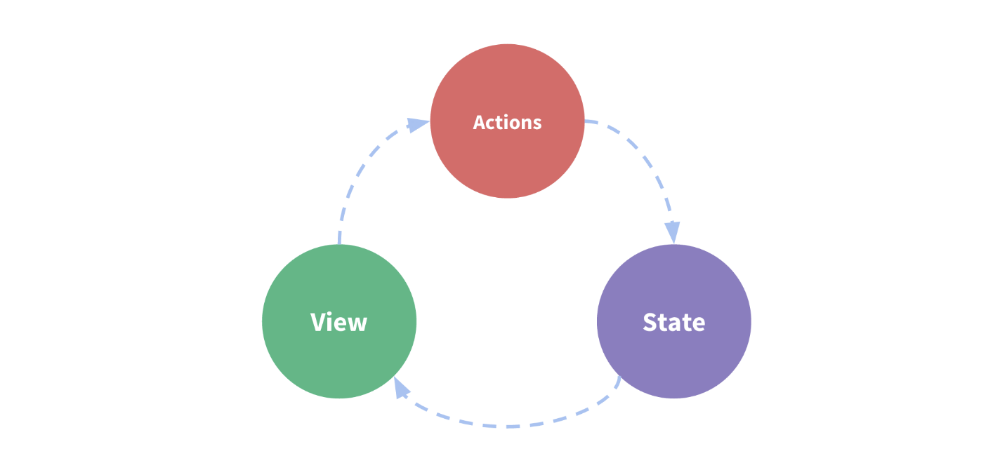

## 1. 介绍

### 1.1 Vuex 是什么？

这是与 Vue 3 匹配的 Vuex 4 的文档。如果您在找与 Vue 2 匹配的 Vuex 3 的文档，[请在这里查看](https://v3.vuex.vuejs.org/zh/)。

==Vuex 是一个专为 Vue.js 应用程序开发的**状态管理模式 + 库**。它采用集中式存储管理应用的所有组件的状态，并以相应的规则保证状态以一种可预测的方式发生变化。==


#### 为什么需要 Vuex？

在简单的 Vue.js 应用中，组件间的通信可以通过父子组件的 `props` 和 `events` 进行。然而，当应用变得复杂时，组件之间的通信和共享状态管理会变得非常困难。==Vuex 通过提供一个全局的状态树来解决这个问题，它使得在多个组件之间共享状态变得更加简单和可维护。==


#### 什么是“状态管理模式”？

让我们从一个简单的 Vue 计数应用开始：

``` js
const Counter = {
  // 状态
  data () {
    return {
      count: 0
    }
  },
  // 视图
  template: `
    <div>{{ count }}</div>
  `,
  // 操作
  methods: {
    increment () {
      this.count++
    }
  }
}

createApp(Counter).mount('#app')
```

这个状态自管理应用包含以下几个部分：

- **状态**，驱动应用的数据源；
- **视图**，以声明方式将**状态**映射到视图；
- **操作**，响应在**视图**上的用户输入导致的状态变化。

以下是一个表示“单向数据流”理念的简单示意：



但是，当我们的应用遇到**多个组件共享状态**时，单向数据流的简洁性很容易被破坏：

- 多个视图依赖于同一状态。
- 来自不同视图的行为需要变更同一状态。

对于问题一，传参的方法对于多层嵌套的组件将会非常繁琐，并且对于兄弟组件 (非父子组件) 间的状态传递无能为力。对于问题二，我们经常会采用父子组件直接引用或者通过事件来变更和同步状态的多份拷贝。以上的这些模式非常脆弱，通常会导致无法维护的代码。

因此，我们为什么不把组件的共享状态抽取出来，以一个全局单例模式管理呢？在这种模式下，==我们的组件树构成了一个巨大的“视图”，不管在树的哪个位置，任何组件都能获取状态或者触发行为！==

通过定义和隔离状态管理中的各种概念并通过强制规则维持视图和状态间的独立性，我们的代码将会变得更结构化且易维护。

这就是 Vuex 背后的基本思想，借鉴了 [Flux](https://facebook.github.io/flux/docs/overview)、[Redux](http://redux.js.org/) 和 [The Elm Architecture](https://guide.elm-lang.org/architecture/)。与其他模式不同的是，Vuex 是专门为 Vue.js 设计的状态管理库，以利用 Vue.js 的细粒度数据响应机制来进行高效的状态更新。

如果你想交互式地学习 Vuex，可以看这个 [Scrimba 上的 Vuex 课程](https://scrimba.com/g/gvuex)，它将录屏和代码试验场混合在了一起，你可以随时暂停并尝试。


#### 什么情况下我应该使用 Vuex？

Vuex 可以帮助我们管理共享状态，并附带了更多的概念和框架。这需要对短期和长期效益进行权衡。

如果您不打算开发大型单页应用，使用 Vuex 可能是繁琐冗余的。确实是如此——如果您的应用够简单，您最好不要使用 Vuex。一个简单的 [store 模式](https://v3.cn.vuejs.org/guide/state-management.html#从零打造简单状态管理)就足够您所需了。但是，如果您需要构建一个中大型单页应用，您很可能会考虑如何更好地在组件外部管理状态，Vuex 将会成为自然而然的选择。引用 Redux 的作者 Dan Abramov 的话说就是：

> Flux 架构就像眼镜：您自会知道什么时候需要它。


### 1.2 安装

#### 直接下载 / CDN 引用

[https://unpkg.com/vuex@4](https://unpkg.com/vuex@4)

[Unpkg.com](https://unpkg.com) 提供了基于 npm 的 CDN 链接。以上的链接会一直指向 npm 上发布的最新版本。您也可以通过 `https://unpkg.com/vuex@4.0.0/dist/vuex.global.js` 这样的方式指定特定的版本。

在 Vue 之后引入 `vuex` 会进行自动安装：

``` html
<script src="/path/to/vue.js"></script>
<script src="/path/to/vuex.js"></script>
```

#### npm

``` bash
npm install vuex@next --save
```

#### Yarn

``` bash
yarn add vuex@next --save
```

#### 自己构建

如果需要使用 dev 分支下的最新版本，您可以直接从 GitHub 上克隆代码并自己构建。

``` bash
git clone https://github.com/vuejs/vuex.git node_modules/vuex
cd node_modules/vuex
yarn
yarn build
```


### 1.3 开始

<div class="scrimba"><a href="https://scrimba.com/p/pnyzgAP/cMPa2Uk" target="_blank" rel="noopener noreferrer">在 Scrimba 上尝试这节课</a></div>

每一个 Vuex 应用的核心就是 store（仓库）。“store”基本上就是一个容器，它包含着你的应用中大部分的**状态 (state)**。Vuex 和单纯的全局对象有以下两点不同：

1. ==Vuex 的状态存储是响应式的。当 Vue 组件从 store 中读取状态的时候，若 store 中的状态发生变化，那么相应的组件也会相应地得到高效更新。==

2. ==你不能直接改变 store 中的状态。改变 store 中的状态的唯一途径就是显式地**提交 (commit) mutation**。这样使得我们可以方便地跟踪每一个状态的变化，从而让我们能够实现一些工具帮助我们更好地了解我们的应用。==


#### 最简单的 Store

我们将在后续的文档示例代码中使用 ES2015 语法。如果你还没能掌握 ES2015，[你得抓紧了](https://babeljs.io/docs/learn-es2015/)！

[安装](../installation.md) Vuex 之后，让我们来创建一个 store。创建过程直截了当——仅需要提供一个初始 state 对象和一些 mutation：

``` js
import { createApp } from 'vue'
import { createStore } from 'vuex'

// 创建一个新的 store 实例
const store = createStore({
  state () {
    return {
      count: 0
    }
  },
  mutations: {
    increment (state) {
      state.count++
    }
  }
})

const app = createApp({ /* 根组件 */ })

// 将 store 实例作为插件安装
app.use(store)
```

现在，你可以通过 `store.state` 来获取状态对象，并通过 `store.commit` 方法触发状态变更：

``` js
store.commit('increment')

console.log(store.state.count) // -> 1
```

在 Vue 组件中， 可以通过 `this.$store` 访问store实例。现在我们可以从组件的方法提交一个变更：

``` js
methods: {
  increment() {
    this.$store.commit('increment')
    console.log(this.$store.state.count)
  }
}
```

==再次强调，我们通过提交 mutation 的方式，而非直接改变 `store.state.count`，是因为我们想要更明确地追踪到状态的变化。==这个简单的约定能够让你的意图更加明显，这样你在阅读代码的时候能更容易地解读应用内部的状态改变。此外，这样也让我们有机会去实现一些能记录每次状态改变，保存状态快照的调试工具。有了它，我们甚至可以实现如时间穿梭般的调试体验。

由于 store 中的状态是响应式的，在组件中调用 store 中的状态简单到仅需要在计算属性中返回即可。触发变化也仅仅是在组件的 methods 中提交 mutation。

接下来，我们将会更深入地探讨一些核心概念。让我们先从 [State](state.md) 概念开始。


## 2. 核心概念

### 2.1 State

#### 单一状态树

<div class="scrimba"><a href="https://scrimba.com/p/pnyzgAP/cWw3Zhb" target="_blank" rel="noopener noreferrer">在 Scrimba 上尝试这节课</a></div>

Vuex 使用**单一状态树**——是的，用一个对象就包含了全部的应用层级状态。至此它便作为一个“唯一数据源 ([SSOT](https://en.wikipedia.org/wiki/Single_source_of_truth))”而存在。这也意味着，每个应用将仅仅包含一个 store 实例。单一状态树让我们能够直接地定位任一特定的状态片段，在调试的过程中也能轻易地取得整个当前应用状态的快照。

单状态树和模块化并不冲突——在后面的章节里我们会讨论如何将状态和状态变更事件分布到各个子模块中。

存储在 Vuex 中的数据和 Vue 实例中的 `data` 遵循相同的规则，例如状态对象必须是纯粹 (plain) 的。**参考：**[Vue#data](https://v3.cn.vuejs.org/api/options-data.html#data-2)。

#### 在 Vue 组件中获得 Vuex 状态

那么我们如何在 Vue 组件中展示状态呢？由于 Vuex 的状态存储是响应式的，从 store 实例中读取状态最简单的方法就是在[计算属性](https://cn.vuejs.org/guide/computed.html)中返回某个状态：

``` js
// 创建一个 Counter 组件
const Counter = {
  template: `<div>{{ count }}</div>`,
  computed: {
    count () {
      return store.state.count
    }
  }
}
```

每当 `store.state.count` 变化的时候, 都会重新求取计算属性，并且触发更新相关联的 DOM。

然而，这种模式导致组件依赖全局状态单例。在模块化的构建系统中，在每个需要使用 state 的组件中需要频繁地导入，并且在测试组件时需要模拟状态。

Vuex 通过 Vue 的插件系统将 store 实例从根组件中“注入”到所有的子组件里。且子组件能通过 `this.$store` 访问到。让我们更新下 `Counter` 的实现：

``` js
const Counter = {
  template: `<div>{{ count }}</div>`,
  computed: {
    count () {
      return this.$store.state.count
    }
  }
}
```

#### `mapState` 辅助函数

<div class="scrimba"><a href="https://scrimba.com/p/pnyzgAP/c8Pz7BSK" target="_blank" rel="noopener noreferrer">在 Scrimba 上尝试这节课</a></div>

当一个组件需要获取多个状态的时候，将这些状态都声明为计算属性会有些重复和冗余。为了解决这个问题，我们可以使用 `mapState` 辅助函数帮助我们生成计算属性，让你少按几次键：

``` js
// 在单独构建的版本中辅助函数为 Vuex.mapState
import { mapState } from 'vuex'

export default {
  // ...
  computed: mapState({
    // 箭头函数可使代码更简练
    count: state => state.count,

    // 传字符串参数 'count' 等同于 `state => state.count`
    countAlias: 'count',

    // 为了能够使用 `this` 获取局部状态，必须使用常规函数
    countPlusLocalState (state) {
      return state.count + this.localCount
    }
  })
}
```

当映射的计算属性的名称与 state 的子节点名称相同时，我们也可以给 `mapState` 传一个字符串数组。

``` js
computed: mapState([
  // 映射 this.count 为 store.state.count
  'count'
])
```

#### 对象展开运算符

`mapState` 函数返回的是一个对象。我们如何将它与局部计算属性混合使用呢？通常，我们需要使用一个工具函数将多个对象合并为一个，以使我们可以将最终对象传给 `computed` 属性。但是自从有了[对象展开运算符](https://github.com/tc39/proposal-object-rest-spread)，我们可以极大地简化写法：

``` js
computed: {
  localComputed () { /* ... */ },
  // 使用对象展开运算符将此对象混入到外部对象中
  ...mapState({
    // ...
  })
}
```

#### 组件仍然保有局部状态

使用 Vuex 并不意味着你需要将**所有的**状态放入 Vuex。虽然将所有的状态放到 Vuex 会使状态变化更显式和易调试，但也会使代码变得冗长和不直观。如果有些状态严格属于单个组件，最好还是作为组件的局部状态。你应该根据你的应用开发需要进行权衡和确定。


### 2.2 Getter

<div class="scrimba"><a href="https://scrimba.com/p/pnyzgAP/c2Be7TB" target="_blank" rel="noopener noreferrer">在 Scrimba 上尝试这节课</a></div>

有时候我们需要从 store 中的 state 中派生出一些状态，例如对列表进行过滤并计数：

``` js
computed: {
  doneTodosCount () {
    return this.$store.state.todos.filter(todo => todo.done).length
  }
}
```

如果有多个组件需要用到此属性，我们要么复制这个函数，或者抽取到一个共享函数然后在多处导入它——无论哪种方式都不是很理想。

Vuex 允许我们在 store 中定义“getter”（可以认为是 store 的计算属性）。

::: warning 注意
从 Vue 3.0 开始，getter 的结果不再像计算属性一样会被缓存起来。这是一个已知的问题，将会在 3.1 版本中修复。详情请看 [PR #1878](https://github.com/vuejs/vuex/pull/1883)。
:::

Getter 接受 state 作为其第一个参数：

``` js
const store = createStore({
  state: {
    todos: [
      { id: 1, text: '...', done: true },
      { id: 2, text: '...', done: false }
    ]
  },
  getters: {
    doneTodos (state) {
      return state.todos.filter(todo => todo.done)
    }
  }
})
```

#### 通过属性访问

Getter 会暴露为 `store.getters` 对象，你可以以属性的形式访问这些值：

``` js
store.getters.doneTodos // -> [{ id: 1, text: '...', done: true }]
```

Getter 也可以接受其他 getter 作为第二个参数：

``` js
getters: {
  // ...
  doneTodosCount (state, getters) {
    return getters.doneTodos.length
  }
}
```

``` js
store.getters.doneTodosCount // -> 1
```

我们可以很容易地在任何组件中使用它：

``` js
computed: {
  doneTodosCount () {
    return this.$store.getters.doneTodosCount
  }
}
```

注意，getter 在通过属性访问时是作为 Vue 的响应式系统的一部分缓存其中的。

#### 通过方法访问

你也可以通过让 getter 返回一个函数，来实现给 getter 传参。在你对 store 里的数组进行查询时非常有用。

```js
getters: {
  // ...
  getTodoById: (state) => (id) => {
    return state.todos.find(todo => todo.id === id)
  }
}
```

``` js
store.getters.getTodoById(2) // -> { id: 2, text: '...', done: false }
```

注意，getter 在通过方法访问时，每次都会去进行调用，而不会缓存结果。

#### `mapGetters` 辅助函数

`mapGetters` 辅助函数仅仅是将 store 中的 getter 映射到局部计算属性：

``` js
import { mapGetters } from 'vuex'

export default {
  // ...
  computed: {
  // 使用对象展开运算符将 getter 混入 computed 对象中
    ...mapGetters([
      'doneTodosCount',
      'anotherGetter',
      // ...
    ])
  }
}
```

如果你想将一个 getter 属性另取一个名字，使用对象形式：

``` js
...mapGetters({
  // 把 `this.doneCount` 映射为 `this.$store.getters.doneTodosCount`
  doneCount: 'doneTodosCount'
})
```


### Mutation

<div class="scrimba"><a href="https://scrimba.com/p/pnyzgAP/ckMZp4HN" target="_blank" rel="noopener noreferrer">在 Scrimba 上尝试这节课</a></div>

更改 Vuex 的 store 中的状态的唯一方法是提交 mutation。Vuex 中的 mutation 非常类似于事件：每个 mutation 都有一个字符串的**事件类型 (type)**和一个**回调函数 (handler)**。这个回调函数就是我们实际进行状态更改的地方，并且它会接受 state 作为第一个参数：

``` js
const store = createStore({
  state: {
    count: 1
  },
  mutations: {
    increment (state) {
      // 变更状态
      state.count++
    }
  }
})
```

你不能直接调用一个 mutation 处理函数。这个选项更像是事件注册：“当触发一个类型为 `increment` 的 mutation 时，调用此函数。”要唤醒一个 mutation 处理函数，你需要以相应的 type 调用 **store.commit** 方法：

``` js
store.commit('increment')
```

#### 提交载荷（Payload）

你可以向 `store.commit` 传入额外的参数，即 mutation 的**载荷（payload）**：

``` js
// ...
mutations: {
  increment (state, n) {
    state.count += n
  }
}
```

``` js
store.commit('increment', 10)
```

在大多数情况下，载荷应该是一个对象，这样可以包含多个字段并且记录的 mutation 会更易读：

``` js
// ...
mutations: {
  increment (state, payload) {
    state.count += payload.amount
  }
}
```

``` js
store.commit('increment', {
  amount: 10
})
```

#### 对象风格的提交方式

提交 mutation 的另一种方式是直接使用包含 `type` 属性的对象：

``` js
store.commit({
  type: 'increment',
  amount: 10
})
```

当使用对象风格的提交方式，整个对象都作为载荷传给 mutation 函数，因此处理函数保持不变：

``` js
mutations: {
  increment (state, payload) {
    state.count += payload.amount
  }
}
```

#### 使用常量替代 Mutation 事件类型

使用常量替代 mutation 事件类型在各种 Flux 实现中是很常见的模式。这样可以使 linter 之类的工具发挥作用，同时把这些常量放在单独的文件中可以让你的代码合作者对整个 app 包含的 mutation 一目了然：

``` js
// mutation-types.js
export const SOME_MUTATION = 'SOME_MUTATION'
```

``` js
// store.js
import { createStore } from 'vuex'
import { SOME_MUTATION } from './mutation-types'

const store = createStore({
  state: { ... },
  mutations: {
    // 我们可以使用 ES2015 风格的计算属性命名功能
    // 来使用一个常量作为函数名
    [SOME_MUTATION] (state) {
      // 修改 state
    }
  }
})
```

用不用常量取决于你——在需要多人协作的大型项目中，这会很有帮助。但如果你不喜欢，你完全可以不这样做。

#### Mutation 必须是同步函数

一条重要的原则就是要记住 **mutation 必须是同步函数**。为什么？请参考下面的例子：

``` js
mutations: {
  someMutation (state) {
    api.callAsyncMethod(() => {
      state.count++
    })
  }
}
```

现在想象，我们正在 debug 一个 app 并且观察 devtool 中的 mutation 日志。每一条 mutation 被记录，devtools 都需要捕捉到前一状态和后一状态的快照。然而，在上面的例子中 mutation 中的异步函数中的回调让这不可能完成：因为当 mutation 触发的时候，回调函数还没有被调用，devtools 不知道什么时候回调函数实际上被调用——实质上任何在回调函数中进行的状态的改变都是不可追踪的。

#### 在组件中提交 Mutation

你可以在组件中使用 `this.$store.commit('xxx')` 提交 mutation，或者使用 `mapMutations` 辅助函数将组件中的 methods 映射为 `store.commit` 调用（需要在根节点注入 `store`）。

``` js
import { mapMutations } from 'vuex'

export default {
  // ...
  methods: {
    ...mapMutations([
      'increment', // 将 `this.increment()` 映射为 `this.$store.commit('increment')`

      // `mapMutations` 也支持载荷：
      'incrementBy' // 将 `this.incrementBy(amount)` 映射为 `this.$store.commit('incrementBy', amount)`
    ]),
    ...mapMutations({
      add: 'increment' // 将 `this.add()` 映射为 `this.$store.commit('increment')`
    })
  }
}
```

#### 下一步：Action

在 mutation 中混合异步调用会导致你的程序很难调试。例如，当你调用了两个包含异步回调的 mutation 来改变状态，你怎么知道什么时候回调和哪个先回调呢？这就是为什么我们要区分这两个概念。在 Vuex 中，**mutation 都是同步事务**：

``` js
store.commit('increment')
// 任何由 "increment" 导致的状态变更都应该在此刻完成。
```

为了处理异步操作，让我们来看一看 [Action](actions.md)。


### Action

<div class="scrimba"><a href="https://scrimba.com/p/pnyzgAP/c6ggR3cG" target="_blank" rel="noopener noreferrer">在 Scrimba 上尝试这节课</a></div>

Action 类似于 mutation，不同在于：

- Action 提交的是 mutation，而不是直接变更状态。
- Action 可以包含任意异步操作。

让我们来注册一个简单的 action：

``` js
const store = createStore({
  state: {
    count: 0
  },
  mutations: {
    increment (state) {
      state.count++
    }
  },
  actions: {
    increment (context) {
      context.commit('increment')
    }
  }
})
```

Action 函数接受一个与 store 实例具有相同方法和属性的 context 对象，因此你可以调用 `context.commit` 提交一个 mutation，或者通过 `context.state` 和 `context.getters` 来获取 state 和 getters。当我们在之后介绍到 [Modules](modules.md) 时，你就知道 context 对象为什么不是 store 实例本身了。

实践中，我们会经常用到 ES2015 的[参数解构](https://github.com/lukehoban/es6features#destructuring)来简化代码（特别是我们需要调用 `commit` 很多次的时候）：

``` js
actions: {
  increment ({ commit }) {
    commit('increment')
  }
}
```

#### 分发 Action

Action 通过 `store.dispatch` 方法触发：

``` js
store.dispatch('increment')
```

乍一眼看上去感觉多此一举，我们直接分发 mutation 岂不更方便？实际上并非如此，还记得 **mutation 必须同步执行**这个限制么？Action 就不受约束！我们可以在 action 内部执行**异步**操作：

``` js
actions: {
  incrementAsync ({ commit }) {
    setTimeout(() => {
      commit('increment')
    }, 1000)
  }
}
```

Actions 支持同样的载荷方式和对象方式进行分发：

``` js
// 以载荷形式分发
store.dispatch('incrementAsync', {
  amount: 10
})

// 以对象形式分发
store.dispatch({
  type: 'incrementAsync',
  amount: 10
})
```

来看一个更加实际的购物车示例，涉及到**调用异步 API** 和**分发多重 mutation**：

``` js
actions: {
  checkout ({ commit, state }, products) {
    // 把当前购物车的物品备份起来
    const savedCartItems = [...state.cart.added]
    // 发出结账请求
    // 然后乐观地清空购物车
    commit(types.CHECKOUT_REQUEST)
    // 购物 API 接受一个成功回调和一个失败回调
    shop.buyProducts(
      products,
      // 成功操作
      () => commit(types.CHECKOUT_SUCCESS),
      // 失败操作
      () => commit(types.CHECKOUT_FAILURE, savedCartItems)
    )
  }
}
```

注意我们正在进行一系列的异步操作，并且通过提交 mutation 来记录 action 产生的副作用（即状态变更）。

#### 在组件中分发 Action

你在组件中使用 `this.$store.dispatch('xxx')` 分发 action，或者使用 `mapActions` 辅助函数将组件的 methods 映射为 `store.dispatch` 调用（需要先在根节点注入 `store`）：

``` js
import { mapActions } from 'vuex'

export default {
  // ...
  methods: {
    ...mapActions([
      'increment', // 将 `this.increment()` 映射为 `this.$store.dispatch('increment')`

      // `mapActions` 也支持载荷：
      'incrementBy' // 将 `this.incrementBy(amount)` 映射为 `this.$store.dispatch('incrementBy', amount)`
    ]),
    ...mapActions({
      add: 'increment' // 将 `this.add()` 映射为 `this.$store.dispatch('increment')`
    })
  }
}
```

#### 组合 Action

Action 通常是异步的，那么如何知道 action 什么时候结束呢？更重要的是，我们如何才能组合多个 action，以处理更加复杂的异步流程？

首先，你需要明白 `store.dispatch` 可以处理被触发的 action 的处理函数返回的 Promise，并且 `store.dispatch` 仍旧返回 Promise：

``` js
actions: {
  actionA ({ commit }) {
    return new Promise((resolve, reject) => {
      setTimeout(() => {
        commit('someMutation')
        resolve()
      }, 1000)
    })
  }
}
```

现在你可以：

``` js
store.dispatch('actionA').then(() => {
  // ...
})
```

在另外一个 action 中也可以：

``` js
actions: {
  // ...
  actionB ({ dispatch, commit }) {
    return dispatch('actionA').then(() => {
      commit('someOtherMutation')
    })
  }
}
```

最后，如果我们利用 [async / await](https://tc39.github.io/ecmascript-asyncawait/)，我们可以如下组合 action：

``` js
// 假设 getData() 和 getOtherData() 返回的是 Promise

actions: {
  async actionA ({ commit }) {
    commit('gotData', await getData())
  },
  async actionB ({ dispatch, commit }) {
    await dispatch('actionA') // 等待 actionA 完成
    commit('gotOtherData', await getOtherData())
  }
}
```

> 一个 `store.dispatch` 在不同模块中可以触发多个 action 函数。在这种情况下，只有当所有触发函数完成后，返回的 Promise 才会执行。


### Module

<div class="scrimba"><a href="https://scrimba.com/p/pnyzgAP/cqKK4psq" target="_blank" rel="noopener noreferrer">在 Scrimba 上尝试这节课</a></div>

由于使用单一状态树，应用的所有状态会集中到一个比较大的对象。当应用变得非常复杂时，store 对象就有可能变得相当臃肿。

为了解决以上问题，Vuex 允许我们将 store 分割成**模块（module）**。每个模块拥有自己的 state、mutation、action、getter、甚至是嵌套子模块——从上至下进行同样方式的分割：

``` js
const moduleA = {
  state: () => ({ ... }),
  mutations: { ... },
  actions: { ... },
  getters: { ... }
}

const moduleB = {
  state: () => ({ ... }),
  mutations: { ... },
  actions: { ... }
}

const store = createStore({
  modules: {
    a: moduleA,
    b: moduleB
  }
})

store.state.a // -> moduleA 的状态
store.state.b // -> moduleB 的状态
```

#### 模块的局部状态

对于模块内部的 mutation 和 getter，接收的第一个参数是**模块的局部状态对象**。

``` js
const moduleA = {
  state: () => ({
    count: 0
  }),
  mutations: {
    increment (state) {
      // 这里的 `state` 对象是模块的局部状态
      state.count++
    }
  },
  getters: {
    doubleCount (state) {
      return state.count * 2
    }
  }
}
```

同样，对于模块内部的 action，局部状态通过 `context.state` 暴露出来，根节点状态则为 `context.rootState`：

``` js
const moduleA = {
  // ...
  actions: {
    incrementIfOddOnRootSum ({ state, commit, rootState }) {
      if ((state.count + rootState.count) % 2 === 1) {
        commit('increment')
      }
    }
  }
}
```

对于模块内部的 getter，根节点状态会作为第三个参数暴露出来：

``` js
const moduleA = {
  // ...
  getters: {
    sumWithRootCount (state, getters, rootState) {
      return state.count + rootState.count
    }
  }
}
```

#### 命名空间

默认情况下，模块内部的 action 和 mutation 仍然是注册在**全局命名空间**的——这样使得多个模块能够对同一个 action 或 mutation 作出响应。Getter 同样也默认注册在全局命名空间，但是目前这并非出于功能上的目的（仅仅是维持现状来避免非兼容性变更）。必须注意，不要在不同的、无命名空间的模块中定义两个相同的 getter 从而导致错误。

如果希望你的模块具有更高的封装度和复用性，你可以通过添加 `namespaced: true` 的方式使其成为带命名空间的模块。当模块被注册后，它的所有 getter、action 及 mutation 都会自动根据模块注册的路径调整命名。例如：

``` js
const store = createStore({
  modules: {
    account: {
      namespaced: true,

      // 模块内容（module assets）
      state: () => ({ ... }), // 模块内的状态已经是嵌套的了，使用 `namespaced` 属性不会对其产生影响
      getters: {
        isAdmin () { ... } // -> getters['account/isAdmin']
      },
      actions: {
        login () { ... } // -> dispatch('account/login')
      },
      mutations: {
        login () { ... } // -> commit('account/login')
      },

      // 嵌套模块
      modules: {
        // 继承父模块的命名空间
        myPage: {
          state: () => ({ ... }),
          getters: {
            profile () { ... } // -> getters['account/profile']
          }
        },

        // 进一步嵌套命名空间
        posts: {
          namespaced: true,

          state: () => ({ ... }),
          getters: {
            popular () { ... } // -> getters['account/posts/popular']
          }
        }
      }
    }
  }
})
```

启用了命名空间的 getter 和 action 会收到局部化的 `getter`，`dispatch` 和 `commit`。换言之，你在使用模块内容（module assets）时不需要在同一模块内额外添加空间名前缀。更改 `namespaced` 属性后不需要修改模块内的代码。

##### 在带命名空间的模块内访问全局内容（Global Assets）

如果你希望使用全局 state 和 getter，`rootState` 和 `rootGetters` 会作为第三和第四参数传入 getter，也会通过 `context` 对象的属性传入 action。

若需要在全局命名空间内分发 action 或提交 mutation，将 `{ root: true }` 作为第三参数传给 `dispatch` 或 `commit` 即可。

``` js
modules: {
  foo: {
    namespaced: true,

    getters: {
      // 在这个模块的 getter 中，`getters` 被局部化了
      // 你可以使用 getter 的第四个参数来调用 `rootGetters`
      someGetter (state, getters, rootState, rootGetters) {
        getters.someOtherGetter // -> 'foo/someOtherGetter'
        rootGetters.someOtherGetter // -> 'someOtherGetter'
        rootGetters['bar/someOtherGetter'] // -> 'bar/someOtherGetter'
      },
      someOtherGetter: state => { ... }
    },

    actions: {
      // 在这个模块中， dispatch 和 commit 也被局部化了
      // 他们可以接受 `root` 属性以访问根 dispatch 或 commit
      someAction ({ dispatch, commit, getters, rootGetters }) {
        getters.someGetter // -> 'foo/someGetter'
        rootGetters.someGetter // -> 'someGetter'
        rootGetters['bar/someGetter'] // -> 'bar/someGetter'

        dispatch('someOtherAction') // -> 'foo/someOtherAction'
        dispatch('someOtherAction', null, { root: true }) // -> 'someOtherAction'

        commit('someMutation') // -> 'foo/someMutation'
        commit('someMutation', null, { root: true }) // -> 'someMutation'
      },
      someOtherAction (ctx, payload) { ... }
    }
  }
}
```

##### 在带命名空间的模块注册全局 action

若需要在带命名空间的模块注册全局 action，你可添加 `root: true`，并将这个 action 的定义放在函数 `handler` 中。例如：

``` js
{
  actions: {
    someOtherAction ({dispatch}) {
      dispatch('someAction')
    }
  },
  modules: {
    foo: {
      namespaced: true,

      actions: {
        someAction: {
          root: true,
          handler (namespacedContext, payload) { ... } // -> 'someAction'
        }
      }
    }
  }
}
```

##### 带命名空间的绑定函数

当使用 `mapState`、`mapGetters`、`mapActions` 和 `mapMutations` 这些函数来绑定带命名空间的模块时，写起来可能比较繁琐：

``` js
computed: {
  ...mapState({
    a: state => state.some.nested.module.a,
    b: state => state.some.nested.module.b
  }),
  ...mapGetters([
    'some/nested/module/someGetter', // -> this['some/nested/module/someGetter']
    'some/nested/module/someOtherGetter', // -> this['some/nested/module/someOtherGetter']
  ])
},
methods: {
  ...mapActions([
    'some/nested/module/foo', // -> this['some/nested/module/foo']()
    'some/nested/module/bar' // -> this['some/nested/module/bar']()
  ])
}
```

对于这种情况，你可以将模块的空间名称字符串作为第一个参数传递给上述函数，这样所有绑定都会自动将该模块作为上下文。于是上面的例子可以简化为：

``` js
computed: {
  ...mapState('some/nested/module', {
    a: state => state.a,
    b: state => state.b
  }),
  ...mapGetters('some/nested/module', [
    'someGetter', // -> this.someGetter
    'someOtherGetter', // -> this.someOtherGetter
  ])
},
methods: {
  ...mapActions('some/nested/module', [
    'foo', // -> this.foo()
    'bar' // -> this.bar()
  ])
}
```

而且，你可以通过使用 `createNamespacedHelpers` 创建基于某个命名空间辅助函数。它返回一个对象，对象里有新的绑定在给定命名空间值上的组件绑定辅助函数：

``` js
import { createNamespacedHelpers } from 'vuex'

const { mapState, mapActions } = createNamespacedHelpers('some/nested/module')

export default {
  computed: {
    // 在 `some/nested/module` 中查找
    ...mapState({
      a: state => state.a,
      b: state => state.b
    })
  },
  methods: {
    // 在 `some/nested/module` 中查找
    ...mapActions([
      'foo',
      'bar'
    ])
  }
}
```

##### 给插件开发者的注意事项

如果你开发的[插件（Plugin）](plugins.md)提供了模块并允许用户将其添加到 Vuex store，可能需要考虑模块的空间名称问题。对于这种情况，你可以通过插件的参数对象来允许用户指定空间名称：

``` js
// 通过插件的参数对象得到空间名称
// 然后返回 Vuex 插件函数
export function createPlugin (options = {}) {
  return function (store) {
    // 把空间名字添加到插件模块的类型（type）中去
    const namespace = options.namespace || ''
    store.dispatch(namespace + 'pluginAction')
  }
}
```

#### 模块动态注册

在 store 创建**之后**，你可以使用 `store.registerModule` 方法注册模块：

``` js
import { createStore } from 'vuex'

const store = createStore({ /* 选项 */ })

// 注册模块 `myModule`
store.registerModule('myModule', {
  // ...
})

// 注册嵌套模块 `nested/myModule`
store.registerModule(['nested', 'myModule'], {
  // ...
})
```

之后就可以通过 `store.state.myModule` 和 `store.state.nested.myModule` 访问模块的状态。

模块动态注册功能使得其他 Vue 插件可以通过在 store 中附加新模块的方式来使用 Vuex 管理状态。例如，[`vuex-router-sync`](https://github.com/vuejs/vuex-router-sync) 插件就是通过动态注册模块将 Vue Router 和 Vuex 结合在一起，实现应用的路由状态管理。

你也可以使用 `store.unregisterModule(moduleName)` 来动态卸载模块。注意，你不能使用此方法卸载静态模块（即创建 store 时声明的模块）。

注意，你可以通过 `store.hasModule(moduleName)` 方法检查该模块是否已经被注册到 store。需要记住的是，嵌套模块应该以数组形式传递给 `registerModule` 和 `hasModule`，而不是以路径字符串的形式传递给 module。

##### 保留 state

在注册一个新 module 时，你很有可能想保留过去的 state，例如从一个服务端渲染的应用保留 state。你可以通过 `preserveState` 选项将其归档：`store.registerModule('a', module, { preserveState: true })`。

当你设置 `preserveState: true` 时，该模块会被注册，action、mutation 和 getter 会被添加到 store 中，但是 state 不会。这里假设 store 的 state 已经包含了这个 module 的 state 并且你不希望将其覆写。

#### 模块重用

有时我们可能需要创建一个模块的多个实例，例如：

- 创建多个 store，他们公用同一个模块 (例如当 `runInNewContext` 选项是 `false` 或 `'once'` 时，为了[在服务端渲染中避免有状态的单例](https://ssr.vuejs.org/en/structure.html#avoid-stateful-singletons))
- 在一个 store 中多次注册同一个模块

如果我们使用一个纯对象来声明模块的状态，那么这个状态对象会通过引用被共享，导致状态对象被修改时 store 或模块间数据互相污染的问题。

实际上这和 Vue 组件内的 `data` 是同样的问题。因此解决办法也是相同的——使用一个函数来声明模块状态（仅 2.3.0+ 支持）：

``` js
const MyReusableModule = {
  state: () => ({
    foo: 'bar'
  }),
  // mutation、action 和 getter 等等...
}
```


## 3. 进阶

### 3.1 项目结构

Vuex 并不限制你的代码结构。但是，它规定了一些需要遵守的规则：

1. 应用层级的状态应该集中到单个 store 对象中。

2. 提交 **mutation** 是更改状态的唯一方法，并且这个过程是同步的。

3. 异步逻辑都应该封装到 **action** 里面。

只要你遵守以上规则，如何组织代码随你便。如果你的 store 文件太大，只需将 action、mutation 和 getter 分割到单独的文件。

对于大型应用，我们会希望把 Vuex 相关代码分割到模块中。下面是项目结构示例：


``` bash
├── index.html
├── main.js
├── api
│   └── ... # 抽取出API请求
├── components
│   ├── App.vue
│   └── ...
└── store
    ├── index.js          # 我们组装模块并导出 store 的地方
    ├── actions.js        # 根级别的 action
    ├── mutations.js      # 根级别的 mutation
    └── modules
        ├── cart.js       # 购物车模块
        └── products.js   # 产品模块
```

请参考[购物车示例](https://github.com/vuejs/vuex/tree/4.0/examples/classic/shopping-cart)。


---

### forms.md

### 表单处理

<div class="scrimba"><a href="https://scrimba.com/p/pnyzgAP/cqKRgEC9" target="_blank" rel="noopener noreferrer">在 Scrimba 上尝试这节课</a></div>

当在严格模式中使用 Vuex 时，在属于 Vuex 的 state 上使用 `v-model` 会比较棘手：

``` html
<input v-model="obj.message">
```

假设这里的 `obj` 是在计算属性中返回的一个属于 Vuex store 的对象，在用户输入时，`v-model` 会试图直接修改 `obj.message`。在严格模式中，由于这个修改不是在 mutation 函数中执行的, 这里会抛出一个错误。

用“Vuex 的思维”去解决这个问题的方法是：给 `<input>` 中绑定 value，然后侦听 `input` 或者 `change` 事件，在事件回调中调用一个方法:

``` html
<input :value="message" @input="updateMessage">
```

``` js
// ...
computed: {
  ...mapState({
    message: state => state.obj.message
  })
},
methods: {
  updateMessage (e) {
    this.$store.commit('updateMessage', e.target.value)
  }
}
```

下面是 mutation 函数：

``` js
// ...
mutations: {
  updateMessage (state, message) {
    state.obj.message = message
  }
}
```

#### 双向绑定的计算属性

必须承认，这样做比简单地使用“`v-model` + 局部状态”要啰嗦得多，并且也损失了一些 `v-model` 中很有用的特性。另一个方法是使用带有 setter 的双向绑定计算属性：

``` html
<input v-model="message">
```

``` js
// ...
computed: {
  message: {
    get () {
      return this.$store.state.obj.message
    },
    set (value) {
      this.$store.commit('updateMessage', value)
    }
  }
}
```

### 

> 


---

### composition-api.md

### 组合式API

可以通过调用 `useStore` 函数，来在 `setup` 钩子函数中访问 store。这与在组件中使用选项式 API 访问 `this.$store` 是等效的。

```js
import { useStore } from 'vuex'

export default {
  setup () {
    const store = useStore()
  }
}
```

#### 访问 State 和 Getter

为了访问 state 和 getter，需要创建 `computed` 引用以保留响应性，这与在选项式 API 中创建计算属性等效。

```js
import { computed } from 'vue'
import { useStore } from 'vuex'

export default {
  setup () {
    const store = useStore()

    return {
      // 在 computed 函数中访问 state
      count: computed(() => store.state.count),

      // 在 computed 函数中访问 getter
      double: computed(() => store.getters.double)
    }
  }
}
```

#### 访问 Mutation 和 Action

要使用 mutation 和 action 时，只需要在 `setup` 钩子函数中调用 `commit` 和 `dispatch` 函数。

```js
import { useStore } from 'vuex'

export default {
  setup () {
    const store = useStore()

    return {
      // 使用 mutation
      increment: () => store.commit('increment'),

      // 使用 action
      asyncIncrement: () => store.dispatch('asyncIncrement')
    }
  }
}
```

#### 示例

查看[组合式 API 案例](https://github.com/vuejs/vuex/tree/4.0/examples/composition)，以便了解使用 Vuex 和 Vue 的组合式 API 的应用案例。

### 


### testing.md

### 测试

<div class="scrimba"><a href="https://scrimba.com/p/pnyzgAP/cPGkpJhq" target="_blank" rel="noopener noreferrer">在 Scrimba 上尝试这节课</a></div>

我们主要想针对 Vuex 中的 mutation 和 action 进行单元测试。

#### 测试 Mutation

Mutation 很容易被测试，因为它们仅仅是一些完全依赖参数的函数。这里有一个小技巧，如果你使用了 ES2015 模块，且将 mutation 定义在了 `store.js` 文件中，那么除了模块的默认导出外，你还应该将 mutation 进行命名导出：

``` js
const state = { ... }

// `mutations` 作为命名输出对象
export const mutations = { ... }

export default createStore({
  state,
  mutations
})
```

下面是用 Mocha + Chai 测试一个 mutation 的例子（实际上你可以用任何你喜欢的测试框架）：

``` js
// mutations.js
export const mutations = {
  increment: state => state.count++
}
```

``` js
// mutations.spec.js
import { expect } from 'chai'
import { mutations } from './store'

// 解构 `mutations`
const { increment } = mutations

describe('mutations', () => {
  it('INCREMENT', () => {
    // 模拟状态
    const state = { count: 0 }
    // 应用 mutation
    increment(state)
    // 断言结果
    expect(state.count).to.equal(1)
  })
})
```

#### 测试 Action

Action 应对起来略微棘手，因为它们可能需要调用外部的 API。当测试 action 的时候，我们需要增加一个 mocking 服务层——例如，我们可以把 API 调用抽象成服务，然后在测试文件中用 mock 服务回应 API 调用。为了便于解决 mock 依赖，可以用 webpack 和 [inject-loader](https://github.com/plasticine/inject-loader) 打包测试文件。

下面是一个测试异步 action 的例子：

``` js
// actions.js
import shop from '../api/shop'

export const getAllProducts = ({ commit }) => {
  commit('REQUEST_PRODUCTS')
  shop.getProducts(products => {
    commit('RECEIVE_PRODUCTS', products)
  })
}
```

``` js
// actions.spec.js

// 使用 require 语法处理内联 loaders。
// inject-loader 返回一个允许我们注入 mock 依赖的模块工厂
import { expect } from 'chai'
const actionsInjector = require('inject-loader!./actions')

// 使用 mocks 创建模块
const actions = actionsInjector({
  '../api/shop': {
    getProducts (cb) {
      setTimeout(() => {
        cb([ /* mocked response */ ])
      }, 100)
    }
  }
})

// 用指定的 mutations 测试 action 的辅助函数
const testAction = (action, args, state, expectedMutations, done) => {
  let count = 0

  // 模拟提交
  const commit = (type, payload) => {
    const mutation = expectedMutations[count]

    try {
      expect(mutation.type).to.equal(type)
      expect(mutation.payload).to.deep.equal(payload)
    } catch (error) {
      done(error)
    }

    count++
    if (count >= expectedMutations.length) {
      done()
    }
  }

  // 用模拟的 store 和参数调用 action
  action({ commit, state }, ...args)

  // 检查是否没有 mutation 被 dispatch
  if (expectedMutations.length === 0) {
    expect(count).to.equal(0)
    done()
  }
}

describe('actions', () => {
  it('getAllProducts', done => {
    testAction(actions.getAllProducts, null, {}, [
      { type: 'REQUEST_PRODUCTS' },
      { type: 'RECEIVE_PRODUCTS', payload: { /* mocked response */ } }
    ], done)
  })
})
```

如果在测试环境下有可用的 spy (比如通过 [Sinon.JS](http://sinonjs.org/))，你可以使用它们替换辅助函数 `testAction`：

``` js
describe('actions', () => {
  it('getAllProducts', () => {
    const commit = sinon.spy()
    const state = {}

    actions.getAllProducts({ commit, state })

    expect(commit.args).to.deep.equal([
      ['REQUEST_PRODUCTS'],
      ['RECEIVE_PRODUCTS', { /* mocked response */ }]
    ])
  })
})
```

#### 测试 Getter

如果你的 getter 包含很复杂的计算过程，很有必要测试它们。Getter 的测试与 mutation 一样直截了当。

测试一个 getter 的示例：

``` js
// getters.js
export const getters = {
  filteredProducts (state, { filterCategory }) {
    return state.products.filter(product => {
      return product.category === filterCategory
    })
  }
}
```

``` js
// getters.spec.js
import { expect } from 'chai'
import { getters } from './getters'

describe('getters', () => {
  it('filteredProducts', () => {
    // 模拟状态
    const state = {
      products: [
        { id: 1, title: 'Apple', category: 'fruit' },
        { id: 2, title: 'Orange', category: 'fruit' },
        { id: 3, title: 'Carrot', category: 'vegetable' }
      ]
    }
    // 模拟 getter
    const filterCategory = 'fruit'

    // 获取 getter 的结果
    const result = getters.filteredProducts(state, { filterCategory })

    // 断言结果
    expect(result).to.deep.equal([
      { id: 1, title: 'Apple', category: 'fruit' },
      { id: 2, title: 'Orange', category: 'fruit' }
    ])
  })
})
```

#### 执行测试

如果你的 mutation 和 action 编写正确，经过合理地 mocking 处理之后这些测试应该不依赖任何浏览器 API，因此你可以直接用 webpack 打包这些测试文件然后在 Node 中执行。换种方式，你也可以用 `mocha-loader` 或 Karma + `karma-webpack` 在真实浏览器环境中进行测试。

##### 在 Node 中执行测试

创建以下 webpack 配置（配置好 [`.babelrc`](https://babeljs.io/docs/usage/babelrc/)）:

``` js
// webpack.config.js
module.exports = {
  entry: './test.js',
  output: {
    path: __dirname,
    filename: 'test-bundle.js'
  },
  module: {
    loaders: [
      {
        test: /\.js$/,
        loader: 'babel-loader',
        exclude: /node_modules/
      }
    ]
  }
}
```

然后：

``` bash
webpack
mocha test-bundle.js
```

##### 在浏览器中测试

1. 安装 `mocha-loader`。
2. 把上述 webpack 配置中的 `entry` 改成 `'mocha-loader!babel-loader!./test.js'`。
3. 用以上配置启动 `webpack-dev-server`。
4. 访问 `localhost:8080/webpack-dev-server/test-bundle`。

##### 使用 Karma + karma-webpack 在浏览器中执行测试

详见 [Vue Loader 的文档](https://vuejs.github.io/vue-loader/workflow/testing.html)。


---

### migrating-to-4-0-from-3-x.md

### 从 3.x 迁移到 4.0

几乎所有的 Vuex 4 API 都与 Vuex 3 保持不变。但是，仍有一些非兼容性变更需要注意。

- [非兼容性变更](#非兼容性变更)
  - [安装过程](#安装过程)
  - [TypeScript 支持](#TypeScript-支持)
  - [打包产物已经与 Vue 3 配套](#打包产物已经与-Vue-3-配套)
  - [“createLogger”函数从核心模块导出](#“createLogger”函数从核心模块导出)
- [新特性](#新特性)
  - [全新的“useStore”组合式函数](#全新的“usestore”组合式函数)

#### 非兼容性变更

##### 安装过程

为了与 Vue 3 初始化过程保持一致，Vuex 的安装方式已经改变了。用户现在应该使用新引入的 `createStore` 方法来创建 store 实例。

```js
import { createStore } from 'vuex'

export const store = createStore({
  state () {
    return {
      count: 1
    }
  }
})
```

要将 Vuex 安装到 Vue 实例中，需要用 `store` 替代之前的 Vuex 传递给 `use` 方法。

```js
import { createApp } from 'vue'
import { store } from './store'
import App from './App.vue'

const app = createApp(App)

app.use(store)

app.mount('#app')
```

:::tip 提示
从技术上讲这并不是一个非兼容性变更，仍然可以使用 `new Store(...)` 语法，但是建议使用上述方式以保持与 Vue 3 和 Vue Router Next 的一致。
:::

##### TypeScript 支持

为了修复 [issue #994](https://github.com/vuejs/vuex/issues/994)，Vuex 4 删除了 `this.$store` 在 Vue 组件中的全局类型声明。当使用 TypeScript 时，必须声明自己的[模块补充(module augmentation)](https://www.typescriptlang.org/docs/handbook/declaration-merging.html#module-augmentation)。

将下面的代码放到项目中，以允许 `this.$store` 能被正确的类型化：

```ts
// vuex-shim.d.ts

import { ComponentCustomProperties } from 'vue'
import { Store } from 'vuex'

declare module '@vue/runtime-core' {
  // 声明自己的 store state
  interface State {
    count: number
  }

  interface ComponentCustomProperties {
    $store: Store<State>
  }
}
```

在 [TypeScript 支持](./typescript-support)章节可以了解到更多。

##### 打包产物已经与 Vue 3 配套

下面的打包产物分别与 Vue 3 的打包产物配套：

- `vuex.global(.prod).js`
  - 通过`<script src="...">` 标签直接用在浏览器中，将 Vuex 暴露为全局变量。
  - 全局构建为 IIFE ， 而不是 UMD ，并且只能与 `<script src="...">` 一起使用。
  - 包含硬编码的 prod/dev 分支，并且生产环境版本已经压缩过。生产环境请使用 `.prod.js` 文件。
- `vuex.esm-browser(.prod).js`
  - 用于通过原生 ES 模块导入使用(在浏览器中通过 `<script type="module">` 标签使用)。
- `vuex.esm-bundler.js`
  - 用于与 `webpack`， `rollup`， `parcel` 等构建工具一起使用。
  - 通过 `process.env.NODE_ENV` 环境变量决定应该运行在生产环境还是开发环境（必须由构建工具替换）。
  - 不提供压缩后的构建版本(与打包后的其他代码一起压缩)
- `vuex.cjs.js`
  - 通过 `require` 在 Node.js 服务端渲染使用。

##### “createLogger”函数从核心模块导出

在 Vuex 3 中，`createLogger` 方法从 `vuex/dist/logger` 文件中导出，但是现在该方法已经包含在核心包中了，应该直接从 `vuex` 包中引入。

```js
import { createLogger } from 'vuex'
```

#### 新特性

##### 全新的“useStore”组合式函数

Vuex 4 引入了一个新的 API 用于在组合式 API 中与 store 进行交互。可以在组件的 `setup` 钩子函数中使用 `useStore` 组合式函数来检索 store。

```js
import { useStore } from 'vuex'

export default {
  setup () {
    const store = useStore()
  }
}
```

在[组合式 API](./composition-api) 章节可以了解到更多。


---

### hot-reload.md

### 热重载

使用 webpack 的 [Hot Module Replacement API](https://webpack.js.org/guides/hot-module-replacement/)，Vuex 支持在开发过程中热重载 mutation、module、action 和 getter。你也可以在 Browserify 中使用 [browserify-hmr](https://github.com/AgentME/browserify-hmr/) 插件。

对于 mutation 和模块，你需要使用 `store.hotUpdate()` 方法：

``` js
// store.js
import { createStore } from 'vuex'
import mutations from './mutations'
import moduleA from './modules/a'

const state = { ... }

const store = createStore({
  state,
  mutations,
  modules: {
    a: moduleA
  }
})

if (module.hot) {
  // 使 action 和 mutation 成为可热重载模块
  module.hot.accept(['./mutations', './modules/a'], () => {
    // 获取更新后的模块
    // 因为 babel 6 的模块编译格式问题，这里需要加上 `.default`
    const newMutations = require('./mutations').default
    const newModuleA = require('./modules/a').default
    // 加载新模块
    store.hotUpdate({
      mutations: newMutations,
      modules: {
        a: newModuleA
      }
    })
  })
}
```

参考热重载示例 [counter-hot](https://github.com/vuejs/vuex/tree/main/examples/counter-hot)。

#### 动态模块热重载

如果你仅使用模块，你可以使用 `require.context` 来动态地加载或热重载所有的模块。

```js
// store.js
import { createStore } from 'vuex'

// 加载所有模块。
function loadModules() {
  const context = require.context("./modules", false, /([a-z_]+)\.js$/i)

  const modules = context
    .keys()
    .map((key) => ({ key, name: key.match(/([a-z_]+)\.js$/i)[1] }))
    .reduce(
      (modules, { key, name }) => ({
        ...modules,
        [name]: context(key).default
      }),
      {}
    )

  return { context, modules }
}

const { context, modules } = loadModules()

const store = new createStore({
  modules
})

if (module.hot) {
  // 在任何模块发生改变时进行热重载。
  module.hot.accept(context.id, () => {
    const { modules } = loadModules()

    store.hotUpdate({
      modules
    })
  })
}
```

### 


---

### plugins.md

### 插件

<div class="scrimba"><a href="https://scrimba.com/p/pnyzgAP/cvp8ZkCR" target="_blank" rel="noopener noreferrer">在 Scrimba 上尝试这节课</a></div>

Vuex 的 store 接受 `plugins` 选项，这个选项暴露出每次 mutation 的钩子。Vuex 插件就是一个函数，它接收 store 作为唯一参数：

``` js
const myPlugin = (store) => {
  // 当 store 初始化后调用
  store.subscribe((mutation, state) => {
    // 每次 mutation 之后调用
    // mutation 的格式为 { type, payload }
  })
}
```

然后像这样使用：

``` js
const store = createStore({
  // ...
  plugins: [myPlugin]
})
```

#### 在插件内提交 Mutation

在插件中不允许直接修改状态——类似于组件，只能通过提交 mutation 来触发变化。

通过提交 mutation，插件可以用来同步数据源到 store。例如，同步 websocket 数据源到 store（下面是个大概例子，实际上 `createWebSocketPlugin` 方法可以有更多选项来完成复杂任务）：

``` js
export default function createWebSocketPlugin (socket) {
  return (store) => {
    socket.on('data', data => {
      store.commit('receiveData', data)
    })
    store.subscribe(mutation => {
      if (mutation.type === 'UPDATE_DATA') {
        socket.emit('update', mutation.payload)
      }
    })
  }
}
```

``` js
const plugin = createWebSocketPlugin(socket)

const store = createStore({
  state,
  mutations,
  plugins: [plugin]
})
```

#### 生成 State 快照

有时候插件需要获得状态的“快照”，比较改变的前后状态。想要实现这项功能，你需要对状态对象进行深拷贝：

``` js
const myPluginWithSnapshot = (store) => {
  let prevState = _.cloneDeep(store.state)
  store.subscribe((mutation, state) => {
    let nextState = _.cloneDeep(state)

    // 比较 prevState 和 nextState...

    // 保存状态，用于下一次 mutation
    prevState = nextState
  })
}
```

**生成状态快照的插件应该只在开发阶段使用**，使用 webpack 或 Browserify，让构建工具帮我们处理：

``` js
const store = createStore({
  // ...
  plugins: process.env.NODE_ENV !== 'production'
    ? [myPluginWithSnapshot]
    : []
})
```

上面插件会默认启用。在发布阶段，你需要使用 webpack 的 [DefinePlugin](https://webpack.js.org/plugins/define-plugin/) 或者是 Browserify 的 [envify](https://github.com/hughsk/envify) 使 `process.env.NODE_ENV !== 'production'` 为 `false`。

#### 内置 Logger 插件

Vuex 自带一个日志插件用于一般的调试:

``` js
import { createLogger } from 'vuex'

const store = createStore({
  plugins: [createLogger()]
})
```

`createLogger` 函数有几个配置项：

``` js
const logger = createLogger({
  collapsed: false, // 自动展开记录的 mutation
  filter (mutation, stateBefore, stateAfter) {
    // 若 mutation 需要被记录，就让它返回 true 即可
    // 顺便，`mutation` 是个 { type, payload } 对象
    return mutation.type !== "aBlocklistedMutation"
  },
  actionFilter (action, state) {
    // 和 `filter` 一样，但是是针对 action 的
    // `action` 的格式是 `{ type, payload }`
    return action.type !== "aBlocklistedAction"
  },
  transformer (state) {
    // 在开始记录之前转换状态
    // 例如，只返回指定的子树
    return state.subTree
  },
  mutationTransformer (mutation) {
    // mutation 按照 { type, payload } 格式记录
    // 我们可以按任意方式格式化
    return mutation.type
  },
  actionTransformer (action) {
    // 和 `mutationTransformer` 一样，但是是针对 action 的
    return action.type
  },
  logActions: true, // 记录 action 日志
  logMutations: true, // 记录 mutation 日志
  logger: console, // 自定义 console 实现，默认为 `console`
})
```

日志插件还可以直接通过 `<script>` 标签引入，它会提供全局方法 `createVuexLogger`。

要注意，logger 插件会生成状态快照，所以仅在开发环境使用。

### 


> 


---

### 

### strict.md

### 严格模式

开启严格模式，仅需在创建 store 的时候传入 `strict: true`：

``` js
const store = createStore({
  // ...
  strict: true
})
```

在严格模式下，无论何时发生了状态变更且不是由 mutation 函数引起的，将会抛出错误。这能保证所有的状态变更都能被调试工具跟踪到。

#### 开发环境与发布环境

**不要在发布环境下启用严格模式**！严格模式会深度监测状态树来检测不合规的状态变更——请确保在发布环境下关闭严格模式，以避免性能损失。

类似于插件，我们可以让构建工具来处理这种情况：

``` js
const store = createStore({
  // ...
  strict: process.env.NODE_ENV !== 'production'
})
```


---

### typescript-support.md

### TypeScript 支持

Vuex 提供了类型声明，因此可以使用 TypeScript 定义 store，并且不需要任何特殊的 TypeScript 配置。请遵循 [Vue 的基本 TypeScript 配置](https://v3.cn.vuejs.org/guide/typescript-support.html)来配置项目。

但是，如果你使用 TypeScript 来编写 Vue 组件，则需要遵循一些步骤才能正确地为 store 提供类型声明。

#### Vue 组件中 `$store` 属性的类型声明

Vuex 没有为 `this.$store` 属性提供开箱即用的类型声明。如果你要使用 TypeScript，首先需要声明自定义的[模块补充(module augmentation)](https://www.typescriptlang.org/docs/handbook/declaration-merging.html#module-augmentation)。

为此，需要在项目文件夹中添加一个声明文件来声明 Vue 的自定义类型 `ComponentCustomProperties` ：

```ts
// vuex.d.ts
import { Store } from 'vuex'

declare module '@vue/runtime-core' {
  // 声明自己的 store state
  interface State {
    count: number
  }

  // 为 `this.$store` 提供类型声明
  interface ComponentCustomProperties {
    $store: Store<State>
  }
}
```

#### `useStore` 组合式函数类型声明

当使用组合式 API 编写 Vue 组件时，您可能希望 `useStore` 返回类型化的 store。为了 `useStore` 能正确返回类型化的 store，必须执行以下步骤：

1. 定义类型化的 `InjectionKey`。
2. 将 store 安装到 Vue 应用时提供类型化的 `InjectionKey` 。
3. 将类型化的 `InjectionKey` 传给 `useStore` 方法。

让我们逐步解决这个问题。首先，使用 Vue 的 `InjectionKey` 接口和自己的 store 类型定义来定义 key ：

```ts
// store.ts
import { InjectionKey } from 'vue'
import { createStore, Store } from 'vuex'

// 为 store state 声明类型
export interface State {
  count: number
}

// 定义 injection key
export const key: InjectionKey<Store<State>> = Symbol()

export const store = createStore<State>({
  state: {
    count: 0
  }
})
```

然后，将 store 安装到 Vue 应用时传入定义好的 injection key。

```ts
// main.ts
import { createApp } from 'vue'
import { store, key } from './store'

const app = createApp({ ... })

// 传入 injection key
app.use(store, key)

app.mount('#app')
```

最后，将上述 injection key 传入 `useStore` 方法可以获取类型化的 store。

```ts
// vue 组件
import { useStore } from 'vuex'
import { key } from './store'

export default {
  setup () {
    const store = useStore(key)

    store.state.count // 类型为 number
  }
}
```

本质上，Vuex 将store 安装到 Vue 应用中使用了 Vue 的 [Provide/Inject](https://v3.cn.vuejs.org/api/composition-api.html#provide-inject) 特性，这就是 injection key 是很重要的因素的原因。

##### 简化 `useStore` 用法

引入 `InjectionKey` 并将其传入 `useStore` 使用过的任何地方，很快就会成为一项重复性的工作。为了简化问题，可以定义自己的组合式函数来检索类型化的 store ：

```ts
// store.ts
import { InjectionKey } from 'vue'
import { createStore, useStore as baseUseStore, Store } from 'vuex'

export interface State {
  count: number
}

export const key: InjectionKey<Store<State>> = Symbol()

export const store = createStore<State>({
  state: {
    count: 0
  }
})

// 定义自己的 `useStore` 组合式函数
export function useStore () {
  return baseUseStore(key)
}
```

现在，通过引入自定义的组合式函数，不用提供 injection key 和类型声明就可以直接得到类型化的 store：

```ts
// vue 组件
import { useStore } from './store'

export default {
  setup () {
    const store = useStore()

    store.state.count // 类型为 number
  }
}
```


---

