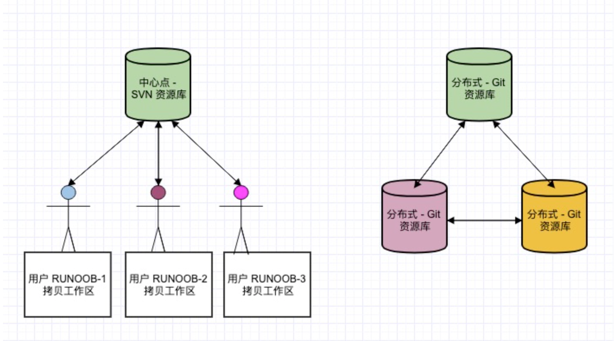

# Git

- Git 是一个**开源**的**分布式**版本控制系统，用于敏捷高效地处理任何或小或大的项目。

- Git 是 Linus Torvalds 为了帮助管理 Linux 内核开发而开发的一个开放源码的**版本控制软件**。

- Git 与常用的版本控制工具 CVS, Subversion 等不同，它采用了**分布式版本库**的方式，不必服务器端软件支持。

  

## Git 与 SVN 区别

Git 不仅仅是个版本控制系统，它也是个内容管理系统(CMS)，工作管理系统等。如果你是一个具有使用 SVN 背景的人，你需要做一定的思想转换，来适应 Git 提供的一些概念和特征。

**<u>Git 与 SVN 区别点：</u>**

1. **Git 是分布式的，SVN 不是**：这是 Git 和其它非分布式的版本控制系统，例如 SVN，CVS 等，最核心的区别。
2. **Git 把内容按元数据方式存储，而 SVN 是按文件：**所有的资源控制系统都是把文件的元信息隐藏在一个类似 .svn、.cvs 等的文件夹里。
3. **Git 分支和 SVN 的分支不同：**分支在 SVN 中一点都不特别，其实它就是版本库中的另外一个目录。
4. **Git 没有一个全局的版本号，而 SVN 有：**目前为止这是跟 SVN 相比 Git 缺少的最大的一个特征。
5. **Git 的内容完整性要优于 SVN：**Git 的内容存储使用的是 SHA-1 哈希算法。这能确保代码内容的完整性，确保在遇到磁盘故障和网络问题时降低对版本库的破坏。

