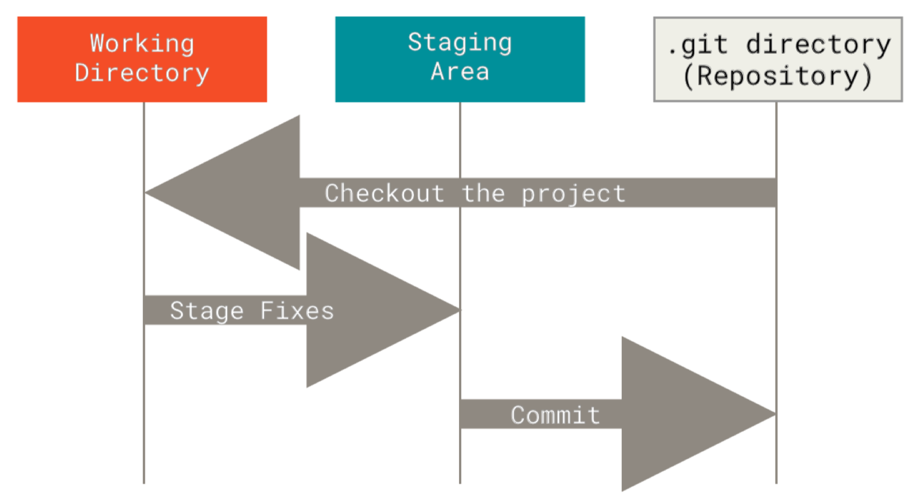

# Git 工作模式

## Git 文件的三种状态

Git 有三种状态，你的文件可能 处于其中之一： **已提交（committed）、已修改（modified） 和 已暂存（staged）。**

• 已修改表示修改了文件，但还没保存到数据库中。

• 已暂存表示对一个已修改文件的当前版本做了标记，使之包含在下次提交的快照中。

• 已提交表示数据已经安全地保存在本地数据库中。

这会让我们的 Git 项目拥有三个阶段：**工作区 (Wroking Directory)、暂存区 (Staging Area)**以及 **Git 目录 (Git Repository)**。

**工作区** 是对项目的某个版本独立提取出来的内容。 这些从 Git 仓库的压缩数据库中提取出来的文件，放在磁盘上供你使用或修改。

**暂存区 **是一个文件，保存了下次将要提交的文件列表信息，一般在 Git 仓库目录中。 按照 Git 的术语叫做“索 引”，不过一般说法还是叫“暂存区”。

**Git 仓库目录 **是 Git 用来保存项目的元数据和对象数据库的地方。 这是 Git 中最重要的部分，从其它计算机克隆 仓库时，复制的就是这里的数据。

## Git 工作流程

Git 一般工作流程如下：

- Clone Git 资源作为工作目录。
- 在克隆的资源上添加或修改文件。
- 如果其他人修改了，你可以更新资源。
- 在提交前查看修改。
- 提交修改。
- 在修改完成后，如果发现错误，可以撤回提交并再次修改并提交。

如果 Git 目录中保存着特定版本的文件，就属于 已提交 状态。 如果文件已修改并放入暂存区，就属于 已暂存 状 态。 如果自上次检出后，作了修改但还没有放到暂存区域，就是 已修改 状态。 

