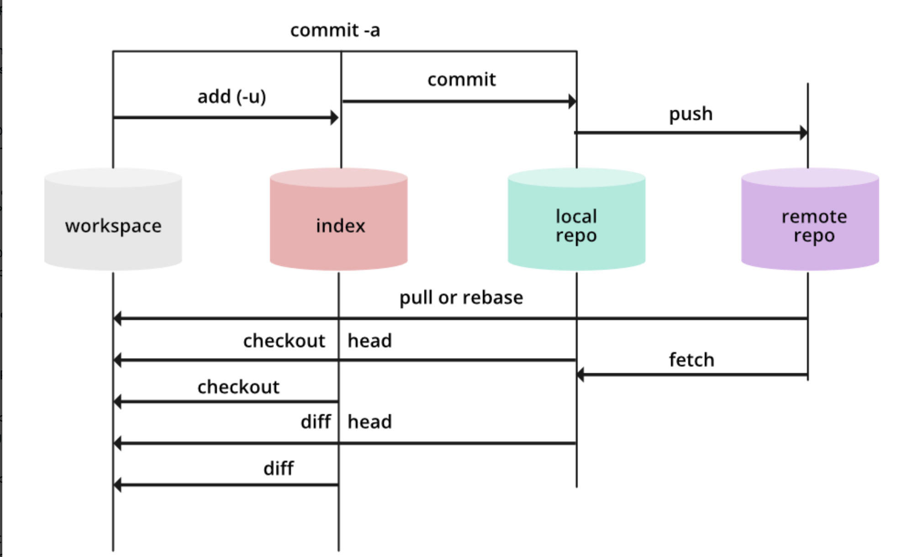

# Git 工作区、暂存区和版本库

## 基本概念

我们先来理解下 Git 工作区、暂存区和版本库概念：

- **工作区（Workspace）：** 就是你在电脑里能看到的目录。
- **暂存区（Index & Staging Area）：** 英文叫 stage 或 index。一般存放在 **.git** 目录下的 index 文件（.git/index）中，所以我们把暂存区有时也叫作索引（index）。
- **本地版本库（Local Repository）：** 工作区有一个隐藏目录 **.git**，这个不算工作区，而是 Git 的版本库。
- **远程版本库（Remote Repository）:** 远程数据库（云数据库）。

**下面这个图展示了工作区、版本库中的暂存区和版本库之间的关系：**

- 当对工作区修改（或新增）的文件执行 `git add `命令时，Staging Area (index) 的目录树被更新，同时Workspace修改（或新增）的文件内容被写入到对象库中的一个新的对象中，而该对象的ID被记录在 index 的文件索引中。

- 当执行提交操作 `git commit` 时，index 的目录树写到版本库（对象库）中，main 分支会做相应的更新。即 main 指向的目录树就是提交时暂存区的目录树。

- 当执行 `git reset HEAD` 命令时，index 的目录树会被重写，被 main 分支指向的目录树所替换，但是workspace不受影响。
- 当执行 `git rm --cached <file> `命令时，会直接从 index 删除文件，workspace 则不做出改变。
- 当执行 `git checkout .` 或者 `git checkout -- <file> ` 命令时，会用 index 全部或指定的文件替换 workspace 的文件。**这个操作很危险，会清除 workspace 中未添加到 index 中的改动。**
- 当执行 `git checkout HEAD .` 或者 `git checkout HEAD <file>` 命令时，会用 HEAD 指向的 main 分支中的全部或者部分文件替换 index 和以及 workspace 中的文件。**这个命令也是极具危险性的，因为不但会清除workspace中未提交的改动，也会清除暂存区中未提交的改动。**