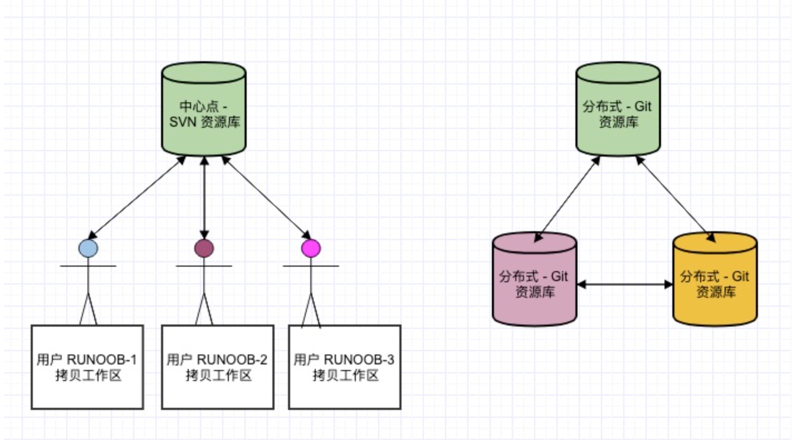

# 关于版本控制

### 本地版本控制系统

其中最流行的一种叫做 **==RCS==**，现今许多计算机系统上都还看得到它的踪影。 RCS 的**工作原理是在硬盘上保存补丁集(补丁是指文件修订前后的变化)**; 通过应用所有的补丁，可以重新计算出各个版本的文件内容。


### 集中化的版本控制系统

接下来人们又遇到一个问题，如何让在不同系统上的开发者协同工作? 于是，集中化的版本控制系统 (Centralized Version Control Systems，简称 **CVCS**) 应运而生。简而言之，就是一个单一的集中管理的服务器，保存所有文件的修订版本，而协同工作的人们都通过客户端 连到这台服务器，取出最新的文件或者提交更新。


事分两面，有好有坏。 这么做最显而易见的缺点是中央服务器的单点故障。 如果宕机一小时，那么在这一小时 内，谁都无法提交更新，也就无法协同工作。 如果中心数据库所在的磁盘发生损坏，又没有做恰当备份，毫无 疑问你将丢失所有数据——包括项目的整个变更历史，只剩下人们在各自机器上保留的单独快照。


### 分布式版本控制系统

于是**分布式版本控制系统（Distributed Version Control System，简称 DVCS）**面世了。 在这类系统中，像 Git、Mercurial、Bazaar 以及 Darcs 等，客户端并不只提取最新版本的文件快照， 而是把代码仓库完整地镜像 下来，包括完整的历史记录。 这么一来，任何一处协同工作用的服务器发生故障，事后都可以用任何一个镜像 出来的本地仓库恢复。 **因为每一次的克隆操作，实际上都是一次对代码仓库的完整备份。**


# Git

- Git 是一个**开源**的**分布式**版本控制系统，用于敏捷高效地处理任何或小或大的项目。
- Git 是 Linus Torvalds 为了帮助管理 Linux 内核开发而开发的一个开放源码的**版本控制软件**。
- Git 与常用的版本控制工具 CVS, Subversion 等不同，它采用了**分布式版本库**的方式，不必服务器端软件支持。
  

## Git 与 SVN 区别

Git 不仅仅是个版本控制系统，它也是个内容管理系统 (CMS)，工作管理系统等。如果你是一个具有使用 SVN 背景的人，你需要做一定的思想转换，来适应 Git 提供的一些概念和特征。

#### **<u>Git 与 SVN 区别点：</u>**

1. **Git 是分布式的，SVN 不是：** 这是 Git 和其它非分布式的版本控制系统，例如 SVN，CVS 等，最核心的区别。
2. **Git 把内容按元数据方式存储，而 SVN 是按文件：** 所有的资源控制系统都是把文件的元信息隐藏在一个类似 .svn、.cvs 等的文件夹里。
3. **Git 分支和 SVN 的分支不同：** 分支在 SVN 中一点都不特别，其实它就是版本库中的另外一个目录。
4. **Git 没有一个全局的版本号，而 SVN 有：** 目前为止这是跟 SVN 相比 Git 缺少的最大的一个特征。
5. **Git 的内容完整性要优于 SVN：** Git 的内容存储使用的是 SHA-1 哈希算法。这能确保代码内容的完整性，确保在遇到磁盘故障和网络问题时降低对版本库的破坏。




## 为什么选择 Git ？

### 1. 直接记录快照，而非差异比较

Git 和其它版本控制系统（包括 Subversion 和近似工具）的主要差别在于 Git 对待数据的方式。 从概念上来 说，其它大部分系统以文件变更列表的方式存储信息，这类系统（CVS、Subversion、Perforce、Bazaar 等 等） 将它们存储的信息看作是一组基本文件和每个文件随时间逐步累积的差异 （它们通常称作 **基于差异 （delta-based）** 的版本控制）。**-- 也就是 ==增量储存==：指的是除了第一个版本存储的是每个文件的完整内容，之后的版本存储的是每个文件相对于上一个版本对应文件的变化的内容。**


Git 不按照以上方式对待或保存数据。反之，Git 更像是把数据看作是对小型文件系统的一系列快照。 在 Git 中，每当你提交更新或保存项目状态时，它基本上就会对当时的全部文件创建一个快照并保存这个快照的索引。 为了效率，如果文件没有修改，Git 不再重新存储该文件，而是只保留一个链接指向之前存储的文件。 Git 对待数据更像是一个 **==快照流==**。(**快照**：在电脑系统中，快照是整个系统在某个时间点上的状态。这个名词是由摄影中借用而来。它储存了系统映象，让电脑系统在出现问题时，可以快速恢复到未出问题前的状况。)


### 2. 近乎所有操作都是本地执行

在 Git 中的绝大多数操作都**==只需要访问本地文件和资源==**，一般不需要来自网络上其它计算机的信息。 在本地磁盘上就有项目的完整历史，所以大部分操作看起来瞬间完成。这也意味着在离线或者没有 VPN 时，几乎可以进行任何操作。 使用其它系统的话，做到这些是不可能或很费力的。 比如，用 Perforce 的话，没有连接服务器时几乎不能做什么事；而用 Subversion 和 CVS 的话， 能修改文件，但不能向数据库提交修改（因为本地数据库离线了）。  

从上面的介绍可以看出，git在恢复文件的时候只需要根据快照加载相应的文件即可，因为需要加载的文件直接存在，所以加载速度很快，但是发现对于变化了的文件每次快照都会重新存储，所以相比增量，快照技术占用的空间可能比较大，**==用空间换时间==**，实际上git对于这个问题做了优化。

### 3. Git 保证完整性

Git 中所有的数据在存储前都计算校验和，然后以校验和来引用。 这意味着不可能在 Git 不知情时更改任何文件内容或目录内容。 这个功能建构在 Git 底层，是构成 Git 哲学不可或缺的部分。 若在传送过程中丢失信息或损坏文件，Git 就能发现。

Git 用以计算校验和的机制叫做 SHA-1 散列（hash，哈希）。 这是一个由 40 个十六进制字符（0-9 和 a-f）组成的字符串，基于 Git 中文件的内容或目录结构计算出来。 SHA-1 哈希看起来是这样：

``` 24b9da6552252987aa493b52f8696cd6d3b00373```

Git 中使用这种哈希值的情况很多，实际上，**Git 数据库中保存的信息都是以文件内容的哈希值来索引，而不是文件名。**

### 4. Git 一般只添加数据

执行的 Git 操作，几乎只往 Git 数据库中 添加 数据。 **很难使用 Git 从数据库中删除数据**，也就是说 Git 几乎不会执行任何可能导致文件不可恢复的操作。 同别的 VCS 一样，未提交更新时有可能丢失或弄乱修改的内容。 但是一旦提交快照到 Git 中， 就难以再丢失数据，特别是如果定期的推送数据库到其它仓库的话。


# Git 的工作模式

## Git 文件的三种状态

Git 有三种状态，你的文件可能 处于其中之一： **已提交（committed）、已修改（modified） 和 已暂存（staged）。**

• 已修改表示修改了文件，但还没保存到数据库中。

• 已暂存表示对一个已修改文件的当前版本做了标记，使之包含在下次提交的快照中。

• 已提交表示数据已经安全地保存在本地数据库中。

这会让我们的 Git 项目拥有三个阶段：**工作区 (Workspace)、暂存区 (Index & Staging Area)** 以及 **Git 版本库 (Git Repository)**。


## Git 工作区、暂存区和版本库

我们先来理解下 Git 工作区、暂存区和版本库概念：

- **工作区（Workspace）：** 就是你在电脑里能看到的目录。
- **暂存区（Index & Staging Area）：** 英文叫 stage 或 index。一般存放在 **.git** 目录下的 index 文件（.git/index）中，所以我们把暂存区有时也叫作索引（index）。
- **本地版本库（Local Repository）：** 工作区有一个隐藏目录 **.git**，这个不算工作区，而是 Git 的版本库。
- **远程版本库（Remote Repository）:** 远程数据库（云数据库）。


**下面这个图展示了工作区、版本库中的暂存区和版本库之间的关系：**


- 当对工作区修改（或新增）的文件执行 `git add `命令时，Staging Area (index) 的目录树被更新，同时Workspace修改（或新增）的文件内容被写入到对象库中的一个新的对象中，而该对象的ID被记录在 index 的文件索引中。

- 当执行提交操作 `git commit` 时，index 的目录树写到版本库（对象库）中，main 分支会做相应的更新。即 main 指向的目录树就是提交时暂存区的目录树。

- 当执行 `git reset HEAD` 命令时，index 的目录树会被重写，被 main 分支指向的目录树所替换，但是workspace不受影响。
- 当执行 `git rm --cached <file> `命令时，会直接从 index 删除文件，workspace 则不做出改变。
- 当执行 `git checkout .` 或者 `git checkout -- <file> ` 命令时，会用 index 全部或指定的文件替换 workspace 的文件。**这个操作很危险，会清除 workspace 中未添加到 index 中的改动。**
- 当执行 `git checkout HEAD .` 或者 `git checkout HEAD <file>` 命令时，会用 HEAD 指向的 main 分支中的全部或者部分文件替换 index 和以及 workspace 中的文件。**这个命令也是极具危险性的，因为不但会清除workspace中未提交的改动，也会清除暂存区中未提交的改动。**


## Git 工作流程

Git 一般工作流程如下：

- Clone Git 资源作为工作目录。
- 在克隆的资源上添加或修改文件。
- 如果其他人修改了，你可以更新资源。
- 在提交前查看修改。
- 提交修改。
- 在修改完成后，如果发现错误，可以撤回提交并再次修改并提交。

如果 Git 目录中保存着特定版本的文件，就属于 已提交 状态。 如果文件已修改并放入暂存区，就属于 已暂存 状 态。 如果自上次检出后，作了修改但还没有放到暂存区域，就是 已修改 状态。 

