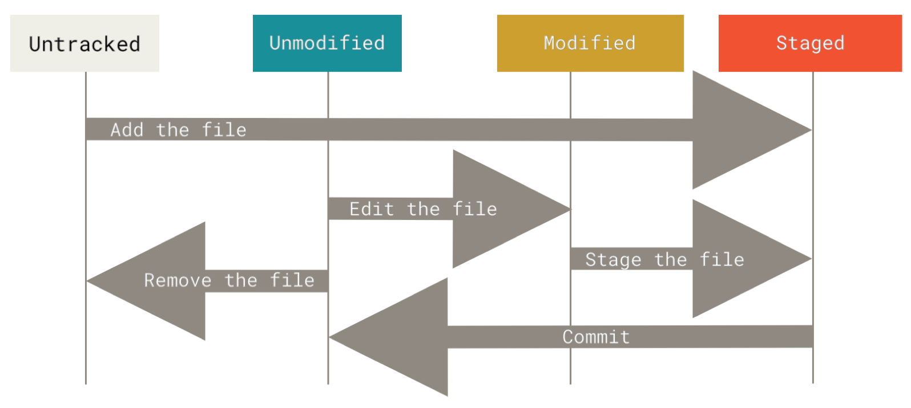

# Git 创建仓库

通常有两种获取 Git 项目仓库的方式：

1. **将尚未进行版本控制的本地目录转换为 Git 仓库；**

2. **从其它服务器 clone 一个已存在的 Git 仓库。**

两种方式都会在你的本地机器上得到一个工作就绪的 Git 仓库。


## git init (初始化仓库) 

如果你有一个尚未进行版本控制的项目目录，想要用 Git 来控制它，那么首先需要进入该项目目录中。之后执行：

```
$ git init
```

**该命令将创建一个名为 .git 的子目录，这个子目录含有你初始化的 Git 仓库中所有的必须文件，这些文件是 Git 仓库的骨干。** ==但是，在这个时候，我们仅仅是做了一个初始化的操作，你的项目里的文件还没有被跟踪。== (参见 Git 内部原理 来了解更多关于到底 .git 文件夹中包含了哪些文件的信息。) 如果在一个已存在文件的文件夹（而非空文件夹）中进行版本控制，你应该开始追踪这些文件并进行初始提交。 可以通过 **git add** 命令来指定所需的文件来进行追踪，然后执行 **git commit**

 此外，使用我们**指定目录**作为Git repository。

```
$ git init newrepo
```

初始化后，会在 newrepo 目录下会出现一个名为 .git 的目录，所有 Git 需要的数据和资源都存放在这个目录中。

```
$ git add *.c
$ git add README
$ git commit -m '初始化项目版本'
```

以上命令将目录下以 .c 结尾及 README 文件提交到repository中，且备注为“初始化项目版本”。

> **注：** 在 Linux 系统中，commit 信息使用单引号 **'**，Windows 系统，commit 信息使用双引号 **"**。
>
> 所以在 git bash 中 **git commit -m '提交说明'** 这样是可以的，在 Windows 命令行中就要使用双引号 **git commit -m "提交说明"**。


## git clone (克隆现有的仓库) 

如果你想获得一份已经存在了的 Git 仓库的拷贝，比如说，你想为某个开源项目贡献自己的一份力，这时就要用 到 git clone 命令。 如果你对其它的 VCS 系统（比如说 Subversion）很熟悉，请留心一下你所使用的命令 是"clone"而不是"checkout"。 这是 Git 区别于其它版本控制系统的一个重要特性，**Git 克隆的是该 Git 仓库服务 器上的几乎所有数据，而不是仅仅复制完成你的工作所需要文件。 ==当你执行 git clone 命令的时候，默认配置 下远程 Git 仓库中的每一个文件的每一个版本都将被拉取下来。==** 事实上，如果你的服务器的磁盘坏掉了，你通常 可以使用任何一个克隆下来的用户端来重建服务器上的仓库 （虽然可能会丢失某些服务器端的钩子（hook）设 置，但是所有版本的数据仍在，详见 在服务器上搭建 Git ）。

克隆仓库的命令是 git clone \<url> 。 比如，要克隆 Git 的链接库 libgit2到当前目录，可以用下面的命令：

```
$ git clone https://github.com/libgit2/libgit2
```

如果我们需要克隆到指定的目录，可以使用以下命令格式：

```
$ git clone <repo> <directory>
```

这会在目标目录下创建一个名为 “libgit2” 的目录，并在这个目录下初始化一个 .git 文件夹， 从远程仓库拉 取下所有数据放入 .git 文件夹，然后从中读取最新版本的文件的拷贝。 如果你进入到这个新建的 libgit2 文 件夹，你会发现所有的项目文件已经在里面了，准备就绪等待后续的开发和使用。

如果你想在克隆远程仓库的时候，自定义本地仓库的名字，你可以通过额外的参数指定新的目录名：

```
$ git clone https://github.com/libgit2/libgit2 mylibgit
```

这会执行与上一条命令相同的操作，但目标目录名变为了 mylibgit。

Git 支持多种数据传输协议。 上面的例子使用的是 https:// 协议，不过你也可以使用 git:// 协议或者使用 SSH 传输协议，比如 user@server:path/to/repo.git 。 在服务器上搭建 Git 将会介绍所有这些协议在服 务器端如何配置使用，以及各种方式之间的利弊。


# Git 记录每次更新到仓库

现在我们的机器上有了一个 **真实项目** 的 Git 仓库，并从这个仓库中检出了所有文件的 工作副本。 通常，你会对 这些文件做些修改，每当完成了一个阶段的目标，想要将记录下它时，就将它提交到仓库。

请记住，你工作目录下的每一个文件都不外乎这两种状态：已跟踪 或 未跟踪。 **已跟踪的文件是指那些被纳入了 版本控制的文件，在上一次快照中有它们的记录，在工作一段时间后， 它们的状态可能是未修改，已修改或已放入暂存区。简而言之，已跟踪的文件就是 Git 已经知道的文件。**

工作目录中除已跟踪文件外的其它所有文件都属于未跟踪文件，它们既不存在于上次快照的记录中，也没有被放 入暂存区。 初次克隆某个仓库的时候，工作目录中的所有文件都属于已跟踪文件，并处于未修改状态，因为 Git 刚刚检出了它们， 而你尚未编辑过它们。

编辑过某些文件之后，由于自上次提交后你对它们做了修改，Git 将它们标记为已修改文件。 在工作时，你可以 选择性地将这些修改过的文件放入暂存区，然后提交所有已暂存的修改，如此反复。



## git status (状态查询命令)

git status 命令用于查看在你上次提交之后是否有对文件进行再次修改。

```
$ git status
On branch master

Initial commit

Changes to be committed:
  (use "git rm --cached <file>..." to unstage)

    new file:   README
    new file:   hello.php
```

通常我们使用 **-s** 参数来获得简短的输出结果：

```
$ git status -s
AM README
A  hello.php
```


==新添加的未跟踪文件前面有 ?? 标记，新添加到暂存区中的文件前面有 A 标记，修改过的文件前面有 M 标记。==

**AM** 状态的意思是这个文件在我们将它添加到缓存之后又有改动。


## git add (跟踪新文件)

**git add** 命令可将该文件添加到暂存区也就是**开始追踪一个新文件**。

==**⚠️注意，空文件夹是不会被追踪的！**==

添加一个或多个文件到暂存区：

```
git add [file1] [file2] ...
```

添加指定目录到暂存区，包括子目录：

```
git add [dir]
```

==**添加当前目录下的所有文件到暂存区：**==

```
git add .
```

以下实例我们添加两个文件：

```
$ touch README                # 创建文件
$ touch hello.php             # 创建文件
$ ls
README        hello.php
$ git status -s
?? README
?? hello.php
$ 
```


git status 命令用于查看项目的当前状态。

接下来我们执行 git add 命令来添加文件：

```
$ git add README hello.php 
```

现在我们再执行 git status，就可以看到这两个文件已经加上去了。

```
$ git status -s
A  README
A  hello.php
$ 
```


新项目中，添加所有文件很普遍，我们可以使用 **git add .** 命令来添加当前项目的所有文件。

现在我们修改 README 文件：

```
$ vim README
```

在 README 添加以下内容：**# Runoob Git 测试**，然后保存退出。

再执行一下 git status：

```
$ git status -s
AM README
A  hello.php
```


**AM 状态的意思是这个文件在我们将它添加到缓存之后又有改动**。改动后我们再执行 **git add .** 命令将其添加到缓存中：

```
$ git add .
$ git status -s
A  README
A  hello.php
```


## git diff (查看修改内容)

```
git diff 
```

命令目的 —— 查看：

- **当前做的哪些更新尚未暂存？**
- **有哪些更新已暂存并准备好下次提交？**

此命令比较的是工作目录中当前文件和暂存区域快照之间的差异。 ==**也就是修改之后还没有暂存起来的变化内容。**==

**==若要查看已暂存的将要添加到下次提交里的内容，==**可以用

```
 git diff --staged 
 或者  git diff --cached (--staged 同义词)
```

 这条命令将比对**已暂存文件与最后一次提交的文件差异**

⚠️注意，**git diff 本身只显示尚未暂存的改动**，而不是自上次提交以来所做的所有改动。 所以有时候你一下子暂存了所有更新过的文件，运行 git diff 后却什么也没有，就是这个原因。


## git commit (提交更新)

前面章节我们使用 git add 命令将内容写入暂存区。

==**git commit 命令将暂存区内容添加到本地仓库中。**==

提交暂存区到本地仓库中:

```
git commit -m [message]
```

[message] 可以是一些备注信息。 ***必须要写***

提交暂存区的指定文件到仓库区：

```
$ git commit [file1] [file2] ... -m [message]
```

**-a** 参数设置修改文件后不需要执行 git add 命令，直接来提交

```
$ git commit -m "comments" -a
```

**设置提交代码时的用户信息**

开始前我们需要先设置提交的用户信息，包括用户名和邮箱：

```
$ git config --global user.name 'runoob'
$ git config --global user.email test@runoob.com
```

如果去掉 --global 参数只对当前仓库有效。

**提交修改**

接下来我们就可以对 hello.php 的所有改动从暂存区内容添加到本地仓库中。

以下实例，我们使用 -m 选项以在命令行中提供提交注释。

```
$ git add hello.php
$ git status -s
A  README
A  hello.php
$ git commit -m '第一次版本提交'
[master (root-commit) d32cf1f] 第一次版本提交
 2 files changed, 4 insertions(+)
 create mode 100644 README
 create mode 100644 hello.php
 
```

更详细的内容修改提示可以用 **-v** 选项查看，这会将你所作的更改的 diff 输出呈现在编辑器 中，以便让你知道本次提交具体作出哪些修改。

现在我们已经记录了快照。如果我们再执行 git status:

```
$ git status
# On branch master
nothing to commit (working directory clean)
```

以上输出说明我们在最近一次提交之后，没有做任何改动，是一个 "working directory clean"，翻译过来就是干净的工作目录。

如果你没有设置 -m 选项，Git 会尝试为你打开一个编辑器以填写提交信息。 如果 Git 在你对它的配置中找不到相关信息，默认会打开 vim。屏幕会像这样：

```
# Please enter the commit message for your changes. Lines starting
# with '#' will be ignored, and an empty message aborts the commit.
# On branch master
# Changes to be committed:
#   (use "git reset HEAD <file>..." to unstage)
#
# modified:   hello.php
#
~
~
".git/COMMIT_EDITMSG" 9L, 257C
```

==如果你觉得 git add 提交缓存的流程太过繁琐，Git 也允许你用 -a 选项跳过这一步。命令格式如下：==

```
git commit -a
```

我们先修改 hello.php 文件为以下内容：

```
<?php
echo '菜鸟教程：www.runoob.com';
echo '菜鸟教程：www.runoob.com';
?>
```

再执行以下命令：

```
$ git commit -am '修改 hello.php 文件'
[master 71ee2cb] 修改 hello.php 文件
 1 file changed, 1 insertion(+)
```


## git rm (移除文件)

**==要从 Git 中移除某个文件，就必须要从已跟踪文件清单中移除（确切地说，是从暂存区域移除），然后commit。==**

**⚠️注意：是删除文件，而不是文件夹！**

**1. 手动从工作目录中手工删除文件（或使用 rm 指令）**

==rm 命令只是删除工作区的文件，并没有删除版本库或者暂存库的文件==，运行 **git status** 时就会在 **Changes not staged for commit** 的提示。要使用 **git rm** 将文件从版本管理中（暂存库）抹去。下一次 **commit** 时，该文件就不再纳入版本管理了。

**2. git rm 文件从<u>==暂存区==</u>和<u>==工作区==</u>中删除 (也将文件直接从本地删除, 但不影响本地版本库)：**

**⚠️注意：** 要删除的文件和**和当前本地版本库文件的内容相同**。

```
git rm <file>
```

以下实例从暂存区和工作区中删除 runoob.txt 文件：

```
git rm runoob.txt 
```

==*如果删除之前修改过**或者**已经放到暂存区域而未 commit 的话 (要删除的文件已经修改过，就是说和当前版本库文件的内容不同)，则必须要用强制删除选项 **git rm -f **。*==这是一种安全特性，用于防止误删尚未添加到快照的数据，这样的数据不能被 Git 恢复。

强行从暂存区和工作区中删除修改后的 runoob.txt 文件：

```
git rm -f runoob.txt 
```

==此外，如果文件从来没有放到暂存区，git rm 是无法删除文件的。==**git rm 指令必须作用于曾经放到过暂存区的文件。**因为只有在暂存区的文件才是被 git 追踪的，未追踪文件不能使用 git 指令删除，应使用 rm 指令。


**3. 如果想把文件只从暂存区域移除，==但仍然希望保留在当前工作目录中==**，换句话说，仅是从跟踪清单中删除，使用 **--cached** 选项即可：

```
git rm --cached <file>
```

此指令只会 untrack 选定文件，也就是从暂存区移除，**依然需要使用 commit 更新删除后版本库**。==**此外，如果文件有修改，无论是否 git add 到暂存区，执行 git rm --cached 暂存区文件都会被删除，并且保留的工作区文件是修改后的文件。**==然后 commit， 那么版本库的文件也被删了。

**实例**

文件从暂存区域移除，但工作区保留：

```
$ git rm --cached README 
rm 'README'
$ ls
README
```

**4. 此外，==git rm 命令后面可以列出文件或者目录的名字，==也可以使用 glob 模式。比如：**

```
$ git rm log/\*.log
```

注意到星号 * 之前的反斜杠 \， 因为 Git 有它自己的文件模式扩展匹配方式，所以我们不用 shell 来帮忙展开。 此命令删除 log/ 目录下扩展名为 .log 的所有文件。 类似的比如：

```
$ git rm \*~
```

该命令会删除所有名字以 ~ 结尾的文件。


## git mv (移动或重命名):

git mv 命令用于移动或重命名一个文件、目录或软连接。**（前旧后新）**

```
git mv [file] [newfile]
```

如果新文件名已经存在，但还是要重命名它，可以使用 **-f** 参数：

```
git mv -f [file] [newfile]
```

**其实，运行 git mv 就相当于运行了下面三条命令：**

```
$ mv README.md README 
$ git rm README.md 
$ git add README
```

如此分开操作，Git 也会意识到这是一次重命名，所以不管何种方式结果都一样。 两者唯一的区别在于，git mv 是一条命令而非三条命令，直接使用 git mv 方便得多。 不过在使用其他工具重命名文件时，记得在提交前 git rm 删除旧文件名，再 git add 添加新文件名。


# Git 查看提交历史


Git 提交历史一般常用两个命令：

**git log** - 查看历史提交记录。

**git blame <file>** - 以列表形式查看指定文件的历史修改记录。


## git log (回溯历史):

在使用 Git 提交了若干更新之后，又或者克隆了某个项目，想回顾下提交历史，我们可以使用 **git log** 命令查看。不传入任何参数的默认情况下，git log 会按时间先后顺序列出所有的提交，最近的更新排在最上面。这个命令会列出每个提交的 SHA-1 校验和、作者的名字和电子邮件地址、提交时间以及提交说明。

针对我们前一章节的操作，使用 **git log** 命令列出历史提交记录如下：

```
$ git log
commit d5e9fc2c811e0ca2b2d28506ef7dc14171a207d9 (HEAD -> master)
Merge: c68142b 7774248
Author: runoob <test@runoob.com>
Date:   Fri May 3 15:55:58 2019 +0800

    Merge branch 'change_site'

commit c68142b562c260c3071754623b08e2657b4c6d5b
Author: runoob <test@runoob.com>
Date:   Fri May 3 15:52:12 2019 +0800

    修改代码

commit 777424832e714cf65d3be79b50a4717aea51ab69 (change_site)
Author: runoob <test@runoob.com>
Date:   Fri May 3 15:49:26 2019 +0800

    changed the runoob.php

commit c1501a244676ff55e7cccac1ecac0e18cbf6cb00
Author: runoob <test@runoob.com>
Date:   Fri May 3 15:35:32 2019 +0800
```


**1. 用 git log --oneline 选项来查看历史记录的简洁的版本。**

```
$ git log --oneline
$ git log --oneline
d5e9fc2 (HEAD -> master) Merge branch 'change_site'
c68142b 修改代码
7774248 (change_site) changed the runoob.php
c1501a2 removed test.txt、add runoob.php
3e92c19 add test.txt
3b58100 第一次版本提交
```


**2. 用 git log -p / git --patch 选项来显示每次提交所引入的差异。**

 它会显示每次提交所引入的差异（按 补丁 的格式输出）。 可以限制显示的日志条目数量，例如使用 -2 选项来只显示最近的两次提交。


**3. 用 git log --stat 选项来显示提交的简略统计信息。**

--stat 选项在每次提交的下面**列出所有被修改过的文件、有多少文件被修改了以及被修改过的文件的哪些行被移除或是添加了**。 在每次提交的最后还有一个总结。

**4. 用 git log --pretty=... 选项使用不同于默认格式的方式展示提交历史**

这个选项有一 些内建的子选项供你使用。 比如 oneline 会将每个提交放在一行显示，在浏览大量的提交时非常有用。 另外还有 **short，full 和 fuller** 选项，它们展示信息的格式基本一致，但是详尽程度不一：

```
$ git log --pretty=oneline 
ca82a6dff817ec66f44342007202690a93763949 changed the version number 
085bb3bcb608e1e8451d4b2432f8ecbe6306e7e7 removed unnecessary test 
a11bef06a3f659402fe7563abf99ad00de2209e6 first commit
```


**5. 用 git log --pretty=format 选项定制记录的显示格式**

这样的输出对后期提取分析格外有用——因为==**输出的格式不会随着 Git 的更新而发生改变：**==

```
$ git log --pretty=format:"%h - %an, %ar : %s"
ca82a6d - Scott Chacon, 6 years ago : changed the version number 
085bb3b - Scott Chacon, 6 years ago : removed unnecessary test 
a11bef0 - Scott Chacon, 6 years ago : first commit
```

**git log --pretty=format 常用的选项**

| 选项 | 说明                                          |
| ---- | --------------------------------------------- |
| %H   | 提交的完整哈希值                              |
| %h   | 提交的简写哈希值                              |
| %T   | 树的完整哈希值                                |
| %t   | 树的简写哈希值                                |
| %P   | 父提交的完整哈希值                            |
| %p   | 父提交的简写哈希值                            |
| %an  | 作者名字                                      |
| %ae  | 作者的电子邮件地址                            |
| %ad  | 作者修订日期（可以用 --date=选项 来定制格式） |
| %ar  | 作者修订日期，按多久以前的方式显示            |
| %cn  | 提交者的名字                                  |
| %ce  | 提交者的电子邮件地址                          |
| %cd  | 提交日期                                      |
| %cr  | 提交日期（距今多长时间）                      |
| %s   | 提交说明                                      |

==作者指的是实际作出修改的人，提交者指的是最后将此工 作成果提交到仓库的人。 所以，当你为某个项目发布补丁，然后某个核心成员将你的补丁并入项目时，你就是作者，而那个核心成员就是提交者。==

**6. 用 --graph 选项添加了 ASCII 字符串来形象地展示分支、合并历史**

我们还可以用 --graph 选项，**查看历史中什么时候出现了分支、合并**。以下为相同的命令，开启了拓扑图选项：

```
$ git log --pretty=format:"%h %s" --graph 
* 2d3acf9 ignore errors from SIGCHLD on trap 
* 5e3ee11 Merge branch 'master' of git://github.com/dustin/grit 
|\ 
| * 420eac9 Added a method for getting the current branch.
* | 30e367c timeout code and tests 
* | 5a09431 add timeout protection to grit 
* | e1193f8 support for heads with slashes in them 
|/ 
* d6016bc require time for xmlschema 
* 11d191e Merge branch 'defunkt' into local
```

现在可以更清楚明了地看到何时工作分叉、又何时归并。


**7. 用 --reverse 选项来逆向显示所有日志**

```
$ git log --reverse --oneline
3b58100 第一次版本提交
3e92c19 add test.txt
c1501a2 removed test.txt、add runoob.php
7774248 (change_site) changed the runoob.php
c68142b 修改代码
d5e9fc2 (HEAD -> master) Merge branch 'change_site'
```


**8. 用 git log --author 选项来查找指定用户的提交日志**

比方说我们要找 Git 源码中 Linus 提交的部分：

```
$ git log --author= "Linus" --oneline -5
81b50f3 Move 'builtin-*' into a 'builtin/' subdirectory
3bb7256 make "index-pack" a built-in
377d027 make "git pack-redundant" a built-in
b532581 make "git unpack-file" a built-in
112dd51 make "mktag" a built-in
```


**9. 用 --since 和 --before /  --until 和 --after 选项来查找指定日期**

例如，我要看 Git 项目中三周前且在四月十八日之后的所有提交，我可以执行这个（我还用了 **--no-merges 选项以隐藏合并提交**）：

```
$ git log --oneline --before={3.weeks.ago} --after={2010-04-18} --no-merges
5469e2d Git 1.7.1-rc2
d43427d Documentation/remote-helpers: Fix typos and improve language
272a36b Fixup: Second argument may be any arbitrary string
b6c8d2d Documentation/remote-helpers: Add invocation section
5ce4f4e Documentation/urls: Rewrite to accomodate transport::address
00b84e9 Documentation/remote-helpers: Rewrite description
03aa87e Documentation: Describe other situations where -z affects git diff
77bc694 rebase-interactive: silence warning when no commits rewritten
636db2c t3301: add tests to use --format="%N"
```

**git log  的常用选项**

| 选项            | 说明                                                         |
| --------------- | ------------------------------------------------------------ |
| -p              | 按补丁格式显示每个提交引入的差异。                           |
| --stat          | 显示每次提交的文件修改统计信息。                             |
| --shortstat     | 只显示 --stat 中最后的行数修改添加移除统计。                 |
| --name-only     | 仅在提交信息后显示已修改的文件清单。                         |
| --name-status   | 显示新增、修改、删除的文件清单。                             |
| --abbrev-commit | 仅显示SHA-1 校验和所有 40 个字符中的前几个字符。             |
| --relative-date | 使用较短的相对时间而不是完整格式显示日期（比如“2weeks ago”）。 |
| --graph         | 在日志旁以 ASCII 图形显示分支与合并历史。                    |
| --pretty        | 使用其他格式显示历史提交信息。可用的选项包括 oneline、short、full、fuller 和 format（用来定义自己的格式）。 |
| --oneline       | --pretty=oneline --abbrev-commit 合用的简写。                |

更多 git log 命令可查看：http://git-scm.com/docs/git-log


如果要查看指定文件的修改记录可以使用 **git blame** 命令，格式如下： 

```
git blame <file>
```

git blame 命令是以列表形式显示修改记录，如下实例：

```
$ git blame README 
^d2097aa (tianqixin 2020-08-25 14:59:25 +0800 1) # Runoob Git 测试
db9315b0 (runoob    2020-08-25 16:00:23 +0800 2) # 菜鸟教程 
```


## 远程操作

### git remote (远程仓库常用命令):

**git remote** 命令用于在远程仓库的操作。

本章节内容我们将以 Github 作为远程仓库来操作，所以阅读本章节前需要先阅读关于 Github 的相关内容：[Git 远程仓库(Github)](https://www.runoob.com/git/git-remote-repo.html)。

**显示所有远程仓库：**

```
git remote -v
```

以下我们先载入远程仓库，然后查看信息：

```
$ git clone https://github.com/tianqixin/runoob-git-test
$ cd runoob-git-test
$ git remote -v
origin  https://github.com/tianqixin/runoob-git-test (fetch)
origin  https://github.com/tianqixin/runoob-git-test (push)
```

**origin** 为远程地址的别名。

**显示某个远程仓库的信息：**

```
git remote show [remote]
```

例如：

```
$ git remote show https://github.com/tianqixin/runoob-git-test
* remote https://github.com/tianqixin/runoob-git-test
  Fetch URL: https://github.com/tianqixin/runoob-git-test
  Push  URL: https://github.com/tianqixin/runoob-git-test
  HEAD branch: master
  Local ref configured for 'git push':
    master pushes to master (local out of date)
```

**添加远程版本库：**

```
git remote add [shortname] [url]
```

shortname 为本地的版本库，例如：

```
# 提交到 Github
$ git remote add origin git@github.com:tianqixin/runoob-git-test.git
$ git push -u origin master
```

*简单来说，带上`-u` 参数其实就相当于记录了push到远端分支的默认值，这样当下次我们还想要继续push的这个远端分支的时候推送命令就可以简写成`git push`即可。*

**删除修改**相关命令：

```
git remote rm name  # 删除远程仓库
git remote rename old_name new_name  # 修改仓库名
```


### git fetch (远程获取命令):

**git fetch** 命令用于从远程获取代码库。

本章节内容我们将以 Github 作为远程仓库来操作，所以阅读本章节前需要先阅读关于 Github 的相关内容：[Git 远程仓库(Github)](https://www.runoob.com/git/git-remote-repo.html)。

该命令执行完后需要执行 **git merge** 远程分支到你所在的分支。

从远端仓库提取数据并尝试合并到当前分支：

```
git merge
```

该命令就是在执行 git fetch 之后紧接着执行 git merge 远程分支到你所在的任意分支。

假设你配置好了一个远程仓库，并且你想要提取更新的数据，你可以首先执行:

```
git fetch [alias]
```

以上命令告诉 Git 去获取它有你没有的数据，然后你可以执行：

```
git merge [alias]/[branch]
```

以上命令将服务器上的任何更新（假设有人这时候推送到服务器了）合并到你的当前分支。

本章节以 https://github.com/tianqixin/runoob-git-test 为例。

接下来我们在 Github 上点击 **README.md** 并在线修改它:


然后我们在本地更新修改。

```
$ git fetch origin
remote: Counting objects: 3, done.
remote: Compressing objects: 100% (2/2), done.
remote: Total 3 (delta 0), reused 0 (delta 0), pack-reused 0
Unpacking objects: 100% (3/3), done.
From github.com:tianqixin/runoob-git-test
   0205aab..febd8ed  master     -> origin/master
```

以上信息"0205aab..febd8ed master -> origin/master" 说明 master 分支已被更新，我们可以使用以下命令将更新同步到本地：

```
$ git merge origin/master
Updating 0205aab..febd8ed
Fast-forward
 README.md | 1 +
 1 file changed, 1 insertion(+)
```

查看 README.md 文件内容：

```
$ cat README.md 
# 菜鸟教程 Git 测试
## 第一次修改内容
```


### git pull (远程下拉命令):

**git pull** 命令用于从远程获取代码并合并本地的版本。

**git pull** 其实就是 **git fetch** 和 **git merge FETCH_HEAD** 的简写。

命令格式如下：

```
git pull <远程主机名> <远程分支名>:<本地分支名>
```

**实例**

更新操作：

```
$ git pull
$ git pull origin
```

将远程主机 origin 的 master 分支拉取过来，与本地的 brantest 分支合并。

```
git pull origin master:brantest
```

如果远程分支是与**当前分支**合并，则冒号后面的部分可以省略。

```
git pull origin master
```

上面命令表示，取回 origin/master 分支，再与本地的 brantest 分支合并。

上面的 pull 操作用 fetch 表示为：

以我的 https://github.com/tianqixin/runoob-git-test 为例，远程载入合并本地分支。

```
$ git remote -v  # 查看信息
origin    https://github.com/tianqixin/runoob-git-test (fetch)
origin    https://github.com/tianqixin/runoob-git-test (push)

$ git pull origin master
From https://github.com/tianqixin/runoob-git-test
 * branch            master     -> FETCH_HEAD
Already up to date.
```

上面命令表示，取回 origin/master 分支，再与本地的 master 分支合并。


### git pull 和 git fetch的区别

`git pull`和`git fetch`，它们在完成相同的工作，只是处理方式不同。


**git fetch**

在拉取代码过程中，`git fetch`会首先检查本地仓库和远程仓库的差异，检查哪些不存在于本地仓库，然后将这些变动的提交拉取到本地。

但是，这里请注意，它是把远程提交拉取到本地仓库，而不是本地工作目录，它不会自行将这些新数据合并到当前工作目录中，我们需要继续执行`git merge`才会把这些变动合并到当前工作目录。

**git pull**

`git pull`和`git fetch`刚好相反，它直接获取远程的最新提交，直接拉取并合并到本地工作目录，而且在合并过程中不会经过我们的审查，如果不仔细检查，这样很容易遇到冲突。

理解了`git pull`和`git fetch`的区别，那么该用哪种方式呢？

相比之下，`git fetch`是一个更安全的选择，因为它从你的远程仓库拉入所有的提交，但不会对你的本地文件做任何修改。

这给了你足够时间去发现远程仓库自从你上次拉取后到现在为止发生的变化。

你可以在合并前检查哪些文件有变化，哪些文件可能导致冲突。

而`git pull`相当于运行`git fetch`，然后立即将你的改动合并到本地仓库。

这样的确少了一个步骤，但是也会带来一些风险。


### git push (上传命令):

**git push** 命令用于从将本地的分支版本上传到远程并合并。

命令格式如下：

```
git push <远程主机名> <本地分支名>:<远程分支名>
```

如果本地分支名与远程分支名相同，则可以省略冒号：

```
git push <远程主机名> <本地分支名>
```

**实例**

以下命令将本地的 master 分支推送到 origin 主机的 master 分支。

```
$ git push origin master
```

相等于：

```
$ git push origin master:master
```

如果本地版本与远程版本有差异，但又要强制推送可以使用 --force 参数：

```
git push --force origin master
```

**删除主机的分支可以使用 --delete 参数**，以下命令表示删除 origin 主机的 master 分支：

```
git push origin --delete master
```

以我的 https://github.com/tianqixin/runoob-git-test 为例，本地添加文件：

```
$ touch runoob-test.txt      # 添加文件
$ git add runoob-test.txt 
$ git commit -m "添加到远程"
master 69e702d] 添加到远程
 1 file changed, 0 insertions(+), 0 deletions(-)
 create mode 100644 runoob-test.txt

$ git push origin master    # 推送到 Github
```

将本地的 master 分支推送到 origin 主机的 master 分支。

重新回到我们的 Github 仓库，可以看到文件已经提交上来了：


