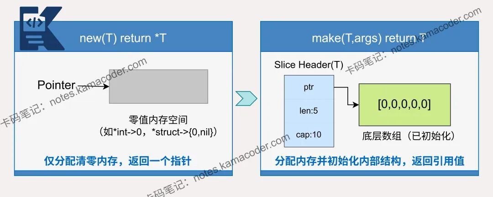

# Go指南

# 基础

## 包

每个 Go 程序都由包构成。

程序从 `main` 包开始运行。

按照约定，包名与导入路径的最后一个元素一致。例如，`"math/rand"` 包中的源码均以 `package rand` 语句开始。

此代码用圆括号将导入的包分成一组，这是推荐的“分组”形式的导入语句。

````go
package main

import (
	"fmt"
	"math/rand"
)

func main() {
	fmt.Printf("现在你有了 %g 个问题。\n", math.Sqrt(7))
}
````


## 导出名

在 Go 中，如果一个名字以大写字母开头，那么它就是已导出的。例如，`Pizza` 就是个已导出名，`Pi` 也同样，它导出自 `math` 包。

`pizza` 和 `pi` 并未以大写字母开头，所以它们是未导出的。

在导入一个包时，你只能引用其中已导出的名字。 任何「未导出」的名字在该包外均无法访问。


## 声明语法

### 一、为什么 Go 的声明语法“反直觉”

在 C / C++ 中，**类型写在变量名前面**：

```c
int x;
int *p;
```

Go 则**刻意反过来**，把**类型写在名字后面**：

```go
var x int
var p *int
```

这是 Go 的核心设计理念之一：

> **声明的重点是“这个名字是什么”，而不是“这个类型是什么”。**

------

### 二、变量声明

#### 1. 基本变量声明

```go
var a int
var b string
```

**解读方式（从左到右）**：

- 声明一个名字 `a`
- 它的类型是 `int`

也可以用于声明一系列变量。和函数的参数列表一样，类型在最后。

```go
var (
    a int
    b string
    c bool
)
var c, python, java bool
```

------

#### 2. 类型推断

```go
var a = 10
var b = "hello"
var c, python, java = true, false, "no!"
i := 42           // int
f := 3.142        // float64
g := 0.867 + 0.5i // complex128
```

Go 会通过 **类型推断（type inference）** 自动决定类型。

**==Go 里所有赋值都是“值拷贝（pass by value）”。==**

------

#### 3. 短变量声明-最常用

在函数中，短赋值语句 `:=` 可在隐式确定类型的 `var` 声明中使用。

```go
a := 10
b := "hello"
```

特点：

- 只能在函数内部使用，函数外的每个语句都 **必须** 以关键字开始（`var`、`func` 等），因此 `:=` 结构不能在函数外使用。
- 左侧**至少**有一个**新变量**，没有新变量 → **不能用 `:=`**
- 本质仍然是声明 + 初始化

------

#### 4.零值

没有明确初始化的变量声明会被赋予对应类型的 **零值**。

零值是：

- 数值类型为 `0`，
- 布尔类型为 `false`，
- 字符串为 `""`（空字符串）。

----

#### 5. 类型转换

表达式 `T(v)` 将值 `v` 转换为类型 `T`。

一些数值类型的转换：

```go
var i int = 42
var f float64 = float64(i)
var u uint = uint(f)
```

或者，更加简短的形式：

```go
i := 42
f := float64(i)
u := uint(f)
```

与 C 不同的是，Go 在不同类型的项之间赋值时需要显式转换。试着移除例子中的 `float64` 或 `uint` 的类型转换，看看会发生什么。

------

#### 6. 常量

常量的声明与变量类似，只不过使用 `const` 关键字。

常量可以是字符、字符串、布尔值或数值。

常量不能用 `:=` 语法声明。

````go
const Pi = 3.14
````

------

#### 7. 数值常量

Go 中有一类非常特殊的东西：**无类型常量（untyped constants）**

它们的特点是：

- **没有固定类型**
- **精度是“理论上无限的”**
- **只有在“被使用的上下文中”才会被赋予具体类型**

````go
package main

import "fmt"

const (
	// 将 1 左移 100 位来创建一个非常大的数字
	// 即这个数的二进制是 1 后面跟着 100 个 0
	Big = 1 << 100
	// 再往右移 99 位，即 Small = 1 << 1，或者说 Small = 2
	Small = Big >> 99
)

func needInt(x int) int { return x*10 + 1 }
func needFloat(x float64) float64 {
	return x * 0.1
}

func main() {
	fmt.Println(needInt(Small))
	fmt.Println(needFloat(Small))
	fmt.Println(needFloat(Big))
  // 三个都允许转换
  // 但 needInt(Big)不行 2^64 装不下
}
````

------

### 三、指针声明

#### 1. Go 的指针声明方式

```go
var p *int
```

**理解方式**：

> `p` 是一个变量，它的类型是 “指向 int 的指针”

而不是：

> `*p` 是 int

这是 Go 与 C 最大的**心智模型差异**之一。

------

#### 2. 多个变量声明时的可读性优势

```go
var a, b *int
```

在 Go 中这表示：

- `a` 和 `b` 都是 `*int`

在 C 中则容易引起歧义。

------

### 四、函数声明

#### 1. 基本函数声明

```go
func add(x int, y int) int {
    return x + y
}
```

**逐段理解**：

- `add` 是函数名
- `(x int, y int)` 是参数列表
- `int` 是返回值类型

------

#### 2. 相同类型参数的简写

```go
func add(x, y int) int
```

含义完全等价，更符合 Go 的简洁风格。

------

#### 3. 多返回值（Go 的重要特性）

```go
func swap(a, b int) (int, int) {
    return b, a
}
```

Go 原生支持多返回值，**无需结构体或指针包装**。

------

#### 4. 带名字的返回值
Go 的返回值可被命名，它们会被视作定义在函数顶部的变量。

返回值的命名应当能反应其含义，它可以作为文档使用。

没有参数的 return 语句会直接返回已命名的返回值，也就是「裸」返回值。

裸返回语句应当仅用在下面这样的短函数中。在长的函数中它们会影响代码的可读性。

````go
func split(sum int) (x, y int) {
	x = sum * 4 / 9
	y = sum - x
	return
}
````

------

### 五、类型声明

#### 1. 自定义类型

```go
type MyInt int
```

这不是别名，而是**新类型**。

**为什么要这样设计（核心意义）**

**(1) 增强类型安全（type safety）**

避免不同语义的值混用：

```go
type UserID int
type ProductID int

var u UserID = 1
var p ProductID = 1

// ❌ 不允许混用
// u = p
```

------

**(2) 可以绑定方法（methods）**

这是最重要的用途之一：

```go
type MyInt int

func (m MyInt) Double() int {
    return int(m) * 2
}

func main() {
    var a MyInt = 10
    fmt.Println(a.Double()) // 20
}
```

普通 `int` 是不能加方法的，但你自己定义的类型可以。

------

**(3) 语义更清晰（better abstraction）**

```go
type Distance int
type Time int
type Speed float64
```

代码可读性会更强，而不是一堆 `int`。

------

**4. 真正的别名 type alias**

Go 还有一个类似写法：

```go
type MyInt = int
```

这个叫：**类型别名（type alias）**

区别：

| 写法               | 是否新类型     | 是否需要转换 |
| ------------------ | -------------- | ------------ |
| `type MyInt int`   | 是（new type） | 需要         |
| `type MyInt = int` | 否（只是别名） | 不需要       |

------

#### 2. 结构体声明

```go
type Person struct {
    Name string
    Age  int
}
```

------

#### 3. 接口声明

```go
type Reader interface {
    Read(p []byte) (n int, err error)
}
```

-------

### 六、导出规则与声明的关系

在 Go 中：

- **首字母大写 → 导出（exported）**
- **首字母小写 → 未导出**

```go
type Person struct {
    Name string   // 可导出
    age  int      // 包内可见
}
```

这条规则适用于：

- 变量
- 函数
- 类型
- 方法
- 常量


## 基本类型 & 类型转换 & 类型断言

### 基本类型 

**Go 的基本类型有**

```go
bool

string

int  int8  int16  int32  int64
uint uint8 uint16 uint32 uint64 uintptr

byte // uint8 的别名

rune // int32 的别名
     // 表示一个 Unicode 码位

float32 float64

complex64 complex128
```

本例展示了几种类型的变量。 和导入语句一样，变量声明也可以「分组」成一个代码块。

```go
var (
	ToBe   bool       = false
	MaxInt uint64     = 1<<64 - 1
	z      complex128 = cmplx.Sqrt(-5 + 12i)
)
```

`int`、`uint` 和 `uintptr` 类型在 32-位系统上通常为 32-位宽，在 64-位系统上则为 64-位宽。当你需要一个整数值时应使用 `int` 类型， 除非你有特殊的理由使用固定大小或无符号的整数类型。

### **类型转换**

#### **1. 基本语法**

```go
T(x)
```

将 `x` 显式转换为类型 `T`。**==如果两个类型具有相同的<u>底层类型</u>，就可以进行显式转换。==**
Go 不进行自动类型转换（no implicit conversion）。

#### 2. 数值类型转换

不同数值类型不能直接运算，要先转换：

```go
var a int = 3
var b int64 = 4
sum := int64(a) + b //转换
```

注意：

- 大转小可能发生截断（truncation）
- 有符号转无符号可能改变数值意义

#### 3. 浮点与整数 (向零截断)

```go
f := 3.9
i := int(f) // 结果 3（向零截断）
```

不会四舍五入。

#### 4. string 与 byte / rune

```go
s := "Hi"
b := []byte(s)   // string → []byte（UTF-8 字节）
r := []rune(s)   // string → []rune（Unicode 码点）

s1 := string(b)  // []byte → string
s2 := string(r)  // []rune → string
```


### 类型断言

#### 1. 核心定义

类型断言用于检查接口变量所持有的底层值是否为特定的类型。**接口用于抽象，==断言用于恢复具体类型==**

#### 2. 基本语法

```
v := i.(T)
```

- **`i`**：必须是接口类型。
- **`T`**：目标类型。
- **后果**：如果断言失败，程序会发生 **panic**。

```go
var i interface{} = 42 // i的动态类型是int 运行时确定
v := i.(int) 
fmt.Println(v) // 42 
```

#### 3. 安全模式（推荐）

为了防止程序崩溃，通常使用“comma ok”语法：

```
value, ok := i.(T)
```

- **`ok`**：布尔值。若断言成功为 `true`，失败为 `false`。
- **`value`**：断言成功时为底层值，失败时为目标类型的零值。

#### 4. 在 container/list 中的应用

由于 `list.Element.Value` 是 `any` 类型，取值时必须转换：

```go
e := l.Front()
// 不安全写法：如果 Value 不是 string 会 panic
str := e.Value.(string) 

// 安全写法
if str, ok := e.Value.(string); ok {
    fmt.Println("Value is:", str)
}
```

#### 5. Type Switch（批量断言）

如果你不确定接口的具体类型，可以使用 `switch` 语句结合`x.(type)`：

> **`x.(type)` 不是普通语法，只能出现在 type switch（类型分支）里**

```go
switch v := x.(type) {
case int:
    fmt.Println("Integer:", v)
case string:
    fmt.Println("String:", v)
default:
    fmt.Println("Unknown type")
}
```


## 作用域

### 一、包级作用域

定义：
在函数外声明的变量、常量、类型、函数。

特点：

- 整个包内所有文件可见，所有函数都能访问
- 首字母大写则可被其他包访问

示例：

```go
package main

import "fmt"

var globalVar int = 100   // 包级变量

func printGlobal() {
    fmt.Println("globalVar =", globalVar)
}

func main() {
    fmt.Println("main sees:", globalVar)
    printGlobal()
}
```

------

### 二、函数作用域

定义：
在函数内部声明的变量。

特点：

- 只能在当前函数内访问
- 函数结束后失效

示例：

```go
package main

import "fmt"

func main() {
    x := 10
    fmt.Println("inside main:", x)
}

func other() {
    // fmt.Println(x)  // 编译错误：x 未定义
}
```

------

### 三、块级作用域

定义：
任意 `{}` 都会形成一个新的作用域。

特点：

- 内层可以访问外层变量
- 外层不能访问内层变量

示例：

```go
package main

import "fmt"

func main() {
    x := 10

    {
        y := 20
        fmt.Println("inside block:", x, y)
    }

    fmt.Println("outside block:", x)

    // fmt.Println(y)  // 编译错误：y 未定义
}
```

------

### 四、语句初始化作用域

定义：在 `if / for / switch` 初始化部分声明的变量。

特点：

- 仅在该语句结构内有效
- 语句外不可访问

```go
package main

import "fmt"

func divide(a, b int) (int, error) {
    if b == 0 {
        return 0, fmt.Errorf("divide by zero")
    }
    return a / b, nil
}

func main() {
    if result, err := divide(10, 2); err == nil {
      	// result 和 err 只在 if 结构内部有效
        fmt.Println("result:", result)
    } else {
        fmt.Println("error:", err)
    }

    // fmt.Println(result)  // 编译错误
}
```

------

### 五、变量遮蔽

示例：

```go
package main

import "fmt"

func main() {
    x := 10
    {
        x := 20
        fmt.Println("inner x:", x)
    }
    fmt.Println("outer x:", x)
}
```

输出：

```
inner x: 20
outer x: 10
```

说明：

- 内部 `x` 是新变量
- 遮蔽了外层 `x`
- 两者互不影响

------

### 六、作用域查找顺序

当访问一个变量时，Go 按以下顺序查找：

1. 当前块
2. 外层块
3. 函数作用域
4. 包级作用域
5. 预声明标识符（如 int、len 等）


## 流程控制语句

### for 循环

Go 只有一种循环结构：`for` 循环。

基本的 `for` 循环由三部分组成，它们用分号隔开：

- 初始化语句：在第一次迭代前执行
- 条件表达式：在每次迭代前求值
- 后置语句：在每次迭代的结尾执行

初始化语句通常为一句短变量声明，该变量声明仅在 `for` 语句的作用域中可见。

**注意**：

- 和 C、Java、JavaScript 之类的语言不同，Go 的 `for` 语句后面的三个构成部分外没有小括号， 大括号 `{ }` 则是必须的。
- 初始化语句和后置语句是可选的。此时你可以去掉分号， for 就变成了 while。

```go
package main

import "fmt"

func main() {
	sum := 0
  
	for i := 0; i < 100; i++ {
		sum += i
	}
	fmt.Println(sum)

  // sum 已经有值了 不需要再次声明
  for ; sum < 1000; {
		sum += sum
	}
	fmt.Println(sum)
  
  // 此时你可以去掉分号，因为 C 的 while 在 Go 中叫做 for
  for sum < 1000 {
		sum += sum
	}
	fmt.Println(sum)
  
  // 如果省略循环条件，该循环就不会结束，因此无限循环可以写得很紧凑。
	for {
	} 
}
```

----

### if 判断

Go 的 `if` 语句与 `for` 循环类似，表达式外无需小括号 `( )`，而大括号 `{ }` 则是必须的。

```go
if [init]; [expression] {
  ...
}
```

和 `for` 一样，`if` 语句可以在条件表达式前执行一个**简短初始化语句**。该语句声明的变量作用域仅在 `if` 和 `else` 之内。

```go
package main

import (
	"fmt"
	"math"
)

func pow(x, n, lim float64) float64 {
	if v := math.Pow(x, n); v < lim {
		return v
	} else {
		fmt.Printf("%g >= %g\n", v, lim)
	}
	// can't use v here, though
	return lim
}

func main() {
	fmt.Println(
		pow(3, 2, 10),
		pow(3, 3, 20),
	)
}
```

----

### switch 分支

`switch` 语句是编写一连串 `if - else` 语句的简便方法。==**它运行第一个 `case` 值等于条件表达式的子句。**==

```go
switch [init]; [expression] {
    case ...
}
```

Go 的 `switch` 语句类似于 C、C++、Java、JavaScript 和 PHP 中的，不过 Go 只会运行选定的 `case`，而非之后所有的 `case`。 在效果上，Go 的做法相当于这些语言中为每个 `case` 后面自动添加了所需的 `break` 语句。同时，case的表达式是**惰性求值（lazy evaluation）**的，不运行的 case 内容不会被提前计算或者运行。

在 Go 中，除非以 `fallthrough` 语句结束，否则分支会自动终止。 Go 的另一点重要的不同在于 `switch` 的 `case` 无需为常量，且取值不限于整数。

```go
package main

import (
	"fmt"
	"runtime"
)

func main() {
	fmt.Print("Go 运行的系统环境：")
	switch os := runtime.GOOS; os {
	case "darwin":
		fmt.Println("macOS.")
	case "linux":
		fmt.Println("Linux.")
	default:
		// freebsd, openbsd,
		// plan9, windows...
		fmt.Printf("%s.\n", os)
	}
}
```

无条件的 `switch` 同 `switch true` 一样。

```go
package main

import (
	"fmt"
	"time"
)

func main() {
	t := time.Now()
	switch { // 等同于 switch true
	case t.Hour() < 12: // 要与switch true匹配，都为true才可以
		fmt.Println("早上好！")
	case t.Hour() < 17:
		fmt.Println("下午好！")
	default:
		fmt.Println("晚上好！")
	}
}
```

----

### defer 推迟

defer 语句会将函数推迟到外层函数返回之后执行。

推迟调用的函数其参数会立即求值，但直到外层函数返回前该函数都不会被调用。换句话说，**==defer 的“参数值”在声明那一刻就确定；defer 的“函数执行”在外层函数返回时才发生。==**

````go
package main

import "fmt"

func main() {
	defer fmt.Println("world")

	fmt.Println("hello")
}
// output hello world
````

推迟调用的函数调用会被压入一个栈中。 当外层函数返回时，==**被推迟的调用会按照后进先出的顺序调用。**==

````go
package main

import "fmt"

func main() {
	fmt.Println("counting")

	for i := 0; i < 2; i++ {
		defer fmt.Println(i)
	}

	fmt.Println("done")
}
// output 
// counting
// done
// 1
// 0
````

----

### panic 恐慌

`panic` 用于中止当前函数的正常执行流程。

当发生 panic 时：

- ==当前函数立即停止执行==
- ==开始执行当前函数中所有的 `defer`==
- ==然后向上返回（函数栈展开）==
- ==如果一直没有被 recover 捕获，程序最终崩溃并打印错误信息==

```go
package main

import "fmt"

func main() {
	fmt.Println("start")
	panic("something went wrong")
	fmt.Println("end") // 永远不会执行
}
```

输出：

```
start
panic: something went wrong
...
```

panic 会触发 defer，当 panic 发生时，所有已注册的 defer 都会执行 （函数栈展开），最后执行 panic。

```go
package main

import "fmt"

func f() {
	defer fmt.Println("defer in f")
	panic("boom")
}

func main() {
	defer fmt.Println("defer in main")
	f()
}
```

执行顺序：

1. panic 在 f 中发生
2. 执行 f 的 defer
3. 返回到 main
4. 执行 main 的 defer
5. 程序崩溃

输出：

```
defer in f
defer in main
panic: boom
```

**使用场景**

==panic 适用于：==

- ==不可恢复的错误==
- ==程序逻辑严重错误==
- ==初始化阶段错误==

----

### panic 触发条件

panic 是运行时发生的严重错误机制。若未被 `recover` 捕获，程序会崩溃。

#### 一、程序员主动触发

- 调用 `panic(...)`

#### 二、运行时安全违规（最常见）

1. **nil 指针解引用**
   - 访问 `*p`
   - 访问 `t.S` 且 `t == nil`
2. **数组 / slice 越界**
3. **向 nil map 写入**
   - `m[key] = v` 且 `m == nil`
   - （读 nil map 不会 panic）
4. **类型断言失败（无 ok）**
   - `x.(T)` 断言错误类型
5. **除以 0**
6. **对 nil 接口调用方法**
   - 接口内部 `(type=nil, value=nil)`
7. **关闭已关闭的 channel**
8. **向已关闭的 channel 发送数据**

#### 三、接口相关特别规则

- 接口 (type, value) 为 `(nil, nil)` → 调方法一定 panic
- 接口 (type, value) 为 `(*T, nil)` → 是否 panic 取决于方法内部是否解引用

详解见接口部分

#### 四、原因总结

==panic 只来自三类原因：==

1. ==主动 panic==
2. ==非法内存访问==
3. ==违反语言运行时规则==

----

### recover 恢复

`recover` 用于捕获 panic。关键规则：recover 只能在 panic 展开过程中的 defer 中生效。**如果在普通代码中调用 recover，或者没有panic在展开，会返回 nil。**

当 panic 向上展开时：

- 如果某个 defer 中调用了 recover
- recover 会：
  - ==停止 panic 继续传播==
  - ==**返回 panic 的值**==
  - ==程序恢复正常执行，不会崩溃。==

```go
package main

import "fmt"

func f() {
	defer func() {
    // recover() 返回：如果当前有 panic：r = panic 的值（这里是 "boom"）
    // 如果没有 panic：r = nil
		if r := recover(); r != nil { 
			fmt.Println("recovered in f:", r)
		}
	}()

	panic("boom")
	fmt.Println("after panic") // 不会执行
}

func main() {
	f()
	fmt.Println("program continues")
}

// output: 
// recovered in f: boom
// program continues
```

**recover 的限制**

1. 必须在 defer 中

```go
recover()  // 无效
```

2. 必须在 panic 展开过程中调用，如果没有 panic：

```go
defer func() {
	fmt.Println(recover()) // 输出 <nil>
}()
```

**使用场景**

recover 适用于：

- ==防止整个程序崩溃==
- ==服务器框架保护每个请求==
- ==统一错误处理边界==

### panic & recover 实例

**HTTP 服务器防止单个请求崩溃整个进程（最常见）**

在 Web 服务中，如果某个 handler 发生 panic，默认会导致整个进程退出。
生产环境通常会在“请求边界”统一 recover。

```go
package main

import (
	"fmt"
	"log"
	"net/http"
)

func recoverMiddleware(next http.HandlerFunc) http.HandlerFunc {
	return func(w http.ResponseWriter, r *http.Request) { // 2

		defer func() { // 3
			if err := recover(); err != nil { // 6
				log.Printf("panic: %v\n", err)
				http.Error(w, "internal server error", http.StatusInternalServerError) // 7
			}
		}()

		next(w, r) // 4
	}
}

func riskyHandler(w http.ResponseWriter, r *http.Request) {
	panic("database nil pointer") // 5
}

func main() {
	http.HandleFunc("/", recoverMiddleware(riskyHandler)) // 1
	http.ListenAndServe(":8080", nil)
}
```

在第七步，客户端看到：

```
HTTP/1.1 500 Internal Server Error
internal server error
```

服务器日志看到：

```
panic: database nil pointer
```

如果没有 recoverMiddleware 会发生什么？

如果你直接：

```
http.HandleFunc("/", riskyHandler)
```

当 panic 发生：

- 整个进程崩溃
- 所有连接断开
- 服务不可用


## 更多类型：结构体，切片和映射

### Pointer 指针

Go 拥有指针。指针保存了值的内存地址。

类型 `*T` 是指向 `T` 类型值的指针，其零值为 `nil`。

```go
var p *int
```

`&` 操作符会生成一个指向其操作数的指针（取址）。

```go
i := 42
p = &i
```

`*` 操作符表示指针指向的底层值（取值/解引用）。

```go
fmt.Println(*p) // 通过指针 p 读取 i
*p = 21         // 通过指针 p 设置 i
```

与 C 不同，Go 没有指针运算。

----

### Struct 结构体

一个 结构体（`struct`）就是一组 字段（field）。

结构体字段可通过 `.` 来访问。

结构体字段还可通过结构体指针来访问。

如果我们有一个指向结构体的指针 `p` 那么可以通过 `(*p).X` 来访问其字段 `X`。 **不过这么写太啰嗦了，所以语言也允许我们使用隐式解引用，直接写 `p.X` 就可以。**

```go
package main

import "fmt"

type Vertex struct {
	X int
	Y int
}

func main() {
	v := Vertex{1, 2}
	p := &v
	p.X = 1e9
	fmt.Println(v)
}
```

使用 `Name:` 语法可以仅列出部分字段（字段名的顺序无关）。

特殊的前缀 `&` 返回一个指向结构体的指针。

```go
package main

import "fmt"

type Vertex struct {
	X, Y int
}

var (
	v1 = Vertex{1, 2}  // 创建一个 Vertex 类型的结构体
	v2 = Vertex{X: 1}  // Y:0 被隐式地赋予零值
	v3 = Vertex{}      // X:0 Y:0
	p  = &Vertex{1, 2} // 创建一个 *Vertex 类型的结构体（指针）
)

func main() {
	fmt.Println(v1, p, v2, v3)
}
```

----

### New 关键字

`new` 是 Go 的内置函数（built-in function），作用是：

> 为某个类型分配内存，并返回该类型的指针（pointer）。

基本语法：

```go
p := new(Type)
```

返回值类型是：

```text
*Type
```

也就是说，`new(T)` 做了两件事：

- ==分配一个类型为 `T` 的零值（zero value）==
- ==返回这个零值的地址（*T）==

最简单示例：

```go
p := new(int)
fmt.Println(*p) // 0
```

这里：

- 分配了一个 int
- 默认值为 0
- 返回的是 *int

结构体示例：

```go
type User struct {
	Name string
	Age  int
}

u := new(User)
```

此时：

- u 的类型是 `*User`
- `u.Name == ""`
- `u.Age == 0`

它等价于：

```go
u := &User{}
```

但工程里更常用 `&User{}`，因为可以直接初始化字段：

```go
u := &User{
	Name: "Alice",
}
```

`new` 只做“分配 + 返回指针”，不会：

- 执行构造逻辑
- 自动初始化字段为自定义值
- 做任何额外操作

需要特别区分 `new` 和 `make`：

- `new` 适用于所有类型
- `make` 只用于 slice / map / channel
- `new` 返回指针
- `make` 返回初始化后的对象（不是指针）

例如：

```go
s := new([]int)
```

此时：

- s 是 `*[]int`
- `*s` 是 nil slice

而推荐写法是：

```go
s := make([]int, 0)
```

因为 slice 有内部结构（pointer + len + cap），`make` 会正确初始化。

最后一个关键点：

**==`new(T)` 分配在栈还是堆，不由你决定，而由 Go 的逃逸分析（escape analysis）决定。==**

----

### Array 数组

类型 `[n]T` 表示一个数组，它拥有 `n` 个类型为 `T` 的值。

表达式

```go
var a [10]int
b := [6]int{2, 3, 5, 7, 11, 13} // 复合字面量，必须在{}前有类型
```

会将变量 `a` 声明为拥有 10 个整数的数组。

数组的长度是其类型的一部分，因此数组不能改变大小。 这看起来是个限制，不过没关系，Go 拥有更加方便的使用数组的方式。

```go
package main

import "fmt"

func main() {
	var a [2]string
	a[0] = "Hello"
	a[1] = "World"
	fmt.Println(a[0], a[1])
	fmt.Println(a)

	primes := [6]int{2, 3, 5, 7, 11, 13}
	fmt.Println(primes)
}
```

----

### Slice 切片

切片为数组元素提供了一种**动态大小的视图。**

数组（array）的长度在编译期固定，而切片（slice）则在运行时提供灵活的访问方式，因此在实际开发中比数组更常用。

#### 一、切片类型

切片的类型表示为：

```go
[]T
```

表示元素类型为 `T` 的切片。

例如：

```go
func main() {
    // 切片字面量 []bool{true, true, false}
    q := []int{2, 3, 5, 7, 11, 13}
    fmt.Println(q)
}
```

这段代码会：

1. 创建一个底层数组
2. 创建一个切片（slice header）指向该数组

#### 二、切片的本质

切片本身并不直接存储元素。

一个切片在底层包含三个部分：

- 指向底层数组的指针（pointer）
- 当前长度（length）就是它所包含的元素个数。
- 容量（capacity）是从它的第一个元素开始数，到其底层数组元素末尾的个数。（从当前切片起始位置到数组末尾的可用空间。）

可以抽象表示为：

```
slice = (ptr, len, cap)
```

==**因此：切片是数组的一种动态视图（dynamic view），而不是独立的数据结构。**==

#### 三、切片的区间操作

slice 可以通过区间表达式生成：

```go
a[low:high]
```

其中：

- `low` 为起始下标（包含）
- `high` 为结束下标（不包含）

```go
package main

import "fmt"

func main() {
    primes := [6]int{2, 3, 5, 7, 11, 13}

    var s []int = primes[1:4] // 基于数组 primes 创建一个 slice
    fmt.Println(s)
}
```

输出：

```
[3 5 7]
```

**在进行切片时，你可以利用它的默认行为来忽略上下界。**

切片下界的默认值为 0，上界则是该切片的长度。

对于数组

```
var a [10]int
```

来说，以下切片表达式和它是等价的：

```
a[0:10]
a[:10]
a[0:]
a[:]
```

#### 四、重要理解

1. 切片不会复制数组元素
2. 修改切片中的元素会影响底层数组
3. ==切片只是对数组的一段**引用**==

#### 五、数组 & 切片内存结构对比

数组内存

```go
a:
| 1 | 2 | 3 | 4 | 5 |
```

切片内存

```go
s:
ptr --> a[1]
len = 3
cap = 4
```

切片就像数组的引用切片并不存储任何数据，它只是描述了底层数组中的一段。**==底层仍是同一块数组。==**

````go
a := [5]int{1,2,3,4,5}
s := a[1:4] // return slice

s[0] = 100
fmt.Println(a)
// output: [1 100 3 4 5]
````

切片 `s` 的长度和容量可通过表达式 `len(s)` 和 `cap(s)` 来获取。可以通过重新切片来扩展一个切片，给它提供足够的容量。 

```go
package main

import "fmt"

func main() {
	s := []int{2, 3, 5, 7, 11, 13}
	printSlice(s)

	// 截取切片使其长度为 0
	s = s[:0]
	printSlice(s)

	// 扩展其长度
	s = s[:4] // 长度的上界为cap大小
	printSlice(s)

	// 舍弃前两个值
	s = s[2:]
	printSlice(s) // len=2 cap=4 [5 7] 因为 cap = 原数组长度 - 当前起始位置。slice 不允许向前访问。
}

func printSlice(s []int) {
	fmt.Printf("len=%d cap=%d %v\n", len(s), cap(s), s)
}
```

#### 六、零值

**==切片的零值是 `nil`。==**

nil 切片的长度和容量为 0 且没有底层数组。

```go
package main

import "fmt"

func main() {
	var s []int
	fmt.Println(s, len(s), cap(s))
	if s == nil {
		fmt.Println("nil!")
	}
}
// output: 
// [] 0 0 
// nil!
```

`s := []int{}` 创建一个长度为 $0$ 的非 nil 切片，这种创建方式slice不为nil！pointer 指向一个空的底层数组（非 nil）

#### 七、用 make 创建切片

切片可以用内置函数 `make` 来创建，这也是你创建动态数组的方式。

**make** 是一个专用的构造函数，仅用于切片、映射和通道这三种内建的引用类型。它会执行复杂初始化并直接返回一个已初始化、立即可用的值 ，而非指针。**对于切片**：make([]T, len, cap) 会分配一个底层数组，并创建一个**切片头**来管理这块数组。**==make创建和slice字面量创建的唯一不同是，slice字面量的cap 固定等于 len，一旦 append一定触发扩容（reallocation）。而make可以自定义cap，在meet cap前不扩容。同时，make创建的slice为0值，slice字面量创建为设定的初始值。==**



`make` 函数会分配一个元素为零值的数组并返回一个引用了它的切片：

```go
a := make([]int, 5)  // len(a)=5
```

要指定它的容量，需向 `make` 传入第三个参数：

```go
package main

import "fmt"

func main() {
	a := make([]int, 5)
	printSlice("a", a)

	b := make([]int, 0, 5)
	printSlice("b", b)

	c := b[:2]
	printSlice("c", c)

	d := c[2:5]
	printSlice("d", d)
}

func printSlice(s string, x []int) {
	fmt.Printf("%s len=%d cap=%d %v\n",
		s, len(x), cap(x), x)
}
```

输出：

```go
a len=5 cap=5 [0 0 0 0 0]
b len=0 cap=5 []
c len=2 cap=5 [0 0]
d len=3 cap=3 [0 0 0]
```

对于 `	s := make([]int, 0, 5)`，可以用`s = s[0:1]`，将len加1，**==因为len依然小于cap所以不会panic。==**

````go
s := make([]int, 0, 5) // len = 0
s = s[:1] // len = 1；新 len = high - low，新 cap = 原 cap - low
s[0] = 10
````

#### 八、二维切片

切片可以包含任何类型，当然也包括其他切片。

```go
board := [][]string{
		[]string{"_", "_", "_"},
		[]string{"_", "_", "_"},
		[]string{"_", "_", "_"},
}
```

#### 九、向切片追加元素

为切片追加新的元素是种常见的操作，为此 Go 提供了内置的 `append` 函数。内置函数的[文档](https://tour.go-zh.org/pkg/builtin/#append)对该函数有详细的介绍。

```
func append(s []T, vs ...T) []T
```

`append` 的第一个参数 `s` 是一个元素类型为 `T` 的切片，其余类型为 `T` 的值将会追加到该切片的末尾。

`append` 的结果是一个包含原切片所有元素加上新添加元素的切片。

==**当 `s` 的底层数组太小，不足以容纳所有给定的值时，它就会分配一个更大的数组。 返回的切片会指向这个新分配的数组。所以cap在拓展后不一定等于len。对于小cap，双倍拓展，不够再双倍。对于 cap >\= 1024，拓展为 1.25 倍。**==

#### 十、range 遍历

`for` 循环的 `range` 形式可遍历切片或映射。

当使用 `for` 循环遍历切片时，每次迭代都会返回两个值。 第一个值为当前元素的下标，第二个值为该下标所对应元素的一份==**副本**==。**==换句话说 range返回的 value 是值拷贝！不是引用。如果要修改则必须要用index配合原数组s[i]==**

可以将下标或值赋予 `_` 来忽略它。若只需要索引，忽略第二个变量即可。

```go
package main

import "fmt"

var pow = []int{1, 2, 4, 8, 16, 32, 64, 128}

func main() {
	for i, v := range pow {
		fmt.Printf("2**%d = %d\n", i, v)
	}
  
  for i, _ := range pow
	for _, value := range pow
  for i := range pow
}
```

#### 十一、make，slice字面量什么时候该用哪个？

推荐使用 `make` 的场景：

- **预分配性能优化：** 如果你预先知道切片最终可能会增长到 $100$ 个元素，使用 `make([]int, 0, 100)` 可以避免在多次 `append` 过程中触发多次内存重新分配和拷贝。
- **只知大小不知内容：** 例如从数据库读取 $N$ 行数据，先 `make` 出对应长度的容器。

推荐使用字面量的场景：

- **已知具体元素：** 比如定义一个星期的名称：`days := []string{"Mon", "Tue", "Wed"}`。
- **单元测试：** 快速构造输入数据。
- **空切片初始化：** `s := []int{}` 创建一个长度为 $0$ 的非 nil 切片（注意：这与 `var s []int` 不同，后者是 `nil`）。

#### 十二、copy

**函数签名**

```go
func copy(dst, src []T) int
```

含义：

- 把 `src` 中的元素复制到 `dst`
- 返回复制的元素个数

------

**复制规则**

实际复制数量：

```
min(len(dst), len(src))
```

不会越界（自动）。

------

**copy 是浅拷贝还是深拷贝？**

copy 是：元素级复制，==**是否深或浅，取决于元素本身是否包含引用**==

- 如果元素是基本类型（int, float 等） → 值复制
- 如果元素是指针 → 复制指针（不会复制指向对象）

例如：

```go
type Node struct {
    Val int
}

a := []*Node{{1},{2}}
b := make([]*Node, len(a))
copy(b, a)
```

b 和 a 指向的是同一批 Node。

------

**内存行为**

假设：

```go
s := []int{1,2,3,4,5}
```

执行：

```go
copy(s[2:], s[1:])
```

等价于：

```
dst = s[2:]
src = s[1:]
```

底层是连续内存块。

**==Go 的 copy：支持内存重叠==**

这就是为什么下面的代码安全：

```go
copy(s[i+1:], s[i:])
```

即使 src 和 dst 指向同一底层数组。

------

**时间复杂度**

copy 会执行：

```
k 次元素赋值
```

其中：

```
k = min(len(dst), len(src))
```

时间复杂度：

```
O(k)
```

最坏情况：

```
O(N)
```

------

**copy 和赋值的区别**

slice 赋值

```go
s2 := s1
```

只复制：

```
ptr + len + cap
```

O(1)

共享底层数组。

copy 操作

```go
copy(s2, s1)
```

复制：

```
所有元素
```

O(N)

==**不共享底层数组。**==

------

**copy 只能用于 slice**

所以：

```go
var arr [10]int
copy(arr, arr) // 错误
```

必须：

```go
copy(arr[:], arr[:])
```

把 array 转成 slice。

------

**典型用途**

1️⃣ 扩容时复制

```go
newS := make([]int, len(s))
copy(newS, s)
```

2️⃣ 删除元素

```go
copy(s[i:], s[i+1:])
s = s[:len(s)-1]
```

3️⃣ 插入元素

```go
s = append(s, 0)
copy(s[i+1:], s[i:])
s[i] = val
```

----

| 操作        | 时间复杂度     |
| ----------- | -------------- |
| 访问        | O(1)           |
| 修改        | O(1)           |
| 末尾 append | amortized O(1) |
| 中间插入    | O(N)           |
| 删除        | O(N)           |
| 扩容        | O(N)           |

----

### Map 映射

#### 一、map 的本质

在 Go 中，`map` 是一种**引用类型（reference type）的数据结构，用于建立 键（key）到值（value）的映射关系**。

```go
type hmap struct {
    count     int        // map 中元素个数
    flags     uint8			 //
    B         uint8      // bucket 数量 = 2^B
    buckets   unsafe.Pointer  // 当前 bucket 数组
    oldbuckets unsafe.Pointer // 扩容时旧 bucket
    nevacuate uintptr					// 渐进扩容进度
}
```

底层实现是：

- 哈希表（hash table）
- 平均时间复杂度：
  - 查找：O(1)
  - 插入：O(1)
  - 删除：O(1)

语法形式：

```go
map[KeyType]ValueType
```

例如：

```go
map[string]int
map[int]*User
map[string][]int
```

⚠️ KeyType 必须是 **可比较类型（comparable type）**：

- **==可以：int、string、bool、指针、结构体（要求字段都可比较）==**
- 不可以：slice、map、function

------

#### 二、零值与初始化

map 的零值是：

```go
nil
```

例如：

```go
var m map[string]int
fmt.Println(m == nil) // true
```

⚠️ nil map 的特点：

- 可以读（返回 value 的零值）
- 不能写（panic: assignment to entry in nil map）

```go
var m map[string]int
fmt.Println(m["a"]) // 0
m["a"] = 1          // panic
```

------

#### 三、make 的作用

```go
m := make(map[string]int)
```

`make` 对 **map** 做了三件事：

==**1. 创建 hmap 结构**==
==**2. 分配 bucket 数组**==
==**3. 初始化哈希元数据**==

一个 bucket 结构大致是：

```go
type bmap struct { // 一个 bucket 存 8 个 kv
    tophash [8]uint8
    keys    [8]keytype
    values  [8]valuetype
    overflow *bmap
}
```

使 map 从：

```
nil → 可写状态
```

默认 bucket 数：

```
B = 0
bucket count = 1
```

所以初始只有：

```
1 bucket
8 个 slot
```

make 还可以指定容量（hint）：预计插入 100 个元素，生成对应的bucket

```go
m := make(map[string]int, 100)
```

这是 capacity hint，不是强制容量。

------

#### 四、声明方式对比

##### 方式 1：只声明-不可写

```go
var m map[string]int
```

m 是 nil

##### 方式 2：make 初始化

```go
m := make(map[string]int)
```

##### 方式 3：字面量初始化

```go
m := map[string]int{
    "a": 1,
    "b": 2,
}
```

这种方式等价于：

```go
m := make(map[string]int)
m["a"] = 1
m["b"] = 2
```

------

#### 五、复合字面量中的类型推断

你的例子：

```go
var m = map[string]Vertex{
    "Bell Labs": {
        40.68433, -74.39967,
    },
    "Google": {
        37.42202, -122.08408,
    },
}
```

为什么 `Vertex` 可以省略？

因为：

- 外层已经明确 value 类型是 `Vertex`
- 内层复合字面量可以省略类型名
- 编译器自动推断（type inference）

等价写法：

```go
"Bell Labs": Vertex{
    Lat: 40.68433,
    Long: -74.39967,
},
```

结构体字段顺序必须匹配，除非显式写字段名。

------

#### 六、基本操作

##### 插入 / 修改

```go
m[key] = value
```

==**如果 key 存在 → 覆盖**==
==**如果 key 不存在 → 插入**==

##### 查询

```go
v := m[key]
```

如果 key 不存在 → 返回 value 类型的零值

##### 删除

```go
delete(m, key)
```

- 删除不存在的 key 不会 panic
- delete 是内建函数（built-in function），值应用于 map

------

#### 七、判断 key 是否存在

```go
v, ok := m[key]
```

语义：

- ok == true → key 存在
- ok == false → key 不存在，v 是零值

例如：

```go
m := map[string]int{
    "a": 1,
}

v, ok := m["a"]
fmt.Println(v, ok) // 1 true

v, ok = m["b"]
fmt.Println(v, ok) // 0 false
```

⚠️ 这是 Go 中非常重要的惯用模式（idiomatic pattern）。

------

#### 八、遍历 map

```go
for k, v := range m {
    fmt.Println(k, v)
}
```

特性：

- 遍历顺序是随机的（non-deterministic）
- Go 设计上刻意打乱顺序
- 不保证插入顺序

如果需要顺序：

```go
keys := make([]string, 0, len(m))
for k := range m {
    keys = append(keys, k)
}
sort.Strings(keys)

for _, k := range keys {
    fmt.Println(k, m[k])
}
```

------

#### 九、map 是引用类型（重要）

map 变量本身存储的是：

- 指向底层哈希结构的**==指针==** （m  ──►  hmap  ──►  buckets  ──►  key/value）

因此：

```go
func modify(m map[string]int) {
    m["a"] = 100
}
```

调用后原 map 会被修改。

因为传的是：

- 底层结构的引用
- 不是深拷贝

但如果你重新赋值：

```go
func modify(m map[string]int) {
    m = make(map[string]int) // 只改了局部变量 m 存的是 hmap 的地址
}
```

不会影响外部。

----

### 函数值

函数也是值。它们可以像其他值一样传递。

函数值可以用作函数的参数或返回值。

````go
package main

import (
	"fmt"
	"math"
)

func compute(fn func(float64, float64) float64) float64 {
	return fn(3, 4)
}

func main() {
	hypot := func(x, y float64) float64 {
		return math.Sqrt(x*x + y*y)
	}
	fmt.Println(hypot(5, 12))

	fmt.Println(compute(hypot))
	fmt.Println(compute(math.Pow))
}
````

此外，一个重要概念是==**函数闭包 closure**==。

Go 函数可以是一个闭包。闭包是一个函数值，它引用了其函数体之外的变量。 该函数可以访问并赋予其引用的变量值，换句话说，闭包是一个函数值（function value），它捕获（capture）了其外层作用域（outer scope）中的变量。

````go
func counter() func() int {
    x := 0
    // 匿名函数引用了外部变量 x, 这个函数就是一个闭包
    return func() int {
        x++ // 不是复制变量而是直接access变量本身
        return x
    }
}

func main() {
    c := counter()
    fmt.Println(c()) // 1
    fmt.Println(c()) // 2
    fmt.Println(c()) // 3
}
````

这里发生了什么？

- `counter()` 返回一个函数
- 这个函数持有 `x`
- 即使 `counter()` 已经结束
- `x` 仍然存在

为什么变量不会消失？因为：变量被闭包引用，发生了逃逸（escape to heap）。**Go 编译器会把这些变量分配到堆上（heap），而不是栈上（stack）。**


## 常用包

### fmt — 格式化输入输出

```go
fmt.Println("hello")                       // 打印并换行
fmt.Printf("%s is %d\n", "age", 18)        // 格式化打印
fmt.Sprintf("val: %v", x)                  // 返回字符串，不打印
fmt.Errorf("failed: %w", err)              // 创建带包装的 error
fmt.Scan(&x)                               // 从标准输入读取

// 基本形式
fmt.Printf("format", args...)

// 最通用（调试必备）
%v      // 默认格式输出
%+v     // struct 输出字段名
%#v     // Go 语法表示（可复制的结构）
%T      // 类型
%%      // 输出 % 本身

// 整数
%d      // 十进制
%b      // 二进制
%o      // 八进制
%x      // 十六进制（小写）
%X      // 十六进制（大写）
%c      // Unicode 字符
%U      // Unicode 码点格式

// 浮点数
%f      // 普通小数
%e      // 科学计数法
%E      // 科学计数法大写
%g      // 自动选择简洁表示
%G      // 自动选择（大写）

fmt.Printf("%.2f\n", 3.14159)  // 精度控制

// 字符串
%s      // 字符串
%q      // 带双引号字符串
%x      // 转为十六进制字节

fmt.Printf("%.3s\n", "hello")  // 字符串截断

// 布尔
%t      // true / false

// 指针
%p      // 地址

// 宽度与对齐
%5d     // 最少5宽度，右对齐
%-5d    // 左对齐
%05d    // 前补0

// 参数重排（高级）
%[2]d %[1]d
fmt.Printf("%[2]d %[1]d\n", 1, 2)  // 输出 2 1

// 类型匹配规则（非常重要）
1. 占位符数量必须匹配参数数量
2. 占位符类型必须与参数类型匹配
3. interface{} 按动态类型匹配
```

------

### strings — 字符串操作

```go
strings.Contains("hello", "ell")           // 是否包含子串 → true
strings.HasPrefix("hello", "he")           // 前缀匹配 → true
strings.HasSuffix("hello", "lo")           // 后缀匹配 → true
strings.Index("hello", "ll")               // 子串位置 → 2，找不到返回 -1
strings.Count("hello", "l")               // 子串出现次数 → 2
strings.Replace("aabbcc", "b", "X", 1)    // 替换 n 次，-1 为全部
strings.Split("a,b,c", ",")               // 按分隔符切割 → ["a","b","c"]
strings.Join([]string{"a","b"}, "-")      // 合并切片 → "a-b"
strings.TrimSpace("  hi  ")               // 去首尾空格 → "hi"
strings.Trim("##hi##", "#")              // 去首尾指定字符
strings.ToUpper("hi") / ToLower("HI")    // 大小写转换
strings.Fields("a  b  c")                // 按空白符分割（忽略多余空格）
strings.ReplaceAll("aabb", "b", "X")     // 全部替换
strings.Builder                           // 高效字符串拼接
var b strings.Builder
b.WriteString("hello")
b.WriteString(" world")
fmt.Println(b.String()) // "hello world"
```

------

### strconv — 类型转换

```go
strconv.Itoa(42)                           // int → string
strconv.Atoi("42")                         // string → int，返回 (int, error)
strconv.ParseFloat("3.14", 64)            // string → float64
strconv.ParseBool("true")                 // string → bool
strconv.FormatFloat(3.14, 'f', 2, 64)    // float → string，保留2位小数 → "3.14"
strconv.ParseInt("FF", 16, 64)            // 按进制解析，16进制FF → 255
```

------

### os — 操作系统交互

```go
os.ReadFile("a.txt")                       // 读整个文件 → ([]byte, error)
os.WriteFile("b.txt", data, 0644)         // 写整个文件，0644 是权限
os.Open("a.txt")                          // 只读打开，用于 Scanner/Reader
os.Create("a.txt")                        // 创建/截断，用于写入
os.Remove("a.txt")                        // 删除文件
os.Mkdir("dir", 0755)                     // 创建单层目录
os.MkdirAll("a/b/c", 0755)              // 递归创建目录
os.Getenv("HOME")                         // 读环境变量
os.Args                                   // 命令行参数 []string，[0] 是程序名
os.Exit(1)                                // 立即退出，不执行 defer
```

------

### bufio — 带缓冲 I/O

```go
// 逐行读文件（推荐方式）
f, _ := os.Open("file.txt")
defer f.Close()
scanner := bufio.NewScanner(f)
for scanner.Scan() {
    fmt.Println(scanner.Text())  // 每行文本（不含换行符）
}

// 带缓冲写（减少系统调用）
w := bufio.NewWriter(f)
w.WriteString("hello\n")
w.Flush()  // 必须 Flush 才真正写入
```

------

### io — I/O 基础接口

```go
io.ReadAll(resp.Body)                      // 读取全部内容 → ([]byte, error)
io.Copy(dst, src)                          // 流式复制，适合大文件
io.WriteString(w, "hello")               // 向 Writer 写字符串
io.EOF                                    // 读到末尾的标志 error
```

------

### math

```go
math.Abs(-3.5)                            // 绝对值 → 3.5
math.Sqrt(16)                             // 平方根 → 4
math.Pow(2, 10)                           // 幂运算 → 1024
math.Max(3.0, 5.0)                        // 最大值（只支持 float64）
math.Min(3.0, 5.0)                        // 最小值
math.Floor(3.9) / math.Ceil(3.1)         // 向下/向上取整
math.Round(3.5)                           // 四舍五入 → 4
math.Log(math.E)                          // 自然对数 → 1
math.Log2(8) / math.Log10(100)           // 以2/10为底的对数
math.Pi / math.E                          // 常量
math.MaxInt / math.MinInt                 // int 最大/最小值
```

------

### sort

```go
sort.Ints([]int{3,1,2})                   // 原地升序排列
sort.Strings([]string{"b","a"})          // 字符串升序
sort.Float64s([]float64{...})            // float64 升序

// 自定义排序
sort.Slice(s, func(i, j int) bool {
    return s[i].Age < s[j].Age           // 按 Age 升序
})

sort.Search(n, func(i int) bool {        // 二分查找，返回第一个满足条件的下标
    return a[i] >= target
})

sort.IntsAreSorted(a)                    // 判断是否已排序
```

------

### time

```go
time.Now()                                // 当前时间
time.Since(t)                            // 距 t 过了多久 → Duration
time.Until(t)                            // 距 t 还有多久 → Duration
time.Sleep(2 * time.Second)             // 阻塞等待
time.Second / time.Millisecond           // 时间常量

now := time.Now()
now.Format("2006-01-02 15:04:05")       // 格式化（Go 固定用这个基准时间）
now.Year() / Month() / Day()            // 取年月日
now.Add(24 * time.Hour)                 // 加一天
now.Sub(other)                          // 两时间之差 → Duration

time.Parse("2006-01-02", "2024-01-01") // 字符串 → Time
```

> ⚠️ Go 时间格式必须用 `2006-01-02 15:04:05`，不能用 `YYYY-MM-DD`

------

### errors

```go
errors.New("not found")                  // 创建简单 error
fmt.Errorf("query: %w", err)            // 包装 error（可用 errors.Is/As 解包）
errors.Is(err, target)                  // 判断 err 链中是否包含 target
errors.As(err, &target)                 // 从 err 链中提取特定类型的 error
errors.Unwrap(err)                      // 解包一层
var ErrNotFound = errors.New("not found")

err := fmt.Errorf("db: %w", ErrNotFound)
errors.Is(err, ErrNotFound) // true，即使被包装了
```

------

### sync — 并发同步

```go
// Mutex：保护共享数据
var mu sync.Mutex
mu.Lock(); defer mu.Unlock()

// RWMutex：读多写少场景
var rw sync.RWMutex
rw.RLock() / rw.RUnlock()   // 读锁（可并发）
rw.Lock()  / rw.Unlock()    // 写锁（独占）

// WaitGroup：等待一组 goroutine 完成
var wg sync.WaitGroup
wg.Add(1)
go func() { defer wg.Done(); doWork() }()
wg.Wait()

// Once：只执行一次（如单例初始化）
var once sync.Once
once.Do(func() { initDB() })

// Map：并发安全的 map
var m sync.Map
m.Store("key", "val")
v, ok := m.Load("key")
m.Range(func(k, v any) bool { return true }) // 遍历
```

------

### encoding/json

```go
type User struct {
    Name string `json:"name"`
    Age  int    `json:"age,omitempty"` // omitempty：零值时忽略该字段
}

json.Marshal(u)           // struct → JSON bytes
json.Unmarshal(b, &u)    // JSON bytes → struct
json.MarshalIndent(u, "", "  ")  // 带缩进，便于阅读

// 流式（适合大文件/网络）
json.NewEncoder(w).Encode(u)     // 写入 Writer
json.NewDecoder(r).Decode(&u)    // 从 Reader 读取
```

------

### net/http

```go
// 客户端 GET
resp, err := http.Get("https://api.example.com/data")
defer resp.Body.Close()                   // ⚠️ 必须关闭 Body
body, _ := io.ReadAll(resp.Body)

// 客户端 POST JSON
buf := bytes.NewBuffer(jsonData)
resp, _ := http.Post(url, "application/json", buf)

// 服务端
http.HandleFunc("/hello", func(w http.ResponseWriter, r *http.Request) {
    r.Method                              // "GET" / "POST" 等
    r.URL.Query().Get("name")            // 查询参数
    io.ReadAll(r.Body)                   // 读请求体
    w.WriteHeader(http.StatusOK)         // 设置状态码（默认200）
    json.NewEncoder(w).Encode(result)    // 写响应
})
http.ListenAndServe(":8080", nil)
```

------

### log

```go
log.Println("started")                   // 带时间戳打印
log.Printf("val: %v", x)               // 格式化
log.Fatal("crash")                      // 打印后 os.Exit(1)，不执行 defer
log.Panic("oops")                       // 打印后 panic，会执行 defer

// 自定义 logger
logger := log.New(os.Stderr, "[INFO] ", log.LstdFlags)
logger.Println("custom log")
```

------

### regexp

```go
re := regexp.MustCompile(`\d+`)         // 编译正则（失败直接 panic，适合包级变量）
re.MatchString("abc123")               // 是否匹配 → true
re.FindString("abc123def")             // 第一个匹配 → "123"
re.FindAllString("1a2b3", -1)         // 所有匹配，-1 表示全部
re.ReplaceAllString("a1b2", `\d+`, "X") // 替换 → "aXbX"
re.FindStringSubmatch(`(\w+)@(\w+)`)   // 捕获组
```

------

### path/filepath

```go
filepath.Join("a", "b", "c.txt")       // 拼接路径（自动处理分隔符）
filepath.Dir("/a/b/c.txt")             // 目录部分 → "/a/b"
filepath.Base("/a/b/c.txt")            // 文件名部分 → "c.txt"
filepath.Ext("file.go")               // 扩展名 → ".go"
filepath.Abs("./file.txt")            // 转绝对路径
filepath.Walk(".", func(path string, info fs.FileInfo, err error) error {
    fmt.Println(path)
    return nil
})
```


# 标准库

## slices

#### 概述

`slices` 是 Go 1.21 起进入标准库的泛型工具包，用于对任意元素类型的切片进行通用算法操作。

```go
import "slices"
```

------

#### 1. 查询与判断类函数

**Contains**

```go
slices.Contains(s, v)
```

返回值：`bool`
效果：判断切片中是否存在值 v
时间复杂度：O(n)
空间复杂度：O(1)
不会修改原切片

------

**ContainsFunc**

```go
slices.ContainsFunc(s, func(E) bool)
```

返回值：`bool`
效果：判断是否存在满足条件的元素
时间复杂度：O(n)
不会修改原切片

------

**Index**

```go
slices.Index(s, v)
```

返回值：`int`，首次出现的位置，不存在返回 -1
时间复杂度：O(n)
不会修改原切片

------

**Equal**

```go
slices.Equal(a, b)
```

返回值：`bool`
效果：判断两个切片是否**逐元素相等**
时间复杂度：O(n)
不会修改原切片

------

**Compare**

```go
slices.Compare(a, b)
```

- 元素类型必须是 **Ordered（可比较大小）**
- 第一个不相等的元素决定大小
- 如果前面都相等，则短的更小

返回值：`int`
返回 -1 表示 a 小于 b
返回 0 表示相等
返回 1 表示 a 大于 b

时间复杂度：O(min(n, m))
不会修改原切片

------

#### 3. 排序与重排类函数

这些函数会修改原切片内容。

**Reverse**

```go
slices.Reverse(s)
```

返回值：无
效果：原地反转切片
时间复杂度：O(n)
空间复杂度：O(1)

------

**Sort**

```go
slices.Sort(s)
```

返回值：无
效果：原地**升序**排序
时间复杂度：O(n log n)
空间复杂度：O(log n)
默认非稳定排序

------

**SortFunc**

```go
slices.SortFunc(s, cmp)
```

返回值：无
效果：使用自定义比较函数排序
时间复杂度：O(n log n)
空间复杂度：O(log n)

------

**SortStableFunc**

```go
slices.SortStableFunc(s, cmp)
```

返回值：无
效果：**稳定排序，相等元素顺序不变**
时间复杂度：O(n log n)
空间复杂度：O(n)

------

#### 3. 二分查找类函数

**==前提条件：切片必须已按相同规则排序。==**

**BinarySearch**

```go
index, found := slices.BinarySearch(s, target)
```

返回值：

- index 表示位置
- found 表示是否找到
- 若未找到，index 为插入位置

时间复杂度：O(log n)
空间复杂度：O(1)
不会修改原切片

------

**BinarySearchFunc**

```go
index, found := slices.BinarySearchFunc(s, target, cmp)
```

返回值与行为同上
时间复杂度：O(log n)
不会修改原切片

------

#### 4. 结构修改类函数

这些函数通常返回新的切片头部结构，但可能共享底层数组。

**Delete**

```go
s = slices.Delete(s, i, j)
```

返回值：删除区间后的新切片
效果：删除区间 [i:j)，后续元素左移
时间复杂度：O(n)
可能触发扩容
修改底层数组内容

------

**DeleteFunc**

```go
s = slices.DeleteFunc(s, predicate)
```

返回值：删除**满足条件元素**后的新切片
效果：原地压缩，保持相对顺序
时间复杂度：O(n)

````go
// 删除所有偶数
package main

import (
	"fmt"
	"slices"
)

func main() {
	s := []int{1, 2, 3, 4, 5, 6}

	s = slices.DeleteFunc(s, func(x int) bool {
		return x%2 == 0
	})

	fmt.Println(s) // [1 3 5]
}
````

------

**Insert**

```go
s = slices.Insert(s, i, values...)
```

返回值：插入后的新切片
效果：在位置 i 插入元素，尾部元素右移
时间复杂度：O(n)
可能触发重新分配底层数组

------

**Replace**

```go
s = slices.Replace(s, i, j, values...)
```

返回值：替换后的新切片
效果：用 values 替换区间 [i:j)
时间复杂度：O(n)
可能改变切片长度

------

#### 5. 复制与容量管理类函数

**Clone**

```go
newSlice := slices.Clone(s)
```

返回值：新的切片副本
效果：深复制底层数组
时间复杂度：O(n)
空间复杂度：O(n)

------

**Concat**

```go
s = slices.Concat(a, b)
```

返回值：拼接后的新切片
时间复杂度：O(总元素数)
空间复杂度：O(总元素数)

------

**Grow**

```go
s = slices.Grow(s, n)
```

返回值：容量扩展后的切片
效果：保证至少还能容纳 n 个元素
不改变长度
平均复杂度：摊还 O(1)
若触发扩容：O(n)

------

**Clip**

```go
s = slices.Clip(s)
```

返回值：容量裁剪后的新切片
效果：将 cap 降为 len，释放多余容量
时间复杂度：O(n)
空间复杂度：O(n)

------

#### 最值函数

**Min**

```go
minVal := slices.Min(s)
```

返回值：最小值
时间复杂度：O(n)
空切片会 panic

------

**Max**

```go
maxVal := slices.Max(s)
```

返回值：最大值
时间复杂度：O(n)
空切片会 panic


## container/list（双向链表）

`container/list` 实现了一个**非线程安全**的**双向循环链表**。

### 一、 核心组件

- **`list.List`**: 链表主体，包含 `root` 哨兵节点和长度 `len`。
- **`list.Element`**: 节点对象。
  - `Value any`: 存储数据（需类型断言）。
  - `Next()`, `Prev()`: 导出方法，用于获取前后节点。

------

### 二、 常用操作快查

| **分类**   | **方法**                                             | **说明**                         |
| ---------- | ---------------------------------------------------- | -------------------------------- |
| **初始化** | `l := list.New()`                                    | 返回 `*list.List`                |
| **增**     | `PushFront(v)`, `PushBack(v)`                        | 在头/尾插入新值，返回 `*Element` |
|            | `InsertBefore(v, e)`, `InsertAfter(v, e)`            | 在指定节点 `e` 前/后插入新值     |
| **删**     | `Remove(e)`                                          | 删除节点 `e`，复杂度 $O(1)$      |
| **查**     | `Front()`, `Back()`                                  | 获取首/尾节点                    |
| **遍历**   | `for e := l.Front(); e != nil; e = e.Next() { ... }` | **注意：** 不能使用 `range`      |

------

### 三、 进阶技巧与避坑

1. **类型断言**: 由于 `Value` 是 `any` ($interface{}$)，取值时必须断言：`val := e.Value.(int)`。
2. **移动节点**: `MoveToFront(e)`, `MoveToBack(e)`, `MoveBefore(e, mark)` 等方法可直接调整节点位置，无需删除再插入。
3. **清空链表**: 使用 `l.Init()` 即可快速重置。

------

### 四、 面试高频：为什么 Go 开发者很少用它？

这是 Go 语言设计哲学和硬件架构共同决定的。

#### 1. 内存布局与 CPU 缓存 (最核心原因)

- **Slice**: 内存连续。CPU 预取（Prefetching）命中率高，空间局部性极佳。
- **List**: 节点散落在堆上。每次访问 `Next()` 都可能导致 **Cache Miss**，在现代 CPU 架构下，即使 $O(n)$ 的 Slice 遍历往往也比 $O(n)$ 的 List 快得多。

#### 2. 内存开销

- `list.Element` 除了数据，还需额外维护 $3$ 个指针（`next`, `prev`, `list`），在 $64$ 位机器上至少额外占用 $24$ 字节。

#### 3. 泛型尴尬

- 在 Go 1.18 泛型落地前，`container/list` 的 `any` 类型导致大量隐式装箱（boxing）和类型断言开销。
- 目前标准库的 `list` 仍未支持泛型，开发者更倾向于根据需求手写简易的 `type Node[T any] struct`。

#### 4. Slice 的全能性

- **栈 (Stack)**: `append` 和切片操作即可完美实现。
- **队列 (Queue)**: 虽然 `slice[1:]` 会导致空间浪费，但通过“环形缓冲区”或定期重分配，性能依然压制链表。

-----

### 五、 结论：何时使用？

- **需要 $O(1)$ 时间复杂度在中间频繁增删**（且数据量极大，导致 Slice 搬移成本超过 Cache Miss 成本）。
- **LRU Cache**: 这是链表最经典的应用场景（结合 map 使用）。


## container/heap（堆）

### 一、接口实现

Go 的 heap 是一个 **接口驱动实现（interface-based implementation）**

需要你自己定义一个类型并实现接口：

```
heap.Interface
```

接口定义：

```go
type Interface interface {
    sort.Interface
    Push(x any)
    Pop() any
}
```

而 `sort.Interface` 又要求：

```go
Len() int
Less(i, j int) bool
Swap(i, j int)
```

**==所以一共需要实现 5 个方法==**

```
Len()
Less()
Swap()
Push()
Pop()
```

### 二、最简单的 Priority Queue 示例

实现一个 Min Heap

```go
package main

import (
	"container/heap"
	"fmt"
)

type IntHeap []int

func (h IntHeap) Len() int {
	return len(h)
}

func (h IntHeap) Less(i, j int) bool {
	return h[i] < h[j]   // min heap
}

func (h IntHeap) Swap(i, j int) {
	h[i], h[j] = h[j], h[i]
}

func (h *IntHeap) Push(x any) {
	*h = append(*h, x.(int))
}

func (h *IntHeap) Pop() any {
	old := *h
	n := len(old)
	x := old[n-1]
	*h = old[:n-1]
	return x
}

func main() {

	h := &IntHeap{3,1,5}
	heap.Init(h)

	heap.Push(h, 2)

	fmt.Println(heap.Pop(h)) // 1
	fmt.Println(heap.Pop(h)) // 2
}
```

### 三、heap 包常用函数

| 函数                | 作用               |
| ------------------- | ------------------ |
| `heap.Init(h)`      | 初始化 heap        |
| `heap.Push(h, x)`   | 插入元素           |
| `heap.Pop(h)`       | 删除并返回最小元素 |
| `heap.Fix(h, i)`    | 修复某个元素       |
| `heap.Remove(h, i)` | 删除某个 index     |

### 四、时间复杂度

| 操作       | 复杂度   |
| ---------- | -------- |
| push       | O(log n) |
| pop        | O(log n) |
| peek       | O(1)     |
| build heap | O(n)     |

### 五、Leetcode 中的 Priority Queue 写法（常见）

Leetcode Go 解法经常这样写：

```go
package main

import (
	"container/heap"
	"fmt"
)

type PQ []int

func (pq PQ) Len() int { return len(pq) }

func (pq PQ) Less(i, j int) bool {
    return pq[i] < pq[j]  // min heap
}

func (pq PQ) Swap(i, j int) {
    pq[i], pq[j] = pq[j], pq[i]
}

func (pq *PQ) Push(x any) {
    *pq = append(*pq, x.(int))
}

func (pq *PQ) Pop() any {
    old := *pq
    n := len(old)
    x := old[n-1]
    *pq = old[:n-1]
    return x
}
```

### 六、为什么 Go 不直接提供 Priority Queue

Go 设计哲学：

**Keep core library small**

只提供 **Heap（堆）**

因为

```
Priority Queue = Heap + interface
```

开发者可以自己定义优先级规则。


# 方法与接口

## 方法

在 Java 中，方法是Class中的函数。

Go 没有类。不过你可以为类型定义方法。

==方法就是一类带特殊的 **接收者** 参数的函数。普通函数是独立的。方法是绑定在某个类型上的。== 

方法接收者在它自己的参数列表内，位于 `func` 关键字和方法名之间。

在此例中，`Abs` 方法拥有一个名字为 `v`，类型为 `Vertex` 的接收者。

````go
package main

import (
	"fmt"
	"math"
)

type Vertex struct {
	X, Y float64
}

func (v Vertex) Abs() float64 {
	return math.Sqrt(v.X*v.X + v.Y*v.Y)
}

func main() {
	v := Vertex{3, 4} 
	fmt.Println(v.Abs()) // Abs是v自己的方法
}
````

**Go 把 OOP 拆开：**

- **struct（结构体）负责数据**
- **method（方法）负责行为**

例如：

```go
type Vertex struct {
    X, Y float64
}

func (v Vertex) Abs() float64 { ... }
```

这已经实现了 class 的核心作用：

- 数据 + 行为绑定

但没有 class 的额外负担。

----

### 非结构体类型声明方法

在此例中，我们看到了一个带 `Abs` 方法的数值类型 `MyFloat`。

你只能为在同一个包中定义的接收者类型声明方法，而不能为其它别的包中定义的类型 （包括 `int` 之类的内置类型）声明方法。

````go
package main

import (
	"fmt"
	"math"
)

type MyFloat float64

func (f MyFloat) Abs() float64 {
	if f < 0 {
		return float64(-f)
	}
	return float64(f)
}

func main() {
	f := MyFloat(-math.Sqrt2)
	fmt.Println(f.Abs())
}
````

----

### 指针类型的接收者

可以为**指针类型的接收者**声明方法。

这意味着对于某类型 `T`，接收者的类型可以用 `*T` 的文法。 （此外，`T` 本身不能是指针，比如不能是 `*x`。）

例如，这里为 `*Vertex` 定义了 `Scale` 方法。

````go
type Vertex struct {
	X, Y float64
}

func (v Vertex) Abs() float64 {
	return math.Sqrt(v.X*v.X + v.Y*v.Y)
}

func (v *Vertex) Scale(f float64) {
	v.X = v.X * f
	v.Y = v.Y * f
}

func main() {
	v := Vertex{3, 4}
	// 虽然 v 不是指针，Go 会自动取地址（auto address-taking）
	// 等价于 (&v).Scale(10)
	v.Scale(10)
	fmt.Println(v.Abs())
}
````

**==核心理解补充（非常重要）==**

**一、值接收者 vs 指针接收者的语义区别**

值接收者（value receiver）

- 方法作用于副本（copy）
- 不能修改原对象
- 适合只读计算

例如：

```
func (v Vertex) Abs() float64
```

指针接收者（pointer receiver）

- ==**方法作用于原对象**==
- 可以修改结构体字段
- 避免大对象拷贝
- 在实际开发中更常用

例如：

```
func (v *Vertex) Scale(f float64)
```

**二、方法集规则 —— 接口实现的关键**

规则：

**==1. 类型 T 的方法集只包含：`func (t T) ...`定义的方法。==**

==**2. 类型 *T 的方法集包含：**==

- ==**func (t T) ...**==
- ==**func (t *T) ... **== 因为有了指针自然就知道了T的值

结论表

| 方法定义方式 | 实现此接口的类型 |
| ------------ | ---------------- |
| func (*T)    | 只有 *T          |
| func (T)     | T 和 *T          |

**三、为什么这和接口有关？**

接口的实现完全取决于：

> 方法集是否包含接口要求的方法。

例如：

```go
type error interface {
	Error() string
}
```

如果你写：

```go
func (e *MyError) Error() string
```

那么：

- *MyError 实现 error
- MyError 没有实现 error

**四、自动取地址的边界**

Go 允许：

```
v.Scale(10)
```

自动变成：

```
(&v).Scale(10)
```

**但这只发生在“方法调用语法”中。接口匹配时不会自动帮你转换。**

**五、最终决策原则**

==**修改对象 → 用指针接收者**==

==**只读计算 → 可以用值接收者**==

**==如果一个类型有部分方法用指针接收者，通常建议全部统一用指针接收者，否则会造成接口实现混乱。==**

----

### 方法与指针重定向

带指针参数的**函数**必须接受一个指针：

```go
var v Vertex
ScaleFunc(v, 5)  // 编译错误！
ScaleFunc(&v, 5) // OK
```

而**接收者为指针的的方法**被调用时，接收者既能是值又能是指针：

```go
var v Vertex
v.Scale(5)  // OK
p := &v
p.Scale(10) // OK
```

对于语句 `v.Scale(5)` 来说，即便 `v` 是一个值而非指针，带指针接收者的方法也能被直接调用。 也就是说，由于 `Scale` 方法有一个指针接收者，**为方便起见，Go 会将语句 `v.Scale(5)` 解释为 `(&v).Scale(5)`。**

反之也一样：接受一个**值作为参数的函数**必须接受一个指定类型的值：

```go
var v Vertex
fmt.Println(AbsFunc(v))  // OK
fmt.Println(AbsFunc(&v)) // 编译错误！
```

而以值为接收者的方法被调用时，接收者既能为值又能为指针：

```go
var v Vertex
fmt.Println(v.Abs()) // OK
p := &v
fmt.Println(p.Abs()) // OK
```

**这种情况下，方法调用 `p.Abs()` 会被解释为 `(*p).Abs()`。**

----

### 选择 值or指针 作为接收者

使用**指针接收者**的原因有二：

==首先，方法能够修改其接收者指向的值。==

==其次，这样可以避免在每次调用方法时复制该值。若值的类型为大型结构体时，这样会更加高效。==

----

### Go的面向对象编程

Go **没有 class（类）**，它通过：

> struct（结构体） + method（带 receiver 的函数）

来实现类似面向对象的行为。

```go
type MyReader struct{}

func (m MyReader) Read(p []byte) (int, error) {
    return 0, nil
}
```

这里的：(m MyReader) 就是 receiver。**它的含义是：这个函数是 MyReader 类型的方法**

method 是怎么被编译器识别的？

编译器规则非常简单：

只要函数声明形式是：

```go
func (receiver TypeName) MethodName(...) ...
```

**这个函数就被绑定到 TypeName。只要在一个package中，并receiver类型一致。**


## 接口

在 Go 语言中，**接口是一种类型**，它定义了一组**方法签名**，但**不包含具体实现**。

你可以理解为：接口 = 行为规范

**==它描述“一个类型能做什么”，==**而不是“它是什么”。

````go
type Reader interface {
    Read(p []byte) (n int, err error)
}
````

这表示：

- 任何类型，只要实现了 `Read([]byte) (int, error)` 方法
- 就自动实现（implement）了这个 `Reader` 接口

==注意：**Go 不需要显式声明 implements**==

````go
package main

import "fmt"

type I interface {
	M()
}

type T struct {
	S string
}

// 此方法表示类型 T 实现了接口 I，不过我们并不需要显式声明这一点。
func (t T) M() {
	fmt.Println(t.S)
}

func main() {
	var i I = T{"hello"}
	i.M()
}
````

当一个类型实现一个接口时，意味着：

**==1. 可以赋值给该接口变量（变为接口值）==**

```
var i I
i = T{}
```

这是接口实现的直接效果。

==**2. 可以作为该接口参数传递**==

```
func f(i I) { ... }

f(T{})
```

==**3. 接口值可以动态调用该方法**==

```
I.M()
```

调用会进行：

- 动态分派
- 运行时根据实际类型执行具体方法

----

### 接口值（实现多态，解耦）

接口也是值。它们可以像其它值一样传递。接口值可以用作函数的参数或返回值。

在内部，**==接口值可以看做包含值和具体类型的元组：==**

```
(type, value)
```

**接口值保存了一个具体底层类型的具体值**。这里的 value 指的是真实的数据：

int → 存的是那个整数

string → 存的是字符串数据

struct → 存的是结构体数据

**指针 → 存的是指针地址**

接口值调用方法时会执行**其底层类型的同名方法**。

比如：

````go
type Dog struct{}

func (d Dog) Speak() {
    fmt.Println("woof")
}

type Speaker interface {
    Speak()
}
````

现在：

````go
var s Speaker // 接口值
d := Dog{}
s = d
s.Speak() // 执行 Dog 的 Speak
````

这时，s 里面存的不是单纯的 d。而是：(类型：Dog, 值：d) 。也可以是别的类型，比如 cat，这样就实现了多态。同一个接口值，装不同类型。

-----

### 底层值为 nil 的接口值

即便接口内的具体值为 nil，方法仍然会被 nil 接收者调用。

在一些语言中，这会触发一个空指针异常，但在 Go 中通常会写一些方法来优雅地处理它。

````go
package main

import "fmt"

type I interface {
	M()
}

type T struct {
	S string
}

func (t *T) M() {
  // 只要方法内部不解引用（访问字段）就不会崩。
	if t == nil {
		fmt.Println("<nil>")
		return
	}
	fmt.Println(t.S) // t不为nil再print
}

func main() {
	var i I // 这有这一行那就是真正的 nil 接口 (type = nil, value = nil)

	var t *T
	i = t // nil 指针
	i.M()
}
````

==**注意: 保存了 nil 具体值的接口其自身并不为 nil。**==

它内部是：(type = *T, value = nil)，也就是：

- 类型存在（*T）
- 值是 nil 指针

----

### nil 接口值

nil 接口值既不保存值也不保存具体类型。`(type = nil, value = nil)`

为 nil 接口调用方法会产生运行时错误，**因为接口的元组内并未包含能够指明该调用哪个具体方法的类型。**

````go
func main() {
	var err error  // err 是一个 nil 接口值

	fmt.Println(err == nil) // true

	err.Error() // 运行时 panic
}
````

----

### 空接口（泛型的早期替代）

指定了零个方法的接口值被称为 ***空接口**：*

	interface{}

**==任何类型的值，都可以赋给 `interface{}` 空接口。（因为每个类型都至少实现了零个方法。）==**

**==空接口被用来处理未知类型的值，因为任何接口都实现了空接口。==**

例如，`fmt.Print` 可接受类型为 `interface{}` 的任意数量的参数。

````go
func Print(a ...interface{})
````

````go
fmt.Print(42)
fmt.Print("hello")
fmt.Print(3.14)
fmt.Print(struct{}{})
fmt.Print([]int{1,2,3})
````

全部合法。

进一步探讨，运行时发生了什么？对于 `fmt.Print(42)` :

内部发生：

- ==42 被装进一个接口值==
- ==接口内部变成：(int, 42)==
- ==fmt 根据类型信息决定怎么打印==

----

### 类型断言

**类型断言提供了访问接口值底层具体值的方式。**

```go
t := i.(T)
```

该语句断言接口值 `i` 保存了具体类型 `T`，并将其底层类型为 `T` 的值赋予变量 `t`。

若 `i` 并未保存 `T` 类型的值，该语句就会触发一个panic。

为了 判断 一个接口值是否保存了一个特定的类型，类型断言可返回两个值：其底层值以及一个报告断言是否成功的布尔值。

	t, ok := i.(T)

**若 `i` 保存了一个 `T`，那么 `t` 将会是其底层值，而 `ok` 为 `true`。**

**否则，`ok` 将为 `false` 而 `t` 将为 `T` 类型的零值，程序并不会产生panic。**

请注意这种语法和读取一个映射时的相同之处。

```go
package main

import "fmt"

func main() {
	var i interface{} = "hello"

	s := i.(string)
	fmt.Println(s)

	s, ok := i.(string)
	fmt.Println(s, ok)

	f, ok := i.(float64)
	fmt.Println(f, ok)

	f = i.(float64) // 报错(panic)
	fmt.Println(f)
}
```

----

### 类型选择

类型选择 **是一种按顺序从几个类型断言中选择分支的结构。**

类型选择与一般的 switch 语句相似，不过类型选择中的 case 为类型（而非值），
它们针对给定接口值所存储的值的类型进行比较。

```go
switch v := i.(type) {
case T:
	// v 的类型为 T
case S:
	// v 的类型为 S
default:
	// 没有匹配，v 与 i 的类型相同
}
```

类型选择中的声明与类型断言 `i.(T)` 的语法相同，只是具体类型 `T` 被替换成了**关键字 `type`**。

此选择语句判断接口值 `i` 保存的值类型是 `T` 还是 `S`。在 `T` 或 `S` 的情况下，变量 `v` 会分别按 `T` 或 `S` 类型保存 `i` 拥有的值。**在默认（即没有匹配）的情况下，变量 `v` 与 `i` 的接口类型和值相同。**

```go
package main

import "fmt"

func do(i interface{}) {
	switch v := i.(type) {
	case int:
		fmt.Printf("Twice %v is %v\n", v, v*2)
	case string:
		fmt.Printf("%q is %v bytes long\n", v, len(v))
	default:
		fmt.Printf("I don't know about type %T!\n", v)
	}
}

func main() {
	do(21)
	do("hello")
	do(true)
}
```


## Stringer 接口

fmt 包中定义的 Stringer 是最普遍的接口之一。

````go
type Stringer interface {
	String() string
}
````

`Stringer` 是一个可以用字符串描述自己的类型。`fmt` 包（还有很多包）都通过此接口来打印值。

````go
package main

import "fmt"

type Person struct {
	Name string
	Age  int
}

func (p Person) String() string {
	return fmt.Sprintf("%v (%v years)", p.Name, p.Age)
}

func main() {
	a := Person{"Arthur Dent", 42}
	z := Person{"Zaphod Beeblebrox", 9001}
	fmt.Println(a, z)
  // 输出：Arthur Dent (42 years) Zaphod Beeblebrox (9001 years)
}
````

fmt 在内部做了一件事：

1. 检查这个值是否实现了 Stringer
2. ==**如果实现了，就调用它的 String()**==
3. **==使用返回的字符串打印==**


## error 接口

Go 程序使用 `error` 值来表示错误状态。

与 `fmt.Stringer` 类似，`error` 类型是一个内建接口：

```go
type error interface {
	Error() string // return 一个字符串
}
```

通常函数会返回一个 `error` 值，调用它的代码应当判断这个错误是否等于 `nil` 来进行错误处理。

==**对于 `fmt.Println(x) `，`fmt` 包会检查这个值是否实现了 `error` 接口。如果实现了就会内部会调用：`x.Error()`，然后打印返回的字符串。**==

`error` 为 nil 时表示成功；非 nil 的 `error` 表示失败。

```go
package main

import (
	"fmt"
	"time"
)

type MyError struct {
	When time.Time
	What string
}

func (e *MyError) Error() string {
	return fmt.Sprintf("at %v, %s",
		e.When, e.What)
}

func run() error { // 把 *MyError 转成 error，生成一个 error 接口值把动态类型设为 *MyError，把动态值设为那个指针
	return &MyError{
		time.Now(),
		"it didn't work",
	}
}

func main() {
	if err := run(); err != nil { //err 是一个 error 接口变量，因为run return的是error接口值
		fmt.Println(err) 
	}
}
```

**对于这个例子，详细解读 err print的行为：**

```go
err := run()
fmt.Println(err)
```

**第一步：err 是什么？**

`run()` 返回的是：

```go
error   // 接口类型
```

而你实际返回的是：

```go
&MyError{...}
```

所以现在：

```
err 是一个 error 接口值
err 内部存的是一个 *MyError 指针
```

接口内部结构可以想象成：

```
(type = *MyError, value = 指针地址)
```

**第二步：fmt.Println(err) 的参数类型是什么？**

`Println` 的定义是：

```go
func Println(a ...any)
```

`any` 等价于：

```go
type any = interface{}
```

也就是说：

> Println 接受任意类型的值。

包括接口值。

**第三步：fmt 如何决定打印什么？**

当你写：

```go
fmt.Println(err)
```

fmt 内部做了这几步判断（简化版）：

1. 这个值是否实现了 `fmt.Formatter`？
2. 是否实现了 `error`？
3. 是否实现了 `fmt.Stringer`？
4. 否则用默认打印。

因为 `err` 实现了 `error` 接口：

```go
Error() string
```

所以 fmt 会自动调用：

```go
err.Error()
```

**第四步：err.Error() 实际调用的是谁？**

接口内部保存了动态类型：

```
*MyError
```

所以实际调用的是：

```go
(*MyError).Error()
```

也就是：

```go
func (e *MyError) Error() string {
	return fmt.Sprintf("at %v, %s", e.When, e.What)
}
```


## Reader 接口

`io` 包指定了 `io.Reader` 接口，它表示从数据流的末尾进行读取。

Go 标准库包含了该接口的许多实现，包括文件、网络连接、压缩和加密等等。

`io.Reader` 接口有一个 `Read` 方法：

	func (T) Read(b []byte) (n int, err error)

`Read` 用数据填充给定的**==字节切片==**（as parameter）并返回填充的字节数和错误值。在遇到数据流的结尾时，它会返回一个 `io.EOF` 错误。

示例代码创建了一个 `strings.Reader` 并以每次 8 字节的速度读取它的输出。

```go
package main

import (
	"fmt"
	"io"
	"strings"
)

func main() {
  // NewReader 把一个 string 转换成一个可按流读取的对象（stream-like object）
	r := strings.NewReader("Hello, Reader!")

	b := make([]byte, 8)
	for {
		n, err := r.Read(b)
		fmt.Printf("n = %v err = %v b = %v\n", n, err, b)
		fmt.Printf("b[:n] = %q\n", b[:n])
		if err == io.EOF {
			break
		}
	}
}
```


# 泛型

## 类型参数

Go 允许使用 type parameters（类型参数）**==编写可以作用于多种类型的函数==**。这是 Go 1.18 引入的 generics（泛型）机制。

语法形式：

```go
func FunctionName[T constraint](parameters) returnType
```

示例：

```go
func Index[T comparable or T any](s []T, x T) int
```

含义：

- `T` 是一个类型参数（type parameter），本质就是某个类型的占位符。
- `comparable` 是类型约束（type constraint）`[T comparable]` 表示：定义一个类型参数 `T`，并且要求 `T` 必须满足 `comparable` 约束。**==如果不需要约束直接写 `[T any]`==**
- `s` 是 `[]T`，即元素类型为 `T` 的 slice
- `x` 是类型为 `T` 的值
- 返回值是 `int`

类型参数写在函数名之后、参数列表之前，用方括号 `[]` 包裹。


## comparable 约束

`comparable` 是 Go 的内置类型约束，表示该类型支持：

- `==`
- `!=`

也就是说，如果一个类型满足 `comparable`，就可以进行相等比较。

可以比较的类型包括：

- ==**基本类型：int, string, bool 等**==
- ==**所有字段都可比较的 struct**==
- ==**指针类型**==

不可比较的类型包括：

- **slice**
- **map**
- **function**

因此：

```go
func Index[T comparable](s []T, x T)
```

之所以要求 `T comparable`，是因为函数内部要执行：

```go
if v == x
```

如果没有这个约束，编译器无法保证 `==` 是合法的。

```go
func Index[T comparable](s []T, x T) int {
	for i, v := range s {
		if v == x {
			return i
		}
	}
	return -1
}
```

逻辑说明：

- 遍历 slice `s`
- 逐个元素与 `x` 比较
- 找到则返回索引
- 未找到返回 -1

这是一个泛型线性查找函数。


## main 中的实例化

```go
si := []int{10, 20, 15, -10}
fmt.Println(Index(si, 15))
```

这里编译器自动推断：

```
T = int
```

等价于：

```
Index[int](si, 15)
```

再看：

```go
ss := []string{"foo", "bar", "baz"}
fmt.Println(Index(ss, "hello"))
```

此时：

```
T = string
```

同一个函数被实例化为两个不同的具体版本。

**这叫做编译期实例化（compile-time instantiation）。**


## 泛型函数的本质

泛型函数并不是在运行时动态决定类型。

Go 的实现方式是：

- **在编译阶段根据使用的类型生成具体版本**
- 类型在运行时是确定的
- 不存在 Java 那种 type erasure（类型擦除）

因此泛型在 Go 中是强类型且零运行时开销抽象。


## 泛型函数与接口的区别

泛型（Generics）解决的问题是：

- 对多种具体类型复用代码
- 保持静态类型检查

接口（Interface）解决的问题是：

- 抽象行为
- 通过方法集合实现多态

泛型是“参数化类型”，接口是“行为抽象”。

两者用途不同。


## struct 的泛型

#### 基本定义

```go
type Node[T any] struct {
	Val  T
	Next *Node[T]
}
```

核心点：

- `T` 是类型参数（type parameter）
- `[T any]` 是类型参数列表
- `any` 是最宽松约束（等价于 `interface{}`）
- `Val` 的类型由 `T` 决定

------

#### 如何使用

```go
n1 := Node[int]{Val: 10}
n2 := Node[string]{Val: "hello"}
```

或指针：

```go
p := &Node[int]{Val: 5}
```

------

#### 递归结构必须用指针

```go
Next *Node[T]   // 正确
```

不能写：

```go
Next Node[T]    // 错误（无限嵌套）
```

因为 struct 不能包含自身类型，只能包含自身指针。

------

#### ==方法必须带类型参数==

```go
func (n *Node[T]) Print() {
	fmt.Println(n.Val)
}
```

不能写：

```go
func (n *Node) Print() {}   // 错误
```

因为 Node 是泛型类型。

------

#### 带约束的泛型

```go
type Set[T comparable] struct {
	data map[T]struct{} // 我们不需要value。struct{} 是零大小类型（zero-size type）。更省空间。
}
```

`comparable` 表示：

- 可以用 `==`、`!=`
- 可以作为 map 的 key

------

#### 本质理解（最重要）

Go 泛型是**编译期机制**。

```go
Node[int]
Node[string]
```

**编译器会生成两个具体类型。**

不是运行时动态类型。


# 进阶

一、语言核心

#### \- [Go 包机制](./Go Package.md)

#### \- [Go 程序初始化与执行](./Go Program initialization and execution.md)

二、类型系统

#### \- [Go 中 string、byte 与 rune 的三角关系](./Go string、byte 与 rune 的三角关系.md)

#### \- [Go 中 string 的不可变性](./Go 中的 String 不可变性.md)

#### \- [Go 中 append 与 copy 核心总结](./Go 中 append 与 copy 核心总结.md)

#### \- [Go 中 Slice 内存滞留与释放详解](./Go 中 Slice 内存滞留与释放详解.md)

三、并发模型

#### \- [Go 并发](./Go 并发.md)

四、依赖管理

#### \- [Go 依赖管理](./Go 依赖管理.md)
