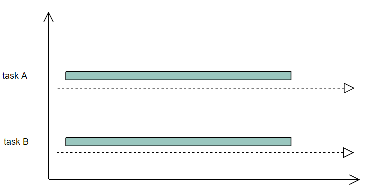

# Go 并发

## 并发概述

视频资料：[go语言并发概述.mp4](https://gacdlszkt0f.feishu.cn/wiki/XkivwoEK5i0aMMkMoqUcgyZ8nuc)

### 1.进程与线程

进程是**操作系统**进行资源分配和隔离的基本单位，每个进程拥有独立的虚拟地址空间；它是程序在操作系统的一次执行过程，是一个程序的动态概念，进程是操作系统**分配**资源的基本单位。

线程是 **CPU 调度**的基本单位，是进程中的执行实体。它是比进程粒度更小的执行单元，也是真正运行在cpu上的执行单元，线程是CPU**调度**资源的基本单位。**它与同一进程中的其他线程共享相同的内存空间和系统资源。**

进程中可以包含多个线程，这些线程共享进程的地址空间和资源，但拥有各自的栈和寄存器上下文。

进程之间相互隔离，通信需要通过 IPC 机制；线程之间可以直接通过共享变量通信。

由于进程切换需要切换地址空间，因此开销更大，而线程切换通常只涉及上下文保存，成本较低。

==**需要记住进程和线程一个是操作系统分配资源的基本单位(进程)，一个是操作系统调度资源的基本单位(线程)。进程解决“资源隔离”，线程解决“执行并发” （并发的本质是多个执行流的交替或并行运行，而线程正是执行流的抽象。）。**==

### 2.协程

**协程可以理解为用户态线程，是更微量级的线程。**区别于线程，协程的调度在用户态进行，不需要切换到内核态，所以不由操作系统参与，由用户自己控制。（用户态和（内核态 - 可直接访问硬件或执行特权指令）是 CPU 的两种运行级别，用来实现权限隔离。应用程序会在这两个mode之间切换）。在一些支持协程高级语言中，往往这些语言都实现了自己的协程调度器，比如go语言就有自己的协程调度器，这个会在后面专门讲协程调度原理的时候讲。

**协程有独立的栈空间，但是共享堆空间。**

**一个进程上可以跑多个线程，一个线程上可以跑多个协程**

### 3.并行与并发

很多时候大家对于并行和并发的概念还比较模糊，其实只需要根据一点来判断即可，能不能同时运行。**两个任务能同时运行就是并行，不能同时运行，而是每个任务执行一小段，交叉执行，这种模式就是并发。**



图3.1 并行

.PNG)

图3.2 并发

如图3.1所示，两个任务一直运行，切实同时运行着，这就是并行模式，要注意**并行的话一定要有多个核的支持**，因为只有一个cpu的话，同一时间只能跑一个任务，如图3.2所示，两个任务，每次只执行一小段，这样交叉的执行，就是并发模式，并发模式在单核cpu上是可以完成的


## Goroutine

视频资料：[go语言协程.mp4](https://gacdlszkt0f.feishu.cn/wiki/EGGdwYJRhi869dkpyZUc7lk4nRd)

goroutine就是go语言对于协程（coroutine）的支持，可以把它理解为go语言的协程。这是一个go语言并发编程的终极杀器，它让我们的并发编程变得简单。

go语言的并发只会用到goroutine，并不需要我们去考虑用多进程或者是多线程。有过c++或者java经验的同学可能知道，线程本身是有一定大小的，一般OS线程栈大小为**2MB**，且线程在创建和上下文切换的时候是需要消耗资源的，会带来性能损耗，所以在我们用到多线程技术的时候，我们往往会通过池化技术，即创建线程池来管理一定数量的线程。

在go语言中，一个goroutine栈在其生命周期开始时占用空间很小（一般2KB），并且栈大小可以按需增大和缩小，goroutine的栈大小限制可以达到1GB，但是一般不会用到这么大。所以在Go语言中一次创建成千上万，甚至十万左右的goroutine理论上也是可以的。

在go语言中，我们用多goroutine来完成并发，在某个任务需要并发执行的时候，只需要把这个任务包装成一个函数，开启一个goroutine去执行这个函数就可以了。并不需要我们来维护一个类似于线程池的东西，也不需要我们去关心协程是怎么切换和调度的，因为这些都已经有go语言内置的调度器帮我们做了，并且效率还非常高。

### Goroutine使用

goroutine使用起来非常方便，通常我们会将需要并发的任务封装成一个函数，然后再该函数前加上go关键字就行了，这样就开启了一个goroutine。

```go
func()
go func()  // 会并发执行这个函数
```

### 主协程

和其它语言一样，go程序的入口也是main函数。在程序开始执行的时候，Go程序会为main()函数创建一个默认的goroutine，我们称之为主协程，我们后来人为的创建的一些goroutine，都是在这个主goroutine的基础上进行的。

下面请看个例子：

```go
package main

import "fmt"

func myGroutine() {
		fmt.Println("myGroutine")
}

func main() {
		go myGroutine()
		fmt.Println("end!!!")
}
```

运行结果：

````go
end!!!
````

很奇怪，明明是多协程任务，为什么只打印了主协程里的"end！！！"，而没有打印我们开启的协程里的输出"myGroutine"，按理不是应该都打印出来吗？

这是因为：当main()函数返回的时候该goroutine就结束了，当主协程退出的时候，其他剩余的协程不管是否运行完，都会跟着结束。所以，这里主协程打印完"end！！！"之后就退出了，myGroutine协程可能还没运行到 fmt.Println("myGroutine") 语句也跟着退出了。

接下来我们让主 goroutine 执行完 fmt.Println("end!!!") 之后不立刻退出，而是等待2s，看一下运行结果：

````go
package main

import (
 "fmt"
 "time"
)

func myGroutine() {
        fmt.Println("myGroutine")
}

func main() {
        go myGroutine()
        fmt.Println("end!!!")
        time.Sleep(2*time.Second)
}
````

运行结果：

````go
end!!!
myGroutine
````

此时打印出了我们想要的结果，这里我们通过让主协程睡眠2s来等待子协程执行完了之后再退出，后面我们会学习到更好的方法，这里就不再过多阐述。

### 多协程调用

````go
package main

import (
	"fmt"
	"sync"
	"time"
)

func myGoroutine(name string, wg *sync.WaitGroup) {
	defer wg.Done()

	for i := 0; i < 5; i++ {
		fmt.Printf("myGoroutine %s\n", name)
		time.Sleep(10 * time.Millisecond)
	}
}

func main() {
	var wg sync.WaitGroup

	wg.Add(2)

	go myGoroutine("goroutine1", &wg)
	go myGoroutine("goroutine2", &wg)

	wg.Wait()
}
````

运行结果：

````go
myGoroutine goroutine2
myGoroutine goroutine1
myGoroutine goroutine1
myGoroutine goroutine2
myGoroutine goroutine1
myGoroutine goroutine2
myGoroutine goroutine2
myGoroutine goroutine1
myGoroutine goroutine1
myGoroutine goroutine2
````

