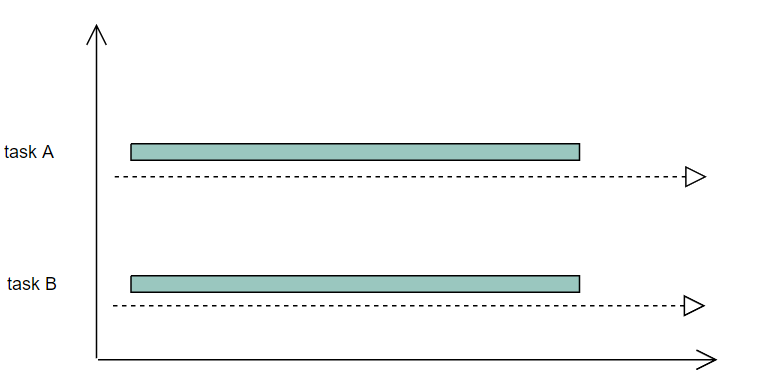
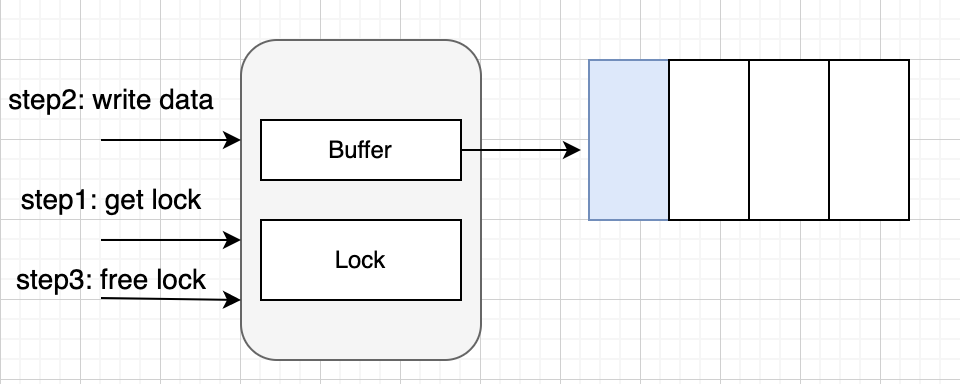
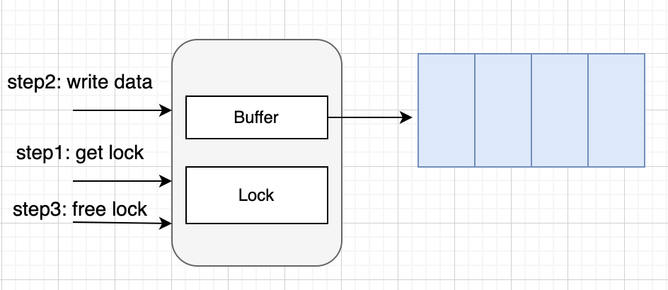

# Go 并发

## 并发概述

视频资料：[go语言并发概述.mp4](https://gacdlszkt0f.feishu.cn/wiki/XkivwoEK5i0aMMkMoqUcgyZ8nuc)

### 1.进程与线程

**进程解决“资源隔离”，线程解决“并发执行”。**

进程是**操作系统**进行资源分配和隔离的基本单位，每个进程拥有独立的虚拟地址空间；它是程序在操作系统的一次执行过程，是一个程序的动态概念，进程是操作系统**分配**资源的基本单位。

线程是 **CPU 调度**的基本单位，是进程中的执行实体。它是比进程粒度更小的执行单元，也是真正运行在cpu上的执行单元，线程是CPU**调度**资源的基本单位。**它与同一进程中的其他线程共享相同的内存空间和系统资源。**

进程中可以包含多个线程，这些线程共享进程的地址空间和资源，但拥有各自的栈和寄存器上下文。

进程之间相互隔离，通信需要通过 IPC 机制；线程之间可以直接通过共享变量通信。

由于进程切换需要切换地址空间，因此开销更大，而线程切换通常只涉及上下文保存，成本较低。

==**需要记住进程和线程一个是操作系统分配资源的基本单位(进程)，一个是操作系统调度资源的基本单位(线程)。进程解决“资源隔离”，线程解决“执行并发” （并发的本质是多个执行流的交替或并行运行，而线程正是执行流的抽象。）。**==

### 2.协程

**协程可以理解为用户态线程，是更微量级的线程。**区别于线程，协程的调度在用户态进行，不需要切换到内核态，所以不由操作系统参与，由用户自己控制。（用户态和（内核态 - 可直接访问硬件或执行特权指令）是 CPU 的两种运行级别，用来实现权限隔离。应用程序会在这两个mode之间切换）。在一些支持协程高级语言中，往往这些语言都实现了自己的协程调度器，比如go语言就有自己的协程调度器，这个会在后面专门讲协程调度原理的时候讲。

**协程有独立的栈空间，但是共享堆空间。**

==**一个进程上可以跑多个线程，一个线程上可以跑多个协程**==

### 3.并行与并发

很多时候大家对于并行和并发的概念还比较模糊，其实只需要根据一点来判断即可，能不能同时运行。**两个任务能同时运行就是并行，不能同时运行，而是每个任务执行一小段，交叉执行，这种模式就是并发。**



图3.1 并行

.PNG)

图3.2 并发

如图3.1所示，两个任务一直运行，切实同时运行着，这就是并行模式，要注意**并行的话一定要有多个核的支持**，因为只有一个cpu的话，同一时间只能跑一个任务，如图3.2所示，两个任务，每次只执行一小段，这样交叉的执行，就是并发模式，并发模式在单核cpu上是可以完成的


## Goroutine

视频资料：[go语言协程.mp4](https://gacdlszkt0f.feishu.cn/wiki/EGGdwYJRhi869dkpyZUc7lk4nRd)

goroutine就是go语言对于协程（coroutine）的支持，可以把它理解为go语言的协程。这是一个go语言并发编程的终极杀器，它让我们的并发编程变得简单。

go语言的并发只会用到goroutine，并不需要我们去考虑用多进程或者是多线程。有过c++或者java经验的同学可能知道，线程本身是有一定大小的，一般OS线程栈大小为**2MB**，且线程在创建和上下文切换的时候是需要消耗资源的，会带来性能损耗，所以在我们用到多线程技术的时候，我们往往会通过**池化技术，即创建线程池**来管理一定数量的线程。

在go语言中，一个goroutine栈在其生命周期开始时占用空间很小（一般2KB），并且栈大小可以按需增大和缩小，goroutine的栈大小限制可以达到1GB，但是一般不会用到这么大。所以在Go语言中一次创建成千上万，甚至十万左右的goroutine理论上也是可以的。

在go语言中，我们用多goroutine来完成并发，在某个任务需要并发执行的时候，只需要把这个任务包装成一个函数，开启一个goroutine去执行这个函数就可以了。并不需要我们来维护一个类似于线程池的东西，也不需要我们去关心协程是怎么切换和调度的，因为这些都已经有go语言内置的调度器帮我们做了，并且效率还非常高。

### Goroutine使用

goroutine使用起来非常方便，通常我们会将需要并发的任务封装成一个函数，然后再该函数前加上go关键字就行了，这样就开启了一个goroutine。

```go
func()
go func()  // 会并发执行这个函数
```

### 主协程

和其它语言一样，go程序的入口也是main函数。在程序开始执行的时候，Go程序会为main()函数创建一个默认的goroutine，我们称之为主协程，我们后来人为的创建的一些goroutine，都是在这个主goroutine的基础上进行的。

下面请看个例子：

```go
package main

import "fmt"

func myGroutine() {
		fmt.Println("myGroutine")
}

func main() {
		go myGroutine()
		fmt.Println("end!!!")
}
```

运行结果：

````go
end!!!
````

很奇怪，明明是多协程任务，为什么只打印了主协程里的"end！！！"，而没有打印我们开启的协程里的输出"myGroutine"，按理不是应该都打印出来吗？

这是因为：当main()函数返回的时候该goroutine就结束了，**==当主协程退出的时候，其他剩余的协程不管是否运行完，都会跟着结束。==**所以，这里主协程打印完"end！！！"之后就退出了，myGroutine 协程可能还没运行到 fmt.Println("myGroutine") 语句也跟着退出了。

接下来我们让主 goroutine 执行完 fmt.Println("end!!!") 之后不立刻退出，而是等待2s，看一下运行结果：

````go
package main

import (
 "fmt"
 "time"
)

func myGroutine() {
        fmt.Println("myGroutine")
}

func main() {
        go myGroutine()
        fmt.Println("end!!!")
        time.Sleep(2*time.Second)
}
````

运行结果：

````go
end!!!
myGroutine
````

此时打印出了我们想要的结果，这里我们通过让主协程睡眠2s来等待子协程执行完了之后再退出，后面我们会学习到更好的方法，这里就不再过多阐述。

### 多协程调用

````go
package main

import (
	"fmt"
	"sync"
	"time"
)

func myGoroutine(name string, wg *sync.WaitGroup) {
	defer wg.Done()

	for i := 0; i < 5; i++ {
		fmt.Printf("myGoroutine %s\n", name)
		time.Sleep(10 * time.Millisecond)
	}
}

func main() {
	var wg sync.WaitGroup

	wg.Add(2)

	go myGoroutine("goroutine1", &wg)
	go myGoroutine("goroutine2", &wg)

	wg.Wait()
}
````

这个程序做了三件事：

1. 启动两个 **goroutine（协程）**
2. 每个 goroutine 打印 5 次内容
3. 用 **WaitGroup（等待组）** 等待两个 goroutine 执行完再退出

运行结果：

````go
myGoroutine goroutine2
myGoroutine goroutine1
myGoroutine goroutine1
myGoroutine goroutine2
myGoroutine goroutine1
myGoroutine goroutine2
myGoroutine goroutine2
myGoroutine goroutine1
myGoroutine goroutine1
myGoroutine goroutine2
````


## Channel

视频资料：[go语言channel.mp4](https://gacdlszkt0f.feishu.cn/wiki/XhLbwZeIWiYPCTklTmecFN3kn6f)

上一节我们知道可以通过go关键字来开启一个goroutine，我们的样例代码逻辑很简单，都是在各个goroutine各自处理自己的逻辑，但有时候我们需要不同的goroutine之间能够通信，这里就要用到channel。

### Channel是什么

官方定义：Channels are a typed conduit through which you can send and receive values with the channel operator

**==Channel是一个可以收发数据的管道==**

### channel初始化

channel的声明方式如下：

````go
var channel_name chan channel_type // 这里的channel_type指的是各种数据类型 比如 int
var channel_name [size]chan channel_type  // 声明一个channel，其容量大小为size
````

声明之后的管道，并没有进行初始化为其分配空间，其值是nil，我们要使用还要配合make函数来对其初始化，之后才可以在程序中使用该管道。

````go
channel_name = make(chan channel_type)
channel_name = make(chan channel_type, size)
````

**或者我们可以直接一步完成**

````go
channel_name := make(chan channel_type)
channel_name := make(chan channel_type, size)  //创建带有缓存的管道，size为缓存大小
````


### channel操作

传递数据：

````go
ch := make(chan int)         // 创建一个管道ch
ch <- v                      // 向管道ch中发送数据v.
v := <-ch                    // 从管道中读取数据存储到变量v
close(ch)                    // 关闭管道ch
````

在这里需要注意 `close(ch)` 这个操作，管道用完了，需要对其进行关闭，避免程序一直在等待以及资源的浪费。但是关闭的管道，仍然可以从中接收剩余的数据，在此之后接收到的的数据永远是零值。

看下面例子：

````go
package main

import (
   "fmt"
   "time"
)

func main() {
   ch := make(chan int, 5)
   ch <- 1
   close(ch)
   go func() {
      for i := 0; i < 5; i++ {
         v := <-ch
         fmt.Printf("v=%d\n", v)
      }
   }()
   time.Sleep(2 * time.Second)
}
````

运行结果：

````go
v=1
v=0
v=0
v=0
v=0
````

创建一个缓存为5的int类型的管道，向管道里写入一个1之后，将管道关闭，然后开启一个gortoutine从管道读取数据，读取5次，可以看到即便管道关闭之后，他仍然可以读取数据，**在==读完==数据之后，将一直读取零值。**

但是，上述读取方式还有一个问题？比如我们创建一个int类型的channel，我们需要往里面写入零值，用另一个goroutine读取，此时我们就无法区分读取到的是正确的零值还是数据已经读去完了而读取到的零值。

所以我们一般用以下两种常用的读取方式：

#### 判定读取

还是以上面的例子来看，稍作修改

````go
package main

import (
    "fmt"
    "time"
)

func main() {
    ch := make(chan int, 5)
    ch <- 1
    close(ch)
    go func() {
       for i := 0; i < 5; i++ {
          v, ok := <-ch // 判断句式读取
          if ok {
             fmt.Printf("v=%d\n", v)
          } else {
             fmt.Printf("channel数据已读完，v=%d\n", v)
          }
       }
    }()
    time.Sleep(2 * time.Second)
}
````

运行结果：

```go
v=1
channel数据已读完，v=0
channel数据已读完，v=0
channel数据已读完，v=0
channel数据已读完，v=0
```

在读取channel数据的时候，用ok局势做了判断，当管道内还有数据能读取的时候，ok为true，当管道关闭后，ok为false。

#### For range读取

在上面例子中，我们明确了读取的次数是5次，但是我们往往在更多的时候，是不明确读取次数的，只是在Channel的一段读取数据，有数据我们就读，直到另一段关闭了这个channel，这样就可以用for range这种优雅的方式来读取channel中的数据了

````go
package main

import (
   "fmt"
   "time"
)

func main() {
   ch := make(chan int, 5)
   ch <- 1
   ch <- 2
   close(ch)
   go func() {
      for v := range ch {
         fmt.Printf("v=%d\n", v)
      }
   }()
   time.Sleep(2 * time.Second)
}
````

运行结果：

````go
v=1
v=2
````

主goroutine往channel里写了两个数据1和2，然后关闭，子channel也只能读取到1和2。这里在主goroutine关闭了channel之后，子goroutine里的for range循环才会结束。

### 双向channel和单向channel

channel根据其功能又可以分为双向channel和单向channel，双向channel即可发送数据又可接收数据，单向channel要么只能发送数据，要么只能接收数据。**注意，单向 channel 是对于一个channel的==类型限制==，channel 本体必须是“双向”，单向只是“使用视角（view）。**

**定义单向读 channel**

````go
var ch = make(chan int) 	// 双向
type RChannel = <-chan int    // 定义只读类型
var rec RChannel = ch 	// 双向 → 单向（合法转换）
````

**定义单向写 channel**

```go
var ch = make(chan int)
type SChannel = chan<- int  // 定义类型
var send SChannel = ch
```

注意写channel与读channel在定义的时候只是 <- 的位置不同，前者在chan关键字后面，后者在chan关键字前面。

**允许：双向 → 单向**

```go
ch := make(chan int)

var sendOnly chan<- int = ch
var recvOnly <-chan int = ch
```

**不允许：单向 → 双向**

```go
var ch chan<- int
var full chan int = ch  // ❌ 编译错误
```

代码示例：

```go
import (
    "fmt"
    "time"
)

type SChannel = chan<- int
type RChannel = <-chan int

func main() {
    var ch = make(chan int)  //  创建channel

    go func() {
        var send SChannel = ch
        fmt.Println("send: 100")
        send <- 100
    }()

    go func() {
        var rec RChannel = ch
        num := <- rec 
        fmt.Printf("receive: %d", num)
    }()
    time.Sleep(2*time.Second)
}
```

运行结果：

```g0
send: 100
receive: 100
```

创建一个channel ch，分别定义两个单向channel类型SChannel 和RChannel ，根据别名类型给ch定义两个别名send和rec，一个只用于发送，一个只用于读取。


### 解决什么问题？

Channel非常重要，Golang中有个重要思想：

不以共享内存来通信，而以通信来共享内存。

说得更直接点，协程之间可以利用Channel来传递数据，如下的例子，可以看出父子协程如何通信的，父协程通过Channel拿到了子协程执行的结果。

````go
package main

import (
        "fmt"
        "time"
)

func sum(s []int, c chan int) {
        sum := 0
        for _, v := range s {
                sum += v
        }
        c <- sum // send sum to c
}

func main() {
        s := []int{7, 2, 8, -9, 4, 0}

        c := make(chan int)
        go func() {
                sum(s[:len(s)/2], c)
                //time.Sleep(1 * time.Second)
        }()
        go sum(s[len(s)/2:], c)
        x, y := <-c, <-c // receive from c

        fmt.Println(x, y, x+y)
}
````

运行结果：

```go
-5 17 12
```

channel 又分为两类：有缓冲 channel 和无缓冲 channel，这个在前面的代码示例中也有简单的描述了。为了协程安全，无论是有无缓冲的 channel，内部都会有一把锁来控制并发访问。

同时 channel 底层一定有一个队列，来存储数据。

无缓冲 channel 可以理解为同步模式，即写入一个，如果没有消费者在消费，写入就会阻塞。

有缓冲 channel 可以理解为异步模式。即写入消息之后，即使还没被消费，只要队列没满，就可继续写入。如图所示：



这里可能会问，如果有缓冲 channel 队列满了，那不就退化到同步了么 (无缓冲) ？是的，如果队列满了，发送还是会阻塞。



但是我们来反向思考下，如果有缓冲 channel 长期都处于满队列情况，那何必用有缓冲。所以预期在正常情况下，有缓冲 channel 都是异步交互的。

#### 扩展

上面说了当缓冲队列满了以后，继续往channel里面写数据，就会阻塞，那么利用这个特性，我们可以实现一个goroutine之间的锁。（对并发安全比较模糊的可以把后面sync小节看完再来看这里）

直接看示例

```go
package main

import (
   "fmt"
   "time"
)

func add(ch chan bool, num *int) {
   ch <- true
   *num = *num + 1
   <-ch
}

func main() {
   // 创建一个size为1的channel
   ch := make(chan bool, 1)

   var num int
   for i := 0; i < 100; i++ {
      go add(ch, &num)
   }

   time.Sleep(2)
   fmt.Println("num 的值：", num)
}
```

运行结果：

````go
num 的值： 100
````

ch <- true和<- ch就相当于一个锁，将 \*num = \*num + 1这个操作锁住了。因为ch管道的容量是1，在每个add函数里都会往channel放置一个true，直到执行完+1操作之后才将channel里的true取出。由于channel的size是1，所以当一个goroutine在执行add函数的时候，其他goroutine执行add函数，执行到ch <- true的时候就会阻塞，*num = *num + 1不会成功，直到前一个+1操作完成，<-ch，读出了管道的元素，这样就实现了并发安全

### 关于channel的几点总结

- **关闭一个未初始化的 channel 会产生 panic**
- **channel只能被关闭一次，对同一个channel重复关闭会产生 panic**
- **向一个已关闭的 channel 发送消息会产生 panic**
- **从一个已关闭的channel读取消息不会发生panic，会一直读取所有数据，直到零值**
- **channel可以读端和写端都可有多个goroutine操作，在一端关闭channel的时候，该channel读端的所有goroutine 都会收到channel已关闭的消息**
- **channel是并发安全的，多个goroutine同时读取channel中的数据，不会产生并发安全问题**

channel的在我们的并发编程中发挥着巨大作用，使用起来也很方便，关于channel的具体实现原理我们还在后面专门的一章原理篇中介绍，本节就只介绍channel的具体用法。


