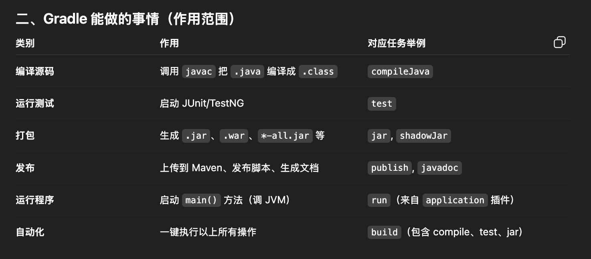

# Gradle Learning



**为什么我们要 build 成 JAR，用户拿到它之后怎么在自己的代码里用它？**

**一、先说结论（高层理解）**

> 我们 build 出的 **`checker-all.jar`** 就是 **Checker Framework 工具本体**。
>  它不是给我们自己内部调试用的，而是让任何用户（开发者）都能：
>
> - 在他们自己的代码上使用我们的 Checker；
> - 通过 **JVM + javac + annotation processor** 配合运行；
> - 在编译阶段检查出潜在的类型错误（比如空指针问题）。

换句话说，Checker Framework 并不是一个“运行时库”，
 而是一个“编译期分析器”。
 JAR 就是它的“可安装形式”。

------

**二、我们 build jar 的意义（研究者视角）**

当你在项目里运行：

```bash
./gradlew :checker:shadowJar
```

Gradle 会打包：

- 所有 Checker Framework 模块（`framework`, `checker`, `dataflow`, `javacutil`）
- 所有依赖（`guava`, `plume-util`, `error-prone` 等）
- 以及 Checker Framework 的注册入口（`META-INF/services/javax.annotation.processing.Processor`）

生成：

```
checker/build/libs/checker-all.jar
```

这个文件就是一个 **“可分发工具”**：

- 其他开发者只要下载这个 jar；
- 不需要安装 Gradle；
- 也不需要源码；
- 就能直接在他们自己的项目里用我们的 Checker。

------

**三、普通用户怎么用（用户视角）**

假设一个用户有以下代码：

```java
import org.checkerframework.checker.nullness.qual.NonNull;

public class Example {
    void greet(@NonNull String name) {
        System.out.println(name.toUpperCase());
    }

    void test() {
        greet(null); // ❌ 这里明显传入 null
    }
}
```

用户只需要运行一条命令，就能用我们 build 的 jar 检查出问题：

```bash
javac -processorpath checker-all.jar \
      -processor org.checkerframework.checker.nullness.NullnessChecker \
      Example.java
```

输出：

```
Example.java:9: error: [argument.type.incompatible] incompatible types in argument.
found   : @Nullable null
required: @NonNull String
        greet(null);
              ^
```

**这就是我们的 jar 和用户代码、JVM 的协同效果。**

------

**四、内部机制：Checker Framework 如何与 javac / JVM 协作**

**1️⃣ javac 的角色**

- javac 是标准 Java 编译器；

- 它支持 **Annotation Processing API (JSR 269)**；

- 它会在编译时扫描类路径中的 jar 文件，寻找所有实现了：

  ```java
  javax.annotation.processing.Processor
  ```

  的类。

**2️⃣ checker-all.jar 的角色**

- jar 里包含了 NullnessChecker 等 Processor 实现；
- jar 还在 `META-INF/services/javax.annotation.processing.Processor` 里注册了这些类；
- 所以 javac 在编译时自动加载并运行这些 Processor；
- Processor 会对用户的 AST（抽象语法树）进行分析，检查注解是否符合类型规则。

**3️⃣ JVM 的角色**

- JVM 并不直接执行 checker；
- 它只执行 javac（编译器），而 javac 会在 JVM 中运行我们的 jar；
- 因此整个 Checker Framework 是“在编译阶段运行的 Java 程序”，由 JVM 执行。

流程如下：

```
User code ───► javac ───► (loads checker-all.jar processors) ───► performs analysis ───► errors/warnings
```

------

**五、我们 build jar 的两层意义（研发角度）**

| 层面       | 目的                                            | 典型使用者             |
| ---------- | ----------------------------------------------- | ---------------------- |
| **发布层** | 提供一个通用的静态分析工具包（checker-all.jar） | 普通用户、其他研究人员 |
| **研究层** | 生成可运行的版本供 benchmark / harness 调用     | 研究者、性能分析工具   |

例如你在 URA 中的 `harness-driver` 就会：

1. 调用 `javac`；
2. 指定 `--processorpath checker-all.jar`；
3. 编译多组 benchmark；
4. 统计运行时性能（分析 type-checking 的时间、内存等）。

------

**六、示意图：checker-all.jar 如何与用户代码/JVM 协作**

```
            ┌────────────────────────────────┐
            │          用户代码              │
            │   Example.java (@NonNull)      │
            └──────────────┬─────────────────┘
                           │
                           ▼
┌─────────────────────────────────────────────────────────┐
│ javac 编译器                                             │
│  ├─ 读取用户源码 → 构建 AST                              │
│  ├─ 从 --processorpath 加载 checker-all.jar               │
│  ├─ 调用 NullnessChecker.process()                        │
│  └─ 报告编译期错误                                       │
└─────────────────────────────────────────────────────────┘
                           │
                           ▼
                （JVM 在编译时执行 Checker）
```

------

**七、总结归纳**

| 对象                | 职责                                 | 举例                                                  |
| ------------------- | ------------------------------------ | ----------------------------------------------------- |
| **Gradle**          | 构建与打包                           | `./gradlew :checker:shadowJar` 生成 `checker-all.jar` |
| **checker-all.jar** | 可执行的 Checker Framework 工具      | 包含所有 Checker 实现                                 |
| **javac**           | 编译用户代码，调用 checker-all.jar   | `javac -processorpath checker-all.jar ...`            |
| **JVM**             | 执行 javac 与 Checker Framework 逻辑 | 实际运行时环境                                        |
| **用户代码**        | 被检查的目标                         | 含有 `@NonNull`, `@Nullable` 等注解                   |

**一句话总结：**

> build jar 的意义是：
>  把 Checker Framework 编译成一个可以被任意用户直接加载和使用的编译期插件。
>  用户的代码在 javac 编译时，通过 JVM 执行 jar 内的 Checker 逻辑，从而实现静态分析。


## 1. Gradle 构建模型（Project/Task/生命周期）

### Project（工程/子工程）

- 含义：Gradle 的最小管理单元。一个仓库可以有 1 个根 Project 和多个子 Project（多模块）。每个 Project 有自己的 `build.gradle`。

- 作用：决定“这个模块怎么编译、打包、测试”；声明依赖和插件；暴露一组可执行的任务（Task）。

- 例子（单模块）：

  ```
  hello/
  ├─ settings.gradle     # rootProject.name = 'hello'
  ├─ build.gradle        # 本模块的构建脚本
  └─ src/main/java/App.java
  ```

  `settings.gradle`

  ```groovy
  rootProject.name = 'hello'
  ```

  `build.gradle`

  ```groovy
  plugins { id 'application' }
  application { mainClass = 'App' }
  ```

  运行：

  ```
  ./gradlew run
  ```

- 例子（多模块，与 harness 对应）：

  ```
  harness/
  ├─ settings.gradle                       # include 'harness-core','harness-generators','harness-driver-cli'
  ├─ harness-core/build.gradle
  ├─ harness-generators/build.gradle
  └─ harness-driver-cli/build.gradle
  ```

  `settings.gradle`

  ```groovy
  rootProject.name = 'harness'
  include 'harness-core','harness-generators','harness-driver-cli'
  ```

  运行：

  ```
  ./gradlew -p harness :harness-driver-cli:run
  ```

------

### Task（任务/可执行节点）

- 含义：Gradle 执行的基本动作（如 `compileJava`、`test`、`jar`、`run`、`shadowJar`）。任务之间通过依赖形成有向无环图（DAG）。

- 关键点：

  - 任务可以声明输入/输出，Gradle 用它们做增量与 up-to-date 检查（没变就跳过）。
  - 任务可以互相依赖，Gradle 会自动按依赖顺序执行。

- 例子：自定义任务生成源码并让 `compileJava` 依赖它

  ```groovy
  // build.gradle
  tasks.register('generateSources') {
    outputs.dir("$buildDir/generated")
    doLast {
      def out = file("$buildDir/generated/Hello.java")
      out.parentFile.mkdirs()
      out.text = '''
        public class Hello { public static void main(String[] a){ System.out.println("hi"); } }
      '''
    }
  }
  
  sourceSets {
    main { java.srcDir("$buildDir/generated") }
  }
  
  tasks.named('compileJava') {
    dependsOn('generateSources')
  }
  ```

  运行：

  ```
  ./gradlew build         # 会先跑 generateSources，再跑 compileJava、jar 等
  ./gradlew build         # 第二次若输入没变，会显示 UP-TO-DATE，直接跳过
  ```

- harness 里的现实对应：

  - `:harness-driver-cli:run` 依赖本模块 `classes`，而 `classes` 又依赖 `compileJava`。因此执行 `run` 会自动先编译 core/generators，再启动 CLI。

------

### 生命周期（Initialization → Configuration → Execution）

- **Initialization（初始化）**
   读取当前构建根的 `settings.gradle`，确定有哪些 Project 参与本次构建。
   例：在 `harness/` 下运行会只包含三个子模块；在仓库根运行会包含根项目声明的全部模块。
- **Configuration（配置）**
   解析每个 Project 的 `build.gradle`，创建所有 Task，并建立任务依赖图（此时仍不执行）。
   例：Gradle 发现 `compileJava` 依赖 `generateSources`，`run` 依赖 `classes`，把它们连成 DAG。
- **Execution（执行）**
   根据你请求的任务（如 `run`、`build`），挑出需要的子图并按依赖顺序执行；利用输入/输出判断是否 `UP-TO-DATE` 或从缓存还原。
   例：`./gradlew -p harness :harness-driver-cli:run` 会执行：
  1. `:harness-core:compileJava` → `:harness-core:classes`
  2. `:harness-generators:compileJava` → `:harness-generators:classes`
  3. `:harness-driver-cli:compileJava` → `:harness-driver-cli:classes`
  4. `:harness-driver-cli:run`

------

### 小结（把三者连起来）

- **Project** 定义模块边界与构建规则；
- **Task** 是模块内的可执行操作，通过依赖组成任务图；
- **生命周期** 决定 Gradle 先“识别模块”（初始化），再“搭建任务图”（配置），最后“按依赖执行并做增量”（执行）。

掌握这三个概念后，你就能读懂任何 Gradle 输出：看到的都是“哪个 Project 的哪个 Task 在生命周期的哪一阶段被创建或执行”。


## 2. Gradle Wrapper（版本固定与调用方式）

### 什么是 Gradle Wrapper

Gradle Wrapper（简称 Wrapper）==**是一组随项目提交到仓库的启动脚本与配置**==，用来在任何机器与 CI 上以**固定版本的 Gradle**运行构建命令，而不依赖本机已安装的 Gradle。

------

### 为什么需要 Wrapper（版本固定的价值）

- **版本锁定**：团队与 CI 使用同一 Gradle 版本，避免“我机器能过你机器不过”。
- **零预安装**：新环境无需安装 Gradle，直接 `./gradlew …`。
- **可复现构建**：版本差异导致的插件/DSL行为变化被消除。

------

### Wrapper 包含哪些文件

- `gradlew`（Unix/Mac 启动脚本）
- `gradlew.bat`（Windows 启动脚本）
- `gradle/wrapper/gradle-wrapper.jar`（下载器）
- `gradle/wrapper/gradle-wrapper.properties`（**版本与分发地址**配置）

以上文件应提交到版本库；`.gradle/` 与各模块 `build/` 不应提交。

------

### 版本是如何被“固定”的

`gradle/wrapper/gradle-wrapper.properties` 指定分发包与版本，例如：

```
distributionUrl=https\://services.gradle.org/distributions/gradle-8.9-bin.zip
```

当你运行 `./gradlew` 时，Wrapper 会按此地址**自动下载并缓存**对应版本，然后用它执行构建。

------

### 如何生成或升级 Wrapper

- **生成**（在项目根执行，一般项目初始化时做一次）：

```
gradle wrapper --gradle-version 8.9
```

或（推荐）用已存在的 Wrapper 升级：

```
./gradlew wrapper --gradle-version 8.9
```

- **升级**：同上命令改版本号即可；提交被更新的 wrapper 文件。

------

### 正确的调用方式

- **总是**在项目根用：

```
./gradlew build
./gradlew test
./gradlew :subproject:tasks
```

- **指定子工程目录作为构建根**（适合你的 harness 独立子构建）：

```
./gradlew -p checker/harness build
./gradlew -p checker/harness :harness-driver-cli:run --args="..."
```

或在 `checker/harness` 目录下直接使用**相对路径**调用根 wrapper：

```
../../gradlew :harness-driver-cli:run --args="..."
```

------

### 与“本机 gradle 命令”的区别

- `gradle …` 使用本机已安装版本，容易与团队/CI不一致。
- `./gradlew …` 使用项目固定版本，**应当始终优先使用**。

------

### 在 CI 中如何使用 Wrapper

CI 脚本只需：

```
./gradlew build --no-daemon
```

无需安装 Gradle。可结合缓存配置加速 Gradle 分发包与依赖缓存。

------

### 常见问题与排查

- **`zsh: no such file or directory: ./gradlew`**
   说明当前目录没有 wrapper；到项目根执行，或用 `-p` 指定项目根；或先生成子目录 wrapper：
   `./gradlew -p checker/harness wrapper --gradle-version 8.9`
- **权限不足（Unix/Mac）**
   `chmod +x gradlew`
- **下载缓慢或失败**
   检查网络/代理；必要时改用 `-all.zip` 或企业镜像；CI 可缓存 `~/.gradle/wrapper/dists/`。
- **升级后构建异常**
   清理再试：
   `./gradlew --stop && rm -rf .gradle build && ./gradlew build --stacktrace`

------

### 最佳实践清单

- 项目内**只用** `./gradlew`，不要用系统 `gradle`。
- Wrapper 文件加入版本库；`.gradle/` 与 `build/` 目录加入 `.gitignore`。
- 通过 `./gradlew wrapper --gradle-version X.Y` 统一升级。
- 子工程（如 `checker/harness`）可用 `-p` 或生成**自己的** wrapper，提升可用性与隔离性。


## 3. settings.gradle（多模块 include 与组合构建）

### settings.gradle 是做什么的

- 决定**这次构建的“项目树”**：有哪些子项目（subprojects）参与构建，以及它们的层级与物理目录。
- 位于**构建根目录**，Gradle 在初始化阶段首先读取它，再去配置每个项目的 `build.gradle`。
- 不在这里被 `include` 的模块，不会出现在本次构建里。

------

### 声明多模块：`include`

最常见写法（与目录同名，默认目录在当前根下）：

```groovy
rootProject.name = 'harness'
include 'harness-core', 'harness-generators', 'harness-driver-cli'
```

目录结构：

```
harness/
  settings.gradle
  harness-core/
  harness-generators/
  harness-driver-cli/
```

验证：

```
./gradlew projects
```

------

### 子项目目录不在默认位置：`projectDir`

当目录不叫同名或不在同级时，需要显式绑定：

```groovy
include 'harness-driver-cli'
project(':harness-driver-cli').projectDir = file('apps/cli')  // 指向真实目录
```

------

### 分层路径与根工程下的层级

根仓库里可按层级 include（冒号代表层级）：

```groovy
rootProject.name = 'checker-framework'
include 'checker:framework'
include 'checker:harness:harness-core'
include 'checker:harness:harness-generators'
include 'checker:harness:harness-driver-cli'
```

此时项目路径分别是：

- `:checker:framework`
- `:checker:harness:harness-core` 等

Gradle 会据此推导编译顺序与依赖可见性。

------

### 与仓库根解耦：独立子构建的 settings

把 `checker/harness` 当作**独立工程**时，在该目录放自己的 `settings.gradle`：

```groovy
// checker/harness/settings.gradle
rootProject.name = 'harness'
include 'harness-core', 'harness-generators', 'harness-driver-cli'
```

随后运行：

```
./gradlew -p checker/harness :harness-driver-cli:run
```

这不会影响仓库根的项目树。

------

### 组合构建（Composite Builds）：`includeBuild`

在**不发布到本地仓库**的情况下，把另一个 Gradle 工程直接“接进来”，实现源码级依赖替换（常用于联动上层 CF）：

```groovy
// 在 checker/harness/settings.gradle
rootProject.name = 'harness'
include 'harness-core', 'harness-generators', 'harness-driver-cli'

// 引入上层工程作为参与构建的“外部构建”
includeBuild('../../')  // 把仓库根接入当前构建
```

效果：`harness` 中对 `project(':checker:framework')` 的依赖将解析到被 include 的外部构建源代码，而非已发布的 jar。常用于“改 CF 同时跑 harness”。

------

### 集中管理插件与仓库：`pluginManagement` 与 `dependencyResolutionManagement`

在 settings 里统一插件与依赖仓库，避免各子项目重复配置：

```groovy
pluginManagement {
  repositories { gradlePluginPortal(); mavenCentral() }
}
dependencyResolutionManagement {
  repositoriesMode.set(RepositoriesMode.FAIL_ON_PROJECT_REPOS)
  repositories { mavenCentral() }
}
```

这样所有子项目默认用这些仓库与策略。

------

### 改名与路径映射：`name` 与 `projectDir`

你可以给物理目录取一个更“简洁”的工程名：

```groovy
include 'core'
project(':core').name = 'harness-core'                 // 逻辑名
project(':harness-core').projectDir = file('h-core')   // 物理目录
```

一般不建议过度使用；清晰一致最重要。

------

### 常见排错与操作顺序

- 修改了 `settings.gradle` 后，若出现项目识别异常或缓存脏：

  ```
  rm -rf .gradle build
  ./gradlew --stop
  ./gradlew projects
  ```

- 报 “Project with path … not found”：检查 `include` 路径是否与依赖引用一致（冒号层级、拼写）。

- 报 “A project with path … already exists”：重复 include 或 name 冲突。

- 用 `./gradlew projects` 确认项目树，用 `./gradlew :sub:tasks` 看具体子项目任务。

------

### 与 harness 场景的推荐用法

- **MVP 阶段**（独立、零侵入）：在 `checker/harness/` 放独立 `settings.gradle`，仅 include 三个 harness 子项目；通过 `--processor-path` 指向根构建产出的 `*-all.jar`。
- **深度联动阶段**（源码级联动）：在 `checker/harness/settings.gradle` 里增加 `includeBuild('../../')`，让 harness 直接依赖根工程源码；或把 harness 子项目直接并入根 `settings.gradle` 的 `checker:harness:*` 层级。

这就是 `settings.gradle` 在多模块与组合构建中的职责与用法：**定义项目树、定位项目目录、选择独立还是联动的构建边界，并集中管理全局的插件与仓库解析策略**。


## 4. build.gradle（插件、repositories、Java toolchain）

### build.gradle 的角色

- `build.gradle` 是**每个 Project 的构建脚本**，用于声明本模块要用的插件、依赖来源与版本解析方式、Java 版本与编译参数、以及自定义任务。
- Gradle 在初始化后会读取各模块的 `build.gradle`，据此生成任务图并执行，例如 `compileJava`、`test`、`jar`、`run`、`shadowJar` 等。

------

### plugins（插件）

- 插件决定“这个模块拥有哪些能力与默认任务”。常见插件：

  - `java`：基础 Java 编译、测试、打包任务。
  - `java-library`：在 `java` 基础上区分 `api` 与 `implementation` 依赖，适合库模块。
  - `application`：提供可运行的 `run` 任务与可执行分发产物，适合 CLI 模块。
  - `com.github.johnrengelman.shadow`：提供 `shadowJar` 任务，打出包含依赖的胖包（`*-all.jar`）。

- 典型写法（Groovy DSL）：

  ```groovy
  plugins {
    id 'java-library'                               // 库模块
    id 'application'                                // 若需要可运行主类
    id 'com.github.johnrengelman.shadow' version '8.1.1'  // 若需要胖包
  }
  
  application {
    mainClass = 'org.checkerframework.harness.cli.Main'   // CLI 入口
  }
  ```

- 要点：

  - 只在需要的模块上应用对应插件，保持最小化；库模块不必加 `application`。
  - `shadow` 插件仅在需要产出 `*-all.jar` 的模块启用（例如 `:checker`）。

------

### repositories（依赖仓库）

- 指定依赖解析的来源，一般使用 Maven Central。

- 推荐在 `settings.gradle` 里用 `dependencyResolutionManagement` 统一配置；若在项目里单独写，则如下：

  ```groovy
  repositories {
    mavenCentral()
    // 如有公司私有仓库可追加
    // maven { url 'https://maven.company.com/repo' }
  }
  ```

- 要点：

  - 多模块项目尽量统一在 settings 管理仓库，避免“项目内再定义仓库”导致策略不一致。
  - 如果打开了 `RepositoriesMode.FAIL_ON_PROJECT_REPOS`，子项目内就不应再写 `repositories`。

------

### Java toolchain（统一 JDK 版本）

- Toolchain 让构建使用**声明的 JDK 版本**，而不是依赖本机默认 JDK，从而保证一致性与可复现。

- 基本配置（Java 17 示例）：

  ```groovy
  java {
    toolchain {
      languageVersion = JavaLanguageVersion.of(17)
      // 可选：vendor = JvmVendorSpec.ADOPTIUM
    }
  }
  ```

- 与 `--release`/`-source`/`-target` 的关系：

  - Toolchain控制“使用哪版编译器”。

  - `--release 17` 控制“生成的字节码与 API 水位”，更安全，通常优先用 `--release`。

  - 设置示例：

    ```groovy
    tasks.withType(JavaCompile).configureEach {
      options.release = 17   // 等价于传给 javac 的 --release 17
      options.encoding = 'UTF-8'
      options.compilerArgs += ['-Xlint:deprecation','-Xlint:unchecked']
    }
    ```

------

### 结合 harness 三模块的最小示例

- `harness-core/build.gradle`（库模块，放接口与通用模型）

  ```groovy
  plugins {
    id 'java-library'
  }
  
  java {
    toolchain { languageVersion = JavaLanguageVersion.of(17) }
  }
  
  // 若未在 settings 统一仓库，这里需补 repositories { mavenCentral() }
  dependencies {
    api 'com.fasterxml.jackson.core:jackson-databind:2.17.1'
    // 仅作为示例：用于序列化 RunResult 到 JSON
  }
  ```

- `harness-generators/build.gradle`（库模块，放代码生成器实现）

  ```groovy
  plugins { id 'java-library' }
  
  java { toolchain { languageVersion = JavaLanguageVersion.of(17) } }
  
  dependencies {
    implementation project(':harness-core')
    // 如需 google-java-format 可后续追加：
    // implementation 'com.google.googlejavaformat:google-java-format:1.22.0'
  }
  ```

- `harness-driver-cli/build.gradle`（可执行模块，提供 CLI）

  ```groovy
  plugins { id 'application' }
  
  java { toolchain { languageVersion = JavaLanguageVersion.of(17) } }
  
  dependencies {
    implementation project(':harness-core')
    implementation project(':harness-generators')
  }
  
  application {
    mainClass = 'org.checkerframework.harness.cli.Main'
  }
  
  tasks.withType(JavaCompile).configureEach {
    options.release = 17
  }
  ```

------

### 常见注意点与排错建议

- 插件未生效导致任务不存在（如找不到 `shadowJar`）：检查 `plugins` 是否正确声明了插件与版本。
- JDK 版本不一致：始终用 toolchain 固定版本，并用 `options.release` 控制目标平台。
- 仓库未配置导致依赖解析失败：确认 `repositories` 是否可用，或是否在 settings 里集中管理了仓库。
- 多模块共享配置：可在根 `build.gradle` 用 `subprojects {}` 或在 `buildSrc`/版本目录集中管理，避免重复粘贴。


## 5. 依赖作用域（implementation/api/compileOnly/runtimeOnly/annotationProcessor）

## 6. 任务与任务图（compileJava/test/jar/run、up-to-date、build cache）

### 任务（Task）与任务图（DAG）

- **Task** 是 Gradle 的最小执行单元（如 `compileJava`、`test`、`jar`、`run`）。
- 任务之间通过依赖关系组成**有向无环图（DAG）**：Gradle 会按图中的依赖顺序自动执行，无需你手动排顺序。
- 查看项目有哪些任务：`./gradlew tasks`；只看某个子项目：`./gradlew :harness-driver-cli:tasks`。
- 预演任务顺序（不真正执行）：`./gradlew :harness-driver-cli:run --dry-run`。

------

### 常见核心任务：`compileJava` / `test` / `jar` / `run`

- `compileJava`：编译 `src/main/java` 源码，产出 `.class` 到 `build/classes/java/main/`。
- `test`：运行 `src/test/java` 的测试，产出报告到 `build/reports/tests/`。
- `jar`：把编译产物与资源打成常规 JAR（不含依赖），位于 `build/libs/*.jar`。
- `run`（来自 `application` 插件）：运行 `application.mainClass` 指定的主类。
- 在你的 harness 中执行 `:harness-driver-cli:run` 时，Gradle 会自动执行依赖链：
   `:harness-core:compileJava → :harness-generators:compileJava → :harness-driver-cli:compileJava → :harness-driver-cli:run`（中间还会包括资源处理与打包等隐含任务）。

------

### 任务依赖与调度：`dependsOn` / `mustRunAfter` / `finalizedBy`

- `dependsOn`：强依赖，**被依赖任务必须先执行**。

- `mustRunAfter`：只约束顺序，不建立依赖关系（常用于避免循环或并行冲突）。

- `finalizedBy`：无论主任务成功与否，**收尾任务**都会执行（清理、归档等）。

- 示例（在某模块 `build.gradle` 中）：

  ```groovy
  tasks.register('generateSources') {
    outputs.dir("$buildDir/generated")
    doLast {
      file("$buildDir/generated/Hello.java").text =
        'public class Hello { public static void main(String[] a){ System.out.println("hi"); } }'
    }
  }
  
  sourceSets { main { java.srcDir("$buildDir/generated") } }
  
  tasks.named('compileJava') { dependsOn('generateSources') }
  ```

------

### Up-to-date 检查（增量跳过）

- 每个任务可声明**输入**与**输出**（文件、目录、参数）。当输入/输出的指纹与上次一致时，任务会被标记为 **UP-TO-DATE**，直接跳过，显著加速。
- 上面 `generateSources` 声明了 `outputs.dir`，两次构建如果生成的内容没变化，`compileJava` 也可能被跳过。
- 手动强制执行（忽略 up-to-date）：`--rerun-tasks`。
- 观察原因：`--info` 或 `--debug` 会显示任务为何被执行或跳过。

------

### Java 编译的增量与参数

- `JavaCompile` 任务默认支持**增量编译**（仅重编依赖发生变化的类）。

- 统一 Java 版本与目标平台：

  ```groovy
  java { toolchain { languageVersion = JavaLanguageVersion.of(17) } }
  tasks.withType(JavaCompile).configureEach {
    options.release = 17
    options.encoding = 'UTF-8'
  }
  ```

- 对注解处理器传参（如你的 A/B flag）：

  ```groovy
  tasks.withType(JavaCompile).configureEach {
    options.compilerArgs += ['-AfastNewClass=true']
  }
  ```

------

### Build Cache（构建缓存）

- **目的**：复用上一次（本地或远程）同输入下的任务输出，进一步加速。
- 开启本地缓存（通常默认开）：在 `gradle.properties` 中加入
   `org.gradle.caching=true`。
- 远程缓存（CI 团队共享）需额外配置 `settings.gradle` 的 `buildCache { remote(...) }`。
- 并非所有任务都可缓存：必须是**纯函数式**（只依赖声明的输入），且声明清晰的输入/输出。标准任务如 `JavaCompile`、`Test` 通常已可缓存。

------

### 在 harness 场景里的任务图示例

执行：

```
./gradlew -p checker/harness :harness-driver-cli:run
```

典型顺序（简化）：

1. `:harness-core:compileJava` → `:harness-core:processResources` → `:harness-core:classes`
2. `:harness-generators:compileJava` → `:harness-generators:classes`
3. `:harness-driver-cli:compileJava` → `:harness-driver-cli:classes`
4. `:harness-driver-cli:run`（启动你的 CLI，内部再调用 `javac` 做 baseline/update 两次编译并写报告）

若第二次运行且源码未变，多数 `compileJava` 会 **UP-TO-DATE**，`run` 直接启动。

------

### 如何洞察任务为何执行（或跳过）

- 仅列顺序：`--dry-run`
- 看详细原因：`--info` 或 `--debug`
- 生成可视报告：`--scan`（需联网；会给出任务时间、cache 命中率等）

------

### 常见加速与稳健建议

- 将代码生成、下载等步骤封装为独立任务，并**声明清晰的输入/输出**，让 up-to-date 与缓存生效。
- 避免在任务中读写未声明的文件，或依赖环境变量未声明到输入里。
- 在 CI 中开启**远程缓存**；本地构建开启**守护进程**（默认）与 **并行**（`--parallel`，适度使用）。
- 遇到“明明没改也在跑”的情况：用 `--info` 看输入指纹差异（时间戳、参数、环境）。

------

### 小结

- Task 是执行单元，DAG 决定顺序；`dependsOn` 等 API 让你显式组织流程。
- Up-to-date 与 Build Cache 是性能核心：**声明输入/输出**，让 Gradle 替你跳过或复用结果。
- 在你的 harness 中，真正长耗时的是 CLI 内部调用的两次 `javac`；Gradle 会把“编译 CLI 自身”这部分尽量增量化、缓存化，把时间留给你关心的 A/B 编译与报告生成。

## 7. Application 插件与 CLI 运行

### Application 插件是什么

- `application` 是 Gradle 的官方插件，用来把“可运行的 Java 程序（带 `public static void main`）”变成**易运行**、**可分发**的 CLI 应用。
- 它会自动生成这些任务与产物：
  - `run`：直接在 Gradle 里运行你的主类。
  - `installDist`：生成本地可运行的应用目录（含启动脚本与依赖 jar）。
  - `distZip` / `distTar`：打出可分发压缩包。
  - `startScripts`：生成 `bin/<app>` 与 `bin/<app>.bat` 启动脚本。

------

### 在 harness 中的典型配置

以 `harness-driver-cli` 为例：

```groovy
plugins {
  id 'application'
}

java {
  toolchain { languageVersion = JavaLanguageVersion.of(17) }
}

dependencies {
  implementation project(':harness-core')
  implementation project(':harness-generators')
}

application {
  // Gradle 8+ 推荐写法
  mainClass = 'org.checkerframework.harness.cli.Main'
  // 可选：默认 JVM 参数（所有 run/installDist/startScripts 都会带上）
  applicationDefaultJvmArgs = ['-Dfile.encoding=UTF-8']
}
```

------

### 如何运行 CLI（开发期最常用）

- 直接运行：

  ```
  ./gradlew -p checker/harness :harness-driver-cli:run
  ```

- 传入**程序参数**（交给 `main(String[] args)`）：

  ```
  ./gradlew -p checker/harness :harness-driver-cli:run --args="--generator NewClassPerf --classes 200 --seed 42"
  ```

  说明：`--args="..."` 内部由空格拆分；路径中含空格请用引号包裹。Windows PowerShell 需要注意转义规则。

- 传入**系统属性**（`System.getProperty` 读取）：

  ```
  ./gradlew -Denv=dev -Dfile.encoding=UTF-8 -p checker/harness :harness-driver-cli:run
  ```

- 在 `build.gradle` 中为 `run` 任务注入环境与属性（可选）：

  ```groovy
  tasks.named('run') {
    // 仅 run 任务生效
    systemProperty 'env', 'dev'
    environment 'HARNESS_HOME', project.layout.projectDirectory.asFile.absolutePath
    // 预置程序参数（仍可被 --args 覆盖/追加）
    args '--generator', 'ManyNew', '--classes', '100'
  }
  ```

------

### Main 方法与参数解析（最小示例）

```java
package org.checkerframework.harness.cli;

public final class Main {
  public static void main(String[] args) {
    // 示例：打印所有参数
    for (int i = 0; i < args.length; i++) {
      System.out.printf("arg[%d]=%s%n", i, args[i]);
    }
    // 你可以用 picocli/commons-cli 解析参数；MVP 可手写解析
  }
}
```

------

### 与 `shadowJar` 的关系

- `application` 插件的 `run`/`installDist` 默认使用**“细颗粒 classpath”**（主模块 jar + 依赖 jar 列表），不需要胖包。
- 只有在你想要**单文件运行**或**给 `javac --processor-path` 一个独立 jar**时，才在**被当作处理器的项目（如 `:checker`）**启用 `shadowJar` 产出 `*-all.jar`。
- `harness-driver-cli` 自身一般**不需要**打胖包；用 `installDist`/`distZip` 分发即可。

------

### 分发与部署（生成启动脚本）

- 生成本地安装目录：

  ```
  ./gradlew -p checker/harness :harness-driver-cli:installDist
  ```

  产物位于：`harness/harness-driver-cli/build/install/harness-driver-cli/`
   结构：

  ```
  bin/har...
  lib/harness-driver-cli.jar
  lib/<依赖>.jar
  ```

  运行：

  ```
  harness/harness-driver-cli/build/install/harness-driver-cli/bin/harness-driver-cli \
    --generator NewClassPerf --classes 200
  ```

- 生成压缩包分发：

  ```
  ./gradlew -p checker/harness :harness-driver-cli:distZip
  ./gradlew -p checker/harness :harness-driver-cli:distTar
  ```

------

### 任务一览与调试

- 查看 `application` 相关任务：

  ```
  ./gradlew -p checker/harness :harness-driver-cli:tasks --all
  ```

- 只看将执行的顺序（不真正跑）：

  ```
  ./gradlew -p checker/harness :harness-driver-cli:run --dry-run
  ```

- 排查运行问题：

  ```
  ./gradlew -p checker/harness :harness-driver-cli:run --info
  ./gradlew -p checker/harness :harness-driver-cli:run --stacktrace
  ```

------

### 常见问题与对策

- **报错 “mainClass 未设置”**
   在 `application { mainClass = '...' }` 指定完整类名；或在 `tasks.named('run') { mainClass.set('...') }` 设置。

- **程序参数没生效**
   确认使用 `--args="..."`；内部空格会拆分为多个参数。复杂参数可通过文件或系统属性传入。

- **编码/locale 问题**
   为跨平台稳定，建议统一：

  ```groovy
  application {
    applicationDefaultJvmArgs = ['-Dfile.encoding=UTF-8','-Duser.language=en','-Duser.country=US']
  }
  ```

- **需要标准输入交互**
   `run` 任务默认把控制台 IO 透传给进程，`Scanner(System.in)` 可直接用。CI 中注意非交互环境可能阻塞。

------

### 与 harness 目标的贴合点

- 用 `application` 插件快速得到 `run` 任务，**无需自己写 JavaExec**。
- 开发期：`run --args="..."` 一键跑 baseline/update 两次编译并生成报告到 `checker/harness/result/`。
- 交付期：用 `installDist` 给队友/CI 产出稳定的启动脚本与类路径布局；若要容器化，直接把 `build/install/...` 打进镜像即可。


## 8. 注解处理器集成（-processor/-processorpath 与编译参数）

## 9. Shadow 插件与 *-all.jar（shadowJar）

### Shadow 插件是什么

- Gradle 的第三方插件（`com.github.johnrengelman.shadow`），提供 `shadowJar` 任务，把**本模块产物 + 运行期依赖**打进一个可独立运行/加载的胖包（uber-jar），文件名通常带 `-all.jar`。
- 典型用途：命令行工具单文件分发、把“工具/处理器及其依赖”打成一个 JAR 供其他进程加载。

------

### 为什么需要 *-all.jar（你的场景）

- 你的 harness 需要把 **NullnessChecker 当作注解处理器**交给 `javac` 的 `--processor-path`。
- 如果用普通 `jar`，还得把一长串传递依赖一并放入 `--processor-path`，既繁琐又易漏。
- 用 `checker-*-all.jar`，**一个文件**即可，`--processor-path` 指向它就能加载处理器及其依赖，复现性最好。

------

### 如何启用 `shadowJar` 任务

```groovy
// 在需要产出胖包的子项目（如 :checker）启用
plugins {
  id 'java-library'
  id 'com.github.johnrengelman.shadow' version '8.1.1' // 示例版本
}
```

命令：

```bash
./gradlew :checker:shadowJar
# 产物通常在 checker/build/libs/*-all.jar
```

------

### 典型配置（最小到进阶）

```groovy
shadowJar {
  // 可选：自定义文件名
  archiveBaseName.set('checker-all')
  // 合并服务文件（见下文）
  mergeServiceFiles()
  // 如发生包冲突再考虑 relocate
  // relocate 'org.foo', 'org.cf.shaded.org.foo'
  // 不建议对注解处理器开启 minimize（见下文）
}
```

------

### 和普通 `jar` / `application` 分发的区别

- `jar`：只含本模块 class 和资源；运行/加载时仍需提供依赖 classpath。
- `shadowJar`：把依赖**打进同一个** JAR，便于“单文件交付/加载”。
- `application` 插件的 `installDist`：生成启动脚本 + 多个 jar 的目录结构，更适合**运行** CLI；不等同于单文件胖包。

------

### 注解处理器专用注意事项（Nullness 场景）

- 处理器发现机制依赖 `META-INF/services/javax.annotation.processing.Processor`（或 `com.sun…`）。合并多个依赖时要：

  ```groovy
  shadowJar { mergeServiceFiles() }
  ```

- `--processor` 建议显式指定：

  ```
  --processor org.checkerframework.checker.nullness.NullnessChecker
  ```

- `--processor-path` 指向 `*-all.jar`，避免“处理器依赖泄漏”到业务 `--class-path`。

------

### 包重定位（`relocate`）什么时候用

- 当胖包里的依赖**可能与宿主/其他工具冲突**（同名不同版本）时，使用 `relocate` 改写依赖包名，隔离冲突。
- 对注解处理器，只有在明确发生冲突时再做重定位；重定位会增加构建复杂度与调试成本。

------

### 体积优化：`minimize` 的取舍

- `minimize()` 会基于可达性裁剪依赖，缩小 JAR。
- **不建议**对注解处理器开启：反射/服务加载/编译期 SPI 容易被误删，导致运行时报 `ClassNotFoundException`。

------

### 合并服务描述符：`mergeServiceFiles`

- 胖包将多个依赖的 `META-INF/services/*` 合并成一个；对基于 ServiceLoader 的框架（注解处理器、日志 SPI 等）非常关键。

- 可精细化控制：

  ```groovy
  shadowJar {
    mergeServiceFiles {
      include 'META-INF/services/*'
    }
  }
  ```

------

### 多模块工程中的使用策略

- **只在需要单文件交付的模块启用**（如 `:checker` 供 `--processor-path` 使用）。
- 对 CLI 模块（`harness-driver-cli`）一般**不需要** `shadowJar`；开发时用 `run`，分发用 `installDist`/`distZip`。

------

### 常用命令与产物位置

```bash
./gradlew :checker:shadowJar         # 生成 *-all.jar
ls checker/build/libs                # 查看产物
```

产物示例：

```
checker/build/libs/
  checker-<version>.jar
  checker-<version>-all.jar   # 胖包
```

------

### 验证产物是否可用

```bash
# 查看胖包是否包含处理器与服务文件
jar tf checker/build/libs/*-all.jar | grep -E 'NullnessChecker|META-INF/services'

# 最小编译测试（baseline）
javac --processor org.checkerframework.checker.nullness.NullnessChecker \
      --processor-path checker/build/libs/*-all.jar \
      -AfastNewClass=false -d out $(find src -name '*.java')
```

------

### 常见错误与排查

- `Task 'shadowJar' not found`：未应用 Shadow 插件。
- 运行期 `ClassNotFoundException`：没用 `-all.jar`、服务文件未合并、或错误地 `minimize` 了。
- 处理器未被发现：`-processor` 类名有误，或 `META-INF/services` 未合并。
- 类冲突/版本冲突：使用 `relocate`，或改为分层 classpath（非胖包）。

------

### 与 up-to-date / Build Cache 的互动

- `shadowJar` 有明确输入输出，Gradle 可判断 **UP-TO-DATE** 并跳过；开启 Build Cache 时也可复用产物。
- 只有当源码/依赖/配置变更时才会重新打包；脚本里“习惯性先跑一次”成本很低。

------

### 何时不该使用 Shadow

- 当目标是**开发/运行 CLI**而非“单文件交付”时，用 `application` 的 `run`/`installDist` 更自然。
- 当宿主对依赖版本**强约束**且可控时，保持多 jar 的分层 classpath 更清晰，避免重定位与大包。


## 10. 独立子构建 vs 并入根工程（工程化选择与命令套路）

### 概念与适用场景

- **独立子构建（Independent Sub-build）**：把 `checker/harness` 当作**单独的 Gradle 工程**，自带 `settings.gradle`，不改动根仓库。适合快速原型、风险隔离、临时/试验性工具。
- **并入根工程（Integrated into Root）**：在**根 `settings.gradle`** 里 `include` 三个 harness 子模块，形成一个统一的多模块工程。适合长期维护、深度联动、在 PR 门禁里自动跑。

------

### 工程结构与 `settings.gradle`

- **独立子构建**

  ```groovy
  // checker/harness/settings.gradle
  rootProject.name = 'harness'
  include 'harness-core','harness-generators','harness-driver-cli'
  ```

- **并入根工程**

  ```groovy
  // 根 settings.gradle
  include 'checker:harness:harness-core'
  include 'checker:harness:harness-generators'
  include 'checker:harness:harness-driver-cli'
  ```

------

### 依赖接线方式

- **独立子构建**：将 CF 打成 `*-all.jar`，以**外部文件**注入注解处理器

  ```
  ./gradlew :checker:shadowJar
  // CLI 里使用 --processor-path ../../checker/build/libs/<checker>-all.jar
  ```

- **并入根工程**：harness 直接 **project 依赖** CF 源模块

  ```groovy
  dependencies {
    implementation project(':checker:framework')
    annotationProcessor project(':checker:framework')
  }
  ```

------

### 常用命令套路

- **独立子构建**

  ```
  ./gradlew :checker:shadowJar
  ./gradlew -p checker/harness :harness-driver-cli:run --args="..."
  ```

  或在子目录借用根 wrapper：

  ```
  cd checker/harness
  ../../gradlew :harness-driver-cli:run --args="..."
  ```

- **并入根工程**

  ```
  ./gradlew :checker:harness:harness-driver-cli:run --args="..."
  ```

------

### 构建速度与缓存

- **独立子构建**：两条构建链（先打 CF 再跑 harness）。任务缓存可用，但**无法共享一个任务图**；每次需要 jar 更新时要再跑一次 `shadowJar`。
- **并入根工程**：**单一任务图**，模块间的增量/缓存天然共享；修改 CF 后，Gradle 自动只重编受影响模块，整体更快。

------

### CI 集成方式

- **独立子构建**：单独的 CI 作业，先构建 CF 胖包，再在 `checker/harness` 下跑 CLI；与主工程门禁解耦，失败不会阻塞主线（除非你显式配置）。
- **并入根工程**：在主工程 PR 工作流里统一执行 `build + run harness`，天然成为门禁的一部分；报告与工件集中在一次构建中生成。

------

### 风险与隔离

- **独立子构建**：不改根配置，**零侵入**。harness 出问题不影响主工程；更适合尝试性 flag、频繁变更。
- **并入根工程**：改动根 settings/依赖关系，**耦合更强**。一旦配置不当可能影响整体构建稳定性，但带来统一治理与可视化收益。

------

### 版本与工具链管理

- **独立子构建**：可在 `checker/harness` 自己的 `build.gradle`/`settings.gradle` 中单独声明 `repositories`、Java Toolchain、插件版本；需要时生成**专属 Wrapper**。
- **并入根工程**：沿用根的插件/仓库/Toolchain/版本目录（Version Catalog），全仓统一；少配置、少漂移。

------

### 迁移路径（从独立到并入）

1. MVP 阶段采用**独立子构建**（更快起步）。
2. 验证稳定后：
   - 把 `checker/harness/settings.gradle` 的内容迁到根 `settings.gradle`；
   - 调整 `build.gradle` 的依赖为 `project(...)`；
   - 移除 `--processor-path` 外部 jar 注入，改用 `annotationProcessor project(...)`；
   - 把 CI 步骤合并进主工程工作流。

------

### 何时选哪种

- **选独立子构建**：需要快速试验、避免影响主仓、频繁更换处理器版本（换一个 `*-all.jar` 即可），或未来可能迁出到外仓。
- **选并入根工程**：harness 将作为**长期测试基座**，要在每个 PR 自动跑 A/B、与 CF 代码强关联、需要统一缓存/依赖/门禁。

------

### 一句话结论

- 独立子构建——**敏捷与隔离**：快、稳、不扰民。
- 并入根工程——**统一与高效**：一次构建、共享缓存、天然门禁。
   根据迭代阶段做选择：先独立验证，再视需要并入主工程。


## 11. gradle常用命令

以下命令均用项目自带的启动脚本执行，优先用: ./gradlew <task>

- 基础
  - 构建: ./gradlew build
  - 清理: ./gradlew clean
  - 查看任务: ./gradlew tasks
  - 查看项目列表: ./gradlew projects
  - 查看项目属性: ./gradlew properties
  - 打印版本: ./gradlew --version

- 运行与产物
  - 仅打包（不含测试）: ./gradlew assemble
  - 应用运行（有 application 插件）:
    ```bash
    ./gradlew :harness-driver-cli:run --args="--help"
    ```
  - 生成源码/文档包（若配置）:
    ```bash
    ./gradlew sourcesJar javadoc javadocJar
    ```

- 测试
  - 运行测试: ./gradlew test
  - 指定模块测试: ./gradlew :checker:test
  - 查看单测日志更详细: ./gradlew test --info

- 依赖与诊断
  - 查看依赖树:
    ```bash
    ./gradlew :framework:dependencies --configuration runtimeClasspath
    ```
  - 依赖问题定位:
    ```bash
    ./gradlew dependencyInsight --dependency gson
    ```
  - 刷新依赖缓存: ./gradlew build --refresh-dependencies
  - 栈追踪/日志等级: --stacktrace, --info, --debug

- 性能与并行
  - 并行构建: ./gradlew build --parallel
  - 增量失败时强制全量: ./gradlew clean build

- 参数与环境
  - 传递项目参数: ./gradlew build -PuseJdkVersion=17
  - 传递系统属性: ./gradlew run -Dfoo=bar
  - 跳过某任务: ./gradlew build -x test

- Wrapper 与升级
  - 生成/更新 wrapper: ./gradlew wrapper --gradle-version 8.14.3

- 组合构建（不改根 settings.gradle 临时引入子工程）
  - 临时 include-build 运行 harness:
    ```bash
    ./gradlew --include-build checker/harness :harness-driver-cli:run --args="--help"
    ```

- 指定模块执行（多模块常用）
  - 形式: ./gradlew :模块名:任务
  - 示例:
    ```bash
    ./gradlew :checker:shadowJar
    ./gradlew :harness-core:build
    ```

- 清理本地缓存（偶发问题）
  - 删除目录后重试: rm -rf .gradle/ checker/harness/.gradle/ 和各模块 build/ 再 ./gradlew build