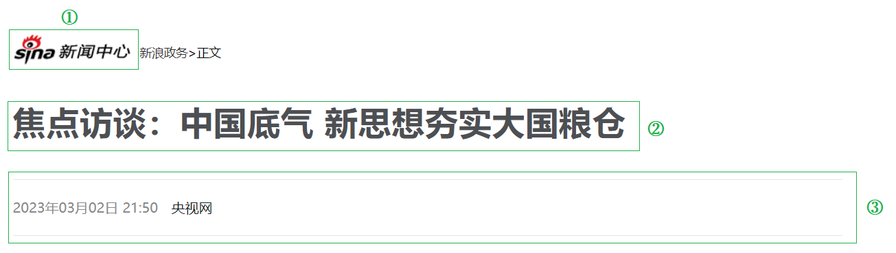
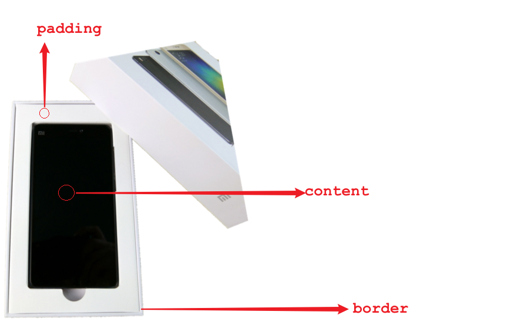
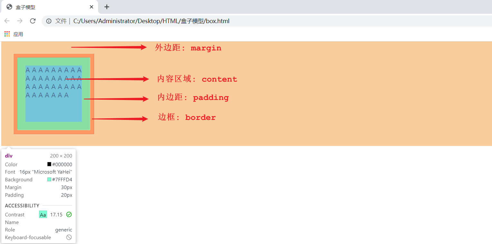
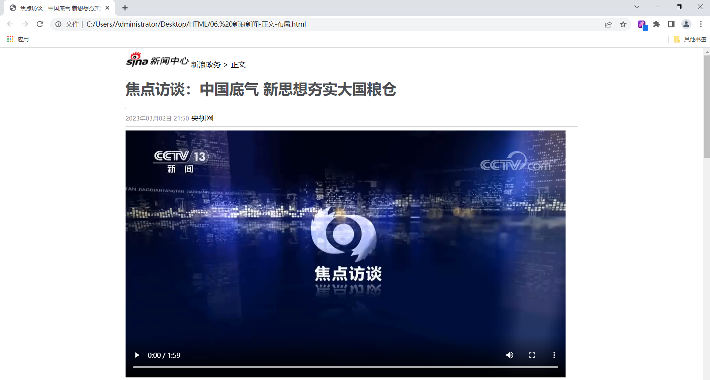

# 1. 前端开发介绍

我们介绍Web网站工作流程的时候提到，前端开发，主要的职责就是将数据以好看的样式呈现出来。说白了，就是开发网页程序，如下图所示：

  


那在讲解web前端开发之前，我们先需要对web前端开发有一个整体的认知。主要明确一下三个问题：

1). 网页有哪些部分组成 ?

文字、图片、音频、视频、超链接、表格等等。


2). 我们看到的网页，背后的本质是什么 ?

程序员写的前端代码 (备注：在前后端分离的开发模式中，)


3). 前端的代码是如何转换成用户眼中的网页的 ?

通过浏览器转化（解析和渲染）成用户看到的网页

浏览器中对代码进行解析和渲染的部分，称为 **浏览器内核**


而市面上的浏览器非常多，比如：IE、火狐Firefox、苹果safari、欧朋、谷歌Chrome、QQ浏览器、360浏览器等等。 而且我们电脑上安装的浏览器可能都不止一个，有很多。 

但是呢，需要大家注意的是，不同的浏览器，内核不同，对于相同的前端代码解析的效果也会存在差异。 那这就会造成一个问题，同一段前端程序，不同浏览器展示出来的效果是不一样的，这个用户体验就很差了。而我们想达到的效果则是，即使用户使用的是不同的浏览器，解析同一段前端代码，最终展示出来的效果都是相同的。

要想达成这样一个目标，我们就需要定义一个统一的标准，然后让各大浏览器厂商都参照这个标准来实现即可。 而这套标准呢，其实早都已经定义好了，那就是我们接下来，要介绍的web标准。


**Web标准**也称为**网页标准**，由一系列的标准组成，大部分由W3C（ World Wide Web Consortium，万维网联盟）负责制定。由三个组成部分：

- ==HTML：负责网页的结构（页面元素和内容）。==

- ==CSS：负责网页的表现（页面元素的外观、位置等页面样式，如：颜色、大小等）。==

- ==JavaScript：负责网页的行为（交互效果）。==

 


当然了，随着技术的发展，我们为了更加快速的开发，现在也出现了很多前端开发的高级技术。例如：vue、elementui、Axios等等。

那这些内容呢，也是我们前端三天课程中要讲解的内容。 前端的3天课程安排如下：

- HTML & CSS
- JavaScript & Vue
- Ajax & Axios & ElementUI & Nginx


# 2. HTML & CSS

1). 什么是HTML ?

==**HTML: **HyperText Markup Language，超文本标记语言。==

- 超文本：超越了文本的限制，比普通文本更强大。除了文字信息，还可以定义图片、音频、视频等内容。

- 标记语言：由标签构成的语言
  - HTML标签都是预定义好的。例如：使用 <h1> 标签展示标题，使用<a>展示超链接，使用展示图片，<video>展示视频。
  - HTML代码直接在浏览器中运行，HTML标签由浏览器解析。

下面展示的是一段html代码经过浏览器解析，呈现的效果如右图所示：

   

​	

2). 什么是CSS ?

==**CSS:** Cascading Style Sheet，层叠样式表，用于控制页面的样式（表现）。==

下面展示的是一段 html代码 及 CSS样式 经过浏览器解析，呈现的效果如右图所示：

 


## 2.1 HTML快速入门

### 2.1.1 操作

第一步:创建一个名为HTML的文件夹，然后找到课程资料中的 1.jpg 文件放到该目录下，此时HTML文件夹中内容如下：

 


第二步：创建一个文本文件，然后修改文件名为hello.html,注意文件的后缀是.html,如下图所示：

 


第三步：选中文件，鼠标右击，选择使用记事本打开文件，并且编写前端代码

首先html有固定的基本结构

~~~html
<html>
	<head>
		<title>HTML 快速入门</title>
	</head>
	<body>
		<h1>Hello HTML</h1>
		
	</body>
</html>
~~~


其中&lt;html&gt;是根标签，&lt;head&gt;和&lt;body&gt;是子标签，&lt;head&gt;中的字标签&lt;title&gt;是用来定义网页的标题的，里面定义的内容会显示在浏览器网页的标题位置。

而 &lt;body> 中编写的内容，就网页中显示的核心内容。


第四步：然后选中文件，鼠标右击，选择使用浏览器打开文件，浏览器呈现效果如下:

  


### 2.1.2 总结

1). HTML页面的基础结构标签

~~~html
<html>
	<head>
    	<title> </title>
    </head>
    <body>
       
    </body>
</html>
~~~

&lt;title&gt;中定义标题显示在浏览器的标题位置，&lt;body&gt;中定义的内容会呈现在浏览器的内容区域


2). HTML中的标签特点

- ==HTML标签不区分大小写==
- ==HTML标签的属性值，采用单引号、双引号都可以==
- HTML语法相对比较松散 (建议大家编写HTML标签的时候尽量严谨一些)


 

## 2.2 开发工具

- 我们通过快速入门案例，发现由记事本文件开发html是非常不方便的，所以接下来我们需要学习一款前端专业的开发工具VS Code。

- Visual Studio Code（简称 VS Code ）是 Microsoft 于2015年4月发布的一款代码编辑器。VS Code 对前端代码有非常强大的支持，同时也其他编程语言（例如：C++、Java、Python、PHP、Go等）。VS Code 提供了非常强大的插件库，大大提高了开发效率。

- 官网： https://code.visualstudio.com

- 详细安装教程：参考 **资料/VSCode安装/安装文档/VS Code安装文档.md**

> 注意：需要注意的是，我们作为一名开发者，不应该将软件软装在包含中文名的路径中 。


## 2.3 基础标签 & 样式

那我们在讲解HTML的常见基础标签 及 CSS的基本样式时，我们就以 新浪新闻页面 为例，来进行讲解，这样大家不仅能够知道 常见标签及样式的作用，还能够知道具体的应用场景。

新浪新闻的具体页面效果如下：


原始页面网址：https://news.sina.com.cn/gov/xlxw/2023-03-03/doc-imyipzuy7321600.shtml


而对于这个新浪新闻的页面来说，核心内容分为两个部分，如下：

- 新浪新闻-标题部分
- 新浪新闻-正文部分

 


### 2.3.1 新浪新闻-标题实现

#### 2.3.1.1 标题排版

##### 2.3.1.1.1 分析

 

 1). 第一部分，是一张图片，需要用到HTML中的图片标签  来实现。

 2). 第二部分，是一个标题，需要用到HTML中的标题标签 <h1> ... <h6>来实现。

 3). 第三部分，有两条水平分割线，需要用到HTML中的 <hr> 标签来定义水平分割线。


##### 2.3.1.1.2 标签

==1). 图片标签 img==

```html
A. 图片标签: 

B. 常见属性: 
	src: 指定图像的url (可以指定 绝对路径 , 也可以指定 相对路径)
	width: 图像的宽度 (像素 / 百分比 , 相对于父元素的百分比)
	height: 图像的高度 (像素 / 百分比 , 相对于父元素的百分比)
	
	备注: 一般width 和 height 我们只会指定一个，另外一个会自动的等比例缩放。
	
C. 路径书写方式:
    绝对路径:
        1. 绝对磁盘路径: C:\Users\Administrator\Desktop\HTML\img\news_logo.png
        

        2. 绝对网络路径: https://i2.sinaimg.cn/dy/deco/2012/0613/yocc20120613img01/news_logo.png
        
    
    相对路径:
        ./ : 当前目录 , ./ 可以省略的
        ../: 上一级目录
```


==2). 标题标签 h 系列==

```html
A. 标题标签: <h1> - <h6>
    
	<h1>111111111111</h1>
	<h2>111111111111</h2>
	<h3>111111111111</h3>
	<h4>111111111111</h4>
	<h5>111111111111</h5>
	<h6>111111111111</h6>
	
B. 效果 : h1为一级标题，字体也是最大的 ； h6为六级标题，字体是最小的。
```


==3). 水平分页线标签 <hr>==


##### 2.3.1.1.2 实现

1). 打开VsCode，选择左侧最底部的 "资源管理器"，然后选择打开文件夹，选择打开桌面的 HTML 文件夹 

2). 将资料中提供的 图片、音频、视频 文件夹的这三个文件夹（里面是图片、音视频素材），复制到 HTML 文件夹中。 

 

3). 在VsCode中创建一个新的 html 文件，文件的后缀名设置为 .html

 

4). html 文件创建好之后，在其中输入 ！，然后直接回车，就可以生成 HTML 的基础结构标签

 

5). 编写标题排版的核心代码

```html
<!-- 文档类型为HTML -->
<!DOCTYPE html>
<html lang="en">
<head>
    <!-- 字符集为UTF-8 -->
    <meta charset="UTF-8">
    <!-- 设置浏览器兼容性 -->
    <meta http-equiv="X-UA-Compatible" content="IE=edge">
    <meta name="viewport" content="width=device-width, initial-scale=1.0">
    <title>焦点访谈：中国底气 新思想夯实大国粮仓</title>
</head>
<body>
    <!-- 
    img标签: 
        src: 图片资源路径
        width: 宽度(px, 像素 ; % , 相对于父元素的百分比)
        height: 高度(px, 像素 ; % , 相对于父元素的百分比)
        
        

    路径书写方式:
        绝对路径:
            1. 绝对磁盘路径: C:\Users\Administrator\Desktop\HTML\img\news_logo.png
                           

            2. 绝对网络路径: https://i2.sinaimg.cn/dy/deco/2012/0613/yocc20120613img01/news_logo.png
                           
        相对路径:
            ./ : 当前目录 , ./ 可以省略的
            ../: 上一级目录
     -->
     新浪政务 > 正文

    <h1>焦点访谈：中国底气 新思想夯实大国粮仓</h1>
    
    <hr>
    2023年03月02日 21:50 央视网
    <hr>

</body>
</html>
```

**`<meta http-equiv="X-UA-Compatible" content="IE=edge">`**

- **http-equiv="X-UA-Compatible"**: 这个属性告诉浏览器（主要是针对旧版本的Internet Explorer）该网页应该使用哪种渲染模式。
- **content="IE=edge"**: 这里设置的是“IE=edge”，意味着页面将使用IE浏览器可用的最新的渲染引擎。

这个标签的主要目的是确保网页在Internet Explorer中能够以最佳的方式显示，尤其是在该浏览器有多个渲染引擎时。

**`<meta name="viewport" content="width=device-width, initial-scale=1.0">`**

- **name="viewport"**: 这个属性用于设置视口（viewport）的配置，视口是用户在设备上可见的网页区域。
- **content="width=device-width, initial-scale=1.0"**: 这里设置了两个参数：
  - **width=device-width**: 这意味着页面的宽度会自适应设备屏幕的宽度。
  - **initial-scale=1.0**: 初始化缩放级别设置为1，即页面加载时不进行缩放。


#### 2.3.1.2 标题样式

新浪新闻的标题部分的基本排版，我们已经完成了，然后大家会看到，我们编写的一级标题，默认字体颜色为纯黑色。 而原始的新浪新闻页面的新闻标题字体，并不是纯黑色，而是灰黑色， 那接下来，我们就要来设置这个字体的颜色。 而要设置这个字体的颜色，我们就需要通过CSS样式来控制 。

那在HTML的文件中，我们如何来编写CSS样式呢，此时就涉及到CSS的三种引入方式。


##### 2.3.1.2.1 CSS引入方式

具体有3种引入方式，语法如下表格所示：

| 名称     | 语法描述                                          | 示例                                           |
| -------- | ------------------------------------------------- | ---------------------------------------------- |
| 行内样式 | 在标签内使用style属性，属性值是css属性键值对      | &lt;h1 style="xxx:xxx;">中国新闻网&lt;/h1>     |
| 内嵌样式 | 定义&lt;style&gt;标签，在标签内部定义css样式      | &lt;style> h1 {...} &lt;/style>                |
| 外联样式 | 定义&lt;link&gt;标签，通过href属性引入外部css文件 | &lt;link rel="stylesheet" href="css/news.css"> |

对于上述3种引入方式，企业开发的使用情况如下：

1. 内联样式会出现大量的代码冗余，不方便后期的维护，所以不常用。
2. 内部样式，通过定义css选择器，让样式作用于当前页面的指定的标签上。
3. 外部样式，html和css实现了完全的分离，企业开发常用方式。


##### 2.3.1.2.2 颜色表示

在前端程序开发中，颜色的表示方式常见的有如下三种：

| **表示方式**   | **表示含义**                      | **取值**                                    |
| -------------- | --------------------------------- | ------------------------------------------- |
| 关键字         | 预定义的颜色名                    | red、green、blue...                         |
| rgb表示法      | 红绿蓝三原色，每项取值范围：0-255 | rgb(0,0,0)、rgb(255,255,255)、rgb(255,0,0)  |
| 十六进制表示法 | #开头，将数字转换成十六进制表示   | #000000、#ff0000、#cccccc，简写：#000、#ccc |


##### 2.3.1.2.3 标题字体颜色

```html
<!DOCTYPE html>
<html lang="en">
<head>
    <meta charset="UTF-8">
    <meta http-equiv="X-UA-Compatible" content="IE=edge">
    <meta name="viewport" content="width=device-width, initial-scale=1.0">
    <title>焦点访谈：中国底气 新思想夯实大国粮仓</title>
    <!-- 方式二: 内嵌样式 -->
    <style>
        h1 {
            /* color: red; */
            /* color: rgb(0, 0, 255); */
            color: #4D4F53;
        }
    </style>

    <!-- 方式三: 外联样式 -->
    <!-- <link rel="stylesheet" href="css/news.css"> -->
</head>
<body>
     新浪政务 > 正文

    <!-- 方式一: 行内样式 -->
    <!-- <h1 style="color: red;">焦点访谈：中国底气 新思想夯实大国粮仓</h1> -->
    
    <h1>焦点访谈：中国底气 新思想夯实大国粮仓</h1>

    <hr>
    2023年03月02日 21:50 央视网
    <hr>

</body>
</html>
```

备注: 要想拾取某一个网页中的颜色，我们可以借助于浏览器的拾色器插件来完成。【拾色器插件的安装，参照资料中提供的文档即可】


##### 2.3.1.2.4 CSS选择器

顾名思义：选择器是选取需设置样式的元素（标签），但是我们根据业务场景不同，选择的标签的需求也是多种多样的，所以选择器有很多种，因为我们是做后台开发的，所以对于css选择器，我们只学习最基本的3种。

**选择器通用语法如下**：

```css
选择器名   {
    css样式名：css样式值;
    css样式名：css样式值;
}
```


我们需要学习的3种选择器是元素选择器，id选择器，class选择器，==其中，优先级 id > class > 元素。==

语法以及作用如下：

**1.元素（标签）选择器：** 

- 选择器的名字必须是标签的名字
- 作用：选择器中的样式会作用于所有同名的标签上

~~~
元素名称 {
    css样式名:css样式值；
}
~~~

例子如下：

~~~css
 div{
     color: red;
 }
~~~


**2.id选择器:**

- 选择器的名字前面需要加上#
- 作用：选择器中的样式会作用于指定id的标签上，而且有且只有一个标签（由于id是唯一的）

~~~
#id属性值 {
    css样式名:css样式值；
}
~~~

例子如下：

~~~css
#did {
    color: blue;
}
~~~


**3.类选择器：**

- 选择器的名字前面需要加上 .
- 作用：选择器中的样式会作用于所有class的属性值和该名字一样的标签上，可以是多个

~~~
.class属性值 {
    css样式名:css样式值；
}
~~~

例子如下：

~~~css
.cls{
     color: green;
 }
~~~


**什么时候用 class 什么时候用 id ？**

在HTML和CSS中，`class`和`id`都用于标识元素，但它们有几个关键的不同点：

**class（类）**

1. **复用性：** `class` 可以应用于多个元素。
2. **组合性：** 一个元素可以有多个 `class`。
3. **一般性：** 通常用于标识页面上多次出现的或具有相似样式的元素。

**使用场景：**

- 当你需要对多个元素应用相同的样式时。
- 当你需要通过JavaScript来操作多个具有相同属性的元素时。
  

**id（标识符）**

1. **唯一性：** `id` 必须在页面上是唯一的。
2. **特异性：** 在CSS中，通过 `id` 选择元素具有高优先级。
3. **针对性：** 通常用于标识页面上唯一的元素。

**使用场景：**

- 当你需要定位到页面上某个特定的元素时。
- 当你需要通过JavaScript进行某种唯一操作时（如获取或修改这个元素）。
- 当你需要高优先级来覆盖其他样式时。


##### 2.3.1.2.5 发布时间字体颜色

```html
<!DOCTYPE html>
<html lang="en">
<head>
    <meta charset="UTF-8">
    <meta http-equiv="X-UA-Compatible" content="IE=edge">
    <meta name="viewport" content="width=device-width, initial-scale=1.0">
    <title>焦点访谈：中国底气 新思想夯实大国粮仓</title>
    <style>
        h1 {
            color: #4D4F53;
        }

        /* 元素选择器 */
        /* span {
            color: red;
        } */

        /* 类选择器 */
        /* .cls {
            color: green;
        } */
        
        /* ID选择器 */
        #time {
            color: #968D92;
            font-size: 13px; /* 设置字体大小 */
        }

    </style>
</head>
<body>

     新浪政务 > 正文

    <h1>焦点访谈：中国底气 新思想夯实大国粮仓</h1>

    <hr>
    <span class="cls" id="time">2023年03月02日 21:50</span>  <span class="cls">央视网</span>
    <hr>

</body>
</html>
```


上述我们还使用了一个css的属性 font-size , 用来设置字体的大小。 但是需要注意，在设置字体的大小时，单位px不能省略，否则不生效。


#### 2.3.1.3 超链接

- 在新浪新闻的标题部分，当我们点击顶部的 "新浪政务"，浏览器将自动在当前窗口访问新浪政务首页这个资源（http://gov.sina.com.cn/）

- 当我们点击新闻发布时间之后的 "央视网"，浏览器将会自动打开一个新的标签页，然后在新的标签页中访问央视网中的该新闻资源 （https://news.cctv.com/2023/03/02/ARTIUCKFf9kE9eXgYE46ugx3230302.shtml）


那接下来，我们就来完善新闻标题部分的这个功能，那此时呢，我们就需要用到HTML中的超链接的标签 。

##### 2.3.1.3.1 介绍

- ==标签:  ```<a href="..." target="..."> 央视网</a>```==
- 属性:
  - href: 指定资源访问的url
  - target: 指定在何处打开资源链接
    - _self: 默认值，在当前页面打开
    - _blank: 在空白页面打开


##### 2.3.1.3.2 实现

```html
<!DOCTYPE html>
<html lang="en">
<head>
    <meta charset="UTF-8">
    <meta http-equiv="X-UA-Compatible" content="IE=edge">
    <meta name="viewport" content="width=device-width, initial-scale=1.0">
    <title>焦点访谈：中国底气 新思想夯实大国粮仓</title>
    <style>
        h1 {
            color: #4D4F53;
        }
        
        #time {
            color: #968D92;
            font-size: 13px; /* 设置字体大小 */
        }

        a {
            color: black;
            text-decoration: none; /* 设置文本为一个标准的文本 , 去除掉 超链接 下面默认的下划线 */
        }
    </style>
</head>
<body>

     <a href="http://gov.sina.com.cn/" target="_self">新浪政务</a>  > 正文

    <h1>焦点访谈：中国底气 新思想夯实大国粮仓</h1>

    <hr>
    <span id="time">2023年03月02日 21:50</span>  
    <span> 
    <a href="https://news.cctv.com/2023/03/02/ARTIUCKFf9kE9eXgYE46ugx3230302.shtml" target="_blank">央视网</a>
    </span>
    <hr>

</body>
</html>
```


浏览器打开此页面，我们可以看到最终效果（超链接的字体，以及默认的下划线，通过css样式已经调整好了）：

 


### 2.3.2 新浪新闻-正文实现

#### 2.3.2.1 正文排版

##### 2.3.2.1.1 分析

 

整个正文部分的排版，主要分为这么四个部分：

1). 视频 (当前这种新闻页面,可能也会存在音频)

2). 文字段落

3). 字体加粗

4). 图片


##### 2.3.2.1.2 标签

**1). 视频、音频标签**

- ==视频标签: &lt;video>==
  - 属性: 
    - src: 规定视频的url
    - controls: 显示播放控件
    - width: 播放器的宽度
    - height: 播放器的高度

- ==音频标签: &lt;audio>==
  - 属性:
    - src: 规定音频的url
    - controls: 显示播放控件


**2). 段落标签**

- ==换行标签: &lt;br>==
  - 注意: 在HTML页面中,我们在编辑器中通过回车实现的换行, 仅仅在文本编辑器中会看到换行效果, 浏览器是不会解析的, HTML中换行需要通过br标签

​	

- ==段落标签: &lt;p>==
  - 如: &lt;p> 这是一个段落 &lt;/p>


**3). 文本格式标签**

| 效果   | 标签 | 标签(强调) |
| ------ | ---- | ---------- |
| 加粗   | b    | strong     |
| 倾斜   | i    | em         |
| 下划线 | u    | ins        |
| 删除线 | s    | del        |

前面的标签 b、i、u、s 就仅仅是实现加粗、倾斜、下划线、删除线的效果，是没有强调语义的。 而后面的strong、em、ins、del在实现加粗、倾斜、下划线、删除线的效果的同时，还带有强调语义。


##### 2.3.2.1.3 实现

```html
<!DOCTYPE html>
<html lang="en">
<head>
    <meta charset="UTF-8">
    <meta http-equiv="X-UA-Compatible" content="IE=edge">
    <meta name="viewport" content="width=device-width, initial-scale=1.0">
    <title>焦点访谈：中国底气 新思想夯实大国粮仓</title>
    <style>
        h1 {
            color: #4D4F53;
        }
        
        #time {
            color: #968D92;
            font-size: 13px; /* 设置字体大小 */
        }

        a {
            color: black;
            text-decoration: none; /* 设置文本为一个标准的文本 */
        }

        p {
            text-indent: 35px; /* 设置首行缩进 */
            line-height: 40px; /* 设置行高 */
        }

        #plast {
            text-align: right; /* 对齐方式 */
        }
    </style>
</head>
<body>

    <!-- 标题 -->
     <a href="http://gov.sina.com.cn/" target="_self">新浪政务</a>  > 正文

    <h1>焦点访谈：中国底气 新思想夯实大国粮仓</h1>

    <hr>
    <span id="time">2023年03月02日 21:50</span>
    <span><a href="https://news.cctv.com/2023/03/02/ARTIUCKFf9kE9eXgYE46ugx3230302.shtml" target="_blank">央视网</a></span>
    <hr>

    <!-- 正文 -->
    <!-- 视频 -->
    <video src="video/1.mp4" controls width="950px"></video>

    <!-- 音频 -->
    <!-- <audio src="audio/1.mp3" controls></audio> -->

    <p>
    <strong>央视网消息</strong> （焦点访谈）：党的十八大以来，以习近平同志为核心的党中央始终把解决粮食安全问题作为治国理政的头等大事，重农抓粮一系列政策举措有力有效，我国粮食产量站稳1.3万亿斤台阶，实现谷物基本自给、口粮绝对安全。我们把饭碗牢牢端在自己手中，为保障经济社会发展提供了坚实支撑，为应对各种风险挑战赢得了主动。连续八年1.3万亿斤，这个沉甸甸的数据是如何取得的呢？
    </p>

    <p>
    人勤春来早，春耕农事忙。立春之后，由南到北，我国春耕春管工作陆续展开，春天的田野处处生机盎然。
    </p>

    

    <p>
        今年，我国启动了新一轮千亿斤粮食产能提升行动，这是一个新的起点。2015年以来，我国粮食产量连续8年稳定在1.3万亿斤以上，人均粮食占有量始终稳稳高于国际公认的400公斤粮食安全线。从十年前的约12200亿斤到2022年的约13700亿斤，粮食产量提高了1500亿斤。
    </p>

    

    <p>
        中国式现代化一个重要的中国特色是人口规模巨大的现代化。我们粮食生产的发展，意味着我们要立足国内，解决14亿多人吃饭的问题。仓廪实，天下安。保障粮食安全是一个永恒的课题，任何时候都不能放松。在以习近平同志为核心的党中央坚强领导下，亿万中国人民辛勤耕耘、不懈奋斗，我们就一定能够牢牢守住粮食安全这一“国之大者”，把中国人的饭碗牢牢端在自己手中，夯实中国式现代化基础。
    </p>

    <p id="plast">
        责任编辑：王树淼 SN242
    </p>
</body>
</html>
```


在上述的正文排版实现中，还用到了几个CSS属性： 

- text-indent: 设置段落的首行缩进 
- line-height: 设置行高
- text-align: 设置对齐方式, 可取值为 left / center / right


> 注意事项: 
>
> - ==在HTML页面中无论输入了多少个空格, 最多只会显示一个。 可以使用空格占位符（&nbsp；）来生成空格，如果需要多个空格，就使用多次占位符。==
>
> - 那在HTML中，除了空格占位符以外，还有一些其他的占位符(了解, 只需要知道空格的占位符写法即可)，如下：
>
>   - | 显示结果 | 描述   | 占位符  |
>     | :------- | :----- | :------ |
>     |          | 空格   | \&nbsp; |
>     | <        | 小于号 | \&lt;   |
>     | >        | 大于号 | \&gt;   |
>     | &        | 和号   | \&amp;  |
>     | "        | 引号   | \&quot; |
>     | '        | 撇号   | \&apos; |


#### 2.3.2.2 页面布局

目前，新闻页面的基本排版，我们都已经完成了，但是，大家会看到，无论是标题部分，还是正文部分，都是铺满了整个浏览器。 而我们再来看看新浪新闻的原始页面，我们会看到新闻网页内容都是居中展示的，左边、右边都是一定的边距的。

 

那接下来呢，我们就需要按照这个效果，来完成页面布局。 而要想完成这样一个页面布局，我们就需要介绍一下CSS中的盒子模型 。 


##### 2.3.2.2.1 盒子模型

- 盒子：页面中所有的元素（标签），都可以看做是一个 盒子，由盒子将页面中的元素包含在一个矩形区域内，通过盒子的视角更方便的进行页面布局

- ==盒子模型组成：内容区域（content）、内边距区域（padding）、边框区域（border）、外边距区域（margin）== 

 

CSS盒子模型，其实和日常生活中的包装盒是非常类似的，就比如：

 

盒子的大小，其实就包括三个部分： border、padding、content，而margin外边距是不包括在盒子之内的。

**为什么要分为 content padding border margin？**

**Content（内容）**

- 这是元素实际包含的内容，如文本、图片或其他媒体内容。
- ==`width`和`height`属性默认设置内容区域的大小。==

**Padding（内边距）**

- 这是内容区域与边框之间的空间。
- 内边距不是透明的。
- 使用`padding`属性来设置这个区域。

**Border（边框）**

- 这围绕在内边距和内容周围的线。
- 使用`border`属性来定义其大小和样式。

**Margin（外边距）**

- 这是边框外面的区域，用于元素与其周围元素之间的间距。
- 外边距是透明的。
- 使用`margin`属性来设置这个区域。

**为什么要这么分？**

1. **灵活性和复用性：** 这样的结构提供了高度的灵活性，允许你单独地控制每个组件，从而复用和修改成更多的样式。
2. **布局控制：** 精细的控制每个元素的`margin`和`padding`可以让你实现各种复杂的布局。
3. **可读性和可维护性：** 明确的分区使得代码更容易理解，更方便团队合作和后期维护。
4. **响应式设计：** 分明确的盒模型组件（如`padding`、`border`和`margin`）方便实现响应式设计，因为你可以针对不同的屏幕大小进行调整。
5. **视觉效果：** 通过独立控制这四个部分，你可以容易地添加各种视觉效果，如阴影、圆角边框等。


##### 2.3.2.2.2 布局标签

- 布局标签：实际开发网页中，会大量频繁的使用 div 和 span 这两个没有语义的布局标签。

- 标签：<div> <span>

- 特点：

  - div标签：

    - ==一行只显示一个（独占一行）==

    - 宽度默认是父元素的宽度，高度默认由内容撑开

    - ==可以设置宽高（width、height）==

  - span标签：

    - ==一行可以显示多个==

    - 宽度和高度默认由内容撑开

    - ==不可以设置宽高（width、height）==


测试：

```html
<body>
    <div>
        A A A A A A A A A A A A A A A A A A A A A A A A A A A A A A A A A A 
    </div>
    <div>
        A A A A A A A A A A A A A A A A A A A A A A A A A A A A A A A A A A 
    </div>

    <span>
        A A A A A A A A A A A A A A A A A A A A A A A A A A A A A A A A A A 
    </span>
    <span>
        A A A A A A A A A A A A A A A A A A A A A A A A A A A A A A A A A A 
    </span>
</body>
```


浏览器打开后的效果:

1). div会独占一行，默认宽度为父元素 body 的宽度

  


2). span一行会显示多个，用来组合行内元素，默认宽度为内容撑开的宽度

 


##### 2.3.2.2.3 盒子模型代码

代码如下: 

```html
<!DOCTYPE html>
<html lang="en">
<head>
    <meta charset="UTF-8">
    <meta http-equiv="X-UA-Compatible" content="IE=edge">
    <meta name="viewport" content="width=device-width, initial-scale=1.0">
    <title>盒子模型</title>
    <style>
        div {
            width: 200px;  /* 宽度 */
            height: 200px;  /* 高度 */
            box-sizing: border-box; /* 指定width height为盒子的高宽 */
            background-color: aquamarine; /* 背景色 */
            
            padding: 20px 20px 20px 20px; /* 内边距, 上 右 下 左 , 边距都一行, 可以简写: padding: 20px;*/ 
            border: 10px solid red; /* 边框, 宽度 线条类型 颜色 */
            margin: 30px 30px 30px 30px; /* 外边距, 上 右 下 左 , 边距都一行, 可以简写: margin: 30px; */
        }
    </style>
</head>

<body>
    
    <div>
        A A A A A A A A A A A A A A A A A A A A A A A A A A A A A A A A A A 
    </div>

</body>
</html>
```


代码编写好了, 可以通过浏览器打开该页面, 通过开发者工具,我们就可以看到盒子的大小, 以及盒子各个组成部分(内容、内边距、边框、外边距)：

 


我们也可以，通过浏览器的开发者工具，清晰的看到这个盒子，以及每一个部分的大小：

 


##### 2.3.2.2.3 布局实现

在实现新闻页面的布局时，我们需要做两部操作：

- 第一步：需要将body中的新闻标题部分、正文部分使用一个 div 布局标签将其包裹起来，方便通过css设置内容占用的宽度，比如：65%。
- 第二步：通过css为该div设置外边距，左右的外边距分别为：17.5%，上下外边距靠边展示即可，为：0%。


具体的代码实现如下：

```html
<!DOCTYPE html>
<html lang="en">
<head>
    <meta charset="UTF-8">
    <meta http-equiv="X-UA-Compatible" content="IE=edge">
    <meta name="viewport" content="width=device-width, initial-scale=1.0">
    <title>焦点访谈：中国底气 新思想夯实大国粮仓</title>
    <style>
        h1 {
            color: #4D4F53;
        }
        
        #time {
            color: #968D92;
            font-size: 13px; /* 设置字体大小 */
        }

        a {
            color: black;
            text-decoration: none; /* 设置文本为一个标准的文本 */
        }

        p {
            text-indent: 35px; /* 设置首行缩进 */
            line-height: 40px; /* 设置行高 */
        }

        #plast {
            text-align: right; /* 对齐方式 */
        }

        #center {
            width: 65%;
            /* margin: 0% 17.5% 0% 17.5% ; */ /* 外边距, 上 右 下 左 */
            margin: 0 auto;
        }
    </style>
</head>
<body>
    
    <div id="center">
        <!-- 标题 -->
         <a href="http://gov.sina.com.cn/" target="_self">新浪政务</a>  > 正文

        <h1>焦点访谈：中国底气 新思想夯实大国粮仓</h1>

        <hr>
        <span id="time">2023年03月02日 21:50</span>
        <span><a href="https://news.cctv.com/2023/03/02/ARTIUCKFf9kE9eXgYE46ugx3230302.shtml" target="_blank">央视网</a></span>
        <hr>

        <!-- 正文 -->
        <!-- 视频 -->
        <video src="video/1.mp4" controls width="950px"></video>

        <!-- 音频 -->
        <!-- <audio src="audio/1.mp3" controls></audio> -->

        <p>
        <strong>央视网消息</strong> （焦点访谈）：党的十八大以来，以习近平同志为核心的党中央始终把解决粮食安全问题作为治国理政的头等大事，重农抓粮一系列政策举措有力有效，我国粮食产量站稳1.3万亿斤台阶，实现谷物基本自给、口粮绝对安全。我们把饭碗牢牢端在自己手中，为保障经济社会发展提供了坚实支撑，为应对各种风险挑战赢得了主动。连续八年1.3万亿斤，这个沉甸甸的数据是如何取得的呢？
        </p>

        <p>
        人勤春来早，春耕农事忙。立春之后，由南到北，我国春耕春管工作陆续展开，春天的田野处处生机盎然。
        </p>

        

        <p>
            今年，我国启动了新一轮千亿斤粮食产能提升行动，这是一个新的起点。2015年以来，我国粮食产量连续8年稳定在1.3万亿斤以上，人均粮食占有量始终稳稳高于国际公认的400公斤粮食安全线。从十年前的约12200亿斤到2022年的约13700亿斤，粮食产量提高了1500亿斤。
        </p>

        

        <p>
            中国式现代化一个重要的中国特色是人口规模巨大的现代化。我们粮食生产的发展，意味着我们要立足国内，解决14亿多人吃饭的问题。仓廪实，天下安。保障粮食安全是一个永恒的课题，任何时候都不能放松。在以习近平同志为核心的党中央坚强领导下，亿万中国人民辛勤耕耘、不懈奋斗，我们就一定能够牢牢守住粮食安全这一“国之大者”，把中国人的饭碗牢牢端在自己手中，夯实中国式现代化基础。
        </p>

        <p id="plast">
            责任编辑：王树淼 SN242
        </p>  
    </div>
</body>
</html>
```


浏览器打开此页面，最终效果如下：

 


## 2.4 表格标签

**场景：**在网页中以表格（行、列）形式整齐展示数据，我们在一些管理类的系统中，会看到数据通常都是以表格的形式呈现出来的，比如：班级表、学生表、课程表、成绩表等等。

 


**标签：**

- &lt;==table> : 用于定义整个表格, 可以包裹多个 &lt;tr>==， 常用属性如下： 
  - border：规定表格边框的宽度
  - width：规定表格的宽度
  - cellspacing: 规定单元之间的空间

- &lt;==tr> : 表格的行，可以包裹多个 &lt;td>==  
- &lt;==td> : 表格单元格(普通)，可以包裹内容 , 如果是表头单元格，可以替换为 &lt;th>==


**演示：**

代码如下：

~~~html
<!DOCTYPE html>
<html lang="en">
<head>
    <meta charset="UTF-8">
    <meta http-equiv="X-UA-Compatible" content="IE=edge">
    <meta name="viewport" content="width=device-width, initial-scale=1.0">
    <title>HTML-表格</title>
    <style>
        td {
            text-align: center; /* 单元格内容居中展示 */
        }
    </style>
</head>
<body>
    
    <table border="1px" cellspacing="0"  width="600px">
        <tr>
            <th>序号</th>
            <th>品牌Logo</th>
            <th>品牌名称</th>
            <th>企业名称</th>
        </tr>
        <tr>
            <td>1</td>
            <td>  </td>
            <td>华为</td>
            <td>华为技术有限公司</td>
        </tr>
        <tr>
            <td>2</td>
            <td>  </td>
            <td>阿里</td>
            <td>阿里巴巴集团控股有限公司</td>
        </tr>
    </table>

</body>
</html>
~~~

打开浏览器，效果如下图所示：

 


整合表格使用 table 标签包裹 , 其中的每一行数据都是一个 tr , 每一行中的每一个单元格都是一个 td , 而如果是表头单元格, 可以使用 th (具有加粗居中展示的效果)。


## 2.5 表单标签

### 2.5.1 表单

#### 2.5.1.1 介绍

那表单呢,在我们日常的上网的过程中,基本上每天都会遇到。比如，我们经常在访问网站时，出现的登录页面、注册页面、个人信息提交页面，其实都是一个一个的表单 。 当我们在这些表单中录入数据之后，一点击 "提交"，就会将表单中我们填写的数据采集到，并提交， 那其实这个数据呢，一般会提交到服务端，最终保存在数据库中 （后面的课程中会讲到）。

  


那其实，上述的整个窗口是一个表单，而表单是一项一项的，这个我们称为==表单项== 或 ==表单元素==。

- 表单场景: 表单就是在网页中负责数据采集功能的，如：注册、登录的表单。 

- 表单标签: &lt;form>
- 表单属性:
  - ==action: 规定表单提交时，向何处发送表单数据，表单提交的URL。==
  - ==method: 规定用于发送表单数据的方式，常见为： GET、POST。==
    - GET：表单数据是拼接在url后面的， 如： xxxxxxxxxxx?username=Tom&age=12，url中能携带的表单数据大小是有限制的。
    - POST： 表单数据是在请求体（消息体）中携带的，大小没有限制。
    - 

- 表单项标签: 不同类型的input元素、下拉列表、文本域等。
  - input: 定义表单项，通过type属性控制输入形式
  - select: 定义下拉列表
  - textarea: 定义文本域


#### 2.5.1.2 演示

1). GET方式提交的表单

```html
<!DOCTYPE html>
<html lang="en">
<head>
    <meta charset="UTF-8">
    <meta http-equiv="X-UA-Compatible" content="IE=edge">
    <meta name="viewport" content="width=device-width, initial-scale=1.0">
    <title>HTML-表单</title>
</head>
<body>
    <!-- 
    form表单属性: 
        action: 表单提交的url, 往何处提交数据 . 如果不指定, 默认提交到当前页面
        method: 表单的提交方式 .
            get: 在url后面拼接表单数据, 比如: ?username=Tom&age=12 , url长度有限制 . 默认值
            post: 在消息体(请求体)中传递的, 参数大小无限制的.
    -->   
	
    <form action="" method="get">
        用户名: <input type="text" name="username">
        年龄: <input type="text" name="age">

        <input type="submit" value="提交">
    </form>
	
</body>
</html>
```


表单编写完毕之后，通过浏览器打开此表单，然后再表单项中录入值之后，点击提交，我们会看到表单的数据在url后面提交到服务端，格式为：?username=Tom&age=12。

 


2). POST方式提交表单

将上述的表单提交方式由get，改为post

```html
<!DOCTYPE html>
<html lang="en">
<head>
    <meta charset="UTF-8">
    <meta http-equiv="X-UA-Compatible" content="IE=edge">
    <meta name="viewport" content="width=device-width, initial-scale=1.0">
    <title>HTML-表单</title>
</head>
<body>
    <!-- 
    form表单属性: 
        action: 表单提交的url, 往何处提交数据 . 如果不指定, 默认提交到当前页面
        method: 表单的提交方式 .
            get: 在url后面拼接表单数据, 比如: ?username=Tom&age=12 , url长度有限制 . 默认值
            post: 在消息体(请求体)中传递的, 参数大小无限制的.
    -->   
	
    <form action="" method="post">
        用户名: <input type="text" name="username">
        年龄: <input type="text" name="age">

        <input type="submit" value="提交">
    </form>
	
</body>
</html>
```

表单编写完毕之后，通过浏览器打开此表单，然后再表单项中录入值之后，点击提交，我们会看到表单的数据在url后面提交到服务端，格式为：?username=Tom&age=12。

 


#### 2.5.1.3 注意事项

==表单中的所有表单项，要想能够正常的采集数据，在提交的时候能提交到服务端，表单项必须指定name属性。 否则，无法提交该表单项。相当于变量名==

```html
用户名: <input type="text" name="username">
```


### 2.5.2 表单项

#### 2.5.2.1 介绍

在一个表单中，可以存在很多的表单项，而虽然表单项的形式各式各样，但是表单项的标签其实就只有三个，分别是：

- &lt;input>: 表单项 , 通过type属性控制输入形式。

  | type取值                 | **描述**                             |
  | ------------------------ | ------------------------------------ |
  | text                     | 默认值，定义单行的输入字段           |
  | password                 | 定义密码字段                         |
  | radio                    | 定义单选按钮                         |
  | checkbox                 | 定义复选框                           |
  | file                     | 定义文件上传按钮                     |
  | date/time/datetime-local | 定义日期/时间/日期时间               |
  | number                   | 定义数字输入框                       |
  | email                    | 定义邮件输入框                       |
  | hidden                   | 定义隐藏域                           |
  | submit / reset / button  | 定义提交按钮 / 重置按钮 / 可点击按钮 |

- &lt;select>: 定义下拉列表, &lt;option> 定义列表项

- &lt;textarea>: 文本域


#### 2.5.2.2 演示

创建一个新的表单项的html文件，具体内容如下：

```html
<!DOCTYPE html>
<html lang="en">
<head>
    <meta charset="UTF-8">
    <meta http-equiv="X-UA-Compatible" content="IE=edge">
    <meta name="viewport" content="width=device-width, initial-scale=1.0">
    <title>HTML-表单项标签</title>
</head>
<body>

<!-- value: 表单项提交的值 -->
<form action="" method="post">
     姓名: <input type="text" name="name"> <br><br>
     密码: <input type="password" name="password"> <br><br> 
     性别: <input type="radio" name="gender" value="1"> 男
          <label><input type="radio" name="gender" value="2"> 女 </label> <br><br>
     爱好: <label><input type="checkbox" name="hobby" value="java"> java </label>
          <label><input type="checkbox" name="hobby" value="game"> game </label>
          <label><input type="checkbox" name="hobby" value="sing"> sing </label> <br><br>
     图像: <input type="file" name="image">  <br><br>
     生日: <input type="date" name="birthday"> <br><br>
     时间: <input type="time" name="time"> <br><br>
     日期时间: <input type="datetime-local" name="datetime"> <br><br>
     邮箱: <input type="email" name="email"> <br><br>
     年龄: <input type="number" name="age"> <br><br>
     学历: <select name="degree">
               <option value="">----------- 请选择 -----------</option>
               <option value="1">大专</option>
               <option value="2">本科</option>
               <option value="3">硕士</option>
               <option value="4">博士</option>
          </select>  <br><br>
     描述: <textarea name="description" cols="30" rows="10"></textarea>  <br><br>
     <input type="hidden" name="id" value="1">
	 	
     <!-- 表单常见按钮 -->
     <input type="button" value="按钮">
     <input type="reset" value="重置"> 
     <input type="submit" value="提交">   
     <br>
</form>

</body>
</html>
```

通过点击 `label` 文本自动聚焦到相关控件上，就是说点击文字也会选择选项。


通过浏览器打开上述的表单项html文件，最终展示出的表单信息如下：

 

而对于input type="hidden"，是一个隐藏域，在表单中并不会显示出来，但是在提交表单的时候，是会提交到服务端的。 接下来，我们就点击提交按钮，来提交当前表单，看看提交的数据：

 


# 3. 文档查阅

文档地址: https://www.w3school.com.cn/index.html

## 3.1 HTML文档查阅

以video标签为例:


## 3.2 CSS文档查阅

以padding属性为例:

 