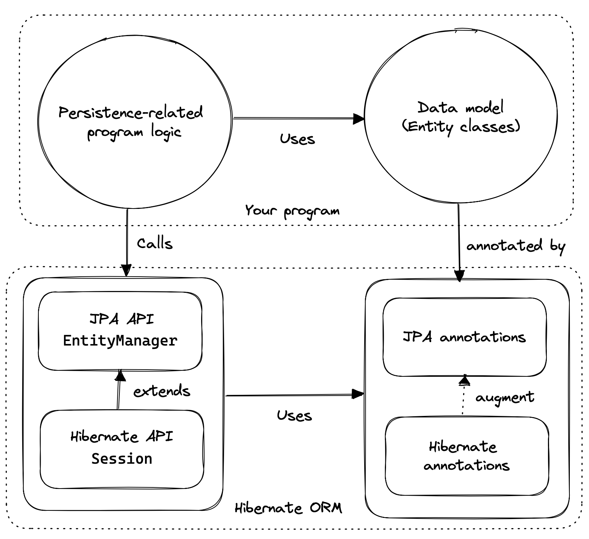

# An Introduction to Hibernate 6

> Version 6.5.0.Final

**Table of Contents**

- [Preface](https://docs.jboss.org/hibernate/orm/6.5/introduction/html_single/Hibernate_Introduction.html#preface)

- 1. Introduction

  - [1.1. Hibernate and JPA](https://docs.jboss.org/hibernate/orm/6.5/introduction/html_single/Hibernate_Introduction.html#hibernate-and-jpa)
  - [1.2. Writing Java code with Hibernate](https://docs.jboss.org/hibernate/orm/6.5/introduction/html_single/Hibernate_Introduction.html#java-code)
  - [1.3. Hello, Hibernate](https://docs.jboss.org/hibernate/orm/6.5/introduction/html_single/Hibernate_Introduction.html#hello-hibernate)
  - [1.4. Hello, JPA](https://docs.jboss.org/hibernate/orm/6.5/introduction/html_single/Hibernate_Introduction.html#hello-jpa)
  - [1.5. Organizing persistence logic](https://docs.jboss.org/hibernate/orm/6.5/introduction/html_single/Hibernate_Introduction.html#organizing-persistence)
  - [1.6. Testing persistence logic](https://docs.jboss.org/hibernate/orm/6.5/introduction/html_single/Hibernate_Introduction.html#testing)
  - [1.7. Architecture and the persistence layer](https://docs.jboss.org/hibernate/orm/6.5/introduction/html_single/Hibernate_Introduction.html#architecture)
  - [1.8. Overview](https://docs.jboss.org/hibernate/orm/6.5/introduction/html_single/Hibernate_Introduction.html#overview)

- 2. Configuration and bootstrap

  - [2.1. Including Hibernate in your project build](https://docs.jboss.org/hibernate/orm/6.5/introduction/html_single/Hibernate_Introduction.html#required-dependencies)
  - [2.2. Optional dependencies](https://docs.jboss.org/hibernate/orm/6.5/introduction/html_single/Hibernate_Introduction.html#optional-dependencies)
  - [2.3. Configuration using JPA XML](https://docs.jboss.org/hibernate/orm/6.5/introduction/html_single/Hibernate_Introduction.html#configuration-jpa)
  - [2.4. Configuration using Hibernate API](https://docs.jboss.org/hibernate/orm/6.5/introduction/html_single/Hibernate_Introduction.html#configuration-api)
  - [2.5. Configuration using Hibernate properties file](https://docs.jboss.org/hibernate/orm/6.5/introduction/html_single/Hibernate_Introduction.html#configuration-properties)
  - [2.6. Basic configuration settings](https://docs.jboss.org/hibernate/orm/6.5/introduction/html_single/Hibernate_Introduction.html#basic-configuration-settings)
  - [2.7. Automatic schema export](https://docs.jboss.org/hibernate/orm/6.5/introduction/html_single/Hibernate_Introduction.html#automatic-schema-export)
  - [2.8. Logging the generated SQL](https://docs.jboss.org/hibernate/orm/6.5/introduction/html_single/Hibernate_Introduction.html#logging-generated-sql)
  - [2.9. Minimizing repetitive mapping information](https://docs.jboss.org/hibernate/orm/6.5/introduction/html_single/Hibernate_Introduction.html#minimizing)
  - [2.10. Nationalized character data in SQL Server](https://docs.jboss.org/hibernate/orm/6.5/introduction/html_single/Hibernate_Introduction.html#nationalized-chars)

- 3. Entities

  - [3.1. Entity classes](https://docs.jboss.org/hibernate/orm/6.5/introduction/html_single/Hibernate_Introduction.html#entity-clases)
  - [3.2. Access types](https://docs.jboss.org/hibernate/orm/6.5/introduction/html_single/Hibernate_Introduction.html#access-type)
  - [3.3. Entity class inheritance](https://docs.jboss.org/hibernate/orm/6.5/introduction/html_single/Hibernate_Introduction.html#entity-inheritance)
  - [3.4. Identifier attributes](https://docs.jboss.org/hibernate/orm/6.5/introduction/html_single/Hibernate_Introduction.html#identifier-attributes)
  - [3.5. Generated identifiers](https://docs.jboss.org/hibernate/orm/6.5/introduction/html_single/Hibernate_Introduction.html#generated-identifiers)
  - [3.6. Natural keys as identifiers](https://docs.jboss.org/hibernate/orm/6.5/introduction/html_single/Hibernate_Introduction.html#natural-identifiers)
  - [3.7. Composite identifiers](https://docs.jboss.org/hibernate/orm/6.5/introduction/html_single/Hibernate_Introduction.html#composite-identifiers)
  - [3.8. Version attributes](https://docs.jboss.org/hibernate/orm/6.5/introduction/html_single/Hibernate_Introduction.html#version-attributes)
  - [3.9. Natural id attributes](https://docs.jboss.org/hibernate/orm/6.5/introduction/html_single/Hibernate_Introduction.html#natural-id-attributes)
  - [3.10. Basic attributes](https://docs.jboss.org/hibernate/orm/6.5/introduction/html_single/Hibernate_Introduction.html#basic-attributes)
  - [3.11. Enumerated types](https://docs.jboss.org/hibernate/orm/6.5/introduction/html_single/Hibernate_Introduction.html#enums)
  - [3.12. Converters](https://docs.jboss.org/hibernate/orm/6.5/introduction/html_single/Hibernate_Introduction.html#converters)
  - [3.13. Compositional basic types](https://docs.jboss.org/hibernate/orm/6.5/introduction/html_single/Hibernate_Introduction.html#compositional-basic-types)
  - [3.14. Embeddable objects](https://docs.jboss.org/hibernate/orm/6.5/introduction/html_single/Hibernate_Introduction.html#embeddable-objects)
  - [3.15. Associations](https://docs.jboss.org/hibernate/orm/6.5/introduction/html_single/Hibernate_Introduction.html#associations)
  - [3.16. Many-to-one](https://docs.jboss.org/hibernate/orm/6.5/introduction/html_single/Hibernate_Introduction.html#many-to-one)
  - [3.17. One-to-one (first way)](https://docs.jboss.org/hibernate/orm/6.5/introduction/html_single/Hibernate_Introduction.html#one-to-one-fk)
  - [3.18. One-to-one (second way)](https://docs.jboss.org/hibernate/orm/6.5/introduction/html_single/Hibernate_Introduction.html#one-to-one-pk)
  - [3.19. Many-to-many](https://docs.jboss.org/hibernate/orm/6.5/introduction/html_single/Hibernate_Introduction.html#many-to-many)
  - [3.20. Collections of basic values and embeddable objects](https://docs.jboss.org/hibernate/orm/6.5/introduction/html_single/Hibernate_Introduction.html#collections)
  - [3.21. Collections mapped to SQL arrays](https://docs.jboss.org/hibernate/orm/6.5/introduction/html_single/Hibernate_Introduction.html#arrays)
  - [3.22. Collections mapped to a separate table](https://docs.jboss.org/hibernate/orm/6.5/introduction/html_single/Hibernate_Introduction.html#element-collections)
  - [3.23. Summary of annotations](https://docs.jboss.org/hibernate/orm/6.5/introduction/html_single/Hibernate_Introduction.html#entities-summary)
  - [3.24. `equals()` and `hashCode()`](https://docs.jboss.org/hibernate/orm/6.5/introduction/html_single/Hibernate_Introduction.html#equals-and-hash)

- 4. Object/relational mapping

  - [4.1. Mapping entity inheritance hierarchies](https://docs.jboss.org/hibernate/orm/6.5/introduction/html_single/Hibernate_Introduction.html#mapping-inheritance)
  - [4.2. Mapping to tables](https://docs.jboss.org/hibernate/orm/6.5/introduction/html_single/Hibernate_Introduction.html#table-mappings)
  - [4.3. Mapping entities to tables](https://docs.jboss.org/hibernate/orm/6.5/introduction/html_single/Hibernate_Introduction.html#entity-table-mappings)
  - [4.4. Mapping associations to tables](https://docs.jboss.org/hibernate/orm/6.5/introduction/html_single/Hibernate_Introduction.html#join-table-mappings)
  - [4.5. Mapping to columns](https://docs.jboss.org/hibernate/orm/6.5/introduction/html_single/Hibernate_Introduction.html#column-mappings)
  - [4.6. Mapping basic attributes to columns](https://docs.jboss.org/hibernate/orm/6.5/introduction/html_single/Hibernate_Introduction.html#regular-column-mappings)
  - [4.7. Mapping associations to foreign key columns](https://docs.jboss.org/hibernate/orm/6.5/introduction/html_single/Hibernate_Introduction.html#join-column-mappings)
  - [4.8. Mapping primary key joins between tables](https://docs.jboss.org/hibernate/orm/6.5/introduction/html_single/Hibernate_Introduction.html#primary-key-column-mappings)
  - [4.9. Column lengths and adaptive column types](https://docs.jboss.org/hibernate/orm/6.5/introduction/html_single/Hibernate_Introduction.html#column-lengths)
  - [4.10. LOBs](https://docs.jboss.org/hibernate/orm/6.5/introduction/html_single/Hibernate_Introduction.html#lobs)
  - [4.11. Mapping embeddable types to UDTs or to JSON](https://docs.jboss.org/hibernate/orm/6.5/introduction/html_single/Hibernate_Introduction.html#mapping-embeddables)
  - [4.12. Summary of SQL column type mappings](https://docs.jboss.org/hibernate/orm/6.5/introduction/html_single/Hibernate_Introduction.html#miscellaneous-mappings)
  - [4.13. Mapping to formulas](https://docs.jboss.org/hibernate/orm/6.5/introduction/html_single/Hibernate_Introduction.html#mapping-formulas)
  - [4.14. Derived Identity](https://docs.jboss.org/hibernate/orm/6.5/introduction/html_single/Hibernate_Introduction.html#derived-identity)
  - [4.15. Adding constraints](https://docs.jboss.org/hibernate/orm/6.5/introduction/html_single/Hibernate_Introduction.html#constraints)

- 5. Interacting with the database

  - [5.1. Persistence Contexts](https://docs.jboss.org/hibernate/orm/6.5/introduction/html_single/Hibernate_Introduction.html#persistence-contexts)
  - [5.2. Creating a session](https://docs.jboss.org/hibernate/orm/6.5/introduction/html_single/Hibernate_Introduction.html#creating-session)
  - [5.3. Managing transactions](https://docs.jboss.org/hibernate/orm/6.5/introduction/html_single/Hibernate_Introduction.html#managing-transactions)
  - [5.4. Operations on the persistence context](https://docs.jboss.org/hibernate/orm/6.5/introduction/html_single/Hibernate_Introduction.html#persistence-operations)
  - [5.5. Cascading persistence operations](https://docs.jboss.org/hibernate/orm/6.5/introduction/html_single/Hibernate_Introduction.html#cascade)
  - [5.6. Proxies and lazy fetching](https://docs.jboss.org/hibernate/orm/6.5/introduction/html_single/Hibernate_Introduction.html#proxies-and-lazy-fetching)
  - [5.7. Entity graphs and eager fetching](https://docs.jboss.org/hibernate/orm/6.5/introduction/html_single/Hibernate_Introduction.html#entity-graph)
  - [5.8. Flushing the session](https://docs.jboss.org/hibernate/orm/6.5/introduction/html_single/Hibernate_Introduction.html#flush)
  - [5.9. Queries](https://docs.jboss.org/hibernate/orm/6.5/introduction/html_single/Hibernate_Introduction.html#queries)
  - [5.10. HQL queries](https://docs.jboss.org/hibernate/orm/6.5/introduction/html_single/Hibernate_Introduction.html#hql-queries)
  - [5.11. Criteria queries](https://docs.jboss.org/hibernate/orm/6.5/introduction/html_single/Hibernate_Introduction.html#criteria-queries)
  - [5.12. A more comfortable way to write criteria queries](https://docs.jboss.org/hibernate/orm/6.5/introduction/html_single/Hibernate_Introduction.html#criteria-definition)
  - [5.13. Native SQL queries](https://docs.jboss.org/hibernate/orm/6.5/introduction/html_single/Hibernate_Introduction.html#native-queries)
  - [5.14. Limits, pagination, and ordering](https://docs.jboss.org/hibernate/orm/6.5/introduction/html_single/Hibernate_Introduction.html#pagination)
  - [5.15. Key-based pagination](https://docs.jboss.org/hibernate/orm/6.5/introduction/html_single/Hibernate_Introduction.html#key-based-pagination)
  - [5.16. Representing projection lists](https://docs.jboss.org/hibernate/orm/6.5/introduction/html_single/Hibernate_Introduction.html#projection-lists)
  - [5.17. Named queries](https://docs.jboss.org/hibernate/orm/6.5/introduction/html_single/Hibernate_Introduction.html#named-queries)
  - [5.18. Controlling lookup by id](https://docs.jboss.org/hibernate/orm/6.5/introduction/html_single/Hibernate_Introduction.html#load-access)
  - [5.19. Interacting directly with JDBC](https://docs.jboss.org/hibernate/orm/6.5/introduction/html_single/Hibernate_Introduction.html#jdbc)
  - [5.20. What to do when things go wrong](https://docs.jboss.org/hibernate/orm/6.5/introduction/html_single/Hibernate_Introduction.html#advice)

- 6. Compile-time tooling

  - [6.1. Named queries and the Metamodel Generator](https://docs.jboss.org/hibernate/orm/6.5/introduction/html_single/Hibernate_Introduction.html#generated-named-queries)
  - [6.2. Generated query methods](https://docs.jboss.org/hibernate/orm/6.5/introduction/html_single/Hibernate_Introduction.html#generated-query-methods)
  - [6.3. Generating query methods as instance methods](https://docs.jboss.org/hibernate/orm/6.5/introduction/html_single/Hibernate_Introduction.html#static-or-instance)
  - [6.4. Generated finder methods](https://docs.jboss.org/hibernate/orm/6.5/introduction/html_single/Hibernate_Introduction.html#generated-finder-methods)
  - [6.5. Paging and ordering](https://docs.jboss.org/hibernate/orm/6.5/introduction/html_single/Hibernate_Introduction.html#paging-and-ordering)
  - [6.6. Key-based pagination](https://docs.jboss.org/hibernate/orm/6.5/introduction/html_single/Hibernate_Introduction.html#key-based-paging)
  - [6.7. Query and finder method return types](https://docs.jboss.org/hibernate/orm/6.5/introduction/html_single/Hibernate_Introduction.html#return-types)
  - [6.8. An alternative approach](https://docs.jboss.org/hibernate/orm/6.5/introduction/html_single/Hibernate_Introduction.html#query-validator)

- 7. Tuning and performance

  - [7.1. Tuning the connection pool](https://docs.jboss.org/hibernate/orm/6.5/introduction/html_single/Hibernate_Introduction.html#connection-pool)
  - [7.2. Enabling statement batching](https://docs.jboss.org/hibernate/orm/6.5/introduction/html_single/Hibernate_Introduction.html#statement-batching)
  - [7.3. Association fetching](https://docs.jboss.org/hibernate/orm/6.5/introduction/html_single/Hibernate_Introduction.html#association-fetching)
  - [7.4. Batch fetching and subselect fetching](https://docs.jboss.org/hibernate/orm/6.5/introduction/html_single/Hibernate_Introduction.html#batch-subselect-fetch)
  - [7.5. Join fetching](https://docs.jboss.org/hibernate/orm/6.5/introduction/html_single/Hibernate_Introduction.html#join-fetch)
  - [7.6. The second-level cache](https://docs.jboss.org/hibernate/orm/6.5/introduction/html_single/Hibernate_Introduction.html#second-level-cache)
  - [7.7. Specifying which data is cached](https://docs.jboss.org/hibernate/orm/6.5/introduction/html_single/Hibernate_Introduction.html#enable-second-level-cache)
  - [7.8. Caching by natural id](https://docs.jboss.org/hibernate/orm/6.5/introduction/html_single/Hibernate_Introduction.html#natural-id-cache)
  - [7.9. Caching and association fetching](https://docs.jboss.org/hibernate/orm/6.5/introduction/html_single/Hibernate_Introduction.html#caching-and-fetching)
  - [7.10. Configuring the second-level cache provider](https://docs.jboss.org/hibernate/orm/6.5/introduction/html_single/Hibernate_Introduction.html#second-level-cache-configuration)
  - [7.11. Caching query result sets](https://docs.jboss.org/hibernate/orm/6.5/introduction/html_single/Hibernate_Introduction.html#query-cache)
  - [7.12. Second-level cache management](https://docs.jboss.org/hibernate/orm/6.5/introduction/html_single/Hibernate_Introduction.html#second-level-cache-management)
  - [7.13. Session cache management](https://docs.jboss.org/hibernate/orm/6.5/introduction/html_single/Hibernate_Introduction.html#session-cache-management)
  - [7.14. Stateless sessions](https://docs.jboss.org/hibernate/orm/6.5/introduction/html_single/Hibernate_Introduction.html#stateless-sessions)
  - [7.15. Optimistic and pessimistic locking](https://docs.jboss.org/hibernate/orm/6.5/introduction/html_single/Hibernate_Introduction.html#optimistic-and-pessimistic-locking)
  - [7.16. Collecting statistics](https://docs.jboss.org/hibernate/orm/6.5/introduction/html_single/Hibernate_Introduction.html#statistics)
  - [7.17. Tracking down slow queries](https://docs.jboss.org/hibernate/orm/6.5/introduction/html_single/Hibernate_Introduction.html#slow-queries)
  - [7.18. Adding indexes](https://docs.jboss.org/hibernate/orm/6.5/introduction/html_single/Hibernate_Introduction.html#indexes)
  - [7.19. Dealing with denormalized data](https://docs.jboss.org/hibernate/orm/6.5/introduction/html_single/Hibernate_Introduction.html#denomalized-date)
  - [7.20. Reactive programming with Hibernate](https://docs.jboss.org/hibernate/orm/6.5/introduction/html_single/Hibernate_Introduction.html#hibernate-reactive)

- 8. Advanced Topics

  - [8.1. Filters](https://docs.jboss.org/hibernate/orm/6.5/introduction/html_single/Hibernate_Introduction.html#filters)
  - [8.2. Soft-delete](https://docs.jboss.org/hibernate/orm/6.5/introduction/html_single/Hibernate_Introduction.html#soft-delete)
  - [8.3. Multi-tenancy](https://docs.jboss.org/hibernate/orm/6.5/introduction/html_single/Hibernate_Introduction.html#multitenancy)
  - [8.4. Using custom-written SQL](https://docs.jboss.org/hibernate/orm/6.5/introduction/html_single/Hibernate_Introduction.html#custom-sql)
  - [8.5. Handling database-generated columns](https://docs.jboss.org/hibernate/orm/6.5/introduction/html_single/Hibernate_Introduction.html#database-generated-columns)
  - [8.6. User-defined generators](https://docs.jboss.org/hibernate/orm/6.5/introduction/html_single/Hibernate_Introduction.html#user-defined-generators)
  - [8.7. Naming strategies](https://docs.jboss.org/hibernate/orm/6.5/introduction/html_single/Hibernate_Introduction.html#naming-strategies)
  - [8.8. Spatial datatypes](https://docs.jboss.org/hibernate/orm/6.5/introduction/html_single/Hibernate_Introduction.html#spatial)
  - [8.9. Ordered and sorted collections and map keys](https://docs.jboss.org/hibernate/orm/6.5/introduction/html_single/Hibernate_Introduction.html#ordered-sorted)
  - [8.10. Any mappings](https://docs.jboss.org/hibernate/orm/6.5/introduction/html_single/Hibernate_Introduction.html#any)
  - [8.11. Selective column lists in inserts and updates](https://docs.jboss.org/hibernate/orm/6.5/introduction/html_single/Hibernate_Introduction.html#dynamic-insert-update)
  - [8.12. Using the bytecode enhancer](https://docs.jboss.org/hibernate/orm/6.5/introduction/html_single/Hibernate_Introduction.html#bytecode-enhancer)
  - [8.13. Named fetch profiles](https://docs.jboss.org/hibernate/orm/6.5/introduction/html_single/Hibernate_Introduction.html#fetch-profiles)

- [9. Credits](https://docs.jboss.org/hibernate/orm/6.5/introduction/html_single/Hibernate_Introduction.html#credits)

## Preface

Hibernate 6 is a major redesign of the world’s most popular and feature-rich ORM solution. The redesign has touched almost every subsystem of Hibernate, including the APIs, mapping annotations, and the query language. This new Hibernate is more powerful, more robust, and more typesafe.

With so many improvements, it’s very difficult to summarize the significance of this work. But the following general themes stand out. Hibernate 6:

- finally takes advantage of the advances in relational databases over the past decade, updating the query language to support a raft of new constructs in modern dialects of SQL,
- exhibits much more consistent behavior across different databases, greatly improving portability, and generates much higher-quality DDL from dialect-independent code,
- improves error reporting by more scrupulous validation of queries *before* access to the database,
- improves the type-safety of O/R mapping annotations, clarifies the separation of API, SPI, and internal implementation, and fixes some long-standing architectural flaws,
- removes or deprecates legacy APIs, laying the foundation for future evolution, and
- makes far better use of Javadoc, putting much more information at the fingertips of developers.

Hibernate 6 and Hibernate Reactive are now core components of Quarkus 3, the most exciting new environment for cloud-native development in Java, and Hibernate remains the persistence solution of choice for almost every major Java framework or server.

Unfortunately, the changes in Hibernate 6 have obsoleted much of the information about Hibernate that’s available in books, in blog posts, and on stackoverflow.

This guide is an up-to-date, high-level discussion of the current feature set and recommended usage. It does not attempt to cover every feature and should be used in conjunction with other documentation:

- Hibernate’s extensive [Javadoc](https://docs.jboss.org/hibernate/orm/6.5/javadocs/),
- the [Guide to Hibernate Query Language](https://docs.jboss.org/hibernate/orm/6.5/querylanguage/html_single/Hibernate_Query_Language.html), and
- the Hibernate [User Guide](https://docs.jboss.org/hibernate/orm/6.5/userguide/html_single/Hibernate_User_Guide.html).

> The Hibernate User Guide includes detailed discussions of most aspects of Hibernate. But with so much information to cover, readability is difficult to achieve, and so it’s most useful as a reference. Where necessary, we’ll provide links to relevant sections of the User Guide.

## 1. Introduction

==Hibernate is usually described as a library that makes it easy to map Java classes to relational database tables.== But this formulation does no justice to the central role played by the relational data itself. So a better description might be:

==Hibernate makes **relational data** visible to a program written in Java, in a **natural** and **typesafe** form,==

1. making it easy to write complex queries and work with their results,
2. letting the program easily synchronize changes made in memory with the database, respecting the ACID properties of transactions, and
3. allowing performance optimizations to be made after the basic persistence logic has already been written.

Here the relational data is the focus, along with the importance of typesafety. The goal of *object/relational mapping* (ORM) is to eliminate fragile and untypesafe code, and make large programs easier to maintain in the long run.

ORM takes the pain out of persistence by relieving the developer of the need to hand-write tedious, repetitive, and fragile code for flattening graphs of objects to database tables and rebuilding graphs of objects from flat SQL query result sets. Even better, ORM makes it much easier to tune performance later, after the basic persistence logic has already been written.

> A perennial question is: should I use ORM, or plain SQL? The answer is usually: *use both*. JPA and Hibernate were designed to work *in conjunction with* handwritten SQL. You see, most programs with nontrivial data access logic will benefit from the use of ORM at least *somewhere*. But if Hibernate is making things more difficult, for some particularly tricky piece of data access logic, the only sensible thing to do is to use something better suited to the problem! Just because you’re using Hibernate for persistence doesn’t mean you have to use it for *everything*.

Developers often ask about the relationship between Hibernate and JPA, so let’s take a short detour into some history.

### 1.1. Hibernate and JPA

Hibernate was the inspiration behind the *Java* (now *Jakarta*) *Persistence API*, or JPA, and includes a complete implementation of the latest revision of this specification.

The early history of Hibernate and JPA

The Hibernate project began in 2001, when Gavin King’s frustration with Entity Beans in EJB 2 boiled over. It quickly overtook other open source and commercial contenders to become the most popular persistence solution for Java, and the book *Hibernate in Action*, written with Christian Bauer, was an influential bestseller.

In 2004, Gavin and Christian joined a tiny startup called JBoss, and other early Hibernate contributors soon followed: Max Rydahl Andersen, Emmanuel Bernard, Steve Ebersole, and Sanne Grinovero.

Soon after, Gavin joined the EJB 3 expert group and convinced the group to deprecate Entity Beans in favor of a brand-new persistence API modelled after Hibernate. Later, members of the TopLink team got involved, and the Java Persistence API evolved as a collaboration between—primarily—Sun, JBoss, Oracle, and Sybase, under the leadership of Linda Demichiel.

Over the intervening two decades, *many* talented people have contributed to the development of Hibernate. We’re all especially grateful to Steve, who has led the project for many years, since Gavin stepped back to focus in other work.

We can think of the API of Hibernate in terms of three basic elements:

- an implementation of the JPA-defined APIs, most importantly, of the interfaces `EntityManagerFactory` and `EntityManager`, and of the JPA-defined O/R mapping annotations,
- a *native API* exposing the full set of available functionality, centered around the interfaces [`SessionFactory`](https://docs.jboss.org/hibernate/orm/6.5/javadocs/org/hibernate/SessionFactory.html), which extends `EntityManagerFactory`, and [`Session`](https://docs.jboss.org/hibernate/orm/6.5/javadocs/org/hibernate/Session.html), which extends `EntityManager`, and
- a set of [*mapping annotations*](https://docs.jboss.org/hibernate/orm/6.5/javadocs/org/hibernate/annotations/package-summary.html) which augment the O/R mapping annotations defined by JPA, and which may be used with the JPA-defined interfaces, or with the native API.

Hibernate also offers a range of SPIs for frameworks and libraries which extend or integrate with Hibernate, but we’re not interested in any of that stuff here.

As an application developer, you must decide whether to:

- write your program in terms of `Session` and `SessionFactory`, or
- maximize portability to other implementations of JPA by, wherever reasonable, writing code in terms of `EntityManager` and `EntityManagerFactory`, falling back to the native APIs only where necessary.

Whichever path you take, you will use the JPA-defined mapping annotations most of the time, and the Hibernate-defined annotations for more advanced mapping problems.

> You might wonder if it’s possible to develop an application using *only* JPA-defined APIs, and, indeed, that’s possible in principle. JPA is a great baseline that really nails the basics of the object/relational mapping problem. But without the native APIs, and extended mapping annotations, you miss out on much of the power of Hibernate.

Since Hibernate existed before JPA, and since JPA was modelled on Hibernate, we unfortunately have some competition and duplication in naming between the standard and native APIs. For example:

| Hibernate                               | JPA                               |
| :-------------------------------------- | :-------------------------------- |
| `org.hibernate.annotations.CascadeType` | `javax.persistence.CascadeType`   |
| `org.hibernate.FlushMode`               | `javax.persistence.FlushModeType` |
| `org.hibernate.annotations.FetchMode`   | `javax.persistence.FetchType`     |
| `org.hibernate.query.Query`             | `javax.persistence.Query`         |
| `org.hibernate.Cache`                   | `javax.persistence.Cache`         |
| `@org.hibernate.annotations.NamedQuery` | `@javax.persistence.NamedQuery`   |
| `@org.hibernate.annotations.Cache`      | `@javax.persistence.Cacheable`    |

Typically, the Hibernate-native APIs offer something a little extra that’s missing in JPA, so this isn’t exactly a *flaw*. But it’s something to watch out for.