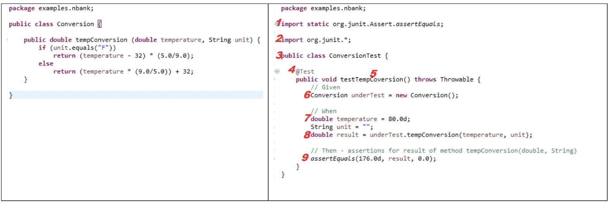
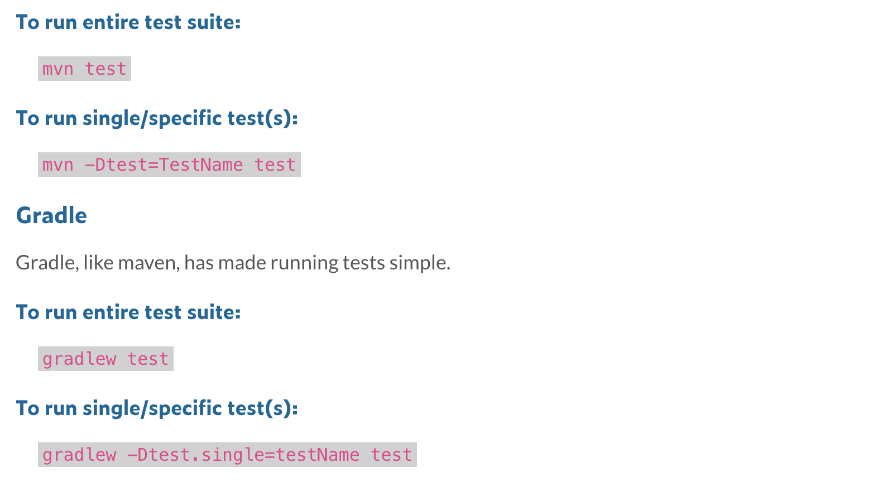
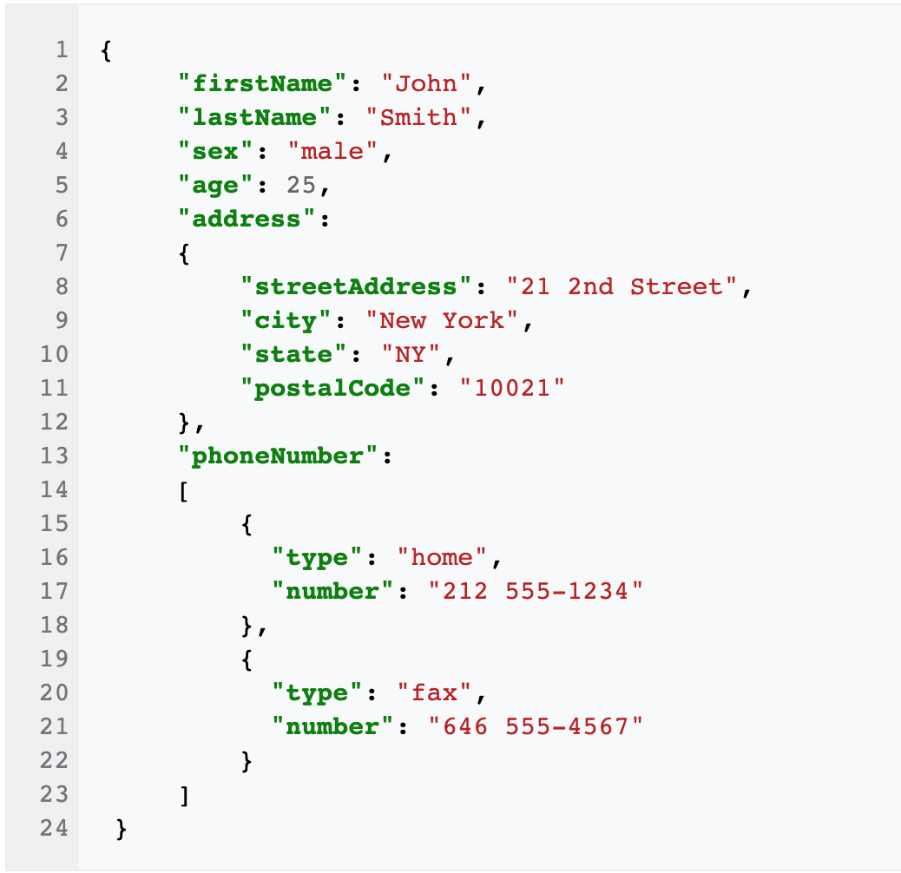
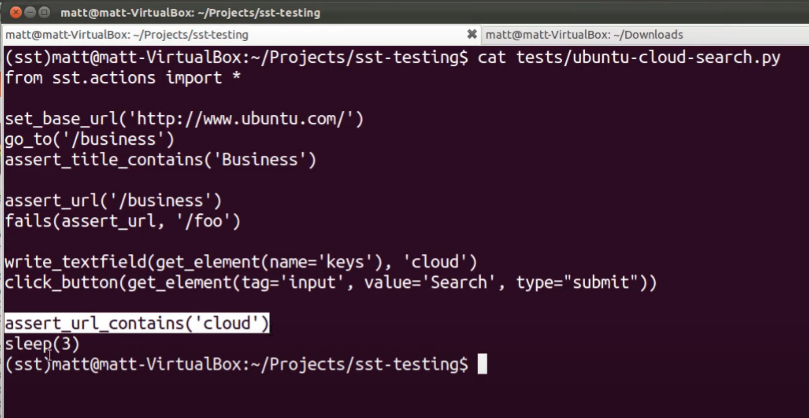

# Background Knowledge for Resume

### The most important three things for web application:

- Frontend
- Backend
- DataBase


##### The connector between frontend and backend called **"API"**

- API - Restful

  @GET - 

  @POST - 

  @PUT -

  @DELETE - 

  frontend get the users' action and inform the backend (and/or database) to implment <u>business logics</u> by interface (API), and then return the result of aciton to frontend.


##### How "JSON" helps between FE and BE

JSON -> BE API


##### The connector between database and backend

```c++
string s1 = "INSERT INTO Customers (C1,C2,C3,C4) VALUES (1,1,1,1,)"
string s2 = "INSERT INTO Application (name, id, url) VALUES ("zhangsan", 18, "www.pronhub.com")"
  
void functioncallsql (string instream) {
  sql.call(instream); 
}

functioncallsql(s2);
```

The connector between backend and database called **Direct Call/ORM (Object Relatinoal Mapping)**


#### Backend

- **Junit: **purpose of unit testing is to examine the individual components or pieces of methods/classes to verify functionality, ensuring the behavior is as expected. The tester chooses inputs to explore particular paths, and determines the appropriate output. 





**JSON:** 




# Interview

## QA

### 1. 10 - 15 min - go through my resume (150 words / min)

#### Active (Best for now)

1. Name, Major, How many coops before
2. **Previous experience / projects**
3. About the Company / Position
4. Why I am fit for the position

#### passive


### 2. 5 - 10 min - ask a technical question

**Basic:**

layout - change the size of the browser see if any icons overlap with each other

Browser Compatibility - Web page works for all browsers

**Advanced**: I 

Dig Idea: 

- BFS - Breadth-first search - Developer
- DFS - Depth-first search - User

Selenium Automation Testing:

- Google Chorme Developer Tools




### 3. Left time do you have questions about the position

You know that one of the hardest thing about automation testing is to manage the elements in the website. My question is how do we manage the elements in the test file?


# Interveiw Behaviour Questions


