# Java基础语法

## 1. 人机交互

### 1.1 什么是cmd？

就是在windows操作系统中，利用命令行的方式去操作计算机。

我们可以利用cmd命令去操作计算机，比如：打开文件，打开文件夹，创建文件夹等。


### 1.2 如何打开CMD窗口？

1. 按下快捷键：win + R。

   	此时会出现运行窗口。

2. 在运行窗口中输出cmd

3. 输出回车。

解惑：

​	cmd默认操作C盘下的users文件夹下的XXX文件夹。（XXX就是计算机名）

 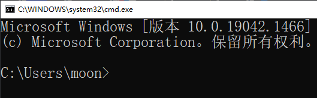


### 1.3 常用CMD命令

 扩展一个小点：

​	在很多资料中都说成是DOS命令，其实是不对的。真正的DOS命令是1981年微软和IBM出品的MS-DOS操作系统中的命令才叫做DOS命令。

​	而在Windows中，win98之前的操作系统是以非图形化的DOS为基础的，可以叫做DOS命令。到了2000年以后，windows逐渐的以图形化界面为主了，这个时候就不能叫DOS命令了，他只是模拟了DOS环境而已，很多的原本的DOS命令已经无法使用了，所以这个时候叫做CMD命令会更准确一些。

常见的CMD命令如下：

| 操作               | 说明                              |
| ------------------ | --------------------------------- |
| 盘符名称:          | 盘符切换。E:回车，表示切换到E盘。 |
| dir                | 查看当前路径下的内容。            |
| cd 目录            | 进入单级目录。cd itheima          |
| cd ..              | 回退到上一级目录。                |
| cd 目录1\目录2\... | 进入多级目录。cd itheima\JavaSE   |
| cd \               | 回退到盘符目录。                  |
| cls                | 清屏。                            |
| exit               | 退出命令提示符窗口。              |


### 1.4 CMD练习

需求：

  利用cmd命令打开自己电脑上的QQ。

完成步骤：

```java
1,确定自己电脑上的QQ安装在哪里
2,启动cmd
3,进入到启动程序QQ.exe所在的路径。
4,输出qq.exe加回车表示启动qq。
```

解惑：

​	在windows操作系统当中，文件名或者文件夹名是忽略大小写的。


### 1.5 环境变量

作用：

​	如果我想要在CMD的任意目录下，都可以启动某一个软件，那么就可以把这个软件的路径配置到环境变量中的PATH里面。

​	==**在启动软件的时候，操作系统会先在当前路径下找，如果在当前路径没有再到环境变量的路径中去找。如果都找不到就提示无法启动。**==

步骤：

- 右键我的电脑，选择属性。
- 点击左侧的高级系统设置
- 选择高级，再点击下面的环境变量。
- 找系统变量里面的PATH
- 把软件的完整路径，配置到PATH当中就可以了。
- （可做可不做）就是把自己配置的路径，移动到最上面。

图解示例如下：

第一步：右键点击我的电脑并选择属性。

（如果无法出现第二步界面，可以打开我的电脑之后右键点击空白处）


第二步：点击高级系统设置。

​	 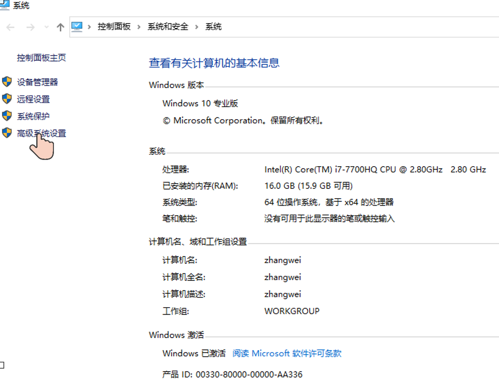

第三步：选择高级，再点击下面的环境变量。

 


第四步：找系统变量里面的PATH

 

第五步：点击新建，把软件的完整路径，配置到PATH当中，再点击确定即可。

第六步：（可做可不做）点击上移，把当前配置的路径移动到最上面。

移动的好处：在CMD中打开软件时，会先找当前路径，再找环境变量，在环境变量中是从上往下依次查找的，如果路径放在最上面查找的速度比较快。

 


## 2. Java概述

### 2.1 Java是什么？

语言：人与人交流沟通的表达方式

计算机语言：人与计算机之间进行信息交流沟通的一种特殊语言

Java是一门非常火的计算机语言。（也叫做编程语言）

我们想要让计算机做一些事情，那么就可以通过Java语言告诉计算机就可以了


### 2.2下载和安装

#### 2.2.1 下载

通过官方网站获取JDK

[http://www.oracle.com](http://www.oracle.com/)

**注意1**：针对不同的操作系统，需要下载对应版本的JDK。

**注意2**：

​	如果你的电脑是windows32位的，建议重装系统，重装成64位的操作系统。

​	因为Java从9版本开始，就已经不提供32位版本的安装包了。

​	如果自己不愿意下载，到今天day01资料文件中，也有对应的安装包。

#### 2.2.2 安装

​	傻瓜式安装，下一步即可。默认的安装路径是在C:\Program Files下。

建议：

- 安装路径不要有中文，不要有空格等一些特殊的符号。
- 以后跟开发相关的所有软件建议都安装在同一个文件夹中，方便管理。

#### 2.2.3 JDK的安装目录介绍

| 目录名称 | 说明                                                         |
| -------- | ------------------------------------------------------------ |
| bin      | 该路径下存放了JDK的各种工具命令。javac和java就放在这个目录。 |
| conf     | 该路径下存放了JDK的相关配置文件。                            |
| include  | 该路径下存放了一些平台特定的头文件。                         |
| jmods    | 该路径下存放了JDK的各种模块。                                |
| legal    | 该路径下存放了JDK各模块的授权文档。                          |
| lib      | 该路径下存放了JDK工具的一些补充JAR包。                       |


### 2.3 HelloWorld小案例

HelloWorld案例是指在计算机屏幕上输出“a01_HelloWorld”这行文字。各种计算机语言都习惯使用该案例作为第一个演示案例。

#### 2.3.1 Java程序开发运行流程

开发Java程序，需要三个步骤：编写程序，编译程序，运行程序。

#### 2.3.2 HelloWorld案例的编写

1. 新建文本文档文件，修改名称为HelloWorld.java。

**注意**：后缀名为java的才是java文件。

2. 用记事本打开HelloWorld.java文件，输写程序内容。

**注意**：代码要跟我编写的完全保持一致。

```java
public class a01_HelloWorld {
	public static void main(String[] args) {
		System.out.println("a01_HelloWorld");
	}
}
```

3. 保存

**注意**：未保存的文件在左上角会有*符号标记

4. 编译文件。编译后会产生一个class文件。

   java文件：程序员自己编写的代码。

   class文件：交给计算机执行的文件。

5. 运行代码

   **注意**：运行的是编译之后的class文件。

> 用到两个命令：
>
> ​	javac + 文件名 + 后缀名 （就是编译java文件）
>
> ​	java + 文件名（运行编译之后的class文件）


### 2.4 HelloWorld案例常见问题

#### 2.4.1 BUG

​	在电脑系统或程序中，隐藏着的一些未被发现的缺陷或问题统称为bug（漏洞）。

#### 2.4.2 BUG的解决

1. 具备识别BUG的能力：多看
2. 具备分析BUG的能力：多思考，多查资料
3. 具备解决BUG的能力：多尝试，多总结

#### 2.4.3 HelloWorld常见问题

1、非法字符问题。Java中的符号都是英文格式的。

2、大小写问题。Java语言对大小写敏感（区分大小写）。

3、在系统中显示文件的扩展名，避免出现HelloWorld.java.txt文件。

4、编译命令后的java文件名需要带文件后缀.java

5、运行命令后的class文件名（类名）不带文件后缀.class

...

#### 常见错误代码1：

```java
publicclass a01_HelloWorld{
    public static void main(String[] args){
        System.out.println("a01_HelloWorld");
    }
}
```

问题：

​	public和class之间缺少一个空格。

技巧：一般来讲在单词之间的空格是不能省略的。

​	如果是单词和符号之间的空格是可以省略的。

#### 常见错误代码2：

```java
public class a01_HelloWorld{
    public static void main(String[] args){
        system.out.println("a01_HelloWorld");
    }
}
```

问题：

​	system首字母必须大写。

技巧：

​	Java代码中，是严格区分大小写的。

​	所以该大写的地方一定要大写，该小写的地方一定要小写。多多练习。

#### 常见错误代码3：

```java
public class a01_HelloWorld{
    public static void main(String[] args){
        System.out.println(a01_HelloWorld);
    }
}
```

问题：

​	第三行代码中的HelloWorld必须用双引号引起来，否则就会出现问题。

#### 常见错误代码4：

```java
public class a01_HelloWorld{
    public static void main(String[] args){
        System.out.println("a01_HelloWorld")；
    }
}
```

问题：

​	在以后代码当中，所有的标点符号必须是英文状态下的。

技巧：

​	可以在输入法中进行对应的设置。

### 2.5 环境变量

#### 2.5.1 为什么配置环境变量

​	开发Java程序，需要使用JDK提供的开发工具（比如javac.exe、java.exe等命令），而这些工具在JDK的安装目录的bin目录下，如果不配置环境变量，那么这些命令只可以在bin目录下使用，而我们想要在任意目录下都能使用，所以就要配置环境变量。

注意：现在最新从官网上下载的JDK安装时会自动配置javac、java命令的路径到Path环境变量中去 ，所以javac、java可以直接使用。

#### 2.5.2配置方式

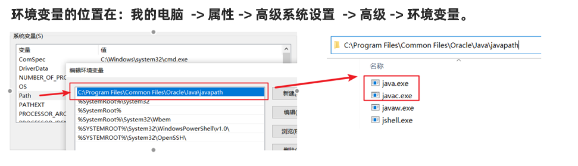


以前下载的老版本的JDK是没有自动配置的，而且自动配置的也只包含了4个工具而已，所以我们需要删掉已经配置完毕的，再次重新配置Path环境变量。

①**JAVA_HOME**：告诉操作系统JDK安装在了哪个位置（未来其他技术要通过这个找JDK）


②**Path**：告诉操作系统JDK提供的javac(编译)、java(执行)命令安装到了哪个位置

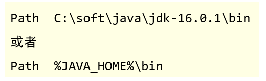


#### 2.5.3win10的bug

当电脑重启之后，环境变量失效了。表示操作系统不支持自定义的环境变量。

步骤：

- 还是要配置JAVA_HOME给以后的相关软件去使用

- 我们可以把java和javac的完整路径配置到PATH当中。

  E:\develop\JDK\bin


### 2.6 Notepad++

#### 2.6.1下载

​	打开百度，搜索一下notepad++就可以了。

​	day01的资料文件夹里面也有对应的安装包。

#### 2.6.2 安装

傻瓜式安装，直接点击下一步就可以了。

​	对安装路径有两个小建议：

- 路径不要有中文，不要有空格，不要有一些特殊符号
- 建议最好把所有的跟开发相关的软件都放在一起，方便管理。

#### 2.6.3 设置

​	右键点击java文件，选择edit with notepad++。

​	点击设置，再点击首选项。在弹出的页面当中，左侧选择新建，中间选择Java，右侧选择ANSI。

#### 2.6.4 练习

​	利用notepad++去编写一个HelloWorld并能成功编译和运行。


### 2.7 Java语言的发展

三个版本：

* Java5.0：这是Java的第一个大版本更新。
* Java8.0：这个是目前绝大数公司正在使用的版本。因为这个版本最为稳定。
* Java15.0：这个是我们课程中学习的版本。

解惑：

​	我们学的跟工作中使用的版本不太一样啊。会不会影响以后工作呢？

向下兼容。新的版本只是在原有的基础上添加了一些新的功能而已。

举例：

用8版本开发的代码，用11版本能运行吗？必须可以的。

用11版本开发的代码，用8版本能运行吗？不一定。

如果11版本开发的代码，没有用到9~11的新特性，那么用8是可以运行的。

如果11版本开发的代码，用到了9~11的新特性，那么用8就无法运行了。


### 2.8 Java的三大平台

​	JavaSE、JavaME、JavaEE

#### 2.8.1 JavaSE

​	是其他两个版本的基础。

#### 2.8.2 JavaME

​	Java语言的小型版，用于嵌入式消费类电子设备或者小型移动设备的开发。

​	其中最为主要的还是小型移动设备的开发（手机）。渐渐的没落了，已经被安卓和IOS给替代了。

​	但是，安卓也是可以用Java来开发的。

#### 2.8.3 JavaEE

​	用于Web方向的网站开发。（主要从事后台服务器的开发）

​	在服务器领域，Java是当之无愧的龙头老大。


### 2.9 Java的主要特性

- 面向对象
- 安全性
- 多线程
- 简单易用
- 开源
- 跨平台

#### 2.9.1 Java语言跨平台的原理

- 操作系统本身其实是不认识Java语言的。
- 但是针对于不同的操作系统，Java提供了不同的虚拟机。

虚拟机会把Java语言翻译成操作系统能看得懂的语言。

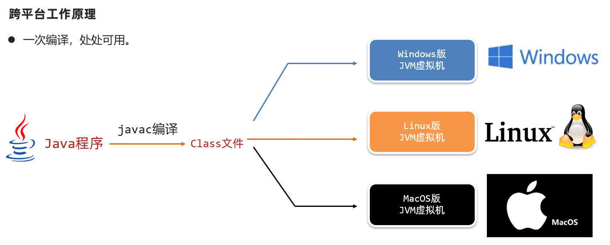

### 2.10 JRE和JDK


JVM（Java Virtual Machine），Java虚拟机

JRE（Java Runtime Environment），Java运行环境，包含了JVM和Java的核心类库（Java API）

JDK（Java Development Kit）称为Java开发工具，包含了JRE和开发工具

总结：我们只需安装JDK即可，它包含了java的运行环境和虚拟机。


## 3. 注释

​	注释是对代码的解释和说明文字。

Java中的注释分为三种：

* 单行注释：

~~~java
// 这是单行注释文字
~~~

* 多行注释：

~~~java
/*
这是多行注释文字
这是多行注释文字
这是多行注释文字
*/
注意：多行注释不能嵌套使用。
~~~

* 文档注释（暂时用不到）：

```java
/**
这是多行注释文字
这是多行注释文字
这是多行注释文字
*/
```


## 4. 关键字

### 4.1 概念

被Java赋予了特定含义的英文单词。

当我们在代码中写了关键字之后，程序在运行的时候，就知道要做什么事情了。

注意：关键字很多，不用刻意去记。

| **abstract**   | **assert**       | **boolean**   | **break**      | **byte**   |
| -------------- | ---------------- | ------------- | -------------- | ---------- |
| **case**       | **catch**        | **char**      | **class**      | **const**  |
| **continue**   | **default**      | **do**        | **double**     | **else**   |
| **enum**       | **extends**      | **final**     | **finally**    | **float**  |
| **for**        | **goto**         | **if**        | **implements** | **import** |
| **instanceof** | **int**          | **interface** | **long**       | **native** |
| **new**        | **package**      | **private**   | **protected**  | **public** |
| **return**     | **strictfp**     | **short**     | **static**     | **super**  |
| **switch**     | **synchronized** | **this**      | **throw**      | **throws** |
| **transient**  | **try**          | **void**      | **volatile**   | **while**  |


### 4.2 第一个关键字class

表示定义一个类。创建一个类。

**类：Java项目最基本的组成单元**，一个完整的Java项目有可能会有成千上万个类来组成的。

class后面跟随的就是这个类的名字，简称：类名。

在类名后面会有一对大括号，表示这个类的内容。

举例：

```java
public class a01_HelloWorld{
    
   
}
```

解释：class表示定义类。

类名：a01_HelloWorld

HelloWorld后面的大括号表示这个类的范围。


## 5. 字面量

作用：告诉程序员，数据在程序中的书写格式。

| **字面量类型** | **说明**                                  | **程序中的写法**           |
| -------------- | ----------------------------------------- | -------------------------- |
| 整数           | 不带小数的数字                            | 666，-88                   |
| 小数           | 带小数的数字                              | 13.14，-5.21               |
| 字符           | 必须使用单引号，有且仅能一个字符          | ‘A’，‘0’，   ‘我’          |
| 字符串         | 必须使用双引号，内容可有可无              | “a01_HelloWorld”，“黑马程序员” |
| 布尔值         | 布尔值，表示真假，只有两个值：true，false | true 、false               |
| 空值           | 一个特殊的值，空值                        | 值是：null                 |

~~~java
public class Demo {
    public static void main(String[] args) {
        System.out.println(10); // 输出一个整数
        System.out.println(5.5); // 输出一个小数
        System.out.println('a'); // 输出一个字符
        System.out.println(true); // 输出boolean值true
        System.out.println("欢迎来到黑马程序员"); // 输出字符串
    }
}
~~~


**区分技巧**

1. 不带小数点的数字都是整数类型的字面量。
2. 只要带了小数点，那么就是小数类型的字面量。
3. 只要用双引号引起来的，不管里面的内容是什么，不管里面有没有内容，都是字符串类型的字面量。
4. 字符类型的字面量必须用单引号引起来，不管内容是什么，但是个数有且只能有一个。
5. 布尔类型的字面量只有两个值，true、false。
6. 空类型的字面量只有一个值，null。


## 6. 变量

### 6.1 什么是变量？

变量就在程序中临时存储数据的容器。但是这个容器中只能存一个值。

### 6.2 变量的定义格式

数据类型 变量名 = 数据值；

#### 6.2.1 格式详解

**数据类型：限定了变量当中能存储什么类型的数据。**

如果要存10，那么数据类型就需要写整数类型。

如果要存10.0，那么数据类型就需要写小数类型。

**变量名：其实就是这个容器的名字。**

当以后想要使用变量里面的数据时，直接使用变量名就可以了。

数据值：真正存储在容器中的数据。

分号：表示语句的结束，就跟以前写作文时候的句号是一样的。

#### 6.2.2 常用的数据类型

整数：int

小数：double

其他数据类型稍后讲解

举例：

```java
public class VariableDemo{
	public static void main(String[] args){
		//定义一个整数类型的变量
		//数据类型 变量名 = 数据值;
		int a = 16;
		System.out.println(a);//16
		
		//定义一个小数类型的变量
		double b = 10.1;
		System.out.println(b);//10.1
	}
}
```


#### 6.2.3 变量的注意事项

- 变量名不能重复
- 在一条语句中，可以定义多个变量。但是这种方式影响代码的阅读，所以了解一下即可。
- 变量在使用之前必须要赋值。

案例：

```java
public class VariableDemo2{
	public static void main(String[] args){
		//1.变量名不允许重复
		//int a = 10;
		//int a = 20;
		//System.out.println(a);
		
		//2.一条语句可以定义多个变量
		//了解。
		//int a = 10, b = 20, c = 20,d = 20;
		//System.out.println(a);//?
		//System.out.println(b);//?
		
		
		//3.变量在使用之前必须要赋值
		int a = 30;
		System.out.println(a);
	}
}
```


### 6.3 变量的练习

需求：说出公交车到终点站之后，车上一共有多少乘客？

一开始没有乘客。

第一站：上去一位乘客，没有下来乘客。

第二站：上去两位乘客，下来一位乘客。

第三站：上去两位乘客，下来一位乘客。

第四站：没有上去乘客，下来一位乘客。

第五站：上去一位乘客，没有下来乘客。

问：到了终点站之后，车上一共多少乘客？

代码解析：

```java
public class VariableTest1{
	//主入口
	public static void main(String[] args){
		//一开始没有乘客。
		int count = 0;
		//第一站：上去一位乘客
		//在原有的基础上 + 1
		count = count + 1;
		//System.out.println(count);
		//第二站：上去两位乘客，下来一位乘客
		count = count + 2 - 1; 
		//第三站：上去两位乘客，下来一位乘客
		count = count + 2 - 1;
		//第四站：下来一位乘客
		count = count - 1;
		//第五站：上去一位乘客
		count = count + 1;
		//请问：到了终点站，车上一共几位乘客。
		System.out.println(count);//3
	}
}
```


## 7. 数据类型

### 7.1 Java语言数据类型的分类

- 基本数据类型
- 引用数据类型（面向对象的时候再深入学习）

### 7.2 基本数据类型的四类八种

| 数据类型 | 关键字  | 内存占用 |                 取值范围                  |
| :------: | :-----: | :------: | :---------------------------------------: |
|   整数   |  byte   |    1     |    负的2的7次方 ~ 2的7次方-1(-128~127)    |
|          |  short  |    2     | 负的2的15次方 ~ 2的15次方-1(-32768~32767) |
|          |   int   |    4     |        负的2的31次方 ~ 2的31次方-1        |
|          |  long   |    8     |        负的2的63次方 ~ 2的63次方-1        |
|  浮点数  |  float  |    4     |        1.401298e-45 ~ 3.402823e+38        |
|          | double  |    8     |      4.9000000e-324 ~ 1.797693e+308       |
|   字符   |  char   |    2     |                  0-65535                  |
|   布尔   | boolean |    1     |                true，false                |

**说明**

e+38表示是乘以10的38次方，同样，e-45表示乘以10的负45次方。

**在java中整数默认是int类型，浮点数默认是double类型。**

**需要记忆以下几点**

**byte类型的取值范围：**

-128 ~ 127

**int类型的大概取值范围：**

-21亿多  ~ 21亿多

整数类型和小数类型的取值范围大小关系：

double > float > long > int > short > byte

最为常用的数据类型选择：

- 在定义变量的时候，要根据实际的情况来选择不同类型的变量。

  比如：人的年龄，可以选择byte类型。

  比如：地球的年龄，可以选择long类型。

- 如果整数类型中，不太确定范围，那么默认使用int类型。

- 如果小数类型中，不太确定范围，那么默认使用double类型。

- 如果要定义字符类型的变量，那么使用char

- 如果要定义布尔类型的变量，那么使用boolean


### 7.3 定义8种基本数据类型变量

```java
public class VariableDemo3{
    public static void main(String[] args){
        //1.定义byte类型的变量
        //数据类型 变量名 = 数据值;
        byte a = 10;
        System.out.println(a);

        //2.定义short类型的变量
        short b = 20;
        System.out.println(b);

        //3.定义int类型的变量
        int c = 30;
        System.out.println(c);

        //4.定义long类型的变量
        long d = 123456789123456789L;
        System.out.println(d);

        //5.定义float类型的变量
        float e = 10.1F;
        System.out.println(e);

        //6.定义double类型的变量
        double f = 20.3;
        System.out.println(f);

        //7.定义char类型的变量
        char g = 'a';
        System.out.println(g);

        //8.定义boolean类型的变量
        boolean h = true;
        System.out.println(h);

    }
}
```

**注意点**

- 如果要定义 一个整数类型的变量，不知道选择哪种数据类型了，默认使用int。
- 如果要定义 一个小数类型的变量，不知道选择哪种数据类型了，默认使用double。
- 如果要定义一个long类型的变量，那么在数据值的后面需要加上L后缀。（大小写都可以，建议大写。）
- 如果要定义一个float类型的变量，那么在数据值的后面需要加上F后缀。（大小写都可以）


### 7.4 练习1

需求：定义5个变量记录老师的信息并打印

代码示例：

```java
public class VariableTest1{
	public static void main(String[] args){
		//1.定义字符串类型的变量记录老师的姓名
		String name = "黑马谢广坤";
		//2.定义整数类型的变量记录老师的年龄
		int age = 18;
		//3.定义字符类型的变量记录老师的性别
		char gender = '男';
		//4.定义小数类型的变量记录老师的身高
		double height = 180.1;
		//5.定义布尔类型的变量记录老师的婚姻状况
		boolean flag = true;
		
		//输出5个变量的值
		System.out.println(name);
		System.out.println(age);
		System.out.println(gender);
		System.out.println(height);
		System.out.println(flag);
		
	}
}
```


### 7.5 练习2

需求：将（电影名称，主演，年份，评分）四个信息选择不同类型的变量，随后打印出来。

 代码示例：

```java
public class VariableTest2{
	public static void main(String[] args){
		//1.定义字符串变量记录电影的名称
		String movie = "送初恋回家";
		//2.定义三个变量记录主演的名字
		String name1 = "刘鑫";
		String name2 = "张雨提";
		String name3 = "高媛";
		//3. 定义整数类型的变量记录年龄的年份
		int year = 2020;
		//4.定义小数类型的变量记录电影的评分
		double score = 9.0;
		
		//打印变量的信息
		System.out.println(movie);
		System.out.println(name1);
		System.out.println(name2);
		System.out.println(name3);
		System.out.println(year);
		System.out.println(score);
		
	}
}
```


### 7.6 练习3

需求：选择其中一部手机，将（手机价格，手机品牌）两个信息选择不同类型的变量，随后打印出来。 

 代码示例：

```java
public class VariableTest3{
	public static void main(String[] args){
		//1.定义小数类型的变量记录手机的价格
		double price = 5299.0;
		
		//2.定义字符串类型的变量记录手机的品牌
		String brand = "华为";
		
		//输出变量记录的值
		System.out.println(price);
		System.out.println(brand);
	}
}
```


## 8. 标识符

业内大多数程序员都在遵守阿里巴巴的命名规则。

在day02的资料文件夹中有。

### 8.1 硬性要求：

必须要这么做，否则代码会报错。

- 必须由数字、字母、下划线_、美元符号$组成。
- 数字不能开头
- 不能是关键字
- 区分大小写的。

### 8.2 软件建议：

如果不这么做，代码不会报错，但是会让代码显得比较low。

### 8.2.1 小驼峰命名法

适用于变量名和方法名

* 如果是一个单词，那么全部小写，比如：name

* 如果是多个单词，那么从第二个单词开始，首字母大写，比如：firstName、maxAge

### 8.2.2 大驼峰命名法

适用于类名

* 如果是一个单词，那么首字母大写。比如：Demo、Test。

* 如果是多个单词，那么每一个单词首字母都需要大写。比如：a01_HelloWorld

不管起什么名字，都要做到见名知意。

### 阿里巴巴命名规范细节：

1. 尽量不要用拼音。但是一些国际通用的拼音可视为英文单词。

   正确：alibaba、hangzhou、nanjing

   错误：jiage、dazhe

2. 平时在给变量名、方法名、类名起名字的时候，不要使用下划线或美元符号。

   错误：_name

   正确：name


## 9. 键盘录入

键盘录入的实际功能Java已经帮我们写好了，不需要我们自己再实现了，而Java写好的功能都放在了Scanner这个类中，所以，我们只要直接使用Scanner这个类就可以了。

使用步骤：

**第一步：**

导包：其实就是表示先找到Scanner这个类在哪。

**第二步：**

创建对象：其实就表示申明一下，我准备开始用Scanner这个类了。

**第三步：**

接收数据：也是真正干活的代码。

代码示例：

```java
//1.导包，其实就是先找到Scanner这个类在哪
import java.util.Scanner;
public class ScannerDemo1{
	public static void main(String[] args){
		//2.创建对象，其实就是申明一下，我准备开始用Scanner这个类了。
		Scanner sc = new Scanner(System.in);
		//3.接收数据
		//当程序运行之后，我们在键盘输入的数据就会被变量i给接收了
		System.out.println("请输入一个数字");
		int i = sc.nextInt();
		System.out.println(i);
	}
}
```


## 10. IDEA

### 10.1 IDEA概述

IDEA 全称 IntelliJ IDEA，是用于Java语言开发的集成环境，它是业界公认的目前用于Java程序开发最好的工具。

**集成环境：**

把代码编写，编译，执行，调试等多种功能综合到一起的开发工具。

### 10.2 IDEA的下载和安装

#### 10.2.1 下载

​	可以到官方网站自行下载，网址为：https://www.jetbrains.com/idea

​	今天的资料中，对应的安装包也提高给大家了。

#### 10.2.2 安装

- 到资料文件夹中，双击安装包。
- 点击next，准备安装


- 点击Browse修改安装路径。

  修改完毕点击next

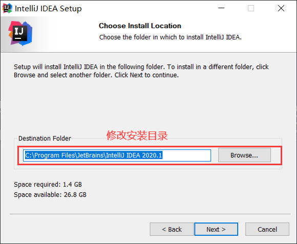

- 勾选64-bit launcher。表示在桌面新建一个64位的快捷方式。

  其他的不要勾选。

  点击next。


- 点击Install，准备安装。

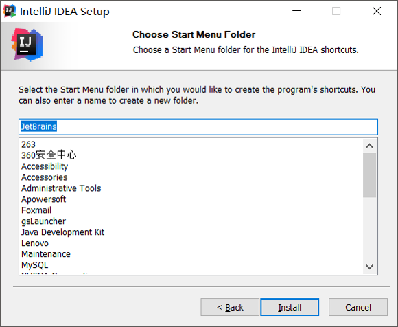

- 等进度条读取完毕之后，会有最终界面提示。

  点击finish即可。


- 第一次启动会询问，是否导入一些设置。

  选择第二个不导入，保持默认设置，再点击OK。


- 选择背景主题

  左边是黑色背景。右边是白色背景。

  这个可以根据自己的喜好来选择。

  选择完毕点击右下角的next


- 在本界面让我们购买idea。

  因为我们是学习阶段，所以可以使用免费使用30天。

  点击第一排第二个。Evaluate for free

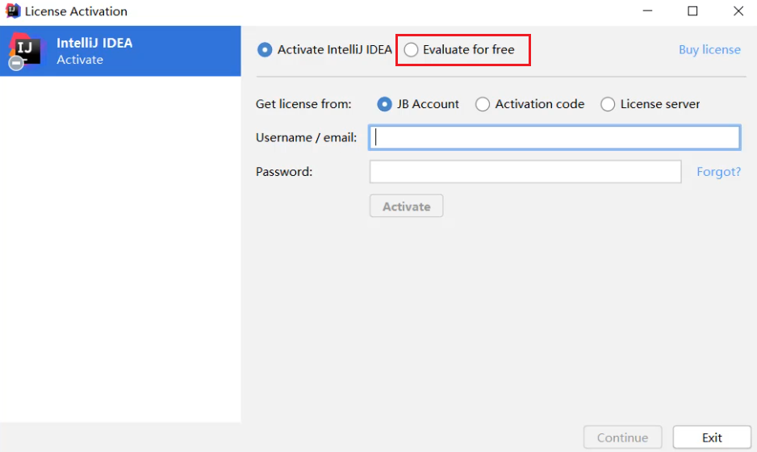

- 点击蓝色的Evaluate，就可以开始免费试用30天了。

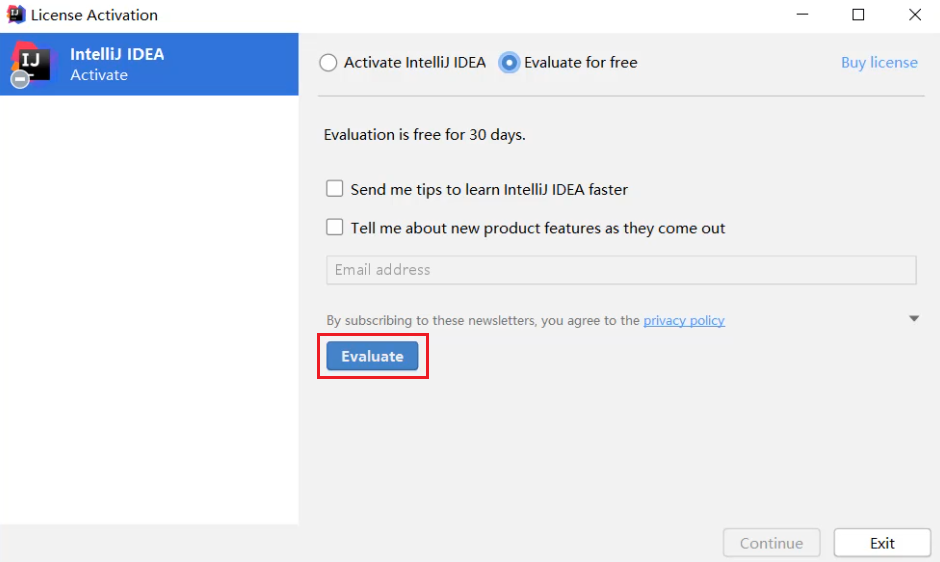

- 当看到这个界面，就表示idea已经成功安装完毕

  可以点击右上角关闭。


### 10.3 IDEA中层级结构介绍

#### 10.3.1 结构分类

- project（项目、工程）
- module（模块）
- package（包）
- class（类）

#### 10.3.2 结构介绍

为了让大家更好的吸收，package这一层级，我们后面再学习，先学习最基础的project、module、class。

##### project（项目、工程）

淘宝、京东、黑马程序员网站都属于一个个项目，IDEA中就是一个个的Project。

##### module（模块）

在一个项目中，可以存放多个模块，不同的模块可以存放项目中不同的业务功能代码。在黑马程序员的官方网站中，至少包含了以下模块：

- 论坛模块
- 报名、咨询模块

为了更好的管理代码，我们会把代码分别放在两个模块中存放。

##### package（包）

一个模块中又有很多的业务，以黑马程序员官方网站的论坛模块为例，至少包含了以下不同的业务。

- 发帖
- 评论

为了把这些业务区分的更加清楚，就会用包来管理这些不同的业务。

##### class（类）

就是真正写代码的地方。

#### 10.3.3 小结

- **层级关系**

  **==project - module - package - class==**

- 包含数量

  project中可以创建多个module
  ​module中可以创建多个package
  ​package中可以创建多个class

  这些结构的划分，是为了方便管理类文件的。

### 10.4 IDEA中的第一个代码

##### 10.4.1 操作步骤

- 创建Project 项目
- 创建Module 模块
- 创建class   类
- 在类中编写代码
- 完成编译运行

##### 10.4.2 分步图解

- 双击启动图标

  

- 首先要新建一个项目

  点击creat new project

  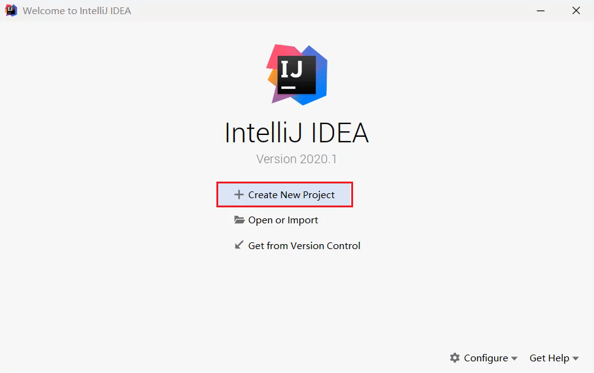

- 我们要从0开始写代码，所以新建一个空的什么都没有的项目。

  点击左下方的Empty Project

  再点击右下角的next


- 输入项目的名称

  输入项目的存放路径

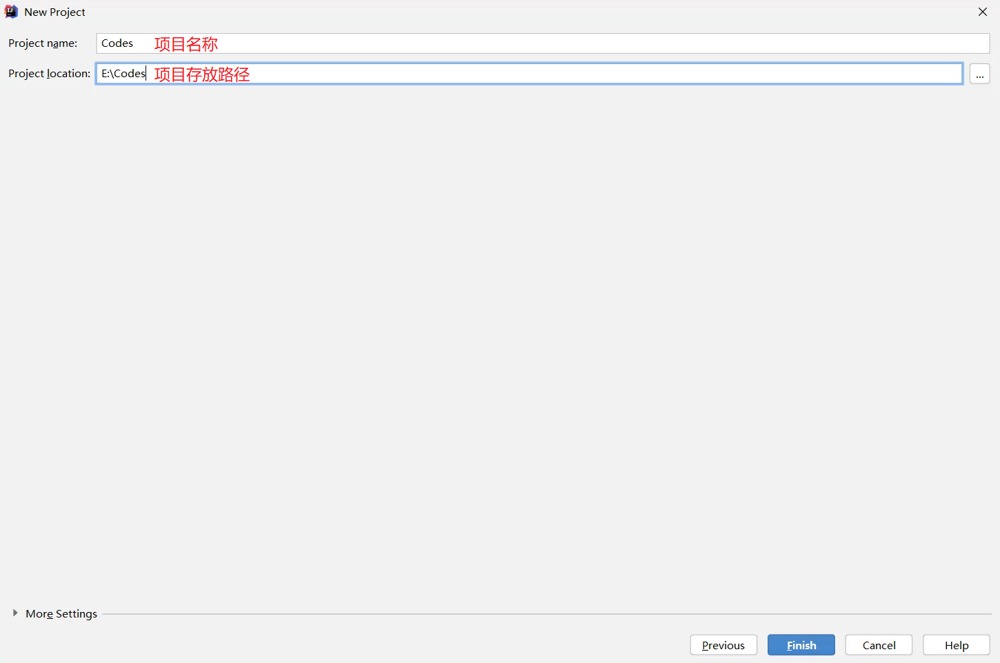

- 点击ok。idea会帮助我们在本地创建一个项目文件夹

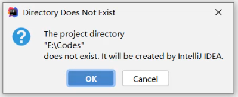

- 点击Module，准备新建一个模块

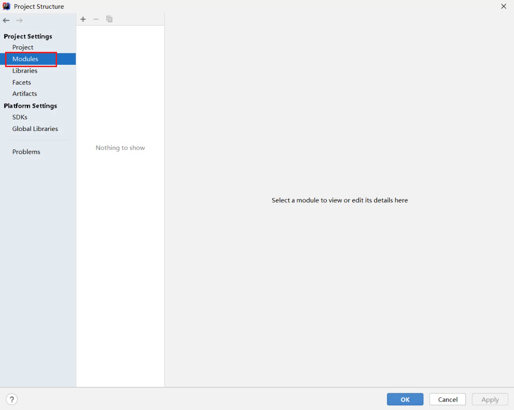

- 点击+

  再点击New Module


- 我们要编写Java代码，所以要新建一个Java模块。

  点击Java

  再点击右下角的next


- 输入模块的名称

  再点击右下角的Next


- 成功新建一个模块之后，中间就会出现刚刚新建的模块

  点击右下角的OK

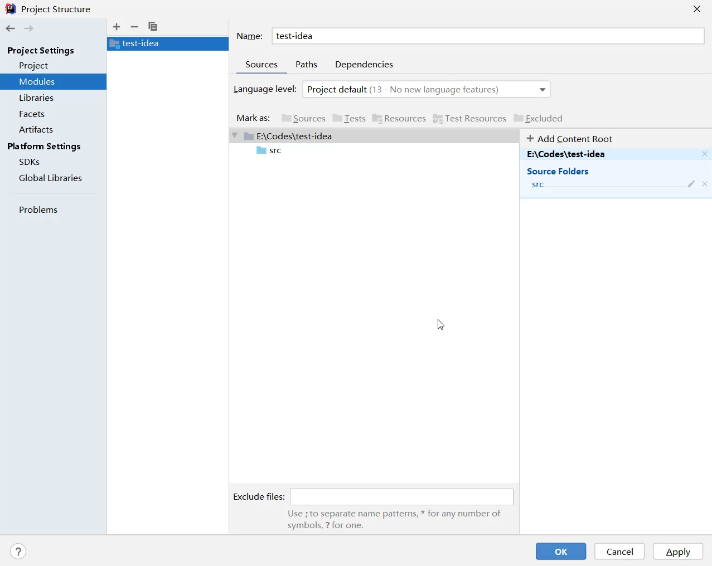

- 回到主界面

  展开刚刚新建的模块

  右键点击src，选择New，选择Java Class


- 输入类名

  再按回车

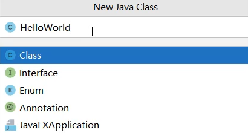

- 由于字体比较小

  所以，我们要设置一下字体。

  点击File，选择Setting。

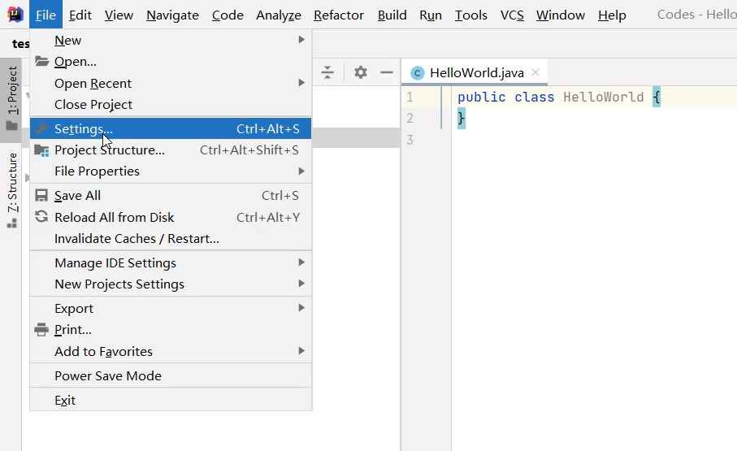

- 搜索一下font

  在右边可以输入Size的数值来调节代码字体的大小。

  设置完毕后点击右下角的OK

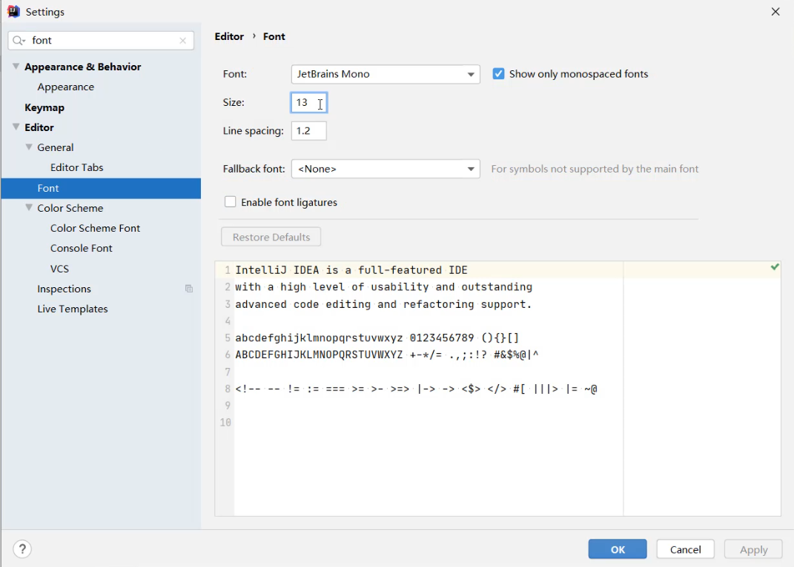

- 编写代码


- 运行代码

  右键空白处，点击Run

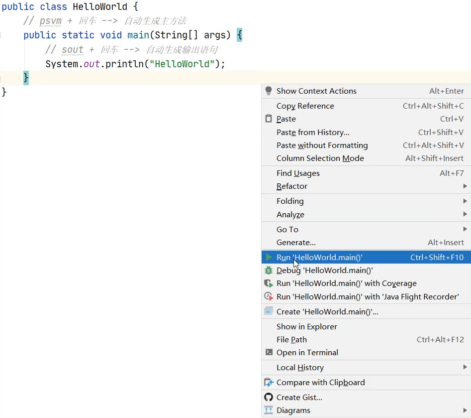


- 最下面会弹出控制台。

  所有输出语句中的内容，都会在控制台上展示。

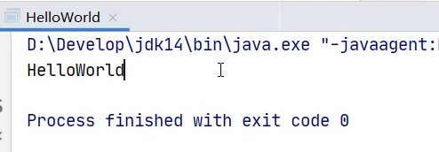


### 10.5 IDEA中类的相关操作

#### 10.5.1 类的相关操作

- 新建类文件
- 删除类文件
- 修改类文件

#### 10.5.2 新建类文件

- 所有的Java代码都会写在src文件夹当中。

  所以，右键点击src，选择new，点击Java Class

  

- 输入类名，再按回车

  

- 新建完毕

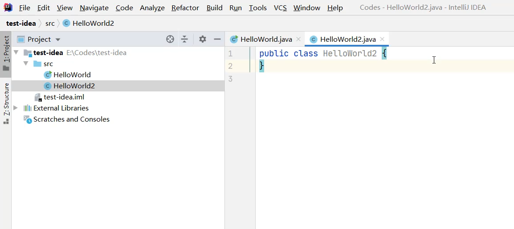

#### 10.5.3 修改类名

- 右键点击想要修改的文件

  点击Refactor

  再点击Rename


- 输入想要修改的名字

  输入完毕点击下面的Refactor


- 文件名和类名均已修改成功

  

#### 10.5.4 删除类文件

- 想要删除哪个文件，就右键点击该文件

  选择Delete即可


- 在弹出的界面中点击OK，确定删除


> 小贴士：
>
> 此时删除是不走回收站的，直接从硬盘中删掉了。


### 10.6 IDEA中模块的相关操作

#### 10.6.1 模块的相关操作

- 新建模块
- 删除模块
- 修改模块
- 导入模块

#### 10.6.2 新建模块

- 点击File，选择Project Structure


- 选择Module


- 点击+

  选择New Module

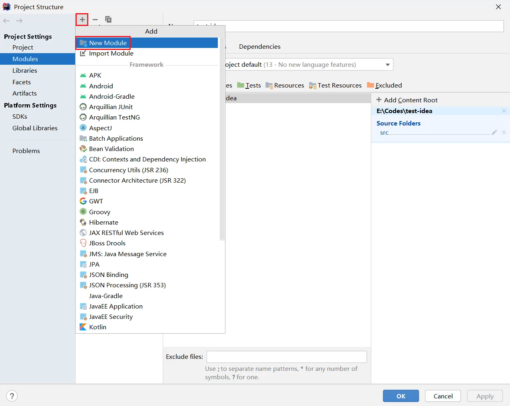

- 要创建一个Java模块，所以选择第一个Java

  点击右下角的Next


- 输入模块的名称

  点击右下角的Finish

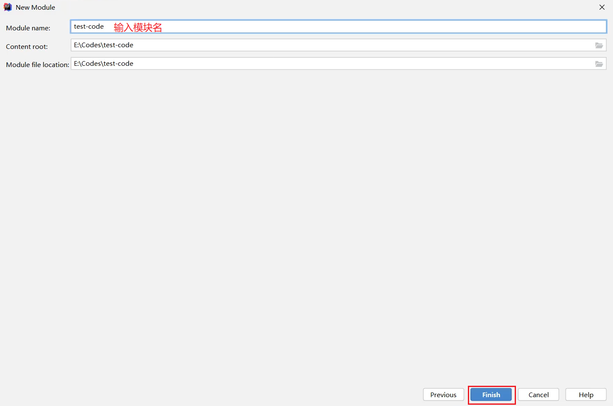

- 成功新建完毕之后，在中间空白区域就出现了刚刚新建的模块

  点击右下角的OK


- 在主界面中，也会出现刚刚新建的模块


#### 8.6.3 删除模块

- 右键点击模块

  选择Remove Module


- 选择Remove，表示确定删除


- 此时发现，在IDEA列表页面，删除的模块已经不在了。


> 小贴士：
>
> ==此时删除仅仅是从IDEA列表中的删除，在本地硬盘中还是存在的。==


#### 8.6.4 修改模块

- 右键点击模块名

  选择Refactor

  再选择Rename

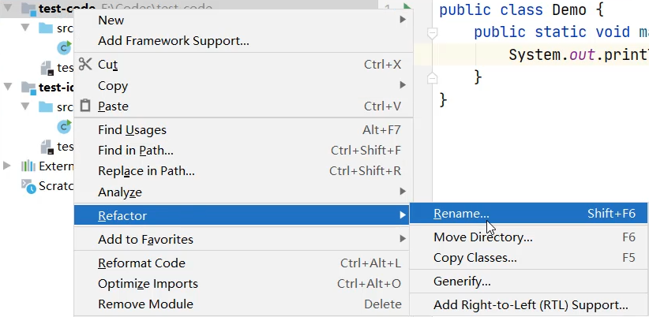

- 选择第三个修改模块名和本地文件夹名

  点击OK


- 输入要修改的新的模块名

  输入完毕点击Refactor


- 回到主界面，就发现模块名和文件夹名都已经修改完毕

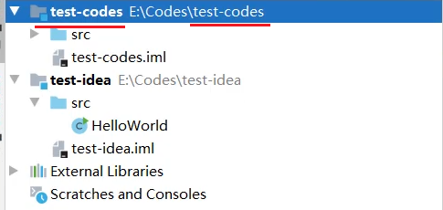


#### 8.6.5 导入模块

- 点击File，选择Project Structure


- 选择Module

  点击+

  选择Import Module


- 从本地硬盘中选择要导入的模块

  再点击OK


- 不断点击Next


- 如果中间出现提示框，则点击Overwrite

  然后继续点击右下角的Next


- 一直点到finish为止


- 成功导入后，在中间位置就会出现导入的模块信息


- 在主界面中也会出现导入的模块信息


- 展开模块点击模块中的Java文件，会发现代码报错。

  是因为导入模块跟JDK没有关联导致。


- 可以点击右上角的Setup SDK

  再选择已经安装的JDK版本即可

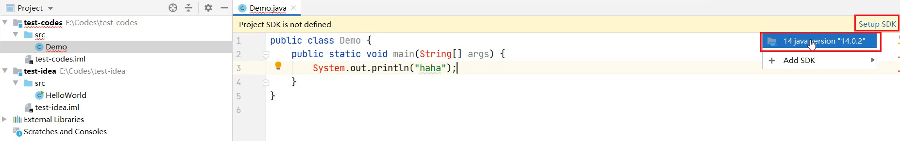

- 导入完毕之后，代码就恢复正常不会报错了


### 10.7 IDEA中项目的相关操作

#### 10.7.1 项目的相关操作

- 关闭项目
- 打开项目
- 修改项目
- 新建项目

#### 10.7.2 关闭项目

- 点击File，选择Close Project即可

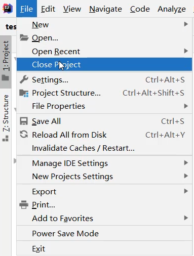

- 刚刚操作的项目就已经关闭了

  左侧是项目列表，如果要再次打开该项目，直接点击即可。

  右侧有create new project，可以再建一个新的项目


- 鼠标放在项目上，后面会出现一个叉。

  如果点击了这里的叉，会在IDEA的列表中删除。不会删除本地硬盘上的项目。


#### 10.7.3 打开项目

- 在本界面还可以打开本地已经存在的项目

  点击Open or Import


- 选择要打开的项目

  点击OK


- 项目就被打开了。


#### 10.7.4 修改项目

- 点击File，选择Project Structure

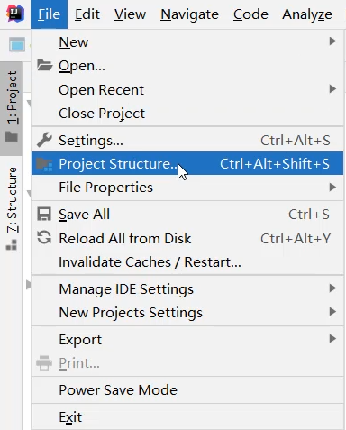

- 在这个界面，默认是Module

  所以，要先点击Project

  在右侧页面中，输入新的项目名称

  修改JDK版本和编译版本都变成JDK14

  再点击OK


- 此时发现，项目名称已经修改完毕


- 但是本地文件夹的名字还没有修改


- 需要先关闭当前项目


- 点击项目后面的叉，从列表中移除项目


- 到本地硬盘中手动修改文件夹的名称

 

- 点击Open or Import重新打开项目


- 选择修改之后的项目

  点击OK


- 此时会发现，项目名称和本地硬盘文件夹的名称都已经修改完毕了


#### 10.7.5 新建项目

- 点击File

  选择New

  点击Project

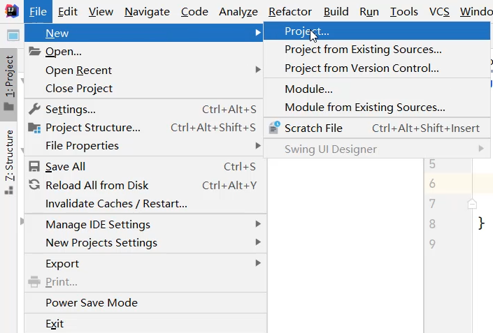

- 同样还是创建一个什么都没有的空项目


- 输入项目的名称

  点击右下角的finish

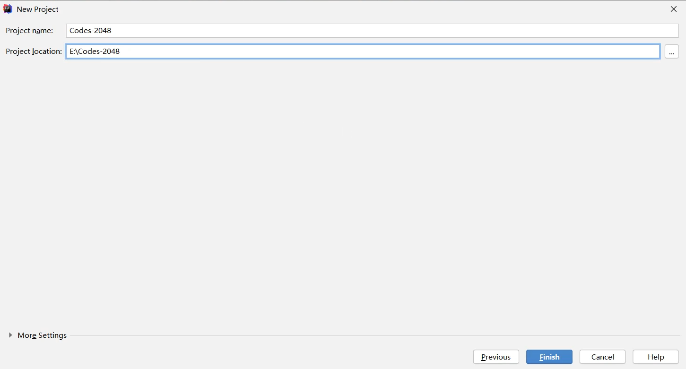

- IDEA循环是否需要帮我们在本地创建一个新的文件夹

  点击OK


- 询问是在本窗口打开还是在一个新的窗口打开。

  可以点击New Window，在一个新的窗口打开。

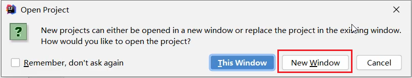

- 此时就出现了两个窗口，在一个新的窗口打开了新的项目


