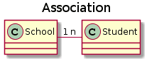
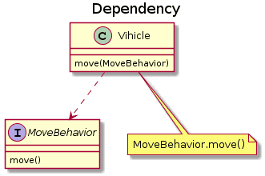

## 1.2 面向对象编程

### 1.2.1 面向对象基础 - 封装/继承/多态

#### 1.2.1.1 封装

==利用抽象数据类型将数据和基于数据的操作封装在一起，使其构成一个不可分割的独立实体。数据被保护在抽象数据类型的内部，尽可能地隐藏内部的细节，只保留一些对外接口使之与外部发生联系。用户无需知道对象内部的细节，但可以通过对象对外提供的接口来访问该对象。==

优点:

- 减少耦合: 可以独立地开发、测试、优化、使用、理解和修改
- 减轻维护的负担: 可以更容易被程序员理解，并且在调试的时候可以不影响其他模块
- 有效地调节性能: 可以通过剖析确定哪些模块影响了系统的性能
- 提高软件的可重用性
- 降低了构建大型系统的风险: 即使整个系统不可用，但是这些独立的模块却有可能是可用的

以下 Person 类封装 name、gender、age 等属性，外界只能通过 get() 方法获取一个 Person 对象的 name 属性和 gender 属性，而无法获取 age 属性，但是 age 属性可以供 work() 方法使用。==现实世界中，我们定义了“人”这种抽象概念，而具体的人则是“小明”、“小红”、“小军”等一个个具体的人。所以，“人”可以定义为一个类（class），而具体的人则是实例（instance）。==同样的，“书”也是一种抽象的概念，所以它是类，而《Java核心技术》、《Java编程思想》、《Java学习笔记》则是实例。


**创建实例**

==定义了class，只是定义了对象模版，而要根据对象模版创建出真正的对象实例，必须用new操作符。==

==new操作符可以创建一个实例，然后，我们需要定义一个引用类型的变量来指向这个实例：==

```java
Person ming = new Person();
```

上述代码创建了一个Person类型的实例，并通过变量`ming`指向它。

==注意区分`Person ming`是定义`Person`类型的变量`ming`，而`new Person()`是创建`Person`实例。==

有了指向这个实例的变量，我们就可以通过这个变量来操作实例。访问实例变量可以用`变量.字段`，例如：

```java
ming.name = "Xiao Ming"; // 对字段name赋值
ming.age = 12; // 对字段age赋值
System.out.println(ming.name); // 访问字段name

Person hong = new Person();
hong.name = "Xiao Hong";
hong.age = 15;
```

上述两个变量分别指向两个不同的实例，它们在内存中的结构如下：

```ascii
            ┌──────────────────┐
ming ──────>│Person instance   │
            ├──────────────────┤
            │name = "Xiao Ming"│
            │age = 12          │
            └──────────────────┘
            ┌──────────────────┐
hong ──────>│Person instance   │
            ├──────────────────┤
            │name = "Xiao Hong"│
            │age = 15          │
            └──────────────────┘
```

两个`instance`拥有`class`定义的`name`和`age`字段，且各自都有一份独立的数据，互不干扰。

 ==一个Java源文件可以包含多个类的定义，但只能定义一个**public类，且public类名必须与文件名一致。**如果要定义多个**public类**，必须拆到多个Java源文件中。==


**类图**

以下类图使用 [PlantUML在新窗口打开](https://www.planttext.com/) 绘制，更多语法及使用请参考: http://plantuml.com/ 。

**泛化关系 (Generalization)**

==用来描述继承关系==，在 Java 中使用 extends 关键字。


**实现关系 (Realization)**

==用来实现一个接口==，在 Java 中使用 implements 关键字。


**聚合关系 (Aggregation)**

表示整体由部分组成，但是整体和部分不是强依赖的，整体不存在了部分还是会存在。


**组合关系 (Composition)**

和聚合不同，组合中整体和部分是强依赖的，整体不存在了部分也不存在了。比如公司和部门，公司没了部门就不存在了。但是公司和员工就属于聚合关系了，因为公司没了员工还在。


**关联关系 (Association)**

表示不同类对象之间有关联，这是一种静态关系，与运行过程的状态无关，在最开始就可以确定。因此也可以用 1 对 1、多对 1、多对多这种关联关系来表示。比如学生和学校就是一种关联关系，一个学校可以有很多学生，但是一个学生只属于一个学校，因此这是一种多对一的关系，在运行开始之前就可以确定。




**依赖关系 (Dependency)**

和关联关系不同的是，依赖关系是在运行过程中起作用的。A 类和 B 类是依赖关系主要有三种形式:

- A 类是 B 类中的(某中方法的)局部变量；
- A 类是 B 类方法当中的一个参数；
- A 类向 B 类发送消息，从而影响 B 类发生变化；




**方法**

一个`class`可以包含多个`field`，例如，我们给`Person`类就定义了两个`field`：

```java
class Person {
    public String name;
    public int age;
}
```

但是，直接把`field`用`public`暴露给外部可能会破坏封装性。比如，代码可以这样写：

```java
Person ming = new Person();
ming.name = "Xiao Ming";
ming.age = -99; // age设置为负数
```

显然，直接操作`field`，容易造成逻辑混乱。为了避免外部代码直接去访问`field`，我们可以用`private`修饰`field`，拒绝外部访问：

```java
class Person {
    private String name;
    private int age;
}
```

试试`private`修饰的`field`有什么效果：

```java
public class Main {
    public static void main(String[] args) {
        Person ming = new Person();
        ming.name = "Xiao Ming"; // 对字段name赋值
        ming.age = 12; // 对字段age赋值
    }
}

class Person {
    private String name;
    private int age;
}
```


是不是编译报错？把访问`field`的赋值语句去了就可以正常编译了。


把`field`从`public`改成`private`，外部代码不能访问这些`field`，那我们定义这些`field`有什么用？怎么才能给它赋值？怎么才能读取它的值？

所以我们需要使用方法（`method`）来让外部代码可以间接修改`field`：

```java
public class Main {
    public static void main(String[] args) {
        Person ming = new Person();
        ming.setName("Xiao Ming"); // 设置name
        ming.setAge(12); // 设置age
        System.out.println(ming.getName() + ", " + ming.getAge());
    }
}

class Person {
    private String name;
    private int age;

    public String getName() {
        return this.name;
    }

    public void setName(String name) {
        this.name = name;
    }

    public int getAge() {
        return this.age;
    }

    public void setAge(int age) {
        if (age < 0 || age > 100) {
            throw new IllegalArgumentException("invalid age value");
        }
        this.age = age;
    }
}
```


虽然外部代码不能直接修改`private`字段，但是，外部代码可以调用方法`setName()`和`setAge()`来间接修改`private`字段。在方法内部，我们就有机会检查参数对不对。比如，`setAge()`就会检查传入的参数，参数超出了范围，直接报错。这样，外部代码就没有任何机会把`age`设置成不合理的值。

对`setName()`方法同样可以做检查，例如，不允许传入`null`和空字符串：

```java
public void setName(String name) {
    if (name == null || name.isBlank()) {
        throw new IllegalArgumentException("invalid name");
    }
    this.name = name.strip(); // 去掉首尾空格
}
```

同样，外部代码不能直接读取`private`字段，但可以通过`getName()`和`getAge()`间接获取`private`字段的值。

所以，一个类通过定义方法，就可以给外部代码暴露一些操作的接口，同时，内部自己保证逻辑一致性。

调用方法的语法是`实例变量.方法名(参数);`。一个方法调用就是一个语句，所以不要忘了在末尾加`;`。例如：`ming.setName("Xiao Ming");`。


**定义方法**

从上面的代码可以看出，定义方法的语法是：

```java
修饰符 方法返回类型 方法名(方法参数列表) {
    若干方法语句;
    return 方法返回值;
}
```

方法返回值通过`return`语句实现，如果没有返回值，返回类型设置为`void`，可以省略`return`。


**private方法**

有`public`方法，自然就有`private`方法。和`private`字段一样，`private`方法不允许外部调用，那我们定义`private`方法有什么用？

定义`private`方法的理由是内部方法是可以调用`private`方法的。例如：

```java
// private method
```


观察上述代码，`calcAge()`是一个`private`方法，外部代码无法调用，但是，内部方法`getAge()`可以调用它。

此外，我们还注意到，这个`Person`类只定义了`birth`字段，没有定义`age`字段，获取`age`时，通过方法`getAge()`返回的是一个实时计算的值，并非存储在某个字段的值。这说明方法可以封装一个类的对外接口，调用方不需要知道也不关心`Person`实例在内部到底有没有`age`字段。


**this变量**

在方法内部，可以使用一个隐含的变量`this`，它始终指向当前实例。因此，通过`this.field`就可以访问当前实例的字段。

如果没有命名冲突，可以省略`this`。例如：

```java
class Person {
    private String name;

    public String getName() {
        return name; // 相当于this.name
    }
}
```

但是，如果有局部变量和字段重名，那么局部变量优先级更高，就必须加上`this`：

```java
class Person {
    private String name;

    public void setName(String name) {
        this.name = name; // 前面的this不可少，少了就变成局部变量name了
    }
}
```


**方法参数**

方法可以包含0个或任意个参数。方法参数用于接收传递给方法的变量值。调用方法时，必须严格按照参数的定义一一传递。例如：

```java
class Person {
    ...
    public void setNameAndAge(String name, int age) {
        ...
    }
}
```

调用这个`setNameAndAge()`方法时，必须有两个参数，且第一个参数必须为`String`，第二个参数必须为`int`：

```java
Person ming = new Person();
ming.setNameAndAge("Xiao Ming"); // 编译错误：参数个数不对
ming.setNameAndAge(12, "Xiao Ming"); // 编译错误：参数类型不对
```


**可变参数**

==可变参数用`类型...`定义，可变参数相当于数组类型：==

```java
class Group {
    private String[] names;

    public void setNames(String... names) {
        this.names = names;
    }
}
```

上面的`setNames()`就定义了一个可变参数。调用时，可以这么写：

```java
Group g = new Group();
g.setNames("Xiao Ming", "Xiao Hong", "Xiao Jun"); // 传入3个String
g.setNames("Xiao Ming", "Xiao Hong"); // 传入2个String
g.setNames("Xiao Ming"); // 传入1个String
g.setNames(); // 传入0个String
```

完全可以把可变参数改写为`String[]`类型：

```java
class Group {
    private String[] names;

    public void setNames(String[] names) {
        this.names = names;
    }
}
```

==但是，调用方需要自己先构造`String[]`，比较麻烦。==例如：

```java
Group g = new Group();
g.setNames(new String[] {"Xiao Ming", "Xiao Hong", "Xiao Jun"}); // 传入1个String[]
```

==另一个问题是，调用方可以传入`null`：==

```java
Group g = new Group();
g.setNames(null);
```

==而可变参数可以保证无法传入`null`，因为传入0个参数时，接收到的实际值是一个空数组而不是`null`。==


**参数绑定**

调用方把参数传递给实例方法时，调用时传递的值会按参数位置一一绑定。

那什么是参数绑定？

我们先观察一个基本类型参数的传递：

```java
public class Main {
    public static void main(String[] args) {
        Person p = new Person();
        int n = 15; // n的值为15
        p.setAge(n); // 传入n的值
        System.out.println(p.getAge()); // 15
        n = 20; // n的值改为20
        System.out.println(p.getAge()); // 15还是20?
    }
}

class Person {
    private int age;

    public int getAge() {
        return this.age;
    }

    public void setAge(int age) {
        this.age = age;
    }
}
```


运行代码，从结果可知，修改外部的局部变量`n`，不影响实例`p`的`age`字段，原因是`setAge()`方法获得的参数，复制了`n`的值，因此，`p.age`和局部变量`n`互不影响。

==结论：基本类型参数的传递，是调用方 值的复制。双方各自的后续修改，互不影响。==

我们再看一个传递引用参数的例子：

```java
public class Main {
    public static void main(String[] args) {
        Person p = new Person();
        String[] fullname = new String[] { "Homer", "Simpson" };
        p.setName(fullname); // 传入fullname数组
        System.out.println(p.getName()); // "Homer Simpson"
        fullname[0] = "Bart"; // fullname数组的第一个元素修改为"Bart"
        System.out.println(p.getName()); // "Homer Simpson"还是"Bart Simpson"?
    }
}

class Person {
    private String[] name;

    public String getName() {
        return this.name[0] + " " + this.name[1];
    }

    public void setName(String[] name) {
        this.name = name;
    }
}
```


注意到`setName()`的参数现在是一个数组。一开始，把`fullname`数组传进去，然后，修改`fullname`数组的内容，结果发现，实例`p`的字段`p.name`也被修改了！

==结论：引用类型参数的传递，调用方的变量，和接收方的参数变量，指向的是同一个对象**（String除外）**。双方任意一方对这个对象的修改，都会影响对方（因为指向同一个对象嘛）。==

有了上面的结论，我们再看一个例子：

```java
public class Main {
    public static void main(String[] args) {
        Person p = new Person();
        String bob = "Bob";
        p.setName(bob); // 传入bob变量
        System.out.println(p.getName()); // "Bob"
        bob = "Alice"; // bob改名为Alice
        System.out.println(p.getName()); // "Bob"还是"Alice"?
    }
}

class Person {
    private String name;

    public String getName() {
        return this.name;
    }

    public void setName(String name) {
        this.name = name;
    }
}
```

不要怀疑引用参数绑定的机制，试解释为什么上面的代码两次输出都是`"Bob"`。

==在 Java 中，String 和 String[] 都是引用类型，存储的是对象的引用。但是，**`String 类型的对象是不可变的`**，也就是说，一旦创建了一个 String 对象，就无法再修改它的值，任何对 String 对象的修改都会创建一个新的对象。而 String[] 类型的对象是可变的，也就是说，可以修改数组中的元素值。==

==当我们将一个 String[] 类型的变量传递给一个方法时，实际上传递的是该变量所引用的数组对象在内存中的地址。因此，当我们在方法中修改数组中的元素值时，对数组进行的修改会影响到原始数组，在方法返回后也能保留。而 String 类型因为不可变，修改即创建新的对象也就有了新的地址，所以方法中引用的地址的值没有改变，输出的结果也就没有改变==


#### 1.2.1.2 构造方法

创建实例的时候，我们经常需要同时初始化这个实例的字段，例如：

```java
Person ming = new Person();
ming.setName("小明");
ming.setAge(12);
```

初始化对象实例需要3行代码，而且，如果忘了调用`setName()`或者`setAge()`，这个实例内部的状态就是不正确的。

==能否在创建对象实例时就把内部字段全部初始化为合适的值？==

完全可以。

这时，我们就需要构造方法。

创建实例的时候，实际上是通过构造方法来初始化实例的。我们先来定义一个构造方法，能在创建`Person`实例的时候，一次性传入`name`和`age`，完成初始化：

```java
public class Main {
    public static void main(String[] args) {
        Person p = new Person("Xiao Ming", 15);
        System.out.println(p.getName());
        System.out.println(p.getAge());
    }
}

class Person {
    private String name;
    private int age;

    public Person(String name, int age) {
        this.name = name;
        this.age = age;
    }
    
    public String getName() {
        return this.name;
    }

    public int getAge() {
        return this.age;
    }
}
```

==由于构造方法是如此特殊，所以构造方法的名称就是类名。构造方法的参数没有限制，在方法内部，也可以编写任意语句。但是，和普通方法相比，构造方法没有返回值（也没有`void`），调用构造方法，必须用`new`操作符。==


**默认构造方法**

是不是任何`class`都有构造方法？是的。

那前面我们并没有为`Person`类编写构造方法，为什么可以调用`new Person()`？

原因是如果一个类没有定义构造方法，编译器会自动为我们生成一个默认构造方法，它没有参数，也没有执行语句，类似这样：

```java
class Person {
    public Person() {
    }
}
```

==要特别注意的是，如果我们自定义了一个构造方法，那么，编译器就***不再***自动创建默认构造方法：==

```java
public class Main {
    public static void main(String[] args) {
        Person p = new Person(); // 编译错误:找不到这个构造方法
    }
}

class Person {
    private String name;
    private int age;

    public Person(String name, int age) {
        this.name = name;
        this.age = age;
    }
    
    public String getName() {
        return this.name;
    }

    public int getAge() {
        return this.age;
    }
}
```

==如果既要能使用带参数的构造方法，又想保留不带参数的构造方法，那么只能把两个构造方法都定义出来：==

```java
public class Main {
    public static void main(String[] args) {
        Person p1 = new Person("Xiao Ming", 15); // 既可以调用带参数的构造方法
        Person p2 = new Person(); // 也可以调用无参数构造方法
    }
}

class Person {
    private String name;
    private int age;

    public Person() {
    }

    public Person(String name, int age) {
        this.name = name;
        this.age = age;
    }
    
    public String getName() {
        return this.name;
    }

    public int getAge() {
        return this.age;
    }
}
```

==没有在构造方法中初始化字段时，引用类型的字段默认是`null`，数值类型的字段用默认值，`int`类型默认值是`0`，布尔类型默认值是`false`：==

```java
class Person {
    private String name; // 默认初始化为null
    private int age; // 默认初始化为0

    public Person() {
    }
}
```

也可以对字段直接进行初始化：

```java
class Person {
    private String name = "Unamed";
    private int age = 10;
}
```

那么问题来了：既对字段进行初始化，又在构造方法中对字段进行初始化：

```java
class Person {
    private String name = "Unamed";
    private int age = 10;

    public Person(String name, int age) {
        this.name = name;
        this.age = age;
    }
}
```

当我们创建对象的时候，`new Person("Xiao Ming", 12)`得到的对象实例，字段的初始值是啥？

==在Java中，创建对象实例的时候，按照如下顺序进行初始化：==

1. ==先初始化字段，例如，`int age = 10;`表示字段初始化为`10`，`double salary;`表示字段默认初始化为`0`，`String name;`表示引用类型字段默认初始化为`null`；==
2. ==执行构造方法的代码进行初始化。==

因此，构造方法的代码由于后运行，所以，`new Person("Xiao Ming", 12)`的字段值最终由构造方法的代码确定。


**多构造方法**

可以定义多个构造方法，在通过`new`操作符调用的时候，编译器通过构造方法的参数数量、位置和类型自动区分：

```java
class Person {
    private String name;
    private int age;

    public Person(String name, int age) {
        this.name = name;
        this.age = age;
    }

    public Person(String name) {
        this.name = name;
        this.age = 12;
    }

    public Person() {
    }
}
```

如果调用`new Person("Xiao Ming", 20);`，会自动匹配到构造方法`public Person(String, int)`。

如果调用`new Person("Xiao Ming");`，会自动匹配到构造方法`public Person(String)`。

如果调用`new Person();`，会自动匹配到构造方法`public Person()`。

==一个构造方法可以调用其他构造方法，这样做的目的是便于代码复用。调用其他构造方法的语法是`this(…)`：==

```java
class Person {
    private String name;
    private int age;

    public Person(String name, int age) {
        this.name = name;
        this.age = age;
    }

    public Person(String name) {
        this(name, 18); // 调用另一个构造方法Person(String, int)
    }

    public Person() {
        this("Unnamed"); // 调用另一个构造方法Person(String)
    }
}
```


#### 1.2.1.3 方法重载

在一个类中，我们可以定义多个方法。==如果有一系列方法，它们的功能都是类似的，只有参数有所不同，那么，可以把这一组方法名做成*同名*方法。==例如，在`Hello`类中，定义多个`hello()`方法：

```java
class Hello {
    public void hello() {
        System.out.println("Hello, world!");
    }

    public void hello(String name) {
        System.out.println("Hello, " + name + "!");
    }

    public void hello(String name, int age) {
        if (age < 18) {
            System.out.println("Hi, " + name + "!");
        } else {
            System.out.println("Hello, " + name + "!");
        }
    }
}
```

==这种方法名相同，但各自的参数不同，称为方法重载（`Overload`）。==

注意：方法重载的返回值类型通常都是相同的。

方法重载的目的是，功能类似的方法使用同一名字，更容易记住，因此，调用起来更简单。

举个例子，`String`类提供了多个重载方法`indexOf()`，可以查找子串：

- `int indexOf(int ch)`：根据字符的Unicode码查找；
- `int indexOf(String str)`：根据字符串查找；
- `int indexOf(int ch, int fromIndex)`：根据字符查找，但指定起始位置；
- `int indexOf(String str, int fromIndex)`根据字符串查找，但指定起始位置。

试一试：

```java
public class Main {
    public static void main(String[] args) {
        String s = "Test string";
        int n1 = s.indexOf('t');
        int n2 = s.indexOf("st");
        int n3 = s.indexOf("st", 4);
        System.out.println(n1);
        System.out.println(n2);
        System.out.println(n3);
    }
}
```


#### 1.2.1.4 继承

在前面的章节中，我们已经定义了`Person`类：

```java
class Person {
    private String name;
    private int age;

    public String getName() {...}
    public void setName(String name) {...}
    public int getAge() {...}
    public void setAge(int age) {...}
}
```

现在，假设需要定义一个`Student`类，字段如下：

```java
class Student {
    private String name;
    private int age;
    private int score;

    public String getName() {...}
    public void setName(String name) {...}
    public int getAge() {...}
    public void setAge(int age) {...}
    public int getScore() { … }
    public void setScore(int score) { … }
}
```

仔细观察，发现`Student`类包含了`Person`类已有的字段和方法，只是多出了一个`score`字段和相应的`getScore()`、`setScore()`方法。

能不能在`Student`中不要写重复的代码？

这个时候，继承就派上用场了。

==继承是面向对象编程中非常强大的一种机制，它首先可以复用代码。当我们让`Student`从`Person`继承时，`Student`就获得了`Person`的所有功能，我们只需要为`Student`编写新增的功能。==

Java使用`extends`关键字来实现继承：

```java
class Person {
    private String name;
    private int age;

    public String getName() {...}
    public void setName(String name) {...}
    public int getAge() {...}
    public void setAge(int age) {...}
}

class Student extends Person {
    // 不要重复name和age字段/方法,
    // 只需要定义新增score字段/方法:
    private int score;

    public int getScore() { … }
    public void setScore(int score) { … }
}
```

可见，通过继承，`Student`只需要编写额外的功能，不再需要重复代码。

 ==注意：子类自动获得了父类的所有字段，严禁定义与父类重名的字段！==

在OOP的术语中，我们把`Person`称为超类（super class），父类（parent class），基类（base class），把`Student`称为子类（subclass），扩展类（extended class）。


**继承树**

==注意到我们在定义`Person`的时候，没有写`extends`。在Java中，没有明确写`extends`的类，编译器会自动加上`extends Object`。所以，任何类，除了`Object`，都会继承自某个类。==下图是`Person`、`Student`的继承树：

```ascii
┌───────────┐
│  Object   │
└───────────┘
      ▲
      │
┌───────────┐
│  Person   │
└───────────┘
      ▲
      │
┌───────────┐
│  Student  │
└───────────┘
```

==Java只允许一个class继承自一个类，因此，一个类有且仅有一个父类。只有`Object`特殊，它没有父类。==

类似的，如果我们定义一个继承自`Person`的`Teacher`，它们的继承树关系如下：

```ascii
       ┌───────────┐
       │  Object   │
       └───────────┘
             ▲
             │
       ┌───────────┐
       │  Person   │
       └───────────┘
          ▲     ▲
          │     │
          │     │
┌───────────┐ ┌───────────┐
│  Student  │ │  Teacher  │
└───────────┘ └───────────┘
```


**protected**

==继承有个特点，就是子类无法访问父类的`private`字段或者`private`方法。==例如，`Student`类就无法访问`Person`类的`name`和`age`字段：

```java
class Person {
    private String name;
    private int age;
}

class Student extends Person {
    public String hello() {
        return "Hello, " + name; // 编译错误：无法访问name字段
    }
}
```

这使得继承的作用被削弱了。为了让子类可以访问父类的字段，我们需要把`private`改为`protected`。用`protected`修饰的字段可以被子类访问：

```java
class Person {
    protected String name;
    protected int age;
}

class Student extends Person {
    public String hello() {
        return "Hello, " + name; // OK!
    }
}
```

因此，`protected`关键字可以把字段和方法的访问权限控制在继承树内部，一个`protected`字段和方法可以被其子类，以及子类的子类所访问，后面我们还会详细讲解。


**super**

`super`关键字表示父类（超类）。子类引用父类的字段时，可以用`super.fieldName`。例如：

```java
class Student extends Person {
    public String hello() {
        return "Hello, " + super.name;
    }
}
```

==实际上，这里使用`super.name`，或者`this.name`，或者`name`，效果都是一样的。编译器会自动定位到父类的`name`字段。==

但是，在某些时候，就必须使用`super`。我们来看一个例子：

```java
public class Main {
    public static void main(String[] args) {
        Student s = new Student("Xiao Ming", 12, 89);
    }
}

class Person {
    protected String name;
    protected int age;

    public Person(String name, int age) {
        this.name = name;
        this.age = age;
    }
}

class Student extends Person {
    protected int score;

    public Student(String name, int age, int score) {
        this.score = score;
    }
}
```


运行上面的代码，会得到一个编译错误，大意是在`Student`的构造方法中，无法调用`Person`的构造方法。

==这是因为在Java中，任何`class`的构造方法，第一行语句必须是调用父类的构造方法。如果没有明确地调用父类的构造方法，编译器会帮我们自动加一句`super();`，==所以，`Student`类的构造方法实际上是这样：

```java
class Student extends Person {
    protected int score;

    public Student(String name, int age, int score) {
        super(); // 自动调用父类的构造方法
        this.score = score;
    }
}
```

但是，`Person`类并没有无参数的构造方法，因此，编译失败。

解决方法是调用`Person`类存在的某个构造方法。例如：

```java
class Student extends Person {
    protected int score;

    public Student(String name, int age, int score) {
        super(name, age); // 调用父类的构造方法Person(String, int)
        this.score = score;
    }
}
```

这样就可以正常编译了！

==因此我们得出结论：如果父类没有默认的构造方法，子类就必须显式调用`super()`并给出参数以便让编译器定位到父类的一个合适的构造方法。==

==这里还顺带引出了另一个问题：即子类*不会继承*任何父类的构造方法。子类默认的构造方法是编译器自动生成的，不是继承的。==

==**`super` 关键字**：用于在子类中调用父类的方法或变量，只能在子类的实例方法中使用，不能在静态方法（如 `main` 方法）中直接使用。==


**阻止继承**

正常情况下，只要某个class没有`final`修饰符，那么任何类都可以从该class继承。

==从Java 15开始，允许使用`sealed`修饰class，这是一种新的修饰符，允许你控制哪些类可以继承或实现一个类或接口。这为类层次结构提供了更细粒度的控制，使得类设计更加明确和安全。并通过`permits`明确写出能够从该class继承的子类名称。==

例如，定义一个`Shape`类：

```java
public sealed class Shape permits Rect, Circle, Triangle {
    ...
}
```

上述`Shape`类就是一个`sealed`类，它只允许指定的3个类继承它。如果写：

```java
public final class Rect extends Shape {...}
```

是没问题的，因为`Rect`出现在`Shape`的`permits`列表中。但是，如果定义一个`Ellipse`就会报错：

```java
public final class Ellipse extends Shape {...}
// Compile error: class is not allowed to extend sealed class: Shape
```

原因是`Ellipse`并未出现在`Shape`的`permits`列表中。这种`sealed`类主要用于一些框架，防止继承被滥用。

`sealed`类在Java 15中目前是预览状态，要启用它，必须使用参数`--enable-preview`和`--source 15`。


**向上转型**

如果一个引用变量的类型是`Student`，那么它可以指向一个`Student`类型的实例：

```java
Student s = new Student();
```

如果一个引用类型的变量是`Person`，那么它可以指向一个`Person`类型的实例：

```java
Person p = new Person();
```

现在问题来了：如果`Student`是从`Person`继承下来的，那么，一个引用类型为`Person`的变量，能否指向`Student`类型的实例？

```java
Person p = new Student();
```

测试一下就可以发现，这种指向是允许的！

这是因为`Student`继承自`Person`，因此，它拥有`Person`的全部功能。`Person`类型的变量，如果指向`Student`类型的实例，对它进行操作，是没有问题的！

==这种把一个子类类型安全地变为父类类型的赋值，被称为向上转型（upcasting）。==

向上转型实际上是把一个子类型安全地变为更加抽象的父类型：

```java
Student s = new Student();
Person p = s; // upcasting, ok
Object o1 = p; // upcasting, ok
Object o2 = s; // upcasting, ok
```

注意到继承树是`Student > Person > Object`，所以，可以把`Student`类型转型为`Person`，或者更高层次的`Object`。


**向下转型**

==和向上转型相反，如果把一个父类类型强制转型为子类类型，就是向下转型（downcasting）。==例如：

```java
Person p1 = new Student(); // upcasting, ok
Person p2 = new Person();
Student s1 = (Student) p1; // ok
Student s2 = (Student) p2; // runtime error! ClassCastException!
```

如果测试上面的代码，可以发现：

`Person`类型`p1`实际指向`Student`实例，`Person`类型变量`p2`实际指向`Person`实例。在向下转型的时候，把`p1`转型为`Student`会成功，因为`p1`确实指向`Student`实例，把`p2`转型为`Student`会失败，因为`p2`的实际类型是`Person`，不能把父类变为子类，==因为子类功能比父类多，多的功能无法凭空变出来。==

因此，向下转型很可能会失败。失败的时候，Java虚拟机会报`ClassCastException`。

==为了避免向下转型出错，Java提供了`instanceof`操作符，可以先判断一个实例究竟是不是某种类型：==

```java
Person p = new Person();
System.out.println(p instanceof Person); // true
System.out.println(p instanceof Student); // false

Student s = new Student();
System.out.println(s instanceof Person); // true
System.out.println(s instanceof Student); // true

Student n = null;
System.out.println(n instanceof Student); // false
```

`instanceof`实际上判断一个变量所指向的实例是否是指定类型，或者这个类型的子类。如果一个引用变量为`null`，那么对任何`instanceof`的判断都为`false`。

利用`instanceof`，在向下转型前可以先判断：

```java
Person p = new Student();
if (p instanceof Student) {
    // 只有判断成功才会向下转型:
    Student s = (Student) p; // 一定会成功
}
```

从Java 14开始，判断`instanceof`后，可以直接转型为指定变量，避免再次强制转型。例如，对于以下代码：

```java
Object obj = "hello";
if (obj instanceof String) {
    String s = (String) obj;
    System.out.println(s.toUpperCase());
}
```

可以改写如下：

```java
public class Main {
    public static void main(String[] args) {
        Object obj = "hello";
        if (obj instanceof String s) {
            // 可以直接使用变量s:
            System.out.println(s.toUpperCase());
        }
    }
}
```


这种使用`instanceof`的写法更加简洁。


**区分继承和组合**

在使用继承时，我们要注意逻辑一致性。

考察下面的`Book`类：

```java
class Book {
    protected String name;
    public String getName() {...}
    public void setName(String name) {...}
}
```

这个`Book`类也有`name`字段，那么，我们能不能让`Student`继承自`Book`呢？

```java
class Student extends Book {
    protected int score;
}
```

显然，从逻辑上讲，这是不合理的，`Student`不应该从`Book`继承，而应该从`Person`继承。

究其原因，是因为`Student`是`Person`的一种，它们是is关系，而`Student`并不是`Book`。实际上`Student`和`Book`的关系是has关系。

==具有has关系不应该使用继承，而是使用组合，即`Student`可以持有一个`Book`实例：==

```java
class Student extends Person {
    protected Book book;
    protected int score;
}
```

因此，继承是is关系，组合是has关系。


#### 1.2.1.5 多态

多态（Polymorphism）是面向对象编程（OOP）的核心概念之一，它允许对象以多种形式表现。==多态性使得同一个方法调用可以在不同的对象上产生不同的行为，从而提高代码的灵活性和可扩展性。==

**多态的类型**

1. ==**编译时多态（Compile-time Polymorphism）**：==

   - 也称为方法重载（Method Overloading）。
   - 发生在编译阶段。
   - 同一个类中同名方法根据参数的不同进行区分。
   - 例子：`print(int i)` 和 `print(double d)`。


   - 也称为方法重写（Method Overriding）。

   - 发生在运行阶段。

   - 子类重写父类的方法，并在运行时通过父类引用调用子类的方法。

   - 例子：父类的 `makeSound()` 方法在子类 `Dog` 和 `Cat` 中被重写。


==在继承关系中，子类如果定义了一个与父类方法签名完全相同的方法，被称为重写（Override）。==

例如，在`Person`类中，我们定义了`run()`方法：

```java
class Person {
    public void run() {
        System.out.println("Person.run");
    }
}
```

在子类`Student`中，覆写这个`run()`方法：

```java
class Student extends Person {
    @Override
    public void run() {
        System.out.println("Student.run");
    }
}
```

==Override和Overload不同的是，如果方法签名不同，就是Overload，Overload方法是一个新方法；如果方法签名相同，并且返回值也相同，就是`Override`。==

 ==注意：方法名相同，方法参数相同，但方法返回值不同，也是不同的方法。在Java程序中，出现这种情况，编译器会报错。==

```java
class Person {
    public void run() { … }
}

class Student extends Person {
    // 不是Override，因为参数不同:
    public void run(String s) { … }
    // 不是Override，因为返回值不同:
    public int run() { … }
}
```

加上`@Override`可以让编译器帮助检查是否进行了正确的覆写。希望进行覆写，但是不小心写错了方法签名，编译器会报错。

```java
public class Main {
    public static void main(String[] args) {
    }
}

class Person {
    public void run() {}
}

public class Student extends Person {
    @Override // Compile error!
    public void run(String s) {}
}
```


但是`@Override`不是必需的。

在上一节中，我们已经知道，引用变量的声明类型可能与其实际类型不符，例如：

```java
Person p = new Student();
```

现在，我们考虑一种情况，如果子类覆写了父类的方法：

```java
public class Main {
    public static void main(String[] args) {
        Person p = new Student();
        p.run(); // 应该打印Person.run还是Student.run?
    }
}

class Person {
    public void run() {
        System.out.println("Person.run");
    }
}

class Student extends Person {
    @Override
    public void run() {
        System.out.println("Student.run");
    }
}
```


那么，一个实际类型为`Student`，引用类型为`Person`的变量，调用其`run()`方法，调用的是`Person`还是`Student`的`run()`方法？

运行一下上面的代码就可以知道，实际上调用的方法是`Student`的`run()`方法。因此可得出结论：

==Java的实例方法调用是基于运行时的实际类型的动态调用，而非变量的声明类型。==

这个非常重要的特性在面向对象编程中称之为多态。


**多态**

多态是指，针对某个类型的方法调用，其真正执行的方法取决于运行时期实际类型的方法。例如：

```java
Person p = new Student();
p.run(); // 无法确定运行时究竟调用哪个run()方法
```

有童鞋会问，从上面的代码一看就明白，肯定调用的是`Student`的`run()`方法啊。

但是，假设我们编写这样一个方法：

```java
public void runTwice(Person p) {
    p.run();
    p.run();
}
```

它传入的参数类型是`Person`，我们是无法知道传入的参数实际类型究竟是`Person`，还是`Student`，还是`Person`的其他子类，因此，也无法确定调用的是不是`Person`类定义的`run()`方法。

所以，多态的特性就是，运行期才能动态决定调用的子类方法。对某个类型调用某个方法，执行的实际方法可能是某个子类的覆写方法。这种不确定性的方法调用，究竟有什么作用？

我们还是来举栗子。

假设我们定义一种收入，需要给它报税，那么先定义一个`Income`类：

```java
class Income {
    protected double income;
    public double getTax() {
        return income * 0.1; // 税率10%
    }
}
```

对于工资收入，可以减去一个基数，那么我们可以从`Income`派生出`SalaryIncome`，并覆写`getTax()`：

```java
class Salary extends Income {
    @Override
    public double getTax() {
        if (income <= 5000) {
            return 0;
        }
        return (income - 5000) * 0.2;
    }
}
```

如果你享受国务院特殊津贴，那么按照规定，可以全部免税：

```java
class StateCouncilSpecialAllowance extends Income {
    @Override
    public double getTax() {
        return 0;
    }
}
```

现在，我们要编写一个报税的财务软件，对于一个人的所有收入进行报税，可以这么写：

```java
public double totalTax(Income... incomes) {
    double total = 0;
    for (Income income: incomes) {
        total = total + income.getTax();
    }
    return total;
}
```

来试一下：

```java
public class Main {
    public static void main(String[] args) {
        // 给一个有普通收入、工资收入和享受国务院特殊津贴的小伙伴算税:
        Income[] incomes = new Income[] {
            new Income(3000),
            new Salary(7500),
            new StateCouncilSpecialAllowance(15000)
        };
        System.out.println(totalTax(incomes));
    }

    public static double totalTax(Income... incomes) {
        double total = 0;
        for (Income income: incomes) {
            total = total + income.getTax();
        }
        return total;
    }
}

class Income {
    protected double income;

    public Income(double income) {
        this.income = income;
    }

    public double getTax() {
        return income * 0.1; // 税率10%
    }
}

class Salary extends Income {
    public Salary(double income) {
        super(income);
    }

    @Override
    public double getTax() {
        if (income <= 5000) {
            return 0;
        }
        return (income - 5000) * 0.2;
    }
}

class StateCouncilSpecialAllowance extends Income {
    public StateCouncilSpecialAllowance(double income) {
        super(income);
    }

    @Override
    public double getTax() {
        return 0;
    }
}
```


观察`totalTax()`方法：利用多态，`totalTax()`方法只需要和`Income`打交道，它完全不需要知道`Salary`和`StateCouncilSpecialAllowance`的存在，就可以正确计算出总的税。如果我们要新增一种稿费收入，只需要从`Income`派生，然后正确覆写`getTax()`方法就可以。把新的类型传入`totalTax()`，不需要修改任何代码。

==可见，多态具有一个非常强大的功能，就是允许添加更多类型的子类实现功能扩展，却不需要修改基于父类的代码。==


**覆写Object方法**

因为所有的`class`最终都继承自`Object`，而`Object`定义了几个重要的方法：

- `toString()`：把instance输出为`String`；
- `equals()`：判断两个instance是否逻辑相等；
- `hashCode()`：计算一个instance的哈希值。

在必要的情况下，我们可以覆写`Object`的这几个方法。例如：

```java
class Person {
    ...
    // 显示更有意义的字符串:
    @Override
    public String toString() {
        return "Person:name=" + name;
    }

    // 比较是否相等:
    @Override
    public boolean equals(Object o) {
        // 当且仅当o为Person类型:
        if (o instanceof Person) {
            Person p = (Person) o;
            // 并且name字段相同时，返回true:
            return this.name.equals(p.name);
        }
        return false;
    }

    // 计算hash:
    @Override
    public int hashCode() {
        return this.name.hashCode();
    }
}
```


**调用super**

在子类的覆写方法中，如果要调用父类的被覆写的方法，可以通过`super`来调用。例如：

```java
class Person {
    protected String name;
    public String hello() {
        return "Hello, " + name;
    }
}

class Student extends Person {
    @Override
    public String hello() {
        // 调用父类的hello()方法:
        return super.hello() + "!";
    }
}
```


**final**

==继承可以允许子类覆写父类的方法。如果一个父类不允许子类对它的某个方法进行覆写，可以把该方法标记为`final`。用`final`修饰的方法不能被`Override`：==

```java
class Person {
    protected String name;
    public final String hello() {
        return "Hello, " + name;
    }
}

class Student extends Person {
    // compile error: 不允许覆写
    @Override
    public String hello() {
    }
}
```

==如果一个类不希望任何其他类继承自它，那么可以把这个类本身标记为`final`。用`final`修饰的类不能被继承：==

```java
final class Person {
    protected String name;
}

// compile error: 不允许继承自Person
class Student extends Person {
}
```

==对于一个类的实例字段，同样可以用`final`修饰。用`final`修饰的字段在初始化后不能被修改。例如：==

```java
class Person {
    public final String name = "Unamed";
}
```

对`final`字段重新赋值会报错：

```java
Person p = new Person();
p.name = "New Name"; // compile error!
```

但可以在构造方法中初始化final字段：

```java
class Person {
    public final String name;
    public Person(String name) {
        this.name = name;
    }
}
```

这种方法更为常用，因为可以保证实例一旦创建，其`final`字段就不可修改。


#### 1.2.1.6 抽象类

由于多态的存在，每个子类都可以覆写父类的方法，例如：

```java
class Person {
    public void run() { … }
}

class Student extends Person {
    @Override
    public void run() { … }
}

class Teacher extends Person {
    @Override
    public void run() { … }
}
```

从`Person`类派生的`Student`和`Teacher`都可以覆写`run()`方法。

==如果父类`Person`的`run()`方法没有实际意义，能否去掉方法的执行语句？==

```java
class Person {
    public void run(); // Compile Error!
}
```

==答案是不行，会导致编译错误，因为定义方法的时候，必须实现方法的语句。==

能不能去掉父类的`run()`方法？

答案还是不行，因为去掉父类的`run()`方法，就失去了多态的特性。例如，`runTwice()`就无法编译：

```java
public void runTwice(Person p) {
    p.run(); // Person没有run()方法，会导致编译错误
    p.run();
}
```

==如果父类的方法本身不需要实现任何功能，仅仅是为了定义方法签名，目的是让子类去覆写它，那么，可以把父类的方法声明为抽象方法：==

```java
class Person {
    public abstract void run();
}
```

==把一个方法声明为`abstract`，表示它是一个抽象方法，本身没有实现任何方法语句。因为这个抽象方法本身是无法执行的，所以，`Person`类也无法被实例化。编译器会告诉我们，无法编译`Person`类，因为它包含抽象方法。==

==必须把`Person`类本身也声明为`abstract`，才能正确编译它：==

```java
abstract class Person {
    public abstract void run();
}
```


**抽象类**

==如果一个`class`定义了方法，但没有具体执行代码，这个方法就是抽象方法，抽象方法用`abstract`修饰。==

==因为无法执行抽象方法，因此这个类也必须申明为抽象类（abstract class）。==

==使用`abstract`修饰的类就是抽象类。我们无法实例化一个抽象类：==

```java
Person p = new Person(); // 编译错误
```

无法实例化的抽象类有什么用？

==因为抽象类本身被设计成只能用于被继承，因此，抽象类可以强迫子类实现其定义的抽象方法，否则编译会报错。因此，抽象方法实际上相当于定义了“规范”。一个抽象类可以包含不抽象的方法。在Java中，抽象类不仅可以包含抽象方法（没有方法体的方法），还可以包含具体的方法（有方法体的方法）。抽象类的目的是提供一种框架，强制子类实现某些方法，同时允许子类继承和使用非抽象方法的实现。==

例如，`Person`类定义了抽象方法`run()`，那么，在实现子类`Student`的时候，就必须覆写`run()`方法：

```java
public class Main {
    public static void main(String[] args) {
        Person p = new Student();
        p.run();
    }
}

abstract class Person {
    public abstract void run();
}

class Student extends Person {
    @Override
    public void run() {
        System.out.println("Student.run");
    }
}
```


**面向抽象编程**

当我们定义了抽象类`Person`，以及具体的`Student`、`Teacher`子类的时候，我们可以通过抽象类`Person`类型去引用具体的子类的实例：

```java
Person s = new Student();
Person t = new Teacher();
```

这种引用抽象类的好处在于，我们对其进行方法调用，并不关心`Person`类型变量的具体子类型：

```java
// 不关心Person变量的具体子类型:
s.run();
t.run();
```

同样的代码，如果引用的是一个新的子类，我们仍然不关心具体类型：

```java
// 同样不关心新的子类是如何实现run()方法的：
Person e = new Employee();
e.run();
```

==这种尽量引用高层类型，避免引用实际子类型的方式，称之为面向抽象编程。==

面向抽象编程的本质就是：

- 上层代码只定义规范（例如：`abstract class Person`）；
- 不需要子类就可以实现业务逻辑（正常编译）；
- 具体的业务逻辑由不同的子类实现，调用者并不关心。


#### 1.2.1.7 接口

在抽象类中，抽象方法本质上是定义接口规范：即规定高层类的接口，从而保证所有子类都有相同的接口实现，这样，多态就能发挥出威力。

==如果一个抽象类没有字段，所有方法全部都是抽象方法，就可以把该抽象类改写为接口：`interface`：==

```java
abstract class Person {
    public abstract void run();
    public abstract String getName();
}
```

在Java中，使用`interface`可以声明一个接口：

```java
interface Person {
    void run();
    String getName();
}
```

==所谓`interface`，就是比抽象类还要抽象的纯抽象接口，因为它连字段 field 也就是属性，都不能有。因为接口定义的所有方法默认都是`public abstract`的，所以这两个修饰符不需要写出来（写不写效果都一样）。==

当一个具体的`class`去实现一个`interface`时，需要使用`implements`关键字。举个例子：

```java
class Student implements Person {
    private String name;

    public Student(String name) {
        this.name = name;
    }

    @Override
    public void run() {
        System.out.println(this.name + " run");
    }

    @Override
    public String getName() {
        return this.name;
    }
}
```

==我们知道，在Java中，一个类只能继承自另一个类，不能从多个类继承。但是，一个类可以实现多个`interface`==，例如：

```java
class Student implements Person, Hello { // 实现了两个interface
    ...
}
```


**术语**

注意区分术语：

Java的接口特指`interface`的定义，表示一个接口类型和一组方法签名，而编程接口泛指接口规范，如方法签名，数据格式，网络协议等。

抽象类和接口的对比如下：

|            | abstract class       | interface                   |
| :--------- | :------------------- | :-------------------------- |
| 继承       | 只能extends一个class | 可以implements多个interface |
| 字段       | 可以定义实例字段     | 不能定义实例字段            |
| 抽象方法   | 可以定义抽象方法     | 可以定义抽象方法            |
| 非抽象方法 | 可以定义非抽象方法   | 可以定义default方法         |


**接口继承**

==一个`interface`可以继承自另一个`interface`。`interface`继承自`interface`使用`extends`，它相当于扩展了接口的方法。==例如：

```java
interface Hello {
    void hello();
}

interface Person extends Hello {
    void run();
    String getName();
}
```

此时，`Person`接口继承自`Hello`接口，因此，`Person`接口现在实际上有3个抽象方法签名，其中一个来自继承的`Hello`接口。


**继承关系**

合理设计`interface`和`abstract class`的继承关系，可以充分复用代码。一般来说，公共逻辑适合放在`abstract class`中，具体逻辑放到各个子类，而接口层次代表抽象程度。可以参考Java的集合类定义的一组接口、抽象类以及具体子类的继承关系：

```ascii
┌───────────────┐
│   Iterable    │
└───────────────┘
        ▲                ┌───────────────────┐
        │                │      Object       │
┌───────────────┐        └───────────────────┘
│  Collection   │                  ▲
└───────────────┘                  │
        ▲     ▲          ┌───────────────────┐
        │     └──────────│AbstractCollection │
┌───────────────┐        └───────────────────┘
│     List      │                  ▲
└───────────────┘                  │
              ▲          ┌───────────────────┐
              └──────────│   AbstractList    │
                         └───────────────────┘
                                ▲     ▲
                                │     │
                                │     │
                     ┌────────────┐ ┌────────────┐
                     │ ArrayList  │ │ LinkedList │
                     └────────────┘ └────────────┘
```

==在使用的时候，实例化的对象永远只能是某个具体的子类，但总是通过接口去引用它，因为接口比抽象类更抽象：==

```java
List list = new ArrayList(); // 用List接口引用具体子类的实例
Collection coll = list; // 向上转型为Collection接口
Iterable it = coll; // 向上转型为Iterable接口
```


**default方法**

在接口中，可以定义`default`方法。例如，把`Person`接口的`run()`方法改为`default`方法：

```java
public class Main {
    public static void main(String[] args) {
        Person p = new Student("Xiao Ming");
        p.run();
    }
}

interface Person {
    String getName();
    default void run() {
        System.out.println(getName() + " run");
    }
}

class Student implements Person {
    private String name;

    public Student(String name) {
        this.name = name;
    }

    public String getName() {
        return this.name;
    }
}
```

==实现类可以不必覆写`default`方法。`default`方法的目的是，当我们需要给接口新增一个方法时，会涉及到修改全部子类。如果新增的是`default`方法，那么子类就不必全部修改，只需要在需要覆写的地方去覆写新增方法。这一特性主要是为了在接口演变过程中保持向后兼容性。==

`default`方法和抽象类的普通方法是有所不同的。因为`interface`没有字段，`default`方法无法访问字段，而抽象类的普通方法可以访问实例字段。


==在Java中，接口本身不能直接实例化，因为它们是抽象的。但可以通过以下几种方式创建接口的实例：==

1. ==**创建一个实现该接口的类**：==
   - 最传统的方法是创建一个类，该类实现接口并提供接口方法的具体实现。
2. ==**使用匿名内部类**：==
   - 这是Java提供的一种简便方式，用于在需要的时候直接实现接口。
3. ==**使用Lambda表达式**：==
   - ==对于函数式接口（即只有一个抽象方法的接口）==，Java 8引入了Lambda表达式，可以用来更简洁地实现函数式接口。

**示例：Comparator接口的实例化**

**方法1：创建一个实现Comparator接口的类**

```java
import java.util.Arrays;
import java.util.Comparator;

class StringLengthComparator implements Comparator<String> {
    @Override
    public int compare(String s1, String s2) {
        return Integer.compare(s1.length(), s2.length());
    }
}

public class CustomComparatorExample {
    public static void main(String[] args) {
        String[] words = {"banana", "apple", "cherry"};
        Arrays.sort(words, new StringLengthComparator());
        System.out.println(Arrays.toString(words));  // 输出 [apple, banana, cherry]
    }
}
```

**方法2：使用匿名内部类**

```java
import java.util.Arrays;
import java.util.Comparator;

public class AnonymousComparatorExample {
    public static void main(String[] args) {
        String[] words = {"banana", "apple", "cherry"};
        
        // 使用匿名内部类实现 Comparator
        Comparator<String> comparator = new Comparator<String>() {
            @Override
            public int compare(String s1, String s2) {
                return Integer.compare(s1.length(), s2.length());
            }
        };
        
        Arrays.sort(words, comparator);
        System.out.println(Arrays.toString(words));  // 输出 [apple, banana, cherry]
    }
}
```

**方法3：使用Lambda表达式**

```java
import java.util.Arrays;
import java.util.Comparator;

public class LambdaComparatorExample {
    public static void main(String[] args) {
        String[] words = {"banana", "apple", "cherry"};
        
        // 使用 Lambda 表达式实现 Comparator
        Comparator<String> comparator = (s1, s2) -> Integer.compare(s1.length(), s2.length());
        
        Arrays.sort(words, comparator);
        System.out.println(Arrays.toString(words));  // 输出 [apple, banana, cherry]
    }
}
```


#### 1.2.1.8 静态字段和静态方法

在一个`class`中定义的字段，我们称之为实例字段。实例字段的特点是，每个实例都有独立的字段，各个实例的同名字段互不影响。

还有一种字段，是用`static`修饰的字段，称为静态字段：`static field`。

==实例字段在每个实例中都有自己的一个独立“空间”，但是静态字段只有一个共享“空间”，所有实例都会共享该字段。举个例子：==

```java
class Person {
    public String name;
    public int age;
    // 定义静态字段number:
    public static int number;
}
```

我们来看看下面的代码：

```java
public class Main {
    public static void main(String[] args) {
        Person ming = new Person("Xiao Ming", 12);
        Person hong = new Person("Xiao Hong", 15);
        ming.number = 88;
        System.out.println(hong.number);
        hong.number = 99;
        System.out.println(ming.number);
    }
}

class Person {
    public String name;
    public int age;

    public static int number;

    public Person(String name, int age) {
        this.name = name;
        this.age = age;
    }
}
```


对于静态字段，无论修改哪个实例的静态字段，效果都是一样的：所有实例的静态字段都被修改了，原因是静态字段并不属于实例：

```ascii
        ┌──────────────────┐
ming ──▶│Person instance   │
        ├──────────────────┤
        │name = "Xiao Ming"│
        │age = 12          │
        │number ───────────┼──┐    ┌─────────────┐
        └──────────────────┘  │    │Person class │
                              │    ├─────────────┤
                              ├───▶│number = 99  │
        ┌──────────────────┐  │    └─────────────┘
hong ──▶│Person instance   │  │
        ├──────────────────┤  │
        │name = "Xiao Hong"│  │
        │age = 15          │  │
        │number ───────────┼──┘
        └──────────────────┘
```

虽然实例可以访问静态字段，但是它们指向的其实都是`Person class`的静态字段。所以，所有实例共享一个静态字段。

==因此，不推荐用`实例变量.静态字段`去访问静态字段，因为在Java程序中，实例对象并没有静态字段。在代码中，实例对象能访问静态字段只是因为编译器可以根据实例类型自动转换为`类名.静态字段`来访问静态对象。==

==推荐用类名来访问静态字段。可以把静态字段理解为描述`class`本身的字段（非实例字段）。==对于上面的代码，更好的写法是：

```java
Person.number = 99;
System.out.println(Person.number);
```


**静态方法**

有静态字段，就有静态方法。用`static`修饰的方法称为静态方法。

==调用实例方法必须通过一个实例变量，而调用静态方法则不需要实例变量，通过类名就可以调用。静态方法类似其它编程语言的函数。==例如：

```java
public class Main {
    public static void main(String[] args) {
        Person.setNumber(99);
        System.out.println(Person.number);
    }
}

class Person {
    public static int number;

    public static void setNumber(int value) {
        number = value;
    }
}
```


因为静态方法属于`class`而不属于实例，==因此，静态方法内部，无法访问`this`变量，也无法访问实例字段，它只能访问静态字段。==

通过实例变量也可以调用静态方法，但这只是编译器自动帮我们把实例改写成类名而已。

通常情况下，通过实例变量访问静态字段和静态方法，会得到一个编译警告。

静态方法经常用于工具类。例如：

- Arrays.sort()
- Math.random()

静态方法也经常用于辅助方法。注意到Java程序的入口`main()`也是静态方法。


**接口的静态字段**

==因为`interface`是一个纯抽象类，所以它不能定义实例字段。但是，`interface`是可以有静态字段的，并且静态字段必须为`final`类型：==

```java
public interface Person {
    public static final int MALE = 1;
    public static final int FEMALE = 2;
}
```

==实际上，因为`interface`的字段只能是`public static final`类型，所以我们可以把这些修饰符都去掉，上述代码可以简写为：==

```java
public interface Person {
    // 编译器会自动加上public statc final:
    int MALE = 1;
    int FEMALE = 2;
}
```

编译器会自动把该字段变为`public static final`类型。


#### 1.2.1.9 包

在前面的代码中，我们把类和接口命名为`Person`、`Student`、`Hello`等简单名字。

在现实中，如果小明写了一个`Person`类，小红也写了一个`Person`类，现在，小白既想用小明的`Person`，也想用小红的`Person`，怎么办？

如果小军写了一个`Arrays`类，恰好JDK也自带了一个`Arrays`类，如何解决类名冲突？

==在Java中，我们使用`package`来解决名字冲突。==

Java定义了一种名字空间，称之为包：`package`。一个类总是属于某个包，类名（比如`Person`）只是一个简写，真正的完整类名是`包名.类名`。

例如：

小明的`Person`类存放在包`ming`下面，因此，完整类名是`ming.Person`；

小红的`Person`类存放在包`hong`下面，因此，完整类名是`hong.Person`；

小军的`Arrays`类存放在包`mr.jun`下面，因此，完整类名是`mr.jun.Arrays`；

JDK的`Arrays`类存放在包`java.util`下面，因此，完整类名是`java.util.Arrays`。

==在定义`class`的时候，我们需要在第一行声明这个`class`属于哪个包。==

小明的`Person.java`文件：

```java
package ming; // 申明包名ming

public class Person {
}
```

小军的`Arrays.java`文件：

```java
package mr.jun; // 申明包名mr.jun

public class Arrays {
}
```

==在Java虚拟机执行的时候，JVM只看完整类名，因此，只要包名不同，类就不同。==

==包可以是多层结构，用`.`隔开。例如：`java.util`。==

 ==要特别注意：包没有父子关系。java.util和java.util.zip是不同的包，两者没有任何继承关系。==

没有定义包名的`class`，它使用的是默认包，非常容易引起名字冲突，因此，不推荐不写包名的做法。

我们还需要按照包结构把上面的Java文件组织起来。假设以`package_sample`作为根目录，`src`作为源码目录，那么所有文件结构就是：

```ascii
package_sample
└─ src
    ├─ hong
    │  └─ Person.java
    │  ming
    │  └─ Person.java
    └─ mr
       └─ jun
          └─ Arrays.java
```

==即所有Java文件对应的目录层次要和包的层次一致。==

==编译后的`.class`文件也需要按照包结构存放。如果使用IDE，把编译后的`.class`文件放到`bin`目录下，那么，编译的文件结构就是：==

```ascii
package_sample
└─ bin
   ├─ hong
   │  └─ Person.class
   │  ming
   │  └─ Person.class
   └─ mr
      └─ jun
         └─ Arrays.class
```


**包作用域**

位于同一个包的类，可以访问包作用域的字段和方法。不用`public`、`protected`、`private`修饰的字段和方法就是包作用域。例如，`Person`类定义在`hello`包下面：

```java
package hello;

public class Person {
    // 包作用域:
    void hello() {
        System.out.println("Hello!");
    }
}
```

`Main`类也定义在`hello`包下面：

```java
package hello;

public class Main {
    public static void main(String[] args) {
        Person p = new Person();
        p.hello(); // 可以调用，因为Main和Person在同一个包
    }
}
```


**import**

在一个`class`中，我们总会引用其他的`class`。例如，小明的`ming.Person`类，如果要引用小军的`mr.jun.Arrays`类，他有三种写法：

第一种，直接写出完整类名，例如：

```java
// Person.java
package ming;

public class Person {
    public void run() {
        mr.jun.Arrays arrays = new mr.jun.Arrays();
    }
}
```

很显然，每次写完整类名比较痛苦。

因此，第二种写法是用`import`语句，导入小军的`Arrays`，然后写简单类名：

```java
// Person.java
package ming;

// 导入完整类名:
import mr.jun.Arrays;

public class Person {
    public void run() {
        Arrays arrays = new Arrays();
    }
}
```

在写`import`的时候，可以使用`*`，表示把这个包下面的所有`class`都导入进来（但不包括子包的`class`）：

```java
// Person.java
package ming;

// 导入mr.jun包的所有class:
import mr.jun.*;

public class Person {
    public void run() {
        Arrays arrays = new Arrays();
    }
}
```

我们一般不推荐这种写法，因为在导入了多个包后，很难看出`Arrays`类属于哪个包。

还有一种`import static`的语法，它可以导入一个类的静态字段和静态方法：

```java
package main;

// 导入System类的所有静态字段和静态方法:
import static java.lang.System.*;

public class Main {
    public static void main(String[] args) {
        // 相当于调用System.out.println(…)
        out.println("Hello, world!");
    }
}
```

`import static`很少使用。

Java编译器最终编译出的`.class`文件只使用*完整类名*，因此，在代码中，当编译器遇到一个`class`名称时：

- 如果是完整类名，就直接根据完整类名查找这个`class`；
- 如果是简单类名，按下面的顺序依次查找：
  - 查找当前`package`是否存在这个`class`；
  - 查找`import`的包是否包含这个`class`；
  - 查找`java.lang`包是否包含这个`class`。

如果按照上面的规则还无法确定类名，则编译报错。

我们来看一个例子：

```java
// Main.java
package test;

import java.text.Format;

public class Main {
    public static void main(String[] args) {
        java.util.List list; // ok，使用完整类名 -> java.util.List
        Format format = null; // ok，使用import的类 -> java.text.Format
        String s = "hi"; // ok，使用java.lang包的String -> java.lang.String
        System.out.println(s); // ok，使用java.lang包的System -> java.lang.System
        MessageFormat mf = null; // 编译错误：无法找到MessageFormat: MessageFormat cannot be resolved to a type
    }
}
```

因此，编写class的时候，编译器会自动帮我们做两个import动作：

- 默认自动`import`当前`package`的其他`class`；
- 默认自动`import java.lang.*`。

 注意：自动导入的是java.lang包，但类似java.lang.reflect这些包仍需要手动导入。

如果有两个`class`名称相同，例如，`mr.jun.Arrays`和`java.util.Arrays`，那么只能`import`其中一个，另一个必须写完整类名。


**最佳实践**

为了避免名字冲突，我们需要确定唯一的包名。==推荐的做法是使用倒置的域名来确保唯一性。例如：==

- org.apache
- org.apache.commons.log
- com.liaoxuefeng.sample

子包就可以根据功能自行命名。

要注意不要和`java.lang`包的类重名，即自己的类不要使用这些名字：

- String
- System
- ...

要注意也不要和JDK常用类重名：

- java.util.List
- java.text.Format
- java.math.BigInteger
- ...


**编译和运行**

假设我们创建了如下的目录结构：

```ascii
work
├── bin
└── src
    └── com
        └── itranswarp
            ├── sample
            │   └── Main.java
            └── world
                └── Person.java
```

其中，`bin`目录用于存放编译后的`class`文件，`src`目录按包结构存放Java源码，==我们怎么一次性编译这些Java源码呢？==

==首先，确保当前目录是`work`目录，即存放`src`和`bin`的父目录：==

```java
$ ls
bin src
```

==然后，编译`src`目录下的所有Java文件：==

```java
$ javac -d ./bin src/**/*.java
```

命令行`-d`指定输出的`class`文件存放`bin`目录，后面的参数`src/**/*.java`表示`src`目录下的所有`.java`文件，包括任意深度的子目录。

注意：Windows不支持`**`这种搜索全部子目录的做法，所以在Windows下编译必须依次列出所有`.java`文件：

```java
C:\work> javac -d bin src\com\itranswarp\sample\Main.java src\com\itranswarp\world\Persion.java
```

==如果编译无误，则`javac`命令没有任何输出。可以在`bin`目录下看到如下`class`文件：==

```ascii
bin
└── com
    └── itranswarp
        ├── sample
        │   └── Main.class
        └── world
            └── Person.class
```

==现在，我们就可以直接运行`class`文件了。根据当前目录的位置确定classpath，例如，当前目录仍为`work`，则classpath为`bin`或者`./bin`：==

```java
$ java -cp bin com.itranswarp.sample.Main 
Hello, world!
```


#### 1.2.1.10 作用域

在Java中，我们经常看到`public`、`protected`、`private`这些修饰符。在Java中，这些修饰符可以用来限定访问作用域。

==**访问修饰符及其作用范围**==

1. ==**`public`**：公共访问，任何类都可以访问。==
2. ==**`protected`**：受保护的访问，包内的类和所有子类（无论是否在同一包）都可以访问。==
3. ==**`default`**（无修饰符）：包私有，只有同一个包内的类可以访问。==
4. ==**`private`**：私有访问，只有在同一个类内可以访问。==


**public**

==定义为`public`的`class`、`interface`可以被其他任何类访问：==

```java
package abc;

public class Hello {
    public void hi() {
    }
}
```

上面的`Hello`是`public`，因此，可以被其他包的类访问：

```java
package xyz;

class Main {
    void foo() {
        // Main可以访问Hello
        Hello h = new Hello();
    }
}
```

定义为`public`的`field`、`method`可以被其他类访问，前提是首先有访问`class`的权限：

```java
package abc;

public class Hello {
    public void hi() {
    }
}
```

上面的`hi()`方法是`public`，可以被其他类调用，前提是首先要能访问`Hello`类：

```java
package xyz;

class Main {
    void foo() {
        Hello h = new Hello();
        h.hi();
    }
}
```


**private**

定义为`private`的`field`、`method`无法被其他类访问：

```java
package abc;

public class Hello {
    // 不能被其他类调用:
    private void hi() {
    }

    public void hello() {
        this.hi();
    }
}
```

实际上，确切地说，`private`访问权限被限定在`class`的内部，而且与方法声明顺序*无关*。==推荐把`private`方法放到后面，因为`public`方法定义了类对外提供的功能，阅读代码的时候，应该先关注`public`方法：==

```java
package abc;

public class Hello {
    public void hello() {
        this.hi();
    }

    private void hi() {
    }
}
```

由于Java支持嵌套类，如果一个类内部还定义了嵌套类，那么，==嵌套类拥有访问`private`的权限：==

```java
public class Main {
    public static void main(String[] args) {
        Inner i = new Inner();
        i.hi();
    }

    // private方法:
    private static void hello() {
        System.out.println("private hello!");
    }

    // 静态内部类:
    static class Inner {
        public void hi() {
            Main.hello();
        }
    }
}
```


定义在一个`class`内部的`class`称为嵌套类（`nested class`），Java支持好几种嵌套类。


**protected**

==`protected`作用于继承关系。定义为`protected`的字段和方法可以被子类访问，以及子类的子类：==

```java
package abc;

public class Hello {
    // protected方法:
    protected void hi() {
    }
}
```

上面的`protected`方法可以被继承的类访问：

```java
package xyz;

class Main extends Hello {
    void foo() {
        // 可以访问protected方法:
        hi();
    }
}
```


**package**

最后，包作用域是指一个类允许访问同一个`package`的没有`public`、`private`修饰的`class`，以及没有`public`、`protected`、`private`修饰的字段和方法。

```java
package abc;
// package权限的类:
class Hello {
    // package权限的方法:
    void hi() {
    }
}
```

只要在同一个包，就可以访问`package`权限的`class`、`field`和`method`：

```java
package abc;

class Main {
    void foo() {
        // 可以访问package权限的类:
        Hello h = new Hello();
        // 可以调用package权限的方法:
        h.hi();
    }
}
```

注意，包名必须完全一致，包没有父子关系，`com.apache`和`com.apache.abc`是不同的包。


**局部变量**

在方法内部定义的变量称为局部变量，局部变量作用域从变量声明处开始到对应的块结束。方法参数也是局部变量。

```java
package abc;

public class Hello {
    void hi(String name) { // ①
        String s = name.toLowerCase(); // ②
        int len = s.length(); // ③
        if (len < 10) { // ④
            int p = 10 - len; // ⑤
            for (int i=0; i<10; i++) { // ⑥
                System.out.println(); // ⑦
            } // ⑧
        } // ⑨
    } // ⑩
}
```

我们观察上面的`hi()`方法代码：

- 方法参数name是局部变量，它的作用域是整个方法，即①～⑩；
- 变量s的作用域是定义处到方法结束，即②～⑩；
- 变量len的作用域是定义处到方法结束，即③～⑩；
- 变量p的作用域是定义处到if块结束，即⑤～⑨；
- 变量i的作用域是for循环，即⑥～⑧。

==使用局部变量时，应该尽可能把局部变量的作用域缩小，尽可能延后声明局部变量。==


**final**

Java还提供了一个`final`修饰符。`final`与访问权限不冲突，它有很多作用。

==用`final`修饰`class`可以阻止被继承：==

```java
package abc;

// 无法被继承:
public final class Hello {
    private int n = 0;
    protected void hi(int t) {
        long i = t;
    }
}
```

==用`final`修饰`method`可以阻止被子类覆写：==

```java
package abc;

public class Hello {
    // 无法被覆写:
    protected final void hi() {
    }
}
```

==用`final`修饰`field`可以阻止被重新赋值：==

```java
package abc;

public class Hello {
    private final int n = 0;
    protected void hi() {
        this.n = 1; // error!
    }
}
```

==用`final`修饰局部变量可以阻止被重新赋值：==

```java
package abc;

public class Hello {
    protected void hi(final int t) {
        t = 1; // error!
    }
}
```


**最佳实践**

如果不确定是否需要`public`，就不声明为`public`，即尽可能少地暴露对外的字段和方法。

把方法定义为`package`权限有助于测试，因为测试类和被测试类只要位于同一个`package`，测试代码就可以访问被测试类的`package`权限方法。

==一个`.java`文件只能包含一个`public`类，但可以包含多个非`public`类。如果有`public`类，文件名必须和`public`类的名字相同。==


#### 1.2.1.11 内部类

在Java程序中，通常情况下，我们把不同的类组织在不同的包下面，对于一个包下面的类来说，它们是在同一层次，没有父子关系：

```ascii
java.lang
├── Math
├── String
└── ...
```

还有一种类，它被定义在另一个类的内部，所以称为内部类（Nested Class）。Java的内部类分为好几种，通常情况用得不多，但也需要了解它们是如何使用的。


**Inner Class**

==如果一个类定义在另一个类的内部，这个类就是Inner Class：==

```java
class Outer {
    class Inner {
        // 定义了一个Inner Class
    }
}
```

上述定义的`Outer`是一个普通类，而`Inner`是一个Inner Class，它与普通类有个最大的不同，就是==Inner Class的实例不能单独存在，必须依附于一个Outer Class的实例。示例代码如下：==

```java
public class Main {
    public static void main(String[] args) {
        Outer outer = new Outer("Nested"); // 实例化一个Outer
        Outer.Inner inner = outer.new Inner(); // 实例化一个Inner
        inner.hello();
    }
}

class Outer {
    private String name;

    Outer(String name) {
        this.name = name;
    }

    class Inner {
        void hello() {
            System.out.println("Hello, " + Outer.this.name);
        }
    }
}
```

==观察上述代码，要实例化一个`Inner`，我们必须首先创建一个`Outer`的实例，然后，调用`Outer`实例的`new`来创建`Inner`实例：==

```java
Outer.Inner inner = outer.new Inner();
```

==这是因为Inner Class除了有一个`this`指向它自己，还隐含地持有一个Outer Class实例，可以用`Outer.this`访问这个实例。==所以，实例化一个Inner Class不能脱离Outer实例。

Inner Class和普通Class相比，除了能引用Outer实例外，还有一个额外的“特权”，就是可以修改Outer Class的`private`字段，因为Inner Class的作用域在Outer Class内部，所以能访问Outer Class的`private`字段和方法。

==观察Java编译器编译后的`.class`文件可以发现，`Outer`类被编译为`Outer.class`，而`Inner`类被编译为`Outer$Inner.class`。==


**Anonymous Class**

还有一种定义Inner Class的方法，它不需要在Outer Class中明确地定义这个Class，而是在方法内部，通过匿名类（Anonymous Class）来定义。==在Java中，匿名类（Anonymous Classes）是一种特殊的类定义方式，允许你在需要的地方直接定义和实例化类，而不必为类命名。匿名类通常用于简化代码，特别是在需要实现接口或继承类时，且只需要创建类的一个实例的情况下。==示例代码如下：

```java
public class Main {
    public static void main(String[] args) {
        Outer outer = new Outer("Nested");
        outer.asyncHello();
    }
}

class Outer {
    private String name;

    Outer(String name) {
        this.name = name;
    }

    void asyncHello() {
            @Override
            public void run() {
                System.out.println("Hello, " + Outer.this.name);
            }
        };
        new Thread(r).start();
    }
}
```


```java
// 实现必要的抽象方法...
};
```

匿名类和Inner Class一样，可以访问Outer Class的`private`字段和方法。之所以我们要定义匿名类，是因为在这里我们通常不关心类名，比直接定义Inner Class可以少写很多代码。

观察Java编译器编译后的`.class`文件可以发现，`Outer`类被编译为`Outer.class`，而匿名类被编译为`Outer$1.class`。如果有多个匿名类，Java编译器会将每个匿名类依次命名为`Outer$1`、`Outer$2`、`Outer$3`……

除了接口外，匿名类也完全可以继承自普通类。观察以下代码：

```java
import java.util.HashMap;

public class Main {
    public static void main(String[] args) {
        HashMap<String, String> map1 = new HashMap<>();
        HashMap<String, String> map2 = new HashMap<>() {}; // 匿名类!
        HashMap<String, String> map3 = new HashMap<>() {
            {
                put("A", "1");
                put("B", "2");
            }
        };
        System.out.println(map3.get("A"));
    }
}
```

`map1`是一个普通的`HashMap`实例，但`map2`是一个匿名类实例，只是该匿名类继承自`HashMap`。`map3`也是一个继承自`HashMap`的匿名类实例，并且添加了`static`代码块来初始化数据。观察编译输出可发现`Main$1.class`和`Main$2.class`两个匿名类文件。


**Static Nested Class**

最后一种内部类和Inner Class类似，但是使用`static`修饰，称为静态内部类（Static Nested Class）：

```java
public class Main {
    public static void main(String[] args) {
        Outer.StaticNested sn = new Outer.StaticNested();
        sn.hello();
    }
}

class Outer {
    private static String NAME = "OUTER";

    private String name;

    Outer(String name) {
        this.name = name;
    }

    static class StaticNested {
        void hello() {
            System.out.println("Hello, " + Outer.NAME);
        }
    }
}
```

==用`static`修饰的内部类和Inner Class有很大的不同，它不再依附于`Outer`的实例，而是一个完全独立的类，因此无法引用`Outer.this`，但它可以访问`Outer`的`private`**静态字段和静态方法**。如果把`StaticNested`移到`Outer`之外，就失去了访问`private`的权限。==


#### 1.2.1.12 classpath和jar

在Java中，我们经常听到`classpath`这个东西。网上有很多关于“如何设置classpath”的文章，但大部分设置都不靠谱。

到底什么是`classpath`？

==`classpath`是JVM用到的一个环境变量，它用来指示JVM如何搜索`class`。==

因为Java是编译型语言，源码文件是`.java`，而编译后的`.class`文件才是真正可以被JVM执行的字节码。因此，JVM需要知道，如果要加载一个`abc.xyz.Hello`的类，应该去哪搜索对应的`Hello.class`文件。

所以，`classpath`就是一组目录的集合，它设置的搜索路径与操作系统相关。==例如，在Windows系统上，用`;`分隔，带空格的目录用`""`括起来，可能长这样：==

```java
C:\work\project1\bin;C:\shared;"D:\My Documents\project1\bin"
```

==在Linux系统上，用`:`分隔==，可能长这样：

```java
/usr/shared:/usr/local/bin:/home/liaoxuefeng/bin
```

现在我们假设`classpath`是`.;C:\work\project1\bin;C:\shared`，当JVM在加载`abc.xyz.Hello`这个类时，会依次查找：

- <当前目录>\abc\xyz\Hello.class
- C:\work\project1\bin\abc\xyz\Hello.class
- C:\shared\abc\xyz\Hello.class

注意到`.`代表当前目录。如果JVM在某个路径下找到了对应的`class`文件，就不再往后继续搜索。如果所有路径下都没有找到，就报错。

==`classpath`的设定方法有两种：==

==在系统环境变量中设置`classpath`环境变量，不推荐；==

==在启动JVM时设置`classpath`变量，推荐。==

我们强烈*不推荐*在系统环境变量中设置`classpath`，那样会污染整个系统环境。==在启动JVM时设置`classpath`才是推荐的做法。实际上就是给`java`命令传入`-classpath`或`-cp`参数：==

```java
java -classpath .;C:\work\project1\bin;C:\shared abc.xyz.Hello
```

==或者使用`-cp`的简写：==

```java
java -cp .;C:\work\project1\bin;C:\shared abc.xyz.Hello
```

==没有设置系统环境变量，也没有传入`-cp`参数，那么JVM默认的`classpath`为`.`，即当前目录：==

```java
java abc.xyz.Hello
```

上述命令告诉JVM只在当前目录搜索`Hello.class`。

在IDE中运行Java程序，IDE自动传入的`-cp`参数是当前工程的`bin`目录和引入的jar包。

通常，我们在自己编写的`class`中，会引用Java核心库的`class`，例如，`String`、`ArrayList`等。这些`class`应该上哪去找？

有很多“如何设置classpath”的文章会告诉你把JVM自带的`rt.jar`放入`classpath`，但事实上，根本不需要告诉JVM如何去Java核心库查找`class`，JVM怎么可能笨到连自己的核心库在哪都不知道？

 ==不要把任何Java核心库添加到classpath中！JVM根本不依赖classpath加载核心库！==

更好的做法是，不要设置`classpath`！默认的当前目录`.`对于绝大多数情况都够用了。

假设我们有一个编译后的`Hello.class`，它的包名是`com.example`，当前目录是`C:\work`，那么，目录结构必须如下：

```ascii
C:\work
└─ com
   └─ example
      └─ Hello.class
```

运行这个`Hello.class`必须在当前目录下使用如下命令：

```java
C:\work> java -cp . com.example.Hello
```

JVM根据classpath设置的`.`在当前目录下查找`com.example.Hello`，即实际搜索文件必须位于`com/example/Hello.class`。如果指定的`.class`文件不存在，或者目录结构和包名对不上，均会报错。


**jar**包

如果有很多`.class`文件，散落在各层目录中，肯定不便于管理。如果能把目录打一个包，变成一个文件，就方便多了。

==jar包就是用来干这个事的，它可以把`package`组织的目录层级，以及各个目录下的所有文件（包括`.class`文件和其他文件）都打成一个jar文件，这样一来，无论是备份，还是发给客户，就简单多了。==

==jar包实际上就是一个zip格式的压缩文件，而jar包相当于目录。如果我们要执行一个jar包的`class`，就可以把jar包放到`classpath`中：==

```java
java -cp ./hello.jar abc.xyz.Hello
```

这样JVM会自动在`hello.jar`文件里去搜索某个类。

那么问题来了：如何创建jar包？

==因为jar包就是zip包，所以，直接在资源管理器中，找到正确的目录，点击右键，在弹出的快捷菜单中选择“发送到”，“压缩(zipped)文件夹”，就制作了一个zip文件。然后，把后缀从`.zip`改为`.jar`，一个jar包就创建成功。==

假设编译输出的目录结构是这样：

```ascii
package_sample
└─ bin
   ├─ hong
   │  └─ Person.class
   │  ming
   │  └─ Person.class
   └─ mr
      └─ jun
         └─ Arrays.class
```

==这里需要特别注意的是，jar包里的第一层目录，不能是`bin`，而应该是`hong`、`ming`、`mr`。==如果在Windows的资源管理器中看，应该长这样：


如果长这样：


说明打包打得有问题，JVM仍然无法从jar包中查找正确的`class`，原因是`hong.Person`必须按`hong/Person.class`存放，而不是`bin/hong/Person.class`。

==jar包还可以包含一个特殊的`/META-INF/MANIFEST.MF`文件，`MANIFEST.MF`是纯文本，可以指定`Main-Class`和其它信息。JVM会自动读取这个`MANIFEST.MF`文件，如果存在`Main-Class`，我们就不必在命令行指定启动的类名，而是用更方便的命令：==

```java
java -jar hello.jar
```

在大型项目中，不可能手动编写`MANIFEST.MF`文件，再手动创建zip包。Java社区提供了大量的开源构建工具，例如[Maven](https://www.liaoxuefeng.com/wiki/1252599548343744/1255945359327200)，可以非常方便地创建jar包。


#### 1.2.1.13 class版本

在Java开发中，许多童鞋经常被各种版本的JDK搞得晕头转向，本节我们就来详细讲解Java程序编译后的class文件版本问题。

我们通常说的Java 8，Java 11，Java 17，是指JDK的版本，也就是JVM的版本，更确切地说，就是`java.exe`这个程序的版本：

```java
$ java -version
java version "17" 2021-09-14 LTS
```

而每个版本的JVM，它能执行的class文件版本也不同。例如，Java 11对应的class文件版本是55，而Java 17对应的class文件版本是61。

如果用Java 11编译一个Java程序，输出的class文件版本默认就是55，这个class既可以在Java 11上运行，也可以在Java 17上运行，因为Java 17支持的class文件版本是61，表示“最多支持到版本61”。

如果用Java 17编译一个Java程序，输出的class文件版本默认就是61，它可以在Java 17、Java 18上运行，但不可能在Java 11上运行，因为Java 11支持的class版本最多到55。如果使用低于Java 17的JVM运行，会得到一个`UnsupportedClassVersionError`，错误信息类似：

```java

```

只要看到`UnsupportedClassVersionError`就表示当前要加载的class文件版本超过了JVM的能力，必须使用更高版本的JVM才能运行。

打个比方，用Word 2013保存一个Word文件，这个文件也可以在Word 2016上打开。但反过来，用Word 2016保存一个Word文件，就无法使用Word 2013打开。

但是，且慢，用Word 2016也可以保存一个格式为Word 2013的文件，这样保存的Word文件就可以用低版本的Word 2013打开，但前提是保存时必须明确指定文件格式兼容Word 2013。

==类似的，对应到JVM的class文件，我们也可以用Java 17编译一个Java程序，指定输出的class版本要兼容Java 11（即class版本55），这样编译生成的class文件就可以在Java >=11的环境中运行。==

指定编译输出有两种方式，一种是在`javac`命令行中用参数`--release`设置：

```java
$ javac --release 11 Main.java
```

==参数`--release 11`表示源码兼容Java 11，编译的class输出版本为Java 11兼容，即class版本55。==

第二种方式是用参数`--source`指定源码版本，用参数`--target`指定输出class版本：

```java
$ javac --source 9 --target 11 Main.java
```

==上述命令如果使用Java 17的JDK编译，它会把源码视为Java 9兼容版本，并输出class为Java 11兼容版本。注意`--release`参数和`--source --target`参数只能二选一，不能同时设置。==

然而，指定版本如果低于当前的JDK版本，会有一些潜在的问题。例如，我们用Java 17编译`Hello.java`，参数设置`--source 9`和`--target 11`：

```java
public class Hello {
    public static void hello(String name) {
        System.out.println("hello".indent(4));
    }
}
```

用低于Java 11的JVM运行`Hello`会得到一个`LinkageError`，因为无法加载`Hello.class`文件，而用Java 11运行`Hello`会得到一个`NoSuchMethodError`，因为`String.indent()`方法是从Java 12才添加进来的，Java 11的`String`版本根本没有`indent()`方法。

 注：如果使用--release 11则会在编译时检查该方法是否在Java 11中存在。

因此，如果运行时的JVM版本是Java 11，则编译时也最好使用Java 11，而不是用高版本的JDK编译输出低版本的class。

如果使用`javac`编译时不指定任何版本参数，那么相当于使用`--release 当前版本`编译，即源码版本和输出版本均为当前版本。

==在开发阶段，多个版本的JDK可以同时安装，当前使用的JDK版本可由`JAVA_HOME`环境变量切换。==


**源码版本**

在编写源代码的时候，我们通常会预设一个源码的版本。在编译的时候，如果用`--source`或`--release`指定源码版本，则使用指定的源码版本检查语法。

例如，使用了lambda表达式的源码版本至少要为8才能编译，使用了`var`关键字的源码版本至少要为10才能编译，使用`switch`表达式的源码版本至少要为12才能编译，且12和13版本需要启用`--enable-preview`参数。


#### 1.2.1.14 模块

从Java 9开始，JDK又引入了模块（Module）。

什么是模块？这要从Java 9之前的版本说起。

我们知道，`.class`文件是JVM看到的最小可执行文件，而一个大型程序需要编写很多Class，并生成一堆`.class`文件，很不便于管理，所以，`jar`文件就是`class`文件的容器。

在Java 9之前，一个大型Java程序会生成自己的jar文件，同时引用依赖的第三方jar文件，而JVM自带的Java标准库，实际上也是以jar文件形式存放的，这个文件叫`rt.jar`，一共有60多M。

如果是自己开发的程序，除了一个自己的`app.jar`以外，还需要一堆第三方的jar包，运行一个Java程序，一般来说，命令行写这样：

```java
java -cp app.jar:a.jar:b.jar:c.jar com.liaoxuefeng.sample.Main
```

 ==注意：JVM自带的标准库rt.jar不要写到classpath中，写了反而会干扰JVM的正常运行。==

如果漏写了某个运行时需要用到的jar，那么在运行期极有可能抛出`ClassNotFoundException`。

所以，jar只是用于存放class的容器，它并不关心class之间的依赖。

从Java 9开始引入的模块，主要是为了解决“依赖”这个问题。==如果`a.jar`必须依赖另一个`b.jar`才能运行，那我们应该给`a.jar`加点说明啥的，让程序在编译和运行的时候能自动定位到`b.jar`，这种自带“依赖关系”的class容器就是模块。==

为了表明Java模块化的决心，从Java 9开始，原有的Java标准库已经由一个单一巨大的`rt.jar`分拆成了几十个模块，这些模块以`.jmod`扩展名标识，可以在`$JAVA_HOME/jmods`目录下找到它们：

- java.base.jmod
- java.compiler.jmod
- java.datatransfer.jmod
- java.desktop.jmod
- ...

==这些`.jmod`文件每一个都是一个模块，模块名就是文件名。例如：模块`java.base`对应的文件就是`java.base.jmod`。模块之间的依赖关系已经被写入到模块内的`module-info.class`文件了。所有的模块都直接或间接地依赖`java.base`模块，只有`java.base`模块不依赖任何模块，它可以被看作是“根模块”，好比所有的类都是从`Object`直接或间接继承而来。==

把一堆class封装为jar仅仅是一个打包的过程，而把一堆class封装为模块则不但需要打包，还需要写入依赖关系，并且还可以包含二进制代码（通常是JNI扩展）。此外，模块支持多版本，即在同一个模块中可以为不同的JVM提供不同的版本。


**编写模块**

那么，我们应该如何编写模块呢？还是以具体的例子来说。首先，创建模块和原有的创建Java项目是完全一样的，以`oop-module`工程为例，它的目录结构如下：

```ascii
oop-module
├── bin
├── build.sh
└── src
    ├── com
    │   └── itranswarp
    │       └── sample
    │           ├── Greeting.java
    │           └── Main.java
    └── module-info.java
```

其中，`bin`目录存放编译后的class文件，`src`目录存放源码，按包名的目录结构存放，仅仅在`src`目录下多了一个`module-info.java`这个文件，这就是模块的描述文件。在这个模块中，它长这样：

```java
module hello.world {
	requires java.base; // 可不写，任何模块都会自动引入java.base
	requires java.xml;
}
```

其中，`module`是关键字，后面的`hello.world`是模块的名称，它的命名规范与包一致。花括号的`requires xxx;`表示这个模块需要引用的其他模块名。除了`java.base`可以被自动引入外，这里我们引入了一个`java.xml`的模块。

当我们使用模块声明了依赖关系后，才能使用引入的模块。例如，`Main.java`代码如下：

```java
package com.itranswarp.sample;

// 必须引入java.xml模块后才能使用其中的类:
import javax.xml.XMLConstants;

public class Main {
	public static void main(String[] args) {
		Greeting g = new Greeting();
		System.out.println(g.hello(XMLConstants.XML_NS_PREFIX));
	}
}
```

如果把`requires java.xml;`从`module-info.java`中去掉，编译将报错。可见，模块的重要作用就是声明依赖关系。

下面，我们用JDK提供的命令行工具来编译并创建模块。

首先，我们把工作目录切换到`oop-module`，在当前目录下编译所有的`.java`文件，并存放到`bin`目录下，命令如下：

```java
$ javac -d bin src/module-info.java src/com/itranswarp/sample/*.java
```

如果编译成功，现在项目结构如下：

```ascii
oop-module
├── bin
│   ├── com
│   │   └── itranswarp
│   │       └── sample
│   │           ├── Greeting.class
│   │           └── Main.class
│   └── module-info.class
└── src
    ├── com
    │   └── itranswarp
    │       └── sample
    │           ├── Greeting.java
    │           └── Main.java
    └── module-info.java
```

注意到`src`目录下的`module-info.java`被编译到`bin`目录下的`module-info.class`。

下一步，我们需要把bin目录下的所有class文件先打包成jar，在打包的时候，注意传入`--main-class`参数，让这个jar包能自己定位`main`方法所在的类：

```java
$ jar --create --file hello.jar --main-class com.itranswarp.sample.Main -C bin .
```

现在我们就在当前目录下得到了`hello.jar`这个jar包，它和普通jar包并无区别，可以直接使用命令`java -jar hello.jar`来运行它。但是我们的目标是创建模块，所以，继续使用JDK自带的`jmod`命令把一个jar包转换成模块：

```java
$ jmod create --class-path hello.jar hello.jmod
```

于是，在当前目录下我们又得到了`hello.jmod`这个模块文件，这就是最后打包出来的传说中的模块！


**运行模块**

要运行一个jar，我们使用`java -jar xxx.jar`命令。要运行一个模块，我们只需要指定模块名。试试：

```java
$ java --module-path hello.jmod --module hello.world
```

结果是一个错误：

```java
Error occurred during initialization of boot layer
java.lang.module.FindException: JMOD format not supported at execution time: hello.jmod
```

原因是`.jmod`不能被放入`--module-path`中。换成`.jar`就没问题了：

```java
$ java --module-path hello.jar --module hello.world
Hello, xml!
```

那我们辛辛苦苦创建的`hello.jmod`有什么用？答案是我们可以用它来打包JRE。


**打包JRE**

前面讲了，为了支持模块化，Java 9首先带头把自己的一个巨大无比的`rt.jar`拆成了几十个`.jmod`模块，原因就是，运行Java程序的时候，实际上我们用到的JDK模块，并没有那么多。不需要的模块，完全可以删除。

过去发布一个Java应用程序，要运行它，必须下载一个完整的JRE，再运行jar包。而完整的JRE块头很大，有100多M。怎么给JRE瘦身呢？

现在，JRE自身的标准库已经分拆成了模块，只需要带上程序用到的模块，其他的模块就可以被裁剪掉。怎么裁剪JRE呢？并不是说把系统安装的JRE给删掉部分模块，而是“复制”一份JRE，但只带上用到的模块。为此，JDK提供了`jlink`命令来干这件事。命令如下：

```java
$ jlink --module-path hello.jmod --add-modules java.base,java.xml,hello.world --output jre/
```

我们在`--module-path`参数指定了我们自己的模块`hello.jmod`，然后，在`--add-modules`参数中指定了我们用到的3个模块`java.base`、`java.xml`和`hello.world`，用`,`分隔。最后，在`--output`参数指定输出目录。

现在，在当前目录下，我们可以找到`jre`目录，这是一个完整的并且带有我们自己`hello.jmod`模块的JRE。试试直接运行这个JRE：

```java
$ jre/bin/java --module hello.world
Hello, xml!
```

要分发我们自己的Java应用程序，只需要把这个`jre`目录打个包给对方发过去，对方直接运行上述命令即可，既不用下载安装JDK，也不用知道如何配置我们自己的模块，极大地方便了分发和部署。


**访问权限**

前面我们讲过，Java的class访问权限分为public、protected、private和默认的包访问权限。引入模块后，这些访问权限的规则就要稍微做些调整。

确切地说，class的这些访问权限只在一个模块内有效，模块和模块之间，例如，a模块要访问b模块的某个class，必要条件是b模块明确地导出了可以访问的包。

举个例子：我们编写的模块`hello.world`用到了模块`java.xml`的一个类`javax.xml.XMLConstants`，我们之所以能直接使用这个类，是因为模块`java.xml`的`module-info.java`中声明了若干导出：

```java
module java.xml {
    exports java.xml;
    exports javax.xml.catalog;
    exports javax.xml.datatype;
    ...
}
```

只有它声明的导出的包，外部代码才被允许访问。换句话说，如果外部代码想要访问我们的`hello.world`模块中的`com.itranswarp.sample.Greeting`类，我们必须将其导出：

```java
module hello.world {
    exports com.itranswarp.sample;

    requires java.base;
	requires java.xml;
}
```

因此，模块进一步隔离了代码的访问权限。


### 1.2.2 Java核心类

#### 1.2.2.1 字符串和编码

在Java中，`String`是一个引用类型，它本身也是一个`class`。但是，Java编译器对`String`有特殊处理，即可以直接用`"..."`来表示一个字符串：

```java
String s1 = "Hello!";
```

实际上字符串在`String`内部是通过一个`char[]`数组表示的，因此，按下面的写法也是可以的：

```java
String s2 = new String(new char[] {'H', 'e', 'l', 'l', 'o', '!'});
```

因为`String`太常用了，所以Java提供了`"..."`这种字符串字面量表示方法。

Java字符串的一个重要特点就是字符串*不可变*。这种不可变性是通过内部的`private final char[]`字段，以及没有任何修改`char[]`的方法实现的。

我们来看一个例子：

```java
// String
public class Main {
    public static void main(String[] args) {
        String s = "Hello";
        System.out.println(s);
        s = s.toUpperCase();
        System.out.println(s);
    }
}
```

根据上面代码的输出，试解释字符串内容是否改变。


**字符串比较**

当我们想要比较两个字符串是否相同时，要特别注意，我们实际上是想比较字符串的内容是否相同。必须使用`equals()`方法而不能用`==`。

我们看下面的例子：

```java
// String
public class Main {
    public static void main(String[] args) {
        String s1 = "hello";
        String s2 = "hello";
        System.out.println(s1 == s2);
        System.out.println(s1.equals(s2));
    }
}
```

从表面上看，两个字符串用`==`和`equals()`比较都为`true`，但实际上那只是Java编译器在编译期，会自动把所有相同的字符串当作一个对象放入常量池，自然`s1`和`s2`的引用就是相同的。

所以，这种`==`比较返回`true`纯属巧合。换一种写法，`==`比较就会失败：

```java
// String
public class Main {
    public static void main(String[] args) {
        String s1 = "hello";
        String s2 = "HELLO".toLowerCase();
        System.out.println(s1 == s2);
        System.out.println(s1.equals(s2));
    }
}
```

结论：两个字符串比较，必须总是使用`equals()`方法。

要忽略大小写比较，使用`equalsIgnoreCase()`方法。

`String`类还提供了多种方法来搜索子串、提取子串。常用的方法有：

```java
// 是否包含子串:
"Hello".contains("ll"); // true
```

注意到`contains()`方法的参数是`CharSequence`而不是`String`，因为`CharSequence`是`String`实现的一个接口。

搜索子串的更多的例子：

```java
"Hello".indexOf("l"); // 2
"Hello".lastIndexOf("l"); // 3
"Hello".startsWith("He"); // true
"Hello".endsWith("lo"); // true
```

提取子串的例子：

```java
"Hello".substring(2); // "llo"
"Hello".substring(2, 4); "ll"
```

注意索引号是从`0`开始的。


**去除首尾空白字符**

使用`trim()`方法可以移除字符串首尾空白字符。空白字符包括空格，`\t`，`\r`，`\n`：

```java
"  \tHello\r\n ".trim(); // "Hello"
```

注意：`trim()`并没有改变字符串的内容，而是返回了一个新字符串。

另一个`strip()`方法也可以移除字符串首尾空白字符。它和`trim()`不同的是，类似中文的空格字符`\u3000`也会被移除：

```java
"\u3000Hello\u3000".strip(); // "Hello"
" Hello ".stripLeading(); // "Hello "
" Hello ".stripTrailing(); // " Hello"
```

`String`还提供了`isEmpty()`和`isBlank()`来判断字符串是否为空和空白字符串：

```java
"".isEmpty(); // true，因为字符串长度为0
"  ".isEmpty(); // false，因为字符串长度不为0
"  \n".isBlank(); // true，因为只包含空白字符
" Hello ".isBlank(); // false，因为包含非空白字符
```


**替换子串**

要在字符串中替换子串，有两种方法。一种是根据字符或字符串替换：

```java
String s = "hello";
s.replace('l', 'w'); // "hewwo"，所有字符'l'被替换为'w'
s.replace("ll", "~~"); // "he~~o"，所有子串"ll"被替换为"~~"
```

另一种是通过正则表达式替换：

```java
String s = "A,,B;C ,D";
s.replaceAll("[,;\\s]+", ","); // "A,B,C,D"
```

上面的代码通过正则表达式，把匹配的子串统一替换为`","`。关于正则表达式的用法我们会在后面详细讲解。


**分割字符串**

要分割字符串，使用`split()`方法，并且传入的也是正则表达式：

```java
String s = "A,B,C,D";
String[] ss = s.split("\\,"); // {"A", "B", "C", "D"}
```


**拼接字符串**

拼接字符串使用静态方法`join()`，它用指定的字符串连接字符串数组：

```java
String[] arr = {"A", "B", "C"};
String s = String.join("***", arr); // "A***B***C"
```


**格式化字符串**

字符串提供了`formatted()`方法和`format()`静态方法，可以传入其他参数，替换占位符，然后生成新的字符串：

```java
// String
public class Main {
    public static void main(String[] args) {
        String s = "Hi %s, your score is %d!";
        System.out.println(s.formatted("Alice", 80));
        System.out.println(String.format("Hi %s, your score is %.2f!", "Bob", 59.5));
    }
}
```

有几个占位符，后面就传入几个参数。参数类型要和占位符一致。我们经常用这个方法来格式化信息。常用的占位符有：

- `%s`：显示字符串；
- `%d`：显示整数；
- `%x`：显示十六进制整数；
- `%f`：显示浮点数。

占位符还可以带格式，例如`%.2f`表示显示两位小数。如果你不确定用啥占位符，那就始终用`%s`，因为`%s`可以显示任何数据类型。要查看完整的格式化语法，请参考[JDK文档](https://docs.oracle.com/en/java/javase/21/docs/api/java.base/java/util/Formatter.html#syntax)。


**类型转换**

要把任意基本类型或引用类型转换为字符串，可以使用静态方法`valueOf()`。这是一个重载方法，编译器会根据参数自动选择合适的方法：

```java
String.valueOf(123); // "123"
String.valueOf(45.67); // "45.67"
String.valueOf(true); // "true"
String.valueOf(new Object()); // 类似java.lang.Object@636be97c
```

要把字符串转换为其他类型，就需要根据情况。例如，把字符串转换为`int`类型：

```java
int n1 = Integer.parseInt("123"); // 123
int n2 = Integer.parseInt("ff", 16); // 按十六进制转换，255
```

把字符串转换为`boolean`类型：

```java
boolean b1 = Boolean.parseBoolean("true"); // true
boolean b2 = Boolean.parseBoolean("FALSE"); // false
```

要特别注意，`Integer`有个`getInteger(String)`方法，它不是将字符串转换为`int`，而是把该字符串对应的系统变量转换为`Integer`：

```java
Integer.getInteger("java.version"); // 版本号，11
```


**转换为char[]**

`String`和`char[]`类型可以互相转换，方法是：

```java
char[] cs = "Hello".toCharArray(); // String -> char[]
String s = new String(cs); // char[] -> String
```

如果修改了`char[]`数组，`String`并不会改变：

```java
// String <-> char[]
public class Main {
    public static void main(String[] args) {
        char[] cs = "Hello".toCharArray();
        String s = new String(cs);
        System.out.println(s);
        cs[0] = 'X';
        System.out.println(s);
    }
}
```

这是因为通过`new String(char[])`创建新的`String`实例时，它并不会直接引用传入的`char[]`数组，而是会复制一份，所以，修改外部的`char[]`数组不会影响`String`实例内部的`char[]`数组，因为这是两个不同的数组。

从`String`的不变性设计可以看出，如果传入的对象有可能改变，我们需要复制而不是直接引用。

例如，下面的代码设计了一个`Score`类保存一组学生的成绩：

```java
// int[]
import java.util.Arrays;

public class Main {
    public static void main(String[] args) {
        int[] scores = new int[] { 88, 77, 51, 66 };
        Score s = new Score(scores);
        s.printScores();
        scores[2] = 99;
        s.printScores();
    }
}

class Score {
    private int[] scores;
    public Score(int[] scores) {
        this.scores = scores;
    }

    public void printScores() {
        System.out.println(Arrays.toString(scores));
    }
}
```

观察两次输出，由于`Score`内部直接引用了外部传入的`int[]`数组，这会造成外部代码对`int[]`数组的修改，影响到`Score`类的字段。如果外部代码不可信，这就会造成安全隐患。

请修复`Score`的构造方法，使得外部代码对数组的修改不影响`Score`实例的`int[]`字段。


**字符编码**

在早期的计算机系统中，为了给字符编码，美国国家标准学会（American National Standard Institute：ANSI）制定了一套英文字母、数字和常用符号的编码，它占用一个字节，编码范围从`0`到`127`，最高位始终为`0`，称为`ASCII`编码。例如，字符`'A'`的编码是`0x41`，字符`'1'`的编码是`0x31`。

如果要把汉字也纳入计算机编码，很显然一个字节是不够的。`GB2312`标准使用两个字节表示一个汉字，其中第一个字节的最高位始终为`1`，以便和`ASCII`编码区分开。例如，汉字`'中'`的`GB2312`编码是`0xd6d0`。

类似的，日文有`Shift_JIS`编码，韩文有`EUC-KR`编码，这些编码因为标准不统一，同时使用，就会产生冲突。

为了统一全球所有语言的编码，全球统一码联盟发布了`Unicode`编码，它把世界上主要语言都纳入同一个编码，这样，中文、日文、韩文和其他语言就不会冲突。

`Unicode`编码需要两个或者更多字节表示，我们可以比较中英文字符在`ASCII`、`GB2312`和`Unicode`的编码：

英文字符`'A'`的`ASCII`编码和`Unicode`编码：

```
         ┌────┐
ASCII:   │ 41 │
         └────┘
         ┌────┬────┐
Unicode: │ 00 │ 41 │
         └────┴────┘
```

英文字符的`Unicode`编码就是简单地在前面添加一个`00`字节。

中文字符`'中'`的`GB2312`编码和`Unicode`编码：

```
         ┌────┬────┐
GB2312:  │ d6 │ d0 │
         └────┴────┘
         ┌────┬────┐
Unicode: │ 4e │ 2d │
         └────┴────┘
```

那我们经常使用的`UTF-8`又是什么编码呢？因为英文字符的`Unicode`编码高字节总是`00`，包含大量英文的文本会浪费空间，所以，出现了`UTF-8`编码，它是一种变长编码，用来把固定长度的`Unicode`编码变成1～4字节的变长编码。通过`UTF-8`编码，英文字符`'A'`的`UTF-8`编码变为`0x41`，正好和`ASCII`码一致，而中文`'中'`的`UTF-8`编码为3字节`0xe4b8ad`。

`UTF-8`编码的另一个好处是容错能力强。如果传输过程中某些字符出错，不会影响后续字符，因为`UTF-8`编码依靠高字节位来确定一个字符究竟是几个字节，它经常用来作为传输编码。

在Java中，`char`类型实际上就是两个字节的`Unicode`编码。如果我们要手动把字符串转换成其他编码，可以这样做：

```java
byte[] b1 = "Hello".getBytes(); // 按系统默认编码转换，不推荐
byte[] b2 = "Hello".getBytes("UTF-8"); // 按UTF-8编码转换
byte[] b2 = "Hello".getBytes("GBK"); // 按GBK编码转换
byte[] b3 = "Hello".getBytes(StandardCharsets.UTF_8); // 按UTF-8编码转换
```

注意：转换编码后，就不再是`char`类型，而是`byte`类型表示的数组。

如果要把已知编码的`byte[]`转换为`String`，可以这样做：

```java
byte[] b = ...
String s1 = new String(b, "GBK"); // 按GBK转换
String s2 = new String(b, StandardCharsets.UTF_8); // 按UTF-8转换
```

始终牢记：Java的`String`和`char`在内存中总是以Unicode编码表示。


**延伸阅读**

对于不同版本的JDK，`String`类在内存中有不同的优化方式。具体来说，早期JDK版本的`String`总是以`char[]`存储，它的定义如下：

```java
public final class String {
    private final char[] value;
    private final int offset;
    private final int count;
}
```

而较新的JDK版本的`String`则以`byte[]`存储：如果`String`仅包含ASCII字符，则每个`byte`存储一个字符，否则，每两个`byte`存储一个字符，这样做的目的是为了节省内存，因为大量的长度较短的`String`通常仅包含ASCII字符：

```java
public final class String {
    private final byte[] value;
    private final byte coder; // 0 = LATIN1, 1 = UTF16
```

对于使用者来说，`String`内部的优化不影响任何已有代码，因为它的`public`方法签名是不变的。


#### 1.2.2.2 StringBuilder

Java编译器对`String`做了特殊处理，使得我们可以直接用`+`拼接字符串。

考察下面的循环代码：

```java
String s = "";
for (int i = 0; i < 1000; i++) {
    s = s + "," + i;
}
```

虽然可以直接拼接字符串，但是，在循环中，每次循环都会创建新的字符串对象，然后扔掉旧的字符串。这样，绝大部分字符串都是临时对象，不但浪费内存，还会影响GC效率。

为了能高效拼接字符串，Java标准库提供了`StringBuilder`，它是一个可变对象，可以预分配缓冲区，这样，往`StringBuilder`中新增字符时，不会创建新的临时对象：

```java
StringBuilder sb = new StringBuilder(1024);
for (int i = 0; i < 1000; i++) {
    sb.append(',');
    sb.append(i);
}
String s = sb.toString();
```

`StringBuilder`还可以进行链式操作：

```java
// 链式操作
public class Main {
    public static void main(String[] args) {
        var sb = new StringBuilder(1024);
        sb.append("Mr ")
          .append("Bob")
          .append("!")
          .insert(0, "Hello, ");
        System.out.println(sb.toString());
    }
}
```

如果我们查看`StringBuilder`的源码，可以发现，进行链式操作的关键是，定义的`append()`方法会返回`this`，这样，就可以不断调用自身的其他方法。

仿照`StringBuilder`，我们也可以设计支持链式操作的类。例如，一个可以不断增加的计数器：

```java
// 链式操作
public class Main {
    public static void main(String[] args) {
        Adder adder = new Adder();
        adder.add(3)
             .add(5)
             .inc()
             .add(10);
        System.out.println(adder.value());
    }
}

class Adder {
    private int sum = 0;

    public Adder add(int n) {
        sum += n;
        return this;
    }

    public Adder inc() {
        sum ++;
        return this;
    }

    public int value() {
        return sum;
    }
}
```

注意：对于普通的字符串`+`操作，并不需要我们将其改写为`StringBuilder`，因为Java编译器在编译时就自动把多个连续的`+`操作编码为`StringConcatFactory`的操作。在运行期，`StringConcatFactory`会自动把字符串连接操作优化为数组复制或者`StringBuilder`操作。

你可能还听说过`StringBuffer`，这是Java早期的一个`StringBuilder`的线程安全版本，它通过同步来保证多个线程操作`StringBuffer`也是安全的，但是同步会带来执行速度的下降。

`StringBuilder`和`StringBuffer`接口完全相同，现在完全没有必要使用`StringBuffer`。


#### 1.2.2.3 StringJoiner


#### 1.2.2.4 包装类型

我们已经知道，Java的数据类型分两种：

- 基本类型：`byte`，`short`，`int`，`long`，`boolean`，`float`，`double`，`char`
- 引用类型：所有`class`和`interface`类型

==引用类型可以赋值为`null`，表示空，但基本类型不能赋值为`null`：==

```java
String s = null;
int n = null; // compile error!
```

那么，如何把一个基本类型视为对象（引用类型）？

比如，想要把`int`基本类型变成一个引用类型，我们可以定义一个`Integer`类，它只包含一个实例字段`int`，这样，`Integer`类就可以视为`int`的包装类（Wrapper Class）：

```java
public class Integer {
    private int value;

    public Integer(int value) {
        this.value = value;
    }

    public int intValue() {
        return this.value;
    }
}
```

定义好了`Integer`类，我们就可以把`int`和`Integer`互相转换：

```java
Integer n = null;
Integer n2 = new Integer(99);
int n3 = n2.intValue();
```

==实际上，因为包装类型非常有用，Java核心库为每种基本类型都提供了对应的包装类型：==

| 基本类型 | 对应的引用类型      |
| :------- | :------------------ |
| boolean  | java.lang.Boolean   |
| byte     | java.lang.Byte      |
| short    | java.lang.Short     |
| int      | java.lang.Integer   |
| long     | java.lang.Long      |
| float    | java.lang.Float     |
| double   | java.lang.Double    |
| char     | java.lang.Character |

我们可以直接使用，并不需要自己去定义：

```java
public class Main {
    public static void main(String[] args) {
        int i = 100;
        // 通过new操作符创建Integer实例(不推荐使用,会有编译警告):
        Integer n1 = new Integer(i);
        // 通过静态方法valueOf(int)创建Integer实例:
        Integer n2 = Integer.valueOf(i);
        // 通过静态方法valueOf(String)创建Integer实例:
        Integer n3 = Integer.valueOf("100");
        System.out.println(n3.intValue());
    }
}
```


**Auto Boxing**

因为`int`和`Integer`可以互相转换：

```java
int i = 100;
Integer n = Integer.valueOf(i);
int x = n.intValue();
```

所以，Java编译器可以帮助我们自动在`int`和`Integer`之间转型：

```java
Integer n = 100; // 编译器自动使用Integer.valueOf(int)
int x = n; // 编译器自动使用Integer.intValue()
```

==这种直接把`int`变为`Integer`的赋值写法，称为自动装箱（Auto Boxing），反过来，把`Integer`变为`int`的赋值写法，称为自动拆箱（Auto Unboxing）。==

==注意：自动装箱和自动拆箱只发生在编译阶段，目的是为了少写代码。==

==装箱和拆箱会影响代码的执行效率，因为编译后的`class`代码是严格区分基本类型和引用类型的。并且，自动拆箱执行时可能会报`NullPointerException`：==

```java
// NullPointerException
public class Main {
    public static void main(String[] args) {
        Integer n = null;
        int i = n;
    }
}
```


**不变类**

==所有的包装类型都是不变类。==我们查看`Integer`的源码可知，它的核心代码如下：

```java
public final class Integer {
    private final int value;
}
```

因此，一旦创建了`Integer`对象，该对象就是不变的。

==对两个`Integer`实例进行比较要特别注意：绝对不能用`==`比较，因为`Integer`是引用类型，必须使用`equals()`比较：==

```java
public class Main {
    public static void main(String[] args) {
        Integer x = 127;
        Integer y = 127;
        Integer m = 99999;
        Integer n = 99999;
        System.out.println("x == y: " + (x==y)); // true
        System.out.println("m == n: " + (m==n)); // false
        System.out.println("x.equals(y): " + x.equals(y)); // true
        System.out.println("m.equals(n): " + m.equals(n)); // true
    }
}
```

==仔细观察结果的童鞋可以发现，`==`比较，较小的两个相同的`Integer`返回`true`，较大的两个相同的`Integer`返回`false`，这是因为`Integer`是不变类，编译器把`Integer x = 127;`自动变为`Integer x = Integer.valueOf(127);`，**为了节省内存，`Integer.valueOf()`对于较小的数，始终返回相同的实例，因此，`==`比较“恰好”为`true`，**但我们*绝不能*因为Java标准库的`Integer`内部有缓存优化就用`==`比较，必须用`equals()`方法比较两个`Integer`。==

 按照语义编程，而不是针对特定的底层实现去“优化”。

因为`Integer.valueOf()`可能始终返回同一个`Integer`实例，因此，在我们自己创建`Integer`的时候，以下两种方法：

- 方法1：`Integer n = new Integer(100);`
- 方法2：`Integer n = Integer.valueOf(100);`

方法2更好，因为方法1总是创建新的`Integer`实例，方法2把内部优化留给`Integer`的实现者去做，即使在当前版本没有优化，也有可能在下一个版本进行优化。

我们把能创建“新”对象的静态方法称为静态工厂方法。==`Integer.valueOf()`就是静态工厂方法，它尽可能地返回缓存的实例以节省内存。==

 ==创建新对象时，优先选用静态工厂方法而不是new操作符。==

如果我们考察`Byte.valueOf()`方法的源码，可以看到，标准库返回的`Byte`实例全部是缓存实例，但调用者并不关心静态工厂方法以何种方式创建新实例还是直接返回缓存的实例。


**进制转换**

`Integer`类本身还提供了大量方法，例如，最常用的静态方法`parseInt()`可以把字符串解析成一个整数：

```java
int x1 = Integer.parseInt("100"); // 100
int x2 = Integer.parseInt("100", 16); // 256,因为按16进制解析
```

`Integer`还可以把整数格式化为指定进制的字符串：

```java
public class Main {
    public static void main(String[] args) {
        System.out.println(Integer.toString(100)); // "100",表示为10进制
        System.out.println(Integer.toString(100, 36)); // "2s",表示为36进制
        System.out.println(Integer.toHexString(100)); // "64",表示为16进制
        System.out.println(Integer.toOctalString(100)); // "144",表示为8进制
        System.out.println(Integer.toBinaryString(100)); // "1100100",表示为2进制
    }
}
```


注意：上述方法的输出都是`String`，在计算机内存中，只用二进制表示，不存在十进制或十六进制的表示方法。`int n = 100`在内存中总是以4字节的二进制表示：

```ascii
┌────────┬────────┬────────┬────────┐
│00000000│00000000│00000000│01100100│
└────────┴────────┴────────┴────────┘
```

我们经常使用的`System.out.println(n);`是依靠核心库自动把整数格式化为10进制输出并显示在屏幕上，使用`Integer.toHexString(n)`则通过核心库自动把整数格式化为16进制。

这里我们注意到程序设计的一个重要原则：数据的存储和显示要分离。

Java的包装类型还定义了一些有用的静态变量

```java
// boolean只有两个值true/false，其包装类型只需要引用Boolean提供的静态字段:
Boolean t = Boolean.TRUE;
Boolean f = Boolean.FALSE;
// int可表示的最大/最小值:
int max = Integer.MAX_VALUE; // 2147483647
int min = Integer.MIN_VALUE; // -2147483648
// long类型占用的bit和byte数量:
int sizeOfLong = Long.SIZE; // 64 (bits)
int bytesOfLong = Long.BYTES; // 8 (bytes)
```

最后，所有的整数和浮点数的包装类型都继承自`Number`，因此，可以非常方便地直接通过包装类型获取各种基本类型：

```java
// 向上转型为Number:
Number num = new Integer(999);
// 获取byte, int, long, float, double:
byte b = num.byteValue();
int n = num.intValue();
long ln = num.longValue();
float f = num.floatValue();
double d = num.doubleValue();
```


**处理无符号整型**

在Java中，并没有无符号整型（Unsigned）的基本数据类型。`byte`、`short`、`int`和`long`都是带符号整型，最高位是符号位。而C语言则提供了CPU支持的全部数据类型，包括无符号整型。无符号整型和有符号整型的转换在Java中就需要借助包装类型的静态方法完成。

例如，byte是有符号整型，范围是`-128`～`+127`，但如果把`byte`看作无符号整型，它的范围就是`0`~`255`。我们把一个负的`byte`按无符号整型转换为`int`：

```java
public class Main {
    public static void main(String[] args) {
        byte x = -1;
        byte y = 127;
        System.out.println(Byte.toUnsignedInt(x)); // 255
        System.out.println(Byte.toUnsignedInt(y)); // 127
    }
}
```


因为`byte`的`-1`的二进制表示是`11111111`，以无符号整型转换后的`int`就是`255`。

类似的，可以把一个`short`按unsigned转换为`int`，把一个`int`按unsigned转换为`long`。


#### 1.2.2.5 JavaBean

在Java中，有很多`class`的定义都符合这样的规范：

- 若干`private`实例字段；
- 通过`public`方法来读写实例字段。

例如：

```java
public class Person {
    private String name;
    private int age;

    public String getName() { return this.name; }
    public void setName(String name) { this.name = name; }

    public int getAge() { return this.age; }
    public void setAge(int age) { this.age = age; }
}
```

==如果读写方法符合以下这种命名规范：==

```java
// 读方法:
public Type getXyz()
// 写方法:
public void setXyz(Type value)
```

==那么这种`class`被称为`JavaBean`：==


上面的字段是`xyz`，那么读写方法名分别以`get`和`set`开头，并且后接大写字母开头的字段名`Xyz`，因此两个读写方法名分别是`getXyz()`和`setXyz()`。

==`boolean`字段比较特殊，它的读方法一般命名为`isXyz()`：==

```java
// 读方法:
public boolean isChild()
// 写方法:
public void setChild(boolean value)
```

我们通常把一组对应的读方法（`getter`）和写方法（`setter`）称为属性（`property`）。例如，`name`属性：

- 对应的读方法是`String getName()`
- 对应的写方法是`setName(String)`

==只有`getter`的属性称为只读属性（read-only），例如，定义一个age只读属性：==

- 对应的读方法是`int getAge()`
- 无对应的写方法`setAge(int)`

==类似的，只有`setter`的属性称为只写属性（write-only）。==

很明显，只读属性很常见，只写属性不常见。

属性只需要定义`getter`和`setter`方法，不一定需要对应的字段。例如，`child`只读属性定义如下：

```java
public class Person {
    private String name;
    private int age;

    public String getName() { return this.name; }
    public void setName(String name) { this.name = name; }

    public int getAge() { return this.age; }
    public void setAge(int age) { this.age = age; }

    public boolean isChild() {
        return age <= 6;
    }
}
```

可以看出，`getter`和`setter`也是一种数据封装的方法。


**JavaBean的作用**

JavaBean主要用来传递数据，即把一组数据组合成一个JavaBean便于传输。此外，JavaBean可以方便地被IDE工具分析，生成读写属性的代码，主要用在图形界面的可视化设计中。

通过IDE，可以快速生成`getter`和`setter`。例如，在Eclipse中，先输入以下代码：

```java
public class Person {
    private String name;
    private int age;
}
```

然后，点击右键，在弹出的菜单中选择“Source”，“Generate Getters and Setters”，在弹出的对话框中选中需要生成`getter`和`setter`方法的字段，点击确定即可由IDE自动完成所有方法代码。


**枚举JavaBean属性**

要枚举一个JavaBean的所有属性，可以直接使用Java核心库提供的`Introspector`：

```java
import java.beans.*;
```


运行上述代码，可以列出所有的属性，以及对应的读写方法。注意`class`属性是从`Object`继承的`getClass()`方法带来的。


#### 1.2.2.6 枚举类

#### 1.2.2.7 记录类

#### 1.2.2.8 BigInteger

#### 1.2.2.9 BigDecimal

#### 1.2.2.10 常用工具类