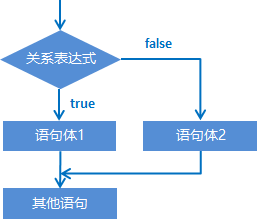
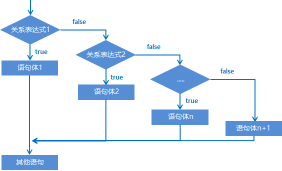

## 1. 流程控制语句

在一个程序执行的过程中，各条语句的执行顺序对程序的结果是有直接影响的。所以，我们必须清楚每条语句的执行流程。而且，很多时候要通过控制语句的执行顺序来实现我们想要的功能。

### 1.1 流程控制语句分类

顺序结构

判断和选择结构(if, switch)

循环结构(for, while, do…while)

### 1.2 顺序结构

顺序结构是程序中最简单最基本的流程控制，没有特定的语法结构，按照代码的先后顺序，依次执行，程序中大多数的代码都是这样执行的。

顺序结构执行流程图：


## 2. 判断语句：if语句

### 2.1 if语句格式1

```java
格式：
if (关系表达式) {
    语句体;	
}
```

执行流程：

①首先计算关系表达式的值

②如果关系表达式的值为true就执行语句体

③如果关系表达式的值为false就不执行语句体

④继续执行后面的语句内容


示例：

```java
public class IfDemo {
	public static void main(String[] args) {
		System.out.println("开始");	
		//定义两个变量
		int a = 10;
		int b = 20;	
		//需求：判断a和b的值是否相等，如果相等，就在控制台输出：a等于b
		if(a == b) {
			System.out.println("a等于b");
		}		
		//需求：判断a和c的值是否相等，如果相等，就在控制台输出：a等于c
		int c = 10;
		if(a == c) {
			System.out.println("a等于c");
		}		
		System.out.println("结束");
	}
}
```


#### 练习1：老丈人选女婿

需求：

键盘录入女婿的酒量，如果大于2斤，老丈人给出回应，否则没有任何回应

代码示例：

```java
//分析：
//1.键盘录入女婿的酒量
Scanner sc = new Scanner(System.in);
System.out.println("请输入女婿的酒量");
int wine = sc.nextInt();//5
//2.对酒量进行一个判断即可
if(wine > 2) {
    System.out.println("不错哟，小伙子！");
}
```


#### 练习2：考试奖励

需求：

键盘录入一个整数，表示小明的考试名次，如果名次为1，小红可以当小明的女朋友了。

代码示例：

```java
//分析：
//1.键盘录入一个整数，表示小明的考试名次
Scanner sc = new Scanner(System.in);
System.out.println("请输入小明的名次");
int rank = sc.nextInt();
//2.对小明的考试成绩进行判断即可
if(rank == 1){
    System.out.println("小红成为了小明的女朋友");
}
```

#### 第一种格式的细节：

1. ==**如果我们要对一个布尔类型的变量进行判断，不要写\==，直接把变量写在小括号中即可。**==

2. ==**如果大括号中的语句体只有一条，那么大括号可以省略不写**==

   ==**如果大括号省略了，那么if只能控制距离他最近的那一条语句。**==

   ==**建议：自己不要去写，如果别人这么写了，你要能看懂即可。**==


### 2.2 if语句格式2

```java
格式：
if (关系表达式) {
    语句体1;	
} else {
    语句体2;	
}
```

执行流程：

①首先计算关系表达式的值

②如果关系表达式的值为true就执行语句体1

③如果关系表达式的值为false就执行语句体2

④继续执行后面的语句内容



示例：

```java
public class IfDemo02 {
	public static void main(String[] args) {
		System.out.println("开始");		
		//定义两个变量
		int a = 10;
		int b = 20;
		//需求：判断a是否大于b，如果是，在控制台输出：a的值大于b，否则，在控制台输出：a的值不大于b
		if(a > b) {
			System.out.println("a的值大于b");
		} else {
			System.out.println("a的值不大于b");
		}		
		System.out.println("结束");
	}
}
```

#### 练习1：吃饭

需求：

​	    键盘录入一个整数，表示身上的钱。

​            如果大于等于100块，就是网红餐厅。

​            否则，就吃经济实惠的沙县小吃。

代码示例：

```java
//分析：
//1.键盘录入一个整数。表示身上的钱。
Scanner sc = new Scanner(System.in);
System.out.println("请输入一个整数表示身上的钱");
int money = sc.nextInt();
//2.对钱进行判断
if(money >= 100){
    System.out.println("吃网红餐厅");
}else{
    System.out.println("福建大酒店");
}
```

#### 练习2：影院选座

需求：

​	在实际开发中，电影院选座也会使用到if判断。

​	假设某影院售卖了100张票，票的序号为1~100。

​	其中奇数票号坐左侧，偶数票号坐右侧。

​	键盘录入一个整数表示电影票的票号。

​	根据不同情况，给出不同的提示：

​	如果票号为奇数，那么打印坐左边。

​	如果票号为偶数，那么打印坐右边。

代码示例：

```java
//分析：
//1.键盘录入票号
Scanner sc = new Scanner(System.in);
System.out.println("请输入票号");
int ticket = sc.nextInt();
if(ticket >= 1 && ticket <= 100){
    //合法
    //2.对票号进行判断
    if (ticket % 2 == 0) {
        //偶数
        System.out.println("坐右边");
    } else {
        //奇数
        System.out.println("坐左边");
    }
}else{
    //票号不合法
    System.out.println("票号不合法");
}
```


### 2.3 if语句格式3

```java
格式：
if (关系表达式1) {
    语句体1;	
} else if (关系表达式2) {
    语句体2;	
} 
…
else {
    语句体n+1;
}
```

执行流程：

①首先计算关系表达式1的值

②如果值为true就执行语句体1；如果值为false就计算关系表达式2的值

③如果值为true就执行语句体2；如果值为false就计算关系表达式3的值

④…

⑤如果没有任何关系表达式为true，就执行语句体n+1。



#### 练习1：考试奖励

需求：

​	小明快要期末考试了，小明爸爸对他说，会根据他不同的考试成绩，送他不同的礼物，

假如你可以控制小明的得分，请用程序实现小明到底该获得什么样的礼物，并在控制台输出。

分析：

​	①小明的考试成绩未知，可以使用键盘录入的方式获取值

​	②由于奖励种类较多，属于多种判断，采用if...else...if格式实现

​	③为每种判断设置对应的条件

​	④为每种判断设置对应的奖励

代码示例：

```java
//95~100 自行车一辆
//90~94   游乐场玩一天
//80 ~ 89 变形金刚一个
//80 以下  胖揍一顿

//1.键盘录入一个值表示小明的分数
Scanner sc = new Scanner(System.in);
System.out.println("请输入小明的成绩");
int score = sc.nextInt();
//2.对分数的有效性进行判断
if(score >= 0 && score <= 100){
    //有效的分数
    //3.对小明的分数进行判断，不同情况执行不同的代码
    if(score >= 95 && score <= 100){
        System.out.println("送自行车一辆");
    }else if(score >= 90 && score <= 94){
        System.out.println("游乐场玩一天");
    }else if(score >= 80 && score <= 89){
        System.out.println("变形金刚一个");
    }else{
        System.out.println("胖揍一顿");
    }
}else{
    //无效的分数
    System.out.println("分数不合法");
}
```


## 3. switch语句

### 3.1 格式

```java
switch (表达式) {
	case 1:
		语句体1;
		break;
	case 2:
		语句体2;
		break;
	...
	default:
		语句体n+1;
		break;
}
```

### 3.2 **执行流程：**

- **==首先计算出表达式的值==** 
- **==其次，和case依次比较，一旦有对应的值，就会执行相应的语句，在执行的过程中，遇到break就会结 束。==** 
- **==最后，如果所有的case都和表达式的值不匹配，就会执行default语句体部分，然后程序结束掉。==** 

#### 练习：运动计划

- 需求：键盘录入星期数，显示今天的减肥活动。

  周一：跑步  

  周二：游泳  

  周三：慢走  

  周四：动感单车

  周五：拳击  

  周六：爬山  

  周日：好好吃一顿

- 代码示例：

```java
package a01switch选择语句;

import java.util.Scanner;

public class SwitchDemo2 {
    public static void main(String[] args) {
        //1.键盘录入一个整数表示星期
        Scanner sc = new Scanner(System.in);
        System.out.println("请输入一个整数表示星期");
        int week = sc.nextInt();

        //2.书写一个switch语句去跟week进行匹配
        switch (week){
            case 1:
                System.out.println("跑步");
                break;
            case 2:
                System.out.println("游泳");
                break;
            case 3:
                System.out.println("慢走");
                break;
            case 4:
                System.out.println("动感单车");
                break;
            case 5:
                System.out.println("拳击");
                break;
            case 6:
                System.out.println("爬山");
                break;
            case 7:
                System.out.println("好好吃一顿");
                break;
            default:
                System.out.println("输入错误，没有这个星期");
                break;
        }
    }
}
```


### 3.3 switch的扩展知识：

- default的位置和省略情况

  default可以放在任意位置，也可以省略

- case穿透

  ==**不写break会引发case穿透现象**==

- switch在JDK12的新特性

```java
int number = 10;
switch (number) {
    case 1 -> System.out.println("一");
    case 2 -> System.out.println("二");
    case 3 -> System.out.println("三");
    default -> System.out.println("其他");
}
```

- switch和if第三种格式各自的使用场景

**==当我们需要对一个范围进行判断的时候，用if的第三种格式==**

**==当我们把有限个数据列举出来，选择其中一个执行的时候，用switch语句==**

比如：

​	小明的考试成绩，如果用switch，那么需要写100个case，太麻烦了，所以用if简单。

​	如果是星期，月份，客服电话中0~9的功能选择就可以用switch

#### 练习：休息日和工作日

需求：键盘录入星期数，输出工作日、休息日。

(1-5) 工作日，(6-7)休息日。

代码示例：

```java
//分析：
//1.键盘录入星期数
Scanner sc = new Scanner(System.in);
System.out.println("请输入星期");
int week = sc.nextInt();//3
//2.利用switch进行匹配
----------------------------------------------------
利用case穿透简化代码
switch (week){
    case 1:
    case 2:
    case 3:
    case 4:
    case 5:
        System.out.println("工作日");
        break;
    case 6:
    case 7:
        System.out.println("休息日");
        break;
    default:
        System.out.println("没有这个星期");
        break;
}
----------------------------------------------------
利用JDK12简化代码书写
switch (week) {
    case 1, 2, 3, 4, 5 -> System.out.println("工作日");
    case 6, 7 -> System.out.println("休息日");
    default -> System.out.println("没有这个星期");
}
```


## 4. 循环结构

### 4.1 for循环结构（掌握）

循环语句可以在满足循环条件的情况下，反复执行某一段代码，这段被重复执行的代码被称为循环体语句，当反复 执行这个循环体时，需要在合适的时候把循环判断条件修改为false，从而结束循环，否则循环将一直执行下去，形成死循环。 

#### 4.1.1 for循环格式：

```java
for (初始化语句;条件判断语句;条件控制语句) {
	循环体语句;
}
```

**格式解释：**

- 初始化语句：  用于表示循环开启时的起始状态，简单说就是循环开始的时候什么样
- 条件判断语句：用于表示循环反复执行的条件，简单说就是判断循环是否能一直执行下去
- 循环体语句：  用于表示循环反复执行的内容，简单说就是循环反复执行的事情
- 条件控制语句：用于表示循环执行中每次变化的内容，简单说就是控制循环是否能执行下去

**执行流程：**

①执行初始化语句

②执行条件判断语句，看其结果是true还是false

​             如果是false，循环结束

​             如果是true，继续执行

③执行循环体语句

④执行条件控制语句

⑤回到②继续

**for循环书写技巧：**

- 确定循环的开始条件
- 确定循环的结束条件
- 确定循环要重复执行的代码

代码示例：

```java
//1.确定循环的开始条件
//2.确定循环的结束条件
//3.确定要重复执行的代码

//需求：打印5次HelloWorld
//开始条件：1
//结束条件：5
//重复代码：打印语句

for (int i = 1; i <= 5; i++) {
    System.out.println("HelloWorld");
}
```

##### for循环练习-输出数据

- 需求：在控制台输出1-5和5-1的数据 
- 示例代码：

```java
public class ForTest01 {
    public static void main(String[] args) {
		//需求：输出数据1-5
        for(int i=1; i<=5; i++) {
			System.out.println(i);
		}
		System.out.println("--------");
		//需求：输出数据5-1
		for(int i=5; i>=1; i--) {
			System.out.println(i);
		}
    }
}
```


##### for循环练习-求和

- 需求：求1-5之间的数据和，并把求和结果在控制台输出  
- 示例代码：

```java
public class ForTest02 {
    public static void main(String[] args) {
		//求和的最终结果必须保存起来，需要定义一个变量，用于保存求和的结果，初始值为0
		int sum = 0;
		//从1开始到5结束的数据，使用循环结构完成
		for(int i=1; i<=5; i++) {
			//将反复进行的事情写入循环结构内部
             // 此处反复进行的事情是将数据 i 加到用于保存最终求和的变量 sum 中
			sum = sum + i;
			/*
				sum += i;	sum = sum + i;
				第一次：sum = sum + i = 0 + 1 = 1;
				第二次：sum = sum + i = 1 + 2 = 3;
				第三次：sum = sum + i = 3 + 3 = 6;
				第四次：sum = sum + i = 6 + 4 = 10;
				第五次：sum = sum + i = 10 + 5 = 15;
			*/
		}
		//当循环执行完毕时，将最终数据打印出来
		System.out.println("1-5之间的数据和是：" + sum);
    }
}
```

- 本题要点：
  - 今后遇到的需求中，如果带有求和二字，请立即联想到求和变量
  - 求和变量的定义位置，必须在循环外部，如果在循环内部则计算出的数据将是错误的


##### for循环练习-求偶数和

- 需求：求1-100之间的偶数和，并把求和结果在控制台输出 }
- 示例代码：

```java
public class ForTest03 {
    public static void main(String[] args) {
		//求和的最终结果必须保存起来，需要定义一个变量，用于保存求和的结果，初始值为0
		int sum = 0;
		//对1-100的数据求和与1-5的数据求和几乎完全一样，仅仅是结束条件不同
		for(int i=1; i<=100; i++) {
			//对1-100的偶数求和，需要对求和操作添加限制条件，判断是否是偶数
			if(i%2 == 0) {
                //sum += i；
				sum = sum + i;
			}
		}
		//当循环执行完毕时，将最终数据打印出来
		System.out.println("1-100之间的偶数和是：" + sum);
    }
}
```

##### for循环练习-统计次数

需求：

​	  键盘录入两个数字，表示一个范围。

​      统计这个范围中。

​      既能被3整除，又能被5整除数字有多少个？

代码示例：

```java
import java.util.Scanner;
public class a5_ForLoop {
    public static void main(String[] args) {
        int left = 0, right = 0, count = 0;
        Scanner sc = new Scanner(System.in);

        System.out.println("Please enter left bond:");
        left = sc.nextInt();

        System.out.println("Please enter right bond:");
        right = sc.nextInt();

        for (; left <= right; ++left){
            if (left % 3 == 0 & left % 5 == 0){
                ++count;
            }
        }
        
        System.out.println("There are " + count + " lease common multiple");
    }
}
```


### 4.2 while循环

#### 4.2.1 格式：

```java
初始化语句;
while(条件判断语句){
	循环体;
	条件控制语句;
}
```

##### 练习1：打印5次HelloWorld

```java
int i = 1;
while(i <= 5){
    System.out.println("HelloWorld");
    i++;
}
System.out.println(i);
```

##### 练习2：珠穆朗玛峰

```java
//1.定义一个变量表示珠穆朗玛峰的高度
int height = 8844430;
//2.定义一个变量表示纸张的厚度
double paper = 0.1;

//定义一个计数器（变量），用来统计折叠的次数
int count = 0;

//3.循环折叠纸张
//只有纸张的厚度 < 穆朗玛峰的高度 循环才继续，否则循环就停止
//坑：只有判断为真，循环才会继续
while(paper < height){
    //折叠纸张
    paper = paper * 2;
    count++;
}

//4.打印一下纸张的厚度
System.out.println(count);//27
```

### 4.3 do...while循环

本知识点了解即可

格式：

```java
初始化语句;
do{
    循环体;
    条件控制语句;
}while(条件判断语句);
```

特点：

先执行，再判断。

### 4.4 三种格式的区别：

​	for和while循环，是先判断，再执行。

​	do...while是先执行，再判断。

​	==**当知道循环次数或者循环范围的时候，用for循环。**==

​	==**当不知道循环次数，也不知道循环范围，但是知道循环的结束条件时，用while循环。**==


## 5. 无限循环

### 概念：

​	又叫死循环。循环一直停不下来。

### for格式：

```java
for(;;){
    System.out.println("循环执行一直在打印内容");
}
```

解释：

初始化语句可以空着不写，表示循环之前不定义任何的控制变量。

条件判断语句可以空着不写，如果不写，默认表示true，循环一直进行。

条件控制语句可以空着不写，表示每次循环体执行完毕后，控制变量不做任何变化。


### while格式： 

```java
while(true){
    System.out.println("循环执行一直在打印内容");
}
```

解释：

**==小括号里面就不能省略了，true一定要写出来，否则代码会报错。==**


### do...while格式：

```java
do{
    System.out.println("循环执行一直在打印内容");
}while(true);
```

解释：

​	小括号里面就不能省略了，true一定要写出来，否则代码会报错。


### 无限循环的注意事项：

* 最为常用的格式：while
* 无限循环下面不能再写其他代码了，因为永远执行不到。


## 6. 条件控制语句

* **break**
* **continue**

### 6.1 break:

不能单独存在的。可以用在switch和循环中，

==**表示结束，跳出的意思。**==

代码示例：

```java
//1.吃1~5号包子
for (int i = 1; i <= 5; i++) {
    System.out.println("在吃第" + i + "个包子");
    //2.吃完第三个的时候就不吃了
    if(i == 3){
        break;//结束整个循环。
    }
}
```

### 6.2 continue:

不能单独存在的。只能存在于循环当中。

**==表示：跳过本次循环，继续执行下次循环。==**

代码示例：

```java
//1.吃1~5号包子
for (int i = 1; i <= 5; i++) {
    //2.第3个包子有虫子就跳过，继续吃下面的包子
    if(i == 3){
        //跳过本次循环（本次循环中，下面的代码就不执行了），继续执行下次循环。
        continue;
    }
    System.out.println("在吃第" + i + "个包子");
}
```


## 7. Random

Random跟Scanner一样，也是Java提前写好的类，我们不需要关心是如何实现的，只要直接使用就可以了。

### 使用步骤：

1. 导包

```java
import java.util.Random;
导包的动作必须出现在类定义的上边。
```

2. 创建对象

```java
Random r = new Random ();
上面这个格式里面，只有r是变量名，可以变，其他的都不允许变。
```

3. 生成随机数

```java
int number = r.nextInt(随机数的范围);
上面这个格式里面，只有number是变量名，可以变，其他的都不允许变。
随机数范围的特点：从0开始，不包含指定值。比如：参数为10，生成的范围[0,10)
```

代码示例：

```java
//1.导包
import java.util.Random;

public class RandomDemo1 {
    public static void main(String[] args) {
        //2.创建对象
        Random r = new Random();
        //3.生成随机数
        int number = r.nextInt(100);//包左不包右，包头不包尾
        //0 ~ 99
        System.out.println(number);

    }
}
```


## 8. 逢七过

需求：

朋友聚会的时候可能会玩一个游戏：逢7过 

游戏规则：从任意一个数字开始报数，当你要报的数字是包含7或者是7的倍数时都要说过：过

使用程序在控制台打印出1-100之间的满足逢七必过规则的数据 

举例：

1 2 3 4 5 6 过 8 9 10 11 12 13 过 15 16 过 18 ...

代码示例：

```java
/*朋友聚会的时候可能会玩一个游戏：逢7过
        游戏规则：从任意一个数字开始报数，当你要报的数字是包含7或者是7的倍数时都要说过：过
        需求：使用程序在控制台打印出1-100之间的满足逢七必过规则的数据*/
//分析：
//个位7  十位7   7倍数
//1 2 3 4 5 6 过 8 9 10 11 12 13 过 15 16 过 18 19 20 过....
//69 过 过 过 过 过 过... 80
//1.得到1~100之间的每一个数字
//开始：1
//结束：100
for (int i = 1; i <= 100; i++) {
    //2.判断每一个数字，如果符合规则，就打印过，如果不符合规则就打印真实的数字
    if(i % 10 == 7 || i / 10 % 10 == 7  ||  i % 7 == 0){
        System.out.println("过");
        continue;
    }
    System.out.println(i);
}
```


## 9. 平方根

需求：

键盘录入一个大于等于2的整数 x ，计算并返回 x 的 平方根 。结果只保留整数部分 ，小数部分将被舍去 。

代码示例：

```java
/*需求：键盘录入一个大于等于2的整数 x ，计算并返回 x 的 平方根 。
        结果只保留整数部分 ，小数部分将被舍去 。*/


//分析：
//平方根   16的平方根4
//         4的平方根2


// 10
// 1 * 1 = 1 < 10
// 2 * 2 = 4 < 10
// 3 * 3 = 9 < 10
// 4 * 4 = 16 > 10
//推断：10的平方根是在3~4之间。


// 20
// 1 * 1 = 1 < 20
// 2 * 2 = 4 < 20
// 3 * 3 = 9 < 20
// 4 * 4 = 16 < 20
// 5 * 5 = 25 > 20
//推断：20的平方根是在4~5之间。


//在代码当中
//从1开始循环，拿着数字的平方跟原来的数字进行比较
//如果小于的，那么继续往后判断
//如果相等，那么当前数字就是平方根
//如果大于的，那么前一个数字就是平方跟的整数部分


//1.键盘录入一个整数
Scanner sc = new Scanner(System.in);
System.out.println("请输入一个整数");
int number = sc.nextInt();
//2.从1开始循环判断
//开始：1 结束: number
for (int i = 1; i <= number; i++) {
    //用i * i 再跟number进行比较
    if(i * i == number){
        System.out.println(i + "就是" + number + "的平方根");
        //一旦找到了，循环就可以停止了，后面的数字就不需要再找了，提高代码的运行效率。
        break;
    }else if(i * i > number){
        System.out.println((i - 1) + "就是" + number + "平方根的整数部分");
        break;
    }
}
```


## 10. 判断是否为质数

需求：

键盘录入一个正整数 x ，判断该整数是否为一个质数。 

代码示例：

```java
//需求：键盘录入一个正整数 x ，判断该整数是否为一个质数。

//质数：
//如果一个整数只能被1和本身整除，那么这个数就是质数。否则这个数叫做合数
//7 = 1 * 7 质数
//8 = 1 * 8  2 * 4 合数


//分析：
//1.键盘录入一个正整数
//number
Scanner sc = new Scanner(System.in);
System.out.println("请输入一个正整数");
int number = sc.nextInt();//9

//定义一个变量，表示标记
//标记着number是否为一个质数
//true： 是一个质数
//false : 不是一个质数

//表示最初就认为number是一个质数
boolean flag = true;


//2.判断
//写一个循环，从2开始判断，一直判断到number-1为止
//看这个范围之内，有没有数字可以被number整除
for (int i = 2; i < number; i++) {
    //i 依次表示这个范围之内的每一个数字
    //看number是否能被i整除就可以了
    if(number % i == 0){// 9 % 2 = 1
        flag = false;
        //System.out.println(number + "不是一个质数");
        break;
    }/*else{
                System.out.println(number + "是一个质数");
            }*/
}

//只有当这个循环结束了，表示这个范围之内所有的数字都判断完毕了
//此时才能断定number是一个质数
if(flag){
    System.out.println(number + "是一个质数");
}else{
    System.out.println(number + "不是一个质数");
}
```


## 11. 猜数字小游戏

需求：

程序自动生成一个1-100之间的随机数，在代码中使用键盘录入去猜出这个数字是多少？

要求：

使用循环猜，一直猜中为止。

思路分析：

1. 生成一个1-100之间的随机数
2. 使用键盘录入去猜出这个数字是多少
3. 把反复猜的代码写在循环中

代码示例：

```java
//1.生成一个1-100之间的随机数
Random r = new Random();
int number = r.nextInt(100) + 1;// 0 ~ 99 + 1 --- 1 ~ 100
System.out.println(number);

//2.使用键盘录入去猜出这个数字是多少？
Scanner sc = new Scanner(System.in);
while(true){
    System.out.println("请输入一个整数");
    int guessNumber = sc.nextInt();
    //3.比较
    if(guessNumber > number){
        System.out.println("您猜的数字大了");
    }else if(guessNumber < number){
        System.out.println("您猜的数字小了");
    }else{
        System.out.println("恭喜你，猜中了");
        break;
    }
}
```
