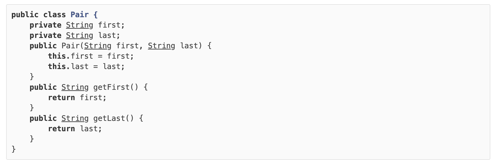

## 1.6 泛型

#### 1.6.1 什么是泛型

在讲解什么是泛型之前，我们先观察Java标准库提供的`ArrayList`，它可以看作“可变长度”的数组，因为用起来比数组更方便。

实际上`ArrayList`内部就是一个`Object[]`数组，配合存储一个当前分配的长度，就可以充当“可变数组”：

```java
public class ArrayList {
    private Object[] array;
    private int size;
    public void add(Object e) {...}
    public void remove(int index) {...}
    public Object get(int index) {...}
}
```

如果用上述`ArrayList`存储`String`类型，会有这么几个缺点：

- 需要强制转型；
- 不方便，易出错。

例如，代码必须这么写：

```java
ArrayList list = new ArrayList();
list.add("Hello");
// 获取到Object，必须强制转型为String:
String first = (String) list.get(0);
```

很容易出现ClassCastException，因为容易“误转型”：

```java
list.add(new Integer(123));
// ERROR: ClassCastException:
String second = (String) list.get(1);
```

要解决上述问题，我们可以为`String`单独编写一种`ArrayList`：

```java
public class StringArrayList {
    private String[] array;
    private int size;
    public void add(String e) {...}
    public void remove(int index) {...}
    public String get(int index) {...}
}
```

这样一来，存入的必须是`String`，取出的也一定是`String`，不需要强制转型，因为编译器会强制检查放入的类型：

```java
StringArrayList list = new StringArrayList();
list.add("Hello");
String first = list.get(0);
// 编译错误: 不允许放入非String类型:
list.add(new Integer(123));
```

问题暂时解决。

然而，新的问题是，如果要存储`Integer`，还需要为`Integer`单独编写一种`ArrayList`：

```java
public class IntegerArrayList {
    private Integer[] array;
    private int size;
    public void add(Integer e) {...}
    public void remove(int index) {...}
    public Integer get(int index) {...}
}
```

实际上，还需要为其他所有class单独编写一种`ArrayList`：

- LongArrayList
- DoubleArrayList
- PersonArrayList
- ...

这是不可能的，JDK的class就有上千个，而且它还不知道其他人编写的class。

为了解决新的问题，我们必须把`ArrayList`变成一种模板：`ArrayList<T>`，代码如下：

```java
public class ArrayList<T> {
    private T[] array;
    private int size;
    public void add(T e) {...}
    public void remove(int index) {...}
    public T get(int index) {...}
}
```

`T`可以是任何class。这样一来，我们就实现了：编写一次模版，可以创建任意类型的`ArrayList`：

```java
// 创建可以存储String的ArrayList:
ArrayList<String> strList = new ArrayList<String>();
// 创建可以存储Float的ArrayList:
ArrayList<Float> floatList = new ArrayList<Float>();
// 创建可以存储Person的ArrayList:
ArrayList<Person> personList = new ArrayList<Person>();
```

==因此，泛型就是定义一种模板，例如`ArrayList<T>`，然后在代码中为用到的类创建对应的`ArrayList<类型>`：==

```java
ArrayList<String> strList = new ArrayList<String>();
```

由编译器针对类型作检查：

```java
strList.add("hello"); // OK
String s = strList.get(0); // OK
strList.add(new Integer(123)); // compile error!
Integer n = strList.get(0); // compile error!
```

这样一来，既实现了编写一次，万能匹配，又通过编译器保证了类型安全：这就是泛型。


**向上转型**

在Java标准库中的`ArrayList<T>`实现了`List<T>`接口，它可以向上转型为`List<T>`：

```java
public class ArrayList<T> implements List<T> {
    ...
}

List<String> list = new ArrayList<String>();
```

==即类型`ArrayList<T>`可以向上转型为`List<T>`。==

==要*特别注意*：不能把`ArrayList<Integer>`向上转型为`ArrayList<Number>`或`List<Number>`。==

这是为什么呢？假设`ArrayList<Integer>`可以向上转型为`ArrayList<Number>`，观察一下代码：

```java
// 创建ArrayList<Integer>类型：
ArrayList<Integer> integerList = new ArrayList<Integer>();
// 添加一个Integer：
integerList.add(new Integer(123));
// “向上转型”为ArrayList<Number>：
ArrayList<Number> numberList = integerList;
// 添加一个Float，因为Float也是Number：
numberList.add(new Float(12.34));
// 从ArrayList<Integer>获取索引为1的元素（即添加的Float）：
Integer n = integerList.get(1); // ClassCastException!
```

我们把一个`ArrayList<Integer>`转型为`ArrayList<Number>`类型后，这个`ArrayList<Number>`就可以接受`Float`类型，因为`Float`是`Number`的子类。但是，`ArrayList<Number>`实际上和`ArrayList<Integer>`是同一个对象，也就是`ArrayList<Integer>`类型，它不可能接受`Float`类型， 所以在获取`Integer`的时候将产生`ClassCastException`。

实际上，==编译器为了避免这种错误，根本就不允许把`ArrayList<Integer>`转型为`ArrayList<Number>`。==

 ==ArrayList\<Integer>和ArrayList\<Number>两者完全没有继承关系。==


#### 1.6.2 使用泛型

==使用`ArrayList`时，如果不定义泛型类型时，泛型类型实际上就是`Object`：==

```java
// 编译器警告:
List list = new ArrayList();
list.add("Hello");
list.add("World");
String first = (String) list.get(0);
String second = (String) list.get(1);
```

此时，只能把`<T>`当作`Object`使用，没有发挥泛型的优势。

当我们定义泛型类型`<String>`后，`List<T>`的泛型接口变为强类型`List<String>`：

```java
// 无编译器警告:
List<String> list = new ArrayList<String>();
list.add("Hello");
list.add("World");
// 无强制转型:
String first = list.get(0);
String second = list.get(1);
```

当我们定义泛型类型`<Number>`后，`List<T>`的泛型接口变为强类型`List<Number>`：

```java
List<Number> list = new ArrayList<Number>();
list.add(new Integer(123));
list.add(new Double(12.34));
Number first = list.get(0);
Number second = list.get(1);
```

编译器如果能自动推断出泛型类型，就可以省略后面的泛型类型。例如，对于下面的代码：

```java
List<Number> list = new ArrayList<Number>();
```

==编译器看到泛型类型`List<Number>`就可以自动推断出后面的`ArrayList<T>`的泛型类型必须是`ArrayList<Number>`，因此，可以把代码简写为：==

```java
// 可以省略后面的Number，编译器可以自动推断泛型类型：
List<Number> list = new ArrayList<>();
```


**泛型接口**

除了`ArrayList<T>`使用了泛型，还可以在接口中使用泛型。例如，`Arrays.sort(Object[])`可以对任意数组进行排序，==但待排序的元素必须实现`Comparable<T>`这个泛型接口：==

```java
public interface Comparable<T> {
    /**
     * 返回负数: 当前实例比参数o小
     * 返回0: 当前实例与参数o相等
     * 返回正数: 当前实例比参数o大
     */
    int compareTo(T o);
}
```

可以直接对`String`数组进行排序：

```java
// sort
import java.util.Arrays;

public class Main {
    public static void main(String[] args) {
        String[] ss = new String[] { "Orange", "Apple", "Pear" };
        Arrays.sort(ss);
        System.out.println(Arrays.toString(ss));
    }
}
```


这是因为`String`本身已经实现了`Comparable<String>`接口。如果换成我们自定义的`Person`类型试试：

```java
// sort
import java.util.Arrays;

public class Main {
    public static void main(String[] args) {
        Person[] ps = new Person[] {
            new Person("Bob", 61),
            new Person("Alice", 88),
            new Person("Lily", 75),
        };
        Arrays.sort(ps);
        System.out.println(Arrays.toString(ps));
    }
}

class Person {
    String name;
    int score;
    Person(String name, int score) {
        this.name = name;
        this.score = score;
    }
    public String toString() {
        return this.name + "," + this.score;
    }
}
```


运行程序，我们会得到`ClassCastException`，即无法将`Person`转型为`Comparable`。我们修改代码，让`Person`实现`Comparable<T>`接口：

```java
// sort
import java.util.Arrays;

public class Main {
    public static void main(String[] args) {
        Person[] ps = new Person[] {
            new Person("Bob", 61),
            new Person("Alice", 88),
            new Person("Lily", 75),
        };
        Arrays.sort(ps);
        System.out.println(Arrays.toString(ps));
    }
}

class Person implements Comparable<Person> {
    String name;
    int score;
    Person(String name, int score) {
        this.name = name;
        this.score = score;
    }
    public int compareTo(Person other) {
        return this.name.compareTo(other.name);
    }
    public String toString() {
        return this.name + "," + this.score;
    }
}
```


运行上述代码，可以正确实现按`name`进行排序。

也可以修改比较逻辑，例如，按`score`从高到低排序。请自行修改测试。


#### 1.6.3 编写泛型

编写泛型类比普通类要复杂。通常来说，泛型类一般用在集合类中，例如`ArrayList<T>`，我们很少需要编写泛型类。

如果我们确实需要编写一个泛型类，那么，应该如何编写它？

可以按照以下步骤来编写一个泛型类。

首先，按照某种类型，例如：`String`，来编写类：

```java
public class Pair {
    private String first;
    private String last;
    public Pair(String first, String last) {
        this.first = first;
        this.last = last;
    }
    public String getFirst() {
        return first;
    }
    public String getLast() {
        return last;
    }
}
```

然后，标记所有的特定类型，这里是`String`：



最后，==把特定类型`String`替换为`T`，并申明`<T>`：==

```java
public class Pair<T> {
    private T first;
    private T last;
    public Pair(T first, T last) {
        this.first = first;
        this.last = last;
    }
    public T getFirst() {
        return first;
    }
    public T getLast() {
        return last;
    }
}
```

==熟练后即可直接从`T`开始编写。==


**静态方法**

==编写泛型类时，要特别注意，泛型类型`<T>`不能用于静态方法。例如：==

```java
public class Pair<T> {
    private T first;
    private T last;
    public Pair(T first, T last) {
        this.first = first;
        this.last = last;
    }
    public T getFirst() { ... }
    public T getLast() { ... }

    // 对静态方法使用<T>:
    public static Pair<T> create(T first, T last) {
        return new Pair<T>(first, last);
    }
}
```

上述代码会导致编译错误，我们无法在静态方法`create()`的方法参数和返回类型上使用泛型类型`T`。

有些同学在网上搜索发现，可以在`static`修饰符后面加一个`<T>`，编译就能通过：

```java
public class Pair<T> {
    private T first;
    private T last;
    public Pair(T first, T last) {
        this.first = first;
        this.last = last;
    }
    public T getFirst() { ... }
    public T getLast() { ... }

    // 可以编译通过:
    public static <T> Pair<T> create(T first, T last) {
        return new Pair<T>(first, last);
    }
}
```

但实际上，这个`<T>`和`Pair<T>`类型的`<T>`已经没有任何关系了。

==对于静态方法，我们可以单独改写为“泛型”方法，只需要使用另一个类型即可。对于上面的`create()`静态方法，我们应该把它改为另一种泛型类型，例如，`<K>`：==

```java
public class Pair<T> {
    private T first;
    private T last;
    public Pair(T first, T last) {
        this.first = first;
        this.last = last;
    }
    public T getFirst() { ... }
    public T getLast() { ... }

    // 静态泛型方法应该使用其他类型区分:
    public static <K> Pair<K> create(K first, K last) {
        return new Pair<K>(first, last);
    }
}
```

==这样才能清楚地将静态方法的泛型类型和实例类型的泛型类型区分开。==


**多个泛型类型**

==泛型还可以定义多种类型。例如，我们希望`Pair`不总是存储两个类型一样的对象，就可以使用类型`<T, K>`：==

```java
public class Pair<T, K> {
    private T first;
    private K last;
    public Pair(T first, K last) {
        this.first = first;
        this.last = last;
    }
    public T getFirst() { ... }
    public K getLast() { ... }
}
```

==使用的时候，需要指出两种类型：==

```java
Pair<String, Integer> p = new Pair<>("test", 123);
```

Java标准库的`Map<K, V>`就是使用两种泛型类型的例子。它对Key使用一种类型，对Value使用另一种类型。


#### 1.6.4 擦拭法


#### 1.6.5 extends通配符


#### 1.6.6 super通配符


#### 1.6.7 泛型和反射