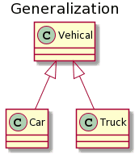
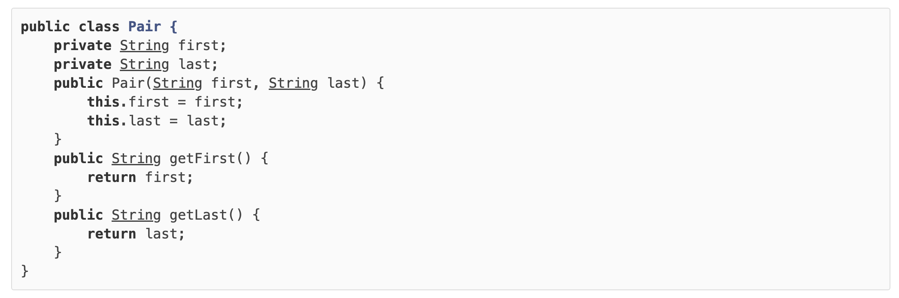

# 1. Java Fundamental

## 1.1 快速入门

### 1.1.1 Java历史

Java最早是由SUN公司（已被Oracle收购）的[詹姆斯·高斯林](https://en.wikipedia.org/wiki/James_Gosling)（高司令，人称Java之父）在上个世纪90年代初开发的一种编程语言，最初被命名为Oak，目标是针对小型家电设备的嵌入式应用，结果市场没啥反响。谁料到互联网的崛起，让Oak重新焕发了生机，于是SUN公司改造了Oak，在1995年以Java的名称正式发布，原因是Oak已经被人注册了，因此SUN注册了Java这个商标。随着互联网的高速发展，Java逐渐成为最重要的网络编程语言。

==Java介于编译型语言和解释型语言之间。==编译型语言如C、C++，代码是直接编译成机器码执行，但是不同的平台（x86、ARM等）CPU的指令集不同，因此，需要编译出每一种平台的对应机器码。解释型语言如Python、Ruby没有这个问题，可以由解释器直接加载源码然后运行，代价是运行效率太低。而Java是将代码编译成一种“字节码”，它类似于抽象的CPU指令，然后，针对不同平台编写虚拟机，不同平台的虚拟机负责加载字节码并执行，这样就实现了“一次编写，到处运行”的效果。当然，这是针对Java开发者而言。对于虚拟机，需要为每个平台分别开发。为了保证不同平台、不同公司开发的虚拟机都能正确执行Java字节码，SUN公司制定了一系列的Java虚拟机规范。从实践的角度看，JVM的兼容性做得非常好，低版本的Java字节码完全可以正常运行在高版本的JVM上。

随着Java的发展，SUN给Java又分出了三个不同版本：

- Java SE：Standard Edition
- Java EE：Enterprise Edition
- Java ME：Micro Edition

这三者之间有啥关系呢？

```ascii
┌───────────────────────────┐
│Java EE                    │
│    ┌────────────────────┐ │
│    │Java SE             │ │
│    │    ┌─────────────┐ │ │
│    │    │   Java ME   │ │ │
│    │    └─────────────┘ │ │
│    └────────────────────┘ │
└───────────────────────────┘
```

简单来说，Java SE就是标准版，包含标准的JVM和标准库，而Java EE是企业版，它只是在Java SE的基础上加上了大量的API和库，以便方便开发Web应用、数据库、消息服务等，Java EE的应用使用的虚拟机和Java SE完全相同。

Java ME就和Java SE不同，它是一个针对嵌入式设备的“瘦身版”，Java SE的标准库无法在Java ME上使用，Java ME的虚拟机也是“瘦身版”。

毫无疑问，Java SE是整个Java平台的核心，而Java EE是进一步学习Web应用所必须的。我们熟悉的Spring等框架都是Java EE开源生态系统的一部分。不幸的是，Java ME从来没有真正流行起来，反而是Android开发成为了移动平台的标准之一，因此，没有特殊需求，不建议学习Java ME。

因此我们推荐的Java学习路线图如下：

1. 首先要学习Java SE，掌握Java语言本身、Java核心开发技术以及Java标准库的使用；
2. 如果继续学习Java EE，那么Spring框架、数据库开发、分布式架构就是需要学习的；
3. 如果要学习大数据开发，那么Hadoop、Spark、Flink这些大数据平台就是需要学习的，他们都基于Java或Scala开发；
4. 如果想要学习移动开发，那么就深入Android平台，掌握Android App开发。

无论怎么选择，Java SE的核心技术是基础，这个教程的目的就是让你完全精通Java SE并掌握Java EE！


**Java版本**

从1995年发布1.0版本开始，到目前为止，最新的Java版本是Java 21：

| 时间   | 版本      |
| :----- | :-------- |
| 1995   | 1.0       |
| 1998   | 1.2       |
| 2000   | 1.3       |
| 2002   | 1.4       |
| 2004   | 1.5 / 5.0 |
| 2005   | 1.6 / 6.0 |
| 2011   | 1.7 / 7.0 |
| 2014   | 1.8 / 8.0 |
| 2017/9 | 1.9 / 9.0 |
| 2018/3 | 10        |
| 2018/9 | 11        |
| 2019/3 | 12        |
| 2019/9 | 13        |
| 2020/3 | 14        |
| 2020/9 | 15        |
| 2021/3 | 16        |
| 2021/9 | 17        |
| 2022/3 | 18        |
| 2022/9 | 19        |
| 2023/3 | 20        |
| 2023/9 | 21        |

本教程使用的Java版本是最新版的**Java 21**。


**名词解释**

初学者学Java，经常听到JDK、JRE这些名词，它们到底是啥？

- ==JDK：Java Development Kit==

简单地说，JRE就是运行Java字节码的虚拟机。但是，如果只有Java源码，要编译成Java字节码，就需要JDK，因为JDK除了包含JRE，还提供了编译器、调试器等开发工具。

二者关系如下：

```ascii
  ┌─    ┌──────────────────────────────────┐
  │     │     Compiler, debugger, etc.     │
  │     └──────────────────────────────────┘
 JDK ┌─ ┌──────────────────────────────────┐
  │  │  │                                  │
  │  │  │                                  │
  └─ └─ └──────────────────────────────────┘
        ┌───────┐┌───────┐┌───────┐┌───────┐
        │Windows││ Linux ││ macOS ││others │
        └───────┘└───────┘└───────┘└───────┘
```

要学习Java开发，当然需要安装JDK了。

那JSR、JCP……又是啥？

- JSR规范：Java Specification Request
- JCP组织：Java Community Process

为了保证Java语言的规范性，SUN公司搞了一个JSR规范，凡是想给Java平台加一个功能，比如说访问数据库的功能，大家要先创建一个JSR规范，定义好接口，这样，各个数据库厂商都按照规范写出Java驱动程序，开发者就不用担心自己写的数据库代码在MySQL上能跑，却不能跑在PostgreSQL上。

所以JSR是一系列的规范，从JVM的内存模型到Web程序接口，全部都标准化了。而负责审核JSR的组织就是JCP。

一个JSR规范发布时，为了让大家有个参考，还要同时发布一个“参考实现”，以及一个“兼容性测试套件”：

- RI：Reference Implementation
- TCK：Technology Compatibility Kit

比如有人提议要搞一个基于Java开发的消息服务器，这个提议很好啊，但是光有提议还不行，得贴出真正能跑的代码，这就是RI。如果有其他人也想开发这样一个消息服务器，如何保证这些消息服务器对开发者来说接口、功能都是相同的？所以还得提供TCK。

通常来说，RI只是一个“能跑”的正确的代码，它不追求速度，所以，如果真正要选择一个Java的消息服务器，一般是没人用RI的，大家都会选择一个有竞争力的商用或开源产品。


#### 1.1.1.1 安装JDK

因为Java程序必须运行在JVM之上，所以，我们第一件事情就是安装JDK。

搜索JDK 21，确保从[Oracle的官网](https://www.oracle.com/java/technologies/downloads/)下载最新的稳定版JDK：

```ascii
Java SE Development Kit 21 downloads

Linux  macOS  Windows
              -------

x64 Compressed Archive      Download
x64 Installer               Download
x64 MSI Installer           Download
```

选择合适的操作系统与安装包，找到Java SE 21的下载链接`Download`，下载安装即可。Windows优先选`x64 MSI Installer`，Linux和macOS要根据自己电脑的CPU是ARM还是x86选择合适的安装包。


**设置环境变量**

安装完JDK后，需要设置一个`JAVA_HOME`的环境变量，它指向JDK的安装目录。在Windows下，它是安装目录，类似：

```java
C:\Program Files\Java\jdk-21
```

在Mac下，它在`~/.bash_profile`或`~/.zprofile`里，它是：

```java
export JAVA_HOME=`/usr/libexec/java_home -v 21`
```

然后，把`JAVA_HOME`的`bin`目录附加到系统环境变量`PATH`上。在Windows下，它长这样：

```java
Path=%JAVA_HOME%\bin;<现有的其他路径>
```

在Mac下，它在`~/.bash_profile`或`~/.zprofile`里，长这样：

```java
export PATH=$JAVA_HOME/bin:$PATH
```

把`JAVA_HOME`的`bin`目录添加到`PATH`中是为了在任意文件夹下都可以运行`java`。打开命令提示符窗口，输入命令`java -version`，如果一切正常，你会看到如下输出：

```ascii
┌────────────────────────────────────────────────────────┐
│Command Prompt                                    - □ x │
├────────────────────────────────────────────────────────┤
│Microsoft Windows [Version 10.0.0]                      │
│(c) 2015 Microsoft Corporation. All rights reserved.    │
│                                                        │
│C:\> java -version                                      │
│java version "21" ...                                   │
│Java HotSpot(TM) 64-Bit Server VM                       │
│                                                        │
│C:\>                                                    │
│                                                        │
│                                                        │
└────────────────────────────────────────────────────────┘
```

如果你看到的版本号不是`21`，而是`15`、`1.8`之类，说明系统存在多个JDK，且默认JDK不是JDK 21，需要把JDK 21提到`PATH`前面。

如果你得到一个错误输出：

```ascii
┌────────────────────────────────────────────────────────┐
│Command Prompt                                    - □ x │
├────────────────────────────────────────────────────────┤
│Microsoft Windows [Version 10.0.0]                      │
│(c) 2015 Microsoft Corporation. All rights reserved.    │
│                                                        │
│C:\> java -version                                      │
│'java' is not recognized as an internal or external comm│
│and, operable program or batch file.                    │
│                                                        │
│C:\>                                                    │
│                                                        │
│                                                        │
│                                                        │
└────────────────────────────────────────────────────────┘
```

这是因为系统无法找到Java虚拟机的程序`java.exe`，需要检查JAVA_HOME和PATH的配置。

可以参考[如何设置或更改PATH系统变量](https://www.java.com/zh_CN/download/help/path.xml)。


**JDK**

细心的童鞋还可以在`JAVA_HOME`的`bin`目录下找到很多可执行文件：

- java：这个可执行程序其实就是JVM，运行Java程序，就是启动JVM，然后让JVM执行指定的编译后的代码；
- javac：这是Java的编译器，它用于把Java源码文件（以`.java`后缀结尾）编译为Java字节码文件（以`.class`后缀结尾）；
- jar：用于把一组`.class`文件打包成一个`.jar`文件，便于发布；
- javadoc：用于从Java源码中自动提取注释并生成文档；
- jdb：Java调试器，用于开发阶段的运行调试。


#### 1.1.1.2 第一个Java程序

我们来编写第一个Java程序。

打开文本编辑器，输入以下代码：

```java
public class Hello {
    public static void main(String[] args) {
        System.out.println("Hello, world!");
    }
}
```

在一个Java程序中，你总能找到一个类似：

```java
public class Hello {
    ...
}
```

的定义，这个定义被称为class（类），这里的类名是`Hello`，大小写敏感，`class`用来定义一个类，`public`表示这个类是公开的，`public`、`class`都是Java的关键字，必须小写，`Hello`是类的名字，按照习惯，首字母`H`要大写。而花括号`{}`中间则是类的定义。

注意到类的定义中，我们定义了一个名为`main`的方法：

```java
public static void main(String[] args) {
        ...
    }
```

方法是可执行的代码块，一个方法除了方法名`main`，还有用`()`括起来的方法参数，这里的`main`方法有一个参数，参数类型是`String[]`，参数名是`args`，`public`、`static`用来修饰方法，这里表示它是一个公开的静态方法，`void`是方法的返回类型，而花括号`{}`中间的就是方法的代码。

方法的代码每一行用`;`结束，这里只有一行代码，就是：

```java
System.out.println("Hello, world!");
```

它用来打印一个字符串到屏幕上。

Java规定，某个类定义的`public static void main(String[] args)`是Java程序的固定入口方法，因此，Java程序总是从`main`方法开始执行。

注意到Java源码的缩进不是必须的，但是用缩进后，格式好看，很容易看出代码块的开始和结束，缩进一般是4个空格或者一个tab。

最后，当我们把代码保存为文件时，文件名必须是`Hello.java`，而且文件名也要注意大小写，因为要和我们定义的类名`Hello`完全保持一致。


**如何运行Java程序**

Java源码本质上是一个文本文件，我们需要先用`javac`把`Hello.java`编译成字节码文件`Hello.class`，然后，用`java`命令执行这个字节码文件：

```ascii
┌──────────────────┐
│    Hello.java    │◀── source code
└──────────────────┘
          │ compile
          ▼
┌──────────────────┐
│   Hello.class    │◀── byte code
└──────────────────┘
          │ execute
          ▼
┌──────────────────┐
└──────────────────┘
```

因此，可执行文件`javac`是编译器，而可执行文件`java`就是虚拟机。

第一步，在保存`Hello.java`的目录下执行命令`javac Hello.java`：

```java
$ javac Hello.java
```

如果源代码无误，上述命令不会有任何输出，而当前目录下会产生一个`Hello.class`文件：

```java
$ ls
Hello.class	Hello.java
```

第二步，执行`Hello.class`，使用命令`java Hello`：

```java
$ java Hello
Hello, world!
```

注意：给虚拟机传递的参数`Hello`是我们定义的类名，虚拟机自动查找对应的class文件并执行。

有一些童鞋可能知道，直接运行`java Hello.java`也是可以的：

```java
$ java Hello.java 
Hello, world!
```

这是Java 11新增的一个功能，它可以直接运行一个单文件源码！

需要注意的是，在实际项目中，单个不依赖第三方库的Java源码是非常罕见的，所以，绝大多数情况下，我们无法直接运行一个Java源码文件，原因是它需要依赖其他的库。


**小结**

==一个Java源码只能定义一个`public`类型的class，并且class名称和文件名要完全一致；==

==使用`javac`可以将`.java`源码编译成`.class`字节码；==

==使用`java`可以运行一个已编译的Java程序，参数是类名。==


### 1.1.2 Java程序基础

#### 1.1.2.1 Java程序基本结构

我们先剖析一个完整的Java程序，它的基本结构是什么：

```java
/**
 * 可以用来自动创建文档的注释
 */
public class Hello {
    public static void main(String[] args) {
        // 向屏幕输出文本:
        System.out.println("Hello, world!");
        /* 多行注释开始
        注释内容
        注释结束 */
    }
} // class定义结束
```

因为Java是面向对象的语言，一个程序的基本单位就是`class`，`class`是关键字，这里定义的`class`名字就是`Hello`：

```java
public class Hello { // 类名是Hello
    // ...
} // class定义结束
```

类名要求：

- ==类名必须以英文字母开头，后接字母，数字和下划线的组合==
- ==习惯以大写字母开头==

注意到`public`是访问修饰符，表示该`class`是公开的。

不写`public`，也能正确编译，但是这个类将无法从命令行执行。

在`class`内部，可以定义若干方法（method）：

```java
public class Hello {
    public static void main(String[] args) { // 方法名是main
        // 方法代码...
    } // 方法定义结束
}
```

方法定义了一组执行语句，方法内部的代码将会被依次顺序执行。

这里的方法名是`main`，返回值是`void`，表示没有任何返回值。

我们注意到`public`除了可以修饰`class`外，也可以修饰方法。而关键字`static`是另一个修饰符，它表示静态方法，后面我们会讲解方法的类型，目前，我们只需要知道，==Java入口程序规定的方法必须是静态方法，方法名必须为`main`，括号内的参数必须是String数组。==

==方法名也有命名规则，命名和`class`一样，但是首字母小写：==

在方法内部，语句才是真正的执行代码。Java的每一行语句必须以分号结束：

```java
public class Hello {
    public static void main(String[] args) {
        System.out.println("Hello, world!"); // 语句
    }
}
```

在Java程序中，注释是一种给人阅读的文本，不是程序的一部分，所以编译器会自动忽略注释。

Java有3种注释，第一种是单行注释，以双斜线开头，直到这一行的结尾结束：

```java
// 这是注释...
```

而多行注释以`/*`星号开头，以`*/`结束，可以有多行：

```java
/*
这是注释
blablabla...
这也是注释
*/
```

还有一种特殊的多行注释，以`/**`开头，以`*/`结束，如果有多行，每行通常以星号开头：

```java
/**
 * 可以用来自动创建文档的注释
 * 
 * @auther liaoxuefeng
 */
public class Hello {
    public static void main(String[] args) {
        System.out.println("Hello, world!");
    }
}
```

这种特殊的多行注释需要写在类和方法的定义处，可以用于自动创建文档。

Java程序对格式没有明确的要求，多几个空格或者回车不影响程序的正确性，但是我们要养成良好的编程习惯，注意遵守Java社区约定的编码格式。


#### 1.1.2.2 变量和数据类型

**变量**

什么是变量？

变量就是初中数学的代数的概念，例如一个简单的方程，x，y都是变量：

𝑦=3𝑥

在Java中，变量分为两种：==基本类型的变量和引用类型的变量。==

==基本类型包括，整数类型，浮点类型，字符类型，布尔类型。 基本类型的变量直接存储其值，内存通常分配在栈上。基本类型有默认值，例如 `int` 的默认值是 `0`，`boolean` 的默认值是 `false`。基本类型的值是不可变的，即赋值后不能更改其本身的类型。==

==引用类型包括类（class）、接口（interface）、数组（array）、字符串（String）等。引用类型的变量存储的是对象的引用（即对象在内存中的地址），而不是对象本身。==

我们先讨论基本类型的变量。

在Java中，变量必须先定义后使用，在定义变量的时候，可以给它一个初始值。例如：

```java
int x = 1;
```

上述语句定义了一个整型`int`类型的变量，名称为`x`，初始值为`1`。

不写初始值，就相当于给它指定了默认值。默认值总是`0`。

来看一个完整的定义变量，然后打印变量值的例子：

```java
public class Main {
    public static void main(String[] args) {
        int x = 100; // 定义int类型变量x，并赋予初始值100
        System.out.println(x); // 打印该变量的值
    }
}
```

变量的一个重要特点是可以重新赋值。例如，对变量`x`，先赋值`100`，再赋值`200`，观察两次打印的结果：

````java
public class Main {
    public static void main(String[] args) {
        int x = 100; // 定义int类型变量x，并赋予初始值100
        System.out.println(x); // 打印该变量的值，观察是否为100
        x = 200; // 重新赋值为200
        System.out.println(x); // 打印该变量的值，观察是否为200
    }
}
````

注意到第一次定义变量`x`的时候，需要指定变量类型`int`，因此使用语句`int x = 100;`。而第二次重新赋值的时候，变量`x`已经存在了，不能再重复定义，因此不能指定变量类型`int`，必须使用语句`x = 200;`。

变量不但可以重新赋值，还可以赋值给其他变量。让我们来看一个例子：

```java
public class Main {
    public static void main(String[] args) {
        int n = 100; // 定义变量n，同时赋值为100
        System.out.println("n = " + n); // 打印n的值

        n = 200; // 变量n赋值为200
        System.out.println("n = " + n); // 打印n的值

        int x = n; // 变量x赋值为n（n的值为200，因此赋值后x的值也是200）
        System.out.println("x = " + x); // 打印x的值

        x = x + 100; // 变量x赋值为x+100（x的值为200，因此赋值后x的值是200+100=300）
        System.out.println("x = " + x); // 打印x的值
        System.out.println("n = " + n); // 再次打印n的值，n应该是200还是300？
   }
}
```

我们一行一行地分析代码执行流程：

执行`int n = 100;`，该语句定义了变量`n`，同时赋值为`100`，因此，JVM在内存中为变量`n`分配一个“存储单元”，填入值`100`：

```ascii
      n
      │
      ▼
┌───┬───┬───┬───┬───┬───┬───┐
│   │100│   │   │   │   │   │
└───┴───┴───┴───┴───┴───┴───┘
```

执行`n = 200;`时，JVM把`200`写入变量`n`的存储单元，因此，原有的值被覆盖，现在`n`的值为`200`：

```ascii
      n
      │
      ▼
┌───┬───┬───┬───┬───┬───┬───┐
│   │200│   │   │   │   │   │
└───┴───┴───┴───┴───┴───┴───┘
```

执行`int x = n;`时，定义了一个新的变量`x`，同时对`x`赋值，因此，JVM需要*新分配*一个存储单元给变量`x`，并写入和变量`n`一样的值，结果是变量`x`的值也变为`200`：

```ascii
      n           x
      │           │
      ▼           ▼
┌───┬───┬───┬───┬───┬───┬───┐
│   │200│   │   │200│   │   │
└───┴───┴───┴───┴───┴───┴───┘
```

执行`x = x + 100;`时，JVM首先计算等式右边的值`x + 100`，结果为`300`（因为此刻`x`的值为`200`），然后，将结果`300`写入`x`的存储单元，因此，变量`x`最终的值变为`300`：

```ascii
      n           x
      │           │
      ▼           ▼
┌───┬───┬───┬───┬───┬───┬───┐
│   │200│   │   │300│   │   │
└───┴───┴───┴───┴───┴───┴───┘
```


**基本数据类型**

基本数据类型是CPU可以直接进行运算的类型。Java定义了以下几种基本数据类型：

- ==整数类型：byte，short，int，long==
- ==浮点数类型：float，double==
- ==字符类型：char==
- ==布尔类型：boolean==

Java定义的这些基本数据类型有什么区别呢？要了解这些区别，我们就必须简单了解一下计算机内存的基本结构。

计算机内存的最小存储单元是字节（byte），一个字节就是一个8位二进制数，即8个bit。它的二进制表示范围从`00000000`~`11111111`，换算成十进制是0~255，换算成十六进制是`00`~`ff`。

内存单元从0开始编号，称为内存地址。每个内存单元可以看作一间房间，内存地址就是门牌号。

```ascii
  0   1   2   3   4   5   6  ...
┌───┬───┬───┬───┬───┬───┬───┐
│   │   │   │   │   │   │   │...
└───┴───┴───┴───┴───┴───┴───┘
```

一个字节是1byte，1024字节是1K，1024K是1M，1024M是1G，1024G是1T。一个拥有4T内存的计算机的字节数量就是：

```java
4T = 4 x 1024G
   = 4 x 1024 x 1024M
   = 4 x 1024 x 1024 x 1024K
   = 4 x 1024 x 1024 x 1024 x 1024
   = 4398046511104
```

不同的数据类型占用的字节数不一样。我们看一下Java基本数据类型占用的字节数：

| 类型               | 长度          | 范围                                            |
| ------------------ | ------------- | ----------------------------------------------- |
| byte（字节型）     | 1个字节       | -128~127                                        |
| boolean（布尔型）  | 1个字节       | true或false                                     |
| int（整型）        | 长度：4个字节 | -2147483648~2147483647                          |
| short（短整型）    | 2个字节       | -32768~32767                                    |
| long（长整型）     | 8 个字节      | -9223372036854775808 ~ 9223372036854775807      |
| char（字符型）     | 2个字节       | 从字符型对应的整型数来划分，其表示范围是0~65535 |
| float（浮点型）    | 4 个字节      | -3.4E38~3.4E38                                  |
| double（双精度型） | 8个字节       | -1.7E308~1.7E308                                |

byte`恰好就是一个字节，而`long`和`double`需要8个字节。


**整型**

对于整型类型，Java只定义了带符号的整型，因此，最高位的bit表示符号位（0表示正数，1表示负数）。各种整型能表示的最大范围如下：

- byte：-128 ~ 127
- short: -32768 ~ 32767
- int: -2147483648 ~ 2147483647
- long: -9223372036854775808 ~ 9223372036854775807

我们来看定义整型的例子：

```java
public class Main {
    public static void main(String[] args) {
        int i = 2147483647;
        int i2 = -2147483648;
        int i3 = 2_000_000_000; // 加下划线更容易识别
        int i4 = 0xff0000; // 十六进制表示的16711680
        int i5 = 0b1000000000; // 二进制表示的512

        long n1 = 9000000000000000000L; // long型的结尾需要加L
        long n2 = 900; // 没有加L，此处900为int，但int类型可以赋值给long
        int i6 = 900L; // 错误：不能把long型赋值给int
    }
}
```

==特别注意：同一个数的不同进制的表示是完全相同的，例如`15`=`0xf`＝`0b1111`。==


**浮点型**

浮点类型的数就是小数，因为小数用科学计数法表示的时候，小数点是可以“浮动”的，如1234.5可以表示成12.345x102，也可以表示成1.2345x103，所以称为浮点数。

下面是定义浮点数的例子：

```java
float f1 = 3.14f;
float f2 = 3.14e38f; // 科学计数法表示的3.14x10^38
float f3 = 1.0; // 错误：不带f结尾的是double类型，不能赋值给float

double d = 1.79e308;
double d2 = -1.79e308;
double d3 = 4.9e-324; // 科学计数法表示的4.9x10^-324
```

对于`float`类型，需要加上`f`后缀。

浮点数可表示的范围非常大，`float`类型可最大表示3.4x1038，而`double`类型可最大表示1.79x10308。


**布尔类型**

布尔类型`boolean`只有`true`和`false`两个值，布尔类型总是关系运算的计算结果：

```java
boolean b1 = true;
boolean b2 = false;
boolean isGreater = 5 > 3; // 计算结果为true
int age = 12;
boolean isAdult = age >= 18; // 计算结果为false
```

Java语言对布尔类型的存储并没有做规定，因为理论上存储布尔类型只需要1 bit，但是通常JVM内部会把`boolean`表示为4字节整数。


**字符类型**

字符类型`char`表示一个字符。Java的`char`类型除了可表示标准的ASCII外，还可以表示一个Unicode字符：

```java
public class Main {
    public static void main(String[] args) {
        char a = 'A';
        char zh = '中';
        System.out.println(a);
        System.out.println(zh);
    }
}
```

注意`char`类型使用单引号`'`，且仅有一个字符，要和双引号`"`的字符串类型区分开。


**引用类型**

除了上述基本类型的变量，剩下的都是引用类型。例如，引用类型最常用的就是`String`字符串：

```java
String s = "hello";
```

引用类型的变量类似于C语言的指针，它内部存储一个“地址”，指向某个对象在内存的位置，后续我们介绍类的概念时会详细讨论。


**常量**

==定义变量的时候，如果加上`final`修饰符，这个变量就变成了常量：==

```java
final double PI = 3.14; // PI是一个常量
double r = 5.0;
double area = PI * r * r;
PI = 300; // compile error!
```

常量在定义时进行初始化后就不可再次赋值，再次赋值会导致编译错误。

常量的作用是用有意义的变量名来避免魔术数字（Magic number），例如，不要在代码中到处写`3.14`，而是定义一个常量。如果将来需要提高计算精度，我们只需要在常量的定义处修改，例如，改成`3.1416`，而不必在所有地方替换`3.14`。

根据习惯，**常量名通常全部大写。**


**var关键字**

有些时候，类型的名字太长，写起来比较麻烦。例如：

```java
StringBuilder sb = new StringBuilder();
```

==这个时候，如果想省略变量类型，可以使用`var`关键字：==

```java
var sb = new StringBuilder();
```

编译器会根据赋值语句自动推断出变量`sb`的类型是`StringBuilder`。对编译器来说，语句：

```java
var sb = new StringBuilder();
```

实际上会自动变成：

```java
StringBuilder sb = new StringBuilder();
```

因此，使用`var`定义变量，仅仅是少写了变量类型而已。


**变量的作用范围**

在Java中，多行语句用{ }括起来。很多控制语句，例如条件判断和循环，都以{ }作为它们自身的范围，例如：

```java
if (...) { // if开始
    ...
    while (...) { // while 开始
        ...
        if (...) { // if开始
            ...
        } // if结束
        ...
    } // while结束
    ...
} // if结束
```

只要正确地嵌套这些{ }，编译器就能识别出语句块的开始和结束。而在语句块中定义的变量，它有一个作用域，就是从定义处开始，到语句块结束。超出了作用域引用这些变量，编译器会报错。举个例子：

```java
{
    ...
    int i = 0; // 变量i从这里开始定义
    ...
    {
        ...
        int x = 1; // 变量x从这里开始定义
        ...
        {
            ...
            String s = "hello"; // 变量s从这里开始定义
            ...
        } // 变量s作用域到此结束
        ...
        // 注意，这是一个新的变量s，它和上面的变量同名，
        // 但是因为作用域不同，它们是两个不同的变量:
        String s = "hi";
        ...
    } // 变量x和s作用域到此结束
    ...
} // 变量i作用域到此结束
```

定义变量时，要遵循作用域最小化原则，尽量将变量定义在尽可能小的作用域，并且，不要重复使用变量名。


#### 1.2.2.3 整数运算

Java的整数运算遵循四则运算规则，可以使用任意嵌套的小括号。四则运算规则和初等数学一致。例如：

```java
public class Main {
    public static void main(String[] args) {
        int i = (100 + 200) * (99 - 88); // 3300
        int n = 7 * (5 + (i - 9)); // 23072
        System.out.println(i);
        System.out.println(n);
    }
}
```

==两个整数相除只能得到结果的整数部分，会chop掉小数部分：==

```java
int x = 12345 / 67; // 184
```

求余运算使用`%`：

```java
int y = 12345 % 67; // 12345÷67的余数是17
```

==特别注意：整数的除法对于除数为0时运行时将报错，但编译不会报错。==


**溢出**

要特别注意，整数由于存在范围限制，如果计算结果超出了范围，就会产生溢出，而溢出*不会出错*，却会得到一个奇怪的结果：

```java
public class Main {
    public static void main(String[] args) {
        int x = 2147483640;
        int y = 15;
        int sum = x + y;
        System.out.println(sum); // -2147483641
    }
}
```

要解释上述结果，我们把整数`2147483640`和`15`换成二进制做加法：

```ascii
  0111 1111 1111 1111 1111 1111 1111 1000
+ 0000 0000 0000 0000 0000 0000 0000 1111
-----------------------------------------
  1000 0000 0000 0000 0000 0000 0000 0111
```

由于最高位计算结果为`1`，因此，加法结果变成了一个负数。

要解决上面的问题，可以把`int`换成`long`类型，由于`long`可表示的整型范围更大，所以结果就不会溢出：

```java
long x = 2147483640;
long y = 15;
long sum = x + y;
System.out.println(sum); // 2147483655
```

还有一种简写的运算符，即`+=`，`-=`，`*=`，`/=`，它们的使用方法如下：

```java
n += 100; // 3409, 相当于 n = n + 100;
n -= 100; // 3309, 相当于 n = n - 100;
```


**自增/自减**

Java还提供了`++`运算和`--`运算，它们可以对一个整数进行加1和减1的操作：

```java
public class Main {
    public static void main(String[] args) {
        int n = 3300;
        n++; // 3301, 相当于 n = n + 1;
        n--; // 3300, 相当于 n = n - 1;
        int y = 100 + (++n); // 不要这么写
        System.out.println(y);
    }
}
```

注意`++`写在前面和后面计算结果是不同的，==`++n`表示先加1再引用n，`n++`表示先引用n再加1。==


**移位运算**

在计算机中，整数总是以二进制的形式表示。例如，`int`类型的整数`7`使用4字节表示的二进制如下：

```ascii
00000000 0000000 0000000 00000111
```

可以对整数进行移位运算。对整数`7`左移1位将得到整数`14`，左移两位将得到整数`28`：

```java
int n = 7;       // 00000000 00000000 00000000 00000111 = 7
int a = n << 1;  // 00000000 00000000 00000000 00001110 = 14
int b = n << 2;  // 00000000 00000000 00000000 00011100 = 28
int c = n << 28; // 01110000 00000000 00000000 00000000 = 1879048192
int d = n << 29; // 11100000 00000000 00000000 00000000 = -536870912
```

==左移29位时，由于最高位变成`1`，因此结果变成了负数。==

类似的，对整数28进行右移，结果如下：

```java
int n = 7;       // 00000000 00000000 00000000 00000111 = 7
int a = n >> 1;  // 00000000 00000000 00000000 00000011 = 3
int b = n >> 2;  // 00000000 00000000 00000000 00000001 = 1
int c = n >> 3;  // 00000000 00000000 00000000 00000000 = 0
```

如果对一个负数进行右移，最高位的`1`不动，结果仍然是一个负数：

```java
int n = -536870912;
int a = n >> 1;  // 11110000 00000000 00000000 00000000 = -268435456
int b = n >> 2;  // 11111000 00000000 00000000 00000000 = -134217728
int c = n >> 28; // 11111111 11111111 11111111 11111110 = -2 这是二进制的“补码形式”！
int d = n >> 29; // 11111111 11111111 11111111 11111111 = -1
```

==补码：对于一个负数，首先找到对应正数的二进制表示，然后反转所有位（得到反码），最后加1。==

==还有一种无符号的右移运算，使用`>>>`，它的特点是不管符号位，右移后高位总是补`0`，因此，对一个负数进行`>>>`右移，它会变成正数，原因是最高位的`1`变成了`0`：==

```java
int n = -536870912;
int a = n >>> 1;  // 01110000 00000000 00000000 00000000 = 1879048192
int b = n >>> 2;  // 00111000 00000000 00000000 00000000 = 939524096
int c = n >>> 29; // 00000000 00000000 00000000 00000111 = 7
int d = n >>> 31; // 00000000 00000000 00000000 00000001 = 1
```

==对`byte`和`short`类型进行移位时，会首先转换为`int`再进行位移。==

仔细观察可发现，左移实际上就是不断地×2，右移实际上就是不断地÷2。


**位运算**

位运算是按位进行与、或、非和异或的运算。

==与==运算的规则是，必须两个数同时为`1`，结果才为`1`：

```java
n = 0 & 0; // 0
n = 0 & 1; // 0
n = 1 & 0; // 0
n = 1 & 1; // 1
```

==或==运算的规则是，只要任意一个为`1`，结果就为`1`：

```java
n = 0 | 0; // 0
n = 0 | 1; // 1
n = 1 | 0; // 1
n = 1 | 1; // 1
```

==非==运算的规则是，`0`和`1`互换：

```java
n = ~0; // 1
n = ~1; // 0
```

==异或==运算的规则是，如果两个数不同，结果为`1`，否则为`0`：

```java
n = 0 ^ 0; // 0
n = 0 ^ 1; // 1
n = 1 ^ 0; // 1
n = 1 ^ 1; // 0
```

对两个整数进行位运算，实际上就是按位对齐，然后依次对每一位进行运算。例如：

```java
public class Main {
    public static void main(String[] args) {
        int i = 167776589; // 00001010 00000000 00010001 01001101
        int n = 167776512; // 00001010 00000000 00010001 00000000
        System.out.println(i & n); // 167776512
    }
}
```

上述按位与运算实际上可以看作两个整数表示的IP地址`10.0.17.77`和`10.0.17.0`，通过与运算，可以快速判断一个IP是否在给定的网段内。


**运算优先级**

==在Java的计算表达式中，运算优先级从高到低依次是：==

1. **圆括号**：`()`（用于改变计算顺序）

2. **一元运算符：**
- 后缀：`expr++`, `expr--`
   - 前缀：`++expr`, `--expr`, `+`, `-`, `~`, `!`

3. **类型转换**：`(type)`

4. **乘法和除法**：`*`, `/`, `%`

5. **加法和减法**：`+`, `-`

6. **移位运算符**：`<<`, `>>`, `>>>`

7. **比较运算符：**
- 小于，大于，小于等于，大于等于：`<`, `>`, `<=`, `>=`
   - 类型比较：`instanceof`

8. **相等性运算符**：`==`, `!=`

9. **按位与**：`&`

10. **按位异或**：`^`

11. **按位或**：`|`

12. **逻辑与**：`&&`

13. **逻辑或**：`||`

14. **三元运算符**：`? :`

15. **赋值运算符**：`=`, `+=`, `-=`, `*=`, `/=`, `%=`, `<<=`, `>>=`, `>>>=`, `&=`, `^=`, `|=`

==记不住也没关系，只需要加括号就可以保证运算的优先级正确。==


**类型自动提升与强制转型**

==在运算过程中，如果参与运算的两个数类型不一致，那么计算结果为较大类型的整型。例如，`short`和`int`计算，结果总是`int`，原因是`short`首先自动被转型为`int`==：

```java
public class Main {
    public static void main(String[] args) {
        short s = 1234;
        int i = 123456;
        int x = s + i; // s自动转型为int
        short y = s + i; // 编译错误!
    }
}
```

也可以将结果强制转型，即将大范围的整数转型为小范围的整数。强制转型使用`(类型)`，例如，将`int`强制转型为`short`：

```java
int i = 12345;
short s = (short) i; // 12345
```

要注意，==超出范围的强制转型会得到错误的结果==，原因是转型时，`int`的两个高位字节直接被扔掉，仅保留了低位的两个字节：

```java
public class Main {
    public static void main(String[] args) {
        int i1 = 1234567;
        short s1 = (short) i1; // -10617
        System.out.println(s1);
        int i2 = 12345678;
        short s2 = (short) i2; // 24910
        System.out.println(s2);
    }
}
```

因此，强制转型的结果很可能是错的。


#### 1.2.2.4 浮点数运算

浮点数运算和整数运算相比，只能进行加减乘除这些数值计算，==不能做位运算和移位运算。==

在计算机中，浮点数虽然表示的范围大，但是，浮点数有个非常重要的特点，就是浮点数常常无法精确表示。

举个栗子：

浮点数`0.1`在计算机中就无法精确表示，因为十进制的`0.1`换算成二进制是一个无限循环小数，很显然，无论使用`float`还是`double`，都只能存储一个`0.1`的近似值。但是，`0.5`这个浮点数又可以精确地表示。

因为浮点数常常无法精确表示，因此，浮点数运算会产生误差：

```java
public class Main {
    public static void main(String[] args) {
        double x = 1.0 / 10;
        double y = 1 - 9.0 / 10;
        // 观察x和y是否相等:
        System.out.println(x);
        System.out.println(y);
    }
}
```

由于浮点数存在运算误差，所以比较两个浮点数是否相等常常会出现错误的结果。正确的比较方法是判断两个浮点数之差的绝对值是否小于一个很小的数：

```java
// 比较x和y是否相等，先计算其差的绝对值:
double r = Math.abs(x - y);
// 再判断绝对值是否足够小:
if (r < 0.00001) {
    // 可以认为相等
} else {
    // 不相等
}
```

浮点数在内存的表示方法和整数比更加复杂。Java的浮点数完全遵循[IEEE-754](https://web.archive.org/web/20070505021348/http://babbage.cs.qc.edu/courses/cs341/IEEE-754references.html)标准，这也是绝大多数计算机平台都支持的浮点数标准表示方法。


**类型提升**

如果参与运算的两个数其中一个是整型，那么整型可以自动提升到浮点型：

```java
public class Main {
    public static void main(String[] args) {
        int n = 5;
        double d = 1.2 + 24.0 / n; // 6.0
        System.out.println(d);
    }
}
```


需要特别注意，在一个复杂的四则运算中，两个整数的运算不会出现自动提升的情况。例如：

```java
double d = 1.2 + 24 / 5; // 5.2
```

计算结果为`5.2`，原因是编译器计算`24 / 5`这个子表达式时，按两个整数进行运算，结果仍为整数`4`。


**溢出**

整数运算在除数为`0`时会报错，而浮点数运算在除数为`0`时，不会报错，但会返回几个特殊值：

- `NaN`表示Not a Number
- `Infinity`表示无穷大
- `-Infinity`表示负无穷大

例如：

```java
double d1 = 0.0 / 0; // NaN
double d2 = 1.0 / 0; // Infinity
double d3 = -1.0 / 0; // -Infinity
```

这三种特殊值在实际运算中很少碰到，我们只需要了解即可。


**强制转型**

==可以将浮点数强制转型为整数。在转型时，浮点数的小数部分会被chop掉。如果转型后超过了整型能表示的最大范围，将返回整型的最大值==。例如：

```java
int n1 = (int) 12.3; // 12
int n2 = (int) 12.7; // 12
int n2 = (int) -12.7; // -12
int n3 = (int) (12.7 + 0.5); // 13
int n4 = (int) 1.2e20; // 2147483647
```

如果要进行四舍五入，可以对浮点数加上0.5再强制转型：

```java
public class Main {
    public static void main(String[] args) {
        double d = 2.6;
        int n = (int) (d + 0.5);
        System.out.println(n);
    }
}
```


#### 1.2.2.5 布尔运算

对于布尔类型`boolean`，永远只有`true`和`false`两个值。

布尔运算是一种关系运算，包括以下几类：

- 比较运算符：`>`，`>=`，`<`，`<=`，`==`，`!=`
- 与运算 `&&`
- 或运算 `||`
- 非运算 `!`

下面是一些示例：

```java
boolean isGreater = 5 > 3; // true
int age = 12;
boolean isZero = age == 0; // false
boolean isNonZero = !isZero; // true
boolean isAdult = age >= 18; // false
boolean isTeenager = age >6 && age <18; // true
```

==关系运算符的优先级从高到低依次是：==

- ==`!`==
- ==`>`，`>=`，`<`，`<=`==
- ==`==`，`!=`==
- ==`&&`==
- ==`||`==


**短路运算**

==布尔运算的一个重要特点是短路运算。如果一个布尔运算的表达式能提前确定结果，则后续的计算不再执行，直接返回结果。==

因为`false && x`的结果总是`false`，无论`x`是`true`还是`false`，因此，与运算在确定第一个值为`false`后，不再继续计算，而是直接返回`false`。

我们考察以下代码：

```java
public class Main {
    public static void main(String[] args) {
        boolean b = 5 < 3;
        boolean result = b && (5 / 0 > 0);
        System.out.println(result);
    }
}
```


如果没有短路运算，`&&`后面的表达式会由于除数为`0`而报错，但实际上该语句并未报错，原因在于与运算是短路运算符，提前计算出了结果`false`。

如果变量`b`的值为`true`，则表达式变为`true && (5 / 0 > 0)`。因为无法进行短路运算，该表达式必定会由于除数为`0`而报错，可以自行测试。

类似的，对于`||`运算，只要能确定第一个值为`true`，后续计算也不再进行，而是直接返回`true`：

```java
boolean result = true || (5 / 0 > 0); // true
```


**三元运算符**

Java还提供一个三元运算符`b ? x : y`，它根据第一个布尔表达式的结果，分别返回后续两个表达式之一的计算结果。示例：

```java
// 三元运算
```


上述语句的意思是，判断`n >= 0`是否成立，如果为`true`，则返回`n`，否则返回`-n`。这实际上是一个求绝对值的表达式。

注意到三元运算`b ? x : y`会首先计算`b`，如果`b`为`true`，则只计算`x`，否则，只计算`y`。此外，`x`和`y`的类型必须相同，因为返回值不是`boolean`，而是`x`和`y`之一。


#### 1.2.2.6 字符和字符串

在Java中，字符和字符串是两个不同的类型。

**字符类型 Char**

字符类型`char`是基本数据类型，它是`character`的缩写。一个`char`保存一个Unicode字符：

```java
char c1 = 'A';
char c2 = '中';
```

因为Java在内存中总是使用Unicode表示字符，所以，一个英文字符和一个中文字符都用一个`char`类型表示，它们都占用两个字节。要显示一个字符的Unicode编码，只需将`char`类型直接赋值给`int`类型即可：

```java
int n1 = 'A'; // 字母“A”的Unicodde编码是65
int n2 = '中'; // 汉字“中”的Unicode编码是20013
```

还可以直接用转义字符`\u`+Unicode编码来表示一个字符：

```java
// 注意是十六进制:
char c3 = '\u0041'; // 'A'，因为十六进制0041 = 十进制65
char c4 = '\u4e2d'; // '中'，因为十六进制4e2d = 十进制20013
```


**字符串类型 String**

和`char`类型不同，字符串类型`String`是引用类型，我们用双引号`"..."`表示字符串。一个字符串可以存储0个到任意个字符：

```java
String s = ""; // 空字符串，包含0个字符
String s1 = "A"; // 包含一个字符
String s2 = "ABC"; // 包含3个字符
String s3 = "中文 ABC"; // 包含6个字符，其中有一个空格
```

因为字符串使用双引号`"..."`表示开始和结束，那如果字符串本身恰好包含一个`"`字符怎么表示？例如，`"abc"xyz"`，编译器就无法判断中间的引号究竟是字符串的一部分还是表示字符串结束。这个时候，我们需要借助==转义字符`\`：==

```java
String s = "abc\"xyz"; // 包含7个字符: a, b, c, ", x, y, z
```

因为`\`是转义字符，所以，两个`\\`表示一个`\`字符：

```java
String s = "abc\\xyz"; // 包含7个字符: a, b, c, \, x, y, z
```

常见的转义字符包括：

- `\"` 表示字符`"`
- `\'` 表示字符`'`
- `\\` 表示字符`\`
- ==`\n` 表示换行符==
- ==`\r` 表示回车符==
- ==`\t` 表示Tab==
- ==`\u####` 表示一个Unicode编码的字符==

例如：

```java
String s = "ABC\n\u4e2d\u6587"; // 包含6个字符: A, B, C, 换行符, 中, 文
```


**字符串连接**

Java的编译器对字符串做了特殊照顾，可以使用`+`连接任意字符串和其他数据类型，这样极大地方便了字符串的处理。例如：

```java
public class Main {
    public static void main(String[] args) {
        String s1 = "Hello";
        String s2 = "world";
        String s = s1 + " " + s2 + "!";
        System.out.println(s);
    }
}
```


如果用`+`连接字符串和其他数据类型，==会将其他数据类型先自动转型为字符串，再连接：==

```java
public class Main {
    public static void main(String[] args) {
        int age = 25;
        String s = "age is " + age;
        System.out.println(s);
    }
}
```


**多行字符串**

如果我们要表示多行字符串，使用+号连接会非常不方便：

```java
String s = "first line \n"
         + "second line \n"
         + "end";
```

从Java 13开始，字符串可以用`"""..."""`表示多行字符串（Text Blocks）了。举个例子：

```java
public class Main {
    public static void main(String[] args) {
        String s = """
                   SELECT * FROM
                     users
                   WHERE id > 100
                   ORDER BY name DESC
                   """;
        System.out.println(s);
    }
}
```


上述多行字符串实际上是5行，在最后一个`DESC`后面还有一个`\n`。如果我们不想在字符串末尾加一个`\n`，就需要这么写：

```java
String s = """ 
           SELECT * FROM
             users
           WHERE id > 100
           ORDER BY name DESC""";
```

还需要注意到，多行字符串前面共同的空格会被去掉，即：

```java
String s = """
...........SELECT * FROM
...........  users
...........WHERE id > 100
...........ORDER BY name DESC
...........""";
```

用`.`标注的空格都会被去掉。

如果多行字符串的排版不规则，那么，去掉的空格就会变成这样：

```java
String s = """
.........  SELECT * FROM
.........    users
.........WHERE id > 100
.........  ORDER BY name DESC
.........  """;
```

==即总是以最短的行首空格为基准。==


**不可变特性**

Java的字符串除了是一个引用类型外，还有个重要特点，就是字符串不可变。考察以下代码：

```java
public class Main {
    public static void main(String[] args) {
        String s = "hello";
        System.out.println(s); // 显示 hello
        s = "world";
        System.out.println(s); // 显示 world
    }
}
```


观察执行结果，难道字符串`s`变了吗？其实变的不是字符串，而是变量`s`的“指向”。

执行`String s = "hello";`时，JVM虚拟机先创建字符串`"hello"`，然后，把字符串变量`s`指向它：

```ascii
      s
      │
      ▼
┌───┬───────────┬───┐
│   │  "hello"  │   │
└───┴───────────┴───┘
```

紧接着，执行`s = "world";`时，JVM虚拟机先创建字符串`"world"`，然后，把字符串变量`s`指向它：

```ascii
      s ──────────────┐
                      │
                      ▼
┌───┬───────────┬───┬───────────┬───┐
│   │  "hello"  │   │  "world"  │   │
└───┴───────────┴───┴───────────┴───┘
```

==原来的字符串`"hello"`还在，只是我们无法通过变量`s`访问它而已。因此，字符串的不可变是指字符串内容不可变。至于变量，可以一会指向字符串`"hello"`，一会指向字符串`"world"`。==

理解了引用类型的“指向”后，试解释下面的代码输出：

```java
public class Main {
    public static void main(String[] args) {
        String s = "hello";
        String t = s;
        s = "world";
        System.out.println(t); // t是"hello"还是"world"?
    }
}// Output: hello
```


**空值**null

引用类型的变量可以指向一个空值`null`，它表示不存在，即该变量不指向任何对象。例如：

```java
String s1 = null; // s1是null
String s2 = s1; // s2也是null
String s3 = ""; // s3指向空字符串，不是null
```

注意要区分空值`null`和空字符串`""`，==空字符串是一个有效的字符串对象，它不等于`null`。==


#### 1.2.2.7 数组类型

如果我们有一组类型相同的变量，例如，5位同学的成绩，可以这么写：

```java
public class Main {
    public static void main(String[] args) {
        // 5位同学的成绩:
        int n1 = 68;
        int n2 = 79;
        int n3 = 91;
        int n4 = 85;
        int n5 = 62;
    }
}
```

但其实没有必要定义5个`int`变量。可以使用数组来表示“一组”`int`类型。代码如下：

```java
public class Main {
    public static void main(String[] args) {
        // 5位同学的成绩:
        int[] ns = new int[5];
        ns[0] = 68;
        ns[1] = 79;
        ns[2] = 91;
        ns[3] = 85;
        ns[4] = 62;
    }
}
```

==定义一个数组类型的变量，使用数组类型“类型[]”，例如，`int[]`。和单个基本类型变量不同，数组变量初始化必须使用`new int[5]`表示创建一个可容纳5个`int`元素的数组。==

Java的数组有几个特点：

- ==数组所有元素初始化为默认值，整型都是`0`，浮点型是`0.0`，布尔型是`false`；==
- ==数组一旦创建后，大小就不可改变。==

要访问数组中的某一个元素，需要使用索引。数组索引从`0`开始，例如，5个元素的数组，索引范围是`0`~`4`。

可以修改数组中的某一个元素，使用赋值语句，例如，`ns[1] = 79;`。

可以用`数组变量.length`获取数组大小：

```java
public class Main {
    public static void main(String[] args) {
        // 5位同学的成绩:
        int[] ns = new int[5];
        System.out.println(ns.length); // 5
    }
}
```

==数组是引用类型，在使用索引访问数组元素时，如果索引超出范围，运行时将报错：==

```java
public class Main {
    public static void main(String[] args) {
        // 5位同学的成绩:
        int[] ns = new int[5];
        int n = 5;
        System.out.println(ns[n]); // 索引n不能超出范围
    }
}
```

==也可以在定义数组时直接指定初始化的元素，这样就不必写出数组大小，而是由编译器自动推算数组大小。==例如：

```java
public class Main {
    public static void main(String[] args) {
        // 5位同学的成绩:
        int[] ns = new int[] { 68, 79, 91, 85, 62 };
        System.out.println(ns.length); // 编译器自动推算数组大小为5
    }
}
```


还可以进一步简写为：

```java
int[] ns = { 68, 79, 91, 85, 62 };
```

注意数组是引用类型，并且数组大小不可变。我们观察下面的代码：

```java
public class Main {
    public static void main(String[] args) {
        // 5位同学的成绩:
        int[] ns;
        ns = new int[] { 68, 79, 91, 85, 62 };
        System.out.println(ns.length); // 5
        ns = new int[] { 1, 2, 3 };
        System.out.println(ns.length); // 3
    }
}
```


数组大小变了吗？看上去好像是变了，但其实根本没变。

对于数组`ns`来说，执行`ns = new int[] { 68, 79, 91, 85, 62 };`时，它指向一个5个元素的数组：

```ascii
     ns
      │
      ▼
┌───┬───┬───┬───┬───┬───┬───┐
│   │68 │79 │91 │85 │62 │   │
└───┴───┴───┴───┴───┴───┴───┘
```

执行`ns = new int[] { 1, 2, 3 };`时，它指向一个*新的*3个元素的数组：

```ascii
     ns ──────────────────────┐
                              │
                              ▼
┌───┬───┬───┬───┬───┬───┬───┬───┬───┬───┬───┐
│   │68 │79 │91 │85 │62 │   │ 1 │ 2 │ 3 │   │
└───┴───┴───┴───┴───┴───┴───┴───┴───┴───┴───┘
```

但是，原有的5个元素的数组并没有改变，只是无法通过变量`ns`引用到它们而已。ns这里就相当于cpp里的指针


**字符串数组**

如果数组元素不是基本类型，而是一个引用类型，那么，修改数组元素会有哪些不同？

字符串是引用类型，因此我们先定义一个字符串数组：

```java
String[] names = {
    "ABC", "XYZ", "zoo"
};
```

对于`String[]`类型的数组变量`names`，它实际上包含3个元素，但每个元素都指向某个字符串对象（指针数组）：

```ascii
          ┌─────────────────────────┐
    names │   ┌─────────────────────┼───────────┐
      │   │   │                     │           │
      ▼   │   │                     ▼           ▼
┌───┬───┬─┴─┬─┴─┬───┬───────┬───┬───────┬───┬───────┬───┐
│   │░░░│░░░│░░░│   │ "ABC" │   │ "XYZ" │   │ "zoo" │   │
└───┴─┬─┴───┴───┴───┴───────┴───┴───────┴───┴───────┴───┘
      │                 ▲
      └─────────────────┘
```

对`names[1]`进行赋值，例如`names[1] = "cat";`，效果如下：

```ascii
          ┌─────────────────────────────────────────────────┐
    names │   ┌─────────────────────────────────┐           │
      │   │   │                                 │           │
      ▼   │   │                                 ▼           ▼
┌───┬───┬─┴─┬─┴─┬───┬───────┬───┬───────┬───┬───────┬───┬───────┬───┐
│   │░░░│░░░│░░░│   │ "ABC" │   │ "XYZ" │   │ "zoo" │   │ "cat" │   │
└───┴─┬─┴───┴───┴───┴───────┴───┴───────┴───┴───────┴───┴───────┴───┘
      │                 ▲
      └─────────────────┘
```

这里注意到原来`names[1]`指向的字符串`"XYZ"`并没有改变，仅仅是将`names[1]`的引用从指向`"XYZ"`改成了指向`"cat"`，其结果是字符串`"XYZ"`再也无法通过`names[1]`访问到了。

对“指向”有了更深入的理解后，试解释如下代码：

```java
public class Main {
    public static void main(String[] args) {
        String[] names = {"ABC", "XYZ", "zoo"};
        String s = names[1];
        names[1] = "cat";
        System.out.println(s); // s是"XYZ"还是"cat"?
    }
} // Output: XYZ
```


### 1.1.3 流程控制 

#### 1.1.3.1 输入和输出

**输出**

在前面的代码中，我们总是使用`System.out.println()`来向屏幕输出一些内容。

`println`是print line的缩写，表示输出并换行。因此，如果输出后不想换行，可以用`print()`：

```java
public class Main {
    public static void main(String[] args) {
        System.out.print("A,");
        System.out.print("B,");
        System.out.print("C.");
        System.out.println();
        System.out.println("END");
    }
}
```


注意观察上述代码的执行效果。


**格式化输出**

Java还提供了格式化输出的功能。为什么要格式化输出？因为计算机表示的数据不一定适合人来阅读：

```java
public class Main {
    public static void main(String[] args) {
        double d = 12900000;
        System.out.println(d); // 1.29E7
    }
}
```


如果要把数据显示成我们期望的格式，就需要使用格式化输出的功能。==格式化输出使用`System.out.printf()`，通过使用占位符`%`，`printf()`可以把后面的参数格式化成指定格式：==

```java
public class Main {
    public static void main(String[] args) {
        double d = 3.1415926;
        System.out.printf("%.2f\n", d); // 显示两位小数3.14
        System.out.printf("%.4f\n", d); // 显示4位小数3.1416
    }
}
```


Java的格式化功能提供了多种占位符，可以把各种数据类型“格式化”成指定的字符串：

| 占位符 | 说明                             |
| :----- | :------------------------------- |
| %d     | 格式化输出整数                   |
| %x     | 格式化输出十六进制整数           |
| %f     | 格式化输出浮点数                 |
| %e     | 格式化输出科学计数法表示的浮点数 |
| %s     | 格式化字符串                     |

注意，由于%表示占位符，因此，连续两个%%表示一个%字符本身。

占位符本身还可以有更详细的格式化参数。下面的例子把一个整数格式化成十六进制，并用0补足8位：

```java
public class Main {
    public static void main(String[] args) {
        int n = 12345000;
        System.out.printf("n=%d, hex=%08x", n, n); // 注意，两个%占位符必须传入两个数
    }
}
```


详细的格式化参数请参考JDK文档[java.util.Formatter](https://docs.oracle.com/en/java/javase/11/docs/api/java.base/java/util/Formatter.html#syntax)


**输入**

和输出相比，Java的输入就要复杂得多。

我们先看一个从控制台读取一个字符串和一个整数的例子：

```java
import java.util.Scanner;

public class Main {
    public static void main(String[] args) {
        Scanner scanner = new Scanner(System.in); // 创建Scanner对象
        System.out.print("Input your name: "); // 打印提示
        String name = scanner.nextLine(); // 读取一行输入并获取字符串
        System.out.print("Input your age: "); // 打印提示
        int age = scanner.nextInt(); // 读取一行输入并获取整数
        System.out.printf("Hi, %s, you are %d\n", name, age); // 格式化输出
    }
}
```

首先，我们通过`import`语句导入`java.util.Scanner`，`import`是导入某个类的语句，必须放到Java源代码的开头，后面我们在Java的`package`中会详细讲解如何使用`import`。

然后，创建`Scanner`对象并传入`System.in`。`System.out`代表标准输出流，而`System.in`代表标准输入流。直接使用`System.in`读取用户输入虽然是可以的，但需要更复杂的代码，而通过`Scanner`就可以简化后续的代码。

==有了`Scanner`对象后，要读取用户输入的字符串，使用`scanner.nextLine()`，要读取用户输入的整数，使用`scanner.nextInt()`。`Scanner`会自动转换数据类型，因此不必手动转换。==

要测试输入，我们不能在线运行它，因为输入必须从命令行读取，因此，需要走编译、执行的流程：

```java
$ javac Main.java
```

这个程序编译时如果有警告，可以暂时忽略它，在后面学习IO的时候再详细解释。编译成功后，执行：

```java
$ java Main
Input your name: Bob
Input your age: 12
Hi, Bob, you are 12
```

根据提示分别输入一个字符串和整数后，我们得到了格式化的输出。


#### 1.1.3.2 if 判断

在Java程序中，如果要根据条件来决定是否执行某一段代码，就需要`if`语句。

`if`语句的基本语法是：

```java
if (条件) {
    // 条件满足时执行
}
```

根据`if`的计算结果（`true`还是`false`），JVM决定是否执行`if`语句块（即花括号{}包含的所有语句）。

让我们来看一个例子：

```java
public class Main {
    public static void main(String[] args) {
        int n = 70;
        if (n >= 60) {
            System.out.println("及格了");
        }
        System.out.println("END");
    }
}
```


当条件`n >= 60`计算结果为`true`时，`if`语句块被执行，将打印`"及格了"`，否则，`if`语句块将被跳过。修改`n`的值可以看到执行效果。

注意到`if`语句包含的块可以包含多条语句：

```java
public class Main {
    public static void main(String[] args) {
        int n = 70;
        if (n >= 60) {
            System.out.println("及格了");
            System.out.println("恭喜你");
        }
        System.out.println("END");
    }
}
```


当`if`语句块只有一行语句时，可以省略花括号{}：

```java
public class Main {
    public static void main(String[] args) {
        int n = 70;
        if (n >= 60)
            System.out.println("及格了");
        System.out.println("END");
    }
}
```


但是，省略花括号并不总是一个好主意。假设某个时候，突然想给`if`语句块增加一条语句时：

```java
public class Main {
    public static void main(String[] args) {
        int n = 50;
        if (n >= 60)
            System.out.println("及格了");
            System.out.println("恭喜你"); // 注意这条语句不是if语句块的一部分
        System.out.println("END");
    }
}
```


由于使用缩进格式，很容易把两行语句都看成`if`语句的执行块，但实际上只有第一行语句是`if`的执行块。在使用git这些版本控制系统自动合并时更容易出问题，所以不推荐忽略花括号的写法。


**else**

`if`语句还可以编写一个`else { ... }`，当条件判断为`false`时，将执行`else`的语句块：

```java
public class Main {
    public static void main(String[] args) {
        int n = 70;
        if (n >= 60) {
            System.out.println("及格了");
        } else {
            System.out.println("挂科了");
        }
        System.out.println("END");
    }
}
```


修改上述代码`n`的值，观察`if`条件为`true`或`false`时，程序执行的语句块。

注意，`else`不是必须的。

还可以用多个`if ... else if ...`串联。例如：

```java
public class Main {
    public static void main(String[] args) {
        int n = 70;
        if (n >= 90) {
            System.out.println("优秀");
        } else if (n >= 60) {
            System.out.println("及格了");
        } else {
            System.out.println("挂科了");
        }
        System.out.println("END");
    }
}
```


串联的效果其实相当于：

```java
if (n >= 90) {
    // n >= 90为true:
    System.out.println("优秀");
} else {
    // n >= 90为false:
    if (n >= 60) {
        // n >= 60为true:
        System.out.println("及格了");
    } else {
        // n >= 60为false:
        System.out.println("挂科了");
    }
}
```

在串联使用多个`if`时，要*特别注意*判断顺序。观察下面的代码：

```java
public class Main {
    public static void main(String[] args) {
        int n = 100;
        if (n >= 60) {
            System.out.println("及格了");
        } else if (n >= 90) {
            System.out.println("优秀");
        } else {
            System.out.println("挂科了");
        }
    }
}
```


执行发现，`n = 100`时，满足条件`n >= 90`，但输出的不是`"优秀"`，而是`"及格了"`，原因是`if`语句从上到下执行时，先判断`n >= 60`成功后，后续`else`不再执行，因此，`if (n >= 90)`没有机会执行了。

正确的方式是按照判断范围从大到小依次判断：

```java
// 从大到小依次判断：
if (n >= 90) {
    // ...
} else if (n >= 60) {
    // ...
} else {
    // ...
}
```

或者改写成从小到大依次判断：

```java
// 从小到大依次判断：
if (n < 60) {
    // ...
} else if (n < 90) {
    // ...
} else {
    // ...
}
```

使用`if`时，还要特别注意边界条件。例如：

```java
public class Main {
    public static void main(String[] args) {
        int n = 90;
        if (n > 90) {
            System.out.println("优秀");
        } else if (n >= 60) {
            System.out.println("及格了");
        } else {
            System.out.println("挂科了");
        }
    }
}
```


假设我们期望90分或更高为“优秀”，上述代码输出的却是“及格”，原因是`>`和`>=`效果是不同的。

==前面讲过了浮点数在计算机中常常无法精确表示，并且计算可能出现误差，因此，判断浮点数相等用`==`判断不靠谱：==

```java
public class Main {
    public static void main(String[] args) {
        double x = 1 - 9.0 / 10;
        if (x == 0.1) {
            System.out.println("x is 0.1");
        } else {
            System.out.println("x is NOT 0.1");
        }
    }
}
```


正确的方法是利用差值小于某个临界值来判断：

```java
public class Main {
    public static void main(String[] args) {
        double x = 1 - 9.0 / 10;
        if (Math.abs(x - 0.1) < 0.00001) {
            System.out.println("x is 0.1");
        } else {
            System.out.println("x is NOT 0.1");
        }
    }
}
```


**判断引用类型相等**

在Java中，判断值类型的变量是否相等，可以使用`==`运算符。但是，判断引用类型的变量是否相等，`==`表示“引用是否相等”，或者说，是否指向同一个对象。例如，下面的两个String类型，它们的内容是相同的，但是，分别指向不同的对象，用`==`判断，结果为`false`：

```java
public class Main {
    public static void main(String[] args) {
        String s1 = "hello";
        String s2 = "HELLO".toLowerCase();
        System.out.println(s1);
        System.out.println(s2);
        if (s1 == s2) {
            System.out.println("s1 == s2");
        } else {
            System.out.println("s1 != s2");
        }
    }
}
```

==要判断引用类型的变量内容是否相等，必须使用`equals()`方法：==

```java
public class Main {
    public static void main(String[] args) {
        String s1 = "hello";
        String s2 = "HELLO".toLowerCase();
        System.out.println(s1);
        System.out.println(s2);
        if (s1.equals(s2)) {
            System.out.println("s1 equals s2");
        } else {
            System.out.println("s1 not equals s2");
        }
    }
}
```

==注意：执行语句`s1.equals(s2)`时，如果变量`s1`为`null`，会报`NullPointerException`：==

```java
public class Main {
    public static void main(String[] args) {
        String s1 = null;
        if (s1.equals("hello")) {
            System.out.println("hello");
        }
    }
}
```

==要避免`NullPointerException`错误，可以利用短路运算符`&&`：==

```java
public class Main {
    public static void main(String[] args) {
        String s1 = null;
        if (s1 != null && s1.equals("hello")) {
            System.out.println("hello");
        }
    }
}
```


还可以把一定不是`null`的对象`"hello"`放到前面：例如：`if ("hello".equals(s)) { ... }`。


#### 1.1.3.3 switch多重选择

除了if语句外，还有一种条件判断，是根据某个表达式的结果，分别去执行不同的分支。

例如，在游戏中，让用户选择选项：

1. 单人模式
2. 多人模式
3. 退出游戏

这时，`switch`语句就派上用场了。

`switch`语句根据`switch (表达式)`计算的结果，跳转到匹配的`case`结果，然后继续执行后续语句，直到遇到`break`结束执行。

我们看一个例子：

```java
public class Main {
    public static void main(String[] args) {
        int option = 1;
        switch (option) {
        case 1:
            System.out.println("Selected 1");
            break;
        case 2:
            System.out.println("Selected 2");
            break;
        case 3:
            System.out.println("Selected 3");
            break;
        }
    }
}
```


修改`option`的值分别为`1`、`2`、`3`，观察执行结果。

如果`option`的值没有匹配到任何`case`，例如`option = 99`，那么，`switch`语句不会执行任何语句。这时，==可以给`switch`语句加一个`default`，当没有匹配到任何`case`时，执行`default`：==

```java
public class Main {
    public static void main(String[] args) {
        int option = 99;
        switch (option) {
        case 1:
            System.out.println("Selected 1");
            break;
        case 2:
            System.out.println("Selected 2");
            break;
        case 3:
            System.out.println("Selected 3");
            break;
        default:
            System.out.println("Not selected");
            break;
        }
    }
}
```


如果把`switch`语句翻译成`if`语句，那么上述的代码相当于：

```java
if (option == 1) {
    System.out.println("Selected 1");
} else if (option == 2) {
    System.out.println("Selected 2");
} else if (option == 3) {
    System.out.println("Selected 3");
} else {
    System.out.println("Not selected");
}
```

对于多个`==`判断的情况，使用`switch`结构更加清晰。

同时注意，上述“翻译”只有在`switch`语句中对每个`case`正确编写了`break`语句才能对应得上。

使用`switch`时，注意`case`语句并没有花括号`{}`，而且，`case`语句具有“*穿透性*”，漏写`break`将导致意想不到的结果：

```java
public class Main {
    public static void main(String[] args) {
        int option = 2;
        switch (option) {
        case 1:
            System.out.println("Selected 1");
        case 2:
            System.out.println("Selected 2");
        case 3:
            System.out.println("Selected 3");
        default:
            System.out.println("Not selected");
        }
    }
}
```


当`option = 2`时，将依次输出`"Selected 2"`、`"Selected 3"`、`"Not selected"`，原因是从匹配到`case 2`开始，后续语句将全部执行，直到遇到`break`语句。因此，任何时候都不要忘记写`break`。

如果有几个`case`语句执行的是同一组语句块，可以这么写：

```java
public class Main {
    public static void main(String[] args) {
        int option = 2;
        switch (option) {
        case 1:
            System.out.println("Selected 1");
            break;
        case 2:
        case 3:
            System.out.println("Selected 2, 3");
            break;
        default:
            System.out.println("Not selected");
            break;
        }
    }
}
```


使用`switch`语句时，只要保证有`break`，`case`的顺序不影响程序逻辑：

```java
switch (option) {
case 3:
    ...
    break;
case 2:
    ...
    break;
case 1:
    ...
    break;
}
```

但是仍然建议按照自然顺序排列，便于阅读。

`switch`语句还可以匹配字符串。字符串匹配时，是比较“内容相等”。例如：

```java
public class Main {
    public static void main(String[] args) {
        String fruit = "apple";
        switch (fruit) {
        case "apple":
            System.out.println("Selected apple");
            break;
        case "pear":
            System.out.println("Selected pear");
            break;
        case "mango":
            System.out.println("Selected mango");
            break;
        default:
            System.out.println("No fruit selected");
            break;
        }
    }
}
```


`switch`语句还可以使用枚举类型，枚举类型我们在后面讲解。


**switch表达式**

使用`switch`时，如果遗漏了`break`，就会造成严重的逻辑错误，而且不易在源代码中发现错误。从Java 12开始，`switch`语句升级为更简洁的表达式语法，使用类似模式匹配（Pattern Matching）的方法，保证只有一种路径会被执行，并且不需要`break`语句：

```java
public class Main {
    public static void main(String[] args) {
        String fruit = "apple";
        switch (fruit) {
        case "apple" -> System.out.println("Selected apple");
        case "pear" -> System.out.println("Selected pear");
        case "mango" -> {
            System.out.println("Selected mango");
            System.out.println("Good choice!");
        }
        default -> System.out.println("No fruit selected");
        }
    }
}
```

==注意新语法使用`->`，如果有多条语句，需要用`{}`括起来。不要写`break`语句，因为新语法只会执行匹配的语句，没有穿透效应。==

很多时候，我们还可能用`switch`语句给某个变量赋值。例如：

```java
int opt;
switch (fruit) {
case "apple":
    opt = 1;
    break;
case "pear":
case "mango":
    opt = 2;
    break;
default:
    opt = 0;
    break;
}
```

使用新的`switch`语法，不但不需要`break`，还可以直接返回值。把上面的代码改写如下：

```java
public class Main {
    public static void main(String[] args) {
        String fruit = "apple";
        int opt = switch (fruit) {
            case "apple" -> 1;
            case "pear", "mango" -> 2;
            default -> 0;
        }; // 注意赋值语句要以;结束
        System.out.println("opt = " + opt);
    }
}
```


这样可以获得更简洁的代码。


**yield**

大多数时候，在`switch`表达式内部，我们会返回简单的值。

但是，如果需要复杂的语句，我们也可以写很多语句，放到`{...}`里，然后，用`yield`返回一个值作为`switch`语句的返回值：

```java
public class Main {
    public static void main(String[] args) {
        String fruit = "orange";
        int opt = switch (fruit) {
            case "apple" -> 1;
            case "pear", "mango" -> 2;
            default -> {
                int code = fruit.hashCode();
                yield code; // switch语句返回值
            }
        };
        System.out.println("opt = " + opt);
    }
}
```


#### 1.1.3.4 while循环

循环语句就是让计算机根据条件做循环计算，在条件满足时继续循环，条件不满足时退出循环。

例如，计算从1到100的和：

```java
1 + 2 + 3 + 4 + … + 100 = ?
```

除了用数列公式外，完全可以让计算机做100次循环累加。因为计算机的特点是计算速度非常快，我们让计算机循环一亿次也用不到1秒，所以很多计算的任务，人去算是算不了的，但是计算机算，使用循环这种简单粗暴的方法就可以快速得到结果。

我们先看Java提供的`while`条件循环。它的基本用法是：

```java
while (条件表达式) {
    循环语句
}
// 继续执行后续代码
```

`while`循环在每次循环开始前，首先判断条件是否成立。如果计算结果为`true`，就把循环体内的语句执行一遍，如果计算结果为`false`，那就直接跳到`while`循环的末尾，继续往下执行。

我们用while循环来累加1到100，可以这么写：

```java
public class Main {
    public static void main(String[] args) {
        int sum = 0; // 累加的和，初始化为0
        int n = 1;
        while (n <= 100) { // 循环条件是n <= 100
            sum = sum + n; // 把n累加到sum中
            n ++; // n自身加1
        }
        System.out.println(sum); // 5050
    }
}
```

==注意到`while`循环是先判断循环条件，再循环，因此，有可能一次循环都不做。==

对于循环条件判断，以及自增变量的处理，要特别注意边界条件。思考一下下面的代码为何没有获得正确结果：

```java
public class Main {
    public static void main(String[] args) {
        int sum = 0;
        int n = 0;
        while (n <= 100) {
            n ++;
            sum = sum + n;
        }
        System.out.println(sum);
    }
}
```


如果循环条件永远满足，那这个循环就变成了死循环。死循环将导致100%的CPU占用，用户会感觉电脑运行缓慢，所以要避免编写死循环代码。

如果循环条件的逻辑写得有问题，也会造成意料之外的结果：

```java
public class Main {
    public static void main(String[] args) {
        int sum = 0;
        int n = 1;
        while (n > 0) {
            sum = sum + n;
            n ++;
        }
        System.out.println(n); // -2147483648
        System.out.println(sum);
    }
}
```


表面上看，上面的`while`循环是一个死循环，但是，Java的`int`类型有最大值，达到最大值后，再加1会变成负数，结果，意外退出了`while`循环。


#### 1.1.3.5 do while循环

在Java中，`while`循环是先判断循环条件，再执行循环。==而另一种`do while`循环则是先执行循环，再判断条件，条件满足时继续循环，条件不满足时退出。==它的用法是：

```java
do {
    执行循环语句
} while (条件表达式);
```

可见，`do while`循环会至少循环一次。

我们把对1到100的求和用`do while`循环改写一下：

```java
public class Main {
    public static void main(String[] args) {
        int sum = 0;
        int n = 1;
        do {
            sum = sum + n;
            n ++;
        } while (n <= 100);
        System.out.println(sum);
    }
}
```


使用`do while`循环时，同样要注意循环条件的判断。


#### 1.1.3.6 for循环

除了`while`和`do while`循环，Java使用最广泛的是`for`循环。

`for`循环的功能非常强大，它使用计数器实现循环。`for`循环会先初始化计数器，然后，在每次循环前检测循环条件，在每次循环后更新计数器。计数器变量通常命名为`i`。

我们把1到100求和用`for`循环改写一下：

```java
public class Main {
    public static void main(String[] args) {
        int sum = 0;
        for (int i=1; i<=100; i++) {
            sum = sum + i;
        }
        System.out.println(sum);
    }
}
```


在`for`循环执行前，会先执行初始化语句`int i=1`，它定义了计数器变量`i`并赋初始值为`1`，然后，循环前先检查循环条件`i<=100`，循环后自动执行`i++`，因此，和`while`循环相比，`for`循环把更新计数器的代码统一放到了一起。在`for`循环的循环体内部，不需要去更新变量`i`。

因此，`for`循环的用法是：

```java
for (初始条件; 循环检测条件; 循环后更新计数器) {
    // 执行语句
}
```

如果我们要对一个整型数组的所有元素求和，可以用`for`循环实现：

```java
public class Main {
    public static void main(String[] args) {
        int[] ns = { 1, 4, 9, 16, 25 };
        int sum = 0;
        for (int i=0; i<ns.length; i++) {
            System.out.println("i = " + i + ", ns[i] = " + ns[i]);
            sum = sum + ns[i];
        }
        System.out.println("sum = " + sum);
    }
}
```


上面代码的循环条件是`i<ns.length`。因为`ns`数组的长度是`5`，因此，当循环`5`次后，`i`的值被更新为`5`，就不满足循环条件，因此`for`循环结束。

**思考：如果把循环条件改为i<=ns.length，会出现什么问题？超出array range 报错**

注意`for`循环的初始化计数器总是会被执行，并且`for`循环也可能循环0次。

使用`for`循环时，计数器变量`i`要尽量定义在`for`循环中：

```java
int[] ns = { 1, 4, 9, 16, 25 };
for (int i=0; i<ns.length; i++) {
    System.out.println(ns[i]);
}
// 无法访问i
int n = i; // compile error!
```

如果变量`i`定义在`for`循环外：

```java
int[] ns = { 1, 4, 9, 16, 25 };
int i;
for (i=0; i<ns.length; i++) {
    System.out.println(ns[i]);
}
// 仍然可以使用i
int n = i;
```

那么，退出`for`循环后，变量`i`仍然可以被访问，这就破坏了变量应该把访问范围缩到最小的原则。


**灵活使用for循环**

`for`循环还可以缺少初始化语句、循环条件和每次循环更新语句，例如：

```java
// 不设置结束条件:
for (int i=0; ; i++) {
    ...
}
// 不设置结束条件和更新语句:
for (int i=0; ;) {
    ...
}
// 什么都不设置:
for (;;) {
    ...
}
```

通常不推荐这样写，但是，某些情况下，是可以省略`for`循环的某些语句的。


**for each循环**

`for`循环经常用来遍历数组，因为通过计数器可以根据索引来访问数组的每个元素：

```java
int[] ns = { 1, 4, 9, 16, 25 };
for (int i=0; i<ns.length; i++) {
    System.out.println(ns[i]);
}
```

==但是，很多时候，我们实际上真正想要访问的是数组每个元素的值。Java还提供了另一种`for each`循环，它可以更简单地遍历数组：==

```java
public class Main {
    public static void main(String[] args) {
        int[] ns = { 1, 4, 9, 16, 25 };
        for (int n : ns) {
            System.out.println(n);
        }
    }
}
```


和`for`循环相比，`for each`循环的变量n不再是计数器，而是直接对应到数组的每个元素。`for each`循环的写法也更简洁。==但是，`for each`循环无法指定遍历顺序，也无法获取数组的索引。==

除了数组外，`for each`循环能够遍历所有“可迭代”的数据类型，包括后面会介绍的`List`、`Map`等。


#### 1.1.3.7 break和continue

无论是`while`循环还是`for`循环，有两个特别的语句可以使用，就是`break`语句和`continue`语句。

**break**

在循环过程中，可以使用`break`语句跳出当前循环。我们来看一个例子：

```java
public class Main {
    public static void main(String[] args) {
        int sum = 0;
        for (int i=1; ; i++) {
            sum = sum + i;
            if (i == 100) {
                break;
            }
        }
        System.out.println(sum);
    }
}
```


使用`for`循环计算从1到100时，我们并没有在`for()`中设置循环退出的检测条件。但是，在循环内部，我们用`if`判断，如果`i==100`，就通过`break`退出循环。

因此，`break`语句通常都是配合`if`语句使用。要特别注意，`break`语句总是跳出自己所在的那一层循环。例如：

```java
public class Main {
    public static void main(String[] args) {
        for (int i=1; i<=10; i++) {
            System.out.println("i = " + i);
            for (int j=1; j<=10; j++) {
                System.out.println("j = " + j);
                if (j >= i) {
                    break;
                }
            }
            // break跳到这里
            System.out.println("breaked");
        }
    }
}
```


上面的代码是两个`for`循环嵌套。因为`break`语句位于内层的`for`循环，因此，它会跳出内层`for`循环，但不会跳出外层`for`循环。


**continue**

`break`会跳出当前循环，也就是整个循环都不会执行了。==而`continue`则是提前结束本次循环，直接继续执行下次循环。==我们看一个例子：

```java
public class Main {
    public static void main(String[] args) {
        int sum = 0;
        for (int i=1; i<=10; i++) {
            System.out.println("begin i = " + i);
            if (i % 2 == 0) {
                continue; // continue语句会结束本次循环
            }
            sum = sum + i;
            System.out.println("end i = " + i);
        }
        System.out.println(sum); // 25
    }
}
```


注意观察`continue`语句的效果。当`i`为奇数时，完整地执行了整个循环，因此，会打印`begin i=1`和`end i=1`。在i为偶数时，`continue`语句会提前结束本次循环，因此，会打印`begin i=2`但不会打印`end i = 2`。

在多层嵌套的循环中，`continue`语句同样是结束本次自己所在的循环。


### 1.1.4 数组操作

#### 1.1.4.1 遍历数组

我们在Java程序基础里介绍了数组这种数据类型。有了数组，我们还需要来操作它。而数组最常见的一个操作就是遍历。

通过`for`循环就可以遍历数组。因为数组的每个元素都可以通过索引来访问，因此，使用标准的`for`循环可以完成一个数组的遍历：

```java
public class Main {
    public static void main(String[] args) {
        int[] ns = { 1, 4, 9, 16, 25 };
        for (int i=0; i<ns.length; i++) {
            int n = ns[i];
            System.out.println(n);
        }
    }
}
```


为了实现`for`循环遍历，初始条件为`i=0`，因为索引总是从`0`开始，继续循环的条件为`i<ns.length`，因为当`i=ns.length`时，`i`已经超出了索引范围（索引范围是`0` ~ `ns.length-1`），每次循环后，`i++`。

第二种方式是使用`for each`循环，直接迭代数组的每个元素：

```java
public class Main {
    public static void main(String[] args) {
        int[] ns = { 1, 4, 9, 16, 25 };
        for (int n : ns) {
            System.out.println(n);
        }
    }
}
```

==注意：在`for (int n : ns)`循环中，变量`n`直接拿到`ns`数组的元素，而不是索引。==

显然`for each`循环更加简洁。但是，`for each`循环无法拿到数组的索引，因此，到底用哪一种`for`循环，取决于我们的需要。


**打印数组内容**

==直接打印数组变量，得到的是数组在JVM中的引用地址：==

```java
int[] ns = { 1, 1, 2, 3, 5, 8 };
System.out.println(ns); // 类似 [I@7852e922
```

这并没有什么意义，因为我们希望打印的数组的元素内容。因此，使用`for each`循环来打印它：

```java
int[] ns = { 1, 1, 2, 3, 5, 8 };
for (int n : ns) {
    System.out.print(n + ", ");
}
```

==使用`for each`循环打印也很麻烦。幸好Java标准库提供了`Arrays.toString()`，可以快速打印数组内容：==

```java
import java.util.Arrays;

public class Main {
    public static void main(String[] args) {
        int[] ns = { 1, 1, 2, 3, 5, 8 };
        System.out.println(Arrays.toString(ns));
    }
}
```


#### 1.1.4.2 数组排序

对数组进行排序是程序中非常基本的需求。常用的排序算法有冒泡排序、插入排序和快速排序等。

我们来看一下如何使用冒泡排序算法对一个整型数组从小到大进行排序：

```java
import java.util.Arrays;

public class Main {
    public static void main(String[] args) {
        int[] ns = { 28, 12, 89, 73, 65, 18, 96, 50, 8, 36 };
        // 排序前:
        System.out.println(Arrays.toString(ns));
        for (int i = 0; i < ns.length - 1; i++) {
            for (int j = 0; j < ns.length - i - 1; j++) {
                if (ns[j] > ns[j+1]) {
                    // 交换ns[j]和ns[j+1]:
                    int tmp = ns[j+1];
                    ns[j+1] = ns[j];
                    ns[j] = tmp;
                }
            }
        }
        // 排序后:
        System.out.println(Arrays.toString(ns));
    }
}
```


冒泡排序的特点是，每一轮循环后，最大的一个数被交换到末尾，因此，下一轮循环就可以“刨除”最后的数，每一轮循环都比上一轮循环的结束位置靠前一位。

另外，注意到交换两个变量的值必须借助一个临时变量。像这么写是错误的：

```java
int x = 1;
int y = 2;

x = y; // x现在是2
y = x; // y现在还是2
```

正确的写法是：

```java
int x = 1;
int y = 2;

int t = x; // 把x的值保存在临时变量t中, t现在是1
x = y; // x现在是2
y = t; // y现在是t的值1
```

实际上，Java的标准库已经内置了排序功能，我们只需要调用JDK提供的`Arrays.sort()`就可以排序：

```java
import java.util.Arrays;

public class Main {
    public static void main(String[] args) {
        int[] ns = { 28, 12, 89, 73, 65, 18, 96, 50, 8, 36 };
        Arrays.sort(ns);
        System.out.println(Arrays.toString(ns));
```

==必须注意，对数组排序实际上修改了数组本身。==例如，排序前的数组是：

```java
int[] ns = { 9, 3, 6, 5 };
```

在内存中，这个整型数组表示如下：

```ascii
      ┌───┬───┬───┬───┐
ns───▶│ 9 │ 3 │ 6 │ 5 │
      └───┴───┴───┴───┘
```

当我们调用`Arrays.sort(ns);`后，这个整型数组在内存中变为：

```ascii
      ┌───┬───┬───┬───┐
ns───▶│ 3 │ 5 │ 6 │ 9 │
      └───┴───┴───┴───┘
```

即变量`ns`指向的数组内容已经被改变了。

如果对一个字符串数组进行排序，例如：

```java
String[] ns = { "banana", "apple", "pear" };
```

排序前，这个数组在内存中表示如下：

```ascii
                   ┌──────────────────────────────────┐
               ┌───┼──────────────────────┐           │
               │   │                      ▼           ▼
         ┌───┬─┴─┬─┴─┬───┬────────┬───┬───────┬───┬──────┬───┐
ns ─────▶│░░░│░░░│░░░│   │"banana"│   │"apple"│   │"pear"│   │
         └─┬─┴───┴───┴───┴────────┴───┴───────┴───┴──────┴───┘
           │                 ▲
           └─────────────────┘
```

调用`Arrays.sort(ns);`排序后，这个数组在内存中表示如下：

```ascii
                   ┌──────────────────────────────────┐
               ┌───┼──────────┐                       │
               │   │          ▼                       ▼
         ┌───┬─┴─┬─┴─┬───┬────────┬───┬───────┬───┬──────┬───┐
ns ─────▶│░░░│░░░│░░░│   │"banana"│   │"apple"│   │"pear"│   │
         └─┬─┴───┴───┴───┴────────┴───┴───────┴───┴──────┴───┘
           │                              ▲
           └──────────────────────────────┘
```

==原来的3个字符串在内存中均没有任何变化，但是`ns`数组的每个元素指向变化了。==


#### 1.1.4.3 多维数组

**二维数组**

二维数组就是数组的数组。定义一个二维数组如下：

```java
public class Main {
    public static void main(String[] args) {
        int[][] ns = {
            { 1, 2, 3, 4 },
            { 5, 6, 7, 8 },
            { 9, 10, 11, 12 }
        };
        System.out.println(ns.length); // 3
    }
}
```


因为`ns`包含3个数组，因此，`ns.length`为`3`。实际上`ns`在内存中的结构如下：

```ascii
                    ┌───┬───┬───┬───┐
         ┌───┐  ┌──▶│ 1 │ 2 │ 3 │ 4 │
ns ─────▶│░░░│──┘   └───┴───┴───┴───┘
         ├───┤      ┌───┬───┬───┬───┐
         │░░░│─────▶│ 5 │ 6 │ 7 │ 8 │
         ├───┤      └───┴───┴───┴───┘
         │░░░│──┐   ┌───┬───┬───┬───┐
         └───┘  └──▶│ 9 │10 │11 │12 │
                    └───┴───┴───┴───┘
```

如果我们定义一个普通数组`arr0`，然后把`ns[0]`赋值给它：

```java
public class Main {
    public static void main(String[] args) {
        int[][] ns = {
            { 1, 2, 3, 4 },
            { 5, 6, 7, 8 },
            { 9, 10, 11, 12 }
        };
        int[] arr0 = ns[0];
        System.out.println(arr0.length); // 4
    }
}
```


实际上`arr0`就获取了`ns`数组的第0个元素。因为`ns`数组的每个元素也是一个数组，因此，`arr0`指向的数组就是`{ 1, 2, 3, 4 }`。在内存中，结构如下：

```ascii
            arr0 ─────┐
                      ▼
                    ┌───┬───┬───┬───┐
         ┌───┐  ┌──▶│ 1 │ 2 │ 3 │ 4 │
ns ─────▶│░░░│──┘   └───┴───┴───┴───┘
         ├───┤      ┌───┬───┬───┬───┐
         │░░░│─────▶│ 5 │ 6 │ 7 │ 8 │
         ├───┤      └───┴───┴───┴───┘
         │░░░│──┐   ┌───┬───┬───┬───┐
         └───┘  └──▶│ 9 │10 │11 │12 │
                    └───┴───┴───┴───┘
```

访问二维数组的某个元素需要使用`array[row][col]`，例如：

```java
System.out.println(ns[1][2]); // 7
```

==二维数组的每个数组元素的长度并不要求相同==，例如，可以这么定义`ns`数组：

```java
int[][] ns = {
    { 1, 2, 3, 4 },
    { 5, 6 },
    { 7, 8, 9 }
};
```

这个二维数组在内存中的结构如下：

```ascii
                    ┌───┬───┬───┬───┐
         ┌───┐  ┌──▶│ 1 │ 2 │ 3 │ 4 │
ns ─────▶│░░░│──┘   └───┴───┴───┴───┘
         ├───┤      ┌───┬───┐
         │░░░│─────▶│ 5 │ 6 │
         ├───┤      └───┴───┘
         │░░░│──┐   ┌───┬───┬───┐
         └───┘  └──▶│ 7 │ 8 │ 9 │
                    └───┴───┴───┘
```

要打印一个二维数组，可以使用两层嵌套的for循环：

```java
for (int[] arr : ns) {
    for (int n : arr) {
        System.out.print(n);
        System.out.print(', ');
    }
    System.out.println();
}
```

或者使用Java标准库的`Arrays.deepToString()`：

```java
import java.util.Arrays;

public class Main {
    public static void main(String[] args) {
        int[][] ns = {
            { 1, 2, 3, 4 },
            { 5, 6, 7, 8 },
            { 9, 10, 11, 12 }
        };
        System.out.println(Arrays.deepToString(ns));
    }
}
```


**三维数组**

三维数组就是二维数组的数组。可以这么定义一个三维数组：

```java
int[][][] ns = {
    {
        {1, 2, 3},
        {4, 5, 6},
        {7, 8, 9}
    },
    {
        {10, 11},
        {12, 13}
    },
    {
        {14, 15, 16},
        {17, 18}
    }
};
```

它在内存中的结构如下：

```ascii
                              ┌───┬───┬───┐
                   ┌───┐  ┌──▶│ 1 │ 2 │ 3 │
               ┌──▶│░░░│──┘   └───┴───┴───┘
               │   ├───┤      ┌───┬───┬───┐
               │   │░░░│─────▶│ 4 │ 5 │ 6 │
               │   ├───┤      └───┴───┴───┘
               │   │░░░│──┐   ┌───┬───┬───┐
        ┌───┐  │   └───┘  └──▶│ 7 │ 8 │ 9 │
ns ────▶│░░░│──┘              └───┴───┴───┘
        ├───┤      ┌───┐      ┌───┬───┐
        │░░░│─────▶│░░░│─────▶│10 │11 │
        ├───┤      ├───┤      └───┴───┘
        │░░░│──┐   │░░░│──┐   ┌───┬───┐
        └───┘  │   └───┘  └──▶│12 │13 │
               │              └───┴───┘
               │   ┌───┐      ┌───┬───┬───┐
               └──▶│░░░│─────▶│14 │15 │16 │
                   ├───┤      └───┴───┴───┘
                   │░░░│──┐   ┌───┬───┐
                   └───┘  └──▶│17 │18 │
                              └───┴───┘
```

如果我们要访问三维数组的某个元素，例如，`ns[2][0][1]`，只需要顺着定位找到对应的最终元素`15`即可。

理论上，我们可以定义任意的N维数组。但在实际应用中，除了二维数组在某些时候还能用得上，更高维度的数组很少使用。


#### 1.1.4.4 命令行参数

Java程序的入口是`main`方法，而`main`方法可以接受一个命令行参数，它是一个`String[]`数组。

这个命令行参数由JVM接收用户输入并传给`main`方法：

```java
public class Main {
    public static void main(String[] args) {
        for (String arg : args) {
            System.out.println(arg);
        }
    }
}
```

我们可以利用接收到的命令行参数，根据不同的参数执行不同的代码。例如，实现一个`-version`参数，打印程序版本号：

```java
public class Main {
    public static void main(String[] args) {
        for (String arg : args) {
            if ("-version".equals(arg)) {
                System.out.println("v 1.0");
                break;
            }
        }
    }
}
```

上面这个程序必须在命令行执行，我们先编译它：

```java
$ javac Main.java
```

然后，执行的时候，给它传递一个`-version`参数：

```java
$ java Main -version
v 1.0
```

这样，程序就可以根据传入的命令行参数，作出不同的响应。


## 1.2 面向对象编程

### 1.2.1 面向对象基础 - 封装/继承/多态

#### 1.2.1.1 封装

==利用抽象数据类型将数据和基于数据的操作封装在一起，使其构成一个不可分割的独立实体。数据被保护在抽象数据类型的内部，尽可能地隐藏内部的细节，只保留一些对外接口使之与外部发生联系。用户无需知道对象内部的细节，但可以通过对象对外提供的接口来访问该对象。==

优点:

- 减少耦合: 可以独立地开发、测试、优化、使用、理解和修改
- 减轻维护的负担: 可以更容易被程序员理解，并且在调试的时候可以不影响其他模块
- 有效地调节性能: 可以通过剖析确定哪些模块影响了系统的性能
- 提高软件的可重用性
- 降低了构建大型系统的风险: 即使整个系统不可用，但是这些独立的模块却有可能是可用的

以下 Person 类封装 name、gender、age 等属性，外界只能通过 get() 方法获取一个 Person 对象的 name 属性和 gender 属性，而无法获取 age 属性，但是 age 属性可以供 work() 方法使用。==现实世界中，我们定义了“人”这种抽象概念，而具体的人则是“小明”、“小红”、“小军”等一个个具体的人。所以，“人”可以定义为一个类（class），而具体的人则是实例（instance）。==同样的，“书”也是一种抽象的概念，所以它是类，而《Java核心技术》、《Java编程思想》、《Java学习笔记》则是实例。


**创建实例**

==定义了class，只是定义了对象模版，而要根据对象模版创建出真正的对象实例，必须用new操作符。==

==new操作符可以创建一个实例，然后，我们需要定义一个引用类型的变量来指向这个实例：==

```java
Person ming = new Person();
```

上述代码创建了一个Person类型的实例，并通过变量`ming`指向它。

==注意区分`Person ming`是定义`Person`类型的变量`ming`，而`new Person()`是创建`Person`实例。==

有了指向这个实例的变量，我们就可以通过这个变量来操作实例。访问实例变量可以用`变量.字段`，例如：

```java
ming.name = "Xiao Ming"; // 对字段name赋值
ming.age = 12; // 对字段age赋值
System.out.println(ming.name); // 访问字段name

Person hong = new Person();
hong.name = "Xiao Hong";
hong.age = 15;
```

上述两个变量分别指向两个不同的实例，它们在内存中的结构如下：

```ascii
            ┌──────────────────┐
ming ──────>│Person instance   │
            ├──────────────────┤
            │name = "Xiao Ming"│
            │age = 12          │
            └──────────────────┘
            ┌──────────────────┐
hong ──────>│Person instance   │
            ├──────────────────┤
            │name = "Xiao Hong"│
            │age = 15          │
            └──────────────────┘
```

两个`instance`拥有`class`定义的`name`和`age`字段，且各自都有一份独立的数据，互不干扰。

 ==一个Java源文件可以包含多个类的定义，但只能定义一个**public类，且public类名必须与文件名一致。**如果要定义多个**public类**，必须拆到多个Java源文件中。==


**类图**

以下类图使用 [PlantUML在新窗口打开](https://www.planttext.com/) 绘制，更多语法及使用请参考: http://plantuml.com/ 。

**泛化关系 (Generalization)**

==用来描述继承关系==，在 Java 中使用 extends 关键字。




**实现关系 (Realization)**

==用来实现一个接口==，在 Java 中使用 implements 关键字。


**聚合关系 (Aggregation)**

表示整体由部分组成，但是整体和部分不是强依赖的，整体不存在了部分还是会存在。


**组合关系 (Composition)**

和聚合不同，组合中整体和部分是强依赖的，整体不存在了部分也不存在了。比如公司和部门，公司没了部门就不存在了。但是公司和员工就属于聚合关系了，因为公司没了员工还在。


**关联关系 (Association)**

表示不同类对象之间有关联，这是一种静态关系，与运行过程的状态无关，在最开始就可以确定。因此也可以用 1 对 1、多对 1、多对多这种关联关系来表示。比如学生和学校就是一种关联关系，一个学校可以有很多学生，但是一个学生只属于一个学校，因此这是一种多对一的关系，在运行开始之前就可以确定。


**依赖关系 (Dependency)**

和关联关系不同的是，依赖关系是在运行过程中起作用的。A 类和 B 类是依赖关系主要有三种形式:

- A 类是 B 类中的(某中方法的)局部变量；
- A 类是 B 类方法当中的一个参数；
- A 类向 B 类发送消息，从而影响 B 类发生变化；


**方法**

一个`class`可以包含多个`field`，例如，我们给`Person`类就定义了两个`field`：

```java
class Person {
    public String name;
    public int age;
}
```

但是，直接把`field`用`public`暴露给外部可能会破坏封装性。比如，代码可以这样写：

```java
Person ming = new Person();
ming.name = "Xiao Ming";
ming.age = -99; // age设置为负数
```

显然，直接操作`field`，容易造成逻辑混乱。为了避免外部代码直接去访问`field`，我们可以用`private`修饰`field`，拒绝外部访问：

```java
class Person {
    private String name;
    private int age;
}
```

试试`private`修饰的`field`有什么效果：

```java
public class Main {
    public static void main(String[] args) {
        Person ming = new Person();
        ming.name = "Xiao Ming"; // 对字段name赋值
        ming.age = 12; // 对字段age赋值
    }
}

class Person {
    private String name;
    private int age;
}
```


是不是编译报错？把访问`field`的赋值语句去了就可以正常编译了。


把`field`从`public`改成`private`，外部代码不能访问这些`field`，那我们定义这些`field`有什么用？怎么才能给它赋值？怎么才能读取它的值？

所以我们需要使用方法（`method`）来让外部代码可以间接修改`field`：

```java
public class Main {
    public static void main(String[] args) {
        Person ming = new Person();
        ming.setName("Xiao Ming"); // 设置name
        ming.setAge(12); // 设置age
        System.out.println(ming.getName() + ", " + ming.getAge());
    }
}

class Person {
    private String name;
    private int age;

    public String getName() {
        return this.name;
    }

    public void setName(String name) {
        this.name = name;
    }

    public int getAge() {
        return this.age;
    }

    public void setAge(int age) {
        if (age < 0 || age > 100) {
            throw new IllegalArgumentException("invalid age value");
        }
        this.age = age;
    }
}
```


虽然外部代码不能直接修改`private`字段，但是，外部代码可以调用方法`setName()`和`setAge()`来间接修改`private`字段。在方法内部，我们就有机会检查参数对不对。比如，`setAge()`就会检查传入的参数，参数超出了范围，直接报错。这样，外部代码就没有任何机会把`age`设置成不合理的值。

对`setName()`方法同样可以做检查，例如，不允许传入`null`和空字符串：

```java
public void setName(String name) {
    if (name == null || name.isBlank()) {
        throw new IllegalArgumentException("invalid name");
    }
    this.name = name.strip(); // 去掉首尾空格
}
```

同样，外部代码不能直接读取`private`字段，但可以通过`getName()`和`getAge()`间接获取`private`字段的值。

所以，一个类通过定义方法，就可以给外部代码暴露一些操作的接口，同时，内部自己保证逻辑一致性。

调用方法的语法是`实例变量.方法名(参数);`。一个方法调用就是一个语句，所以不要忘了在末尾加`;`。例如：`ming.setName("Xiao Ming");`。


**定义方法**

从上面的代码可以看出，定义方法的语法是：

```java
修饰符 方法返回类型 方法名(方法参数列表) {
    若干方法语句;
    return 方法返回值;
}
```

方法返回值通过`return`语句实现，如果没有返回值，返回类型设置为`void`，可以省略`return`。


**private方法**

有`public`方法，自然就有`private`方法。和`private`字段一样，`private`方法不允许外部调用，那我们定义`private`方法有什么用？

定义`private`方法的理由是内部方法是可以调用`private`方法的。例如：

```java
// private method
```


观察上述代码，`calcAge()`是一个`private`方法，外部代码无法调用，但是，内部方法`getAge()`可以调用它。

此外，我们还注意到，这个`Person`类只定义了`birth`字段，没有定义`age`字段，获取`age`时，通过方法`getAge()`返回的是一个实时计算的值，并非存储在某个字段的值。这说明方法可以封装一个类的对外接口，调用方不需要知道也不关心`Person`实例在内部到底有没有`age`字段。


**this变量**

在方法内部，可以使用一个隐含的变量`this`，它始终指向当前实例。因此，通过`this.field`就可以访问当前实例的字段。

如果没有命名冲突，可以省略`this`。例如：

```java
class Person {
    private String name;

    public String getName() {
        return name; // 相当于this.name
    }
}
```

但是，如果有局部变量和字段重名，那么局部变量优先级更高，就必须加上`this`：

```java
class Person {
    private String name;

    public void setName(String name) {
        this.name = name; // 前面的this不可少，少了就变成局部变量name了
    }
}
```


**方法参数**

方法可以包含0个或任意个参数。方法参数用于接收传递给方法的变量值。调用方法时，必须严格按照参数的定义一一传递。例如：

```java
class Person {
    ...
    public void setNameAndAge(String name, int age) {
        ...
    }
}
```

调用这个`setNameAndAge()`方法时，必须有两个参数，且第一个参数必须为`String`，第二个参数必须为`int`：

```java
Person ming = new Person();
ming.setNameAndAge("Xiao Ming"); // 编译错误：参数个数不对
ming.setNameAndAge(12, "Xiao Ming"); // 编译错误：参数类型不对
```


**可变参数**

==可变参数用`类型...`定义，可变参数相当于数组类型：==

```java
class Group {
    private String[] names;

    public void setNames(String... names) {
        this.names = names;
    }
}
```

上面的`setNames()`就定义了一个可变参数。调用时，可以这么写：

```java
Group g = new Group();
g.setNames("Xiao Ming", "Xiao Hong", "Xiao Jun"); // 传入3个String
g.setNames("Xiao Ming", "Xiao Hong"); // 传入2个String
g.setNames("Xiao Ming"); // 传入1个String
g.setNames(); // 传入0个String
```

完全可以把可变参数改写为`String[]`类型：

```java
class Group {
    private String[] names;

    public void setNames(String[] names) {
        this.names = names;
    }
}
```

==但是，调用方需要自己先构造`String[]`，比较麻烦。==例如：

```java
Group g = new Group();
g.setNames(new String[] {"Xiao Ming", "Xiao Hong", "Xiao Jun"}); // 传入1个String[]
```

==另一个问题是，调用方可以传入`null`：==

```java
Group g = new Group();
g.setNames(null);
```

==而可变参数可以保证无法传入`null`，因为传入0个参数时，接收到的实际值是一个空数组而不是`null`。==


**参数绑定**

调用方把参数传递给实例方法时，调用时传递的值会按参数位置一一绑定。

那什么是参数绑定？

我们先观察一个基本类型参数的传递：

```java
public class Main {
    public static void main(String[] args) {
        Person p = new Person();
        int n = 15; // n的值为15
        p.setAge(n); // 传入n的值
        System.out.println(p.getAge()); // 15
        n = 20; // n的值改为20
        System.out.println(p.getAge()); // 15还是20?
    }
}

class Person {
    private int age;

    public int getAge() {
        return this.age;
    }

    public void setAge(int age) {
        this.age = age;
    }
}
```


运行代码，从结果可知，修改外部的局部变量`n`，不影响实例`p`的`age`字段，原因是`setAge()`方法获得的参数，复制了`n`的值，因此，`p.age`和局部变量`n`互不影响。

==结论：基本类型参数的传递，是调用方 值的复制。双方各自的后续修改，互不影响。==

我们再看一个传递引用参数的例子：

```java
public class Main {
    public static void main(String[] args) {
        Person p = new Person();
        String[] fullname = new String[] { "Homer", "Simpson" };
        p.setName(fullname); // 传入fullname数组
        System.out.println(p.getName()); // "Homer Simpson"
        fullname[0] = "Bart"; // fullname数组的第一个元素修改为"Bart"
        System.out.println(p.getName()); // "Homer Simpson"还是"Bart Simpson"?
    }
}

class Person {
    private String[] name;

    public String getName() {
        return this.name[0] + " " + this.name[1];
    }

    public void setName(String[] name) {
        this.name = name;
    }
}
```


注意到`setName()`的参数现在是一个数组。一开始，把`fullname`数组传进去，然后，修改`fullname`数组的内容，结果发现，实例`p`的字段`p.name`也被修改了！

==结论：引用类型参数的传递，调用方的变量，和接收方的参数变量，指向的是同一个对象**（String除外）**。双方任意一方对这个对象的修改，都会影响对方（因为指向同一个对象嘛）。==

有了上面的结论，我们再看一个例子：

```java
public class Main {
    public static void main(String[] args) {
        Person p = new Person();
        String bob = "Bob";
        p.setName(bob); // 传入bob变量
        System.out.println(p.getName()); // "Bob"
        bob = "Alice"; // bob改名为Alice
        System.out.println(p.getName()); // "Bob"还是"Alice"?
    }
}

class Person {
    private String name;

    public String getName() {
        return this.name;
    }

    public void setName(String name) {
        this.name = name;
    }
}
```

不要怀疑引用参数绑定的机制，试解释为什么上面的代码两次输出都是`"Bob"`。

==在 Java 中，String 和 String[] 都是引用类型，存储的是对象的引用。但是，**`String 类型的对象是不可变的`**，也就是说，一旦创建了一个 String 对象，就无法再修改它的值，任何对 String 对象的修改都会创建一个新的对象。而 String[] 类型的对象是可变的，也就是说，可以修改数组中的元素值。==

==当我们将一个 String[] 类型的变量传递给一个方法时，实际上传递的是该变量所引用的数组对象在内存中的地址。因此，当我们在方法中修改数组中的元素值时，对数组进行的修改会影响到原始数组，在方法返回后也能保留。而 String 类型因为不可变，修改即创建新的对象也就有了新的地址，所以方法中引用的地址的值没有改变，输出的结果也就没有改变==


#### 1.2.1.2 构造方法

创建实例的时候，我们经常需要同时初始化这个实例的字段，例如：

```java
Person ming = new Person();
ming.setName("小明");
ming.setAge(12);
```

初始化对象实例需要3行代码，而且，如果忘了调用`setName()`或者`setAge()`，这个实例内部的状态就是不正确的。

==能否在创建对象实例时就把内部字段全部初始化为合适的值？==

完全可以。

这时，我们就需要构造方法。

创建实例的时候，实际上是通过构造方法来初始化实例的。我们先来定义一个构造方法，能在创建`Person`实例的时候，一次性传入`name`和`age`，完成初始化：

```java
public class Main {
    public static void main(String[] args) {
        Person p = new Person("Xiao Ming", 15);
        System.out.println(p.getName());
        System.out.println(p.getAge());
    }
}

class Person {
    private String name;
    private int age;

    public Person(String name, int age) {
        this.name = name;
        this.age = age;
    }
    
    public String getName() {
        return this.name;
    }

    public int getAge() {
        return this.age;
    }
}
```

==由于构造方法是如此特殊，所以构造方法的名称就是类名。构造方法的参数没有限制，在方法内部，也可以编写任意语句。但是，和普通方法相比，构造方法没有返回值（也没有`void`），调用构造方法，必须用`new`操作符。==


**默认构造方法**

是不是任何`class`都有构造方法？是的。

那前面我们并没有为`Person`类编写构造方法，为什么可以调用`new Person()`？

原因是如果一个类没有定义构造方法，编译器会自动为我们生成一个默认构造方法，它没有参数，也没有执行语句，类似这样：

```java
class Person {
    public Person() {
    }
}
```

==要特别注意的是，如果我们自定义了一个构造方法，那么，编译器就***不再***自动创建默认构造方法：==

```java
public class Main {
    public static void main(String[] args) {
        Person p = new Person(); // 编译错误:找不到这个构造方法
    }
}

class Person {
    private String name;
    private int age;

    public Person(String name, int age) {
        this.name = name;
        this.age = age;
    }
    
    public String getName() {
        return this.name;
    }

    public int getAge() {
        return this.age;
    }
}
```

==如果既要能使用带参数的构造方法，又想保留不带参数的构造方法，那么只能把两个构造方法都定义出来：==

```java
public class Main {
    public static void main(String[] args) {
        Person p1 = new Person("Xiao Ming", 15); // 既可以调用带参数的构造方法
        Person p2 = new Person(); // 也可以调用无参数构造方法
    }
}

class Person {
    private String name;
    private int age;

    public Person() {
    }

    public Person(String name, int age) {
        this.name = name;
        this.age = age;
    }
    
    public String getName() {
        return this.name;
    }

    public int getAge() {
        return this.age;
    }
}
```

==没有在构造方法中初始化字段时，引用类型的字段默认是`null`，数值类型的字段用默认值，`int`类型默认值是`0`，布尔类型默认值是`false`：==

```java
class Person {
    private String name; // 默认初始化为null
    private int age; // 默认初始化为0

    public Person() {
    }
}
```

也可以对字段直接进行初始化：

```java
class Person {
    private String name = "Unamed";
    private int age = 10;
}
```

那么问题来了：既对字段进行初始化，又在构造方法中对字段进行初始化：

```java
class Person {
    private String name = "Unamed";
    private int age = 10;

    public Person(String name, int age) {
        this.name = name;
        this.age = age;
    }
}
```

当我们创建对象的时候，`new Person("Xiao Ming", 12)`得到的对象实例，字段的初始值是啥？

==在Java中，创建对象实例的时候，按照如下顺序进行初始化：==

1. ==先初始化字段，例如，`int age = 10;`表示字段初始化为`10`，`double salary;`表示字段默认初始化为`0`，`String name;`表示引用类型字段默认初始化为`null`；==
2. ==执行构造方法的代码进行初始化。==

因此，构造方法的代码由于后运行，所以，`new Person("Xiao Ming", 12)`的字段值最终由构造方法的代码确定。


**多构造方法**

可以定义多个构造方法，在通过`new`操作符调用的时候，编译器通过构造方法的参数数量、位置和类型自动区分：

```java
class Person {
    private String name;
    private int age;

    public Person(String name, int age) {
        this.name = name;
        this.age = age;
    }

    public Person(String name) {
        this.name = name;
        this.age = 12;
    }

    public Person() {
    }
}
```

如果调用`new Person("Xiao Ming", 20);`，会自动匹配到构造方法`public Person(String, int)`。

如果调用`new Person("Xiao Ming");`，会自动匹配到构造方法`public Person(String)`。

如果调用`new Person();`，会自动匹配到构造方法`public Person()`。

==一个构造方法可以调用其他构造方法，这样做的目的是便于代码复用。调用其他构造方法的语法是`this(…)`：==

```java
class Person {
    private String name;
    private int age;

    public Person(String name, int age) {
        this.name = name;
        this.age = age;
    }

    public Person(String name) {
        this(name, 18); // 调用另一个构造方法Person(String, int)
    }

    public Person() {
        this("Unnamed"); // 调用另一个构造方法Person(String)
    }
}
```


#### 1.2.1.3 方法重载

在一个类中，我们可以定义多个方法。==如果有一系列方法，它们的功能都是类似的，只有参数有所不同，那么，可以把这一组方法名做成*同名*方法。==例如，在`Hello`类中，定义多个`hello()`方法：

```java
class Hello {
    public void hello() {
        System.out.println("Hello, world!");
    }

    public void hello(String name) {
        System.out.println("Hello, " + name + "!");
    }

    public void hello(String name, int age) {
        if (age < 18) {
            System.out.println("Hi, " + name + "!");
        } else {
            System.out.println("Hello, " + name + "!");
        }
    }
}
```

==这种方法名相同，但各自的参数不同，称为方法重载（`Overload`）。==

注意：方法重载的返回值类型通常都是相同的。

方法重载的目的是，功能类似的方法使用同一名字，更容易记住，因此，调用起来更简单。

举个例子，`String`类提供了多个重载方法`indexOf()`，可以查找子串：

- `int indexOf(int ch)`：根据字符的Unicode码查找；
- `int indexOf(String str)`：根据字符串查找；
- `int indexOf(int ch, int fromIndex)`：根据字符查找，但指定起始位置；
- `int indexOf(String str, int fromIndex)`根据字符串查找，但指定起始位置。

试一试：

```java
public class Main {
    public static void main(String[] args) {
        String s = "Test string";
        int n1 = s.indexOf('t');
        int n2 = s.indexOf("st");
        int n3 = s.indexOf("st", 4);
        System.out.println(n1);
        System.out.println(n2);
        System.out.println(n3);
    }
}
```


#### 1.2.1.4 继承

在前面的章节中，我们已经定义了`Person`类：

```java
class Person {
    private String name;
    private int age;

    public String getName() {...}
    public void setName(String name) {...}
    public int getAge() {...}
    public void setAge(int age) {...}
}
```

现在，假设需要定义一个`Student`类，字段如下：

```java
class Student {
    private String name;
    private int age;
    private int score;

    public String getName() {...}
    public void setName(String name) {...}
    public int getAge() {...}
    public void setAge(int age) {...}
    public int getScore() { … }
    public void setScore(int score) { … }
}
```

仔细观察，发现`Student`类包含了`Person`类已有的字段和方法，只是多出了一个`score`字段和相应的`getScore()`、`setScore()`方法。

能不能在`Student`中不要写重复的代码？

这个时候，继承就派上用场了。

==继承是面向对象编程中非常强大的一种机制，它首先可以复用代码。当我们让`Student`从`Person`继承时，`Student`就获得了`Person`的所有功能，我们只需要为`Student`编写新增的功能。==

Java使用`extends`关键字来实现继承：

```java
class Person {
    private String name;
    private int age;

    public String getName() {...}
    public void setName(String name) {...}
    public int getAge() {...}
    public void setAge(int age) {...}
}

class Student extends Person {
    // 不要重复name和age字段/方法,
    // 只需要定义新增score字段/方法:
    private int score;

    public int getScore() { … }
    public void setScore(int score) { … }
}
```

可见，通过继承，`Student`只需要编写额外的功能，不再需要重复代码。

 ==注意：子类自动获得了父类的所有字段，严禁定义与父类重名的字段！==

在OOP的术语中，我们把`Person`称为超类（super class），父类（parent class），基类（base class），把`Student`称为子类（subclass），扩展类（extended class）。


**继承树**

==注意到我们在定义`Person`的时候，没有写`extends`。在Java中，没有明确写`extends`的类，编译器会自动加上`extends Object`。所以，任何类，除了`Object`，都会继承自某个类。==下图是`Person`、`Student`的继承树：

```ascii
┌───────────┐
│  Object   │
└───────────┘
      ▲
      │
┌───────────┐
│  Person   │
└───────────┘
      ▲
      │
┌───────────┐
│  Student  │
└───────────┘
```

==Java只允许一个class继承自一个类，因此，一个类有且仅有一个父类。只有`Object`特殊，它没有父类。==

类似的，如果我们定义一个继承自`Person`的`Teacher`，它们的继承树关系如下：

```ascii
       ┌───────────┐
       │  Object   │
       └───────────┘
             ▲
             │
       ┌───────────┐
       │  Person   │
       └───────────┘
          ▲     ▲
          │     │
          │     │
┌───────────┐ ┌───────────┐
│  Student  │ │  Teacher  │
└───────────┘ └───────────┘
```


**protected**

==继承有个特点，就是子类无法访问父类的`private`字段或者`private`方法。==例如，`Student`类就无法访问`Person`类的`name`和`age`字段：

```java
class Person {
    private String name;
    private int age;
}

class Student extends Person {
    public String hello() {
        return "Hello, " + name; // 编译错误：无法访问name字段
    }
}
```

这使得继承的作用被削弱了。为了让子类可以访问父类的字段，我们需要把`private`改为`protected`。用`protected`修饰的字段可以被子类访问：

```java
class Person {
    protected String name;
    protected int age;
}

class Student extends Person {
    public String hello() {
        return "Hello, " + name; // OK!
    }
}
```

因此，`protected`关键字可以把字段和方法的访问权限控制在继承树内部，一个`protected`字段和方法可以被其子类，以及子类的子类所访问，后面我们还会详细讲解。


**super**

`super`关键字表示父类（超类）。子类引用父类的字段时，可以用`super.fieldName`。例如：

```java
class Student extends Person {
    public String hello() {
        return "Hello, " + super.name;
    }
}
```

==实际上，这里使用`super.name`，或者`this.name`，或者`name`，效果都是一样的。编译器会自动定位到父类的`name`字段。==

但是，在某些时候，就必须使用`super`。我们来看一个例子：

```java
public class Main {
    public static void main(String[] args) {
        Student s = new Student("Xiao Ming", 12, 89);
    }
}

class Person {
    protected String name;
    protected int age;

    public Person(String name, int age) {
        this.name = name;
        this.age = age;
    }
}

class Student extends Person {
    protected int score;

    public Student(String name, int age, int score) {
        this.score = score;
    }
}
```


运行上面的代码，会得到一个编译错误，大意是在`Student`的构造方法中，无法调用`Person`的构造方法。

==这是因为在Java中，任何`class`的构造方法，第一行语句必须是调用父类的构造方法。如果没有明确地调用父类的构造方法，编译器会帮我们自动加一句`super();`，==所以，`Student`类的构造方法实际上是这样：

```java
class Student extends Person {
    protected int score;

    public Student(String name, int age, int score) {
        super(); // 自动调用父类的构造方法
        this.score = score;
    }
}
```

但是，`Person`类并没有无参数的构造方法，因此，编译失败。

解决方法是调用`Person`类存在的某个构造方法。例如：

```java
class Student extends Person {
    protected int score;

    public Student(String name, int age, int score) {
        super(name, age); // 调用父类的构造方法Person(String, int)
        this.score = score;
    }
}
```

这样就可以正常编译了！

==因此我们得出结论：如果父类没有默认的构造方法，子类就必须显式调用`super()`并给出参数以便让编译器定位到父类的一个合适的构造方法。==

==这里还顺带引出了另一个问题：即子类*不会继承*任何父类的构造方法。子类默认的构造方法是编译器自动生成的，不是继承的。==

==**`super` 关键字**：用于在子类中调用父类的方法或变量，只能在子类的实例方法中使用，不能在静态方法（如 `main` 方法）中直接使用。==


**阻止继承**

正常情况下，只要某个class没有`final`修饰符，那么任何类都可以从该class继承。

==从Java 15开始，允许使用`sealed`修饰class，这是一种新的修饰符，允许你控制哪些类可以继承或实现一个类或接口。这为类层次结构提供了更细粒度的控制，使得类设计更加明确和安全。并通过`permits`明确写出能够从该class继承的子类名称。==

例如，定义一个`Shape`类：

```java
public sealed class Shape permits Rect, Circle, Triangle {
    ...
}
```

上述`Shape`类就是一个`sealed`类，它只允许指定的3个类继承它。如果写：

```java
public final class Rect extends Shape {...}
```

是没问题的，因为`Rect`出现在`Shape`的`permits`列表中。但是，如果定义一个`Ellipse`就会报错：

```java
public final class Ellipse extends Shape {...}
// Compile error: class is not allowed to extend sealed class: Shape
```

原因是`Ellipse`并未出现在`Shape`的`permits`列表中。这种`sealed`类主要用于一些框架，防止继承被滥用。

`sealed`类在Java 15中目前是预览状态，要启用它，必须使用参数`--enable-preview`和`--source 15`。


**向上转型**

如果一个引用变量的类型是`Student`，那么它可以指向一个`Student`类型的实例：

```java
Student s = new Student();
```

如果一个引用类型的变量是`Person`，那么它可以指向一个`Person`类型的实例：

```java
Person p = new Person();
```

现在问题来了：如果`Student`是从`Person`继承下来的，那么，一个引用类型为`Person`的变量，能否指向`Student`类型的实例？

```java
Person p = new Student();
```

测试一下就可以发现，这种指向是允许的！

这是因为`Student`继承自`Person`，因此，它拥有`Person`的全部功能。`Person`类型的变量，如果指向`Student`类型的实例，对它进行操作，是没有问题的！

==这种把一个子类类型安全地变为父类类型的赋值，被称为向上转型（upcasting）。==

向上转型实际上是把一个子类型安全地变为更加抽象的父类型：

```java
Student s = new Student();
Person p = s; // upcasting, ok
Object o1 = p; // upcasting, ok
Object o2 = s; // upcasting, ok
```

注意到继承树是`Student > Person > Object`，所以，可以把`Student`类型转型为`Person`，或者更高层次的`Object`。


**向下转型**

==和向上转型相反，如果把一个父类类型强制转型为子类类型，就是向下转型（downcasting）。==例如：

```java
Person p1 = new Student(); // upcasting, ok
Person p2 = new Person();
Student s1 = (Student) p1; // ok
Student s2 = (Student) p2; // runtime error! ClassCastException!
```

如果测试上面的代码，可以发现：

`Person`类型`p1`实际指向`Student`实例，`Person`类型变量`p2`实际指向`Person`实例。在向下转型的时候，把`p1`转型为`Student`会成功，因为`p1`确实指向`Student`实例，把`p2`转型为`Student`会失败，因为`p2`的实际类型是`Person`，不能把父类变为子类，==因为子类功能比父类多，多的功能无法凭空变出来。==

因此，向下转型很可能会失败。失败的时候，Java虚拟机会报`ClassCastException`。

==为了避免向下转型出错，Java提供了`instanceof`操作符，可以先判断一个实例究竟是不是某种类型：==

```java
Person p = new Person();
System.out.println(p instanceof Person); // true
System.out.println(p instanceof Student); // false

Student s = new Student();
System.out.println(s instanceof Person); // true
System.out.println(s instanceof Student); // true

Student n = null;
System.out.println(n instanceof Student); // false
```

`instanceof`实际上判断一个变量所指向的实例是否是指定类型，或者这个类型的子类。如果一个引用变量为`null`，那么对任何`instanceof`的判断都为`false`。

利用`instanceof`，在向下转型前可以先判断：

```java
Person p = new Student();
if (p instanceof Student) {
    // 只有判断成功才会向下转型:
    Student s = (Student) p; // 一定会成功
}
```

从Java 14开始，判断`instanceof`后，可以直接转型为指定变量，避免再次强制转型。例如，对于以下代码：

```java
Object obj = "hello";
if (obj instanceof String) {
    String s = (String) obj;
    System.out.println(s.toUpperCase());
}
```

可以改写如下：

```java
public class Main {
    public static void main(String[] args) {
        Object obj = "hello";
        if (obj instanceof String s) {
            // 可以直接使用变量s:
            System.out.println(s.toUpperCase());
        }
    }
}
```


这种使用`instanceof`的写法更加简洁。


**区分继承和组合**

在使用继承时，我们要注意逻辑一致性。

考察下面的`Book`类：

```java
class Book {
    protected String name;
    public String getName() {...}
    public void setName(String name) {...}
}
```

这个`Book`类也有`name`字段，那么，我们能不能让`Student`继承自`Book`呢？

```java
class Student extends Book {
    protected int score;
}
```

显然，从逻辑上讲，这是不合理的，`Student`不应该从`Book`继承，而应该从`Person`继承。

究其原因，是因为`Student`是`Person`的一种，它们是is关系，而`Student`并不是`Book`。实际上`Student`和`Book`的关系是has关系。

==具有has关系不应该使用继承，而是使用组合，即`Student`可以持有一个`Book`实例：==

```java
class Student extends Person {
    protected Book book;
    protected int score;
}
```

因此，继承是is关系，组合是has关系。


#### 1.2.1.5 多态

多态（Polymorphism）是面向对象编程（OOP）的核心概念之一，它允许对象以多种形式表现。==多态性使得同一个方法调用可以在不同的对象上产生不同的行为，从而提高代码的灵活性和可扩展性。==

**多态的类型**

1. ==**编译时多态（Compile-time Polymorphism）**：==

   - 也称为方法重载（Method Overloading）。
   - 发生在编译阶段。
   - 同一个类中同名方法根据参数的不同进行区分。
   - 例子：`print(int i)` 和 `print(double d)`。


   - 也称为方法重写（Method Overriding）。

   - 发生在运行阶段。

   - 子类重写父类的方法，并在运行时通过父类引用调用子类的方法。

   - 例子：父类的 `makeSound()` 方法在子类 `Dog` 和 `Cat` 中被重写。

     

==在继承关系中，子类如果定义了一个与父类方法签名完全相同的方法，被称为重写（Override）。==

例如，在`Person`类中，我们定义了`run()`方法：

```java
class Person {
    public void run() {
        System.out.println("Person.run");
    }
}
```

在子类`Student`中，覆写这个`run()`方法：

```java
class Student extends Person {
    @Override
    public void run() {
        System.out.println("Student.run");
    }
}
```

==Override和Overload不同的是，如果方法签名不同，就是Overload，Overload方法是一个新方法；如果方法签名相同，并且返回值也相同，就是`Override`。==

 ==注意：方法名相同，方法参数相同，但方法返回值不同，也是不同的方法。在Java程序中，出现这种情况，编译器会报错。==

```java
class Person {
    public void run() { … }
}

class Student extends Person {
    // 不是Override，因为参数不同:
    public void run(String s) { … }
    // 不是Override，因为返回值不同:
    public int run() { … }
}
```

加上`@Override`可以让编译器帮助检查是否进行了正确的覆写。希望进行覆写，但是不小心写错了方法签名，编译器会报错。

```java
public class Main {
    public static void main(String[] args) {
    }
}

class Person {
    public void run() {}
}

public class Student extends Person {
    @Override // Compile error!
    public void run(String s) {}
}
```


但是`@Override`不是必需的。

在上一节中，我们已经知道，引用变量的声明类型可能与其实际类型不符，例如：

```java
Person p = new Student();
```

现在，我们考虑一种情况，如果子类覆写了父类的方法：

```java
public class Main {
    public static void main(String[] args) {
        Person p = new Student();
        p.run(); // 应该打印Person.run还是Student.run?
    }
}

class Person {
    public void run() {
        System.out.println("Person.run");
    }
}

class Student extends Person {
    @Override
    public void run() {
        System.out.println("Student.run");
    }
}
```


那么，一个实际类型为`Student`，引用类型为`Person`的变量，调用其`run()`方法，调用的是`Person`还是`Student`的`run()`方法？

运行一下上面的代码就可以知道，实际上调用的方法是`Student`的`run()`方法。因此可得出结论：

==Java的实例方法调用是基于运行时的实际类型的动态调用，而非变量的声明类型。==

这个非常重要的特性在面向对象编程中称之为多态。


**多态**

多态是指，针对某个类型的方法调用，其真正执行的方法取决于运行时期实际类型的方法。例如：

```java
Person p = new Student();
p.run(); // 无法确定运行时究竟调用哪个run()方法
```

有童鞋会问，从上面的代码一看就明白，肯定调用的是`Student`的`run()`方法啊。

但是，假设我们编写这样一个方法：

```java
public void runTwice(Person p) {
    p.run();
    p.run();
}
```

它传入的参数类型是`Person`，我们是无法知道传入的参数实际类型究竟是`Person`，还是`Student`，还是`Person`的其他子类，因此，也无法确定调用的是不是`Person`类定义的`run()`方法。

所以，多态的特性就是，运行期才能动态决定调用的子类方法。对某个类型调用某个方法，执行的实际方法可能是某个子类的覆写方法。这种不确定性的方法调用，究竟有什么作用？

我们还是来举栗子。

假设我们定义一种收入，需要给它报税，那么先定义一个`Income`类：

```java
class Income {
    protected double income;
    public double getTax() {
        return income * 0.1; // 税率10%
    }
}
```

对于工资收入，可以减去一个基数，那么我们可以从`Income`派生出`SalaryIncome`，并覆写`getTax()`：

```java
class Salary extends Income {
    @Override
    public double getTax() {
        if (income <= 5000) {
            return 0;
        }
        return (income - 5000) * 0.2;
    }
}
```

如果你享受国务院特殊津贴，那么按照规定，可以全部免税：

```java
class StateCouncilSpecialAllowance extends Income {
    @Override
    public double getTax() {
        return 0;
    }
}
```

现在，我们要编写一个报税的财务软件，对于一个人的所有收入进行报税，可以这么写：

```java
public double totalTax(Income... incomes) {
    double total = 0;
    for (Income income: incomes) {
        total = total + income.getTax();
    }
    return total;
}
```

来试一下：

```java
public class Main {
    public static void main(String[] args) {
        // 给一个有普通收入、工资收入和享受国务院特殊津贴的小伙伴算税:
        Income[] incomes = new Income[] {
            new Income(3000),
            new Salary(7500),
            new StateCouncilSpecialAllowance(15000)
        };
        System.out.println(totalTax(incomes));
    }

    public static double totalTax(Income... incomes) {
        double total = 0;
        for (Income income: incomes) {
            total = total + income.getTax();
        }
        return total;
    }
}

class Income {
    protected double income;

    public Income(double income) {
        this.income = income;
    }

    public double getTax() {
        return income * 0.1; // 税率10%
    }
}

class Salary extends Income {
    public Salary(double income) {
        super(income);
    }

    @Override
    public double getTax() {
        if (income <= 5000) {
            return 0;
        }
        return (income - 5000) * 0.2;
    }
}

class StateCouncilSpecialAllowance extends Income {
    public StateCouncilSpecialAllowance(double income) {
        super(income);
    }

    @Override
    public double getTax() {
        return 0;
    }
}
```


观察`totalTax()`方法：利用多态，`totalTax()`方法只需要和`Income`打交道，它完全不需要知道`Salary`和`StateCouncilSpecialAllowance`的存在，就可以正确计算出总的税。如果我们要新增一种稿费收入，只需要从`Income`派生，然后正确覆写`getTax()`方法就可以。把新的类型传入`totalTax()`，不需要修改任何代码。

==可见，多态具有一个非常强大的功能，就是允许添加更多类型的子类实现功能扩展，却不需要修改基于父类的代码。==


**覆写Object方法**

因为所有的`class`最终都继承自`Object`，而`Object`定义了几个重要的方法：

- `toString()`：把instance输出为`String`；
- `equals()`：判断两个instance是否逻辑相等；
- `hashCode()`：计算一个instance的哈希值。

在必要的情况下，我们可以覆写`Object`的这几个方法。例如：

```java
class Person {
    ...
    // 显示更有意义的字符串:
    @Override
    public String toString() {
        return "Person:name=" + name;
    }

    // 比较是否相等:
    @Override
    public boolean equals(Object o) {
        // 当且仅当o为Person类型:
        if (o instanceof Person) {
            Person p = (Person) o;
            // 并且name字段相同时，返回true:
            return this.name.equals(p.name);
        }
        return false;
    }

    // 计算hash:
    @Override
    public int hashCode() {
        return this.name.hashCode();
    }
}
```


**调用super**

在子类的覆写方法中，如果要调用父类的被覆写的方法，可以通过`super`来调用。例如：

```java
class Person {
    protected String name;
    public String hello() {
        return "Hello, " + name;
    }
}

class Student extends Person {
    @Override
    public String hello() {
        // 调用父类的hello()方法:
        return super.hello() + "!";
    }
}
```


**final**

==继承可以允许子类覆写父类的方法。如果一个父类不允许子类对它的某个方法进行覆写，可以把该方法标记为`final`。用`final`修饰的方法不能被`Override`：==

```java
class Person {
    protected String name;
    public final String hello() {
        return "Hello, " + name;
    }
}

class Student extends Person {
    // compile error: 不允许覆写
    @Override
    public String hello() {
    }
}
```

==如果一个类不希望任何其他类继承自它，那么可以把这个类本身标记为`final`。用`final`修饰的类不能被继承：==

```java
final class Person {
    protected String name;
}

// compile error: 不允许继承自Person
class Student extends Person {
}
```

==对于一个类的实例字段，同样可以用`final`修饰。用`final`修饰的字段在初始化后不能被修改。例如：==

```java
class Person {
    public final String name = "Unamed";
}
```

对`final`字段重新赋值会报错：

```java
Person p = new Person();
p.name = "New Name"; // compile error!
```

但可以在构造方法中初始化final字段：

```java
class Person {
    public final String name;
    public Person(String name) {
        this.name = name;
    }
}
```

这种方法更为常用，因为可以保证实例一旦创建，其`final`字段就不可修改。


#### 1.2.1.6 抽象类

由于多态的存在，每个子类都可以覆写父类的方法，例如：

```java
class Person {
    public void run() { … }
}

class Student extends Person {
    @Override
    public void run() { … }
}

class Teacher extends Person {
    @Override
    public void run() { … }
}
```

从`Person`类派生的`Student`和`Teacher`都可以覆写`run()`方法。

==如果父类`Person`的`run()`方法没有实际意义，能否去掉方法的执行语句？==

```java
class Person {
    public void run(); // Compile Error!
}
```

==答案是不行，会导致编译错误，因为定义方法的时候，必须实现方法的语句。==

能不能去掉父类的`run()`方法？

答案还是不行，因为去掉父类的`run()`方法，就失去了多态的特性。例如，`runTwice()`就无法编译：

```java
public void runTwice(Person p) {
    p.run(); // Person没有run()方法，会导致编译错误
    p.run();
}
```

==如果父类的方法本身不需要实现任何功能，仅仅是为了定义方法签名，目的是让子类去覆写它，那么，可以把父类的方法声明为抽象方法：==

```java
class Person {
    public abstract void run();
}
```

==把一个方法声明为`abstract`，表示它是一个抽象方法，本身没有实现任何方法语句。因为这个抽象方法本身是无法执行的，所以，`Person`类也无法被实例化。编译器会告诉我们，无法编译`Person`类，因为它包含抽象方法。==

==必须把`Person`类本身也声明为`abstract`，才能正确编译它：==

```java
abstract class Person {
    public abstract void run();
}
```


**抽象类**

==如果一个`class`定义了方法，但没有具体执行代码，这个方法就是抽象方法，抽象方法用`abstract`修饰。==

==因为无法执行抽象方法，因此这个类也必须申明为抽象类（abstract class）。==

==使用`abstract`修饰的类就是抽象类。我们无法实例化一个抽象类：==

```java
Person p = new Person(); // 编译错误
```

无法实例化的抽象类有什么用？

==因为抽象类本身被设计成只能用于被继承，因此，抽象类可以强迫子类实现其定义的抽象方法，否则编译会报错。因此，抽象方法实际上相当于定义了“规范”。一个抽象类可以包含不抽象的方法。在Java中，抽象类不仅可以包含抽象方法（没有方法体的方法），还可以包含具体的方法（有方法体的方法）。抽象类的目的是提供一种框架，强制子类实现某些方法，同时允许子类继承和使用非抽象方法的实现。==

例如，`Person`类定义了抽象方法`run()`，那么，在实现子类`Student`的时候，就必须覆写`run()`方法：

```java
public class Main {
    public static void main(String[] args) {
        Person p = new Student();
        p.run();
    }
}

abstract class Person {
    public abstract void run();
}

class Student extends Person {
    @Override
    public void run() {
        System.out.println("Student.run");
    }
}
```


**面向抽象编程**

当我们定义了抽象类`Person`，以及具体的`Student`、`Teacher`子类的时候，我们可以通过抽象类`Person`类型去引用具体的子类的实例：

```java
Person s = new Student();
Person t = new Teacher();
```

这种引用抽象类的好处在于，我们对其进行方法调用，并不关心`Person`类型变量的具体子类型：

```java
// 不关心Person变量的具体子类型:
s.run();
t.run();
```

同样的代码，如果引用的是一个新的子类，我们仍然不关心具体类型：

```java
// 同样不关心新的子类是如何实现run()方法的：
Person e = new Employee();
e.run();
```

==这种尽量引用高层类型，避免引用实际子类型的方式，称之为面向抽象编程。==

面向抽象编程的本质就是：

- 上层代码只定义规范（例如：`abstract class Person`）；
- 不需要子类就可以实现业务逻辑（正常编译）；
- 具体的业务逻辑由不同的子类实现，调用者并不关心。


#### 1.2.1.7 接口

在抽象类中，抽象方法本质上是定义接口规范：即规定高层类的接口，从而保证所有子类都有相同的接口实现，这样，多态就能发挥出威力。

==如果一个抽象类没有字段，所有方法全部都是抽象方法，就可以把该抽象类改写为接口：`interface`：==

```java
abstract class Person {
    public abstract void run();
    public abstract String getName();
}
```

在Java中，使用`interface`可以声明一个接口：

```java
interface Person {
    void run();
    String getName();
}
```

==所谓`interface`，就是比抽象类还要抽象的纯抽象接口，因为它连字段 field 也就是属性，都不能有。因为接口定义的所有方法默认都是`public abstract`的，所以这两个修饰符不需要写出来（写不写效果都一样）。==

当一个具体的`class`去实现一个`interface`时，需要使用`implements`关键字。举个例子：

```java
class Student implements Person {
    private String name;

    public Student(String name) {
        this.name = name;
    }

    @Override
    public void run() {
        System.out.println(this.name + " run");
    }

    @Override
    public String getName() {
        return this.name;
    }
}
```

==我们知道，在Java中，一个类只能继承自另一个类，不能从多个类继承。但是，一个类可以实现多个`interface`==，例如：

```java
class Student implements Person, Hello { // 实现了两个interface
    ...
}
```


**术语**

注意区分术语：

Java的接口特指`interface`的定义，表示一个接口类型和一组方法签名，而编程接口泛指接口规范，如方法签名，数据格式，网络协议等。

抽象类和接口的对比如下：

|            | abstract class       | interface                   |
| :--------- | :------------------- | :-------------------------- |
| 继承       | 只能extends一个class | 可以implements多个interface |
| 字段       | 可以定义实例字段     | 不能定义实例字段            |
| 抽象方法   | 可以定义抽象方法     | 可以定义抽象方法            |
| 非抽象方法 | 可以定义非抽象方法   | 可以定义default方法         |


**接口继承**

==一个`interface`可以继承自另一个`interface`。`interface`继承自`interface`使用`extends`，它相当于扩展了接口的方法。==例如：

```java
interface Hello {
    void hello();
}

interface Person extends Hello {
    void run();
    String getName();
}
```

此时，`Person`接口继承自`Hello`接口，因此，`Person`接口现在实际上有3个抽象方法签名，其中一个来自继承的`Hello`接口。


**继承关系**

合理设计`interface`和`abstract class`的继承关系，可以充分复用代码。一般来说，公共逻辑适合放在`abstract class`中，具体逻辑放到各个子类，而接口层次代表抽象程度。可以参考Java的集合类定义的一组接口、抽象类以及具体子类的继承关系：

```ascii
┌───────────────┐
│   Iterable    │
└───────────────┘
        ▲                ┌───────────────────┐
        │                │      Object       │
┌───────────────┐        └───────────────────┘
│  Collection   │                  ▲
└───────────────┘                  │
        ▲     ▲          ┌───────────────────┐
        │     └──────────│AbstractCollection │
┌───────────────┐        └───────────────────┘
│     List      │                  ▲
└───────────────┘                  │
              ▲          ┌───────────────────┐
              └──────────│   AbstractList    │
                         └───────────────────┘
                                ▲     ▲
                                │     │
                                │     │
                     ┌────────────┐ ┌────────────┐
                     │ ArrayList  │ │ LinkedList │
                     └────────────┘ └────────────┘
```

==在使用的时候，实例化的对象永远只能是某个具体的子类，但总是通过接口去引用它，因为接口比抽象类更抽象：==

```java
List list = new ArrayList(); // 用List接口引用具体子类的实例
Collection coll = list; // 向上转型为Collection接口
Iterable it = coll; // 向上转型为Iterable接口
```


**default方法**

在接口中，可以定义`default`方法。例如，把`Person`接口的`run()`方法改为`default`方法：

```java
public class Main {
    public static void main(String[] args) {
        Person p = new Student("Xiao Ming");
        p.run();
    }
}

interface Person {
    String getName();
    default void run() {
        System.out.println(getName() + " run");
    }
}

class Student implements Person {
    private String name;

    public Student(String name) {
        this.name = name;
    }

    public String getName() {
        return this.name;
    }
}
```

==实现类可以不必覆写`default`方法。`default`方法的目的是，当我们需要给接口新增一个方法时，会涉及到修改全部子类。如果新增的是`default`方法，那么子类就不必全部修改，只需要在需要覆写的地方去覆写新增方法。这一特性主要是为了在接口演变过程中保持向后兼容性。==

`default`方法和抽象类的普通方法是有所不同的。因为`interface`没有字段，`default`方法无法访问字段，而抽象类的普通方法可以访问实例字段。


==在Java中，接口本身不能直接实例化，因为它们是抽象的。但可以通过以下几种方式创建接口的实例：==

1. ==**创建一个实现该接口的类**：==
   - 最传统的方法是创建一个类，该类实现接口并提供接口方法的具体实现。
2. ==**使用匿名内部类**：==
   - 这是Java提供的一种简便方式，用于在需要的时候直接实现接口。
3. ==**使用Lambda表达式**：==
   - ==对于函数式接口（即只有一个抽象方法的接口）==，Java 8引入了Lambda表达式，可以用来更简洁地实现函数式接口。

**示例：Comparator接口的实例化**

**方法1：创建一个实现Comparator接口的类**

```java
import java.util.Arrays;
import java.util.Comparator;

class StringLengthComparator implements Comparator<String> {
    @Override
    public int compare(String s1, String s2) {
        return Integer.compare(s1.length(), s2.length());
    }
}

public class CustomComparatorExample {
    public static void main(String[] args) {
        String[] words = {"banana", "apple", "cherry"};
        Arrays.sort(words, new StringLengthComparator());
        System.out.println(Arrays.toString(words));  // 输出 [apple, banana, cherry]
    }
}
```

**方法2：使用匿名内部类**

```java
import java.util.Arrays;
import java.util.Comparator;

public class AnonymousComparatorExample {
    public static void main(String[] args) {
        String[] words = {"banana", "apple", "cherry"};
        
        // 使用匿名内部类实现 Comparator
        Comparator<String> comparator = new Comparator<String>() {
            @Override
            public int compare(String s1, String s2) {
                return Integer.compare(s1.length(), s2.length());
            }
        };
        
        Arrays.sort(words, comparator);
        System.out.println(Arrays.toString(words));  // 输出 [apple, banana, cherry]
    }
}
```

**方法3：使用Lambda表达式**

```java
import java.util.Arrays;
import java.util.Comparator;

public class LambdaComparatorExample {
    public static void main(String[] args) {
        String[] words = {"banana", "apple", "cherry"};
        
        // 使用 Lambda 表达式实现 Comparator
        Comparator<String> comparator = (s1, s2) -> Integer.compare(s1.length(), s2.length());
        
        Arrays.sort(words, comparator);
        System.out.println(Arrays.toString(words));  // 输出 [apple, banana, cherry]
    }
}
```


#### 1.2.1.8 静态字段和静态方法

在一个`class`中定义的字段，我们称之为实例字段。实例字段的特点是，每个实例都有独立的字段，各个实例的同名字段互不影响。

还有一种字段，是用`static`修饰的字段，称为静态字段：`static field`。

==实例字段在每个实例中都有自己的一个独立“空间”，但是静态字段只有一个共享“空间”，所有实例都会共享该字段。举个例子：==

```java
class Person {
    public String name;
    public int age;
    // 定义静态字段number:
    public static int number;
}
```

我们来看看下面的代码：

```java
public class Main {
    public static void main(String[] args) {
        Person ming = new Person("Xiao Ming", 12);
        Person hong = new Person("Xiao Hong", 15);
        ming.number = 88;
        System.out.println(hong.number);
        hong.number = 99;
        System.out.println(ming.number);
    }
}

class Person {
    public String name;
    public int age;

    public static int number;

    public Person(String name, int age) {
        this.name = name;
        this.age = age;
    }
}
```


对于静态字段，无论修改哪个实例的静态字段，效果都是一样的：所有实例的静态字段都被修改了，原因是静态字段并不属于实例：

```ascii
        ┌──────────────────┐
ming ──▶│Person instance   │
        ├──────────────────┤
        │name = "Xiao Ming"│
        │age = 12          │
        │number ───────────┼──┐    ┌─────────────┐
        └──────────────────┘  │    │Person class │
                              │    ├─────────────┤
                              ├───▶│number = 99  │
        ┌──────────────────┐  │    └─────────────┘
hong ──▶│Person instance   │  │
        ├──────────────────┤  │
        │name = "Xiao Hong"│  │
        │age = 15          │  │
        │number ───────────┼──┘
        └──────────────────┘
```

虽然实例可以访问静态字段，但是它们指向的其实都是`Person class`的静态字段。所以，所有实例共享一个静态字段。

==因此，不推荐用`实例变量.静态字段`去访问静态字段，因为在Java程序中，实例对象并没有静态字段。在代码中，实例对象能访问静态字段只是因为编译器可以根据实例类型自动转换为`类名.静态字段`来访问静态对象。==

==推荐用类名来访问静态字段。可以把静态字段理解为描述`class`本身的字段（非实例字段）。==对于上面的代码，更好的写法是：

```java
Person.number = 99;
System.out.println(Person.number);
```


**静态方法**

有静态字段，就有静态方法。用`static`修饰的方法称为静态方法。

==调用实例方法必须通过一个实例变量，而调用静态方法则不需要实例变量，通过类名就可以调用。静态方法类似其它编程语言的函数。==例如：

```java
public class Main {
    public static void main(String[] args) {
        Person.setNumber(99);
        System.out.println(Person.number);
    }
}

class Person {
    public static int number;

    public static void setNumber(int value) {
        number = value;
    }
}
```


因为静态方法属于`class`而不属于实例，==因此，静态方法内部，无法访问`this`变量，也无法访问实例字段，它只能访问静态字段。==

通过实例变量也可以调用静态方法，但这只是编译器自动帮我们把实例改写成类名而已。

通常情况下，通过实例变量访问静态字段和静态方法，会得到一个编译警告。

静态方法经常用于工具类。例如：

- Arrays.sort()
- Math.random()

静态方法也经常用于辅助方法。注意到Java程序的入口`main()`也是静态方法。


**接口的静态字段**

==因为`interface`是一个纯抽象类，所以它不能定义实例字段。但是，`interface`是可以有静态字段的，并且静态字段必须为`final`类型：==

```java
public interface Person {
    public static final int MALE = 1;
    public static final int FEMALE = 2;
}
```

==实际上，因为`interface`的字段只能是`public static final`类型，所以我们可以把这些修饰符都去掉，上述代码可以简写为：==

```java
public interface Person {
    // 编译器会自动加上public statc final:
    int MALE = 1;
    int FEMALE = 2;
}
```

编译器会自动把该字段变为`public static final`类型。


#### 1.2.1.9 包

在前面的代码中，我们把类和接口命名为`Person`、`Student`、`Hello`等简单名字。

在现实中，如果小明写了一个`Person`类，小红也写了一个`Person`类，现在，小白既想用小明的`Person`，也想用小红的`Person`，怎么办？

如果小军写了一个`Arrays`类，恰好JDK也自带了一个`Arrays`类，如何解决类名冲突？

==在Java中，我们使用`package`来解决名字冲突。==

Java定义了一种名字空间，称之为包：`package`。一个类总是属于某个包，类名（比如`Person`）只是一个简写，真正的完整类名是`包名.类名`。

例如：

小明的`Person`类存放在包`ming`下面，因此，完整类名是`ming.Person`；

小红的`Person`类存放在包`hong`下面，因此，完整类名是`hong.Person`；

小军的`Arrays`类存放在包`mr.jun`下面，因此，完整类名是`mr.jun.Arrays`；

JDK的`Arrays`类存放在包`java.util`下面，因此，完整类名是`java.util.Arrays`。

==在定义`class`的时候，我们需要在第一行声明这个`class`属于哪个包。==

小明的`Person.java`文件：

```java
package ming; // 申明包名ming

public class Person {
}
```

小军的`Arrays.java`文件：

```java
package mr.jun; // 申明包名mr.jun

public class Arrays {
}
```

==在Java虚拟机执行的时候，JVM只看完整类名，因此，只要包名不同，类就不同。==

==包可以是多层结构，用`.`隔开。例如：`java.util`。==

 ==要特别注意：包没有父子关系。java.util和java.util.zip是不同的包，两者没有任何继承关系。==

没有定义包名的`class`，它使用的是默认包，非常容易引起名字冲突，因此，不推荐不写包名的做法。

我们还需要按照包结构把上面的Java文件组织起来。假设以`package_sample`作为根目录，`src`作为源码目录，那么所有文件结构就是：

```ascii
package_sample
└─ src
    ├─ hong
    │  └─ Person.java
    │  ming
    │  └─ Person.java
    └─ mr
       └─ jun
          └─ Arrays.java
```

==即所有Java文件对应的目录层次要和包的层次一致。==

==编译后的`.class`文件也需要按照包结构存放。如果使用IDE，把编译后的`.class`文件放到`bin`目录下，那么，编译的文件结构就是：==

```ascii
package_sample
└─ bin
   ├─ hong
   │  └─ Person.class
   │  ming
   │  └─ Person.class
   └─ mr
      └─ jun
         └─ Arrays.class
```


**包作用域**

位于同一个包的类，可以访问包作用域的字段和方法。不用`public`、`protected`、`private`修饰的字段和方法就是包作用域。例如，`Person`类定义在`hello`包下面：

```java
package hello;

public class Person {
    // 包作用域:
    void hello() {
        System.out.println("Hello!");
    }
}
```

`Main`类也定义在`hello`包下面：

```java
package hello;

public class Main {
    public static void main(String[] args) {
        Person p = new Person();
        p.hello(); // 可以调用，因为Main和Person在同一个包
    }
}
```


**import**

在一个`class`中，我们总会引用其他的`class`。例如，小明的`ming.Person`类，如果要引用小军的`mr.jun.Arrays`类，他有三种写法：

第一种，直接写出完整类名，例如：

```java
// Person.java
package ming;

public class Person {
    public void run() {
        mr.jun.Arrays arrays = new mr.jun.Arrays();
    }
}
```

很显然，每次写完整类名比较痛苦。

因此，第二种写法是用`import`语句，导入小军的`Arrays`，然后写简单类名：

```java
// Person.java
package ming;

// 导入完整类名:
import mr.jun.Arrays;

public class Person {
    public void run() {
        Arrays arrays = new Arrays();
    }
}
```

在写`import`的时候，可以使用`*`，表示把这个包下面的所有`class`都导入进来（但不包括子包的`class`）：

```java
// Person.java
package ming;

// 导入mr.jun包的所有class:
import mr.jun.*;

public class Person {
    public void run() {
        Arrays arrays = new Arrays();
    }
}
```

我们一般不推荐这种写法，因为在导入了多个包后，很难看出`Arrays`类属于哪个包。

还有一种`import static`的语法，它可以导入一个类的静态字段和静态方法：

```java
package main;

// 导入System类的所有静态字段和静态方法:
import static java.lang.System.*;

public class Main {
    public static void main(String[] args) {
        // 相当于调用System.out.println(…)
        out.println("Hello, world!");
    }
}
```

`import static`很少使用。

Java编译器最终编译出的`.class`文件只使用*完整类名*，因此，在代码中，当编译器遇到一个`class`名称时：

- 如果是完整类名，就直接根据完整类名查找这个`class`；
- 如果是简单类名，按下面的顺序依次查找：
  - 查找当前`package`是否存在这个`class`；
  - 查找`import`的包是否包含这个`class`；
  - 查找`java.lang`包是否包含这个`class`。

如果按照上面的规则还无法确定类名，则编译报错。

我们来看一个例子：

```java
// Main.java
package test;

import java.text.Format;

public class Main {
    public static void main(String[] args) {
        java.util.List list; // ok，使用完整类名 -> java.util.List
        Format format = null; // ok，使用import的类 -> java.text.Format
        String s = "hi"; // ok，使用java.lang包的String -> java.lang.String
        System.out.println(s); // ok，使用java.lang包的System -> java.lang.System
        MessageFormat mf = null; // 编译错误：无法找到MessageFormat: MessageFormat cannot be resolved to a type
    }
}
```

因此，编写class的时候，编译器会自动帮我们做两个import动作：

- 默认自动`import`当前`package`的其他`class`；
- 默认自动`import java.lang.*`。

 注意：自动导入的是java.lang包，但类似java.lang.reflect这些包仍需要手动导入。

如果有两个`class`名称相同，例如，`mr.jun.Arrays`和`java.util.Arrays`，那么只能`import`其中一个，另一个必须写完整类名。


**最佳实践**

为了避免名字冲突，我们需要确定唯一的包名。==推荐的做法是使用倒置的域名来确保唯一性。例如：==

- org.apache
- org.apache.commons.log
- com.liaoxuefeng.sample

子包就可以根据功能自行命名。

要注意不要和`java.lang`包的类重名，即自己的类不要使用这些名字：

- String
- System
- ...

要注意也不要和JDK常用类重名：

- java.util.List
- java.text.Format
- java.math.BigInteger
- ...


**编译和运行**

假设我们创建了如下的目录结构：

```ascii
work
├── bin
└── src
    └── com
        └── itranswarp
            ├── sample
            │   └── Main.java
            └── world
                └── Person.java
```

其中，`bin`目录用于存放编译后的`class`文件，`src`目录按包结构存放Java源码，==我们怎么一次性编译这些Java源码呢？==

==首先，确保当前目录是`work`目录，即存放`src`和`bin`的父目录：==

```java
$ ls
bin src
```

==然后，编译`src`目录下的所有Java文件：==

```java
$ javac -d ./bin src/**/*.java
```

命令行`-d`指定输出的`class`文件存放`bin`目录，后面的参数`src/**/*.java`表示`src`目录下的所有`.java`文件，包括任意深度的子目录。

注意：Windows不支持`**`这种搜索全部子目录的做法，所以在Windows下编译必须依次列出所有`.java`文件：

```java
C:\work> javac -d bin src\com\itranswarp\sample\Main.java src\com\itranswarp\world\Persion.java
```

==如果编译无误，则`javac`命令没有任何输出。可以在`bin`目录下看到如下`class`文件：==

```ascii
bin
└── com
    └── itranswarp
        ├── sample
        │   └── Main.class
        └── world
            └── Person.class
```

==现在，我们就可以直接运行`class`文件了。根据当前目录的位置确定classpath，例如，当前目录仍为`work`，则classpath为`bin`或者`./bin`：==

```java
$ java -cp bin com.itranswarp.sample.Main 
Hello, world!
```


#### 1.2.1.10 作用域

在Java中，我们经常看到`public`、`protected`、`private`这些修饰符。在Java中，这些修饰符可以用来限定访问作用域。

==**访问修饰符及其作用范围**==

1. ==**`public`**：公共访问，任何类都可以访问。==
2. ==**`protected`**：受保护的访问，包内的类和所有子类（无论是否在同一包）都可以访问。==
3. ==**`default`**（无修饰符）：包私有，只有同一个包内的类可以访问。==
4. ==**`private`**：私有访问，只有在同一个类内可以访问。==


**public**

==定义为`public`的`class`、`interface`可以被其他任何类访问：==

```java
package abc;

public class Hello {
    public void hi() {
    }
}
```

上面的`Hello`是`public`，因此，可以被其他包的类访问：

```java
package xyz;

class Main {
    void foo() {
        // Main可以访问Hello
        Hello h = new Hello();
    }
}
```

定义为`public`的`field`、`method`可以被其他类访问，前提是首先有访问`class`的权限：

```java
package abc;

public class Hello {
    public void hi() {
    }
}
```

上面的`hi()`方法是`public`，可以被其他类调用，前提是首先要能访问`Hello`类：

```java
package xyz;

class Main {
    void foo() {
        Hello h = new Hello();
        h.hi();
    }
}
```


**private**

定义为`private`的`field`、`method`无法被其他类访问：

```java
package abc;

public class Hello {
    // 不能被其他类调用:
    private void hi() {
    }

    public void hello() {
        this.hi();
    }
}
```

实际上，确切地说，`private`访问权限被限定在`class`的内部，而且与方法声明顺序*无关*。==推荐把`private`方法放到后面，因为`public`方法定义了类对外提供的功能，阅读代码的时候，应该先关注`public`方法：==

```java
package abc;

public class Hello {
    public void hello() {
        this.hi();
    }

    private void hi() {
    }
}
```

由于Java支持嵌套类，如果一个类内部还定义了嵌套类，那么，==嵌套类拥有访问`private`的权限：==

```java
public class Main {
    public static void main(String[] args) {
        Inner i = new Inner();
        i.hi();
    }

    // private方法:
    private static void hello() {
        System.out.println("private hello!");
    }

    // 静态内部类:
    static class Inner {
        public void hi() {
            Main.hello();
        }
    }
}
```


定义在一个`class`内部的`class`称为嵌套类（`nested class`），Java支持好几种嵌套类。


**protected**

==`protected`作用于继承关系。定义为`protected`的字段和方法可以被子类访问，以及子类的子类：==

```java
package abc;

public class Hello {
    // protected方法:
    protected void hi() {
    }
}
```

上面的`protected`方法可以被继承的类访问：

```java
package xyz;

class Main extends Hello {
    void foo() {
        // 可以访问protected方法:
        hi();
    }
}
```


**package**

最后，包作用域是指一个类允许访问同一个`package`的没有`public`、`private`修饰的`class`，以及没有`public`、`protected`、`private`修饰的字段和方法。

```java
package abc;
// package权限的类:
class Hello {
    // package权限的方法:
    void hi() {
    }
}
```

只要在同一个包，就可以访问`package`权限的`class`、`field`和`method`：

```java
package abc;

class Main {
    void foo() {
        // 可以访问package权限的类:
        Hello h = new Hello();
        // 可以调用package权限的方法:
        h.hi();
    }
}
```

注意，包名必须完全一致，包没有父子关系，`com.apache`和`com.apache.abc`是不同的包。


**局部变量**

在方法内部定义的变量称为局部变量，局部变量作用域从变量声明处开始到对应的块结束。方法参数也是局部变量。

```java
package abc;

public class Hello {
    void hi(String name) { // ①
        String s = name.toLowerCase(); // ②
        int len = s.length(); // ③
        if (len < 10) { // ④
            int p = 10 - len; // ⑤
            for (int i=0; i<10; i++) { // ⑥
                System.out.println(); // ⑦
            } // ⑧
        } // ⑨
    } // ⑩
}
```

我们观察上面的`hi()`方法代码：

- 方法参数name是局部变量，它的作用域是整个方法，即①～⑩；
- 变量s的作用域是定义处到方法结束，即②～⑩；
- 变量len的作用域是定义处到方法结束，即③～⑩；
- 变量p的作用域是定义处到if块结束，即⑤～⑨；
- 变量i的作用域是for循环，即⑥～⑧。

==使用局部变量时，应该尽可能把局部变量的作用域缩小，尽可能延后声明局部变量。==


**final**

Java还提供了一个`final`修饰符。`final`与访问权限不冲突，它有很多作用。

==用`final`修饰`class`可以阻止被继承：==

```java
package abc;

// 无法被继承:
public final class Hello {
    private int n = 0;
    protected void hi(int t) {
        long i = t;
    }
}
```

==用`final`修饰`method`可以阻止被子类覆写：==

```java
package abc;

public class Hello {
    // 无法被覆写:
    protected final void hi() {
    }
}
```

==用`final`修饰`field`可以阻止被重新赋值：==

```java
package abc;

public class Hello {
    private final int n = 0;
    protected void hi() {
        this.n = 1; // error!
    }
}
```

==用`final`修饰局部变量可以阻止被重新赋值：==

```java
package abc;

public class Hello {
    protected void hi(final int t) {
        t = 1; // error!
    }
}
```


**最佳实践**

如果不确定是否需要`public`，就不声明为`public`，即尽可能少地暴露对外的字段和方法。

把方法定义为`package`权限有助于测试，因为测试类和被测试类只要位于同一个`package`，测试代码就可以访问被测试类的`package`权限方法。

==一个`.java`文件只能包含一个`public`类，但可以包含多个非`public`类。如果有`public`类，文件名必须和`public`类的名字相同。==


#### 1.2.1.11 内部类

在Java程序中，通常情况下，我们把不同的类组织在不同的包下面，对于一个包下面的类来说，它们是在同一层次，没有父子关系：

```ascii
java.lang
├── Math
├── String
└── ...
```

还有一种类，它被定义在另一个类的内部，所以称为内部类（Nested Class）。Java的内部类分为好几种，通常情况用得不多，但也需要了解它们是如何使用的。


**Inner Class**

==如果一个类定义在另一个类的内部，这个类就是Inner Class：==

```java
class Outer {
    class Inner {
        // 定义了一个Inner Class
    }
}
```

上述定义的`Outer`是一个普通类，而`Inner`是一个Inner Class，它与普通类有个最大的不同，就是==Inner Class的实例不能单独存在，必须依附于一个Outer Class的实例。示例代码如下：==

```java
public class Main {
    public static void main(String[] args) {
        Outer outer = new Outer("Nested"); // 实例化一个Outer
        Outer.Inner inner = outer.new Inner(); // 实例化一个Inner
        inner.hello();
    }
}

class Outer {
    private String name;

    Outer(String name) {
        this.name = name;
    }

    class Inner {
        void hello() {
            System.out.println("Hello, " + Outer.this.name);
        }
    }
}
```

==观察上述代码，要实例化一个`Inner`，我们必须首先创建一个`Outer`的实例，然后，调用`Outer`实例的`new`来创建`Inner`实例：==

```java
Outer.Inner inner = outer.new Inner();
```

==这是因为Inner Class除了有一个`this`指向它自己，还隐含地持有一个Outer Class实例，可以用`Outer.this`访问这个实例。==所以，实例化一个Inner Class不能脱离Outer实例。

Inner Class和普通Class相比，除了能引用Outer实例外，还有一个额外的“特权”，就是可以修改Outer Class的`private`字段，因为Inner Class的作用域在Outer Class内部，所以能访问Outer Class的`private`字段和方法。

==观察Java编译器编译后的`.class`文件可以发现，`Outer`类被编译为`Outer.class`，而`Inner`类被编译为`Outer$Inner.class`。==


**Anonymous Class**

还有一种定义Inner Class的方法，它不需要在Outer Class中明确地定义这个Class，而是在方法内部，通过匿名类（Anonymous Class）来定义。==在Java中，匿名类（Anonymous Classes）是一种特殊的类定义方式，允许你在需要的地方直接定义和实例化类，而不必为类命名。匿名类通常用于简化代码，特别是在需要实现接口或继承类时，且只需要创建类的一个实例的情况下。==示例代码如下：

```java
public class Main {
    public static void main(String[] args) {
        Outer outer = new Outer("Nested");
        outer.asyncHello();
    }
}

class Outer {
    private String name;

    Outer(String name) {
        this.name = name;
    }

    void asyncHello() {
            @Override
            public void run() {
                System.out.println("Hello, " + Outer.this.name);
            }
        };
        new Thread(r).start();
    }
}
```


```java
// 实现必要的抽象方法...
};
```

匿名类和Inner Class一样，可以访问Outer Class的`private`字段和方法。之所以我们要定义匿名类，是因为在这里我们通常不关心类名，比直接定义Inner Class可以少写很多代码。

观察Java编译器编译后的`.class`文件可以发现，`Outer`类被编译为`Outer.class`，而匿名类被编译为`Outer$1.class`。如果有多个匿名类，Java编译器会将每个匿名类依次命名为`Outer$1`、`Outer$2`、`Outer$3`……

除了接口外，匿名类也完全可以继承自普通类。观察以下代码：

```java
import java.util.HashMap;

public class Main {
    public static void main(String[] args) {
        HashMap<String, String> map1 = new HashMap<>();
        HashMap<String, String> map2 = new HashMap<>() {}; // 匿名类!
        HashMap<String, String> map3 = new HashMap<>() {
            {
                put("A", "1");
                put("B", "2");
            }
        };
        System.out.println(map3.get("A"));
    }
}
```

`map1`是一个普通的`HashMap`实例，但`map2`是一个匿名类实例，只是该匿名类继承自`HashMap`。`map3`也是一个继承自`HashMap`的匿名类实例，并且添加了`static`代码块来初始化数据。观察编译输出可发现`Main$1.class`和`Main$2.class`两个匿名类文件。


**Static Nested Class**

最后一种内部类和Inner Class类似，但是使用`static`修饰，称为静态内部类（Static Nested Class）：

```java
public class Main {
    public static void main(String[] args) {
        Outer.StaticNested sn = new Outer.StaticNested();
        sn.hello();
    }
}

class Outer {
    private static String NAME = "OUTER";

    private String name;

    Outer(String name) {
        this.name = name;
    }

    static class StaticNested {
        void hello() {
            System.out.println("Hello, " + Outer.NAME);
        }
    }
}
```

==用`static`修饰的内部类和Inner Class有很大的不同，它不再依附于`Outer`的实例，而是一个完全独立的类，因此无法引用`Outer.this`，但它可以访问`Outer`的`private`**静态字段和静态方法**。如果把`StaticNested`移到`Outer`之外，就失去了访问`private`的权限。==


#### 1.2.1.12 classpath和jar

在Java中，我们经常听到`classpath`这个东西。网上有很多关于“如何设置classpath”的文章，但大部分设置都不靠谱。

到底什么是`classpath`？

==`classpath`是JVM用到的一个环境变量，它用来指示JVM如何搜索`class`。==

因为Java是编译型语言，源码文件是`.java`，而编译后的`.class`文件才是真正可以被JVM执行的字节码。因此，JVM需要知道，如果要加载一个`abc.xyz.Hello`的类，应该去哪搜索对应的`Hello.class`文件。

所以，`classpath`就是一组目录的集合，它设置的搜索路径与操作系统相关。==例如，在Windows系统上，用`;`分隔，带空格的目录用`""`括起来，可能长这样：==

```java
C:\work\project1\bin;C:\shared;"D:\My Documents\project1\bin"
```

==在Linux系统上，用`:`分隔==，可能长这样：

```java
/usr/shared:/usr/local/bin:/home/liaoxuefeng/bin
```

现在我们假设`classpath`是`.;C:\work\project1\bin;C:\shared`，当JVM在加载`abc.xyz.Hello`这个类时，会依次查找：

- <当前目录>\abc\xyz\Hello.class
- C:\work\project1\bin\abc\xyz\Hello.class
- C:\shared\abc\xyz\Hello.class

注意到`.`代表当前目录。如果JVM在某个路径下找到了对应的`class`文件，就不再往后继续搜索。如果所有路径下都没有找到，就报错。

==`classpath`的设定方法有两种：==

==在系统环境变量中设置`classpath`环境变量，不推荐；==

==在启动JVM时设置`classpath`变量，推荐。==

我们强烈*不推荐*在系统环境变量中设置`classpath`，那样会污染整个系统环境。==在启动JVM时设置`classpath`才是推荐的做法。实际上就是给`java`命令传入`-classpath`或`-cp`参数：==

```java
java -classpath .;C:\work\project1\bin;C:\shared abc.xyz.Hello
```

==或者使用`-cp`的简写：==

```java
java -cp .;C:\work\project1\bin;C:\shared abc.xyz.Hello
```

==没有设置系统环境变量，也没有传入`-cp`参数，那么JVM默认的`classpath`为`.`，即当前目录：==

```java
java abc.xyz.Hello
```

上述命令告诉JVM只在当前目录搜索`Hello.class`。

在IDE中运行Java程序，IDE自动传入的`-cp`参数是当前工程的`bin`目录和引入的jar包。

通常，我们在自己编写的`class`中，会引用Java核心库的`class`，例如，`String`、`ArrayList`等。这些`class`应该上哪去找？

有很多“如何设置classpath”的文章会告诉你把JVM自带的`rt.jar`放入`classpath`，但事实上，根本不需要告诉JVM如何去Java核心库查找`class`，JVM怎么可能笨到连自己的核心库在哪都不知道？

 ==不要把任何Java核心库添加到classpath中！JVM根本不依赖classpath加载核心库！==

更好的做法是，不要设置`classpath`！默认的当前目录`.`对于绝大多数情况都够用了。

假设我们有一个编译后的`Hello.class`，它的包名是`com.example`，当前目录是`C:\work`，那么，目录结构必须如下：

```ascii
C:\work
└─ com
   └─ example
      └─ Hello.class
```

运行这个`Hello.class`必须在当前目录下使用如下命令：

```java
C:\work> java -cp . com.example.Hello
```

JVM根据classpath设置的`.`在当前目录下查找`com.example.Hello`，即实际搜索文件必须位于`com/example/Hello.class`。如果指定的`.class`文件不存在，或者目录结构和包名对不上，均会报错。


**jar**包

如果有很多`.class`文件，散落在各层目录中，肯定不便于管理。如果能把目录打一个包，变成一个文件，就方便多了。

==jar包就是用来干这个事的，它可以把`package`组织的目录层级，以及各个目录下的所有文件（包括`.class`文件和其他文件）都打成一个jar文件，这样一来，无论是备份，还是发给客户，就简单多了。==

==jar包实际上就是一个zip格式的压缩文件，而jar包相当于目录。如果我们要执行一个jar包的`class`，就可以把jar包放到`classpath`中：==

```java
java -cp ./hello.jar abc.xyz.Hello
```

这样JVM会自动在`hello.jar`文件里去搜索某个类。

那么问题来了：如何创建jar包？

==因为jar包就是zip包，所以，直接在资源管理器中，找到正确的目录，点击右键，在弹出的快捷菜单中选择“发送到”，“压缩(zipped)文件夹”，就制作了一个zip文件。然后，把后缀从`.zip`改为`.jar`，一个jar包就创建成功。==

假设编译输出的目录结构是这样：

```ascii
package_sample
└─ bin
   ├─ hong
   │  └─ Person.class
   │  ming
   │  └─ Person.class
   └─ mr
      └─ jun
         └─ Arrays.class
```

==这里需要特别注意的是，jar包里的第一层目录，不能是`bin`，而应该是`hong`、`ming`、`mr`。==如果在Windows的资源管理器中看，应该长这样：


如果长这样：


说明打包打得有问题，JVM仍然无法从jar包中查找正确的`class`，原因是`hong.Person`必须按`hong/Person.class`存放，而不是`bin/hong/Person.class`。

==jar包还可以包含一个特殊的`/META-INF/MANIFEST.MF`文件，`MANIFEST.MF`是纯文本，可以指定`Main-Class`和其它信息。JVM会自动读取这个`MANIFEST.MF`文件，如果存在`Main-Class`，我们就不必在命令行指定启动的类名，而是用更方便的命令：==

```java
java -jar hello.jar
```

在大型项目中，不可能手动编写`MANIFEST.MF`文件，再手动创建zip包。Java社区提供了大量的开源构建工具，例如[Maven](https://www.liaoxuefeng.com/wiki/1252599548343744/1255945359327200)，可以非常方便地创建jar包。


#### 1.2.1.13 class版本

在Java开发中，许多童鞋经常被各种版本的JDK搞得晕头转向，本节我们就来详细讲解Java程序编译后的class文件版本问题。

我们通常说的Java 8，Java 11，Java 17，是指JDK的版本，也就是JVM的版本，更确切地说，就是`java.exe`这个程序的版本：

```java
$ java -version
java version "17" 2021-09-14 LTS
```

而每个版本的JVM，它能执行的class文件版本也不同。例如，Java 11对应的class文件版本是55，而Java 17对应的class文件版本是61。

如果用Java 11编译一个Java程序，输出的class文件版本默认就是55，这个class既可以在Java 11上运行，也可以在Java 17上运行，因为Java 17支持的class文件版本是61，表示“最多支持到版本61”。

如果用Java 17编译一个Java程序，输出的class文件版本默认就是61，它可以在Java 17、Java 18上运行，但不可能在Java 11上运行，因为Java 11支持的class版本最多到55。如果使用低于Java 17的JVM运行，会得到一个`UnsupportedClassVersionError`，错误信息类似：

```java

```

只要看到`UnsupportedClassVersionError`就表示当前要加载的class文件版本超过了JVM的能力，必须使用更高版本的JVM才能运行。

打个比方，用Word 2013保存一个Word文件，这个文件也可以在Word 2016上打开。但反过来，用Word 2016保存一个Word文件，就无法使用Word 2013打开。

但是，且慢，用Word 2016也可以保存一个格式为Word 2013的文件，这样保存的Word文件就可以用低版本的Word 2013打开，但前提是保存时必须明确指定文件格式兼容Word 2013。

==类似的，对应到JVM的class文件，我们也可以用Java 17编译一个Java程序，指定输出的class版本要兼容Java 11（即class版本55），这样编译生成的class文件就可以在Java >=11的环境中运行。==

指定编译输出有两种方式，一种是在`javac`命令行中用参数`--release`设置：

```java
$ javac --release 11 Main.java
```

==参数`--release 11`表示源码兼容Java 11，编译的class输出版本为Java 11兼容，即class版本55。==

第二种方式是用参数`--source`指定源码版本，用参数`--target`指定输出class版本：

```java
$ javac --source 9 --target 11 Main.java
```

==上述命令如果使用Java 17的JDK编译，它会把源码视为Java 9兼容版本，并输出class为Java 11兼容版本。注意`--release`参数和`--source --target`参数只能二选一，不能同时设置。==

然而，指定版本如果低于当前的JDK版本，会有一些潜在的问题。例如，我们用Java 17编译`Hello.java`，参数设置`--source 9`和`--target 11`：

```java
public class Hello {
    public static void hello(String name) {
        System.out.println("hello".indent(4));
    }
}
```

用低于Java 11的JVM运行`Hello`会得到一个`LinkageError`，因为无法加载`Hello.class`文件，而用Java 11运行`Hello`会得到一个`NoSuchMethodError`，因为`String.indent()`方法是从Java 12才添加进来的，Java 11的`String`版本根本没有`indent()`方法。

 注：如果使用--release 11则会在编译时检查该方法是否在Java 11中存在。

因此，如果运行时的JVM版本是Java 11，则编译时也最好使用Java 11，而不是用高版本的JDK编译输出低版本的class。

如果使用`javac`编译时不指定任何版本参数，那么相当于使用`--release 当前版本`编译，即源码版本和输出版本均为当前版本。

==在开发阶段，多个版本的JDK可以同时安装，当前使用的JDK版本可由`JAVA_HOME`环境变量切换。==


**源码版本**

在编写源代码的时候，我们通常会预设一个源码的版本。在编译的时候，如果用`--source`或`--release`指定源码版本，则使用指定的源码版本检查语法。

例如，使用了lambda表达式的源码版本至少要为8才能编译，使用了`var`关键字的源码版本至少要为10才能编译，使用`switch`表达式的源码版本至少要为12才能编译，且12和13版本需要启用`--enable-preview`参数。


#### 1.2.1.14 模块

从Java 9开始，JDK又引入了模块（Module）。

什么是模块？这要从Java 9之前的版本说起。

我们知道，`.class`文件是JVM看到的最小可执行文件，而一个大型程序需要编写很多Class，并生成一堆`.class`文件，很不便于管理，所以，`jar`文件就是`class`文件的容器。

在Java 9之前，一个大型Java程序会生成自己的jar文件，同时引用依赖的第三方jar文件，而JVM自带的Java标准库，实际上也是以jar文件形式存放的，这个文件叫`rt.jar`，一共有60多M。

如果是自己开发的程序，除了一个自己的`app.jar`以外，还需要一堆第三方的jar包，运行一个Java程序，一般来说，命令行写这样：

```java
java -cp app.jar:a.jar:b.jar:c.jar com.liaoxuefeng.sample.Main
```

 ==注意：JVM自带的标准库rt.jar不要写到classpath中，写了反而会干扰JVM的正常运行。==

如果漏写了某个运行时需要用到的jar，那么在运行期极有可能抛出`ClassNotFoundException`。

所以，jar只是用于存放class的容器，它并不关心class之间的依赖。

从Java 9开始引入的模块，主要是为了解决“依赖”这个问题。==如果`a.jar`必须依赖另一个`b.jar`才能运行，那我们应该给`a.jar`加点说明啥的，让程序在编译和运行的时候能自动定位到`b.jar`，这种自带“依赖关系”的class容器就是模块。==

为了表明Java模块化的决心，从Java 9开始，原有的Java标准库已经由一个单一巨大的`rt.jar`分拆成了几十个模块，这些模块以`.jmod`扩展名标识，可以在`$JAVA_HOME/jmods`目录下找到它们：

- java.base.jmod
- java.compiler.jmod
- java.datatransfer.jmod
- java.desktop.jmod
- ...

==这些`.jmod`文件每一个都是一个模块，模块名就是文件名。例如：模块`java.base`对应的文件就是`java.base.jmod`。模块之间的依赖关系已经被写入到模块内的`module-info.class`文件了。所有的模块都直接或间接地依赖`java.base`模块，只有`java.base`模块不依赖任何模块，它可以被看作是“根模块”，好比所有的类都是从`Object`直接或间接继承而来。==

把一堆class封装为jar仅仅是一个打包的过程，而把一堆class封装为模块则不但需要打包，还需要写入依赖关系，并且还可以包含二进制代码（通常是JNI扩展）。此外，模块支持多版本，即在同一个模块中可以为不同的JVM提供不同的版本。


**编写模块**

那么，我们应该如何编写模块呢？还是以具体的例子来说。首先，创建模块和原有的创建Java项目是完全一样的，以`oop-module`工程为例，它的目录结构如下：

```ascii
oop-module
├── bin
├── build.sh
└── src
    ├── com
    │   └── itranswarp
    │       └── sample
    │           ├── Greeting.java
    │           └── Main.java
    └── module-info.java
```

其中，`bin`目录存放编译后的class文件，`src`目录存放源码，按包名的目录结构存放，仅仅在`src`目录下多了一个`module-info.java`这个文件，这就是模块的描述文件。在这个模块中，它长这样：

```java
module hello.world {
	requires java.base; // 可不写，任何模块都会自动引入java.base
	requires java.xml;
}
```

其中，`module`是关键字，后面的`hello.world`是模块的名称，它的命名规范与包一致。花括号的`requires xxx;`表示这个模块需要引用的其他模块名。除了`java.base`可以被自动引入外，这里我们引入了一个`java.xml`的模块。

当我们使用模块声明了依赖关系后，才能使用引入的模块。例如，`Main.java`代码如下：

```java
package com.itranswarp.sample;

// 必须引入java.xml模块后才能使用其中的类:
import javax.xml.XMLConstants;

public class Main {
	public static void main(String[] args) {
		Greeting g = new Greeting();
		System.out.println(g.hello(XMLConstants.XML_NS_PREFIX));
	}
}
```

如果把`requires java.xml;`从`module-info.java`中去掉，编译将报错。可见，模块的重要作用就是声明依赖关系。

下面，我们用JDK提供的命令行工具来编译并创建模块。

首先，我们把工作目录切换到`oop-module`，在当前目录下编译所有的`.java`文件，并存放到`bin`目录下，命令如下：

```java
$ javac -d bin src/module-info.java src/com/itranswarp/sample/*.java
```

如果编译成功，现在项目结构如下：

```ascii
oop-module
├── bin
│   ├── com
│   │   └── itranswarp
│   │       └── sample
│   │           ├── Greeting.class
│   │           └── Main.class
│   └── module-info.class
└── src
    ├── com
    │   └── itranswarp
    │       └── sample
    │           ├── Greeting.java
    │           └── Main.java
    └── module-info.java
```

注意到`src`目录下的`module-info.java`被编译到`bin`目录下的`module-info.class`。

下一步，我们需要把bin目录下的所有class文件先打包成jar，在打包的时候，注意传入`--main-class`参数，让这个jar包能自己定位`main`方法所在的类：

```java
$ jar --create --file hello.jar --main-class com.itranswarp.sample.Main -C bin .
```

现在我们就在当前目录下得到了`hello.jar`这个jar包，它和普通jar包并无区别，可以直接使用命令`java -jar hello.jar`来运行它。但是我们的目标是创建模块，所以，继续使用JDK自带的`jmod`命令把一个jar包转换成模块：

```java
$ jmod create --class-path hello.jar hello.jmod
```

于是，在当前目录下我们又得到了`hello.jmod`这个模块文件，这就是最后打包出来的传说中的模块！


**运行模块**

要运行一个jar，我们使用`java -jar xxx.jar`命令。要运行一个模块，我们只需要指定模块名。试试：

```java
$ java --module-path hello.jmod --module hello.world
```

结果是一个错误：

```java
Error occurred during initialization of boot layer
java.lang.module.FindException: JMOD format not supported at execution time: hello.jmod
```

原因是`.jmod`不能被放入`--module-path`中。换成`.jar`就没问题了：

```java
$ java --module-path hello.jar --module hello.world
Hello, xml!
```

那我们辛辛苦苦创建的`hello.jmod`有什么用？答案是我们可以用它来打包JRE。


**打包JRE**

前面讲了，为了支持模块化，Java 9首先带头把自己的一个巨大无比的`rt.jar`拆成了几十个`.jmod`模块，原因就是，运行Java程序的时候，实际上我们用到的JDK模块，并没有那么多。不需要的模块，完全可以删除。

过去发布一个Java应用程序，要运行它，必须下载一个完整的JRE，再运行jar包。而完整的JRE块头很大，有100多M。怎么给JRE瘦身呢？

现在，JRE自身的标准库已经分拆成了模块，只需要带上程序用到的模块，其他的模块就可以被裁剪掉。怎么裁剪JRE呢？并不是说把系统安装的JRE给删掉部分模块，而是“复制”一份JRE，但只带上用到的模块。为此，JDK提供了`jlink`命令来干这件事。命令如下：

```java
$ jlink --module-path hello.jmod --add-modules java.base,java.xml,hello.world --output jre/
```

我们在`--module-path`参数指定了我们自己的模块`hello.jmod`，然后，在`--add-modules`参数中指定了我们用到的3个模块`java.base`、`java.xml`和`hello.world`，用`,`分隔。最后，在`--output`参数指定输出目录。

现在，在当前目录下，我们可以找到`jre`目录，这是一个完整的并且带有我们自己`hello.jmod`模块的JRE。试试直接运行这个JRE：

```java
$ jre/bin/java --module hello.world
Hello, xml!
```

要分发我们自己的Java应用程序，只需要把这个`jre`目录打个包给对方发过去，对方直接运行上述命令即可，既不用下载安装JDK，也不用知道如何配置我们自己的模块，极大地方便了分发和部署。


**访问权限**

前面我们讲过，Java的class访问权限分为public、protected、private和默认的包访问权限。引入模块后，这些访问权限的规则就要稍微做些调整。

确切地说，class的这些访问权限只在一个模块内有效，模块和模块之间，例如，a模块要访问b模块的某个class，必要条件是b模块明确地导出了可以访问的包。

举个例子：我们编写的模块`hello.world`用到了模块`java.xml`的一个类`javax.xml.XMLConstants`，我们之所以能直接使用这个类，是因为模块`java.xml`的`module-info.java`中声明了若干导出：

```java
module java.xml {
    exports java.xml;
    exports javax.xml.catalog;
    exports javax.xml.datatype;
    ...
}
```

只有它声明的导出的包，外部代码才被允许访问。换句话说，如果外部代码想要访问我们的`hello.world`模块中的`com.itranswarp.sample.Greeting`类，我们必须将其导出：

```java
module hello.world {
    exports com.itranswarp.sample;

    requires java.base;
	requires java.xml;
}
```

因此，模块进一步隔离了代码的访问权限。


### 1.2.2 Java核心类

#### 1.2.2.1 字符串和编码

#### 1.2.2.2 StringBuilder

#### 1.2.2.3 StringJoiner

#### 1.2.2.4 包装类型

我们已经知道，Java的数据类型分两种：

- 基本类型：`byte`，`short`，`int`，`long`，`boolean`，`float`，`double`，`char`
- 引用类型：所有`class`和`interface`类型

==引用类型可以赋值为`null`，表示空，但基本类型不能赋值为`null`：==

```java
String s = null;
int n = null; // compile error!
```

那么，如何把一个基本类型视为对象（引用类型）？

比如，想要把`int`基本类型变成一个引用类型，我们可以定义一个`Integer`类，它只包含一个实例字段`int`，这样，`Integer`类就可以视为`int`的包装类（Wrapper Class）：

```java
public class Integer {
    private int value;

    public Integer(int value) {
        this.value = value;
    }

    public int intValue() {
        return this.value;
    }
}
```

定义好了`Integer`类，我们就可以把`int`和`Integer`互相转换：

```java
Integer n = null;
Integer n2 = new Integer(99);
int n3 = n2.intValue();
```

==实际上，因为包装类型非常有用，Java核心库为每种基本类型都提供了对应的包装类型：==

| 基本类型 | 对应的引用类型      |
| :------- | :------------------ |
| boolean  | java.lang.Boolean   |
| byte     | java.lang.Byte      |
| short    | java.lang.Short     |
| int      | java.lang.Integer   |
| long     | java.lang.Long      |
| float    | java.lang.Float     |
| double   | java.lang.Double    |
| char     | java.lang.Character |

我们可以直接使用，并不需要自己去定义：

```java
public class Main {
    public static void main(String[] args) {
        int i = 100;
        // 通过new操作符创建Integer实例(不推荐使用,会有编译警告):
        Integer n1 = new Integer(i);
        // 通过静态方法valueOf(int)创建Integer实例:
        Integer n2 = Integer.valueOf(i);
        // 通过静态方法valueOf(String)创建Integer实例:
        Integer n3 = Integer.valueOf("100");
        System.out.println(n3.intValue());
    }
}
```


**Auto Boxing**

因为`int`和`Integer`可以互相转换：

```java
int i = 100;
Integer n = Integer.valueOf(i);
int x = n.intValue();
```

所以，Java编译器可以帮助我们自动在`int`和`Integer`之间转型：

```java
Integer n = 100; // 编译器自动使用Integer.valueOf(int)
int x = n; // 编译器自动使用Integer.intValue()
```

==这种直接把`int`变为`Integer`的赋值写法，称为自动装箱（Auto Boxing），反过来，把`Integer`变为`int`的赋值写法，称为自动拆箱（Auto Unboxing）。==

==注意：自动装箱和自动拆箱只发生在编译阶段，目的是为了少写代码。==

==装箱和拆箱会影响代码的执行效率，因为编译后的`class`代码是严格区分基本类型和引用类型的。并且，自动拆箱执行时可能会报`NullPointerException`：==

```java
// NullPointerException
public class Main {
    public static void main(String[] args) {
        Integer n = null;
        int i = n;
    }
}
```


**不变类**

==所有的包装类型都是不变类。==我们查看`Integer`的源码可知，它的核心代码如下：

```java
public final class Integer {
    private final int value;
}
```

因此，一旦创建了`Integer`对象，该对象就是不变的。

==对两个`Integer`实例进行比较要特别注意：绝对不能用`==`比较，因为`Integer`是引用类型，必须使用`equals()`比较：==

```java
public class Main {
    public static void main(String[] args) {
        Integer x = 127;
        Integer y = 127;
        Integer m = 99999;
        Integer n = 99999;
        System.out.println("x == y: " + (x==y)); // true
        System.out.println("m == n: " + (m==n)); // false
        System.out.println("x.equals(y): " + x.equals(y)); // true
        System.out.println("m.equals(n): " + m.equals(n)); // true
    }
}
```

==仔细观察结果的童鞋可以发现，`==`比较，较小的两个相同的`Integer`返回`true`，较大的两个相同的`Integer`返回`false`，这是因为`Integer`是不变类，编译器把`Integer x = 127;`自动变为`Integer x = Integer.valueOf(127);`，**为了节省内存，`Integer.valueOf()`对于较小的数，始终返回相同的实例，因此，`==`比较“恰好”为`true`，**但我们*绝不能*因为Java标准库的`Integer`内部有缓存优化就用`==`比较，必须用`equals()`方法比较两个`Integer`。==

 按照语义编程，而不是针对特定的底层实现去“优化”。

因为`Integer.valueOf()`可能始终返回同一个`Integer`实例，因此，在我们自己创建`Integer`的时候，以下两种方法：

- 方法1：`Integer n = new Integer(100);`
- 方法2：`Integer n = Integer.valueOf(100);`

方法2更好，因为方法1总是创建新的`Integer`实例，方法2把内部优化留给`Integer`的实现者去做，即使在当前版本没有优化，也有可能在下一个版本进行优化。

我们把能创建“新”对象的静态方法称为静态工厂方法。==`Integer.valueOf()`就是静态工厂方法，它尽可能地返回缓存的实例以节省内存。==

 ==创建新对象时，优先选用静态工厂方法而不是new操作符。==

如果我们考察`Byte.valueOf()`方法的源码，可以看到，标准库返回的`Byte`实例全部是缓存实例，但调用者并不关心静态工厂方法以何种方式创建新实例还是直接返回缓存的实例。


**进制转换**

`Integer`类本身还提供了大量方法，例如，最常用的静态方法`parseInt()`可以把字符串解析成一个整数：

```java
int x1 = Integer.parseInt("100"); // 100
int x2 = Integer.parseInt("100", 16); // 256,因为按16进制解析
```

`Integer`还可以把整数格式化为指定进制的字符串：

```java
public class Main {
    public static void main(String[] args) {
        System.out.println(Integer.toString(100)); // "100",表示为10进制
        System.out.println(Integer.toString(100, 36)); // "2s",表示为36进制
        System.out.println(Integer.toHexString(100)); // "64",表示为16进制
        System.out.println(Integer.toOctalString(100)); // "144",表示为8进制
        System.out.println(Integer.toBinaryString(100)); // "1100100",表示为2进制
    }
}
```


注意：上述方法的输出都是`String`，在计算机内存中，只用二进制表示，不存在十进制或十六进制的表示方法。`int n = 100`在内存中总是以4字节的二进制表示：

```ascii
┌────────┬────────┬────────┬────────┐
│00000000│00000000│00000000│01100100│
└────────┴────────┴────────┴────────┘
```

我们经常使用的`System.out.println(n);`是依靠核心库自动把整数格式化为10进制输出并显示在屏幕上，使用`Integer.toHexString(n)`则通过核心库自动把整数格式化为16进制。

这里我们注意到程序设计的一个重要原则：数据的存储和显示要分离。

Java的包装类型还定义了一些有用的静态变量

```java
// boolean只有两个值true/false，其包装类型只需要引用Boolean提供的静态字段:
Boolean t = Boolean.TRUE;
Boolean f = Boolean.FALSE;
// int可表示的最大/最小值:
int max = Integer.MAX_VALUE; // 2147483647
int min = Integer.MIN_VALUE; // -2147483648
// long类型占用的bit和byte数量:
int sizeOfLong = Long.SIZE; // 64 (bits)
int bytesOfLong = Long.BYTES; // 8 (bytes)
```

最后，所有的整数和浮点数的包装类型都继承自`Number`，因此，可以非常方便地直接通过包装类型获取各种基本类型：

```java
// 向上转型为Number:
Number num = new Integer(999);
// 获取byte, int, long, float, double:
byte b = num.byteValue();
int n = num.intValue();
long ln = num.longValue();
float f = num.floatValue();
double d = num.doubleValue();
```


**处理无符号整型**

在Java中，并没有无符号整型（Unsigned）的基本数据类型。`byte`、`short`、`int`和`long`都是带符号整型，最高位是符号位。而C语言则提供了CPU支持的全部数据类型，包括无符号整型。无符号整型和有符号整型的转换在Java中就需要借助包装类型的静态方法完成。

例如，byte是有符号整型，范围是`-128`～`+127`，但如果把`byte`看作无符号整型，它的范围就是`0`~`255`。我们把一个负的`byte`按无符号整型转换为`int`：

```java
public class Main {
    public static void main(String[] args) {
        byte x = -1;
        byte y = 127;
        System.out.println(Byte.toUnsignedInt(x)); // 255
        System.out.println(Byte.toUnsignedInt(y)); // 127
    }
}
```


因为`byte`的`-1`的二进制表示是`11111111`，以无符号整型转换后的`int`就是`255`。

类似的，可以把一个`short`按unsigned转换为`int`，把一个`int`按unsigned转换为`long`。


#### 1.2.2.5 JavaBean

在Java中，有很多`class`的定义都符合这样的规范：

- 若干`private`实例字段；
- 通过`public`方法来读写实例字段。

例如：

```java
public class Person {
    private String name;
    private int age;

    public String getName() { return this.name; }
    public void setName(String name) { this.name = name; }

    public int getAge() { return this.age; }
    public void setAge(int age) { this.age = age; }
}
```

==如果读写方法符合以下这种命名规范：==

```java
// 读方法:
public Type getXyz()
// 写方法:
public void setXyz(Type value)
```

==那么这种`class`被称为`JavaBean`：==


上面的字段是`xyz`，那么读写方法名分别以`get`和`set`开头，并且后接大写字母开头的字段名`Xyz`，因此两个读写方法名分别是`getXyz()`和`setXyz()`。

==`boolean`字段比较特殊，它的读方法一般命名为`isXyz()`：==

```java
// 读方法:
public boolean isChild()
// 写方法:
public void setChild(boolean value)
```

我们通常把一组对应的读方法（`getter`）和写方法（`setter`）称为属性（`property`）。例如，`name`属性：

- 对应的读方法是`String getName()`
- 对应的写方法是`setName(String)`

==只有`getter`的属性称为只读属性（read-only），例如，定义一个age只读属性：==

- 对应的读方法是`int getAge()`
- 无对应的写方法`setAge(int)`

==类似的，只有`setter`的属性称为只写属性（write-only）。==

很明显，只读属性很常见，只写属性不常见。

属性只需要定义`getter`和`setter`方法，不一定需要对应的字段。例如，`child`只读属性定义如下：

```java
public class Person {
    private String name;
    private int age;

    public String getName() { return this.name; }
    public void setName(String name) { this.name = name; }

    public int getAge() { return this.age; }
    public void setAge(int age) { this.age = age; }

    public boolean isChild() {
        return age <= 6;
    }
}
```

可以看出，`getter`和`setter`也是一种数据封装的方法。


**JavaBean的作用**

JavaBean主要用来传递数据，即把一组数据组合成一个JavaBean便于传输。此外，JavaBean可以方便地被IDE工具分析，生成读写属性的代码，主要用在图形界面的可视化设计中。

通过IDE，可以快速生成`getter`和`setter`。例如，在Eclipse中，先输入以下代码：

```java
public class Person {
    private String name;
    private int age;
}
```

然后，点击右键，在弹出的菜单中选择“Source”，“Generate Getters and Setters”，在弹出的对话框中选中需要生成`getter`和`setter`方法的字段，点击确定即可由IDE自动完成所有方法代码。


**枚举JavaBean属性**

要枚举一个JavaBean的所有属性，可以直接使用Java核心库提供的`Introspector`：

```java
import java.beans.*;
```


运行上述代码，可以列出所有的属性，以及对应的读写方法。注意`class`属性是从`Object`继承的`getClass()`方法带来的。


#### 1.2.2.6 枚举类

#### 1.2.2.7 记录类

#### 1.2.2.8 BigInteger

#### 1.2.2.9 BigDecimal

#### 1.2.2.10 常用工具类


## 1.3 异常处理

#### 1.3.1 Java的异常

在计算机程序运行的过程中，总是会出现各种各样的错误。

有一些错误是用户造成的，比如，希望用户输入一个`int`类型的年龄，但是用户的输入是`abc`：

```java
// 假设用户输入了abc：
String s = "abc";
int n = Integer.parseInt(s); // NumberFormatException!
```

程序想要读写某个文件的内容，但是用户已经把它删除了：

```java
// 用户删除了该文件：
String t = readFile("C:\\abc.txt"); // FileNotFoundException!
```

还有一些错误是随机出现，并且永远不可能避免的。比如：

- 网络突然断了，连接不到远程服务器；
- 内存耗尽，程序崩溃了；
- 用户点“打印”，但根本没有打印机；
- ……

==所以，一个健壮的程序必须处理各种各样的错误。==

==所谓错误，就是程序调用某个函数的时候，如果失败了，就表示出错。==

调用方如何获知调用失败的信息？有两种方法：

==方法一：约定返回错误码。==

例如，处理一个文件，如果返回`0`，表示成功，返回其他整数，表示约定的错误码：

```java
int code = processFile("C:\\test.txt");
if (code == 0) {
    // ok:
} else {
    // error:
    switch (code) {
    case 1:
        // file not found:
    case 2:
        // no read permission:
    default:
        // unknown error:
    }
}
```

因为使用`int`类型的错误码，想要处理就非常麻烦。这种方式常见于底层C函数。

==方法二：在语言层面上提供一个异常处理机制。==

Java内置了一套异常处理机制，总是使用异常来表示错误。

异常是一种`class`，因此它本身带有类型信息。异常可以在任何地方抛出，但只需要在上层捕获，这样就和方法调用分离了：

```java
try {
    String s = processFile(“C:\\test.txt”);
    // ok:
} catch (FileNotFoundException e) {
    // file not found:
} catch (SecurityException e) {
    // no read permission:
} catch (IOException e) {
    // io error:
} catch (Exception e) {
    // other error:
}
```

因为Java的异常是`class`，它的继承关系如下：

```ascii
                     ┌───────────┐
                     │  Object   │
                     └───────────┘
                           ▲
                           │
                     ┌───────────┐
                     │ Throwable │
                     └───────────┘
                           ▲
                 ┌─────────┴─────────┐
                 │                   │
           ┌───────────┐       ┌───────────┐
           │   Error   │       │ Exception │
           └───────────┘       └───────────┘
                 ▲                   ▲
         ┌───────┘              ┌────┴──────────┐
         │                      │               │
┌─────────────────┐    ┌─────────────────┐┌───────────┐
│OutOfMemoryError │... │RuntimeException ││IOException│...
└─────────────────┘    └─────────────────┘└───────────┘
                                ▲
                    ┌───────────┴─────────────┐
                    │                         │
         ┌─────────────────────┐ ┌─────────────────────────┐
         │NullPointerException │ │IllegalArgumentException │...
         └─────────────────────┘ └─────────────────────────┘
```

在Java中，`Throwable` 是所有错误和异常的超类。Java的异常处理机制基于 `Throwable` 类层次结构。理解 `Throwable` 类及其子类对于有效处理异常非常重要。


**Throwable 类**

`Throwable` 是Java异常类层次结构的根类。所有异常和错误都直接或间接地继承自这个类。==`Throwable` 类有两个重要的直接子类：`Exception` 和 `Error`。==

`Throwable` 类有多个构造方法，最常用的是带有详细消息和原因（cause）的构造方法：

- `Throwable(String message)`: 创建一个带有指定详细消息的 `Throwable` 实例。
- `Throwable(String message, Throwable cause)`: 创建一个带有指定详细消息和原因的 `Throwable` 实例。


从继承关系可知：==`Throwable`是异常体系的根，它继承自`Object`。`Throwable`有两个体系：`Error`和`Exception`，`Error`表示严重的错误，程序对此一般无能为力==，例如：

- `OutOfMemoryError`：内存耗尽
- `NoClassDefFoundError`：无法加载某个Class
- `StackOverflowError`：栈溢出

==而`Exception`则是运行时的错误，它可以被捕获并处理。==

某些异常是应用程序逻辑处理的一部分，应该捕获并处理。例如：

- `NumberFormatException`：数值类型的格式错误
- `FileNotFoundException`：未找到文件
- `SocketException`：读取网络失败

还有一些异常是程序逻辑编写不对造成的，应该修复程序本身。例如：

- `NullPointerException`：对某个`null`的对象调用方法或字段
- `IndexOutOfBoundsException`：数组索引越界

`Exception`又分为两大类：

1. `RuntimeException`以及它的子类；
2. 非`RuntimeException`（包括`IOException`、`ReflectiveOperationException`等等）

Java规定：

- ==必须捕获的异常，包括`Exception`及其子类，但不包括`RuntimeException`及其子类，这种类型的异常称为Checked Exception。==
- ==不需要捕获的异常，包括`Error`及其子类，`RuntimeException`及其子类。==

 注意：编译器对RuntimeException及其子类不做强制捕获要求，不是指应用程序本身不应该捕获并处理RuntimeException。是否需要捕获，具体问题具体分析。


#### 1.3.2 捕获异常

==捕获异常使用`try...catch`语句，把可能发生异常的代码放到`try {...}`中，然后使用`catch`捕获对应的`Exception`及其子类：==

```java
public class Main {
    public static void main(String[] args) {
        byte[] bs = toGBK("中文");
        System.out.println(Arrays.toString(bs));
    }

    static byte[] toGBK(String s) {
        try {
            // 用指定编码转换String为byte[]:
            return s.getBytes("GBK");
        } catch (UnsupportedEncodingException e) {
            // 如果系统不支持GBK编码，会捕获到UnsupportedEncodingException:
            System.out.println(e); // 打印异常信息
            return s.getBytes(); // 尝试使用用默认编码
        }
    }
}
```


如果我们不捕获`UnsupportedEncodingException`，会出现编译失败的问题：

```java
public class Main {
    public static void main(String[] args) {
        byte[] bs = toGBK("中文");
        System.out.println(Arrays.toString(bs));
    }

    static byte[] toGBK(String s) {
        return s.getBytes("GBK");
    }
}
```


编译器会报错，错误信息类似：unreported exception UnsupportedEncodingException; must be caught or declared to be thrown，并且准确地指出需要捕获的语句是`return s.getBytes("GBK");`。意思是说，像`UnsupportedEncodingException`这样的Checked Exception，必须被捕获。

这是因为`String.getBytes(String)`方法定义是：

```java
public byte[] getBytes(String charsetName) throws UnsupportedEncodingException {
    ...
}
```

==在方法定义的时候，使用`throws Xxx`表示该方法可能抛出的异常类型。调用方在调用的时候，必须强制捕获这些异常，否则编译器会报错。==

在`toGBK()`方法中，因为调用了`String.getBytes(String)`方法，就必须捕获`UnsupportedEncodingException`。==我们也可以不捕获它，而是在方法定义处用throws表示`toGBK()`方法可能会抛出`UnsupportedEncodingException`，就可以让`toGBK()`方法通过编译器检查：==

```java
public class Main {
    public static void main(String[] args) {
        byte[] bs = toGBK("中文");
        System.out.println(Arrays.toString(bs));
    }

    static byte[] toGBK(String s) throws UnsupportedEncodingException {
        return s.getBytes("GBK");
    }
}
```


上述代码仍然会得到编译错误，但这一次，编译器提示的不是调用`return s.getBytes("GBK");`的问题，而是`byte[] bs = toGBK("中文");`。因为在`main()`方法中，调用`toGBK()`，没有捕获它声明的可能抛出的`UnsupportedEncodingException`。

修复方法是在`main()`方法中捕获异常并处理：

```java
public class Main {
    public static void main(String[] args) {
        try {
            byte[] bs = toGBK("中文");
            System.out.println(Arrays.toString(bs));
        } catch (UnsupportedEncodingException e) {
            System.out.println(e);
        }
    }

    static byte[] toGBK(String s) throws UnsupportedEncodingException {
        // 用指定编码转换String为byte[]:
        return s.getBytes("GBK");
    }
}
```

==可见，只要是方法声明的Checked Exception，不在调用层捕获，也必须在更高的调用层捕获。所有未捕获的异常，最终也必须在`main()`方法中捕获，不会出现漏写`try`的情况。这是由编译器保证的。`main()`方法也是最后捕获`Exception`的机会。==

如果是测试代码，上面的写法就略显麻烦。如果不想写任何`try`代码，可以直接把`main()`方法定义为`throws Exception`：

```java
public class Main {
    public static void main(String[] args) throws Exception {
        byte[] bs = toGBK("中文");
        System.out.println(Arrays.toString(bs));
    }

    static byte[] toGBK(String s) throws UnsupportedEncodingException {
        // 用指定编码转换String为byte[]:
        return s.getBytes("GBK");
    }
}
```

==因为`main()`方法声明了可能抛出`Exception`，也就声明了可能抛出所有的`Exception`，因此在内部就无需捕获了。代价就是一旦发生异常，程序会立刻退出。==

还有一些童鞋喜欢在`toGBK()`内部“消化”异常：

```java
static byte[] toGBK(String s) {
    try {
        return s.getBytes("GBK");
    } catch (UnsupportedEncodingException e) {
        // 什么也不干
    }
    return null;
```

这种捕获后不处理的方式是非常不好的，即使真的什么也做不了，也要先把异常记录下来：

```java
static byte[] toGBK(String s) {
    try {
        return s.getBytes("GBK");
    } catch (UnsupportedEncodingException e) {
        // 先记下来再说:
        e.printStackTrace();
    }
    return null;
```

==所有异常都可以调用`printStackTrace()`方法打印异常栈，这是一个简单有用的快速打印异常的方法。==


#### 1.3.3 抛出异常

**异常的传播**

==当某个方法抛出了异常时，如果当前方法没有捕获异常，异常就会被抛到上层调用方法，直到遇到某个`try ... catch`被捕获为止：==

```java
public class Main {
    public static void main(String[] args) {
        try {
            process1();
        } catch (Exception e) {
            e.printStackTrace();
        }
    }

    static void process1() {
        process2();
    }

    static void process2() {
        Integer.parseInt(null); // 会抛出NumberFormatException
    }
}
```

==通过`printStackTrace()`可以打印出方法的调用栈，类似：==

```java
java.lang.NumberFormatException: null
    at java.base/java.lang.Integer.parseInt(Integer.java:614)
    at java.base/java.lang.Integer.parseInt(Integer.java:770)
    at Main.process2(Main.java:16)
    at Main.process1(Main.java:12)
    at Main.main(Main.java:5)
```

`printStackTrace()`对于调试错误非常有用，上述信息表示：`NumberFormatException`是在`java.lang.Integer.parseInt`方法中被抛出的，==从下往上看==，调用层次依次是：

1. `main()`调用`process1()`；
2. `process1()`调用`process2()`；
3. `process2()`调用`Integer.parseInt(String)`；
4. `Integer.parseInt(String)`调用`Integer.parseInt(String, int)`。

查看`Integer.java`源码可知，抛出异常的方法代码如下：

```java
public static int parseInt(String s, int radix) throws NumberFormatException {
    if (s == null) {
        throw new NumberFormatException("null");
    }
    ...
}
```

并且，每层调用均给出了源代码的行号，可直接定位。


**抛出异常**

当发生错误时，例如，用户输入了非法的字符，我们就可以抛出异常。

如何抛出异常？==参考`Integer.parseInt()`方法，抛出异常分两步：==

1. ==创建某个`Exception`的实例；==
2. ==用`throw`语句抛出。==

下面是一个例子：

```java
void process2(String s) {
    if (s==null) {
        NullPointerException e = new NullPointerException();
        throw e;
    }
}
```

实际上，==绝大部分抛出异常的代码都会合并写成一行：==

```java
void process2(String s) {
    if (s==null) {
        throw new NullPointerException();
    }
}
```

如果一个方法捕获了某个异常后，又在`catch`子句中抛出新的异常，就相当于把抛出的异常类型“转换”了：

```java
void process1(String s) {
    try {
        process2();
    } catch (NullPointerException e) {
        throw new IllegalArgumentException();
    }
}

void process2(String s) {
    if (s==null) {
        throw new NullPointerException();
    }
}
```

当`process2()`抛出`NullPointerException`后，被`process1()`捕获，然后抛出`IllegalArgumentException()`。

如果在`main()`中捕获`IllegalArgumentException`，我们看看打印的异常栈：

```java
public class Main {
    public static void main(String[] args) {
        try {
            process1();
        } catch (Exception e) {
            e.printStackTrace();
        }
    }

    static void process1() {
        try {
            process2();
        } catch (NullPointerException e) {
            throw new IllegalArgumentException();
        }
    }

    static void process2() {
        throw new NullPointerException();
    }
}
```


打印出的异常栈类似：

```java
java.lang.IllegalArgumentException
    at Main.process1(Main.java:15)
    at Main.main(Main.java:5)
```

这说明新的异常丢失了原始异常信息，我们已经看不到原始异常`NullPointerException`的信息了。

==为了能追踪到完整的异常栈，在构造异常的时候，把原始的`Exception`实例传进去，新的`Exception`就可以持有原始`Exception`信息。==对上述代码改进如下：

```java
public class Main {
    public static void main(String[] args) {
        try {
            process1();
        } catch (Exception e) {
            e.printStackTrace();
        }
    }

    static void process1() {
        try {
            process2();
        } catch (NullPointerException e) {
            throw new IllegalArgumentException(e);
        }
    }

    static void process2() {
        throw new NullPointerException();
    }
}
```


运行上述代码，打印出的异常栈类似：

```java
java.lang.IllegalArgumentException: java.lang.NullPointerException
    at Main.process1(Main.java:15)
    at Main.main(Main.java:5)
Caused by: java.lang.NullPointerException
    at Main.process2(Main.java:20)
    at Main.process1(Main.java:13)
```

注意到`Caused by: Xxx`，说明捕获的`IllegalArgumentException`并不是造成问题的根源，根源在于`NullPointerException`，是在`Main.process2()`方法抛出的。

==在代码中获取原始异常可以使用`Throwable.getCause()`方法。如果返回`null`，说明已经是“根异常”了。==

有了完整的异常栈的信息，我们才能快速定位并修复代码的问题。

 捕获到异常并再次抛出时，一定要留住原始异常，否则很难定位第一案发现场！

==在Java中，`finally` 关键字用于创建一个代码块，这个代码块中的代码无论是否抛出异常，都会被执行。`finally` 块通常与 `try` 和 `catch` 语句一起使用，用于清理资源，例如关闭文件、释放锁等。==

如果我们在`try`或者`catch`语句块中抛出异常，`finally`语句是否会执行？例如：

```java
public class Main {
    public static void main(String[] args) {
        try {
            Integer.parseInt("abc");
        } catch (Exception e) {
            System.out.println("catched");
            throw new RuntimeException(e);
        } finally {
            System.out.println("finally");
        }
    }
}
```


上述代码执行结果如下：

```java
catched
finally
Exception in thread "main" java.lang.RuntimeException: java.lang.NumberFormatException: For input string: "abc"
    at Main.main(Main.java:8)
Caused by: java.lang.NumberFormatException: For input string: "abc"
    at ...
```

==第一行打印了`catched`，说明进入了`catch`语句块。第二行打印了`finally`，说明执行了`finally`语句块。==

==因此，在`catch`中抛出异常，不会影响`finally`的执行。JVM会先执行`finally`，然后抛出异常。==


**异常屏蔽**

如果在执行`finally`语句时抛出异常，那么，`catch`语句的异常还能否继续抛出？例如：

```java
public class Main {
    public static void main(String[] args) {
        try {
            Integer.parseInt("abc");
        } catch (Exception e) {
            System.out.println("catched");
            throw new RuntimeException(e);
        } finally {
            System.out.println("finally");
            throw new IllegalArgumentException();
        }
    }
}
```


执行上述代码，发现异常信息如下：

```java
catched
finally
Exception in thread "main" java.lang.IllegalArgumentException
    at Main.main(Main.java:11)
```

==这说明`finally`抛出异常后，原来在`catch`中准备抛出的异常就“消失”了，因为只能抛出一个异常。没有被抛出的异常称为“被屏蔽”的异常（Suppressed Exception）。==

在极少数的情况下，我们需要获知所有的异常。==如何保存所有的异常信息？方法是先用`origin`变量保存原始异常，然后调用`Throwable.addSuppressed()`，把原始异常添加进来，最后在`finally`抛出：==

```java
public class Main {
    public static void main(String[] args) throws Exception {
        Exception origin = null;
        try {
            System.out.println(Integer.parseInt("abc"));
        } catch (Exception e) {
            origin = e;
            throw e;
        } finally {
            Exception e = new IllegalArgumentException();
            if (origin != null) {
                e.addSuppressed(origin);
            }
            throw e;
        }
    }
}
```


当`catch`和`finally`都抛出了异常时，虽然`catch`的异常被屏蔽了，但是，`finally`抛出的异常仍然包含了它：

```java
Exception in thread "main" java.lang.IllegalArgumentException
    at Main.main(Main.java:11)
Suppressed: java.lang.NumberFormatException: For input string: "abc"
    at java.base/java.lang.NumberFormatException.forInputString(NumberFormatException.java:65)
    at java.base/java.lang.Integer.parseInt(Integer.java:652)
    at java.base/java.lang.Integer.parseInt(Integer.java:770)
    at Main.main(Main.java:6)
```

==通过`Throwable.getSuppressed()`可以获取所有的`Suppressed Exception`。==

==绝大多数情况下，在`finally`中不要抛出异常。因此，我们通常不需要关心`Suppressed Exception`。==


#### 1.3.4 自定义异常

Java标准库定义的常用异常包括：

```ascii
Exception
│
├─ RuntimeException
│  │
│  ├─ NullPointerException
│  │
│  ├─ IndexOutOfBoundsException
│  │
│  ├─ SecurityException
│  │
│  └─ IllegalArgumentException
│     │
│     └─ NumberFormatException
│
├─ IOException
│  │
│  ├─ UnsupportedCharsetException
│  │
│  ├─ FileNotFoundException
│  │
│  └─ SocketException
│
├─ ParseException
│
├─ GeneralSecurityException
│
├─ SQLException
│
└─ TimeoutException
```

==当我们在代码中需要抛出异常时，尽量使用JDK已定义的异常类型。==例如，参数检查不合法，应该抛出`IllegalArgumentException`：

```java
static void process1(int age) {
    if (age <= 0) {
        throw new IllegalArgumentException();
    }
}
```

在一个大型项目中，可以自定义新的异常类型，但是，保持一个合理的异常继承体系是非常重要的。

==一个常见的做法是自定义一个`BaseException`作为“根异常”，然后，派生出各种业务类型的异常。==

`BaseException`需要从一个适合的`Exception`派生，通常建议从`RuntimeException`派生：

```java
public class BaseException extends RuntimeException {
}
```

其他业务类型的异常就可以从`BaseException`派生：

```java
public class UserNotFoundException extends BaseException {
}

public class LoginFailedException extends BaseException {
}

...
```

自定义的`BaseException`应该提供多个构造方法：

```java
public class BaseException extends RuntimeException {
    public BaseException() {
        super();
    }

    public BaseException(String message, Throwable cause) {
        super(message, cause);
    }

    public BaseException(String message) {
        super(message);
    }

    public BaseException(Throwable cause) {
        super(cause);
    }
}
```

上述构造方法实际上都是原样照抄`RuntimeException`。这样，抛出异常的时候，就可以选择合适的构造方法。通过IDE可以根据父类快速生成子类的构造方法。


#### 1.3.5 NullPointerException

在所有的`RuntimeException`异常中，Java程序员最熟悉的恐怕就是`NullPointerException`了。

`NullPointerException`即空指针异常，俗称NPE。如果一个对象为`null`，调用其方法或访问其字段就会产生`NullPointerException`，这个异常通常是由JVM抛出的，例如：

```java
public class Main {
    public static void main(String[] args) {
        String s = null;
        System.out.println(s.toLowerCase());
    }
}
```


指针这个概念实际上源自C语言，Java语言中并无指针。我们定义的变量实际上是引用，Null Pointer更确切地说是Null Reference，不过两者区别不大。


**处理NullPointerException**

如果遇到`NullPointerException`，我们应该如何处理？首先，必须明确，`NullPointerException`是一种代码逻辑错误，遇到`NullPointerException`，遵循原则是早暴露，早修复，严禁使用`catch`来隐藏这种编码错误：

```java
// 错误示例: 捕获NullPointerException
try {
    transferMoney(from, to, amount);
} catch (NullPointerException e) {
}
```

好的编码习惯可以极大地降低`NullPointerException`的产生，例如：

==成员变量在定义时初始化：==

```java
public class Person {
    private String name = "";
}
```

使用空字符串`""`而不是默认的`null`可避免很多`NullPointerException`，编写业务逻辑时，用空字符串`""`表示未填写比`null`安全得多。

返回空字符串`""`、空数组而不是`null`：

```java
public String[] readLinesFromFile(String file) {
    if (getFileSize(file) == 0) {
        // 返回空数组而不是null:
        return new String[0];
    }
    ...
}
```

这样可以使得调用方无需检查结果是否为`null`。

如果调用方一定要根据`null`判断，比如返回`null`表示文件不存在，那么考虑返回`Optional<T>`：

```java
public Optional<String> readFromFile(String file) {
    if (!fileExist(file)) {
        return Optional.empty();
    }
    ...
}
```

这样调用方必须通过`Optional.isPresent()`判断是否有结果。


**定位NullPointerException**

如果产生了`NullPointerException`，例如，调用`a.b.c.x()`时产生了`NullPointerException`，原因可能是：

- `a`是`null`；
- `a.b`是`null`；
- `a.b.c`是`null`；

确定到底是哪个对象是`null`以前只能打印这样的日志：

```java
System.out.println(a);
System.out.println(a.b);
System.out.println(a.b.c);
```

从Java 14开始，如果产生了`NullPointerException`，JVM可以给出详细的信息告诉我们`null`对象到底是谁。我们来看例子：

```java
public class Main {
    public static void main(String[] args) {
        Person p = new Person();
        System.out.println(p.address.city.toLowerCase());
    }
}

class Person {
    String[] name = new String[2];
    Address address = new Address();
}

class Address {
    String city;
    String street;
    String zipcode;
}
```


可以在`NullPointerException`的详细信息中看到类似`... because "<local1>.address.city" is null`，意思是`city`字段为`null`，这样我们就能快速定位问题所在。

这种增强的`NullPointerException`详细信息是Java 14新增的功能，但默认是关闭的，我们可以给JVM添加一个`-XX:+ShowCodeDetailsInExceptionMessages`参数启用它：

```java
java -XX:+ShowCodeDetailsInExceptionMessages Main.java
```


#### 1.3.6 使用断言

#### 1.3.7 使用JDK Logging

#### 1.3.8 使用Commons Logging

#### 1.3.9 使用Log4j

#### 1.3.10 使用SLF4J和Logback


## 1.4 反射

#### 1.4.1 Class类

#### 1.4.2 访问字段

#### 1.4.3 调用方法

#### 1.4.4 调用构造方法

#### 1.4.5 获取继承关系

#### 1.4.6 动态代理


## 1.5 注解

#### 1.5.1 使用注解

==什么是注解（Annotation）？注解是放在Java源码的类、方法、字段、参数前的一种特殊“注释”：==

```java
// this is a component:
@Resource("hello")
public class Hello {
    @Inject
    int n;

    @PostConstruct
    public void hello(@Param String name) {
        System.out.println(name);
    }

    @Override
    public String toString() {
        return "Hello";
    }
}
```

==注释会被编译器直接忽略，注解则可以被编译器打包进入class文件，因此，注解是一种用作标注的“元数据”。==


**注解的作用**

从JVM的角度看，注解本身对代码逻辑没有任何影响，如何使用注解完全由工具决定。

Java的注解可以分为三类：

==第一类是由编译器使用的注解==，例如：

- `@Override`：让编译器检查该方法是否正确地实现了覆写；
- `@SuppressWarnings`：告诉编译器忽略此处代码产生的警告。

==这类注解不会被编译进入`.class`文件，它们在编译后就被编译器扔掉了。==

==第二类是由工具处理`.class`文件使用的注解，比如有些工具会在加载class的时候，对class做动态修改，实现一些特殊的功能。这类注解会被编译进入`.class`文件，但加载结束后并不会存在于内存中。这类注解只被一些底层库使用，一般我们不必自己处理。==

==第三类是在程序运行期能够读取的注解，它们在加载后一直存在于JVM中，这也是最常用的注解。例如，一个配置了`@PostConstruct`的方法会在调用构造方法后自动被调用（这是Java代码读取该注解实现的功能，JVM并不会识别该注解）。==

定义一个注解时，还可以定义配置参数。配置参数可以包括：

- 所有基本类型；
- String；
- 枚举类型；
- 基本类型、String、Class以及枚举的数组。

因为配置参数必须是常量，所以，上述限制保证了注解在定义时就已经确定了每个参数的值。

注解的配置参数可以有默认值，缺少某个配置参数时将使用默认值。

此外，大部分注解会有一个名为`value`的配置参数，对此参数赋值，可以只写常量，相当于省略了value参数。

如果只写注解，相当于全部使用默认值。

举个栗子，对以下代码：

```java
public class Hello {
    @Check(min=0, max=100, value=55)
    public int n;

    @Check(value=99)
    public int p;

    @Check(99) // @Check(value=99)
    public int x;

    @Check
    public int y;
}
```

`@Check`就是一个注解。第一个`@Check(min=0, max=100, value=55)`明确定义了三个参数，第二个`@Check(value=99)`只定义了一个`value`参数，它实际上和`@Check(99)`是完全一样的。最后一个`@Check`表示所有参数都使用默认值。


#### 1.5.2 定义注解

Java语言使用`@interface`语法来定义注解（`Annotation`），它的格式如下：

```java
public @interface Report {
    int type() default 0;
    String level() default "info";
    String value() default "";
}
```

注解的参数类似无参数方法，可以用`default`设定一个默认值（强烈推荐）。最常用的参数应当命名为`value`。


**元注解**

==有一些注解可以修饰其他注解，这些注解就称为元注解（meta annotation）。==Java标准库已经定义了一些元注解，我们只需要使用元注解，通常不需要自己去编写元注解。

**@Target**

==最常用的元注解是`@Target`。使用`@Target`可以定义`Annotation`能够被应用于源码的哪些位置：==

- ==类或接口：`ElementType.TYPE`；==
- ==字段：`ElementType.FIELD`；==
- ==方法：`ElementType.METHOD`；==
- ==构造方法：`ElementType.CONSTRUCTOR`；==
- ==方法参数：`ElementType.PARAMETER`。==

例如，定义注解`@Report`可用在方法上，我们必须添加一个`@Target(ElementType.METHOD)`：

```java
@Target(ElementType.METHOD)
public @interface Report {
    int type() default 0;
    String level() default "info";
    String value() default "";
}
```

定义注解`@Report`可用在方法或字段上，可以把`@Target`注解参数变为数组`{ ElementType.METHOD, ElementType.FIELD }`：

```java
@Target({
    ElementType.METHOD,
    ElementType.FIELD
})
public @interface Report {
    ...
}
```

实际上`@Target`定义的`value`是`ElementType[]`数组，只有一个元素时，可以省略数组的写法。


**@Retention**

==另一个重要的元注解`@Retention`定义了`Annotation`的生命周期：==

- ==仅编译期：`RetentionPolicy.SOURCE`；==
- ==仅class文件：`RetentionPolicy.CLASS`；==
- ==运行期：`RetentionPolicy.RUNTIME`。==

==如果`@Retention`不存在，则该`Annotation`默认为`CLASS`。因为通常我们自定义的`Annotation`都是`RUNTIME`，所以，务必要加上`@Retention(RetentionPolicy.RUNTIME)`这个元注解：==

```java
@Retention(RetentionPolicy.RUNTIME)
public @interface Report {
    int type() default 0;
    String level() default "info";
    String value() default "";
}
```


**@Repeatable**

==使用`@Repeatable`这个元注解可以定义`Annotation`是否可重复。==这个注解应用不是特别广泛。

```java
@Repeatable(Reports.class)
@Target(ElementType.TYPE)
public @interface Report {
    int type() default 0;
    String level() default "info";
    String value() default "";
}

@Target(ElementType.TYPE)
public @interface Reports {
    Report[] value();
}
```

经过`@Repeatable`修饰后，在某个类型声明处，就可以添加多个`@Report`注解：

```java
@Report(type=1, level="debug")
@Report(type=2, level="warning")
public class Hello {
}
```


**@Inherited**

==使用`@Inherited`定义子类是否可继承父类定义的`Annotation`。`@Inherited`仅针对`@Target(ElementType.TYPE)`类型的`annotation`有效，并且仅针对`class`的继承，对`interface`的继承无效：==

```java
@Inherited
@Target(ElementType.TYPE)
public @interface Report {
    int type() default 0;
    String level() default "info";
    String value() default "";
}
```

==在使用的时候，如果一个类用到了`@Report`：==

```java
@Report(type=1)
public class Person {
}
```

==则它的子类默认也定义了该注解：==

```java
public class Student extends Person {
}
```


**如何定义Annotation**

我们总结一下定义`Annotation`的步骤：

第一步，用`@interface`定义注解：

```java
public @interface Report {
}
```

第二步，添加参数、默认值：

```java
public @interface Report {
    int type() default 0;
    String level() default "info";
    String value() default "";
}
```

把最常用的参数定义为`value()`，推荐所有参数都尽量设置默认值。

第三步，用元注解配置注解：

```java
@Target(ElementType.TYPE)
@Retention(RetentionPolicy.RUNTIME)
public @interface Report {
    int type() default 0;
    String level() default "info";
    String value() default "";
}
```

==其中，必须设置`@Target`和`@Retention`，`@Retention`一般设置为`RUNTIME`，因为我们自定义的注解通常要求在运行期读取。==一般情况下，不必写`@Inherited`和`@Repeatable`。


#### 1.5.3 处理注解

==Java的注解本身对代码逻辑没有任何影响。根据`@Retention`的配置：==

- ==`SOURCE`类型的注解在编译期就被丢掉了；==
- ==`CLASS`类型的注解仅保存在class文件中，它们不会被加载进JVM；==
- ==`RUNTIME`类型的注解会被加载进JVM，并且在运行期可以被程序读取。==

如何使用注解完全由工具决定。`SOURCE`类型的注解主要由编译器使用，因此我们一般只使用，不编写。`CLASS`类型的注解主要由底层工具库使用，涉及到class的加载，一般我们很少用到。只有`RUNTIME`类型的注解不但要使用，还经常需要编写。

因此，我们只讨论如何读取`RUNTIME`类型的注解。

==因为注解定义后也是一种`class`，所有的注解都继承自`java.lang.annotation.Annotation`，因此，读取注解，需要使用反射API。==

Java提供的使用反射API读取`Annotation`的方法包括：

判断某个注解是否存在于`Class`、`Field`、`Method`或`Constructor`：

- `Class.isAnnotationPresent(Class)`
- `Field.isAnnotationPresent(Class)`
- `Method.isAnnotationPresent(Class)`
- `Constructor.isAnnotationPresent(Class)`

例如：

```java
// 判断@Report是否存在于Person类:
Person.class.isAnnotationPresent(Report.class);
```

使用反射API读取Annotation：

- `Class.getAnnotation(Class)`
- `Field.getAnnotation(Class)`
- `Method.getAnnotation(Class)`
- `Constructor.getAnnotation(Class)`

例如：

```java
// 获取Person定义的@Report注解:
Report report = Person.class.getAnnotation(Report.class);
int type = report.type();
String level = report.level();
```

使用反射API读取`Annotation`有两种方法。方法一是先判断`Annotation`是否存在，如果存在，就直接读取：

```java
Class cls = Person.class;
if (cls.isAnnotationPresent(Report.class)) {
    Report report = cls.getAnnotation(Report.class);
    ...
}
```

第二种方法是直接读取`Annotation`，如果`Annotation`不存在，将返回`null`：

```java
Class cls = Person.class;
Report report = cls.getAnnotation(Report.class);
if (report != null) {
   ...
}
```

读取方法、字段和构造方法的`Annotation`和Class类似。但要读取方法参数的`Annotation`就比较麻烦一点，因为方法参数本身可以看成一个数组，而每个参数又可以定义多个注解，所以，一次获取方法参数的所有注解就必须用一个二维数组来表示。例如，对于以下方法定义的注解：

```java
public void hello(@NotNull @Range(max=5) String name, @NotNull String prefix) {
}
```

要读取方法参数的注解，我们先用反射获取`Method`实例，然后读取方法参数的所有注解：

```java
// 获取Method实例:
Method m = ...
// 获取所有参数的Annotation:
Annotation[][] annos = m.getParameterAnnotations();
// 第一个参数（索引为0）的所有Annotation:
Annotation[] annosOfName = annos[0];
for (Annotation anno : annosOfName) {
    if (anno instanceof Range r) { // @Range注解
        r.max();
    }
    if (anno instanceof NotNull n) { // @NotNull注解
        //
    }
}
```


**使用注解**

注解如何使用，完全由程序自己决定。例如，JUnit是一个测试框架，它会自动运行所有标记为`@Test`的方法。

我们来看一个`@Range`注解，我们希望用它来定义一个`String`字段的规则：字段长度满足`@Range`的参数定义：

```java
@Retention(RetentionPolicy.RUNTIME)
@Target(ElementType.FIELD)
public @interface Range {
    int min() default 0;
    int max() default 255;
}
```

在某个JavaBean中，我们可以使用该注解：

```java
public class Person {
    @Range(min=1, max=20)
    public String name;

    @Range(max=10)
    public String city;
}
```

但是，定义了注解，本身对程序逻辑没有任何影响。我们必须自己编写代码来使用注解。这里，我们编写一个`Person`实例的检查方法，它可以检查`Person`实例的`String`字段长度是否满足`@Range`的定义：

```java
void check(Person person) throws IllegalArgumentException, ReflectiveOperationException {
    // 遍历所有Field:
    for (Field field : person.getClass().getFields()) {
        // 获取Field定义的@Range:
        Range range = field.getAnnotation(Range.class);
        // 如果@Range存在:
        if (range != null) {
            // 获取Field的值:
            Object value = field.get(person);
            // 如果值是String:
            if (value instanceof String s) {
                // 判断值是否满足@Range的min/max:
                if (s.length() < range.min() || s.length() > range.max()) {
                    throw new IllegalArgumentException("Invalid field: " + field.getName());
                }
            }
        }
    }
}
```

这样一来，我们通过`@Range`注解，配合`check()`方法，就可以完成`Person`实例的检查。注意检查逻辑完全是我们自己编写的，JVM不会自动给注解添加任何额外的逻辑。


## 1.6 泛型

#### 1.6.1 什么是泛型

在讲解什么是泛型之前，我们先观察Java标准库提供的`ArrayList`，它可以看作“可变长度”的数组，因为用起来比数组更方便。

实际上`ArrayList`内部就是一个`Object[]`数组，配合存储一个当前分配的长度，就可以充当“可变数组”：

```java
public class ArrayList {
    private Object[] array;
    private int size;
    public void add(Object e) {...}
    public void remove(int index) {...}
    public Object get(int index) {...}
}
```

如果用上述`ArrayList`存储`String`类型，会有这么几个缺点：

- 需要强制转型；
- 不方便，易出错。

例如，代码必须这么写：

```java
ArrayList list = new ArrayList();
list.add("Hello");
// 获取到Object，必须强制转型为String:
String first = (String) list.get(0);
```

很容易出现ClassCastException，因为容易“误转型”：

```java
list.add(new Integer(123));
// ERROR: ClassCastException:
String second = (String) list.get(1);
```

要解决上述问题，我们可以为`String`单独编写一种`ArrayList`：

```java
public class StringArrayList {
    private String[] array;
    private int size;
    public void add(String e) {...}
    public void remove(int index) {...}
    public String get(int index) {...}
}
```

这样一来，存入的必须是`String`，取出的也一定是`String`，不需要强制转型，因为编译器会强制检查放入的类型：

```java
StringArrayList list = new StringArrayList();
list.add("Hello");
String first = list.get(0);
// 编译错误: 不允许放入非String类型:
list.add(new Integer(123));
```

问题暂时解决。

然而，新的问题是，如果要存储`Integer`，还需要为`Integer`单独编写一种`ArrayList`：

```java
public class IntegerArrayList {
    private Integer[] array;
    private int size;
    public void add(Integer e) {...}
    public void remove(int index) {...}
    public Integer get(int index) {...}
}
```

实际上，还需要为其他所有class单独编写一种`ArrayList`：

- LongArrayList
- DoubleArrayList
- PersonArrayList
- ...

这是不可能的，JDK的class就有上千个，而且它还不知道其他人编写的class。

为了解决新的问题，我们必须把`ArrayList`变成一种模板：`ArrayList<T>`，代码如下：

```java
public class ArrayList<T> {
    private T[] array;
    private int size;
    public void add(T e) {...}
    public void remove(int index) {...}
    public T get(int index) {...}
}
```

`T`可以是任何class。这样一来，我们就实现了：编写一次模版，可以创建任意类型的`ArrayList`：

```java
// 创建可以存储String的ArrayList:
ArrayList<String> strList = new ArrayList<String>();
// 创建可以存储Float的ArrayList:
ArrayList<Float> floatList = new ArrayList<Float>();
// 创建可以存储Person的ArrayList:
ArrayList<Person> personList = new ArrayList<Person>();
```

==因此，泛型就是定义一种模板，例如`ArrayList<T>`，然后在代码中为用到的类创建对应的`ArrayList<类型>`：==

```java
ArrayList<String> strList = new ArrayList<String>();
```

由编译器针对类型作检查：

```java
strList.add("hello"); // OK
String s = strList.get(0); // OK
strList.add(new Integer(123)); // compile error!
Integer n = strList.get(0); // compile error!
```

这样一来，既实现了编写一次，万能匹配，又通过编译器保证了类型安全：这就是泛型。


**向上转型**

在Java标准库中的`ArrayList<T>`实现了`List<T>`接口，它可以向上转型为`List<T>`：

```java
public class ArrayList<T> implements List<T> {
    ...
}

List<String> list = new ArrayList<String>();
```

==即类型`ArrayList<T>`可以向上转型为`List<T>`。==

==要*特别注意*：不能把`ArrayList<Integer>`向上转型为`ArrayList<Number>`或`List<Number>`。==

这是为什么呢？假设`ArrayList<Integer>`可以向上转型为`ArrayList<Number>`，观察一下代码：

```java
// 创建ArrayList<Integer>类型：
ArrayList<Integer> integerList = new ArrayList<Integer>();
// 添加一个Integer：
integerList.add(new Integer(123));
// “向上转型”为ArrayList<Number>：
ArrayList<Number> numberList = integerList;
// 添加一个Float，因为Float也是Number：
numberList.add(new Float(12.34));
// 从ArrayList<Integer>获取索引为1的元素（即添加的Float）：
Integer n = integerList.get(1); // ClassCastException!
```

我们把一个`ArrayList<Integer>`转型为`ArrayList<Number>`类型后，这个`ArrayList<Number>`就可以接受`Float`类型，因为`Float`是`Number`的子类。但是，`ArrayList<Number>`实际上和`ArrayList<Integer>`是同一个对象，也就是`ArrayList<Integer>`类型，它不可能接受`Float`类型， 所以在获取`Integer`的时候将产生`ClassCastException`。

实际上，==编译器为了避免这种错误，根本就不允许把`ArrayList<Integer>`转型为`ArrayList<Number>`。==

 ==ArrayList\<Integer>和ArrayList\<Number>两者完全没有继承关系。==


#### 1.6.2 使用泛型

==使用`ArrayList`时，如果不定义泛型类型时，泛型类型实际上就是`Object`：==

```java
// 编译器警告:
List list = new ArrayList();
list.add("Hello");
list.add("World");
String first = (String) list.get(0);
String second = (String) list.get(1);
```

此时，只能把`<T>`当作`Object`使用，没有发挥泛型的优势。

当我们定义泛型类型`<String>`后，`List<T>`的泛型接口变为强类型`List<String>`：

```java
// 无编译器警告:
List<String> list = new ArrayList<String>();
list.add("Hello");
list.add("World");
// 无强制转型:
String first = list.get(0);
String second = list.get(1);
```

当我们定义泛型类型`<Number>`后，`List<T>`的泛型接口变为强类型`List<Number>`：

```java
List<Number> list = new ArrayList<Number>();
list.add(new Integer(123));
list.add(new Double(12.34));
Number first = list.get(0);
Number second = list.get(1);
```

编译器如果能自动推断出泛型类型，就可以省略后面的泛型类型。例如，对于下面的代码：

```java
List<Number> list = new ArrayList<Number>();
```

==编译器看到泛型类型`List<Number>`就可以自动推断出后面的`ArrayList<T>`的泛型类型必须是`ArrayList<Number>`，因此，可以把代码简写为：==

```java
// 可以省略后面的Number，编译器可以自动推断泛型类型：
List<Number> list = new ArrayList<>();
```


**泛型接口**

除了`ArrayList<T>`使用了泛型，还可以在接口中使用泛型。例如，`Arrays.sort(Object[])`可以对任意数组进行排序，==但待排序的元素必须实现`Comparable<T>`这个泛型接口：==

```java
public interface Comparable<T> {
    /**
     * 返回负数: 当前实例比参数o小
     * 返回0: 当前实例与参数o相等
     * 返回正数: 当前实例比参数o大
     */
    int compareTo(T o);
}
```

可以直接对`String`数组进行排序：

```java
// sort
import java.util.Arrays;

public class Main {
    public static void main(String[] args) {
        String[] ss = new String[] { "Orange", "Apple", "Pear" };
        Arrays.sort(ss);
        System.out.println(Arrays.toString(ss));
    }
}
```


这是因为`String`本身已经实现了`Comparable<String>`接口。如果换成我们自定义的`Person`类型试试：

```java
// sort
import java.util.Arrays;

public class Main {
    public static void main(String[] args) {
        Person[] ps = new Person[] {
            new Person("Bob", 61),
            new Person("Alice", 88),
            new Person("Lily", 75),
        };
        Arrays.sort(ps);
        System.out.println(Arrays.toString(ps));
    }
}

class Person {
    String name;
    int score;
    Person(String name, int score) {
        this.name = name;
        this.score = score;
    }
    public String toString() {
        return this.name + "," + this.score;
    }
}
```


运行程序，我们会得到`ClassCastException`，即无法将`Person`转型为`Comparable`。我们修改代码，让`Person`实现`Comparable<T>`接口：

```java
// sort
import java.util.Arrays;

public class Main {
    public static void main(String[] args) {
        Person[] ps = new Person[] {
            new Person("Bob", 61),
            new Person("Alice", 88),
            new Person("Lily", 75),
        };
        Arrays.sort(ps);
        System.out.println(Arrays.toString(ps));
    }
}

class Person implements Comparable<Person> {
    String name;
    int score;
    Person(String name, int score) {
        this.name = name;
        this.score = score;
    }
    public int compareTo(Person other) {
        return this.name.compareTo(other.name);
    }
    public String toString() {
        return this.name + "," + this.score;
    }
}
```


运行上述代码，可以正确实现按`name`进行排序。

也可以修改比较逻辑，例如，按`score`从高到低排序。请自行修改测试。


#### 1.6.3 编写泛型

编写泛型类比普通类要复杂。通常来说，泛型类一般用在集合类中，例如`ArrayList<T>`，我们很少需要编写泛型类。

如果我们确实需要编写一个泛型类，那么，应该如何编写它？

可以按照以下步骤来编写一个泛型类。

首先，按照某种类型，例如：`String`，来编写类：

```java
public class Pair {
    private String first;
    private String last;
    public Pair(String first, String last) {
        this.first = first;
        this.last = last;
    }
    public String getFirst() {
        return first;
    }
    public String getLast() {
        return last;
    }
}
```

然后，标记所有的特定类型，这里是`String`：



最后，==把特定类型`String`替换为`T`，并申明`<T>`：==

```java
public class Pair<T> {
    private T first;
    private T last;
    public Pair(T first, T last) {
        this.first = first;
        this.last = last;
    }
    public T getFirst() {
        return first;
    }
    public T getLast() {
        return last;
    }
}
```

==熟练后即可直接从`T`开始编写。==


**静态方法**

==编写泛型类时，要特别注意，泛型类型`<T>`不能用于静态方法。例如：==

```java
public class Pair<T> {
    private T first;
    private T last;
    public Pair(T first, T last) {
        this.first = first;
        this.last = last;
    }
    public T getFirst() { ... }
    public T getLast() { ... }

    // 对静态方法使用<T>:
    public static Pair<T> create(T first, T last) {
        return new Pair<T>(first, last);
    }
}
```

上述代码会导致编译错误，我们无法在静态方法`create()`的方法参数和返回类型上使用泛型类型`T`。

有些同学在网上搜索发现，可以在`static`修饰符后面加一个`<T>`，编译就能通过：

```java
public class Pair<T> {
    private T first;
    private T last;
    public Pair(T first, T last) {
        this.first = first;
        this.last = last;
    }
    public T getFirst() { ... }
    public T getLast() { ... }

    // 可以编译通过:
    public static <T> Pair<T> create(T first, T last) {
        return new Pair<T>(first, last);
    }
}
```

但实际上，这个`<T>`和`Pair<T>`类型的`<T>`已经没有任何关系了。

==对于静态方法，我们可以单独改写为“泛型”方法，只需要使用另一个类型即可。对于上面的`create()`静态方法，我们应该把它改为另一种泛型类型，例如，`<K>`：==

```java
public class Pair<T> {
    private T first;
    private T last;
    public Pair(T first, T last) {
        this.first = first;
        this.last = last;
    }
    public T getFirst() { ... }
    public T getLast() { ... }

    // 静态泛型方法应该使用其他类型区分:
    public static <K> Pair<K> create(K first, K last) {
        return new Pair<K>(first, last);
    }
}
```

==这样才能清楚地将静态方法的泛型类型和实例类型的泛型类型区分开。==


**多个泛型类型**

==泛型还可以定义多种类型。例如，我们希望`Pair`不总是存储两个类型一样的对象，就可以使用类型`<T, K>`：==

```java
public class Pair<T, K> {
    private T first;
    private K last;
    public Pair(T first, K last) {
        this.first = first;
        this.last = last;
    }
    public T getFirst() { ... }
    public K getLast() { ... }
}
```

==使用的时候，需要指出两种类型：==

```java
Pair<String, Integer> p = new Pair<>("test", 123);
```

Java标准库的`Map<K, V>`就是使用两种泛型类型的例子。它对Key使用一种类型，对Value使用另一种类型。


#### 1.6.4 擦拭法


#### 1.6.5 extends通配符


#### 1.6.6 super通配符


#### 1.6.7 泛型和反射


## 1.7 集合

#### 1.7.1 Java集合简介

什么是集合（Collection）？集合就是“由若干个确定的元素所构成的整体”。例如，5只小兔构成的集合：

```ascii
┌ ─ ─ ─ ─ ─ ─ ─ ─ ─ ─ ─ ─ ─ ─ ─ ─ ─ ─ ─ ─ ─ ─ ─ ─ ─ ┐

│   (\_(\     (\_/)     (\_/)     (\_/)      (\(\   │
    ( -.-)    (•.•)     (>.<)     (^.^)     (='.')
│  C(")_(")  (")_(")   (")_(")   (")_(")   O(_")")  │

└ ─ ─ ─ ─ ─ ─ ─ ─ ─ ─ ─ ─ ─ ─ ─ ─ ─ ─ ─ ─ ─ ─ ─ ─ ─ ┘
```

在数学中，我们经常遇到集合的概念。例如：

- 有限集合：
  - 一个班所有的同学构成的集合；
  - 一个网站所有的商品构成的集合；
  - ...
- 无限集合：
  - 全体自然数集合：1，2，3，……
  - 有理数集合；
  - 实数集合；
  - ...

为什么要在计算机中引入集合呢？这是为了便于处理一组类似的数据，例如：

- 计算所有同学的总成绩和平均成绩；
- 列举所有的商品名称和价格；
- ……

==在Java中，如果一个Java对象可以在内部持有若干其他Java对象，并对外提供访问接口，我们把这种Java对象称为集合。很显然，Java的数组可以看作是一种集合：==

```java
String[] ss = new String[10]; // 可以持有10个String对象
ss[0] = "Hello"; // 可以放入String对象
String first = ss[0]; // 可以获取String对象
```

既然Java提供了数组这种数据类型，可以充当集合，那么，我们为什么还需要其他集合类？这是因为数组有如下限制：

- 数组初始化后大小不可变；
- 数组只能按索引顺序存取。

因此，我们需要各种不同类型的集合类来处理不同的数据，例如：

- 可变大小的顺序链表；
- 保证无重复元素的集合；
- ...


**Collection**

==Java标准库自带的`java.util`包提供了集合类：`Collection`，它是除`Map`外所有其他集合类的根接口。Java的`java.util`包主要提供了以下三种类型的集合：====

- ==`List`：一种有序列表的集合，例如，按索引排列的`Student`的`List`；==
- ==`Set`：一种保证没有重复元素的集合，例如，所有无重复名称的`Student`的`Set`；==
- ==`Map`：一种通过键值（key-value）查找的映射表集合，例如，根据`Student`的`name`查找对应`Student`的`Map`。==

==Java集合的设计有几个特点：一是实现了接口和实现类相分离，例如，有序表的接口是`List`，具体的实现类有`ArrayList`，`LinkedList`等，二是支持泛型，我们可以限制在一个集合中只能放入同一种数据类型的元素，例如：==

```java
List<String> list = new ArrayList<>(); // 只能放入String类型
```

==最后，Java访问集合总是通过统一的方式——迭代器（Iterator）来实现，它最明显的好处在于无需知道集合内部元素是按什么方式存储的。==

由于Java的集合设计非常久远，中间经历过大规模改进，我们要注意到有一小部分集合类是遗留类，不应该继续使用：

- `Hashtable`：一种线程安全的`Map`实现；
- `Vector`：一种线程安全的`List`实现；
- `Stack`：基于`Vector`实现的`LIFO`的栈。

还有一小部分接口是遗留接口，也不应该继续使用：

- `Enumeration<E>`：已被`Iterator<E>`取代。


#### 1.7.2 使用List

==在集合类中，`List`是最基础的一种集合：它是一种有序列表。==

`List`的行为和数组几乎完全相同：`List`内部按照放入元素的先后顺序存放，每个元素都可以通过索引确定自己的位置，`List`的索引和数组一样，从`0`开始。

数组和`List`类似，也是有序结构，如果我们使用数组，在添加和删除元素的时候，会非常不方便。例如，从一个已有的数组`{'A', 'B', 'C', 'D', 'E'}`中删除索引为`2`的元素：

```ascii
┌───┬───┬───┬───┬───┬───┐
│ A │ B │ C │ D │ E │   │
└───┴───┴───┴───┴───┴───┘
              │   │
          ┌───┘   │
          │   ┌───┘
          │   │
          ▼   ▼
┌───┬───┬───┬───┬───┬───┐
│ A │ B │ D │ E │   │   │
└───┴───┴───┴───┴───┴───┘
```

这个“删除”操作实际上是把`'C'`后面的元素依次往前挪一个位置，而“添加”操作实际上是把指定位置以后的元素都依次向后挪一个位置，腾出来的位置给新加的元素。这两种操作，用数组实现非常麻烦。

因此，在实际应用中，需要增删元素的有序列表，我们使用最多的是`ArrayList`。实际上，`ArrayList`在内部使用了数组来存储所有元素。例如，一个`ArrayList`拥有5个元素，实际数组大小为`6`（即有一个空位）：

```ascii
size=5
┌───┬───┬───┬───┬───┬───┐
│ A │ B │ C │ D │ E │   │
└───┴───┴───┴───┴───┴───┘
```

当添加一个元素并指定索引到`ArrayList`时，`ArrayList`自动移动需要移动的元素：

```ascii
size=5
┌───┬───┬───┬───┬───┬───┐
│ A │ B │   │ C │ D │ E │
└───┴───┴───┴───┴───┴───┘
```

然后，往内部指定索引的数组位置添加一个元素，然后把`size`加`1`：

```ascii
size=6
┌───┬───┬───┬───┬───┬───┐
│ A │ B │ F │ C │ D │ E │
└───┴───┴───┴───┴───┴───┘
```

继续添加元素，但是数组已满，没有空闲位置的时候，`ArrayList`先创建一个更大的新数组，然后把旧数组的所有元素复制到新数组，紧接着用新数组取代旧数组：

```ascii
size=6
┌───┬───┬───┬───┬───┬───┬───┬───┬───┬───┬───┬───┐
│ A │ B │ F │ C │ D │ E │   │   │   │   │   │   │
└───┴───┴───┴───┴───┴───┴───┴───┴───┴───┴───┴───┘
```

现在，新数组就有了空位，可以继续添加一个元素到数组末尾，同时`size`加`1`：

```ascii
size=7
┌───┬───┬───┬───┬───┬───┬───┬───┬───┬───┬───┬───┐
│ A │ B │ F │ C │ D │ E │ G │   │   │   │   │   │
└───┴───┴───┴───┴───┴───┴───┴───┴───┴───┴───┴───┘
```

==可见，`ArrayList`把添加和删除的操作封装起来，让我们操作`List`类似于操作数组，却不用关心内部元素如何移动。==

我们考察`List<E>`接口，可以看到几个主要的接口方法：

- ==在末尾添加一个元素：`boolean add(E e)`==
- ==在指定索引添加一个元素：`boolean add(int index, E e)`==
- ==删除指定索引的元素：`E remove(int index)`==
- ==删除某个元素：`boolean remove(Object e)`==
- ==获取指定索引的元素：`E get(int index)`==
- ==获取链表大小（包含元素的个数）：`int size()`==

但是，实现`List`接口并非只能通过数组（即`ArrayList`的实现方式）来实现，另一种`LinkedList`通过“链表”也实现了List接口。在`LinkedList`中，它的内部每个元素都指向下一个元素：

```ascii
        ┌───┬───┐   ┌───┬───┐   ┌───┬───┐   ┌───┬───┐
HEAD ──▶│ A │ ●─┼──▶│ B │ ●─┼──▶│ C │ ●─┼──▶│ D │   │
        └───┴───┘   └───┴───┘   └───┴───┘   └───┴───┘
```

我们来比较一下`ArrayList`和`LinkedList`：

|                     | ArrayList    | LinkedList           |
| :------------------ | :----------- | :------------------- |
| 获取指定元素        | 速度很快     | 需要从头开始查找元素 |
| 添加元素到末尾      | 速度很快     | 速度很快             |
| 在指定位置添加/删除 | 需要移动元素 | 不需要移动元素       |
| 内存占用            | 少           | 较大                 |

通常情况下，我们总是优先使用`ArrayList`。


**List的特点**

使用`List`时，我们要关注`List`接口的规范。==`List`接口允许我们添加重复的元素，即`List`内部的元素可以重复：==

```java
import java.util.ArrayList;
import java.util.List;

public class Main {
    public static void main(String[] args) {
        List<String> list = new ArrayList<>();
        list.add("apple"); // size=1
        list.add("pear"); // size=2
        list.add("apple"); // 允许重复添加元素，size=3
        System.out.println(list.size());
    }
}
```


`List`还允许添加`null`：

```java
import java.util.ArrayList;
import java.util.List;

public class Main {
    public static void main(String[] args) {
        List<String> list = new ArrayList<>();
        list.add("apple"); // size=1
        list.add(null); // size=2
        list.add("pear"); // size=3
        String second = list.get(1); // null
        System.out.println(second);
    }
}
```


**创建List**

除了使用`ArrayList`和`LinkedList`，我们还可以通过`List`接口提供的`of()`方法，根据给定元素快速创建`List`：

```java
List<Integer> list = List.of(1, 2, 5);
```

==但是`List.of()`方法不接受`null`值，如果传入`null`，会抛出`NullPointerException`异常。==


**遍历List**

和数组类型，我们要遍历一个`List`，完全可以用`for`循环根据索引配合`get(int)`方法遍历：

```java
import java.util.List;

public class Main {
    public static void main(String[] args) {
        List<String> list = List.of("apple", "pear", "banana");
        for (int i=0; i<list.size(); i++) {
            String s = list.get(i);
            System.out.println(s);
        }
    }
}
```

==但这种方式并不推荐，一是代码复杂，二是因为`get(int)`方法只有`ArrayList`的实现是高效的，换成`LinkedList`，索引越大，访问速度越慢。==

==所以我们要始终坚持使用迭代器`Iterator`来访问`List`。`Iterator`本身也是一个对象，但它是由`List`的实例调用`iterator()`方法的时候创建的。`Iterator`对象知道如何遍历一个`List`，并且不同的`List`类型，返回的`Iterator`对象实现也是不同的，但总是具有最高的访问效率。==

`Iterator`对象有两个方法：`boolean hasNext()`判断是否有下一个元素，`E next()`返回下一个元素。因此，使用`Iterator`遍历`List`代码如下：

```java
import java.util.Iterator;
import java.util.List;

public class Main {
    public static void main(String[] args) {
        List<String> list = List.of("apple", "pear", "banana");
        for (Iterator<String> it = list.iterator(); it.hasNext(); ) {
            String s = it.next();
            System.out.println(s);
        }
    }
}
```


有童鞋可能觉得使用`Iterator`访问`List`的代码比使用索引更复杂。但是，要记住，通过`Iterator`遍历`List`永远是最高效的方式。并且，由于`Iterator`遍历是如此常用，所以，Java的`for each`循环本身就可以帮我们使用`Iterator`遍历。把上面的代码再改写如下：

```java
import java.util.List;

public class Main {
    public static void main(String[] args) {
        List<String> list = List.of("apple", "pear", "banana");
        for (String s : list) {
            System.out.println(s);
        }
    }
}
```


上述代码就是我们编写遍历`List`的常见代码。

==实际上，只要实现了`Iterable`接口的集合类都可以直接用`for each`循环来遍历，Java编译器本身并不知道如何遍历集合对象，但它会自动把`for each`循环变成`Iterator`的调用，原因就在于`Iterable`接口定义了一个`Iterator<E> iterator()`方法，强迫集合类必须返回一个`Iterator`实例。==


**List和Array转换**

==把`List`变为`Array`有三种方法，第一种是调用`toArray()`方法直接返回一个`Object[]`数组：==

```java
import java.util.List;

public class Main {
    public static void main(String[] args) {
        List<String> list = List.of("apple", "pear", "banana");
        Object[] array = list.toArray();
        for (Object s : array) {
            System.out.println(s);
        }
    }
}
```

这种方法会丢失类型信息，所以实际应用很少。


==第二种方式是给`toArray(T[])`传入一个类型相同的`Array`，`List`内部自动把元素复制到传入的`Array`中：==

```java
import java.util.List;

public class Main {
    public static void main(String[] args) {
        List<Integer> list = List.of(12, 34, 56);
        Integer[] array = list.toArray(new Integer[3]);
        for (Integer n : array) {
            System.out.println(n);
        }
    }
}
```


注意到这个`toArray(T[])`方法的泛型参数`<T>`并不是`List`接口定义的泛型参数`<E>`，所以，我们实际上可以传入其他类型的数组，例如我们传入`Number`类型的数组，返回的仍然是`Number`类型：

```java
import java.util.List;

public class Main {
    public static void main(String[] args) {
        List<Integer> list = List.of(12, 34, 56);
        Number[] array = list.toArray(new Number[3]);
        for (Number n : array) {
            System.out.println(n);
        }
    }
}
```


但是，如果我们传入类型不匹配的数组，例如，`String[]`类型的数组，由于`List`的元素是`Integer`，所以无法放入`String`数组，这个方法会抛出`ArrayStoreException`。

如果我们传入的数组大小和`List`实际的元素个数不一致怎么办？根据[List接口](https://docs.oracle.com/en/java/javase/14/docs/api/java.base/java/util/List.html#toArray(T[]))的文档，我们可以知道：

==如果传入的数组不够大，那么`List`内部会创建一个新的刚好够大的数组，填充后返回；如果传入的数组比`List`元素还要多，那么填充完元素后，剩下的数组元素一律填充`null`。==

==实际上，最常用的是传入一个“恰好”大小的数组：==

```java
Integer[] array = list.toArray(new Integer[list.size()]);
```


==最后一种更简洁的写法是通过`List`接口定义的`T[] toArray(IntFunction<T[]> generator)`方法：==

```java
Integer[] array = list.toArray(Integer[]::new);
```

这种函数式写法我们会在后续讲到。


==反过来，把`Array`变为`List`就简单多了，通过`List.of(T...)`方法最简单：==

```java
Integer[] array = { 1, 2, 3 };
List<Integer> list = List.of(array);
```

对于JDK 11之前的版本，可以使用`Arrays.asList(T...)`方法把数组转换成`List`。

==要注意的是，返回的`List`不一定就是`ArrayList`或者`LinkedList`，因为`List`只是一个接口，如果我们调用`List.of()`，它返回的是一个只读`List`：==

```java
import java.util.List;

public class Main {
    public static void main(String[] args) {
        List<Integer> list = List.of(12, 34, 56);
        list.add(999); // UnsupportedOperationException
    }
}
```


对只读`List`调用`add()`、`remove()`方法会抛出`UnsupportedOperationException`。


#### 1.7.3 编写equals方法

我们知道`List`是一种有序链表：`List`内部按照放入元素的先后顺序存放，并且每个元素都可以通过索引确定自己的位置。

==`List`还提供了`boolean contains(Object o)`方法来判断`List`是否包含某个指定元素。此外，`int indexOf(Object o)`方法可以返回某个元素的索引，如果元素不存在，就返回`-1`。==

我们来看一个例子：

```java
import java.util.List;

public class Main {
    public static void main(String[] args) {
        List<String> list = List.of("A", "B", "C");
        System.out.println(list.contains("C")); // true
        System.out.println(list.contains("X")); // false
        System.out.println(list.indexOf("C")); // 2
        System.out.println(list.indexOf("X")); // -1
    }
}
```


这里我们注意一个问题，我们往`List`中添加的`"C"`和调用`contains("C")`传入的`"C"`是不是同一个实例？

如果这两个`"C"`不是同一个实例，这段代码是否还能得到正确的结果？我们可以改写一下代码测试一下：

```java
import java.util.List;

public class Main {
    public static void main(String[] args) {
        List<String> list = List.of("A", "B", "C");
        System.out.println(list.contains(new String("C"))); // true or false?
        System.out.println(list.indexOf(new String("C"))); // 2 or -1?
    }
}
```

==因为我们传入的是`new String("C")`，所以一定是不同的实例。结果仍然符合预期，这是为什么呢？==

==因为`List`内部并不是通过`==`判断两个元素是否相等，而是使用`equals()`方法判断两个元素是否相等，例如`contains()`方法可以实现如下：==

```java
public class ArrayList {
    Object[] elementData;
    public boolean contains(Object o) {
        for (int i = 0; i < elementData.length; i++) {
            if (o.equals(elementData[i])) {
                return true;
            }
        }
        return false;
    }
}
```

==因此，要正确使用`List`的`contains()`、`indexOf()`这些方法，放入的实例必须正确覆写`equals()`方法，否则，放进去的实例，查找不到。我们之所以能正常放入`String`、`Integer`这些对象，是因为Java标准库定义的这些类已经正确实现了`equals()`方法。==

我们以`Person`对象为例，测试一下：

```java
import java.util.List;

public class Main {
    public static void main(String[] args) {
        List<Person> list = List.of(
            new Person("Xiao Ming"),
            new Person("Xiao Hong"),
            new Person("Bob")
        );
        System.out.println(list.contains(new Person("Bob"))); // false
    }
}

class Person {
    String name;
    public Person(String name) {
        this.name = name;
    }
}
```


不出意外，虽然放入了`new Person("Bob")`，但是用另一个`new Person("Bob")`查询不到，原因就是`Person`类没有覆写`equals()`方法。


**编写equals**

==如何正确编写`equals()`方法？`equals()`方法要求我们必须满足以下条件：==

- ==自反性（Reflexive）：对于非`null`的`x`来说，`x.equals(x)`必须返回`true`；==
- ==对称性（Symmetric）：对于非`null`的`x`和`y`来说，如果`x.equals(y)`为`true`，则`y.equals(x)`也必须为`true`；==
- ==传递性（Transitive）：对于非`null`的`x`、`y`和`z`来说，如果`x.equals(y)`为`true`，`y.equals(z)`也为`true`，那么`x.equals(z)`也必须为`true`；==
- ==一致性（Consistent）：对于非`null`的`x`和`y`来说，只要`x`和`y`状态不变，则`x.equals(y)`总是一致地返回`true`或者`false`；==
- ==对`null`的比较：即`x.equals(null)`永远返回`false`。==

上述规则看上去似乎非常复杂，但其实代码实现`equals()`方法是很简单的，我们以`Person`类为例：

```java
public class Person {
    public String name;
    public int age;
}
```

首先，我们要定义“相等”的逻辑含义。对于`Person`类，如果`name`相等，并且`age`相等，我们就认为两个`Person`实例相等。

因此，编写`equals()`方法如下：

```java
public boolean equals(Object o) {
    if (o instanceof Person p) {
        return this.name.equals(p.name) && this.age == p.age;
    }
    return false;
}
```

对于引用字段比较，我们使用`equals()`，对于基本类型字段的比较，我们使用`==`。

如果`this.name`为`null`，那么`equals()`方法会报错，因此，需要继续改写如下：

```java
public boolean equals(Object o) {
    if (o instanceof Person p) {
        boolean nameEquals = false;
        if (this.name == null && p.name == null) {
            nameEquals = true;
        }
        if (this.name != null) {
            nameEquals = this.name.equals(p.name);
        }
        return nameEquals && this.age == p.age;
    }
    return false;
}
```

==如果`Person`有好几个引用类型的字段，上面的写法就太复杂了。要简化引用类型的比较，我们使用`Objects.equals()`静态方法：==

```java
public boolean equals(Object o) {
    if (o instanceof Person p) {
        return Objects.equals(this.name, p.name) && this.age == p.age;
    }
    return false;
}
```

因此，我们总结一下`equals()`方法的正确编写方法：

1. 先确定实例“相等”的逻辑，即哪些字段相等，就认为实例相等；
2. 用`instanceof`判断传入的待比较的`Object`是不是当前类型，如果是，继续比较，否则，返回`false`；
3. 对引用类型用`Objects.equals()`比较，对基本类型直接用`==`比较。

使用`Objects.equals()`比较两个引用类型是否相等的目的是省去了判断`null`的麻烦。两个引用类型都是`null`时它们也是相等的。

如果不调用`List`的`contains()`、`indexOf()`这些方法，那么放入的元素就不需要实现`equals()`方法。


#### 1.7.4 使用Map

我们知道，`List`是一种顺序列表，如果有一个存储学生`Student`实例的`List`，要在`List`中根据`name`查找某个指定的`Student`的分数，应该怎么办？

最简单的方法是遍历`List`并判断`name`是否相等，然后返回指定元素：

```java
List<Student> list = ...
Student target = null;
for (Student s : list) {
    if ("Xiao Ming".equals(s.name)) {
        target = s;
        break;
    }
}
System.out.println(target.score);
```

这种需求其实非常常见，即通过一个键去查询对应的值。使用`List`来实现存在效率非常低的问题，因为平均需要扫描一半的元素才能确定，而==`Map`这种键值（key-value）映射表的数据结构，作用就是能高效通过`key`快速查找`value`（元素）。==

用`Map`来实现根据`name`查询某个`Student`的代码如下：

```java
import java.util.HashMap;
import java.util.Map;

public class Main {
    public static void main(String[] args) {
        Student s = new Student("Xiao Ming", 99);
        Map<String, Student> map = new HashMap<>();
        map.put("Xiao Ming", s); // 将"Xiao Ming"和Student实例映射并关联
        Student target = map.get("Xiao Ming"); // 通过key查找并返回映射的Student实例
        System.out.println(target == s); // true，同一个实例
        System.out.println(target.score); // 99
        Student another = map.get("Bob"); // 通过另一个key查找
        System.out.println(another); // 未找到返回null
    }
}

class Student {
    public String name;
    public int score;
    public Student(String name, int score) {
        this.name = name;
        this.score = score;
    }
}
```


通过上述代码可知：`Map<K, V>`是一种键-值映射表，当我们调用`put(K key, V value)`方法时，就把`key`和`value`做了映射并放入`Map`。当我们调用`V get(K key)`时，就可以通过`key`获取到对应的`value`。如果`key`不存在，则返回`null`。和`List`类似，`Map`也是一个接口，最常用的实现类是`HashMap`。

如果只是想查询某个`key`是否存在，可以调用`boolean containsKey(K key)`方法。

如果我们在存储`Map`映射关系的时候，对同一个key调用两次`put()`方法，分别放入不同的`value`，会有什么问题呢？例如：

```java
import java.util.HashMap;
import java.util.Map;

public class Main {
    public static void main(String[] args) {
        Map<String, Integer> map = new HashMap<>();
        map.put("apple", 123);
        map.put("pear", 456);
        System.out.println(map.get("apple")); // 123
        map.put("apple", 789); // 再次放入apple作为key，但value变为789
        System.out.println(map.get("apple")); // 789
    }
}
```

==重复放入`key-value`并不会有任何问题，但是一个`key`只能关联一个`value`。在上面的代码中，一开始我们把`key`对象`"apple"`映射到`Integer`对象`123`，然后再次调用`put()`方法把`"apple"`映射到`789`，这时，原来关联的`value`对象`123`就被“冲掉”了。实际上，`put()`方法的签名是`V put(K key, V value)`，如果放入的`key`已经存在，`put()`方法会返回被删除的旧的`value`，否则，返回`null`。==

 ==始终牢记：Map中不存在重复的key，因为放入相同的key，只会把原有的key-value对应的value给替换掉。==

此外，在一个`Map`中，虽然`key`不能重复，但`value`是可以重复的：

```java
Map<String, Integer> map = new HashMap<>();
map.put("apple", 123);
map.put("pear", 123); // ok
```


**遍历Map**

对`Map`来说，==要遍历`key`可以使用`for each`循环遍历`Map`实例的`keySet()`方法返回的`Set`集合，它包含不重复的`key`的集合：==

```java
import java.util.HashMap;
import java.util.Map;

public class Main {
    public static void main(String[] args) {
        Map<String, Integer> map = new HashMap<>();
        map.put("apple", 123);
        map.put("pear", 456);
        map.put("banana", 789);
        for (String key : map.keySet()) {
            Integer value = map.get(key);
            System.out.println(key + " = " + value);
        }
    }
}
```

==同时遍历`key`和`value`可以使用`for each`循环遍历`Map`对象的`entrySet()`集合，它包含每一个`key-value`映射：==

```java
import java.util.HashMap;
import java.util.Map;

public class Main {
    public static void main(String[] args) {
        Map<String, Integer> map = new HashMap<>();
        map.put("apple", 123);
        map.put("pear", 456);
        map.put("banana", 789);
        for (Map.Entry<String, Integer> entry : map.entrySet()) {
            String key = entry.getKey();
            Integer value = entry.getValue();
            System.out.println(key + " = " + value);
        }
    }
}
```

==`Map`和`List`不同的是，`Map`存储的是`key-value`的映射关系，并且，它*不保证顺序*。在遍历的时候，遍历的顺序既不一定是`put()`时放入的`key`的顺序，也不一定是`key`的排序顺序。使用`Map`时，任何依赖顺序的逻辑都是不可靠的。以`HashMap`为例，假设我们放入`"A"`，`"B"`，`"C"`这3个`key`，遍历的时候，每个`key`会保证被遍历一次且仅遍历一次，但顺序完全没有保证，甚至对于不同的JDK版本，相同的代码遍历的输出顺序都是不同的！==

 遍历Map时，不可假设输出的key是有序的！


#### 1.7.5 编写equals和hashCode

#### 1.7.6 使用EnumMap

#### 1.7.7 使用TreeMap

#### 1.7.8 使用Properties

#### 1.7.9 使用Set

#### 1.7.10 使用Queue

#### 1.7.11 使用PriorityQueue

#### 1.7.12 使用Deque

#### 1.7.13 使用Stack

#### 1.7.14 使用Iterator

#### 1.7.15 使用Collections

`Collections`是JDK提供的工具类，同样位于`java.util`包中。它提供了一系列静态方法，能更方便地操作各种集合。

 ==注意Collections结尾多了一个s，不是Collection！==

我们一般看方法名和参数就可以确认`Collections`提供的该方法的功能。例如，对于以下静态方法：

```java
public static boolean addAll(Collection<? super T> c, T... elements) { ... }
```

`addAll()`方法可以给一个`Collection`类型的集合添加若干元素。因为方法签名是`Collection`，所以我们可以传入`List`，`Set`等各种集合类型。


**创建空集合**

`Collections`提供了一系列方法来创建空集合：

- 创建空List：`List<T> emptyList()`
- 创建空Map：`Map<K, V> emptyMap()`
- 创建空Set：`Set<T> emptySet()`

==要注意到返回的空集合是不可变集合，无法向其中添加或删除元素。==

此外，也可以用各个集合接口提供的`of(T...)`方法创建空集合。例如，以下创建空`List`的两个方法是等价的：

```java
List<String> list1 = List.of();
List<String> list2 = Collections.emptyList();
```


**创建单元素集合**

`Collections`提供了一系列方法来创建一个单元素集合：

- 创建一个元素的List：`List<T> singletonList(T o)`
- 创建一个元素的Map：`Map<K, V> singletonMap(K key, V value)`
- 创建一个元素的Set：`Set<T> singleton(T o)`

==要注意到返回的单元素集合也是不可变集合，无法向其中添加或删除元素。==

此外，也可以用各个集合接口提供的`of(T...)`方法创建单元素集合。例如，以下创建单元素`List`的两个方法是等价的：

```java
List<String> list1 = List.of("apple");
List<String> list2 = Collections.singletonList("apple");
```

实际上，使用`List.of(T...)`更方便，因为它既可以创建空集合，也可以创建单元素集合，还可以创建任意个元素的集合：

```java
List<String> list1 = List.of(); // empty list
List<String> list2 = List.of("apple"); // 1 element
List<String> list3 = List.of("apple", "pear"); // 2 elements
List<String> list4 = List.of("apple", "pear", "orange"); // 3 elements
```


**排序**

==`Collections`可以对`List`进行排序。因为排序会直接修改`List`元素的位置，因此必须传入可变`List`，它要求 `List` 中的元素实现 `Comparable` 接口。：==

```java
import java.util.*;

public class Main {
    public static void main(String[] args) {
        List<String> list = new ArrayList<>();
        list.add("apple");
        list.add("pear");
        list.add("orange");
        // 排序前:
        System.out.println(list);
        Collections.sort(list);
        // 排序后:
        System.out.println(list);
    }
}
```

==不可变的 `List` 是指其内容一旦创建就不能修改的列表。Java 提供了一些方法来创建不可变的 `List`，例如 `List.of()` 和 `Collections.unmodifiableList()`。这些列表不能添加、删除或修改元素，任何修改操作都会抛出 `UnsupportedOperationException`。==


**洗牌**

`Collections`提供了洗牌算法，即传入一个有序的`List`，可以随机打乱`List`内部元素的顺序，效果相当于让计算机洗牌：

```java
import java.util.*;

public class Main {
    public static void main(String[] args) {
        List<Integer> list = new ArrayList<>();
        for (int i=0; i<10; i++) {
            list.add(i);
        }
        // 洗牌前:
        System.out.println(list);
        Collections.shuffle(list);
        // 洗牌后:
        System.out.println(list);
    }
}
```


**不可变集合**

`Collections`还提供了一组方法把可变集合封装成不可变集合：

- 封装成不可变List：`List<T> unmodifiableList(List<? extends T> list)`
- 封装成不可变Set：`Set<T> unmodifiableSet(Set<? extends T> set)`
- 封装成不可变Map：`Map<K, V> unmodifiableMap(Map<? extends K, ? extends V> m)`

这种封装实际上是通过创建一个代理对象，拦截掉所有修改方法实现的。我们来看看效果：

```java
import java.util.*;
```


然而，继续对原始的可变`List`进行增删是可以的，并且，会直接影响到封装后的“不可变”`List`：

```java
import java.util.*;
```


因此，如果我们希望把一个可变`List`封装成不可变`List`，那么，返回不可变`List`后，最好立刻扔掉可变`List`的引用，这样可以保证后续操作不会意外改变原始对象，从而造成“不可变”`List`变化了：

```java
import java.util.*;
```


**线程安全集合**

`Collections`还提供了一组方法，可以把线程不安全的集合变为线程安全的集合：

- 变为线程安全的List：`List<T> synchronizedList(List<T> list)`
- 变为线程安全的Set：`Set<T> synchronizedSet(Set<T> s)`
- 变为线程安全的Map：`Map<K,V> synchronizedMap(Map<K,V> m)`

多线程的概念我们会在后面讲。因为从Java 5开始，引入了更高效的并发集合类，所以上述这几个同步方法已经没有什么用了。


## 1.18 函数式编程

本章我们介绍Java的函数式编程。

我们先看看什么是函数。函数是一种最基本的任务，一个大型程序就是一个顶层函数调用若干底层函数，这些被调用的函数又可以调用其他函数，即大任务被一层层拆解并执行。所以函数就是面向过程的程序设计的基本单元。

Java不支持单独定义函数，但可以把静态方法视为独立的函数，把实例方法视为自带`this`参数的函数。

而函数式编程（请注意多了一个“式”字）——Functional Programming，虽然也可以归结到面向过程的程序设计，但其思想更接近数学计算。

我们首先要搞明白计算机（Computer）和计算（Compute）的概念。

在计算机的层次上，CPU执行的是加减乘除的指令代码，以及各种条件判断和跳转指令，所以，汇编语言是最贴近计算机的语言。

而计算则指数学意义上的计算，越是抽象的计算，离计算机硬件越远。

对应到编程语言，就是越低级的语言，越贴近计算机，抽象程度低，执行效率高，比如C语言；越高级的语言，越贴近计算，抽象程度高，执行效率低，比如Lisp语言。

==函数式编程就是一种抽象程度很高的编程范式，纯粹的函数式编程语言编写的函数没有变量，因此，任意一个函数，只要输入是确定的，输出就是确定的，这种纯函数我们称之为没有副作用。而允许使用变量的程序设计语言，由于函数内部的变量状态不确定，同样的输入，可能得到不同的输出，因此，这种函数是有副作用的。==

==函数式编程的一个特点就是，允许把函数本身作为参数传入另一个函数，还允许返回一个函数！==

函数式编程最早是数学家[阿隆佐·邱奇](https://zh.wikipedia.org/wiki/阿隆佐·邱奇)研究的一套函数变换逻辑，又称Lambda Calculus（λ-Calculus），所以也经常把函数式编程称为Lambda计算。

Java平台从Java 8开始，支持函数式编程。


### 1.18.1 Lambda基础

在了解Lambda之前，我们先回顾一下Java的方法。

==Java的方法分为实例方法==，例如`Integer`定义的`equals()`方法：

```java
public final class Integer {
    boolean equals(Object o) {
        ...
    }
}
```

==以及静态方法==，例如`Integer`定义的`parseInt()`方法：

```java
public final class Integer {
    public static int parseInt(String s) {
        ...
    }
}
```

无论是实例方法，还是静态方法，本质上都相当于过程式语言的函数。例如C函数：

```java
char* strcpy(char* dest, char* src)
```

只不过Java的实例方法隐含地传入了一个`this`变量，即实例方法总是有一个隐含参数`this`。

==函数式编程（Functional Programming）是把函数作为基本运算单元，函数可以作为变量，可以接收函数，还可以返回函数。历史上研究函数式编程的理论是Lambda演算，所以我们经常把支持函数式编程的编码风格称为Lambda表达式。==


**Lambda表达式**

在Java程序中，我们经常遇到一大堆单方法接口，即一个接口只定义了一个方法：

- Comparator
- Runnable
- Callable

以`Comparator`为例，我们想要调用`Arrays.sort()`时，可以传入一个`Comparator`实例，以匿名类方式编写如下：

```java
String[] array = ...
Arrays.sort(array, new Comparator<String>() {
    public int compare(String s1, String s2) {
        return s1.compareTo(s2);
    }
});
```

上述写法非常繁琐。从Java 8开始，==我们可以用Lambda表达式替换**单方法接口**。==改写上述代码如下：

```java
// Lambda
import java.util.Arrays;

public class Main {
    public static void main(String[] args) {
        String[] array = new String[] { "Apple", "Orange", "Banana", "Lemon" };
        Arrays.sort(array, (s1, s2) -> {
            return s1.compareTo(s2);
        });
        System.out.println(String.join(", ", array));
    }
}
```

==观察Lambda表达式的写法，它只需要写出方法定义：==

```java
(s1, s2) -> {
    return s1.compareTo(s2);
}
```

其中，参数是`(s1, s2)`，参数类型可以省略，因为编译器可以自动推断出`String`类型。`-> { ... }`表示方法体，所有代码写在内部即可。Lambda表达式没有`class`定义，因此写法非常简洁。

如果只有一行`return xxx`的代码，完全可以用更简单的写法：

```java
Arrays.sort(array, (s1, s2) -> s1.compareTo(s2));
```

==返回值的类型也是由编译器自动推断的，这里推断出的返回值是`int`，因此，只要返回`int`，编译器就不会报错。==


**FunctionalInterface**

我们把只定义了单方法的接口称之为`FunctionalInterface`，用注解`@FunctionalInterface`标记。例如，`Callable`接口：

```java
@FunctionalInterface
public interface Callable<V> {
    V call() throws Exception;
}
```

再来看`Comparator`接口：

```java
@FunctionalInterface
public interface Comparator<T> {

    int compare(T o1, T o2);

    boolean equals(Object obj);

    default Comparator<T> reversed() {
        return Collections.reverseOrder(this);
    }

    default Comparator<T> thenComparing(Comparator<? super T> other) {
        ...
    }
    ...
}
```

==虽然`Comparator`接口有很多方法，但只有一个抽象方法`int compare(T o1, T o2)`，其他的方法都是`default`方法或`static`方法。另外注意到`boolean equals(Object obj)`是`Object`定义的方法，不算在接口方法内。因此，`Comparator`也是一个`FunctionalInterface`。==


### 1.18.2 方法引用

==使用Lambda表达式，我们就可以不必编写`FunctionalInterface`接口的实现类，从而简化代码：==

```java
Arrays.sort(array, (s1, s2) -> {
    return s1.compareTo(s2);
});
```

实际上，除了Lambda表达式，我们还可以直接传入方法引用。例如：

```java
import java.util.Arrays;

public class Main {
    public static void main(String[] args) {
        String[] array = new String[] { "Apple", "Orange", "Banana", "Lemon" };
        Arrays.sort(array, Main::cmp);
        System.out.println(String.join(", ", array));
    }

    static int cmp(String s1, String s2) {
        return s1.compareTo(s2);
    }
}
```

==上述代码在`Arrays.sort()`中直接传入了静态方法`cmp`的引用，用`Main::cmp`表示。==

因此，所谓方法引用，是指如果某个方法签名和接口恰好一致，就可以直接传入方法引用。

==因为`Comparator<String>`接口定义的方法是`int compare(String, String)`，和静态方法`int cmp(String, String)`相比，除了方法名外，方法参数一致，返回类型相同，因此，我们说两者的方法签名一致，可以直接把方法名作为Lambda表达式传入：==

```java
Arrays.sort(array, Main::cmp);
```

**==注意：在这里，方法签名只看参数类型和返回类型，不看方法名称，也不看类的继承关系。==**

我们再看看如何引用实例方法。如果我们把代码改写如下：

```java
import java.util.Arrays;

public class Main {
    public static void main(String[] args) {
        String[] array = new String[] { "Apple", "Orange", "Banana", "Lemon" };
        Arrays.sort(array, String::compareTo);
        System.out.println(String.join(", ", array));
    }
}
```


不但可以编译通过，而且运行结果也是一样的，这说明`String.compareTo()`方法也符合Lambda定义。

观察`String.compareTo()`的方法定义：

```java
public final class String {
    public int compareTo(String o) {
        ...
    }
}
```

这个方法的签名只有一个参数，为什么和`int Comparator<String>.compare(String, String)`能匹配呢？

==因为实例方法有一个隐含的`this`参数，`String`类的`compareTo()`方法在实际调用的时候，第一个隐含参数总是传入`this`，相当于静态方法：==

```java
public static int compareTo(String this, String o);
```

所以，`String.compareTo()`方法也可作为方法引用传入。


**构造方法引用**

除了可以引用静态方法和实例方法，我们还可以引用构造方法。

我们来看一个例子：如果要把一个`List<String>`转换为`List<Person>`，应该怎么办？

```java
class Person {
    String name;
    public Person(String name) {
        this.name = name;
    }
}

List<String> names = List.of("Bob", "Alice", "Tim");
List<Person> persons = ???
```

传统的做法是先定义一个`ArrayList<Person>`，然后用`for`循环填充这个`List`：

```java
List<String> names = List.of("Bob", "Alice", "Tim");
List<Person> persons = new ArrayList<>();
for (String name : names) {
    persons.add(new Person(name));
}
```

要更简单地实现`String`到`Person`的转换，我们可以引用`Person`的构造方法：

```java
// 引用构造方法
import java.util.*;
import java.util.stream.*;

public class Main {
    public static void main(String[] args) {
        List<String> names = List.of("Bob", "Alice", "Tim");
        List<Person> persons = names.stream().map(Person::new).collect(Collectors.toList());
        System.out.println(persons);
    }
}

class Person {
    String name;
    public Person(String name) {
        this.name = name;
    }
    public String toString() {
        return "Person:" + this.name;
    }
}
```


后面我们会讲到`Stream`的`map()`方法。现在我们看到，这里的`map()`需要传入的FunctionalInterface的定义是：

```java
@FunctionalInterface
public interface Function<T, R> {
    R apply(T t);
}
```

把泛型对应上就是方法签名`Person apply(String)`，即传入参数`String`，返回类型`Person`。而`Person`类的构造方法恰好满足这个条件，因为构造方法的参数是`String`，而==构造方法虽然没有`return`语句，但它会隐式地返回`this`实例，类型就是`Person`，==因此，此处可以引用构造方法。构造方法的引用写法是`类名::new`，因此，此处传入`Person::new`。


### 1.18.3 使用Stream

Java从8开始，不但引入了Lambda表达式，还引入了一个全新的流式API：Stream API。它位于`java.util.stream`包中。

*划重点*：这个`Stream`不同于`java.io`的`InputStream`和`OutputStream`，它代表的是任意Java对象的序列。两者对比如下：

|      | java.io                  | java.util.stream           |
| :--- | :----------------------- | :------------------------- |
| 存储 | 顺序读写的`byte`或`char` | 顺序输出的任意Java对象实例 |
| 用途 | 序列化至文件或网络       | 内存计算／业务逻辑         |

有同学会问：一个顺序输出的Java对象序列，不就是一个`List`容器吗？

==*再次划重点*：这个`Stream`和`List`也不一样，`List`存储的每个元素都是已经存储在内存中的某个Java对象，而`Stream`输出的元素可能并没有预先存储在内存中，而是实时计算出来的。==

==换句话说，`List`的用途是操作一组已存在的Java对象，而`Stream`实现的是惰性计算，两者对比如下：==

|      | java.util.List           | java.util.stream     |
| :--- | :----------------------- | :------------------- |
| 元素 | 已分配并存储在内存       | 可能未分配，实时计算 |
| 用途 | 操作一组已存在的Java对象 | 惰性计算             |

`Stream`看上去有点不好理解，但我们举个例子就明白了。

如果我们要表示一个全体自然数的集合，显然，用`List`是不可能写出来的，因为自然数是无限的，内存再大也没法放到`List`中：

```java
List<BigInteger> list = ??? // 全体自然数?
```

但是，用`Stream`可以做到。写法如下：

```java
Stream<BigInteger> naturals = createNaturalStream(); // 全体自然数
```

我们先不考虑`createNaturalStream()`这个方法是如何实现的，我们看看如何使用这个`Stream`。

首先，我们可以对每个自然数做一个平方，这样我们就把这个`Stream`转换成了另一个`Stream`：

```java
Stream<BigInteger> naturals = createNaturalStream(); // 全体自然数
Stream<BigInteger> streamNxN = naturals.map(n -> n.multiply(n)); // 全体自然数的平方
```

因为这个`streamNxN`也有无限多个元素，要打印它，必须首先把无限多个元素变成有限个元素，可以用`limit()`方法截取前100个元素，最后用`forEach()`处理每个元素，这样，我们就打印出了前100个自然数的平方：

```java
Stream<BigInteger> naturals = createNaturalStream();
naturals.map(n -> n.multiply(n)) // 1, 4, 9, 16, 25...
        .limit(100)
        .forEach(System.out::println);
```

==我们总结一下`Stream`的特点：它可以“存储”有限个或无限个元素。这里的存储打了个引号，是因为元素有可能已经全部存储在内存中，也有可能是根据需要实时计算出来的。==

==`Stream`的另一个特点是，一个`Stream`可以轻易地转换为另一个`Stream`，而不是修改原`Stream`本身。==

==最后，真正的计算通常发生在最后结果的获取，也就是惰性计算。==

```java
Stream<BigInteger> naturals = createNaturalStream(); // 不计算
Stream<BigInteger> s2 = naturals.map(BigInteger::multiply); // 不计算
Stream<BigInteger> s3 = s2.limit(100); // 不计算
s3.forEach(System.out::println); // 计算
```

==惰性计算的特点是：一个`Stream`转换为另一个`Stream`时，实际上只存储了转换规则，并没有任何计算发生。==

例如，创建一个全体自然数的`Stream`，不会进行计算，把它转换为上述`s2`这个`Stream`，也不会进行计算。再把`s2`这个无限`Stream`转换为`s3`这个有限的`Stream`，也不会进行计算。只有最后，调用`forEach`确实需要`Stream`输出的元素时，才进行计算。我们通常把`Stream`的操作写成链式操作，代码更简洁：

```java
createNaturalStream()
    .map(BigInteger::multiply)
    .limit(100)
    .forEach(System.out::println);
```

==因此，Stream API的基本用法就是：创建一个`Stream`，然后做若干次转换，最后调用一个求值方法获取真正计算的结果：==

```java
int result = createNaturalStream() // 创建Stream
             .filter(n -> n % 2 == 0) // 任意个转换
             .map(n -> n * n) // 任意个转换
             .limit(100) // 任意个转换
             .sum(); // 最终计算结果
```


#### 1.18.3.1 创建Stream

要使用`Stream`，就必须先创建它。创建`Stream`有很多种方法，我们来一一介绍。

**Stream.of()**

创建`Stream`最简单的方式是直接用`Stream.of()`静态方法，传入可变参数即创建了一个能输出确定元素的`Stream`：

```java
import java.util.stream.Stream;

public class Main {
    public static void main(String[] args) {
        Stream<String> stream = Stream.of("A", "B", "C", "D");
        // forEach()方法相当于内部循环调用，
        // 可传入符合Consumer接口的void accept(T t)的方法引用：
        stream.forEach(System.out::println);
    }
}
```


虽然这种方式基本上没啥实质性用途，但测试的时候很方便。


**基于数组或Collection**

第二种创建`Stream`的方法是基于一个数组或者`Collection`，这样该`Stream`输出的元素就是数组或者`Collection`持有的元素：

```java
import java.util.*;
import java.util.stream.*;

public class Main {
    public static void main(String[] args) {
        Stream<String> stream1 = Arrays.stream(new String[] { "A", "B", "C" });
        Stream<String> stream2 = List.of("X", "Y", "Z").stream();
        stream1.forEach(System.out::println);
        stream2.forEach(System.out::println);
    }
}
```

==把数组变成`Stream`使用`Arrays.stream()`方法。对于`Collection`（`List`、`Set`、`Queue`等），直接调用`stream()`方法就可以获得`Stream`。==

上述创建`Stream`的方法都是把一个现有的序列变为`Stream`，它的元素是固定的。


**基于Supplier**

==创建`Stream`还可以通过`Stream.generate()`方法，它需要传入一个`Supplier`对象==：

```java
Stream<String> s = Stream.generate(Supplier<String> sp);
```

==基于`Supplier`创建的`Stream`会不断调用`Supplier.get()`方法来不断产生下一个元素，这种`Stream`保存的不是元素，而是算法，它可以用来表示无限序列。==

例如，我们编写一个能不断生成自然数的`Supplier`，它的代码非常简单，每次调用`get()`方法，就生成下一个自然数：

```java
import java.util.function.*;
import java.util.stream.*;

public class Main {
    public static void main(String[] args) {
        Stream<Integer> natual = Stream.generate(new NatualSupplier());
        // 注意：无限序列必须先变成有限序列再打印:
        natual.limit(20).forEach(System.out::println);
    }
}

class NatualSupplier implements Supplier<Integer> {
    int n = 0;
    public Integer get() {
        n++;
        return n;
    }
}
```

==上述代码我们用一个`Supplier<Integer>`模拟了一个无限序列（当然受`int`范围限制不是真的无限大）。如果用`List`表示，即便在`int`范围内，也会占用巨大的内存，而`Stream`几乎不占用空间，因为每个元素都是实时计算出来的，用的时候再算。==

==对于无限序列，如果直接调用`forEach()`或者`count()`这些最终求值操作，会进入死循环，因为永远无法计算完这个序列，所以正确的方法是先把无限序列变成有限序列，例如，用`limit()`方法可以截取前面若干个元素，这样就变成了一个有限序列，对这个有限序列调用`forEach()`或者`count()`操作就没有问题。==


**其他方法**

创建`Stream`的第三种方法是通过一些API提供的接口，直接获得`Stream`。

例如，==`Files`类的`lines()`方法可以把一个文件变成一个`Stream`，每个元素代表文件的一行内容：==

```java
try (Stream<String> lines = Files.lines(Paths.get("/path/to/file.txt"))) {
    ...
}
```

此方法对于按行遍历文本文件十分有用。

另外，正则表达式的`Pattern`对象有一个`splitAsStream()`方法，可以直接把一个长字符串分割成`Stream`序列而不是数组：

```java
Pattern p = Pattern.compile("\\s+");
Stream<String> s = p.splitAsStream("The quick brown fox jumps over the lazy dog");
s.forEach(System.out::println);
```


**基本类型**

==因为Java的范型不支持基本类型，所以我们无法用`Stream<int>`这样的类型，会发生编译错误。为了保存`int`，只能使用`Stream<Integer>`，但这样会产生频繁的装箱、拆箱操作。为了提高效率，Java标准库提供了`IntStream`、`LongStream`和`DoubleStream`这三种使用基本类型的`Stream`，它们的使用方法和范型`Stream`没有大的区别，设计这三个`Stream`的目的是提高运行效率：==

```java
// 将int[]数组变为IntStream:
IntStream is = Arrays.stream(new int[] { 1, 2, 3 });
// 将Stream<String>转换为LongStream:
LongStream ls = List.of("1", "2", "3").stream().mapToLong(Long::parseLong);
```


#### 1.18.3.2 使用map

==`Stream.map()`是`Stream`最常用的一个转换方法，它把一个`Stream`转换为另一个`Stream`。==

所谓`map`操作，就是把一种操作运算，映射到一个序列的每一个元素上。例如，对`x`计算它的平方，可以使用函数`f(x) = x * x`。我们把这个函数映射到一个序列1，2，3，4，5上，就得到了另一个序列1，4，9，16，25：

```ascii
            f(x) = x * x

                  │
                  │
  ┌───┬───┬───┬───┼───┬───┬───┬───┐
  │   │   │   │   │   │   │   │   │
  ▼   ▼   ▼   ▼   ▼   ▼   ▼   ▼   ▼

[ 1   2   3   4   5   6   7   8   9 ]

  │   │   │   │   │   │   │   │   │
  │   │   │   │   │   │   │   │   │
  ▼   ▼   ▼   ▼   ▼   ▼   ▼   ▼   ▼

[ 1   4   9  16  25  36  49  64  81 ]
```

==可见，`map`操作，把一个`Stream`的每个元素一一对应到应用了目标函数的结果上。==

```java
Stream<Integer> s = Stream.of(1, 2, 3, 4, 5);
Stream<Integer> s2 = s.map(n -> n * n);
```

如果我们查看`Stream`的源码，会发现`map()`方法接收的对象是`Function`接口对象，它定义了一个`apply()`方法，负责把一个`T`类型转换成`R`类型：

```java
<R> Stream<R> map(Function<? super T, ? extends R> mapper);
```

其中，`Function`的定义是：

```java
@FunctionalInterface
public interface Function<T, R> {
    // 将T类型转换为R:
    R apply(T t);
}
```

利用`map()`，不但能完成数学计算，对于字符串操作，以及任何Java对象都是非常有用的。例如：

```java
import java.util.*;
import java.util.stream.*;

public class Main {
    public static void main(String[] args) {
        List.of("  Apple ", " pear ", " ORANGE", " BaNaNa ")
                .stream()
                .map(String::trim) // 去空格
                .map(String::toLowerCase) // 变小写
                .forEach(System.out::println); // 打印
    }
}
```


通过若干步`map`转换，可以写出逻辑简单、清晰的代码。


#### 1.18.3.3 使用filter

`Stream.filter()`是`Stream`的另一个常用转换方法。

==所谓`filter()`操作，就是对一个`Stream`的所有元素一一进行测试，不满足条件的就被“滤掉”了，剩下的满足条件的元素就构成了一个新的`Stream`。==

例如，我们对1，2，3，4，5这个`Stream`调用`filter()`，传入的测试函数`f(x) = x % 2 != 0`用来判断元素是否是奇数，这样就过滤掉偶数，只剩下奇数，因此我们得到了另一个序列1，3，5：

```ascii
            f(x) = x % 2 != 0

                  │
                  │
  ┌───┬───┬───┬───┼───┬───┬───┬───┐
  │   │   │   │   │   │   │   │   │
  ▼   ▼   ▼   ▼   ▼   ▼   ▼   ▼   ▼

[ 1   2   3   4   5   6   7   8   9 ]

  │   X   │   X   │   X   │   X   │
  │       │       │       │       │
  ▼       ▼       ▼       ▼       ▼

[ 1       3       5       7       9 ]
```

用IntStream写出上述逻辑，代码如下：

```java
import java.util.stream.IntStream;

public class Main {
    public static void main(String[] args) {
        IntStream.of(1, 2, 3, 4, 5, 6, 7, 8, 9)
                .filter(n -> n % 2 != 0)
                .forEach(System.out::println);
    }
}
```

==从结果可知，经过`filter()`后生成的`Stream`元素可能变少。==

`filter()`方法接收的对象是`Predicate`接口对象，它定义了一个`test()`方法，负责判断元素是否符合条件：

```java
@FunctionalInterface
public interface Predicate<T> {
    // 判断元素t是否符合条件:
    boolean test(T t);
}
```

`filter()`除了常用于数值外，也可应用于任何Java对象。例如，从一组给定的`LocalDate`中过滤掉工作日，以便得到休息日：

```java
import java.time.*;
import java.util.function.*;
import java.util.stream.*;

public class Main {
    public static void main(String[] args) {
        Stream.generate(new LocalDateSupplier())
                .limit(31)
                .filter(ldt -> ldt.getDayOfWeek() == DayOfWeek.SATURDAY || ldt.getDayOfWeek() == DayOfWeek.SUNDAY)
                .forEach(System.out::println);
    }
}

class LocalDateSupplier implements Supplier<LocalDate> {
    LocalDate start = LocalDate.of(2020, 1, 1);
    int n = -1;
    public LocalDate get() {
        n++;
        return start.plusDays(n);
    }
}
```


#### 1.18.3.4 使用reduce

==`map()`和`filter()`都是`Stream`的转换方法，而`Stream.reduce()`则是`Stream`的一个聚合方法，它可以把一个`Stream`的所有元素按照聚合函数聚合成一个结果。==

我们来看一个简单的聚合方法：

```java
import java.util.stream.*;

public class Main {
    public static void main(String[] args) {
        int sum = Stream.of(1, 2, 3, 4, 5, 6, 7, 8, 9).reduce(0, (acc, n) -> acc + n);
        System.out.println(sum); // 45
    }
}
```


`reduce()`方法传入的对象是`BinaryOperator`接口，它定义了一个`apply()`方法，负责把上次累加的结果和本次的元素 进行运算，并返回累加的结果：

```java
@FunctionalInterface
public interface BinaryOperator<T> {
    // Bi操作：两个输入，一个输出
    T apply(T t, T u);
}
```

上述代码看上去不好理解，但我们用`for`循环改写一下，就容易理解了：

```java
Stream<Integer> stream = ...
int sum = 0;
for (n : stream) {
    sum = (sum, n) -> sum + n;
}
```

可见，`reduce()`操作首先初始化结果为指定值（这里是0），紧接着，`reduce()`对每个元素依次调用`(acc, n) -> acc + n`，其中，`acc`是上次计算的结果：

```java
// 计算过程:
acc = 0 // 初始化为指定值
acc = acc + n = 0 + 1 = 1 // n = 1
acc = acc + n = 1 + 2 = 3 // n = 2
acc = acc + n = 3 + 3 = 6 // n = 3
acc = acc + n = 6 + 4 = 10 // n = 4
acc = acc + n = 10 + 5 = 15 // n = 5
acc = acc + n = 15 + 6 = 21 // n = 6
acc = acc + n = 21 + 7 = 28 // n = 7
acc = acc + n = 28 + 8 = 36 // n = 8
acc = acc + n = 36 + 9 = 45 // n = 9
```

因此，实际上这个`reduce()`操作是一个求和。

如果去掉初始值，我们会得到一个`Optional<Integer>`：

```java
Optional<Integer> opt = stream.reduce((acc, n) -> acc + n);
if (opt.isPresent()) {
    System.out.println(opt.get());
}
```

这是因为`Stream`的元素有可能是0个，这样就没法调用`reduce()`的聚合函数了，因此返回`Optional`对象，需要进一步判断结果是否存在。

利用reduce()，我们可以把求和改成求积，代码也十分简单：

```java
import java.util.stream.*;

public class Main {
    public static void main(String[] args) {
        int s = Stream.of(1, 2, 3, 4, 5, 6, 7, 8, 9).reduce(1, (acc, n) -> acc * n);
        System.out.println(s); // 362880
    }
}
```


注意：计算求积时，初始值必须设置为`1`。

除了可以对数值进行累积计算外，灵活运用`reduce()`也可以对Java对象进行操作。下面的代码演示了如何将配置文件的每一行配置通过`map()`和`reduce()`操作聚合成一个`Map<String, String>`：

```java
import java.util.*;

public class Main {
    public static void main(String[] args) {
        // 按行读取配置文件:
        List<String> props = List.of("profile=native", "debug=true", "logging=warn", "interval=500");
        Map<String, String> map = props.stream()
                // 把k=v转换为Map[k]=v:
                .map(kv -> {
                    String[] ss = kv.split("\\=", 2);
                    return Map.of(ss[0], ss[1]);
                })
                // 把所有Map聚合到一个Map:
                .reduce(new HashMap<String, String>(), (m, kv) -> {
                    m.putAll(kv);
                    return m;
                });
        // 打印结果:
        map.forEach((k, v) -> {
            System.out.println(k + " = " + v);
        });
    }
}
```


#### 1.18.3.5 输出集合

我们介绍了`Stream`的几个常见操作：`map()`、`filter()`、`reduce()`。==这些操作对`Stream`来说可以分为两类，一类是转换操作，即把一个`Stream`转换为另一个`Stream`，例如`map()`和`filter()`，另一类是聚合操作，即对`Stream`的每个元素进行计算，得到一个确定的结果，例如`reduce()`。==

区分这两种操作是非常重要的，因为对于`Stream`来说，对其进行转换操作*并不会触发任何计算*！我们可以做个实验：

```java
import java.util.function.Supplier; 
import java.util.stream.Stream;

public class Main {
    public static void main(String[] args)     {
        Stream<Long> s1 = Stream.generate(new NatualSupplier());
        Stream<Long> s2 = s1.map(n -> n * n);
        Stream<Long> s3 = s2.map(n -> n - 1);
        System.out.println(s3); // java.util.stream.ReferencePipeline$3@49476842
    }
}

class NatualSupplier implements Supplier<Long> {
    long n = 0;
    public Long get() {
        n++;
        return n;
    }
}
```


因为`s1`是一个`Long`类型的序列，它的元素高达922亿亿个，但执行上述代码，既不会有任何内存增长，也不会有任何计算，因为==转换操作只是保存了转换规则，无论我们对一个`Stream`转换多少次，都不会有任何实际计算发生。==

==而聚合操作则不一样，聚合操作会立刻促使`Stream`输出它的每一个元素，并依次纳入计算，以获得最终结果。所以，对一个`Stream`进行聚合操作，会触发一系列连锁反应：==

```java
Stream<Long> s1 = Stream.generate(new NatualSupplier());
Stream<Long> s2 = s1.map(n -> n * n);
Stream<Long> s3 = s2.map(n -> n - 1);
Stream<Long> s4 = s3.limit(10);
s4.reduce(0, (acc, n) -> acc + n);
```

==我们对`s4`进行`reduce()`聚合计算，会不断请求`s4`输出它的每一个元素。因为`s4`的上游是`s3`，它又会向`s3`请求元素，导致`s3`向`s2`请求元素，`s2`向`s1`请求元素，最终，`s1`从`Supplier`实例中请求到真正的元素，并经过一系列转换，最终被`reduce()`聚合出结果。==

==可见，聚合操作是真正需要从`Stream`请求数据的，对一个`Stream`做聚合计算后，结果就不是一个`Stream`，而是一个其他的Java对象。==


**输出为List**

`reduce()`只是一种聚合操作，如果我们希望把`Stream`的元素保存到集合，例如`List`，因为`List`的元素是确定的Java对象，因此，把`Stream`变为`List`不是一个转换操作，而是一个聚合操作，它会强制`Stream`输出每个元素。

下面的代码演示了如何将一组`String`先过滤掉空字符串，然后把非空字符串保存到`List`中：

```java
import java.util.*;
import java.util.stream.*;

public class Main {
    public static void main(String[] args) {
        Stream<String> stream = Stream.of("Apple", "", null, "Pear", "  ", "Orange");
        List<String> list = stream.filter(s -> s != null && !s.isBlank()).collect(Collectors.toList());
        System.out.println(list);
    }
}
```

==把`Stream`的每个元素收集到`List`的方法是调用`collect()`并传入`Collectors.toList()`对象，它实际上是一个`Collector`实例，通过类似`reduce()`的操作，把每个元素添加到一个收集器中（实际上是`ArrayList`）。==

类似的，`collect(Collectors.toSet())`可以把`Stream`的每个元素收集到`Set`中。


**输出为数组**

把Stream的元素输出为数组和输出为List类似，我们只需要调用`toArray()`方法，并传入数组的“构造方法”：

```java
List<String> list = List.of("Apple", "Banana", "Orange");
String[] array = list.stream().toArray(String[]::new);
```

注意到传入的“构造方法”是`String[]::new`，它的签名实际上是`IntFunction<String[]>`定义的`String[] apply(int)`，即传入`int`参数，获得`String[]`数组的返回值。


**输出为Map**

如果我们要把Stream的元素收集到Map中，就稍微麻烦一点。因为对于每个元素，添加到Map时需要key和value，因此，我们要指定两个映射函数，分别把元素映射为key和value：

```java
import java.util.*;
import java.util.stream.*;

public class Main {
    public static void main(String[] args) {
        Stream<String> stream = Stream.of("APPL:Apple", "MSFT:Microsoft");
        Map<String, String> map = stream
                .collect(Collectors.toMap(
                        // 把元素s映射为key:
                        s -> s.substring(0, s.indexOf(':')),
                        // 把元素s映射为value:
                        s -> s.substring(s.indexOf(':') + 1)));
        System.out.println(map);
    }
}
```


**分组输出**

`Stream`还有一个强大的分组功能，可以按组输出。我们看下面的例子：

```java
import java.util.*;
import java.util.stream.*;

public class Main {
    public static void main(String[] args) {
        List<String> list = List.of("Apple", "Banana", "Blackberry", "Coconut", "Avocado", "Cherry", "Apricots");
        Map<String, List<String>> groups = list.stream()
                .collect(Collectors.groupingBy(s -> s.substring(0, 1), Collectors.toList()));
        System.out.println(groups);
    }
}
```


分组输出使用`Collectors.groupingBy()`，它需要提供两个函数：一个是分组的key，这里使用`s -> s.substring(0, 1)`，表示只要首字母相同的`String`分到一组，第二个是分组的value，这里直接使用`Collectors.toList()`，表示输出为`List`，上述代码运行结果如下：

```java
{
    A=[Apple, Avocado, Apricots],
    B=[Banana, Blackberry],
    C=[Coconut, Cherry]
}
```

可见，结果一共有3组，按`"A"`，`"B"`，`"C"`分组，每一组都是一个`List`。

假设有这样一个`Student`类，包含学生姓名、班级和成绩：

```java
class Student {
    int gradeId; // 年级
    int classId; // 班级
    String name; // 名字
    int score; // 分数
}
```

如果我们有一个`Stream<Student>`，利用分组输出，可以非常简单地按年级或班级把`Student`归类。


#### 1.18.3.6 其他操作

我们把`Stream`提供的操作分为两类：转换操作和聚合操作。除了前面介绍的常用操作外，`Stream`还提供了一系列非常有用的方法。

**排序**

对`Stream`的元素进行排序十分简单，只需调用`sorted()`方法：

```java
import java.util.*;
import java.util.stream.*;

public class Main {
    public static void main(String[] args) {
        List<String> list = List.of("Orange", "apple", "Banana")
            .stream()
            .sorted()
            .collect(Collectors.toList());
        System.out.println(list);
    }
}
```


此方法要求`Stream`的每个元素必须实现`Comparable`接口。如果要自定义排序，传入指定的`Comparator`即可：

```java
List<String> list = List.of("Orange", "apple", "Banana")
    .stream()
    .sorted(String::compareToIgnoreCase)
    .collect(Collectors.toList());
```

注意`sorted()`只是一个转换操作，它会返回一个新的`Stream`。


**去重**

对一个`Stream`的元素进行去重，没必要先转换为`Set`，可以直接用`distinct()`：

```java
List.of("A", "B", "A", "C", "B", "D")
    .stream()
    .distinct()
    .collect(Collectors.toList()); // [A, B, C, D]
```


**截取**

截取操作常用于把一个无限的`Stream`转换成有限的`Stream`，`skip()`用于跳过当前`Stream`的前N个元素，`limit()`用于截取当前`Stream`最多前N个元素：

```java
List.of("A", "B", "C", "D", "E", "F")
    .stream()
    .skip(2) // 跳过A, B
    .limit(3) // 截取C, D, E
    .collect(Collectors.toList()); // [C, D, E]
```

截取操作也是一个转换操作，将返回新的`Stream`。


**合并**

将两个`Stream`合并为一个`Stream`可以使用`Stream`的静态方法`concat()`：

```java
Stream<String> s1 = List.of("A", "B", "C").stream();
Stream<String> s2 = List.of("D", "E").stream();
// 合并:
Stream<String> s = Stream.concat(s1, s2);
System.out.println(s.collect(Collectors.toList())); // [A, B, C, D, E]
```


**flatMap**

如果`Stream`的元素是集合：

```java
Stream<List<Integer>> s = Stream.of(
        Arrays.asList(1, 2, 3),
        Arrays.asList(4, 5, 6),
        Arrays.asList(7, 8, 9));
```

而我们希望把上述`Stream`转换为`Stream<Integer>`，就可以使用`flatMap()`：

```java
Stream<Integer> i = s.flatMap(list -> list.stream());
```

因此，所谓`flatMap()`，是指把`Stream`的每个元素（这里是`List`）映射为`Stream`，然后合并成一个新的`Stream`：

```ascii
┌─────────────┬─────────────┬─────────────┐
│┌───┬───┬───┐│┌───┬───┬───┐│┌───┬───┬───┐│
││ 1 │ 2 │ 3 │││ 4 │ 5 │ 6 │││ 7 │ 8 │ 9 ││
│└───┴───┴───┘│└───┴───┴───┘│└───┴───┴───┘│
└─────────────┴─────────────┴─────────────┘
                     │
                     │flatMap(List -> Stream)
                     │
                     │
                     ▼
   ┌───┬───┬───┬───┬───┬───┬───┬───┬───┐
   │ 1 │ 2 │ 3 │ 4 │ 5 │ 6 │ 7 │ 8 │ 9 │
   └───┴───┴───┴───┴───┴───┴───┴───┴───┘
```


**并行**

通常情况下，对`Stream`的元素进行处理是单线程的，即一个一个元素进行处理。但是很多时候，我们希望可以并行处理`Stream`的元素，因为在元素数量非常大的情况，并行处理可以大大加快处理速度。

把一个普通`Stream`转换为可以并行处理的`Stream`非常简单，只需要用`parallel()`进行转换：

```java
Stream<String> s = ...
String[] result = s.parallel() // 变成一个可以并行处理的Stream
                   .sorted() // 可以进行并行排序
                   .toArray(String[]::new);
```

经过`parallel()`转换后的`Stream`只要可能，就会对后续操作进行并行处理。我们不需要编写任何多线程代码就可以享受到并行处理带来的执行效率的提升。


**其他聚合方法**

除了`reduce()`和`collect()`外，`Stream`还有一些常用的聚合方法：

- `count()`：用于返回元素个数；
- `max(Comparator<? super T> cp)`：找出最大元素；
- `min(Comparator<? super T> cp)`：找出最小元素。

针对`IntStream`、`LongStream`和`DoubleStream`，还额外提供了以下聚合方法：

- `sum()`：对所有元素求和；
- `average()`：对所有元素求平均数。

还有一些方法，用来测试`Stream`的元素是否满足以下条件：

- `boolean allMatch(Predicate<? super T>)`：测试是否所有元素均满足测试条件；
- `boolean anyMatch(Predicate<? super T>)`：测试是否至少有一个元素满足测试条件。

最后一个常用的方法是`forEach()`，它可以循环处理`Stream`的每个元素，我们经常传入`System.out::println`来打印`Stream`的元素：

```java
Stream<String> s = ...
s.forEach(str -> {
    System.out.println("Hello, " + str);
});
```


**小结**

==`Stream`提供的常用操作有：==

==转换操作：`map()`，`filter()`，`sorted()`，`distinct()`；==

==合并操作：`concat()`，`flatMap()`；==

==并行处理：`parallel()`；==

==聚合操作：`reduce()`，`collect()`，`count()`，`max()`，`min()`，`sum()`，`average()`；==

==其他操作：`allMatch()`, `anyMatch()`, `forEach()`。==
