# SpringBootWeb请求响应

## 前言

在上一次的课程中，我们开发了springbootweb的入门程序。 基于SpringBoot的方式开发一个web应用，浏览器发起请求 /hello 后 ，给浏览器返回字符串 “Hello World ~”。


其实呢，是我们在浏览器发起请求，请求了我们的后端web服务器(也就是内置的Tomcat)。而我们在开发web程序时呢，定义了一个控制器类Controller，请求会被部署在Tomcat中的Controller接收，然后Controller再给浏览器一个响应，响应一个字符串 “Hello World”。 而在请求响应的过程中是遵循HTTP协议的。

但是呢，这里要告诉大家的时，其实在Tomcat这类Web服务器中，是不识别我们自己定义的Controller的。但是我们前面讲到过Tomcat是一个Servlet容器，是支持Serlvet规范的，所以呢，在tomcat中是可以识别 Servlet程序的。 那我们所编写的XxxController 是如何处理请求的，又与Servlet之间有什么联系呢？

其实呢，==在SpringBoot进行web程序开发时，它内置了一个核心的Servlet程序 DispatcherServlet，称之为 核心控制器。 DispatcherServlet 负责接收页面发送的请求，然后根据执行的规则，将请求再转发给后面的请求处理器Controller，请求处理器处理完请求之后，最终再由DispatcherServlet给浏览器响应数据。==


==那将来浏览器发送请求，会携带请求数据，包括：请求行、请求头；请求到达tomcat之后，tomcat会负责解析这些请求数据，然后呢将解析后的请求数据会传递给Servlet程序的HttpServletRequest对象，那也就意味着 HttpServletRequest 对象就可以获取到请求数据。 而Tomcat，还给Servlet程序传递了一个参数 HttpServletResponse，通过这个对象，我们就可以给浏览器设置响应数据 。==


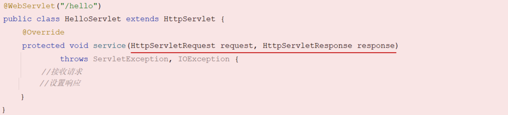 

那上述所描述的这种浏览器/服务器的架构模式呢，我们称之为：==BS架构==。


 

==• BS架构：Browser/Server，浏览器/服务器架构模式。客户端只需要浏览器，应用程序的逻辑和数据都存储在服务端。==

那今天呢，我们的课程内容主要就围绕着：请求、响应进行。 今天课程内容，主要包含三个部分：

> - 请求
> - 响应
> - 分层解耦


## 1. 请求

在本章节呢，我们主要讲解，如何接收页面传递过来的请求数据。

### 1.1 Postman

之前我们课程中有提到当前最为主流的开发模式：前后端分离


在这种模式下，前端技术人员基于"接口文档"，开发前端程序；后端技术人员也基于"接口文档"，开发后端程序。

由于前后端分离，对我们后端技术人员来讲，在开发过程中，是没有前端页面的，那我们怎么测试自己所开发的程序呢？

方式1：像之前SpringBoot入门案例中一样，直接使用浏览器。在浏览器中输入地址，测试后端程序。

- 弊端：在浏览器地址栏中输入地址这种方式都是GET请求，如何我们要用到POST请求怎么办呢？
  - 要解决POST请求，需要程序员自己编写前端代码（比较麻烦）
  - 为什么说需要编写前端代码来测试POST请求呢？
    1. **HTTP请求方法**：浏览器的地址栏默认发送GET请求。要发送POST请求，通常需要HTML表单或JavaScript来创建并发送请求。
    2. **请求体和参数**：POST请求通常伴随着数据，这些数据作为请求体发送。通过浏览器地址栏，我们不能提供这些数据。前端代码（如HTML表单或JavaScript）可以提供这些数据。
    3. **更复杂的交互**：有时，我们需要测试的不仅仅是简单的API调用，还可能涉及到用户交互、文件上传等。这些都需要前端代码来模拟。
    4. **响应处理**：除了发送请求外，前端代码还可以帮助处理和显示响应，这对于调试和测试非常有用。

方式2：使用专业的接口测试工具（课程中我们使用Postman工具）


#### 1.1.1 介绍

 

- Postman是一款功能强大的网页调试与发送网页HTTP请求的Chrome插件。

  > Postman原是Chrome浏览器的插件，可以模拟浏览器向后端服务器发起任何形式(如:get、post)的HTTP请求
  >
  > 使用Postman还可以在发起请求时，携带一些请求参数、请求头等信息

- 作用：常用于进行接口测试

- 特征

  - 简单
  - 实用
  - 美观
  - 大方


#### 1.1.2 安装

 

双击资料中提供的`Postman-win64-8.3.1-Setup.exe`即可自动安装。

 

安装完成之后，进入页面中会提示有新版本可以升级（无需升级）

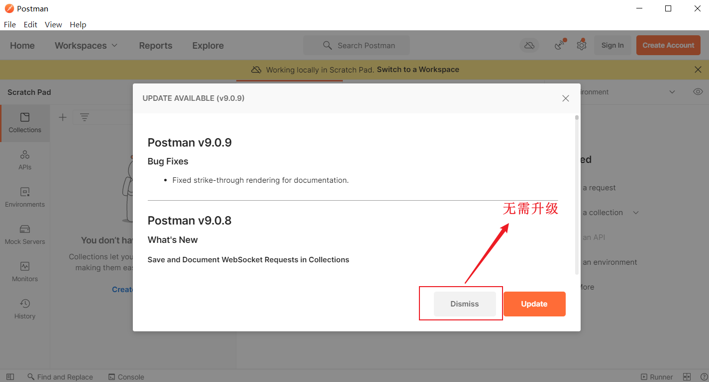


界面介绍:

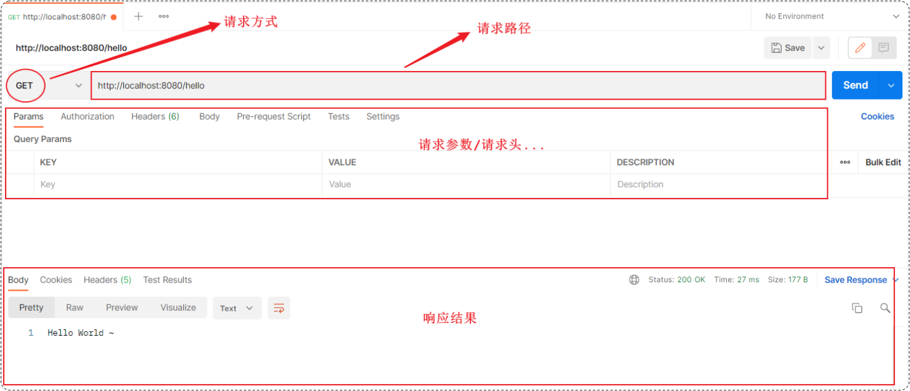 


**如果我们需要将测试的请求信息保存下来，就需要创建一个postman的账号，然后登录之后才可以。**

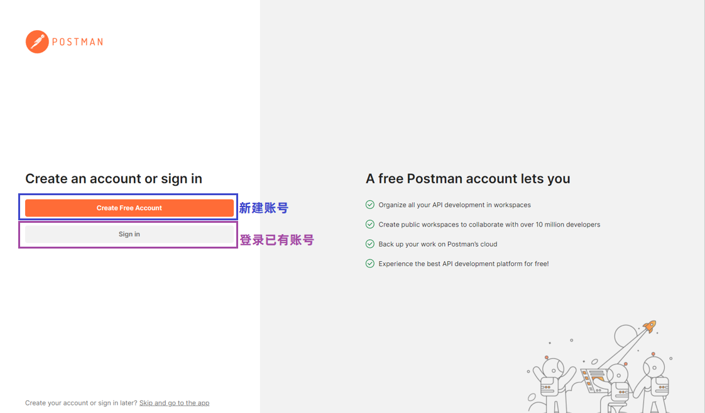

 

 

登录完成之后，可以创建工作空间：


创建请求：

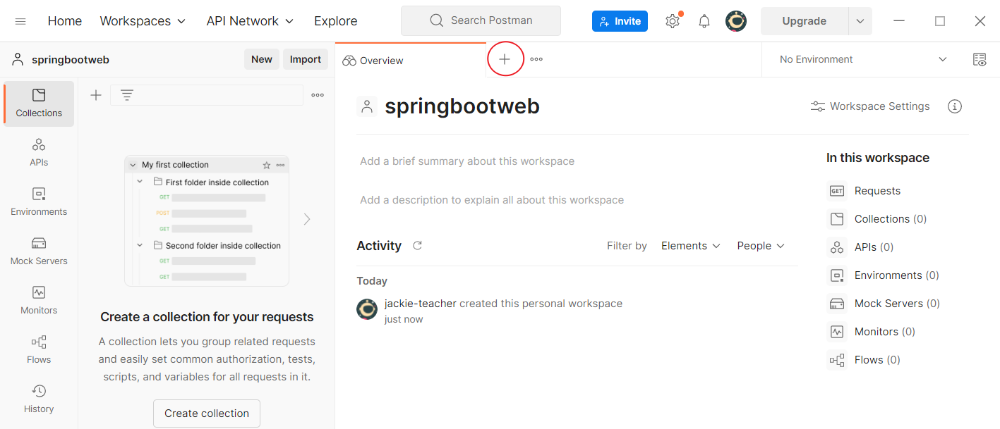

点击"Save"，保存当前请求


### 1.2 简单参数

==简单参数：在向服务器发起请求时，向服务器传递的是一些普通的请求数据。==


那么在后端程序中，如何接收传递过来的普通参数数据呢？

我们在这里讲解两种方式：

1. 原始方式   
2. SpringBoot方式


#### 1.2.1 原始方式

在原始的Web程序当中，需要通过Servlet中提供的API：HttpServletRequest（请求对象），获取请求的相关信息。比如获取请求参数：

> Tomcat接收到http请求时：把请求的相关信息封装到HttpServletRequest对象中

在Controller中，我们要想获取Request对象，可以直接在方法的形参中声明 HttpServletRequest 对象。然后就可以通过该对象来获取请求信息：

```json
//根据指定的参数名获取请求参数的数据值
String  request.getParameter("参数名")
```

```java
@RestController
public class RequestController {
    //原始方式
    @RequestMapping("/simpleParam")
    public String simpleParam(HttpServletRequest request){
        // http://localhost:8080/simpleParam?name=Tom&age=10
        // 请求参数： name=Tom&age=10   （有2个请求参数）
        // 第1个请求参数： name=Tom   参数名:name，参数值:Tom
        // 第2个请求参数： age=10     参数名:age , 参数值:10

        String name = request.getParameter("name");//name就是请求参数名
        String ageStr = request.getParameter("age");//age就是请求参数名

        int age = Integer.parseInt(ageStr);//需要手动进行类型转换
        System.out.println(name+"  :  "+age);
        return "OK";
    }
}
```

> 以上这种方式，我们仅做了解。（在以后的开发中不会使用到）


#### 1.2.2 SpringBoot方式

在Springboot的环境中，对原始的API进行了封装，接收参数的形式更加简单。 如果是简单参数，参数名与形参变量名相同，定义同名的形参即可接收参数。

~~~java
@RestController
public class RequestController {
    // http://localhost:8080/simpleParam?name=Tom&age=10
    // 第1个请求参数： name=Tom   参数名:name，参数值:Tom
    // 第2个请求参数： age=10     参数名:age , 参数值:10
    
    //springboot方式
    @RequestMapping("/simpleParam")
    public String simpleParam(String name , Integer age ){//形参名和请求参数名保持一致
        System.out.println(name+"  :  "+age);
        return "OK";
    }
}
~~~

**postman测试( GET 请求)：**

 

**postman测试( POST请求 )：**


> **结论：不论是GET请求还是POST请求，对于简单参数来讲，只要保证==请求参数名和Controller方法中的形参名保持一致==，就可以获取到请求参数中的数据值。**


#### 1.2.3 参数名不一致

如果方法形参名称与请求参数名称不一致，controller方法中的形参还能接收到请求参数值吗？

~~~java
@RestController
public class RequestController {
    // http://localhost:8080/simpleParam?name=Tom&age=20
    // 请求参数名：name

    //springboot方式
    @RequestMapping("/simpleParam")
    public String simpleParam(String username , Integer age ){//请求参数名和形参名不相同
        System.out.println(username+"  :  "+age);
        return "OK";
    }
}
~~~

答案：运行没有报错。 controller方法中的username值为：null，age值为20

==结论：对于简单参数来讲，请求参数名和controller方法中的形参名不一致时，无法接收到请求数据==


那么如果我们开发中，遇到了这种请求参数名和controller方法中的形参名不相同，怎么办？

解决方案：==可以使用Spring提供的@RequestParam注解完成映射==

在方法形参前面加上 @RequestParam 然后通过value属性执行请求参数名，从而完成映射。代码如下：

```java
@RestController
public class RequestController {
    // http://localhost:8080/simpleParam?name=Tom&age=20
    // 请求参数名：name

    //springboot方式
    @RequestMapping("/simpleParam")
    public String simpleParam(@RequestParam("name") String username , Integer age ){
        System.out.println(username+"  :  "+age);
        return "OK";
    }
}
```

> **注意事项：**
>
> ==@RequestParam中的required属性默认为true（默认值也是true），代表该请求参数必须传递，如果不传递将报错==
>
> 
>
> 如果该参数是可选的，可以将required属性设置为false
>
> ~~~java
> @RequestMapping("/simpleParam")
> public String simpleParam(@RequestParam(name = "name", required = false) String username, Integer age){
> System.out.println(username+ ":" + age);
> return "OK";
> }
> ~~~


### 1.3 实体参数

在使用简单参数做为数据传递方式时，前端传递了多少个请求参数，后端controller方法中的形参就要书写多少个。如果请求参数比较多，通过上述的方式一个参数一个参数的接收，会比较繁琐。 

此时，我们可以考虑将请求参数封装到一个实体类对象中。 ==要想完成数据封装，需要遵守如下规则：**请求参数名与实体类的属性名相同**==


#### 1.3.1 简单实体对象

定义POJO实体类：

```java
public class User {
    private String name;
    private Integer age;

    public String getName() {
        return name;
    }

    public void setName(String name) {
        this.name = name;
    }

    public Integer getAge() {
        return age;
    }

    public void setAge(Integer age) {
        this.age = age;
    }

    @Override
    public String toString() {
        return "User{" +
                "name='" + name + '\'' +
                ", age=" + age +
                '}';
    }
}

```

Controller方法：

```java
@RestController
public class RequestController {
    //实体参数：简单实体对象
    @RequestMapping("/simplePojo")
    public String simplePojo(User user){
        System.out.println(user);
        return "OK";
    }
}
```

Postman测试：

- 参数名和实体类属性名一致时

 

- 参数名和实体类属性名不一致时


**==请求参数名与实体类的属性名必须相同==**


#### 1.3.2 复杂实体对象

上面我们讲的呢是简单的实体对象，下面我们在来学习下复杂的实体对象。

==复杂实体对象指的是，在实体类中有一个或多个属性，也是实体对象类型的。（对象里还包含对象属性）==如下：

- User类中有一个Address类型的属性（Address是一个实体类）


复杂实体对象的封装，需要遵守如下规则：

- ==**请求参数名与形参对象属性名相同，按照对象层次结构关系即可接收嵌套实体类属性参数。**==

定义POJO实体类：

- Address实体类

```java
public class Address {
    private String province;
    private String city;

    public String getProvince() {
        return province;
    }

    public void setProvince(String province) {
        this.province = province;
    }

    public String getCity() {
        return city;
    }

    public void setCity(String city) {
        this.city = city;
    }

    @Override
    public String toString() {
        return "Address{" +
                "province='" + province + '\'' +
                ", city='" + city + '\'' +
                '}';
    }
}
```

- User实体类

```java
public class User {
    private String name;
    private Integer age;
    private Address address; //地址对象

    public String getName() {
        return name;
    }

    public void setName(String name) {
        this.name = name;
    }

    public Integer getAge() {
        return age;
    }

    public void setAge(Integer age) {
        this.age = age;
    }

    public Address getAddress() {
        return address;
    }

    public void setAddress(Address address) {
        this.address = address;
    }

    @Override
    public String toString() {
        return "User{" +
                "name='" + name + '\'' +
                ", age=" + age +
                ", address=" + address +
                '}';
    }
}
```

Controller方法：

```java
@RestController
public class RequestController {
    //实体参数：复杂实体对象
    @RequestMapping("/complexPojo")
    public String complexPojo(User user){
        System.out.println(user);
        return "OK";
    }
}
```

Postman测试：

 


### 1.4 数组集合参数

数组集合参数的使用场景：在HTML的表单中，有一个表单项是支持多选的(复选框)，可以提交选择的多个值。

 

多个值是怎么提交的呢？其实多个值也是一个一个的提交。

 

后端程序接收上述多个值的方式有两种：

1. 数组
2. 集合


#### 1.4.1 数组

==数组参数：**请求参数名与形参数组名称相同且请求参数为多个，定义数组类型形参即可接收参数**==

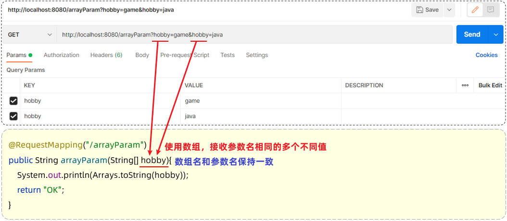

Controller方法：

```java
@RestController
public class RequestController {
    //数组集合参数
    @RequestMapping("/arrayParam")
    public String arrayParam(String[] hobby){
        System.out.println(Arrays.toString(hobby));
        return "OK";
    }
}
```

Postman测试：

在前端请求时，有两种传递形式：

方式一： xxxxxxxxxx?hobby=game&hobby=java

 

方式二：xxxxxxxxxxxxx?hobby=game,java


 

#### 1.4.2 集合

==集合参数：**请求参数名与形参集合对象名相同且请求参数为多个，@RequestParam 绑定参数关系**==

> ==默认情况下，请求中参数名相同的多个值，是封装到数组。如果要封装到集合，要使用@RequestParam绑定参数关系==


Controller方法：

```java
@RestController
public class RequestController {
    //数组集合参数
    @RequestMapping("/listParam")
    public String listParam(@RequestParam List<String> hobby){
        System.out.println(hobby);
        return "OK";
    }
}
```

Postman测试：

方式一： xxxxxxxxxx?hobby=game&hobby=java

 

方式二：xxxxxxxxxxxxx?hobby=game,java


### 1.5 日期参数

上述演示的都是一些普通的参数，在一些特殊的需求中，可能会涉及到日期类型数据的封装。比如，如下需求：

 

因为日期的格式多种多样（如：2022-12-12 10:05:45 、2022/12/12 10:05:45），那么==对于日期类型的参数在进行封装的时候，需要通过@DateTimeFormat注解，以及其pattern属性来设置日期的格式。==

 

- ==@DateTimeFormat注解的pattern属性中指定了哪种日期格式，前端的日期参数就必须按照指定的格式传递。==
- ==后端controller方法中，需要使用Date类型或LocalDateTime类型，来封装传递的参数。==

Controller方法：

```java
@RestController
public class RequestController {
    //日期时间参数
   @RequestMapping("/dateParam")
    public String dateParam(@DateTimeFormat(pattern = "yyyy-MM-dd HH:mm:ss") LocalDateTime updateTime){
        System.out.println(updateTime);
        return "OK";
    }
}
```

Postman测试：


### 1.6 JSON参数

在学习前端技术时，我们有讲到过JSON，而在前后端进行交互时，如果是比较复杂的参数，前后端通过会使用JSON格式的数据进行传输。 （JSON是开发中最常用的前后端数据交互方式）

我们学习JSON格式参数，主要从以下两个方面着手：

1. Postman在发送请求时，如何传递json格式的请求参数
2. 在服务端的controller方法中，如何接收json格式的请求参数

Postman发送JSON格式数据：


服务端Controller方法接收JSON格式数据：

- 传递json格式的参数，在Controller中会使用实体类进行封装。 
- ==封装规则：**JSON数据键名与形参对象属性名相同，定义POJO类型形参即可接收参数。需要使用 @RequestBody标识。**==

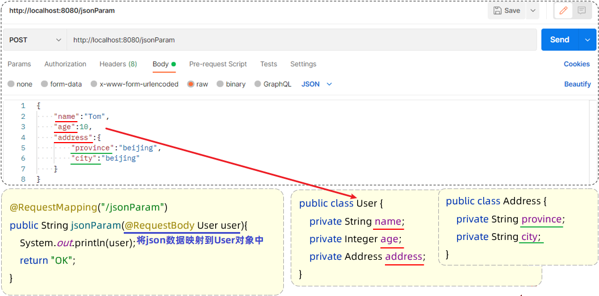

- ==@RequestBody注解：将JSON数据映射到形参的实体类对象中（JSON中的key和实体类中的属性名（各个参数）保持一致）==

实体类：Address

```java
public class Address {
    private String province;
    private String city;
    
	//省略GET , SET 方法
}
```

实体类：User

```java
public class User {
    private String name;
    private Integer age;
    private Address address;
    
    //省略GET , SET 方法
}    
```

Controller方法：

```java
@RestController
public class RequestController {
    //JSON参数
    @RequestMapping("/jsonParam")
    public String jsonParam(@RequestBody User user){
        System.out.println(user);
        return "OK";
    }
}
```

Postman测试：

 


### 1.7 路径参数

传统的开发中请求参数是放在请求体(POST请求)传递或跟在URL后面通过?key=value的形式传递(GET请求)。


==在现在的开发中，经常还会直接在请求的URL中传递参数。==例如：

~~~
http://localhost:8080/user/1		
http://localhost:880/user/1/0
~~~

上述的这种传递请求参数的形式呢，我们称之为：路径参数。

学习路径参数呢，主要掌握在后端的controller方法中，如何接收路径参数。

路径参数：

- 前端：通过请求URL直接传递参数
- ==后端：使用{…}来标识该路径参数，需要使用@PathVariable获取路径参数==


Controller方法：

```java
@RestController
public class RequestController {
    //路径参数
    @RequestMapping("/path/{id}")
    public String pathParam(@PathVariable Integer id){
        System.out.println(id);
        return "OK";
    }
}
```

Postman测试：


 

**传递多个路径参数：**

Postman：


Controller方法：

~~~java
@RestController
public class RequestController {
    //路径参数
    @RequestMapping("/path/{id}/{name}")
    public String pathParam2(@PathVariable Integer id, @PathVariable String name){
        System.out.println(id+ " : " +name);
        return "OK";
    }
}
~~~


## 2. 响应

前面我们学习过HTTL协议的交互方式：请求响应模式（有请求就有响应）

那么Controller程序呢，除了接收请求外，还可以进行响应。


### 2.1 @ResponseBody

在我们前面所编写的controller方法中，都已经设置了响应数据。


==controller方法中的return的结果，怎么就可以响应给浏览器呢？==

==答案：使用@ResponseBody注解==

**@ResponseBody注解：**

- 类型：方法注解、类注解
- 位置：书写在Controller方法上或类上
- ==作用：将方法返回值直接响应给浏览器==
  - ==如果返回值类型是实体对象/集合，将会转换为JSON格式后在响应给浏览器==

但是在我们所书写的Controller中，只在类上添加了@RestController注解、方法添加了@RequestMapping注解，并没有使用@ResponseBody注解，怎么给浏览器响应呢？

~~~java
@RestController
public class HelloController {
    @RequestMapping("/hello")
    public String hello(){
        System.out.println("Hello World ~");
        return "Hello World ~";
    }
}
~~~

==原因：在类上添加的@RestController注解，是一个组合注解。==

- ==@RestController = @Controller + @ResponseBody== 

@RestController源码：

~~~java
@Target({ElementType.TYPE})   //元注解（修饰注解的注解）
@Retention(RetentionPolicy.RUNTIME)  //元注解
@Documented    //元注解
@Controller   
@ResponseBody 
public @interface RestController {
    @AliasFor(
        annotation = Controller.class
    )
    String value() default "";
}
~~~

==结论：在类上添加@RestController就相当于添加了@ResponseBody注解。==

- ==类上有@RestController注解或@ResponseBody注解时：表示当前类下所有的方法返回值做为响应数据==
  - ==方法的返回值，如果是一个POJO对象或集合时，会先转换为JSON格式，在响应给浏览器==


下面我们来测试下响应数据：

~~~java
@RestController
public class ResponseController {
    //响应字符串
    @RequestMapping("/hello")
    public String hello(){
        System.out.println("Hello World ~");
        return "Hello World ~";
    }
    //响应实体对象
    @RequestMapping("/getAddr")
    public Address getAddr(){
        Address addr = new Address();//创建实体类对象
        addr.setProvince("广东");
        addr.setCity("深圳");
        return addr;
    }
    //响应集合数据
    @RequestMapping("/listAddr")
    public List<Address> listAddr(){
        List<Address> list = new ArrayList<>();//集合对象
        
        Address addr = new Address();
        addr.setProvince("广东");
        addr.setCity("深圳");

        Address addr2 = new Address();
        addr2.setProvince("陕西");
        addr2.setCity("西安");

        list.add(addr);
        list.add(addr2);
        return list;
    }
}
~~~

在服务端响应了一个对象或者集合，那私前端获取到的数据是什么样子的呢？我们使用postman发送请求来测试下。测试效果如下：


### 2.2 统一响应结果

大家有没有发现一个问题，我们在前面所编写的这些Controller方法中，返回值各种各样，没有任何的规范。


如果我们开发一个大型项目，项目中controller方法将成千上万，使用上述方式将造成整个项目难以维护。那在真实的项目开发中是什么样子的呢？

在真实的项目开发中，无论是哪种方法，我们都会定义一个统一的返回结果。方案如下：


> 前端：只需要按照统一格式的返回结果进行解析(仅一种解析方案)，就可以拿到数据。

==统一的返回结果使用类来描述，在这个结果中包含：==

- ==响应状态码：当前请求是成功，还是失败==

- ==状态码信息：给页面的提示信息==

- ==返回的数据：给前端响应的数据（字符串、对象、集合）==

定义在一个实体类Result来包含以上信息。代码如下：

```java
public class Result {
    private Integer code;//响应码，1 代表成功; 0 代表失败
    private String msg;  //响应码 描述字符串
    private Object data; //返回的数据

    public Result() { }
    public Result(Integer code, String msg, Object data) {
        this.code = code;
        this.msg = msg;
        this.data = data;
    }

    public Integer getCode() {
        return code;
    }

    public void setCode(Integer code) {
        this.code = code;
    }

    public String getMsg() {
        return msg;
    }

    public void setMsg(String msg) {
        this.msg = msg;
    }

    public Object getData() {
        return data;
    }

    public void setData(Object data) {
        this.data = data;
    }

    //增删改 成功响应(不需要给前端返回数据)
    public static Result success(){
        return new Result(1,"success",null);
    }
    //查询 成功响应(把查询结果做为返回数据响应给前端)
    public static Result success(Object data){
        return new Result(1,"success",data);
    }
    //失败响应
    public static Result error(String msg){
        return new Result(0,msg,null);
    }
}
```

改造Controller：

~~~java
@RestController
public class ResponseController { 
    //响应统一格式的结果
    @RequestMapping("/hello")
    public Result hello(){
        System.out.println("Hello World ~");
        //return new Result(1,"success","Hello World ~");
        return Result.success("Hello World ~");
    }

    //响应统一格式的结果
    @RequestMapping("/getAddr")
    public Result getAddr(){
        Address addr = new Address();
        addr.setProvince("广东");
        addr.setCity("深圳");
        return Result.success(addr);
    }

    //响应统一格式的结果
    @RequestMapping("/listAddr")
    public Result listAddr(){
        List<Address> list = new ArrayList<>();

        Address addr = new Address();
        addr.setProvince("广东");
        addr.setCity("深圳");

        Address addr2 = new Address();
        addr2.setProvince("陕西");
        addr2.setCity("西安");

        list.add(addr);
        list.add(addr2);
        return Result.success(list);
    }
}
~~~

使用Postman测试：


### 2.3 案例

下面我们通过一个案例，来加强对请求响应的学习。

#### 2.3.1 需求说明

需求：加载并解析xml文件中的数据，完成数据处理，并在页面展示

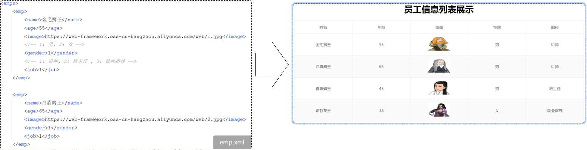  

- 获取员工数据，返回统一响应结果，在页面渲染展示


#### 2.3.2 准备工作

案例准备：

1. XML文件
   - 已经准备好(emp.xml)，直接导入进来，放在 src/main/resources目录下
2. 工具类
   - 已经准备好解析XML文件的工具类，无需自己实现
   - 直接在创建一个包 com.itheima.utils ，然后将工具类拷贝进来

3. 前端页面资源
   - 已经准备好，直接拷贝进来，放在src/main/resources下的static目录下

Springboot项目的静态资源(html，css，js等前端资源)默认存放目录为：classpath:/static 、 classpath:/public、 classpath:/resources

> 在SpringBoot项目中，静态资源默认可以存放的目录：
>
> - classpath:/static/
> - classpath:/public/
> - classpath:/resources/
> - classpath:/META-INF/resources/
>
> classpath：
>
> - 代表的是类路径，在maven的项目中，其实指的就是 src/main/resources 或者 src/main/java，但是java目录是存放java代码的，所以相关的配置文件及静态资源文档，就放在 src/main/resources下。


#### 2.3.3 实现步骤

1. 在pom.xml文件中引入dom4j的依赖，用于解析XML文件

   ~~~xml
   <dependency>
       <groupId>org.dom4j</groupId>
       <artifactId>dom4j</artifactId>
       <version>2.1.3</version>
   </dependency>
   ~~~

2. 引入资料中提供的：解析XML的工具类XMLParserUtils、实体类Emp、XML文件emp.xml

    

3. 引入资料中提供的静态页面文件，放在resources下的static目录下

    

4. 创建EmpController类，编写Controller程序，处理请求，响应数据

    


#### 2.3.4 代码实现

Contriller代码：

```java
@RestController
public class EmpController {
    @RequestMapping("/listEmp")
    public Result list(){
        //1. 加载并解析emp.xml
        String file = this.getClass().getClassLoader().getResource("emp.xml").getFile();
        //System.out.println(file);
        List<Emp> empList = XmlParserUtils.parse(file, Emp.class);

        //2. 对数据进行转换处理 - gender, job
        empList.stream().forEach(emp -> {
            //处理 gender 1: 男, 2: 女
            String gender = emp.getGender();
            if("1".equals(gender)){
                emp.setGender("男");
            }else if("2".equals(gender)){
                emp.setGender("女");
            }

            //处理job - 1: 讲师, 2: 班主任 , 3: 就业指导
            String job = emp.getJob();
            if("1".equals(job)){
                emp.setJob("讲师");
            }else if("2".equals(job)){
                emp.setJob("班主任");
            }else if("3".equals(job)){
                emp.setJob("就业指导");
            }
        });
        //3. 响应数据
        return Result.success(empList);
    }
}
```

统一返回结果实体类：

~~~java
public class Result {
    private Integer code ;//1 成功 , 0 失败
    private String msg; //提示信息
    private Object data; //数据 date

    public Result() {
    }
    public Result(Integer code, String msg, Object data) {
        this.code = code;
        this.msg = msg;
        this.data = data;
    }
    public Integer getCode() {
        return code;
    }
    public void setCode(Integer code) {
        this.code = code;
    }
    public String getMsg() {
        return msg;
    }
    public void setMsg(String msg) {
        this.msg = msg;
    }
    public Object getData() {
        return data;
    }
    public void setData(Object data) {
        this.data = data;
    }
    public static Result success(Object data){
        return new Result(1, "success", data);
    }
    public static Result success(){
        return new Result(1, "success", null);
    }
    public static Result error(String msg){
        return new Result(0, msg, null);
    }
}
~~~


#### 2.3.5 测试

代码编写完毕之后，我们就可以运行引导类，启动服务进行测试了。 

使用Postman测试：


打开浏览器，在浏览器地址栏输入： http://localhost:8080/emp.html

 


#### 2.3.6 问题分析

上述案例的功能，我们虽然已经实现，但是呢，我们会发现案例中：解析XML数据，获取数据的代码，处理数据的逻辑的代码，给页面响应的代码全部都堆积在一起了，全部都写在controller方法中了。


当前程序的这个业务逻辑还是比较简单的，如果业务逻辑再稍微复杂一点，我们会看到Controller方法的代码量就很大了。

- 当我们要修改操作数据部分的代码，需要改动Controller

- 当我们要完善逻辑处理部分的代码，需要改动Controller

- 当我们需要修改数据响应的代码，还是需要改动Controller

这样呢，就会造成我们整个工程代码的复用性比较差，而且代码难以维护。 那如何解决这个问题呢？其实在现在的开发中，有非常成熟的解决思路，那就是分层开发。


## 3. 分层解耦

### 3.1 三层架构

#### 3.1.1 介绍

在我们进行程序设计以及程序开发时，尽可能让每一个接口、类、方法的职责更单一些（单一职责原则）。

> 单一职责原则：一个类或一个方法，就只做一件事情，只管一块功能。
>
> 这样就可以让类、接口、方法的复杂度更低，可读性更强，扩展性更好，也更利用后期的维护。

我们之前开发的程序呢，并不满足单一职责原则。下面我们来分析下之前的程序：

 

那其实我们上述案例的处理逻辑呢，从组成上看可以分为三个部分：

- 数据访问：负责业务数据的维护操作，包括增、删、改、查等操作。
- 逻辑处理：负责业务逻辑处理的代码。
- 请求处理、响应数据：负责，接收页面的请求，给页面响应数据。

按照上述的三个组成部分，在我们项目开发中呢，可以将代码分为三层：


- ==Controller：控制层。接收前端发送的请求，对请求进行处理，并响应数据。==
- ==Service：业务逻辑层。处理具体的业务逻辑。==
- ==Dao：数据访问层(Data Access Object)，也称为持久层。负责数据访问操作，包括数据的增、删、改、查。==


基于三层架构的程序执行流程：

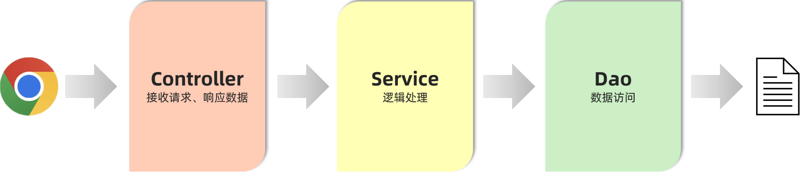

- 前端发起的请求，由Controller层接收（Controller响应数据给前端）
- Controller层调用Service层来进行逻辑处理（Service层处理完后，把处理结果返回给Controller层）
- Serivce层调用Dao层（逻辑处理过程中需要用到的一些数据要从Dao层获取）
- Dao层操作文件中的数据（Dao拿到的数据会返回给Service层）

> 思考：按照三层架构的思想，如何要对业务逻辑(Service层)进行变更，会影响到Controller层和Dao层吗？ 
>
> 答案：不会影响。 （程序的扩展性、维护性变得更好了）


#### 3.1.2 代码拆分

我们使用三层架构思想，来改造下之前的程序：

- 控制层包名：xxxx.controller
- 业务逻辑层包名：xxxx.service
- 数据访问层包名：xxxx.dao


**控制层：**接收前端发送的请求，对请求进行处理，并响应数据

```java
@RestController
public class EmpController {
    //业务层对象
    private EmpService empService = new EmpServiceA();

    @RequestMapping("/listEmp")
    public Result list(){
        //1. 调用service层, 获取数据
        List<Emp> empList = empService.listEmp();

        //3. 响应数据
        return Result.success(empList);
    }
}
```

**业务逻辑层：**处理具体的业务逻辑

- 业务接口

~~~java
//业务逻辑接口（制定业务标准）
public interface EmpService {
    //获取员工列表
    public List<Emp> listEmp();
}
~~~

- 业务实现类

```java
//业务逻辑实现类（按照业务标准实现）
public class EmpServiceA implements EmpService {
    //dao层对象
    private EmpDao empDao = new EmpDaoA();

    @Override
    public List<Emp> listEmp() {
        //1. 调用dao, 获取数据
        List<Emp> empList = empDao.listEmp();

        //2. 对数据进行转换处理 - gender, job
        empList.stream().forEach(emp -> {
            //处理 gender 1: 男, 2: 女
            String gender = emp.getGender();
            if("1".equals(gender)){
                emp.setGender("男");
            }else if("2".equals(gender)){
                emp.setGender("女");
            }

            //处理job - 1: 讲师, 2: 班主任 , 3: 就业指导
            String job = emp.getJob();
            if("1".equals(job)){
                emp.setJob("讲师");
            }else if("2".equals(job)){
                emp.setJob("班主任");
            }else if("3".equals(job)){
                emp.setJob("就业指导");
            }
        });
        return empList;
    }
}
```

**数据访问层：**负责数据的访问操作，包含数据的增、删、改、查

- 数据访问接口

~~~java
//数据访问层接口（制定标准）
public interface EmpDao {
    //获取员工列表数据
    public List<Emp> listEmp();
}
~~~

- 数据访问实现类

```java
//数据访问实现类
public class EmpDaoA implements EmpDao {
    @Override
    public List<Emp> listEmp() {
        //1. 加载并解析emp.xml
        String file = this.getClass().getClassLoader().getResource("emp.xml").getFile();
        System.out.println(file);
        List<Emp> empList = XmlParserUtils.parse(file, Emp.class);
        return empList;
    }
}
```


三层架构的好处：

1. 复用性强
2. 便于维护
3. 利用扩展


### 3.2 分层解耦

刚才我们学习过程序分层思想了，接下来呢，我们来学习下程序的解耦思想。

解耦：解除耦合。

#### 3.2.1 耦合问题

首先需要了解软件开发涉及到的两个概念：内聚和耦合。

- 内聚：软件中各个功能模块内部的功能联系。

- 耦合：衡量软件中各个层/模块之间的依赖、关联的程度。

**软件设计原则：高内聚低耦合。**

> 高内聚指的是：一个模块中各个元素之间的联系的紧密程度，如果各个元素(语句、程序段)之间的联系程度越高，则内聚性越高，即 "高内聚"。
>
> 低耦合指的是：软件中各个层、模块之间的依赖关联程序越低越好。

程序中高内聚的体现：

- EmpServiceA类中只编写了和员工相关的逻辑处理代码

 

程序中耦合代码的体现：

- 把业务类变为EmpServiceB时，需要修改controller层中的代码


高内聚、低耦合的目的是使程序模块的可重用性、移植性大大增强。

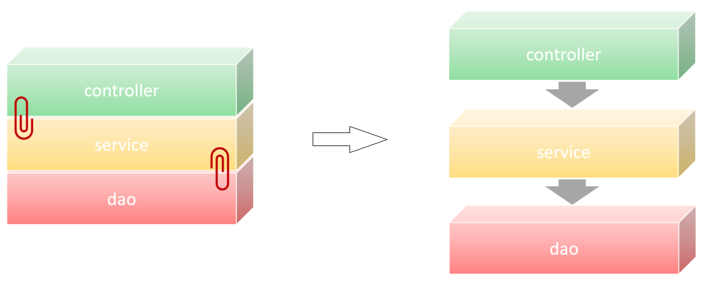


#### 3.2.2  解耦思路

之前我们在编写代码时，需要什么对象，就直接new一个就可以了。 这种做法呢，层与层之间代码就耦合了，当service层的实现变了之后， 我们还需要修改controller层的代码。


 那应该怎么解耦呢？

- 首先不能在EmpController中使用new对象。代码如下：


- 此时，就存在另一个问题了，不能new，就意味着没有业务层对象（程序运行就报错），怎么办呢？
  - 我们的解决思路是：
    - 提供一个容器，容器中存储一些对象(例：EmpService对象)
    - controller程序从容器中获取EmpService类型的对象

我们想要实现上述解耦操作，就涉及到Spring中的两个核心概念：

- **控制反转：** Inversion Of Control，简称IOC。对象的创建控制权由程序自身转移到外部（容器），这种思想称为控制反转。

  > 对象的创建权由程序员主动创建转移到容器(由容器创建、管理对象)。这个容器称为：IOC容器或Spring容器

- **依赖注入：** Dependency Injection，简称DI。容器为应用程序提供运行时，所依赖的资源，称之为依赖注入。

  > 程序运行时需要某个资源，此时容器就为其提供这个资源。
  >
  > 例：EmpController程序运行时需要EmpService对象，Spring容器就为其提供并注入EmpService对象

IOC容器中创建、管理的对象，称之为：bean对象


### 3.3 IOC&DI

上面我们引出了Spring中IOC和DI的基本概念，下面我们就来具体学习下IOC和DI的代码实现。

#### 3.3.1 IOC&DI入门

任务：完成Controller层、Service层、Dao层的代码解耦

- 思路：
  1. 删除Controller层、Service层中new对象的代码
  2. Service层及Dao层的实现类，交给IOC容器管理
  3. 为Controller及Service注入运行时依赖的对象
     - Controller程序中注入依赖的Service层对象
     - Service程序中注入依赖的Dao层对象


第1步：删除Controller层、Service层中new对象的代码


第2步：Service层及Dao层的实现类，交给IOC容器管理

- 使用Spring提供的注解：@Component ，就可以实现类交给IOC容器管理


第3步：为Controller及Service注入运行时依赖的对象

- 使用Spring提供的注解：@Autowired ，就可以实现程序运行时IOC容器自动注入需要的依赖对象


完整的三层代码：

- **Controller层：**

~~~java
@RestController
public class EmpController {

    @Autowired //运行时,从IOC容器中获取该类型对象,赋值给该变量
    private EmpService empService ;

    @RequestMapping("/listEmp")
    public Result list(){
        //1. 调用service, 获取数据
        List<Emp> empList = empService.listEmp();

        //3. 响应数据
        return Result.success(empList);
    }
}
~~~

- **Service层：**

~~~java
@Component //将当前对象交给IOC容器管理,成为IOC容器的bean
public class EmpServiceA implements EmpService {

    @Autowired //运行时,从IOC容器中获取该类型对象,赋值给该变量
    private EmpDao empDao ;

    @Override
    public List<Emp> listEmp() {
        //1. 调用dao, 获取数据
        List<Emp> empList = empDao.listEmp();

        //2. 对数据进行转换处理 - gender, job
        empList.stream().forEach(emp -> {
            //处理 gender 1: 男, 2: 女
            String gender = emp.getGender();
            if("1".equals(gender)){
                emp.setGender("男");
            }else if("2".equals(gender)){
                emp.setGender("女");
            }

            //处理job - 1: 讲师, 2: 班主任 , 3: 就业指导
            String job = emp.getJob();
            if("1".equals(job)){
                emp.setJob("讲师");
            }else if("2".equals(job)){
                emp.setJob("班主任");
            }else if("3".equals(job)){
                emp.setJob("就业指导");
            }
        });
        return empList;
    }
}
~~~

**Dao层：**

~~~java
@Component //将当前对象交给IOC容器管理,成为IOC容器的bean
public class EmpDaoA implements EmpDao {
    @Override
    public List<Emp> listEmp() {
        //1. 加载并解析emp.xml
        String file = this.getClass().getClassLoader().getResource("emp.xml").getFile();
        System.out.println(file);
        List<Emp> empList = XmlParserUtils.parse(file, Emp.class);
        return empList;
    }
}
~~~


运行测试：

- 启动SpringBoot引导类，打开浏览器，输入：http://localhost:8080/emp.html


 


#### 3.3.2 IOC详解

通过IOC和DI的入门程序呢，我们已经基本了解了IOC和DI的基础操作。接下来呢，我们学习下IOC控制反转和DI依赖注入的细节。

##### 3.3.2.1 bean的声明

前面我们提到IOC控制反转，就是将对象的控制权交给Spring的IOC容器，由IOC容器创建及管理对象。IOC容器创建的对象称为bean对象。

在之前的入门案例中，要把某个对象交给IOC容器管理，需要在类上添加一个注解：@Component 

而Spring框架为了更好的标识web应用程序开发当中，bean对象到底归属于哪一层，又提供了@Component的衍生注解：

- @Controller    （标注在控制层类上）
- @Service          （标注在业务层类上）
- @Repository    （标注在数据访问层类上）


修改入门案例代码：

- **Controller层：**

~~~java
@RestController  //@RestController = @Controller + @ResponseBody
public class EmpController {

    @Autowired //运行时,从IOC容器中获取该类型对象,赋值给该变量
    private EmpService empService ;

    @RequestMapping("/listEmp")
    public Result list(){
        //1. 调用service, 获取数据
        List<Emp> empList = empService.listEmp();

        //3. 响应数据
        return Result.success(empList);
    }
}
~~~

- **Service层：**

~~~java
@Service
public class EmpServiceA implements EmpService {

    @Autowired //运行时,从IOC容器中获取该类型对象,赋值给该变量
    private EmpDao empDao ;

    @Override
    public List<Emp> listEmp() {
        //1. 调用dao, 获取数据
        List<Emp> empList = empDao.listEmp();

        //2. 对数据进行转换处理 - gender, job
        empList.stream().forEach(emp -> {
            //处理 gender 1: 男, 2: 女
            String gender = emp.getGender();
            if("1".equals(gender)){
                emp.setGender("男");
            }else if("2".equals(gender)){
                emp.setGender("女");
            }

            //处理job - 1: 讲师, 2: 班主任 , 3: 就业指导
            String job = emp.getJob();
            if("1".equals(job)){
                emp.setJob("讲师");
            }else if("2".equals(job)){
                emp.setJob("班主任");
            }else if("3".equals(job)){
                emp.setJob("就业指导");
            }
        });
        return empList;
    }
}
~~~

**Dao层：**

~~~java
@Repository
public class EmpDaoA implements EmpDao {
    @Override
    public List<Emp> listEmp() {
        //1. 加载并解析emp.xml
        String file = this.getClass().getClassLoader().getResource("emp.xml").getFile();
        System.out.println(file);
        List<Emp> empList = XmlParserUtils.parse(file, Emp.class);
        return empList;
    }
}
~~~


要把某个对象交给IOC容器管理，需要在对应的类上加上如下注解之一：

| 注解        | 说明                 | 位置                                            |
| :---------- | -------------------- | ----------------------------------------------- |
| @Controller | @Component的衍生注解 | 标注在控制器类上                                |
| @Service    | @Component的衍生注解 | 标注在业务类上                                  |
| @Repository | @Component的衍生注解 | 标注在数据访问类上（由于与mybatis整合，用的少） |
| @Component  | 声明bean的基础注解   | 不属于以上三类时，用此注解                      |

> 查看源码：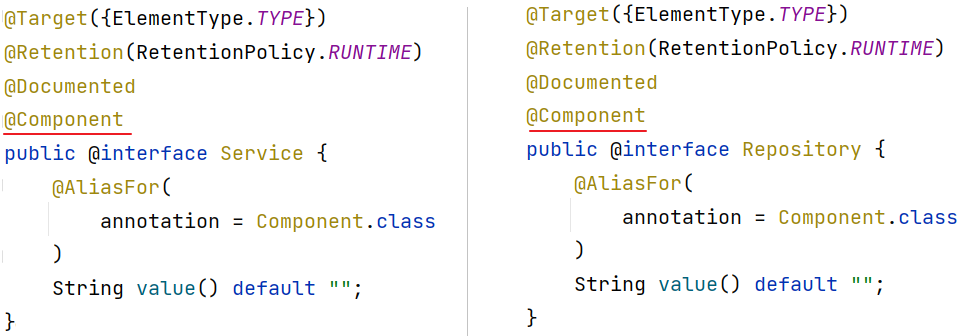

在IOC容器中，每一个Bean都有一个属于自己的名字，可以通过注解的value属性指定bean的名字。如果没有指定，默认为类名首字母小写。


> 注意事项: 
>
> - 声明bean的时候，可以通过value属性指定bean的名字，如果没有指定，默认为类名首字母小写。
> - 使用以上四个注解都可以声明bean，但是在springboot集成web开发中，声明控制器bean只能用@Controller。


##### 3.3.2.2 组件扫描

问题：使用前面学习的四个注解声明的bean，一定会生效吗？

答案：不一定。（原因：bean想要生效，还需要被组件扫描）


 下面我们通过修改项目工程的目录结构，来测试bean对象是否生效：


运行程序后，报错：


为什么没有找到bean对象呢？

- 使用四大注解声明的bean，要想生效，还需要被组件扫描注解@ComponentScan扫描

> @ComponentScan注解虽然没有显式配置，但是实际上已经包含在了引导类声明注解 @SpringBootApplication 中，==**默认扫描的范围是SpringBoot启动类所在包及其子包**==。
>
>  

- 解决方案：手动添加@ComponentScan注解，指定要扫描的包   （==仅做了解，不推荐==）


推荐做法（如下图）：

- 将我们定义的controller，service，dao这些包呢，都放在引导类所在包com.itheima的子包下，这样我们定义的bean就会被自动的扫描到


#### 3.3.3 DI详解

上一小节我们讲解了控制反转IOC的细节，接下来呢，我们学习依赖注解DI的细节。

依赖注入，是指IOC容器要为应用程序去提供运行时所依赖的资源，而资源指的就是对象。

在入门程序案例中，我们使用了@Autowired这个注解，完成了依赖注入的操作，而这个Autowired翻译过来叫：自动装配。

@Autowired注解，默认是按照**类型**进行自动装配的（去IOC容器中找某个类型的对象，然后完成注入操作）

> 入门程序举例：在EmpController运行的时候，就要到IOC容器当中去查找EmpService这个类型的对象，而我们的IOC容器中刚好有一个EmpService这个类型的对象，所以就找到了这个类型的对象完成注入操作。


那如果在IOC容器中，存在多个相同类型的bean对象，会出现什么情况呢？


- 程序运行会报错


如何解决上述问题呢？Spring提供了以下几种解决方案：

- @Primary

- @Qualifier

- @Resource


使用@Primary注解：当存在多个相同类型的Bean注入时，加上@Primary注解，来确定默认的实现。

 


使用@Qualifier注解：指定当前要注入的bean对象。 在@Qualifier的value属性中，指定注入的bean的名称。

- @Qualifier注解不能单独使用，必须配合@Autowired使用


使用@Resource注解：是按照bean的名称进行注入。通过name属性指定要注入的bean的名称。


> 面试题 ： @Autowird 与 @Resource的区别
>
> - @Autowired 是spring框架提供的注解，而@Resource是JDK提供的注解
> - @Autowired 默认是按照类型注入，而@Resource是按照名称注入


