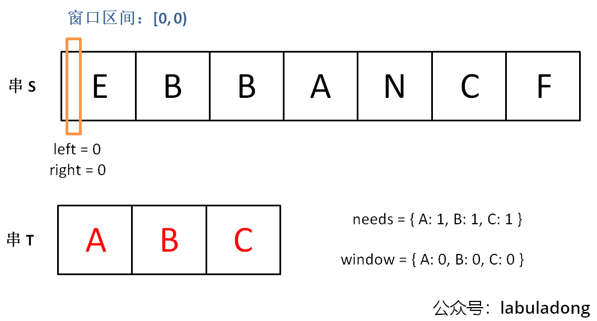
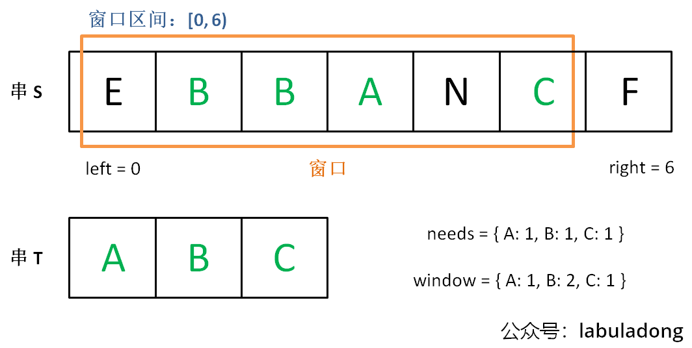
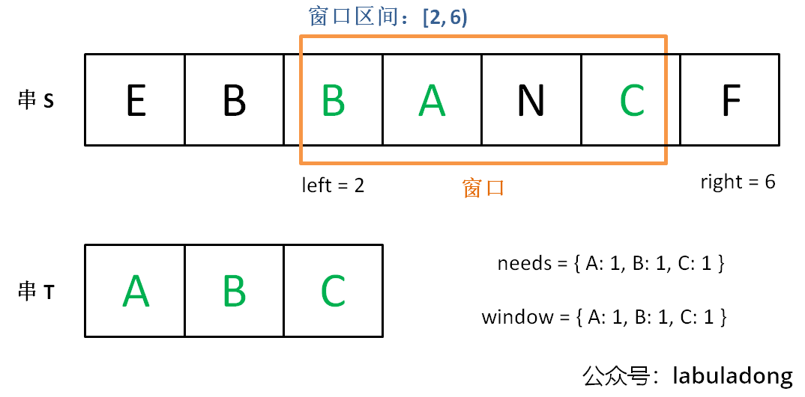
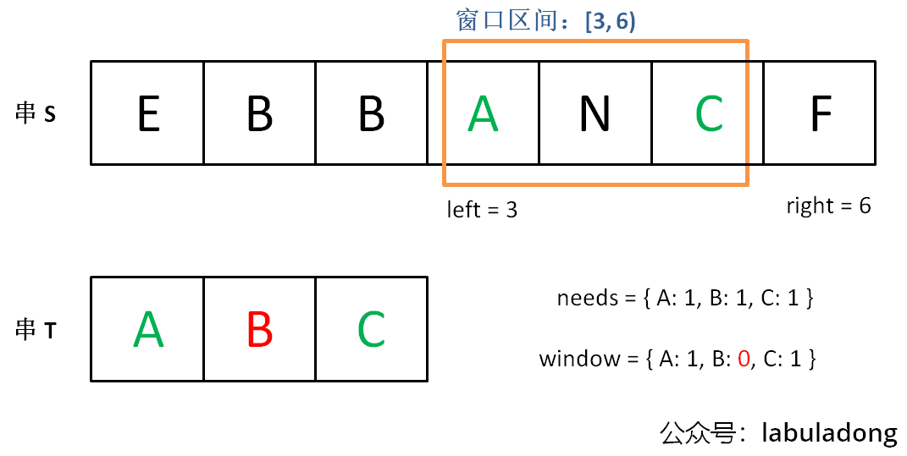

# 滑动窗口算法核心代码模板

本文讲解的例题

|                           LeetCode                           |                             力扣                             | 难度 |
| :----------------------------------------------------------: | :----------------------------------------------------------: | :--: |
| [3. Longest Substring Without Repeating Characters](https://leetcode.com/problems/longest-substring-without-repeating-characters/) | [3. 无重复字符的最长子串](https://leetcode.cn/problems/longest-substring-without-repeating-characters/) |  🟠   |
| [438. Find All Anagrams in a String](https://leetcode.com/problems/find-all-anagrams-in-a-string/) | [438. 找到字符串中所有字母异位词](https://leetcode.cn/problems/find-all-anagrams-in-a-string/) |  🟠   |
| [567. Permutation in String](https://leetcode.com/problems/permutation-in-string/) | [567. 字符串的排列](https://leetcode.cn/problems/permutation-in-string/) |  🟠   |
| [76. Minimum Window Substring](https://leetcode.com/problems/minimum-window-substring/) | [76. 最小覆盖子串](https://leetcode.cn/problems/minimum-window-substring/) |  🔴   |

前置知识

阅读本文前，你需要先学习：

- 数组基础

前文 双指针技巧汇总 讲解了一些较为简单的数组双指针技巧，本文就讲解一个稍微复杂的技巧：滑动窗口技巧。

**==滑动窗口可以归为快慢双指针，一快一慢两个指针前后相随，中间的部分就是窗口。滑动窗口算法技巧主要用来解决子数组问题，比如让你寻找符合某个条件的最长/最短子数组。==**

你可以点开下面的[可视化面板](https://labuladong.online/algo/essential-technique/sliding-window-framework/#div_minimum-window-substring)，多次点击 `while (right < s.length)` 这一行代码，即可直观地看到窗口滑动的过程：

本文会总结出一套框架，可以保你闭着眼睛都能写出正确的解法，同时每道题目都配备了算法可视化面板，帮助你直观地理解窗口滑动的过程。

## 滑动窗口框架概览

如果用暴力解的话，你需要嵌套 for 循环这样穷举所有子数组，时间复杂度是 O(N^2)：

```go
for (int i = 0; i < nums.length; i++) {
    for (int j = i; j < nums.length; j++) {
        // nums[i, j] 是一个子数组
    }
}
```

滑动窗口算法技巧的思路也不难，就是维护一个窗口，不断滑动，然后更新答案，该算法的大致逻辑如下：

```go
int left = 0, right = 0;

while (right < nums.size()) {
    // 增大窗口
    window.addLast(nums[right]);
    right++;
    
    while (window needs shrink) {
        // 缩小窗口
        window.removeFirst(nums[left]);
        left++;
    }
}
```

基于滑动窗口算法框架写出的代码，时间复杂度是 O(N)，比嵌套 for 循环的暴力解法效率高。

**==为啥是 O(N)？==**

肯定有读者要问了，你这个滑动窗口框架不也用了一个嵌套 while 循环？为啥复杂度是 O(N)呢？

简单说，指针 `left, right` 不会回退（它们的值只增不减），所以字符串/数组中的每个元素都只会进入窗口一次，然后被移出窗口一次，不会说有某些元素多次进入和离开窗口，所以算法的时间复杂度就和字符串/数组的长度成正比。

反观嵌套 for 循环的暴力解法，那个 `j` 会回退，所以某些元素会进入和离开窗口多次，所以时间复杂度就是 O(N^2)了。

我在 算法时空复杂度分析实用指南 有具体教大家如何从理论上估算时间空间复杂度，这里就不展开了。

为啥滑动窗口能在 O(N) 的时间穷举子数组？

**==这个问题本身就是错误的，滑动窗口并不能穷举出所有子串。要想穷举出所有子串，必须用那个嵌套 for 循环。==**

然而对于某些题目，并不需要穷举所有子串，就能找到题目想要的答案。滑动窗口就是这种场景下的一套算法模板，帮你对穷举过程进行剪枝优化，避免冗余计算。

**==所以在 算法的本质 中我把滑动窗口算法归为「如何聪明地穷举」一类。==**

其实困扰大家的，不是算法的思路，而是各种细节问题。比如说如何向窗口中添加新元素，如何缩小窗口，在窗口滑动的哪个阶段更新结果。即便你明白了这些细节，代码也容易出 bug，找 bug 还不知道怎么找，真的挺让人心烦的。

**所以今天我就写一套滑动窗口算法的代码框架，我连再哪里做输出 debug 都给你写好了，以后遇到相关的问题，你就默写出来如下框架然后改三个地方就行，保证不会出 bug**。

因为本文的例题大多是子串相关的题目，字符串实际上就是数组，所以我就把输入设置成字符串了。你做题的时候根据具体题目自行变通即可：

```go
// 滑动窗口算法伪码框架
func slidingWindow(s string) {
    // 用合适的数据结构记录窗口中的数据，根据具体场景变通
    // 比如说，我想记录窗口中元素出现的次数，就用 map
    // 如果我想记录窗口中的元素和，就可以只用一个 int
    var window = ...

    left, right := 0, 0
    for right < len(s) {
        // c 是将移入窗口的字符
        c := rune(s[right])
        window[c]++
        // 增大窗口
        right++
        // 进行窗口内数据的一系列更新
        ...

        // *** debug 输出的位置 ***
        // 注意在最终的解法代码中不要 print
        // 因为 IO 操作很耗时，可能导致超时
        fmt.Println("window: [",left,", ",right,")")
        // ***********************

        // 判断左侧窗口是否要收缩
        for left < right && window needs shrink {
            // d 是将移出窗口的字符
            d := rune(s[left])
            window[d]--
            // 缩小窗口
            left++
            // 进行窗口内数据的一系列更新
            ...
        }
    }
}
```

**框架中两处 `...` 表示的更新窗口数据的地方，在具体的题目中，你需要做的就是往这里面填代码逻辑**。而且，这两个 `...` 处的操作分别是扩大和缩小窗口的更新操作，等会你会发现它们操作是完全对称的。

说句题外话，有些读者评论我这个框架，说散列表速度慢，不如用数组代替散列表；还有些人喜欢把代码写得特别短小，说我这样代码太多余，速度不够快。我的意见是，算法主要看时间复杂度，你能确保自己的时间复杂度最优就行了。至于 LeetCode 的运行速度，那个有点玄学，只要不是慢的离谱就没啥问题，根本不值得你从编译层面优化，不要舍本逐末……

再说，我的算法教程重点在于算法思想，你先做到能把框架思维运用自如，然后随便你魔改代码好吧，保你怎么写都能写对。

言归正传，下面就直接上四道力扣原题来套这个框架，其中第一道题会详细说明其原理，后面四道就直接闭眼睛秒杀了。

## 一、最小覆盖子串

先来看看力扣第 76 题「最小覆盖子串」难度 Hard：

**输入：**s = "ADOBECODEBANC", t = "ABC" 

**输出：**"BANC" **解释：**最小覆盖子串 "BANC" 包含来自字符串 t 的 'A'、'B' 和 'C'。

就是说要在 `S`(source) 中找到包含 `T`(target) 中全部字母的一个子串，且这个子串一定是所有可能子串中最短的。

如果我们使用暴力解法，代码大概是这样的：

```go
for (int i = 0; i < s.length(); i++)
    for (int j = i + 1; j < s.length(); j++)
        if s[i:j] 包含 t 的所有字母:
            更新答案
```

思路很直接，但是显然，这个算法的复杂度肯定大于 O(N^2) 了，不好。

**滑动窗口算法的思路是这样**：

1、我们在字符串 `S` 中使用双指针中的左右指针技巧，初始化 `left = right = 0`，把索引==**左闭右开**==区间 `[left, right)` 称为一个「窗口」。

为什么要「左闭右开」区间

==**理论上你可以设计两端都开或者两端都闭的区间，但设计为左闭右开区间是最方便处理的**。==

因为这样初始化 `left = right = 0` 时区间 `[0, 0)` 中没有元素，但只要让 `right` 向右移动（扩大）一位，区间 `[0, 1)` 就包含一个元素 `0` 了。

如果你设置为两端都开的区间，那么让 `right` 向右移动一位后开区间 `(0, 1)` 仍然没有元素；如果你设置为两端都闭的区间，那么初始区间 `[0, 0]` 就包含了一个元素。这两种情况都会给边界处理带来不必要的麻烦。

**2、我们先不断地增加 `right` 指针扩大窗口 `[left, right)`，直到窗口中的字符串符合要求（包含了 `T` 中的所有字符）。**

**3、此时，我们停止增加 `right`，转而不断增加 `left` 指针缩小窗口 `[left, right)`，直到窗口中的字符串不再符合要求（不包含 `T` 中的所有字符了）。同时，每次增加 `left`，我们都要更新一轮结果。**

**4、重复第 2 和第 3 步，直到 `right` 到达字符串 `S` 的尽头。**

这个思路其实也不难，==**第 2 步相当于在寻找一个「可行解」，然后第 3 步在优化这个「可行解」，最终找到最优解**，==也就是最短的覆盖子串。左右指针轮流前进，窗口大小增增减减，就好像一条毛毛虫，一伸一缩，不断向右滑动，这就是「滑动窗口」这个名字的来历。

下面画图理解一下，`needs` 和 `window` 相当于计数器，分别记录 `T` 中字符出现次数和「窗口」中的相应字符的出现次数。

初始状态：



增加 `right`，直到窗口 `[left, right)` 包含了 `T` 中所有字符：



现在开始增加 `left`，缩小窗口 `[left, right)`：



直到窗口中的字符串不再符合要求，`left` 不再继续移动：



之后重复上述过程，先移动 `right`，再移动 `left`…… 直到 `right` 指针到达字符串 `S` 的末端，算法结束。

如果你能够理解上述过程，恭喜，你已经完全掌握了滑动窗口算法思想。**现在我们来看看这个滑动窗口代码框架怎么用**：

首先，初始化 `window` 和 `need` 两个哈希表，记录窗口中的字符和需要凑齐的字符：

```go
// 记录 window 中的字符出现次数
HashMap<Character, Integer> window = new HashMap<>();
// 记录所需的字符出现次数
HashMap<Character, Integer> need = new HashMap<>();
for (int i = 0; i < t.length(); i++) {
    char c = t.charAt(i);
    need.put(c, need.getOrDefault(c, 0) + 1);
}
```

然后，使用 `left` 和 `right` 变量初始化窗口的两端，不要忘了，区间 `[left, right)` 是左闭右开的，所以初始情况下窗口没有包含任何元素：

```go
int left = 0, right = 0;
int valid = 0;
while (right < s.length()) {
    // c 是将移入窗口的字符
    char c = s.charAt(right);
    // 右移窗口
    right++;
    // 进行窗口内数据的一系列更新
    ...
}
```

**其中 `valid` 变量表示窗口中满足 `need` 条件的字符个数**，如果 `valid` 和 `need.size` 的大小相同，则说明窗口已满足条件，已经完全覆盖了串 `T`。

**现在开始套模板，只需要思考以下几个问题**：

1、什么时候应该移动 `right` 扩大窗口？窗口加入字符时，应该更新哪些数据？

2、什么时候窗口应该暂停扩大，开始移动 `left` 缩小窗口？从窗口移出字符时，应该更新哪些数据？

3、我们要的结果应该在扩大窗口时还是缩小窗口时进行更新？

如果一个字符进入窗口，应该增加 `window` 计数器；如果一个字符将移出窗口的时候，应该减少 `window` 计数器；当 `valid` 满足 `need` 时应该收缩窗口；应该在收缩窗口的时候更新最终结果。

下面是完整代码：

```go
func minWindow(s string, t string) string {
    need, window := make(map[byte]int), make(map[byte]int)
    for i := range t {
        need[t[i]]++
    }

    left, right := 0, 0
    valid := 0
    // 记录最小覆盖子串的起始索引及长度
    start, length := 0, math.MaxInt32
    for right < len(s) {
        // c 是将移入窗口的字符
        c := s[right]
        // 扩大窗口
        right++
        // 进行窗口内数据的一系列更新
        if _, ok := need[c]; ok {
            window[c]++
            if window[c] == need[c] {
                valid++
            }
        }

        // 判断左侧窗口是否要收缩
        for valid == len(need) {
            // 在这里更新最小覆盖子串
            if right - left < length {
                start = left
                length = right - left
            }
            // d 是将移出窗口的字符
            d := s[left]
            // 缩小窗口
            left++
            // 进行窗口内数据的一系列更新
            if _, ok := need[d]; ok {
                if window[d] == need[d] {
                    valid--
                }
                window[d]--
            }
        }
    }
    // 返回最小覆盖子串
    if length == math.MaxInt32 {
        return ""
    }
    return s[start : start+length]
}
```

你可以点开下面的[可视化面板](https://labuladong.online/algo/essential-technique/sliding-window-framework/#div_minimum-window-substring)，多次点击 `while (right < s.length)` 这一行代码，即可看到滑动窗口 `left, right)` 的滑动过程：

**使用 Java 的读者请注意**

对 Java 包装类进行比较时要尤为小心，`Integer`，`String` 等类型应该用 `equals` 方法判定相等，而不能直接用等号 `==`，否则会出错。所以在缩小窗口更新数据的时候，不能直接写为 `window.get(d) == need.get(d)`，而要用 `window.get(d).equals(need.get(d))`，之后的题目代码同理。

上面的代码中，当我们发现某个字符在 `window` 的数量满足了 `need` 的需要，就要更新 `valid`，表示有一个字符已经满足要求。而且，你能发现，两次对窗口内数据的更新操作是完全对称的。

当 `valid == need.size()` 时，说明 `T` 中所有字符已经被覆盖，已经得到一个可行的覆盖子串，现在应该开始收缩窗口了，以便得到「最小覆盖子串」。

移动 `left` 收缩窗口时，窗口内的字符都是可行解，所以应该在收缩窗口的阶段进行最小覆盖子串的更新，以便从可行解中找到长度最短的最终结果。

至此，应该可以完全理解这套框架了，滑动窗口算法又不难，就是细节问题让人烦得很。**以后遇到滑动窗口算法，你就按照这框架写代码，保准没有 bug，还省事儿**。

下面就直接利用这套框架秒杀几道题吧，你基本上一眼就能看出思路了。

## 二、字符串排列

这是力扣第 567 题「字符串的排列」，难度中等：

注意哦，输入的 `s1` 是可以包含重复字符的，所以这个题难度不小。

这种题目，是明显的滑动窗口算法，**相当给你一个 `S` 和一个 `T`，请问你 `S` 中是否存在一个和 `T` 长度相同的子串，且包含 `T` 中所有字符**？

首先，先复制粘贴之前的算法框架代码，然后明确刚才提出的几个问题，即可写出这道题的答案：

```go
func minWindow(s string, t string) string {
    need, window := make(map[byte]int), make(map[byte]int)
    for i := range t {
        need[t[i]]++
    }

    left, right := 0, 0
    valid := 0
    // 记录最小覆盖子串的起始索引及长度
    start, length := 0, math.MaxInt32
    for right < len(s) {
        // c 是将移入窗口的字符
        c := s[right]
        // 扩大窗口
        right++
        // 进行窗口内数据的一系列更新
        if _, ok := need[c]; ok {
            window[c]++
            if window[c] == need[c] {
                valid++
            }
        }

        // 判断左侧窗口是否要收缩
        for valid == len(need) {
            // 在这里更新最小覆盖子串
            if right - left < length {
                start = left
                length = right - left
            }
            // d 是将移出窗口的字符
            d := s[left]
            // 缩小窗口
            left++
            // 进行窗口内数据的一系列更新
            if _, ok := need[d]; ok {
                if window[d] == need[d] {
                    valid--
                }
                window[d]--
            }
        }
    }
    // 返回最小覆盖子串
    if length == math.MaxInt32 {
        return ""
    }
    return s[start : start+length]
}
```

你可以点开下面的[可视化面板](https://labuladong.online/algo/essential-technique/sliding-window-framework/#div_permutation-in-string)，多次点击 `while (right < s.length)` 这一行代码，即可看到定长窗口滑动的过程：

对于这道题的解法代码，基本上和最小覆盖子串一模一样，只需要改变几个地方：

1、本题移动 `left` 缩小窗口的时机是窗口大小 大于 `t.length()` 时，因为排列嘛，显然长度应该是一样的。

2、当发现 `valid == need.size()` 时，就说明窗口中就是一个合法的排列，所以立即返回 `true`。

至于如何处理窗口的扩大和缩小，和最小覆盖子串完全相同。

小优化

由于这道题中 `left, right)` 其实维护的是一个**定长**的窗口，窗口长度为 `t.length()`。因为定长窗口每次向前滑动时只会移出一个字符，所以完全可以把内层的 while 改成 if，效果是一样的。

## 三、找所有字母异位词

这是力扣第 438 题「找到字符串中所有字母异位词」，难度中等：

呵呵，这个所谓的字母异位词，不就是排列吗，搞个高端的说法就能糊弄人了吗？**相当于，输入一个串 `S`，一个串 `T`，找到 `S` 中所有 `T` 的排列，返回它们的起始索引**。

直接默写一下框架，明确刚才讲的 4 个问题，即可秒杀这道题：

```go
func findAnagrams(s string, t string) []int {
    need := make(map[rune]int)
    window := make(map[rune]int)
    for _, c := range t {
        need[c] = need[c] + 1
    }

    left, right, valid := 0, 0, 0
    // 记录结果
    res := []int{}
    for right < len(s) {
        c := rune(s[right])
        right++
        // 进行窗口内数据的一系列更新
        if _, ok := need[c]; ok {
            window[c] = window[c] + 1
            if window[c] == need[c] {
                valid++
            }
        }
        // 判断左侧窗口是否要收缩
        for right-left >= len(t) {
            // 当窗口符合条件时，把起始索引加入 res
            if valid == len(need) {
                res = append(res, left)
            }
            d := rune(s[left])
            left++
            // 进行窗口内数据的一系列更新
            if _, ok := need[d]; ok {
                if window[d] == need[d] {
                    valid--
                }
                window[d] = window[d] - 1
            }
        }
    }
    return res
}
```

跟寻找字符串的排列一样，只是找到一个合法异位词（排列）之后将起始索引加入 `res` 即可。

你可以点开下面的[可视化面板](https://labuladong.online/algo/essential-technique/sliding-window-framework/#div_find-all-anagrams-in-a-string)，多次点击 `while (right < s.length)` 这一行代码，即可看到定长窗口滑动的过程：


## 四、最长无重复子串

这是力扣第 3 题「无重复字符的最长子串」，难度中等：

这个题终于有了点新意，不是一套框架就出答案，不过反而更简单了，稍微改一改框架就行了：

```go
func lengthOfLongestSubstring(s string) int {
    window := make(map[rune]int)

    left, right := 0, 0
    // 记录结果
    res := 0
    for right < len(s) {
        c := rune(s[right])
        right++
        // 进行窗口内数据的一系列更新
        window[c] = window[c] + 1
        // 判断左侧窗口是否要收缩
        for window[c] > 1 {
            d := rune(s[left])
            left++
            // 进行窗口内数据的一系列更新
            window[d] = window[d] - 1
        }
        // 在这里更新答案
        if res < right-left {
            res = right - left
        }
    }
    return res
}
```

你可以点开下面的[可视化面板](https://labuladong.online/algo/essential-technique/sliding-window-framework/#div_longest-substring-without-repeating-characters)，多次点击 `while (right < s.length)` 这一行代码，即可看到窗口滑动更新答案的过程：

这就是变简单了，连 `need` 和 `valid` 都不需要，而且更新窗口内数据也只需要简单的更新计数器 `window` 即可。

当 `window[c]` 值大于 1 时，说明窗口中存在重复字符，不符合条件，就该移动 `left` 缩小窗口了嘛。

唯一需要注意的是，在哪里更新结果 `res` 呢？我们要的是最长无重复子串，哪一个阶段可以保证窗口中的字符串是没有重复的呢？

这里和之前不一样，要在收缩窗口完成后更新 `res`，因为窗口收缩的 while 条件是存在重复元素，换句话说收缩完成后一定保证窗口中没有重复嘛。

**好了，滑动窗口算法模板就讲到这里，希望大家能理解其中的思想，记住算法模板并融会贯通。回顾一下，遇到子数组/子串相关的问题，==你只要能回答出来以下几个问题，就能运用滑动窗口算法：==**

**==1、什么时候应该扩大窗口？扩大窗口后应该做什么==**

**==2、什么时候应该缩小窗口？缩小窗口后应该做什么==**

**==3、什么时候应该更新答案？==**

我在 滑动窗口经典习题 中使用这套思维模式列举了更多经典的习题，旨在强化你对算法的理解和记忆，以后就再也不怕子串、子数组问题了。