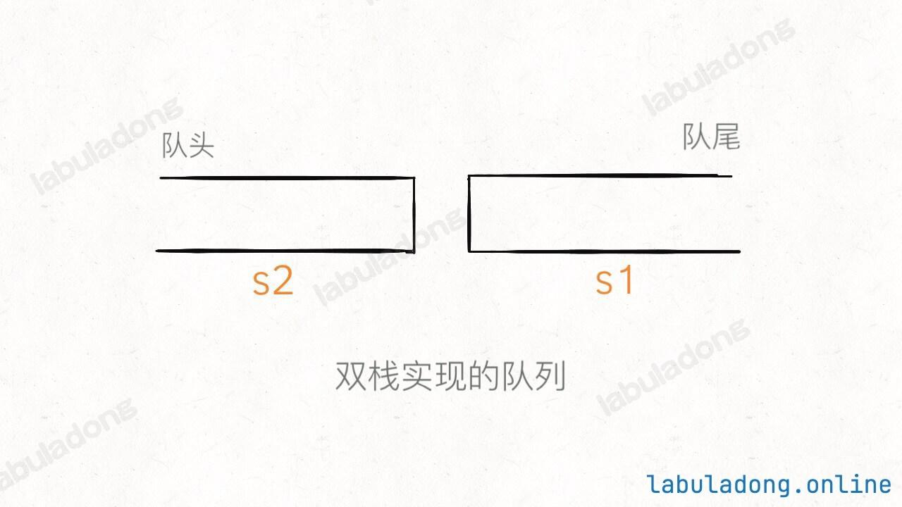
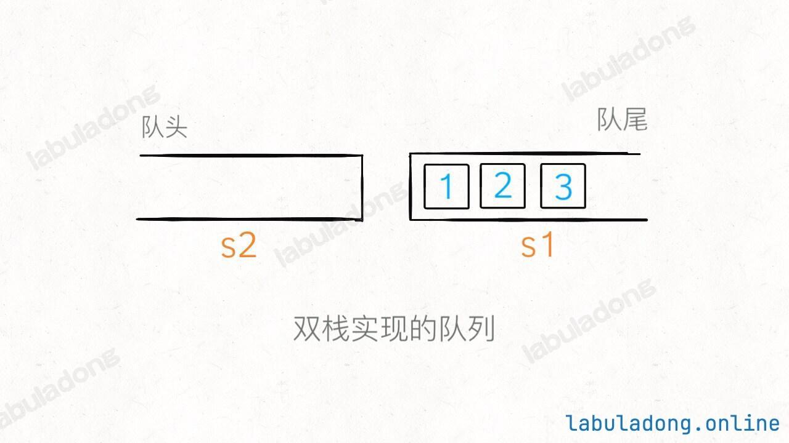
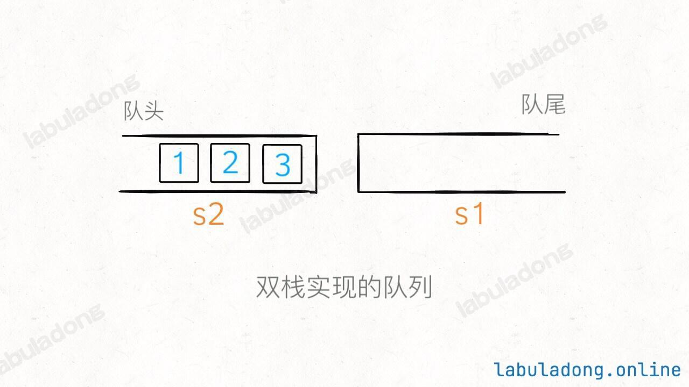
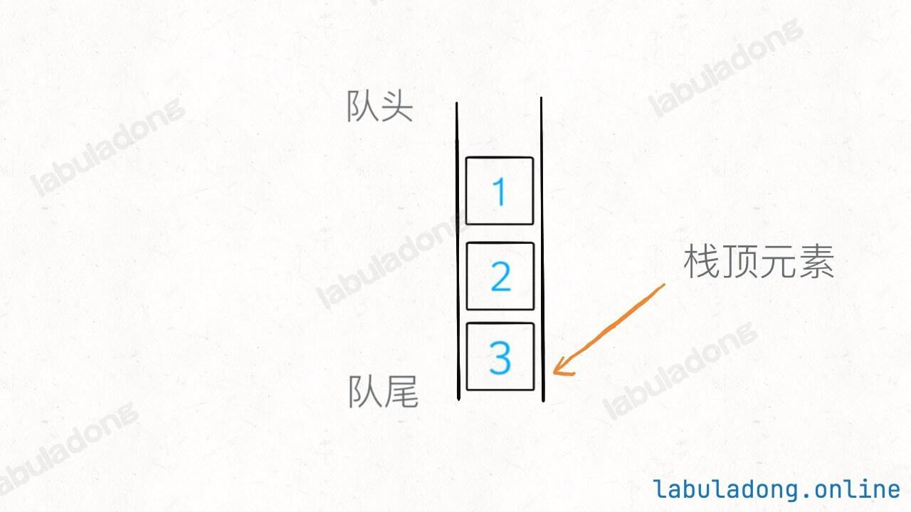
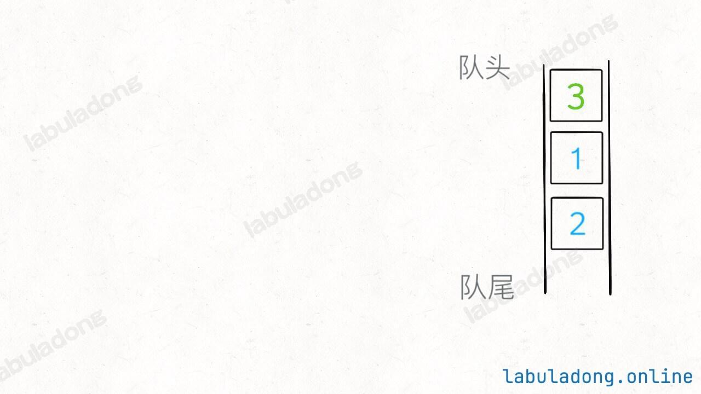

# 队列实现栈以及栈实现队列

本文讲解的例题

|                           LeetCode                           |                             力扣                             | 难度 |
| :----------------------------------------------------------: | :----------------------------------------------------------: | :--: |
| [225. Implement Stack using Queues](https://leetcode.com/problems/implement-stack-using-queues/) | [225. 用队列实现栈](https://leetcode.cn/problems/implement-stack-using-queues/) |  🟢   |
| [232. Implement Queue using Stacks](https://leetcode.com/problems/implement-queue-using-stacks/) | [232. 用栈实现队列](https://leetcode.cn/problems/implement-queue-using-stacks/) |  🟢   |
|                              -                               | [剑指 Offer 09. 用两个栈实现队列](https://leetcode.cn/problems/yong-liang-ge-zhan-shi-xian-dui-lie-lcof/) |  🟢   |

前置知识

阅读本文前，你需要先学习：

- 数组基础
- 链表基础
- 队列基础

队列是一种先进先出的数据结构，栈是一种先进后出的数据结构，形象一点就是这样：


这两种数据结构底层其实都是数组或者链表实现的，只是 API 限定了它们的特性，具体实现可以参见基础知识章节的 队列/栈的原理及实现。

今天来看看如何使用「栈」的特性来实现一个「队列」，如何用「队列」实现一个「栈」。

### 一、用栈实现队列

力扣第 232 题「用栈实现队列」让我们实现的 API 如下：

```go
type MyQueue struct {}

// 添加元素到队尾
func (q *MyQueue) push(x int) {

}

// 删除队头的元素并返回
func (q *MyQueue) pop() int {
    return 0
}

// 返回队头元素
func (q *MyQueue) peek() int {
    
}

// 判断队列是否为空
func (q *MyQueue) empty() bool {
    
}
```

我们使用两个栈 `s1, s2` 就能实现一个队列的功能（这样放置栈可能更容易理解）：



当调用 `push` 让元素入队时，只要把元素压入 `s1` 即可，比如说 `push` 进 3 个元素分别是 1,2,3，那么底层结构就是这样：



那么如果这时候使用 `peek` 查看队头的元素怎么办呢？按道理队头元素应该是 1，但是在 `s1` 中 1 被压在栈底，现在就要轮到 `s2` 起到一个中转的作用了：当 `s2` 为空时，可以把 `s1` 的所有元素取出再添加进 `s2`，**这时候 `s2` 中元素就是先进先出顺序了**：



当 `s2` 中存在元素时，直接调用操作 `s2` 的 `pop` 方法，弹出的就是最先插入的元素，即实现了队列的 `pop` 操作。

完整代码如下：

```go
type MyQueue struct {}

// 添加元素到队尾
func (q *MyQueue) push(x int) {

}

// 删除队头的元素并返回
func (q *MyQueue) pop() int {
    return 0
}

// 返回队头元素
func (q *MyQueue) peek() int {
    
}

// 判断队列是否为空
func (q *MyQueue) empty() bool {
    
}
```

至此，就用栈结构实现了一个队列，核心思想是利用两个栈互相配合。

注意，对于stack2，我们只有在stack2为空的情况下才从stack1转移，如果不为空是不转移的。林妙可，

值得一提的是，这几个操作的时间复杂度是多少呢？

有点意思的是 `peek` 操作，调用它时可能触发 `while` 循环，这样的话时间复杂度是 O(N)，但是大部分情况下 `while` 循环不会被触发，时间复杂度是 O(1)。由于 `pop` 操作调用了 `peek`，它的时间复杂度和 `peek` 相同。

像这种情况，可以说它们的**最坏时间复杂度**是 O(N)，因为包含 `while` 循环，**可能**需要从 `s1` 往 `s2` 搬移元素。

**==但是它们的均摊时间复杂度是 O(1)，这个要这么理解：对于一个元素，最多只可能被搬运一次，也就是说 `peek` 操作平均到每个元素的时间复杂度是 O(1)。==**

关于时间复杂度的分析方法，详见 时空复杂度实用分析方法。

### 二、用队列实现栈

如果说双栈实现队列比较巧妙，那么用队列实现栈就比较简单粗暴了，只需要一个队列作为底层数据结构就能实现了。

力扣第 225 题「用队列实现栈」让我们实现如下 API：

```go
type MyStack struct {
}

// 添加元素到栈顶
func (s *MyStack) Push(x int) {
}

// 删除栈顶的元素并返回
func (s *MyStack) Pop() int {
}

// 返回栈顶元素
func (s *MyStack) Top() int {
}

// 判断栈是否为空
func (s *MyStack) Empty() bool {
}
```

先说 `push` API，直接将元素加入队列，同时记录队尾元素，因为队尾元素相当于栈顶元素，如果要 `top` 查看栈顶元素的话可以直接返回：

```go
import "container/list"

type MyStack struct {
	q        *list.List
	top_elem int
}

// MyStack构造器
func Constructor() MyStack {
	return MyStack{q: list.New()}
}

// 添加元素到栈顶
func (this *MyStack) Push(x int) {
	// x 是队列的队尾，是栈的栈顶
	this.q.PushBack(x)
	this.top_elem = x
}

// 返回栈顶元素
func (this *MyStack) Top() int {
	return this.top_elem
}

// 检查栈是否为空
func (this *MyStack) Empty() bool {
	return this.q.Len() == 0
}
```

我们的底层数据结构是先进先出的队列，每次 `pop` 只能从队头取元素；但是栈是后进先出，也就是说 `pop` API 要从队尾取元素：



解决方法简单粗暴，把队列前面的都取出来再加入队尾，让之前的队尾元素排到队头，这样就可以取出了：



```go
// 为了节约篇幅，省略上文给出的代码部分...

func (this *MyStack) Pop() int {
    size := len(this.q)
    for size > 1 {
        this.q = append(this.q, this.q[0])
        this.q = this.q[1:]
        size--
    }
    // 之前的队尾元素已经到了队头
    poppedElement := this.q[0]
    this.q = this.q[1:]
    return poppedElement
}
```

这样实现还有一点小问题就是，原来的队尾元素被推到队头并删除了，但是 `top_elem` 变量没有更新，我们还需要一点小修改：

```go
// 为了节约篇幅，省略上文给出的代码部分...

// 删除栈顶的元素并返回
func (this *MyStack) Pop() int {
    size := len(this.q)
    // 留下队尾 2 个元素
    for size > 2 {
        this.q = append(this.q, this.q[0])
        this.q = this.q[1:]
        size--
    }
    // 记录新的队尾元素
    top_elem := this.q[0]
    this.q = append(this.q, this.q[0])
    this.q = this.q[1:]
    // 删除之前的队尾元素
    result := this.q[0]
    this.q = this.q[1:]
    return result
}
```

这样就实现完了，完整的代码如下：

```go
type MyStack struct {
    q        []int
    top_elem int
}

// Constructor initializes the stack
func Constructor() MyStack {
    return MyStack{q: []int{}}
}

// 将元素 x 压入栈顶
func (this *MyStack) Push(x int) {
    // x 是队列的队尾，是栈的栈顶
    this.q = append(this.q, x)
    this.top_elem = x
}

// 返回栈顶元素
func (this *MyStack) Top() int {
    return this.top_elem
}

// 删除栈顶的元素并返回
func (this *MyStack) Pop() int {
    size := len(this.q)
    // 留下队尾 2 个元素
    for size > 2 {
        this.q = append(this.q, this.q[0])
        this.q = this.q[1:]
        size--
    }
    // 记录新的队尾元素
    this.top_elem = this.q[0]
    this.q = append(this.q, this.q[0])
    this.q = this.q[1:]
    // 删除之前的队尾元素
    res := this.q[0]
    this.q = this.q[1:]
    return res
}

// 判断栈是否为空
func (this *MyStack) Empty() bool {
    return len(this.q) == 0
}
```

很明显，用队列实现栈的话，`pop` 操作时间复杂度是 O(N)，其他操作都是 O(1)。

个人认为，用队列实现栈是没啥亮点的问题，但是用双栈实现队列是值得学习的。


从栈 `s1` 搬运元素到 `s2` 之后，元素在 `s2` 中就变成了队列的先进先出顺序，这个特性有点类似「负负得正」，确实不太容易想到。
