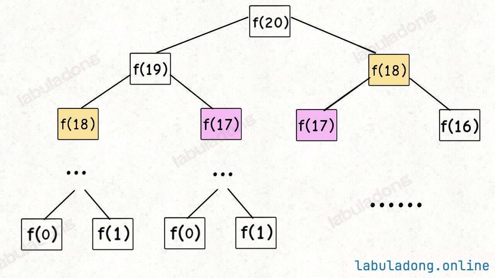
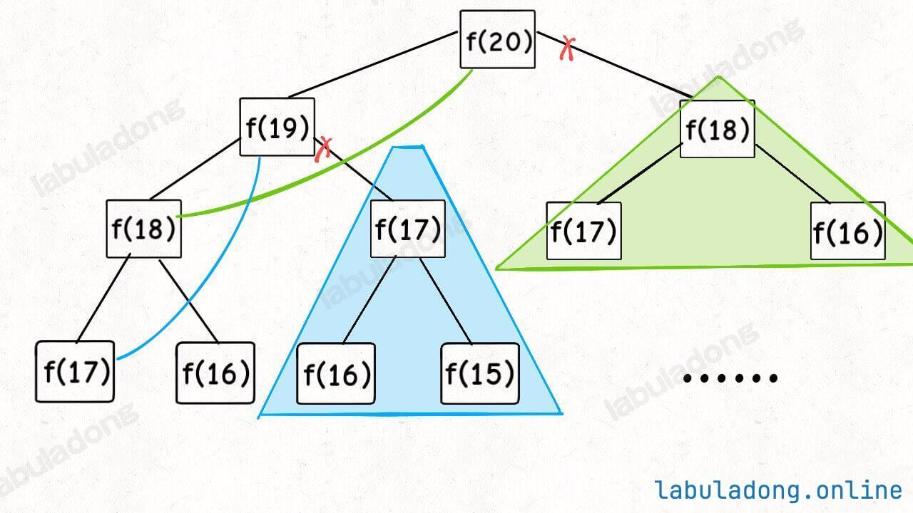
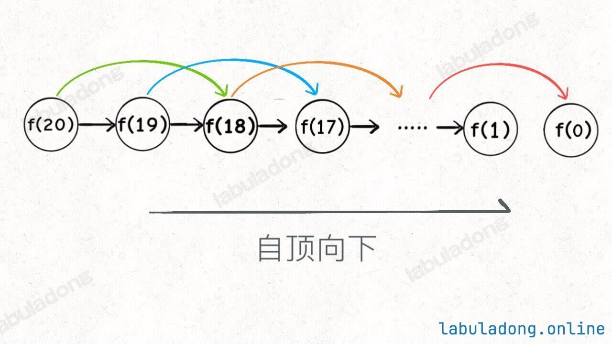
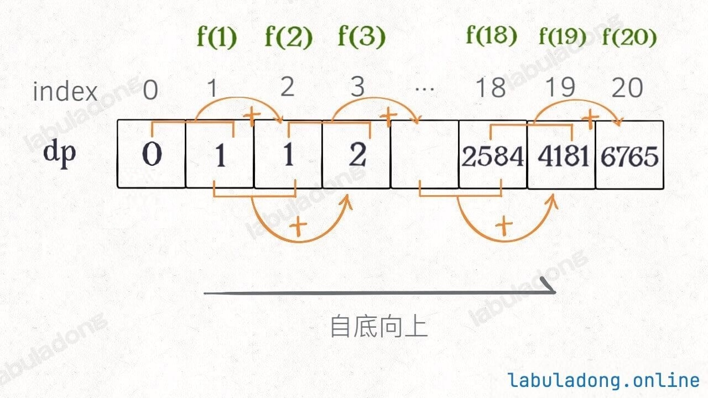
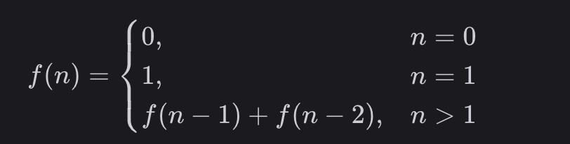
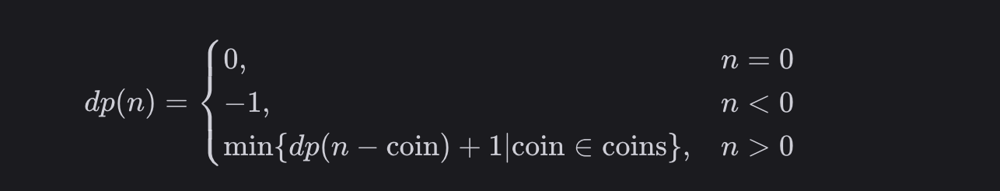
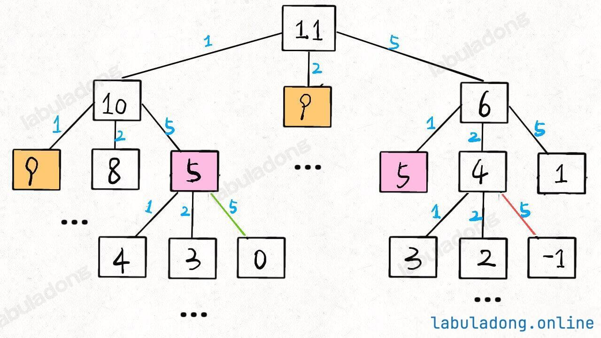
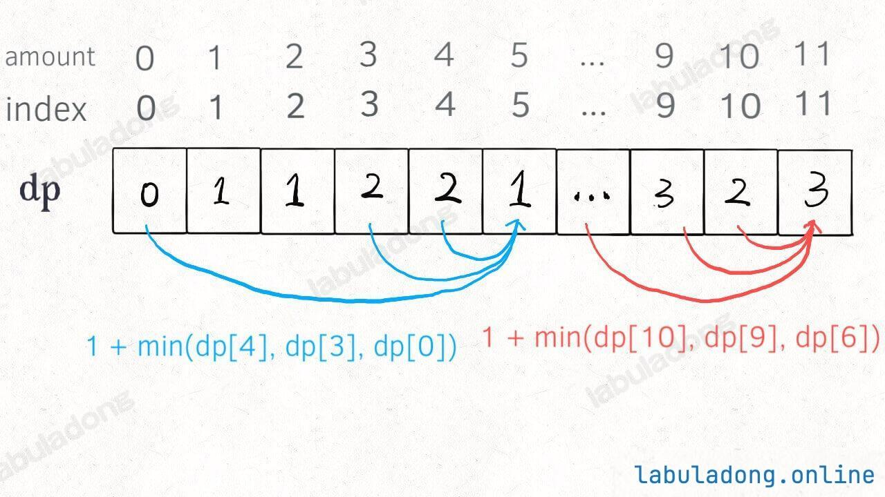

# 26动态规划解题套路框架
读完本文，你不仅学会了算法套路，还可以顺便解决如下题目：

|                           LeetCode                           |                             力扣                             | 难度 |
| :----------------------------------------------------------: | :----------------------------------------------------------: | :--: |
| [509. Fibonacci Number](https://leetcode.com/problems/fibonacci-number/) | [509. 斐波那契数](https://leetcode.cn/problems/fibonacci-number/) |      |
| [70. Climbing Stairs](https://leetcode.com/problems/climbing-stairs/) | [70. 爬楼梯](https://leetcode.cn/problems/climbing-stairs/)  |      |
| [322. Coin Change](https://leetcode.com/problems/coin-change/) |  [322. 零钱兑换](https://leetcode.cn/problems/coin-change/)  |      |

前置知识

阅读本文前，你需要先学习：

- [二叉树的遍历框架](https://labuladong.online/zh/algo/data-structure-basic/binary-tree-traverse-basic/)
- [多叉树结构及遍历框架](https://labuladong.online/zh/algo/data-structure-basic/n-ary-tree-traverse-basic/)

动态规划问题（Dynamic Programming）应该是很多读者头疼的，不过这类问题也是最具有技巧性，最有意思的。本站使用了整整一个章节专门来写这个算法，动态规划的重要性也可见一斑。

本文解决几个问题：动态规划是什么？解决动态规划问题有什么技巧？如何学习动态规划？

刷题刷多了就会发现，算法技巧就那几个套路，我们后续的动态规划系列章节，都在使用本文的解题框架思维，如果你心里有数，就会轻松很多。所以本文放在第一章，希望能够成为解决动态规划问题的一部指导方针，下面上干货。

首先，**动态规划问题的一般形式就是求最值**。动态规划其实是运筹学的一种最优化方法，只不过在计算机问题上应用比较多，比如说让你求最长递增子序列呀，最小编辑距离呀等等。

既然是要求最值，核心问题是什么呢？**求解动态规划的核心问题是穷举**。因为要求最值，肯定要把所有可行的答案穷举出来，然后在其中找最值呗。

动态规划这么简单，就是穷举就完事了？我看到的动态规划问题都很难啊！

首先，虽然动态规划的核心思想就是穷举求最值，但是问题可以千变万化，穷举所有可行解其实并不是一件容易的事，需要你熟练掌握递归思维，只有列出**正确的==「状态转移方程」==**，才能正确地穷举。

**==而且，你需要判断算法问题是否具备「最优子结构」，是否能够通过子问题的最值得到原问题的最值。==**
==**另外，动态规划问题存在「重叠子问题」**==，如果暴力穷举的话效率会很低，==**所以需要你使用「备忘录」或者「DP table」来优化穷举过程，避免不必要的计算。**==

**==以上提到的重叠子问题、最优子结构、状态转移方程就是动态规划三要素==**。具体什么意思等会会举例详解，但是在实际的算法问题中，写出状态转移方程是最困难的，这也就是为什么很多朋友觉得动态规划问题困难的原因，我来提供我总结的一个思维框架，辅助你思考状态转移方程：

==**明确「状态」-> 明确「选择」 -> 定义 `dp` 数组/函数的含义**。==

按上面的套路走，最后的解法代码就会是如下的框架：

```go
# 自顶向下递归的动态规划
def dp(状态1, 状态2, ...):
    for 选择 in 所有可能的选择:
        # 此时的状态已经因为做了选择而改变
        result = 求最值(result, dp(状态1, 状态2, ...))
    return result

# 自底向上迭代的动态规划
# 初始化 base case
dp[0][0][...] = base case
# 进行状态转移
for 状态1 in 状态1的所有取值：
    for 状态2 in 状态2的所有取值：
        for ...
            dp[状态1][状态2][...] = 求最值(选择1，选择2...)
```
下面通过斐波那契数列问题和凑零钱问题来详解动态规划的基本原理。前者主要是让你明白什么是重叠子问题（斐波那契数列没有求最值，所以严格来说不是动态规划问题），后者主要举集中于如何列出状态转移方程。
## 一、斐波那契数列
力扣第 509 题「斐波那契数」就是这个问题，请读者不要嫌弃这个例子简单，**只有简单的例子才能让你把精力充分集中在算法背后的通用思想和技巧上，而不会被那些隐晦的细节问题搞的莫名其妙**。想要困难的例子，接下来的动态规划系列里有的是。
### 暴力递归
斐波那契数列的数学形式就是递归的，写成代码就是这样：
```go
// f(n) 计算第 n 个斐波那契数
func fib(n int) int {
    // base case
    if n == 0 || n == 1 {
        return n
    }
    return fib(n-1) + fib(n-2)
}
```
这里我们按照力扣的题目描述，认为 base case 是 `f(0) = 0` 和 `f(1) = 1`，但在有些斐波那契数列的描述中说 base case 是 `f(1) = 1` 和 `f(2) = 1`，其实它们都是一样的。

学校老师讲递归的时候似乎都是拿这个举例。我们也知道这样写代码虽然简洁易懂，但是十分低效，低效在哪里？假设 `n = 20`，请画出递归树：


这个递归树怎么理解？就是说想要计算原问题 `f(20)`，我就得先计算出子问题 `f(19)` 和 `f(18)`，然后要计算 `f(19)`，我就要先算出子问题 `f(18)` 和 `f(17)`，以此类推。最后遇到 `f(1)` 或者 `f(2)` 的时候，结果已知，就能直接返回结果，递归树不再向下生长了。

**递归算法的时间复杂度怎么计算？就是用子问题个数乘以解决一个子问题需要的时间**。

首先计算子问题个数，即递归树中节点的总数。这棵递归树的高度为 n，所以二叉树的节点总数为 2^n^。因为有n层，相当于求等比数列的和，*S*=1+2+4+...+2^n-1^，2*S*=2+4+8+...+2^n^，2S - S = 2^n^-1。然后计算解决一个子问题的时间，在本算法中，没有循环，只有 `f(n - 1) + f(n - 2)` 一个加法操作，时间为 O(1)。

所以，这个算法的时间复杂度为二者相乘，即 O(2^n^)，指数级别，爆炸。
观察递归树，很明显发现了算法低效的原因：存在大量重复计算。

比如 `f(18)` 被计算了两次，而且你可以看到，**以 `f(18)` 为根的这个递归树体量巨大，多算一遍，会耗费大量的时间。**更何况还不止 `f(18)` 这一个节点被重复计算，所以这个算法效率很差。



这就是动态规划问题的第一个性质：**重叠子问题**。下面，我们想办法解决这个问题。

### 带备忘录的递归解法
即然耗时的原因是重复计算，**==那么我们可以造一个「备忘录」==**，每次算出某个子问题的答案后顺便记到「备忘录」里；每次遇到一个子问题别急着计算，先去「备忘录」里查一查，如果发现之前已经解决过这个问题了，直接把答案拿出来用，不要再耗时去计算了。

对于斐波那契数列问题，我们需要一个备忘录记录子问题 `f(x)` 的值，其中 `x` 是一个非负整数，所以一般用一个一维数组 `memo` 充当备忘录就可以了，让 `memo[x]` 存储子问题 `f(x)` 的返回值。
当然，你也可以用一个哈希表来存储，思想都是一样的。

```go
func fib(n int) int {
    // 备忘录全初始化为 -1
    // 因为斐波那契数肯定是非负整数，所以初始化为特殊值 -1 表示未计算

    // 因为数组的索引从 0 开始，所以需要 n + 1 个空间
    // 这样才能把 `f(0) ~ f(n)` 都记录到 memo 中
    memo := make([]int, n+1)
    for i := range memo {
        memo[i] = -1
    }

    return dp(memo, n)
}

// 带着备忘录进行递归
func dp(memo []int, n int) int {
    // base case
    if n == 0 || n == 1 {
        return n
    }
    // 已经计算过，不用再计算了
    if memo[n] != -1 {
        return memo[n]
    }
    // 在返回结果之前，存入备忘录
    memo[n] = dp(memo, n-1) + dp(memo, n-2)
    return memo[n]
}
```
现在，画出递归树，你就知道「备忘录」到底做了什么。



实际上，带「备忘录」的递归算法，把一棵存在巨量冗余的递归树通过「剪枝」，改造成了一幅不存在冗余的递归图，极大减少了子问题（即递归图中节点）的个数，每个子问题都只会被计算一次：



==**递归算法的时间复杂度怎么计算？就是用子问题个数乘以解决一个子问题需要的时间**。==

子问题个数，即图中节点的总数，由于本算法不存在冗余计算，子问题就是 `f(0)`, `f(1)`, `f(2)` ... `f(20)`，数量和输入规模 `n = 20` 成正比，所以子问题个数为 O(n)。

解决一个子问题的时间，同上，没有什么循环，时间为 O(1)。

所以，本算法的时间复杂度是 O(n)，比起指数级复杂度的暴力算法，已经非常高效了。

### 自顶向下 vs 自底向上
其实如果你只掌握上面的内容，就已经掌握动态规划的解题方法了：无非就是先写出暴力解法，然后用「备忘录」剪枝消除重叠子问题嘛，动态规划就是这么简单。

不过肯定有读者会提问，为什么我见过的很多动态规划解法就是几个 for 循环，好像并不包含递归，也没见到什么备忘录之类的东西，这是怎么回事呢？

实际上，动态规划解法确实有两种表现形式：

第一种是带备忘录的递归解法，或称为「自顶向下」的解法，也就是我们上面展示的，一个递归函数带一个 `memo` 备忘录。

第二种是 **==DP table==** 的迭代解法，或称为「自底向上」的解法，也就是你说的，用 for 循环去迭代 `dp` 数组进行求解。

**这两者的本质是一样的，可以互相转化。迭代解法中的那个 `dp` 数组，就是递归解法中的 `memo` 数组**。
为啥叫「自顶向下」？比如刚才的递归解法，多次点击 `if (n == 0 || n == 1)` 可以看到递归树从上向下生长，从一个规模较大的原问题 `f(5)`，向下逐渐分解规模，直到 `f(0)` 和 `f(1)` 这两个 base case，然后逐层返回答案，这就叫「自顶向下」。

啥叫「自底向上」？就是反过来嘛。我们直接从最底下、最简单、问题规模最小、已知结果的 `f(0)` 和 `f(1)`（base case）开始往上推出 `f(2), f(3)...` 最后推出我们想要的 `f(5)`，这就是「自底向上」。

**其实「自底向上」和「自顶向下」本质是一样的，只是视角不同而已**。

比如我把上面写的带备忘录的递归解法稍微改一改，把对 base case `n == 0 || n == 1` 的处理从递归函数 `dp` 中移到 `memo` 数组中，这应该没问题吧？可以看到，递归树从下向上传递结果的过程，就是 `memo` 数组从 base case 向右推算的过程，这就叫自底向上，是不是很直观？

到这里你应该也观察出来了，其实整个计算过程就是在从左到右计算 `memo` 的值，那又何苦用递归了，搞这么复杂。一个 for 循环是不是就够用了？

### `dp` 数组的迭代（递推）解法
有了上一步的启发，我们不再使用递归函数，直接创建一个数组（DP table），用一个 for 循环从 base case 开始从左到右进行计算即可。
```go
func fib(n int) int {
    if n == 0 || n == 1 {
        return n
    }
    // dp table
    dp := make([]int, n+1)
    // base case
    dp[0], dp[1] = 0, 1
    // 状态转移
    for i := 2; i <= n; i++ {
        dp[i] = dp[i-1] + dp[i-2]
    }

    return dp[n]
}
```
画个图就很好理解了，而且你发现这个 DP table 特别像之前那个「剪枝」后的结果，只是反过来算而已：



实际上，带备忘录的递归解法中的那个「备忘录」`memo` 数组，最终完成后就是这个解法中的 `dp` 数组，你对比一下可视化面板中两个算法执行的过程可以更直观地看出它俩的联系。
所以说自顶向下、自底向上两种解法本质其实是差不多的，大部分情况下，效率也基本相同。

### 拓展延伸
这里，引出「状态转移方程」这个名词，实际上就是描述问题结构的数学形式：



为啥叫「状态转移方程」？其实就是为了听起来高端。

`f(n)` 的函数参数会不断变化，所以你把参数 `n` 想做一个状态，这个状态 `n` 是由状态 `n - 1` 和状态 `n - 2` 转移（相加）而来，这就叫状态转移，仅此而已。

你会发现，上面的几种解法中的所有操作，例如 `return f(n - 1) + f(n - 2)`，`dp[i] = dp[i - 1] + dp[i - 2]`，以及对备忘录或 DP table 的初始化操作，**都是围绕这个方程式的不同表现形式。**

可见列出「状态转移方程」的重要性，它是解决问题的核心，而且很容易发现，**其实状态转移方程直接代表着暴力解法。**

==**千万不要看不起暴力解，动态规划问题最困难的就是写出这个暴力解，即状态转移方程**。==

**==只要写出暴力解，优化方法无非是用备忘录或者 DP table，再无奥妙可言。==**

这个例子的最后，讲一个细节优化。

细心的读者会发现，根据斐波那契数列的状态转移方程，当前状态 `n` 只和之前的 `n-1, n-2` 两个状态有关，其实并不需要那么长的一个 DP table 来存储所有的状态，只要想办法存储之前的两个状态就行了。
所以，可以进一步优化，把空间复杂度降为 O(1)。这也就是我们最常见的计算斐波那契数的算法：

```go
func fib(n int) int {
    if n == 0 || n == 1 {
        // base case
        return n
    }
    // 分别代表 dp[i - 1] 和 dp[i - 2]
    dp_i_1, dp_i_2 := 1, 0
    for i := 2; i <= n; i++ {
        // dp[i] = dp[i - 1] + dp[i - 2];
        dp_i := dp_i_1 + dp_i_2
        // 滚动更新
        dp_i_2 = dp_i_1
        dp_i_1 = dp_i
    }
    return dp_i_1
}
```
这一般是动态规划问题的最后一步优化，**如果我们发现每次状态转移只需要 DP table 中的一部分，那么可以尝试缩小 DP table 的大小，只记录必要的数据，从而降低空间复杂度。**

上述例子就相当于把 DP table 的大小从 `n` 缩小到 2，即把空间复杂度下降了一个量级。我会在后文对动态规划发动降维打击进一步讲解这个压缩空间复杂度的技巧，一般来说用来把一个二维的 DP table 压缩成一维，即把空间复杂度从 O(n^2^) 压缩到 O(n)。

怎么样，这样梳理下来思路是不是清晰了？没想到斐波那契数列这个简单的问题里面还有这么多门道吧？

其实算法的核心思想都是简单朴素的，只是算法题要通过层层包装，把这些核心思想给你隐藏起来。比如你可以做一下 70. 爬楼梯，它看起来是一个场景题，但本质就是考察斐波那契数列。

现在也许有人会问，动态规划的另一个重要特性「最优子结构」，怎么没有涉及？

下面会涉及。斐波那契数列的例子严格来说不算动态规划，因为没有涉及求最值，以上旨在说明重叠子问题的消除方法，演示得到最优解法逐步求精的过程。下面，看第二个例子，凑零钱问题。

## 二、凑零钱问题
这是力扣第 322 题「零钱兑换」：

给你 `k` 种面值的硬币，面值分别为 `c1, c2 ... ck`，每种硬币的数量无限，再给一个总金额 `amount`，问你**最少**需要几枚硬币凑出这个金额，如果不可能凑出，算法返回 -1 。算法的函数签名如下：

```go
// coins 中是可选硬币面值，amount 是目标金额
func coinChange(coins []int, amount int) int {}
```
比如说 `k = 3`，面值分别为 1，2，5，总金额 `amount = 11`。那么最少需要 3 枚硬币凑出，即 11 = 5 + 5 + 1。
你认为计算机应该如何解决这个问题？显然，就是把所有可能的凑硬币方法都穷举出来，然后找找看最少需要多少枚硬币。
### 暴力递归
首先，这个问题是动态规划问题，因为它具有「最优子结构」的。**要符合「最优子结构」，子问题间必须互相独立**。啥叫相互独立？你肯定不想看数学证明，我用一个直观的例子来讲解。

比如说，假设你考试，每门科目的成绩都是互相独立的。你的原问题是考出最高的总成绩，那么你的子问题就是要把语文考到最高，数学考到最高…… 为了每门课考到最高，你要把每门课相应的选择题分数拿到最高，填空题分数拿到最高…… 当然，最终就是你每门课都是满分，这就是最高的总成绩。

得到了正确的结果：最高的总成绩就是总分。因为这个过程符合最优子结构，「每门科目考到最高」这些子问题是互相独立，互不干扰的。

但是，如果加一个条件：你的语文成绩和数学成绩会互相制约，不能同时达到满分，数学分数高，语文分数就会降低，反之亦然。

这样的话，显然你能考到的最高总成绩就达不到总分了，按刚才那个思路就会得到错误的结果。因为「每门科目考到最高」的子问题并不独立，语文数学成绩户互相影响，无法同时最优，所以最优子结构被破坏。

回到凑零钱问题，为什么说它符合最优子结构呢？假设你有面值为 `1, 2, 5` 的硬币，你想求 `amount = 11` 时的最少硬币数（原问题），如果你知道凑出 `amount = 10, 9, 6` 的最少硬币数（子问题），你只需要把子问题的答案加一（再选一枚面值为 `1, 2, 5` 的硬币），求个最小值，就是原问题的答案。因为硬币的数量是没有限制的，所以子问题之间没有相互制，是互相独立的。

那么，既然知道了这是个动态规划问题，就要思考如何列出正确的状态转移方程？

**1、确定「状态」，也就是原问题和子问题中会变化的变量**。由于硬币数量无限，硬币的面额也是题目给定的，只有目标金额会不断地向 base case 靠近，所以唯一的「状态」就是目标金额 `amount`。

**2、确定「选择」，也就是导致「状态」产生变化的行为**。目标金额为什么变化呢，因为你在选择硬币，你每选择一枚硬币，就相当于减少了目标金额。所以说所有硬币的面值，就是你的「选择」。

**3、明确 `dp` 函数/数组的定义**。我们这里讲的是自顶向下的解法，所以会有一个递归的 `dp` 函数，一般来说函数的参数就是状态转移中会变化的量，也就是上面说到的「状态」；函数的返回值就是题目要求我们计算的量。就本题来说，状态只有一个，即「目标金额」，题目要求我们计算凑出目标金额所需的最少硬币数量。
**所以我们可以这样定义 `dp` 函数：`dp(n)` 表示，输入一个目标金额 `n`，返回凑出目标金额 `n` 所需的最少硬币数量**。

那么根据这个定义，我们的最终答案就是 `dp(amount)` 的返回值。
搞清楚上面这几个关键点，解法的伪码就可以写出来了：

```go
// 伪码框架
func coinChange(coins []int, amount int) int {
    // 题目要求的最终结果是 dp(amount)
    return dp(coins, amount)
}

// 定义：要凑出金额 n，至少要 dp(coins, n) 个硬币
func dp(coins []int, n int) int {
    // 初始化为最大值
    res := math.MaxInt32
    
    // 做选择，选择需要硬币最少的那个结果
    for _, coin := range coins {
        res = min(res, 1+subProblem)
    }
    return res
}
```
根据伪码，我们加上 base case 即可得到最终的答案。显然目标金额为 0 时，所需硬币数量为 0；当目标金额小于 0 时，无解，返回 -1：
```go
func coinChange(coins []int, amount int) int {
    // 题目要求的最终结果是 dp(amount)
    return dp(coins, amount)
}

// 定义：要凑出目标金额 amount，至少要 dp(coins, amount) 个硬币
func dp(coins []int, amount int) int {
    // base case
    if amount == 0 {
        return 0
    }
    if amount < 0 {
        return -1
    }

    res := math.MaxInt32
    for _, coin := range coins {
        // 计算子问题的结果
        subProblem := dp(coins, amount - coin)
        // 子问题无解则跳过
        if subProblem == -1 {
            continue
        }
        // 在子问题中选择最优解，然后加一
        res = min(res, subProblem + 1)
    }

    if res == math.MaxInt32 {
        return -1
    }
    return res
}

func min(x, y int) int {
    if x < y {
        return x
    }
    return y
}
```
这里 `coinChange` 和 `dp` 函数的签名完全一样，所以理论上不需要额外写一个 `dp` 函数。但为了后文讲解方便，这里还是另写一个 `dp` 函数来实现主要逻辑。

另外，我经常看到有读者留言问，子问题的结果为什么要加 1（`subProblem + 1`），而不是加硬币金额之类的。我这里统一提示一下，动态规划问题的关键是 `dp` 函数/数组的定义，你这个函数的返回值代表什么？你回过头去搞清楚这一点，然后就知道为什么要给子问题的返回值加 1 了。

至此，状态转移方程其实已经完成了，以上算法已经是暴力解法了，以上代码的数学形式就是状态转移方程：



至此，这个问题其实就解决了，只不过需要消除一下重叠子问题，比如 `amount = 11, coins = {1,2,5}` 时画出递归树看看：



**递归算法的时间复杂度分析：子问题总数 x 解决每个子问题所需的时间**。

子问题总数为递归树的节点个数，但算法会进行剪枝，剪枝的时机和题目给定的具体硬币面额有关，所以可以想象，这棵树生长的并不规则，确切算出树上有多少节点是比较困难的。对于这种情况，我们一般的做法是按照最坏的情况估算一个时间复杂度的上界。

假设目标金额为 `n`，给定的硬币个数为 `k`，那么递归树最坏情况下高度为 `n`（全用面额为 1 的硬币），然后再假设这是一棵满 `k` 叉树，则节点的总数在 `k^n` 这个数量级。
接下来看每个子问题的复杂度，由于每次递归包含一个 for 循环，复杂度为 O(k)，相乘得到总时间复杂度为 

 vvàO(k^n^)，指数级别。

### 带备忘录的递归
类似之前斐波那契数列的例子，只需要稍加修改，就可以通过备忘录消除子问题：
```go
import "math"

func coinChange(coins []int, amount int) int {
    memo := make([]int, amount + 1)
    for i := range memo {
        memo[i] = -666
    }
    // 备忘录初始化为一个不会被取到的特殊值，代表还未被计算
    return dp(coins, amount, memo)
}

func dp(coins []int, amount int, memo []int) int {
    if amount == 0 {
        return 0
    }
    if amount < 0 {
        return -1
    }
    // 查备忘录，防止重复计算
    if memo[amount] != -666 {
        return memo[amount]
    }

    res := math.MaxInt32
    for _, coin := range coins {
        // 计算子问题的结果
        subProblem := dp(coins, amount - coin, memo) 
        // 子问题无解则跳过
        if subProblem == -1 {
            continue
        }
        // 在子问题中选择最优解，然后加一
        res = min(res, subProblem + 1)
    }
    // 把计算结果存入备忘录
    if res == math.MaxInt32 {
        memo[amount] = -1
    } else {
        memo[amount] = res
    }
    return memo[amount]
}
```
不画图了，很显然「备忘录」大大减小了子问题数目，完全消除了子问题的冗余，所以子问题总数不会超过金额数 `n`，即子问题数目为 O(n)。处理一个子问题的时间不变，仍是 O(k)，所以总的时间复杂度是 O(kn)。
### `dp` 数组的迭代解法
当然，我们也可以自底向上使用 dp table 来消除重叠子问题，关于「状态」「选择」和 base case 与之前没有区别，`dp` 数组的定义和刚才 `dp` 函数类似，也是把「状态」，也就是目标金额作为变量。不过 `dp` 函数体现在函数参数，而 `dp` 数组体现在数组索引：

**`dp` 数组的定义：当目标金额为 `i` 时，至少需要 `dp[i]` 枚硬币凑出**。

根据我们文章开头给出的动态规划代码框架可以写出如下解法：

```go
func coinChange(coins []int, amount int) int {
    // 数组大小为 amount + 1，初始值也为 amount + 1
    dp := make([]int, amount+1)
    for i := range dp {
        dp[i] = amount + 1
    }

    // base case
    dp[0] = 0
    // 外层 for 循环在遍历所有状态的所有取值
    for i := 0; i < len(dp); i++ {
        // 内层 for 循环在求所有选择的最小值
        for _, coin := range coins {
            // 子问题无解，跳过
            if i - coin < 0 {
                continue
            }
            dp[i] = min(dp[i], 1 + dp[i - coin]) 
        }
    }
    if dp[amount] == amount+1 {
        return -1
    }
    return dp[amount]
}

func min(a, b int) int {
    if a < b {
        return a
    }
    return b
}
```
为啥 `dp` 数组中的值都初始化为 `amount + 1` 呢，因为凑成 `amount` 金额的硬币数最多只可能等于 `amount`（全用 1 元面值的硬币），所以初始化为 `amount + 1` 就相当于初始化为正无穷，便于后续取最小值。为啥不直接初始化为 int 型的最大值 `Integer.MAX_VALUE` 呢？因为后面有 `dp[i - coin] + 1`，这就会导致整型溢出。



## 三、最后总结
第一个斐波那契数列的问题，解释了如何通过「备忘录」或者「dp table」的方法来优化递归树，并且明确了这两种方法本质上是一样的，只是自顶向下和自底向上的不同而已。

第二个凑零钱的问题，展示了如何流程化确定「状态转移方程」，只要通过状态转移方程写出暴力递归解，剩下的也就是优化递归树，消除重叠子问题而已。
如果你不太了解动态规划，还能看到这里，真得给你鼓掌，相信你已经掌握了这个算法的设计技巧。

**计算机解决问题其实没有任何特殊的技巧，它唯一的解决办法就是穷举**，穷举所有可能性。算法设计无非就是先思考「如何穷举」，然后再追求「如何聪明地穷举」。

列出状态转移方程，就是在解决「如何穷举」的问题。之所以说它难，一是因为很多穷举需要递归实现，二是因为有的问题本身的解空间复杂，不那么容易穷举完整。

备忘录、DP table 就是在追求「如何聪明地穷举」。用空间换时间的思路，是降低时间复杂度的不二法门，除此之外，试问，还能玩出啥花活？

之后我们会有一章专门讲解动态规划问题，如果有任何问题都可以随时回来重读本文，希望读者在阅读每个题目和解法时，多往「状态」和「选择」上靠，才能对这套框架产生自己的理解，运用自如。