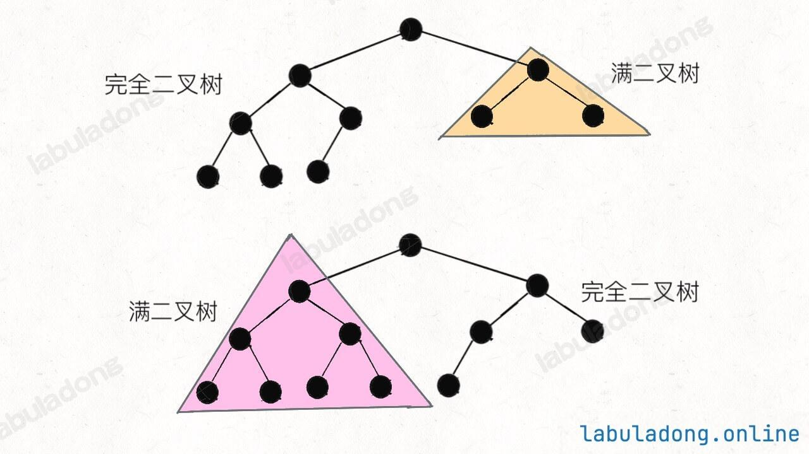

# 二叉树基础及常见类型

前置知识，阅读本文前，你需要先学习：

- 链表（链式存储）基础

**我认为二叉树是==最重要==的基本数据结构，没有之一**。

如果你是初学者，现在这个阶段我很难给你彻底解释清楚得出这个结论的原因，你需要认真学习本站后面的内容才能逐渐理解。我暂且总结两个点：

1、二叉树本身是比较简单的基础数据结构，但是很多复杂的数据结构都是基于二叉树的，比如 红黑树（二叉搜索树）、多叉树、二叉堆、图、字典树、并查集、线段树 等等。你把二叉树玩明白了，这些数据结构都不是问题；如果你不把二叉树搞明白，这些高级数据结构你也很难驾驭。

2、**二叉树不单纯是一种数据结构，更代表着递归的思维方式。一切递归算法，比如 回溯算法、BFS 算法、动态规划 本质上也是把具体问题抽象成树结构，你只要抽象出来了，这些问题最终都回归二叉树的问题。**同样看一段算法代码，在别人眼里是一串文本，每个字都认识，但连起来就不认识了；而在你眼里的代码就是一棵树，想咋改就咋改，咋改都能改对，实在是太简单了。

后面的数据结构章节包含大量关于二叉树的讲解和习题，你按照本站的目录顺序学习，我会带你把二叉树彻底搞懂，到时候你就明白我为什么这么重视二叉树了。

## 几种常见的二叉树

二叉树的主要难点在于做算法题，它本身其实没啥难的，就是这样一种树形结构嘛：

```python
    1
   / \
  2   3
 /   / \
4   5   6
   /     \
  7       8
```

上面就是一棵普通的二叉树，几个术语你要了解一下：

1、每个节点下方直接相连的节点称为**子节点**，上方直接相连的节点称为**父节点**。比方说节点 `3` 的父节点是 `1`，左子节点是 `5`，右子节点是 `6`；节点 `5` 的父节点是 `3`，左子节点是 `7`，没有右子节点。

2、以子节点为根的树称为**子树**。比方说节点 `3` 的左子树是节点 `5` 和 `7` 组成的树，右子树是节点 `6` 和 `8` 组成的树。

3、我们称最上方那个没有父节点的节点 `1` 为**根节点**，称最下层没有子节点的节点 `4`、`7`、`8` 为**叶子节点**。

4、我们称从根节点到最下方叶子节点经过的节点个数为二叉树的最大深度/高度，上面这棵树的最大深度是 `4`，即从根节点 `1` 到叶子节点 `7` 或 `8` 的路径上的节点个数。

没啥别的可说的了，就是这么简单。

有一些稍微特殊一些的二叉树，有他们自己的名字，你要了解一下，后面做题时见到这些专业术语，你就知道题目在说啥了。

### 满二叉树

直接看图比较直观，满二叉树就是每一层节点都是满的，整棵树像一个正三角形：


**满二叉树有个优势，就是它的节点个数很好算**。假设深度为 `h`，那么总节点数就是 `2^h - 1`，等**比数列求和**嘛，我们应该都学过的。

### 完全二叉树

==**完全二叉树是指，二叉树的每一层的节点都紧凑靠左排列，且除了最后一层，其他每层都必须是满的：**==


不难发现，满二叉树其实是一种特殊的完全二叉树。

**完全二叉树的特点：由于它的节点紧凑排列，如果从左到右从上到下对它的每个节点编号，那么父子节点的索引存在明显的规律**。

这个特点在讲到 二叉堆核心原理 和 线段树核心原理 时会用到：完全二叉树可以用数组来存储，不需要真的构建链式节点。

完全二叉树还有个比较难发觉的性质：**完全二叉树的左右子树也是完全二叉树**。

或者更准确地说应该是：**完全二叉树的左右子树中，至少有一棵是满二叉树**。



这个性质在做算法题的时候会用到，比如 巧算完全二叉树的节点数，这里就先提一下。

**中英文的定义有区别**

关于完全二叉树和满二叉树的定义，中文语境和英文语境似乎有点区别。

我们说的完全二叉树对应英文 Complete Binary Tree，这个没问题，说的是同一种树。

我们说的满二叉树，按理说应该翻译成 Full Binary Tree 对吧，但其实不是，满二叉树的定义对应英文的 Perfect Binary Tree。

而英文中的 Full Binary Tree 是指一棵二叉树的所有节点要么没有孩子节点，要么有两个孩子节点。


以上定义出自 wikipedia，这里就是顺便一提。其实名词叫什么都无所谓，你知道有这个区别，在看英文资料时留意一下就行了。

### 二叉搜索树

二叉搜索树（Binary Search Tree，简称 BST）是一种很常见的二叉树，它的定义是：

**==对于树中的每个节点，其左子树的每个节点的值都要小于这个节点的值，右子树的每个节点的值都要大于这个节点的值。你可以简单记为「左小右大」。==**

我把「子树的每个节点」加粗了，这是初学者常犯的错误，**不要只看子节点，而要看整棵子树的所有节点**。

比方说，下面这棵树就是一棵 BST：

```python
    7
   / \
  4   9
 / \   \
1   5   10
```

节点 `7` 的左子树所有节点的值都小于 `7`，右子树所有节点的值都大于 `7`；节点 `4` 的左子树所有节点的值都小于 `4`，右子树所有节点的值都大于 `4`，以此类推。

相反的，下面这棵树就不是 BST：

```python
    7
   / \
  4   9
 / \   \
1   8   10
```

如果你只注意每个节点的左右子节点，似乎看不出问题。你应该看整棵子树，注意看节点 `7` 的左子树中有个节点 `8`，比 `7` 大，这就不符合 BST 的定义了。

**BST 是非常常用的数据结构。因为左小右大的特性，可以让我们在 BST 中快速找到某个节点，或者找到某个范围内的所有节点，这是 BST 的优势所在**。

比方说，对于一棵普通的二叉树，其中的节点大小没有任何规律可言，那么你要找到某个值为 `x` 的节点，只能从根节点开始遍历整棵树。

而对于 BST，你可以先对比根节点和 `x` 的大小关系，如果 `x` 比根节点大，那么根节点的整棵左子树就可以直接排除了，直接从右子树开始找，这样就可以快速定位到值为 `x` 的那个节点。

关于 BST，后面会有专门的章节详细讲解，并且配有大量的习题，这里先讲些基础概念就够你用了。

### 平衡二叉树

平衡二叉树（Balanced Binary Tree）是一种特殊的二叉树，==**它的「每个节点」的左右子树的高度差不超过 1。**==

要注意是每个节点，而不仅仅是根节点。

比如下面这棵二叉树树，根节点 `1` 的左子树高度是 2，右子树高度是 3；节点 `2` 的左子树高度是 1，右子树高度是 0；节点 `3` 的左子树高度是 2，右子树高度是 1，以此类推，每个节点的左右子树高度差都不超过 1，所以这是一棵平衡二叉树：

```python
    1
   / \
  2   3
 /   / \
4   5   6
     \
      7
```

下面这棵树就不是平衡二叉树，因为节点 `2` 的左子树高度是 2，右子树高度是 0，高度差超过 1，不符合条件：

```python
    1
   / \
  2   3
 /   / \
4   5   6
 \   \
  8   7
```

**假设平衡二叉树中共有 N 个节点，那么平衡二叉树的高度是 O(log⁡N)**。这是非常重要的性质，本站后面的章节会讲解几种基于二叉树的数据结构，如果能保证树的高度为 O(log⁡N)，那么这些数据结构的增删查改效率就会很高。

反之，如果树很不平衡，比如这种极端情况：

```python
1
 \
  2
   \
    3
     \
      4
       \
        5
```

那么这棵树其实就等同于单链表，在树中进行增删查改的效率就会大幅降低。

### 自平衡二叉树

上面介绍了平衡二叉树，说到它的高度为 O*(log*N)，增删查改的效率高。

那么我们就可以在增删二叉树节点时，对树的结构进行一些调整，使得树始终是平衡的。这种自平衡的二叉树有很多种，最经典的就是 **红黑树，一种自平衡的二叉搜索树。**

保持树的平衡性，最关键的就是「旋转」操作，下面这个[可视化面板](https://labuladong.online/algo/data-structure-basic/binary-tree-basic/#div_rbtree-rotate-example)展示了红黑树的旋转操作，你可以点击左右旋和左旋的代码，查看旋转的效果：

## 二叉树的实现方式

最常见的二叉树就是类似链表那样的链式存储结构，每个二叉树节点有指向左右子节点的指针，这种方式比较简单直观。

力扣/LeetCode 上给你输入的二叉树一般都是用这种方式构建的，二叉树节点类 `TreeNode` 一般长这样：

```python
class TreeNode:
    def __init__(self, x: int):
        self.val = x
        self.left = None
        self.right = None

# 你可以这样构建一棵二叉树：
root = TreeNode(1)
root.left = TreeNode(2)
root.right = TreeNode(3)
root.left.left = TreeNode(4)
root.right.left = TreeNode(5)
root.right.right = TreeNode(6)

# 构建出来的二叉树是这样的：
#     1
#    / \
#   2   3
#  /   / \
# 4   5   6
```

既然说上面是比较常见的实现方式，那言下之意就是还有其他实现方式，对吧？

是的，在 二叉堆原理及实现 和 并查集算法详解 中，我们会根据具体的需求场景选择用数组来存储二叉树。

在 可视化面板 可视化递归函数时，其实是根据函数堆栈生成的递归树，这也可以算是一种二叉树的实现方式。

另外，在一般的算法题中，我们可能会把实际问题**抽象**成二叉树结构，但我们并不需要真的用 `TreeNode` 创建一棵二叉树出来，而是直接用类似 哈希表 的结构来表示二叉树/多叉树。

比方说上面那棵二叉树：

```python
    1
   / \
  2   3
 /   / \
4   5   6
```

我可以用一个哈希表，其中的键是父节点 id，值是子节点 id 的列表（每个节点的 id 是唯一的），那么一个键值对就是一个多叉树节点了，这棵多叉树就可以表示成这样：

```python
# 1 -> [2, 3]
# 2 -> [4]
# 3 -> [5, 6]

tree = {
    1: [2, 3],
    2: [4],
    3: [5, 6]
}
```

这样就可以模拟和操作二叉树/多叉树结构，后文讲到图论的时候你就会知道，它有一个新的名字叫做 邻接表。