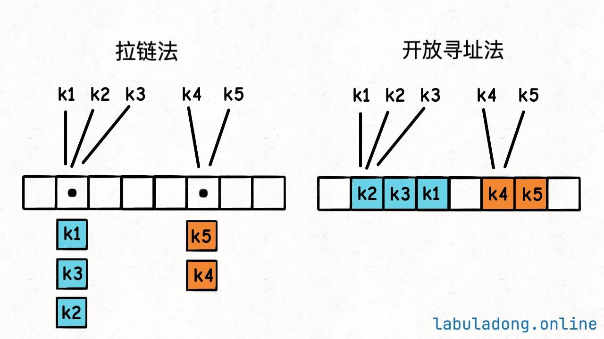

# 用数组加强哈希表（ArrayHashMap）

阅读本文前，你需要先学习：

- 哈希表核心原理

上一章 用链表加强哈希表 我们利用 双链表 对哈希表进行了加强，实现了 `LinkedHashMap` 这种数据结构，让哈希表的键保持插入顺序。

链表能加强哈希表，数组作为链表的好兄弟，其实也能加强哈希表。

## 添加 `randomKey()` API

现在我给你出个题，**让你基于标准哈希表的 API 之上，再添加一个新的 `randomKey()` API，可以在 O(1) 的时间复杂度返回一个随机键：**

```python
interface Map<K, V> {
    // 获取 key 对应的 value，时间复杂度 O(1)
    V get(K key);

    // 添加/修改 key-value 对，时间复杂度 O(1)
    void put(K key, V value);

    // 删除 key-value 对，时间复杂度 O(1)
    void remove(K key);

    // 是否包含 key，时间复杂度 O(1)
    boolean containsKey(K key);

    // 返回所有 key，时间复杂度 O(N)
    List<K> keys();

    // 新增 API：随机返回一个 key，要求时间复杂度 O(1)
    K randomKey();
}
```

**均匀随机（uniform random）**

注意，我们一般说的随机，都是指均匀随机，即每个元素被选中的概率相等。比如你有 `n` 个元素，你的随机算法要保证每个元素被选中的概率都是 `1/n`，才叫均匀随机。

怎么样，你会不会做？不要小看这个简单的需求，实现方法其实是比较巧妙的。

通过前面的学习，你应该知道哈希表的本质就是一个 `table` 数组，现在让你随机返回一个哈希表的键，很容易就会联想到在数组中随机获取一个元素。

在标准数组，随机获取一个元素很简单，只要用随机数生成器生成一个 `[0, size)` 的随机索引，就相当于找了一个随机元素：

```python
import random

def randomeElement(arr: List[int]) -> int:
    # 生成 [0, len(arr)) 的随机索引
    return arr[random.randint(0, len(arr) - 1)]
```

这个算法是正确的，它的复杂度是 O(1)，且每个元素被选中的概率都是 `1/n`，`n` 为 `arr` 数组的总元素个数。

**但你注意，上面这个函数有个前提，就是数组中的元素是紧凑存储==没有空洞的==，比如 `arr = [1, 2, 3, 4]`，这样才能保证任意一个随机索引都对应一个有效的元素。**

如果数组中有空洞就有问题了，比如 `arr = [1, 2, null, 4]`，其中 `arr[2] = null` 代表没有存储元素的空洞，那么如果你生成的随机数恰好是 2，请问你该怎么办？

也许你想说，可以向左或者向右线性查找，找到一个非空的元素返回，类似这样：

```python
// 返回一个非空的随机元素（伪码）
int randomeElement(int[] arr) {
    Random r = new Random();
    // 生成 [0, arr.length) 的随机索引
    int i = r.nextInt(arr.length);
    while (arr[i] == null) {
        // 随机生成的索引 i 恰巧是空洞
        // 借助环形数组技巧向右进行探查
        // 直到找到一个非空元素
        i = (i + 1) % arr.length;
    }
    return arr[i];
}
```

你这样是不行的，这个算法有两个问题：

1、有个循环，最坏时间复杂度上升到了 O*(*N)，不符合 O(1) 的要求。

2、这个算法不是均匀随机的，因为你的查找方向是固定的，空洞右侧的元素被选中的概率会更大。比如 `arr = [1, 2, null, 4]`，元素 `1, 2, 4` 被选中的概率分别是 `1/4, 1/4, 2/4`。

那也许还有个办法，**一次运气不好，就多来随机几次，**直到找到一个非空元素：

```python
// 返回一个非空的随机元素（伪码）
int randomeElement(int[] arr) {
    Random r = new Random();
    // 生成 [0, arr.length) 的随机索引
    int i = r.nextInt(arr.length);
    while (arr[i] == null) {
        // 随机生成的索引 i 恰巧是空洞
        // 重新生成一个随机索引
        i = r.nextInt(arr.length);
    }
    return arr[i];
}
```

现在这个算法是均匀随机的，但问题也非常明显，它的时间复杂度竟然依赖随机数！肯定不是 *O*(1) 的，不符合要求。

怎么样，从一个带有空洞的数组中随机返回一个元素是不是都把你难住了？

别忘了，我们现在的目标是从哈希表中随机返回一个键，**哈希表底层的 `table` 数组不仅包含空洞，情况还会更复杂一些**：



如果你的哈希表用开放寻址法解决哈希冲突，那还好，就是带空洞数组的场景。

**如果你的哈希表用拉链法，那可麻烦了。数组里面的每个元素是一个链表，你光随机一个索引是不够的，还要随机链表中的一个节点。**

而且注意概率，这个拉链法，就算你均匀随机到一个数组索引，又均匀随机该索引存储的链表节点，得到的这个键是均匀随机的么？

其实不是，上图中 `k1, k2, k3` 被随机到的概率是 `1/2 * 1/3 = 1/6`，而 `k4, k5` 被随机到的概率是 `1/2 * 1/2 = 1/4`，这不是均匀随机。

**关于概率算法**

概率算法也是非常有意思的一类问题，无论算法题还是实际业务中都会用到一些经典的随机算法，我会在后文 谈谈游戏中的随机算法 和 带权重的随机选择 中详细讲解，这里暂时不需要掌握。

**唯一的办法就是通过 `keys` 方法遍历整个 `table` 数组，把所有的键都存储到一个数组中，然后再随机返回一个键。但这样复杂度就是 *O*(*N*) 了，还是不符合要求。**

是不是感觉已经走投无路了？所以说，还是要积累一些经典数据结构设计经验，如果面试笔试的时候遇到类似的问题，你现场想恐怕是很难的。下面我就来介绍一下如何用数组加强哈希表，轻松实现 `randomKey()` API。

## 实现思路

其实我前面给你分析拉链法，就是故意误导你的。和 链表加强哈希表 一样，只要你陷入到细节里面，那肯定觉得很复杂。

所以说，不要陷入细节。那什么拉链法线性探查法，只是给你介绍下哈希表的运行原理，了解一下为啥它的复杂度是那样。

**==现在，以及未来做题的时候，你只要记住哈希表是一个能进行键值操作的数据结构，就行了，把它当成一个黑盒，不要去管它的底层实现。==**

紧凑的数组可以随机返回一个元素，现在我们想随机返回哈希表的一个键，那么最简单的方法就是这样：

```python
# 伪码思路
class MyArrayHashMap:
    def __init__(self):
        # arr 数组存储哈希表中所有的 key
        self.arr = []
        self.map = {}

    # 添加/修改 key-value 对，时间复杂度 O(1)
    def put(self, key: int, value: int) -> None:
        if key not in self.map:
            # 新增的 key 加入到 arr 数组中
            self.arr.append(key)
        self.map[key] = value

    # 获取 key 对应的 value，时间复杂度 O(1)
    def get(self, key: int) -> int:
        return self.map[key]

    # 新增 API：随机返回一个 key，要求时间复杂度 O(1)
    def randomKey(self) -> int:
        # 生成 [0, len(arr)) 的随机索引
        return random.choice(self.arr)

    # 删除 key-value 对，时间复杂度 O(1)
    def remove(self, key: int) -> None:
        ...
```

这个思路非常简单，就是用一个数组 `arr` 维护哈希表中所有的键，然后通过随机索引返回一个**键**。这样就能保证均匀随机，且时间复杂度是 *O*(1)。

但你注意，我没有实现哈希表的 `remove` 方法。因为这个方法不仅要删除哈希表 `map` 中的 `key`，还要删除 `arr` 数组中的元素 `key`，**而删除数组中的元素时间复杂度是 *O*(*N*)，因为我们需要搬移数据以保持元素的连续性。**

**那么有没有办法让 `arr` 数组不用搬移数据，还能保持元素的连续性呢**？

==**`O(1)` 时间删除数组中的任意元素**==

**其实可以做到：你可以把待删除的元素，先交换到数组尾部，然后再删除，数组尾部删除元素的时间复杂度是 *O*(1)。**

当然，这样的代价就是数组中的元素顺序会被打乱，但是对于我们当前的场景来说，数组中的元素顺序并不重要，所以打乱了也无所谓。

比如 `arr = [1, 2, 3, 4, 5]`，如果要删除 `2`，我先把 `2` 交换到数组尾部，变成 `arr = [1, 5, 3, 4, 2]`，然后只需花 *O*(1) 的时间即可删除尾部元素 `2`，且数组的连续性不会被破坏。

是不是思路一下就打开了？

**但还有个问题，上面的例子中，你想把元素 `2` 交换到数组尾部，首先你得知道 `2` 在数组中的索引是 1，然后才能通过索引进行交换。**

如何知道一个元素在数组中对应的索引呢？正常来说需要遍历数组寻找目标元素，这样时间复杂度是 O*(*N)。

但是现在不是有哈希表么，键值映射是干啥的？不就是帮你优化这种需要傻乎乎遍历的场景的么？

也就是说，你可以在哈希表中建立==**数组元素到数组索引的映射关系**==，这样就能在 *O*(1) 的时间复杂度内找到数组元素对应的索引了。

好了，讲到这里，整个思路已经比较清晰，下面直接看代码实现吧。

## 代码实现

```python
import random

class Node:
    def __init__(self, key, val):
        self.key = key
        self.val = val

class MyArrayHashMap:
    def __init__(self):
        # 存储 key 和 key 在 arr 中的索引
        self.map = {}
        # 真正存储 key-value 的数组
        self.arr = []

    def get(self, key):
        if key not in self.map:
            return None
        index = self.map[key]
        return self.arr[index].val

    def put(self, key, val):
        if self.containsKey(key):
            # 修改
            i = self.map[key]
            self.arr[i].val = val
            return

        # 新增
        self.arr.append(Node(key, val))
        self.map[key] = len(self.arr) - 1


    def remove(self, key):
        if key not in self.map:
            return
        index = self.map[key]
        node = self.arr[index]

        # 1. 最后一个元素 e 和第 index 个元素 node 换位置
        e = self.arr[-1]
        self.arr[index] = e
        self.arr[-1] = node

        # 2. 修改 map 中 e.key 对应的索引
        self.map[e.key] = index

        # 3. 在数组中删除最后一个元素
        self.arr.pop()

        # 4. 在 map 中删除 node.key
        self.map.pop(node.key)

    # 随机弹出一个键
    def randomKey(self):
        n = len(self.arr)
        randomIndex = random.randint(0, n - 1)
        return self.arr[randomIndex].key

    def containsKey(self, key):
        return key in self.map
    
    def size(self):
        return len(self.map)

if __name__ == '__main__':
    map = MyArrayHashMap()
    map.put(1, 1)
    map.put(2, 2)
    map.put(3, 3)
    map.put(4, 4)
    map.put(5, 5)

    print(map.get(1)) # 1
    print(map.randomKey())

    map.remove(4)
    print(map.randomKey())
    print(map.randomKey())
```

到这里，`ArrayHashMap` 结构就实现完了。如果你想实现 `ArrayHashSet`，只需要简单封装 `ArrayHashMap` 即可，我这里就不写代码了。

## HashMap vs HashSet

`HashMap` 是用来存 **键值对** 的哈希表，
 `HashSet` 是用来存 **不重复元素** 的集合，
 而 `HashSet` 的底层其实就是用一个 `HashMap` 来实现的。

| 特性         | `HashMap<K, V>`              | `HashSet<E>`                     |
| ------------ | ---------------------------- | -------------------------------- |
| 主要用途     | 存储 key-value 对映射关系    | 存储不重复元素                   |
| 是否存 value | 是（key 和 value 都存）      | 否（只有元素，没有显式的 value） |
| 底层结构     | 哈希表（数组 + 链表/红黑树） | 用 `HashMap<E, Object>` 实现     |
| 底层依赖     | 自身结构                     | 依赖 `HashMap`                   |

**HashSet 是怎么用 HashMap 实现的？**

以 Java 为例（Python 中 `set` 和 `dict` 的关系也是类似）：

```java
HashSet<String> set = new HashSet<>();
```

等价于内部维护了一个：

```java
HashMap<String, Object> map;
```

每次往 `set` 中加一个元素，其实是：

```java
map.put(element, DUMMY_VALUE);
```

其中 `DUMMY_VALUE` 是一个固定的、无实际意义的哑对象（常用 `new Object()` 占位）。