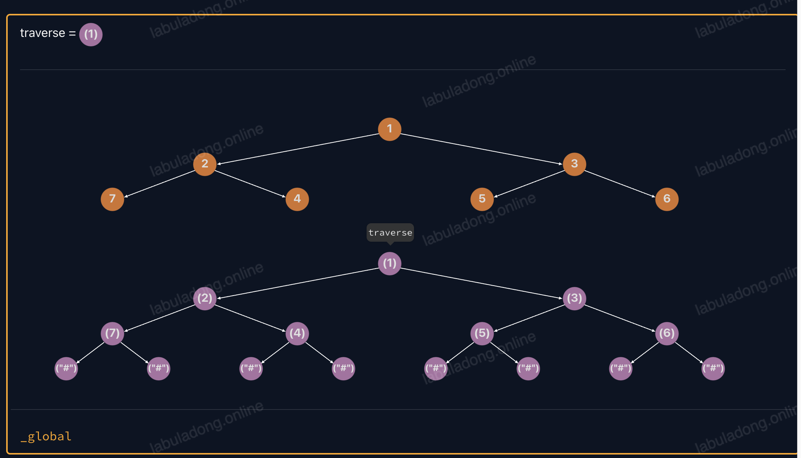

# 二叉树的递归/层序遍历

前置知识

阅读本文前，你需要先学习：

- 二叉树基本概念和几种特殊的二叉树

一句话总结

**==二叉树只有递归遍历和层序遍历这两种==**，再无其他。递归遍历可以衍生出 DFS 算法，层序遍历可以衍生出 BFS 算法。

**递归遍历二叉树节点的顺序是固定的，但是有三个关键位置，在不同位置插入代码，会产生不同的效果。**

**层序遍历二叉树节点的顺序也是固定的，但是有三种不同的写法，对应不同的场景。**

了解了 二叉树基本概念和几种特殊的二叉树，本文来讲解如何遍历和访问二叉树的节点。

二叉树的遍历算法主要分为递归遍历和层序遍历两种，都有代码模板。递归代码模板可以延伸出后面要讲的 DFS 算法、回溯算法，层序代码模板可以延伸出后面要讲的 BFS 算法，所以我经常强调二叉树结构的重要性。

大家熟知的前序遍历、中序遍历、后序遍历，都属于二叉树的递归遍历，只不过是把自定义代码插入到了代码模板的不同位置而已，下面我会结合可视化面板来讲解。

## 递归遍历（DFS）

递归遍历二叉树的代码模板如下：

```python
# 基本的二叉树节点
class TreeNode:
    def __init__(self, val=0, left=None, right=None):
        self.val = val
        self.left = left
        self.right = right

# 二叉树的递归遍历框架
def traverse(root: TreeNode):
    if root is None:
        return
    traverse(root.left)
    traverse(root.right)
```

请问，这段短小精干的代码为什么能遍历二叉树？又是以什么顺序遍历二叉树的？

对于 `traverse` 这样的递归遍历函数，你就可以把它理解成一个在二叉树结构上游走的指针，下面用一个可视化面板直观地展现这个算法的遍历过程。

点开这个可视化面板，右侧 `root` 指针的位置就是 `traverse` 函数遍历到的位置。你可以多次点击 `console.log("enter"` 这一行代码，观察 `root` 指针在树上移动的顺序：

不用着急，你可以多看几遍这个[可视化面板](https://labuladong.online/algo/data-structure-basic/binary-tree-traverse-basic/#div_binary-tree-traverse-example)，直到把 `traverse` 函数遍历二叉树的顺序彻底搞清楚为止。



`traverse` 函数的遍历顺序就是一直往左子节点走，直到遇到空指针不能再走了，才尝试往右子节点走一步；然后再一直尝试往左子节点走，如此循环；如果左右子树都走完了，则返回上一层父节点。

看代码也能看出来，先递归调用的 `root.left`，然后才递归调用的 `root.right`，每次进入 `traverse` 函数，都会先往左子节点递归遍历，直到遇到空指针走不动了，才轮到往右子节点走一次。

那么我们简单拓展一下，如果修改前面的 `traverse` 函数，先递归遍历 `root.right`，再递归遍历 `root.left`，会是什么效果？

```python
// 修改标准的二叉树遍历框架
void traverseFlip(TreeNode root) {
    if (root == null) {
        return;
    }
    // 反过来，先递归遍历右子树，再递归遍历左子树
    traverseFlip(root.right);
    traverseFlip(root.left);
}
```

你可以先脑补一下这个函数遍历二叉树节点的顺序，然后再点开下面的可视化面板，多次点击 `if (root === null)` 这一行代码，观察 `root` 指针在树上移动的顺序，看看和你的设想是否一致：

可以看到 `traverseFlip` 函数也能遍历二叉树的所有节点，只不过和标准的 `traverse` 函数遍历顺序相反。

我举这个 `traverseFlip` 的例子，是想告诉你：

**==递归遍历节点的顺序（即上面可视化面板中 `root` 在树上的移动顺序）仅取决于左右子节点的递归调用顺序，与其他代码无关。==**

我们说二叉树遍历时，一般不会像 `traverseFlip` 这样遍历二叉树，默认还是按照先左后右的顺序，所以当我们说二叉树遍历的代码模板时，指的是先左后右的遍历顺序：

```python
# 基本的二叉树节点
class TreeNode:
    def __init__(self, val=0, left=None, right=None):
        self.val = val
        self.left = left
        self.right = right

# 二叉树的递归遍历框架
def traverse(root: TreeNode):
    if root is None:
        return
    traverse(root.left)
    traverse(root.right)
```

只要这个先左后右的调用顺序不变，那么 `traverse` 函数访问节点的顺序就是固定的，你插入一万行代码进去，也不会变。

有一些数据结构基础的读者可能有点晕了：

不对呀，只要上过大学的数据结构课程，就知道二叉树有前/中/后序三种遍历，会得到三种不同顺序的结果。为啥你这里说递归遍历节点的顺序是固定的呢？

这个问题很好，下面来解答。

### 理解前/中/后序遍历

递归遍历的顺序，即 `traverse` 函数访问节点的顺序确实是固定的。正如可视化面板所示，`root` 指针在树上移动的顺序是固定的：

**但是，你在 `traverse` 函数中不同位置写代码，效果是可以不一样的。前中后序遍历的结果不同，原因是因为你把代码写在了不同位置，所以产生了不同的效果**。

比方说，刚进入一个节点的时候，你还对它的子节点一无所知，而当你要离开一个节点的时候，它的所有子节点你都遍历过了。那么在这两种情况下写的代码，肯定是可以有不同的效果的。

所谓的前中后序遍历，其实就是在二叉树遍历框架的不同位置写代码：

```python
# 二叉树的遍历框架
def traverse(root):
    if root is None:
        return
    # 前序位置
    traverse(root.left)
    # 中序位置
    traverse(root.right)
    # 后序位置
```

**前序位置的代码会在进入节点时立即执行；中序位置的代码会在左子树遍历完成后，遍历右子树之前执行；后序位置的代码会在左右子树遍历完成后执行**：


下面结合可视化代码就能很直观地理解了。

请你点开下面的[可视化面板](https://labuladong.online/algo/data-structure-basic/binary-tree-traverse-basic/#div_btree-preorder-example)，多次点击 `if (root == null)` 这一行代码，可以看到 `root` 指针在树上移动的顺序和刚才一致；节点变绿的顺序，就是**前序遍历**的结果，因为前序位置的代码是刚进入节点时执行的，所以前序遍历的顺序就是 `root` 指针在树上移动的顺序：

**中序位置**的代码是左子树遍历完成后，还未遍历右子树时执行的。请你点开下面的[可视化面板](https://labuladong.online/algo/data-structure-basic/binary-tree-traverse-basic/#div_btree-inorder-example)，多次点击 `if (root == null)` 这一行代码，可以看到 `root` 指针在树上移动的顺序和刚才一致；节点变蓝的顺序，就是中序遍历的结果，你会发现一个节点在它的左子树遍历完时才会变蓝：

**后序位置**的代码是左右子树都遍历完，即将离开节点时执行的。请你点开下面的[可视化面板](https://labuladong.online/algo/data-structure-basic/binary-tree-traverse-basic/#div_btree-postorder-example)，多次点击 `if (root == null)` 这一行代码，可以看到 `root` 指针在树上移动的顺序和刚才一致；节点变红的顺序，就是后序遍历的结果，你会发现一个节点在它的左右子树都遍历完时才会变红：

正确理解前中后序位置非常重要，请你仔细理解上面的可视化面板，做到可以心算任意一棵二叉树的前中后序遍历结果。

**划重点**

**==特别强调，三种位置的关键区别在于执行时机不同。==**

实际的算法题中不会简单的让你计算前中后序的遍历结果，而是需要你把正确的代码写到正确的位置，所以你必须准确理解三个位置的代码产生的不同效果，才能写出准确的代码。

我会在 二叉树算法思想（纲领篇） 和习题中深入探讨二叉树遍历框架的前中后序位置，以及如何运用到回溯算法、动态规划算法中，这里就不展开了。

**==最后一个知识点，二叉搜索树（BST） 的中序遍历结果是有序的，这是 BST 的一个重要性质。==**

可以看这个[可视化面板](https://labu  ladong.online/algo/data-structure-basic/binary-tree-traverse-basic/#div_bst-inorder-example)，点击其中 `res.push(root.val);` 这一行代码，就可以看到中序遍历访问节点的顺序：

在后续 BST 相关习题集 中，会有一些题目利用到这个特性。

## 层序遍历（BFS）

上面讲的递归遍历是依赖函数堆栈递归遍历二叉树的，遍历顺序是从最左侧开始，一列一列地走到最右侧。

二叉树的层序遍历，顾名思义，就是一层一层地遍历二叉树：


层序遍历需要借助队列来实现，而且根据不同的需求，可以有三种不同的写法，下面一一列举。

### 写法一

这是最简单的写法，代码如下：

```python
from collections import deque

def levelOrderTraverse(root):
    if root is None:
        return
    q = deque()
    q.append(root)
    while q:
        cur = q.popleft()
        # 访问 cur 节点
        print(cur.val)

        # 把 cur 的左右子节点加入队列
        if cur.left is not None:
            q.append(cur.left)
        if cur.right is not None:
            q.append(cur.right)
```

你可以打开这个[可视化面板](https://labuladong.online/algo/data-structure-basic/binary-tree-traverse-basic/#div_basic-levelorder1)，点击其中的 `while (q.length > 0)` 这一行代码，观察 `cur` 变量在树上游走的顺序，就可以看到层序遍历是一层一层，从左到右的遍历二叉树节点：

**这种写法的优缺点**

这种写法最大的优势就是简单。每次把队头元素拿出来，然后把它的左右子节点加入队列，就完事了。

**但是这种写法的缺点是，无法知道当前节点在第几层。知道节点的层数是个常见的需求，比方说让你收集每一层的节点，或者计算二叉树的最小深度等等。**

所以这种写法虽然简单，但用的不多，下面介绍的写法会更常见一些。

### 写法二

对上面的解法稍加改造，就得出了下面这种写法：

```python
from collections import deque

def levelOrderTraverse(root):
    if root is None:
        return
    q = deque()
    q.append(root)
    # 记录当前遍历到的层数（根节点视为第 1 层）
    depth = 1

    while q:
        sz = len(q)
        for i in range(sz):
            cur = q.popleft()
            # 访问 cur 节点，同时知道它所在的层数
            print(f"depth = {depth}, val = {cur.val}")

            # 把 cur 的左右子节点加入队列
            if cur.left is not None:
                q.append(cur.left)
            if cur.right is not None:
                q.append(cur.right)
        depth += 1
```

注意代码中的内层 for 循环：

```python
int sz = q.size();
for (int i = 0; i < sz; i++) {
    ...
}
```

这个变量 `i` 记录的是节点 `cur` 是当前层的第几个，大部分算法题中都不会用到这个变量，所以你完全可以改用下面的写法：

```python
int sz = q.size();
while (sz-- > 0) { // java
    ...
}
```

这个属于细节问题，按照自己的喜好来就行。

**但是注意队列的长度 `sz` 一定要在循环开始前保存下来**，因为在循环过程中队列的长度是会变化的，不能直接用 `q.size()` 作为循环条件。

你可以打开这个可视化面板，点击其中的 `console.log` 这一行代码，观察 `cur` 变量在树上游走的顺序，就可以看到还是一层一层，从左到右的遍历二叉树节点，但是这次还会输出节点所在的层数：

这种写法就可以记录下来每个节点所在的层数，可以解决诸如二叉树最小深度这样的问题，是我们最常用的层序遍历写法。

### 写法三

既然写法二是最常见的，为啥还有个写法三呢？因为要给后面的进阶内容做铺垫。

现在我们只是在探讨二叉树的层序遍历，但是二叉树的层序遍历可以衍生出 多叉树的层序遍历，图的 BFS 遍历，以及经典的 BFS 暴力穷举算法框架，所以这里要拓展延伸一下。

**回顾写法二，我们每向下遍历一层，就给 `depth` 加 1，可以理解为每条树枝的权重是 1，二叉树中每个节点的深度，其实就是从根节点到这个节点的路径权重和，且同一层的所有节点，路径权重和都是相同的**。

那么假设，如果每条树枝的权重和可以是任意值，现在让你层序遍历整棵树，打印每个节点的路径权重和，你会怎么做？

这样的话，同一层节点的路径权重和就不一定相同了，写法二这样只维护一个 `depth` 变量就无法满足需求了。

写法三就是为了解决这个问题，在写法一的基础上添加一个 `State` 类，让每个节点自己负责维护自己的路径权重和，代码如下：

```python
class State:
    def __init__(self, node, depth):
        self.node = node
        self.depth = depth

def levelOrderTraverse(root):
    if root is None:
        return
    q = deque()
    # 根节点的路径权重和是 1
    q.append(State(root, 1))

    while q:
        cur = q.popleft()
        # 访问 cur 节点，同时知道它的路径权重和
        print(f"depth = {cur.depth}, val = {cur.node.val}")

        # 把 cur 的左右子节点加入队列
        # 这里把权重固定为1，实际可以调整
        if cur.node.left is not None:
            q.append(State(cur.node.left, cur.depth + 1))
        if cur.node.right is not None:
            q.append(State(cur.node.right, cur.depth + 1))
```

你可以打开这个可视化面板，点击其中的 `console.log` 这一行代码，就可以看到还是一层一层，从左到右的遍历二叉树节点，还会输出节点所在的层数：

**这样每个节点都有了自己的 `depth` 变量，是最灵活的，可以满足所有 BFS 算法的需求**。但是由于要额外定义一个 `State` 类比较麻烦，所以非必要的话，用写法二就够了。

其实你很快就会学到，这种边带有权重的场景属于图结构算法，在之后的 BFS 算法习题集 和 dijkstra 算法 中，才会用到这种写法。

## 其他遍历？

二叉树的遍历方式只有上面两种，也许有其他的写法，但都是表现形式上的差异，本质上不可能跳出上面**两种遍历方式。(递归遍历和层序遍历)**

比方说，你可能看到用栈来迭代遍历二叉树的代码。但这本质还是是递归遍历，只不过他手动维护栈模拟递归调用罢了。

再比如，你还可能看到递归地一层层遍历二叉树的代码。但这本质还是层序遍历，只不过他把层序遍历代码中的 for 循环用递归的形式展现了。

总之，不要被表象迷惑，二叉树的遍历方式就上面两种，结合后面的教程和习题，你把这两种遍历方式玩明白，一切暴力穷举算法都小菜一碟。
