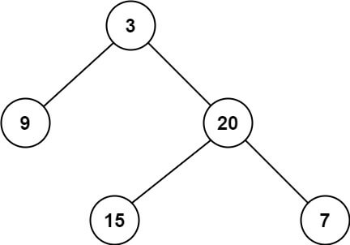

# DFS 和 BFS 的适用场景

前置知识

阅读本文前，你需要先学习：

- 二叉树的递归/层序遍历

在实际的算法问题中，**==DFS 算法常用来穷举所有路径，BFS 算法常用来寻找最短路径==**，这是什么原因呢？

因为二叉树的递归遍历和层序遍历就是最简单的 DFS 算法和 BFS 算法，所以本文就用一道简单的二叉树例题，说明其中的道理。

## 为什么 BFS 常用来寻找最短路径

用可视化面板结合一道例题，你立刻就能明白了。

==**来看力扣第 111 题「二叉树的最小深度」：**==

给定一个二叉树，找出其最小深度。

最小深度是从根节点到最近叶子节点的最短路径上的节点数量。

**说明：**叶子节点是指没有子节点的节点。

**示例 1：**



```
输入：root = [3,9,20,null,null,15,7]
输出：2
```

**示例 2：**

```
输入：root = [2,null,3,null,4,null,5,null,6]
输出：5
```

**提示：**

- 树中节点数的范围在 `[0, 105]` 内
- `-1000 <= Node.val <= 1000`

二叉树的最小深度即「**根节点到最近的叶子节点的距离**」，所以这道题本质上就是让你求最短距离。

DFS 递归遍历和 BFS 层序遍历都可以解决这道题，**先看 DFS 递归遍历的解法：**

```python
class Solution:
    def __init__(self):
        # 记录最小深度（根节点到最近的叶子节点的距离）
        self.minDepthValue = float('inf')
        # 记录当前遍历到的节点深度
        self.currentDepth = 0

    def minDepth(self, root: TreeNode) -> int:
        if root is None:
            return 0

        # 从根节点开始 DFS 遍历
        self.traverse(root)
        return self.minDepthValue

    def traverse(self, root: TreeNode) -> None:
        if root is None:
            return

        # 前序位置进入节点时增加当前深度
        self.currentDepth += 1

        # 如果当前节点是叶子节点，更新最小深度
        if root.left is None and root.right is None:
            self.minDepthValue = min(self.minDepthValue, self.currentDepth)

        self.traverse(root.left)
        self.traverse(root.right)

        # 后序位置离开节点时减少当前深度
        self.currentDepth -= 1
```

你可以点开下面这个[可视化面板](https://labuladong.online/algo/data-structure-basic/use-case-of-dfs-bfs/#div_dfs-find-min-depth)，点击其中 `if (root === null)` 这一行代码，即可看到递归函数 `traverse` 遍历二叉树节点的顺序。形象地说，它是从左到右，一条树枝一条树枝进行遍历的：

每当遍历到一条树枝的叶子节点，就会更新最小深度，**当遍历完整棵树后**，就能算出整棵树的最小深度。

你能不能在不遍历完整棵树的情况下，提前结束算法？不可以，因为你必须确切的知道每条树枝的深度（根节点到叶子节点的距离），才能找到最小的那个。

**下面来看 BFS 层序遍历的解法**。按照 BFS 从上到下逐层遍历二叉树的特点，当遍历到第一个叶子节点时，就能得到最小深度：

```python
class Solution:
    def minDepth(self, root: TreeNode) -> int:
        if root is None:
            return 0
        q = deque([root])
        # root 本身就是一层，depth 初始化为 1
        depth = 1

        while q:
            sz = len(q)
            # 遍历当前层的节点
            for _ in range(sz):
                cur = q.popleft()
                # 判断是否到达叶子结点
                if cur.left is None and cur.right is None:
                    return depth
                # 将下一层节点加入队列
                if cur.left is not None:
                    q.append(cur.left)
                if cur.right is not None:
                    q.append(cur.right)
            # 这里增加步数
            depth += 1
        return depth
```

你可以点开下面这个[可视化面板](https://labuladong.online/algo/data-structure-basic/use-case-of-dfs-bfs/#div_bfs-find-all-path)，点击其中 `if (cur.left === null &&...` 这一行代码，即可看到 BFS 一层一层遍历二叉树节点：

当它遍历到第二行的时候，就遇到第一个叶子节点了，这个叶子节点就是距离根节点最近的叶子节点，所以此时算法就结束了。

点击 `let result =` 这段代码，观察二叉树上节点的颜色，即可直观地看到 BFS 算法并没有遍历整棵树就找到了最小深度。

综上，你应该能理解为啥 BFS 算法经常用来寻找最短路径了：

==**由于 BFS 逐层遍历的逻辑，第一次遇到目标节点时，所经过的路径就是最短路径，算法可能并不需要遍历完所有节点就能提前结束**。==

==**DFS 遍历当然也可以用来寻找最短路径，但必须遍历完所有节点才能得到最短路径。**==

从时间复杂度的角度来看，两种算法在最坏情况下都会遍历所有节点，时间复杂度都是 O*(*N*)，但在一般情况下，显然 BFS 算法的实际效率会更高。所以在寻找最短路径的问题中，BFS 算法是首选。

## 为什么 DFS 常用来寻找所有路径

在寻找所有路径的问题中，你会发现 DFS 算法用的比较多，BFS 算法似乎用的不多。

理论上两种遍历算法都是可以的，只不过 BFS 算法寻找所有路径的代码比较复杂，DFS 算法代码比较简洁。

**你想啊，就以二叉树为例，如果要用 BFS 算法来寻找所有路径（根节点到每个叶子节点都是一条路径），队列里面就不能只放节点了，而需要使用第三种写法，新建一个 `State` 类，把当前节点以及到达当前节点的路径都存进去，这样才能正确维护每个节点的路径，最终计算出所有路径。**

而使用 DFS 算法就简单了，它本就是一条树枝一条树枝从左往右遍历的，每条树枝就是一条路径，所以 **DFS 算法天然适合寻找所有路径。**

最后结合代码和可视化面板讲解一下，先看 [DFS 算法的可视化面板](https://labuladong.online/algo/data-structure-basic/use-case-of-dfs-bfs/#div_dfs-find-all-path)，你可以多次点击 `if (root === null)` 这部分代码，观察 DFS 算法遍历所有节点并收集根节点到叶子节点的所有路径：

再看 [BFS 算法的可视化面板](https://labuladong.online/algo/data-structure-basic/use-case-of-dfs-bfs/#div_bfs-find-all-path)，你可以多次点击 `if (node.left === null &&...` 这部分代码，即可观察 BFS 算法遍历所有节点并收集根节点到叶子节点的所有路径。鼠标移动到下方生成的 bfs 树节点上，可以看到每个 `State` 中存储的路径：

结合可视化面板中的 JavaScript 代码，可以明显感觉 BFS 算法代码要复杂。

综上，DFS 算法在寻找所有路径的问题中更常用，而 BFS 算法在寻找最短路径的问题中更常用。