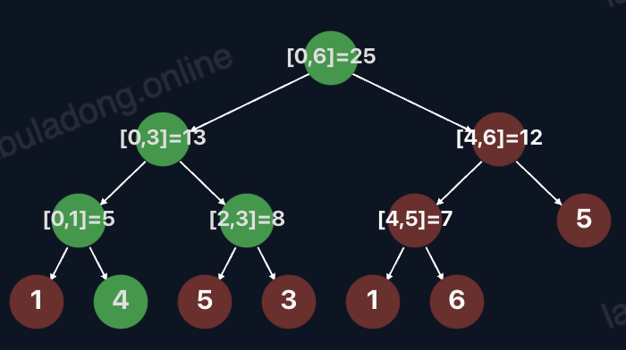

# 线段树核心原理及可视化

前置知识

阅读本文前，你需要先学习：

- 二叉树基础及常见类型
- 二叉树的递归/层序遍历

一句话总结

**线段树是 二叉树结构 的衍生，用于高效解决数组的区间查询和区间动态修改问题。**

线段树可以在 O(log⁡N) 的时间复杂度查询**任意长度**的区间元素聚合值，在 O(log⁡N) 的时间复杂度对**任意长度**的区间元素进行动态修改，其中 N 为数组中的元素个数。

考虑到这是第一章，我并不准备深入讲解线段树的实现细节，具体代码会在后面的数据结构设计章节介绍。不过这里可以借助可视化面板帮你直观感受一下线段树的几种变化。

首先，基本的线段树 包含区间查询 `query` 和**单点修改** `update` 方法，你可以打开这个[可视化面板]()，逐行点击代码，观察 `query` 和 `update` 方法的执行过程：



可以看到这棵二叉树的叶子节点是数组中的元素，非叶子节点就是索引区间（线段）的汇总信息，也就是「线段树」这个名字的由来。

但上面这个线段树有个问题，就是必须输入 `nums` 数组进行构建，如果我们想在一个非常长的区间上进行区间操作，比如 `[0, 10^9]`，那么上来就需要 109109 的空间复杂度构建线段树，这是非常浪费的。

动态线段树的实现 运用「动态开点」技巧优化线段树处理稀疏数据的内存开销。你可以打开这个可视化面板，逐行点击代码，观察线段树的动态构建过程：


上面的实现都只支持「单点更新」，但更通用的需求是区间更新，比如把索引区间 `[i, j]` 的元素都更新为 `val`。懒更新线段树的实现 运用「懒更新」技巧，给线段树新增 `rangeAdd/rangeUpdate` 方法，可以在 O(log⁡N)*O*(log*N*) 时间复杂度内完成**任意长度**的区间更新。

你可以打开这个可视化面板，逐行点击代码，观察懒更新线段树的运行过程，区间更新仅需修改少数几个节点即可完成：


下面我们来介绍线段树的使用场景和核心原理。

## 使用场景

在 选择排序 中，我们会尝试解决一个需求，就是计算 `nums` 数组中从索引 `i` 开始到末尾的最小值。

我们将提出一种使用 `suffixMin` 数组的优化尝试，即提前预计算一个 `suffixMin` 数组，使得 `suffixMin[i] = min(nums[i..])`，这样就可以在 O(1)*O*(1) 时间内查询 `nums[i..]` 的最小值：

```python
int[] nums = new int[]{3, 1, 4, 2};
// suffixMin[i] 表示 nums[i..] 中的最小值
int[] suffixMin = new int[nums.length];

// 从后往前计算 suffixMin
suffixMin[nums.length - 1] = nums[nums.length - 1];
for (int i = nums.length - 2; i >= 0; i--) {
    suffixMin[i] = Math.min(nums[i], suffixMin[i + 1]);
}

// [1, 1, 2, 2]
System.out.println(suffixMin);

// 有了 suffixMin 数组，可以在 O(1) 时间内查询任意 nums[0..i] 后缀的最小值

// 查询 nums[1..] 的最小值
System.out.println(suffixMin[1]); // 1
```

其实这种预计算的思路是非常常见的，不仅是求最小值，求和、求最大值、求乘积等场景，都可以通过预计算数组来优化查询效率。

后面的章节你就会学到，这种技巧可以统一归为 前缀和技巧，主要用于处理区间查询问题。

但这个技巧有它的局限性，即 `nums` 数组本身不能变化。一旦 `nums[i]` 变化了，那么 `suffixMin[0..i]` 的值都会失效，需要 O(N)*O*(*N*) 的时间复杂度重新计算 `suffixMin` 数组。

**对于这种希望对整个区间进行查询，同时支持动态修改元素的场景，是线段树结构的应用场景**。

## 线段树的核心 API

线段树结构可以有多种变体及复杂的优化，我们这里先聚焦最核心的两个 API：


```python
class SegmentTree {
    // 构造函数，给定一个数组，初始化线段树，时间复杂度 O(N)
    // merge 是一个函数，用于定义 query 方法的行为
    // 通过修改这个函数，可以让 query 函数返回区间的元素和、最大值、最小值等
    public SegmentTree(int[] nums, Function<Integer, Integer> merge) {}
    
    // 查询闭区间 [i, j] 的元素和（也可能是最大最小值，取决于 merge 函数），时间复杂度 O(logN)
    public int query(int i, int j) {}
    
    // 更新 nums[i] = val，时间复杂度 O(logN)
    public void update(int i, int val) {}
}
```

类比之前说的 `suffixMin` 数组，假设 `nums` 数组的元素个数为 N*N*：

- `suffixMin[i]` 可以在 O(1)*O*(1) 时间内查询 `nums[i..]` 后缀的最小值；线段树的 `query` 方法不仅可以查询后缀，还可以查询任意 `[i, j]` 区间，时间复杂度均为 O(log⁡N)*O*(log*N*)。
- 当底层 `nums` 数组中的任意元素变化时，需要重新计算 `suffixMin` 数组，时间复杂度为 O(N)*O*(*N*)；而线段树的 `update` 方法可以在 O(log⁡N)*O*(log*N*) 时间内完成元素的修改。

线段树不仅仅支持计算区间的最小值，只要修改 `merge` 函数，就可以支持计算区间元素和、最大值、乘积等。

## 线段树的核心原理

### 树高为什么是 `O(logN)`

在代码实现部分你会看到，最简单的线段树构造方法，是递归地将 `nums` 数组从**正中间**切分，然后递归地将左右子数组构造成线段树，直到区间长度为 1。

由于每次递归构造线段树都是从正中间切分的，左右子树的元素个数基本相同，所以整棵二叉树是平衡的，即树高是 O(log⁡N)*O*(log*N*)，其中 N*N* 是 `nums` 数组的元素个数。

下面的可视化面板创建了一个求区间和的线段树，请你注意树的结构，这是一棵平衡二叉树，其中叶子节点是 `nums` 数组的元素，非叶子节点记录着区间 `[i, j]` 的元素和：


### `query` 为什么是 `O(logN)`

树的高度为 O(log⁡N)*O*(log*N*)，`query` 方法的本质是从根节点开始遍历这棵二叉树，需要遍历的节点个数是是 log⁡Nlog*N* 的常数倍，所以 `query` 方法的时间复杂度是 O(log⁡N)*O*(log*N*)。

如果恰好有一个非叶子节点记录着区间 `[i, j]` 的元素和，那么就可以直接返回；如果没有，`[i, j]` 区间会被分裂成两个子区间，递归查询左右子区间的元素和，然后合并结果。

这里不展开严格的数学证明，结合可视化面板看几个例子就能直观地感受到了。请你点开下面这个可视化面板，`query` 方法会将遍历过的节点标记为绿色。

首先，点击 `sumTree.query(6, 8` 这行代码，可以看到直接命中节点 `[6, 8]`，遍历了不到 `logN` 个节点就得到答案了。

点击 `sumTree.query(1, 5` 这行代码，这次没有直接命中节点，而是在节点 `[0, 5]` 下方发生分裂，遍历的节点总数在 `logN` 和 `2logN` 之间。

最后，点击 `sumTree.query(1, 9` 这行代码，这就是最坏的情况，遍历到两个叶子节点，遍历的节点总数不超过 `4logN`。


综上，`query` 方法遍历的节点总数是 log⁡Nlog*N* 的常数倍，所以时间复杂度是 O(log⁡N)*O*(log*N*)。

### `update` 为什么是 `O(logN)`

数组的元素就是叶子节点，`update` 方法的本质是修改叶子节点的值，顺带会更新从根节点到该叶子节点的路径上的所有非叶子节点的值。因为树高为 O(log⁡N)*O*(log*N*)，所以 `update` 方法的时间复杂度也是 O(log⁡N)*O*(log*N*)。

点开下面的可视化面板，`update` 方法会将遍历过的节点标记为粉红色，你可以逐行点击代码，观察树结构的变化：


上面就是线段树结构的核心原理，具体的实现及优化将安排在后面的数据结构设计章节 基本线段树的代码实现，那时候你应该可以熟练地操作和构造二叉树了，所以线段树的代码会比较容易理解。