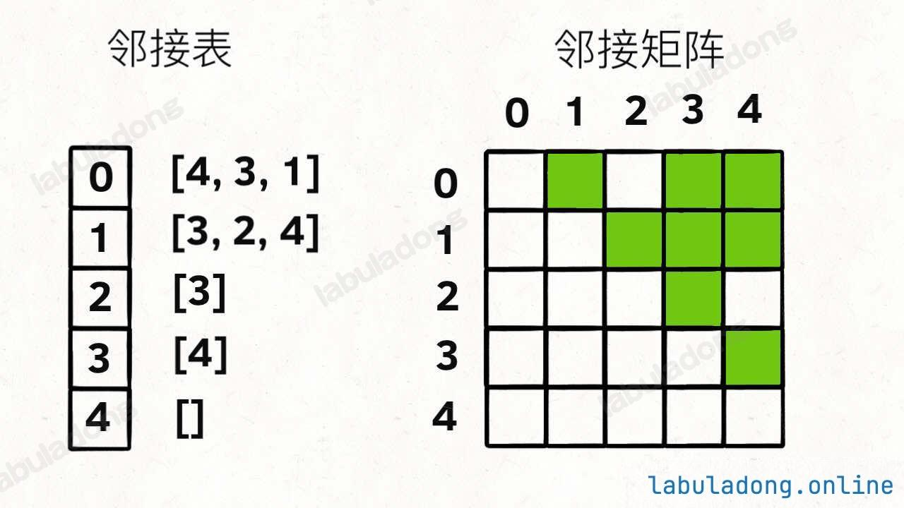
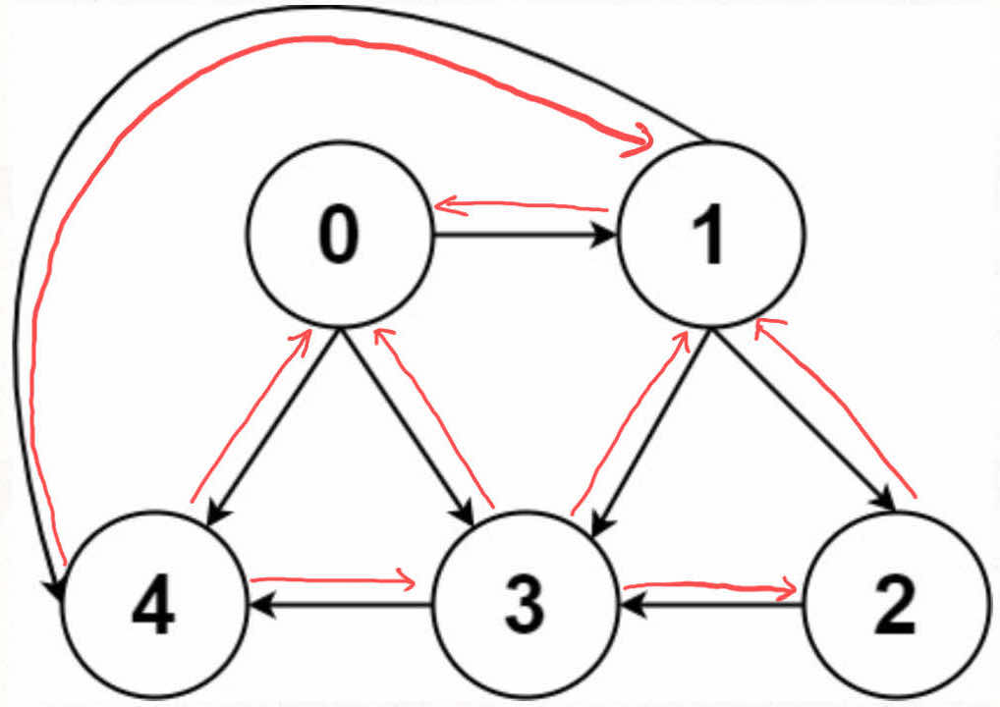

# 图结构基础及通用代码实现

前置知识

阅读本文前，你需要先学习：

- 多叉树的递归/层序遍历

一句话总结

**==图结构就是 多叉树结构 的延伸。图结构逻辑上由若干节点（`Vertex`）和边（`Edge`）构成，我们一般用邻接表、邻接矩阵等方式来存储图。==**

在树结构中，只允许父节点指向子节点，不存在子节点指向父节点的情况，子节点之间也不会互相链接；而图中没有那么多限制，节点之间可以相互指向，形成复杂的网络结构。

可视化面板 支持创建图结构，你可以打开下面的[可视化面板](https://labuladong.online/algo/data-structure-basic/graph-basic/#div_graph-example)，即可看到图的逻辑结构，以及邻接表和邻接矩阵的存储方式：

其实我本来想把图这种数据结构也放到二叉树结构的延伸章节中。不过考虑到图结构特有的算法比较丰富，所以单独开一个章节来讲图结构及算法，也方便本站内容的更新。

因为图结构可以对更复杂的问题进行抽象，所以产生了更复杂的图论算法，比较经典的有 **二分图算法、拓扑排序、最短路径算法、最小生成树算法** 等，这些都会在后文介绍。

本文主要介绍图的基本概念，以及如何用代码实现图结构。

## 图的逻辑结构

一幅图是由**节点 (Vertex)** 和**边 (Edge)** 构成的，逻辑结构如下：


注意看我把「逻辑结构」和「具体实现」分开了。就好比前文 二叉堆的原理和实现 一样，二叉堆的逻辑结构是一棵完全二叉树，但我们实际上用的数组来实现它。

根据这个逻辑结构，我们可以认为每个节点的实现如下：

```python
# 图节点的逻辑结构
class Vertex:
    def __init__(self, id: int):
        self.id = id
        self.neighbors = []
```

看到这个实现，你有没有很熟悉？它和我们之前说的 多叉树节点 几乎完全一样：

```python
# 基本的 N 叉树节点
class TreeNode:
    def __init__(self, val=0, children=None):
        self.val = val
        self.children = children if children is not None else []
```

所以说，图真的没啥高深的，本质上就是个高级点的多叉树而已，适用于树的 DFS/BFS 遍历算法，全部适用于图。

**「度」的概念**

我们这里明确一个图论中特有的**度 (degree)** 的概念。

在无向图中，度就是每个节点相连的边的条数。由于有向图的边有方向，所以有向图中每个节点的度被细分为**入度 (indegree)和出度（outdegree）**，比如下图：


其中节点 `3` 的入度为 3（有三条边指向它），出度为 1（它有 1 条边指向别的节点）。

上面讲解的图结构是「逻辑上的」，具体实现上，我们很少用这个 `Vertex` 类，而是用**邻接表、邻接矩阵**来实现图结构。

## 邻接表和邻接矩阵实现图结构

邻接表和邻接矩阵是图结构的两种实现方法。

比如还是这幅图：


用邻接表和邻接矩阵的存储方式分别如下：



邻接表很直观，我把每个节点 `x` 的邻居都存到一个列表里，然后把 `x` 和这个列表映射起来，这样就可以通过一个节点 `x` 找到它的所有相邻节点。

邻接矩阵则是一个二维布尔数组，我们权且称为 `matrix`，如果节点 `x` 和 `y` 是相连的，那么就把 `matrix[x][y]` 设为 `true`（上图中绿色的方格代表 `true`）。如果想找节点 `x` 的邻居，去扫一圈 `matrix[x][..]` 就行了。

如果用代码的形式来表现，邻接表和邻接矩阵大概长这样：

```python
# 邻接表
# graph[x] 存储 x 的所有邻居节点
graph: List[List[int]] = []

# 邻接矩阵
# matrix[x][y] 记录 x 是否有一条指向 y 的边
matrix: List[List[bool]] = []
```

节点类型不是 int 怎么办

上述讲解中，我默认图节点是一个从 0 开始的整数，所以才能存储到邻接表和邻接矩阵中，通过索引访问。

但实际问题中，图节点可能是其他类型，比如字符串、自定义类等，那应该怎么存储呢？

很简单，你再额外使用一个哈希表，把实际节点和整数 id 映射起来，然后就可以用邻接表和邻接矩阵存储整数 id 了。

**后面的讲解及习题中，我都会默认图节点是整数 id**。

那么，为什么有这两种存储图的方式呢？肯定是因为他们有不同的适用场景。

邻接表和邻接矩阵的使用场景

注意分析两种存储方式的空间复杂度，对于一幅有 `V` 个节点，`E` 条边的图，邻接表的空间复杂度是 O(V+E)*O*(*V*+*E*)，而邻接矩阵的空间复杂度是 O(V2)*O*(*V*2)。

所以如果一幅图的 `E` 远小于 `V^2`（稀疏图），那么邻接表会比邻接矩阵节省空间，反之，如果 `E` 接近 `V^2`（稠密图），二者就差不多了。

在后面的图算法和习题中，大多都是稀疏图，所以你会看到邻接表的使用更多一些。

邻接矩阵的最大优势在于，矩阵是一个强有力的数学工具，图的一些隐晦性质可以借助精妙的矩阵运算展现出来。不过本文不准备引入数学内容，所以有兴趣的读者可以自行搜索学习。

这也是为什么一定要把图节点类型转换成整数 id 的原因，不然的话你怎么用矩阵运算呢？

## 不同种类的图结构

那你可能会问，我们上面说的这个图的模型仅仅是「有向无权图」，不是还有什么加权图，无向图，等等……

**其实，这些更复杂的模型都是基于这个最简单的图衍生出来的**。

**有向加权图怎么实现**？很简单呀：

如果是邻接表，我们不仅仅存储某个节点 `x` 的所有邻居节点，还存储 `x` 到每个邻居的权重，不就实现加权有向图了吗？

如果是邻接矩阵，`matrix[x][y]` 不再是布尔值，而是一个 int 值，0 表示没有连接，其他值表示权重，不就变成加权有向图了吗？

如果用代码的形式来表现，大概长这样：

```python
# 邻接表
# graph[x] 存储 x 的所有邻居节点以及对应的权重
# 具体实现不一定非得这样，可以参考后面的通用实现
class Edge:
    def __init__(self, to: int, weight: int):
        self.to = to
        self.weight = weight

graph: list[list[Edge]] = []

# 邻接矩阵
# matrix[x][y] 记录 x 指向 y 的边的权重，0 表示不相邻
matrix: list[list[int]] = []
```

**无向图怎么实现**？也很简单，所谓的「无向」，是不是等同于「双向」？



如果连接无向图中的节点 `x` 和 `y`，把 `matrix[x][y]` 和 `matrix[y][x]` 都变成 `true` 不就行了；邻接表也是类似的操作，在 `x` 的邻居列表里添加 `y`，同时在 `y` 的邻居列表里添加 `x`。

把上面的技巧合起来，就变成了无向加权图……

好了，关于图的基本介绍就到这里，现在不管来什么乱七八糟的图，你心里应该都有底了。

下面我写一个通用的类，来实现图的基本操作（增删查改）。

## 图结构的通用代码实现

基于上面的讲解，我们可以抽象出一个 `Graph` 接口，来实现图的基本增删查改：

```python
class Graph(ABC):
    @abstractmethod
    def addEdge(self, from_: int, to: int, weight: int):
        # 添加一条边（带权重）
        pass

    @abstractmethod
    def removeEdge(self, from_: int, to: int):
        # 删除一条边
        pass

    @abstractmethod
    def hasEdge(self, from_: int, to: int) -> bool:
        # 判断两个节点是否相邻
        pass

    @abstractmethod
    def weight(self, from_: int, to: int) -> int:
        # 返回一条边的权重
        pass

    @abstractmethod
    def neighbors(self, v: int) -> List[Tuple[int, int]]:
        # 返回某个节点的所有邻居节点和对应权重
        pass

    @abstractmethod
    def size(self) -> int:
        # 返回节点总数
        pass
```

这其实是其实是有向加权图的接口，但基于这个接口可以实现所有不同种类的无向/有向/无权/加权图。下面给出具体代码。

### 有向加权图（邻接表实现）

我这里给出一个简单的通用实现，后文图论算法教程和习题中可能会用到。其中有一些可以优化的点我写在注释中了。

```python
# 加权有向图的通用实现（邻接表）
class WeightedDigraph:
    
    # 存储相邻节点及边的权重
    class Edge:
        def __init__(self, to: int, weight: int):
            self.to = to
            self.weight = weight

    def __init__(self, n: int):
        # 我们这里简单起见，建图时要传入节点总数，这其实可以优化
        # 比如把 graph 设置为 Map<Integer, List<Edge>>，就可以动态添加新节点了
        self.graph = [[] for _ in range(n)]

    # 增，添加一条带权重的有向边，复杂度 O(1)
    def addEdge(self, from_: int, to: int, weight: int):
        self.graph[from_].append(self.Edge(to, weight))

    # 删，删除一条有向边，复杂度 O(V)
    def removeEdge(self, from_: int, to: int):
        self.graph[from_] = [e for e in self.graph[from_] if e.to != to]

    # 查，判断两个节点是否相邻，复杂度 O(V)
    def hasEdge(self, from_: int, to: int) -> bool:
        for e in self.graph[from_]:
            if e.to == to:
                return True
        return False

    # 查，返回一条边的权重，复杂度 O(V)
    def weight(self, from_: int, to: int) -> int:
        for e in self.graph[from_]:
            if e.to == to:
                return e.weight
        raise ValueError("No such edge")
    
    # 上面的 hasEdge、removeEdge、weight 方法遍历 List 的行为是可以优化的
    # 比如用 Map<Integer, Map<Integer, Integer>> 存储邻接表
    # 这样就可以避免遍历 List，复杂度就能降到 O(1)

    # 查，返回某个节点的所有邻居节点，复杂度 O(1)
    def neighbors(self, v: int):
        return self.graph[v]

if __name__ == "__main__":
    graph = WeightedDigraph(3)
    graph.addEdge(0, 1, 1)
    graph.addEdge(1, 2, 2)
    graph.addEdge(2, 0, 3)
    graph.addEdge(2, 1, 4)

    print(graph.hasEdge(0, 1))  # true
    print(graph.hasEdge(1, 0))  # false

    for edge in graph.neighbors(2):
        print(f"{2} -> {edge.to}, weight: {edge.weight}")
    # 2 -> 0, weight: 3
    # 2 -> 1, weight: 4

    graph.removeEdge(0, 1)
    print(graph.hasEdge(0, 1))  # false
```

### 有向加权图（邻接矩阵实现）

没啥可说的，具体看代码和注释吧：

```python
class WeightedDigraph:
    # 存储相邻节点及边的权重
    class Edge:
        def __init__(self, to, weight):
            self.to = to
            self.weight = weight

    def __init__(self, n):
        # 邻接矩阵，matrix[from][to] 存储从节点 from 到节点 to 的边的权重
        # 0 表示没有连接
        self.matrix = [[0] * n for _ in range(n)]

    # 增，添加一条带权重的有向边，复杂度 O(1)
    def addEdge(self, from_node, to, weight):
        self.matrix[from_node][to] = weight

    # 删，删除一条有向边，复杂度 O(1)
    def removeEdge(self, from_node, to):
        self.matrix[from_node][to] = 0

    # 查，判断两个节点是否相邻，复杂度 O(1)
    def hasEdge(self, from_node, to):
        return self.matrix[from_node][to] != 0

    # 查，返回一条边的权重，复杂度 O(1)
    def weight(self, from_node, to):
        return self.matrix[from_node][to]

    # 查，返回某个节点的所有邻居节点，复杂度 O(V)
    def neighbors(self, v):
        res = []
        for i in range(len(self.matrix[v])):
            if self.matrix[v][i] > 0:
                res.append(self.Edge(i, self.matrix[v][i]))
        return res

if __name__ == "__main__":
    graph = WeightedDigraph(3)
    graph.addEdge(0, 1, 1)
    graph.addEdge(1, 2, 2)
    graph.addEdge(2, 0, 3)
    graph.addEdge(2, 1, 4)

    print(graph.hasEdge(0, 1)) # True
    print(graph.hasEdge(1, 0)) # False

    for edge in graph.neighbors(2):
        print(f"{2} -> {edge.to}, weight: {edge.weight}")
    # 2 -> 0, weight: 3
    # 2 -> 1, weight: 4

    graph.removeEdge(0, 1)
    print(graph.hasEdge(0, 1)) # False
```

### 有向无权图（邻接表/邻接矩阵实现）

直接复用上面的 `WeightedDigraph` 类就行，把 `addEdge` 方法的权重参数默认设置为 1 就行了。比较简单，我就不写代码了。

### 无向加权图（邻接表/邻接矩阵实现）

无向加权图就等同于双向的有向加权图，所以直接复用上面用邻接表/领接矩阵实现的 `WeightedDigraph` 类就行了，只是在增加边的时候，要同时添加两条边：

```python
# 无向加权图的通用实现
class WeightedUndigraph:
    def __init__(self, n):
        self.graph = WeightedDigraph(n)

    # 增，添加一条带权重的无向边
    def addEdge(self, frm, to, weight):
        self.graph.addEdge(frm, to, weight)
        self.graph.addEdge(to, frm, weight)

    # 删，删除一条无向边
    def removeEdge(self, frm, to):
        self.graph.removeEdge(frm, to)
        self.graph.removeEdge(to, frm)

    # 查，判断两个节点是否相邻
    def hasEdge(self, frm, to):
        return self.graph.hasEdge(frm, to)

    # 查，返回一条边的权重
    def weight(self, frm, to):
        return self.graph.weight(frm, to)

    # 查，返回某个节点的所有邻居节点
    def neighbors(self, v):
        return self.graph.neighbors(v)

if __name__ == "__main__":
    graph = WeightedUndigraph(3)
    graph.addEdge(0, 1, 1)
    graph.addEdge(1, 2, 2)
    graph.addEdge(2, 0, 3)
    graph.addEdge(2, 1, 4)

    print(graph.hasEdge(0, 1))  # true
    print(graph.hasEdge(1, 0))  # true

    for edge in graph.neighbors(2):
        print(f"{2} <-> {edge.to}, weight: {edge.weight}")
    # 2 <-> 0, weight: 3
    # 2 <-> 1, weight: 4

    graph.removeEdge(0, 1)
    print(graph.hasEdge(0, 1))  # false
    print(graph.hasEdge(1, 0))  # false
```

### 无向无权图（邻接表/邻接矩阵实现）

直接复用上面的 `WeightedUndigraph` 类就行，把 `addEdge` 方法的权重参数默认设置为 1 就行了。比较简单，我就不写代码了。